# 12.5 — Council Decision Architecture

**Document Role:** Architecture specification for collective decision-making within the Part 12 Multi-Agent Collaboration Architecture.
**Owner:** Part 12 Architecture Team
**Source of Truth:** This document, together with `components.md` (Council Manager), `schemas.md` (Council Schema, Vote Schema), `events.md` (Council Events), and `adrs.md` (P12-ADR-003).
**Governing ADR:** P12-ADR-003 — Council-Based Decision Architecture (Accepted, 2026-07-20).

---

## Table of Contents

1. [Purpose & Scope](#1-purpose--scope)
2. [Architectural Position](#2-architectural-position)
3. [Council Taxonomy](#3-council-taxonomy)
4. [Council Creation](#4-council-creation)
5. [Council Lifecycle](#5-council-lifecycle)
6. [Decision Pipeline](#6-decision-pipeline)
7. [Consensus Strategies](#7-consensus-strategies)
8. [Voting Models](#8-voting-models)
9. [Arbitration](#9-arbitration)
10. [Escalation](#10-escalation)
11. [Tie Resolution](#11-tie-resolution)
12. [Expert Councils](#12-expert-councils)
13. [Temporary Councils](#13-temporary-councils)
14. [Persistent Councils](#14-persistent-councils)
15. [Decision Logging](#15-decision-logging)
16. [Decision Replay](#16-decision-replay)
17. [Governance Integration](#17-governance-integration)
18. [Runtime Interaction](#18-runtime-interaction)
19. [Cross-Part & Cross-Document References](#19-cross-part--cross-document-references)

---

## 1. Purpose & Scope

This chapter defines the **Council Decision Architecture**: the structures, protocols, and state machines by which collections of agents reach authoritative, traceable, and enforceable collective decisions. A **Council** is a structured group of agents convened to evaluate, debate, and decide on matters requiring collective judgment (`glossary.md` → *Council*). Its output is a **Council Decision** — an immutable, auditable resolution consumed by the Workflow Engine, Collaboration Manager, and Governance layer (`glossary.md` → *Council Decision*).

### In Scope
- Council establishment, composition, and chartering.
- Council lifecycle and membership state transitions.
- The end-to-end decision pipeline (proposal → deliberation → voting → resolution).
- Consensus strategies, voting models, arbitration, escalation, and tie resolution.
- Council variants: expert, temporary, and persistent.
- Decision logging, decision replay, governance integration, and runtime interaction.

### Out of Scope
- Internal agent reasoning or inference (covered in Parts 6, 10).
- Workflow step execution mechanics (covered in 12.4).
- Shared context storage internals (covered in 12.6).
- Security enforcement primitives in isolation (covered in 12.10).

The Council Decision Architecture is an **architecture-only** specification: it defines components, boundaries, interfaces, and invariants, not implementation code.

---

## 2. Architectural Position

The Council Manager is one of the internal boundary components of Part 12 (`context.md` → *Components Reused From Previous Parts* / *New Components Introduced*). It sits above the Collaboration Manager and Negotiation Engine and below the Governance layer, consuming the Communication Bus for vote collection and the EventBus for publication.

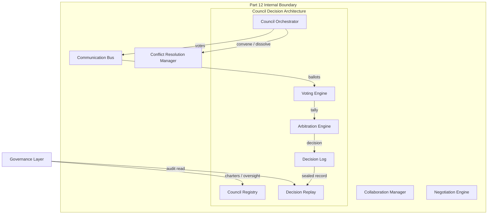

**Design commitments** (per `context.md` → *Collaboration Principles* and *Design Philosophy*):
- **Decisions are auditable facts.** Every council act is an event; the log is reconstructable from events alone.
- **Expertise is weighted.** Per P12-ADR-003, voting is weighted by capability confidence, historical performance, and domain expertise.
- **Human oversight is mandatory** for critical decisions via escalation to FinalJudge (ADR-006).
- **No duplicated logic.** The Council Manager delegates voting algorithms to the Hermes Kernel `CouncilManager` (ADR-003).

---

## 3. Council Taxonomy

Councils are classified along two orthogonal axes: **durability** and **composition basis**.

| Axis | Values | Description |
|------|--------|-------------|
| Durability | `temporary`, `persistent` | Whether the council dissolves after its mandate or persists across sessions. |
| Composition | `general`, `expert` | Whether membership is general-purpose or drawn from a domain-expert roster. |

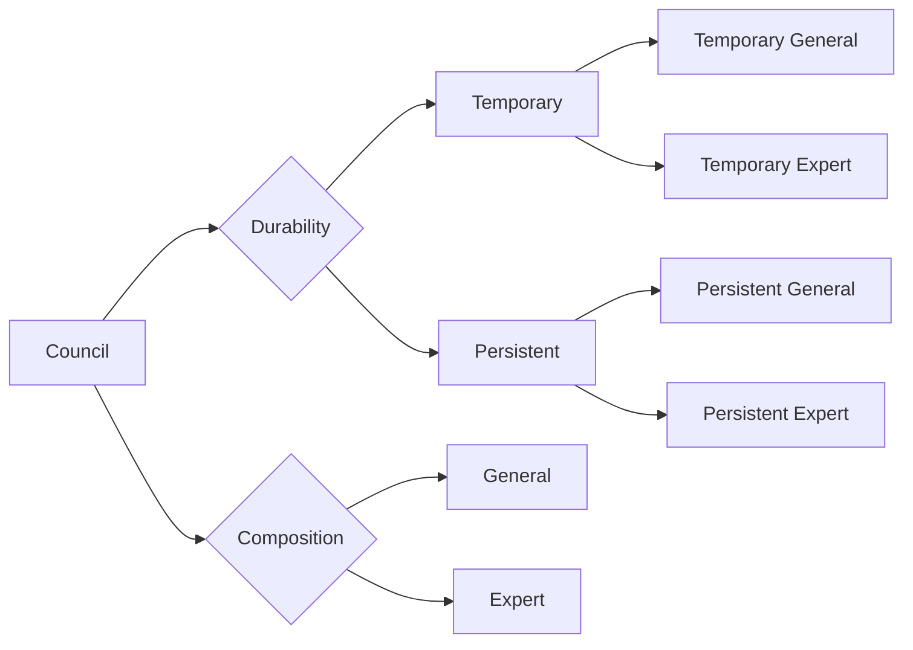

Sections 12–14 detail the variants.

---

## 4. Council Creation

Council creation is the act of chartering a Council: defining its mandate, scope, membership rules, voting protocol, and quorum. Creation is authorized and schema-validated before a CouncilId is minted.

### 4.1 Creation Triggers
A council MAY be created by any of the following authorized principals:
- **Governance layer** — standing or policy-mandated councils.
- **Delegation Manager / Workflow Manager** — ad-hoc councils for contested delegation or workflow decisions.
- **Conflict Resolution Manager** — escalation of an unresolvable conflict (ADR: Conflict Resolution → Council).
- **Council Manager** — sub-council or committee formation for large deliberative bodies.

### 4.2 Creation Contract

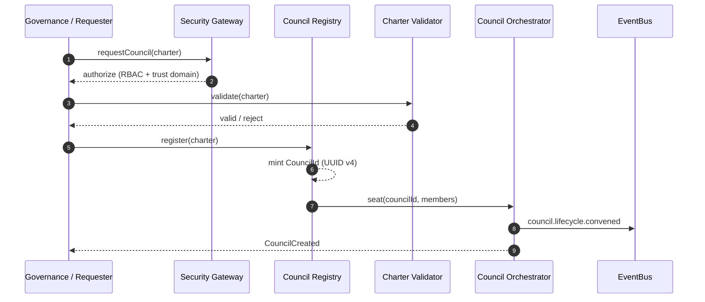

### 4.3 Charter Requirements
A valid charter MUST satisfy the Council Schema (`schemas.md` → *Council Schema*):
- `councilId` (UUID v4), `name`, `version` (semver), `members[]`, `votingProtocol`, `quorum`, `status`, `createdAt`, `updatedAt`.
- `votingProtocol` ∈ {`simple_majority`, `supermajority`, `unanimous`, `weighted`, `consensus`}.
- `quorum` MUST be consistent with the chosen protocol (e.g., a `weighted` protocol requires `minimumCount` and `minimumWeight`).
- Members MUST be validated against the **Agent Directory** for eligibility, liveness, and trust level (`components.md` → *Council Manager* → Inputs).

### 4.4 Membership Seating
- Each member carries a `weight` (default `1.0`). Per P12-ADR-003, weights MUST NOT be self-asserted; they are derived from capability confidence, historical performance, and domain expertise, verified through the **Trust Score** mechanism (P12-ADR-002).
- A member MAY hold a `role` (`chair`, `member`, `observer`, `arbiter`) governing voting rights and seat lifecycle (`events.md` → `council.seat.granted`).

---

## 5. Council Lifecycle

The Council Manager drives a council through explicit, auditable states. State transitions emit events and are replayable from the Decision Log.

### 5.1 State Machine

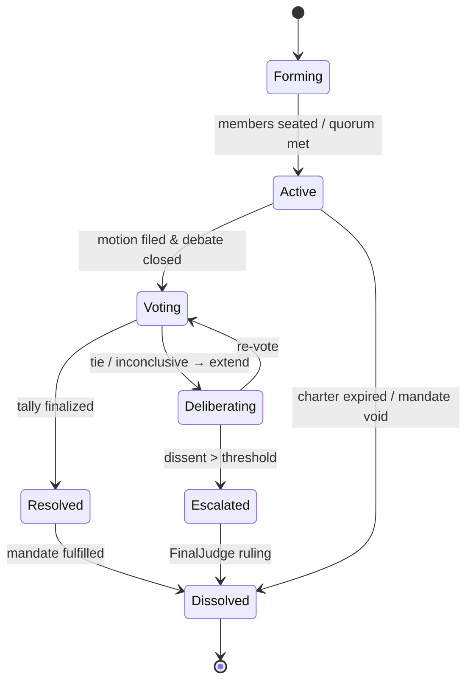

### 5.2 Lifecycle States

| State | Entry Condition | Exit Condition |
|-------|-----------------|----------------|
| `forming` | Charter registered; members being seated. | Quorum satisfied and sufficient members present. |
| `active` | Quorum met; council open for motions. | A motion is filed and debate closes (enters `voting`) or charter expires. |
| `voting` | Vote session open; ballots collected. | Tally finalized (`resolved`) or inconclusive (`deliberating`). |
| `deliberating` | Inconclusive vote; information gathering extended. | Re-vote initiated or escalation triggered. |
| `resolved` | Decision published; enforcement initiated. | Mandate fulfilled → `dissolved`. |
| `escalated` | Dissent exceeds threshold; routed to FinalJudge. | Ruling received → `dissolved`. |
| `dissolved` | Mandate terminated; state archived. | Terminal. |

### 5.3 Lifecycle Events
`council.lifecycle.convened` (entry), `council.seat.granted` / `council.seat.revoked`, `council.quorum.lost`, and `council.lifecycle.dissolved` (exit) are defined in `events.md` §7. Quorum loss mid-session emits `council.quorum.lost` (P0) and triggers an emergency save (`components.md` → *Council Manager* → Failure Modes).

---

## 6. Decision Pipeline

The decision pipeline is the canonical sequence by which a motion becomes a binding Council Decision. It is the realization of the four phases in P12-ADR-003: Proposal, Deliberation, Voting, Escalation.

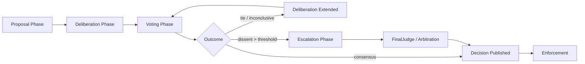

### 6.1 Pipeline Stages
1. **Proposal Phase** — A member, Workflow Manager, or user-side assistant files a `council.motion.filed` (`events.md` §7.1). Proposals are schema-validated and confidentiality-scoped.
2. **Deliberation Phase** — `council.debate.opened` → ordered `council.debate.turn` utterances → `council.debate.closed`. Deliberation is event-based and replayable (P12-ADR-003 trade-off: observability over low latency).
3. **Voting Phase** — `council.vote.cast` ballots are collected per `council_session_id + motion_id`, tallied by the Voting Engine, optionally with `council.vote.recalled` for procedural correction.
4. **Resolution** — `council.decision.published` seals the decision with a cryptographic council seal (`events.md` §7.7).
5. **Escalation** (conditional) — when inconclusive or over-threshold dissent occurs (Section 10).

### 6.2 Proposal-to-Decision Latency
Per P12-ADR-003: ~100 ms (simple) to ~10 s (with deliberation), up to ~30 s (with escalation).

---

## 7. Consensus Strategies

A **Consensus Strategy** binds a voting protocol, a quorum rule, and a resolution rule into a coherent decision method. The strategy is selected at charter time and recorded in the Council Schema.

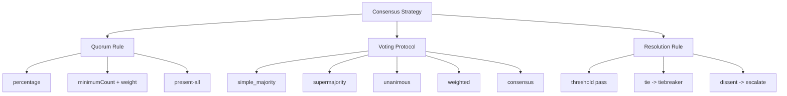

| Strategy | Quorum | Resolution Rule | Use Case |
|----------|--------|-----------------|----------|
| Simple Majority | ≥50% present | >50% of votes approve | Routine operational choices. |
| Supermajority | ≥50% present | ≥67% (configurable) approve | High-impact policy changes. |
| Unanimous | All eligible present | 100% approve (abstain ≠ reject per charter) | Irreversible or trust-critical acts. |
| Weighted | `minimumCount` & `minimumWeight` | Weighted sum ≥ threshold | Expertise-sensitive decisions (P12-ADR-003 default). |
| Consensus | Present-all, no sustained objection | No unresolved objection after deliberation | Collaborative synthesis where buy-in matters. |

Consensus does not imply unanimity unless the charter explicitly requires it (`glossary.md` → *Consensus*).

---

## 8. Voting Models

The Voting Engine delegates tally computation to the Hermes Kernel `CouncilManager` (ADR-003), which provides MAJORITY, UNANIMOUS, and WEIGHTED algorithms. Part 12 maps its five protocols onto these kernels.

### 8.1 Vote Model
Each ballot conforms to the Vote Schema (`schemas.md` → *Vote Schema*):
- `voteId`, `councilId`, `agentId`, `voteType` ∈ {`approve`, `reject`, `abstain`, `conditional_approve`, `conditional_reject`}.
- `weight` (default `1.0`), `reasoning`, `conditions[]`, `timestamp`, `signature` (non-repudiation).

### 8.2 Weighted Tally Algorithm

```mermaid
flowchart TD
    S[Collect ballots] --> V[Validate signatures]
    V --> W[Multiply approve/reject by member weight]
    W --> T[Sum weighted approve A, reject R]
    T --> Q{Quorum met?}
    Q -->|no| F[QuorumFailed]
    Q -->|yes| C{weighted approve >= minimumWeight?}
    C -->|yes| P[Approved]
    C -->|no| D{dissent R/(A+R) > escalateThreshold?}
    D -->|yes| E[Escalate]
    D -->|no| X[Tie / Inconclusive -> Deliberate]
```

### 8.3 Proxy & Conditional Voting
- **Proxy voting** — permitted only when `allowProxyVoting` is enabled; a delegation token with time bounds is required (`components.md` → *Council Manager* → Security). The Vote Schema `metadata.delegateFor` records the proxy chain.
- **Conditional votes** — `conditional_approve` / `conditional_reject` carry `conditions[]`; the Decision Enforcer evaluates conditions before enforcement (Section 18).

### 8.4 Performance
Vote tally latency p99 < 200 ms for councils up to 100 members; up to 1,000 participating agents per session (P12-ADR-003).

---

## 9. Arbitration

**Arbitration** is the structured resolution of an contested or deadlocked decision by a designated neutral authority — the `arbiter` role or the Arbitration Engine — without necessarily escalating outside the council system.

### 9.1 Arbitration Triggers
- Tie that cannot be resolved by the charter tiebreaker (Section 11).
- Procedural irregularity (e.g., vote tampering, quorum violation) invalidating a tally.
- Conflicting motions where independent majorities emerge.

### 9.2 Arbitration Flow

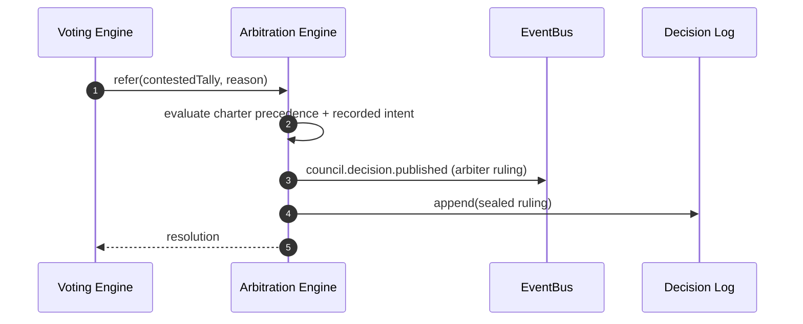

The arbiter's ruling is sealed and signed; it carries the same immutability and audit properties as any Council Decision (`events.md` §7.7). Arbitration is bounded: if the arbiter cannot resolve within the `voteTimeoutMs` window, the matter escalates (Section 10).

---

## 10. Escalation

**Escalation** routes a decision beyond the council to an external authority — the Hermes Kernel **FinalJudge** (human oversight, ADR-006) — when the council cannot resolve it autonomously.

### 10.1 Escalation Triggers
- Dissent ratio exceeds the configured escalation threshold (P12-ADR-003 phase 4).
- Quorum cannot be achieved and quorum-relaxation policy fails.
- Security- or safety-critical proposal blocked by veto or unresolved conflict.
- Arbitration Engine declines or times out.

### 10.2 Escalation Path

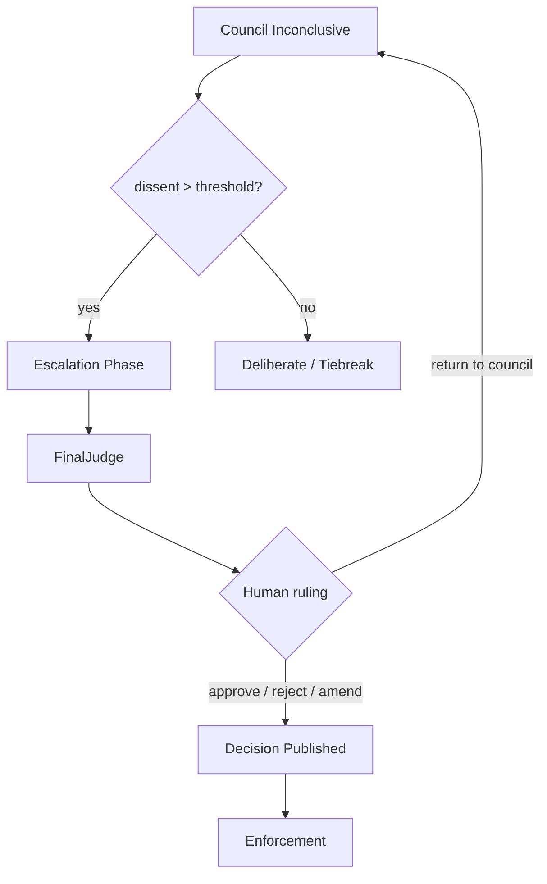

Escalation overload is a recognized risk (P12-ADR-003 Risks): trivial items MUST be filtered by escalation thresholds to protect FinalJudge capacity.

---

## 11. Tie Resolution

A **tie** occurs when no resolution rule is satisfied (e.g., equal weighted approve/reject, or abstentions producing no supermajority). Tie resolution is deterministic and charter-defined.

### 11.1 Tiebreak Hierarchy
1. **Charter tiebreaker** — explicit rule in the council charter (e.g., chair casts deciding vote, or status quo prevails).
2. **Weighted priority** — if weights are equal, a deterministic `agentId` ordering breaks the tie (no randomness; reproducible on replay).
3. **Arbitration** — refer to the `arbiter` role (Section 9).
4. **Escalation** — if arbitration is unsuitable, escalate to FinalJudge (Section 10).

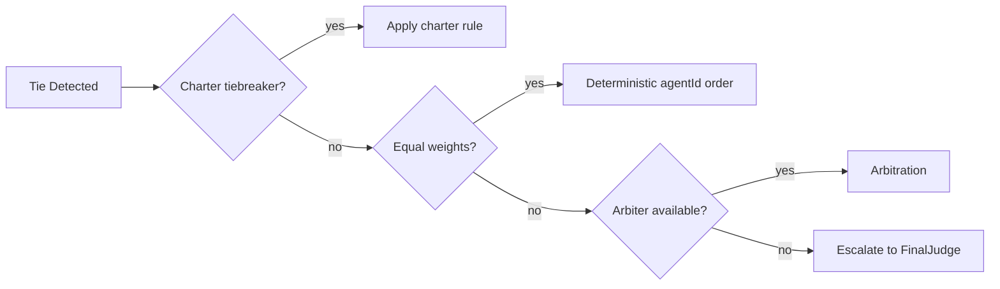

Tie resolution MUST be reproducible: given the same ballot set and charter, the outcome is identical on replay (Section 16). Determinism is a runtime invariant (12.12).

---

## 12. Expert Councils

An **Expert Council** is composed from a domain-expert roster, with membership and weights derived from declared expertise and verified capability confidence.

### 12.1 Composition
- Members are selected via the **Capability Registry** and **Agent Directory** filtered by domain expertise (`components.md` → *Capability Registry*).
- Weights are amplified by domain relevance (P12-ADR-003 weights = capability confidence × historical performance × domain expertise).
- Roles such as `lead-validator` or `moderator` may be assigned per `glossary.md` → *Agent Role*.

### 12.2 Examples
- **Security Review Council** — evaluates tool-access requests and risk assessments.
- **Quality Assurance Council** — reviews output quality and approves releases.
- **Ethics Oversight Council** — evaluates proposals for governance alignment.

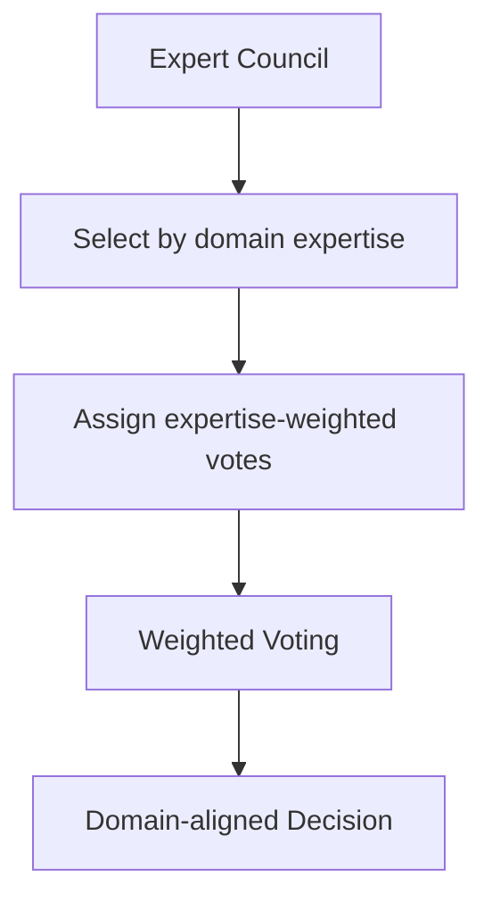

---

## 13. Temporary Councils

A **Temporary Council** is chartered for a single mandate and dissolves upon resolution or expiry (`expiresAt` in Council Schema).

### 13.1 Characteristics
- Created on-demand by Workflow Manager, Delegation Manager, or Conflict Resolution Manager.
- Bounded by `expiresAt`; may be dissolved early upon mandate fulfillment.
- State is transient Working Memory (P12-ADR-003 Performance: "Council state maintained in Working Memory (transient)") but MUST be durably logged for audit (Section 15).
- After dissolution, the decision record persists in the Decision Log even though the live council state is released.

### 13.2 Lifecycle Note
Temporary councils optimize for fast convening and low overhead; quorum-relaxation policies apply to avoid delays in small teams (P12-ADR-003 Risks).

---

## 14. Persistent Councils

A **Persistent Council** survives across sessions, enforces term limits and rotation, and maintains long-lived state.

### 14.1 Characteristics
- Chartered by Governance for standing oversight (e.g., Security Council, Engineering Council — `adrs.md`).
- Implements **rotation** (`rotationPeriodDays`, default 90) and **eligibility re-evaluation** on `CapabilityUpdated` / `AgentStatusChanged` (`components.md` → *Council Manager*).
- Maintains historical decision context; new sessions reuse the council identity and accumulated trust scoring.
- Hierarchical structures are permitted: a persistent council MAY subdivide into committees for scale (`context.md` → *Council Manager* → Future Evolution).

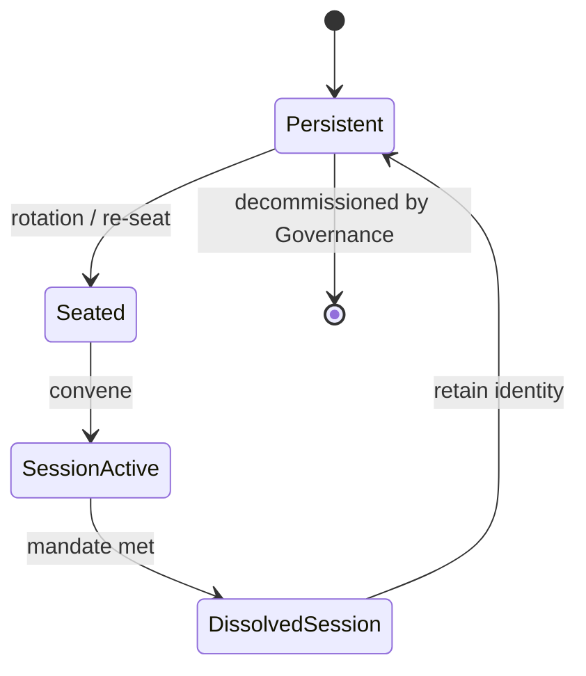

---

## 15. Decision Logging

**Decision Logging** is the immutable, append-only record of all council acts. It is the audit backbone and the source for replay (Section 16).

### 15.1 Logged Artifacts
- Council lifecycle events (`council.lifecycle.*`, `council.seat.*`, `council.quorum.lost`).
- Deliberation events (`council.motion.filed`, `council.debate.*`).
- Voting events (`council.vote.cast`, `council.vote.recalled`).
- Resolution events (`council.decision.published`).

### 15.2 Integrity Model
- Events are signed (Ed25519) by the producer (`events.md` §20).
- Every N events a `security.audit.record` Merkle anchor links to the prior anchor; tampering is detected via mismatch (`events.md` §20).
- Decision Logs are WORM (Write-Once-Read-Many) and replayable from offset 0 (`events.md` §3).
- Retention follows `decisionRetentionDays` (default 365) in Council Manager config; archival to cold storage after retention (`components.md` → *Council Manager* → Configuration).

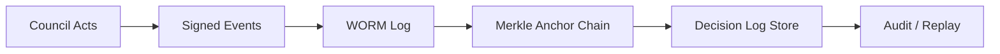

---

## 16. Decision Replay

**Decision Replay** reconstructs a council's state and decisions from the Decision Log alone. It is a first-class primitive, not an afterthought (`events.md` §2 principle 6; P12-ADR-008 immutable events).

### 16.1 Replay Operations
- **Full replay** — reconstruct a council session from `council.lifecycle.convened` to `council.lifecycle.dissolved`.
- **Partial replay** — reconstruct from any offset (e.g., to verify a specific tally).
- **Replay with side effects suppressed** — consumers MUST distinguish replayed events via `metadata.replay = { from_offset, replay_id }` (`events.md` §20). Replay never re-emits to live subscribers silently.

### 16.2 Determinism Requirement
Because tie resolution (Section 11) and weighted tallies (Section 8) are deterministic, replay MUST reproduce the identical decision. Any divergence indicates log tampering or a bug — both are escalated.

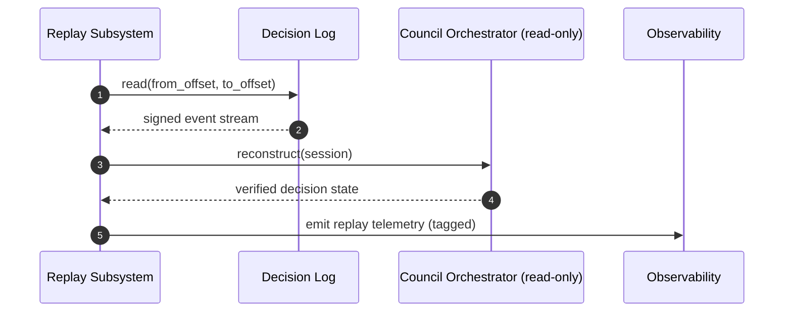

---

## 17. Governance Integration

The Council Decision Architecture is governed from above and audited from below.

### 17.1 Integration Points
- **Chartering authority** — Governance layer creates persistent and policy-mandated councils; charter changes require re-chartering and version bumps (`components.md` → *Council Manager* → Security).
- **Human oversight** — escalation to FinalJudge (ADR-006) is the mandatory human checkpoint for critical decisions (P12-ADR-003).
- **Policy as code** — council voting rules, quorum, and escalation thresholds are version-controlled and reviewable (`context.md` → *Best Practices*).
- **Audit** — Decision Log feeds the Governance audit trail; `security.audit.record` anchors are consumed by Compliance.

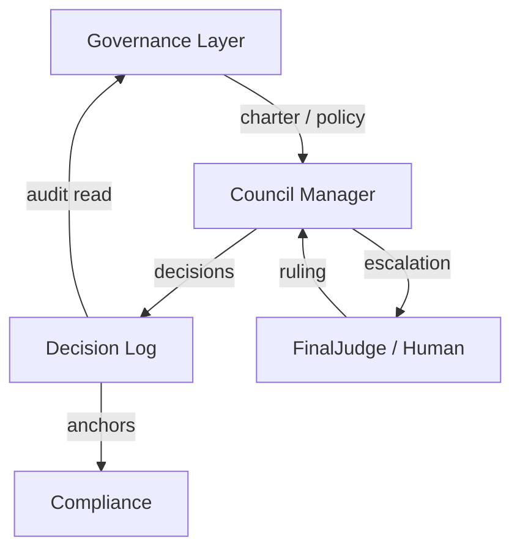

---

## 18. Runtime Interaction

The Council Decision Architecture interacts with the runtime through well-defined boundaries.

### 18.1 Producers & Consumers
- **Producers:** member agents, Workflow Manager, Council Orchestrator, Arbitration Engine, FinalJudge.
- **Consumers:** Workflow Engine (resume/suspend on decision), Collaboration Manager (session policy), Memory (decision_ref), Communication Bus (fan-out), Observability, Billing, Security.

### 18.2 Interaction Contract

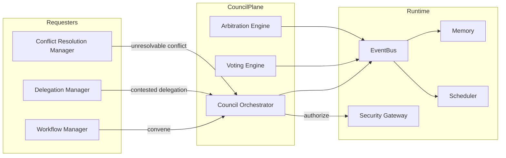

### 18.3 Runtime Invariants (summary; full set in 12.12)
- **I-DEC-1:** A Council Decision, once published and sealed, is immutable unless explicitly reopened by Governance.
- **I-DEC-2:** Every council act emits exactly one signed, ordered-per-session event.
- **I-DEC-3:** Tally outcome is deterministic and reproducible from the Decision Log.
- **I-DEC-4:** Quorum is enforced before any ballot is counted.
- **I-DEC-5:** Escalation to FinalJudge occurs whenever dissent exceeds the configured threshold.

### 18.4 Failure & Recovery
- **Quorum not met** → vote session expires; auto-renew if still achievable, else escalate (`components.md` → *Council Manager* → Recovery Strategy).
- **Member defection mid-vote** → re-compute quorum with remaining members.
- **Vote tampering** → signature validation discards invalid ballots; incident escalated to Security Gateway.
- **Charter conflict** → precedence rules in the Governance layer resolve overlapping mandates.

---

## 19. Cross-Part & Cross-Document References

| Topic | Reference |
|-------|-----------|
| Council Manager component | `components.md` §2 (Council Manager) |
| Council / Vote data contracts | `schemas.md` → *Council Schema*, *Vote Schema* |
| Council event taxonomy | `events.md` §5.6–5.7, §7.1–7.10 |
| Governing decision record | `adrs.md` → *P12-ADR-003: Council-Based Decision Architecture* |
| Weighted voting rationale | `adrs.md` → P12-ADR-003 Decision & Trade-offs |
| Human oversight escalation | Core ADR-006 (FinalJudge) |
| Kernel voting algorithms | Core ADR-003 (CouncilManager ownership) |
| Immutable audit events | Core ADR-008 |
| Terminology | `glossary.md` → *Council*, *Council Decision*, *Quorum*, *Consensus*, *Conflict Resolution*, *Governance* |
| Architectural context & boundaries | `context.md` → *Components Reused From Previous Parts*, *New Components Introduced*, *Collaboration Principles* |
| Related chapters | 12.1 (Overview), 12.2 (Collaboration), 12.4 (Delegation/Orchestration), 12.6 (Shared Context), 12.10 (Security), 12.12 (Invariants) |
| Cross-part dependencies | `dependency-map.md` (Part 3 Kernel governance, Part 4 EventBus, Part 8 Security, Part 11 Observability) |

---

*End of Chapter 12.5 — Council Decision Architecture.*
