# Part 12.6: Shared Context and Knowledge Exchange Architecture

> **Document Role:** Detailed architecture specification for shared context management, context propagation, knowledge synchronization, and knowledge exchange mechanisms in multi-agent collaboration.
> **Status:** Architecture Specification (v1.0)
> **ADR Alignment:** P12-ADR-005 (Shared Context as Distributed State), P12-ADR-009 (Knowledge Exchange via Structured Memory Events)
> **Previous Chapter:** 12.5 – Council Decision Architecture
> **Next Chapter:** 12.7 – Multi-Agent Communication

---

## Table of Contents

1. [Executive Summary](#1-executive-summary)
2. [Shared Context Model](#2-shared-context-model)
3. [Context Propagation](#3-context-propagation)
4. [Context Ownership](#4-context-ownership)
5. [Knowledge Synchronization](#5-knowledge-synchronization)
6. [Memory Interaction](#6-memory-interaction)
7. [Context Isolation](#7-context-isolation)
8. [Context Versioning](#8-context-versioning)
9. [Shared Memory](#9-shared-memory)
10. [Distributed Memory](#10-distributed-memory)
11. [Knowledge Transfer](#11-knowledge-transfer)
12. [Context Conflict Resolution](#12-context-conflict-resolution)
13. [Snapshot Architecture](#13-snapshot-architecture)
14. [Incremental Synchronization](#14-incremental-synchronization)
15. [Consistency Guarantees](#15-consistency-guarantees)
16. [Knowledge Lifecycle](#16-knowledge-lifecycle)
17. [Event Integration](#17-event-integration)
18. [Schema Integration](#18-schema-integration)
19. [Security Architecture](#19-security-architecture)
20. [Performance Characteristics](#20-performance-characteristics)
21. [Failure Handling](#21-failure-handling)
22. [Context Lifecycle Management](#22-context-lifecycle-management)
23. [Context Garbage Collection and TTL Policies](#23-context-garbage-collection-and-ttl-policies)
24. [Context Lineage](#24-context-lineage)
25. [Context Federation and Migration](#25-context-federation-and-migration)
26. [Knowledge Governance and Ownership](#26-knowledge-governance-and-ownership)
27. [Context Validation and Integrity](#27-context-validation-and-integrity)
28. [Cross-References](#28-cross-references)
29. [Context Leasing and Optimistic Concurrency](#29-context-leasing-and-optimistic-concurrency)
30. [Logical Time, Causality, and CRDT Enhancements](#30-logical-time-causality-and-crdt-enhancements)
31. [Context Replication and Multi-Region Synchronization](#31-context-replication-and-multi-region-synchronization)
32. [Context Partitioning, Sharding, and Scalability](#32-context-partitioning-sharding-and-scalability)
33. [Context Indexing, Search, and Semantic Retrieval](#33-context-indexing-search-and-semantic-retrieval)
34. [Context Compression, Pruning, and Memory Optimization](#34-context-compression-pruning-and-memory-optimization)
35. [Knowledge Trust, Confidence, and Quality Scoring](#35-knowledge-trust-confidence-and-quality-scoring)
36. [Knowledge Federation and Cross-Session Reuse](#36-knowledge-federation-and-cross-session-reuse)
37. [Event Sourcing, Projections, and Log Compaction](#37-event-sourcing-projections-and-log-compaction)
38. [Context Archival, Storage Tiering, and Recovery Objectives](#38-context-archival-storage-tiering-and-recovery-objectives)
39. [Shared Context SLIs, SLOs, and Error Budgets](#39-shared-context-slis-slos-and-error-budgets)
40. [Integration Conformance and Invariant Registration](#40-integration-conformance-and-invariant-registration)

---

## 1. Executive Summary

The Shared Context and Knowledge Exchange architecture defines how distributed state is maintained, synchronized, and exchanged among collaborating agents in AI-OS. Building upon P12-ADR-005 (event-sourced distributed state with hierarchical scoping) and P12-ADR-009 (structured memory events for knowledge exchange), this architecture provides:

- A **scoped context model** with four levels (session, team, role, private) aligned to collaboration boundaries.
- **Event-sourced** updates with immutable `ContextUpdated` events carrying causation chains.
- **Conflict-free replicated data types (CRDTs)** for high-contention fields, with **last-writer-wins** as the default resolution for low-contention fields.
- **Privacy filtering** based on agent capabilities and trust domains.
- **Knowledge exchange** through structured memory events routed to the five-tier memory system.
- **Versioned snapshots** for recovery, rollback, and audit.

This architecture is owned by the Shared Context Manager and Knowledge Exchange Layer components as defined in `components.md`.

---

## 2. Shared Context Model

### 2.1 Scope Hierarchy

The Shared Context Manager maintains context in four hierarchical scopes, each mapped to a Hermes Kernel `StateManager` scope:

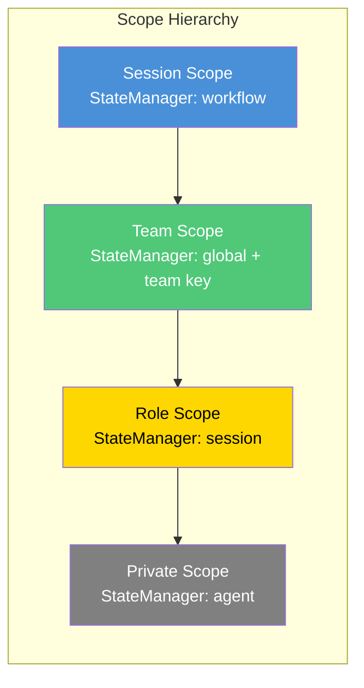

| Scope | StateManager Mapping | Purpose | Lifetime | Access Control |
|-------|---------------------|---------|----------|----------------|
| **Session** | `workflow` scope | Shared scratchpad, task progress, intermediate results for one collaboration session | Per-session; expires on session end | All session participants |
| **Team** | `global` scope + team key | Persistent team knowledge, shared patterns, reusable artifacts | Persists across sessions; configurable TTL | Team members with matching capability |
| **Role** | `session` scope | Role-specific context accessible to agents holding the same role | Per-session; deleted on session end | Agents with matching role in session |
| **Private** | `agent` scope | Agent-local state that can be selectively promoted to shared scopes | Agent lifetime; auto-cleanup on agent exit | Agent owner only |

### 2.2 Context Data Model

Shared context entries conform to the `SharedContext` schema (see `schemas.md` Section 1510):

```mermaid
erDiagram
    SHARED_CONTEXT {
        string contextId PK "UUID v4"
        string name "Human-readable name"
        string version "SemVer"
        string description "Optional description"
        enum scope "global|workflow|task|agent_group|private"
        object data "Context payload"
        string schema "Schema reference (optional)"
        string[] tags "Categorization tags"
        string createdBy FK "AgentId"
        datetime createdAt "ISO 8601"
        datetime updatedAt "ISO 8601"
        datetime expiresAt "ISO 8601 or null"
        object accessPolicy "Read/write permissions"
        object[] history "Audit trail"
        object metadata "Arbitrary KV pairs"
    }

    SHARED_CONTEXT }--o{ CONTEXT_DELTA : "produces"
    SHARED_CONTEXT }--o{ CONTEXT_SNAPSHOT : "snapshot"
    SHARED_CONTEXT }--o{ CONTEXT_VERSION : "versioned"

    CONTEXT_DELTA {
        string deltaId PK "ULID"
        string contextId FK
        string sourceAgentId
        enum operation "set|delete|merge"
        string path "JSONPath"
        any value
        datetime timestamp
        string causationId FK "Parent event"
        string correlationId FK
    }

    CONTEXT_VERSION {
        string contextId FK
        integer versionNumber
        string snapshotRef
        datetime timestamp
        string createdBy
        string eventId
    }

    CONTEXT_SNAPSHOT {
        string snapshotId PK
        string contextId FK
        integer version
        object data
        string hash "SHA-256"
        datetime createdAt
    }
```

### 2.3 Context Access Patterns

Agents interact with shared context through three primary patterns:

1. **Read** — Synchronous lookup or subscription-based notification.
2. **Write** — Delta-based updates published as immutable events.
3. **Query** — Ad-hoc inspection within access scope.

---

## 3. Context Propagation

### 3.1 Propagation Architecture

Context propagation uses an event-driven model where updates are published as `ContextUpdated` events on the EventBus. The Shared Context Manager acts as the authoritative publisher and consumer of these events.

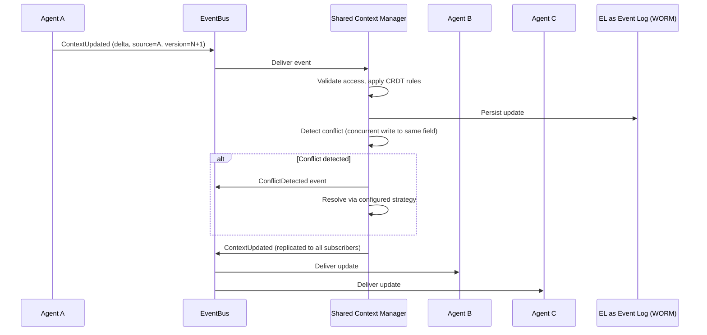

### 3.2 Propagation Guarantees

| Property | Guarantee | Mechanism |
|----------|-----------|-----------|
| **Delivery** | At-least-once per subscriber | EventBus at-least-once semantics (Section 4.3 of `context.md`) |
| **Ordering** | Per-context ordering preserved | Partition key = `contextId` |
| **Latency** | p99 ≤ 50ms for propagation | EventBus < 10ms; SCM processing < 20ms |
| **Durability** | Persisted to WORM log | EventBus WORM store (Section 3.176 of `context.md`) |
| **Replay** | Full event history available | From offset 0 |

### 3.3 Subscription Model

Agents and components subscribe to context changes via field-level or scope-level subscriptions:

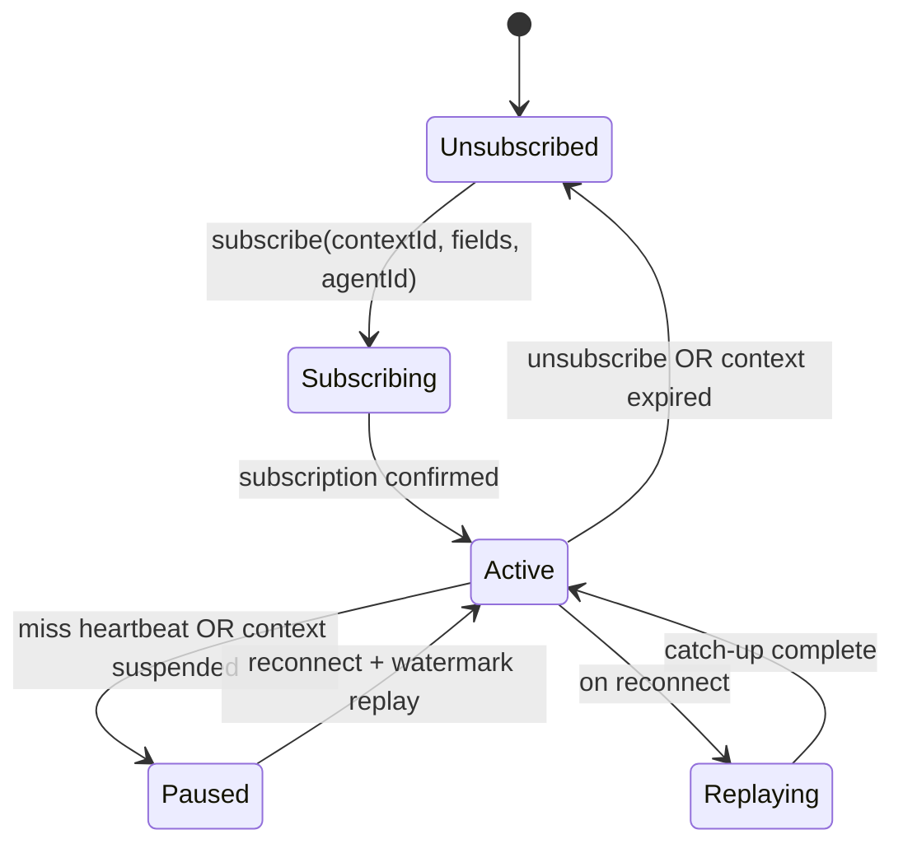

---

## 4. Context Ownership

### 4.1 Ownership Model

Context ownership follows a **delegation-based** model:

| Role | Authority | Responsibilities |
|------|-----------|------------------|
| **Context Owner** | Full CRUD | The agent or component that created the context scope; sets initial policies |
| **Delegates** | Write with restrictions | Agents explicitly granted write access via access policy |
| **Readers** | Read-only | Agents granted read access; may subscribe to changes |
| **Auditors** | Read + history | Security and compliance agents with audit-only access |

### 4.2 Ownership Transfer

Ownership transfer requires explicit consent and is mediated by the Shared Context Manager:

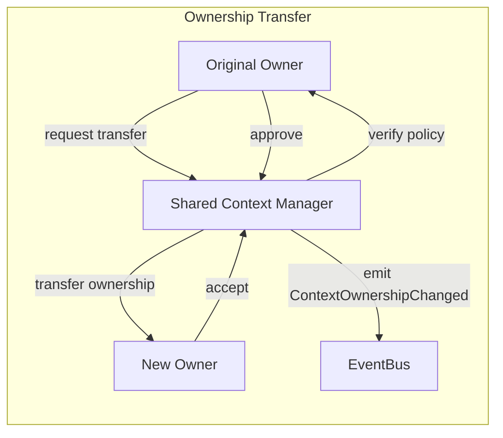

### 4.3 Ownership Constraints

- **Transfer limits**: Ownership may be transferred at most once per context lifecycle.
- **Trust domain enforcement**: Cross-trust-domain transfers require explicit policy exception (P12-ADR-008).
- **Audit requirement**: All ownership changes are recorded in the context history.

---

## 5. Knowledge Synchronization

### 5.1 Sync Protocols

Knowledge synchronization between agents and memory tiers uses two protocols:

| Protocol | Use Case | Guarantees | Latency Target |
|----------|----------|------------|----------------|
| **KnowledgePush** | Agent → Knowledge Exchange Layer (capture) | Persistent after ACK | ≤ 100ms |
| **KnowledgePull** | Agent → Memory (retrieval) | Bounded staleness (configurable) | ≤ 200ms p99 |
| **KnowledgeSync** | Inter-agent knowledge sync | Eventual consistency | ≤ 1 second |

### 5.2 Synchronization Architecture

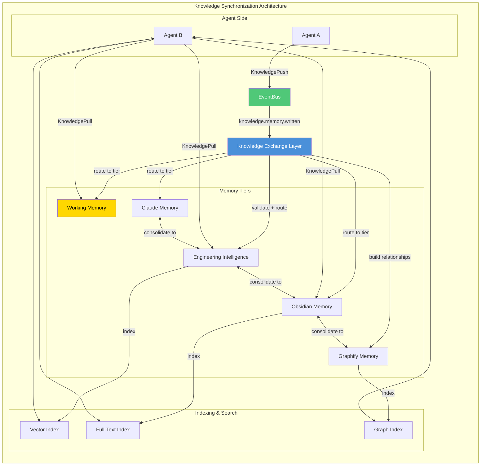

### 5.3 Conflict Resolution in Synchronization

When knowledge conflicts are detected during synchronization (e.g., contradictory facts from different sources):

1. **Validation required** for Engineering Intelligence and Obsidian tiers (P12-ADR-009).
2. **ConflictDetected** event emitted to EventBus.
3. **Council escalation** for high-severity conflicts.
4. **Resolution recorded** as `KnowledgeRevised` event.

---

## 6. Memory Interaction

### 6.1 Five-Tier Memory Integration

The Shared Context Manager integrates with the five-tier memory architecture (ADR-016) as defined in `components.md` and `MEMORY_FLOW.md`:

| Memory Tier | Role in Collaboration | Integration Point |
|-------------|----------------------|-------------------|
| **Working Memory** | Transient reasoning state, immediate task context | Context snapshots, short-lived sync |
| **Claude Memory** | Session-scoped episodic state | Session context sync, prompt building |
| **Engineering Intelligence** | Organizational knowledge, validated patterns | Knowledge captured from completed workflows |
| **Obsidian Memory** | Structured documentation, ADRs | Knowledge documented from council decisions |
| **Graphify Memory** | Entity relationships, dependency maps | Knowledge mapped from architectural decisions |

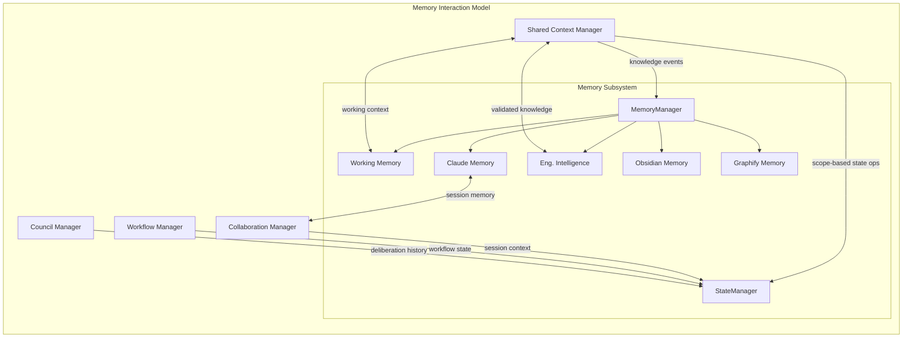

### 6.2 Memory-Context Bridge

The Memory-Context Bridge facilitates bidirectional conversion between shared context entries and memory objects:

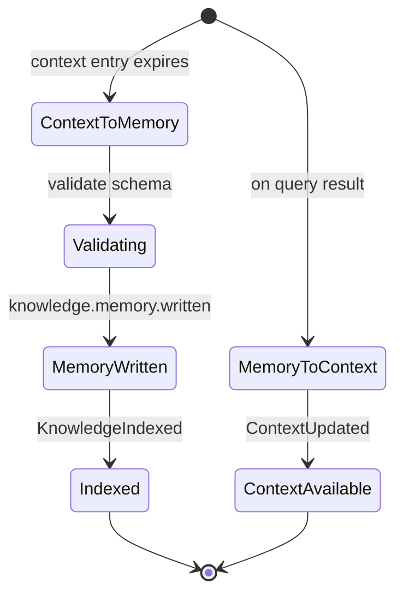

---

## 7. Context Isolation

### 7.1 Trust Domain Isolation

Context is partitioned by **trust domain** to enforce zero-trust principles (P12-ADR-008):

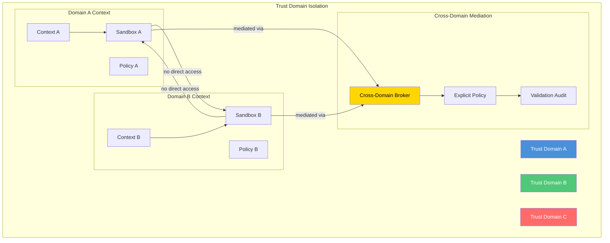

### 7.2 Isolation Enforcement

| Boundary Type | Enforcement Mechanism | Failure Mode |
|---------------|----------------------|--------------|
| **Session** | Context ID partitioning | Cross-session read returns empty |
| **Team** | Team-key-scoped StateManager | Unauthorized team access denied |
| **Role** | Role-based field masking | Role mismatch returns redacted |
| **Trust Domain** | Security Gateway policy | Cross-domain access requires exception |
| **Private** | Agent-ID-scoped storage | Agent ID mismatch blocks access |

### 7.3 Data Flow Isolation

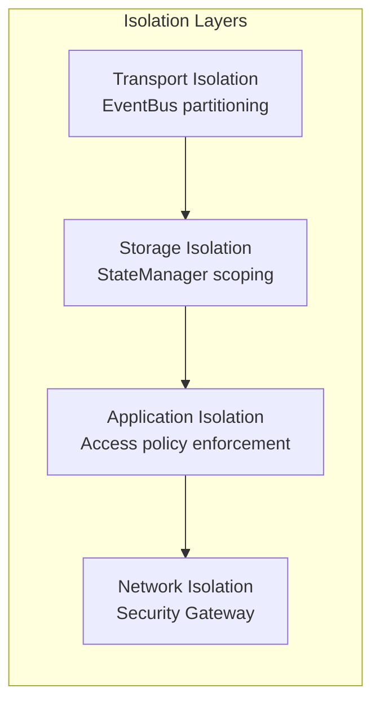

---

## 8. Context Versioning

### 8.1 Versioning Model

Context versioning follows an **event-sourced append-only** model:

| Concept | Description |
|---------|-------------|
| **Vector** | Each context has a monotonically increasing version number |
| **Timestamp** | Each update carries a logical timestamp (Lamport clock) |
| **Causation** | Each update records the `event_id` of its immediate cause |
| **Correlation** | Each update belongs to a correlation chain (workflow/session) |

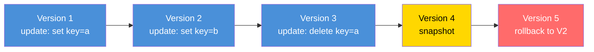

### 8.2 Version Compatibility

The versioning strategy aligns with the Schema Architecture (`schemas.md` Section 17):

| Change Type | Version Bump | Backward Compatible? |
|-------------|--------------|---------------------|
| Add optional field | PATCH | Yes |
| Add required field | MAJOR | No |
| Remove field | MAJOR | No |
| Change field type | MAJOR | No |
| Modify conflict resolution | MINOR | Yes (if additive) |
| Change consistency model | MINOR | Yes (if compatible) |

### 8.3 Rollback Semantics

Rollback to any prior version is supported via `IContextStore.rollback`:

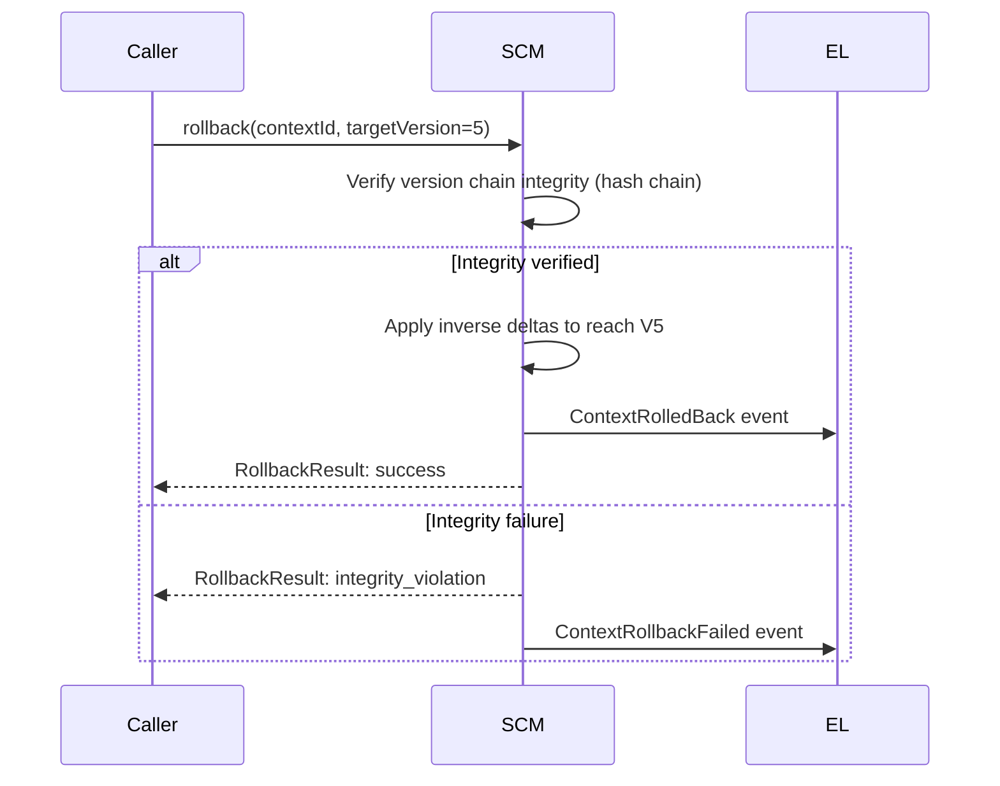

---

## 9. Shared Memory

### 9.1 Shared Memory Architecture

Shared memory is the physical manifestation of shared context, implemented through the Hermes Kernel StateManager (`components.md` Section 5):

```mermaid
graph TD
    subgraph "Shared Memory Architecture"
        direction TB
        
        subgraph "Logical Layer"
            SC[Shared Context Entries]
            CM[Context Manager API]
            SS[StateManager Scopes]
        end
        
        subgraph "Physical Layer"
            SM[StateManager]
            KV[Key-Value Store]
            CRDT[CRDT Store]
            LOG[Event Log (WORM)]
            CACHE[Distributed Cache]
        end
        
        subgraph "Access Layer"
            AG[Agents]
            WC[Workflow Components]
            CC[Council Components]
            DC[Delegation Components]
        end
        
        AG --> CM
        WC --> CM
        CC --> CM
        DC --> CM
        
        CM --> SC
        CM --> SS
        
        SS --> SM
        SM --> KV
        SM --> CRDT
        SM --> LOG
        SM --> CACHE
        
        SS -->|scope isolation| SM
    end
```

### 9.2 Memory Access Control

Access control is enforced at multiple layers:

| Layer | Mechanism | Granularity |
|-------|-----------|-------------|
| **State Manager** | Scope-based ACL | Per-scope |
| **Context Manager** | Field-level policy | Per-field |
| **Security Gateway** | Trust domain policy | Per-domain |
| **EventBus** | Message-level ACL | Per-topic |

### 9.3 Memory Consistency Models

Four consistency models are supported, selected per context scope:

| Model | Use Case | Guarantees |
|-------|----------|------------|
| **Strong** | Critical governance context | Linearizable reads/writes; immediate visibility |
| **Causal** | Workflow coordination | Causally ordered; no contradictions |
| **Eventual (CRDT)** | High-contention shared state | Eventual convergence; conflict-free |
| **Last-Writer-Wins** | Low-contention simple values | Single winner on conflict; metadata preserved |

Default: **CRDT** for all new contexts (P12-ADR-005).

---

## 10. Distributed Memory

### 10.1 Distributed Architecture

Distributed memory spans multiple nodes using partitioning and replication:

```mermaid
graph TB
    subgraph "Distributed Memory Topology"
        direction TB
        
        subgraph "Region A"
            A1[Node A1<br/>Primary]
            A2[Node A2<br/>Replica]
        end
        
        subgraph "Region B"
            B1[Node B1<br/>Primary]
            B2[Node B2<br/>Replica]
        end
        
        subgraph "Region C"
            C1[Node C1<br/>Primary]
            C2[Node C2<br/>Replica]
        end
        
        A1 <--> A2
        B1 <--> B2
        C1 <--> C2
        
        A1 <-->|gossip| B1
        B1 <==> C1
        A1 <..> C1
        
        subgraph "Load Balancer"
            LB[Global Router]
        end
        
        LB --> A1
        LB --> B1
        LB --> C1
    end
    
    style A1 fill:#4a90d9,color:#fff
    style B1 fill:#50c878,color:#fff
    style C1 fill:#ffd700,color:#000
```

### 10.2 Partitioning Strategy

- **Partition key**: `contextId` hash
- **Replication factor**: 3 (configurable)
- **Consistency level**: Read-after-write for strong; quorum for causal
- **Failure detection**: Gossip protocol with 3s interval

### 10.3 Cross-Region Sync

Cross-region synchronization uses **delta state convergence**:

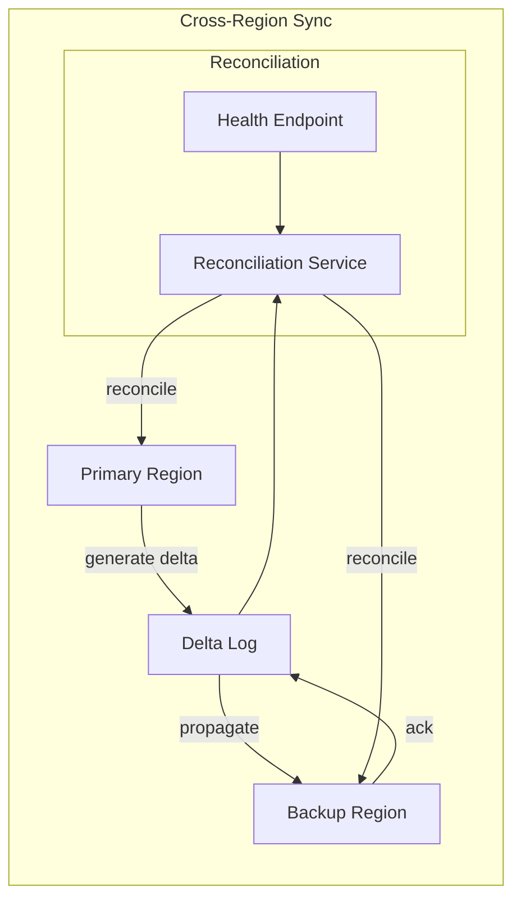

---

## 11. Knowledge Transfer

### 11.1 Transfer Architecture

Knowledge transfer between agents follows a **structured extraction and ingestion** model (P12-ADR-009):

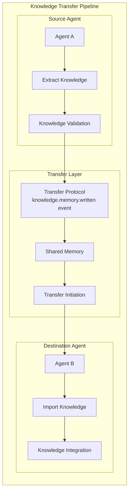

### 11.2 Transfer Patterns

| Pattern | Use Case | Guarantees |
|---------|----------|------------|
| **Push** | Agent publishes knowledge after task completion | Acknowledged delivery to memory tier |
| **Pull** | Agent queries knowledge for current context | Bounded staleness |
| **Subscription** | Agent subscribes to knowledge on a topic | Real-time delivery |
| **Request-Response** | Agent requests specific knowledge from another | Synchronous with timeout |

### 11.3 Provenance Tracking

All knowledge transfers carry full provenance metadata:

```mermaid
erDiagram
    KNOWLEDGE_OBJECT {
        string knowledgeId PK
        string sourceAgentId
        string sourceSessionId
        string sourceWorkflowId
        enum knowledgeType
        float confidenceScore
        float effectivenessScore
        enum validationStatus "pending|validated|disputed"
        string[] tags
        object metadata
    }
    
    KNOWLEDGE_OBJECT }--o{ PROVENANCE : "has"
    
    PROVENANCE {
        string eventId
        datetime timestamp
        string actorId
        string parentId
        string action
        string reason
    }
```

---

## 12. Context Conflict Resolution

### 12.1 Conflict Types

| Conflict Type | Trigger | Resolution Strategy |
|---------------|---------|-------------------|
| **Write-Write** | Concurrent updates to same field | LWW, CRDT merge, or escalation |
| **Read-Write** | Stale read followed by write | Version check + retry |
| **Scope Conflict** | Incompatible scope changes | Policy-based escalation |
| **Ownership Conflict** | Simultaneous ownership claims | Trust-weighted resolution |

### 12.2 Conflict Resolution Pipeline

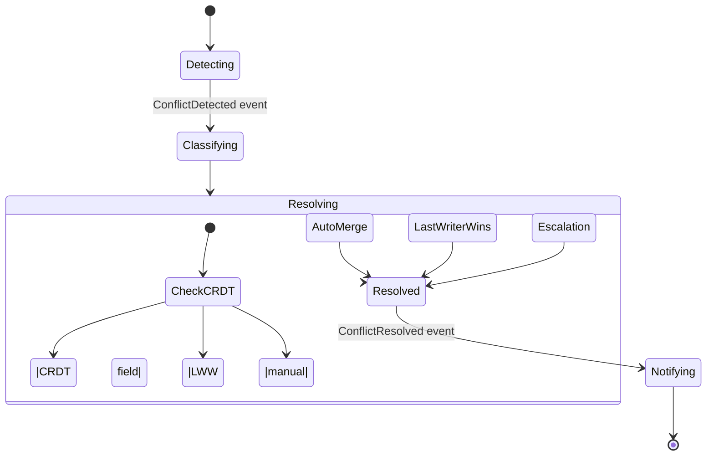

### 12.3 CRDT Conflict Resolution

For CRDT-managed fields, the following data types are supported:

| CRDT Type | Use Case | Merge Behavior |
|-----------|----------|----------------|
| **LWW-Element-Set** | Presence lists, agent membership | Last-write-wins on add/remove |
| **PN-Counter** | Count values, vote tallies | Positive-negative counter merge |
| **OR-Set** | Exclusive sets with tombstones | Observed-remove merge |
| **MV-Register** | Multi-value registers | Preserve all concurrent writes |
| **CmRDT** | Commutative replicated data types | Commutative operations |

---

## 13. Snapshot Architecture

### 13.1 Snapshot Types

| Type | Purpose | Frequency | Retention |
|------|---------|-----------|-----------|
| **Version Snapshot** | Point-in-time context state for rollback | Every N updates (default: 100) | 1000 versions |
| **Session Snapshot** | Session completion state for audit | On session end | Indefinite (archived) |
| **Workflow Snapshot** | Workflow checkpoint for recovery | At workflow boundaries | Workflow retention |
| **Council Snapshot** | Decision point state for audit | On decision | Council retention |

### 13.2 Snapshot Architecture

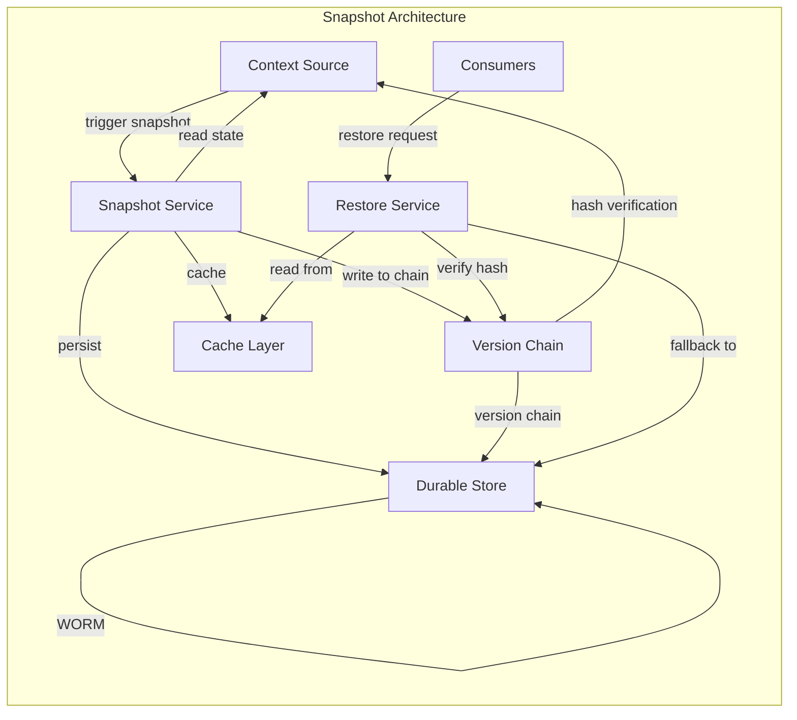

### 13.3 Snapshot Integrity

Each snapshot includes:

```mermaid
erDiagram
    SNAPSHOT {
        string snapshotId PK
        string contextId FK
        integer version
        string hash SHA-256
        datetime createdAt
        string createdBy
        string parentSnapshotId
        string eventId
        object data
        integer dataSizeBytes
    }
    
    SNAPSHOT ||--o{ SNAPSHOT_CHAIN : "links_to"
    
    SNAPSHOT_CHAIN {
        string chainId
        string[] snapshotIds
        boolean isVerified
    }
```

### 13.4 Snapshot Recovery Flow

```mermaid
flowchart LR
    subgraph "Snapshot Recovery Flow"
        R[Restore Request]
        V[Verify Hash Chain]
        C[Check Cache]
        S[Read from Store]
        R2[Reconstruct State]
        A[Apply Recent Deltas]
        D[Deliver to Agent]
        
        R --> V
        V --> C
        C -->|hit| D
        C -->|miss| S
        S --> R2
        R2 --> A
        A --> D
    end
```

---

## 14. Incremental Synchronization

### 14.1 Delta-Based Sync

Incremental synchronization uses delta events with vector clock comparison:

```mermaid
flowchart LR
    subgraph "Incremental Sync Architecture"
        P1[Publisher Agent]
        P2[Subscriber Agent]
        EB[EventBus]
        SM[State Manager]
        
        subgraph "Delta Tracking"
            DT[Delta Tracker]
            VC[Vector Clock]
            DL[Delta Log]
        end
        
        P1 -->|ContextUpdate| EB
        EB -->|ContextUpdated| DT
        DT -->|compare vector clocks| VC
        DT -->|filter relevant| DL
        DL -->|send deltas| P2
        P2 -->|apply deltas| SM
        SM -->|ack| DL
        DL -->|gc after ack| VC
        
        P2 -->|catch-up request| DL
        DL -->|send full sync| P2
    end
```

### 14.2 Sync Algorithm

The incremental sync algorithm uses **vector clocks per context field**:

```
Algorithm: IncrementalSync
Input: subscriberId, contextId, lastKnownVersion
Output: set of relevant deltas

1.  deltaLog ← getDeltaLog(contextId)
2.  relevantDeltas ← filterByVectorClock(
        deltaLog,
        subscriber.lastAckedVersions[contextId]
    )
3.  IF relevantDeltas.size > 100 THEN
        // Too many deltas, send catch-up snapshot
        snapshot ← takeSnapshot(contextId)
        RETURN { type: "catchup", snapshot, version: currentVersion }
    ELSE
        RETURN { type: "incremental", deltas: relevantDeltas }
    ENDIF
```

### 14.3 Bandwidth Optimization

| Technique | Description | Savings |
|-----------|-------------|---------|
| **Delta compression** | Only send changed fields | 60-80% reduction |
| **Batch delivery** | Collect deltas over time window | 30-50% reduction |
| **Field filtering** | Only send subscribed fields | 20-90% reduction |
| **TTL-based eviction** | Drop expired context entries | Variable |

---

## 15. Consistency Guarantees

### 15.1 Consistency Levels

The Shared Context Manager provides four consistency levels, selectable per context scope:

| Level | Guarantees | Use Cases | Latency |
|-------|------------|-----------|---------|
| **Strong** | Linearizable; all reads see latest write | Council decisions, governance state | ≤ 10ms p99 |
| | | Critical shared configuration | |
| **Causal** | Causally ordered; no contradictions | Workflow coordination | ≤ 50ms p99 |
| | | Sequential task dependencies | |
| **Eventual (CRDT)** | Eventual convergence within 1s | High-contention shared state | ≤ 1000ms convergence |
| | | Agent presence, real-time collaboration | |
| **Eventual (LWW)** | Last-write-wins within 1s | Simple scalar values | ≤ 500ms convergence |

### 15.2 Consistency Matrix

| Operation | Strong | Causal | CRDT | LWW |
|-----------|--------|--------|------|-----|
| Write | Quorum commit | Causal+1 replica | Local + async | Local + async |
| Read | Quorum read | Any replica | Any replica | Any replica |
| Conflict | Prevent | Prevent | Merge | Last wins |
| Partition | Unavailable | Available | Available | Available |
| Latency (p99) | ≤ 10ms | ≤ 50ms | ≤ 5ms | ≤ 2ms |

### 15.3 Consistency Monitoring

Consistency health is continuously monitored:

```mermaid
flowchart LR
    subgraph "Consistency Monitoring"
        CM[Consistency Monitor]
        VC[Vector Clock Checker]
        HC[Hash Consistency Verifier]
        DM[Discrepancy Reporter]
        
        subgraph "Metrics Pipeline"
            M1[context.consistency.violations]
            M2[context.sync.latency.p99]
            M3[context.conflict.rate]
        end
        
        CM --> VC
        CM --> HC
        VC -->|detect causal violations| DM
        HC -->|detect hash mismatches| DM
        DM --> M1
        CM --> M2
        CM --> M3
        
        M1 --> GR[Grafana Dashboard]
        M2 --> GR
        M3 --> GR
    end
```

---

## 16. Knowledge Lifecycle

### 16.1 Lifecycle States

Knowledge objects progress through the following lifecycle states (aligned with P12-ADR-009):

```mermaid
stateDiagram-v2
    [*] --> Captured: artifact received
    Captured --> Structured: KnowledgeExchange.transform
    Structured --> Validation: KnowledgeExchange.validate
    Validation --> Indexed: pass quality check
    Validation --> Rejected: fail quality check
    Indexed --> Active: KnowledgeExchange.publish
    Active --> Versioned: update received
    Active --> Archived: retention expired
    Active --> Expired: TTL reached
    Versioned --> Active: new version applied
    Archived --> Deleted: GC retention reached
    Rejected --> Deleted: after review period
    Expired --> Deleted
    Indexed --> Active
```

### 16.2 Lifecycle Management

| State | Entry Action | Exit Action | TTL/Retention |
|-------|-------------|-------------|---------------|
| **Captured** | Ingest artifact | Transform | N/A |
| **Structured** | Apply schema | Validate | 1 hour |
| **Validated** | Run quality checks | Index | 24 hours |
| **Indexed** | Build search indexes | Publish | 7 days |
| **Active** | Available for query | Archive or expire | Configurable |
| **Archived** | Move to cold storage | Delete on GC | 365 days (default) |
| **Expired** | TTL reached | Delete | 0 |
| **Deleted** | Remove from all tiers | Perma-delete | After audit retention |

### 16.3 Lifecycle Events

| Event | Produced By | Consumed By | Purpose |
|-------|-------------|-------------|---------|
| `KnowledgeCaptured` | Knowledge Exchange Layer | Observability | Artifact ingested |
| `KnowledgeStructured` | Knowledge Exchange Layer | Validation | Transformed to structured form |
| `KnowledgeValidated` | Knowledge Exchange Layer | Indexing | Passed quality checks |
| `KnowledgeRejected` | Knowledge Exchange Layer | Governance | Failed quality checks |
| `KnowledgeIndexed` | Knowledge Exchange Layer | Search | Available for queries |
| `KnowledgeQueried` | Knowledge Exchange Layer | Observability | Query activity |
| `KnowledgeExpired` | Knowledge Exchange Layer | GC | TTL reached |
| `KnowledgeVersioned` | Knowledge Exchange Layer | Observability | New version created |

---

## 17. Event Integration

### 17.1 Collaboration Events

The Shared Context Manager consumes and produces the following event types (from `events.md`):

**Events Consumed:**

| Event | Purpose | Handler |
|-------|---------|---------|
| `ContextUpdated` | Receive external update | Conflict detection |
| `WorkflowStarted` | Create workflow-scoped context | Context initialization |
| `SessionStarted` | Create session-scoped context | Context initialization |
| `CouncilCreated` | Create council-scoped context | Context initialization |
| `SessionTerminated` | Trigger context archival | Cleanup and archive |
| `WorkflowCompleted` | Trigger context archival | Cleanup and archive |
| `CouncilDissolved` | Trigger context archival | Cleanup and archive |
| `SecurityPolicyChanged` | Re-evaluate access control | Policy refresh |

**Events Produced:**

| Event | Priority | Purpose |
|-------|----------|---------|
| `ContextCreated` | P1 | New shared context scope created |
| `ContextUpdated` | P1 | Context fields updated with new values |
| `ConflictDetected` | P1 | Concurrent update conflict identified |
| `ConflictResolved` | P2 | Conflict resolved with chosen strategy |
| `SnapshotTaken` | P3 | Versioned snapshot captured |
| `ContextRolledBack` | P1 | Context restored to prior version |
| `ContextExpired` | P2 | Context exceeded retention period |
| `SubscriptionCreated` | P3 | New subscriber registered |
| `SubscriptionRemoved` | P3 | Subscriber removed |

### 17.2 Knowledge Events

Knowledge exchange events (from P12-ADR-009 and `events.md` Section 9):

```mermaid
flowchart LR
    subgraph "Knowledge Event Flow"
        KA[Knowledge Exchange Layer]
        EB[EventBus]
        
        subgraph "Event Types"
            E1[knowledge.memory.written]
            E2[knowledge.memory.read]
            E3[knowledge.memory.deleted]
            E4[knowledge.memory.revised]
            E5[knowledge.fact.invalidated]
        end
        
        KA -->|emit| EB
        EB --> E1
        EB --> E2
        EB --> E3
        EB --> E4
        EB --> E5
        
        subgraph "Consumers"
            PB[Prompt Builder]
            MI[Memory Index]
            OY[Observability]
            RL[Replay]
        end
        
        E1 --> PB
        E1 --> MI
        E1 --> OY
        E1 --> RL
        E2 --> OY
        E3 --> MI
        E4 --> PB
        E5 --> PB
    end
```

---

## 18. Schema Integration

### 18.1 Schema Mapping

Shared context and knowledge objects use the following schemas from `schemas.md`:

| Entity | Schema Reference | Section |
|--------|------------------|---------|
| `SharedContext` | `Shared Context Schema` | 1510 |
| `KnowledgeObject` | `Knowledge Object Schema` | 1722 |
| `MemoryObject` | `Memory Object Schema` | 1955 |
| `ContextDelta` | *(inline in event)* | N/A |
| `ContextSnapshot` | *(inline in event)* | N/A |

### 18.2 Schema Evolution

Schema evolution follows the Schema Architecture Specification (Section 17):

```mermaid
flowchart LR
    subgraph "Schema Evolution Pipeline"
        P[Proposal] --> V[Validation]
        V --> R[Review]
        R --> A[Approval]
        A --> P2[Publication]
        P2 --> C[Compatibility Check]
        C --> D[Deployment]
        D --> M[Migration]
        M --> O[Observability]
        
        subgraph "Validation Rules"
            JL[JSON Schema Draft 07]
            SN[Semantic Versioning]
            BC[BCP Compliance]
        end
        
        V --> JL
        C --> SN
        C --> BC
    end
```

---

## 19. Security Architecture

### 19.1 Access Control Model

Context access control follows a **capability-based** model with trust-domain enforcement (P12-ADR-008):

```mermaid
flowchart TB
    subgraph "Access Control Pipeline"
        R[Request] --> C[Capability Check]
        C --> T[Trust Domain Check]
        T --> P[Policy Evaluation]
        P --> D[Decision]
        
        subgraph "Checks"
            C1[Agent Capabilities]
            T1[Trust Verification]
            P1[Access Policy]
            P2[Context Policy]
            P3[Field Policy]
        end
        
        C --> C1
        T --> T1
        P --> P1
        P --> P2
        P --> P3
        
        D -->|allow| A[Access Granted]
        D -->|deny| RE[Access Denied + Audit]
    end
```

### 19.2 Confidentiality

| Context Level | Encryption | Redaction | Access Control |
|---------------|------------|-----------|----------------|
| **Ephemeral** (Working Memory) | No | N/A | Agent-scoped |
| **Session** | Optional | Field-level | Session-scoped |
| **Team** | Optional | Field-level | Team-scoped |
| **Organization** | Required | Field-level | Domain-scoped |
| **Global** | Required | Full | Policy-controlled |

### 19.3 Audit Trail

All context mutations produce an immutable audit record:

```mermaid
erDiagram
    CONTEXT_AUDIT {
        string eventId PK "ULID"
        string contextId FK
        string actorId FK "AgentId"
        string actorKind
        enum action "create|update|read|rollback|snapshot|expire"
        string operation "set|delete|merge"
        string fieldPath "JSONPath"
        string valueHash "SHA-256"
        integer versionBefore
        integer versionAfter
        datetime timestamp
        string correlationId
        string causationId
        string signature
    }
    
    CONTEXT_AUDIT }--o{ CONTEXT_HISTORY : "records"
    
    CONTEXT_HISTORY {
        string contextId PK
        string[] eventIds
        integer currentVersion
        string latestSnapshotId
    }
```

---

## 20. Performance Characteristics

### 20.1 Latency Targets

| Operation | p50 | p95 | p99 | SLA Tier |
|-----------|-----|-----|-----|----------|
| Context update | 8ms | 18ms | 25ms | P1 |
| Context read | 2ms | 5ms | 10ms | P1 |
| Conflict detection | 5ms | 12ms | 18ms | P2 |
| Snapshot creation (10MB) | 20ms | 60ms | 100ms | P2 |
| CRDT merge | 10ms | 30ms | 50ms | P2 |
| Subscription delivery | 5ms | 15ms | 40ms | P1 |

### 20.2 Throughput Targets

| Component | Max Throughput | Scale Target |
|-----------|---------------|--------------|
| Shared Context Manager | 50,000 updates/sec | 100,000 concurrent contexts |
| Knowledge Exchange Layer | 10,000 knowledge objects/sec | 1,000,000 indexed objects |
| CRDT Engine | 20,000 ops/sec per partition | 50 partitions per region |
| Memory Subsystem | 100,000 reads/sec | 50,000 concurrent agents |

### 20.3 Resource Constraints

| Resource | Limit | Monitoring |
|----------|-------|------------|
| Context size | 10 MB per scope | `context.size` metric |
| Active subscriptions | 10,000 per context | `subscription.count` metric |
| Delta log retention | 1000 versions | `delta_log.retention` config |
| Concurrent snapshots | 10 per context | `snapshot.active_count` metric |

---

## 21. Failure Handling

### 21.1 Failure Modes

| Failure Mode | Description | Detection | Recovery |
|-------------|-------------|-----------|----------|
| **Context corruption** | Data integrity breach | Hash verification | Rollback to last snapshot |
| **Network partition** | Nodes lose connectivity | Health checks | Gossip protocol |
| **CRDT divergence** | Conflicting merge states | Vector clock audit | Manual resolution |
| **Subscription loss** | Agent misses updates | Heartbeat miss | Replay from watermark |
| **Snapshot failure** | Disk/storage failure | Integrity check error | Fallback to event replay |
| **Knowledge validation failure** | Invalid knowledge object | Schema validation | Rejection + audit |

### 21.2 Recovery Procedures

```mermaid
graph TD
    subgraph "Recovery Procedures"
        direction TB
        
        F[Failure Detected] --> T[Type Classification]
        T --> C[Context Corruption]
        T --> N[Network Partition]
        T --> S[Subscription Loss]
        T --> K[Knowledge Failure]
        
        C --> C1[Verify hash chain]
        C1 --> C2[Rollback to last snapshot]
        C2 --> C3[Re-apply deltas]
        C3 --> C4[Context Restored]
        
        N --> N1[Enter degraded mode]
        N1 --> N2[Buffer updates locally]
        N2 --> N3[Reconnect detection]
        N3 --> N4[Sync via gossip]
        N4 --> N5[Partition resolved]
        
        S --> S1[Detect missed events]
        S1 --> S2[Query last watermark]
        S2 --> S3[Replay missed updates]
        S3 --> S4[Subscription restored]
        
        K --> K1[Mark object invalid]
        K1 --> K2[Remove from index]
        K2 --> K3[Emit knowledge.fact.invalidated]
        K3 --> K4[Knowledge quarantined]
        
        C4 --> M[Metrics Updated]
        N5 --> M
        S4 --> M
        K4 --> M
        
        M --> AL[Alerting System]
    end
    
    style F fill:#4a90d9,color:#fff
    style C4 fill:#50c878,color:#fff
    style N5 fill:#50c878,color:#fff
    style S4 fill:#50c878,color:#fff
    style K4 fill:#50c878,color:#fff
```

### 21.3 Error Event Types

| Event | Priority | Purpose |
|-------|----------|---------|
| `ContextCorruptionDetected` | P0 | Data integrity breach |
| `ContextRecoveryFailed` | P0 | Rollback/restore failed |
| `SubscriptionLost` | P2 | Subscriber missed updates |
| `KnowledgeValidationError` | P1 | Knowledge object failed validation |
| `ConflictResolutionFailed` | P1 | Conflict could not be auto-resolved |
| `SnapshotIntegrityFailed` | P0 | Snapshot hash verification failed |

---

## 22. Context Lifecycle Management

### 22.1 Lifecycle States

Shared Context entries transition through a defined lifecycle governed by P12-ADR-005. Each state represents a phase in the context entry's operational lifetime, with well-defined entry and exit conditions.

| State | Description | Entry Condition | Exit Condition |
|-------|-------------|-----------------|----------------|
| **Provisioned** | Context created but not yet active | `context.create` event | `context.activate` event |
| **Active** | Context accepting read/write operations | `context.activate` event | TTL expiry, explicit freeze, or archive trigger |
| **Subscribed** | Active context with subscriber tracking | `subscription.add` on active context | Last subscriber removed, or explicit unsubscribe |
| **Frozen** | Context accepting no writes; read-only | `context.freeze` event | `context.thaw` event or archive |
| **Archived** | Context snapshot preserved for history | `context.archive` event | Retention policy expiry |
| **Expired** | Context past TTL with no extension | TTL threshold reached | GC cycle processes entry |
| **Purged** | Context permanently removed | GC eviction or explicit delete | Terminal state |

### 22.2 Lifecycle Events

```mermaid
stateDiagram-v2
    [*] --> Provisioned: context.create
    Provisioned --> Active: context.activate
    Active --> Subscribed: subscription.add
    Subscribed --> Subscribed: subscription.add
    Subscribed --> Active: last subscriber removed
    Active --> Mutated: context.update
    Mutated --> Active: update acknowledged
    Active --> Frozen: context.freeze
    Frozen --> Active: context.thaw
    Frozen --> Archived: context.archive
    Active --> Archived: manual archive
    Archived --> Active: context.restore
    Active --> Expired: TTL reached
    Frozen --> Expired: TTL reached
    Subscribed --> Expired: TTL reached
    Active --> Expired: TTL reached
    Expired --> Purged: GC.process
    Archived --> Purged: retention_expired
    Purged --> [*]
    
    note right of Active
        Multiple context.update events
        may occur while in Active state.
        Each carries delta + version.
    end note
```

### 22.3 Lifecycle Invariants

The following invariants MUST hold across all context lifecycle transitions:

1. **INV-LC-01**: A context in `Provisioned` state MUST NOT accept read requests until `Active`.
2. **INV-LC-02**: A context in `Frozen` state MUST NOT accept write requests.
3. **INV-LC-03**: A context in `Expired` state MUST NOT be resurrected without explicit restore.
4. **INV-LC-04**: A context in `Purged` state MUST be irrecoverable.
5. **INV-LC-05**: Transitions from `Archived` to `Active` MUST require explicit authorization.

### 22.4 Lifecycle Hooks

Components MAY register lifecycle hooks at specific transition points:

```mermaid
graph TD
    subgraph "Lifecycle Hook Architecture"
        LE[Lifecycle Event]
        HR[Hook Registry]
        HA[Hook Author]
        
        LE --> HR
        HR -->|registered hooks| HA
        HA -->|execute| HE[Hook Execution]
        HE -->|result| RA[Action Router]
        RA -->|allow| AT[Transition Applied]
        RA -->|deny| RT[Transition Rejected]
        
        style LE fill:#4a90d9,color:#fff
        style AT fill:#50c878,color:#fff
        style RT fill:#f56565,color:#fff
    end
```

| Hook Point | Available Actions | Purpose |
|------------|-------------------|---------|
| `on_provision` | Allow, Transform, Reject | Validate initial context structure |
| `on_activate` | Allow, Enrich, Reject | Apply initial security policies |
| `on_update` | Allow, Transform, Reject | Validate delta before application |
| `on_freeze` | Allow, Snapshot, Reject | Capture final state before freeze |
| `on_archive` | Allow, Transform, Reject | Apply archival transformations |
| `on_purge` | Allow, Reject | Final compliance check before deletion |

---

## 23. Context Garbage Collection and TTL Policies

### 23.1 Garbage Collection Architecture

Context garbage collection operates at three layers: delta log compaction, snapshot retention, and context entry eviction. GC is triggered by a scheduler that consults policy sources to determine which entries qualify for collection.

```mermaid
graph TD
    subgraph "Context GC Architecture"
        GCA[GCA Scheduler]
        PR[Policy Repository]
        CE[Context Evaluator]
        DE[Delta Evaluator]
        SS[Snapshot Selector]
        DR[Deletion Recorder]
        EB[EventBus]
        PV[Persistent Store]
        
        GCA -->|trigger cycle| PR
        PR -->|policies| CE
        CE -->|evaluate entries| GCA
        GCA -->|trigger delta eval| DE
        DE -->|evaluate delta logs| GCA
        GCA -->|trigger snapshot eval| SS
        SS -->|select retainable snaps| GCA
        CE -->|candidates| DR
        DE -->|candidates| DR
        SS -->|orphaned snaps| DR
        DR -->|emit ContextGCed| EB
        DR -->|purge records| PV
    end
```

### 23.2 GC Policies

| Policy Type | Trigger | Retention Basis | Default | Priority |
|-------------|---------|-----------------|---------|----------|
| **TTL-based** | Time elapsed since creation/last update | `expiresAt` field | Required for all contexts | P0 |
| **Version-count** | Number of versions in chain | Max retained versions per context | 1000 | P1 |
| **Access-freshness** | Time since last read access | Days since last access | 90 days | P1 |
| **Size-pressure** | Storage quota threshold exceeded | Eviction priority score | Reactive | P1 |
| **Dependency-aware** | No referencing objects remain | Dependency graph traversal | Configurable | P2 |
| **Compliance** | Legal/regulatory deadlines | Mandated retention period | Varies | P0 |

### 23.3 TTL Policy Framework

TTL policies are hierarchical and scope-aware, allowing inheritance and override at each level of the context scope hierarchy.

```mermaid
erDiagram
    TTL_POLICY {
        string policyId PK
        enum scopeBoundary "session|team|role|private|global"
        duration defaultTTL
        duration maxTTL
        enum cascadeBehavior "inherit|override|none"
        boolean renewable
        duration gracePeriod
        string[] tags
    }
    CONTEXT_SCOPE }o--o{ TTL_POLICY : "governed_by"
    CONTEXT_ENTRY }o--|| TTL_POLICY : "applies"
```

| Policy | Scope Application | Auto-renew | Cascade to Children | Use Case |
|--------|-------------------|------------|---------------------|----------|
| **Ephemeral** | Session/Private | No | Yes (short) | Transient computation results |
| **Standard** | Team/Role | Yes (1 renewal) | Yes (with reduction) | Working collaboration state |
| **Persistent** | Global/Tenant | No | No | Long-lived shared knowledge |
| **Compliance** | All | No | No (hard expiry) | Regulatory data with mandatory purge |

### 23.4 GC Event Types

| Event | Priority | Purpose |
|-------|----------|---------|
| `ContextGCed` | P2 | Entry successfully garbage collected |
| `ContextGCFailed` | P1 | Entry could not be collected; retry scheduled |
| `ContextGCStarted` | P3 | GC cycle initiated |
| `ContextGCEvicted` | P2 | Entry evicted due to size pressure |

---

## 24. Context Lineage

### 24.1 Lineage Model

Context lineage tracks the provenance, derivation, and transformation history of context entries. Every context entry maintains an immutable lineage record that enables audit, recovery, and trust verification.

```mermaid
erDiagram
    CONTEXT_LINEAGE {
        string contextId PK
        string[] ancestorContextIds
        string[] derivativeContextIds
        string[] forkPoints
        string parentSnapshotId
        enum transformationType "create|fork|merge|branch|recover"
        string transformationMeta
        datetime createdAt
    }
    CONTEXT_ENTRY ||--o{ CONTEXT_LINEAGE : "has"
```

### 24.2 Lineage Graph

```mermaid
graph TD
    subgraph "Context Lineage Graph"
        C1[Context V1<br/>create] --> C2[Context V2<br/>update]
        C2 --> C3[Context V3<br/>snapshot]
        C3 --> C4[Context V4<br/>fork]
        C3 --> C5[Context V5<br/>update]
        C4 --> C6[Context V6<br/>merge]
        C5 --> C7[Context V7<br/>recover from V3]
        C7 --> C6
        
        style C1 fill:#4a90d9,color:#fff
        style C6 fill:#50c878,color:#fff
    end
```

### 24.3 Lineage Invariants

1. **INV-LIN-01**: Every context entry MUST have exactly one `create` transformation in its lineage.
2. **INV-LIN-02**: `fork` transformations MUST reference a valid ancestor context.
3. **INV-LIN-03**: `merge` transformations MUST have at least two parent contexts.
4. **INV-LIN-04**: `recover` transformations MUST reference a verified snapshot.

---

## 25. Context Federation and Migration

### 25.1 Cross-Runtime Federation

In multi-runtime AI-OS deployments, context federation enables shared context across runtime boundaries with configurable consistency and trust policies.

```mermaid
graph TB
    subgraph "Context Federation Architecture"
        RT1[Runtime A]
        RT2[Runtime B]
        RT3[Runtime C]
        FM[Federation Manager]
        FS[Federation Store]
        EB[EventBus]
        
        RT1 -->|publish context| FM
        RT2 -->|publish context| FM
        RT3 -->|publish context| FM
        FM -->|validate + route| FS
        FM -->|emit federation events| EB
        FS <--> RT1
        FS <--> RT2
        FS <--> RT3
    end
```

### 25.2 Federation Policies

| Policy | Scope | Description | Trust Requirement |
|--------|-------|-------------|-------------------|
| **Full Sync** | Global context | Complete replication to all runtimes | Same trust domain |
| **Selective Sync** | Scoped context | Only sync to runtimes with matching scope | Same trust domain |
| **Query-only** | Read access | Local runtime queries remote; no storage | Trust attestation |
| **Push-only** | Write access | Local runtime pushes; remote consumes | Trust attestation |
| **Bidirectional** | Shared context | Full sync with write conflict resolution | Shared trust |

### 25.3 Context Migration Pipeline

Context migration enables transferring context entries between storage backends, runtimes, or architecture versions.

```mermaid
graph LR
    subgraph "Context Migration Pipeline"
        SRC[Source Context Store]
        EX[Extract Transformer]
        MT[Mapping Table]
        LD[Load Transformer]
        DST[Destination Context Store]
        VB[Validation Broker]
        EB[EventBus]
        
        SRC -->|extract| EX
        EX -->|canonical form| MT
        MT -->|map schema| LD
        LD -->|load| DST
        DST -->|validate| VB
        VB -->|emit migration events| EB
    end
```

| Migration Type | Trigger | Data Movement | Validation | SLA |
|----------------|---------|---------------|------------|-----|
| **Storage Migration** | Backend upgrade | Bulk transfer | Hash verification | 1 hour |
| **Runtime Migration** | Node rebalancing | Stream transfer | Schema conformance | 5 min |
| **Architecture Migration** | Version upgrade | Transform + load | Full revalidation | 24 hours |
| **Trust Domain Migration** | Security boundary change | Encrypted transfer | Trust attestation | 30 min |

### 25.4 Cross-Session Context Reuse

Session-scoped contexts MAY be promoted to persistent scopes (team, role, global) for reuse across sessions.

```mermaid
stateDiagram-v2
    [*] --> Session: context.create scope=session
    Session --> Promote: context.promote
    Promote --> Team: context.create scope=team
    Promote --> Org: context.create scope=organization
    Team --> Archive: context.archive
    Org --> Archive
    Archive --> [*]
```

| Promotion Type | Trigger | Validation Required | Trust Requirement |
|----------------|---------|---------------------|-------------------|
| **Team** | Session completion | Knowledge quality checks | Same trust domain |
| **Organization** | Council approval | Validation Council sign-off | Elevated trust |
| **Global** | Governance approval | Multi-council consensus | Highest trust |

---

## 26. Knowledge Governance and Ownership

### 26.1 Governance Framework

Knowledge governance establishes accountability for knowledge quality, trust, and compliance across the AI-OS ecosystem. The governance framework operates through specialized authorities that enforce policies and conduct audits.

```mermaid
graph TB
    subgraph "Knowledge Governance Framework"
        GP[Governance Policy]
        VA[Validation Authority]
        QA[Quality Assurance]
        TA[Trust Authority]
        CA[Compliance Auditor]
        KE[Knowledge Exchange Layer]
        
        GP --> VA
        GP --> QA
        GP --> TA
        GP --> CA
        VA --> KE
        QA --> KE
        TA --> KE
        CA --> KE
    end
```

### 26.2 Governance Authorities

| Authority | Responsibility | Scope | Audit Requirement |
|-----------|----------------|-------|-------------------|
| **Validation Authority** | Verify knowledge correctness | All knowledge objects | Monthly |
| **Quality Assurance** | Enforce quality thresholds | Working memory tier | Quarterly |
| **Trust Authority** | Manage source attestation | All tiers | Quarterly |
| **Compliance Auditor** | Ensure regulatory compliance | Archive tier | Annual |

### 26.3 Knowledge Ownership Model

Knowledge ownership defines who controls lifecycle, access, and modification rights for knowledge objects. Ownership is distinct from context ownership and follows its own transfer and delegation rules.

```mermaid
erDiagram
    KNOWLEDGE_OWNERSHIP {
        string knowledgeId PK
        string currentOwnerId FK "Agent or group ID"
        string[] coOwners
        string provenanceChain
        enum transferPolicy "locked|delegate|transfer"
        string[] authorizedConsumers
        datetime updatedAt
    }
    KNOWLEDGE_OBJECT ||--o{ KNOWLEDGE_OWNERSHIP : "has"
```

| Ownership Model | Transfer Policy | Co-owners | Access Control |
|-----------------|-----------------|-----------|----------------|
| **Single Owner** | Locked | None | Owner grants access |
| **Shared Ownership** | Delegate | Specified agents | All co-owners consent for modification |
| **Community Ownership** | Open transfer | Public | Policy-controlled via governance |

### 26.4 Governance Policies

| Governance Domain | Policy | Enforcement Mechanism | Audit Metric |
|-------------------|--------|----------------------|--------------|
| **Quality** | Minimum confidence threshold (≥ 0.7) | Reject below threshold | `quality.rejected_rate` |
| **Trust** | Source attestation required for tiers above Working | Verify signatures | `trust.attestation_compliance` |
| **Compliance** | Retention deadlines per tier | Enforce purge deadlines | `compliance.retention_violations` |
| **Access** | Field-level ACLs per tier | Enforce capability checks | `access.unauthorized_attempts` |

---

## 27. Context Validation and Integrity

### 27.1 Validation Pipeline

Context validation occurs in pre-commit and post-commit phases to ensure data integrity, policy compliance, and security before and after context modifications are applied.

```mermaid
graph TD
    subgraph "Context Validation Pipeline"
        SUB[Submission]
        PRE[Pre-commit Validation]
        POL[Policy Validation]
        SEC[Security Validation]
        COM[Commit]
        POST[Post-commit Validation]
        EVT[Validation Event]
        
        SUB --> PRE
        PRE --> POL
        POL --> SEC
        SEC --> COM
        COM --> POST
        COM -->|emit ContextValidated| EVT
        POST -->|emit ValidationComplete| EVT
    end
```

### 27.2 Validation Stages

| Stage | Validation Type | Checks Performed | Failure Action |
|-------|----------------|-----------------|----------------|
| **Pre-commit** | Schema, structural | JSON schema conformance, size limits, field path validity | Reject with error |
| **Policy** | Governance, scope | Access policy, scope rules, retention compliance | Reject + audit |
| **Security** | Trust, capability | Trust domain, capability attestation, encryption status | Reject + alert |
| **Post-commit** | Consistency, lineage | Hash chain integrity, lineage completeness | Alert + reconcile |

### 27.3 Integrity Monitoring

| Monitoring Metric | Description | Alert Threshold |
|-------------------|-------------|-----------------|
| `context.hash_chain_broken` | Hash chain verification failure | Immediate alert |
| `context.lineage_gap` | Missing lineage entry | Batch alert |
| `context.ttl_violation` | Retention exceeded | Daily summary |
| `context.scope_leak` | Scope boundary violation | Immediate alert |

---

## 28. Cross-References

### 28.1 Related ADRs

| ADR | Relationship | Impact on This Chapter |
|-----|-------------|----------------------|
| P12-ADR-005 | **Direct** | Defines the event-sourced shared context model with hierarchical scoping |
| P12-ADR-009 | **Direct** | Defines knowledge exchange via structured memory events |
| P12-ADR-001 | Extends | Provides event-first communication foundation |
| P12-ADR-008 | Extends | Security and trust-domain enforcement for context access |
| ADR-008 | Core | Immutable events with correlation & causation |
| ADR-016 | Core | Five-tier memory system integration |

| ADR | Relationship | Impact on This Chapter |
|-----|-------------|----------------------|
| P12-ADR-005 | **Direct** | Defines the event-sourced shared context model with hierarchical scoping |
| P12-ADR-009 | **Direct** | Defines knowledge exchange via structured memory events |
| P12-ADR-001 | Extends | Provides event-first communication foundation |
| P12-ADR-008 | Extends | Security and trust-domain enforcement for context access |
| ADR-008 | Core | Immutable events with correlation & causation |
| ADR-016 | Core | Five-tier memory system integration |

### 28.2 Cross-Part References

| Part | Interface | Usage in 12.6 |
|------|-----------|----------------|
| Part 1 | Agent lifecycle hooks | Agent registration triggers context cleanup |
| Part 2 | Security framework | Authentication and authorization for context access |
| Part 3 | Observability | Metrics and tracing for context operations |
| Part 4 | EventBus | Primary communication fabric for context events |
| Part 4 | Data Management | Persistent storage backing shared context |
| Part 5 | Dynamic configuration | Runtime tuning of retention and consistency |
| Part 6 | Reasoning APIs | Used in knowledge quality assessment |
| Part 7 | Memory management | Five-tier memory integration |
| Part 8 | Planning services | Context as input for planning decisions |
| Part 9 | Specialized capabilities | Heterogeneous agent knowledge exchange |
| Part 10 | Advanced cognition | Meta-reasoning over context |
| Part 11 | Monitoring | Context health dashboards |

### 28.3 Component Dependencies

| Component | Dependency | Direction |
|-----------|------------|-----------|
| Shared Context Manager | EventBus | Consumes/Produces events |
| Shared Context Manager | Security Gateway | Enforces access control |
| Shared Context Manager | Data Management | Persistent storage |
| Shared Context Manager | Configuration Management | Policy retrieval |
| Knowledge Exchange Layer | EventBus | Consumes/Produces events |
| Knowledge Exchange Layer | Data Management | Persistent knowledge store |
| Knowledge Exchange Layer | Workflow Manager | Knowledge extraction |
| Knowledge Exchange Layer | Council Manager | Decision capture |
| Knowledge Exchange Layer | Security Gateway | Access control |

### 28.4 Event Reference

| Event | Section in `events.md` | Description |
|-------|------------------------|-------------|
| `knowledge.memory.written` | 9.1 | New memory record written |
| `knowledge.memory.read` | 9.2 | Memory record retrieved |
| `knowledge.memory.deleted` | 9.3 | Right-to-be-forgotten or retention |
| `knowledge.memory.revised` | 9.4 | Memory record updated |
| `knowledge.memory.computed` | 9.5 | New embedding generated |
| `knowledge.fact.invalidated` | 9.6 | Fact considered invalid |
| `knowledge.ontology.updated` | 9.7 | Ontology graph updated |
| `context.window.rebuilt` | 10.1 | Context window reconstructed |
| `context.window.trimmed` | 10.2 | Context reduced to fit budget |
| `context.window.compressed` | 10.3 | Subsegment compressed |
| `context.refresh.attempt` | 10.4 | Context refresh attempt |
| `context.token.budget.exceeded` | 10.5 | Token budget approaching |
| `context.grounding.report` | 10.6 | Per-step grounding audit |
| `context.lifecycle.snapshot` | 5.8 | Context window snapshot created |
| `context.lifecycle.provisioned` | — | Context entry created and provisioned |
| `context.lifecycle.activated` | — | Context entry activated for use |
| `context.lifecycle.frozen` | — | Context entry frozen for read-only access |
| `context.lifecycle.archived` | — | Context entry archived for long-term retention |
| `context.lifecycle.purged` | — | Context entry permanently removed |
| `context.gc.completed` | — | Garbage collection cycle completed |
| `context.gc.evicted` | — | Context entry evicted due to size pressure |
| `context.promoted` | — | Context promoted from session to persistent scope |

### 28.5 Schema Reference

| Schema | Section in `schemas.md` | Usage |
|--------|------------------------|-------|
| `SharedContext` | 1510 | Context entry structure |
| `KnowledgeObject` | 1722 | Knowledge representation |
| `MemoryObject` | 1955 | Persistent memory storage |
| `AgentSchema` | 343 | Referenced by `createdBy` |
| `AccessPolicy` | (inline) | Read/write permission control |
| `LifecycleState` | (inline) | Context lifecycle state enum |
| `GCRecord` | (inline) | Garbage collection event record |
| `TTTPolicy` | (inline) | TTL policy configuration |
| `LineageEntry` | (inline) | Context lineage tracking record |
| `FederationPolicy` | (inline) | Cross-runtime federation policy |
| `MigrationConfig` | (inline) | Context migration configuration |
| `OwnershipRecord` | (inline) | Knowledge ownership metadata |
| `GovernancePolicy` | (inline) | Governance authority policies |
| `ValidationReport` | (inline) | Post-validation result record |

---

*This document is owned by the Part 12 Architecture Team and is maintained under the Architectural Decision Record P12-ADR-005 (Shared Context as Distributed State) and P12-ADR-009 (Knowledge Exchange via Structured Memory Events).*

*Next chapter: [12.7 – Multi-Agent Communication](12.7-Multi-Agent-Communication.md)*