# Part 12.7: Multi-Agent Communication Architecture

This document defines the communication architecture for multi-agent collaboration within AI-OS. It specifies how agents, managers, and services exchange structured messages, route events, and maintain observable, secure, and reliable interaction across distributed boundaries. The architecture is purely structural and behavioral; no implementation details are included.

Communication infrastructure is provided by two complementary subsystems:

- **Communication Bus** — the message-transport layer that enables structured message exchange between agents, managers, and services (see `components.md` §11 and `glossary.md`). It handles message routing, delivery guarantees, transport abstraction, and message correlation.
- **EventBus** — the publish-subscribe infrastructure that routes events between components, enabling scalable, observable event flows (see Part 4).

Both are unified under the canonical **Message** abstraction: a discrete, schema-validated unit of communication transmitted over the Communication Bus and EventBus (`glossary.md` — *Message*, *Event*). This document references Part 1 (resource isolation, basic messaging), Part 2 (security framework), Part 3 (observability), Part 4 (EventBus core), Part 5 (configuration), Part 6 (data management), Part 7 (agent communication boundaries), Part 8 (scheduling and timing), Part 9 (runtime and failure handling), Part 10 (configuration management), Part 11 (agent directory and routing), and the remaining Part 12 sections (12.1–12.13).

---

## Communication Principles

The multi-agent communication architecture is governed by the following principles:

1. **Explicit Contracts**: All agent interactions are governed by schema-validated messages and events. No ad-hoc data exchange is permitted without an agreed-upon schema.
2. **Observable by Design**: Every message lifecycle — from send to delivery, including failures — is traced, logged, and metered. Observability is not an add-on.
3. **At-Least-Once by Default**: The Communication Bus provides at-least-once delivery as the primary guarantee for collaboration-critical events (see `context.md` Runtime Assumption #6). Idempotency is the responsibility of message handlers.
4. **Event-Driven Preference**: Where latency permits, event-driven interaction is preferred over synchronous request-reply (see `context.md` Engineering Guideline #3).
5. **Ordered per Session**: Message ordering is preserved per collaboration session, partition key, or session context. Global ordering is not guaranteed and is intentionally avoided.
6. **Fail-Fast, Recover-Gracefully**: Messages that cannot be delivered after configured retries are moved to dead-letter queues. Recovery strategies are bounded and auditable.
7. **Security First**: Every message carries authenticated sender identity. Authorization, encryption, and replay protection are enforced at the transport and envelope layers.
8. **Backpressure Transparency**: Consumers communicate their capacity. Producers respond to explicit backpressure signals rather than flooding the bus.
9. **Transport Agnostic**: The Communication Bus abstracts in-process, network, and hybrid topologies. Agents interact with a uniform messaging API regardless of underlying transport.
10. **Bounded Communication**: All messages are subject to size limits, retention windows, and schema validation to prevent abuse and ensure system stability.

---

## Communication Goals

The architecture targets the following objectives:

| Goal | Target | Rationale |
|------|--------|-----------|
| Message dispatch latency | p99 < 10ms in-process, < 100ms network | Collaboration responsiveness |
| Throughput | 100,000 messages/second per instance | Scale across agent populations |
| Subscription delivery latency | p99 < 50ms | Event-driven reaction speed |
| Dead-letter processing latency | p99 < 200ms | Fast failure detection and remediation |
| Delivery guarantee options | at-least-once, exactly-once, best-effort | Match semantics to use-case criticality |
| Message size limit | 1 MB (1,048,576 bytes) | Prevent resource exhaustion |
| Ordering guarantee | Per partition key (session_id, agent_id, workflow_id) | Deterministic collaboration state |
| Backpressure response | Cooperative slowdown within 2 RTTs | Prevent cascading overload |

---

## 1. Messaging Architecture

### 1.1 Overview

The messaging architecture provides a unified fabric for all inter-agent and inter-component communication. It is built on two layers:

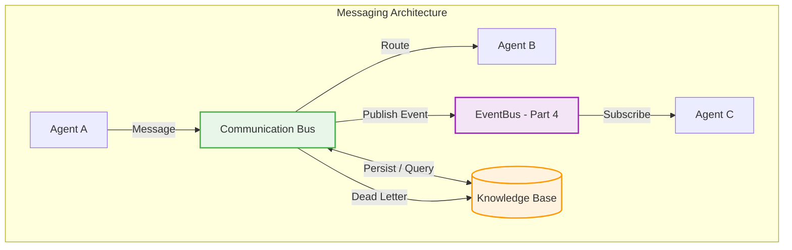

The **Communication Bus** (`components.md` §11) is the primary message-routing layer. It provides:

- **Addressing and Routing**: Messages are routed based on addressing schemes (direct agent IDs, topic names, channel IDs, or broadcast) defined by the `RoutingTable`.
- **Delivery Guarantees**: Configurable per message via `SendOptions` — at-least-once (default), exactly-once, or best-effort.
- **Transport Abstraction**: Supports in-process, network (mutual TLS), and hybrid topologies transparently.
- **Correlation**: Every message carries `correlation_id` and `causation_id` for tracing related operations across agents.
- **Buffering**: Messages are buffered per recipient with configurable size (`bufferSizePerRecipient: 1000`) and retention (`bufferRetentionMs: 300000`).
- **Dead-Letter Handling**: Undeliverable messages are moved to domain-specific dead-letter queues after configured retries.
- **Schema Validation**: All messages are validated against registered schemas before delivery (`schemaValidationEnabled: true`).

The **EventBus** (Part 4) underlies all event persistence and routing. It provides topic-based delivery with broadcast, point-to-point, hierarchical, and replay routing modes. The Communication Bus translates message semantics into EventBus events for durability and observability.

### 1.2 Message Envelope

All communication uses the canonical **Message Envelope** schema, which wraps the payload with routing, tracing, security, and metadata fields. The envelope is defined in `schemas.md` (Section 14: Message Schema) and aligns with the canonical event envelope defined in `events.md` (Section 4, 21 fields).

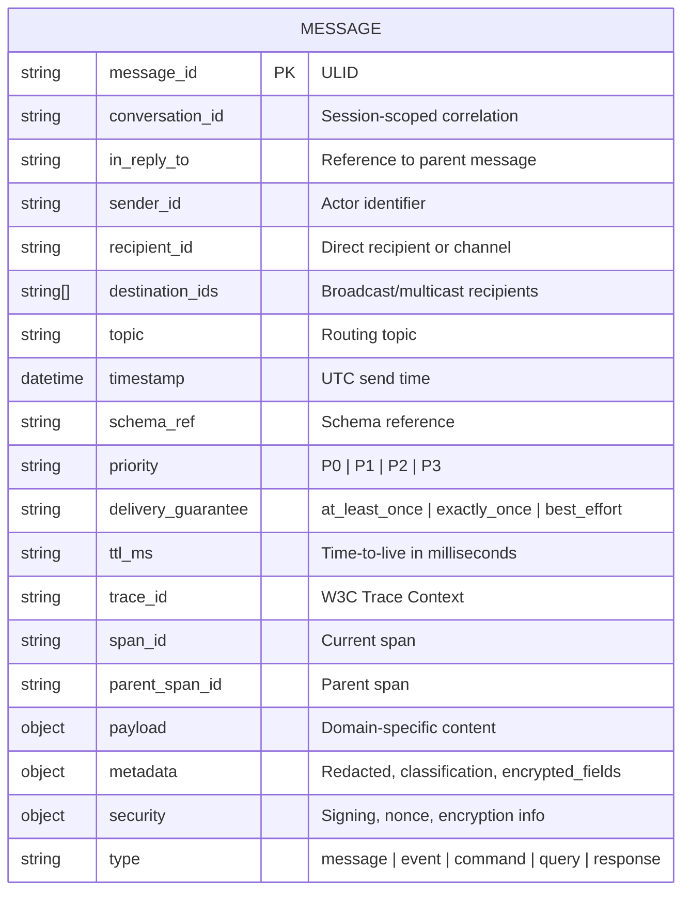

| Field | Type | Required | Description |
|-------|------|----------|-------------|
| `message_id` | string (ULID) | Yes | Globally unique message identifier. |
| `conversation_id` | string | Yes | Session-scoped correlation ID linking all messages in a collaboration session. |
| `in_reply_to` | string | No | Reference to a parent message for reply chains. |
| `sender_id` | string | Yes | Identity of the sending agent or component. |
| `recipient_id` | string | Conditional | Direct recipient identity (for direct messaging). |
| `destination_ids` | string[] | Conditional | List of recipients (for broadcast/multicast). |
| `topic` | string | Yes | Routing topic following `ai-os.event.<namespace>` convention. |
| `timestamp` | datetime | Yes | UTC send timestamp for ordering and expiry. |
| `schema_ref` | string | Yes | Reference to the schema governing `payload`. |
| `priority` | enum | Yes | P0–P3 priority lane (see §14). |
| `delivery_guarantee` | enum | Yes | Delivery semantics for this message. |
| `ttl_ms` | integer | No | Maximum time the message may remain undelivered. |
| `trace_id` | string | Yes | W3C Trace Context identifier for distributed tracing. |
| `span_id` | string | Yes | Current span identifier. |
| `parent_span_id` | string | No | Parent span in the trace hierarchy. |
| `payload` | object | Yes | Domain-specific message content. |
| `metadata` | object | Yes | Redaction, classification, and encryption metadata. |
| `security` | object | Yes | Signature, nonce, and encryption details. |
| `type` | enum | Yes | Message type: `message`, `event`, `command`, `query`, or `response`. |

### 1.3 Addressing and Routing

Messages are addressed and routed through a combination of explicit addressing and topic-based routing:

| Addressing Mode | Mechanism | Use Case |
|----------------|-----------|----------|
| Direct | `recipient_id` field | Point-to-point task delegation |
| Topic | `topic` field | Publish-subscribe collaboration events |
| Channel | Named channel ID | Private collaboration sessions |
| Broadcast | `destination_ids = ["*"]` | System-wide announcements |
| Multicast | `destination_ids = [id1, id2, …]` | Group notifications |

The `RoutingTable` is maintained dynamically by the Communication Bus and is updated by topology changes (agent registration, channel creation, consumer group changes). Routing follows the topic naming convention defined in `events.md` §25: `ai-os.event.<namespace>.<aggregate>.<action>[.<qualifier>]` with namespaces including `workflow`, `council`, `delegation`, `knowledge`, `context`, `runtime`, `communication`, `security`, `monitoring`, `scheduler`, and `system`.

### 1.4 Communication Channels

Communication channels provide scoped, persistent conduits for message exchange. Channels are created via `IMessageBus.createChannel()` and are associated with collaboration sessions, agent groups, or domain boundaries.

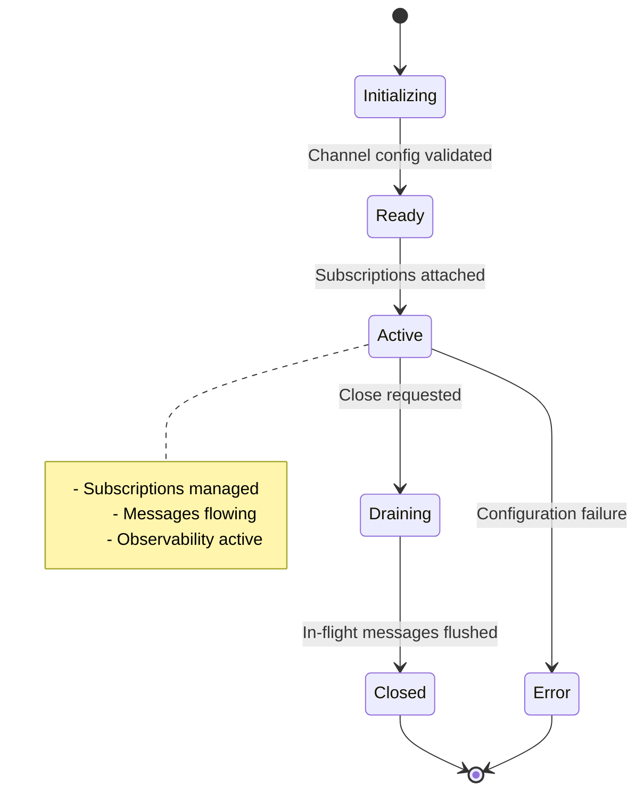

| Channel Property | Description |
|----------------|-------------|
| `channel_id` | Unique channel identifier |
| `scope` | Session-scoped or domain-scoped |
| `routing_rules` | Topic and pattern-based routing |
| `delivery_guarantee` | Default guarantee for channel messages |
| `retention_policy` | Message retention duration |
| `access_control` | ACL governing who may publish/subscribe |
| `partition_key` | Key for ordering and distribution |

---

## 2. Request-Response

### 2.1 Pattern Description

Request-response is a synchronous pattern where a sender issues a request and awaits a reply. It is used for direct agent interaction, query resolution, and confirmation-required operations. While event-driven patterns are preferred where latency permits (`context.md` Engineering Guideline #3), request-response remains necessary for immediate feedback.

| Aspect | Description |
|--------|-------------|
| **Pattern** | Request → Processing → Reply |
| **Correlation** | `conversation_id` links request and response; `in_reply_to` references the request `message_id` |
| **Timeout** | Configurable per request; default is bounded by session-level SLA |
| **Guarantee** | At-least-once by default; exactly-once for idempotent operations |
| **Routing** | Direct to `recipient_id` or via topic with response-to address |
| **Error Handling** | Timeouts trigger error response; retries use exponential backoff |
| **Observability** | Trace spans link request and response; metrics track latency and error rate |

### 2.2 Sequence

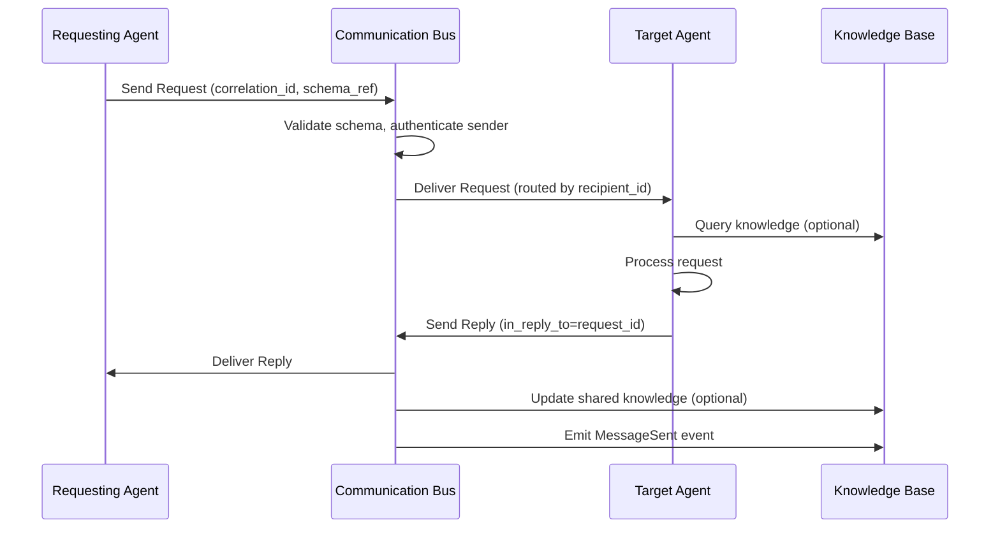

### 2.3 Cross-References

- Request-response is the foundation for **Task Delegation** (§12.4) and **Council Voting** (§12.5).
- Security enforcement is handled by the **Security Gateway** (Part 2).
- Observability spans are defined in **Part 3**.

---

## 3. Publish-Subscribe

### 3.1 Pattern Description

Publish-subscribe is an asynchronous pattern where publishers emit messages to topics and subscribers receive them based on their subscription filters. It is the primary pattern for collaboration events, lifecycle notifications, and broadcast communication.

| Aspect | Description |
|--------|-------------|
| **Pattern** | Publisher → Topic → Subscribers |
| **Subscription** | Topic-based with optional content filters |
| **Delivery** | Fan-out to all matching subscribers; ordered per partition key |
| **Durability** | Subscriptions may be durable (persistent) or ephemeral |
| **Scalability** | Subscriber groups distribute load across instances |
| **Error Handling** | Failed deliveries are retried; persistent failures go to DLQ |

### 3.2 Routing Modes

The EventBus supports four routing modes for publish-subscribe:

| Mode | Description | Use Case |
|------|-------------|----------|
| Broadcast | Deliver to all subscribers | System-wide announcements |
| Point-to-Point | Deliver to one subscriber in a group | Load-balanced task processing |
| Hierarchical | Deliver to subscribers in topic hierarchy | Namespaced event routing |
| Replay | Redeliver historical events | State recovery, new subscribers |

### 3.3 Sequence

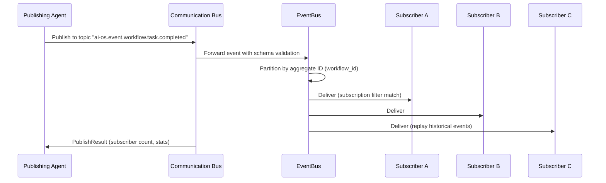

### 3.4 Cross-References

- Publish-subscribe is enabled by the **EventBus** (Part 4) and used by all **Event Families** (`events.md`, §12–22).
- Subscription ACLs are enforced by the **Security Gateway** (Part 2).
- Dead-letter topics for failed deliveries are defined in `events.md` §9.

---

## 4. Event-Driven Communication

### 4.1 Pattern Description

Event-driven communication is the preferred interaction model for collaboration-critical events. Producers emit events asynchronously; consumers react to them. This pattern decouples producers from consumers and enables scalable, resilient communication.

Per `context.md` Engineering Guideline #3, event-driven interaction is preferred over synchronous request-reply where latency permits. The Communication Bus ensures at-least-once delivery for collaboration-critical events (Runtime Assumption #6).

| Aspect | Description |
|--------|-------------|
| **Pattern** | Emit Event → Consumer Reaction |
| **Ordering** | Per partition key (workflow_id, session_id, agent_id) |
| **Idempotency** | event_id deduplication (24h window); correlation_id for per-workflow idempotency |
| **Durability** | Events persisted in EventBus (hot tier, 30 days) |
| **Replay** | Subscribers can replay from any offset |
| **Priority** | P0–P3 lanes with preemption and cooperative slowdown |

### 4.2 Event Priority Lanes

The system implements four priority lanes for event delivery:

| Priority | Delivery Semantics | Use Cases |
|----------|-------------------|-----------|
| P0 | Immediate, preempts slower lanes | Security violations, halted workflows, system emergencies |
| P1 | Standard, durable, at-least-once | Lifecycle events, delegation offers, council decisions |
| P2 | Standard, lower priority | Registration events, knowledge writes, channel operations |
| P3 | Bulk, subject to cooperative slowdown | Heartbeats, metrics, delivery confirmations |

### 4.3 Transactional Outbox Pattern

To ensure consistency between state changes and event emission, producers use the **Transactional Outbox** pattern:

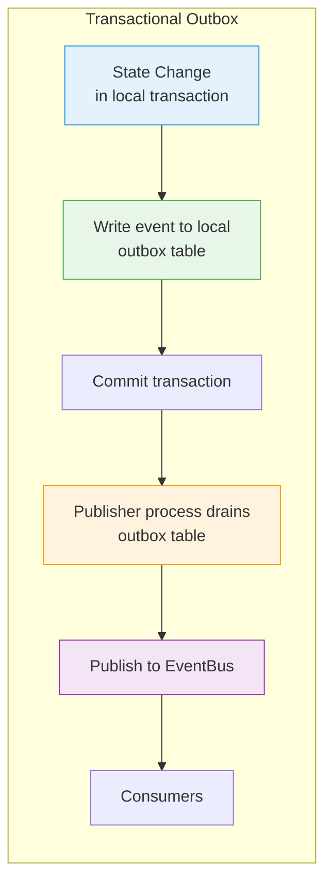

1. The producer writes the event to a local outbox table within the same database transaction as the state change.
2. Upon transaction commit, the event is guaranteed to be persisted.
3. A separate publisher process reads and drains the outbox, publishing events to the EventBus.
4. If publishing fails, the publisher retries with exponential backoff.
5. If retries are exhausted, the event enters the dead-letter queue.

### 4.4 Event Families Relevant to Communication

The communication event family (`events.md` §12) defines 8 events:

| Event | Priority | Persistence | Description |
|-------|----------|-------------|-------------|
| `communication.message.sent` | P1 | Persisted | A message was sent by an agent or component. |
| `communication.message.received` | P1 | Persisted | A message was received and acknowledged. |
| `communication.channel.opened` | P2 | Persisted | A communication channel was created. |
| `communication.channel.closed` | P2 | Persisted | A communication channel was closed. |
| `communication.bridge.published` | P1 | Persisted | A bridge message was published to external systems. |
| `communication.bridge.failed` | P1 | Persisted | A bridge message failed to publish. |
| `communication.typing.indicator` | — | Ephemeral | Typing indicator (not persisted). |
| `communication.presence.changed` | P3 | Persisted | Agent or component presence status changed. |

### 4.5 Cross-References

- Event-driven communication relies on the **EventBus** (Part 4) and **Communication Bus** (`components.md` §11).
- Event schemas are governed by the **Schema Registry** (`schemas.md`).
- Dead-letter handling is defined in §9 (Reliability).

---

## 5. Streaming

### 5.1 Pattern Description

Streaming enables continuous, real-time data flow between agents and components. Unlike request-response or publish-subscribe, streaming maintains a long-lived connection that carries a continuous sequence of messages.

| Aspect | Description |
|--------|-------------|
| **Pattern** | Continuous stream of messages over persistent connection |
| **Ordering** | Strict ordering within stream partition |
| **Backpressure** | Flow-control windows (see §10) |
| **Delivery** | At-least-once; stream checkpointing for recovery |
| **Partitioning** | Streams partitioned by key for parallelism |
| **Retention** | Stream retained for replay window (configurable) |

### 5.2 Streaming Architecture

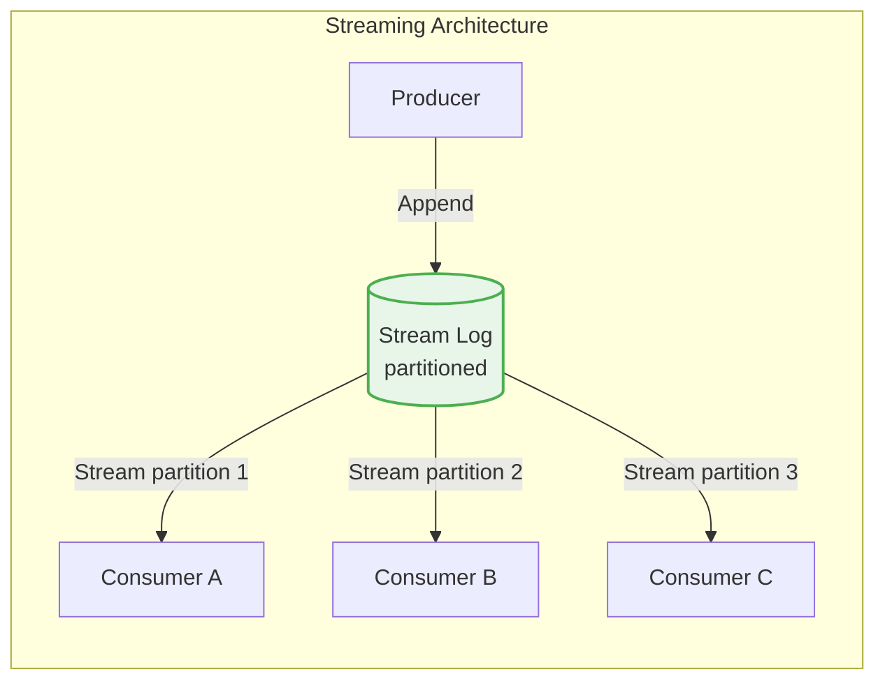

Streams are backed by partitioned logs. Each partition maintains strict ordering. Consumers within a consumer group share partitions, enabling horizontal scaling. Checkpointed positions allow consumers to resume after failure.

### 5.3 Use Cases

| Use Case | Stream | Description |
|----------|--------|-------------|
| Real-time agent metrics | `system.metrics.stream` | Continuous metrics from active agents |
| Knowledge base change log | `knowledge.changelog` | Stream of knowledge object mutations |
| Collaboration transcript | `session.transcript` | Real-time transcript of session messages |
| Decision log | `council.decisions.log` | Stream of council decisions as they occur |

### 5.4 Cross-References

- Streaming leverages the **EventBus** log-based replication (Part 4).
- Stream schemas are validated via the **Schema Registry** (`schemas.md`).
- Backpressure handling is defined in §10.

---

## 6. Broadcast

### 6.1 Pattern Description

Broadcast delivers a message to all agents or components simultaneously. It is used for system-wide announcements, presence updates, and notifications where every participant must receive the message.

| Aspect | Description |
|--------|-------------|
| **Pattern** | Sender → All recipients |
| **Delivery** | Best-effort fan-out with at-least-once semantics for critical broadcasts |
| **Targeting** | Wildcard (`*`) destination or system-wide topic |
| **Ordering** | P0 broadcasts preempt lower-priority streams |
| **Security** | Broadcasters must be authenticated and authorized for system-level topics |

### 6.2 Broadcast Topologies

| Topology | Description | Use Case |
|----------|-------------|----------|
| Flat Broadcast | Single sender to all nodes | System-wide alerts |
| Hierarchical Broadcast | Multi-level fan-out via intermediate routers | Large-scale deployments |
| Scoped Broadcast | Broadcast within a namespace | Domain-specific announcements |

### 6.3 Sequence

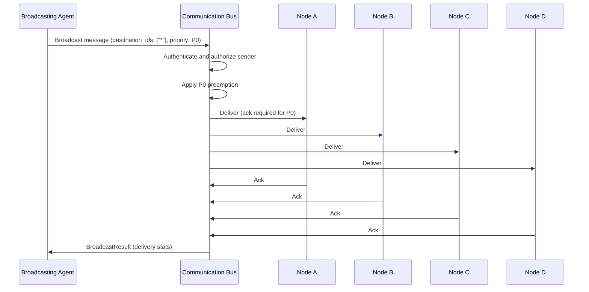

### 6.4 Priority Preemption

P0 broadcasts preempt lower-priority traffic. The Communication Bus temporarily suspends delivery of P1–P3 messages on the affected partition to ensure immediate delivery of security or emergency broadcasts.

---

## 7. Multicast

### 7.1 Pattern Description

Multicast delivers a message to a specific subset of agents or components. Unlike broadcast (all recipients) or direct messaging (single recipient), multicast targets a defined group identified by group ID, capability tag, or explicit recipient list.

| Aspect | Description |
|--------|-------------|
| **Pattern** | Sender → Group of recipients |
| **Group Definition** | Explicit `destination_ids`, capability-based group, or topic subscription |
| **Delivery** | At-least-once per group member |
| **Ordering** | Per multicast group ordering key |
| **Efficiency** | Single message with multiple routing entries |

### 7.2 Multicast vs. Direct vs. Broadcast

| Feature | Direct | Multicast | Broadcast |
|---------|--------|-----------|-----------|
| Recipient count | 1 | N (>1) | All |
| Routing | `recipient_id` | `destination_ids` list | `destination_ids: ["*"]` |
| Overhead | Minimal | Moderate | High |
| Ordering | Per recipient | Per group | Per partition |
| Security | Point-to-point ACL | Group ACL | System ACL |

### 7.3 Example: Capability-Based Multicast

```mermaid
flowchart TD
    subgraph "Capability-Based Multicast"
        Orchestrator[Orchestrator]
        Bus[Communication Bus]
        AG1[Agent: security.scan]
        AG2[Agent: security.scan]
        AG3[Agent: code.analysis]
        AG4[Agent: security.scan]
        AG5[Agent: data.transform]

        Orchestrator -->|Multicast: destination_ids=[AG1, AG2, AG4]| Bus
        Bus --> AG1
        Bus --> AG2
        Bus --> AG4
    end

    style Bus fill:#e8f5e9,stroke:#4caf50,stroke-width:2px
```

The orchestrator identifies all agents with the `security.scan` capability and multicasts a scan request. Only matching agents receive the message. Capability-based multicast is resolved using the **Agent Registry** (`components.md` §12.3).

### 7.4 Cross-References

- Multicast groups are managed by the **Agent Registry** (Part 11) and **Capability Registry** (`components.md`).
- Message authorization is enforced by the **Security Gateway** (Part 2).

---

## 8. Direct Messaging

### 8.1 Pattern Description

Direct messaging delivers a message to a single, explicitly named recipient. It is the most fundamental pattern, used for one-to-one agent interaction, task delegation, and reply messages.

| Aspect | Description |
|--------|-------------|
| **Pattern** | Sender → Single recipient |
| **Addressing** | Explicit `recipient_id` (agent ID, component ID, or channel ID) |
| **Reply** | `in_reply_to` field references the parent message |
| **Delivery** | Configurable guarantee; default at-least-once |
| **Confidentiality** | End-to-end encryption available for sensitive direct messages |
| **Ordering** | Per sender-recipient pair ordering |

### 8.2 Direct Messaging Sequence

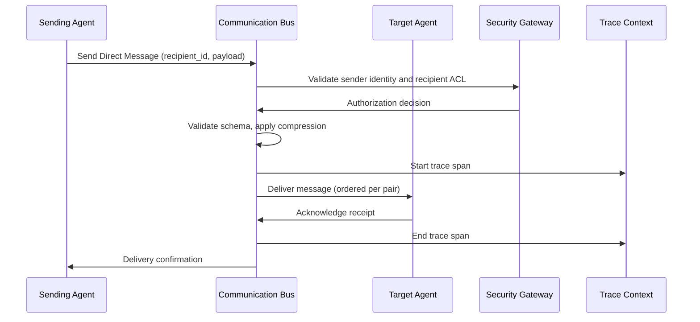

### 8.3 Use Cases

| Use Case | Recipient | Description |
|----------|-----------|-------------|
| Task delegation | Target agent | Delegation offer with task specification |
| Query resolution | Target agent | Requesting information from another agent |
| Reply to request | Original sender | Response to a prior request |
| Private context | Session channel | Messages within a private collaboration channel |

---

## 9. Reliability

### 9.1 Delivery Guarantees

The Communication Bus supports three delivery guarantee levels, configurable per message via `SendOptions` (`components.md` §11):

| Guarantee | Description | Use Case |
|-----------|-------------|----------|
| At-Least-Once | Message is delivered one or more times; duplicates possible | Default for collaboration-critical events (`context.md` Runtime Assumption #6) |
| Exactly-Once | Message is delivered exactly once; requires idempotent producer and consumer | Transactional operations, state mutations |
| Best-Effort | No delivery guarantee; message may be dropped | Monitoring, metrics, non-critical telemetry |

### 9.2 Retry and Dead-Letter Handling

When a message cannot be delivered, the Communication Bus applies the configured retry policy:

| Parameter | Default | Description |
|-----------|---------|-------------|
| `retryCount` | 3 | Maximum delivery retry attempts |
| `retryBackoffStrategy` | exponential | Backoff strategy |
| `retryBackoffBaseMs` | 1000 | Base delay for exponential backoff |

The exponential backoff sequence follows: 200ms → 1s → 4s → 16s → 64s (per `events.md` §9). For terminal-state events, the default retry count is 10.

After retries are exhausted, the message is moved to a **Dead-Letter Queue** (DLQ).

### 9.3 Dead-Letter Queues

Dead-letter queues are organized by domain to facilitate targeted remediation (`events.md` §9):

| DLQ Topic | Domain | Contents |
|-----------|--------|----------|
| `workflow.dlq` | Workflow | Messages related to workflow execution and task transitions |
| `council.dlq` | Council | Voting, decision, and quorum messages |
| `delegation.dlq` | Delegation | Task delegation and acceptance messages |
| `knowledge.dlq` | Knowledge | Knowledge object creation and update messages |
| `communication.dlq` | Communication | Direct messages, channel operations, and bridge messages |
| `security.dlq` | Security | Security violation and authentication messages |
| `monitoring.dlq` | Monitoring | Metrics and health-check messages |
| `system.dlq` | System | System-wide infrastructure messages |

DLQ replay requires:
- Specification of an offset window for replay.
- Schema version compatibility verification.
- Authorization check for the replay caller.

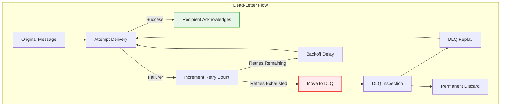

### 9.4 Recovery Strategies

The Communication Bus implements recovery strategies for each failure mode (`components.md` §11):

| Failure Mode | Recovery Strategy |
|--------------|-------------------|
| Transport partition | Message buffering and eventual delivery |
| Recipient unavailability | Buffering and retry with exponential backoff |
| Schema violation | Rejection and sender notification |
| Dead-letter overflow | Overflow policy (drop oldest, reject new, alert) |
| Routing loop | Detection via message ID tracking; configuration correction |

### 9.5 Idempotency

To safely support at-least-once delivery, message handlers must be idempotent (`events.md` §7):

| Mechanism | Scope | Duration |
|-----------|-------|----------|
| `event_id` deduplication | System-wide | 24 hours |
| `correlation_id` per-workflow idempotency | Per collaboration session | Session lifecycle |
| Version-stamped projection updates | Per projection | Event version gating |

### 9.6 Cross-References

- Retry policies and DLQ configuration are defined in `events.md` §9.
- Idempotent handler patterns are used in **Task Delegation** (§12.4).
- Recovery strategies for agent failures are defined in **Part 12.9** (Failure Handling).

---

## 10. Backpressure

### 10.1 Backpressure Mechanisms

Backpressure prevents system overload by allowing consumers to signal their capacity limits to producers. The Communication Bus implements two complementary mechanisms:

| Mechanism | Description | Scope |
|-----------|-------------|-------|
| Cooperative Slowdown | Broker denies delivery if consumer commits past a configured lag threshold | Per-recipient |
| Load Shedding | System sheds load by dropping or delaying low-priority (P3) messages under overload | System-wide |

### 10.2 Cooperative Slowdown

When a consumer's pending message queue exceeds `bufferSizePerRecipient` (default: 1000) with a lag threshold, the Communication Bus signals backpressure (`components.md` §11, Future Evolution):

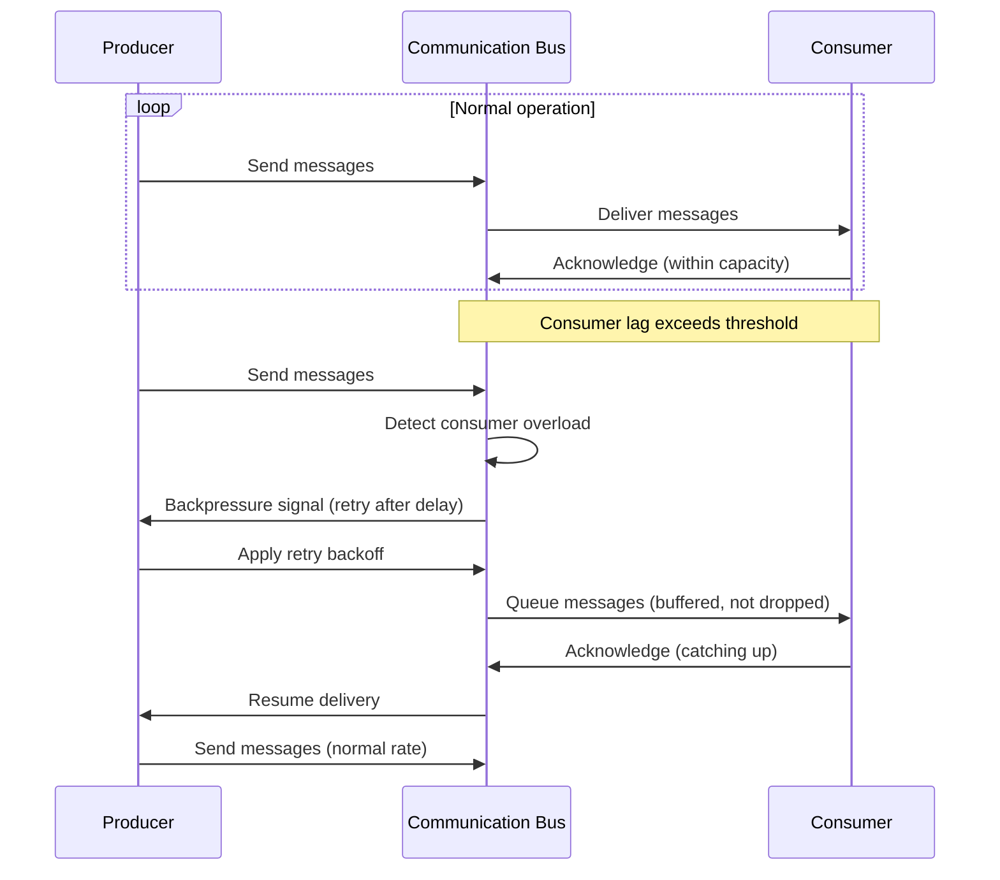

### 10.3 System Backpressure Flow

System-wide backpressure follows a defined flow from bottleneck detection to recovery (`events.md` §9, Backpressure):

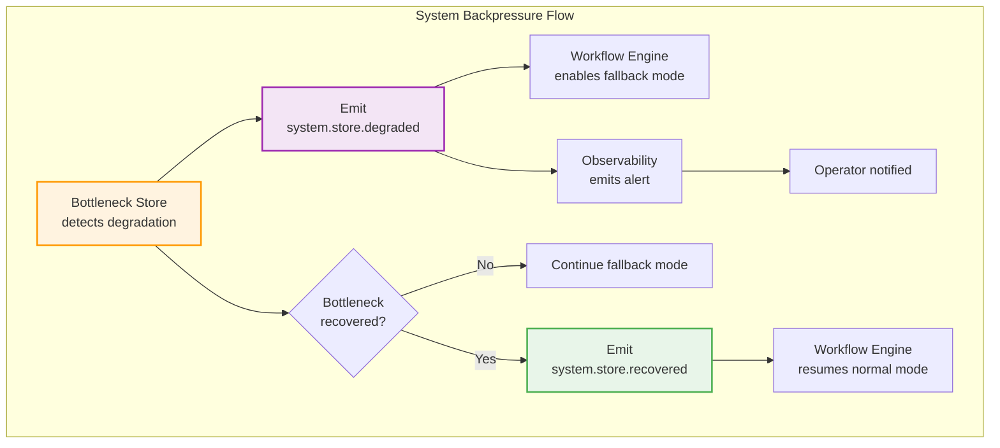

1. The bottleneck store detects throughput degradation and emits `system.store.degraded`.
2. The Workflow Engine enables fallback mode (e.g., reduced parallelism, longer timeouts).
3. Observability emits an alert for operator awareness.
4. When the bottleneck recovers, `system.store.recovered` is emitted.
5. The Workflow Engine resumes normal operation.

### 10.4 Shed-Load Strategy

Under extreme load, the Communication Bus employs a **shed-load-then-cooperate-slowdown** strategy:

1. **Shed Load**: P3 (bulk) messages are dropped or delayed to protect P0–P2 traffic.
2. **Cooperative Slowdown**: Producers receive explicit backpressure signals and apply exponential backoff.
3. **Recovery**: As load returns to normal, shed messages are replenished from retained buffers (for messages with retention) and delivery resumes at normal rate.

### 10.5 Cross-References

- Backoff parameters are defined in the **Configuration** table (`components.md` §11).
- System backpressure events are part of the **System Event Family** (`events.md` §21).
- Observability alerts are defined in **Part 3**.

---

## 11. Communication Security

### 11.1 Security Model

Communication security is enforced at multiple layers by the **Security Gateway** (Part 2) and the Communication Bus (`components.md` §11):

| Layer | Mechanism | Scope |
|-------|-----------|-------|
| Authentication | Sender identity embedded in message envelope | All messages |
| Authorization | Per-recipient ACL | All message deliveries |
| Encryption | Payload encryption for sensitive messages | Confidential / Secret messages |
| Transport Security | Mutual TLS for network communication | Network transport |
| Replay Protection | Nonce and timestamp validation | All messages |
| Message Integrity | Ed25519 signature on envelope | All persisted messages |

### 11.2 Compliance Classifications

Messages are classified according to compliance requirements (`events.md` §8):

| Classification | PII Policy | Encryption | Audit Trail |
|----------------|------------|------------|-------------|
| Internal | No PII; no redaction | Not required | Standard |
| Confidential | PII present; redaction mandatory | Optional but recommended | Enhanced |
| Secret | Credentials or keys | Required | Full audit |

```mermaid
flowchart TD
    subgraph "Classification-Based Security"
        Msg[Message Created] --> Classify[Classify by Content]
        Classify -->|internal| Internal[Standard handling]
        Classify -->|confidential| Confidential[PII redaction + encryption]
        Classify -->|secret| Secret[End-to-end encryption + audit]
        Confidential --> Deliver
        Secret --> Deliver
        Internal --> Deliver
        Deliver[Deliver via Bus] --> EventBus[EventBus<br/>(Persisted)]
        EventBus --> Sign[Cryptographic Sealing<br/>(Ed25519)]
    end

    style Internal fill:#e8f5e9,stroke:#4caf50
    style Confidential fill:#fff3e0,stroke:#ff9800
    style Secret fill:#ffebee,stroke:#f44336
    style Sign fill:#f3e5f5,stroke:#9c27b0
```

### 11.3 Cryptographic Event Sealing

For persisted messages and events, the system applies cryptographic sealing (`events.md` §8):

| Mechanism | Description |
|-----------|-------------|
| Ed25519 Signatures | Each event is signed with the producer's private key; signature stored in `security.signature` |
| Chain Anchoring | Every 256 events, a Merkle root is computed and anchored for tamper evidence |
| Nonce + Timestamp | Replay protection via unique nonce and timestamp validation |
| Previous Signature | Chain integrity via `security.previous_signature` linking to prior event |

### 11.4 Dead-Letter Security

Dead-letter queues enforce additional security controls (`components.md` §11, Security):

| Control | Description |
|---------|-------------|
| Access Control | DLQ contents are access-controlled; only authorized remediation agents may read |
| Sensitive Redaction | Messages classified as confidential or secret have sensitive fields redacted before DLQ storage |
| Audit Logging | All DLQ access and mutations are logged with full audit trail |
| Expiration | `maxDeadLetterAgeMs: 604800000` (7 days) before permanent discard |

### 11.5 Cross-References

- Authentication and authorization interfaces are defined by the **Security Gateway** (Part 2).
- Message signing and encryption use schemas from `schemas.md` (Section 14: Message Schema).
- Audit trail requirements are defined in **Part 3** (Observability).

---

## 12. Transport Abstraction

### 12.1 Transport Models

The Communication Bus provides transport abstraction, supporting three deployment topologies (`components.md` §11):

| Transport Model | Description | Use Case |
|----------------|-------------|----------|
| In-Process | Same process, direct method call | Agent-to-agent within same runtime |
| Network | Inter-process, TCP/TLS | Distributed agent deployment |
| Hybrid | Combination of in-process and network | Mixed deployment topologies |

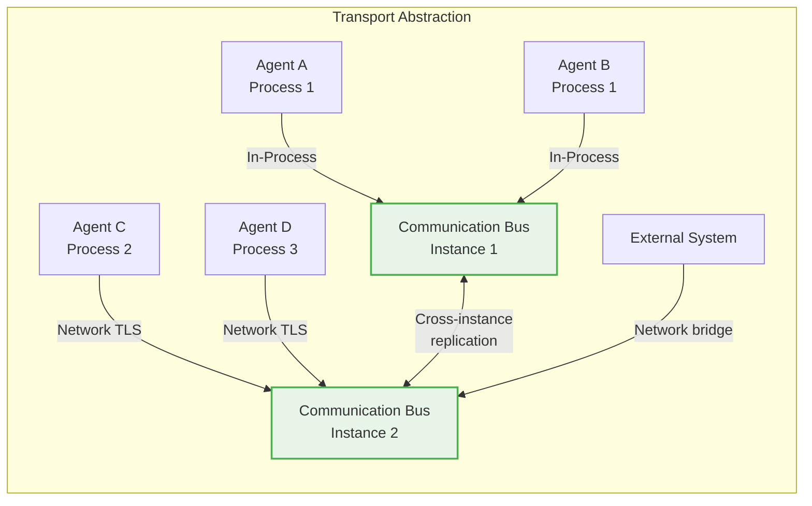

### 12.2 Transport Configuration

Transport behavior is configured via the Communication Bus configuration parameters (`components.md` §11):

| Parameter | Default | Description |
|-----------|---------|-------------|
| `defaultDeliveryGuarantee` | at-least-once | Default delivery guarantee for messages |
| `maxMessageSizeBytes` | 1,048,576 | Maximum message payload size (1 MB) |
| `bufferSizePerRecipient` | 1000 | Message buffer size per recipient |
| `bufferRetentionMs` | 300,000 | Buffered message retention period (5 minutes) |
| `retryCount` | 3 | Maximum delivery retry attempts |
| `retryBackoffStrategy` | exponential | Backoff strategy for retries |
| `retryBackoffBaseMs` | 1000 | Base retry delay in milliseconds |
| `deadLetterEnabled` | true | Whether dead-letter queue is active |
| `maxDeadLetterAgeMs` | 604,800,000 | Dead-letter retention (7 days) |
| `schemaValidationEnabled` | true | Whether schema validation is enforced |
| `compressionEnabled` | false | Whether message payloads are compressed |
| `correlationEnabled` | true | Whether correlation IDs are auto-generated |

### 12.3 Partitioning and Scaling

The Communication Bus scales horizontally through partitioning (`components.md` §11, Scalability):

| Scaling Dimension | Strategy |
|-------------------|----------|
| Topic partitioning | Messages partitioned by topic and channel across worker nodes |
| Routing parallelization | Message routing parallelized across partitions |
| Subscriber fan-out | Optimized via hierarchical delivery trees |
| DLQ processing | Batch-executed during low-traffic windows |

Default partition keys (`events.md` §5):
- `workflow_id` for workflow events
- `session_id` for collaboration session events
- `council_session_id` for council events
- `agent_id` for agent-specific events
- `system` (synthetic key) for system-wide events

### 12.4 Transport Failure Handling

Network transport failures are handled with built-in resilience:

| Failure | Handling |
|---------|----------|
| Network partition | Message buffering on sender side; eventual reconciliation on partition recovery |
| TLS handshake failure | Connection rejected; error logged; alert emitted |
| Certificate expiry | Automatic reload of rotated certificates; old connections gracefully drained |
| DNS resolution failure | Retry with exponential backoff; fallback to last-known endpoint cache |

### 12.5 Cross-References

- Transport abstraction leverages the **EventBus** (Part 4) for underlying event persistence and routing.
- Partitioning strategy aligns with `events.md` §5 (Partitioning).
- Configuration management is defined in **Part 10**.
- Observability for transport metrics is defined in **Part 3**.

---

## 13. Communication Patterns Summary

### 13.1 Pattern Summary

The following table summarizes the communication patterns supported by the architecture and their mapping to use cases:

| Pattern | Ordering | Delivery Guarantee | Use Case | Cross-Reference |
|---------|----------|-------------------|----------|-----------------|
| Request-Response | Per conversation | At-least-once | Task delegation, query resolution | §2, Part 12.4 |
| Publish-Subscribe | Per partition key | At-least-once | Collaboration events, lifecycle notifications | §3, Part 4 |
| Event-Driven | Per partition key | At-least-once (default) | All collaboration-critical events | §4, `context.md` §3 |
| Streaming | Per stream partition | At-least-once | Real-time metrics, knowledge change log | §5 |
| Broadcast | Per partition | Best-effort (P0: ack-required) | System-wide announcements, security alerts | §6 |
| Multicast | Per group | At-least-once | Capability-based group messaging | §7, Part 11 |
| Direct | Per sender-recipient pair | Configurable | One-to-one agent interaction, replies | §8 |

### 13.2 Pattern Selection Matrix

| Scenario | Recommended Pattern | Rationale |
|----------|-------------------|-----------|
| Task delegation to a specific agent | Direct Messaging | Exact recipient targeting |
| Broadcasting a security alert | Broadcast (P0) | All agents must receive immediately |
| Sending a task to all scan-capable agents | Multicast | Group-based recipient selection |
| Streaming real-time metrics | Streaming | Continuous, ordered data flow |
| Notifying subscribers of task completion | Publish-Subscribe | Event-driven fan-out |
| Asking a peer agent for information | Request-Response | Immediate reply needed |
| Publishing workflow lifecycle events | Event-Driven | Decoupled, durable event flow |

---

## 14. Communication Topology

### 14.1 Architectural Layers

The communication architecture is organized into layers aligned with the collaboration architecture (Part 12.2):

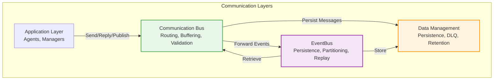

| Layer | Responsibility | Dependencies |
|-------|----------------|--------------|
| Application | Agent and component message production/consumption | Communication Bus API |
| Communication Bus | Message routing, buffering, delivery guarantees, schema validation | EventBus, Security Gateway, Data Management |
| EventBus | Event persistence, partitioning, replay, topic routing | Part 4 core |
| Data Management | Long-term storage, DLQ, retention tiers | Part 6 |

### 14.2 End-to-End Communication Flow

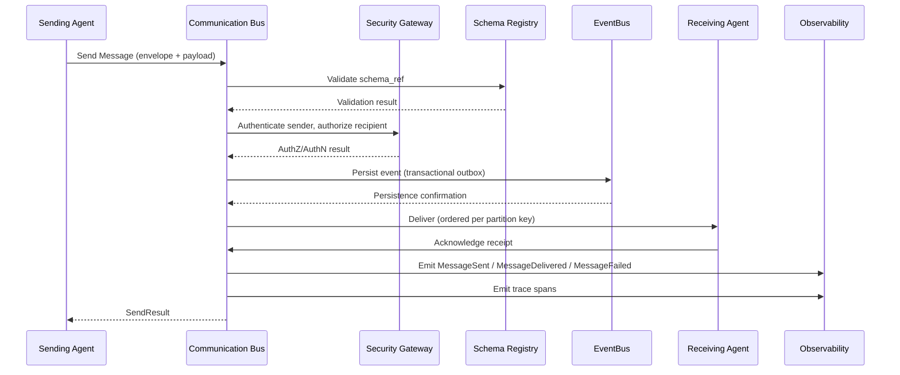

### 14.3 Cross-References

- The Communication Bus component is fully specified in `components.md` §11.
- EventBus core architecture is defined in **Part 4**.
- Data management for message persistence is defined in **Part 6**.
- Schema governance is defined in `schemas.md`.
- Security enforcement is defined in **Part 2**.
- Observability instrumentation is defined in **Part 3**.

---

## 15. Cross-Part Dependencies

### 15.1 Architecture Parts Referencing Communication

| Part | Communication Aspect | Reference |
|------|---------------------|-----------|
| Part 1 | Resource isolation and basic messaging | §2.3 (Communication Primitives) |
| Part 2 | Security framework for message authentication and authorization | §3 (Security Policies) |
| Part 3 | Observability instrumentation for message lifecycle tracing | §4 (Tracing), §5 (Metrics) |
| Part 4 | EventBus core for event persistence and routing | §6 (Event Routing), §7 (Partitioning) |
| Part 5 | Configuration management for communication parameters | §8 (Configuration Governance) |
| Part 6 | Data management for message and DLQ persistence | §9 (Persistent Store), §10 (Retention) |
| Part 7 | Agent communication boundaries and message schemas | §12.7 (this document) |
| Part 8 | Scheduling and timing for message delivery | §13 (Task Timing), §14 (SLA Enforcement) |
| Part 9 | Failure handling and recovery | §15 (Recovery Strategies) |
| Part 10 | Configuration management | §16 (Configuration Schema) |
| Part 11 | Agent directory and routing | §17 (Directory Services) |
| Part 12.1 | High-level interaction model | §4 (Interaction Model), §5 (Interaction Patterns) |
| Part 12.2 | Collaboration architecture layers | §1 (Collaboration Layers) |
| Part 12.3 | Agent lifecycle | §3 (Agent States) |
| Part 12.4 | Task delegation workflow | §4 (Task Delegation) |
| Part 12.5 | Council and consensus | §5 (Decision Synchronization) |
| Part 12.6 | Shared context | §6 (Context Propagation) |
| Part 12.8 | Workflow orchestration | §8 (Workflow Execution) |
| Part 12.9 | Failure handling | §9 (Recovery) |
| Part 12.10 | Governance | §10 (Governance Policies) |
| Part 12.11 | Observability | §11 (Instrumentation) |
| Part 12.12 | Advanced topics | §12 (Extensibility) |
| Part 12.13 | Future evolution | §13 (Future Work) |

### 15.2 External Standard References

| Standard | Relevance | Reference |
|----------|-----------|-----------|
| W3C Trace Context | Distributed tracing (`trace_id`, `span_id`) | §1.2 |
| CloudEvents | Event envelope compatibility | `events.md` §8 |
| OpenAPI / JSON Schema | Message and schema validation | `schemas.md` §2 |
| Actor Model | Conceptual foundation for agent messaging | `glossary.md` §25 |
| CQRS / Event Sourcing | State recovery via event replay | §4.3, Part 12.6 |
| OWASP | Security Gateway enforcement | Part 2, §11 |
| ISO/IEC 42001 | AI governance and audit | Part 2 |

---

## 16. Communication Performance and SLA

### 16.1 Performance Targets

| Metric | p99 Target | Rationale |
|--------|-----------|----------|
| In-process message dispatch | < 10ms | Agent-to-agent responsiveness |
| Network message dispatch | < 100ms | Distributed agent communication |
| Subscription delivery | < 50ms | Event-driven reaction speed |
| Dead-letter processing | < 200ms | Fast failure detection |
| Throughput | 100,000 msg/sec per instance | Scale across agent populations |

### 16.2 Service Level Objectives

| Priority | Latency (99th percentile) | Reliability |
|----------|--------------------------|-------------|
| P0 | < 100ms | 99.99% |
| P1 | < 500ms | 99.95% |
| P2 | < 2s | 99.9% |
| P3 | Best-effort | 99% |

### 16.3 Scalability Targets

| Dimension | Target |
|-----------|--------|
| Maximum agents per session | 100 |
| Maximum concurrent sessions | 10,000 |
| Maximum message size | 1 MB |
| Maximum subscribers per topic | 1,000 |
| Maximum topics | 100,000 |
| Retention — hot tier | 30 days (high-performance WORM) |
| Retention — warm tier | 1 year (compressed) |
| Retention — cold tier | 7 years (immutable, content-addressable) |

---

## 17. Communication Lifecycle

### 17.1 Message Lifecycle States

A message within the Communication Bus progresses through the following states:

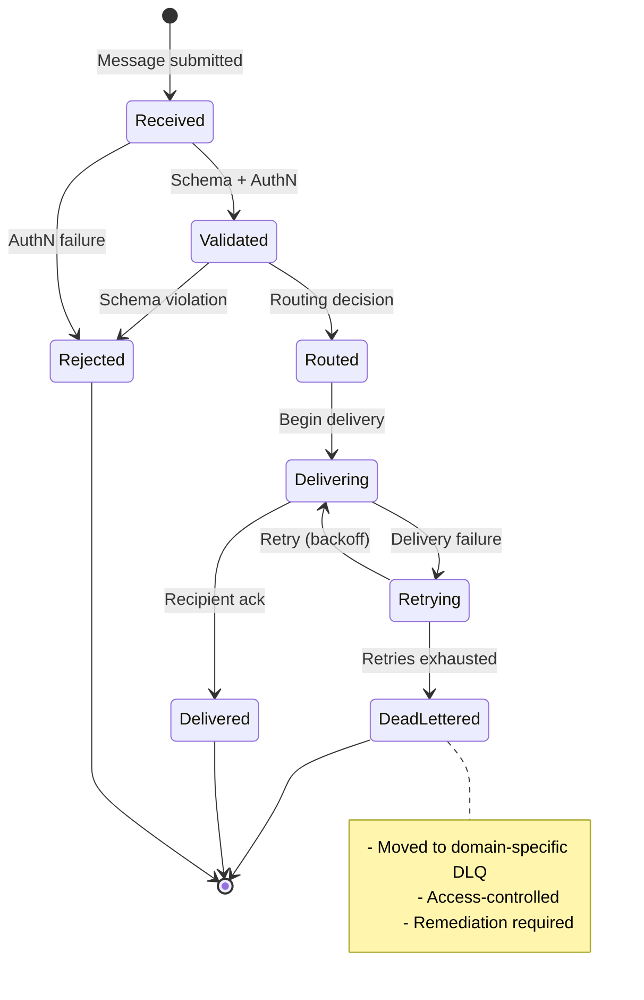

### 17.2 Channel Lifecycle

Communication channels follow a defined lifecycle (`components.md` §11, Lifecycle):

| State | Description |
|-------|-------------|
| Initializing | Transport layer initialized; routing table loaded; channels created |
| Running | Active message routing and delivery; subscriptions managed |
| Degraded | Partial delivery failures; retry and buffering active |
| Recovered | Delivery failures resolved; buffered messages flushed |
| Shutdown | Subscriptions cancelled; buffered messages persisted; transport closed |

### 17.3 Cross-References

- Message lifecycle is traced via observability spans (Part 3).
- Channel lifecycle mirrors agent lifecycle (Part 12.3, Lifecycle).
- Recovery strategies are defined in §9 (Reliability) and Part 12.9 (Failure Handling).

---

*End of Part 12.7 Multi-Agent Communication Architecture.*

---

**Document Controls**

| Field | Value |
|-------|-------|
| Document Version | 1.0.0 |
| Last Updated | 2026-08-08 |
| Status | ACTIVE |
| AI-OS Architecture Specification | v1.0 |