# Part 12.8 — Resource Coordination and Scheduling

> **Scope**
> This chapter defines the architectural design for resource coordination within the multi-agent collaboration layer. It specifies how compute, agent capacity, bandwidth, quota, and execution slots are allocated, scheduled, negotiated, reserved, load-balanced, and optimized across workflows, delegations, sessions, and councils.
>
> This document is architecture-only. It does not prescribe infrastructure topology, cloud specifics, or implementation languages.

---

## 1. Purpose and Scope

Collaboration in AI-OS is resource-intensive: workflows consume agent runtime, workflows and delegations consume compute and memory, sessions consume communication channels, and councils consume decision-making capacity. Without centralized coordination, these demands compete, starve, or overcommit shared capacity.

The Resource Coordination and Scheduling subsystem is responsible for:

- allocating resources to collaboration activities,
- enforcing scheduling policies across competing workloads,
- maintaining priority, fairness, and quota invariants,
- balancing load across agents and execution slots,
- negotiating resource tradeoffs when demand exceeds supply,
- reserving and releasing resources across lifecycle transitions,
- distributing scheduling decisions across clustered deployments,
- managing execution queues with backpressure and overload protection,
- evolving resource contracts as workloads and capacity change.

---

## 2. Position within Part 12

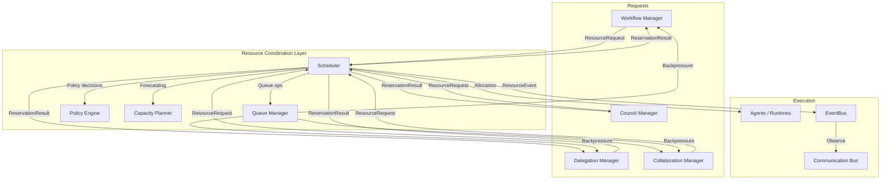

The Scheduler is the central resource arbiter. It does not execute tasks; it governs *when* and *under what constraints* tasks may execute. Queue management, policy enforcement, capacity planning, and negotiation are first-class concerns because uncoordinated resource demand is the dominant source of collaboration instability.

---

## 3. Core Concepts

| Concept | Definition |
|---------|------------|
| **Resource** | Any constrained execution asset: agent runtime slot, compute unit, memory quota, network bandwidth, tool concurrency limit, API rate-limit budget, or session communication channel. |
| **Reservation** | A time-bound, revocable allocation of a specific resource quantity to a specific requester. |
| **Queue** | An ordered wait region for requests that cannot be immediately satisfied. |
| **Priority** | A relative ordering value assigned to a request, used by scheduling policies to select among competing requests. |
| **Fairness** | A policy constraint ensuring no requester is indefinitely starved despite lower priority. |
| **Quota** | A hard or soft limit on cumulative resource consumption by a requester over a window. |
| **Preemption** | The act of reclaiming an active reservation for a higher-priority requester. |
| **Backpressure** | A congestion signal propagated upstream to reduce request rate when downstream capacity is saturated. |
| **Capacity Planning** | Forecasting future demand and proactively adjusting resources or policies to maintain service levels. |
| **Resource Negotiation** | A multi-round agreement process between competing requesters or between requester and scheduler when resources are scarce. |

---

## 4. Resource Model

```mermaid
flowchart LR
    subgraph ResourceTypes
        CPU[Compute]
        MEM[Memory]
        NET[Bandwidth]
        AG[Agent Slots]
        TL[Tool Limits]
        API[API Budget]
        CH[Channels]
    end

    subgraph Reservation
        RID[Reservation ID]
        REQ[Requester]
        QTY[Quantity]
        DUR[Duration]
        PRI[Priority]
        QUOTA_REF[Quota Scope]
    end

    subgraph Lifecycle
        AVAIL[Available]
        RESERVED[Reserved]
        ACTIVE[Active]
        PREEMPTED[Preempted]
        RELEASED[Released]
        EXHAUSTED[Exhausted]
    end

    ResourceTypes --> Reservation
    Reservation --> Lifecycle
```

Resources are typed, measured, and tracked individually. A resource request specifies:

- resource type and quantity,
- requester identity and trust domain,
- desired duration and deadline,
- priority and optional fairness class,
- quota scope and budget reference,
- acceptable alternatives or fallback behavior.

---

## 5. Scheduling Policies

The Scheduler supports multiple composable policies. The active policy set is retrieved from Configuration Management and may vary by resource type, tenant, trust domain, or time window.

### 5.1 Policy Taxonomy

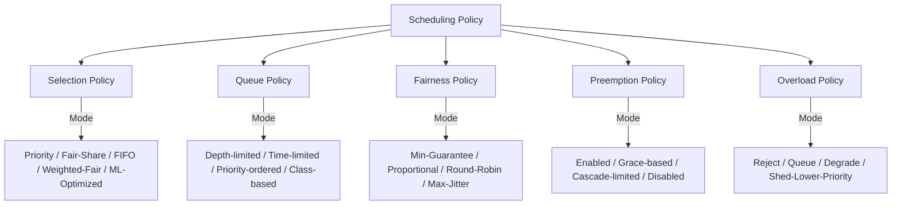

### 5.2 Policy Selection Rules

| Condition | Active Policy |
|-----------|---------------|
| System utilization < 60% | Requested preference, default `priority` |
| System utilization 60%–85% | `priority` with `fair-share` minimum guarantees |
| System utilization 85%–95% | `priority` with preemption and class-based queue limits |
| System utilization > 95% | `overload` with shedding and cooperative slowdown |

Policy transitions are event-driven and emitted via EventBus (`OverloadDetected`, `OverloadRecovered`). Components consuming `ResourceReserved` and `ResourcePreempted` must tolerate mid-execution policy changes.

---

## 6. Resource Allocation

### 6.1 Allocation Flow

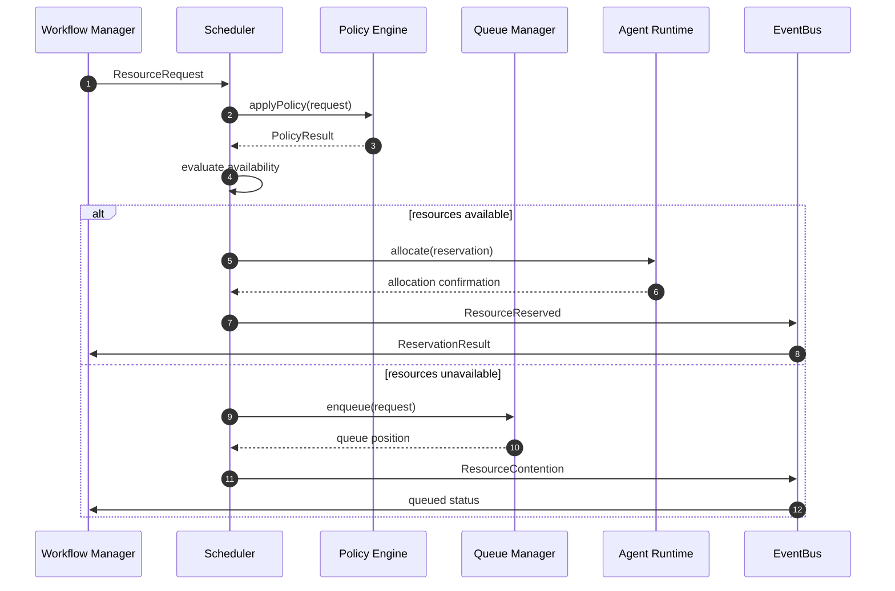

### 6.2 Allocation Rules

1. Quotas are checked before availability. A request within quota but exceeding available supply is queued, not rejected.
2. Trust-domain isolation is enforced at allocation boundaries. Cross-domain requests require explicit policy exception.
3. Agent-level reservations are atomic per agent. An agent cannot receive overlapping reservations from different workflows without explicit sharing policy.
4. Resource reservations are bounded. Reservation durations exceeding configured maximums are rejected or truncated.
5. Reservation requests with `requester_priority` above system threshold may preempt active reservations only when preemption policy is enabled.

---

## 7. Scheduling

### 7.1 Scheduling Architecture

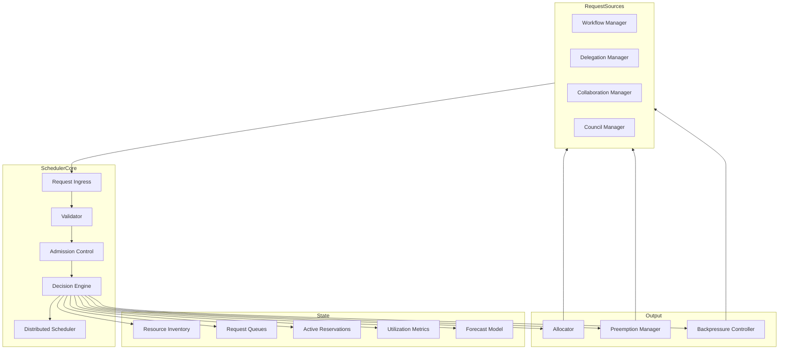

### 7.2 Scheduling Algorithm

The scheduler operates in discrete evaluation cycles. Each cycle:

1. Ingests newly arrived requests.
2. Validates quota, trust domain, and schema.
3. Evaluates available inventory against pending and active reservations.
4. Applies the active selection policy to rank satisfiable requests.
5. Allocates resources to top-ranked requests within available capacity.
6. Enqueues unsatisfiable requests according to queue policy.
7. Evaluates preemption candidates if high-priority requests are blocked.
8. Updates utilization metrics and triggers forecast recalculation if thresholds are crossed.
9. Emits resource state events to EventBus.

Scheduling cycles are bounded. The p99 scheduling decision latency MUST be < 50ms under normal load. Under overload, the scheduler MAY degrade to coarse-grained batch decisions to preserve latency headroom for high-priority requests.

---

## 8. Priorities

### 8.1 Priority Model

Priority is a composite signal, not a single integer. It is computed from:

- **Inherent priority** declared by the requester in the `ResourceRequest`.
- **Business priority** derived from workflow type, council mandate, or delegation chain authority.
- **Urgency** based on deadline proximity and SLA class.
- **Dependency weight** based on downstream blocked work volume.
- **Trust level** of the requester; higher-trust requesters MAY receive priority amplification within configured bounds.

### 8.2 Priority Bands

| Band | Intended Use | Scheduling Behavior |
|------|-------------|---------------------|
| **P0** | Security, safety, council-routed critical work | Immediate allocation; preemptive over P1–P3; reserved capacity pool |
| **P1** | Workflow and delegation tasks with SLA | Standard allocation; preemptive over P2–P3; not preempted by P2–P3 |
| **P2** | Background workflows, non-urgent delegations | Standard allocation; preemptive over P3; may be shed under overload |
| **P3** | Telemetry, knowledge capture, maintenance | Cooperative slowdown eligible; shed first under overload |

Priority is not static. The Policy Engine MAY adjust priority within configured bounds based on system state, deadline urgency, or council decision.

---

## 9. Fairness

### 9.1 Fairness Requirements

The scheduler MUST prevent indefinite starvation of low-priority or low-trust requesters. Fairness is enforced through:

- **Minimum guarantees**: each requester class receives a configurable minimum share of each resource type per scheduling window.
- **Aging**: requests accumulate priority weight while queued. Aged requests eventually bypass newer higher-priority requests to prevent indefinite queueing.
- **Round-robin fallback**: when multiple requesters have equivalent priority and quota headroom, allocation rotates among them.
- **Max-jitter bounds**: fairness adjustments are bounded to avoid pathological oscillation in allocation patterns.

### 9.2 Fairness Enforcement

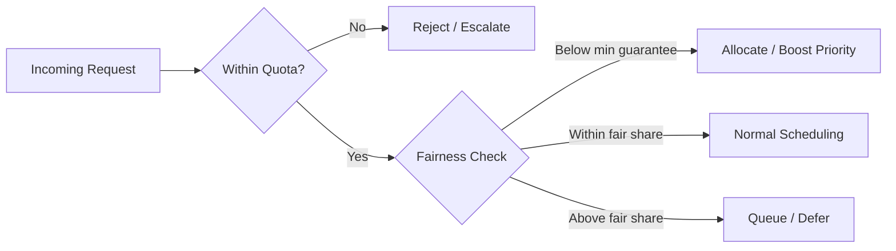

Fairness is evaluated per resource type, requester identity, and time window. Cross-resource fairness is not guaranteed; a requester MAY be starved on one resource while over-allocated on another.

---

## 10. Quotas

### 10.1 Quota Model

Quotas are declarative limits attached to a requester scope:

| Scope | Examples |
|-------|----------|
| Agent | Maximum concurrent tasks, maximum compute per hour |
| Workflow | Maximum resource cost per workflow instance |
| Delegation | Maximum tool invocations per delegation chain |
| Session | Maximum participants, maximum bandwidth per session |
| Council | Maximum deliberation time, maximum concurrent votes |
| Tenant | Global budget ceiling across all collaboration activity |

### 10.2 Quota Enforcement

1. Quotas are evaluated at reservation request time and continuously during active reservation.
2. Hard quotas are non-negotiable. Requests exceeding hard quota are rejected immediately.
3. Soft quotas trigger warning events and MAY be overridden by P0 requests or council decision.
4. Quota consumption is tracked via EventBus. QuotaExceeded and QuotaWarning events are emitted when thresholds are crossed.
5. Quota windows are sliding or fixed, configured per scope. Default window: 1 hour.

---

## 11. Load Balancing

### 11.1 Agent-Level Load Balancing

When multiple agents match a capability requirement, the Scheduler distributes assignments using:

- **Current load score**: agent-reported CPU, queue depth, and task count.
- **Utilization trend**: recent utilization rate over a configurable window.
- **Task affinity**: preference for agents that have previously executed related tasks, subject to freshness decay.
- **Health status**: degraded agents are deprioritized; offline agents are excluded.

Load balancing decisions are emitted as `delegation.load.balanced` events for observability and capacity planning.

### 11.2 Resource-Level Load Balancing

For pooled resources (compute, bandwidth, API slots), the scheduler distributes load across resource partitions using consistent hashing or round-robin within priority bands. Partition health is monitored; degraded partitions receive reduced traffic.

---

## 12. Agent Utilization

### 12.1 Utilization Tracking

The Scheduler maintains per-agent utilization metrics:

- **Queue depth**: number of pending tasks assigned but not yet started.
- **Active task count**: number of currently executing tasks.
- **Utilization ratio**: active resource consumption divided by capacity.
- **Saturation score**: composite metric combining queue depth, utilization ratio, and response latency trend.

Utilization data is emitted as `agent.lifecycle.heartbeat` events and consumed by the Scheduler for load balancing and preemption decisions.

### 12.2 Utilization Targets

| Agent State | Target Utilization | Action |
|-------------|-------------------|--------|
| Healthy | 50%–80% | Normal scheduling |
| Warm | 80%–90% | Reduced new assignment; prefer queuing |
| Saturated | 90%–100% | Queue new requests; emit `ResourceContention` |
| Overloaded | >100% effective | Preempt P2/P3; shed P3; emit `OverloadDetected` |

---

## 13. Capacity Planning

### 13.1 Forecasting Model

The Capacity Planner component analyzes historical utilization patterns, scheduled job distributions, workflow templates, and upcoming council sessions to forecast resource demand. Forecasts are recalculated on configurable intervals (default: every 15 minutes) and when utilization crosses policy thresholds.

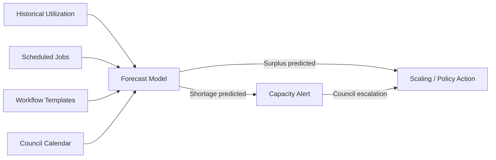

### 13.2 Capacity Actions

| Forecast | Trigger | Response |
|----------|---------|----------|
| Shortage within 1 hour | Utilization forecast > 90% for > 30 min | Emit `CapacityAlert`; queue non-critical requests |
| Shortage within 15 minutes | Utilization forecast > 95% | Activate overload policy; shed P3 |
| Sustained shortage | Utilization > 90% for > 2 hours | Council review; quota adjustment or resource scaling |
| Surplus | Utilization < 30% for > 1 hour | Pre-warm agent pool; reduce idle resource count |

Capacity planning is advisory unless a forecast triggers an active policy boundary. The Scheduler does not provision infrastructure; it signals capacity events to orchestration layers responsible for scaling.

---

## 14. Resource Negotiation

### 14.1 Negotiation Triggers

Resource negotiation occurs when:

- A request cannot be satisfied within declared constraints but acceptable alternatives exist.
- Multiple requesters compete for the same scarce resource and policy does not provide a clear winner.
- A requester proposes terms that exceed quota but offers compensating concessions (e.g., later deadline, lower priority, reduced quantity).

### 14.2 Negotiation Flow

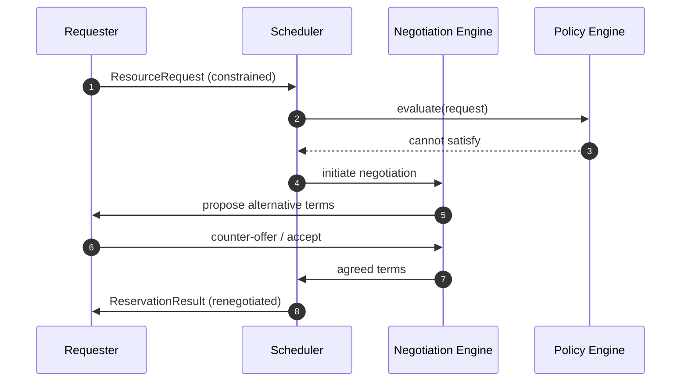

Negotiation is bounded by `maxNegotiationRounds` (default: 3). If negotiation fails, the request is queued or rejected per policy. Negotiation outcomes are logged for audit and capacity planning analysis.

---

## 15. Resource Reservation

### 15.1 Reservation Contract

Every successful allocation produces a `ReservationResult` containing:

- `reservation_id`: unique identifier for the reservation.
- `resource_type` and `quantity`: what was allocated.
- `requester_id`, `requester_scope`: who owns the reservation.
- `started_at`, `expires_at`: temporal bounds.
- `priority`: effective priority at allocation time.
- `quota_scope`: quota account debited.
- `preemptible`: whether this reservation may be preempted.
- `conditions`: constraints under which reservation is valid (e.g., must begin within 60 seconds).

### 15.2 Reservation Lifecycle

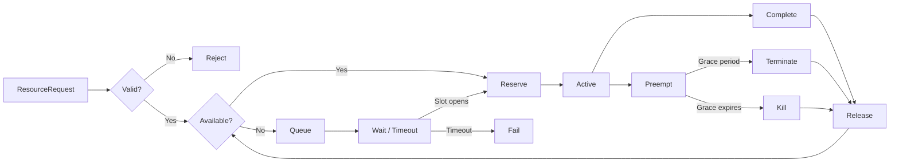

Reservation timeouts are configurable per resource type. The default maximum reservation duration is 1 hour. Reservations exceeding this duration MUST be renewed explicitly via `ResourceRequest.renew`.

---

## 16. Distributed Scheduling

### 16.1 Partitioned Scheduling

In clustered deployments, the Scheduler operates as a partitioned service. Reservation state is sharded by resource type and requester identity hash. Each partition owns a disjoint subset of reservations and operates autonomously under the shared policy configuration.

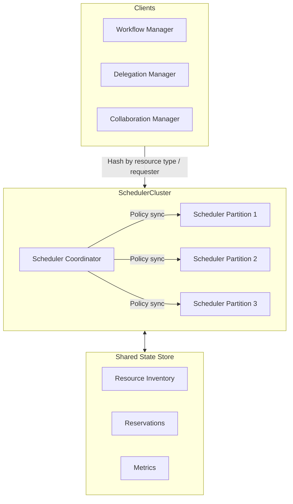

### 16.2 Consistency Model

Scheduling decisions use a **session-consistent** model:

- Within a single collaboration session or workflow, resource decisions are strongly consistent.
- Across sessions, eventual consistency is acceptable; transient divergence in utilization views is tolerated.
- Policy changes propagate to all scheduler partitions within a bounded propagation window (default: 5 seconds).
- Reservation state is replicated with quorum writes to prevent split-brain over-allocation.

### 16.3 Cross-Partition Coordination

When a request spans partitions (e.g., a workflow requiring both compute and agent slots), the originating partition coordinates with relevant partitions via the Coordinator. Coordination is atomic: all required reservations must succeed, or the request fails and any partial reservations are rolled back.

---

## 17. Queue Management

### 17.1 Queue Architecture

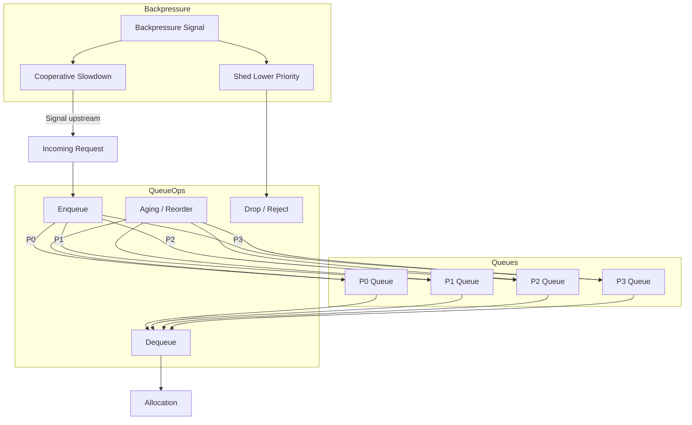

### 17.2 Queue Policies

| Parameter | Default | Description |
|-----------|---------|-------------|
| `maxQueueLength` | 1000 per resource type | Maximum queued requests before rejection |
| `queueTimeoutMs` | 600000 | Maximum wait time in queue before rejection |
| `agingRate` | 1.0 | Priority weight added per second of queue time |
| `maxAgedPriorityBoost` | 2.0 | Maximum priority multiplier from aging |
| `dequeueBatchSize` | 10 | Number of requests evaluated per scheduling cycle |
| `backpressureThreshold` | 0.8 | Queue depth ratio triggering backpressure signals |

### 17.3 Backpressure Propagation

When queue depth exceeds the backpressure threshold, the Scheduler emits `ResourceContention` and `QueueDepthChanged` events. Upstream components (Workflow Manager, Delegation Manager, Collaboration Manager) MUST respond by:

- reducing dispatch rate,
- deferring non-critical task initiation,
- pausing new workflow branches where possible.

Backpressure is cooperative, not coercive. The Scheduler does not forcibly halt in-flight work except via preemption, which is governed by the preemption policy.

---

## 18. Scheduling Policies

### 18.1 Policy Composition

Scheduling policies are composable. A policy set includes:

- **Selection policy**: how the scheduler ranks and selects among eligible requests.
- **Queue policy**: how requests are ordered and bounded while waiting.
- **Fairness policy**: how minimum shares and aging are enforced.
- **Preemption policy**: whether and how active reservations may be reclaimed.
- **Overload policy**: how the system behaves when aggregate demand exceeds supply.

Policies are retrieved from Configuration Management at each scheduling cycle boundary and cached for the duration of the cycle. Policy changes are applied atomically at cycle boundaries; in-flight reservations are grandfathered unless explicitly targeted by preemption logic.

### 18.2 Policy Enforcement

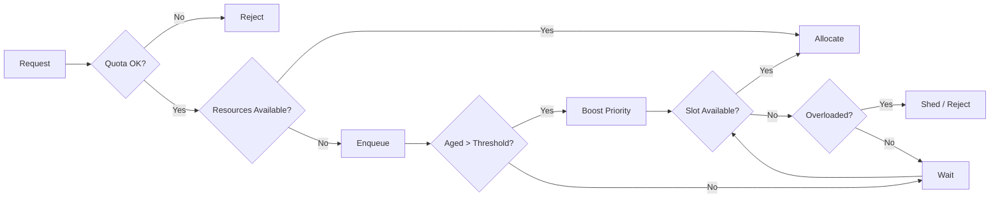

---

## 19. Resource Lifecycle

### 19.1 Lifecycle Phases

| Phase | Description | Scheduler Action |
|-------|-------------|------------------|
| **Available** | Resource registered and idle. | Accept reservations. |
| **Reserved** | Resource allocated to requester but not yet consumed. | Track; enforce reservation timeout. |
| **Active** | Resource actively consumed. | Monitor utilization; enforce quota. |
| **Preempted** | Resource reclaimed for higher-priority requester. | Emit `ResourcePreempted`; notify requester. |
| **Released** | Resource returned to available pool. | Update inventory; dequeue next eligible request. |
| **Exhausted** | All resources of type allocated. | Emit `ResourceExhausted`; activate queue and overload policy. |

### 19.2 Lifecycle Events

| Event | Producer | Consumer | Purpose |
|-------|----------|----------|---------|
| `ResourceReserved` | Scheduler | Requester, Observability | Allocation confirmation |
| `ResourceReleased` | Scheduler | Requester, Inventory | Resource returned |
| `ResourcePreempted` | Scheduler | Requester, Conflict Resolution | Preemption notification |
| `ResourceContention` | Scheduler | Upstream components | Backpressure signal |
| `ResourceExhausted` | Scheduler | Policy Engine, Capacity Planner | Overload activation |
| `ResourceRecovered` | Scheduler | Policy Engine, Capacity Planner | Overload deactivation |
| `QueueDepthChanged` | Queue Manager | Observability, Scheduler | Queue state change |
| `OverloadDetected` | Scheduler | All components | Overload policy activation |
| `OverloadRecovered` | Scheduler | All components | Normal policy restoration |

---

## 20. Performance Optimization

### 20.1 Optimization Targets

| Metric | Target |
|--------|--------|
| Reservation decision latency (p99) | < 50ms |
| Preemption decision latency (p99) | < 100ms |
| Queue processing throughput | 10,000 requests/second |
| Maximum tracked resources | 100,000 per instance |
| Policy propagation latency | < 5 seconds across cluster |

### 20.2 Optimization Strategies

1. **Partitioned state**: resource inventory and reservations are sharded by type and ID hash to reduce lock contention.
2. **Lock-free queues**: queue operations use partitioned, lock-free data structures where possible.
3. **Batched evaluation**: scheduling cycles batch request evaluation to amortize policy lookup cost.
4. **Cached policy**: active policy set is cached per scheduler partition and refreshed at cycle boundaries.
5. **Time-series aggregation**: utilization metrics are aggregated in a time-series store to avoid hot-path writes to relational storage.
6. **Priority lane isolation**: P0 requests are processed on a dedicated fast path that bypasses queue ordering logic.
7. **Forecast offloading**: capacity forecasting runs asynchronously and does not block scheduling decisions.

---

## 21. Security and Authorization

### 21.1 Authorization Model

Every `ResourceRequest` is authorized against:

- requester identity and trust level,
- declared quota scope and available budget,
- resource type access control list,
- cross-domain resource access policy.

Resource access logs are immutable and emitted as audit events. Cross-tenant resource isolation is mandatory. Preemption actions require authorization at or above the trust level of the preempted requester, unless the preemption is driven by a P0 priority override governed by council policy.

### 21.2 Audit Requirements

- All reservations, releases, preemptions, and quota consumptions are logged.
- Reservation IDs are referenced in all downstream task and workflow events for traceability.
- Quota violations are emitted as security-relevant events (`QuotaExceeded`) and MAY trigger council review if persistent.

---

## 22. Failure Modes and Recovery

### 22.1 Failure Classification

| Failure | Detection | Recovery |
|---------|-----------|----------|
| **Resource exhaustion** | `ResourceExhausted` emitted | Queue requests; activate overload policy |
| **Preemption cascade** | Rapid succession of `ResourcePreempted` events | Apply preemption limits; pause new P1+ requests |
| **Quota violation** | Request exceeds quota | Reject; emit `QuotaExceeded`; notify quota owner |
| **Forecast error** | Actual utilization diverges from forecast | Adaptive learning; adjust forecast weights |
| **Scheduler partition failure** | Health check failure | Coordinator reroutes requests; partition recovers from replicated state |
| **Policy inconsistency** | Partition policy version mismatch | Coordinator re-syncs policy; scheduler restarts with consistent policy |
| **Queue overflow** | Queue depth exceeds `maxQueueLength` | Reject new requests; emit `QueueDepthChanged` and `OverloadDetected` |
| **Reservation timeout leak** | Reservation exceeds max duration | Auto-release; emit timeout event; notify requester |

### 22.2 Recovery Guarantees

- Reservations are idempotent. Duplicate `ResourceRequest` with identical parameters MUST NOT create duplicate reservations.
- Preemption is graceful. The preempted requester receives a `ResourcePreempted` event with a configurable grace period (default: 5 seconds) before active work is terminated.
- Queue state is durable. Scheduler restart does not lose queued requests; they are recovered from persistent queue store.
- Quota accounting is accurate across restarts. Quota consumption is reconciled from persistent reservation log on scheduler recovery.

---

## 23. Observability

### 23.1 Metrics

| Metric | Type | Description |
|--------|------|-------------|
| `resource.reserved` | Counter | Successful reservations by resource type |
| `resource.released` | Counter | Resource releases |
| `resource.preempted` | Counter | Preemptions by priority band |
| `resource.exhausted` | Counter | Exhaustion events by resource type |
| `reservation.latency` | Histogram | Reservation decision latency |
| `preemption.latency` | Histogram | Preemption decision latency |
| `queue.depth` | Gauge | Current queue depth by priority band |
| `utilization.rate` | Gauge | Resource utilization by type |
| `overload.detected` | Counter | Overload event occurrences |
| `quota.exceeded` | Counter | Quota violation events |
| `forecast.error` | Histogram | Forecast versus actual utilization delta |
| `scheduling.cycle.duration` | Histogram | Scheduler cycle duration |

### 23.2 Dashboards

- **Resource Utilization**: real-time utilization by resource type, requester, and priority band.
- **Queue Depth**: queue depth over time with backpressure threshold overlay.
- **Preemption Frequency**: preemption rate by reason and requester.
- **Quota Adherence**: quota consumption versus limit by scope.
- **Scheduler Health**: partition health, cycle latency, policy version consistency.

### 23.3 Traces and Logs

- Every reservation carries a `reservation_id` propagated to downstream workflow, delegation, and runtime events via `correlation_id`.
- Preemption decisions are traced with cause chain: which higher-priority request triggered preemption.
- Quota violations are logged with requester identity, scope, consumed amount, and limit.

---

## 24. Scheduling Event Catalog (Relevant Events)

The Scheduler participates in the EventBus contract defined in `events.md`. The following events are directly produced or consumed by the Scheduler:

### 24.1 Events Produced

| Event | Priority | Description |
|-------|----------|-------------|
| `ResourceReserved` | P1 | Resource successfully reserved for request. |
| `ResourceReleased` | P1 | Resource released back to available pool. |
| `ResourcePreempted` | P1 | Resource reclaimed for higher-priority request. |
| `ResourceContention` | P2 | Resource contention detected; queuing initiated. |
| `ResourceExhausted` | P1 | All resources of a type exhausted; queue formed. |
| `ResourceRecovered` | P1 | Resource recovered from exhausted state. |
| `QueueDepthChanged` | P3 | Request queue depth changed significantly. |
| `OverloadDetected` | P1 | System overload threshold exceeded. |
| `OverloadRecovered` | P1 | System returned below overload threshold. |

### 24.2 Events Consumed

| Event | Purpose |
|-------|---------|
| `WorkflowStarted` | Receive resource reservation requests. |
| `TaskDispatched` | Reserve resources for dispatched task. |
| `TaskCompleted` | Release resources held by completed task. |
| `TaskFailed` | Release resources and handle preemption if applicable. |
| `DelegationRequested` | Reserve resources for delegated task execution. |
| `SessionStarted` | Reserve resources for collaboration session. |
| `SessionEnded` | Release session resources. |
| `ResourcePreempted` | External preemption request processed. |
| `SecurityPolicyChanged` | Re-evaluate resource access policies. |

---

## 25. Runtime Scheduling Invariants

The following invariants MUST hold at all times in a conforming implementation:

1. **No double allocation**: a single resource unit MUST NOT be allocated to more than one active reservation simultaneously.
2. **Quota monotonicity**: cumulative quota consumption for a scope MUST be non-decreasing between releases and MUST reflect actual reservations.
3. **Priority monotonicity**: within a priority band, preemption order MUST respect configured priority weights.
4. **Fairness minimum**: every active requester class with pending requests MUST receive at least its configured minimum share within each scheduling window.
5. **Preemption auditability**: every preemption MUST produce a `ResourcePreempted` event with requester identity, reason, and authority.
6. **Queue boundedness**: queue depth MUST NOT exceed `maxQueueLength`; excess requests are rejected, not silently dropped.
7. **Policy consistency**: all scheduler partitions MUST operate under the same policy version within the propagation window.
8. **Reservation timeout**: no reservation MAY persist beyond its configured maximum duration without explicit renewal.

Violations of these invariants are reported as `InvariantViolation` events and MUST trigger immediate scheduler health evaluation and potential partition recovery.

---

## 26. Configuration Reference

### 26.1 Scheduler Configuration

| Parameter | Type | Default | Description |
|-----------|------|---------|-------------|
| `schedulingPolicy` | enum | `priority` | Active selection policy: `priority`, `fair-share`, `fifo`, `weighted-fair` |
| `preemptionEnabled` | bool | `true` | Whether lower-priority reservations may be preempted |
| `preemptionGraceMs` | duration | `5000` | Grace period before preemption execution |
| `maxQueueLength` | int | `1000` | Maximum queued requests per resource type |
| `queueTimeoutMs` | duration | `600000` | Maximum wait time in queue before rejection |
| `overloadThreshold` | float | `0.9` | Utilization fraction triggering overload protection |
| `overloadAction` | enum | `queue` | Overload response: `reject`, `queue`, `degrade` |
| `rateLimitWindowMs` | duration | `1000` | Window for rate limiting |
| `rateLimitMaxRequests` | int | `1000` | Maximum requests per window |
| `quotaEnforcementEnabled` | bool | `true` | Whether agent quotas are enforced |
| `forecastEnabled` | bool | `true` | Whether utilization forecasting is active |
| `forecastWindowMs` | duration | `3600000` | Time horizon for utilization forecasting |

### 26.2 Queue Configuration

| Parameter | Type | Default | Description |
|-----------|------|---------|-------------|
| `agingRate` | float | `1.0` | Priority weight added per second of queue time |
| `maxAgedPriorityBoost` | float | `2.0` | Maximum priority multiplier from aging |
| `dequeueBatchSize` | int | `10` | Requests evaluated per scheduling cycle |
| `backpressureThreshold` | float | `0.8` | Queue depth ratio triggering backpressure |
| `enablePriorityLanes` | bool | `true` | Separate queue per priority band |

### 26.3 Fairness Configuration

| Parameter | Type | Default | Description |
|-----------|------|---------|-------------|
| `minGuaranteeFraction` | float | `0.1` | Minimum share per requester class |
| `fairnessWindowMs` | duration | `60000` | Evaluation window for fairness |
| `maxJitterFraction` | float | `0.05` | Maximum oscillation in allocation share |

### 26.4 Preemption Configuration

| Parameter | Type | Default | Description |
|-----------|------|---------|-------------|
| `preemptionLimitPerMinute` | int | `10` | Maximum preemptions per minute to prevent cascade |
| `preemptP2ForP0` | bool | `true` | Whether P2 reservations may be preempted for P0 |
| `preemptP3ForP1` | bool | `true` | Whether P3 reservations may be preempted for P1 |
| `cascadePreemptionEnabled` | bool | `false` | Whether preempted reservations MAY further preempt lower-priority work |

---

## 27. Cross-References

| Reference | Usage |
|-----------|-------|
| `components.md` — Scheduler | Scheduler component specification, interfaces, events, failure modes |
| `events.md` — Scheduler Events | Full event catalog for `ResourceReserved`, `ResourcePreempted`, `ResourceExhausted`, overload events |
| `context.md` — Runtime Boundaries | Resource quotas and sandboxing constraints from Part 1 |
| `context.md` — EventBus Assumptions | Delivery and ordering guarantees for resource events |
| Part 1 | Agent lifecycle hooks, resource isolation, process supervision |
| Part 2 | Identity, authorization, and audit for resource access |
| Part 4 | EventBus for resource state publication and consumption |
| Part 5 | Configuration Management for scheduling policies |
| Part 9 | Specialized agent interfaces for capability-matched allocation |
| Part 11 | Monitoring and alerting for scheduler health and utilization metrics |

---

## 28. Enterprise Scheduling Architecture

This section strengthens the scheduler without changing the existing model. It introduces additional enterprise scheduling dimensions as first-class architectural concerns: multi-layer scheduling, QoS and deadline semantics, cost and sustainability constraints, topology and accelerator awareness, federation and multi-cluster operation, admission control, queue fairness and congestion management, preemption governance, scheduler observability and SLIs/SLOs, failure recovery and HA, benchmarking, dynamic quota adjustment, auto-balancing and auto-healing, AI-assisted and learning-based scheduling, and plugin governance.

### 28.1 Multi-Layer Scheduling Model

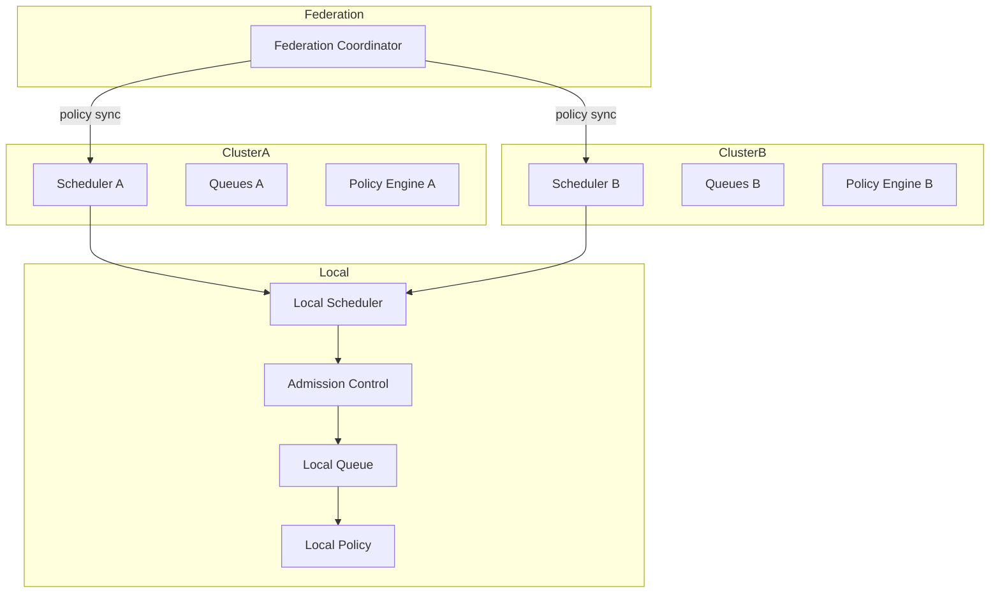

Scheduling decisions are decomposed into layers:

- **Federation layer**: allocates workload across clusters and regions based on global capacity, residency, and cost.
- **Cluster layer**: applies cluster-level quotas, scheduling policies, and cross-node constraints.
- **Local layer**: performs final admission control, queue selection, and reservation assignment.

Each layer exposes decisions as events. Higher layers do not bypass lower-layer enforcement; they constrain the feasible set instead.

### 28.2 Hierarchical Scheduling

Hierarchical scheduling introduces a parent-child relationship between schedulers or between scheduler and resource domains:

- A **parent scheduler** receives aggregate capacity from child schedulers and distributes quotas or budgets.
- A **child scheduler** manages a bounded resource pool and reports utilization upward.
- Hierarchical boundaries enforce quota propagation: child consumption cannot exceed the parent-allocated budget.
- Policy changes propagate downward; capacity signals propagate upward.

Hierarchical scheduling is appropriate for multi-tenant deployments, organizational resource domains, and nested collaboration sessions.

### 28.3 QoS Scheduling

QoS classes bind resource treatment to declared service-quality requirements:

| QoS Class | Target | Treatment |
|-----------|--------|-----------|
| `critical` | p99 < 50ms | Reserved capacity; preemptive over lower classes; admission priority |
| `standard` | p99 < 200ms | Priority-band scheduling with quota guarantee |
| `burstable` | p99 < 1000ms | Can exceed base allocation briefly under spare capacity; capped burst window |
| `best-effort` | none | Shed first under overload; no reservation guarantee |

QoS class is attached to `ResourceRequest` and propagated to downstream workflow, delegation, and runtime events. The Scheduler does not measure end-to-end latency; it reserves capacity consistent with the declared class and emits `QoSHeadroomLow` when trends indicate target violation.

### 28.4 Deadline-Aware Scheduling

A `ResourceRequest` MAY declare `deadline_at`. The Scheduler computes deadline proximity and uses it as a scheduling signal:

- **Proximity escalation**: when `(deadline_at − now) / estimated_duration` falls below a configured threshold, the request receives priority amplification within its band.
- **Deadline miss response**: when a reservation cannot complete before `deadline_at` with available capacity, the Scheduler MAY reject rather than queue, unless `queue_if_missed = true`.
- **Deadline warnings**: `DeadlineProximityWarning` is emitted when proximity drops below 50%. `DeadlineImminent` is emitted when proximity drops below 20%.

### 28.5 Energy-Aware and Carbon-Aware Scheduling

Energy and carbon constraints are first-class scheduling objectives:

- **Energy model**: resources expose `energy_per_unit` and `energy_budget`. The Scheduler prefers lower-energy allocations when priority and feasibility are equivalent.
- **Carbon model**: resources expose `carbon_intensity` in gCO2e per unit. The Scheduler MAY shift non-urgent workloads to lower-carbon windows.
- **Budget enforcement**: energy and carbon budgets are declared at tenant, workflow, or delegation scope. Exhaustion triggers rejection, downgrade to `best-effort`, or council review.
- **Telemetry**: `EnergyReserved` and `CarbonReserved` events are emitted for sustainability accounting.

Energy and carbon optimization are secondary objectives. They never override quota, priority, or SLA constraints.

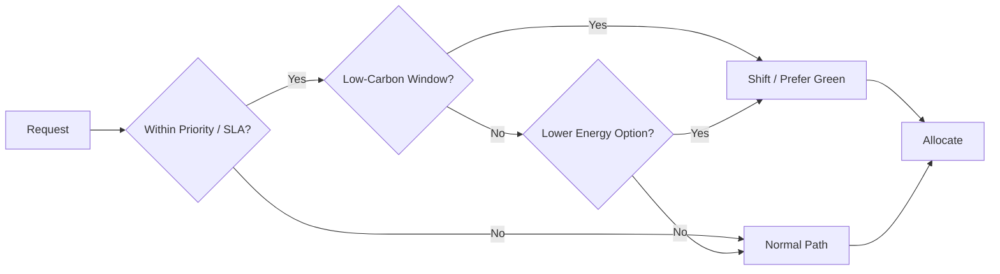

### 28.6 NUMA, Topology, and Accelerator Awareness

Resource requests MAY declare topology and hardware-class constraints:

- **NUMA affinity**: tasks with NUMA sensitivity prefer allocations within the same NUMA domain. Violations emit `TopologyRelaxed`.
- **GPU/accelerator requirements**: requests specify `accelerator_type`, `count`, `memory_gb`, and `compute_capability`. The Scheduler treats accelerator slots as first-class resource types with separate inventories.
- **Isolation requirements**: sensitive tasks MAY require `require_isolation = true`, restricting allocation to exclusive physical partitions.
- **Failure-domain anti-affinity**: tasks that must survive single-node failures are scheduled across distinct failure domains.

Topology constraints are evaluated after quota and availability. Hard topology violations reject the request; soft violations emit relaxation events.

### 28.7 Resource Affinity and Anti-Affinity

Affinity and anti-affinity are architectural scheduling constraints, not implementation hints:

- **Affinity**: preference for co-location with specific agents, resources, or prior task executions, with freshness decay.
- **Anti-affinity**: preference against co-location to reduce failure correlation, thermal contention, or tenant overlap.
- **Soft vs hard**: soft constraints influence ranking; hard constraints reject infeasible allocations.

Affinity decisions are emitted as `AffinityApplied` or `AffinityRelaxed` events.

### 28.8 Placement Constraints

Placement constraints extend the reservation contract:

| Constraint | Enforcement |
|------------|-------------|
| `must_run_on` | Hard rejection if no compliant resource exists |
| `must_not_run_on` | Hard exclusion |
| `prefer_run_on` | Soft preference |
| `require_isolation` | Hard exclusive allocation |
| `allow_shared` | Soft permission to share if unavoidable |

Placement constraints are validated during admission control and re-evaluated if resource inventory changes during queuing.

### 28.9 Admission Control

Admission control is a dedicated scheduler ingress stage:

1. **Schema validation**: request must conform to `ResourceRequest`.
2. **Quota pre-check**: request must fit within quota bounds.
3. **Policy compatibility**: request must be compatible with active policies.
4. **Trust-domain authorization**: requester must be authorized for the resource type.
5. **Rate limiting**: requester must respect `rateLimitMaxRequests` within `rateLimitWindowMs`.

Admission control completes within 10ms. Failed admission emits `AdmissionRejected` with a reason code.

### 28.10 Queue Fairness, Optimization, and Congestion Management

Queue fairness is enforced independently from allocation fairness:

- **Class-based lanes**: each requester class has a dedicated sub-queue with bounded share of total queue capacity.
- **Queue fairness**: no class’s queue share may exceed its configured fraction of total queue capacity. Overflow classes emit `QueueFairnessExceeded`.
- **Aging**: queued requests accumulate priority weight. Aging rate is non-zero; zero aging is a configuration error.
- **Bounding**: `queueTimeoutMs` bounds wait time; `maxQueueLength` bounds depth. Excess requests are rejected with `QueueOverflow`.

Congestion management operates alongside backpressure:

- **Congestion detection**: the Scheduler detects sustained queue growth or latency increase.
- **Congestion response**: the Scheduler MAY enter cooperative slowdown, shed lower-priority requests, or activate admission throttling.
- **Congestion recovery**: when congestion subsides, the Scheduler drains queues and emits `CongestionRecovered`.

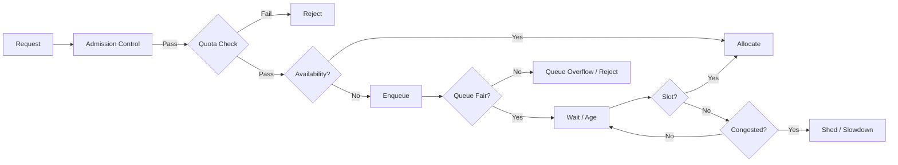

### 28.11 Reservation Leasing and Dynamic Management

Reservations are leases with explicit temporal and utilization contracts:

- **Lease expiry**: every reservation has `expires_at`. Default maximum lease duration is 1 hour.
- **Renewal**: leases are renewed via `ResourceRequest.renew`, subject to continued availability and quota headroom.
- **Idle release**: reservations with sustained utilization below `idleReleaseThreshold` for `idleReleaseWindowMs` are released with reason `idle_timeout`.
- **Migration**: under partition degradation, reservations MAY migrate to healthier partitions preserving `reservation_id`.
- **Downsizing**: elastic reservations MAY reduce quantity when utilization drops, emitting `ResourceResized`.

Dynamic management changes are always emitted as events.

### 28.12 Priority Inheritance and Preemption Governance

Priority inheritance prevents inversion across resource types:

- When a high-priority request is blocked by a lower-priority reservation, the blocking reservation temporarily inherits elevated priority.
- Inheritance is scoped to the blocking resource type and decays when the block clears.
- The Scheduler emits `PriorityInherited` and `PriorityRestored`.

Preemption governance limits cascade risk:

- `preemptionLimitPerMinute` bounds total preemptions.
- Cascade preemption is disabled by default.
- Preemption receipts include triggering request identity, priority comparison, and authority.

### 28.13 Scheduler Observability, SLIs/SLOs, Tracing, and Audit

Scheduler observability is a first-class contract, not an afterthought.

#### 28.13.1 Scheduling SLIs/SLOs

| SLI | SLO | Measurement |
|-----|-----|-------------|
| Reservation latency | p99 < 50ms | `reservation.latency` histogram |
| Preemption decision latency | p99 < 100ms | `preemption.latency` histogram |
| Queue processing throughput | >= 10,000 req/s | `queue.processing.rate` |
| Policy propagation latency | p99 < 5s across cluster | `policy.propagation.latency` |
| Admission control latency | p99 < 10ms | `admission.latency` histogram |
| Forecast accuracy | MAPE < 15% over 1-hour horizon | `forecast.error` histogram |

#### 28.13.2 Scheduling Tracing

- Every reservation carries `reservation_id` propagated via `correlation_id` to downstream workflow, delegation, and runtime events.
- Preemption decisions are traced with cause chain.
- Policy evaluation traces capture selection, fairness, and queue decisions.

#### 28.13.3 Scheduling Audit Logs

Audit logs capture every state-changing scheduler operation:

- reservation creation, renewal, migration, and release,
- preemption with requester identity, reason, and authority,
- quota consumption and violations,
- policy changes with proposer and rationale,
- plugin invocations with inputs and outcomes.

Audit logs are immutable and signed.

### 28.14 Scheduler High Availability and Distributed Coordination

The Scheduler is a distributed control plane with HA requirements:

- **Leader election**: one scheduler partition acts as the coordinator. Leader election uses a consensus-backed lease; failover completes within `leaderFailoverMs` (default: 5s).
- **State replication**: reservation and inventory state are replicated with quorum writes.
- **Partition isolation**: scheduler partitions operate autonomously under replicated policy. A partition failure does not corrupt shared state.
- **Consistency**: scheduling decisions are session-consistent within workflows and eventually consistent across sessions.

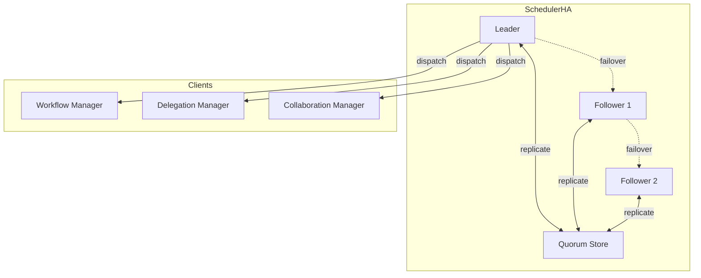

### 28.15 Scheduler Plugins and Custom Policies

The Scheduler exposes typed extension points:

| Extension Point | Contract |
|-----------------|----------|
| `IPreAssignmentFilter` | Accept or modify requests before admission |
| `IPostAssignmentFilter` | Modify or reject allocations after selection |
| `IPriorityModifier` | Adjust priority from external signals |
| `IQueueStrategy` | Custom queue ordering |
| `IFairnessStrategy` | Custom fairness evaluation |
| `IPreemptionSelector` | Custom preemption victim selection |
| `ICostModel` | Custom cost calculation |
| `IForecastProvider` | Custom forecasting logic |
| `ISimulationProvider` | What-if simulation |

Plugins are registered via Configuration Management, versioned, isolated, and bounded by `pluginTimeoutMs` (default: 10ms). Plugin failures emit `PluginError` and fall back to default behavior. Plugin registration requires council approval for production.

### 28.16 AI-Assisted and Learning-Based Scheduling

AI-assisted scheduling is an explicit policy layer, not an implicit optimizer:

- **Historical learning**: the Scheduler trains on task duration distributions, queue wait times, preemption frequency, and forecast accuracy to improve admission decisions and quota recommendations.
- **Priority inference**: workflow and delegation intents are mapped to priority bands using trained classifiers. Inferred priority is advisory and bounded by requester-declared priority.
- **Anomaly detection**: the Scheduler detects abnormal request patterns, quota manipulation, and scheduling gaming. Detected anomalies emit `SchedulingAnomalyDetected` and MAY trigger council review.
- **Feedback loop**: actual outcomes versus predictions are logged and fed back into the forecasting and learning subsystems.

AI assistance is always subordinate to hard constraints: quota, priority, SLA, and security policy.

### 28.17 Dynamic Quota Adjustment and Runtime Policy Engine

Quotas are not static allocations:

- **Dynamic adjustment**: quotas are adjusted based on historical consumption patterns, forecast accuracy, and system utilization. Adjustments are bounded by `quotaAdjustmentRate` (default: ±10% per evaluation window).
- **Borrowing and lending**: requesters MAY borrow against future quota with repayment obligations. Lenders MAY lend idle capacity with configurable incentives.
- **Runtime policy engine**: scheduling policies are evaluated and enforced at runtime by the Policy Engine. Policy changes are atomic at cycle boundaries and do not disturb in-flight reservations unless explicitly targeted.

### 28.18 Auto-Balancing and Auto-Healing

The Scheduler performs continuous runtime optimization:

- **Auto-balancing**: the Scheduler detects utilization skew across resource partitions and agents, then rebalances reservations via migration or new allocation preference.
- **Auto-healing**: the Scheduler reacts to agent degradation, resource failures, and partition unavailability by migrating or re-queuing affected reservations.
- **Health integration**: scheduler auto-healing consumes `AgentStatusChanged`, `ResourceExhausted`, and partition health signals from the Runtime Coordinator and Agent Directory.

### 28.19 Scheduling Benchmarking and Capacity Benchmarking

Benchmarking is an architectural capability:

- **Scheduling benchmarks**: the Scheduler exposes synthetic workload generators for measuring latency, throughput, queue depth, and preemption behavior under controlled load.
- **Capacity benchmarks**: the Capacity Planner runs periodic capacity benchmarks to validate forecast models and calibration parameters.
- **Policy benchmarks**: policy changes are benchmarked in simulation before production application. Results are emitted as `BenchmarkResult` and reviewed by the Council Manager.

### 28.20 Multi-Cluster, Multi-Region, and Federation Scheduling

Cross-boundary scheduling is a first-class capability:

- **Cluster registry**: each cluster registers capacity, policies, and constraints with the federation coordinator.
- **Request routing**: requests are routed to clusters with available capacity and lowest estimated latency, subject to trust-domain and data-residency constraints.
- **Reservation portability**: cross-cluster reservations are propagated via durable events and remain valid under cluster failure through coordinator reallocation.
- **Region awareness**: multi-region scheduling accounts for latency, cost, carbon, and compliance residency requirements.

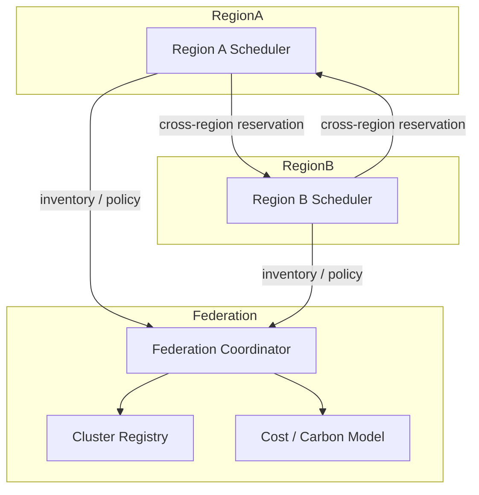

### 28.21 Alignment with AI-OS Subsystems

| Subsystem | Scheduler Integration |
|-----------|----------------------|
| **Resource Manager** | Inventory source, quota enforcement, lease management |
| **Workflow Manager** | Resource reservation and release tied to workflow lifecycle |
| **EventBus** | Resource events delivered with at-least-once semantics and partition-key ordering |
| **Collaboration Scheduler** | Receives session resource reservations; backpressure flows upstream |
| **Runtime Invariants** | Scheduling invariants are runtime invariants; violations emit `InvariantViolation` |
| **Security Architecture** | Authorization, audit, trust-domain enforcement, preemption authority |
| **JSON Schemas** | `ResourceRequest`, `ReservationResult`, and scheduling policy schemas are versioned and validated |

---
## 29. Future Evolution

| Evolution Stage | Enhancement |
|-----------------|-------------|
| **Near term** | ML-optimized scheduling based on historical utilization patterns; semantic priority inference from workflow intent |
| **Medium term** | Multi-objective optimization balancing latency, cost, and fairness; predictive pre-warming based on capacity forecasts |
| **Long term** | Autonomous resource trading between tenants via negotiation; zero-trust-native resource access with cryptographic reservation contracts |

---

*End of Part 12.8 — Resource Coordination and Scheduling*
