# Part 12.9: Reliability, Recovery, and Performance — Architecture Specification

> **Document Role**
> Detailed architecture specification for reliability, recovery, and performance within the Part 12 multi-agent collaboration layer of AI-OS.
> This chapter defines how the collaboration substrate detects failures, preserves state, recovers from faults, and maintains predictable performance under varying load and failure conditions.

---

## Table of Contents

1. [Purpose and Scope](#1-purpose-and-scope)
2. [Reliability Vision and Principles](#2-reliability-vision-and-principles)
3. [Fault Model](#3-fault-model)
4. [Fault Tolerance Architecture](#4-fault-tolerance-architecture)
5. [Failure Detection](#5-failure-detection)
6. [Recovery Strategies](#6-recovery-strategies)
7. [Retry Policies](#7-retry-policies)
8. [Circuit Breakers](#8-circuit-breakers)
9. [Graceful Degradation](#9-graceful-degradation)
10. [Self Healing](#10-self-healing)
11. [Checkpointing](#11-checkpointing)
12. [State Recovery](#12-state-recovery)
13. [Disaster Recovery](#13-disaster-recovery)
14. [Performance Optimization](#14-performance-optimization)
15. [Scalability](#15-scalability)
16. [Monitoring](#16-monitoring)
17. [Metrics](#17-metrics)
18. [Bottleneck Analysis](#18-bottleneck-analysis)
19. [High Availability](#19-high-availability)
20. [Resilience Patterns](#20-resilience-patterns)
21. [SLA Considerations](#21-sla-considerations)
22. [Configuration Reference](#22-configuration-reference)
23. [Cross-References](#23-cross-references)

---

## 1. Purpose and Scope

### 1.1 Purpose

Part 12.9 specifies the reliability, recovery, and performance architecture for the Part 12 multi-agent collaboration layer. It defines how collaboration components detect faults, recover state, maintain availability, and meet performance objectives when agents, networks, or services fail.

This document is authoritative for:

- Designing fault-tolerant collaboration flows.
- Defining failure detection, recovery, retry, circuit-breaker, and degradation behavior.
- Architecting checkpointing, state recovery, and disaster recovery for collaboration sessions.
- Setting performance optimization, scalability, monitoring, metrics, bottleneck analysis, high availability, resilience patterns, and SLA requirements.

### 1.2 Scope

#### In Scope

- Reliability properties of collaboration primitives, workflows, councils, shared context, delegation, scheduling, and communication.
- Failure modes for agents, communication channels, state stores, schedulers, councils, and workflows.
- Recovery contracts for in-flight workflows, councils, shared context, and delegated tasks.
- Retry, timeout, circuit-breaker, bulkhead, fallback, and rate-limit policies.
- Checkpointing and state recovery mechanisms for collaboration sessions.
- Disaster recovery tiers, RTO/RPO targets, and cross-region failover.
- Performance targets, scalability model, autoscaling rules, and capacity planning.
- Monitoring architecture, telemetry, alerting, SLO/SLA definitions, and runbooks.
- Bottleneck identification, profiling, and remediation patterns.

#### Out of Scope

- Internal agent reasoning, learning, or memory recovery.
- Application-level business logic recovery.
- User interface reliability or end-user experience recovery.
- Hardware-level reliability (disk, NIC, CPU).
- Cloud-provider-specific disaster recovery implementations.
- Legal, regulatory, or contractual compliance beyond architectural support.

---

## 2. Reliability Vision and Principles

### 2.1 Reliability Vision

The collaboration layer MUST treat reliability as a first-class architectural property. Every collaboration operation — task dispatch, council vote, context update, workflow transition — MUST have explicit failure semantics, recovery contracts, and observability hooks.

The reliability architecture SHALL achieve:

| Goal | Description |
|------|-------------|
| Transparent fault masking | Routine single-agent or single-service failures do not interrupt collaboration outcomes. |
| Stateful recovery | In-flight workflows and councils can resume from durable checkpoints without semantic loss. |
| Bounded degradation | Under overload or partial failure, the system degrades in defined, policy-controlled ways rather than failing open. |
| Observable failures | Every significant failure is detected, classified, surfaced, and acted upon within defined time bounds. |
| Predictable latency | Performance remains within SLA bounds under normal and stressed conditions. |
| Automated remediation | Common failure classes are resolved without human intervention within defined RTO. |

### 2.2 Reliability Principles

The following principles govern all reliability decisions in Part 12:

1. **Fail-stop with recovery contract.** Components MUST fail in well-defined ways with explicit recovery contracts. Partial or silent failure is NOT permitted for state-critical operations.
2. **Idempotent recovery.** Recovery operations MUST be safe to retry. Task handlers, council actions, and context mutations MUST be idempotent or guarded by idempotency keys.
3. **Durable before acknowledged.** State transitions MUST be durably persisted before acknowledgments are emitted. Acknowledgment without persistence is prohibited.
4. **Bounded retries.** Retries MUST have explicit limits, backoff policies, and terminal failure paths. Unbounded retries are prohibited.
5. **Circuit isolation.** Failures in one dependency or agent MUST NOT cascade uncontrollably to unrelated workflows or councils.
6. **Graceful over catastrophic.** Under resource exhaustion, the system MUST prefer partial service with degradation over total failure.
7. **Checkpoint before checkpoint.** Critical state MUST be checkpointed before irreversible actions. Workflow handoffs, council decisions, and delegation confirmations MUST be preceded by durable checkpoints.
8. **Observability by default.** Every reliability action MUST emit structured events and metrics. Silent recovery is prohibited.
9. **Separation of detection and recovery.** Failure detection, classification, and recovery MUST be separable concerns with defined interfaces between them.
10. **Tested failure paths.** Recovery paths MUST be exercised through chaos testing and fault injection before production deployment.

---

## 3. Fault Model

### 3.1 Fault Taxonomy

The collaboration layer operates under the following fault model. All reliability mechanisms address one or more of these fault classes:

```mermaid
flowchart TD
    F[Fault Classes] --> A[Agent Faults]
    F --> B[Infrastructure Faults]
    F --> C[State Faults]
    F --> D[Network Faults]
    F --> E[Load Faults]
    F --> F2[External Faults]

    A --> A1[Crashed Agent]
    A --> A2[Unresponsive Agent]
    A --> A3[Agent Resource Exhaustion]
    A --> A4[Agent Version Mismatch]

    B --> B1[Process / Pod Failure]
    B --> B2[Node Failure]
    B --> B3[Region / AZ Outage]

    C --> C1[Checkpoint Corruption]
    C --> C2[State Store Unavailable]
    C --> C3[Shared Context Inconsistency]

    D --> D1[Message Loss]
    D --> D2[Message Duplication]
    D --> D3[Network Partition]
    D --> D4[High Latency / Throttling]

    E --> E1[Queue Saturation]
    E --> E2[Scheduler Overload]
    E --> E3[Council Deadlock]

    F2 --> F21[Third-Party Agent Failure]
    F2 --> F22[External Service Dependency Failure]
    F2 --> F23[Upstream Orchestration Failure]
```

### 3.2 Failure Classifications

| Classification | Criteria | Collaboration Impact |
|----------------|----------|----------------------|
| **Transient** | Recovers without intervention within seconds | Single task retry sufficient |
| **Intermittent** | Periodic recurrence with unclear root cause | Requires circuit breaker + investigation |
| **Persistent** | Continues until root cause is fixed | Requires failover or delegation |
| **Correlated** | Multiple components fail simultaneously | Requires region-level or platform-level response |
| **Byzantine** | Component produces inconsistent or malicious output | Requires council consensus or quorum-based validation |

### 3.3 Fault Assumptions

The following assumptions underpin the reliability architecture:

- **Crash-stop agents**: Agents MAY fail silently but do NOT emit corrupt or arbitrarily wrong results without detection. Byzantine failures MUST be handled through council validation.
- **Durable state store**: The checkpoint and state store provide durability guarantees equivalent to at-least-once write with fsync or equivalent.
- **Network eventual delivery**: Messages MAY be delayed, reordered, or duplicated but WILL eventually be delivered unless a partition is detected.
- **Clock skew**: Distributed clocks MAY differ by up to configured bounds. Causal ordering MUST NOT rely on wall-clock time.
- **Partial availability**: The system MAY operate in degraded mode during failures. Total unavailability is a last-resort state only.

---

## 4. Fault Tolerance Architecture

### 4.1 Architecture Overview

The collaboration layer achieves fault tolerance through layered defense. No single layer provides complete protection; the combination provides the target reliability.

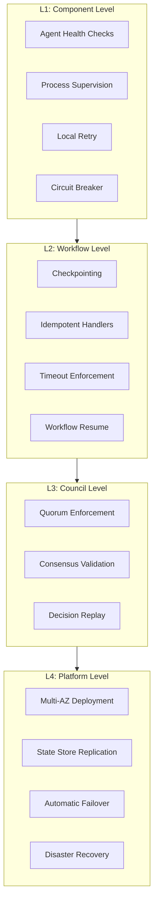

### 4.2 Component-Level Fault Tolerance

Every collaboration component MUST implement the following fault tolerance primitives:

| Primitive | Purpose | Implementation Requirement |
|-----------|---------|---------------------------|
| Health check endpoint | Probes component liveness | MUST respond within 100ms; MUST distinguish liveness from readiness |
| Graceful shutdown | Drains in-flight work | MUST stop accepting new work; MUST complete or checkpoint in-flight work within shutdown timeout |
| Local retry | Masks transient faults | MUST have bounded retry count; MUST use backoff |
| Circuit breaker | Prevents cascading failures | MUST open after threshold failures; MUST probe for recovery |
| Timeout | Bounds wait time | MUST have explicit timeout for every outbound call |
| Bulkhead | Isolates failures | MUST partition resources by workflow, council, or tenant |

### 4.3 Workflow-Level Fault Tolerance

Workflows are the primary unit of stateful collaboration. Workflow fault tolerance MUST satisfy:

- **Workflow instance isolation**: Failure of one workflow instance MUST NOT corrupt or block other instances.
- **Checkpoint atomicity**: A checkpoint MUST represent a consistent workflow state. Partial checkpoints MUST be discarded.
- **Resume from last valid checkpoint**: After any component failure, the workflow engine MUST be able to resume from the most recent valid checkpoint.
- **Task idempotency**: Every task unit MUST be safe to execute multiple times. Task handlers MUST accept idempotency keys.
- **Orphan detection**: If a workflow engine fails mid-dispatch, orphaned in-flight tasks MUST be detected and either reclaimed or cancelled.

### 4.4 Council-Level Fault Tolerance

Councils require additional fault tolerance because they aggregate votes from multiple agents:

- **Quorum enforcement**: Decisions MUST NOT be published without quorum. Quorum calculation MUST exclude agents confirmed failed or unreachable.
- **Vote persistence**: Individual votes MUST be durably stored before tallying. Vote loss MUST trigger session extension, not silent tally.
- **Member churn handling**: Member addition or removal during an active vote MUST either be prohibited or trigger session restart with explicit audit record.
- **Consensus replay**: After recovery, the council MUST be able to replay deliberation history to restore consistent state.

### 4.5 Shared Context Fault Tolerance

Shared context is the mutable state substrate for collaboration:

- **Versioned writes**: Every context mutation MUST carry a version or sequence number. Concurrent writes MUST be detected and resolved through defined conflict policies.
- **Read repair**: Stale context reads MUST trigger asynchronous repair from authoritative source.
- **Context scoping**: Context leaks across workflow, council, or session boundaries are prohibited. Access controls MUST be re-evaluated on every read.
- **Snapshot isolation**: Readers MUST see a consistent snapshot. Long-running reads MUST NOT be invalidated by concurrent writes.

---

## 5. Failure Detection

### 5.1 Detection Architecture

Failure detection MUST operate at multiple time scales. The architecture distinguishes fast-path detection (sub-second) from slow-path detection (minutes).

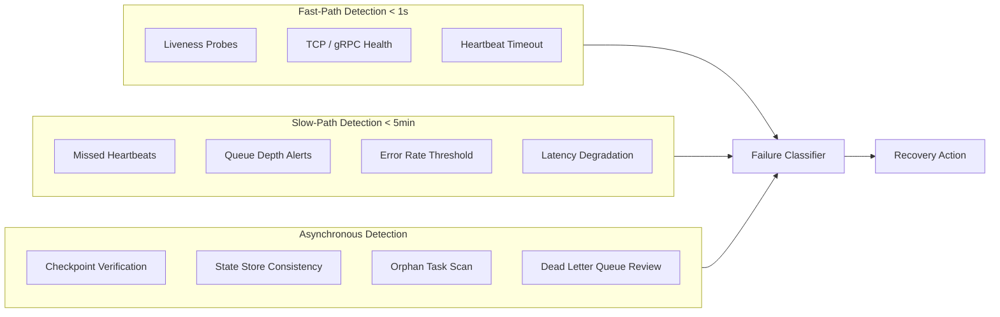

### 5.2 Liveness and Readiness Probes

Every collaboration component MUST expose liveness and readiness probes:

| Probe Type | Purpose | Failure Response |
|------------|---------|------------------|
| **Liveness** | Detects hung or deadlocked processes | Component restarted by supervisor |
| **Readiness** | Detects overloaded or degraded components | Component removed from load balancer / routing table |
| **Startup** | Detects failed initialization | Component not admitted to serving pool |

Probes MUST:

- Be evaluated at configurable intervals (default: 10s liveness, 5s readiness).
- Have independent timeout thresholds (default: 2s).
- Include degradation-specific responses: a component MAY return readiness=false while still serving health-check requests.

### 5.3 Heartbeat Monitoring

Agents and collaboration components MUST emit heartbeats at configured intervals:

- **Heartbeat interval**: Default 5s, configurable 1s–60s.
- **Missed heartbeat threshold**: 3 consecutive missed heartbeats triggers degraded status; 5 consecutive missed heartbeats triggers failure.
- **Heartbeat payload**: MUST include component ID, timestamp, queue depth, active task count, and last error timestamp.
- **Heartbeat verification**: The Collaboration Manager MUST verify heartbeat freshness on every scheduling decision.

### 5.4 Failure Classification Engine

Upon detection, the Failure Classifier MUST assign a failure class before recovery action:

| Input | Classification Logic |
|-------|----------------------|
| Single agent liveness failure | Transient → retry with new agent |
| Single agent readiness failure | Intermittent → circuit break, probe for recovery |
| Multiple agents in same AZ | Correlated → failover to other AZ |
| State store unreachable | Persistent → escalate to DR tier |
| Network partition detected | Correlated → pause non-critical workflows |
| Agent emitting invalid responses | Byzantine → require council validation or quorum |

The Failure Classifier MUST emit a `FailureDetected` event with classification, affected scope, and recommended action.

### 5.5 Orphan Detection

Orphan detection identifies in-flight work that lost its parent process:

- **Orphan scan interval**: Every 30s, scan for tasks with no active parent workflow or council.
- **Orphan age threshold**: Tasks orphaned for > 2x normal task timeout are candidates for cancellation.
- **Orphan action**: Orphaned tasks MUST be cancelled unless they are marked as externally visible or side-effecting, in which case they require human review.

---

## 6. Recovery Strategies

### 6.1 Recovery Architecture

Recovery strategies are selected based on failure class, component type, and collaboration context. The architecture defines a recovery decision tree rather than a single recovery path.

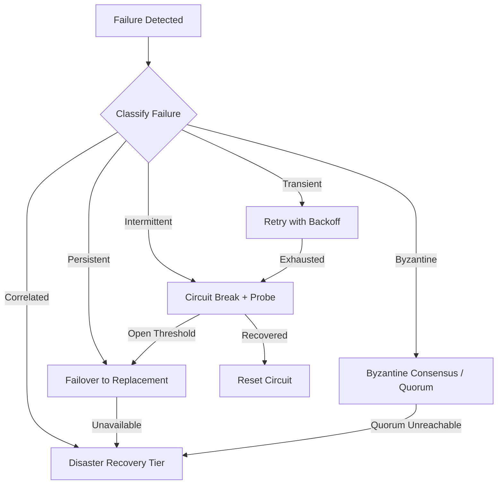

### 6.2 Retry Strategy

Retries are the first-line recovery for transient failures:

- Retries MUST use exponential backoff with jitter unless a fixed strategy is explicitly configured.
- Retry count MUST be bounded per operation (see Section 7).
- Retries MUST carry the original correlation ID and idempotency key.
- After retry exhaustion, the operation MUST transition to terminal failure handling rather than continuing to retry.

### 6.3 Circuit Breaker Strategy

Circuit breakers protect downstream dependencies from overload:

- A circuit breaker MUST have three states: `Closed`, `Open`, `Half-Open`.
- Transition to `Open` occurs when failure rate exceeds configured threshold within a sliding window.
- Transition to `Half-Open` occurs after configured cooldown period.
- A single successful probe in `Half-Open` closes the circuit; a failed probe re-opens it.
- Circuit breakers MUST be per-dependency, not global, to isolate failures.

### 6.4 Failover Strategy

When retries and circuit breakers are exhausted, the system MUST fail over:

- **Agent failover**: Delegate the task to an alternative agent with equivalent capability. Original task MUST be cancelled or marked superseded.
- **Workflow engine failover**: Resume workflow from last checkpoint on alternative engine instance. State store MUST be shared and durable.
- **Council failover**: If the council manager fails, active votes MUST be paused. Upon recovery, votes MUST resume with same tally state.
- **Context store failover**: If the shared context store fails, reads MUST fall back to the last replicated snapshot. Writes MUST queue until store recovers.

### 6.5 Byzantine Failure Strategy

Byzantine failures require quorum-based or consensus-based detection and resolution:

- Agent responses that deviate from declared schema or produce inconsistent results MUST be flagged by the receiving component.
- Flagged responses MUST be validated through council consensus or a designated validation agent.
- Persistent Byzantine behavior MUST result in agent suspension pending investigation.
- Byzantine detection MUST NOT rely on a single observer; at least two independent signals are required.

### 6.6 Fallback Strategy

When primary recovery paths are unavailable, fallbacks provide degraded but functional service:

| Primary | Fallback | Fallback Behavior |
|---------|----------|-------------------|
| Workflow engine unavailable | Direct agent dispatch | Tasks dispatched directly without workflow state tracking |
| Council manager unavailable | Direct delegation | Delegation decisions made by Delegation Manager without council review |
| Shared context store unavailable | In-memory context with replay | Context held in memory; full replay required on store recovery |
| Capability registry unavailable | Cached directory | Use last-known directory snapshot; refresh on registry recovery |
| EventBus unavailable | Local event queue | Events queued locally and replayed on EventBus recovery |

Fallbacks MUST emit `FallbackActivated` and `FallbackDeactivated` events for observability.

---

## 7. Retry Policies

### 7.1 Retry Policy Architecture

Every outbound collaboration operation MUST have an explicit retry policy. Retry policies are configured per operation type and MAY be overridden per workflow or council.

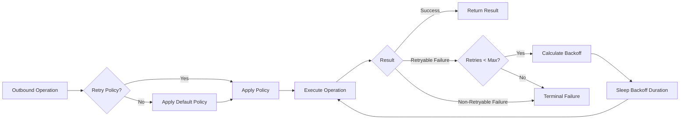

### 7.2 Retry Policy Configuration

| Parameter | Default | Range | Description |
|-----------|---------|-------|-------------|
| `maxRetries` | 3 | 0–10 | Maximum retry attempts per operation |
| `retryBackoffStrategy` | `exponential` | `exponential` / `linear` / `fixed` | Backoff calculation strategy |
| `retryBackoffBaseMs` | 1000 | 100–60000 | Base delay for first retry |
| `retryBackoffMaxMs` | 30000 | 1000–300000 | Maximum backoff delay cap |
| `retryJitter` | `full` | `none` / `equal` / `full` | Jitter strategy to prevent thundering herd |
| `retryableStatusCodes` | `[5xx, timeout, unavailable]` | — | HTTP/gRPC status codes considered retryable |
| `nonRetryableStatusCodes` | `[400, 401, 403, 404, 409, 422]` | — | Status codes that immediately fail |

### 7.3 Retryable vs Non-Retryable Failures

The following table defines the default retry classification. Overrides MUST be explicit and documented.

| Failure Type | Retryable | Rationale |
|-------------|-----------|-----------|
| Network timeout | Yes | Transient; MAY resolve on retry |
| HTTP 5xx | Yes | Server-side transient error |
| HTTP 503 Service Unavailable | Yes | Temporary overload or maintenance |
| gRPC UNAVAILABLE | Yes | Transient connectivity or server load |
| gRPC DEADLINE_EXCEEDED | Yes | Transient overload; retry with increased timeout |
| HTTP 429 Too Many Requests | Yes | Rate limit; retry after Retry-After header |
| HTTP 400 Bad Request | No | Client error; retry will not help |
| HTTP 401 Unauthorized | No | Authentication failure; requires credential refresh |
| HTTP 403 Forbidden | No | Authorization failure; requires policy change |
| HTTP 404 Not Found | No | Resource does not exist |
| HTTP 409 Conflict | No | State conflict; requires resolution before retry |
| HTTP 422 Unprocessable Entity | No | Semantic validation failure |
| Agent crash during task | Yes | New agent instance replaces crashed one |
| State store unavailable | Conditional | Retry for transient unavailability; escalate for persistent |

### 7.4 Idempotency Requirements

All retried operations MUST be idempotent:

- **Idempotency key**: Every retried operation MUST carry a stable idempotency key derived from the original request.
- **Idempotency store**: The platform MUST maintain an idempotency record of operation key → result for at least 24 hours.
- **Idempotency check**: Before executing a retried operation, the system MUST check the idempotency store. If a result exists, it MUST be returned without re-execution.
- **Idempotency cleanup**: Expired idempotency records MUST be pruned after the retention period.

### 7.5 Retry Budgets

To prevent retry storms, the system MUST enforce retry budgets:

- **Global retry budget**: Maximum 10% of total request capacity MAY be consumed by retries.
- **Per-dependency retry budget**: Maximum 20% of requests to any single dependency MAY be retries.
- **Budget enforcement**: When a retry budget is exhausted, additional retries MUST be rejected immediately with a `RetryBudgetExceeded` error.
- **Budget reset**: Retry budgets reset on a sliding window basis (default: 60s window).

---

## 8. Circuit Breakers

### 8.1 Circuit Breaker Architecture

Circuit breakers are per-dependency state machines that prevent cascading failures by stopping traffic to failing dependencies.

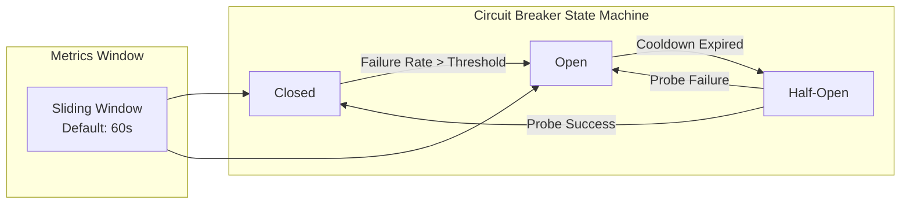

### 8.2 Circuit Breaker Configuration

| Parameter | Default | Description |
|-----------|---------|-------------|
| `failureThreshold` | 0.5 (50%) | Failure rate threshold to open circuit |
| `minimumCalls` | 20 | Minimum calls in window before threshold applies |
| `openDurationMs` | 30000 (30s) | Duration circuit stays open before half-open probe |
| `halfOpenMaxCalls` | 5 | Maximum probe calls in half-open state |
| `successThreshold` | 3 | Consecutive successes required to close from half-open |
| `slidingWindowSize` | 60 | Sliding window size in seconds |

### 8.3 Circuit Breaker Behavior by Dependency Type

| Dependency | Threshold Rationale | Fallback Behavior |
|-----------|---------------------|-------------------|
| Agent-to-agent messaging | 50% failure rate | Queue message for later delivery |
| State store reads | 30% failure rate | Serve from read replica or cached snapshot |
| State store writes | 20% failure rate | Queue writes locally; emit `WriteDeferred` event |
| EventBus publish | 40% failure rate | Local durable queue; replay on recovery |
| Capability registry | 60% failure rate | Use cached directory snapshot |
| External service | 50% failure rate | Return fallback response or raise upstream alert |

### 8.4 Circuit Breaker Observability

Circuit breaker state transitions MUST emit events and metrics:

| Event | Emitted When |
|-------|-------------|
| `CircuitBreakerOpened` | Circuit transitions from Closed to Open |
| `CircuitBreakerHalfOpened` | Circuit transitions from Open to Half-Open |
| `CircuitBreakerClosed` | Circuit transitions from Half-Open to Closed |
| `CircuitBreakerProbeFailed` | Probe call fails in Half-Open state |

| Metric | Type | Description |
|--------|------|-------------|
| `circuit_breaker.state` | Gauge | Current state: closed/open/half-open |
| `circuit_breaker.failure_rate` | Gauge | Current failure rate in sliding window |
| `circuit_breaker.calls.total` | Counter | Total calls through circuit breaker |
| `circuit_breaker.calls.rejected` | Counter | Calls rejected due to open circuit |

---

## 9. Graceful Degradation

### 9.1 Degradation Philosophy

The collaboration layer MUST degrade gracefully under stress rather than failing catastrophically. Degradation is a controlled, policy-driven reduction in service quality that preserves core functionality.

Degradation SHALL follow these rules:

1. **Explicit degradation policies**: Every capability MUST have a defined degradation mode. Implicit or accidental degradation is prohibited.
2. **Progressive degradation**: The system MUST degrade in steps, not all at once. Each step MUST be independently reversible.
3. **Observable degradation**: Every degradation activation MUST emit an event, update metrics, and appear on dashboards.
4. **Automatic recovery**: The system MUST attempt automatic recovery when stress subsides. Manual intervention is required only for persistent root causes.
5. **User-visible communication**: Degradation that affects collaboration outcomes MUST be communicated to affected agents and workflows through structured events.

### 9.2 Degradation Tiers

| Tier | Condition | Degradation Action |
|------|-----------|-------------------|
| **Tier 0 — Normal** | All systems healthy | Full functionality; all features active |
| **Tier 1 — Slight degradation** | Single dependency elevated latency or error rate | Reduce non-critical background tasks; extend timeouts; enable larger batch sizes |
| **Tier 2 — Moderate degradation** | Multiple dependencies affected or single dependency circuit open | Disable non-critical workflows; activate fallback services; reduce parallel task concurrency |
| **Tier 3 — Severe degradation** | Platform-wide stress or multiple circuit breakers open | Suspend new workflow starts; complete in-flight workflows only; activate disaster recovery read path |
| **Tier 4 — Emergency** | State store unavailable or data integrity at risk | Halt all writes; serve from last checkpoint; alert on-call; prepare for manual intervention |

### 9.3 Degradation Policies by Component

| Component | Tier 1 | Tier 2 | Tier 3 | Tier 4 |
|-----------|--------|--------|--------|--------|
| **Workflow Engine** | Reduce `maxParallelTasks` by 25% | Reduce `maxParallelTasks` by 50%; disable branching | Complete in-flight; reject new workflow starts | Halt all; serve read-only status |
| **Council Manager** | Extend `voteTimeoutMs` by 50% | Reduce quorum requirement to 60% | Accept decisions from standing council only | Halt all votes; preserve last decision |
| **Delegation Manager** | Increase delegation TTL | Restrict delegation to registered agents only | Reject new delegations | No delegations; serve cached results |
| **Shared Context** | Enable read cache | Serve from read replica | Serve from last checkpoint snapshot | No writes; read-only access to committed state |
| **Communication Bus** | Enable message batching | Reduce publish frequency; drop low-priority events | Queue only P0/P1 events | Queue all; manual review required |
| **Capability Registry** | Extend cache TTL | Use cached directory only | Manual registry update required | Use last-known snapshot |

### 9.4 Degradation Activation and Recovery

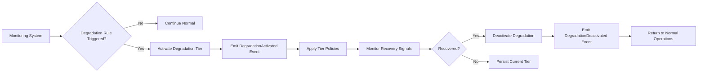

### 9.5 Graceful Shutdown Under Degradation

Components MUST handle shutdown requests correctly at every degradation tier:

- **Tier 0–2**: Accept new work until shutdown signal; drain in-flight work within timeout.
- **Tier 3**: Reject new work immediately; complete only in-flight work that is within its timeout window.
- **Tier 4**: Immediate halt; no new work; preserve state for recovery; emit `EmergencyShutdown` event.

---

## 10. Self Healing

### 10.1 Self-Healing Architecture

Self-healing automates recovery for common failure classes without human intervention. The self-healing subsystem operates as a control loop: detect → classify → remediate → verify.

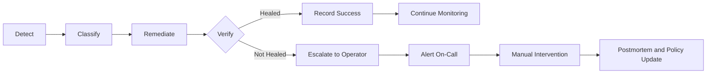

### 10.2 Self-Healing Actions by Failure Class

| Failure Class | Automated Action | Verification | Escalation Condition |
|---------------|-----------------|--------------|----------------------|
| Agent crash | Restart agent process; re-register with directory | Health check passes | 3 consecutive restarts within 10 minutes |
| Agent unresponsive | Remove from routing; mark unavailable | Liveness probe passes | Unavailable for > 5 minutes |
| State store latency | Route reads to replica; queue writes | Latency returns to baseline | Latency > threshold for > 2 minutes |
| EventBus backlog | Scale EventBus consumers; enable batch processing | Backlog depth < threshold | Backlog not reducing after scaling |
| Circuit breaker open | Probe dependency; attempt reset | Circuit closes on success | 3 failed probes in 10 minutes |
| Workflow stalled | Identify stalled task; re-dispatch to new agent | Workflow state advances | Stalled for > 2x timeout |
| Orphan task | Cancel orphan; emit cleanup event | Orphan removed from scan | Cannot cancel (external side effect) |
| Checkpoint corruption | Revert to prior checkpoint; alert | Workflow resumes successfully | Prior checkpoint also corrupted |

### 10.3 Healing Constraints

Self-healing MUST respect the following constraints:

- **No destructive auto-recovery**: Actions that MAY permanently destroy state or external side effects MUST require explicit operator approval.
- **Healing loop timeout**: Any single healing action MUST complete within its timeout or abort and escalate. Healing loops without progress are prohibited.
- **Healing audit trail**: Every healing action MUST be recorded in an immutable audit log with timestamp, action taken, and outcome.
- **Healing rate limit**: Healing actions for the same component MUST be rate-limited to prevent oscillation. Default: maximum 5 healing actions per component per hour.

---

## 11. Checkpointing

### 11.1 Checkpoint Architecture

A checkpoint is a durable, consistent snapshot of collaboration state at a defined workflow, council, or session boundary. Checkpointing is the primary mechanism enabling state recovery after failures.

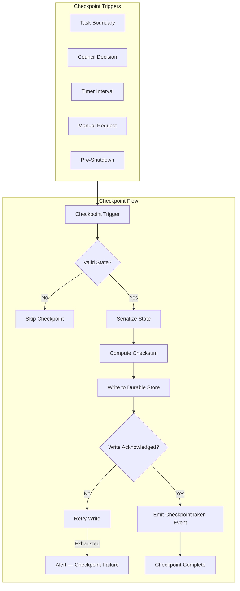

### 11.2 Checkpoint Contents

Every checkpoint MUST contain:

| Field | Description |
|-------|-------------|
| `checkpointId` | Unique identifier for this checkpoint |
| `workflowId` / `councilId` / `sessionId` | The collaboration unit being checkpointed |
| `version` | Monotonically increasing version number |
| `timestamp` | ISO-8601 timestamp of checkpoint creation |
| `state` | Serialized state of the collaboration unit |
| `completedTasks` | List of completed task units up to this point |
| `pendingTasks` | List of pending task units with their dispatch state |
| `sharedContextVersion` | Version of shared context at checkpoint time |
| `decisions` | Council decisions committed before this checkpoint |
| `checksum` | SHA-256 checksum of the serialized state |
| `metadata` | Operator-defined metadata for audit and debugging |

### 11.3 Checkpoint Triggers

| Trigger | Default Frequency | Mandatory? |
|---------|-------------------|-----------|
| **Task boundary** | After every N completed tasks (default: 10) | Yes |
| **Council decision** | After every published decision | Yes |
| **Timer interval** | Every 5 minutes for long-running workflows | No |
| **Manual request** | On-demand via API | No |
| **Pre-shutdown** | Before any planned shutdown or pause | Yes |
| **Error threshold** | After every Nth consecutive task failure (default: 5) | No |

### 11.4 Checkpoint Storage

Checkpoints MUST be stored durably:

- **Write path**: Checkpoints MUST be written to the primary durable store before acknowledgment.
- **Replication**: Checkpoints MUST be replicated to at least one secondary store within configured replication lag (default: < 5s).
- **Integrity verification**: On every read, the system MUST verify the checksum. Corrupted checkpoints MUST be rejected and the prior valid checkpoint used.
- **Retention**: Checkpoints MUST be retained for the workflow lifetime plus configured post-completion retention (default: 30 days).
- **Compaction**: Completed workflow checkpoints MAY be compacted to a summary state after retention period to reduce storage.

### 11.5 Checkpoint Consistency

Checkpoints MUST provide the following consistency guarantees:

- **Atomicity**: A checkpoint is either fully written or not written. Partial checkpoints MUST be discarded.
- **Isolation**: Checkpoint creation MUST NOT block workflow execution for longer than the configured checkpoint timeout (default: 5s).
- **Durability**: Once acknowledged, a checkpoint MUST survive process, node, and single-region failures.
- **Ordering**: Checkpoint versions MUST be strictly monotonically increasing. Out-of-order checkpoints MUST be rejected.

---

## 12. State Recovery

### 12.1 Recovery Architecture

State recovery restores collaboration units to a consistent, operational state after failures. The recovery architecture distinguishes between automatic recovery (handled by self-healing) and manual recovery (requiring operator action).

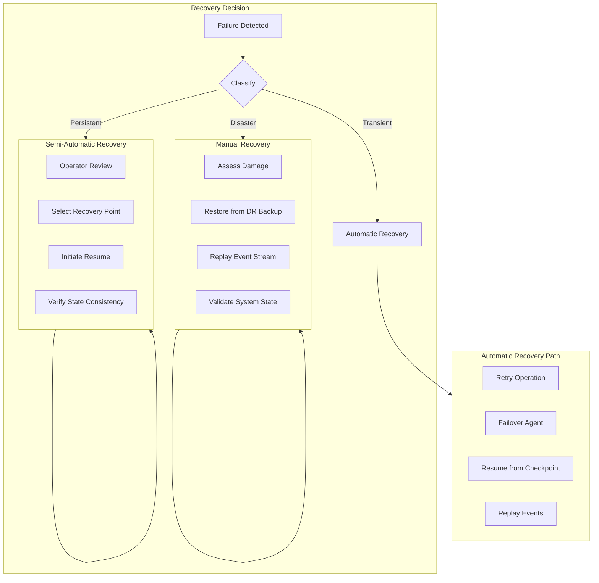

### 12.2 Workflow Recovery

Workflow recovery follows a defined protocol:

1. **Detection**: Workflow engine detects process failure, heartbeat loss, or stall.
2. **Lock acquisition**: Recovery process acquires a distributed lock on the workflow instance to prevent concurrent recovery.
3. **Checkpoint selection**: The system selects the most recent valid checkpoint. If no valid checkpoint exists, the workflow transitions to `Failed` state.
4. **State validation**: The checkpoint state is validated against the current workflow definition version. Mismatches trigger migration or failure.
5. **Task reconciliation**: Completed tasks in the checkpoint are compared against actual state. Orphaned tasks are cancelled; missing tasks are re-dispatched.
6. **State restore**: The workflow engine restores state from the checkpoint.
7. **Resume**: The workflow transitions to `Running` state from the last checkpointed task.
8. **Emit event**: `WorkflowResumed` event is emitted with checkpoint version and recovery timestamp.

### 12.3 Council Recovery

Council recovery MUST preserve deliberation integrity:

1. **Lock acquisition**: Recovery process acquires lock on the council instance.
2. **State restore**: Restore council state from last checkpointed deliberation state.
3. **Vote reconciliation**: Verify all stored votes are present and valid. Missing votes trigger session extension.
4. **Quorum re-evaluation**: Recalculate quorum with current member list. If quorum cannot be met, council enters `Suspended` state.
5. **Decision integrity**: Published decisions MUST NOT be rolled back. Only in-progress deliberations are recoverable.
6. **Audit trail**: Recovery action MUST be appended to council audit log.

### 12.4 Shared Context Recovery

Shared context recovery MUST maintain access-controlled consistency:

1. **Version reconciliation**: The latest consistent version is identified by comparing checkpoint version with store version.
2. **Conflict resolution**: If concurrent writes created conflicts, the conflict resolution policy (last-writer-wins, council-validated, or operator-resolved) is applied.
3. **Access re-establishment**: Context access controls are re-evaluated after recovery. Expired grants are purged; active grants are restored.
4. **Subscriber notification**: All active context subscribers are notified of recovery with the restored version.

### 12.5 Recovery Point Objectives (RPO)

| Collaboration Unit | Target RPO | Maximum Acceptable RPO | Mechanism |
|--------------------|------------|------------------------|-----------|
| Workflow state | 30s | 5 minutes | Continuous checkpointing at task boundaries |
| Council deliberation | 0 (vote-persistent) | 1 vote cycle | Vote persistence before tally |
| Shared context | 10s | 1 minute | Replicated write-ahead log |
| Delegation state | 30s | 5 minutes | Delegation record persistence |
| Agent registry | 60s | 15 minutes | Registry replication |

### 12.6 Recovery Time Objectives (RTO)

| Recovery Scenario | Target RTO | Maximum Acceptable RTO | Mechanism |
|-------------------|------------|------------------------|-----------|
| Single agent failure | 30s | 2 minutes | Failover to replacement agent |
| Workflow engine failure | 60s | 5 minutes | Resume on alternative engine instance |
| Council manager failure | 30s | 2 minutes | Resume on alternative instance |
| State store failure (single node) | 30s | 2 minutes | Failover to replica |
| State store failure (region) | 5 minutes | 30 minutes | Cross-region failover |
| Communication bus failure | 60s | 5 minutes | Queue locally; replay on recovery |
| Platform-wide degradation | 5 minutes | 15 minutes | Activate disaster recovery tier |

---

## 13. Disaster Recovery

### 13.1 Disaster Recovery Tiers

The collaboration layer defines three disaster recovery tiers based on blast radius and recovery complexity:

```mermaid
flowchart TD
    subgraph Tier1[Tier 1: Local Recovery]
        T1A[Single Component Failure]
        T1B[Single Agent Failure]
        T1C[Single Node Failure]
        T1D[RTO < 5min | RPO < 1min]
    end

    subgraph Tier2[Tier 2: Regional Recovery]
        T2A[Availability Zone Failure]
        T2B[State Store Primary Failure]
        T2C[EventBus Cluster Failure]
        T2D[RTO < 30min | RPO < 5min]
    end

    subgraph Tier3[Tier 3: Platform Recovery]
        T3A[Region Failure]
        T3B[Multi-AZ Correlated Failure]
        T3C[Data Integrity Compromise]
        T3D[RTO < 4hrs | RPO < 15min]
    end

    Tier1 --> Tier2 --> Tier3
```

### 13.2 Backup Architecture

| Data Type | Backup Method | Frequency | Retention | Cross-Region |
|-----------|--------------|-----------|-----------|--------------|
| **Checkpoints** | Continuous replication | Real-time | 90 days | Yes |
| **Council decisions** | Continuous replication | Real-time | 7 years | Yes |
| **Shared context snapshots** | Scheduled snapshot | Every 1 hour | 30 days | Yes |
| **Agent registry** | Continuous replication | Real-time | 30 days | Yes |
| **Event stream** | Immutable log replication | Real-time | 90 days | Yes |
| **Workflow definitions** | Version-controlled store | On change | Permanent | Yes |

### 13.3 Cross-Region Failover

Cross-region failover MUST satisfy:

- **Warm standby**: A secondary region MUST maintain a warm standby of all critical collaboration services with state replication lag < 15s.
- **DNS / routing failover**: Traffic MUST be routable to the secondary region within 60s of primary region failure detection.
- **State promotion**: The secondary region's state store MUST be promotable to primary within 5 minutes.
- **Data divergence tolerance**: The system MUST tolerate up to 15 minutes of state divergence during failover. Operations within the divergence window MUST be reconciled post-failover.
- **Failback**: After primary region recovery, failback MUST be planned, tested, and executed with operator approval. Automatic failback is prohibited.

### 13.4 Disaster Recovery Runbook

The following runbook steps MUST be documented and tested quarterly:

1. **Detection**: Confirm disaster tier and affected services.
2. **Assessment**: Evaluate data divergence and recovery point feasibility.
3. **Authorization**: Obtain operator approval for tier-appropriate recovery action.
4. **Isolation**: Isolate affected region from traffic to prevent split-brain.
5. **Promotion**: Promote secondary region services to primary.
6. **State reconciliation**: Replay divergent events; resolve conflicts using defined policies.
7. **Validation**: Run smoke tests against promoted region; validate workflow, council, and context integrity.
8. **Communication**: Notify affected tenants and operators of recovery status.
9. **Post-recovery**: Monitor secondary region for 24 hours before returning to warm standby.

---

## 14. Performance Optimization

### 14.1 Performance Targets

The collaboration layer MUST meet the following performance targets under normal load:

| Metric | Target | Measurement Window | Percentile |
|--------|--------|--------------------|------------|
| Task dispatch latency | < 100ms | 5 minutes | p99 |
| Workflow state transition | < 50ms | 5 minutes | p99 |
| Checkpoint write | < 200ms | 5 minutes | p99 |
| Checkpoint read | < 50ms | 5 minutes | p99 |
| Council vote cast processing | < 200ms | 5 minutes | p99 |
| Council tally computation | < 500ms | 5 minutes | p99 |
| Shared context read | < 20ms | 5 minutes | p99 |
| Shared context write | < 100ms | 5 minutes | p99 |
| Agent discovery lookup | < 50ms | 5 minutes | p99 |
| EventBus publish end-to-end | < 100ms | 5 minutes | p99 |
| End-to-end workflow latency | < 5s per task | Per workflow | p95 |

### 14.2 Performance Budgets

Performance budgets are allocated per workflow stage. Budget overruns MUST trigger alerts and degradation policies.

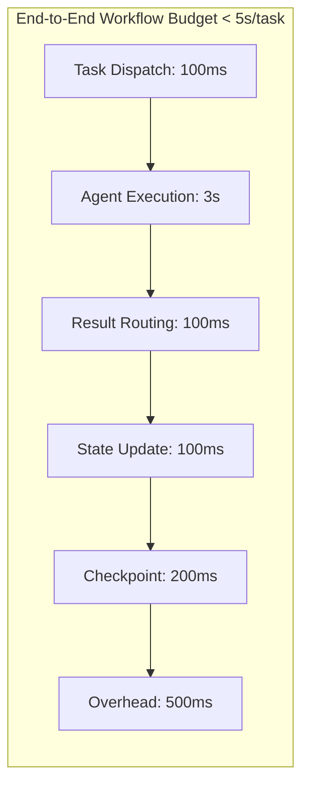

### 14.3 Optimization Techniques

The following optimization techniques are REQUIRED or RECOMMENDED:

| Technique | Requirement | Description |
|-----------|-------------|-------------|
| **Connection pooling** | Required | All outbound connections MUST use connection pools with configurable max connections |
| **Request batching** | Required | Bulk operations (context reads, event publishes) MUST use batching |
| **Caching** | Required | Agent directory, capability registry, and shared context reads MUST be cached with TTL |
| **Lazy loading** | Recommended | Workflow definitions and large context payloads SHOULD be lazy-loaded |
| **Async processing** | Required | Non-blocking operations MUST use async patterns; blocking operations MUST be isolated in thread pools |
| **Index optimization** | Required | State store queries MUST use indexes; full-table scans are prohibited for production queries |
| **Serialization optimization** | Required | State serialization MUST use efficient formats; protobuf or equivalent is REQUIRED |
| **Memory management** | Required | Large payloads MUST use streaming; in-memory buffering MUST have explicit limits |
| **Lock optimization** | Required | Locks MUST be fine-grained and short-held; lock-free data structures are preferred for read-heavy paths |

### 14.4 Latency Optimization Patterns

| Pattern | Application | Benefit |
|---------|-------------|---------|
| **Edge caching** | Agent directory, capability registry | Reduces lookup latency |
| **Write-behind** | Shared context writes | Reduces write amplification |
| **Read repair** | Shared context reads | Hides replica lag from callers |
| **Prefetching** | Workflow task dispatch | Preloads candidate agents before dispatch decision |
| **Pipeline parallelism** | Multi-stage workflows | Overlaps execution of independent stages |
| **Backpressure** | EventBus, queues | Prevents producer overwhelm; maintains latency bounds |

---

## 15. Scalability

### 15.1 Scalability Model

The collaboration layer MUST scale horizontally. Scalability targets:

| Dimension | Target | Scaling Mechanism |
|-----------|--------|-------------------|
| Concurrent workflows | 10,000 per engine instance | Horizontal scaling via partitioned workflow assignment |
| Concurrent councils | 1,000 per council manager instance | Horizontal scaling via council ID partitioning |
| Active agents | 100,000 per collaboration domain | Horizontal scaling via agent directory partitioning |
| Events per second | 50,000 EPS per EventBus cluster | Horizontal scaling via event partitioning |
| Shared context reads | 20,000 RPS per context store | Read replica scaling |
| Shared context writes | 5,000 WPS per context store | Primary/replica write distribution |

### 15.2 Partitioning Strategy

State MUST be partitioned to enable horizontal scaling:

| State Type | Partition Key | Partition Strategy |
|------------|---------------|-------------------|
| **Workflow instances** | `workflowId` | Hash partitioning |
| **Council instances** | `councilId` | Hash partitioning |
| **Shared context** | `sessionId` + `scope` | Range partitioning with hot-spot mitigation |
| **Agent registry** | `agentId` | Hash partitioning |
| **Checkpoints** | `workflowId` | Co-located with workflow partition |
| **Events** | `workflowId` / `councilId` | Partitioned by correlation key |

### 15.3 Autoscaling Rules

Autoscaling MUST be based on multiple signals, not a single metric:

| Signal | Scaling Up Threshold | Scaling Down Threshold | Cooldown |
|--------|---------------------|------------------------|----------|
| Workflow queue depth | > 500 pending tasks | < 100 pending tasks | 5 minutes |
| EventBus consumer lag | > 10,000 messages | < 1,000 messages | 5 minutes |
| CPU utilization | > 70% | < 40% | 10 minutes |
| Memory utilization | > 80% | < 50% | 10 minutes |
| Checkpoint write latency | > p99 > 500ms | < p99 < 200ms | 5 minutes |

### 15.4 Scalability Anti-Patterns

The following anti-patterns are PROHIBITED:

- **Shared mutable state without partitioning**: Any state accessed by multiple instances MUST be partitioned or replicated.
- **Global locks**: Distributed global locks are prohibited. Use partitioned locks or lease-based coordination.
- **Centralized routing**: A single routing table accessed by all instances is prohibited. Use partitioned or replicated routing.
- **Unbounded queues**: Queues MUST have explicit capacity limits with backpressure. Unbounded queues are prohibited.
- **Chatty protocols**: Protocols requiring multiple round-trips per operation are prohibited for latency-sensitive paths.

---

## 16. Monitoring

### 16.1 Monitoring Architecture

The collaboration layer MUST be fully observable. Monitoring MUST cover health, performance, reliability, and business metrics.

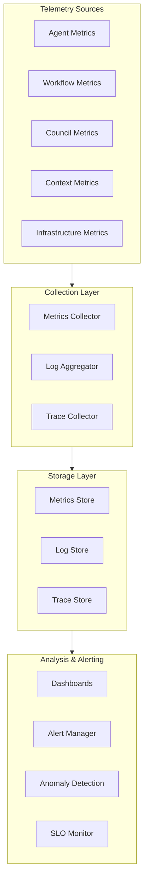

### 16.2 Monitoring Layers

| Layer | What is Monitored | Tooling |
|-------|-------------------|---------|
| **Infrastructure** | Node health, CPU, memory, disk, network | Infrastructure monitoring |
| **Platform** | Service health, connection pools, queue depths | Platform metrics |
| **Collaboration** | Workflow rates, council outcomes, context size, delegation latency | Collaboration-specific metrics |
| **Business** | Collaboration success rate, SLA compliance, agent utilization | Business metrics |

### 16.3 Health Dashboards

The following dashboards MUST be maintained:

| Dashboard | Audience | Refresh Rate | Key Indicators |
|-----------|----------|--------------|----------------|
| **System Health** | Operators | 10s | Service status, error rate, latency p50/p95/p99 |
| **Workflow Operations** | Operators / Developers | 30s | Throughput, failure rate, average duration, retry rate |
| **Council Operations** | Operators | 60s | Active councils, vote latency, quorum failures |
| **Agent Fleet** | Operators | 30s | Agent count, health distribution, capability coverage |
| **SLA Compliance** | Leadership | 5 minutes | SLO achievement rate, incident count, MTTR |
| **Capacity Planning** | Architects | Daily | Resource utilization trend, growth rate, scaling projections |

### 16.4 Alerting Policy

Alerts MUST be categorized by severity and routed to appropriate responders:

| Severity | Description | Response Time | Notification Channel |
|----------|-------------|---------------|---------------------|
| **P0 — Critical** | Data loss risk, platform-wide failure, SLA breach imminent | 5 minutes | PagerDuty / SMS on-call |
| **P1 — High** | Single service failure, significant SLA degradation | 15 minutes | PagerDuty / Slack on-call |
| **P2 — Medium** | Degraded performance, rising error rate | 1 hour | Slack team channel |
| **P3 — Low** | Capacity approaching limit, anomaly detected | 4 hours | Email / ticket |
| **P4 — Informational** | Policy change, successful recovery | Next business day | Log only |

### 16.5 Alert Design Principles

Alerts MUST follow these principles:

- **Actionable**: Every alert MUST have a defined response action and runbook link.
- **Specific**: Alerts MUST identify the affected component, scope, and severity.
- **Noisy alert suppression**: Repeated identical alerts within a deduplication window MUST be suppressed after the first.
- **Escalation**: Unacknowledged alerts MUST escalate through defined escalation chains.
- **Auto-resolution**: Alerts MUST auto-resolve when the condition clears. Stale alerts are prohibited.

---

## 17. Metrics

### 17.1 Metric Categories

All metrics are organized into the following categories:

| Category | Purpose | Examples |
|----------|---------|---------|
| **Availability** | Measure uptime and service availability | `workflow.available`, `council.available` |
| **Reliability** | Measure failure rates and recovery | `task.failure.rate`, `workflow.recovery.count` |
| **Performance** | Measure latency and throughput | `task.dispatch.latency`, `workflow.throughput` |
| **Saturation** | Measure resource utilization | `queue.depth`, `connection.pool.utilization` |
| **Efficiency** | Measure resource efficiency | `checkpoint.size`, `context.read.efficiency` |

### 17.2 Required Metrics

The following metrics are REQUIRED for all collaboration components:

| Metric Name | Type | Unit | Description |
|-------------|------|------|-------------|
| `collaboration.request.count` | Counter | requests | Total collaboration requests received |
| `collaboration.request.success` | Counter | requests | Successful requests |
| `collaboration.request.failure` | Counter | requests | Failed requests |
| `collaboration.request.latency` | Histogram | ms | End-to-end request latency |
| `collaboration.retry.count` | Counter | retries | Retry attempts issued |
| `collaboration.circuit_breaker.open` | Gauge | boolean | Circuit breaker state (1 = open) |
| `collaboration.checkpoint.count` | Counter | checkpoints | Checkpoints taken |
| `collaboration.checkpoint.latency` | Histogram | ms | Checkpoint write latency |
| `collaboration.checkpoint.failure` | Counter | failures | Checkpoint write failures |
| `collaboration.workflow.started` | Counter | workflows | Workflows started |
| `collaboration.workflow.completed` | Counter | workflows | Workflows completed successfully |
| `collaboration.workflow.failed` | Counter | workflows | Workflows failed |
| `collaboration.workflow.resumed` | Counter | workflows | Workflows resumed from checkpoint |
| `collaboration.workflow.duration` | Histogram | seconds | Workflow end-to-end duration |
| `collaboration.council.vote.initiated` | Counter | votes | Council votes initiated |
| `collaboration.council.vote.completed` | Counter | votes | Council votes completed |
| `collaboration.council.quorum.failed` | Counter | events | Quorum failures |
| `collaboration.context.read` | Counter | reads | Shared context reads |
| `collaboration.context.write` | Counter | writes | Shared context writes |
| `collaboration.context.conflict` | Counter | conflicts | Context write conflicts detected |
| `collaboration.delegation.dispatched` | Counter | delegations | Tasks delegated |
| `collaboration.delegation.retried` | Counter | retries | Delegation retries |
| `collaboration.delegation.failed` | Counter | failures | Delegation failures |
| `collaboration.self_heal.count` | Counter | actions | Self-healing actions taken |
| `collaboration.degradation.active` | Gauge | boolean | Current degradation tier (0-4) |
| `collaboration.dr.failover.count` | Counter | events | Disaster recovery failovers |

### 17.3 Metric Naming Conventions

All metrics MUST follow the naming convention:

```
collaboration.<component>.<action>.<unit>
```

- **component**: workflow, council, context, delegation, communication, checkpoint, circuit_breaker, self_heal, degradation, dr
- **action**: started, completed, failed, retried, resumed, count, latency, duration, conflict
- **unit**: count, ms, seconds, boolean

### 17.4 Metric Retention

| Metric Type | Retention Period | Resolution |
|-------------|------------------|------------|
| High-resolution metrics | 30 days | 10s |
| Aggregated metrics | 90 days | 1 minute |
| Long-term trends | 2 years | 1 hour |
| Audit metrics | 7 years | 1 day |

---

## 18. Bottleneck Analysis

### 18.1 Bottleneck Identification Process

Bottleneck analysis MUST be performed continuously through automated profiling and periodically through dedicated analysis sessions.

```mermaid
flowchart LR
    subgraph DataCollection[Data Collection]
        DC1[Latency Profiles]
        DC2[Resource Utilization]
        DC3[Queue Depths]
        DC4[Error Rates]
    end

    subgraph Analysis[Analysis]
        A1[Identify Slow Paths]
        A2[Resource Saturation Check]
        A3[Correlation Analysis]
        A4[Trend Detection]
    end

    subgraph Action[Action]
        AC1[Capacity Increase]
        AC2[Optimization]
        AC3[Architectural Change]
    end

    DataCollection --> Analysis --> Action
```

### 18.2 Common Bottleneck Patterns

| Pattern | Symptoms | Root Cause | Remediation |
|---------|----------|------------|-------------|
| **Hot partition** | One partition has 10x traffic of others | Poor partition key choice | Rebalance partition key; add partition |
| **Lock contention** | Latency spikes under concurrency | Coarse-grained lock | Reduce lock scope; use lock-free structures |
| **Connection exhaustion** | Connection pool saturated | Too many concurrent outbound calls | Increase pool size; add connection limits per dependency |
| **Queue saturation** | Task dispatch latency increasing | Producer rate > consumer rate | Scale consumers; add backpressure |
| **Checkpoint storms** | Write latency spikes during checkpoint | Too many concurrent checkpoints | Stagger checkpoints; batch writes |
| **State store hot key** | Read/write latency on single key | Single key accessed by all instances | Shard key; add caching layer |
| **EventBus backpressure** | Publish latency increasing | Consumer lag growing | Scale consumers; partition events |
| **Council deliberation stall** | Vote sessions timing out | Members unresponsive or overloaded | Reduce quorum requirement; add fallback members |

### 18.3 Profiling Requirements

All collaboration components MUST support:

- **CPU profiling**:火焰 graphs generated on demand or during incidents.
- **Memory profiling**: Heap snapshots on allocation threshold breach.
- **Lock profiling**: Lock contention metrics and slow lock detection.
- **I/O profiling**: Blocking I/O call durations and frequencies.
- **Distributed tracing**: End-to-end traces with span annotations at each collaboration boundary.

### 18.4 Capacity Planning

Capacity planning MUST be performed monthly and before every major release:

| Capacity Metric | Planning Horizon | Review Trigger |
|-----------------|------------------|----------------|
| Workflow throughput | 6 months | > 70% of projected capacity |
| Council concurrency | 6 months | > 70% of projected capacity |
| State store IOPS | 3 months | > 80% of provisioned IOPS |
| EventBus throughput | 3 months | > 70% of peak EPS |
| Agent registry size | 12 months | > 70% of expected agent count |
| Checkpoint storage | 12 months | > 60% of allocated storage |

---

## 19. High Availability

### 19.1 Availability Targets

The collaboration layer MUST meet the following availability targets:

| Component | Target Availability | Annual Downtime | Measurement Method |
|-----------|---------------------|-----------------|-------------------|
| **Workflow Engine** | 99.99% | < 52 minutes | Health checks + synthetic transactions |
| **Council Manager** | 99.99% | < 52 minutes | Health checks + synthetic transactions |
| **Shared Context Store** | 99.995% | < 26 minutes | Read/write probes from multiple AZs |
| **EventBus** | 99.99% | < 52 minutes | Publish/consume probes |
| **Capability Registry** | 99.9% | < 8.7 hours | Directory lookup probes |
| **Communication Bus** | 99.99% | < 52 minutes | Round-trip message probes |

### 19.2 High Availability Architecture

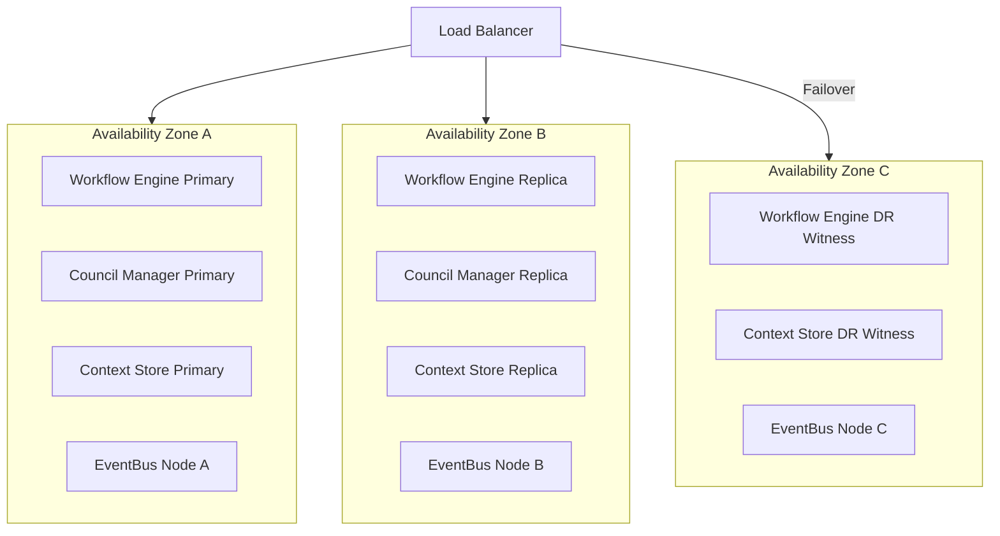

### 19.3 Redundancy Requirements

| Component | Redundancy Requirement | Failover Mechanism |
|-----------|------------------------|-------------------|
| **Workflow Engine** | 3 instances across 3 AZs | Automatic failover via shared state store |
| **Council Manager** | 3 instances across 3 AZs | Automatic failover via shared state store |
| **State Store** | 3 replicas, 1 per AZ | Automatic leader election; quorum-based writes |
| **EventBus** | 3 brokers across 3 AZs | Automatic partition rebalancing |
| **Agent Directory** | Read replicas in each AZ | Automatic DNS failover to healthy replica |
| **Communication Bus** | 2 instances per AZ | Load balancer health check removal |

### 19.4 Zero-Downtime Deployment

Collaboration services MUST support zero-downtime deployments:

- **Rolling deployment**: New instances are brought up before old instances are drained.
- **Health gate**: New instances MUST pass health checks before receiving traffic.
- **Drain period**: Old instances MUST drain in-flight work before shutdown.
- **Rollback**: Failed deployments MUST be rolled back automatically if error rate exceeds threshold within 5 minutes of deployment.
- **Canary**: Critical path changes MUST be deployed to canary instances first, validated, then rolled out.

---

## 20. Resilience Patterns

### 20.1 Resilience Pattern Catalog

The following resilience patterns are REQUIRED or RECOMMENDED for collaboration components:

| Pattern | Purpose | Requirement | Implementation |
|---------|---------|-------------|----------------|
| **Retry with backoff** | Mask transient failures | Required | Exponential backoff with jitter; bounded retries |
| **Circuit breaker** | Prevent cascading failures | Required | Per-dependency; three states; configurable thresholds |
| **Bulkhead** | Isolate failures | Required | Partition resources by workflow, council, tenant |
| **Timeout** | Bound wait time | Required | Explicit timeout for every outbound call |
| **Fallback** | Provide degraded service | Required | Defined fallback for every critical dependency |
| **Cache-aside** | Reduce store load | Required | Agent directory, capability registry |
| **Health check** | Detect failures | Required | Liveness and readiness probes |
| **Graceful degradation** | Maintain partial service | Required | Tiered degradation policies |
| **Checkpoint and resume** | Recover state | Required | Durable checkpoints at defined boundaries |
| **Eventual consistency with read repair** | Handle replica lag | Required | Shared context reads trigger async repair |
| **Idempotent receiver** | Safe retries | Required | All handlers accept idempotency keys |
| **Leader election** | Single-writer coordination | Required | Council manager, state store primary |
| **Publisher confirms** | Ensure message delivery | Required | EventBus publish with confirm |
| **Competing consumers** | Scale consumption | Required | EventBus, task queues |
| **Claim check** | Decouple request from processing | Recommended | Long-running workflows |

### 20.2 Bulkhead Pattern

The bulkhead pattern isolates failures by partitioning resources:

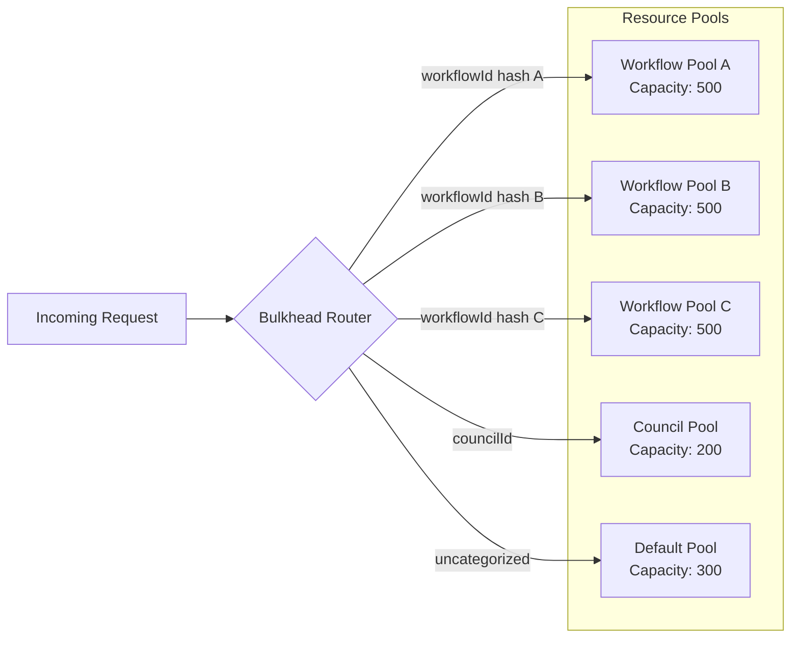

Bulkhead rules:

- Each workflow, council, and tenant class MUST have a dedicated resource pool or share allocation.
- Pool exhaustion in one bulkhead MUST NOT affect other bulkheads.
- Pool sizes MUST be configured based on SLA and capacity planning.
- Pool exhaustion triggers degradation in the affected bulkhead only.

### 20.3 Timeout Hierarchy

Timeouts MUST be defined at every layer with increasing scope:

| Layer | Timeout | Action on Expiry |
|-------|---------|------------------|
| **HTTP/gRPC call** | 2s | Return timeout error; trigger retry or circuit breaker |
| **Task execution** | 300s (5 min) | Cancel task; emit timeout event; retry or fail |
| **Workflow stage** | 3600s (1 hour) | Halt workflow; checkpoint; escalate |
| **Council vote** | 300s (5 min) | Close vote; record quorum failure; notify members |
| **Checkpoint write** | 5s | Abort checkpoint; retry; alert if persistent |
| **Health check** | 2s | Mark component unready |
| **Saga / long operation** | 86400s (24 hours) | Escalate to operator; preserve state for manual continuation |

### 20.4 Resilience Testing

All resilience mechanisms MUST be validated through testing:

| Test Type | Frequency | Scope | Tooling |
|-----------|-----------|-------|---------|
| **Chaos testing** | Weekly | Agent failures, network partitions, store unavailability | Chaos Monkey equivalent |
| **Load testing** | Per release | Throughput and latency under peak load | Load generator |
| **Failure injection** | Per release | Circuit breaker activation, timeout handling | Fault injection framework |
| **Disaster recovery drill** | Quarterly | Cross-region failover | Manual + automated validation |
| **Recovery validation** | Per release | Workflow resume, council recovery, state consistency | Automated test suite |
| **Checkpoint integrity** | Per release | Checkpoint corruption detection, fallback | Automated test suite |

---

## 21. SLA Considerations

### 21.1 SLA Definitions

The collaboration layer commits to the following SLAs:

| SLA | Target | Measurement |
|-----|--------|-------------|
| **Workflow success rate** | ≥ 99.9% of workflows reach terminal state (success or explicit failure) | Monthly |
| **Workflow completion latency** | p95 ≤ 30 seconds per task; p99 ≤ 2 minutes per task | Daily |
| **Council decision latency** | p95 ≤ 5 minutes; p99 ≤ 15 minutes from proposal to published decision | Daily |
| **Delegation success rate** | ≥ 99.5% of delegations reach terminal state | Monthly |
| **Shared context availability** | ≥ 99.99% | Monthly |
| **Platform availability** | ≥ 99.99% | Monthly |
| **MTTR** | ≤ 15 minutes for P0/P1 incidents | Per incident |
| **Checkpoint RPO** | ≤ 30 seconds for workflow state | Continuous |
| **Data durability** | ≤ 10^-9 probability of checkpoint loss | Annual |

### 21.2 SLA Calculation

SLA compliance is calculated as:

```
SLA Compliance = (Successful Operations / Total Operations) × 100%
```

Excluded from SLA calculations:

- Operations interrupted by scheduled maintenance with 48-hour advance notice.
- Failures caused by customer-supplied agent code.
- Failures during platform-wide disaster recovery events.
- Operations exceeding customer-defined resource quotas.

### 21.3 SLA Violation Response

When an SLA target is at risk of being breached:

1. **Detection**: SLO monitor detects projected SLA miss within 80% of measurement window.
2. **Escalation**: Alert routed to on-call team with SLA identifier and projected miss time.
3. **Mitigation**: On-call team implements mitigation plan from runbook.
4. **Communication**: Affected tenants are notified of SLA risk and estimated recovery time.
5. **Post-incident**: If SLA is breached, a post-incident review is conducted within 5 business days.
6. **Remediation**: SLA miss root cause is addressed; preventive measures are implemented.

### 21.4 SLA Reporting

SLA reports MUST be published:

| Report | Frequency | Distribution | Contents |
|--------|-----------|--------------|----------|
| **SLA dashboard** | Real-time | Internal | Current SLA achievement against targets |
| **Monthly SLA report** | Monthly | Leadership | SLA achievement, incidents, MTTR, trend analysis |
| **Quarterly SLA review** | Quarterly | Architecture board | SLA targets, adjustments, architectural improvements |

---

## 22. Configuration Reference

### 22.1 Reliability Configuration Schema

All reliability-related configuration MUST be defined in the following structure. Configuration MAY be overridden at workflow, council, or tenant level.

```yaml
reliability:
  faultTolerance:
    healthCheckIntervalMs: 10000
    healthCheckTimeoutMs: 2000
    heartbeatIntervalMs: 5000
    missedHeartbeatThreshold: 5

  retry:
    maxRetries: 3
    backoffStrategy: exponential
    backoffBaseMs: 1000
    backoffMaxMs: 30000
    jitter: full
    retryableStatusCodes: ["5xx", "timeout", "unavailable"]
    nonRetryableStatusCodes: ["400", "401", "403", "404", "409", "422"]
    idempotencyRetentionMs: 86400000

  circuitBreaker:
    failureThreshold: 0.5
    minimumCalls: 20
    openDurationMs: 30000
    halfOpenMaxCalls: 5
    successThreshold: 3
    slidingWindowSizeSeconds: 60

  degradation:
    tier1QueueThreshold: 500
    tier2CircuitOpenThreshold: 3
    tier3NewWorkflowReject: true
    tier4WriteHalt: true

  selfHealing:
    enabled: true
    healingRateLimitPerHour: 5
    maxConsecutiveRestarts: 3
    maxUnavailableDurationMs: 300000

  checkpoint:
    taskInterval: 10
    councilDecision: true
    timerIntervalMs: 300000
    preShutdown: true
    errorThreshold: 5
    writeTimeoutMs: 5000
    retentionDays: 30
    replicationLagMs: 5000

  recovery:
    workflowRpoMs: 30000
    workflowRtoMs: 60000
    councilRpoVotes: 0
    councilRtoMs: 30000
    contextRpoMs: 10000
    contextRtoMs: 30000

  disasterRecovery:
    warmStandby: true
    replicationLagMs: 15000
    failoverDnsTtlSeconds: 60
    promotionTimeMs: 300000
    maxDataDivergenceMs: 900000

  performance:
    taskDispatchLatencyP99Ms: 100
    workflowStateTransitionP99Ms: 50
    checkpointWriteP99Ms: 200
    maxConcurrentWorkflowsPerInstance: 10000
    maxConcurrentCouncilsPerInstance: 1000

  scalability:
    targetWorkflowThroughput: 10000
    autoscalingEnabled: true
    scaleUpQueueThreshold: 500
    scaleDownQueueThreshold: 100
    cooldownMs: 300000

  monitoring:
    metricsRetentionDays: 90
    alertEvaluationIntervalSeconds: 30
    p0ResponseTimeMinutes: 5
    p1ResponseTimeMinutes: 15

  slas:
    workflowSuccessRate: 0.999
    workflowP95LatencyMs: 30000
    workflowP99LatencyMs: 120000
    councilDecisionP95Ms: 300000
    councilDecisionP99Ms: 900000
    delegationSuccessRate: 0.995
    platformAvailability: 0.9999
    checkpointRpoMs: 30000
    mttrMinutes: 15
```

### 22.2 Configuration Hierarchy

Configuration is resolved in the following precedence order (highest priority wins):

1. **Per-request override**: Explicit parameters on individual API calls.
2. **Workflow-level override**: Configuration attached to a specific workflow definition.
3. **Council-level override**: Configuration attached to a specific council charter.
4. **Tenant-level override**: Configuration for a specific tenant or namespace.
5. **Environment-level**: Configuration for the current deployment environment.
6. **Platform default**: Hardcoded platform defaults.

---

## 23. Cross-References

### 23.1 Part 12 Internal References

| Reference | Relationship |
|-----------|--------------|
| Section 12.1 — Architecture Overview | High-level component interaction and data flow |
| Section 12.2 — Collaboration Architecture | Fundamental interaction patterns and coupling models |
| Section 12.3 — Agent Discovery and Capability Management | Agent health and directory used for failover routing |
| Section 12.4 — Task Delegation and Workflow Orchestration | Workflow checkpointing, retry, and resume contracts |
| Section 12.5 — Council Decision Architecture | Council recovery, quorum enforcement, vote persistence |
| Section 12.6 — Shared Context and Knowledge Exchange | Context versioning, conflict resolution, read repair |
| Section 12.7 — Multi-Agent Communication | Communication bus reliability, publisher confirms, dead letter queues |
| Section 12.8 — Resource Coordination and Scheduling | Scheduler overload protection, priority inheritance, resource quotas |
| Section 12.10 — Security Architecture | Audit logging for healing actions, security policy during degradation |
| Section 12.11 — JSON Schemas | Schema definitions for events, checkpoints, and configuration |
| Section 12.12 — Runtime Invariants and Conformance | Invariants governing reliability, consistency, and recovery |
| `components.md` | Workflow Manager, Council Manager, Scheduler, Communication Bus component specifications |
| `events.md` | Event taxonomy including reliability events |
| `schemas.md` | Schema definitions for checkpoints, configuration, and recovery |
| `adrs.md` | ADRs covering retry policy, circuit breaker design, checkpoint strategy, and DR topology |
| `context.md` | Architectural boundaries, principles, and runtime assumptions |
| `glossary.md` | Terminology definitions for reliability and recovery concepts |

### 23.2 Cross-Part References

| Part | Reference | Relationship |
|------|-----------|--------------|
| Part 1 | Agent Runtime Foundation | Process supervision, health checks, lifecycle hooks, resource isolation |
| Part 2 | Security Framework | Audit logging, identity verification during recovery, authorization for healing actions |
| Part 3 | Observability and Telemetry | Metrics collection, distributed tracing, logging standards |
| Part 4 | Data Management and Storage | Checkpoint persistence, state store replication, consistency models |
| Part 5 | Configuration and Extensibility | Dynamic configuration of retry/backoff/circuit-breaker policies, feature flags |
| Part 6 | Adaptive Behavior and Learning | Behavioral adaptation of retry policies based on outcomes |
| Part 7 | Knowledge Management and Learning | Experience replay of collaboration patterns, knowledge preservation during recovery |
| Part 8 | Planning and Goal Decomposition | Workflow recovery and replanning after failure |
| Part 9 | Workflow Orchestration | Workflow state machines, fault tolerance primitives, saga patterns |
| Part 10 | Policy Distribution and Governance | Dynamic policy updates for circuit breakers, retry thresholds, and degradation rules |
| Part 11 | Monitoring and Telemetry | Collaboration observability, dashboards, SLO/SLA monitoring |

---

## Appendix A: Resilience Pattern Decision Matrix

Use this matrix to select the appropriate resilience pattern for a given failure scenario.

| Scenario | Primary Pattern | Supporting Patterns |
|----------|----------------|---------------------|
| Single agent crashes during task | Failover + Retry | Health check, circuit breaker |
| Agent returns invalid response | Byzantine detection + Quorum | Council validation, audit logging |
| State store latency spike | Circuit breaker + Read replica routing | Cache-aside, fallback |
| EventBus consumer lag | Competing consumers + Autoscaling | Backpressure, queue depth alerting |
| Workflow engine crashes | Checkpoint + Resume | Distributed lock, state validation |
| Council member becomes unresponsive | Quorum re-evaluation + Session extension | Heartbeat, member churn handling |
| Network partition between AZs | Bulkhead + Graceful degradation | Health check, fallback |
| Sudden traffic spike (10x) | Autoscaling + Rate limiting | Circuit breaker, queue saturation alert |
| Cascading timeout chain | Timeout hierarchy + Bulkhead | Circuit breaker, fast-fail |
| Checkpoint write failure | Retry with exponential backoff | Fallback to prior checkpoint, alerting |
| Correlated multi-service failure | Disaster recovery tier activation | Cross-region failover, data reconciliation |
| Agent registry unavailable | Cache-aside + Stale snapshot | Health check, periodic refresh |

---

## Appendix B: Performance Tuning Checklist

Before promoting to production, verify:

- [ ] All outbound calls have explicit timeouts configured.
- [ ] Circuit breakers are configured for all external dependencies.
- [ ] Retry policies are bounded with exponential backoff and jitter.
- [ ] Checkpoint intervals are configured and tested under load.
- [ ] Idempotency keys are generated for all retried operations.
- [ ] Connection pools are sized appropriately for expected concurrency.
- [ ] State store queries use indexes; no full-table scans.
- [ ] Shared context reads are cached with appropriate TTL.
- [ ] EventBus consumers are scaled to handle peak throughput.
- [ ] Bulkhead pools are sized and partitioned correctly.
- [ ] Health check endpoints respond within timeout thresholds.
- [ ] Graceful shutdown drains in-flight work within timeout.
- [ ] Degradation policies are tested and documented.
- [ ] Self-healing actions are rate-limited and audited.
- [ ] Monitoring dashboards are populated with required metrics.
- [ ] Alerts are actionable with runbook links.
- [ ] SLA targets are defined and monitored.
- [ ] Chaos testing has been performed for critical paths.
- [ ] Disaster recovery drill has been conducted within the last quarter.
- [ ] Performance targets are met under peak load testing.

---

## Appendix C: Reliability Runbook Index

| Runbook | Trigger | Owner | Link |
|---------|---------|-------|------|
| **Single Agent Failure** | Agent health check failure | Collaboration Ops | — |
| **Workflow Engine Failure** | Workflow engine health check failure | Platform Ops | — |
| **Council Manager Failure** | Council manager health check failure | Governance Ops | — |
| **State Store Failure** | State store latency or availability alert | Data Ops | — |
| **EventBus Failure** | EventBus consumer lag or broker failure | Messaging Ops | — |
| **Checkpoint Corruption** | Checksum mismatch on checkpoint read | Platform Ops | — |
| **Circuit Breaker Storm** | Multiple circuit breakers open simultaneously | Collaboration Ops | — |
| **Degradation Activation** | Automated degradation tier activation | Platform Ops | — |
| **Cross-Region Failover** | Region health check failure | Disaster Recovery | — |
| **Data Reconciliation** | Post-failover data divergence detected | Data Ops | — |
| **SLA Breach Response** | SLA monitor predicts target miss | Engineering Lead | — |
| **Capacity Emergency** | Resource utilization exceeds 95% for 10 minutes | Platform Ops | — |

---

*End of Part 12.9 — Reliability, Recovery, and Performance*
