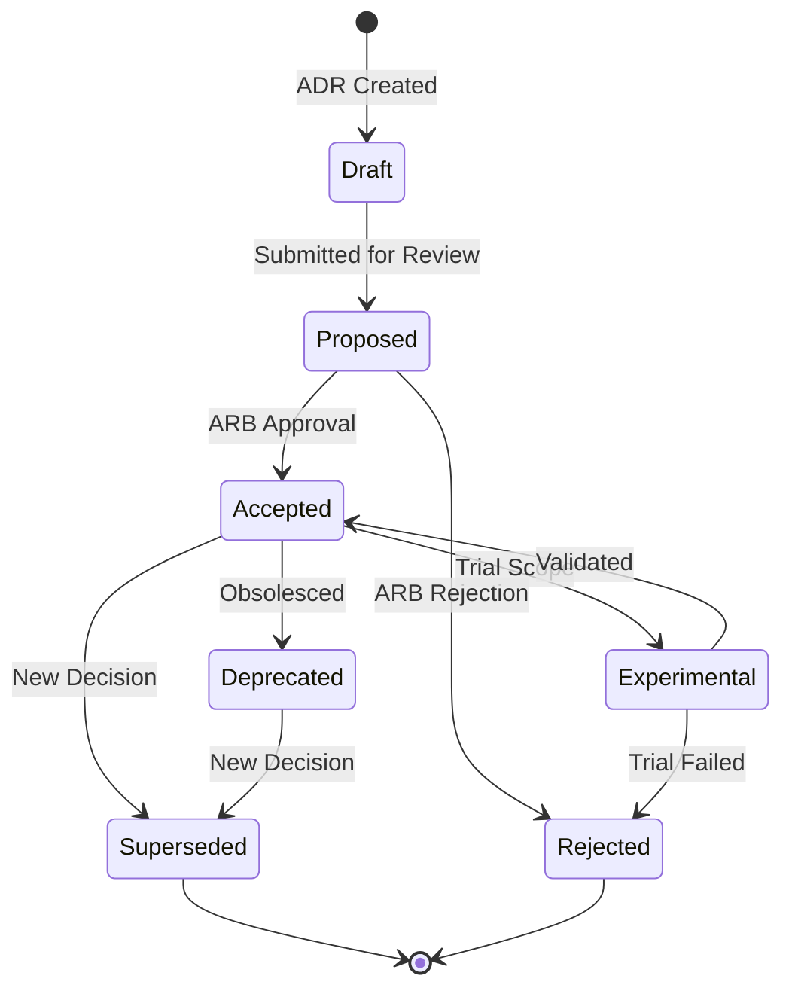

# Part 12 – Architectural Decision Records (ADRs)

> **Purpose**: This document is the authoritative Architectural Decision Record (ADR) reference for **Part 12 – Multi-Agent Collaboration Architecture** of AI-OS. It defines the ADR process governing this Part, explains conventions for creating and managing decisions, and catalogs the major architectural decisions that have been made (or are proposed) for multi-agent collaboration.
>
> **Status**: ACTIVE
>
> **Version**: 1.1.0
>
> **Last Updated**: 2026-08-07
>
> **Governance Framework**: v1.0 (Sections 11–16)

---

## Table of Contents

1. [What Are ADRs?](#1-what-are-adrs)
2. [Why ADRs Exist](#2-why-adrs-exist)
3. [ADR Lifecycle](#3-adr-lifecycle)
4. [Naming Convention](#4-naming-convention)
5. [Approval Workflow](#5-approval-workflow)
6. [Review Workflow](#6-review-workflow)
7. [Versioning](#7-versioning)
8. [Cross References](#8-cross-references)
9. [ADR Summary Matrix](#9-adr-summary-matrix)
10. [Full ADR Catalogs](#10-full-adr-catalogs)
11. [ADR Governance Framework](#11-adr-governance-framework)
12. [ADR Domain Stewards](#12-adr-domain-stewards)
13. [ADR Indexing](#13-adr-indexing)
14. [ADR Maturity Model](#14-adr-maturity-model)
15. [ADR Archival Policy](#15-adr-archival-policy)
16. [ADR Change History](#16-adr-change-history)
17. [Appendix A: ADR Creation Checklist](#appendix-a-adr-creation-checklist)
18. [Appendix B: ADR ID Allocation Log](#appendix-b-adr-id-allocation-log)
19. [Appendix C: Relationship to Core AI-OS ADRs](#appendix-c-relationship-to-core-ai-os-adrs)
20. [Appendix D: ADR Implementation Tracking Matrix](#appendix-d-adr-implementation-tracking-matrix)
21. [Appendix E: ADR Conformance Mapping](#appendix-e-adr-conformance-mapping)

---

## 1. What Are ADRs?

An **Architectural Decision Record (ADR)** is a document that captures a single, significant architectural decision in the AI-OS system, along with its context, rationale, and consequences. Each ADR is a deliberate, traceable record of *what* was decided, *why* it was decided, and *what* was sacrificed.

### Core Elements of an ADR

Every ADR in Part 12 contains the following sections, following the AI-OS ADR Template (`project-knowledge/templates/ADR_TEMPLATE.md`):

| Field | Description |
|--------|-------------|
| **ADR ID** | A unique sequential identifier (e.g., `P12-ADR-001`) |
| **Status** | Lifecycle state (see [Section 3](#3-adr-lifecycle)) |
| **Date** | The date the decision was made or accepted |
| **Authors** | Individuals who authored the decision |
| **Reviewers** | Individuals who reviewed and approved the decision |
| **Related Architecture Parts** | Cross-references to other AI-OS Parts affected by this decision |
| **Context** | The circumstances that motivated the decision; relevant forces in play |
| **Problem** | A clear statement of the problem or opportunity addressed |
| **Alternatives Considered** | Other options evaluated, with pros and cons |
| **Decision** | The chosen solution or course of action |
| **Decision Drivers** | Factors that influenced the decision, weighted by importance |
| **Consequences** | What becomes easier or more difficult as a result; positive and negative |
| **Trade-offs** | Explicit trade-offs made, showing what was gained and what was sacrificed |
| **Risks** | Identified risks and their mitigation strategies |
| **Validation** | How the decision will be validated |
| **Security Impact** | How the decision affects the security posture |
| **Performance Impact** | Performance implications (latency, throughput, resource usage) |
| **Compatibility** | Impact on backward/forward compatibility |
| **Migration** | Steps required to migrate existing systems |
| **Future Considerations** | Potential future changes that could affect the decision |
| **Related ADRs** | Links to other ADRs with described relationships |
| **References** | External documents, standards, or artifacts that informed the decision |

---

## 2. Why ADRs Exist

ADRs exist to solve several critical challenges in the AI-OS architecture:

### 2.1 Historical Accountability

ADRs provide a **permanent, immutable record** of why architectural decisions were made. Without this record, future maintainers must reverse-engineer intent from code, leading to incorrect assumptions and potentially destructive "improvements."

### 2.2 Knowledge Transfer

When team members change, their context and reasoning can be lost. ADRs **transfer institutional knowledge** in a structured, searchable format. New contributors can read ADRs to understand *why* the system is the way it is.

### 2.3 Conformance and Governance

AI-OS requires conformance levels (L1–L4) and architectural invariant enforcement. ADRs serve as **evidence of conformance** — they demonstrate that deviations from principles were intentional, reviewed, and approved.

### 2.4 Preventing Repeated Debates

Without a decision record, the same architectural questions are **re-visited repeatedly** in different forms. ADRs put these debates to rest with documented rationale.

### 2.5 Risk Management

ADRs force architects to explicitly document **trade-offs and risks**. This makes it possible to assess the impact of decisions before they are implemented and to plan mitigations proactively.

### 2.6 Decision Quality

The ADR process (context → problem → alternatives → decision → consequences) **structures decision-making** and forces thorough consideration of alternatives before commitment.

### 2.7 Future Evolution

ADRs include **future considerations** and **migration paths**, enabling graceful evolution of the architecture over time without accumulating technical debt from forgotten decisions.

### 2.8 Link to Part 12 Objectives

Part 12's architectural objectives — **decentralized coordination**, **interoperability**, **scalability**, **resilience**, **transparency**, **adaptability**, **security & privacy**, and **predictability** — are realized through the decisions documented in these ADRs. Each ADR in this catalog maps to one or more of these objectives.

---

## 3. ADR Lifecycle

ADRs in Part 12 pass through a defined lifecycle. The status of an ADR indicates its current state of maturity and acceptance.

### 3.1 Status Values

| Status | Description | Can Be Modified? |
|--------|-------------|-------------------|
| **Proposed** | The ADR has been drafted and is under initial review. It has not yet been accepted or rejected. | Yes — until accepted |
| **Accepted** | The ADR has been reviewed and approved by the Architecture Review Board (ARB). It is part of the official architecture. | Only by superseding or deprecation ADR |
| **Rejected** | The ADR was considered but not approved. It may be revisited in a future iteration. | No — unless re-proposed as a new ADR |
| **Superseded** | The ADR has been replaced by a newer ADR (the superseding ADR is referenced). | No — historical record only |
| **Deprecated** | The decision is no longer recommended for new work but may still exist in legacy implementations. | No — unless superseded |
| **Experimental** | The decision is under trial in a limited scope; not yet ready for broad adoption. | Yes — until promoted to Accepted or Rejected |
| **Draft** | The decision is under active discussion and has not yet been formally reviewed. | Yes — freely editable |

### 3.2 Lifecycle Diagram



### 3.3 Lifecycle Rules

1. **Draft → Proposed**: The author submits the ADR to the Part 12 ARB working group with `[Status: Proposed]` and requests review.
2. **Proposed → Accepted**: The ARB reviews the ADR against the review checklist (see [Section 6](#6-review-workflow)). Upon approval, status becomes `Accepted`.
3. **Proposed → Rejected**: The ARB rejects the ADR with documented reasoning. Status becomes `Rejected`.
4. **Accepted → Superseded**: A new ADR explicitly supersedes this one. The old ADR's status is updated to `Superseded` and a reference to the new ADR is added.
5. **Accepted → Deprecated**: The decision is no longer recommended but not yet replaced. A deprecation notice is added.
6. **Accepted → Experimental**: The decision is valid but being validated in a limited scope. Results feed back to Accepted or Rejected.
7. **Modifying Accepted ADRs**: Accepted ADRs **MUST NOT** be modified directly. Any change requires a new ADR that supersedes the original.

### 3.4 Lifecycle Transition Rules

The following table defines the permitted transitions between ADR lifecycle states, their trigger conditions, and required evidence:

| From → To | Trigger Condition | Required Evidence | Approval Authority |
|-----------|-------------------|-------------------|---------------------|
| Draft → Proposed | Author submits for review | ADR template complete, Section 17 checklist passed | ADR Author |
| Proposed → Accepted | ARB approval vote | Review score ≥ 85, all critical issues resolved, security review complete | Architecture Review Board |
| Proposed → Rejected | ARB rejection vote | Review feedback documented, rejection rationale recorded | Architecture Review Board |
| Accepted → Experimental | Trial requested | Experimental trial plan with scope, duration, validation criteria | Architecture Review Board + Component Owner |
| Experimental → Accepted | Trial validation successful | Trial evaluation report, metrics data, steward sign-off | Architecture Review Board |
| Experimental → Rejected | Trial failed | Trial evaluation report, failure analysis | Architecture Review Board |
| Accepted → Deprecated | Decision no longer recommended | Deprecation notice, successor ADR or alternative guidance | Architecture Review Board |
| Accepted → Superseded | New ADR supersedes | New ADR ID, migration path, transition plan | Architecture Review Board |
| Deprecated → Superseded | New ADR supersedes deprecated decision | New ADR ID referenced | Architecture Review Board |
| Rejected → Proposed | Resubmission with corrections | Change summary, updated evidence | ADR Author + ARB approval |

**Rule L5.1**: All lifecycle transitions MUST be recorded as immutable events on the EventBus with correlation to the originating ADR.

**Rule L5.2**: An ADR in `Draft` or `Proposed` status MAY be freely modified. ADRs in `Accepted`, `Deprecated`, or `Superseded` status MUST NOT be modified except through the addendum process defined in Section 7.2 or by creating a superseding ADR.

**Rule L5.3**: An ADR in `Experimental` status MAY be modified within the bounds of its trial plan. Substantial modifications require returning to `Proposed` status.

---

## 4. Naming Convention

### 4.1 ADR Identifier Format

```
P12-ADR-NNN
```

Where:
- `P12` = Prefix for Part 12
- `ADR` = Fixed label for Architectural Decision Records
- `NNN` = Three-digit sequential number (001, 002, ..., 999)

### 4.2 File Naming

ADR files are named using the pattern:

```
P12-ADR-NNN-kebab-case-title.md
```

Example: `P12-ADR-001-event-first-collaboration.md`

### 4.3 Title Conventions

- Use **PascalCase** for the ADR title (e.g., "Event-First Collaboration Architecture")
- Titles should be **concise** (≤ 80 characters) and **action-oriented**
- Avoid including the ADR number in the title — it's in the ID

### 4.4 Cross-Reference Syntax

Within ADR documents and other Part 12 artifacts, references to ADRs use the following syntax:

```
[[P12-ADR-001]] — Event-First Collaboration Architecture
```

This is consistent with the Part 12 naming conventions specified in `README.md`:
- **Component Names**: `PascalCase`
- **Event Names**: `PascalCase` with verb-object structure
- **Schema Identifiers**: `kebab-case` prefixed with domain
- **File Names**: `12.Y-descriptive-title.md` for sections, lowercase with hyphens for supporting docs

### 4.5 Relationship Annotations

When an ADR references another ADR, the relationship **MUST** be annotated:

| Relationship | Notation | Meaning |
|--------------|----------|---------|
| Depends on | `[[P12-ADR-XXX]]` | This ADR cannot proceed without the referenced ADR |
| Extends | `^[P12-ADR-XXX]` | This ADR refines or adds detail to the referenced ADR |
| Contradicts | `≈[P12-ADR-XXX]` | This ADR conflicts with (but supersedes) the referenced ADR |
| Related | `↝[P12-ADR-XXX]` | This ADR is related to but neither depends on nor contradicts the referenced ADR |
| Supersedes | `→[P12-ADR-XXX]` | This ADR replaces the referenced ADR |

---

## 5. Approval Workflow

### 5.1 Stakeholders

The approval workflow involves the following roles:

| Role | Responsibility |
|------|----------------|
| **ADR Author** | Drafts the ADR, identifies stakeholders, submits for review |
| **Architecture Review Board (ARB)** | Reviews and approves/rejects the ADR |
| **Security Council** | Reviews security implications |
| **Engineering Council** | Reviews operational and engineering impact |
| **Research Council** | Reviews future research implications |
| **Affected Component Owners** | Provide domain-specific feedback |
| **FinalJudge** | Veto authority for critical decisions |

### 5.2 Approval Steps

The approval workflow proceeds as follows:

```mermaid
flowchart TD
    A[ADR Drafted] --> B[Authors Submit\nStatus: Proposed]
    B --> C[ARB Assigns Reviewers]
    C --> D[Review Period Opens\n(typically 5–10 business days)]
    D --> E{Review Complete?}
    E -->|No| F[Reminder Sent\nAfter 3 days]
    F --> D
    E -->|Yes| G{Comments Addressed?}
    G -->|No| H[Author Revisions\nStatus: Draft]
    H --> I[Re-submit\nStatus: Proposed]
    I --> C
    G -->|Yes| J[ARB Deliberation]
    J --> K{Approved?}
    K -->|Yes| L[Status: Accepted\nDate Set]
    K -->|No| M[Status: Rejected\nReasoning Documented]
    L --> N[Published to ADR Catalog]
    M --> N
    N --> O{Experimental?}
    O -->|Yes| P[Status: Experimental\nTrial Period Set]
    O -->|No| Q[ADR Finalized]
    P --> R[Trial Evaluation]
    R --> S[Promote to Accepted\nor Reject]
```

### 5.3 Approval Criteria

An ADR is approved when all of the following criteria are met:

1. **Context is Clear**: The motivating circumstances are well-documented and understood
2. **Problem is Well-Formed**: The specific issue is clearly stated without ambiguity
3. **Alternatives Were Considered**: At least two viable alternatives were evaluated with documented trade-offs
4. **Decision Aligns with Principles**: The decision is consistent with `ENGINEERING_PRINCIPLES.md` and the architectural invariants in `README.md`
5. **Consequences are Documented**: Both positive and negative consequences are identified
6. **Trade-offs are Explicit**: What was gained and what was sacrificed is documented
7. **Risks are Identified**: Potential risks and their mitigations are documented
8. **Validation Plan Exists**: There is a clear plan for validating the decision
9. **Security Impact Assessed**: Security implications have been reviewed by the Security Council
10. **Performance Impact Assessed**: Performance implications have been analyzed
11. **Compatibility Assessed**: Backward/forward compatibility impact is documented
12. **Migration Plan Exists** (if applicable): Steps for migrating existing systems are provided
13. **Cross-References Are Complete**: Related ADRs, Parts, and documents are referenced
14. **Domain Steward Assigned**: The ADR has a designated steward responsible for ongoing governance (see Section 12)
15. **Implementation Plan Defined**: If the decision requires implementation, a plan with work item references is included
16. **Conformance Levels Mapped**: The ADR's validation requirements align with Part 11 conformance levels (L1–L11)

### 5.4 Approval Documentation

Upon approval, the following metadata is recorded in the ADR:

```markdown
## Approval Record

- **Approved By:** [ARB Chair Name on behalf of the Architecture Review Board]
- **Approval Date:** YYYY-MM-DD
- **Meeting/Review ID:** [Identifier of the ARB meeting]
- **Voting:** [For: N, Against: N, Abstain: N]
- **Security Review:** [Completed by Security Council, Date]
- **Engineering Review:** [Completed by Engineering Council, Date]
- **Research Review:** [Completed by Research Council, Date]
```

---

## 6. Review Workflow

### 6.1 Review Process

Each ADR undergoes a structured review process using the AI-OS Review Template (`project-knowledge/templates/REVIEW_TEMPLATE.md`). The review is conducted by the ARB and assigned domain experts.

### 6.2 Review Checklist

Reviewers verify the following:

| # | Review Criterion | Description |
|---|-----------------|-------------|
| 1 | **Architecture Compliance** | The decision aligns with AI-OS architecture principles, Part 12 connections, and invariants |
| 2 | **Technical Accuracy** | The decision is technically correct, complete, and precise |
| 3 | **Consistency** | The decision is consistent with related ADRs, Parts, and established patterns |
| 4 | **Terminology** | Domain-specific terms match the glossary in `glossary.md` and `README.md` |
| 5 | **Cross References** | The ADR properly links to related Parts, ADRs, and documents |
| 6 | **Problem Statement** | The problem is clearly and unambiguously stated |
| 7 | **Alternatives Considered** | At least two non-trivial alternatives were evaluated |
| 8 | **Decision Drivers** | Factors influencing the decision are weighted by importance |
| 9 | **Trade-offs** | Trade-offs are explicit, showing what was gained vs. sacrificed |
| 10 | **Consequences** | Positive and negative consequences are realistic and complete |
| 11 | **Risks** | Identified risks have mitigation strategies |
| 12 | **Validation** | The decision's validation approach is adequate |
| 13 | **Security Impact** | Security implications are analyzed |
| 14 | **Performance Impact** | Performance implications are analyzed |
| 15 | **Compatibility** | Backward/forward compatibility is addressed |
| 16 | **Documentation Quality** | The ADR is clear, well-structured, and uses consistent terminology |

### 6.3 Review Scoring

| Score Range | Assessment | Next Step |
|-------------|------------|-----------|
| 90–100 | Excellent (Ready for approval) | Approve if all critical issues resolved |
| 80–89 | Good (Minor issues to address) | Address minor issues, then approve |
| 70–79 | Satisfactory (Several issues needing attention) | Author revisions required |
| 60–69 | Needs Improvement (Major issues requiring revision) | Significant revision required |
| <60 | Unsatisfactory (Significant rework required) | Reject and request re-submission |

### 6.4 Review Feedback Protocol

1. **Review Assignment**: The ARB assigns reviewers based on domain expertise
2. **Review Period**: Reviewers have 5–10 business days to complete their assessment
3. **Feedback**: Reviewers provide comments using the Review Template
4. **Discussion**: A review meeting is held to discuss feedback
5. **Resolution**: The author addresses feedback; unresolved items are escalated to the ARB
6. **Sign-off**: Once all issues are resolved, reviewers sign off on the Review Template
7. **Steward Assignment**: A domain steward is assigned to the ADR for ongoing governance
8. **Implementation Approval**: If the ADR requires implementation, implementation approval is granted by the component owner

---

## 6.5 Review Workflow Governance

### 6.5.1 Review Quality Metrics

| Metric | Definition | Target |
|--------|------------|--------|
| Review Completion Rate | Percentage of ADRs reviewed within SLA | ≥ 95% |
| First-Pass Approval Rate | Percentage of ADRs approved on first review | ≥ 80% |
| Review Variance | Standard deviation of review scores | ≤ 5 points |
| Re-review Rate | Percentage of ADRs requiring re-review | ≤ 10% |

### 6.5.2 Review Escalation Policy

| Scenario | Escalation Path | SLA |
|----------|-----------------|-----|
| Review overdue by 50% of SLA | Steward → ARB Chair | 1 business day |
| Disputed review outcome | ARB deliberation | 3 business days |
| Reviewer conflict of interest | Replacement reviewer assigned | 1 business day |
| Security review blocked | Security Council Lead | 2 business days |

**Rule R6.1**: All reviews MUST be completed within the stated SLA. Overdue reviews MUST trigger automatic escalation.

---

## 7. Versioning

### 7.1 ADR Versioning

ADRs are immutable historical records. They are **not versioned** themselves — instead, modifications result in **new ADRs** that supersede or amend the original.

| Scenario | Approach |
|----------|----------|
| Minor clarification or typo fix | Add an addendum note to the existing ADR (clearly marked as such) |
| Significant content change | Create a new ADR that supersedes the original |
| Breaking change to a decision | Create a new ADR, mark the old one as `Superseded` |
| Temporary deviation | Mark the ADR as `Experimental` with trial parameters |

### 7.2 Addendum Format

If an addendum is needed (e.g., for a typo or minor clarification), it is appended at the end of the ADR:

```markdown
---

## Addendum (YYYY-MM-DD)

**Summary**: [Brief description of what was corrected]

**Change**: [The specific change made]

**Rationale**: [Why this correction was necessary]

**Impact**: [Whether this changes any consequences, trade-offs, or decisions]

*Approved by: [Reviewer] on YYYY-MM-DD*
```

### 7.3 Part Version Alignment

ADRs in Part 12 are aligned with Part 12 specification versions:

| Part 12 Version | Active ADR Range | Notes |
|------------------|------------------|-------|
| 1.0.0 | P12-ADR-001 – P12-ADR-010 | Initial release |
| 1.1.0 | P12-ADR-001 – P12-ADR-015 | Added ADRs for advanced topics |
| (Future) | As needed | Follows semantic versioning |

An ADR that is `Accepted` as of a given Part 12 version remains valid until explicitly deprecated or superseded.

### 7.4 Version Alignment and Compliance

| Part 12 Version | Active ADR Range | Compliance Level Required | Audit Frequency |
|------------------|------------------|----------------------------|-----------------|
| 1.0.0 | P12-ADR-001 – P12-ADR-010 | L8 (Security Validation) | Monthly |
| 1.1.0 | P12-ADR-001 – P12-ADR-015 | L8, L10, L11 | Bi-weekly |
| 2.0.0 | P12-ADR-001 – (current) | L8, L10, L11 | Weekly |

**Rule V7.1**: ADR compliance MUST be verified at each Part 12 version release against the conformance level requirements of the target Part 11 Validation Architecture layers.

---

## 8. Cross References

### 8.1 Cross-Reference Targets

Each ADR in Part 12 MUST include a "Related Documents" section linking to:

| Target | Reference Format | Description |
|--------|-----------------|-------------|
| **Other Part 12 ADRs** | `[[P12-ADR-NNN]]` | Other decisions in this catalog |
| **AI-OS Core ADRs** | `[[ADR-NNN]]` | Core system ADRs (001–016) in `ARCHITECTURE_DECISIONS.md` |
| **Architecture Parts** | `Part X: Title` | Related Parts in the AI-OS specification |
| **Engineering Principles** | `[[ENGINEERING_PRINCIPLES.md]]` | The governing principles document |
| **Governance Documents** | `[[COUNCILS.md]]`, `[[VALIDATION_ARCHITECTURE.md]]` | Council and validation frameworks |
| **Memory Architecture** | `[[MEMORY_ARCHITECTURE.md]]` | Five-tier memory system |
| **Ecosystem Docs** | `[[SKILLS_ECOSYSTEM.md]]`, `[[MCP_ECOSYSTEM.md]]` | Extension point ecosystems |
| **Standards** | `[RFC 2119](https://www.rfc-editor.org/rfc/rfc2119)` | External standards and protocols |

### 8.2 Relationship Categories

| Relationship Type | Description |
|-------------------|-------------|
| **Depends On** | This decision requires the referenced decision to be implemented first |
| **Informed By** | This decision was influenced by the referenced document or decision |
| **Implements** | This decision operationalizes the principle or requirement in the referenced Part |
| **Contradicts** | This decision conflicts with the referenced decision (and supersedes it) |
| **Extends** | This decision adds detail or scope to the referenced decision |
| **Referenced By** | The referenced document cites this decision as supporting rationale |

### 8.3 Cross-Part Dependency Mapping

| Part 12 ADR | Depends On (Core ADRs) | Related Parts |
|-------------|------------------------|---------------|
| All collaboration ADRs | ADR-001 (Event-First), ADR-002 (Kernel as Orchestrator), ADR-008 (Immutable Events) | Part 1, Part 2, Part 4 |
| Council Pattern ADRs | ADR-003 (Manager Ownership), ADR-006 (Human Oversight) | Part 3, Part 12 |
| Security ADRs | ADR-009 (Failure Events), ADR-013 (Extensions) | Part 2, Part 12 |
| Scheduler ADRs | ADR-004 (Global Accessors), ADR-011 (Versioning) | Part 3, Part 11 |
| Shared Context ADRs | ADR-016 (Memory Architecture) | Part 3, Part 15 |

### 8.4 Backlinking Protocol

When a related AI-OS core ADR references Part 12, it should include a backlink:

```markdown
**Part 12 References**: See `Part12/adrs.md` for collaboration-specific decisions
```

### 8.5 Cross-Reference Integrity Policy

| Rule | Description |
|------|-------------|
| **CR8.1** | Every ADR MUST include a "Related ADRs" section listing all directly related ADRs with annotated relationships |
| **CR8.2** | Every ADR MUST include a "References" section linking to external documents, Parts, and standards |
| **CR8.3** | Cross-references to core ADRs (001–016) MUST use the `[[ADR-NNN]]` notation |
| **CR8.4** | Cross-references to Part 12 ADRs MUST use the `[[P12-ADR-NNN]]` notation |
| **CR8.5** | All cross-references MUST be validated quarterly by the Documentation Council |
| **CR8.6** | Broken cross-references MUST be reported as `BrokenLinkDetected` events |

---

## 9. ADR Summary Matrix

### 9.1 Active ADRs in Part 12

| ID | Title | Decision Category | Status | Date | Related Core ADR |
|----|-------|-------------------|--------|------|-------------------|
| P12-ADR-001 | Event-First Collaboration Architecture | Communication | Accepted | 2026-07-15 | ADR-001 |
| P12-ADR-002 | Agent Discovery via Capability Registry | Discovery | Accepted | 2026-07-18 | ADR-003, ADR-013 |
| P12-ADR-003 | Council-Based Decision Architecture | Governance | Accepted | 2026-07-20 | ADR-003, ADR-006 |
| P12-ADR-004 | Workflow Orchestration via Event Chains | Orchestration | Accepted | 2026-07-22 | ADR-005, ADR-006 |
| P12-ADR-005 | Shared Context as Distributed State | State Management | Accepted | 2026-07-24 | ADR-008, ADR-016 |
| P12-ADR-006 | Capability-Based Task Delegation | Delegation | Accepted | 2026-07-26 | ADR-003, ADR-009 |
| P12-ADR-007 | Priority-Based Collaboration Scheduling | Scheduling | Accepted | 2026-07-28 | ADR-004, Part 11 |
| P12-ADR-008 | Zero-Trust Security for Multi-Agent Collaboration | Security | Accepted | 2026-07-30 | ADR-009, Part 8 |
| P12-ADR-009 | Knowledge Exchange via Structured Memory Events | Knowledge Management | Accepted | 2026-08-01 | ADR-016, Part 10 |
| P12-ADR-010 | Runtime Contracts for Agent Interoperability | Interoperability | Accepted | 2026-08-03 | ADR-008, ADR-011 |

### 9.2 Decision Categories

| Category | ADRs | Description |
|----------|------|-------------|
| **Communication** | P12-ADR-001 | How agents communicate within collaboration sessions |
| **Discovery** | P12-ADR-002 | How agents find and advertise capabilities |
| **Governance** | P12-ADR-003 | How collective decisions are made via councils |
| **Orchestration** | P12-ADR-004 | How collaborative workflows are structured and executed |
| **State Management** | P12-ADR-005 | How shared context is maintained across agents |
| **Delegation** | P12-ADR-006 | How tasks are assigned to capable agents |
| **Scheduling** | P12-ADR-007 | How collaboration resources are timed and allocated |
| **Security** | P12-ADR-008 | How agent interactions are secured and authenticated |
| **Knowledge Management** | P12-ADR-009 | How learned knowledge is shared among agents |
| **Interoperability** | P12-ADR-010 | How runtime contracts ensure agent compatibility |

### 9.3 Mapping to Part 12 Section Files

| Part 12 Section | ADR(s) | Core Responsibility |
|----------------|--------|-------------------|
| 12.1 – Architecture Overview | P12-ADR-001 | High-level collaboration model |
| 12.2 – Collaboration Architecture | P12-ADR-001, P12-ADR-004 | Fundamental patterns and coordination |
| 12.3 – Agent Discovery & Capability Management | P12-ADR-002 | Discovery and capability matching |
| 12.4 – Task Delegation & Workflow Orchestration | P12-ADR-004, P12-ADR-006 | Task assignment and workflow execution |
| 12.5 – Council Decision Architecture | P12-ADR-003 | Collective decision-making |
| 12.6 – Shared Context & Knowledge Exchange | P12-ADR-005, P12-ADR-009 | State sharing and knowledge transfer |
| 12.7 – Multi-Agent Communication | P12-ADR-001 | Communication protocols and patterns |
| 12.8 – Resource Coordination & Scheduling | P12-ADR-007 | Resource allocation and timing |
| 12.9 – Reliability & Recovery | (covered by core ADR-009) | Fault tolerance |
| 12.10 – Security Architecture | P12-ADR-008 | Security for agent interactions |
| 12.11 – JSON Schemas | (covered by core ADR-008, ADR-011) | Schema definitions |
| 12.12 – Runtime Invariants | P12-ADR-010 | Runtime correctness guarantees |
| 12.13 – Cross-References | All | Integration with other Parts |

---

## 10. Full ADR Catalogs

---

## P12-ADR-001: Event-First Collaboration Architecture

| Field | Value |
|-------|-------|
| **ADR ID** | P12-ADR-001 |
| **Status** | Accepted |
| **Date** | 2026-07-15 |
| **Authors** | AI Architecture Team |
| **Reviewers** | Architecture Review Board, Observability Council |
| **Related Parts** | Part 0 (Principles), Part 2 (Event System), Part 3 (Kernel) |
| **Related Core ADRs** | [[ADR-001]] – Event-First Communication Principle |
| **Related Part 12 ADRs** | [[P12-ADR-004]] (Workflow Orchestration), [[P12-ADR-007]] (Scheduling) |

### Context
Part 12 enables collaboration among autonomous agents. Agents must coordinate, share state, delegate tasks, and make collective decisions — all while the Hermes Kernel enforces its **Event-First Communication Principle** (ADR-001). The collaboration layer sits above the Kernel, extending events to multi-agent workflows.

### Problem
How should agents within a collaboration session communicate with each other in a manner consistent with the AI-OS event-driven architecture? Direct communication would violate ADR-001 and create tight coupling, while purely asynchronous events may not provide sufficient coordination semantics for collaborative workflows.

### Alternatives Considered

**Alternative 1: Synchronous Request/Reply Between Agents**
- **Pros**: Immediate response, simple programming model, familiar RPC pattern
- **Cons**: Violates ADR-001 (Event-First), creates tight coupling, prevents replay, blocks the sender

**Alternative 2: Direct Peer-to-Peer Event Publishing**
- **Pros**: Fully decoupled, scalable, follows event-driven pattern
- **Cons**: No ordering guarantees, no coordination primitives, difficult to trace collaborative intent

**Alternative 3: Event Chains with Coordination Events** *(Selected)*
- **Pros**: Consistent with ADR-001, provides observable coordination, enables replay and audit, supports eventual consistency
- **Cons**: Higher latency than synchronous calls, requires event schema design, coordination events add volume

**Alternative 4: Hybrid: Events + Synchronous Handshakes**
- **Pros**: Combines benefits of both approaches
- **Cons**: Violates ADR-001, creates inconsistent communication patterns, increases complexity

### Decision
Agents within a collaboration session MUST communicate exclusively through the **EventBus** using structured, immutable events. Collaborative coordination is achieved through **coordination event chains** — a sequence of typed events that represent the intent, action, and outcome of collaborative operations. Each collaboration session uses a dedicated **correlation scope** (a correlation_id prefix) to group related events.

### Decision Drivers

| Driver | Importance |
|--------|------------|
| Architectural consistency with ADR-001 | Critical |
| Observability and audit requirements | Critical |
| Scalability and loose coupling | Critical |
| Event-driven design maturity | High |
| Developer experience | Medium |
| Latency requirements | Medium |

### Trade-offs

| Trade-off | Gained | Sacrificed | Rationale |
|-----------|--------|------------|-----------|
| Consistency over latency | Guaranteed event-first compliance, replay capability | Higher per-message latency | Architectural integrity must not be compromised for minor latency gains |
| Coordination complexity | Observable coordination event chains | Simpler direct communication | Observability and auditability are non-negotiable |
| Event volume | Rich semantics, fine-grained events | Higher event volume | EventBus is designed for scale; volume is manageable |
| Developer overhead | Structured event schemas | Ad-hoc message formats | Schema discipline prevents errors and enables tooling |

### Consequences

**Positive Consequences:**
- All agent interactions are observable, traceable, and replayable
- No violations of the Event-First Communication Principle
- Enables collaborative workflow auditing and debugging
- Supports distributed agent execution across processes/machines
- Event schema validation catches integration errors at runtime boundaries

**Negative Consequences:**
- Higher event processing overhead compared to direct calls
- Requires disciplined event schema design across collaboration domains
- Coordination patterns must be encoded as events rather than function calls
- More complex to implement request-response style interactions

### Risks

| Risk | Likelihood | Impact | Mitigation |
|------|------------|--------|------------|
| Event volume overload during high collaboration | Medium | High | Event batching, event compression, priority queues |
| Coordination deadlock due to undelivered events | Low | High | Dead letter queues, timeout-based escalation (Part 12.5) |
| Schema mismatch between collaborating agents | Medium | Medium | Schema validation at event consumption, backward-compatible versions |
| Coordination event ordering issues | Low | Medium | Causation IDs for ordering, idempotent handlers |

### Validation
- Event schemas are validated against `schemas.md` at compilation time
- Integration tests verify event chain flows for common collaboration patterns
- Performance benchmarks measure latency overhead of event-based coordination
- Chaos testing simulates event delivery failures and verifies recovery

### Security Impact
- All coordination events carry agent identity headers for authentication
- Event payload sanitization prevents injection through shared context
- Immutable events with correlation/causation IDs support security audit trails
- Capability-based authorization enforced on event subscription (see P12-ADR-008)

### Performance Impact
- **Latency**: ~5–15ms additional per coordination hop (event serialization + EventBus routing)
- **Throughput**: EventBus supports 50,000+ events/second per node; horizontally scalable
- **Memory**: Coordination event metadata adds ~200 bytes per event
- **CPU**: Event serialization/deserialization overhead < 2% of total CPU budget

### Compatibility
- Fully compatible with core ADR-001 (Event-First Communication)
- Coordination event schemas are versioned per ADR-011 (Version & Compatibility First-Class)
- Backward compatibility maintained within major schema versions

### Migration
- No migration required — this is an initial decision for Part 12
- Any future synchronous communication patterns would require a new ADR

### Future Considerations
- Streaming event channels for high-frequency collaboration (e.g., real-time negotiation)
- Event compression for large shared context payloads
- Priority-based event routing for latency-sensitive collaborations

### Related ADRs
- [[ADR-001]] — Event-First Communication (core: superseded by this Part 12 extension)
- [[ADR-008]] — Immutable Events with Correlation & Causation (core: foundational for session correlation)
- [[P12-ADR-004]] — Workflow Orchestration via Event Chains (extends: defines coordination event patterns)
- [[P12-ADR-005]] — Shared Context as Distributed State (related: shared state via events)
- [[P12-ADR-010]] — Runtime Contracts for Agent Interoperability (extends: contract enforcement on events)

### References
- [ADR-001: Event-First Communication Principle](/project-knowledge/ARCHITECTURE_DECISIONS.md)
- [ADR-008: Immutable Events with Correlation & Causation](/project-knowledge/ARCHITECTURE_DECISIONS.md)
- [ADR-011: Version & Compatibility First-Class](/project-knowledge/ARCHITECTURE_DECISIONS.md)
- [Part 2: Event System](/project-knowledge/diagrams/OVERALL_ARCHITECTURE.md)
- [Part 3: Hermes Kernel](/project-knowledge/diagrams/OVERALL_ARCHITECTURE.md)

---

## P12-ADR-002: Agent Discovery via Capability Registry

| Field | Value |
|-------|-------|
| **ADR ID** | P12-ADR-002 |
| **Status** | Accepted |
| **Date** | 2026-07-18 |
| **Authors** | AI Architecture Team |
| **Reviewers** | Architecture Review Board, Engineering Council |
| **Related Parts** | Part 4 (Service Framework), Part 9 (Extension Points) |
| **Related Core ADRs** | [[ADR-003]] – Capability Manager Ownership, [[ADR-013]] – Extension Points Governance |
| **Related Part 12 ADRs** | [[P12-ADR-006]] (Task Delegation), [[P12-ADR-001]] (Event-First Communication) |

### Context
In multi-agent collaboration, agents must dynamically discover other agents that possess the capabilities needed to accomplish sub-tasks. The system's existing service registry (Part 5) provides discovery for Engineering Services, but agent-level capability discovery requires a more granular, versioned, and extensible approach.

### Problem
How should agents advertise, discover, and match their capabilities in a way that supports dynamic team formation, version compatibility, and trust verification — without creating a centralized bottleneck or violating the extension point governance of ADR-013?

### Alternatives Considered

**Alternative 1: Centralized Capability Directory**
- **Pros**: Simple query interface, strong consistency, easy to implement
- **Cons**: Single point of failure, scalability bottleneck, violates decentralization principle

**Alternative 2: Gossip-Based Peer Discovery**
- **Pros**: Fully decentralized, self-healing, no single point of failure
- **Cons**: Eventual consistency delays, complex failure detection, no global view

**Alternative 3: Capability Registry with Distributed Cache** *(Selected)*
- **Pros**: Scalable reads, consistent writes, supports indexing and querying, extensible
- **Cons**: Requires caching layer, eventual cache consistency management

**Alternative 4: Agent Self-Declaration Only**
- **Pros**: No infrastructure needed, maximum flexibility
- **Cons**: No validation of claims, spoofing attacks, no discovery mechanism

### Decision
A **Capability Registry** is established as a kernel-managed service (under ADR-003) that agents register their capabilities with upon joining a collaboration session. The registry uses a **hybrid model**: authoritative writes go through a centralized Capability Manager (kernel-owned), while reads are served from a distributed cache with eventual consistency. Capability declarations must follow the `agent-descriptor` schema (see `schemas.md`) and include versioning, trust scores, and resource requirements.

### Decision Drivers

| Driver | Importance |
|--------|------------|
| Scalability to 10,000+ concurrent agents | Critical |
| Security and trust verification | Critical |
| Version compatibility enforcement | High |
| Decentralization principles (context.md §Collaboration Principles) | Medium |
| Query performance and flexibility | High |

### Trade-offs

| Trade-off | Gained | Sacrificed | Rationale |
|-----------|--------|------------|-----------|
| Centralized writes, distributed reads | Strong consistency on writes, scalable reads | Eventual consistency on cache reads | Consistency on registration is more critical than on discovery |
| Schema validation at registration | Prevent spoofing, ensure compatibility | Registration overhead, schema rigidity | Security requirements justify the overhead |
| Trust scores in registry | Better matchmaking, security | Trust computation complexity | Trust is essential for safe collaboration |
| Index-based querying | Flexible discovery, filtering | Index maintenance overhead | Discovery flexibility is required for dynamic team formation |

### Consequences

**Positive Consequences:**
- Agents can discover peers by capability, version, and trust level
- Version compatibility is enforced at registration time
- Cache layer supports high-throughput discovery
- Trust scores enable security-aware matchmaking
- Registration events are auditable (immutable events per ADR-008)

**Negative Consequences:**
- Cache invalidation adds complexity
- Registration latency may delay agent participation
- Trust score computation requires additional monitoring
- Schema changes require versioning and migration

### Risks

| Risk | Likelihood | Impact | Mitigation |
|------|------------|--------|------------|
| Cache staleness causing agent to discover unavailable peers | High | Medium | Short TTL, proactive cache invalidation on agent departure |
| Trust score manipulation | Low | High | Multi-source trust scoring, council oversight (P12-ADR-003) |
| Schema evolution breaking existing registrations | Medium | High | Backward-compatible schema versions, migration procedures |
| Registry overload during peak registration | Medium | Medium | Rate limiting, batch registration support |

### Validation
- Integration tests verify discovery by capability, version, and trust level
- Load testing validates registry performance with 10,000 concurrent agents
- Security audit validates trust score integrity and spoofing prevention
- Chaos testing simulates registry unavailability and cache inconsistency

### Security Impact
- Agent identity is verified at registration (Part 8 authentication)
- Capability declarations are validated against schema (prevents injection)
- Trust scores are computed from verified behavior metrics
- Registration events are immutable and auditable
- Access to registry queries is rate-limited and authenticated

### Performance Impact
- **Registration Latency**: ~10–30ms for new agent registration
- **Discovery Latency**: < 5ms for cached reads, ~15ms for cache miss
- **Scalability**: Registry supports 50,000 registrations/second; cache supports 100,000 reads/second
- **Memory**: ~1KB per registered agent in cache

### Compatibility
- Compatible with ADR-003 (Capability Manager Ownership)
- Compatible with ADR-013 (Extension Points Governance) — registry is a kernel-owned extension point
- Schema versioning follows ADR-011 (Version & Compatibility First-Class)

### Migration
- No migration required — this is an initial decision for Part 12
- Future schema changes must follow ADR-014 (ADR Process) and ADR-011 (Versioning)

### Future Considerations
- Decentralized registry using consistent hashing for even higher scalability
- Integration with MCP ecosystem capability negotiation (Part 10 MCP Ecosystem)
- Machine-learning-based trust scoring and anomaly detection

### Related ADRs
- [[ADR-003]] — Capability Manager Ownership (core: this registry is managed by the Capability Manager)
- [[ADR-011]] — Version & Compatibility First-Class (core: capability schema versioning)
- [[ADR-013]] — Extension Points Governance (core: registry is an explicitly permitted extension point)
- [[P12-ADR-001]] — Event-First Collaboration Architecture (related: registration emits events)
- [[P12-ADR-006]] — Capability-Based Task Delegation (extends: uses registry for matching)

### References
- [ADR-003: Capability Manager Ownership](/project-knowledge/ARCHITECTURE_DECISIONS.md)
- [ADR-011: Version & Compatibility First-Class](/project-knowledge/ARCHITECTURE_DECISIONS.md)
- [ADR-013: Extension Points Governance](/project-knowledge/ARCHITECTURE_DECISIONS.md)
- OVERALL_ARCHITECTURE.md: Section 4 — Core Managers (Capability Manager)
- context.md: New Components Introduced — Capability Registry, Agent Directory
- glossary.md: Capability, Capability Registry, Agent Directory

---

## P12-ADR-003: Council-Based Decision Architecture

| Field | Value |
|-------|-------|
| **ADR ID** | P12-ADR-003 |
| **Status** | Accepted |
| **Date** | 2026-07-20 |
| **Authors** | AI Architecture Team |
| **Reviewers** | Architecture Review Board, Security Council, Governance Council |
| **Related Parts** | Part 4 (CouncilManager), Part 3 (Hermes Kernel governance) |
| **Related Core ADRs** | [[ADR-003]] – Capability Manager Ownership, [[ADR-006]] – Human Oversight |
| **Related Part 12 ADRs** | [[P12-ADR-001]] (Event-First Communication), [[P12-ADR-008]] (Security) |

### Context
Multi-agent collaboration often requires collective decisions — resource allocation, policy changes, conflict resolution, or strategic choices. The Hermes Kernel's `CouncilManager` (Part 3) provides voting algorithms (MAJORITY, UNANIMOUS, WEIGHTED) and escalation to FinalJudge. Part 12 must define how collaborative councils operate within the agent ecosystem.

### Problem
How should collective decisions within agent collaborations be structured to ensure fairness, accountability, and alignment with organizational goals — while providing human oversight escalation paths and maintaining consistency with the Kernel's council mechanisms?

### Alternatives Considered

**Alternative 1: Unanimous Consent Requirement**
- **Pros**: Maximum alignment, no dissent
- **Cons**: Paralysis on disagreement, no scalability, bottlenecks on dissenting agents

**Alternative 2: Simple Majority Voting**
- **Pros**: Clear resolution, scalable
- **Cons**: Minority interests may be overridden, no weight for expertise

**Alternative 3: Weighted Voting with Escalation** *(Selected)*
- **Pros**: Balances expertise and efficiency, escalation path for deadlock, configurable weights
- **Cons**: Weight assignment complexity, potential for gaming, requires governance

**Alternative 4: Delegative Democracy (Proxy Voting)**
- **Pros**: Efficient for large groups, agents can delegate to trusted representatives
- **Cons**: Centralization risk, proxy competence concerns, complex delegation chains

**Alternative 5: AI-Only Decisions (No Human Oversight)**
- **Pros**: Fast, autonomous
- **Cons**: Violates ADR-006 (Human Oversight), unsafe for critical decisions, no accountability

### Decision
Collaborative decisions within agent collaborations MUST use **Weighted Voting** through the `CouncilManager` (ADR-003), with weights assigned based on agent capability confidence, historical performance, and domain expertise. Voting proceeds through three phases:

1. **Proposal Phase**: An agent submits a formal proposal via a `CouncilProposal` event
2. **Deliberation Phase**: Agents review, discuss, and optionally submit counter-proposals (event-based discussion)
3. **Voting Phase**: Weighted vote is conducted; outcome determined by configured algorithm
4. **Escalation Phase**: If vote is inconclusive or dissent exceeds threshold, the proposal escalates to FinalJudge

All council proceedings, votes, and outcomes are recorded as immutable events (ADR-008) and are auditable.

### Decision Drivers

| Driver | Importance |
|--------|------------|
| Human oversight (ADR-006) | Critical |
| Fairness and expertise weighting | Critical |
| Scalability to 100+ participating agents | High |
| Auditability and transparency | Critical |
| Consistency with Kernel CouncilManager | Critical |

### Trade-offs

| Trade-off | Gained | Sacrificed | Rationale |
|-----------|--------|------------|-----------|
| Weighted voting complexity | Expertise-weighted decisions | Complexity in weight assignment | Simple majority would ignore expertise differences |
| Escalation to FinalJudge | Human oversight for critical decisions | Slower resolution for escalated items | Safety and accountability are non-negotiable |
| Immutable audit trail | Transparency, reproducibility | Event volume overhead | Governance and compliance require auditability |
| Event-based deliberation | Observable, replayable discussions | Higher latency than synchronous discussion | Event-first compliance and observability are mandatory |

### Consequences

**Positive Consequences:**
- Decisions incorporate expertise weighting for better quality
- Human oversight is integrated for critical decisions
- All deliberations and votes are auditable
- Consistent with Kernel's CouncilManager (no duplicated logic)
- Deadlock and escalation paths are well-defined

**Negative Consequences:**
- Weight assignment requires governance policies
- Escalation to FinalJudge introduces latency for contentious decisions
- Event-based deliberation may be slower than direct communication
- Council quorum requirements may delay decisions in small teams

### Risks

| Risk | Likelihood | Impact | Mitigation |
|------|------------|--------|------------|
| Weight gaming (agents inflating their scores) | Medium | Medium | Trust verification (P12-ADR-002), council oversight of weights |
| Escalation overload to FinalJudge | Low | High | Escalation thresholds, automatic filtering of trivial items |
| Vote manipulation through collusion | Low | High | Anomaly detection, trust-based weight verification |
| Quorum failure due to agent unavailability | Medium | Medium | Quorum relaxation policies for small teams |

### Validation
- Simulation testing of voting scenarios with varying agent counts and weights
- Escalation path testing with synthetic contentious proposals
- Audit trail integrity testing (immutability, completeness)
- Human oversight latency measurement

### Security Impact
- Agent weights are verified and cannot be self-asserted as arbitrary values
- Council proposals and votes are authenticated via agent identity headers
- Escalation to FinalJudge provides a trusted human checkpoint
- Vote tampering is detectable through immutable event audit trails
- Quorum requirements prevent decisions with insufficient participation

### Performance Impact
- **Proposal to Decision Latency**: 100ms (simple) to 10s (with deliberation), up to 30s (with escalation)
- **Scalability**: Supports up to 1,000 participating agents in a single council session
- **Event Overhead**: ~500 bytes per vote event, ~1KB per deliberation comment
- **Memory**: Council state maintained in Working Memory (transient)

### Compatibility
- Fully compatible with ADR-003 (CouncilManager is kernel-owned)
- Fully compatible with ADR-006 (Human Oversight via FinalJudge escalation)
- Fully compatible with ADR-008 (immutable audit events)

### Migration
- No migration required — initial decision for Part 12
- Future changes to voting algorithms require ADR approval per ADR-014

### Future Considerations
- Dynamic weight adjustment based on real-time agent performance
- Multi-council federation for cross-domain decisions
- AI-assisted deliberation summarization in the proposal phase

### Related ADRs
- [[ADR-003]] — Capability Manager Ownership (core: CouncilManager is kernel-managed)
- [[ADR-006]] — Human Oversight (core: FinalJudge escalation is mandatory)
- [[ADR-008]] — Immutable Events (core: council proceedings are auditable events)
- [[P12-ADR-001]] — Event-First Collaboration Architecture (uses: council events flow through EventBus)
- [[P12-ADR-008]] — Zero-Trust Security for Multi-Agent Collaboration (uses: authenticated voting)

### References
- [ADR-003: Capability Manager Ownership](/project-knowledge/ARCHITECTURE_DECISIONS.md)
- ENGINEERING_PRINCIPLES.md: Human Governance Principles
- [ADR-008: Immutable Events with Correlation & Causation](/project-knowledge/ARCHITECTURE_DECISIONS.md)
- OVERALL_ARCHITECTURE.md: Section 13 — Governance & Council Architecture
- context.md: New Components Introduced — Council Manager

---

## P12-ADR-004: Workflow Orchestration via Event Chains

| Field | Value |
|-------|-------|
| **ADR ID** | P12-ADR-004 |
| **Status** | Accepted |
| **Date** | 2026-07-22 |
| **Authors** | AI Architecture Team |
| **Reviewers** | Architecture Review Board, Engineering Council |
| **Related Parts** | Part 3 (WorkflowManager), Part 5-6 (Engineering Services SDLC Pipeline) |
| **Related Core ADRs** | [[ADR-005]] – Event-Driven Services, [[ADR-006]] – Engineering Service SDLC Pipeline |
| **Related Part 12 ADRs** | [[P12-ADR-001]] (Event-First Communication), [[P12-ADR-006]] (Task Delegation) |

### Context
Multi-agent collaboration often involves complex, multi-step workflows where agents must coordinate their activities. The Hermes Kernel's `WorkflowManager` (Part 3) provides orchestration primitives: workflow definition, dependency management, topological ordering, and state tracking. Part 12 must define how collaborative workflows are structured and executed across agents.

### Problem
How should collaborative workflows — sequences of interdependent tasks executed by different agents — be modeled, executed, and monitored, while remaining consistent with the Kernel's WorkflowManager (ADR-005, ADR-006) and the event-first communication model (P12-ADR-001)?

### Alternatives Considered

**Alternative 1: Ad-Hoc Agent Coordination (No Formal Workflow)**
- **Pros**: Maximum flexibility, minimal overhead
- **Cons**: No progress tracking, no fault recovery, no observability, unpredictable

**Alternative 2: Centralized Workflow Controller**
- **Pros**: Clear control flow, easy to monitor
- **Cons**: Single point of failure, scalability bottleneck, tight coupling

**Alternative 3: Distributed Event Chain Orchestration** *(Selected)*
- **Pros**: Consistent with event-first model, scalable, observable, recoverable
- **Cons**: Complex state management, harder to predict execution order

**Alternative 4: Directed Acyclic Graph (DAG) of Agent Tasks**
- **Pros**: Clear dependency modeling, parallel execution support
- **Cons**: Requires DAG execution engine, may not handle dynamic dependencies well

**Alternative 5: Hierarchical Finite State Machines**
- **Pros**: Predictable state transitions, well-understood formal model
- **Cons**: Rigid structure, difficult to compose, state explosion

### Decision
Collaborative workflows are modeled as **Directed Acyclic Graphs (DAGs)** of `CollaborationTask` nodes, executed by the Kernel's `WorkflowManager` through **event chains**. Each task node:

1. **Has a defined capability requirement** (what capability is needed)
2. **Has a defined input contract** (what inputs are expected)
3. **Has a defined output contract** (what outputs are produced)
4. **Emits a `TaskAssigned` event** when an agent is matched to execute it
5. **Emits a `TaskCompleted` event** with outputs when done
6. **Emits a `TaskFailed` event** (ADR-009) if execution fails

Workflow state transitions are tracked via immutable events (ADR-008). The `WorkflowManager` handles topological ordering, parallel execution within dependency constraints, and checkpointing at task boundaries.

### Decision Drivers

| Driver | Importance |
|--------|------------|
| Consistency with ADR-006 (SDLC Pipeline) | Critical |
| Observability and auditability | Critical |
| Fault recovery and checkpointing | Critical |
| Scalability | High |
| Dynamic task assignment | High |

### Trade-offs

| Trade-off | Gained | Sacrificed | Rationale |
|-----------|--------|------------|-----------|
| DAG over state machines | Better parallel execution, flexible dependencies | Less predictable state transitions | DAG enables efficient parallel task execution across agents |
| Event chains over direct orchestration | Observability, replay, loose coupling | Higher event volume | Observability and replay are non-negotiable |
| Kernel WorkflowManager over agent-led | Centralized state tracking, recovery | Agent flexibility in coordination | State management and recovery require central tracking |
| Task-level checkpointing | Recoverable workflows | Storage overhead | Recovery from failures is critical |

### Consequences

**Positive Consequences:**
- Workflows are observable, traceable, and replayable
- Parallel task execution maximizes agent utilization
- Task-level checkpointing enables granular recovery
- DAG model naturally expresses data dependencies between tasks
- Consistent with Kernel's WorkflowManager and SDLC pipeline

**Negative Consequences:**
- DAG execution requires topological sorting at runtime
- Event chain monitoring adds overhead
- Dynamic task assignment requires registry lookups (P12-ADR-002)
- Deadlock detection adds complexity for cyclic dependencies

### Risks

| Risk | Likelihood | Impact | Mitigation |
|------|------------|--------|------------|
| DAG cycle introduced by misconfiguration | Medium | High | Cycle detection at workflow definition time |
| Event chain breaks due to agent failure | High | Medium | RetryManager (Part 3), dead letter queues, escalation (P12-ADR-003) |
| Task starvation in complex DAGs | Low | Medium | Priority-based scheduling (P12-ADR-007), deadlock detection |
| Checkpointing overhead for large outputs | Medium | Low | Selective checkpointing, compression |

### Validation
- DAG execution tests with various dependency structures
- Failure recovery tests (agent failure mid-workflow, checkpoint restore)
- Parallelism tests (verify concurrent task execution respects dependencies)
- Event chain completeness verification (no lost transitions)
- Performance benchmarks (latency, throughput) for workflows of varying complexity

### Security Impact
- Task assignments are authenticated via agent identity
- Input/output contracts are validated at task boundaries
- Workflow state is protected via Shared Context access controls (P12-ADR-005)
- Escalation events go through council mechanisms for oversight

### Performance Impact
- **Workflow Initiation Latency**: ~50ms (DAG parsing + topological sort)
- **Task Assignment Latency**: ~10ms (capability registry lookup + agent selection)
- **Throughput**: Supports 1,000 concurrent workflows, 10,000 concurrent tasks
- **Memory**: ~5KB per active workflow node in Working Memory

### Compatibility
- Fully compatible with ADR-005 (Event-Driven Services)
- Fully compatible with ADR-006 (Engineering Service SDLC Pipeline) — collaborative workflows extend the SDLC pipeline concept
- Fully compatible with ADR-009 (Failure Handling via Events) — task failures are events
- Fully compatible with P12-ADR-001 (Event-First Communication)

### Migration
- No migration required — initial decision for Part 12
- Future workflow model changes require ADR approval per ADR-014

### Future Considerations
- Conditional branching in DAGs (dynamic dependency resolution)
- Workflow template libraries in Repository Ecosystem (Part 13)
- AI-assisted workflow optimization based on historical performance

### Related ADRs
- [[ADR-005]] — Event-Driven Services (core: workflows use event chains)
- [[ADR-006]] — Engineering Service SDLC Pipeline (core: collaborative workflows follow pipeline pattern)
- [[ADR-009]] — Explicit Failure Handling via Events (core: task failures are events)
- [[P12-ADR-001]] — Event-First Collaboration Architecture (uses: event chains for coordination)
- [[P12-ADR-006]] — Capability-Based Task Delegation (uses: capability requirements in task nodes)
- [[P12-ADR-007]] — Priority-Based Collaboration Scheduling (extends: scheduling within workflows)

### References
- [ADR-005: Event-Driven Services](/project-knowledge/ARCHITECTURE_DECISIONS.md)
- [ADR-006: Engineering Service SDLC Pipeline](/project-knowledge/ARCHITECTURE_DECISIONS.md)
- [ADR-009: Explicit Failure Handling via Events](/project-knowledge/ARCHITECTURE_DECISIONS.md)
- OVERALL_ARCHITECTURE.md: Section 5 — WorkflowManager
- context.md: New Components Introduced — Workflow Manager

---

## P12-ADR-005: Shared Context as Distributed State

| Field | Value |
|-------|-------|
| **ADR ID** | P12-ADR-005 |
| **Status** | Accepted |
| **Date** | 2026-07-24 |
| **Authors** | AI Architecture Team |
| **Reviewers** | Architecture Review Board, Security Council, Research Council |
| **Related Parts** | Part 3 (StateManager), Part 4 (MemoryManager) |
| **Related Core ADRs** | [[ADR-008]] – Immutable Events, [[ADR-016]] – Memory Architecture Five-Tier Hierarchy |
| **Related Part 12 ADRs** | [[P12-ADR-001]] (Event-First Communication), [[P12-ADR-009]] (Knowledge Exchange) |

### Context
Agents in a collaboration need to share state — task progress, intermediate results, learned insights, and configuration. The Hermes Kernel provides `StateManager` (global, workflow, session, agent scopes) and `MemoryManager` (five-tier memory: Working, Claude, Engineering Intelligence, Obsidian, Graphify). Part 12 must define how shared context is managed across collaborating agents.

### Problem
How should shared context be maintained across collaborating agents to ensure consistency, prevent conflicts, enable efficient access, and support privacy filtering — while leveraging the Kernel's state management infrastructure?

### Alternatives Considered

**Alternative 1: Single Global Shared State**
- **Pros**: Simple access, always up-to-date
- **Cons**: Conflicts, no privacy, scalability issues, no scope isolation

**Alternative 2: Per-Agent State with Manual Synchronization**
- **Pros**: Maximum isolation, simple model
- **Cons**: No true sharing, duplication, inconsistency

**Alternative 3: CRDT-Based Shared Context**
- **Pros**: Eventual consistency, conflict-free, supports offline access
- **Cons**: Complex implementation, potential for unexpected merge results

**Alternative 4: Lock-Based Shared Context**
- **Pros**: Strong consistency, predictable behavior
- **Cons**: Contention, deadlock risk, poor performance under load

**Alternative 5: Event-Sourced Shared Context** *(Selected)*
- **Pros**: Full audit trail, deterministic replay, strong consistency via event ordering
- **Cons**: Requires event sourcing implementation, complex replay logic

### Decision
Shared context in Part 12 is managed through the Kernel's `StateManager` using **scoped hierarchical state** with **event-sourced updates**. Four scopes are defined:

1. **Session Scope**: Shared across all agents in a collaboration session (StateManager `workflow` scope)
2. **Team Scope**: Shared across a persistent team of agents (StateManager `global` scope with team key)
3. **Role Scope**: Shared among agents with the same role in a session (StateManager `session` scope)
4. **Private Scope**: Agent-local state that can be selectively shared (StateManager `agent` scope)

Context updates are published as immutable `ContextUpdated` events (ADR-008) with causation tracking. Conflict resolution uses a **last-writer-wins** strategy with explicit conflict detection. Privacy filtering is applied based on agent capabilities and policies (P12-ADR-008).

For high-contention or large-value state, **CRDT-based** conflict-free replicated data types are used (LWW-Element-Set for presence lists, PN-Counter for counts).

### Decision Drivers

| Driver | Importance |
|--------|------------|
| Consistency with Kernel StateManager | Critical |
| Observability (ADR-008) | Critical |
| Privacy and isolation | Critical |
| Scalability to 10,000 concurrent agents | High |
| Conflict resolution simplicity | High |

### Trade-offs

| Trade-off | Gained | Sacrificed | Rationale |
|-----------|--------|------------|-----------|
| Event-sourced state updates | Full audit trail, replay capability | Higher event volume, eventual consistency | Observability and audit are non-negotiable |
| Hierarchical scoping | Isolation and access control | Complexity in scope management | Security and privacy require scope isolation |
| Last-writer-wins conflict resolution | Simple, predictable | Potential data loss on conflicts | Simplicity and predictability outweigh complexity of CRDTs for most cases |
| Hybrid CRDT usage | Best of both models | Implementation complexity | CRDT overhead is only justified for specific use cases |

### Consequences

**Positive Consequences:**
- All context changes are observable, traceable, and auditable
- Privacy filtering prevents unauthorized context access
- Hierarchical scopes align with collaboration boundaries
- CRDT support for high-contention scenarios prevents data loss
- Consistent with Kernel's StateManager and MemoryManager

**Negative Consequences:**
- Eventual consistency may cause temporary stale reads
- Scope management adds complexity to agent logic
- Event-sourced updates increase EventBus load
- Conflict resolution strategy may not fit all use cases

### Risks

| Risk | Likelihood | Impact | Mitigation |
|------|------------|--------|------------|
| Context inconsistency across agents | Medium | Medium | Cache invalidation events, periodic reconciliation |
| Privacy filter bypass due to capability spoofing | Low | High | Trust verification (P12-ADR-002), authenticated events |
| CRDT merge conflicts in complex scenarios | Low | Medium | Manual conflict resolution for CRDTs, audit logging |
| Scope leakage (agent accessing unintended scope) | Medium | Medium | Capability-based access control (P12-ADR-008) |

### Validation
- Consistency testing (verify all agents see the same context after convergence)
- Privacy filter testing (verify unauthorized agents cannot read restricted context)
- Conflict resolution testing (concurrent writes, verify expected outcomes)
- Performance testing (context update latency, throughput under load)
- CRDT merge testing (simulate network partitions, verify correct merge)

### Security Impact
- Context access is mediated by StateManager with scope-based permissions
- All context changes are authenticated and immutable (ADR-008)
- Privacy filters enforce capability-based access control (P12-ADR-008)
- Audit trail enables forensic analysis of context tampering
- Sensitive context can be encrypted before storage

### Performance Impact
- **Context Update Latency**: ~10ms (event publication + StateManager update)
- **Consistency Window**: < 1 second for typical deployments
- **Throughput**: Supports 5,000 context updates/second per session scope
- **Memory**: ~1KB per context entry; CRDT overhead ~2× for high-contention entries

### Compatibility
- Fully compatible with ADR-008 (immutable events with causation tracking)
- Fully compatible with ADR-016 (five-tier memory hierarchy)
- Fully compatible with P12-ADR-001 (event-first communication)
- Fully compatible with P12-ADR-008 (security and access control)

### Migration
- No migration required — initial decision for Part 12
- Future scope or conflict resolution changes require ADR approval

### Future Considerations
- Vector clock-based causality for more sophisticated conflict detection
- Context compression for large shared artifacts
- Cross-session context sharing with explicit consent workflows

### Related ADRs
- [[ADR-008]] — Immutable Events with Correlation & Causation (core: context updates are immutable events)
- [[ADR-016]] — Memory Architecture Five-Tier Hierarchy (core: shared context uses StateManager scopes)
- [[P12-ADR-001]] — Event-First Collaboration Architecture (uses: context updates via EventBus)
- [[P12-ADR-008]] — Zero-Trust Security for Multi-Agent Collaboration (extends: privacy filtering)
- [[P12-ADR-009]] — Knowledge Exchange via Structured Memory Events (related: context as knowledge source)

### References
- [ADR-008: Immutable Events with Correlation & Causation](/project-knowledge/ARCHITECTURE_DECISIONS.md)
- [ADR-016: Memory Architecture Five-Tier Hierarchy](/project-knowledge/ARCHITECTURE_DECISIONS.md)
- OVERALL_ARCHITECTURE.md: Section 3 — Hermes Kernel Core Components
- context.md: New Components Introduced — Shared Context Manager

---

## P12-ADR-006: Capability-Based Task Delegation

| Field | Value |
|-------|-------|
| **ADR ID** | P12-ADR-006 |
| **Status** | Accepted |
| **Date** | 2026-07-26 |
| **Authors** | AI Architecture Team |
| **Reviewers** | Architecture Review Board, Engineering Council |
| **Related Parts** | Part 4 (Capability Managers), Part 11 (Validation Architecture) |
| **Related Core ADRs** | [[ADR-003]] – Capability Manager Ownership, [[ADR-009]] – Explicit Failure Handling via Events |
| **Related Part 12 ADRs** | [[P12-ADR-002]] (Capability Registry), [[P12-ADR-004]] (Workflow Orchestration) |

### Context
In multi-agent collaboration, tasks must be delegated to agents that possess the required capabilities. The Capability Registry (P12-ADR-002) provides capability discovery, and the Delegation Manager (defined in `context.md`) handles task assignment. Task delegation must consider capability match, resource availability, trust level, and deadline constraints.

### Problem
How should tasks be matched to and delegated to agents in a way that ensures capability compliance, prevents over-delegation, maintains accountability, and handles delegation failures gracefully?

### Alternatives Considered

**Alternative 1: Round-Robin or Random Assignment**
- **Pros**: Simple, fast, even load distribution
- **Cons**: Ignores capability requirements, may assign tasks to unqualified agents, poor quality outcomes

**Alternative 2: Capability Matching Only**
- **Pros**: Correct capability selection, simple implementation
- **Cons**: Ignores load, resources, deadlines, trust; may overload capable agents

**Alternative 3: Multi-Factor Delegation Engine** *(Selected)*
- **Pros**: Holistic matching, considers all relevant factors, supports SLA enforcement
- **Cons**: Complex scoring, potential for overfitting, requires tuning

**Alternative 4: Agent Self-Selection**
- **Pros**: Agents choose tasks they want; no central coordination
- **Cons**: No load balancing, may leave tasks unassigned, no capability enforcement

**Alternative 5: Centralized Assignment with Queuing**
- **Pros**: Full visibility, optimal assignment
- **Cons**: Central bottleneck, single point of failure, not scalable

### Decision
Task delegation uses a **multi-factor scoring algorithm** that matches task requirements against agent capabilities, resource availability, trust levels, and deadline constraints. The Delegation Manager:

1. **Receives a `TaskDelegated` event** (from P12-ADR-004 workflow engine) with required capability, input contract, output contract, deadline, and priority
2. **Queries the Capability Registry** (P12-ADR-002) to find candidate agents with matching capabilities and acceptable trust scores
3. **Checks ResourceManager quotas** (Part 3) for available resources on candidate agents
4. **Scores candidates** using a weighted formula:
   ```
   Score = w₁ × capability_match + w₂ × resource_availability + 
           w₃ × trust_score + w₄ × urgency_feasibility + w₅ × historical_success_rate
   ```
5. **Selects the highest-scoring agent** and publishes a `TaskAssigned` event with delegation chain tracking
6. **Emits a `DelegationFailed` event** (ADR-009) if no suitable agent is found, triggering escalation

Delegation chains are tracked for accountability. Re-delegation (task transfer between agents mid-execution) is permitted only through explicit `TaskReassigned` events with justification.

### Decision Drivers

| Driver | Importance |
|--------|------------|
| Correctness (capability matching) | Critical |
| Fairness and load balancing | Critical |
| Trust and security | Critical |
| Accountability and auditability | Critical |
| Graceful degradation on failure | High |

### Trade-offs

| Trade-off | Gained | Sacrificed | Rationale |
|-----------|--------|------------|-----------|
| Multi-factor scoring complexity | Better task-agent matching | Algorithm tuning effort | Simple matching ignores critical operational factors |
| Delegation chain tracking | Full accountability | Event volume overhead | Accountability is non-negotiable for audit |
| Re-delegation restriction | Predictable accountability | Flexibility in task transfer | Unrestricted transfer breaks delegation tracking |
| Escalation path on failure | System resilience | Complexity in failure handling | System must continue operating if delegation fails |

### Consequences

**Positive Consequences:**
- Tasks are delegated to well-qualified agents with sufficient resources
- Delegation is fair and accounts for agent load
- Full delegation chain is auditable and traceable
- Failures are handled via events (ADR-009), enabling automated recovery
- Trust scores prevent delegation to untrusted agents

**Negative Consequences:**
- Scoring algorithm requires tuning for different domains
- Query latency to Capability Registry and ResourceManager adds delegation delay
- Delegation chain tracking increases event volume
- Re-delegation restriction may limit flexibility in dynamic scenarios

### Risks

| Risk | Likelihood | Impact | Mitigation |
|------|------------|--------|------------|
| Scoring algorithm biases against new agents | Medium | Medium | Historical success rate floor for new agents, periodic score recalibration |
| No candidate agents available | Low | High | Escalation to council (P12-ADR-003), task timeout and retry |
| Delegation to malicious agent despite trust score | Low | Critical | Continuous trust monitoring, anomaly detection, escalation |
| Score computation delay exceeding deadlines | Medium | Medium | Pre-computed scores, async re-scoring, deadline-based agent filtering |

### Validation
- Delegation accuracy testing (verify correct agents selected for capability requirements)
- Load balancing testing (verify even distribution across qualified agents)
- Trust bypass testing (verify untrusted agents are rejected)
- Failure handling testing (no available agents, resource exhaustion)
- Delegation chain integrity testing (verify complete chain tracing)
- Performance testing (delegation latency under load)

### Security Impact
- Agent trust scores are verified (P12-ADR-002)
- Delegation events are authenticated and immutable (ADR-008)
- Capability requirements prevent unauthorized task execution
- Delegation chains enable forensic accountability
- Escalation paths route through council mechanisms (P12-ADR-003)

### Performance Impact
- **Delegation Latency**: 50–200ms (registry query + scoring + ResourceManager check)
- **Throughput**: Supports 1,000 task delegations/second
- **Memory**: ~2KB per delegation record in Working Memory
- **Network**: 1–5 registry/ResourceManager lookups per delegation

### Compatibility
- Fully compatible with ADR-003 (Capability Manager Ownership)
- Fully compatible with ADR-009 (Failure Events)
- Fully compatible with P12-ADR-002 (Capability Registry)
- Fully compatible with P12-ADR-004 (Workflow Orchestration — receives task definitions)

### Migration
- No migration required — initial decision for Part 12
- Scoring algorithm weights are configurable; weight changes do not require ADR

### Future Considerations
- Machine learning-based adaptive scoring
- Multi-objective optimization for conflicting scoring factors
- Predictive delegation based on historical patterns

### Related ADRs
- [[ADR-003]] — Capability Manager Ownership (core: Delegation Manager uses Capability Manager)
- [[ADR-009]] — Explicit Failure Handling via Events (core: delegation failures are events)
- [[P12-ADR-002]] — Agent Discovery via Capability Registry (depends on: uses registry for candidate discovery)
- [[P12-ADR-004]] — Workflow Orchestration via Event Chains (extends: receives task definitions from workflow engine)

### References
- [ADR-003: Capability Manager Ownership](/project-knowledge/ARCHITECTURE_DECISIONS.md)
- [ADR-009: Explicit Failure Handling via Events](/project-knowledge/ARCHITECTURE_DECISIONS.md)
- [ADR-011: Version & Compatibility First-Class](/project-knowledge/ARCHITECTURE_DECISIONS.md)
- OVERALL_ARCHITECTURE.md: Section 4 — Core Managers (ResourceManager)
- context.md: New Components Introduced — Delegation Manager, Negotiation Engine

---

## P12-ADR-007: Priority-Based Collaboration Scheduling

| Field | Value |
|-------|-------|
| **ADR ID** | P12-ADR-007 |
| **Status** | Accepted |
| **Date** | 2026-07-28 |
| **Authors** | AI Architecture Team |
| **Reviewers** | Architecture Review Board, Engineering Council, Reliability Council |
| **Related Parts** | Part 1 (ResourceManager), Part 3 (RetryManager), Part 11 (Validation Architecture) |
| **Related Core ADRs** | [[ADR-004]] – Global Singleton Accessors, [[ADR-009]] – Explicit Failure Handling via Events |
| **Related Part 12 ADRs** | [[P12-ADR-004]] (Workflow Orchestration), [[P12-ADR-006]] (Task Delegation) |

### Context
Multiple collaboration sessions and individual agent tasks compete for limited system resources (CPU, memory, tokens, tool slots). The `ResourceManager` (Part 1) provides resource quota enforcement, and the `RetryManager` (Part 3) provides retry budgets. Part 12 must define how collaboration activities are scheduled to ensure fairness, prevent starvation, and meet urgency requirements.

### Problem
How should collaboration tasks and sessions be scheduled to maximize system throughput, ensure fairness, prevent resource starvation, and respect urgency/deadline constraints — while working within the Kernel's ResourceManager quota enforcement?

### Alternatives Considered

**Alternative 1: First-In-First-Out (FIFO) Scheduling**
- **Pros**: Simple, fair in ordering, easy to implement
- **Cons**: No urgency differentiation, critical tasks may starve, poor deadline adherence

**Alternative 2: Priority-Only Scheduling (No Preemption)**
- **Pros**: Urgent tasks execute first, simple priority queue
- **Cons**: Low-priority tasks may starve indefinitely, no fairness mechanism

**Alternative 3: Fair Queuing with Priority Boosting** *(Selected)*
- **Pros**: Balances urgency and fairness, prevents starvation, supports preemption
- **Cons**: Complex implementation, priority inversion risks, tuning required

**Alternative 4: Proportional Share Scheduling**
- **Pros**: Smooth resource allocation, fair share guarantees
- **Cons**: Complex weight assignment, difficult deadline enforcement

**Alternative 5: Deadline-Monotonic Scheduling**
- **Pros**: Optimal for hard deadlines, predictable
- **Cons**: Assumes static deadlines, not flexible for dynamic tasks

### Decision
Collaborative scheduling uses a **Fair Queuing with Priority Boosting** algorithm implemented through the Kernel's `ResourceManager`. Scheduling attributes for each collaboration task:

- **Priority**: CRITICAL (0), HIGH (1), MEDIUM (2), LOW (3) — configurable via collaboration policy
- **Urgency**: Computed from deadline proximity and priority
- **Fairness Counter**: Virtual finish time to ensure starvation prevention

**Priority boosting** elevates long-waiting tasks to prevent starvation: a task's effective priority improves by one level for each scheduling quantum it waits (up to CRITICAL). This boosting resets when the task is scheduled.

**Resource quotas** from ResourceManager enforce limits per agent, per team, and per session. When quotas are exhausted, tasks emit `ResourceQuotaExceeded` events (ADR-009) and are queued or rejected based on priority.

### Decision Drivers

| Driver | Importance |
|--------|------------|
| Preventing task starvation | Critical |
| Deadline adherence | Critical |
| Fairness across agents/sessions | Critical |
| Consistency with Kernel ResourceManager | Critical |
| System throughput optimization | High |

### Trade-offs

| Trade-off | Gained | Sacrificed | Rationale |
|-----------|--------|------------|-----------|
| Fair queuing complexity | Starvation prevention, fairness | Implementation complexity | Starvation would violate collaboration reliability |
| Priority boosting | Prevents long-wait starvation | Potential priority inversion | Fairness and starvation prevention are non-negotiable |
| Quota enforcement via ResourceManager | Resource protection | Queue rejection for exhausted quotas | System stability is critical |
| No global preemption | Predictable execution | May miss hard deadlines | Preemption would violate Kernel component boundaries |

### Consequences

**Positive Consequences:**
- High-priority collaboration tasks get preferential resource access
- Low-priority tasks are not starved indefinitely
- Resource quotas prevent any single agent/session from monopolizing resources
- Consistent with Kernel's ResourceManager (no duplicated resource logic)
- Event-based resource exhaustion (ADR-009) enables automated handling

**Negative Consequences:**
- Priority boosting adds scheduling complexity
- Quota exhaustion may reject tasks that cannot be queued
- Fairness counter requires state tracking per task
- No preemption means critical tasks may be delayed by long-running lower-priority tasks

### Risks

| Risk | Likelihood | Impact | Mitigation |
|------|------------|--------|------------|
| Priority inversion from boosting | Medium | Medium | Priority inheritance for resource contention, ceiling priority |
| Quota exhaustion causing task rejection | Medium | Medium | Retry budgets (Part 3), queue with timeout, council escalation |
| Unfair scheduling due to counter manipulation | Low | Medium | Counters managed by ResourceManager only, not agent-settable |
| Deadline misses for CRITICAL tasks | Low | High | CRITICAL tasks have highest priority, emergency resource borrowing |

### Validation
- Starvation testing (submit low-priority tasks among high-priority ones, verify eventual execution)
- Fairness testing (equal-priority tasks get fair resource share)
- Deadline adherence testing (priority boosting effectiveness)
- Quota enforcement testing (verify rejected tasks when quotas exhausted)
- Load testing (scheduling latency under high concurrency)

### Security Impact
- Scheduling decisions are authenticated via agent identity
- Resource quota bypass attempts trigger security alerts
- Priority manipulation is prevented by centralized ResourceManager enforcement
- Scheduling events are auditable (immutable events per ADR-008)

### Performance Impact
- **Scheduling Latency**: < 5ms (priority queue operations)
- **Throughput**: Supports 10,000 scheduling decisions/second
- **Memory**: ~500 bytes per queued task for fairness tracking
- **CPU**: Priority computation overhead < 1% of total CPU budget

### Compatibility
- Fully compatible with ADR-004 (Global Singleton Accessors — uses ResourceManager)
- Fully compatible with ADR-009 (Failure Events — ResourceQuotaExceeded is an event)
- Fully compatible with P12-ADR-004 (Workflow Orchestration — schedules task execution)
- Fully compatible with P12-ADR-006 (Task Delegation — receives delegated tasks)

### Migration
- No migration required — initial decision for Part 12
- Priority levels and boosting parameters are configurable; changes do not require ADR

### Future Considerations
- Machine learning-based dynamic priority adjustment
- Cross-cluster resource sharing and scheduling
- Energy-aware scheduling for cost optimization

### Related ADRs
- [[ADR-004]] — Global Singleton Accessors (core: uses ResourceManager accessor)
- [[ADR-009]] — Explicit Failure Handling via Events (core: ResourceQuotaExceeded is an event)
- [[P12-ADR-004]] — Workflow Orchestration via Event Chains (extends: schedules task execution)
- [[P12-ADR-006]] — Capability-Based Task Delegation (related: receives task delegation events)

### References
- [ADR-004: Global Singleton Accessors](/project-knowledge/ARCHITECTURE_DECISIONS.md)
- [ADR-009: Explicit Failure Handling via Events](/project-knowledge/ARCHITECTURE_DECISIONS.md)
- OVERALL_ARCHITECTURE.md: Section 3 — Hermes Kernel Core Components
- context.md: New Components Introduced — Collaboration Scheduler

---

## P12-ADR-008: Zero-Trust Security for Multi-Agent Collaboration

| Field | Value |
|-------|-------|
| **ADR ID** | P12-ADR-008 |
| **Status** | Accepted |
| **Date** | 2026-07-30 |
| **Authors** | AI Architecture Team |
| **Reviewers** | Architecture Review Board, Security Council |
| **Related Parts** | Part 2 (Security Architecture), Part 8 (Configuration & Extensibility) |
| **Related Core ADRs** | [[ADR-009]] – Explicit Failure Handling via Events, [[ADR-013]] – Extension Points Governance |
| **Related Part 12 ADRs** | [[P12-ADR-002]] (Capability Registry), [[P12-ADR-005]] (Shared Context) |

### Context
Agent collaboration involves continuous interaction between potentially untrusted parties. The AI-OS security framework (Part 8) provides authentication, authorization, audit logging, and secrets management. Part 12 must enforce security at every collaboration boundary, addressing threats identified in Part 12.10 (Security Architecture): sybil attacks, capability spoofing, and context poisoning.

### Problem
How should security be enforced in multi-agent collaboration to prevent sybil attacks, capability spoofing, context poisoning, and privilege escalation — while maintaining the performance and flexibility required for dynamic collaboration?

### Alternatives Considered

**Alternative 1: Trust-on-First-Use (TOFU)**
- **Pros**: Low initial overhead, easy adoption
- **Cons**: Vulnerable to man-in-the-middle on first contact, no continuous verification

**Alternative 2: Full Mutual TLS (mTLS) Between All Agents**
- **Pros**: Strong authentication and encryption
- **Cons**: Certificate management overhead, performance impact, not scalable to 10,000 agents

**Alternative 3: Capabilities as Capabilities (OAuth 2.0 Scopes)**
- **Pros**: Fine-grained authorization, standardized
- **Cons**: Requires OAuth infrastructure, complex integration

**Alternative 4: Zero-Trust with Token-Bound Capabilities** *(Selected)*
- **Pros**: Fine-grained, per-action authorization, event-bound credentials
- **Cons**: Token management overhead, complexity in token lifecycle

**Alternative 5: Role-Based Access Control (RBAC) Only**
- **Pros**: Simple to understand, well-established
- **Cons**: Static roles don't match dynamic collaboration, coarse-grained

**Alternative 6: Attribute-Based Access Control (ABAC) Only**
- **Pros**: Fine-grained, dynamic
- **Cons**: Complex policy definition, performance overhead

### Decision
Multi-agent collaboration enforces **Zero-Trust Security** with the following principles:

1. **Continuous Authentication**: Every event must carry an authenticated agent identity token (from Part 8). Tokens are short-lived (5-minute TTL) and refreshed via capability-based refresh tokens.

2. **Per-Action Authorization**: Access to shared context, capability invocation, and council voting is authorized on every action using capability-based tokens. A `CapabilityInvocationToken` is required for each capability usage, scoped to the specific task and expiration time.

3. **Trust Verification**: Agent trust scores (P12-ADR-002, P12-ADR-006) are continuously evaluated. Anomalies in behavior trigger trust degradation and potential quarantine.

4. **Immutable Audit Trail**: Every security-relevant action (capability invocation, context access, vote, delegation) emits an immutable event (ADR-008) with the agent's identity and security context.

5. **Least-Privilege Delegation**: Tasks are delegated with the minimum necessary capabilities. Agent capabilities are restricted to declared and verified capabilities only.

6. **Context Poisoning Prevention**: Shared context updates are validated against schema contracts. Malicious or malformed context entries are quarantined and reported via `ContextViolationDetected` events.

7. **Sybil Attack Mitigation**: Agent identity is verified through the Kernel's SecurityManager (Part 8). Repeated identity creation is rate-limited and requires human approval escalation.

### Decision Drivers

| Driver | Importance |
|--------|------------|
| Prevention of sybil attacks | Critical |
| Prevention of capability spoofing | Critical |
| Prevention of context poisoning | Critical |
| Least privilege principle | Critical |
| Audit trail for compliance | Critical |
| Performance impact acceptable | High |

### Trade-offs

| Trade-off | Gained | Sacrificed | Rationale |
|-----------|--------|------------|-----------|
| Token refresh overhead | Strong authentication, short exposure | Token management latency | Security cannot be compromised for performance |
| Per-action authorization | Fine-grained control, least privilege | Authorization latency | Zero-trust requires per-action verification |
| Trust score computation | Anomaly detection, attack prevention | Continuous monitoring overhead | Attack prevention is non-negotiable |
| Audit trail event volume | Full compliance, forensic capability | EventBus load | Compliance and forensics require complete audit |

### Consequences

**Positive Consequences:**
- Sybil attacks are prevented through verified identity
- Capability spoofing is detected and prevented via tokens
- Context poisoning is mitigated through schema validation
- All security-relevant actions are auditable
- Least-privilege minimizes blast radius of compromised agents
- Zero-trust model adapts to dynamic collaboration contexts

**Negative Consequences:**
- Token refresh and per-action authorization add latency
- Trust score computation requires continuous monitoring
- Audit trail increases event volume
- Capability token management adds complexity to agent logic

### Risks

| Risk | Likelihood | Impact | Mitigation |
|------|------------|--------|------------|
| Token refresh storm during mass agent startup | Medium | High | Staggered token refresh, caching with jitter |
| Trust score manipulation | Low | High | Multi-source verification, council oversight |
| Context validation bypass | Low | Critical | Defense-in-depth (schema + semantic validation) |
| Authorization latency exceeding SLA | Medium | Medium | Pre-computed authorization caches, async validation |

### Validation
- Penetration testing simulating sybil attacks, spoofing, and poisoning
- Authorization correctness testing (verify denied access for unauthorized actions)
- Token lifecycle testing (refresh, expiry, replay prevention)
- Trust score tamper testing
- Audit trail completeness testing (verify all security events logged)
- Performance testing (authorization latency under load)

### Security Impact
- **Authentication**: Verified agent identity on every event
- **Authorization**: Capability-based, per-action authorization
- **Confidentiality**: Context encryption at rest and in transit
- **Integrity**: Immutable events detect tampering
- **Non-repudiation**: Agent-signed events provide proof of action
- **Audit Trail**: Complete record of all security-relevant actions
- **Threat Mitigation**: Sybil, spoofing, poisoning, escalation all addressed

### Performance Impact
- **Authentication Latency**: ~5ms (token verification)
- **Authorization Latency**: ~8ms (capability check + RBAC)
- **Token Refresh**: Every 5 minutes, ~10ms for valid tokens
- **Throughput**: Supports 5,000 security-verification operations/second
- **Memory**: ~1KB per active capability token

### Compatibility
- Fully compatible with ADR-009 (failure events for security violations)
- Fully compatible with ADR-013 (extension point security boundaries)
- Fully compatible with Part 8 security framework
- Fully compatible with P12-ADR-002 (trust scores in registry)
- Fully compatible with P12-ADR-005 (context access control)

### Migration
- No migration required — initial decision for Part 12
- Token TTL and capability scopes are configurable; changes may require ADR if security properties change

### Future Considerations
- Decentralized identity (DID) integration for agent identity
- Homomorphic encryption for collaborative computation on encrypted data
- Blockchain-based immutable audit logs for regulatory compliance

### Related ADRs
- [[ADR-009]] — Explicit Failure Handling via Events (core: security violations emit events)
- [[ADR-013]] — Extension Points Governance (core: capability tokens are extension point contracts)
- [[P12-ADR-002]] — Agent Discovery via Capability Registry (uses: trust scores for matchmaking)
- [[P12-ADR-005]] — Shared Context as Distributed State (extends: context access control)
- [[P12-ADR-010]] — Runtime Contracts for Agent Interoperability (extends: security contract enforcement)

### References
- [ADR-009: Explicit Failure Handling via Events](/project-knowledge/ARCHITECTURE_DECISIONS.md)
- [ADR-013: Extension Points Governance](/project-knowledge/ARCHITECTURE_DECISIONS.md)
- Part 12.10: Security Architecture
- context.md: Security Assumptions

---

## P12-ADR-009: Knowledge Exchange via Structured Memory Events

| Field | Value |
|-------|-------|
| **ADR ID** | P12-ADR-009 |
| **Status** | Accepted |
| **Date** | 2026-08-01 |
| **Authors** | AI Architecture Team |
| **Reviewers** | Architecture Review Board, Engineering Council |
| **Related Parts** | Part 3 (MemoryManager), Part 6 (LearningService) |
| **Related Core ADRs** | [[ADR-016]] – Memory Architecture Five-Tier Hierarchy, [[ADR-008]] – Immutable Events |
| **Related Part 12 ADRs** | [[P12-ADR-005]] (Shared Context), [[P12-ADR-001]] (Event-First Communication) |

### Context
Agents in collaboration develop insights, learn patterns, and accumulate knowledge that should be shared with peers. The Hermes Kernel provides five-tier memory (ADR-016): Working, Claude, Engineering Intelligence, Obsidian, Graphify. Part 12 must define how knowledge is exchanged between agents through memory systems, ensuring that learned insights are preserved, discoverable, and reusable.

### Problem
How should agents share learned knowledge and insights through the AI-OS memory architecture to enable collective learning, prevent knowledge loss, and maintain consistency — while respecting the memory tier semantics and access controls defined in ADR-016?

### Alternatives Considered

**Alternative 1: Ad-Hoc Memory Writes**
- **Pros**: Simple, flexible
- **Cons**: No structure, no discoverability, no access control

**Alternative 2: Direct Agent-to-Agent Knowledge Transfer**
- **Pros**: Targeted transfer, immediate availability
- **Cons**: Not persistent, no audit trail, violates event-first (P12-ADR-001)

**Alternative 3: Memory Tier-Specific Knowledge Events** *(Selected)*
- **Pros**: Structured, tier-appropriate, auditable, persistent
- **Cons**: Requires event types per tier, complexity in routing

**Alternative 4: Centralized Knowledge Base**
- **Pros**: Single source of truth, easy to query
- **Cons**: Single point of failure, scalability bottleneck, no tier semantics

**Alternative 5: Knowledge Graph Only**
- **Pros**: Rich relationships, powerful queries
- **Cons**: Overhead for simple knowledge, not appropriate for all memory tiers

### Decision
Knowledge exchange between collaborating agents occurs through **structured memory events** that are routed to the appropriate MemoryManager tier. Six event types are defined:

| Event | Target Tier | Purpose |
|-------|-------------|---------|
| `KnowledgeExtracted` | Working → Claude | Transient insights from active reasoning |
| `PatternRecognized` | Claude → Engineering Intelligence | Recurring patterns for organizational learning |
| `KnowledgeDocumented` | Engineering Intelligence → Obsidian | Formal documentation and ADRs |
| `EntityRelationshipMapped` | Engineering Intelligence → Graphify | Entity relationships for reasoning |
| `KnowledgeShared` | Any → Any (with scope) | Explicit knowledge sharing between agents |
| `KnowledgeConsolidated` | Multiple → Engineering Intelligence | Aggregated learning from completed workflows |

Each event carries:
- **source_agent_id**: Identity of the knowledge source
- **target_tier**: Which memory tier receives the knowledge
- **knowledge_type**: Categorization (pattern, insight, lesson, best practice)
- **content**: Structured knowledge payload (validated against schema)
- **confidence_score**: 0.0–1.0 confidence in the knowledge's validity
- **context_scope**: Session, team, or global applicability
- **validation_status**: Pending, validated, or disputed

Knowledge in Engineering Intelligence and Obsidian tiers is subject to validation by the Validation Council (Part 11) before being made available to new collaborations. Graphify relationships are validated for consistency by the Dependency Analyzer (Part 14).

### Decision Drivers

| Driver | Importance |
|--------|------------|
| Consistency with ADR-016 (memory tiers) | Critical |
| Knowledge persistence and discoverability | Critical |
| Collective learning across agents | Critical |
| Audit trail and governance | Critical |
| Access control and privacy | High |

### Trade-offs

| Trade-off | Gained | Sacrificed | Rationale |
|-----------|--------|------------|-----------|
| Tier-specific event types | Appropriate storage per knowledge type | More event types to manage | Each tier has distinct access patterns and lifecycles |
| Validation requirement for EI/Obsidian | Quality assurance | Slower knowledge availability | Organizational knowledge must be trustworthy |
| Confidence scoring | Knowledge quality indication | Scoring overhead | Consumers need to assess trust in shared knowledge |
| Context scoping | Privacy and relevance | Scope management complexity | Knowledge applicability varies by context |

### Consequences

**Positive Consequences:**
- Knowledge is preserved across agent lifecycles
- Structured events enable discoverability and search
- Tier-appropriate storage matches knowledge lifecycle
- Confidence scoring helps consumers assess quality
- Context scoping respects privacy boundaries
- Audit trail enables governance and compliance

**Negative Consequences:**
- Knowledge transfer latency through memory tiers
- Validation requirement delays EI/Obsidian knowledge availability
- Confidence scoring requires ongoing assessment
- Multiple event types increase complexity

### Risks

| Risk | Likelihood | Impact | Mitigation |
|------|------------|--------|------------|
| Knowledge pollution (low-quality insights in EI) | Medium | Medium | Validation gates, confidence score thresholds |
| Knowledge hoarding (agents not sharing) | Medium | Medium | Incentives for sharing, contribution metrics |
| Context scope confusion | Low | Medium | Explicit scope declaration required |
| Validation bottleneck | Medium | Medium | Async validation, provisional acceptance |

### Validation
- Knowledge transfer completeness testing (verify all tiers receive appropriate knowledge)
- Validation gate testing (verify EI/Obsidian knowledge requires approval)
- Confidence score accuracy testing (verify scores reflect actual reliability)
- Context scope enforcement testing (verify out-of-scope agents cannot access)
- Knowledge decay testing (verify outdated knowledge is pruned)
- Performance testing (knowledge event throughput, storage latency)

### Security Impact
- Knowledge content is validated against schemas (prevents injection)
- Access to knowledge tiers is mediated by MemoryManager (least privilege)
- Source agent identity is authenticated on every knowledge event
- Knowledge modification requires appropriate capabilities
- Audit trail records all knowledge access and modifications

### Performance Impact
- **Knowledge Event Latency**: ~15ms (validation + memory write)
- **Throughput**: Supports 2,000 knowledge events/second
- **Storage**: ~5KB per knowledge entry (compressed)
- **Memory**: Knowledge metadata cached in Working Memory (~500 bytes per entry)

### Compatibility
- Fully compatible with ADR-016 (five-tier memory hierarchy)
- Fully compatible with ADR-008 (immutable knowledge events)
- Fully compatible with P12-ADR-005 (shared context can source knowledge)
- Fully compatible with P12-ADR-001 (knowledge events flow through EventBus)

### Migration
- No migration required — initial decision for Part 12
- New knowledge types may be added; significant changes require ADR

### Future Considerations
- Automated knowledge synthesis from multiple agent insights
- Cross-tier knowledge migration based on usage patterns
- Machine learning-based knowledge quality prediction

### Related ADRs
- [[ADR-016]] — Memory Architecture Five-Tier Hierarchy (core: knowledge events target memory tiers)
- [[ADR-008]] — Immutable Events with Correlation & Causation (core: knowledge events are immutable)
- [[P12-ADR-005]] — Shared Context as Distributed State (source: shared context can generate knowledge events)
- [[P12-ADR-001]] — Event-First Collaboration Architecture (uses: all knowledge events flow through EventBus)

### References
- [ADR-016: Memory Architecture Five-Tier Hierarchy](/project-knowledge/ARCHITECTURE_DECISIONS.md)
- [ADR-008: Immutable Events with Correlation & Causation](/project-knowledge/ARCHITECTURE_DECISIONS.md)
- OVERALL_ARCHITECTURE.md: Section 9 — Five-Tier Memory Architecture
- context.md: New Components Introduced — Shared Knowledge

---

## P12-ADR-010: Runtime Contracts for Agent Interoperability

| Field | Value |
|-------|-------|
| **ADR ID** | P12-ADR-010 |
| **Status** | Accepted |
| **Date** | 2026-08-03 |
| **Authors** | AI Architecture Team |
| **Reviewers** | Architecture Review Board, Validation Council |
| **Related Parts** | Part 11 (JSON Schemas), Part 11 (Validation Architecture), Part 15 (Future Directions) |
| **Related Core ADRs** | [[ADR-008]] – Immutable Events, [[ADR-011]] – Version & Compatibility First-Class |
| **Related Part 12 ADRs** | [[P12-ADR-001]] (Event-First Communication), [[P12-ADR-006]] (Task Delegation) |

### Context
Agents in collaboration must interoperate — exchanging messages, executing tasks, and sharing state. For interoperability to be reliable, agents must conform to **runtime contracts**: agreed-upon schemas, capability declarations, behavioral expectations, and version compatibility. The AI-OS Validation Architecture (Part 11) defines conformance levels L1–L4 and validation layers. Part 12 must define runtime contracts that ensure agents can safely collaborate.

### Problem
How should runtime contracts for agent interoperability be defined, validated, and enforced to ensure safe collaboration between independently developed agents — while supporting evolution and version compatibility?

### Alternatives Considered

**Alternative 1: No Runtime Contracts (Trust by Declaration)**
- **Pros**: Maximum flexibility, no overhead
- **Cons**: Unsafe interactions, silent failures, no interoperability guarantees

**Alternative 2: Compile-Time Contracts Only**
- **Pros**: Early error detection, strong guarantees
- **Cons**: No runtime validation, doesn't handle dynamic agent loading

**Alternative 3: Schema Validation at Interaction Boundaries** *(Selected)*
- **Pros**: Runtime safety, supports dynamic agents, versioned schemas
- **Cons**: Validation overhead, requires schema distribution

**Alternative 4: Interface Definition Language (IDL) with Code Generation**
- **Pros**: Strong typing, automatic validation, language interoperability
- **Cons**: Complex toolchain, schema evolution challenges

**Alternative 5: Duck Typing (Structural Compatibility)**
- **Pros**: Flexible, no explicit contracts
- **Cons**: No guarantees, runtime errors, unsafe for critical operations

### Decision
Agent interoperability is governed by **runtime contracts** enforced through **schema validation at interaction boundaries**:

1. **Capability Declaration Contracts**: Agents declare capabilities using the `agent-descriptor` schema (see `schemas.md` and `12.11-JSON-Schemas.md`). Capabilities include required input/output schemas, resource requirements, and version compatibility.

2. **Interaction Boundary Validation**: All events exchanged between agents are validated against their schema at the point of consumption (not just emission). This prevents malformed events from causing downstream failures.

3. **Version Compatibility Contracts**: Agents declare their compatible schema versions. The EventBus validates that producer and consumer versions are compatible at subscription time (ADR-011 compatibility rules).

4. **Behavioral Contracts**: Agents must adhere to declared behavioral expectations:
   - Emit `TaskCompleted` or `TaskFailed` events within declared timeouts
   - Do not emit events with capabilities they haven't declared
   - Respect resource quotas enforced by ResourceManager

5. **Contract Violation Handling**: Contract violations emit `ContractViolationDetected` events (ADR-009) with details. Repeated violations trigger trust score degradation (P12-ADR-002) and potential quarantine.

6. **Validation Layers**: Contract validation aligns with Part 11 Validation Architecture:
   - **L8 (Security Validation)**: Validates authentication, access control, data protection
   - **L10 (Interoperability Validation)**: Validates schema conformance, capability compatibility, protocol compliance
   - **L11 (Runtime Validation)**: Validates behavioral contracts, health monitoring, recoverability

### Decision Drivers

| Driver | Importance |
|--------|------------|
| Safety of agent interactions | Critical |
| Dynamic agent loading support | Critical |
| Version compatibility | Critical |
| Consistency with Part 11 Validation Architecture | Critical |
| Performance overhead acceptable | High |

### Trade-offs

| Trade-off | Gained | Sacrificed | Rationale |
|-----------|--------|------------|-----------|
| Runtime validation overhead | Safety, dynamic support | ~5ms per validated event | Safety in autonomous systems is non-negotiable |
| Schema distribution complexity | Version management, compatibility | Distribution sync overhead | Versioning ensures graceful evolution |
| Behavioral contract enforcement | Predictable agent behavior | Runtime monitoring overhead | Behavioral predictability is critical |
| Violation penalty enforcement | System integrity | Potential false positives | False positives are less costly than violations |

### Consequences

**Positive Consequences:**
- Agents can safely interoperate even when developed independently
- Schema validation catches integration errors at runtime boundaries
- Version compatibility prevents silent failures from schema changes
- Behavioral contracts ensure predictable agent interactions
- Contract violations are auditable and traceable

**Negative Consequences:**
- Validation adds per-event latency
- Schema distribution requires synchronization
- Behavioral monitoring adds resource overhead
- Strict contracts may limit agent flexibility

### Risks

| Risk | Likelihood | Impact | Mitigation |
|------|------------|--------|------------|
| Validation overhead exceeding latency SLA | Medium | Medium | Schema caching, pre-validation for trusted agents |
| False positive contract violations | Low | Medium | Violation review process, appeal to council (P12-ADR-003) |
| Schema version incompatibility blocking collaboration | Medium | High | Compatibility bridges, version negotiation protocols |
| Behavioral contract monitoring evasion | Low | High | Multiple monitoring points, anomaly detection |

### Validation
- Schema validation testing (valid and invalid events)
- Version compatibility testing (cross-version agent interactions)
- Behavioral contract testing (timeout enforcement, capability usage)
- Violation handling testing (violation detection, trust degradation, quarantine)
- Performance testing (validation overhead under load)
- Conformance level testing (L8 security validation, L10 interoperability, L11 runtime)

### Security Impact
- Schema validation prevents injection attacks through malformed events
- Version compatibility prevents downgrade attacks
- Behavioral contracts enforce least-privilege capability usage
- Contract violations are authenticated and auditable
- Quarantine mechanism isolates potentially malicious agents

### Performance Impact
- **Validation Latency**: ~3ms per event (schema validation, cached schemas)
- **Throughput**: Supports 8,000 validated events/second per node
- **Memory**: ~200 bytes per active schema in cache
- **Network**: Schema distribution ~50KB per schema version

### Compatibility
- Fully compatible with ADR-008 (immutable events)
- Fully compatible with ADR-011 (version & compatibility)
- Fully compatible with Part 11 Validation Architecture
- Fully compatible with P12-ADR-001 (events validated at delivery)
- Fully compatible with P12-ADR-006 (capability contracts in delegation)

### Migration
- No migration required — initial decision for Part 12
- Schema changes follow ADR-011 versioning rules
- Behavioral contract changes require ADR approval

### Future Considerations
- Formal verification of behavioral contracts
- Machine learning-based contract violation prediction
- Cross-schema compatibility inference

### Related ADRs
- [[ADR-008]] — Immutable Events with Correlation & Causation (core: validated events are immutable)
- [[ADR-011]] — Version & Compatibility First-Class (core: runtime contracts include versioning)
- [[P12-ADR-001]] — Event-First Collaboration Architecture (uses: contracts enforced on events)
- [[P12-ADR-002]] — Agent Discovery via Capability Registry (extends: capability declarations are contracts)
- [[P12-ADR-006]] — Capability-Based Task Delegation (uses: capability contracts in matching)

### References
- [ADR-008: Immutable Events with Correlation & Causation](/project-knowledge/ARCHITECTURE_DECISIONS.md)
- [ADR-011: Version & Compatibility First-Class](/project-knowledge/ARCHITECTURE_DECISIONS.md)
- Part 11: Validation Architecture
- schemas.md: Schema Definitions
- 12.11-JSON-Schemas.md: JSON Schema Specifications
- 12.12-Runtime-Invariants-Conformance.md: Runtime Invariants

---

## 11. ADR Governance Framework

### 11.1 Governance Principles

The Part 12 ADR governance framework is governed by the following principles:

| Principle | Description |
|-----------|-------------|
| **Transparency** | All ADR decisions, reviews, and lifecycle transitions are publicly documented and auditable |
| **Accountability** | Every ADR has a designated steward accountable for its governance |
| **Consistency** | ADRs must conform to established templates, naming conventions, and quality standards |
| **Traceability** | Every ADR must link to its implementation, tests, schemas, and related decisions |
| **Evolution** | ADRs follow a managed lifecycle that supports evolution without silent drift |
| **Compliance** | ADRs are validated against Part 11 conformance levels and architectural invariants |

### 11.2 Governance Bodies

| Body | Responsibilities | Meeting Cadence |
|------|------------------|-----------------|
| **Architecture Review Board (ARB)** | ADR approval, lifecycle transitions, policy changes | Weekly |
| **Domain Stewards** | ADR maintenance, compliance verification, quarterly reviews | As needed |
| **Security Council** | Security impact assessment, security review of ADRs | Bi-weekly |
| **Validation Council** | Conformance level validation, audit trail verification | Monthly |
| **Documentation Council** | Cross-reference integrity, naming convention compliance | Monthly |
| **Engineering Council** | Implementation feasibility, operational impact | Bi-weekly |

### 11.3 Governance Rules

**Rule G1.1**: Every ADR MUST have a designated domain steward assigned at `Proposed` status or earlier.

**Rule G1.2**: Stewards MUST verify ADR compliance with Part 11 Validation Architecture conformance levels quarterly.

**Rule G1.3**: The ARB MUST review all `Proposed` and `Experimental` ADRs within 10 business days of submission.

**Rule G1.4**: ADR implementation MUST be tracked via the Implementation Tracking Matrix (see Section 18).

**Rule G1.5**: ADR compliance violations MUST be reported as `ADRComplianceViolation` events on the EventBus.

**Rule G1.6**: All ADR lifecycle transitions MUST be recorded as immutable events with correlation to the originating ADR.

**Rule G1.7**: ADR superseding MUST include a migration path and impact assessment.

**Rule G1.8**: The ARB MAY delegate review authority to domain councils for domain-specific ADRs.

### 11.4 Governance Metrics

| Metric | Target | Measurement Frequency | Tool |
|--------|--------|----------------------|------|
| ADR Approval Rate | ≥ 90% within 10 business days | Monthly | `ai-os-adr stats` |
| ADR Compliance Score | ≥ 95% for Accepted ADRs | Quarterly | `ai-os-adr compliance-check` |
| ADR Implementation Rate | ≥ 85% of Accepted ADRs have implementation plans | Monthly | `ai-os-adr impl-track` |
| ADR Review Coverage | 100% of ADRs reviewed by appropriate domain experts | Per review | Review Matrix |
| ADR Cross-Reference Integrity | 100% valid cross-references | Monthly | `ai-os-adr link-check` |

---

## 12. ADR Domain Stewards

### 12.1 Steward Assignment Matrix

| ADR Domain | Steward | Contact | Review Cadence | Tools |
|------------|---------|---------|---------------|-------|
| Communication (P12-ADR-001) | [Assigned] | [Email/Signal] | Quarterly | `ai-os-trace`, `ai-os-event-validator` |
| Discovery (P12-ADR-002) | [Assigned] | [Email/Signal] | Quarterly | `ai-os-registry-audit`, `ai-os-trust-monitor` |
| Governance (P12-ADR-003) | [Assigned] | [Email/Signal] | Bi-annual | `ai-os-voting-sim`, `ai-os-audit-trail` |
| Orchestration (P12-ADR-004) | [Assigned] | [Email/Signal] | Quarterly | `ai-os-workflow-monitor`, `ai-os-dag-validator` |
| State Management (P12-ADR-005) | [Assigned] | [Email/Signal] | Quarterly | `ai-os-statemanager-audit`, `ai-os-conflict-detector` |
| Delegation (P12-ADR-006) | [Assigned] | [Email/Signal] | Quarterly | `ai-os-delegation-tracker`, `ai-os-scoring-audit` |
| Scheduling (P12-ADR-007) | [Assigned] | [Email/Signal] | Bi-annual | `ai-os-scheduler-metrics`, `ai-os-quota-monitor` |
| Security (P12-ADR-008) | [Assigned] | [Email/Signal] | Monthly | `ai-os-security-audit`, `ai-os-trust-score` |
| Knowledge Management (P12-ADR-009) | [Assigned] | [Email/Signal] | Quarterly | `ai-os-knowledge-graph`, `ai-os-memory-audit` |
| Interoperability (P12-ADR-010) | [Assigned] | [Email/Signal] | Quarterly | `ai-os-conformance-test`, `ai-os-schema-validator` |

### 12.2 Steward Responsibilities

Each domain steward is responsible for:

1. **Quarterly Review**: Conduct a compliance review of their assigned ADRs including:
   - Implementation status verification
   - Conformance level assessment (Part 11)
   - Cross-reference integrity check
   - Risk reassessment with updated context

2. **Compliance Reporting**: Submit a quarterly compliance report to the ARB including:
   - Current implementation status
   - Conformance level achievement
   - Outstanding risks and mitigations
   - Recommendations for ADR updates or supersession

3. **Incident Response**: Respond to `ADRComplianceViolation` events within 24 hours for Critical severity and 72 hours for High/Medium severity.

4. **Succession Planning**: Ensure knowledge transfer if stewardship changes, including updating this matrix and notifying the ARB.

### 12.3 Steward Change Protocol

When a steward change occurs:

1. The outgoing steward MUST provide a handover document including:
   - Current ADR status and compliance assessment
   - Outstanding issues and risk register
   - Contact information for key stakeholders
   - Recent audit results

2. The incoming steward has 30 days to:
   - Review the handover document
   - Conduct their own assessment
   - Report any discrepancies to the ARB

3. The ARB MUST update the steward assignment matrix and notify all affected stakeholders.

---

## 13. ADR Indexing

### 13.1 Index Structure

ADRs are indexed through multiple dimensions to support discovery and impact analysis:

```json
{
  "adr-index": {
    "by-id": { "P12-ADR-001": { "title": "...", "status": "...", "steward": "..." } },
    "by-domain": { "Communication": ["P12-ADR-001"], "Security": ["P12-ADR-008"] },
    "by-status": { "Accepted": [...], "Proposed": [...], "Deprecated": [...] },
    "by-core-adr": { "ADR-001": ["P12-ADR-001", ...] },
    "by-part": { "Part 2": ["P12-ADR-001", ...] },
    "by-conformance-level": { "L8": [...], "L10": [...], "L11": [...] },
    "by-priority": { "Critical": [...], "High": [...], "Medium": [...], "Low": [...] }
  }
}
```

### 13.2 Index Update Protocol

| Event | Index Update Trigger |
|-------|---------------------|
| New ADR created (Draft → Proposed) | `ai-os-adr index-update` |
| ADR status transition | `ai-os-adr index-update` |
| ADR superseded | Remove from active index, mark in history |
| ADR steward change | Update steward field |
| ADR compliance status change | Update compliance field |

**Rule I13.1**: The ADR index MUST be regenerated automatically on every status transition.

**Rule I13.2**: The ADR index MUST be available via `ai-os-adr search --index=all`.

### 13.3 Search Syntax

```bash
# Search by keyword
ai-os-adr search "zero-trust"

# Search by domain
ai-os-adr search --domain=Security

# Search by status
ai-os-adr search --status=Accepted

# Search by core ADR dependency
ai-os-adr search --depends-on=ADR-008

# Search by steward
ai-os-adr search --steward=jane.doe@ai-os.org

# Search by conformance level
ai-os-adr search --conformance=L8

# Generate index report
ai-os-adr generate-index --output=index-report.json
```

---

## 14. ADR Maturity Model

### 14.1 Maturity Levels

| Level | Name | Description | ADR Status Mapping |
|-------|------|-------------|-------------------|
| M0 | Proposed | ADR drafted and submitted for review | Proposed |
| M1 | Accepted | ADR approved and part of official architecture | Accepted |
| M2 | Implemented | ADR has been implemented and is in active use | Accepted + Implementation ✓ |
| M3 | Validated | ADR has been validated against real-world usage | M2 + Validation Report |
| M4 | Operational | ADR is in production with monitoring and runbooks | M3 + Operational Metrics |
| M5 | Optimized | ADR has been optimized based on operational learnings | M4 + Optimization Report |

### 14.2 Maturity Advancement Criteria

| From → To | Required Evidence | Approval Authority |
|-----------|-------------------|---------------------|
| M0 → M1 | ARB approval, review score ≥ 85 | Architecture Review Board |
| M1 → M2 | Implementation complete, compliance checks pass | Domain Steward + Component Owner |
| M2 → M3 | Validation report with metrics data | Domain Steward + Validation Council |
| M3 → M4 | Operational runbook, monitoring dashboards | Domain Steward + Engineering Council |
| M4 → M5 | Optimization report, lessons learned | Domain Steward + ARB |

### 14.3 Maturity Assessment

| Metric | M2 Threshold | M3 Threshold | M4 Threshold | M5 Threshold |
|--------|--------------|--------------|--------------|--------------|
| Implementation Completeness | 100% | 100% | 100% | 100% |
| Conformance Level Achievement | L8 | L8 + L10 | L8 + L10 + L11 | L8 + L10 + L11 + L12 |
| Test Coverage | ≥ 85% | ≥ 90% | ≥ 95% | ≥ 95% |
| Operational Uptime | N/A | N/A | ≥ 99.9% | ≥ 99.95% |
| Performance SLA Compliance | N/A | ≥ 95% | ≥ 99% | ≥ 99.5% |
| Incident Rate | N/A | ≤ 5/month | ≤ 2/month | ≤ 1/month |

**Rule M14.1**: Every ADR's maturity level MUST be assessed quarterly by its domain steward.

**Rule M14.2**: ADRs at M0–M1 MAY not have implementation; M2+ MUST have implementation tracking.

---

## 15. ADR Archival Policy

### 15.1 Archival Criteria

An ADR MAY be archived when:

1. **Status is `Rejected` or `Deprecated`** AND
2. **No active implementations reference the ADR** AND
3. **No compliance checks are active** AND
4. **At least 6 months have passed since the status change**

An ADR MUST NOT be archived if:

1. Any implementation references it
2. Any compliance checks are active
3. It is still part of the active architecture
4. A superseding ADR has not yet achieved M3 maturity

### 15.2 Archival Process

```bash
# Check archival eligibility
ai-os-adr check-archival P12-ADR-XXX

# Archive an ADR
ai-os-adr archive P12-ADR-XXX

# Restore an archived ADR
ai-os-adr unarchive P12-ADR-XXX
```

### 15.3 Archive Storage

Archived ADRs are moved to:
`project-knowledge/archived-adrs/P12-ADR-NNN.md`

Archived ADRs:
- Remain searchable via `ai-os-adr search --archived`
- Are clearly marked as `ARCHIVED` in the index
- Can be restored with `ai-os-adr unarchive`
- Do not appear in the active ADR count

**Rule A15.1**: Archival requires ARB approval with documented justification.

**Rule A15.2**: Archived ADRs MUST retain all original content, including change history.

---

## 16. ADR Change History

### 16.1 Change History Tracking

Every ADR MUST maintain a change history section documenting all modifications:

```markdown
## Change History

| Version | Date | Author | Type | Summary |
|---------|------|--------|------|---------|
| 1.0.0 | YYYY-MM-DD | [Author] | Initial | Initial ADR decision |
| 1.0.1 | YYYY-MM-DD | [Author] | Addendum | Typo correction in Section 3.2 |
| 1.1.0 | YYYY-MM-DD | [Author] | Revision | Updated performance benchmarks |
| 1.2.0 | YYYY-MM-DD | [Author] | Supersession | Superseded by P12-ADR-XXX |
```

### 16.2 Change Types

| Type | Description | Requires Approval |
|------|-------------|-------------------|
| **Initial** | First version of the ADR | ARB |
| **Addendum** | Minor clarification, typo fix, non-substantive change | Steward |
| **Revision** | Substantive but non-breaking change | ARB |
| **Supersession** | ADR replaced by a newer ADR | ARB + Migration Review |
| **Deprecation** | ADR no longer recommended | ARB |

### 16.3 Change History Policy

**Rule CH16.1**: All changes to an ADR MUST be recorded in its change history.

**Rule CH16.2**: Changes classified as `Revision` or `Supersession` MUST be submitted as a new ADR proposal following the standard approval workflow.

**Rule CH16.3**: Changes classified as `Addendum` MAY be applied directly by the assigned steward.

**Rule CH16.4**: The change history MUST include a summary of the change, the author, and the date.

### 16.4 Cross-Version Traceability

Each version of an ADR MUST include a reference to its previous version:

```markdown
**Previous Version**: `P12-ADR-XXX-v0.9.0` (archived at `project-knowledge/adr-archive/`)
```

---

## Appendix A: ADR Creation Checklist

Before creating a new ADR for Part 12, authors MUST verify:

### Core Template Requirements (from ADR-014)

- [ ] The decision is **architecturally significant** (affects multiple components, has lasting impact, or introduces a new pattern)
- [ ] The decision is **not already covered** by an existing ADR
- [ ] The decision **aligns with** or **explicitly deviates from** `ENGINEERING_PRINCIPLES.md`
- [ ] The problem statement is **clear and unambiguous**
- [ ] At least **two viable alternatives** were considered
- [ ] **Trade-offs** are explicitly documented
- [ ] **Consequences** (positive and negative) are identified
- [ ] **Security impact** is assessed
- [ ] **Performance impact** is analyzed
- [ ] **Compatibility** considerations are addressed
- [ ] **Migration** plan exists (if applicable)
- [ ] All **related ADRs and documents** are cross-referenced
- [ ] The ADR follows the **ADR_TEMPLATE.md** structure
- [ ] **RFC 2119 keywords** are used correctly (MUST, SHOULD, MAY)

### Part 12 Alignment

- [ ] The decision **maps to** a Part 12 section file (12.1–12.13)
- [ ] The decision references the correct **core ADR** dependencies (see Appendix C)

### Governance Additions (v1.1.0)

- [ ] Domain steward assignment is included
- [ ] Conformance level (L8, L10, L11) is mapped (see Appendix E)
- [ ] Implementation tracking is defined (see Appendix D)
- [ ] Change history section is included
- [ ] Review score ≥ 85 (from review template) is documented

### Approval Prerequisites

- [ ] Steward review completed
- [ ] Security Council review (if security-relevant)
- [ ] Validation Council review (for L10+ conformance)
- [ ] ARB approval documented

---

## Appendix B: ADR ID Allocation Log

| ID | Title | Status | Date Allocated | Steward Domain |
|----|-------|--------|----------------|----------------|
| P12-ADR-001 | Event-First Collaboration Architecture | Accepted | 2026-07-15 | Communication |
| P12-ADR-002 | Agent Discovery via Capability Registry | Accepted | 2026-07-18 | Discovery |
| P12-ADR-003 | Council-Based Decision Architecture | Accepted | 2026-07-20 | Governance |
| P12-ADR-004 | Workflow Orchestration via Event Chains | Accepted | 2026-07-22 | Orchestration |
| P12-ADR-005 | Shared Context as Distributed State | Accepted | 2026-07-24 | State Management |
| P12-ADR-006 | Capability-Based Task Delegation | Accepted | 2026-07-26 | Delegation |
| P12-ADR-007 | Priority-Based Collaboration Scheduling | Accepted | 2026-07-28 | Scheduling |
| P12-ADR-008 | Zero-Trust Security for Multi-Agent Collaboration | Accepted | 2026-07-30 | Security |
| P12-ADR-009 | Knowledge Exchange via Structured Memory Events | Accepted | 2026-08-01 | Knowledge Management |
| P12-ADR-010 | Runtime Contracts for Agent Interoperability | Accepted | 2026-08-03 | Interoperability |
| P12-ADR-011 | Reserved | — | — | — |
| P12-ADR-012 | Reserved | — | — | — |
| P12-ADR-013 | Reserved | — | — | — |
| P12-ADR-014 | Reserved | — | — | — |
| P12-ADR-015 | Reserved | — | — | — |

**Next Available ID**: P12-ADR-011

---

## Appendix C: Relationship to Core AI-OS ADRs

| Core ADR | How It Applies to Part 12 |
|----------|--------------------------|
| [[ADR-001]] Event-First Communication | All agent collaboration communication MUST occur via EventBus |
| [[ADR-002]] Kernel as Pure Orchestrator | Collaboration components do NOT contain kernel domain logic; they are services/extensions |
| [[ADR-003]] Capability Manager Ownership | Capability Registry, Delegation Manager, Negotiation Engine are kernel-owned extensions |
| [[ADR-004]] Global Singleton Accessors | Collaboration components access ResourceManager, AgentManager, etc. via accessors |
| [[ADR-005]] Event-Driven Services | Collaboration workflows are implemented as event-driven services |
| [[ADR-006]] Engineering Service SDLC Pipeline | Collaborative workflows follow the SDLC pipeline pattern, extended by P12-ADR-004 |
| [[ADR-007]] Capability Facade Services | Collaboration events translate to manager calls via facade services |
| [[ADR-008]] Immutable Events w/ Correlation & Causation | All collaboration events are immutable with correlation/causation IDs |
| [[ADR-009]] Explicit Failure Handling via Events | All collaboration failures are events (TaskFailed, ContractViolationDetected, etc.) |
| [[ADR-010]] Declarative Layered Configuration | Collaboration policies are configured via four-layer merge |
| [[ADR-011]] Version & Compatibility First-Class | Collaboration schemas, capabilities, and contracts are versioned |
| [[ADR-012]] Built-In Observability | Collaboration metrics, tracing, and logging follow observability standards |
| [[ADR-013]] Extension Points Governance | Capability Registry, Shared Context Manager, and other collaboration components are explicitly permitted extension points |
| [[ADR-014]] ADR Process | This document follows the ADR process defined in ADR-014 |
| [[ADR-015]] AI-OS vs Hermes Kernel Distinction | Part 12 operates in the platform/extension layer, not the kernel |
| [[ADR-016]] Memory Architecture Five-Tier Hierarchy | Shared context and knowledge exchange use the five-tier memory system |

---

## Appendix D: ADR Implementation Tracking Matrix

| ADR ID | Component | Implementation Status | Owner | Conformance Levels | Target Completion | Tracking Link |
|--------|-----------|----------------------|-------|-------------------|-------------------|---------------|
| P12-ADR-001 | `kernel/collaboration/event_bus` | In Development | [Owner] | L8, L10 | 2026-09-15 | [Issue #](link) |
| P12-ADR-002 | `kernel/collaboration/agents/registry`, `capability_registry` | In Development | [Owner] | L8, L10 | 2026-09-20 | [Issue #](link) |
| P12-ADR-003 | `kernel/collaboration/council` | Planned | [Owner] | L8, L10 | 2026-10-01 | [Issue #](link) |
| P12-ADR-004 | `kernel/collaboration/workflow/orchestrator` | Planned | [Owner] | L8, L10 | 2026-10-05 | [Issue #](link) |
| P12-ADR-005 | `kernel/collaboration/context/shared_context_manager` | Planned | [Owner] | L8, L10 | 2026-10-10 | [Issue #](link) |
| P12-ADR-006 | `kernel/collaboration/delegation` | Planned | [Owner] | L8, L10 | 2026-10-15 | [Issue #](link) |
| P12-ADR-007 | `kernel/collaboration/scheduler` | Planned | [Owner] | L8, L10 | 2026-10-20 | [Issue #](link) |
| P12-ADR-008 | `kernel/collaboration/security` | Planned | [Owner] | L8, L10, L11 | 2026-10-25 | [Issue #](link) |
| P12-ADR-009 | `kernel/collaboration/knowledge` | Planned | [Owner] | L8, L10 | 2026-11-01 | [Issue #](link) |
| P12-ADR-010 | `kernel/collaboration/contracts` | Planned | [Owner] | L8, L10 | 2026-11-10 | [Issue #](link) |

### Tracking Status Definitions

| Status | Description |
|--------|-------------|
| **Not Started** | ADR accepted but implementation not yet planned |
| **Planned** | Implementation planned with design phase complete |
| **In Development** | Active development underway |
| **In Review** | Implementation complete, awaiting code review |
| **Merged** | Implementation merged to main branch |
| **Validated** | Implementation passed integration and conformance tests |
| **Deprecated** | Implementation removed or replaced |

---

## Appendix E: ADR Conformance Mapping

### Part 11 Conformance Level Alignment

Each Part 12 ADR contributes to specific Part 11 Validation Architecture conformance levels:

| Part 12 ADR | L8 (Instrumentation) | L9 (Self-Validation) | L10 (Self-Healing) | L11 (Self-Adaptive) | L12 (Evolutionary) |
|-------------|---------------------|---------------------|-------------------|---------------------|---------------------|
| P12-ADR-001 | ✅ Events instrumented with metrics | ✅ Event structure validated | ✅ Event retry/failure handling | ✅ Adaptive event routing | — |
| P12-ADR-002 | ✅ Capability registration events | ✅ Capability discovery validated | ✅ Fallback discoverers | ✅ Dynamic capability negotiation | — |
| P12-ADR-003 | ✅ Council decision events | ✅ Vote validation | ✅ Deadlock resolution | ✅ Dynamic council composition | ✅ Council evolution |
| P12-ADR-004 | ✅ Workflow state metrics | ✅ DAG validation | ✅ Workflow recovery | ✅ Dynamic workflow adaptation | — |
| P12-ADR-005 | ✅ Context change notifications | ✅ Context consistency checks | ✅ Conflict resolution | ✅ Context auto-partitioning | — |
| P12-ADR-006 | ✅ Delegation scoring events | ✅ Delegation validation | ✅ Delegation fallback | ✅ Dynamic role assignment | — |
| P12-ADR-007 | ✅ Schedule metrics | ✅ Constraint validation | ✅ Schedule recovery | ✅ Dynamic priority adjustment | — |
| P12-ADR-008 | ✅ Security audit events | ✅ Trust validation | ✅ Threat isolation | ✅ Dynamic policy update | — |
| P12-ADR-009 | ✅ Knowledge exchange events | ✅ Memory consistency | ✅ Knowledge recovery | ✅ Adaptive memory management | ✅ Knowledge evolution |
| P12-ADR-010 | ✅ Contract compliance metrics | ✅ Runtime contract checks | ✅ Contract violation recovery | ✅ Dynamic contract renegotiation | — |

### Conformance Mapping Legend

| Symbol | Meaning |
|--------|---------|
| ✅ | Directly implements conformance requirements |
| — | Does not apply to this ADR |
| ⚠️ | Partially implemented; see ADR notes |

### ADR-Level Conformance Targets

| ADR ID | Minimum Conformance | Target Conformance | Operational Conformance |
|--------|-------------------|-------------------|----------------------|
| P12-ADR-001 | L8 | L10 | L10 |
| P12-ADR-002 | L8 | L10 | L10 |
| P12-ADR-003 | L8 | L11 | L11 |
| P12-ADR-004 | L8 | L10 | L10 |
| P12-ADR-005 | L8 | L10 | L10 |
| P12-ADR-006 | L8 | L10 | L10 |
| P12-ADR-007 | L8 | L10 | L10 |
| P12-ADR-008 | L8 | L11 | L11 |
| P12-ADR-009 | L8 | L11 | L11 |
| P12-ADR-010 | L8 | L10 | L10 |