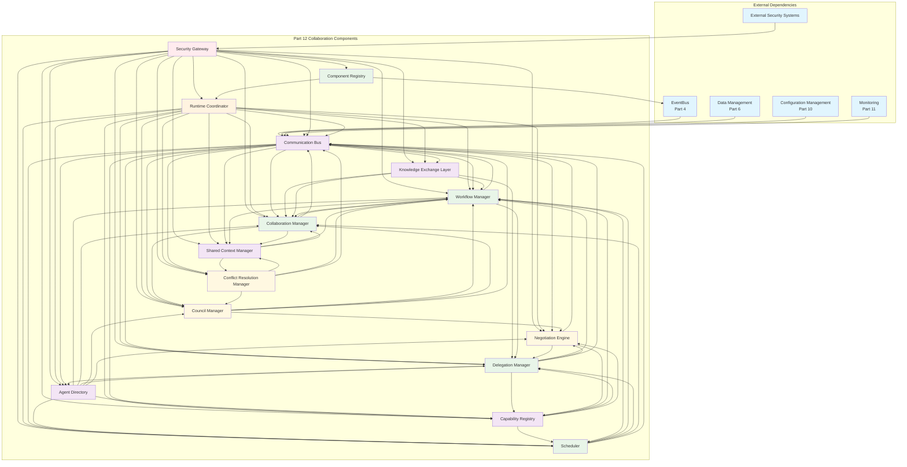
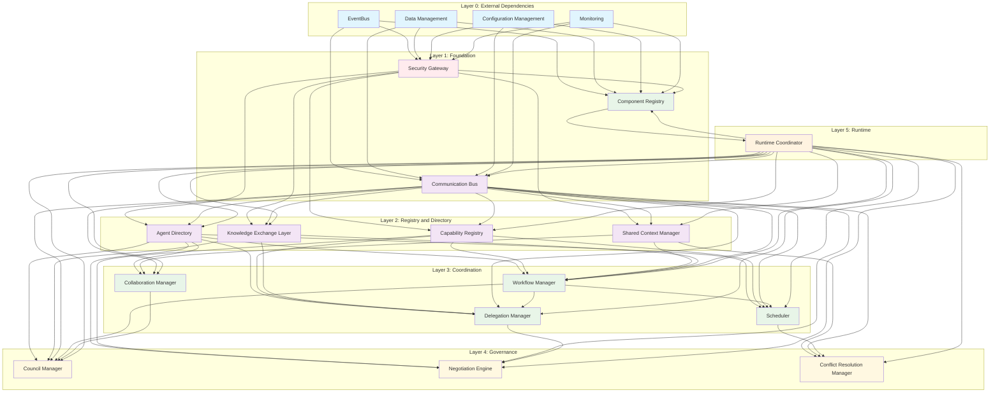
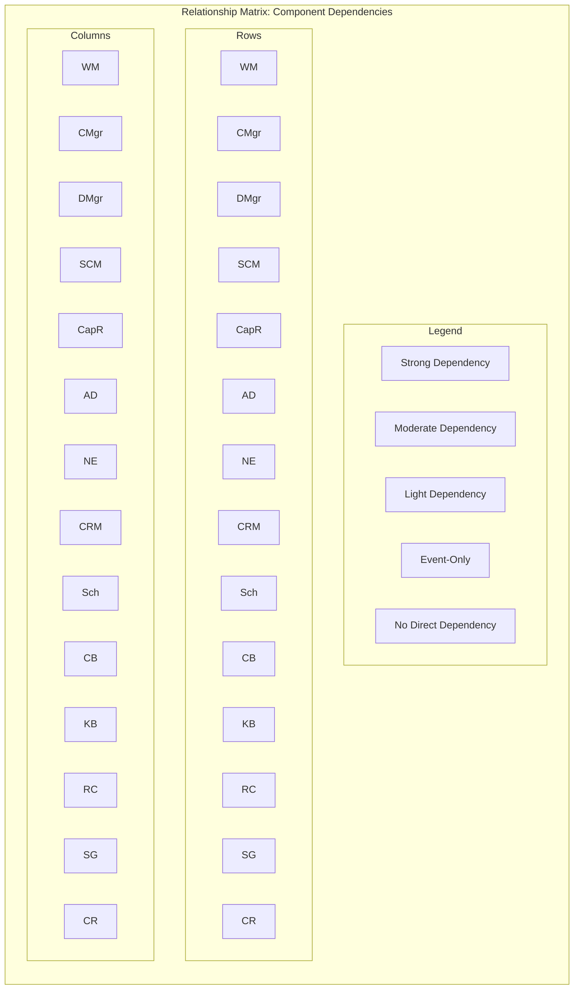

# Part 12: Multi-Agent Collaboration Architecture — Component Reference

## 1. Workflow Manager

### Name
Workflow Manager

### Purpose
Defines, executes, and monitors multi-agent workflows end-to-end. Ensures tasks are decomposed, assigned, tracked, and completed according to a declared workflow graph while preserving observability and recoverability across agent handoffs.

### Responsibilities
- Parse workflow definitions into executable state machines.
- Decompose workflow graphs into task units with explicit handoff semantics.
- Assign task units to agents based on capability matching, priority, and availability.
- Track workflow-level and task-level state transitions.
- Maintain checkpoints at configurable boundaries for recovery.
- Emit lifecycle events for each significant transition.
- Evaluate branching and convergence rules within the workflow.
- Enforce timeout, retry, and circuit-breaker policies per task and workflow.

### Interfaces
- `IWorkflowEngine.start(definition: WorkflowDefinition, context: SharedContext) → WorkflowInstance`
- `IWorkflowEngine.pause(instanceId: WorkflowId) → void`
- `IWorkflowEngine.resume(instanceId: WorkflowId) → void`
- `IWorkflowEngine.cancel(instanceId: WorkflowId, reason: string) → void`
- `IWorkflowEngine.getStatus(instanceId: WorkflowId) → WorkflowStatus`
- `ITaskDispatcher.dispatch(task: TaskUnit, candidates: AgentRef[]) → DispatchResult`
- `ICheckpointStore.write(instanceId: WorkflowId, state: Checkpoint) → void`
- `ICheckpointStore.read(instanceId: WorkflowId) → Checkpoint | null`

### Inputs
- `WorkflowDefinition` (from Council Manager, Delegation Manager, or external orchestrator)
- `CapabilityProfile[]` (from Capability Registry)
- `AgentStatus[]` (from Agent Directory)
- `SharedContext` (from Shared Context Manager)
- `ConfigurationOverrides` (from Configuration Management — Part 10)
- `ResourceReservation` (from Scheduler)

### Outputs
- `WorkflowInstance` with state machine instance and root task tree.
- `TaskUnit[]` emitted to Communication Bus for delegation.
- `Checkpoint` records persisted to durable storage via Checkpoint Store.
- `WorkflowEvent[]` emitted to EventBus (WorkflowStarted, TaskDispatched, TaskCompleted, WorkflowCompleted, WorkflowFailed, WorkflowCancelled, CheckpointTaken, WorkflowPaused, WorkflowResumed).

### Dependencies
- **Communication Bus**: task dispatch and result routing.
- **Capability Registry**: candidate agent discovery.
- **Agent Directory**: agent availability and health.
- **Shared Context Manager**: workflow-scoped state propagation.
- **Scheduler**: resource reservation and timing constraints.
- **Configuration Management** (Part 10): policy retrieval for retry/backoff/circuit-breaker.
- **EventBus** (Part 4): event publication and subscription.
- **Data Management** (Part 6): checkpoint persistence.

### Lifecycle
1. **Created**: Workflow definition received and validated against schema.
2. **Initialized**: State machine instantiated; initial tasks generated; checkpoints configured.
3. **Running**: Tasks dispatched and executed; state transitions observed; checkpoints taken at boundaries.
4. **Paused**: Execution suspended; state preserved; resources partially released.
5. **Resumed**: Execution continues from last checkpoint; pending tasks re-evaluated.
6. **Completed**: All terminal tasks reached success state; final event emitted.
7. **Failed**: Non-recoverable error encountered; failure event emitted; escalation triggered.
8. **Cancelled**: Explicit cancellation received; cleanup tasks executed; resources released.
9. **Archived**: Completed/failed workflow state moved to long-term store after retention period.

### Configuration
- `checkpointInterval`: number of tasks between automatic checkpoints (default: 10).
- `maxRetries`: maximum retry attempts per task (default: 3).
- `retryBackoffStrategy`: exponential | linear | fixed (default: exponential).
- `retryBackoffBaseMs`: base delay in milliseconds (default: 1000).
- `circuitBreakerThreshold`: failure rate threshold before circuit opens (default: 0.5).
- `circuitBreakerResetMs`: cooldown before retry after circuit open (default: 30000).
- `taskTimeoutMs`: default task execution timeout (default: 300000).
- `workflowTimeoutMs`: maximum end-to-end workflow duration (default: 3600000).
- `enableBranching`: whether conditional branching is evaluated (default: true).
- `enableConvergence`: whether merge/join semantics are enforced (default: true).
- `checkpointStorage`: reference to Checkpoint Store configuration.
- `maxParallelTasks`: maximum concurrent task dispatch within a workflow (default: 10).

### Events Produced
| Event | Priority | Description |
|-------|----------|-------------|
| `WorkflowStarted` | P0 | Workflow instance began execution. |
| `TaskDispatched` | P1 | Task unit assigned to an agent. |
| `TaskCompleted` | P1 | Task unit finished successfully. |
| `TaskFailed` | P1 | Task unit failed after retries exhausted. |
| `TaskRetried` | P2 | Task unit retry attempt initiated. |
| `WorkflowCompleted` | P0 | All tasks reached terminal success state. |
| `WorkflowFailed` | P0 | Non-recoverable workflow failure. |
| `WorkflowCancelled` | P1 | Workflow cancelled by user or system. |
| `WorkflowPaused` | P2 | Workflow execution suspended. |
| `WorkflowResumed` | P2 | Workflow execution resumed. |
| `CheckpointTaken` | P2 | Checkpoint written at workflow boundary. |
| `BranchEvaluated` | P3 | Conditional branch result recorded. |
| `ConvergenceReached` | P3 | Merge/join condition satisfied. |

### Events Consumed
| Event | Purpose |
|-------|---------|
| `TaskCompleted` | Advance state machine to next task. |
| `TaskFailed` | Apply retry or escalate failure. |
| `ContextUpdated` | Refresh shared context for downstream tasks. |
| `ResourceReserved` | Proceed with dispatch after resource allocation. |
| `ResourceReleased` | Adjust scheduling for subsequent tasks. |
| `WorkflowCancelled` | Halt execution and release resources. |
| `CapabilityUpdated` | Re-evaluate candidate pool for pending tasks. |
| `SecurityPolicyChanged` | Enforce new authorization constraints on in-flight tasks. |

### Security
- Workflow definitions validated against schema with integrity checks.
- Task dispatch enforces least-privilege: agent capabilities must match task requirements.
- Checkpoint data encrypted at rest using platform key management.
- Audit trail records every workflow lifecycle transition with actor attribution.
- Authorization required for workflow cancellation and definition modification.
- Secrets in workflow parameters injected via secure vault reference; never logged.
- Cross-trust-domain workflows require explicit delegation tokens with scoped permissions.

### Failure Modes
- **Definition validation failure**: malformed workflow graph rejected before execution.
- **Task dispatch exhaustion**: no candidate agent available; workflow suspended or escalated.
- **Checkpoint corruption**: durable store unavailable or data integrity loss.
- **State machine desynchronization**: event loss or out-of-order delivery causes incorrect transitions.
- **Resource exhaustion**: scheduler cannot reserve required resources; tasks timeout.
- **Circuit breaker open**: downstream agent cluster failing; dispatch halted.
- **Timeout cascade**: parent workflow timeout triggers child task cancellations.

### Recovery Strategy
- Resume from last successful checkpoint using `IWorkflowEngine.resume`.
- Re-dispatch failed tasks with idempotent task identifiers to prevent duplicate execution.
- Circuit breaker auto-reset after cooldown with health probe.
- Checkpoint integrity verified on read via checksum; fallback to prior checkpoint if corruption detected.
- Workflow definition versioning enables rollback to previous known-good definition.
- Escalation to Council Manager if recovery attempts exceed configured threshold.

### Performance
- Task dispatch latency: p99 < 100ms under normal load.
- Checkpoint write latency: p99 < 200ms.
- State transition processing: p99 < 50ms per event.
- Maximum supported concurrent workflows: 10,000 per instance.
- Workflow definition parsing: < 50ms for definitions up to 1,000 tasks.

### Scalability
- Horizontal scaling via partitioned workflow instance assignment.
- Checkpoint store sharded by workflow instance hash.
- Event consumption parallelized by partition key (workflowId).
- Task dispatch batched for high-throughput scenarios.
- Stateless state machine evaluation enables any worker to process any transition.

### Observability
- Distributed trace propagated via `correlation_id` across all emitted events.
- Metrics: `workflow.started`, `workflow.completed`, `workflow.failed`, `task.dispatch.latency`, `checkpoint.write.latency`, `state.transition.processing.time`.
- Structured logs with workflow instance ID, task ID, and agent ID.
- Dashboard: workflow throughput, failure rate, average duration, task-level heatmap.

### Examples
- Content generation pipeline: research → outline → draft → review → publish.
- Code review workflow: lint → test → security scan → approval → merge.
- Incident response: detection → triage → investigation → remediation → post-mortem.
- Data processing ETL: extract → validate → transform → load → verify.

---

## 2. Council Manager

### Name
Council Manager

### Purpose
Creates, configures, and operates councils — persistent or ad-hoc decision-making bodies composed of agents. Manages council lifecycle, membership, quorum, voting protocols, and decision enforcement across collaboration sessions.

### Responsibilities
- Create and dissolve councils with explicit mandates and scopes.
- Manage council membership: add, remove, and role-assign participating agents.
- Enforce quorum rules before convening deliberations.
- Orchestrate voting protocols (majority, supermajority, veto, ranked-choice, consensus).
- Resolve voting outcomes to binding decisions.
- Publish council decisions to subscribing components and agents.
- Maintain council state: active sessions, pending votes, decision history.
- Enforce term limits, rotation, and eligibility rules per council charter.

### Interfaces
- `ICouncilRegistry.register(charter: CouncilCharter) → CouncilId`
- `ICouncilRegistry.dissolve(councilId: CouncilId) → void`
- `ICouncilRegistry.get(councilId: CouncilId) → Council | null`
- `IVotingEngine.propose(councilId: CouncilId, proposal: Proposal) → VoteSessionId`
- `IVotingEngine.castVote(sessionId: VoteSessionId, voter: AgentId, vote: Vote) → void`
- `IVotingEngine.tally(sessionId: VoteSessionId) → TallyResult`
- `IDecisionEnforcer.enforce(decision: Decision, targets: AgentId[]) → EnforcementResult`
- `IMembershipManager.addMember(councilId: CouncilId, agent: AgentId, role: MemberRole) → void`
- `IMembershipManager.removeMember(councilId: CouncilId, agent: AgentId) → void`

### Inputs
- `CouncilCharter` (from external governance, Delegation Manager, or Council Manager itself for ad-hoc councils).
- `Proposal` (from Workflow Manager, Delegation Manager, or agent initiative).
- `Vote` submissions (from participating agents via Communication Bus).
- `AgentDirectory` (for membership validation).
- `SharedContext` (for proposal context and deliberation history).
- `ConfigurationOverrides` (from Configuration Management for voting rules).

### Outputs
- `CouncilId` on successful registration.
- `VoteSessionId` on proposal acceptance.
- `TallyResult` with outcome, quorum status, and vote breakdown.
- `Decision` with binding resolution and enforcement instructions.
- `CouncilEvent[]` emitted to EventBus (CouncilCreated, MemberAdded, VoteInitiated, VoteCast, TallyCompleted, DecisionPublished, CouncilDissolved).
- `EnforcementResult` delivered to Workflow Manager and Communication Bus.

### Dependencies
- **Communication Bus**: vote collection and result delivery.
- **Agent Directory**: membership validation and agent discovery.
- **Shared Context Manager**: deliberation history and proposal context.
- **EventBus** (Part 4): event publication.
- **Configuration Management** (Part 10): voting rule configuration.
- **Security Gateway**: authorization for council operations.
- **Data Management** (Part 6): persistence of council state and decision history.

### Lifecycle
1. **Chartered**: Council created with defined mandate, membership rules, and voting protocol.
2. **Seated**: Initial members added; quorum threshold established.
3. **Active**: Council accepts proposals; deliberates and votes.
4. **In Deliberation**: Active vote session in progress; votes collected.
5. **Resolved**: Voting concluded; decision published; enforcement initiated.
6. **Dissolved**: Mandate fulfilled or terminated; state archived.

### Configuration
- `defaultVotingProtocol`: majority | supermajority | veto | ranked-choice | consensus (default: supermajority).
- `supermajorityThreshold`: fraction required for supermajority (default: 0.67).
- `quorumRequirement`: minimum fraction of eligible members required (default: 0.5).
- `voteTimeoutMs`: maximum duration for a vote session (default: 300000).
- `maxProposalsPerSession`: limit on concurrent proposals (default: 5).
- `allowProxyVoting`: whether agents may delegate votes (default: false).
- `vetoPowerEnabled`: whether specific roles hold veto authority (default: false).
- `decisionRetentionDays`: how long decisions are retained in history (default: 365).
- `rotationPeriodDays`: member rotation interval for standing councils (default: 90).

### Events Produced
| Event | Priority | Description |
|-------|----------|-------------|
| `CouncilCreated` | P1 | New council registered with charter. |
| `CouncilDissolved` | P1 | Council mandate terminated. |
| `MemberAdded` | P2 | New member added to council. |
| `MemberRemoved` | P2 | Member removed from council. |
| `VoteInitiated` | P1 | Voting session started for a proposal. |
| `VoteCast` | P2 | Individual vote recorded. |
| `TallyCompleted` | P1 | Vote tally finalized with outcome. |
| `DecisionPublished` | P0 | Binding decision issued to subscribers. |
| `QuorumFailed` | P1 | Vote session failed to reach quorum. |
| `ProposalRejected` | P2 | Proposal did not pass vote threshold. |
| `VetoApplied` | P1 | Veto power exercised by authorized member. |

### Events Consumed
| Event | Purpose |
|-------|---------|
| `ProposalReceived` | Initiate a new vote session. |
| `TaskDelegated` | Evaluate delegation proposal for council review. |
| `WorkflowStarted` | Determine if council oversight is required. |
| `CouncilDissolved` | Clean up state and notify members. |
| `CapabilityUpdated` | Re-evaluate membership eligibility. |
| `AgentStatusChanged` | Adjust quorum calculations. |

### Security
- Council creation restricted to authorized principals via Security Gateway.
- Vote integrity: votes signed by agent identity; tampering detected and rejected.
- Authorization checks before proposal submission and vote casting.
- Decision audit trail immutable; append-only log with cryptographic chaining.
- Proxy voting requires explicit delegation token with time bounds.
- Sensitive proposals tagged; access restricted to cleared members.
- Council charter versioned and signed; modifications require re-chartering.

### Failure Modes
- **Quorum not met**: vote session expires without valid outcome.
- **Split vote with no supermajority**: deliberation deadlock; escalation required.
- **Member defection**: key member becomes unavailable mid-vote.
- **Vote tampering**: unauthorized vote injection or modification.
- **Charter conflict**: overlapping council mandates create ambiguity.

### Recovery Strategy
- Expired vote sessions auto-renewed if quorum still achievable; otherwise escalated.
- Split votes trigger deliberation extension with additional information gathering.
- Member defection handled by quorum re-calculation with remaining members.
- Vote integrity verified via signature validation; invalid votes discarded.
- Charter conflicts resolved by precedence rules defined in governance layer.

### Performance
- Vote tally latency: p99 < 200ms for councils up to 100 members.
- Proposal submission processing: p99 < 50ms.
- Decision publication delivery: p99 < 100ms to all subscribers.
- Maximum concurrent vote sessions per council: 10.

### Scalability
- Councils partitioned by mandate scope; large councils subdivided into committees.
- Vote tally parallelized across member subgroups.
- Decision publication uses fan-out via Communication Bus for subscriber delivery.
- Council state cached in memory with eventual consistency to persistent store.

### Observability
- Metrics: `council.created`, `council.dissolved`, `vote.initiated`, `vote.completed`, `decision.published`, `quorum.failed`, `vote.latency`.
- Traces: proposal-to-decision pipeline traced via correlation_id.
- Logs: vote records with member IDs, timestamps, and ballot contents (sanitized).
- Dashboard: council activity heatmap, decision latency, quorum success rate, veto frequency.

### Examples
- Security review council: evaluates tool access requests and risk assessments.
- Quality assurance council: reviews output quality and approves releases.
- Steering committee: resolves cross-team priority conflicts and resource allocation.
- Ethics oversight council: evaluates proposals for alignment with governance principles.

---

## 3. Collaboration Manager

### Name
Collaboration Manager

### Purpose
Orchestrates collaboration sessions between agents, managing session creation, participant coordination, shared context initialization, and session teardown. Provides the runtime envelope within which agents interact coherently toward a common objective.

### Responsibilities
- Create collaboration sessions with explicit objectives, participants, and constraints.
- Initialize shared context for the session and propagate to all participants.
- Coordinate session entry and exit protocols for participating agents.
- Monitor session health: participant liveness, context consistency, progress toward objective.
- Enforce session-level policies: trust boundaries, communication rules, resource limits.
- Facilitate session-wide announcements and broadcast messages.
- Manage session lifecycle: start, pause, resume, terminate.
- Collect session metrics and generate session reports.

### Interfaces
- `ISessionManager.create(objective: Objective, participants: AgentId[], constraints: SessionConstraints) → SessionId`
- `ISessionManager.join(sessionId: SessionId, agent: AgentId) → JoinResult`
- `ISessionManager.leave(sessionId: SessionId, agent: AgentId) → void`
- `ISessionManager.terminate(sessionId: SessionId, reason: string) → TerminationResult`
- `ISessionManager.getStatus(sessionId: SessionId) → SessionStatus`
- `ISessionMonitor.observe(sessionId: SessionId) → SessionHealth`
- `IPolicyEnforcer.enforce(sessionId: SessionId, policy: SessionPolicy) → EnforcementResult`
- `IBroadcaster.broadcast(sessionId: SessionId, message: SessionMessage) → DeliveryReport`

### Inputs
- `Objective` with scope, success criteria, and constraints.
- `AgentId[]` participant list from Agent Directory or Delegation Manager.
- `SessionConstraints` (max duration, trust domain, resource budget, participant count).
- `SharedContext` template or seed data from Shared Context Manager.
- `SessionPolicy` from governance or Configuration Management.
- `AgentStatus[]` for participant validation.

### Outputs
- `SessionId` on successful session creation.
- `JoinResult` with session context snapshot and communication channels.
- `SessionEvent[]` emitted to EventBus (SessionCreated, SessionStarted, SessionEnded, ParticipantJoined, ParticipantLeft, SessionPaused, SessionResumed, SessionTerminated, SessionExpired).
- `SessionReport` on session completion or termination.
- `DeliveryReport` from broadcast operations.

### Dependencies
- **Communication Bus**: message routing within session.
- **Shared Context Manager**: context initialization and propagation.
- **Agent Directory**: participant discovery and validation.
- **Security Gateway**: trust domain enforcement and authorization.
- **Scheduler**: resource reservation for session duration.
- **EventBus** (Part 4): event publication.
- **Data Management** (Part 6): session state persistence.

### Lifecycle
1. **Created**: Session object instantiated with objective and participants; shared context initialized.
2. **Initialized**: Participants notified; communication channels established; policies distributed.
3. **Running**: Active collaboration; messages exchanged; progress monitored.
4. **Paused**: Execution suspended; participants notified; resources partially retained.
5. **Resumed**: Collaboration continues; context synchronized across participants.
6. **Ended**: Objective achieved or abandoned; final report generated; context archived.
7. **Terminated**: Forced termination due to policy violation or external command.
8. **Expired**: Session exceeded configured duration; automatic cleanup triggered.

### Configuration
- `defaultMaxDurationMs`: maximum session duration (default: 86400000).
- `defaultMaxParticipants`: maximum concurrent participants (default: 50).
- `heartbeatIntervalMs`: participant liveness check interval (default: 5000).
- `heartbeatTimeoutMs`: participant considered absent after missed heartbeats (default: 15000).
- `contextSyncIntervalMs`: shared context synchronization frequency (default: 1000).
- `allowLateJoin`: whether participants may join after session start (default: false).
- `allowRejoin`: whether disconnected participants may rejoin (default: true).
- `rejoinWindowMs`: time window for participant rejoin (default: 300000).
- `policyEnforcement`: strict | permissive (default: strict).
- `sessionArchiveRetentionDays`: retained session reports retention (default: 90).

### Events Produced
| Event | Priority | Description |
|-------|----------|-------------|
| `SessionCreated` | P1 | Collaboration session instantiated. |
| `SessionStarted` | P1 | Session activated; participants begin collaboration. |
| `SessionEnded` | P1 | Session completed normally. |
| `ParticipantJoined` | P2 | Agent successfully joined session. |
| `ParticipantLeft` | P2 | Agent left session voluntarily. |
| `SessionPaused` | P2 | Session execution suspended. |
| `SessionResumed` | P2 | Session execution resumed. |
| `SessionTerminated` | P1 | Session terminated by policy or command. |
| `SessionExpired` | P2 | Session exceeded duration limit. |
| `HealthCheckFailed` | P2 | Participant failed liveness probe. |
| `PolicyViolation` | P1 | Session policy violation detected. |
| `ObjectiveAchieved` | P1 | Session success criteria met. |

### Events Consumed
| Event | Purpose |
|-------|---------|
| `WorkflowStarted` | Create collaboration session for workflow agents. |
| `CouncilCreated` | Initialize session for council deliberation. |
| `ContextUpdated` | Propagate context changes to session participants. |
| `AgentStatusChanged` | Adjust participant list and session health. |
| `SecurityPolicyChanged` | Enforce updated trust domain constraints. |
| `SessionTerminated` | External termination request received. |
| `ResourceReserved` | Confirm session resource allocation. |
| `ResourceReleased` | Clean up session resources. |

### Security
- Session creation requires authorization scoped to objective and participants.
- Communication within session restricted to session members via Communication Bus ACL.
- Shared context encrypted at rest; access controlled by session membership.
- Participant identity verified via Security Gateway before join admission.
- Policy violations trigger automatic session termination and audit logging.
- Cross-trust-domain sessions require explicit policy exception with approval trail.

### Failure Modes
- **Participant failure**: agent becomes unresponsive during session.
- **Context inconsistency**: divergent shared context across participants.
- **Policy violation**: participant breaches session trust boundary.
- **Resource exhaustion**: session exceeds configured resource budget.
- **Communication failure**: Communication Bus partition isolates participants.

### Recovery Strategy
- Participant failure handled by rejoin window; session state preserved.
- Context inconsistency resolved by CRDT merge or authoritative source reconciliation.
- Policy violation triggers participant ejection and session audit.
- Resource exhaustion triggers graceful degradation or session pause.
- Communication partition handled by buffering and eventual delivery upon reconnection.

### Performance
- Session creation latency: p99 < 200ms.
- Participant join latency: p99 < 100ms.
- Context sync latency: p99 < 50ms per participant.
- Maximum concurrent sessions: 5,000 per instance.

### Scalability
- Sessions partitioned by session ID hash across worker nodes.
- Participant communication routed through partitioned Communication Bus channels.
- Session state cached in distributed cache with write-through to persistent store.
- Broadcast operations use tree-fanout for large participant groups.

### Observability
- Metrics: `session.created`, `session.started`, `session.ended`, `session.terminated`, `participant.join.latency`, `context.sync.latency`, `session.duration`.
- Traces: session lifecycle traced via correlation_id.
- Logs: session events with participant IDs and policy decisions.
- Dashboard: active sessions, participant counts, session duration distribution, termination reasons.

### Examples
- Sprint planning session: team of agents collaborates on task decomposition.
- Design review session: multiple agents review and critique a proposed design.
- Incident response session: coordinated investigation across specialized agents.
- Brainstorming session: agents generate and refine ideas collectively.

---

## 4. Delegation Manager

### Name
Delegation Manager

### Purpose
Manages task and responsibility delegation from one agent to another, handling capability negotiation, trust verification, delegation contract formation, and execution monitoring. Ensures delegated tasks are accepted, executed, and reported back with appropriate accountability.

### Responsibilities
- Receive delegation requests and validate delegator authority.
- Identify suitable delegatees via Capability Registry and Agent Directory.
- Negotiate delegation terms: scope, deadline, quality criteria, trust level.
- Form delegation contracts with explicit acceptance and completion criteria.
- Track delegation state: pending, accepted, executing, completed, failed, revoked.
- Monitor delegated task execution and collect results.
- Handle delegation revocation and transfer mid-execution.
- Maintain delegation audit trail for accountability.

### Interfaces
- `IDelegationService.request(delegation: DelegationRequest) → DelegationOffer`
- `IDelegationService.accept(offerId: DelegationOfferId, delegatee: AgentId) → DelegationContract`
- `IDelegationService.revoke(contractId: DelegationContractId, reason: string) → RevocationResult`
- `IDelegationService.transfer(contractId: DelegationContractId, newDelegatee: AgentId) → TransferResult`
- `IDelegationService.getStatus(contractId: DelegationContractId) → DelegationStatus`
- `INegotiator.negotiate(request: DelegationRequest, candidates: AgentId[]) → NegotiationResult`
- `IAuditLogger.logDelegation(event: DelegationEvent) → void`

### Inputs
- `DelegationRequest` from Workflow Manager, Council Manager, or agent initiative.
- `CapabilityProfile[]` from Capability Registry for candidate matching.
- `AgentStatus[]` from Agent Directory for availability filtering.
- `TrustPolicy` from Security Gateway for delegator/delegatee verification.
- `SharedContext` from Shared Context Manager for task context.
- `ConfigurationOverrides` from Configuration Management for delegation policies.

### Outputs
- `DelegationOffer` presented to candidate agents.
- `DelegationContract` upon acceptance with binding terms.
- `DelegationResult` delivered back to delegator upon completion.
- `DelegationEvent[]` emitted to EventBus (DelegationRequested, DelegationOffered, DelegationAccepted, DelegationRejected, DelegationRevoked, DelegationTransferred, DelegationCompleted, DelegationFailed).

### Dependencies
- **Capability Registry**: candidate discovery and capability matching.
- **Agent Directory**: agent availability and trust level lookup.
- **Communication Bus**: offer delivery and result collection.
- **Security Gateway**: trust verification and authorization.
- **Shared Context Manager**: task context propagation.
- **Workflow Manager**: task decomposition and result integration.
- **EventBus** (Part 4): event publication.
- **Data Management** (Part 6): delegation contract persistence.

### Lifecycle
1. **Requested**: Delegation request submitted and validated.
2. **Offered**: Candidate agents identified and offered the delegation.
3. **Negotiating**: Terms negotiated between delegator and candidate.
4. **Accepted**: Candidate accepts terms; contract formed.
5. **Executing**: Delegatee executes delegated task; progress reported.
6. **Completed**: Task completed successfully; result delivered.
7. **Failed**: Task failed; failure reason recorded; escalation triggered.
8. **Revoked**: Delegation revoked by delegator; delegatee notified.
9. **Transferred**: Delegation transferred to new delegatee; contract amended.

### Configuration
- `maxNegotiationRounds`: maximum negotiation iterations before fallback (default: 5).
- `offerTimeoutMs`: time before offer expires if not accepted (default: 60000).
- `contractRetentionDays`: delegation contract retention period (default: 90).
- `allowTransfer`: whether mid-execution transfer is permitted (default: true).
- `allowRevocation`: whether delegator may revoke after acceptance (default: true).
- `revocationPenalty`: trust score impact for unjustified revocation (default: -0.1).
- `requireExplicitAcceptance`: whether silent acceptance is permitted (default: false).
- `maxDelegationDepth`: maximum delegation chain depth (default: 3).
- `delegationTimeoutMs`: default execution timeout for delegated tasks (default: 600000).

### Events Produced
| Event | Priority | Description |
|-------|----------|-------------|
| `DelegationRequested` | P1 | New delegation request submitted. |
| `DelegationOffered` | P1 | Offer extended to candidate agent. |
| `DelegationAccepted` | P1 | Candidate accepted the offer. |
| `DelegationRejected` | P2 | Candidate declined the offer. |
| `DelegationRevoked` | P1 | Delegation revoked by delegator. |
| `DelegationTransferred` | P1 | Delegation transferred to new delegatee. |
| `DelegationCompleted` | P0 | Delegated task completed successfully. |
| `DelegationFailed` | P1 | Delegated task failed. |
| `NegotiationStarted` | P2 | Negotiation phase initiated. |
| `NegotiationConcluded` | P2 | Negotiation reached agreement or failed. |

### Events Consumed
| Event | Purpose |
|-------|---------|
| `WorkflowStarted` | Receive task decomposition for delegation. |
| `CapabilityUpdated` | Refresh candidate pool for pending offers. |
| `AgentStatusChanged` | Adjust candidate availability. |
| `TaskCompleted` | Receive completion result from delegatee. |
| `TaskFailed` | Receive failure result and trigger escalation. |
| `DelegationRevoked` | External revocation request processed. |
| `SecurityPolicyChanged` | Re-validate trust for active delegations. |

### Security
- Delegation requests authorized by delegator identity and scope.
- Delegatee trust level verified against task requirements.
- Delegation contracts signed by both parties; tamper-evident.
- Sensitive task parameters encrypted in contract payload.
- Audit trail records full delegation chain for accountability.
- Delegation depth limited to prevent privilege escalation chains.

### Failure Modes
- **No capable delegatee**: no agent matches required capabilities.
- **Negotiation failure**: terms cannot be agreed upon within max rounds.
- **Contract breach**: delegatee fails to meet acceptance criteria.
- **Revocation conflict**: delegator revokes during active execution.
- **Trust degradation**: delegatee trust level drops below threshold mid-execution.

### Recovery Strategy
- No capable delegatee triggers escalation to Workflow Manager for alternative decomposition.
- Negotiation failure falls back to default candidate or escalates to Council Manager.
- Contract breach triggers retry with alternate delegatee or failure escalation.
- Revocation handled via graceful handoff if transfer is feasible; otherwise task returned to delegator.
- Trust degradation triggers re-verification or delegation transfer to trusted agent.

### Performance
- Delegation request processing: p99 < 50ms.
- Candidate matching latency: p99 < 100ms for registries up to 10,000 agents.
- Contract formation: p99 < 200ms.
- Result delivery: p99 < 100ms.

### Scalability
- Candidate matching indexed by capability tags for O(1) lookup.
- Delegation contracts sharded by delegator ID for distribution.
- Event emission partitioned by delegation ID for parallel consumption.

### Observability
- Metrics: `delegation.requested`, `delegation.accepted`, `delegation.completed`, `delegation.failed`, `negotiation.rounds`, `candidate.match.latency`.
- Traces: delegation lifecycle from request to result.
- Logs: contract terms, negotiation rounds, and trust scores.
- Dashboard: delegation throughput, acceptance rate, average completion time, failure reasons.

### Examples
- Research task delegated from orchestrator to specialized research agent.
- Code review delegated from lead developer to code review specialist.
- Translation task delegated from content agent to multilingual agent.
- Data analysis delegated from dashboard agent to analytics specialist.

---

## 5. Shared Context Manager

### Name
Shared Context Manager

### Purpose
Maintains, synchronizes, and provides consistent access to shared context across collaborating agents. Ensures context integrity, enables efficient conflict resolution, and provides versioned snapshots for recovery and audit.

### Responsibilities
- Create and initialize shared context scopes (session, workflow, council).
- Propagate context updates to all subscribed agents and components.
- Detect and resolve conflicts using configurable consistency models.
- Maintain versioned snapshots for rollback and recovery.
- Enforce access control on context fields based on trust domain and role.
- Provide efficient query interfaces for context inspection.
- Prune stale context entries based on retention policies.
- Emit context change events for downstream consumers.

### Interfaces
- `IContextStore.create(scope: ContextScope, seed: ContextData) → ContextId`
- `IContextStore.update(contextId: ContextId, delta: ContextDelta, source: AgentId) → VersionedUpdate`
- `IContextStore.read(contextId: ContextId, fields: string[], version: number) → ContextSnapshot`
- `IContextStore.subscribe(contextId: ContextId, subscriber: AgentId, fields: string[]) → SubscriptionId`
- `IContextStore.snapshot(contextId: ContextId) → ContextSnapshot`
- `IContextStore.rollback(contextId: ContextId, targetVersion: number) → RollbackResult`
- `IConflictResolver.resolve(conflict: Conflict) → Resolution`
- `IContextGC.collect(contextId: ContextId) → GCResult`

### Inputs
- `ContextScope` defining ownership, trust domain, and retention rules.
- `ContextData` seed data from Workflow Manager, Collaboration Manager, or Council Manager.
- `ContextDelta` updates from participating agents.
- `SubscriptionRequest` from agents and components.
- `RetentionPolicy` from Configuration Management.
- `AccessPolicy` from Security Gateway.

### Outputs
- `ContextId` on successful creation.
- `ContextSnapshot` returned to read operations.
- `VersionedUpdate` confirmed with version number and timestamp.
- `SubscriptionId` for event delivery.
- `ContextEvent[]` emitted to EventBus (ContextCreated, ContextUpdated, ConflictDetected, ConflictResolved, SnapshotTaken, ContextRolledBack, ContextExpired).

### Dependencies
- **Communication Bus**: event delivery to subscribers.
- **Security Gateway**: access control and field-level authorization.
- **EventBus** (Part 4): context change event publication.
- **Data Management** (Part 6): persistent context storage and versioning.
- **Configuration Management** (Part 10): retention and consistency policy retrieval.

### Lifecycle
1. **Created**: Context scope defined; seed data loaded; subscribers registered.
2. **Active**: Updates accepted; conflicts detected and resolved; snapshots taken.
3. **Subscribed**: Agents receiving real-time updates for subscribed fields.
4. **Suspended**: Updates paused; subscribers notified; state preserved.
5. **Resumed**: Updates resumed; subscribers re-synchronized.
6. **Archived**: Moved to long-term storage after session completion.
7. **Expired**: Retained past retention period; garbage collected.

### Configuration
- `defaultConsistencyModel`: eventual | strong | causal | CRDT (default: CRDT).
- `snapshotInterval`: automatic snapshot frequency (default: every 100 updates).
- `maxRetainedVersions`: maximum context versions kept (default: 1000).
- `retentionPolicy`: session | workflow | council | permanent (default: session).
- `conflictResolutionStrategy`: last-writer-wins | merge | escalate | custom (default: merge for CRDT, last-writer-wins for eventual).
- `accessControlGranularity`: scope | field | value (default: field).
- `gcIntervalMs`: garbage collection interval (default: 3600000).
- `maxContextSizeBytes`: maximum context payload size (default: 10485760).
- `compressionEnabled`: whether context payloads are compressed (default: true).

### Events Produced
| Event | Priority | Description |
|-------|----------|-------------|
| `ContextCreated` | P1 | New shared context scope created. |
| `ContextUpdated` | P1 | Context fields updated with new values. |
| `ConflictDetected` | P1 | Concurrent update conflict identified. |
| `ConflictResolved` | P2 | Conflict resolved with chosen strategy. |
| `SnapshotTaken` | P3 | Versioned snapshot captured. |
| `ContextRolledBack` | P1 | Context restored to prior version. |
| `ContextExpired` | P2 | Context exceeded retention period. |
| `SubscriptionCreated` | P3 | New subscriber registered for context updates. |
| `SubscriptionRemoved` | P3 | Subscriber removed from context. |

### Events Consumed
| Event | Purpose |
|-------|---------|
| `WorkflowStarted` | Create workflow-scoped context. |
| `CouncilCreated` | Create council-scoped context. |
| `SessionStarted` | Create session-scoped context. |
| `ContextUpdated` | Receive external update for conflict detection. |
| `SessionTerminated` | Trigger context archival. |
| `WorkflowCompleted` | Trigger context archival. |
| `CouncilDissolved` | Trigger context archival. |
| `SecurityPolicyChanged` | Re-evaluate access control rules. |

### Security
- Field-level access control enforced per subscriber trust domain and role.
- Context updates require source agent authentication via Security Gateway.
- Sensitive fields encrypted at rest; decrypted only for authorized subscribers.
- Audit trail records all context updates with source, timestamp, and delta hash.
- Cross-trust-domain context sharing requires explicit policy exception.
- Context integrity verified via version chain; tampering detected and rejected.

### Failure Modes
- **Update conflict**: concurrent modifications to same field by multiple agents.
- **Snapshot corruption**: version chain integrity compromised.
- **Subscriber disconnection**: subscriber misses updates during outage.
- **Context bloat**: uncontrolled growth exceeds storage or performance limits.
- **Access violation**: unauthorized agent attempts context read or write.

### Recovery Strategy
- Conflicts resolved via configured strategy (merge, last-writer-wins, or escalation).
- Snapshot corruption handled by fallback to prior verified snapshot.
- Subscriber disconnection handled by replay of missed updates from version watermark.
- Context bloat managed by garbage collection and retention policies.
- Access violations logged and rejected; incident escalated to Security Gateway.

### Performance
- Context update latency: p99 < 20ms per update.
- Snapshot creation: p99 < 100ms for contexts up to 10MB.
- Subscription delivery latency: p99 < 50ms.
- Maximum concurrent context scopes: 50,000 per instance.

### Scalability
- Context partitioned by context ID hash across storage nodes.
- Subscriber fan-out optimized via hierarchical delivery (channel per trust domain).
- Conflict detection parallelized across field partitions.
- Snapshot storage deduplicated via content-addressable storage.

### Observability
- Metrics: `context.created`, `context.updated`, `conflict.detected`, `conflict.resolved`, `snapshot.taken`, `context.rollback`, `subscription.count`.
- Traces: context operations traced via context_id.
- Logs: update deltas, conflict resolutions, and access decisions.
- Dashboard: context update rate, conflict frequency, snapshot age, subscription counts.

### Examples
- Session context: shared scratchpad for brainstorming session participants.
- Workflow context: accumulated outputs and intermediate results across pipeline stages.
- Council context: deliberation history and proposal metadata.
- Task context: parameters, constraints, and progress indicators for delegated tasks.

---

## 6. Capability Registry

### Name
Capability Registry

### Purpose
Maintains a searchable, verifiable registry of agent capabilities. Supports capability advertisement, discovery, negotiation, and lifecycle management. Enables capability-based routing and delegation throughout the collaboration architecture.

### Responsibilities
- Accept and validate capability advertisements from agents.
- Index capabilities by type, domain, and metadata for efficient querying.
- Support capability discovery queries with filters and ranking.
- Verify capability claims via attestation or runtime probing where applicable.
- Track capability lifecycle: offered, active, deprecated, revoked.
- Detect capability drift and staleness; trigger re-advertisement.
- Support capability negotiation between agents for delegation and collaboration.
- Emit capability change events for downstream consumers.

### Interfaces
- `ICapabilityRegistry.advertise(agentId: AgentId, capabilities: CapabilityProfile[]) → RegistrationResult`
- `ICapabilityRegistry.revoke(agentId: AgentId, capabilityIds: CapabilityId[]) → RevocationResult`
- `ICapabilityRegistry.query(query: CapabilityQuery) → CapabilityMatch[]`
- `ICapabilityRegistry.verify(agentId: AgentId, capabilityId: CapabilityId) → VerificationResult`
- `ICapabilityRegistry.update(agentId: AgentId, capabilities: CapabilityProfile[]) → UpdateResult`
- `INegotiator.negotiateCapabilities(required: CapabilityRequirement[], offered: CapabilityProfile[]) → NegotiationResult`

### Inputs
- `CapabilityProfile[]` from agents via Communication Bus or direct registration.
- `CapabilityQuery` from Workflow Manager, Delegation Manager, or Scheduler.
- `CapabilityRequirement[]` from task definitions and workflow specifications.
- `AttestationToken` from agents for capability verification.
- `ConfigurationOverrides` for registry policies and retention rules.
- `AgentStatus` from Agent Directory for availability filtering.

### Outputs
- `RegistrationResult` confirming successful advertisement.
- `CapabilityMatch[]` ranked by relevance and confidence.
- `VerificationResult` with attestation status and confidence score.
- `CapabilityEvent[]` emitted to EventBus (CapabilityAdvertised, CapabilityUpdated, CapabilityRevoked, CapabilityVerified, CapabilityStale).

### Dependencies
- **Agent Directory**: cross-reference agent identity and status.
- **Communication Bus**: advertisement submission and query response delivery.
- **Security Gateway**: attestation validation and authorization for registration.
- **EventBus** (Part 4): capability change event publication.
- **Data Management** (Part 6): persistent capability storage and indexing.
- **Configuration Management** (Part 10): registry policy configuration.

### Lifecycle
1. **Advertised**: Agent submits capability profile; profile validated and indexed.
2. **Active**: Capability available for discovery and matching.
3. **Updated**: Agent submits revised capability profile; old entries deprecated.
4. **Stale**: Capability not refreshed within configured window; flagged as stale.
5. **Revoked**: Agent or system explicitly removes capability; entries deactivated.
6. **Archived**: Revoked or stale capabilities moved to historical store after retention.

### Configuration
- `advertisementTTLMs`: time before unrefreshed capabilities become stale (default: 300000).
- `maxCapabilitiesPerAgent`: maximum advertised capabilities per agent (default: 500).
- `verificationEnabled`: whether capability verification is enforced (default: true).
- `verificationProbeTimeoutMs`: timeout for runtime capability probes (default: 5000).
- `rankingWeights`: weights for relevance scoring (e.g., {recency: 0.3, confidence: 0.4, utilization: 0.3}).
- `staleGracePeriodMs`: grace period before stale capabilities are hidden (default: 60000).
- `retentionDays`: retained revoked/stale capability history (default: 30).
- `maxQueryResults`: maximum results returned per query (default: 100).

### Events Produced
| Event | Priority | Description |
|-------|----------|-------------|
| `CapabilityAdvertised` | P1 | New capability profile registered. |
| `CapabilityUpdated` | P2 | Existing capability profile revised. |
| `CapabilityRevoked` | P1 | Capability explicitly removed. |
| `CapabilityVerified` | P2 | Capability claim verified via attestation. |
| `CapabilityStale` | P2 | Capability flagged as stale due to TTL expiry. |
| `CapabilityQueryExecuted` | P3 | Query executed for analytics. |

### Events Consumed
| Event | Purpose |
|-------|---------|
| `AgentRegistered` | Begin capability advertisement for new agent. |
| `AgentDeregistered` | Revoke all capabilities for departing agent. |
| `AgentStatusChanged` | Mark capabilities of unhealthy agents as stale. |
| `CapabilityUpdated` | Refresh stale capability with new attestation. |
| `WorkflowStarted` | Provide capability matches for task assignment. |
| `TaskDelegated` | Verify delegatee capabilities against task requirements. |

### Security
- Capability advertisements signed by agent identity; verified before indexing.
- Authorization required for capability registration and revocation.
- Sensitive capability metadata access restricted to authorized queries.
- Attestation tokens validated via Security Gateway; expired or invalid tokens rejected.
- Capability tampering detected via signature mismatch; entries quarantined.

### Failure Modes
- **Stale capabilities**: unrefreshed advertisements remain in registry.
- **Verification failure**: attestation invalid or probe timeout.
- **Index corruption**: capability index becomes inconsistent.
- **Query timeout**: complex queries exceed latency bounds.

### Recovery Strategy
- Stale capabilities flagged and eventually removed after grace period; agents notified.
- Verification failure triggers re-advertisement request to agent.
- Index corruption handled by rebuild from persistent store.
- Query timeout handled by partial result return with pagination.

### Performance
- Advertisement processing: p99 < 50ms.
- Query latency: p99 < 100ms for queries returning up to 100 results.
- Verification latency: p99 < 200ms including attestation validation.
- Maximum indexed capabilities: 1,000,000 per instance.

### Scalability
- Capability index partitioned by capability type and domain.
- Query execution parallelized across index partitions.
- Stale detection batch-processed during low-traffic windows.
- Registry sharded by agent ID hash for distributed deployment.

### Observability
- Metrics: `capability.advertised`, `capability.revoked`, `capability.stale`, `capability.query.latency`, `capability.verification.latency`, `registry.size`.
- Traces: advertisement and query lifecycle traced.
- Logs: capability profiles, query parameters, and match results.
- Dashboard: capability distribution by type, stale rate, query volume, verification success rate.

### Examples
- Code generation capability advertised by a coding agent.
- Translation capability advertised by a multilingual agent.
- Data analysis capability advertised by an analytics agent.
- Security audit capability advertised by a security specialist agent.

---

## 7. Agent Directory

### Name
Agent Directory

### Purpose
Maintains a authoritative, searchable registry of all agents in the collaboration ecosystem. Tracks agent identity, status, location, trust level, and availability. Enables agent discovery, health monitoring, and lifecycle management.

### Responsibilities
- Register and deregister agents with identity verification.
- Maintain agent metadata: name, version, description, endpoints, trust domain.
- Track agent status: online, offline, busy, degraded, maintenance.
- Monitor agent health via heartbeats and liveness probes.
- Provide agent discovery queries with filters for status, capability, and trust level.
- Detect and report agent failures and degradations.
- Manage agent lifecycle: registration, activation, deactivation, removal.
- Emit agent lifecycle events for downstream consumers.

### Interfaces
- `IAgentDirectory.register(agent: AgentRegistration) → RegistrationResult`
- `IAgentDirectory.deregister(agentId: AgentId) → DeregistrationResult`
- `IAgentDirectory.updateStatus(agentId: AgentId, status: AgentStatus) → UpdateResult`
- `IAgentDirectory.query(query: AgentQuery) → AgentMatch[]`
- `IAgentDirectory.get(agentId: AgentId) → AgentRecord | null`
- `IAgentDirectory.heartbeat(agentId: AgentId) → HeartbeatResult`
- `IHealthMonitor.probe(agentId: AgentId) → HealthReport`
- `ILifecycleManager.activate(agentId: AgentId) → ActivationResult`
- `ILifecycleManager.deactivate(agentId: AgentId) → DeactivationResult`

### Inputs
- `AgentRegistration` from agents during initialization or re-registration.
- `Heartbeat` signals from active agents.
- `AgentQuery` from Workflow Manager, Delegation Manager, Scheduler, and other components.
- `HealthProbe` requests from health monitoring systems.
- `StatusUpdate` from agents reporting voluntary state changes.
- `ConfigurationOverrides` for directory policies and timeouts.

### Outputs
- `RegistrationResult` confirming agent registration with assigned identifier.
- `AgentMatch[]` ranked by query relevance.
- `HealthReport` with liveness, responsiveness, and trust metrics.
- `AgentEvent[]` emitted to EventBus (AgentRegistered, AgentDeregistered, AgentStatusChanged, AgentHeartbeat, AgentHealthChanged, AgentDeactivated, AgentActivated).

### Dependencies
- **Capability Registry**: cross-reference agent capabilities for discovery queries.
- **Security Gateway**: identity verification and trust level assignment.
- **Communication Bus**: heartbeat and health probe delivery.
- **EventBus** (Part 4): agent lifecycle event publication.
- **Data Management** (Part 6): persistent agent record storage.
- **Configuration Management** (Part 10): directory policy configuration.

### Lifecycle
1. **Registering**: Agent submits registration; identity and metadata validated.
2. **Registered**: Agent record created; available for discovery and task assignment.
3. **Active**: Agent sending heartbeats; status online and available.
4. **Degraded**: Agent experiencing issues; status reflects reduced availability.
5. **Inactive**: Agent stopped sending heartbeats; marked offline after timeout.
6. **Deregistered**: Agent record removed from active directory; moved to history.

### Configuration
- `heartbeatIntervalMs`: expected heartbeat frequency from agents (default: 5000).
- `heartbeatTimeoutMs`: time before agent marked offline (default: 15000).
- `healthProbeIntervalMs`: active health probe frequency (default: 30000).
- `healthProbeTimeoutMs`: timeout for health probe responses (default: 10000).
- `maxInactiveDurationMs`: duration before inactive agent auto-deregistered (default: 86400000).
- `retentionDays`: deregistered agent history retention (default: 30).
- `trustLevelRefreshIntervalMs`: frequency of trust level re-evaluation (default: 3600000).
- `allowDuplicateNames`: whether multiple agents may share a display name (default: false).
- `registrationRequiresAttestation`: whether agent registration requires attestation token (default: true).

### Events Produced
| Event | Priority | Description |
|-------|----------|-------------|
| `AgentRegistered` | P1 | New agent successfully registered. |
| `AgentDeregistered` | P1 | Agent removed from active directory. |
| `AgentStatusChanged` | P1 | Agent status transitioned (online, offline, busy, degraded). |
| `AgentHeartbeat` | P3 | Heartbeat received from agent (for internal tracking). |
| `AgentHealthChanged` | P2 | Health assessment updated (healthy, unhealthy, degraded). |
| `AgentActivated` | P1 | Agent moved from inactive to active status. |
| `AgentDeactivated` | P1 | Agent moved from active to inactive status. |

### Events Consumed
| Event | Purpose |
|-------|---------|
| `AgentHeartbeat` | Update liveness timestamp; maintain active status. |
| `AgentHealthProbe` | Process health probe results. |
| `AgentDeregistered` | External deregistration request processed. |
| `CapabilityAdvertised` | Cross-reference agent capabilities. |
| `SecurityPolicyChanged` | Update trust level assignments. |
| `AgentStatusChanged` | Propagate status change to dependent components. |

### Security
- Agent registration requires valid attestation from trusted issuer.
- Agent identity cryptographically verified; spoofing prevented.
- Trust level assignment based on attestation claims and governance policy.
- Directory access controlled; unauthorized queries rejected.
- Agent record modifications require authorization matching agent identity.

### Failure Modes
- **Heartbeat loss**: agent becomes unresponsive; marked offline.
- **Identity spoofing**: unauthorized agent attempts registration with stolen identity.
- **Directory corruption**: agent records become inconsistent.
- **Query flood**: excessive discovery requests degrade performance.

### Recovery Strategy
- Heartbeat loss triggers graceful deactivation; task re-assignment initiated.
- Identity spoofing detected via attestation failure; registration rejected and incident logged.
- Directory corruption handled by rebuild from persistent store and re-verification.
- Query flood mitigated by rate limiting and query caching.

### Performance
- Registration processing: p99 < 100ms.
- Query latency: p99 < 50ms for queries returning up to 100 results.
- Health probe round-trip: p99 < 200ms.
- Maximum tracked agents: 100,000 per instance.

### Scalability
- Directory partitioned by agent ID hash across storage nodes.
- Query execution uses indexed lookups on status, trust level, and capability tags.
- Heartbeat processing batched and parallelized.
- Health probes staggered to avoid thundering herd.

### Observability
- Metrics: `agent.registered`, `agent.deregistered`, `agent.status.changed`, `heartbeat.received`, `heartbeat.missed`, `query.latency`, `directory.size`.
- Traces: registration and query lifecycle traced.
- Logs: agent records, status transitions, and trust level changes.
- Dashboard: agent count by status, heartbeat health, registration rate, trust level distribution.

### Examples
- Coding agent registered with code generation and review capabilities.
- Research agent registered with web search and summarization capabilities.
- Translation agent registered with multilingual capabilities.
- Security agent registered with audit and vulnerability scanning capabilities.

---

## 8. Negotiation Engine

### Name
Negotiation Engine

### Purpose
Facilitates automated negotiation between agents for delegation terms, resource allocation, capability matching, and collaboration agreements. Supports multi-round negotiation with configurable strategies and fallback mechanisms.

### Responsibilities
- Initiate negotiation sessions between two or more parties.
- Propose and evaluate terms based on configured strategies (utility-based, cooperative, competitive).
- Iterate through negotiation rounds with offer and counter-offer exchanges.
- Detect negotiation deadlock and apply fallback strategies.
- Resolve negotiation to agreement, compromise, or walk-away.
- Log negotiation trajectories for analysis and learning.
- Support multi-attribute negotiation (price, deadline, quality, scope).

### Interfaces
- `INegotiationEngine.initiate(parties: AgentId[], topic: NegotiationTopic, strategy: NegotiationStrategy) → NegotiationId`
- `INegotiationEngine.propose(negotiationId: NegotiationId, party: AgentId, offer: Offer) → ProposalResult`
- `INegotiationEngine.accept(negotiationId: NegotiationId, party: AgentId) → AcceptanceResult`
- `INegotiationEngine.reject(negotiationId: NegotiationId, party: AgentId, reason: string) → RejectionResult`
- `INegotiationEngine.walkAway(negotiationId: NegotiationId, party: AgentId) → WalkAwayResult`
- `INegotiationEngine.getState(negotiationId: NegotiationId) → NegotiationState`
- `IStrategyEvaluator.evaluate(offer: Offer, preferences: Preferences) → Score`

### Inputs
- `NegotiationTopic` defining scope and constraints.
- `NegotiationStrategy` from configuration or delegation context.
- `Offer` proposals from participating agents.
- `Preferences` and utility functions from agent profiles.
- `FallbackStrategy` from Configuration Management for deadlock resolution.
- `SharedContext` for negotiation history and context.

### Outputs
- `NegotiationId` on successful initiation.
- `ProposalResult` with acceptance, rejection, or counter-offer.
- `AcceptanceResult` with final agreement terms.
- `RejectionResult` with reason and fallback options.
- `NegotiationState` reflecting current round and party positions.
- `NegotiationEvent[]` emitted to EventBus (NegotiationStarted, OfferProposed, OfferAccepted, OfferRejected, NegotiationConcluded, NegotiationDeadlocked, NegotiationWalkedAway).

### Dependencies
- **Communication Bus**: offer exchange and state synchronization between parties.
- **Delegation Manager**: negotiation context for delegation terms.
- **Capability Registry**: capability requirements and availability for negotiation.
- **Shared Context Manager**: negotiation history and shared preferences.
- **EventBus** (Part 4): negotiation event publication.
- **Configuration Management** (Part 10): strategy configuration and fallback rules.

### Lifecycle
1. **Initiated**: Negotiation session created; parties notified; strategy loaded.
2. **Proposing**: Active offer-exchange round; parties submit proposals.
3. **Evaluating**: Offers evaluated against preferences and utility functions.
4. **Countering**: Counter-offers generated based on evaluation results.
5. **Concluded**: Agreement reached or all rounds exhausted; outcome recorded.
6. **Deadlocked**: No agreement possible within configured rounds; fallback triggered.
7. **Walked Away**: One or more parties exited negotiation.

### Configuration
- `maxRounds`: maximum negotiation rounds before deadlock declaration (default: 10).
- `roundTimeoutMs`: timeout per negotiation round (default: 30000).
- `defaultStrategy`: utility-based | cooperative | competitive | tit-for-tat (default: utility-based).
- `concessionRate`: rate at which offers converge toward agreement (default: 0.1).
- `deadlockResolution`: escalate | random-walk | mediator (default: escalate).
- `allowMultiAttribute`: whether multiple attributes may be negotiated simultaneously (default: true).
- `utilityWeight`: weight assigned to utility function in scoring (default: 0.7).
- `logNegotiations`: whether negotiation trajectories are logged (default: true).
- `negotiationRetentionDays`: retained negotiation history (default: 30).

### Events Produced
| Event | Priority | Description |
|-------|----------|-------------|
| `NegotiationStarted` | P1 | Negotiation session initiated between parties. |
| `OfferProposed` | P2 | Offer submitted by a party. |
| `OfferAccepted` | P1 | Offer accepted by all parties. |
| `OfferRejected` | P2 | Offer rejected by a party. |
| `NegotiationConcluded` | P1 | Negotiation reached agreement. |
| `NegotiationDeadlocked` | P1 | Negotiation reached deadlock after max rounds. |
| `NegotiationWalkedAway` | P2 | One or more parties exited negotiation. |

### Events Consumed
| Event | Purpose |
|-------|---------|
| `DelegationRequested` | Initiate negotiation for delegation terms. |
| `ResourceReservationFailed` | Negotiate alternative resource allocation. |
| `TaskDelegated` | Negotiate task parameters and acceptance criteria. |
| `CouncilCreated` | Negotiate council membership and voting rights. |
| `CapabilityUpdated` | Adjust negotiation preferences based on capability changes. |

### Security
- Negotiation participants authenticated via Security Gateway.
- Offers encrypted in transit; integrity verified via signatures.
- Sensitive preference data access-controlled; not exposed to unauthorized parties.
- Negotiation outcomes logged with full audit trail.
- Man-in-the-middle protection via signed offer exchanges.

### Failure Modes
- **Deadlock**: parties cannot reach agreement within max rounds.
- **Strategy mismatch**: incompatible negotiation strategies between parties.
- **Timeout**: party fails to respond within round timeout.
- **Utility calculation error**: malformed preference data produces invalid scores.

### Recovery Strategy
- Deadlock triggers fallback resolution (escalation, random-walk, or mediator).
- Strategy mismatch handled by strategy negotiation in preliminary round.
- Timeout handled by automatic walk-away or extension request.
- Utility calculation error handled by default scoring and error logging.

### Performance
- Negotiation round latency: p99 < 500ms.
- Full negotiation completion: p99 < 5000ms for standard scenarios.
- Utility evaluation: p99 < 10ms per offer.
- Maximum concurrent negotiations: 5,000 per instance.

### Scalability
- Negotiations partitioned by negotiation ID across workers.
- Offer evaluation parallelized for multi-attribute offers.
- Event emission batched for high-volume negotiation scenarios.

### Observability
- Metrics: `negotiation.started`, `negotiation.concluded`, `negotiation.deadlocked`, `offer.latency`, `round.count`, `agreement.rate`.
- Traces: negotiation lifecycle from initiation to conclusion.
- Logs: offer details, evaluation scores, and strategy parameters.
- Dashboard: negotiation throughput, deadlock rate, average rounds, agreement rate by strategy.

### Examples
- Delegation negotiation: delegator and delegatee negotiate task terms and compensation.
- Resource negotiation: competing workflows negotiate shared resource allocation.
- Council membership negotiation: agents negotiate roles and voting weights.
- SLA negotiation: service-level agreement terms between provider and consumer agents.

---

## 9. Conflict Resolution Manager

### Name
Conflict Resolution Manager

### Purpose
Detects, classifies, and resolves conflicts arising from concurrent agent operations, resource contention, inconsistent state, and policy violations. Provides automated resolution strategies and escalates unresolvable conflicts to appropriate authorities.

### Responsibilities
- Monitor agent operations for conflict indicators.
- Classify conflicts by type: data, resource, priority, policy, security.
- Apply automated resolution strategies based on conflict type and severity.
- Escalate unresolved conflicts to Council Manager or human oversight.
- Maintain conflict history and resolution patterns for learning.
- Coordinate rollback and compensation actions for failed operations.
- Emit conflict events for observability and audit.
- Adjust resolution strategies based on outcome analysis.

### Interfaces
- `IConflictMonitor.detect(context: CollaborationContext) → Conflict[]
- `IConflictClassifier.classify(conflict: Conflict) → ConflictClassification`
- `IResolutionEngine.resolve(conflict: Conflict, strategy: ResolutionStrategy) → ResolutionResult`
- `IEscalationService.escalate(conflict: Conflict, target: EscalationTarget) → EscalationResult`
- `IRollbackCoordinator.coordinate(conflict: Conflict) → RollbackResult`
- `IPatternLearner.record(conflict: Conflict, resolution: Resolution) → void`
- `ICompensationExecutor.execute(compensation: CompensationPlan) → CompensationResult`

### Inputs
- `CollaborationContext` snapshots from Shared Context Manager and Workflow Manager.
- `AgentOperation[]` logs from Communication Bus and component activity.
- `ResourceState[]` from Scheduler and resource management systems.
- `PolicyRule[]` from governance and Configuration Management.
- `SecurityAlert[]` from Security Gateway.
- `ResolutionStrategy` from Configuration Management or Council decision.

### Outputs
- `Conflict[]` detected conflicts with classification.
- `ConflictClassification` with type, severity, and affected parties.
- `ResolutionResult` with chosen strategy and outcome.
- `EscalationResult` with escalation target and tracking identifier.
- `RollbackResult` confirming rollback completion or failure.
- `CompensationResult` from executed compensation actions.
- `ConflictEvent[]` emitted to EventBus (ConflictDetected, ConflictClassified, ConflictResolved, ConflictEscalated, RollbackExecuted, CompensationApplied).

### Dependencies
- **Shared Context Manager**: context snapshots for conflict detection.
- **Workflow Manager**: operation state for rollback coordination.
- **Council Manager**: escalation target for unresolved conflicts.
- **Security Gateway**: security alerts and policy enforcement.
- **Scheduler**: resource state for resource conflict detection.
- **EventBus** (Part 4): conflict event publication.
- **Data Management** (Part 6): conflict history and pattern storage.
- **Configuration Management** (Part 10): resolution strategy configuration.

### Lifecycle
1. **Detected**: Conflict identified through monitoring or alert.
2. **Classified**: Conflict type, severity, and affected parties determined.
3. **Resolving**: Resolution strategy selected and executed.
4. **Resolved**: Conflict resolved with automated strategy; outcome recorded.
5. **Escalated**: Conflict exceeds automated resolution capability; escalated to authority.
6. **Compensated**: Compensation actions executed to restore consistency.
7. **Learned**: Resolution outcome recorded for strategy improvement.

### Configuration
- `detectionSensitivity`: low | medium | high | aggressive (default: medium).
- `autoResolutionEnabled`: whether automated resolution is permitted (default: true).
- `escalationThreshold`: severity level requiring escalation (default: high).
- `maxRetryAttempts`: maximum resolution retry attempts (default: 3).
- `rollbackTimeoutMs`: timeout for rollback operations (default: 120000).
- `compensationTimeoutMs`: timeout for compensation execution (default: 120000).
- `patternLearningEnabled`: whether resolution patterns are recorded (default: true).
- `conflictRetentionDays`: retained conflict history (default: 90).
- `notificationChannels`: channels for conflict escalation notifications.

### Events Produced
| Event | Priority | Description |
|-------|----------|-------------|
| `ConflictDetected` | P1 | New conflict identified. |
| `ConflictClassified` | P2 | Conflict classified by type and severity. |
| `ConflictResolved` | P1 | Conflict resolved via automated strategy. |
| `ConflictEscalated` | P1 | Conflict escalated to authority due to severity or auto-resolution failure. |
| `RollbackExecuted` | P1 | Rollback operation completed for failed operation. |
| `CompensationApplied` | P1 | Compensation actions executed to restore consistency. |
| `ResolutionPatternUpdated` | P3 | Resolution strategy improved based on outcome. |

### Events Consumed
| Event | Purpose |
|-------|---------|
| `TaskFailed` | Detect operational conflict from task failure. |
| `WorkflowFailed` | Detect workflow-level conflict. |
| `ContextUpdated` | Detect data inconsistency across context updates. |
| `SecurityPolicyChanged` | Re-evaluate policy violations as conflicts. |
| `AgentStatusChanged` | Detect availability conflicts. |
| `ResourceReleased` | Resolve resource contention conflicts. |

### Security
- Conflict resolution requires authorization matching affected scope.
- Rollback and compensation operations logged with full audit trail.
- Escalation to Council Manager requires authentication and authorization.
- Conflict data access-controlled; sensitive details restricted to authorized parties.
- Resolution strategies versioned and approved by governance.

### Failure Modes
- **Resolution failure**: automated strategy cannot resolve conflict.
- **Rollback failure**: compensating transaction cannot restore consistent state.
- **Escalation failure**: escalation target unavailable or unresponsive.
- **Pattern corruption**: resolution pattern data becomes inconsistent.

### Recovery Strategy
- Resolution failure triggers escalation to Council Manager or human oversight.
- Rollback failure triggers manual intervention with detailed diagnostic data.
- Escalation failure triggers alternative escalation path or emergency halt.
- Pattern corruption handled by rebuild from conflict history.

### Performance
- Conflict detection latency: p99 < 100ms from trigger event.
- Classification latency: p99 < 50ms.
- Resolution execution: p99 < 500ms for automated strategies.
- Rollback coordination: p99 < 2000ms.
- Maximum concurrent conflict resolutions: 1,000 per instance.

### Scalability
- Conflict detection parallelized across context partitions.
- Resolution strategies stateless; any worker may execute any resolution.
- Conflict history partitioned by timestamp for efficient querying.

### Observability
- Metrics: `conflict.detected`, `conflict.resolved`, `conflict.escalated`, `rollback.executed`, `resolution.latency`, `escalation.rate`.
- Traces: conflict lifecycle from detection to resolution.
- Logs: conflict details, classification, resolution strategy, and outcome.
- Dashboard: conflict frequency by type, resolution success rate, escalation rate, average resolution time.

### Examples
- Data conflict: two agents concurrently update shared context field; merge strategy applied.
- Resource conflict: two workflows compete for same compute slot; priority-based preemption.
- Policy conflict: agent action violates updated security policy; action rolled back.
- Priority conflict: high-priority task preempts lower-priority task; compensation applied to preempted task.

---

## 10. Scheduler

### Name
Scheduler

### Purpose
Manages resource allocation and execution scheduling for collaboration activities. Ensures tasks and workflows receive appropriate resources at the right time while respecting priority, fairness, and efficiency constraints.

### Responsibilities
- Receive resource reservation requests from Workflow Manager, Delegation Manager, and Collaboration Manager.
- Maintain resource inventory: compute, memory, network, agent capacity, tool slots.
- Apply scheduling policies: priority-based preemption, fair sharing, quota enforcement.
- Assign resources to tasks and workflows based on priority, availability, and constraints.
- Detect resource contention and trigger preemption or queuing.
- Emit resource state events for observability and planning.
- Enforce rate limits and overload protection.
- Provide resource utilization metrics and forecasts.

### Interfaces
- `IScheduler.reserve(request: ResourceRequest) → ReservationResult`
- `IScheduler.release(reservationId: ReservationId) → ReleaseResult`
- `IScheduler.preempt(reservationId: ReservationId, reason: string) → PreemptionResult`
- `IScheduler.query(query: ResourceQuery) → ResourceSnapshot`
- `IScheduler.getQueue() → ScheduledRequest[]`
- `IResourceManager.register(resource: Resource) → RegistrationResult`
- `IResourceManager.update(resourceId: ResourceId, capacity: Capacity) → UpdateResult`
- `IPolicyEngine.applyPolicy(policy: SchedulingPolicy) → PolicyResult`

### Inputs
- `ResourceRequest` from Workflow Manager, Delegation Manager, and Collaboration Manager.
- `Resource` registration from infrastructure and resource management systems.
- `SchedulingPolicy` from Configuration Management and governance.
- `Priority` assignments from Workflow Manager and task definitions.
- `ResourceSnapshot` from current state for decision-making.
- `AgentCapacity` from Agent Directory for agent-level scheduling.

### Outputs
- `ReservationResult` with reservation ID and allocation details.
- `ReleaseResult` confirming resource release.
- `PreemptionResult` with preempted reservation and affected tasks.
- `ResourceSnapshot` with current resource state and availability.
- `ScheduledRequest[]` for queue inspection and planning.
- `ResourceEvent[]` emitted to EventBus (ResourceReserved, ResourceReleased, ResourcePreempted, ResourceContention, ResourceExhausted, ResourceRecovered).

### Dependencies
- **Workflow Manager**: resource request source for workflow tasks.
- **Delegation Manager**: resource request source for delegated tasks.
- **Collaboration Manager**: resource request source for session resources.
- **Communication Bus**: resource event delivery to requesting components.
- **EventBus** (Part 4): resource state event publication.
- **Configuration Management** (Part 10): scheduling policy configuration.
- **Data Management** (Part 6): resource utilization history and forecasting.

### Lifecycle
1. **Available**: Resource registered and available for reservation.
2. **Reserved**: Resource allocated to a specific task or workflow.
3. **Active**: Resource actively consumed by running task.
4. **Preempted**: Resource reclaimed for higher-priority request.
5. **Released**: Resource returned to available pool after task completion.
6. **Exhausted**: All resources of a type allocated; new requests queued.

### Configuration
- `schedulingPolicy`: priority | fair-share | fifo | weighted-fair (default: priority).
- `preemptionEnabled`: whether lower-priority reservations may be preempted (default: true).
- `preemptionGraceMs`: grace period before preemption execution (default: 5000).
- `maxQueueLength`: maximum queued requests per resource type (default: 1000).
- `queueTimeoutMs`: maximum wait time in queue before rejection (default: 600000).
- `overloadThreshold`: utilization fraction triggering overload protection (default: 0.9).
- `overloadAction`: reject | queue | degrade (default: queue).
- `rateLimitWindowMs`: window for rate limiting (default: 1000).
- `rateLimitMaxRequests`: maximum requests per window (default: 1000).
- `quotaEnforcementEnabled`: whether agent quotas are enforced (default: true).
- `forecastEnabled`: whether utilization forecasting is active (default: true).
- `forecastWindowMs`: time horizon for utilization forecasting (default: 3600000).

### Events Produced
| Event | Priority | Description |
|-------|----------|-------------|
| `ResourceReserved` | P1 | Resource successfully reserved for request. |
| `ResourceReleased` | P1 | Resource released back to available pool. |
| `ResourcePreempted` | P1 | Resource reclaimed for higher-priority request. |
| `ResourceContention` | P2 | Resource contention detected; queuing initiated. |
| `ResourceExhausted` | P1 | All resources of a type exhausted; queue formed. |
| `ResourceRecovered` | P1 | Resource recovered from exhausted state. |
| `QueueDepthChanged` | P3 | Request queue depth changed significantly. |
| `OverloadDetected` | P1 | System overload threshold exceeded. |
| `OverloadRecovered` | P1 | System returned below overload threshold. |

### Events Consumed
| Event | Purpose |
|-------|---------|
| `WorkflowStarted` | Receive resource reservation requests. |
| `TaskDispatched` | Reserve resources for dispatched task. |
| `TaskCompleted` | Release resources held by completed task. |
| `TaskFailed` | Release resources and handle preemption if applicable. |
| `DelegationRequested` | Reserve resources for delegated task execution. |
| `SessionStarted` | Reserve resources for collaboration session. |
| `SessionEnded` | Release session resources. |
| `ResourcePreempted` | External preemption request processed. |
| `SecurityPolicyChanged` | Re-evaluate resource access policies. |

### Security
- Resource requests authorized by requester identity and quota.
- Resource access logs maintained for audit and forensics.
- Cross-tenant resource isolation enforced; no cross-contamination.
- Preemption actions logged with justification and authority.
- Resource manipulation requires appropriate privilege level.

### Failure Modes
- **Resource exhaustion**: all resources allocated; new requests rejected or queued.
- **Preemption cascade**: high-priority requests trigger chain of preemptions.
- **Quota violation**: agent exceeds allocated resource quota.
- **Forecast error**: utilization prediction leads to suboptimal allocation.

### Recovery Strategy
- Resource exhaustion handled by queuing and overload protection.
- Preemption cascade mitigated by preemption limits and grace periods.
- Quota violation handled by request rejection and quota adjustment.
- Forecast error corrected by adaptive learning from actual utilization patterns.

### Performance
- Reservation latency: p99 < 50ms.
- Preemption decision latency: p99 < 100ms.
- Queue processing throughput: 10,000 requests/second.
- Maximum tracked resources: 100,000 per instance.

### Scalability
- Resource partitions sharded by resource type and ID.
- Scheduling decisions parallelized across partitions.
- Queue operations lock-free where possible; partitioned queues for high throughput.
- Utilization data aggregated in time-series store for efficient forecasting.

### Observability
- Metrics: `resource.reserved`, `resource.released`, `resource.preempted`, `resource.exhausted`, `reservation.latency`, `queue.depth`, `utilization.rate`, `overload.detected`.
- Traces: resource lifecycle from reservation to release.
- Logs: reservation details, preemption decisions, and quota violations.
- Dashboard: resource utilization by type, queue depth over time, preemption frequency, quota adherence.

### Examples
- Compute slot reserved for code generation task in workflow pipeline.
- API rate limit slots allocated to research agents for web search.
- Memory quota assigned to data processing workflow.
- Tool execution slot reserved for security scan task.

---

## 11. Communication Bus

### Name
Communication Bus

### Purpose
Provides the foundational messaging infrastructure for all inter-agent and inter-component communication within the collaboration architecture. Handles message routing, delivery guarantees, transport abstraction, and correlation across the entire system.

### Responsibilities
- Route messages between agents and components based on addressing and routing rules.
- Ensure at-least-once or exactly-once delivery based on message semantics.
- Provide transport abstraction supporting in-process, network, and hybrid topologies.
- Correlate related messages via correlation_id and causation_id.
- Support multiple messaging patterns: request/reply, publish/subscribe, fan-out.
- Buffer messages during recipient unavailability with configurable retention.
- Enforce message size limits and schema validation.
- Provide dead-letter handling for undeliverable messages.

### Interfaces
- `IMessageBus.send(message: Envelope, options: SendOptions) → SendResult`
- `IMessageBus.reply(original: Envelope, reply: Envelope) → SendResult`
- `IMessageBus.publish(topic: Topic, message: Envelope) → PublishResult`
- `IMessageBus.subscribe(topic: Topic, handler: MessageHandler, options: SubscribeOptions) → SubscriptionId`
- `IMessageBus.unsubscribe(subscriptionId: SubscriptionId) → void`
- `IMessageBus.createChannel(channel: ChannelConfig) → ChannelId`
- `IMessageBus.getStats() → BusStats`
- `IDeadLetterHandler.process(deadLetter: DeadLetter) → ProcessingResult`

### Inputs
- `Envelope` messages from agents, components, and external systems.
- `SendOptions` specifying delivery guarantees and routing preferences.
- `SubscribeOptions` defining filter criteria and delivery semantics.
- `ChannelConfig` defining channel properties and routing rules.
- `DeadLetter` from undeliverable message handling.
- `RoutingTable` updates from topology changes.

### Outputs
- `SendResult` confirming message dispatch with message ID.
- `PublishResult` with subscriber delivery statistics.
- `SubscriptionId` for subscription management.
- `BusStats` with throughput, latency, and error metrics.
- `ProcessingResult` from dead-letter handling.
- `MessageEvent[]` emitted to EventBus (MessageSent, MessageDelivered, MessageFailed, SubscriptionCreated, SubscriptionRemoved, DeadLetterCreated).

### Dependencies
- **EventBus** (Part 4): underlying event transport and persistence.
- **Security Gateway**: message authentication and authorization.
- **Data Management** (Part 6): message persistence and dead-letter storage.
- **Configuration Management** (Part 10): transport and routing configuration.

### Lifecycle
1. **Initialized**: Transport layer initialized; routing table loaded; channels created.
2. **Running**: Active message routing and delivery; subscriptions managed.
3. **Degraded**: Partial delivery failures; retry and buffering active.
4. **Recovered**: Delivery failures resolved; buffered messages flushed.
5. **Shutdown**: Subscriptions cancelled; buffered messages persisted; transport closed.

### Configuration
- `defaultDeliveryGuarantee`: at-least-once | exactly-once | best-effort (default: at-least-once).
- `maxMessageSizeBytes`: maximum allowed message payload size (default: 1048576).
- `bufferSizePerRecipient`: message buffer size per recipient (default: 1000).
- `bufferRetentionMs`: buffered message retention period (default: 300000).
- `retryCount`: maximum delivery retry attempts (default: 3).
- `retryBackoffStrategy`: exponential | linear | fixed (default: exponential).
- `retryBackoffBaseMs`: base retry delay (default: 1000).
- `deadLetterEnabled`: whether dead-letter queue is active (default: true).
- `maxDeadLetterAgeMs`: dead-letter retention before permanent discard (default: 604800000).
- `schemaValidationEnabled`: whether message schema validation is enforced (default: true).
- `compressionEnabled`: whether message payloads are compressed (default: false).
- `correlationEnabled`: whether correlation IDs are auto-generated and validated (default: true).

### Events Produced
| Event | Priority | Description |
|-------|----------|-------------|
| `MessageSent` | P3 | Message dispatched to transport layer. |
| `MessageDelivered` | P3 | Message successfully delivered to recipient. |
| `MessageFailed` | P2 | Message delivery failed after retries. |
| `SubscriptionCreated` | P3 | New subscription established. |
| `SubscriptionRemoved` | P3 | Subscription cancelled. |
| `DeadLetterCreated` | P2 | Message moved to dead-letter queue. |
| `ChannelCreated` | P3 | New communication channel created. |
| `ChannelClosed` | P3 | Communication channel closed. |

### Events Consumed
| Event | Purpose |
|-------|---------|
| `All Events` | Transport layer for all inter-component and inter-agent events. |
| `TaskDelegated` | Route delegation offer to candidate agents. |
| `TaskCompleted` | Route task completion result to orchestrator. |
| `VoteCast` | Route vote to tally engine. |
| `DecisionPublished` | Fan-out decision to subscribers. |
| `ContextUpdated` | Route context update to subscribers. |
| `ResourceReserved` | Route reservation confirmation. |
| `ConflictDetected` | Route conflict notification to resolution manager. |

### Security
- Message authentication via sender identity embedded in envelope.
- Message authorization enforced per recipient ACL.
- Message payload encryption for sensitive communications.
- Dead-letter contents access-controlled; sensitive messages redacted.
- Transport layer secured via mutual TLS for network communication.
- Message replay protection via nonce and timestamp validation.

### Failure Modes
- **Transport partition**: network or process boundary isolates message senders and receivers.
- **Recipient unavailability**: target agent offline or overloaded.
- **Schema violation**: message payload fails validation.
- **Dead-letter overflow**: dead-letter queue exceeds capacity.
- **Routing loop**: misconfiguration causes message cycle.

### Recovery Strategy
- Transport partition handled by message buffering and eventual delivery.
- Recipient unavailability handled by buffering and retry with exponential backoff.
- Schema violation handled by rejection and sender notification.
- Dead-letter overflow handled by overflow policy (drop oldest, reject new, alert).
- Routing loop detected via message ID tracking; offending configuration corrected.

### Performance
- Message dispatch latency: p99 < 10ms for in-process; p99 < 100ms for network.
- Throughput: 100,000 messages/second per instance.
- Subscription delivery latency: p99 < 50ms.
- Dead-letter processing: p99 < 200ms.

### Scalability
- Bus partitioned by topic and channel across worker nodes.
- Message routing parallelized across partitions.
- Subscriber fan-out optimized via hierarchical delivery trees.
- Dead-letter processing batch-executed during low-traffic windows.

### Observability
- Metrics: `message.sent`, `message.delivered`, `message.failed`, `deadletter.created`, `dispatch.latency`, `delivery.latency`, `throughput`.
- Traces: message lifecycle from send to delivery via trace_id.
- Logs: message metadata, routing decisions, and delivery outcomes.
- Dashboard: message throughput, delivery success rate, dead-letter rate, latency distribution.

### Examples
- Task delegation offer routed from Delegation Manager to candidate agent.
- Vote cast message routed from agent to Council Manager tally engine.
- Context update published to all subscribers in a collaboration session.
- Resource reservation confirmation routed from Scheduler to requesting component.
- Workflow event published to monitoring and observability subscribers.

---

## 12. Knowledge Exchange Layer

### Name
Knowledge Exchange Layer

### Purpose
Facilitates structured knowledge capture, sharing, and retrieval across agents and collaboration sessions. Transforms ephemeral collaboration artifacts into durable, discoverable knowledge objects that enrich future agent reasoning and decision-making.

### Responsibilities
- Capture knowledge artifacts from workflows, councils, delegations, and sessions.
- Index knowledge objects by domain, type, and metadata for retrieval.
- Transform raw artifacts into structured knowledge objects with provenance tracking.
- Support knowledge queries with semantic and keyword search.
- Validate knowledge quality and relevance before indexing.
- Manage knowledge lifecycle: creation, validation, indexing, archival, expiration.
- Support knowledge versioning and change tracking.
- Emit knowledge events for downstream consumers and learning systems.

### Interfaces
- `IKnowledgeCapture.capture(artifact: CollaborationArtifact) → KnowledgeObject`
- `IKnowledgeStore.index(object: KnowledgeObject) → IndexingResult`
- `IKnowledgeStore.query(query: KnowledgeQuery) → KnowledgeMatch[]`
- `IKnowledgeValidator.validate(object: KnowledgeObject) → ValidationResult`
- `IKnowledgeVersioning.version(object: KnowledgeObject) → VersionedObject`
- `IKnowledgeGC.collect(policy: RetentionPolicy) → GCResult`
- `ISearchEngine.search(query: KnowledgeQuery) → SearchResult`

### Inputs
- `CollaborationArtifact` from Workflow Manager, Council Manager, Delegation Manager, and Collaboration Manager.
- `KnowledgeQuery` from agents and components seeking knowledge.
- `ValidationRule[]` from governance and Configuration Management.
- `RetentionPolicy` from Configuration Management.
- `QualityMetric` from feedback and learning systems.

### Outputs
- `KnowledgeObject` with structured content, provenance, and metadata.
- `IndexingResult` confirming successful indexing with search metadata.
- `KnowledgeMatch[]` ranked by relevance and quality.
- `ValidationResult` with quality assessment and approval status.
- `VersionedObject` with version history and change log.
- `KnowledgeEvent[]` emitted to EventBus (KnowledgeCaptured, KnowledgeIndexed, KnowledgeValidated, KnowledgeQueried, KnowledgeExpired, KnowledgeVersioned).

### Dependencies
- **Workflow Manager**: workflow output artifacts for knowledge capture.
- **Council Manager**: council decisions and deliberation records.
- **Delegation Manager**: delegation outcomes and lessons learned.
- **Collaboration Manager**: session reports and participant insights.
- **EventBus** (Part 4): knowledge event publication.
- **Data Management** (Part 6): persistent knowledge storage and indexing.
- **Configuration Management** (Part 10): retention and validation policy configuration.
- **Security Gateway**: access control for sensitive knowledge objects.

### Lifecycle
1. **Captured**: Raw artifact ingested from collaboration component.
2. **Structured**: Artifact transformed into structured knowledge object with provenance.
3. **Validated**: Quality and relevance assessed against validation rules.
4. **Indexed**: Knowledge object indexed for search and retrieval.
5. **Active**: Knowledge object available for queries and consumption.
6. **Versioned**: Knowledge object updated; version history maintained.
7. **Archived**: Moved to long-term storage after retention period.
8. **Expired**: Knowledge object exceeds retention; scheduled for removal.

### Configuration
- `captureSources`: workflow | council | delegation | session | all (default: all).
- `validationEnabled`: whether automatic validation is enforced (default: true).
- `qualityThreshold`: minimum quality score for indexing (default: 0.6).
- `indexingStrategy`: immediate | batch | hybrid (default: batch).
- `batchSize`: maximum objects per batch indexing operation (default: 100).
- `batchIntervalMs`: interval between batch indexing operations (default: 5000).
- `maxKnowledgeObjects`: maximum indexed objects (default: 1,000,000).
- `retentionPolicy`: default retention period for knowledge objects (default: 365 days).
- `versioningEnabled`: whether versioning is active (default: true).
- `maxVersionsPerObject`: maximum versions retained per object (default: 50).
- `searchIndexType`: full-text | vector | hybrid (default: hybrid).
- `embeddingModel`: reference to embedding model for semantic search (default: platform default).

### Events Produced
| Event | Priority | Description |
|-------|----------|-------------|
| `KnowledgeCaptured` | P2 | Raw artifact captured for knowledge extraction. |
| `KnowledgeStructured` | P3 | Artifact transformed into structured knowledge object. |
| `KnowledgeValidated` | P2 | Knowledge object passed validation. |
| `KnowledgeRejected` | P2 | Knowledge object failed validation. |
| `KnowledgeIndexed` | P2 | Knowledge object indexed for search. |
| `KnowledgeQueried` | P3 | Knowledge query executed. |
| `KnowledgeVersioned` | P2 | Knowledge object updated with new version. |
| `KnowledgeExpired` | P2 | Knowledge object exceeded retention period. |
| `QualityScoreUpdated` | P3 | Quality metric updated for knowledge object. |

### Events Consumed
| Event | Purpose |
|-------|---------|
| `WorkflowCompleted` | Capture workflow outputs as knowledge artifacts. |
| `CouncilDecisionPublished` | Capture council decisions as knowledge objects. |
| `DelegationCompleted` | Capture delegation outcomes and lessons learned. |
| `SessionEnded` | Capture session reports and insights. |
| `ConflictResolved` | Capture resolution patterns for future reference. |
| `SecurityIncidentResolved` | Capture incident response as knowledge. |
| `KnowledgeQuery` | External knowledge query request. |

### Security
- Knowledge object access controlled by source collaboration scope and trust domain.
- Sensitive knowledge objects redacted or restricted based on classification.
- Provenance chain cryptographically signed; tampering detected.
- Knowledge queries logged with requester identity for audit.
- Validation and indexing operations require appropriate authorization.

### Failure Modes
- **Capture failure**: artifact cannot be parsed or transformed.
- **Validation failure**: artifact does not meet quality threshold.
- **Index corruption**: search index becomes inconsistent.
- **Storage exhaustion**: knowledge store reaches capacity limit.
- **Semantic drift**: embedding model changes invalidate existing vector indexes.

### Recovery Strategy
- Capture failure handled by error logging and artifact queuing for retry.
- Validation failure triggers human review or alternative processing path.
- Index corruption handled by re-indexing from persistent store.
- Storage exhaustion handled by archival to cold storage and retention enforcement.
- Semantic drift handled by re-embedding with updated model.

### Performance
- Capture processing: p99 < 200ms per artifact.
- Validation latency: p99 < 100ms per object.
- Indexing latency: p99 < 500ms per object.
- Query latency: p99 < 200ms for queries returning up to 50 results.
- Maximum indexed objects: 1,000,000 per instance.

### Scalability
- Knowledge store partitioned by knowledge domain and type.
- Batch indexing parallelized across partitions.
- Search index sharded by semantic cluster for efficient retrieval.
- Embedding generation batched and GPU-accelerated where available.

### Observability
- Metrics: `knowledge.captured`, `knowledge.indexed`, `knowledge.rejected`, `query.latency`, `validation.latency`, `index.size`, `search.result.count`.
- Traces: knowledge lifecycle from capture to query.
- Logs: artifact metadata, validation results, and query patterns.
- Dashboard: knowledge capture rate, validation pass rate, query volume, search latency distribution.

### Examples
- Workflow output captured as knowledge: successful code review patterns.
- Council decision captured as knowledge: approved design principles.
- Delegation outcome captured as knowledge: effective task decomposition strategies.
- Session insight captured as knowledge: effective brainstorming techniques.
- Incident resolution captured as knowledge: security response playbook.

---

## 13. Runtime Coordinator

### Name
Runtime Coordinator

### Purpose
Coordinates runtime lifecycle operations across all Part 12 components and their cross-part dependencies. Manages initialization, health monitoring, graceful degradation, and shutdown sequences to ensure system-wide consistency during runtime state transitions.

### Responsibilities
- Coordinate initialization order of all collaboration components based on dependency graph.
- Monitor component health and trigger recovery or restart for failed components.
- Manage graceful degradation: reduce service levels when components fail.
- Coordinate shutdown sequences to preserve state and release resources cleanly.
- Maintain runtime invariants: verify system-wide consistency after state transitions.
- Handle partition recovery: re-sync state after network or process partitions.
- Coordinate rolling updates and configuration reloads across components.
- Emit runtime health events for observability and alerting.

### Interfaces
- `IRuntimeCoordinator.initialize() → InitializationResult`
- `IRuntimeCoordinator.shutdown(order: ShutdownOrder) → ShutdownResult`
- `IRuntimeCoordinator.getHealth() → RuntimeHealth`
- `IRuntimeCoordinator.recover(component: ComponentId) → RecoveryResult`
- `IRuntimeCoordinator.verifyInvariants() → InvariantCheckResult`
- `IRuntimeCoordinator.reloadConfig(config: ConfigSnapshot) → ReloadResult`
- `IRuntimeCoordinator.partitionRecover(partition: PartitionInfo) → RecoveryResult`
- `IGracefulDegradation.degrade(level: DegradationLevel) → DegradationResult`
- `IGracefulDegradation.recover() → RecoveryResult`

### Inputs
- `ComponentDependencyGraph` from dependency analysis and configuration.
- `HealthReport[]` from all registered components.
- `InvariantDefinition[]` from architecture invariants specification.
- `ConfigSnapshot` from Configuration Management for reload operations.
- `PartitionInfo` from partition detection systems.
- `ShutdownOrder` from orchestration or manual command.
- `DegradationLevel` from overload protection or component failure analysis.

### Outputs
- `InitializationResult` with component startup status and any failures.
- `ShutdownResult` with cleanup status for each component.
- `RuntimeHealth` with component-level health aggregation.
- `RecoveryResult` with recovery status for targeted component.
- `InvariantCheckResult` with invariant compliance status.
- `ReloadResult` with configuration reload status per component.
- `DegradationResult` with degraded functionality list.
- `RuntimeEvent[]` emitted to EventBus (RuntimeInitialized, RuntimeShutdown, ComponentRecovered, InvariantViolation, DegradationTriggered, DegradationRecovered, PartitionDetected, PartitionRecovered).

### Dependencies
- **All Part 12 components**: lifecycle coordination and health monitoring.
- **EventBus** (Part 4): runtime event publication and system-wide event transport.
- **Security Gateway**: authorization for runtime operations.
- **Configuration Management** (Part 10): configuration snapshots and reload coordination.
- **Data Management** (Part 6): persistent runtime state and invariant verification data.
- **Monitoring** (Part 11): health data aggregation and alerting integration.

### Lifecycle
1. **Initializing**: Components started in dependency order; health checks performed.
2. **Running**: All components healthy; invariants verified; normal operation.
3. **Degraded**: One or more components unhealthy; service levels reduced.
4. **Recovering**: Failed components being restarted or repaired.
5. **Partitioned**: Network or process partition detected; isolated segments operating independently.
6. **Shutting Down**: Graceful shutdown sequence executed; state preserved; resources released.

### Configuration
- `initializationTimeoutMs`: maximum time for component initialization (default: 120000).
- `healthCheckIntervalMs`: runtime health check frequency (default: 10000).
- `recoveryTimeoutMs`: maximum time for component recovery (default: 60000).
- `maxRecoveryAttempts`: maximum recovery attempts before escalation (default: 3).
- `shutdownTimeoutMs`: maximum time for graceful shutdown (default: 30000).
- `invariantCheckIntervalMs`: invariant verification frequency (default: 30000).
- `partitionDetectionEnabled`: whether partition detection is active (default: true).
- `partitionRecoveryEnabled`: whether automatic partition recovery is active (default: true).
- `gracefulDegradationEnabled`: whether degradation is permitted (default: true).
- `degradationLevels`: available degradation levels and their component impact mappings.
- `configReloadEnabled`: whether live configuration reload is supported (default: true).
- `componentRestartPolicy`: restart | escalate | degrade (default: restart).

### Events Produced
| Event | Priority | Description |
|-------|----------|-------------|
| `RuntimeInitialized` | P0 | All components initialized successfully. |
| `RuntimeShutdown` | P0 | Runtime shutdown sequence completed. |
| `ComponentRecovered` | P1 | Failed component successfully recovered. |
| `ComponentRecoveryFailed` | P1 | Component recovery attempt failed. |
| `InvariantViolation` | P0 | Runtime invariant violation detected. |
| `InvariantRestored` | P1 | Runtime invariant restored after violation. |
| `DegradationTriggered` | P1 | Graceful degradation activated. |
| `DegradationRecovered` | P1 | Full service level restored after degradation. |
| `PartitionDetected` | P1 | Network or process partition detected. |
| `PartitionRecovered` | P1 | Partition healed; state synchronized. |
| `ConfigReloaded` | P1 | Live configuration reload completed. |
| `ComponentHealthChanged` | P2 | Component health status transitioned. |

### Events Consumed
| Event | Purpose |
|-------|---------|
| `RuntimeInitialized` | External initialization signal processed. |
| `RuntimeShutdown` | External shutdown signal processed. |
| `ComponentHealthChanged` | Aggregate health status updated. |
| `InvariantViolation` | Coordinate recovery response. |
| `DegradationTriggered` | Adjust monitoring and alerting thresholds. |
| `PartitionDetected` | Initiate partition recovery coordination. |
| `ConfigReloaded` | Coordinate configuration propagation. |
| `SecurityPolicyChanged` | Re-evaluate runtime security posture. |

### Security
- Runtime operations restricted to authorized operators via Security Gateway.
- Configuration reload requires authentication and change approval.
- Shutdown and restart operations logged with full audit trail.
- Partition recovery authenticated to prevent unauthorized state injection.
- Degradation levels access-controlled; escalation requires appropriate privilege.

### Failure Modes
- **Initialization failure**: critical component fails to start.
- **Invariant violation**: system-wide consistency broken.
- **Partition brain split**: both partition segments operate independently with conflicting state.
- **Recovery cascade**: component recovery triggers failures in dependent components.
- **Shutdown hang**: component fails to release resources during shutdown.

### Recovery Strategy
- Initialization failure triggers component-specific recovery or graceful degradation.
- Invariant violation triggers rollback to last known-good state or partition isolation.
- Partition brain split resolved by partition ID comparison; lower-ID segment wins.
- Recovery cascade mitigated by staggered recovery with health checks between restarts.
- Shutdown hang handled by forced termination after timeout with resource cleanup.

### Performance
- Initialization coordination: all components started within timeout bound.
- Health check aggregation: p99 < 500ms for systems with 50 components.
- Invariant verification: p99 < 1000ms for standard invariant sets.
- Configuration reload propagation: p99 < 2000ms to all components.

### Scalability
- Runtime coordinator stateless; horizontally scalable.
- Component health checks parallelized.
- Invariant verification batched and parallelized across invariant groups.
- Event emission partitioned by component ID for distributed consumption.

### Observability
- Metrics: `runtime.initialized`, `runtime.shutdown`, `component.recovered`, `invariant.violation`, `degradation.triggered`, `partition.detected`, `config.reload.latency`.
- Traces: runtime lifecycle and recovery operations traced.
- Logs: component startup order, invariant check results, and degradation decisions.
- Dashboard: component health matrix, invariant compliance rate, degradation frequency, partition events.

### Examples
- System startup: Runtime Coordinator initializes Communication Bus first, then EventBus, then Capability Registry, then Agent Directory, then all other components in dependency order.
- Component failure: Runtime Coordinator detects Communication Bus failure, restarts it, and verifies message delivery resumes.
- Partition recovery: Runtime Coordinator detects network partition, initiates state synchronization when partition heals.
- Graceful degradation: Runtime Coordinator reduces workflow parallelism when Scheduler reports resource exhaustion.

---

## 14. Security Gateway

### Name
Security Gateway

### Purpose
Enforces security policies across all collaboration components and agent interactions. Provides centralized authentication, authorization, audit logging, and policy enforcement for the multi-agent collaboration architecture.

### Responsibilities
- Authenticate agent identities via attestation, tokens, or cryptographic proofs.
- Authorize operations based on role-based access control (RBAC) and attribute-based access control (ABAC).
- Enforce trust domain boundaries and cross-domain access policies.
- Audit all security-relevant operations with immutable logging.
- Manage identity lifecycle: registration, activation, deactivation, revocation.
- Validate delegation tokens and enforce least-privilege delegation chains.
- Detect and respond to security anomalies and policy violations.
- Coordinate with external security systems (SIEM, identity providers).

### Interfaces
- `IAuthenticator.authenticate(credential: Credential) → AuthResult`
- `IAuthenticator.validate(token: AuthToken) → ValidationResult`
- `IAuthorizer.authorize(request: AuthzRequest) → AuthzResult`
- `IAuthorizer.checkPermission(agent: AgentId, action: Action, resource: Resource) → PermissionResult`
- `IAuditLogger.log(event: AuditEvent) → void`
- `IPolicyEnforcer.enforce(policy: SecurityPolicy, context: RequestContext) → EnforcementResult`
- `ITrustDomainManager.validateCrossDomain(source: TrustDomain, target: TrustDomain, action: Action) → CrossDomainResult`
- `IAnomalyDetector.detect(events: SecurityEvent[]) → Anomaly[]`
- `IIncidentResponder.respond(anomaly: Anomaly) → ResponseResult`

### Inputs
- `Credential` and `AuthToken` from agents and components.
- `AuthzRequest` from all components requiring authorization.
- `SecurityPolicy` from governance and Configuration Management.
- `AuditEvent` from all security-relevant operations across components.
- `SecurityEvent[]` from monitoring and anomaly detection.
- `Anomaly` from detection systems.
- `DelegationToken` from Delegation Manager for chain verification.
- `TrustDomain` assertions from agent attestation.

### Outputs
- `AuthResult` with authenticated identity and session token.
- `ValidationResult` with token validity and claims.
- `AuthzResult` with allow/deny decision and applied policies.
- `PermissionResult` with permission status and applicable constraints.
- `AuditEvent` persisted to immutable audit log.
- `EnforcementResult` with policy decision and applied actions.
- `CrossDomainResult` with cross-domain access decision.
- `Anomaly[]` detected security anomalies.
- `ResponseResult` from incident response actions.
- `SecurityEvent[]` emitted to EventBus (AuthenticationSucceeded, AuthenticationFailed, AuthorizationDenied, PolicyViolation, AnomalyDetected, IncidentResponded, TokenRevoked, TrustDomainViolation).

### Dependencies
- **All Part 12 components**: authorization and audit interception points.
- **Agent Directory**: identity verification and trust level lookup.
- **Capability Registry**: capability-based authorization.
- **Communication Bus**: secure message routing with authentication headers.
- **EventBus** (Part 4): security event publication.
- **Configuration Management** (Part 10): security policy configuration.
- **Data Management** (Part 6): audit log persistence and identity store.
- **External Security Systems**: identity providers, SIEM, and policy engines.

### Lifecycle
1. **Initializing**: Security policies loaded; identity providers connected; audit log initialized.
2. **Running**: Active authentication, authorization, and audit logging.
3. **Degraded**: Partial policy enforcement; fallback to cached policies.
4. **Lockdown**: Security incident triggered; access restricted to emergency operations.
5. **Recovered**: Security posture restored; normal enforcement resumed.

### Configuration
- `authenticationMethods`: attestation | token | mTLS | all (default: all).
- `tokenTTLMs`: authentication token time-to-live (default: 3600000).
- `tokenRefreshEnabled`: whether token refresh is supported (default: true).
- `defaultAuthzModel`: RBAC | ABAC | hybrid (default: hybrid).
- `rbacRoleHierarchy`: role hierarchy definition for RBAC.
- `abacPolicySet`: attribute-based policy rules for ABAC.
- `auditRetentionDays`: immutable audit log retention (default: 365).
- `anomalyDetectionEnabled`: whether anomaly detection is active (default: true).
- `anomalyThreshold`: sensitivity threshold for anomaly detection (default: medium).
- `incidentResponseEnabled`: whether automated incident response is active (default: true).
- `crossDomainDefaultAction`: allow | deny | review (default: review).
- `delegationMaxDepth`: maximum allowed delegation chain depth (default: 3).
- `rateLimitingEnabled`: whether authentication rate limiting is active (default: true).
- `rateLimitWindowMs`: rate limiting window (default: 60000).
- `rateLimitMaxAttempts`: maximum authentication attempts per window (default: 10).

### Events Produced
| Event | Priority | Description |
|-------|----------|-------------|
| `AuthenticationSucceeded` | P2 | Agent successfully authenticated. |
| `AuthenticationFailed` | P2 | Authentication attempt failed. |
| `AuthorizationDenied` | P1 | Operation authorization denied. |
| `AuthorizationGranted` | P3 | Operation authorization granted (for analytics). |
| `PolicyViolation` | P1 | Security policy violation detected. |
| `TokenIssued` | P3 | New authentication token issued. |
| `TokenRefreshed` | P3 | Authentication token refreshed. |
| `TokenRevoked` | P1 | Authentication token revoked. |
| `TrustDomainViolation` | P1 | Cross-trust-domain access policy violation. |
| `AnomalyDetected` | P1 | Security anomaly identified by detection system. |
| `IncidentResponded` | P1 | Automated or manual incident response executed. |
| `DelegationVerified` | P3 | Delegation chain verified and authorized. |

### Events Consumed
| Event | Purpose |
|-------|---------|
| `All Inbound Messages` | Intercept and authenticate/authorize all inter-component and inter-agent messages. |
| `AgentRegistered` | Create identity record and assign initial permissions. |
| `AgentDeregistered` | Revoke all active tokens and sessions. |
| `AgentStatusChanged` | Update trust level and access permissions. |
| `DelegationRequested` | Verify delegator authorization. |
| `CouncilCreated` | Enforce council membership authorization. |
| `WorkflowStarted` | Validate workflow execution authorization. |
| `SecurityPolicyChanged` | Reload and apply updated policies. |
| `ConfigReloaded` | Refresh security configuration. |

### Security
- Security Gateway is the central enforcement point; bypass not permitted.
- All authentication and authorization decisions logged with immutable audit trail.
- Audit log tamper-evident via cryptographic chaining.
- Sensitive policy rules access-controlled; modification requires multi-party approval.
- Cross-domain access requires explicit policy exception with approval trail.
- Rate limiting and anomaly detection prevent brute-force and abuse.

### Failure Modes
- **Identity provider outage**: external authentication source unavailable.
- **Policy engine failure**: authorization decisions cannot be computed.
- **Audit log corruption**: immutable log integrity compromised.
- **Token store exhaustion**: revocation list or session store reaches capacity.
- **Anomaly false positive**: legitimate operation flagged as anomalous.

### Recovery Strategy
- Identity provider outage handled by cached identity validation and fallback providers.
- Policy engine failure handled by cached policy decisions and policy store rebuild.
- Audit log corruption detected via hash chain validation; reconstruction from secondary store.
- Token store exhaustion handled by token compaction and expiry enforcement.
- Anomaly false positive handled by feedback loop and threshold adjustment.

### Performance
- Authentication latency: p99 < 50ms.
- Authorization latency: p99 < 20ms for cached decisions.
- Authorization latency: p99 < 100ms for policy evaluation.
- Audit logging: p99 < 10ms (asynchronous).
- Maximum throughput: 50,000 authz decisions/second per instance.

### Scalability
- Security Gateway stateless; horizontally scalable behind load balancer.
- Policy evaluation parallelized across policy partitions.
- Audit log sharded by timestamp for efficient write and query.
- Token store distributed via consistent hashing.

### Observability
- Metrics: `auth.success`, `auth.failure`, `authz.denied`, `authz.granted`, `policy.violation`, `anomaly.detected`, `audit.write.latency`, `token.revoked`.
- Traces: authentication and authorization lifecycle traced.
- Logs: authentication attempts, authorization decisions, policy evaluations, and anomaly detections.
- Dashboard: authentication success rate, authorization denial reasons, policy violation frequency, anomaly detection rate.

### Examples
- Agent authentication: coding agent presents attestation token; Security Gateway validates and issues session token.
- Authorization check: Delegation Manager requests task delegation; Security Gateway verifies delegator has delegation permission.
- Policy enforcement: agent attempts cross-domain context access; Security Gateway enforces trust domain boundary.
- Audit logging: all council votes logged with voter identity, timestamp, and ballot content.
- Anomaly detection: agent suddenly requests 10x more resources than historical average; anomaly flagged for review.

---

## 15. Component Registry

### Name
Component Registry

### Purpose
Maintains the authoritative registry of all Part 12 collaboration components. Tracks component identity, version, configuration, health status, and dependencies. Enables component discovery, lifecycle management, and runtime coordination.

### Responsibilities
- Register and deregister collaboration components with metadata and configuration.
- Maintain component dependency graph for initialization and shutdown ordering.
- Track component health status and version compatibility.
- Provide component discovery queries for runtime coordination.
- Detect version incompatibilities between dependent components.
- Manage component lifecycle: registration, activation, deactivation, removal.
- Support component replacement and rolling updates.
- Emit component lifecycle events for runtime coordinator and observability.

### Interfaces
- `IComponentRegistry.register(component: ComponentRegistration) → RegistrationResult`
- `IComponentRegistry.deregister(componentId: ComponentId) → DeregistrationResult`
- `IComponentRegistry.updateHealth(componentId: ComponentId, health: HealthStatus) → UpdateResult`
- `IComponentRegistry.query(query: ComponentQuery) → ComponentMatch[]`
- `IComponentRegistry.get(componentId: ComponentId) → ComponentRecord | null`
- `IComponentRegistry.getDependencyGraph() → DependencyGraph`
- `IComponentRegistry.checkCompatibility(componentId: ComponentId, targetVersion: string) → CompatibilityResult`
- `ILifecycleManager.activate(componentId: ComponentId) → ActivationResult`
- `ILifecycleManager.deactivate(componentId: ComponentId) → DeactivationResult`

### Inputs
- `ComponentRegistration` from components during initialization.
- `HealthStatus` updates from components via health reporting.
- `ComponentQuery` from Runtime Coordinator and operational tools.
- `DependencyGraph` from architecture specification and configuration.
- `VersionCompatibilityRule[]` from governance and Configuration Management.
- `ConfigurationOverrides` for registry policies.

### Outputs
- `RegistrationResult` confirming component registration with assigned identifier.
- `ComponentMatch[]` ranked by query relevance.
- `DependencyGraph` with component relationships and initialization order.
- `CompatibilityResult` with version compatibility assessment.
- `HealthStatus` aggregation across all registered components.
- `ComponentEvent[]` emitted to EventBus (ComponentRegistered, ComponentDeregistered, ComponentHealthChanged, ComponentActivated, ComponentDeactivated, VersionIncompatibilityDetected).

### Dependencies
- **Runtime Coordinator**: primary consumer of registry data for lifecycle coordination.
- **EventBus** (Part 4): component lifecycle event publication.
- **Security Gateway**: component registration authorization.
- **Data Management** (Part 6): persistent component record storage.
- **Configuration Management** (Part 10): registry policy and compatibility rule configuration.
- **Monitoring** (Part 11): health data integration and alerting.

### Lifecycle
1. **Registering**: Component submits registration; metadata and dependencies validated.
2. **Registered**: Component record created; available for discovery and coordination.
3. **Active**: Component running and reporting health.
4. **Degraded**: Component experiencing issues; health reflects degraded status.
5. **Inactive**: Component stopped or unresponsive; marked inactive.
6. **Deregistered**: Component record removed from active registry; moved to history.

### Configuration
- `registrationRequiresAttestation`: whether component registration requires attestation (default: true).
- `healthCheckIntervalMs`: component health reporting frequency (default: 10000).
- `healthTimeoutMs`: time before component marked unhealthy (default: 30000).
- `dependencyGraphRefreshIntervalMs`: dependency graph refresh frequency (default: 60000).
- `versionCompatibilityCheckEnabled`: whether version compatibility is enforced (default: true).
- `compatibilityStrictMode`: whether incompatible versions block registration (default: false).
- `retentionDays`: deregistered component history retention (default: 30).
- `allowHotSwap`: whether components may be replaced without shutdown (default: false).
- `maxRegisteredComponents`: maximum tracked components (default: 100).

### Events Produced
| Event | Priority | Description |
|-------|----------|-------------|
| `ComponentRegistered` | P1 | New component successfully registered. |
| `ComponentDeregistered` | P1 | Component removed from active registry. |
| `ComponentHealthChanged` | P2 | Component health status transitioned. |
| `ComponentActivated` | P1 | Component activated and ready for operation. |
| `ComponentDeactivated` | P1 | Component deactivated and taken out of service. |
| `VersionIncompatibilityDetected` | P1 | Incompatible version detected between dependent components. |
| `DependencyGraphUpdated` | P3 | Component dependency graph refreshed. |

### Events Consumed
| Event | Purpose |
|-------|---------|
| `RuntimeInitialized` | Begin component registration after runtime initialization. |
| `RuntimeShutdown` | Trigger component deregistration during shutdown. |
| `ComponentHealthChanged` | Aggregate health status for runtime coordinator. |
| `ConfigReloaded` | Update component configurations. |
| `SecurityPolicyChanged` | Re-evaluate component registration authorization. |

### Security
- Component registration requires authorization from governance or deployment system.
- Component identity cryptographically verified; spoofing prevented.
- Dependency graph access controlled; sensitive dependencies restricted.
- Component configuration access-controlled; modification requires appropriate privilege.
- Version compatibility checks enforced to prevent incompatible component interactions.

### Failure Modes
- **Registration failure**: component fails to register due to metadata or dependency errors.
- **Version incompatibility**: dependent components have incompatible versions.
- **Dependency cycle**: circular dependencies detected in component graph.
- **Registry corruption**: component records become inconsistent.

### Recovery Strategy
- Registration failure handled by error reporting and retry with corrected metadata.
- Version incompatibility handled by compatibility override or component upgrade coordination.
- Dependency cycle handled by cycle detection and alerting to governance.
- Registry corruption handled by rebuild from persistent store and re-verification.

### Performance
- Registration processing: p99 < 50ms.
- Query latency: p99 < 20ms for queries returning up to 100 results.
- Dependency graph computation: p99 < 500ms for graphs up to 100 components.
- Maximum tracked components: 100 per instance.

### Scalability
- Registry in-memory cached with write-through to persistent store.
- Dependency graph computed incrementally on registration changes.
- Health aggregation parallelized across component groups.

### Observability
- Metrics: `component.registered`, `component.deregistered`, `component.health.changed`, `version.incompatibility`, `registration.latency`, `registry.size`.
- Traces: component lifecycle traced via component_id.
- Logs: component metadata, dependency graph changes, and version compatibility checks.
- Dashboard: component health matrix, registration timeline, version distribution, dependency graph visualization.

### Examples
- Workflow Manager registered with dependencies on Communication Bus, Capability Registry, Agent Directory, and EventBus.
- Council Manager registered with dependencies on Communication Bus, Agent Directory, and Security Gateway.
- Communication Bus registered as foundational component with no Part 12 dependencies.
- Security Gateway registered with dependencies on Agent Directory and EventBus.
- Runtime Coordinator registered with dependencies on all components for lifecycle coordination.

---

## Diagrams

### Mermaid Component Diagram

### Mermaid Component Dependency Diagram

### Mermaid Component Relationship Matrix

---

## Relationship Matrix Table

| Component | WM | CMgr | DMgr | SCM | CapR | AD | NE | CRM | Sch | CB | KB | RC | SG | CR |
|-----------|-----|------|-------|------|-------|-----|-----|------|------|-----|-----|-----|-----|-----|
| **WM** | — | L2 | L1 | L1 | L2 | L2 | L5 | L5 | L1 | L1 | L2 | L1 | L4 | L5 |
| **CMgr** | L2 | — | L5 | L1 | L5 | L2 | L5 | L5 | L2 | L1 | L2 | L1 | L4 | L5 |
| **DMgr** | L1 | L5 | — | L3 | L1 | L1 | L1 | L5 | L3 | L1 | L3 | L1 | L4 | L5 |
| **SCM** | L1 | L1 | L3 | — | L5 | L5 | L5 | L1 | L5 | L1 | L5 | L1 | L4 | L5 |
| **CapR** | L2 | L5 | L1 | L5 | — | L3 | L1 | L5 | L2 | L1 | L3 | L1 | L4 | L5 |
| **AD** | L2 | L2 | L1 | L5 | L3 | — | L2 | L5 | L2 | L1 | L5 | L1 | L4 | L5 |
| **NE** | L5 | L5 | L1 | L5 | L1 | L2 | — | L5 | L5 | L1 | L5 | L1 | L4 | L5 |
| **CRM** | L5 | L5 | L5 | L1 | L5 | L5 | L5 | — | L2 | L1 | L5 | L1 | L4 | L5 |
| **Sch** | L1 | L2 | L3 | L5 | L2 | L2 | L5 | L2 | — | L1 | L5 | L1 | L4 | L5 |
| **CB** | L1 | L1 | L1 | L1 | L1 | L1 | L1 | L1 | L1 | — | L1 | L1 | L4 | L1 |
| **KB** | L2 | L2 | L3 | L5 | L3 | L5 | L5 | L5 | L5 | L1 | — | L1 | L4 | L5 |
| **RC** | L1 | L1 | L1 | L1 | L1 | L1 | L1 | L1 | L1 | L1 | L1 | — | L4 | L1 |
| **SG** | L4 | L4 | L4 | L4 | L4 | L4 | L4 | L4 | L4 | L4 | L4 | L4 | — | L4 |
| **CR** | L5 | L5 | L5 | L5 | L5 | L5 | L5 | L5 | L5 | L1 | L5 | L1 | L4 | — |

### Relationship Legend
- **L1 (Strong Dependency)**: Component requires direct interface calls and data exchange.
- **L2 (Moderate Dependency)**: Component frequently interacts via interfaces but not on every operation.
- **L3 (Light Dependency)**: Component occasionally interacts; dependency is optional or conditional.
- **L4 (Event-Only)**: Component interacts solely through EventBus events; no direct interface calls.
- **L5 (No Direct Dependency)**: Components do not directly interact; any coordination occurs through intermediary components.

---

## Appendix A: Component Summary Table

| # | Component | Layer | Primary Role | Key Dependencies |
|---|-----------|-------|--------------|------------------|
| 1 | Workflow Manager | Coordination | Workflow orchestration and task lifecycle | Communication Bus, Capability Registry, Agent Directory, Shared Context Manager, Scheduler |
| 2 | Council Manager | Governance | Council lifecycle and decision-making | Communication Bus, Agent Directory, Shared Context Manager, Security Gateway |
| 3 | Collaboration Manager | Coordination | Session orchestration and participant coordination | Communication Bus, Shared Context Manager, Agent Directory, Security Gateway, Scheduler |
| 4 | Delegation Manager | Coordination | Task delegation and contract management | Capability Registry, Agent Directory, Communication Bus, Security Gateway, Shared Context Manager |
| 5 | Shared Context Manager | Registry | Context storage, synchronization, and consistency | Communication Bus, Security Gateway, Data Management |
| 6 | Capability Registry | Registry | Capability advertisement and discovery | Agent Directory, Communication Bus, Security Gateway |
| 7 | Agent Directory | Registry | Agent identity and status management | Capability Registry, Communication Bus, Security Gateway |
| 8 | Negotiation Engine | Governance | Automated negotiation between agents | Communication Bus, Delegation Manager, Capability Registry, Shared Context Manager |
| 9 | Conflict Resolution Manager | Governance | Conflict detection and resolution | Shared Context Manager, Workflow Manager, Council Manager, Security Gateway, Scheduler |
| 10 | Scheduler | Coordination | Resource allocation and execution scheduling | Workflow Manager, Delegation Manager, Collaboration Manager, Communication Bus |
| 11 | Communication Bus | Foundation | Message routing and transport abstraction | EventBus, Security Gateway, Data Management |
| 12 | Knowledge Exchange Layer | Registry | Knowledge capture, indexing, and retrieval | Workflow Manager, Council Manager, Delegation Manager, Collaboration Manager |
| 13 | Runtime Coordinator | Runtime | Runtime lifecycle and health coordination | All components, EventBus, Security Gateway, Configuration Management, Monitoring |
| 14 | Security Gateway | Foundation | Authentication, authorization, and audit | All components, Agent Directory, Capability Registry, Communication Bus |
| 15 | Component Registry | Foundation | Component lifecycle and dependency management | Runtime Coordinator, EventBus, Security Gateway, Data Management |

---

## Appendix B: ADR References

| ADR | Title | Affected Components |
|-----|-------|---------------------|
| P12-ADR-001 | Event-First Architecture | All components — communication via EventBus |
| P12-ADR-002 | Capability Registry Design | Capability Registry, Workflow Manager, Delegation Manager, Scheduler |
| P12-ADR-003 | Council-Based Decision Making | Council Manager, Collaboration Manager, Workflow Manager |
| P12-ADR-004 | Workflow Orchestration Pattern | Workflow Manager, Delegation Manager, Scheduler |
| P12-ADR-005 | Shared Context Model | Shared Context Manager, Workflow Manager, Collaboration Manager, Conflict Resolution Manager |
| P12-ADR-006 | Task Delegation Pattern | Delegation Manager, Workflow Manager, Negotiation Engine |
| P12-ADR-007 | Priority-Based Scheduling | Scheduler, Workflow Manager, Delegation Manager, Collaboration Manager |
| P12-ADR-008 | Zero-Trust Security Model | Security Gateway, all components |
| P12-ADR-009 | Knowledge Exchange Design | Knowledge Exchange Layer, Workflow Manager, Council Manager |
| P12-ADR-010 | Runtime Contracts | Runtime Coordinator, Component Registry, all components |

---

## Architectural Rigor and Cross-Cutting Concerns

This section elaborates on the architectural rigor applied across all components in Part 12, drawing parallels to established cloud-native specifications (e.g., Kubernetes, Istio, CNCF). It addresses cross-cutting concerns that are implicitly or explicitly covered in each component's specification.

### Component Lifecycle
All components define a explicit lifecycle with states: registering/initializing, active/running, degraded, inactive/paused, shutting down, and deregistering/terminated. Lifecycle transitions are triggered by external events (e.g., configuration changes, health checks) or internal conditions (e.g., failure detection). Each transition is accompanied by corresponding events published to the EventBus for observability and coordination.

### Component Ownership
Each component has a clear ownership model:
- **Foundation Layer** (Communication Bus, Security Gateway, Component Registry): Owned by the runtime infrastructure team.
- **Registry Layer** (Agent Directory, Capability Registry, Shared Context Manager, Knowledge Exchange Layer): Owned by the data and discovery team.
- **Coordination Layer** (Workflow Manager, Collaboration Manager, Delegation Manager, Scheduler): Owned by the orchestration team.
- **Governance Layer** (Council Manager, Negotiation Engine, Conflict Resolution Manager): Owned by the policy and decision team.
- **Runtime Layer** (Runtime Coordinator): Owned by the system reliability team.

Ownership determines responsibility for maintenance, updates, and incident response.

### Responsibility Boundaries
Responsibilities are strictly scoped via the "Responsibilities" attribute in each component specification. Boundaries are enforced by:
- Interface contracts that limit interaction points.
- Domain-driven design: each component owns a single business capability.
- No component implements responsibilities outside its declared scope (e.g., Security Gateway does not handle task delegation).
- Overlapping concerns (e.g., logging, metrics) are delegated to specialized subsystems (Observability, EventBus) via well-defined interfaces.

### Interface Contracts
Interfaces are technology-neutral and defined as:
- Synchronous request/reply for immediate consistency needs.
- Asynchronous event publication/subscription for eventual consistency.
- All interfaces are versioned implicitly through schema evolution (schemas.md) and explicitly via major/minor versioning in component registration.
- Interface stability is guaranteed within a major version; breaking changes require major version bump and deprecation period.

### Dependency Contracts
Dependencies are declared in the "Dependencies" attribute and categorized as:
- **Runtime Dependencies**: Required for basic operation (e.g., Workflow Manager depends on Communication Bus).
- **Enhancement Dependencies**: Improve functionality but have fallbacks (e.g., Workflow Manager uses Scheduler for optimization but can operate without it).
- **Optional Dependencies**: Used only when specific features are enabled (e.g., Knowledge Exchange Layer uses external embedding models for semantic search).
Dependency contracts assume backward compatibility within the same major version of the depended-upon component.

### State Ownership
State ownership is explicitly defined per component:
- **Ephemeral State**: In-memory only, lost on restart (e.g., Negotiation Engine's active negotiation sessions).
- **Volatile State**: Persisted but not critical for correctness (e.g., Component Registry's health status history).
- **Consistent State**: Strongly consistent, replicated, and recoverable (e.g., Shared Context Manager's CRDT state).
- **Immutable State**: Append-only, audit-relevant (e.g., Security Gateway's audit log).
Each component documents its state ownership and consistency guarantees in the "Dependencies" and "Configuration" sections.

### Failure Boundaries
Failure isolation is achieved through:
- **Bulkheads**: Component failures do not cascade by design (e.g., a failure in Knowledge Exchange Layer does not halt Workflow Manager).
- **Circuit Breakers**: Applied at inter-component communication points (documented in "Failure Modes" and "Recovery Strategy").
- **Failfast vs. Failsoft**: Components declare their failure mode (e.g., Communication Bus failssoft with message buffering; Security Gateway failsafe by denying access on uncertainty).
- **Recovery Scope**: Defined in "Recovery Strategy" per component, ranging from self-healing to requiring manual intervention.

### Trust Boundaries
Trust boundaries are enforced by the Security Gateway and documented in the "Security" attribute of each component:
- **Zero Trust**: No implicit trust; every interaction requires authentication and authorization.
- **Data Sensitivity**: Components classify data as public, internal, confidential, or restricted, and enforce handling accordingly.
- **Cross-Component Trust**: Delegation chains and council voting include trust propagation and attenuation.
- **Audit Trails**: All trust decisions (granted/denied) are logged with sufficient detail for forensics.

### Scalability Characteristics
Scalability is addressed in the "Scalability" attribute per component and categorized as:
- **Horizontal Scaling**: Stateless components (e.g., Communication Bus, EventBus) scale via load balancing.
- **Partitioning**: State-sharded components (e.g., Shared Context Manager, Knowledge Exchange Layer) scale via consistent hashing.
- **Vertical Scaling**: Resource-intensive components (e.g., Workflow Manager for complex workflows) scale via increased compute/memory.
- **Load Shedding**: Components implement graceful degradation under overload (documented in "Failure Modes" and "Recovery Strategy").

### High Availability Considerations
High availability is achieved through:
- **Redundancy**: Critical components (EventBus, Security Gateway) are designed for active-active deployment.
- **Leader Election**: For components requiring a single writer (e.g., certain modes of Shared Context Manager).
- **Checkpointing**: Stateful components (Workflow Manager, Shared Context Manager) take periodic checkpoints for fast recovery.
- **Health Checks**: All components expose liveness and readiness probes (implied in "Observability" and "Component Health Model").

### Runtime Lifecycle
The runtime lifecycle is coordinated by the Runtime Coordinator and includes:
- **Bootstrapping**: Dependency-aware startup sequence.
- **Steady State**: Health monitoring and invariant verification.
- **Adaptation**: Response to configuration changes, component failures, or load shifts.
- **Graceful Degradation**: Automatic reduction of non-essential functions under stress.
- **Shutdown**: Ordered termination to preserve state and release resources.

### Component Health Model
Health is modeled as a multidimensional status reported by each component:
- **Liveness**: Whether the component is running and not deadlocked.
- **Readiness**: Whether the component can serve requests.
- **Capacity**: Available resources relative to configured limits.
- **Dependency Health**: Status of critical dependencies.
- **Functional Correctness**: Whether core responsibilities are being met (where measurable).
Health status is exposed via a standard interface and consumed by the Runtime Coordinator and monitoring systems.

### Observability Integration
Observability is standardized across components:
- **Metrics**: Defined in the "Observability" attribute (e.g., request latency, error rates, throughput).
- **Tracing**: Distributed tracing via correlation_id propagated in all events and messages.
- **Logging**: Structured logs with component ID, instance ID, and trace ID.
- **Dashboards**: Predefined views for component health, dependency health, and business metrics.
All components emit telemetry to the observability subsystem (Part 11) via well-defined interfaces.

### Performance Expectations
Performance expectations are documented in the "Performance" attribute per component and include:
- **Latency Targets**: p99 latency for key operations (e.g., message dispatch, state transition).
- **Throughput Targets**: Operations per second under nominal load.
- **Resource Utilization**: Expected CPU, memory, and I/O consumption.
- **Scalability Limits**: Maximum concurrent operations or data volumes before degradation.
Expectations are based on benchmarking and are revisited per release.

### Evolution Strategy
Components evolve through:
- **Backward Compatibility**: Minor and patch versions are backward compatible.
- **Deprecation Policy**: Features are deprecated over two minor versions before removal.
- **Extension Points**: Components define extension mechanisms (e.g., plugin architectures, callback interfaces) where appropriate.
- **Version Negotiation**: Components negotiate protocol versions at connection time (where applicable).
Evolution is governed by the Architecture Decision Records (ADRs) in `adrs.md`.

### Extension Points
Extension points are implicitly defined in components that support pluggable behavior:
- **Security Gateway**: Supports custom authentication and authorization modules.
- **Knowledge Exchange Layer**: Supports custom validation and indexing pipelines.
- **Conflict Resolution Manager**: Supports custom resolution strategies.
- **Runtime Coordinator**: Supports custom health checks and recovery actions.
Extension points are documented in the component's "Configuration" or "Responsibilities" sections where relevant.

### Conformance Requirements
Conformance to Part 12 is required for:
- **Interface Adherence**: Implementing all declared interfaces.
- **Event Compliance**: Producing and consuming events as specified.
- **Security Policy Enforcement**: Integrating with Security Gateway for authz/authn.
- **Health Reporting**: Reporting health status in the standard format.
- **Configuration Exposure**: Exposing configuration via standard mechanisms.
Conformance is validated by the review-checklist.md and runtime conformance tests (Part 12.12).

### Architecture Invariants
The following invariants hold across all components and deployments:
1. **Event-First Communication**: All inter-component communication occurs via the EventBus (P12-ADR-001).
2. **Capability-Dependent Delegation**: Task delegation requires capability matching (P12-ADR-002).
3. **Council Oversight**: Governance decisions undergo council approval when affecting trust domains or shared resources (P12-ADR-003).
4. **Workflow Idempotency**: Workflow tasks are designed to be idempotent where externally observable (P12-ADR-004).
5. **Context Consistency**: Shared context converges under the configured consistency model (P12-ADR-005).
6. **Delegation Accountability**: All delegations create an auditable chain of responsibility (P12-ADR-006).
7. **Priority Inversion Prevention**: Priority-based scheduling prevents starvation of high-priority work (P12-ADR-007).
8. **Zero Trust Enforcement**: No bypass of authentication and authorization (P12-ADR-008).
9. **Knowledge Provenance**: All knowledge objects retain immutable provenance (P12-ADR-009).
10. **Runtime Contract Validation**: Components validate runtime contracts on initialization and reload (P12-ADR-010).

These invariants are enforced by design, configuration, and runtime checks.

---
*Document generated as part of AI-OS Part 12 (Multi-Agent Collaboration Architecture). For the authoritative architectural foundation, refer to `context.md`. For term definitions, refer to `glossary.md`.*
