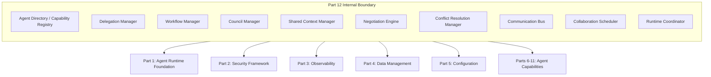
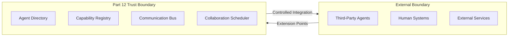
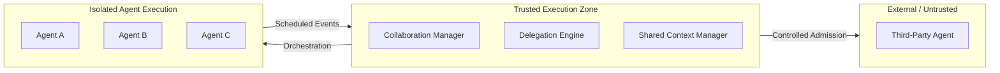
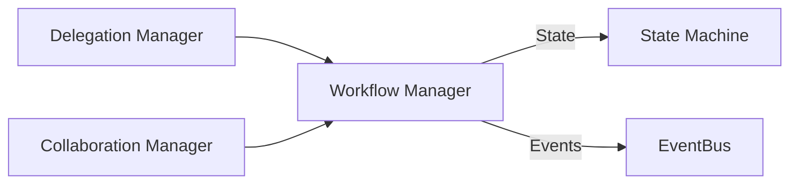
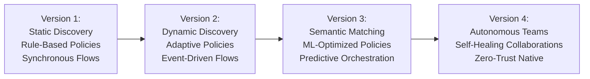

# Context Document for Part 12: Multi-Agent Collaboration Architecture

> **Document Role**
> Authoritative context document for Part 12 of the AI-OS system.
> Every numbered chapter in Part 12 (12.1–12.13) must conform to the boundaries, assumptions, terminology, and architectural vision defined here.

---

## Purpose

Part 12 defines the architectural framework for enabling safe, scalable, and efficient collaboration among autonomous agents within the AI-OS ecosystem.

This document establishes the contextual foundation that governs:
- how agents discover each other,
- how tasks are delegated and orchestrated,
- how shared state is managed,
- how conflicts and decisions are resolved,
- how collaboration policies are enforced.

It is the single source of truth for design assumptions, architectural boundaries, terminology, scope, dependencies, runtime expectations, security posture, and engineering philosophy for all Part 12 work.

---

## Scope

### In Scope
- Collaboration primitives and interaction patterns
- Architectural components for managing agent relationships
- Contracts for capability discovery and negotiation
- Mechanisms for shared state and context propagation
- Governance frameworks for collaboration policies
- Interfaces for integrating with existing AI-OS subsystems
- Runtime invariants, conformance criteria, and cross-part integration

### Out of Scope
- Individual agent internal architectures
- Specific AI/ML model implementations or inference algorithms
- Application-level business logic
- User interface components or end-user experiences
- Hardware or infrastructure provisioning details
- Legal or regulatory compliance details beyond architectural support
- Physical network topologies or cloud-provider specifics

---

## Architecture Vision

The collaboration architecture treats agents as first-class participants in a distributed system. The vision is to create a collaboration substrate that supports:

| Goal | Description |
|------|-------------|
| Dynamic team formation | Agents self-organize based on declared capabilities and availability |
| Trust-domain interoperability | Transparent collaboration across isolated security boundaries |
| Predictable behavior | Deterministic outcomes under varying load and failure conditions |
| Evolutionary compatibility | Collaboration patterns can evolve without breaking existing integrations |
| Decentralized governance | No single point of control or decision-making |
| Observable coordination | Every significant collaboration action is traceable and auditable |

---

## What Part 12 Defines

Part 12 defines:
1. Collaboration primitives and interaction patterns
2. Architectural components for managing agent relationships
3. Contracts for capability discovery and negotiation
4. Mechanisms for shared state and context propagation
5. Governance frameworks for collaboration policies
6. Interfaces for integrating with existing AI-OS subsystems
7. Schemas, invariants, and ADRs governing collaboration behavior

---

## What Part 12 Does NOT Define

Part 12 does not define:
1. Internal agent reasoning, learning, or memory implementations
2. Specific communication protocols beyond abstract interfaces
3. Data storage implementations for agent knowledge
4. User interaction models or experience design
5. Hardware, OS, or cloud provider specifics
6. Application business logic or domain workflows
7. Security mechanisms unrelated to inter-agent collaboration

---

## Architectural Boundaries

### Internal Boundaries

Part 12 operates as an internal collaboration layer bounded by:
- **Upper internal boundary**: Application orchestration layers (`Parts 9–11`) invoke collaboration services but do not implement collaboration mechanics
- **Lower internal boundary**: Agent execution runtimes (`Parts 1, 4, 5, 8`) provide execution substrate but do not enforce collaboration semantics
- **Lateral internal boundary**: Shared services (`EventBus`, security, logging, tracing) are consumed horizontally across components

### External Boundaries

External boundaries enforce isolation through:
- Well-defined extension points for third-party agent integration
- Capability and trust verification before admission
- Policy-controlled information egress
- No implicit trust across external boundaries

### Runtime Boundaries

| Boundary | Contract |
|----------|----------|
| Agent runtime | Agents execute within supervised, restartable runtimes with resource quotas |
| Collaboration session | Sessions are bounded in time and resource usage with explicit lifecycle phases |
| Shared context | Context is scoped to session/team/council with enforced access controls |
| EventBus | Events are consumed within subscription and security domain constraints |

### Security Boundaries

| Boundary | Enforcement Mechanism |
|----------|----------------------|
| Trust domain | Cryptographic identity verification before participation |
| Capability access | Least-privilege authorization via security framework (`Part 2`) |
| Context exposure | Role and policy-based access controls on shared context |
| Audit boundary | Immutable, tamper-evident logs for all cross-boundary interactions |

### Knowledge Boundaries

- **Agent-internal knowledge**: Not shared unless explicitly delegated or published
- **Shared context**: Session-scoped, versioned, and governed by access policies
- **Capability knowledge**: Advertised via standardized schemas; validated at admission
- **Organizational knowledge**: Exchanged only through controlled channels with policy oversight

### Execution Boundaries

Execution boundaries ensure:
- Agents execute in isolated runtimes with resource quotas
- Collaboration managers do not execute agent-internal logic
- External agents participate only through validated extension interfaces
- No direct execution privilege crosses trust boundaries without mediation

---

## Components Reused From Previous Parts

### Part 1: Agent Runtime Foundation
| Reused Concept | Usage in Part 12 |
|----------------|------------------|
| Agent lifecycle hooks | Registration, supervision, health checks, teardown |
| Resource isolation | Sandboxing and resource quota enforcement for collaboration sessions |
| Basic messaging | Foundation for agent-to-agent and agent-to-manager channels |
| Process supervision | Automatic recovery of failed collaboration participants |

### Part 2: Security Framework
| Reused Concept | Usage in Part 12 |
|----------------|------------------|
| Identity provider | Agent identity verification before collaboration admission |
| Token-based authentication | Secure agent-to-agent and agent-to-service authentication |
| Authorization policies | Collaboration-specific permission enforcement |
| Audit logging | Immutable records of collaboration actions and decisions |

### Part 3: Observability and Telemetry
| Reused Concept | Usage in Part 12 |
|----------------|------------------|
| Metrics collection | Collaboration latency, throughput, error rates, agent utilization |
| Distributed tracing | End-to-end collaboration flow tracing |
| Logging standards | Structured, context-rich logs for debugging and auditing |

### Part 4: Data Management and Storage
| Reused Concept | Usage in Part 12 |
|----------------|------------------|
| Shared storage interfaces | Backing store for shared context and collaboration state |
| Consistency models | Strong and eventual consistency guarantees for context propagation |
| Data access patterns | Optimized reads/writes for collaboration workloads |

### Part 5: Configuration and Extensibility
| Reused Concept | Usage in Part 12 |
|----------------|------------------|
| Dynamic configuration | Runtime tuning of collaboration policies and thresholds |
| Feature flags | Gradual rollout of collaboration mechanisms |
| Plugin integration | Extensible component registration for collaboration services |

### Part 6: Adaptive Behavior and Learning
| Reused Concept | Usage in Part 12 |
|----------------|------------------|
| Reasoning and inference APIs | Agent capability negotiation and task matching |
| Behavioral adaptation | Agents adapt collaboration strategies based on outcomes |

### Part 7: Knowledge Management and Learning
| Reused Concept | Usage in Part 12 |
|----------------|------------------|
| Learning interfaces | Collaborative model improvement and knowledge exchange |
| Experience replay | Capturing and reusing collaboration patterns |

### Part 8: Planning and Goal Decomposition
| Reused Concept | Usage in Part 12 |
|----------------|------------------|
| Planning services | Task decomposition and workflow definition |
| Goal hierarchy | Multi-level objective alignment in collaborations |
| Replanning mechanisms | Dynamic adaptation to changing collaboration conditions |

### Part 9: Specialized Agent Capabilities
| Reused Concept | Usage in Part 12 |
|----------------|------------------|
| Specialized agent interfaces | Discovery and composition of heterogeneous capabilities |
| Skill APIs | Standardized interfaces for capability invocation |

### Part 10: Advanced Cognitive Architectures
| Reused Concept | Usage in Part 12 |
|----------------|------------------|
| Meta-reasoning | Agents reason about collaboration strategies |
| Self-reflection | Agents improve collaboration behavior through reflection |

### Part 11: Monitoring and Observability
| Reused Concept | Usage in Part 12 |
|----------------|------------------|
| Health dashboards | Collaboration system health monitoring |
| Alerting | Anomaly detection in collaboration flows |
| SLI/SLO tracking | Service level objectives for collaboration performance |

---

## New Components Introduced

### Workflow Manager

| Attribute | Detail |
|-----------|--------|
| **Purpose** | Orchestrates multi-step collaborative processes involving multiple agents |
| **Responsibilities** | Defines and executes collaborative workflows; manages workflow state transitions and checkpoints; coordinates task dependencies between agents; handles workflow compensation and rollback |
| **Interfaces** | Workflow definition DSL; agent task assignment interface; collaboration event producer/consumer |
| **Dependencies** | Part 9 workflow primitives; EventBus; Delegation Manager; Collaboration Manager |
| **Future Evolution** | Dynamic workflow composition; adaptive workflow optimization based on historical performance; cross-session workflow pattern reuse |

### Council Manager

| Attribute | Detail |
|-----------|--------|
| **Purpose** | Governs agent collaboration policies and makes collective decisions |
| **Responsibilities** | Establishes and enforces collaboration policies; facilitates consensus-based decision making; manages agent reputation and trust scores; resolves escalated collaboration disputes |
| **Interfaces** | Policy definition and update mechanisms; agent voting and consensus protocols; audit trail for governance decisions; escalation pathways from Collaboration Manager |
| **Dependencies** | EventBus; Conflict Resolution Manager; Shared Context Manager; security framework for identity and authorization |
| **Future Evolution** | Hierarchical council structures; weighted voting based on expertise; machine-learning-assisted policy optimization |

### Collaboration Manager

| Attribute | Detail |
|-----------|--------|
| **Purpose** | Central coordinator for agent collaboration sessions |
| **Responsibilities** | Initiates and terminates collaboration sessions; matches agents to collaboration opportunities; monitors collaboration health and progress; enforces collaboration timeouts and resource limits |
| **Interfaces** | Agent capability discovery via Capability Registry; task delegation via Delegation Manager; shared context synchronization via Shared Context Manager; EventBus for collaboration signaling |
| **Dependencies** | All other collaboration components; Part 1 agent lifecycle; Part 2 security; EventBus |
| **Future Evolution** | Predictive session pre-staging; adaptive session resizing; cross-session learning for session optimization |

### Delegation Manager

| Attribute | Detail |
|-----------|--------|
| **Purpose** | Handles task assignment and responsibility transfer between agents |
| **Responsibilities** | Decomposes collaborative tasks into agent-executable units; matches task requirements to agent capabilities; tracks delegation chains and accountability; handles task reassignment and load balancing |
| **Interfaces** | Workflow Manager for task definitions; Capability Registry for agent matching; Collaboration Manager for session context; Negotiation Engine for task terms |
| **Dependencies** | Capability Registry; Agent Directory; Negotiation Engine; Workflow Manager |
| **Future Evolution** | Goal-aware delegation with outcome optimization; multi-hop delegation chains with accountability tracking; adaptive load balancing based on agent performance profiles |

### Capability Registry

| Attribute | Detail |
|-----------|--------|
| **Purpose** | Standardized taxonomy and validation of agent capabilities |
| **Responsibilities** | Defines capability schemas and versioning; validates agent capability declarations; maps capability requirements to agent offerings; maintains capability compatibility matrices |
| **Interfaces** | Agent self-description interfaces; Delegation Manager for requirement matching; Workflow Manager for task capability needs; Agent Directory for publication/subscription |
| **Dependencies** | Agent Directory; EventBus; configuration management for schema versions |
| **Future Evolution** | Semantic capability matching; capability evolution tracking; automated capability gap analysis |

### Agent Directory

| Attribute | Detail |
|-----------|--------|
| **Purpose** | Federated directory of available agents and their capabilities |
| **Responsibilities** | Registers and deregisters agents in the collaboration ecosystem; indexes agent capabilities, availability, and reputation; provides discovery APIs for collaboration matchmaking; handles agent versioning and compatibility tracking |
| **Interfaces** | Part 5 Service Discovery extensions; Capability Registry for detailed capability queries; EventBus for agent lifecycle events; security framework for directory access control |
| **Dependencies** | Part 5 service discovery; EventBus; Part 2 security; Part 11 monitoring for health |
| **Future Evolution** | Hierarchical/domain-scoped directories; reputation-based ranking; predictive availability forecasting |

### Negotiation Engine

| Attribute | Detail |
|-----------|--------|
| **Purpose** | Facilitates agreement on collaboration terms between agents |
| **Responsibilities** | Proposes and evaluates collaboration offers; handles counter-offers and negotiation rounds; establishes service level agreements (SLAs) for collaborations; records negotiation outcomes for audit and reuse |
| **Interfaces** | Delegation Manager for task proposals; agent communication channels; Shared Context for negotiation state; Conflict Resolution for deadlock handling |
| **Dependencies** | Shared Context Manager; Communication Bus; EventBus; Delegation Manager |
| **Future Evolution** | Multi-issue negotiation with automated concession strategies; learning-based offer optimization; negotiation protocol composition |

### Conflict Resolution Manager

| Attribute | Detail |
|-----------|--------|
| **Purpose** | Detects, mediates, and resolves collaboration conflicts |
| **Responsibilities** | Identifies resource, goal, and protocol conflicts; applies resolution strategies (compromise, escalation, arbitration); learns from resolution patterns to prevent recurrence; maintains conflict history for audit and improvement |
| **Interfaces** | Collaboration Manager for conflict detection; Negotiation Engine for mediated solutions; Council Manager for policy-based resolutions; EventBus for conflict event publication |
| **Dependencies** | EventBus; Council Manager; Negotiation Engine; Shared Context Manager; Part 2 security for authorization |
| **Future Evolution** | Predictive conflict detection; automated resolution with human-in-the-loop for high-severity conflicts; conflict pattern analytics for system-level improvement |

### Shared Context Manager

| Attribute | Detail |
|-----------|--------|
| **Purpose** | Manages distributed state shared among collaborating agents |
| **Responsibilities** | Maintains consistency of shared collaboration state; provides conflict-free replicated data types (CRDTs) where appropriate; handles context synchronization latency and partitioning; enforces access controls on shared context |
| **Interfaces** | Agent local state interfaces; EventBus for context change propagation; Collaboration Manager for session-scoped context; security framework for context access policies |
| **Dependencies** | EventBus; Part 4 storage interfaces; security framework; Part 11 observability for consistency monitoring |
| **Future Evolution** | Temporal context with rollback capabilities; context versioning and branching; automated context garbage collection and retention policies |

### Communication Bus

| Attribute | Detail |
|-----------|--------|
| **Purpose** | Reliable, ordered, secure communication fabric for collaboration events |
| **Responsibilities** | Routes events between collaboration components and agents; enforces ordering per collaboration session; provides dead-letter handling for failed deliveries; scales horizontally with collaboration load |
| **Interfaces** | Part 4 EventBus; event producer/consumer interfaces; subscription management; QoS configuration |
| **Dependencies** | Part 4 EventBus core; Part 2 security for authentication; Part 3 observability for monitoring |
| **Future Evolution** | Priority-based routing; event compression for bandwidth optimization; intelligent retry with backpressure |

### Collaboration Scheduler

| Attribute | Detail |
|-----------|--------|
| **Purpose** | Optimizes timing and resource allocation for collaborative activities |
| **Responsibilities** | Schedules collaboration sessions based on agent availability; allocates compute, memory, and bandwidth for collaborations; prioritizes collaborations based on business value and urgency; handles scheduling conflicts and preemption |
| **Interfaces** | Collaboration Manager for session requests; Agent Directory for availability information; Part 1 resource management; EventBus for scheduling events |
| **Dependencies** | Agent Directory; Collaboration Manager; Part 1 resource isolation; configuration management for scheduling policies |
| **Future Evolution** | Predictive scheduling with forecasting; multi-objective optimization; dynamic priority adjustment based on system state |

### Runtime Coordinator

| Attribute | Detail |
|-----------|--------|
| **Purpose** | Coordinates runtime execution of collaboration sessions and component lifecycles |
| **Responsibilities** | Manages collaboration component lifecycles; coordinates start/stop sequences for collaboration sessions; enforces runtime invariants; provides runtime health diagnostics |
| **Interfaces** | Part 1 agent lifecycle; Collaboration Manager; configuration management; health and readiness APIs |
| **Dependencies** | Part 1 agent runtime; EventBus; Part 11 monitoring; Part 2 security for coordination authorization |
| **Future Evolution** | Hot component replacement; rolling upgrades of collaboration services; runtime self-healing for collaboration components |

---

## Runtime Assumptions

1. **Supervised execution**: Agent runtimes are supervised and restartable (`Part 1`)
2. **Eventual network healing**: Network partitions may occur but are eventually resolved
3. **Clock synchronization**: Clocks are synchronized within acceptable tolerances (NTP or equivalent)
4. **Behavioral correctness**: Agents adhere to declared capabilities and behave according to collaboration contracts
5. **Session lifecycle**: Collaboration sessions have defined lifecycles with explicit cleanup
6. **EventBus guarantees**: The EventBus provides at-least-once delivery for collaboration-critical events
7. **Resource sufficiency**: Sufficient compute and network resources exist for baseline collaboration loads
8. **Isolation integrity**: Resource quotas and sandboxing enforce execution boundaries

---

## Security Assumptions

1. **Identity verifiability**: Agent identities are verifiable via cryptographic tokens (`Part 2`)
2. **Encrypted channels**: Communication channels between agents are encrypted and authenticated
3. **Trusted managers**: Collaboration managers operate within trusted security domains
4. **Immutable audit**: Audit trails are immutable and tamper-evident
5. **Behavioral monitoring**: Malicious or anomalous agent behavior is detectable through monitoring
6. **Centralized policy**: Security policies are centrally managed and consistently enforced
7. **Least privilege**: Agents are granted only the permissions necessary for their delegated tasks
8. **Zero implicit trust**: No trust is assumed across boundaries; every interaction is verified

---

## EventBus Assumptions

1. **Delivery semantics**: At-least-once delivery for collaboration-critical events
2. **Ordering**: Event ordering is preserved per collaboration session
3. **Schema evolution**: Event schemas are versioned and backward compatible
4. **Latency**: EventBus latency remains within collaboration-acceptable thresholds
5. **Dead-letter handling**: Persistently failed collaboration events are routed to dead-letter queues
6. **Scalability**: EventBus scales horizontally with collaboration load
7. **Partition tolerance**: EventBus continues operating through transient network partitions
8. **Monitoring**: EventBus health and latency are observable via standard monitoring channels

---

## Collaboration Principles

1. **Autonomy**: Agents retain control over their internal state and decisions
2. **Transparency**: Collaboration intentions and capabilities are discoverable
3. **Accountability**: Actions in collaborations are attributable to specific agents
4. **Flexibility**: Collaboration patterns adapt to changing requirements
5. **Efficiency**: Collaboration overhead is minimized relative to value delivered
6. **Resilience**: Collaborations gracefully handle partial failures
7. **Governance**: Collaboration adheres to organizational policies and regulations
8. **Evolution**: Collaboration mechanisms improve through feedback and learning

---

## Cross-Part Dependencies

| Part | Interface / Guarantee | Usage in Part 12 |
|------|-----------------------|------------------|
| Part 1 | Agent lifecycle hooks, resource isolation, basic messaging | Agent registration, lifecycle events, secure execution |
| Part 2 | Identity provider, token-based auth, ACL enforcement, audit | Secures capability discovery, task delegation, shared context access |
| Part 3 | Metrics, tracing, logging standards | Instruments collaboration workflows, measures latency, detects anomalies |
| Part 4 | Shared storage interfaces, consistency models, EventBus | Backing store for shared context; primary collaboration communication fabric |
| Part 5 | Dynamic configuration, feature flags, service discovery | Tunes collaboration policies; provides agent location and availability |
| Part 6 | Reasoning and inference APIs | Enables agents to negotiate tasks based on inferred capabilities |
| Part 7 | Learning and model management interfaces | Facilitates knowledge exchange and collaborative model improvement |
| Part 8 | Planning and goal decomposition services | Supplies primitives for workflow orchestration and task delegation |
| Part 9 | Specialized agent capabilities | Allows discovery and composition of heterogeneous agents |
| Parts 10–11 | Advanced cognitive architectures, meta-reasoning, monitoring | Provides sophisticated agents for councils and complex workflows; observability |

---

## Design Constraints

| Constraint | Requirement |
|------------|-------------|
| Interaction latency | ≤ 100ms for 95% of collaboration interactions |
| Concurrency | Support up to 10,000 concurrently collaborating agents |
| Recovery time | Collaboration state recoverable within 30 seconds after agent failure |
| Security overhead | Must not exceed 15% of collaboration processing time |
| Interface neutrality | All collaboration interfaces must be technology-agnostic and language-neutral |
| Backward compatibility | Maintained for at least two major versions |
| Deployment independence | Collaboration components must be independently deployable and scalable |
| Event ordering | Preserved per collaboration session through the Communication Bus |
| Audit completeness | All cross-boundary actions must produce tamper-evident audit records |

---

## Out-of-Scope Topics

The following topics are explicitly outside the scope of Part 12 and must not be addressed within Part 12 chapters:
1. Specific AI/ML model training or inference algorithms
2. Natural language processing for agent communication
3. Agent personality, persona, or behavioral modeling
4. User-facing collaboration interfaces or dashboards
5. Legal or regulatory compliance details beyond architectural support
6. Physical infrastructure or cloud provider specifics
7. Detailed performance benchmarking methodologies
8. Specific programming language or framework mandates
9. Hardware acceleration or GPU-specific optimizations

---

## Design Philosophy

The collaboration architecture is guided by these philosophical commitments:

1. **Simplicity**: Prefer simple, understandable mechanisms over complex ones
2. **Explicitness**: Make collaboration intentions, contracts, and policies visible and clear
3. **Modularity**: Design components with single responsibilities and well-defined interfaces
4. **Evolutionability**: Enable gradual improvement without disruptive changes
5. **Fault Tolerance**: Assume failures are common and design accordingly
6. **Observability**: Build in instrumentation for monitoring, debugging, and auditing
7. **Security-First**: Integrate security considerations at every layer and boundary
8. **Agent-Centric**: Design from the perspective of agent autonomy and capabilities
9. **Pragmatism**: Balance idealism with practical implementation concerns
10. **Feedback-Driven**: Incorporate learning from actual collaboration patterns into system evolution

---

## Engineering Guidelines

1. **Contract-first design**: All component interfaces must be specified before implementation
2. **Explicit error handling**: All failure modes must be explicitly handled; no silent failures
3. **Event-driven architecture**: Prefer event-driven interaction over synchronous request-reply where latency permits
4. **Idempotency**: All collaboration operations must be idempotent where possible
5. **Backpressure**: Components must respect backpressure signals to prevent overload
6. **Graceful degradation**: Collaboration must degrade gracefully under partial failure
7. **Schema versioning**: All schemas must include version information; backward compatibility is required
8. **Security by default**: Secure configurations are defaults; insecure options require explicit opt-in
9. **Testing at boundaries**: Integration and contract tests are mandatory at architectural boundaries
10. **Documentation coupling**: Every component must have a companion component specification document
11. **Minimal coupling**: Components communicate through well-defined interfaces; internal changes must not leak
12. **Consistent naming**: Follow the naming conventions defined in the README

---

## Best Practices

1. **Schema evolution**: Use additive-only schema changes; deprecate before removing fields
2. **Event naming**: Use verb-object naming convention (e.g., `TaskDelegated`, not `Delegation`)
3. **Capability declarations**: Agents must declare capabilities honestly and completely
4. **Session isolation**: Collaboration sessions must not leak state to unauthorized sessions
5. **Audit completeness**: Log all cross-component and cross-boundary interactions
6. **Timeout discipline**: Define explicit timeouts for all external interactions
7. **Retry with backoff**: Use exponential backoff with jitter for transient failures
8. **Circuit breakers**: Protect components from cascading failures
9. **Health endpoints**: Every collaboration component must expose a health check
10. **Graceful shutdown**: Components must drain in-flight work before shutdown
11. **Context lifecycle**: Shared context must have explicit creation, expiration, and cleanup
12. **Policy as code**: Collaboration policies must be version-controlled and reviewable

---

## Future Evolution

| Evolution Stage | Key Enhancements |
|-----------------|------------------|
| Near term | Semantic capability matching; automated conflict resolution for common conflicts; enhanced monitoring dashboards |
| Medium term | ML-optimized delegation strategies; predictive scheduling; cross-session learning for workflow optimization |
| Long term | Autonomous team self-formation; self-healing collaborations; zero-trust-native inter-agent security; emergent collaboration patterns |

---

*End of Context Document for Part 12 — Multi-Agent Collaboration Architecture*
