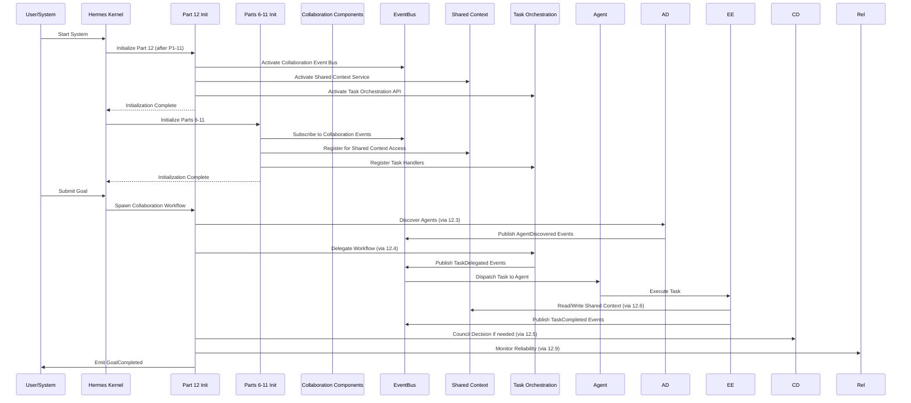

# Dependency Map for Part 12: Multi-Agent Collaboration Architecture

## 1. Introduction

This document maps the dependencies of Part 12 (Multi-Agent Collaboration Architecture) within the AI-OS ecosystem. It illustrates how Part 12 relies on and extends the foundational capabilities defined in Parts 1–11, introduces new contracts for later parts (13–15), and manages internal collaboration components.

Part 12 sits at the collaboration layer, building upon the core runtime, agent model, security, observability, and data management from Parts 1–11 to enable coherent, goal-directed behavior from collections of autonomous agents.

## 2. Dependency Matrix

The matrix below shows dependencies between key entities. An arrow (→) indicates that the row entity depends on the column entity for specific interfaces or guarantees.

| Depends On \ Entity | P1  | P2  | P3  | P4  | P5  | P6  | P7  | P8  | P9  | P10 | P11 | P12 Components | Runtime | Memory | Knowledge | Security | EventBus | Planning | Execution | Observability | P13–P15 |
|---------------------|-----|-----|-----|-----|-----|-----|-----|-----|-----|-----|-----|----------------|---------|--------|-----------|----------|----------|----------|-----------|---------------|---------|
| **P12 Components**  | →   | →   | →   | →   | →   | →   | →   | →   | →   | →   | →   | ↔              | →       | →      →         | →         | →        | →        | →        | →             | →       | →              |
| **Runtime**         |     |     |     |     |     |     |     |     |     |     |     | ←              |         |        |           |          |          |          |           |               |         |
| **Memory**          |     |     |     | ←   |     |     |     |     |     |     |     | ←              |         |        |           |          |          |          |           |               |         |
| **Knowledge**       |     |     |     |     |     | ←   | ←   |     |     |     |     | ←              |         | ←      |           |          |          |          |           |               |         |
| **Security**        |     | ←   |     |     |     |     |     |     |     |     |     | ←              |         |        |           |          |          |          |           |               |         |
| **EventBus**        | ←   |     |     |     |     |     |     |     |     |     |     | ←              |         |        |           |          |          |          |           |               |         |
| **Planning**        |     |     |     |     |     |     |     |     |     |     |     | ←              |         |        |           |          |          |          |           |               |         |
| **Execution**       |     |     |     |     |     |     |     |     |     |     |     | ←              |         |        |           |          |          |          |           |               |         |
| **Observability**   |     |     | ←   |     |     |     |     |     |     |     |     | ←              |         |        |           |          |          |          | ←         |               |         |
| **P13–P15**         |     |     |     |     |     |     |     |     |     |     |     | →              |         |        |           |          |          |          |           |               |         |

### Key:
- **P1–P11**: Parts 1–11 of AI-OS Architecture Specification
- **P12 Components**: Internal components of Part 12 (Sections 12.2–12.10)
- **→**: Dependency (row depends on column)
- **←**: Reverse dependency (column depends on row)
- **��↔**: Bidirectional dependency
- **Blank**: No direct dependency

### Notes on Specific Dependencies:

1. **P12 Components depend on all P1–P11**:
   - Part 1: Agent lifecycle hooks, basic messaging
   - Part 2: Security (identity, auth, ACL)
   - Part 3: Observability (metrics, tracing, logging)
   - Part 4: Shared storage (for context/knowledge)
   - Part 5: Dynamic configuration (for policies)
   - Part 6: Reasoning/inference APIs (for task negotiation)
   - Part 7: Learning/model management (for knowledge exchange)
   - Part 8: Planning/goal decomposition (for workflow orchestration)
   - Part 9: Specialized capabilities (for heterogeneous agents)
   - Part 10–11: Advanced cognitive architectures (for councils/complex workflows)

2. **Bidirectional dependencies within P12 Components**:
   - Collaboration Architecture (12.2) integrates all other components
   - Shared Context and Knowledge Exchange (12.6) is used by most components
   - Security Architecture (12.10) is a cross-cutting concern

3. **Reverse dependencies from P1–P11 to P12**:
   - Parts 6–11 depend on P12 for:
     - Collaboration Event Bus (inter-agent signaling)
     - Shared Context Service (knowledge exchange)
     - Task Orchestration API (workflow distribution)
   - This enables Parts 6–11 to leverage collaboration features while providing specialized capabilities back to P12

4. **Runtime, Memory, etc.**:
   - Runtime (Hermes Kernel) is foundational: P12 depends on it, but Runtime does not depend on P12
   - Memory/Knowledge: P12's shared context relies on memory subsystems
   - Security: P12 extends Part 2 security with agent-specific controls
   - EventBus: P12 uses it for all inter-agent communication
   - Planning/Execution/Observability: P12 depends on Parts 1–11 foundations but enhances them for collaboration

5. **Future Parts (P13–P15)**:
   - P12 provides contracts (Collaboration Event Bus, Shared Context Service, Task Orchestration API) that future parts may depend on
   - No dependencies from P12 to future parts in v1.0 (layers are strictly ordered)

## 3. Mermaid Dependency Graph

```mermaid
flowchart TB
    %% Foundational Layers (Parts 1-11)
    subgraph P1["Part 1: Core Runtime"]
        A1[Agent Model]
        A2[Lifecycle Hooks]
        A3[Basic Messaging]
    end
    
    subgraph P2["Part 2: Security"]
        B1[Identity & Auth]
        B2[Authorization]
        B3[Audit]
    end
    
    subgraph P3["Part 3: Observability"]
        C1[Metrics]
        C2[Tracing]
        C3[Logging]
    end
    
    subgraph P4["Part 4: Data Management"]
        D1[Shared Storage]
        D2[Consistency Models]
    end
    
    subgraph P5["Part 5: Configuration"]
        E1[Dynamic Config]
        E2[Feature Flags]
    end
    
    subgraph P6["Part 6: Reasoning"]
        F1[Inference APIs]
        F2[Task Negotiation]
    end
    
    subgraph P7["Part 7: Learning"]
        G1[Model Management]
        G2[Knowledge Exchange]
    end
    
    subgraph P8["Part 8: Planning"]
        H1[Goal Decomposition]
        H2[Workflow Primitives]
    end
    
    subgraph P9["Part 9: Specialized Agents"]
        I1[Vision/NLP/etc.]
        I2[Heterogeneous Agents]
    end
    
    subgraph P1011["Parts 10-11: Advanced Cognition"]
        J1[Meta-Reasoning]
        J2[Council Participants]
    end
    
    %% Part 12 Components
    subgraph P12["Part 12: Collaboration Architecture"]
        K1[12.2: Collaboration Architecture]
        K2[12.3: Agent Discovery]
        K3[12.4: Task Delegation]
        K4[12.5: Council Decisions]
        K5[12.6: Shared Context]
        K6[12.7: Multi-Agent Comm]
        K7[12.8: Resource Coordination]
        K8[12.9: Reliability/Performance]
        K9[12.10: Security]
    end
    
    %% Cross-Cutting Concerns
    subgraph RUNTIME["Runtime"]
        L1[Hermes Kernel]
        L2[Core Components]
        L3[EventBus]
    end
    
    subgraph MEMORY["Memory System"]
        M1[Five-Tier Memory]
        M2[Working Memory]
        M3[Engineering Intelligence]
    end
    
    subgraph KNOWLEDGE["Knowledge Base"]
        N1[Shared Context]
        N2[Learning Materials]
        N3[Best Practices]
    end
    
    subgraph SECURITY["Security"]
        S1[Base Security (P2)]
        S2[Agent Security (P12.10)]
    end
    
    subgraph EVENTBUS["EventBus"]
        EB[Event Bus]
    end
    
    subgraph PLANNING["Planning"]
        P1[Part 8 Planning]
        P2[Task Orchestration API]
    end
    
    subgraph EXECUTION["Execution"]
        E1[Task Execution]
        E2[Workflow Orchestration]
    end
    
    subgraph OBSERVABILITY["Observability"]
        O1[Base Observability (P3)]
        O2[Collaboration Metrics]
    end
    
    subgraph FUTURE["Future Parts (13-15)"]
        F1[Domain Applications]
        F2[Vertical Stacks]
        F3[Extensions]
    end
    
    %% Dependencies: Parts 1-11 → Part 12
    P1 --> P12
    P2 --> P12
    P3 --> P12
    P4 --> P12
    P5 --> P12
    P6 --> P12
    P7 --> P12
    P8 --> P12
    P9 --> P12
    P1011 --> P12
    
    %% Dependencies: Part 12 → Parts 6-11 (reverse)
    P12 --> P6
    P12 --> P7
    P12 --> P8
    P12 --> P9
    P12 --> P1011
    
    %% Internal Part 12 dependencies
    K1 --> K2
    K1 --> K3
    K1 --> K4
    K1 --> K5
    K1 --> K6
    K1 --> K7
    K1 --> K8
    K1 --> K9
    K2 --> K5
    K2 --> K6
    K3 --> K5
    K3 --> K6
    K4 --> K5
    K4 --> K6
    K5 --> K6
    K6 --> K1
    K6 --> K2
    K6 --> K3
    K6 --> K4
    K7 --> K1
    K7 --> K3
    K7 --> K4
    K8 --> K3
    K8 --> K4
    K8 --> K5
    K9 --> K1
    K9 --> K2
    K9 --> K3
    K9 --> K4
    K9 --> K5
    K9 --> K6
    K9 --> K7
    K9 --> K8
    
    %% Dependencies: Part 12 → Cross-Cutting
    P12 --> RUNTIME
    P12 --> MEMORY
    P12 --> KNOWLEDGE
    P12 --> SECURITY
    P12 --> EVENTBUS
    P12 --> PLANNING
    P12 --> EXECUTION
    P12 --> OBSERVABILITY
    
    %% Dependencies: Cross-Cutting → Part 12 (where applicable)
    RUNTIME -->|Foundational| P12
    MEMORY -->|Storage Backend| P12
    KNOWLEDGE -->|Content Source| P12
    SECURITY -->|Base Policies| P12
    EVENTBUS -->|Communication Substrate| P12
    PLANNING -->|Goal Decomposition| P12
    EXECUTION -->|Task Execution| P12
    OBSERVABILITY -->|Monitoring| P12
    
    %% Dependencies: Part 12 → Future Parts
    P12 --> FUTURE
    
    %% Styling
    classDef part fill:#e3f2fd,stroke:#1565c0,stroke-width:1px;
    classDef component fill:#bbdefb,stroke:#0d47a1,stroke-width:1px;
    classDef runtime fill:#fff3e0,stroke:#ef6c00,stroke-width:1px;
    classDef memory fill:#e8f5e8,stroke:#2e7d32,stroke-width:1px;
    classDef knowledge fill:#f3e5f5,stroke:#6a1b9a,stroke-width:1px;
    classDef security fill:#ffebee,stroke:#c62828,stroke-width:1px;
    classDef eventbus fill:#e3f2fd,stroke:#1565c0,stroke-width:1px;
    classDef planning fill:#fff3e0,stroke:#ef6c00,stroke-width:1px;
    classDef execution fill:#e8f5e8,stroke:#2e7d32,stroke-width:1px;
    classDef observability fill:#f3e5f5,stroke:#6a1b9a,stroke-width:1px;
    classDef future fill:#fff3e0,stroke:#ef6c00,stroke-width:1px;
    
    class P1,P2,P3,P4,P5,P6,P7,P8,P9,P1011 part;
    class K1,K2,K3,K4,K5,K6,K7,K8,K9 component;
    class L1,L2,L3 runtime;
    class M1,M2,M3 memory;
    class N1,N2,N3 knowledge;
    class S1,S2 security;
    class EB eventbus;
    class P1,P2 planning;
    class E1,E2 execution;
    class O1,O2 observability;
    class F1,F2,F3 future;
```

## 4. Layer Diagram

```mermaid
flowchart TB
    %% Layers from bottom (foundational) to top (specialized)
    subgraph L1["Layer 1: Foundational Runtime"]
        direction TB
        HR[Hermes Kernel<br/>Core Components<br/>EventBus]
        SM[Memory System<br/>Five-Tier Storage]
        BS[Base Security<br/>(Part 2)]
        BO[Base Observability<br/>(Part 3)]
        CF[Configuration System<br/>(Part 5)]
    end
    
    subgraph L2["Layer 2: Core Services"]
        direction TB
        AM[Agent Model<br/>(Part 1)]
        DS[Data Management<br/>(Part 4)]
        RS[Reasoning/Learning<br/>(Parts 6-7)]
        PL[Planning Services<br/>(Part 8)]
    end
    
    subgraph L3["Layer 3: Collaboration Infrastructure"]
        direction TB
        EBus[Collaboration Event Bus<br/>(Part 12)]
        SContext[Shared Context Service<br/>(Part 12)]
        TOrch[Task Orchestration API<br/>(Part 12)]
        Sec[Agent Security<br/>(Part 12.10)]
    end
    
    subgraph L4["Layer 4: Collaboration Components"]
        direction TB
        AD[Agent Discovery<br/>(Part 12.3)]
        TD[Task Delegation<br/>(Part 12.4)]
        CD[Council Decisions<br/>(Part 12.5)]
        RC[Resource Coordination<br/>(Part 12.8)]
        Rel[Reliability/Performance<br/>(Part 12.9)]
    end
    
    subgraph L5["Layer 5: Specialized Agent Capabilities"]
        direction TB
        Spec[Specialized Agents<br/>(Part 9)]
        AdvC[Advanced Cognition<br/>(Parts 10-11)]
    end
    
    subgraph L6["Layer 6: Domain Applications"]
        direction TB
        DomApps[Domain Applications<br/>(Parts 13-15)]
    end
    
    %% Layer dependencies (downward only)
    L2 --> L1
    L3 --> L1
    L3 --> L2
    L4 --> L1
    L4 --> L2
    L4 --> L3
    L5 --> L1
    L5 --> L2
    L5 --> L3
    L5 --> L4
    L6 --> L1
    L6 --> L2
    L6 --> L3
    L6 --> L4
    L6 --> L5
    
    %% Styling
    classDef layer1 fill:#e8f5e8,stroke:#2e7d32,stroke-width:2px;
    classDef layer2 fill:#fff3e0,stroke:#ef6c00,stroke-width:2px;
    classDef layer3 fill:#f3e5f5,stroke:#6a1b9a,stroke-width:2px;
    classDef layer4 fill:#e3f2fd,stroke:#1565c0,stroke-width:2px;
    classDef layer5 fill:#ffebee,stroke:#c62828,stroke-width:2px;
    classDef layer6 fill:#e8f5e8,stroke:#2e7d32,stroke-width:2px;
    
    class L1 layer1;
    class L2 layer2;
    class L3 layer3;
    class L4 layer4;
    class L5 layer5;
    class L6 layer6;
```

## 5. Circular Dependency Prevention

While Part 12 exhibits bidirectional dependencies with Parts 6–11, these are **architecturally safe** due to:

1. **Separation of Concerns**:
   - Part 12 depends on Parts 6–11 for **specialized capabilities** (reasoning, learning, planning, etc.)
   - Parts 6–11 depend on Part 12 for **collaboration infrastructure** (event bus, shared context, task orchestration)

2. **Initialization Order Enforcement**:
   - Parts 1–5 initialize first (foundational runtime, security, observability, data, configuration)
   - Parts 6–11 initialize next (specialized agent capabilities)
   - Part 12 initializes after Parts 1–11 but **before** Parts 6–11 can use its collaboration services
   - Collaboration services (Event Bus, Shared Context, Task Orchestration) are made available only after Part 12 initialization completes

3. **Interface Contracts**:
   - Part 12 provides **stable interfaces** (via ADRs and schema definitions) that Parts 6–11 depend on
   - Parts 6–11 consume these interfaces without modifying Part 12 internals
   - No circular initialization: Part 12 does not wait for Parts 6–11 to initialize

4. **Dependency Inversion**:
   - Part 12 defines **abstractions** (e.g., `ICollaborationEventBus`, `ISharedContextService`)
   - Parts 6–11 depend on these abstractions
   - Part 12 provides the concrete implementations
   - Prevents tight coupling and initialization cycles

5. **Runtime Validation**:
   - Conformance tooling verifies that:
     - No Part 6–11 component attempts to use Part 12 services before Part 12 initialization
     - Part 12 does not invoke Parts 6–11 specialized capabilities during its own initialization
   - Violations are caught at build-time or early runtime

This creates a **layered dependency graph** where collaboration infrastructure (Part 12) sits between foundational services (Parts 1–5) and specialized agent capabilities (Parts 6–11), enabling safe bidirectional interaction.

## 6. Dependency Validation Rules

The following rules govern dependency validation for Part 12:

### 6.1 Structural Rules
- **R1**: Part 12 **MUST NOT** depend on Parts 13–15 (future layers)
- **R2**: Part 12 Components **MUST** depend only on:
  - Parts 1–11 (foundational)
  - Other Part 12 Components (via well-defined interfaces)
  - Cross-cutting concerns (Runtime, Memory, etc.)
- **R3**: Cross-cutting concerns **MUST NOT** depend on Part 12 Components
  - Exception: They may provide interfaces that Part 12 implements (e.g., Memory backends)

### 6.2 Initialization Rules
- **R4**: Part 12 **MUST** initialize after all Parts 1–11 Core Components and Core Managers
- **R5**: Part 12 Collaboration Services (Event Bus, Shared Context, Task Orchestration) 
  **MUST** be available before any Part 6–11 component initializes
- **R6**: Part 12 Components **MUST** initialize in dependency order:
  1. Agent Discovery (12.3)
  2. Shared Context (12.6)
  3. Collaboration Architecture (12.2)
  4. Task Delegation (12.4)
  5. Multi-Agent Communication (12.7)
  6. Resource Coordination (12.8)
  7. Security (12.10)
  8. Council Decisions (12.5)
  9. Reliability/Performance (12.9)

### 6.3 Interface Rules
- **R7**: All inter-component communication in Part 12 **MUST** use the Collaboration Event Bus
- **R8**: Shared Context access **MUST** go through the Shared Context Service API
- **R9**: Task delegation **MUST** use the Task Orchestration API
- **R10**: Security policies **MUST** be enforced via the Security Architecture component

### 6.4 Conformance Rules
- **R11**: Static analysis **MUST** verify no illegal imports (e.g., Part 12 importing Part 13)
- **R12**: Integration tests **MUST** validate initialization order and service availability
- **R13**: Chaos tests **MUST** verify failure isolation between layers
- **R14**: Documentation **MUST** specify each dependency's purpose, direction, interface, criticality, failure impact, recovery strategy, compatibility, and future evolution

### 6.5 Versioning Rules
- **R15**: Part 12 interfaces **MUST** follow semantic versioning (MAJOR.MINOR.PATCH)
- **R16**: Breaking changes **MUST** increment MAJOR version and provide migration paths
- **R17**: Future Parts (13–15) **MUST** depend on specific Part 12 interface versions
- **R18**: Part 12 **MUST NOT** depend on unstable or experimental interfaces from future parts

## 7. Runtime Dependency Flow



### Key Flow Points:
1. **Initialization Sequence**:
   - Kernel initializes Parts 1–11 first
   - Part 12 initializes Collaboration Foundation (Event Bus, Shared Context, Task Orchestration)
   - Parts 6–11 initialize next, subscribing to Part 12 services

2. **Runtime Collaboration**:
   - Goals trigger workflow spawning in Part 12
   - Agent discovery uses Part 12.3 (Agent Discovery)
   - Task delegation uses Part 12.4 (Task Delegation) and 12.8 (Resource Coordination)
   - Knowledge exchange uses Part 12.6 (Shared Context)
   - Inter-agent communication uses Part 12.7 (Multi-Agent Communication) over EventBus
   - Decisions use Part 12.5 (Council Decisions)
   - Monitoring uses Part 12.9 (Reliability/Performance)

3. **Failure Handling**:
   - Failures detected by Part 12.9 trigger recovery procedures
   - Security violations handled by Part 12.10
   - EventBus ensures fault isolation and retry semantics

## 8. Conclusion

This dependency map establishes that Part 12:
- **Depends on** Parts 1–11 for foundational runtime, security, observability, data management, configuration, reasoning, learning, planning, and specialized agent capabilities
- **Provides** collaboration infrastructure (Event Bus, Shared Context Service, Task Orchestration API) that Parts 6–11 and future parts (13–15) depend on
- **Maintains safe bidirectional dependencies** with Parts 6–11 through layered initialization and interface contracts
- **Enforces strict unidirectional dependencies** with cross-cutting concerns and future parts
- **Implements comprehensive validation rules** to prevent architectural drift and ensure evolvability

Part 12 successfully bridges the foundational AI-OS kernel with specialized agent capabilities to enable scalable, secure, and observable multi-agent collaboration—forming the cohesive cooperation layer necessary for goal-driven AI agency.

## 9. Dependency Governance Enhancement

### 9.1 Dependency Ownership Model
Each dependency in Part 12 has clearly defined ownership:

- **Foundational Dependencies (Parts 1-11)**: Owned by respective Part working groups; Part 12 acts as consumer only
- **Cross-Cutting Concerns**: Jointly owned by Platform Team and Part 12 Collaboration Team
- **Internal Part 12 Dependencies**: Owned by Part 12 Component Teams with clear interface contracts
- **Reverse Dependencies (Parts 6-11)**: Parts 6-11 own their specialized capabilities; Part 12 owns collaboration service contracts
- **Future Part Dependencies (13-15)**: Part 12 owns service contracts; future parts own implementation compliance

Ownership is tracked via ADRs in `../adrs.md` with clear RACI matrices for each dependency type.

### 9.2 Dependency Categories
Dependencies are classified into five governance categories:

1. **Foundation Dependencies** (Parts 1-5): Immutable core services requiring backward compatibility
2. **Enhancement Dependencies** (Parts 6-11): Capability extensions requiring version-conscious integration
3. **Internal Collaboration** (Part 12 Components): Tightly-coupled but interface-bound components
4. **Cross-Cutting Services**: Platform-level services with strict isolation boundaries
5. **Forward Contracts** (Parts 13-15): Published interfaces requiring strict versioning governance

Each category has distinct change control procedures and validation requirements.

### 9.3 Critical Path Analysis
The critical initialization path for Part 12 is:
```
Parts 1-5 → Part 12 Foundation Services (EventBus, SharedContext, TaskOrchestration) → Parts 6-11 → Part 12 Collaboration Components
```

Any delay in Parts 1-5 blocks the entire system. Part 12 Foundation Services must complete before Parts 6-11 can begin initialization. Collaboration Components can initialize in parallel after foundation services are available.

### 9.4 Version Compatibility Matrix
Part 12 maintains compatibility matrices for all dependencies:

| Dependency | Min Version | Max Version | Compatibility Notes |
|------------|-------------|-------------|---------------------|
| Part 1 Runtime | v2.1.0 | <v3.0.0 | Semver compatible within major |
| Part 2 Security | v1.8.0 | <v2.0.0 | Backward compatible patches |
| Part 3 Observability | v2.0.0 | <v3.0.0 | Metric schema stability |
| Part 4 Data Management | v1.5.0 | <v2.0.0 | Storage API compatibility |
| Part 5 Configuration | v3.2.0 | <v4.0.0 | Feature flag format stable |
| Part 6 Reasoning | v2.1.0 | <v3.0.0 | Inference API versioning |
| Part 7 Learning | v1.9.0 | <v2.0.0 | Model exchange formats |
| Part 8 Planning | v2.3.0 | <v3.0.0 | Goal decomposition schema |
| Part 9 Specialized Agents | v1.7.0 | <v2.0.0 | Capability negotiation |
| Parts 10-11 | v1.4.0 | <v2.0.0 | Advanced cognition protocols |
| Cross-Cutting | LTS | LTS | Platform LTS alignment |

### 9.5 Change Impact Analysis
All proposed dependency changes require impact analysis covering:
- **Breaking Change Detection**: Semver comparison and API diff analysis
- **Propagation Assessment**: Transitive impact on dependent components
- **Migration Path Validation**: Existence and testing of upgrade procedures
- **Performance Impact**: Benchmarking of latency/throughput changes
- **Security Implications**: Threat modeling of interface changes
- **Operational Effects**: Monitoring and alerting adjustments

Impact analyses are stored in `../project-knowledge/impact-analyses/` and referenced in ADRs.

### 9.6 Circular Dependency Detection
Enhanced detection mechanisms include:
- **Build-Time Analysis**: Dependency graph scanning for illegal cycles
- **Runtime Validation**: Initialization sequence monitoring with timeout guards
- **Architecture Linting**: Custom ESLint rules preventing unauthorized imports
- **Dependency Hell Prevention**: Version constraint validation in build pipelines
- **Interface Seal Verification**: Ensuring abstractions don't leak implementation details

Violations block PR merges and require architectural review board approval.

### 9.7 Risk Assessment
Dependency risks are categorized and mitigated:

| Risk Category | Probability | Impact | Mitigation Strategy |
|---------------|-------------|---------|---------------------|
| Version Conflict | Medium | High | Dependency locking + CI validation |
| Interface Drift | Low | High | Contract testing + schema validation |
| Initialization Race | Medium | Medium | Dependency ordering enforcement |
| Performance Degradation | Low | Medium | Benchmarking in dependency tests |
| Security Exposure | Low | Critical | Interface scanning + pen testing |
| Documentation Gap | Medium | Low | Automated doc generation + review |

Risk assessments are reviewed quarterly by the Architecture Review Board.

### 9.8 Evolution Strategy
Part 12 follows a staged evolution approach:

1. **Stability Phase** (Current): Focus on backward compatibility and bug fixes
2. **Extension Phase**: Careful addition of non-breaking features via feature flags
3. **Migration Phase**: Deprecation notices for legacy interfaces (6-month notice)
4. **Sunset Phase**: Removal of deprecated interfaces after migration period

Evolution is guided by:
- **Deprecation Policy**: 2-release deprecation notice for breaking changes
- **Feature Flag Lifecycle**: Flags removed within 3 releases
- **Interface Stability**: Core collaboration interfaces guaranteed for 24 months
- **Experimental Features**: Isolated in `/experimental` namespace with opt-in usage

### 9.9 Dependency Validation
Beyond basic validation rules, Part 12 implements:

- **Contract Testing**: Consumer-driven contract tests for all interfaces
- **Integration Test Suites**: End-to-end validation of dependency chains
- **Performance Regression Testing**: Benchmarking against dependency baselines
- **Security Scanning**: Dependency vulnerability scanning with SBoM generation
- **Chaos Engineering**: Fault injection testing of dependency failures
- **Observability Validation**: Dependency health checks in runtime monitoring

Validation results are published to `../project-knowledge/validation-reports/`.

### 9.10 Dependency Lifecycle
Each dependency follows a standardized lifecycle:

1. **Proposal**: Architecture Review Board review and approval
2. **Implementation**: Component teams implement with interface contracts
3. **Validation**: Comprehensive testing including contract, performance, security
4. **Release**: Versioned release with migration documentation
5. **Deprecation**: 2-release notice period with warnings
6. **Retirement**: Removal after migration window with archival notice

Lifecycle status is tracked in the dependency registry `../project-knowledge/dependency-registry.json`.

### 9.11 External Dependency Governance
External dependencies (standards, libraries, protocols) are governed by:

- **Approval Process**: Architecture Review Board review for all new externals
- **Version Policies**: Strict adherence to semantic versioning where applicable
- **License Compliance**: Automated scanning with legal review for copyleft
- **Security Monitoring**: CVE tracking with automatic patching for critical vulnerabilities
- **Performance Benchmarking**: Baseline establishment and regression testing
- **Alternate Evaluation**: Bi-annual review of market alternatives

Externals are cataloged in `../project-knowledge/external-dependencies.md`.

### 9.12 Cross-Part Interface Contracts
All Part 12 interfaces are formalized as:

- **Interface Definition Language**: IDL schemas in `../schemas/`
- **Version Contracts**: Semantic versioning with compatibility guarantees
- **Behavioral Specifications**: TLA+ or PlusCal for critical protocols
- **Mock Implementations**: Reference implementations for testing
- **Conformance Test Suites**: Automated validation of interface compliance
- **Documentation**: Auto-generated from IDL with examples

Contracts are stored in `../contracts/` with change notifications via architecture mailing list.

### 9.13 Dependency Conformance Requirements
Conformance is enforced through:

- **Static Analysis**: Build-time checks for illegal dependencies and version constraints
- **Dynamic Validation**: Runtime guards ensuring proper initialization order
- **Testing Requirements**: Minimum 80% interface coverage in component tests
- **Documentation Standards**: Automatic generation from source annotations
- **Audit Trails**: Change logging for all dependency modifications
- **Compliance Reporting**: Monthly dashboards showing conformance metrics

Non-conformance triggers automatic PR comments and requires architectural exception approval.