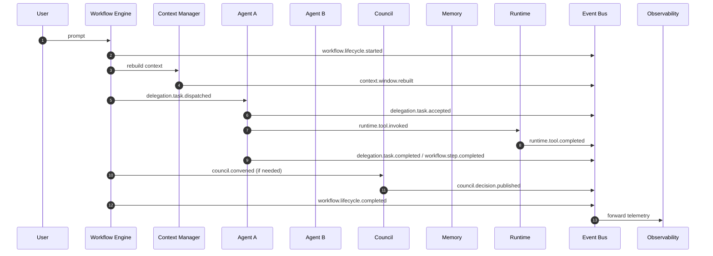
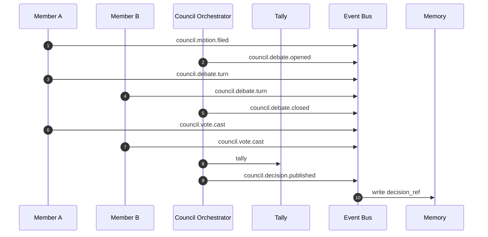
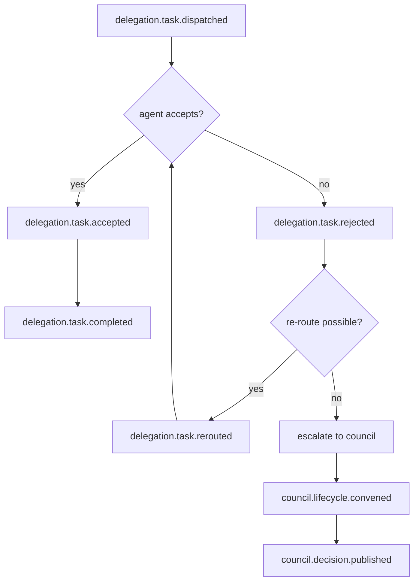
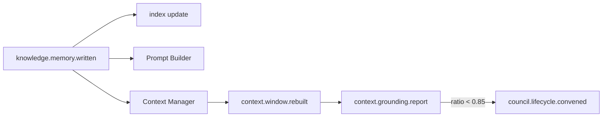
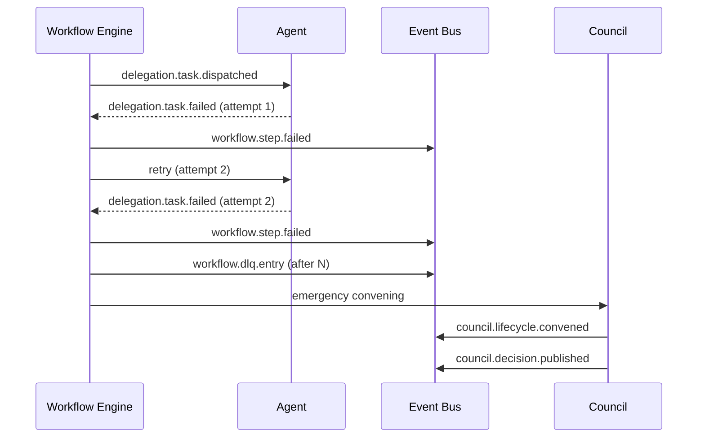
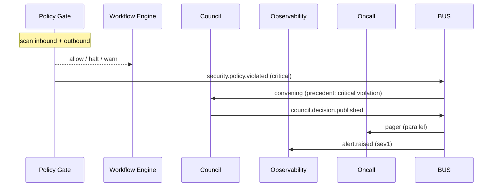
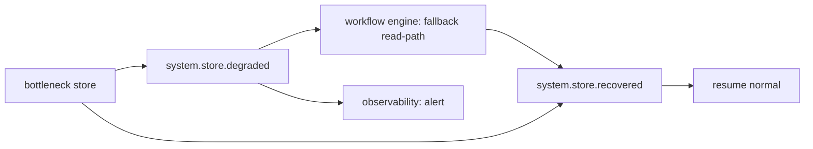

# AI-OS Part 12 — Event Architecture for Multi-Agent Collaboration

**Document Status:** Architecture Specification (v1.0)
**Layer:** Cross-cutting event backbone (Pub/Sub + Replay Log + Routing)
**Sister Documents:** Part 4 (Council), Part 5 (Memory), Part 6 (Workflow), Part 7 (Communication), Part 11 (Runtime Execution), Part 13 (Security), Part 14 (Observability)
**Distribution:** All agents, all council members, all routers, all sinks
**Source of Truth:** This file is authoritative; any divergence in code is a bug.

---

## Table of Contents

1. [Purpose & Scope](#1-purpose--scope)
2. [Eventing Principles](#2-eventing-principles)
3. [Transport, Topology & Routing](#3-transport-topology--routing)
4. [Event Envelope Schema](#4-event-envelope-schema)
5. [Lifecycle Events](#5-lifecycle-events)
6. [Workflow Events](#6-workflow-events)
7. [Council Events](#7-council-events)
8. [Delegation Events](#8-delegation-events)
9. [Knowledge Events](#9-knowledge-events)
10. [Context Events](#10-context-events)
11. [Runtime Events](#11-runtime-events)
12. [Communication Events](#12-communication-events)
13. [Security Events](#13-security-events)
14. [Monitoring Events](#14-monitoring-events)
15. [Scheduler Events](#15-scheduler-events)
16. [System Events](#16-system-events)
17. [Event Flow Diagrams (Mermaid)](#17-event-flow-diagrams-mermaid)
18. [Delivery Guarantees, Ordering & Retry](#18-delivery-guarantees-ordering--retry)
19. [Failure Handling & Dead Letter Strategy](#19-failure-handling--dead-letter-strategy)
20. [Security, Integrity & Replay Protection](#20-security-integrity--replay-protection)
21. [Workflow Examples](#21-workflow-examples)
22. [Complete Event Catalog](#22-complete-event-catalog)
23. [Event Governance Model](#24-event-governance-model)
24. [Event Naming RFC & Namespace Governance](#25-event-naming-rfc--namespace-governance)
25. [Event Lifecycle Model](#26-event-lifecycle-model)
26. [Event Versioning Strategy & Compatibility Rules](#27-event-versioning-strategy--compatibility-rules)
27. [Event Registry & Catalog Governance](#28-event-registry--catalog-governance)
28. [Consistency, Immutability & Ordering Guarantees](#29-consistency-immutability--ordering-guarantees)
29. [Idempotency, Correlation & Causation Standards](#30-idempotency-correlation--causation-standards)
30. [Distributed Tracing Integration & OpenTelemetry Mapping](#31-distributed-tracing-integration--opentelemetry-mapping)
31. [CloudEvents Compatibility](#32-cloudevents-compatibility)
32. [Retention, Archival & Deletion Policy](#33-retention-archival--deletion-policy)
33. [Broker Interoperability & Cross-Region Replication](#34-broker-interoperability--cross-region-replication)
34. [SLA, Performance & Failure Domain Isolation](#35-sla-performance--failure-domain-isolation)
35. [Compliance & Conformance Requirements](#36-compliance--conformance-requirements)
36. [Cross-References](#37-cross-references)
24. [Event Governance Model](#24-event-governance-model)
25. [Event Naming RFC & Namespace Governance](#25-event-naming-rfc--namespace-governance)
26. [Event Lifecycle Model](#26-event-lifecycle-model)
27. [Event Versioning Strategy & Compatibility Rules](#27-event-versioning-strategy--compatibility-rules)
28. [Event Registry & Catalog Governance](#28-event-registry--catalog-governance)
29. [Consistency, Immutability & Ordering Guarantees](#29-consistency-immutability--ordering-guarantees)
30. [Idempotency, Correlation & Causation Standards](#30-idempotency-correlation--causation-standards)
31. [Distributed Tracing Integration & OpenTelemetry Mapping](#31-distributed-tracing-integration--opentelemetry-mapping)
32. [CloudEvents Compatibility](#32-cloudevents-compatibility)
33. [Retention, Archival & Deletion Policy](#33-retention-archival--deletion-policy)
34. [Broker Interoperability & Cross-Region Replication](#34-broker-interoperability--cross-region-replication)
35. [SLA, Performance & Failure Domain Isolation](#35-sla-performance--failure-domain-isolation)
36. [Compliance & Conformance Requirements](#36-compliance--conformance-requirements)

---

## 1. Purpose & Scope

This document defines the **complete event architecture** that enables asynchronous, observable, replayable collaboration across every agent, council, workflow, runtime, and tool in the OS.

Events are the *nervous system* of AI-OS. They are not telemetry; they are **first-class facts of the system's evolution**. Every meaningful state change — a workflow starting, an agent being delegated to, a council vote being cast, a memory being written, a tool result being returned, a policy being violated — is published as an event and routed to all subsystems that care.

### Goals

- **Decouple** producers from consumers (agents don't subscribe to other agents; they subscribe to topics).
- **Reconstruct** any past computation from the event log alone (true to Part 5's Playback & Replay principle).
- **Coordinate** the council, workflow, delegation, and runtime planes without tight coupling.
- **Audit** every significant action with cryptographically verifiable provenance.
- **Backpressure** and bound work via priority queues, not unbounded retries.
- **Enable** cross-domain observability (security, monitoring, billing, simulation).

### Non-Goals

- Events are **not** a substitute for direct control channels (sync RPCs for hot paths).
- Events are **not** a UI protocol (UIs project events, but the wire is its own concern).
- Events are **not** human messaging (see Communication / IM bus — a different topic family).

### Relationship to Other Planes

| Plane | Backbone Role |
|---|---|
| **Council (Part 4)** | Council emits governance events; workflows subscribe to decisions. |
| **Memory (Part 5)** | Memory writes are knowledge events; replay reads the same log. |
| **Workflow (Part 6)** | Workflows are *composed of events*; each step is triggered or by-event. |
| **Communication (Part 7)** | Channel messages emit communication events that route to bridge destinations. |
| **Runtime (Part 11)** | Tool calls and orchestration steps emit runtime events. |
| **Security (Part 13)** | Security consumes monitoring, security, and policy events. |
| **Observability (Part 14)** | Observability consumes everything to produce traces and metrics. |

---

## 2. Eventing Principles

1. **Events are facts, not commands.** They describe what *happened*, not what *should* happen. Commands are a derived pattern (a *consumer* decides).
2. **One canonical envelope.** Every event — regardless of domain — shares a single envelope (Section 4). Differences live in the payload.
3. **Typed topics.** Topic names encode domain and action: `workflow.step.completed`, `council.vote.cast`. Consumers subscribe at topic granularity.
4. **Ordered within a partition, unordered across.** Every event has a `partition_key` (e.g., workflow_id). Events with the same partition key are strictly ordered; different keys may interleave.
5. **At-least-once with idempotent handlers.** We do not promise exactly-once; handlers must be idempotent (use `event_id` + dedupe window).
6. **Replay is a primitive, not an afterthought.** The log must be replayable from any offset to reconstruct state, re-run simulations, or reforge context windows.
7. **Priority is a property of the event, not the queue.** Each event declares its priority (P0–P3); routers honor it.
8. **Backpressure is honest.** When downstream is saturated, the broker applies **shed-load-then-cooperate-slowdown** rather than dropping silently.
9. **PII and secrets are redacted in the payload, echoed in the metadata.** The log is auditable end-to-end but never carries plaintext credentials.

---

## 3. Transport, Topology & Routing

### Topology

```
        ┌────────── Producers ──────────┐
        │ agents │ councils │ workflows │
        │  tools │ runtimes │ schedulers│
        └──────────────┬────────────────┘
                       │
                       ▼
        ┌─────────────────────────────┐
        │  Event Broker (Pub/Sub Bus) │
        │  ┌───────────────────────┐  │
        │  │ Topics + Partitioning │  │
        │  │ Priority Lanes        │  │
        │  │ Schema Registry       │  │
        │  │ Sequencer + Deduper   │  │
        │  └───────────────────────┘  │
        │              │               │
        │              ▼               │
        │       Durable Log (WORM)     │
        │       (replayable from 0)    │
        └──────────────┬──────────────┘
                       │
        ┌──────────────┴──────────────┐
        ▼              ▼              ▼
   Subscribers    Subscribers   Subscribers
  (workflow engine, memory, council organs,
   security, observability, DEAD-LETTER)
```

### Topic Naming

`<namespace>.<aggregate>.<action>[.<qualifier>]`

Examples:
- `workflow.started`
- `workflow.step.completed`
- `council.vote.cast`
- `agent.lifecycle.delegation.dispatched`
- `knowledge.memory.written`
- `context.window.rebuilt`
- `runtime.tool.invoked`
- `communication.message.sent`
- `security.policy.violated`
- `monitoring.trace.span.closed`
- `scheduler.job.scheduled`
- `system.broker.overloaded`

### Routing Modes

- **Broadcast** — default; all subscribers of the topic receive events in arrival order (per partition).
- **Point-to-Point** — competing consumers (e.g., delegation queue — only one agent picks up a task).
- **Hierarchical** — fan-in to a parent aggregate (e.g., per-workflow → per-tenant → global).
- **Replay** — historical replay from offset, not affecting live subscribers.

### Partitioning

- **Default partition key:** the *aggregate ID* (workflow_id, session_id, council_session_id).
- **System-wide events** (e.g., broker overloaded) use a synthetic `system` key.

### Persistence & Replay

- Events are persisted to a **WORM (Write-Once-Read-Many) log** with configurable retention (default 30 days hot + 1 year cold).
- A **schema registry** version-controls every event type. Bumping version is mandatory on breaking field changes; consumers pin major versions.

---

## 4. Event Envelope Schema

Every event in AI-OS, regardless of domain, conforms to one canonical envelope:

```json
{
  "$schema": "https://ai-os.dev/schemas/event-envelope/v1.json",
  "event_id": "01HZX5KQ…",
  "event_type": "workflow.step.completed",
  "event_version": 1,
  "produced_at": "2026-08-07T12:34:56.789Z",
  "produced_by": {
    "actor_id": "agt_8x4…",
    "actor_kind": "agent | council | workflow | runtime | scheduler | tool | system",
    "actor_role": "executor | arbiter | planner | observer ..."
  },
  "partition_key": "wf_4d9…",
  "correlation_id": "wf_4d9…",
  "causation_id": "evt_01HZX…",
  "tenant_id": "ten_acme",
  "priority": "P0 | P1 | P2 | P3",
  "trace": {
    "trace_id": "tr_8a2…",
    "span_id": "sp_90c…",
    "parent_span_id": "sp_70b…"
  },
  "schema_ref": "workflow.step.completed@v1",
  "payload": { /* domain-specific body, see Sections 5–16 */ },
  "metadata": {
    "redacted_fields": ["payload.user.email"],
    "classification": "internal | confidential | secret",
    "encrypted_fields": ["payload.tokens.refresh"]
  },
  "security": {
    "signing_key_id": "k_2026_q3",
    "signature": "ed25519:…",
    "previous_signature": "ed25519:…"
  }
}
```

### Field Semantics

- **`event_id`** — ULID; globally unique; used for idempotency.
- **`event_type`** — dotted topic name.
- **`event_version`** — schema version per type; consumers gate on this.
- **`correlation_id`** — ties all events belonging to one user-visible action (workflow, prompt, etc.).
- **`causation_id`** — the immediate parent event that caused this one; forms a DAG.
- **`partition_key`** — guarantees per-aggregate ordering.
- **`priority`** — see Section 18.
- **`trace`** — connects to the Part 14 distributed trace.
- **`security.signature`** — over the canonicalized payload, excluding the signature field itself.

---

## 5. Lifecycle Events

Lifecycle events describe the *creation, persistence, and removal* of agents, councils, workflows, contexts, and tools.

### 5.1 `agent.lifecycle.registered`

- **Purpose:** A new agent definition has been registered with the agent registry.
- **Producer:** Agent Manager / Bootstrap loader.
- **Consumers:** Directory service, Council Seat Allocator, Workflow Engine (to update capabilities map), Observability.
- **Payload:**
```json
{
  "agent_id": "agt_…",
  "name": "Researcher-Bot",
  "version": "1.4.0",
  "capabilities": ["web.search", "summarize"],
  "model": { "provider": "anthropic", "name": "claude-opus-5" },
  "policy_profile": "generalist",
  "registered_at": "2026-08-07T12:00:00Z"
}
```
- **Schema:** `agent.lifecycle.registered@v1`
- **Priority:** P2.
- **Ordering:** Per `agent_id`.
- **Retry Policy:** 5 retries with exponential backoff (1s → 32s); DLQ after.
- **Failure Handling:** If directory update fails, retry; if it still fails, emit `system.error.persisted` and trigger reconciliation job.
- **Security:** Signature required; no PII expected; confidentiality `internal`.

JSON Example:
```json
{
  "event_id": "01HZX5L0…",
  "event_type": "agent.lifecycle.registered",
  "event_version": 1,
  "produced_at": "2026-08-07T12:00:00.000Z",
  "produced_by": { "actor_id": "sys_registry", "actor_kind": "system" },
  "partition_key": "agt_researcher_bot",
  "correlation_id": "boot_2026_08_07",
  "priority": "P2",
  "payload": {
    "agent_id": "agt_researcher_bot",
    "name": "Researcher-Bot",
    "version": "1.4.0",
    "capabilities": ["web.search", "summarize"]
  }
}
```

### 5.2 `agent.lifecycle.deregistered`

- **Purpose:** An agent has been removed or retired.
- **Producer:** Agent Manager / Admin.
- **Consumers:** Directory, Council Queue (cancel pending assignments), Workflow Engine (cancel in-flight delegations), Observability.
- **Payload:** `{ "agent_id": "…", "reason": "retired | superseded | revoked", "final_state": "…" }`
- **Schema:** `agent.lifecycle.deregistered@v1`
- **Priority:** P1 (must propagate before next delegation to this agent).
- **Ordering:** Per `agent_id`; must follow any final `agent.delegation.completed`.
- **Retry Policy:** 5 retries, then DLQ; secondary consumer (Safety Officer) is bound to retry on DLQ.
- **Failure Handling:** If propagation stalls, agent is *soft-locked* (no new dispatches) until confirmed.
- **Security:** Signature required. Revocation events are confidential internally; logged but not broadcast to user-facing UIs.

### 5.3 `agent.lifecycle.heartbeat`

- **Purpose:** Liveness ping from a long-running agent.
- **Producer:** Agent supervisor.
- **Consumers:** Health Monitor, Council Seat Allocator (for capacity scoring), Workflow Engine (re-routing).
- **Payload:** `{ "agent_id": "…", "state": "idle | busy | degraded", "load": 0.42, "q_depth": 3, "ts": "…" }`
- **Schema:** `agent.lifecycle.heartbeat@v1`
- **Priority:** P3 (system chatter).
- **Ordering:** Per `agent_id`.
- **Retry Policy:** Heartbeats are best-effort; if a heartbeat is lost, no retry.
- **Failure Handling:** Missing heartbeats (configurable threshold) trigger synthetic `monitoring.alert.missed_heartbeat`.
- **Security:** Internal only; signed.

### 5.4 `workflow.lifecycle.started`

- **Purpose:** A new workflow instance has begun.
- **Producer:** Workflow Engine.
- **Consumers:** Council (notify if council-required), Memory (allocate session bucket), Observability, Billing.
- **Payload:** `{ "workflow_id": "…", "template": "research.deep_dive@v2", "tenant_id": "…", "initiator": "user|agent_id|council_id", "started_at": "…" }`
- **Schema:** `workflow.lifecycle.started@v1`
- **Priority:** P1.
- **Ordering:** First event of any `workflow_id`; precedes any `workflow.step.*`.
- **Retry Policy:** 5 retries (workflow engine is hot path).
- **Failure Handling:** DLQ → oncall alert; workflow is *not* running yet, so the cleanup is to mark as failed-to-start.
- **Security:** Signature required; classify by tenant.

### 5.5 `workflow.lifecycle.completed`

- **Purpose:** Workflow finished (success, failure, or canceled).
- **Producer:** Workflow Engine.
- **Consumers:** Memory (close session bucket), Council (release reserved seats), Billing (finalize charges), Observability.
- **Payload:** `{ "workflow_id": "…", "outcome": "succeeded | failed | canceled | timed_out", "duration_ms": 12830, "summary": "…" }`
- **Schema:** `workflow.lifecycle.completed@v1`
- **Priority:** P1.
- **Ordering:** Last event of any `workflow_id`; must follow all `workflow.step.*` events.
- **Retry Policy:** 10 retries (final-state event, propagation is critical).
- **Failure Handling:** Persistent failure → escalate to supervisor; the workflow log is closed and propagated via reconciliation pass.
- **Security:** Signed; final state must be reproducible from log.

### 5.6 `council.lifecycle.convened`

- **Purpose:** A council session has been called into session.
- **Producer:** Council Orchestrator.
- **Consumers:** Workflow Engine, Observability, Memory.
- **Payload:** `{ "council_session_id": "…", "council_id": "policy-council", "members": ["agt_a","agt_b"], "topic": "…", "convened_at": "…" }`
- **Schema:** `council.lifecycle.convened@v1`
- **Priority:** P1.
- **Ordering:** First event of any `council_session_id`.
- **Retry Policy:** 5 retries, then DLQ; on success failure, the convening fails to start.
- **Security:** Signed; members list is internal-only.

### 5.7 `council.lifecycle.dissolved`

- **Purpose:** A council has concluded its session.
- **Producer:** Council Orchestrator.
- **Consumers:** Workflow Engine (resume), Memory (record final decision ref), Billing.
- **Payload:** `{ "council_session_id": "…", "decision_ref": "mem_…", "duration_ms": 5400, "dissolved_at": "…" }`
- **Schema:** `council.lifecycle.dissolved@v1`
- **Priority:** P1.
- **Ordering:** Last event of the session; must follow `council.vote.cast` and `council.decision.published`.
- **Retry Policy:** 10 retries; final state must propagate.
- **Security:** Signed; decision_ref is a forward pointer into the knowledge log.

### 5.8 `context.lifecycle.snapshot`

- **Purpose:** A snapshot of a context window has been created (for replay/restore).
- **Producer:** Context Manager.
- **Consumers:** Memory (write to log), Replay subsystem.
- **Payload:** `{ "context_id": "…", "workflow_id": "…", "snapshot_uri": "oss://…", "size_bytes": 14523, "hash": "sha256:…" }`
- **Schema:** `context.lifecycle.snapshot@v1`
- **Priority:** P2.
- **Ordering:** Per `context_id` (monotonic snapshots).
- **Retry Policy:** 5 retries; snapshot persistence is idempotent so a duplicate is safe.
- **Security:** Snapshot blob encrypted at rest; signature on event; `hash` enables integrity verification.

### 5.9 `tool.lifecycle.registered`

- **Purpose:** A tool (MCP server, function, capability) is registered with the runtime.
- **Producer:** Tool Registry.
- **Consumers:** Workflow Engine (tool map), Security (policy scope), Observability.
- **Payload:** `{ "tool_id": "mcp_fs_read", "version": "0.7.1", "scope": ["files.read"], "risk_class": "low | medium | high", "registered_at": "…" }`
- **Schema:** `tool.lifecycle.registered@v1`
- **Priority:** P2.
- **Ordering:** Per `tool_id`.
- **Retry Policy:** 5 retries.
- **Security:** Risk class held confidential in payload; signature mandatory.

### 5.10 `tool.lifecycle.deprecated`

- **Purpose:** A tool is marked deprecated or unsafe.
- **Producer:** Tool Registry / Security.
- **Consumers:** Workflow Engine (block new calls), Council (potential escalation), Observability.
- **Payload:** `{ "tool_id": "…", "reason": "vulnerability | EOL | policy", "severity": "info | warning | critical" }`
- **Schema:** `tool.lifecycle.deprecated@v1`
- **Priority:** P0 if `severity = critical`, P1 otherwise.
- **Ordering:** Per `tool_id`; supersedes any `tool.lifecycle.registered`.
- **Retry Policy:** 10 retries (must propagate to prevent harm).
- **Security:** Critical deprecations are flagged and trigger `security.policy.violated`-style reviews.

---

## 6. Workflow Events

Workflow events represent the *evolving state of a directed-acyclic-graph execution*: steps starting, completing, failing, retrying, branching.

### 6.1 `workflow.step.scheduled`

- **Purpose:** A step in a workflow is queued for execution.
- **Producer:** Workflow Engine.
- **Consumers:** Runtime dispatcher, Observability, Billing (step budget).
- **Payload:** `{ "workflow_id":"…","step_id":"…","node_kind":"llm|tool|human|decision","agent_id":"…|null","scheduled_at":"…","dependencies":["step_a","step_b"] }`
- **Schema:** `workflow.step.scheduled@v1`
- **Priority:** P1 (default for hot workflow path).
- **Ordering:** Per `workflow_id`; precedes `workflow.step.started` for the same step.
- **Retry Policy:** N/A — events are produced by engine; on producer failure, engine is broken and pages are raised, no event retry semantics.
- **Failure Handling:** Engine failures to emit are caught by transactional outbox pattern (the step only commits to log after event publish ack).
- **Security:** Signed; step_id correlation.

### 6.2 `workflow.step.started`

- **Purpose:** A step has begun executing.
- **Producer:** Workflow Engine / Runtime dispatcher.
- **Consumers:** Observability (span begin), Memory (telemetry hook), Workflow Engine (timeout watchdog).
- **Payload:** `{ "workflow_id":"…","step_id":"…","started_at":"…","agent_id":"…","attempt":1 }`
- **Schema:** `workflow.step.started@v1`
- **Priority:** P1.
- **Ordering:** Per `workflow_id`; precedes `workflow.step.completed`.
- **Retry Policy:** 5 retries (transient, hot path).
- **Security:** Signed.

### 6.3 `workflow.step.completed`

- **Purpose:** A step has finished with success.
- **Producer:** Workflow Engine.
- **Consumers:** Workflow Engine (advance DAG), Memory (record artefact), Observability.
- **Payload:** `{ "workflow_id":"…","step_id":"…","outcome":"succeeded","output_ref":"mem_…|artifact_…","completed_at":"…","duration_ms":1234 }`
- **Schema:** `workflow.step.completed@v1`
- **Priority:** P1.
- **Ordering:** Per `workflow_id`; precedes any subsequent `workflow.step.scheduled` for downstream steps.
- **Retry Policy:** 5 retries then DLQ; engine will reconcile on re-delivery.
- **Security:** Signed; output_ref points to a redacted, signable artefact.

### 6.4 `workflow.step.failed`

- **Purpose:** A step failed (transient or permanent).
- **Producer:** Workflow Engine / Runtime.
- **Consumers:** Workflow Engine (retry / branch), Memory (record failure), Observability (incident).
- **Payload:** `{ "workflow_id":"…","step_id":"…","failure_class":"transient|logic|policy|exception","error":"…","attempt":2,"max_attempts":5,"next_action":"retry|cancel|escalate" }`
- **Schema:** `workflow.step.failed@v1`
- **Priority:** P1.
- **Ordering:** Per `workflow_id`.
- **Retry Policy:** 5 retries (the producer side, for emission).
- **Security:** Failure class may carry sensitive context; payload redaction enforced.

### 6.5 `workflow.step.retried`

- **Purpose:** A failed step is being retried (after backoff).
- **Producer:** Workflow Engine.
- **Consumers:** Runtime, Observability, Billing (charge retry).
- **Payload:** `{ "workflow_id":"…","step_id":"…","attempt":3,"backoff_ms":8000,"at":"…","reason":"transient_timeout" }`
- **Schema:** `workflow.step.retried@v1`
- **Priority:** P1.
- **Ordering:** Per `workflow_id`; must follow `workflow.step.failed` of the prior attempt.
- **Security:** Signed.

### 6.6 `workflow.step.skipped`

- **Purpose:** A step was bypassed (conditional path).
- **Producer:** Workflow Engine.
- **Consumers:** Memory, Observability.
- **Payload:** `{ "workflow_id":"…","step_id":"…","reason":"condition_false","condition":{"expr":"...","value":false} }`
- **Schema:** `workflow.step.skipped@v1`
- **Priority:** P2.
- **Ordering:** Per `workflow_id`.
- **Security:** Internal only.

### 6.7 `workflow.step.halted`

- **Purpose:** A workflow step is halted by council / safety / policy.
- **Producer:** Council / Security / Workflow Engine.
- **Consumers:** Workflow Engine (cancel branch), Memory, Observability.
- **Payload:** `{ "workflow_id":"…","step_id":"…","by":"council_id|policy_id|user","reason":"…","severity":"low|medium|high|critical" }`
- **Schema:** `workflow.step.halted@v1`
- **Priority:** P0 if critical; P1 otherwise.
- **Ordering:** Per `workflow_id`; supersedes any pending `workflow.step.scheduled`.
- **Security:** Halt events are confidential and audit-logged.

### 6.8 `workflow.artifact.published`

- **Purpose:** An artefact (file, response, model output) has been produced and is available.
- **Producer:** Workflow Engine / Memory.
- **Consumers:** Memory (index), Communication, Observability.
- **Payload:** `{ "workflow_id":"…","step_id":"…","artifact_ref":"mem_…|blob_…","kind":"text|image|chart|data_url|json","size_bytes":24891,"sha256":"…","visibility":"private|team|tenant|public" }`
- **Schema:** `workflow.artifact.published@v1`
- **Priority:** P1.
- **Ordering:** Per `workflow_id`; logically follows the producing step.
- **Security:** Visibility governs downstream access; signature required.

### 6.9 `workflow.branch.evaluated`

- **Purpose:** A branch eval has been computed (decision point).
- **Producer:** Workflow Engine.
- **Consumers:** Workflow Engine (advance), Memory (record), Observability.
- **Payload:** `{ "workflow_id":"…","branch_id":"…","expression":"…","result":true,"at":"…" }`
- **Schema:** `workflow.branch.evaluated@v1`
- **Priority:** P1.
- **Ordering:** Per `workflow_id`.

### 6.10 `workflow.dlq.entry`

- **Purpose:** A workflow or step has been routed to the dead letter queue.
- **Producer:** Workflow Engine broker.
- **Consumers:** Operator dashboards, Replay tooling.
- **Payload:** `{ "workflow_id":"…","step_id":"…","last_error":"…","attempt_count":10,"first_failed_at":"…","dlq_topic":"workflow.dlq" }`
- **Schema:** `workflow.dlq.entry@v1`
- **Priority:** P1.
- **Ordering:** Per `workflow_id`.
- **Security:** Internal; DLQ data is read-restricted to operators.

---

## 7. Council Events

Council events describe the choreography of multi-agent governance: seating, motions, debates, votes, verdicts.

### 7.1 `council.motion.filed`

- **Purpose:** A motion (proposal, question, claim) has been filed for council consideration.
- **Producer:** Any member agent, workflow engine, or user-side assistant.
- **Consumers:** Council Orchestrator, members (notifications), Memory.
- **Payload:** `{ "council_session_id":"…","motion_id":"…","proposer":"agt_…|user_…","text":"…","attachments":["mem_…","blob_…"],"filed_at":"…" }`
- **Schema:** `council.motion.filed@v1`
- **Priority:** P1.
- **Ordering:** Per `council_session_id`; precedes `council.debate.opened`.
- **Security:** Confidential within council; redacted for non-members if marked.

### 7.2 `council.debate.opened`

- **Purpose:** Debate on a motion has started.
- **Producer:** Council Orchestrator.
- **Consumers:** Members, Memory (record debate transcript), Observability.
- **Payload:** `{ "council_session_id":"…","motion_id":"…","opened_at":"…","round":1,"timebox_ms":600000 }`
- **Schema:** `council.debate.opened@v1`
- **Priority:** P1.
- **Ordering:** Per `council_session_id + motion_id`.
- **Security:** Debate transcript may be sensitive — confidentiality classification inherent.

### 7.3 `council.debate.turn`

- **Purpose:** A member has spoken during debate (utterance recorded).
- **Producer:** Member agent / Council Recorder.
- **Consumers:** Memory, Observability, members (next speaker selection).
- **Payload:** `{ "council_session_id":"…","motion_id":"…","speaker":"agt_…","text":"…","at":"…","references":["mem_…"] }`
- **Schema:** `council.debate.turn@v1`
- **Priority:** P2 (debate is chatty).
- **Ordering:** Per `council_session_id + motion_id`; strict to preserve transcript.
- **Retry Policy:** Best-effort; if dropped, recorder fills gap from memory log.
- **Security:** Debate confidentiality respected downstream.

### 7.4 `council.debate.closed`

- **Purpose:** Debate on a motion has ended; voting may proceed.
- **Producer:** Council Orchestrator.
- **Consumers:** Members, Workflow Engine (resume), Memory.
- **Payload:** `{ "council_session_id":"…","motion_id":"…","closed_at":"…","duration_ms":210000 }`
- **Schema:** `council.debate.closed@v1`
- **Priority:** P1.
- **Ordering:** Per `council_session_id + motion_id`.

### 7.5 `council.vote.cast`

- **Purpose:** A member has cast a vote.
- **Producer:** Voter agent / Council Orchestrator tally ledger.
- **Consumers:** Tally, Memory (audit), Observability.
- **Payload:** `{ "council_session_id":"…","motion_id":"…","voter":"agt_…","ballot":"yes|no|abstain|recuse","weight":1.0,"rationale":"…","at":"…" }`
- **Schema:** `council.vote.cast@v1`
- **Priority:** P1.
- **Ordering:** Per `council_session_id + motion_id`.
- **Security:** Tie-breaking and audit rely on integrity; signature required.

### 7.6 `council.vote.recalled`

- **Purpose:** A previously cast vote is recalled (rare; permitted for procedural correctness).
- **Producer:** Council Orchestrator.
- **Consumers:** Tally, Memory, Observability.
- **Payload:** `{ "council_session_id":"…","motion_id":"…","voter":"agt_…","prior_event_id":"evt_…","reason":"…" }`
- **Schema:** `council.vote.recalled@v1`
- **Priority:** P1.
- **Ordering:** Per `council_session_id + motion_id`; must follow the recalled `vote.cast`.

### 7.7 `council.decision.published`

- **Purpose:** Final council decision is published.
- **Producer:** Council Orchestrator.
- **Consumers:** Workflow Engine, Memory (decision_ref), Communication, Billing.
- **Payload:** `{ "council_session_id":"…","motion_id":"…","decision":"approve|reject|defer|amend","tally":{"yes":3,"no":1,"abstain":1},"decision_ref":"mem_…","published_at":"…" }`
- **Schema:** `council.decision.published@v1`
- **Priority:** P1.
- **Ordering:** Per `council_session_id + motion_id`; precedes `council.lifecycle.dissolved`.
- **Security:** Decision is sealed and signed (cryptographic council seal per Part 4).

### 7.8 `council.seat.granted`

- **Purpose:** A seat has been granted to a delegate (or evicted via corresponding negative).
- **Producer:** Council Seat Allocator.
- **Consumers:** Directory, Member agents, Observability.
- **Payload:** `{ "council_id":"…","agent_id":"…","seat_role":"chair|member|observer|arbiter","granted_at":"…","expires_at":"…|null" }`
- **Schema:** `council.seat.granted@v1`
- **Priority:** P1.
- **Ordering:** Per `council_id`.
- **Security:** Seat events are internal and signed.

### 7.9 `council.seat.revoked`

- **Purpose:** A seat has been revoked.
- **Producer:** Council Seat Allocator / Security.
- **Consumers:** Director, Workflow Engine (cancel assignments), Observability.
- **Payload:** `{ "council_id":"…","agent_id":"…","reason":"…","at":"…" }`
- **Schema:** `council.seat.revoked@v1`
- **Priority:** P0 if reason = security; else P1.
- **Security:** Confidentiality `confidential`; not user-visible.

### 7.10 `council.quorum.lost`

- **Purpose:** Quorum lost mid-session; emergency save.
- **Producer:** Council Orchestrator.
- **Consumers:** Workflow Engine (pause), Observability, oncall.
- **Payload:** `{ "council_session_id":"…","at":"…","present_count":2,"required_quorum":4 }`
- **Schema:** `council.quorum.lost@v1`
- **Priority:** P0.
- **Ordering:** Per `council_session_id`.

---

## 8. Delegation Events

Delegation events describe the *assignment and resolution of work* to specific agents.

### 8.1 `delegation.task.dispatched`

- **Purpose:** A task is dispatched to an agent.
- **Producer:** Workflow Engine (the most common delegator) or Council.
- **Consumers:** Target agent, Observability, Billing.
- **Payload:** `{ "delegation_id":"…","workflow_id":"…","agent_id":"…","task_kind":"llm|tool|hybrid","instruction_ref":"mem_…","priority":"P0..P3","deadline_at":"…","dispatched_at":"…" }`
- **Schema:** `delegation.task.dispatched@v1`
- **Priority:** Same as the dispatched task's priority band; P0 for council-routed critical work.
- **Ordering:** Per `agent_id` (every delegation to an agent is serial).
- **Retry Policy:** 5 retries; on failure, escalate to supervisor agent.
- **Security:** Instruction may include PII; redact per tenant policy.

### 8.2 `delegation.task.accepted`

- **Purpose:** Agent has acknowledged receipt.
- **Producer:** Agent.
- **Consumers:** Workflow Engine (start timer), Observability.
- **Payload:** `{ "delegation_id":"…","agent_id":"…","accepted_at":"…","estimated_completion_ms":4000 }`
- **Schema:** `delegation.task.accepted@v1`
- **Priority:** Mirrors dispatched priority.
- **Ordering:** Per `agent_id`.

### 8.3 `delegation.task.rejected`

- **Purpose:** Agent cannot accept (capability mismatch, self-preservation, policy block).
- **Producer:** Agent.
- **Consumers:** Workflow Engine (re-route), Council (if persistent), Observability.
- **Payload:** `{ "delegation_id":"…","agent_id":"…","reason":"capability|policy|overload|self_preservation","posture":"escalate|reroute|abandon" }`
- **Schema:** `delegation.task.rejected@v1`
- **Priority:** P1.
- **Ordering:** Per `agent_id`.
- **Security:** Rejection reasons are useful intel; surfaced to Observability; `self_preservation` redacted for user display.

### 8.4 `delegation.task.rerouted`

- **Purpose:** Task was rerouted to a different agent.
- **Producer:** Workflow Engine / Delegation Router.
- **Consumers:** Original agent (cancel), new agent (dispatch), Observability.
- **Payload:** `{ "delegation_id":"…","from":"agt_a","to":"agt_b","reason":"rejection|degradation|optimization","at":"…" }`
- **Schema:** `delegation.task.rerouted@v1`
- **Priority:** P1.
- **Ordering:** Per `delegation_id`.

### 8.5 `delegation.task.completed`

- **Purpose:** Delegation resolved successfully.
- **Producer:** Agent / Workflow Engine.
- **Consumers:** Workflow Engine (advance), Memory (record output), Communication (delivery).
- **Payload:** `{ "delegation_id":"…","outcome":"succeeded","output_ref":"mem_…","completed_at":"…","duration_ms":4506 }`
- **Schema:** `delegation.task.completed@v1`
- **Priority:** Mirrors dispatched.
- **Ordering:** Per `agent_id`.

### 8.6 `delegation.task.failed`

- **Purpose:** Delegation failed permanently.
- **Producer:** Agent / Workflow Engine.
- **Consumers:** Workflow Engine (branch), Council, Observability.
- **Payload:** `{ "delegation_id":"…","outcome":"failed","error_class":"…","retries":5,"final_error":"…" }`
- **Schema:** `delegation.task.failed@v1`
- **Priority:** P1.
- **Ordering:** Per `agent_id`.

### 8.7 `delegation.task.timeout`

- **Purpose:** Delegation exceeded deadline without accepting/completing.
- **Producer:** Workflow Engine / Deadline Watchdog.
- **Consumers:** Workflow Engine (breaker), Observability.
- **Payload:** `{ "delegation_id":"…","agent_id":"…","deadline_ms":8000,"elapsed_ms":9000 }`
- **Schema:** `delegation.task.timeout@v1`
- **Priority:** P1.
- **Ordering:** Per `agent_id`.

### 8.8 `delegation.load.balanced`

- **Purpose:** Internal hint that delegation was re-weighted (load balancing).
- **Producer:** Delegation Router.
- **Consumers:** Observability, Capacity planner.
- **Payload:** `{ "from":"agt_a","to":"agt_b","reason":"load","load_delta":0.27,"at":"…" }`
- **Schema:** `delegation.load.balanced@v2` — versioned because the second version included weighted scores.
- **Priority:** P3.

---

## 9. Knowledge Events

Knowledge events describe the *storage, retrieval, and revision* of facts in the layered memory system (Part 5).

### 9.1 `knowledge.memory.written`

- **Purpose:** A new memory record has been written.
- **Producer:** Memory subsystem.
- **Consumers:** Memory indexes, Prompt Builder (self refreshes), Replay, Observability.
- **Payload:** `{ "memory_id":"mem_…","layer":"episodic|semantic|procedural|identity","scope":"session|workflow|tenant|global","redaction_class":"none|standard|strict","written_at":"…","size_bytes":612 }`
- **Schema:** `knowledge.memory.written@v1`
- **Priority:** P1 for layer `identity`; P2 otherwise.
- **Ordering:** Per `scope_id` (e.g., workflow_id for workflow scope).
- **Security:** `redaction_class` governs downstream rendering; signature mandatory.

### 9.2 `knowledge.memory.read`

- **Purpose:** A memory record was retrieved by a caller.
- **Producer:** Memory subsystem.
- **Consumers:** Access log, Security (anomaly detection), Observability.
- **Payload:** `{ "memory_id":"mem_…","caller":"agt_…","purpose":"prompt_build|reasoning|audit","at":"…" }`
- **Schema:** `knowledge.memory.read@v1`
- **Priority:** P3 (high-volume).
- **Ordering:** Per `caller` (for audit ordering).
- **Security:** Access log; used to detect exfiltration patterns.

### 9.3 `knowledge.memory.deleted`

- **Purpose:** Right-to-be-forgotten or retention cleanup.
- **Producer:** Memory subsystem / Privacy Officer.
- **Consumers:** Indexes, Replay (mark tombstone), Observability.
- **Payload:** `{ "memory_id":"mem_…","reason":"rtbf|retention|admin","at":"…","actor":"privacy|user|workflow" }`
- **Schema:** `knowledge.memory.deleted@v1`
- **Priority:** P1.
- **Ordering:** Per `tenant_id`.
- **Security:** Tombstone retained in log for forensic audit but data blotted from hot caches.

### 9.4 `knowledge.memory.revised`

- **Purpose:** A memory record was updated (correction, merge).
- **Producer:** Memory subsystem / Workflow.
- **Consumers:** Indexes, Prompt Builder, Observability.
- **Payload:** `{ "memory_id":"mem_…","prev_memory_id":"mem_…|null","patch":{"op":"replace|append|merge","path":"/field","value":"…"},"at":"…" }`
- **Schema:** `knowledge.memory.revised@v1`
- **Priority:** P1 for identity; P2 otherwise.
- **Ordering:** Per `memory_id` (linear causal chain).

### 9.5 `knowledge.embedding.computed`

- **Purpose:** A new embedding (vector) has been generated.
- **Producer:** Embedding service.
- **Consumers:** Vector index.
- **Payload:** `{ "memory_id":"mem_…","model":"text-embed-…","dim":1536,"sha256":"…","at":"…" }`
- **Schema:** `knowledge.embedding.computed@v1`
- **Priority:** P2.
- **Ordering:** Per `memory_id`.
- **Security:** Embedding content may indirectly encode training data; treat as confidential.

### 9.6 `knowledge.fact.invalidated`

- **Purpose:** A fact previously recorded is now considered invalid (contradiction, supersession).
- **Producer:** Reconciliation engine / Council.
- **Consumers:** Memory, Prompt Builder (purge), Observability.
- **Payload:** `{ "fact_id":"…","reason":"contradiction|supersession|policy","replaced_by":"…|null","at":"…" }`
- **Schema:** `knowledge.fact.invalidated@v1`
- **Priority:** P1.
- **Ordering:** Per `tenant`.

### 9.7 `knowledge.ontology.updated`

- **Purpose:** The schema/ontology graph has been updated.
- **Producer:** Ontology service / Council.
- **Consumers:** Memory, Prompt Builder.
- **Payload:** `{ "ontology_version":"…","diff_uri":"…","at":"…" }`
- **Schema:** `knowledge.ontology.updated@v1`
- **Priority:** P1.
- **Ordering:** Global with version key.

---

## 10. Context Events

Context events describe the *state of the working memory window* used to condition an LLM call.

### 10.1 `context.window.rebuilt`

- **Purpose:** The context window for a workflow/step has been reconstructed.
- **Producer:** Context Manager.
- **Consumers:** Prompt Builder, Observability.
- **Payload:** `{ "context_id":"…","workflow_id":"…","tokens_used":12480,"token_budget":32000,"strategy":"recency_pri|summary_pri|hybrid","sources":["mem_…"],"rebuilt_at":"…" }`
- **Schema:** `context.window.rebuilt@v1`
- **Priority:** P1 (hot path for LLM calls).
- **Ordering:** Per `workflow_id`.
- **Security:** `sources` may include PII; only metadata is published; redacted list mandatory.

### 10.2 `context.window.trimmed`

- **Purpose:** Context window was reduced (trimmed) to fit budget.
- **Producer:** Context Manager.
- **Consumers:** Memory (record trim policy), Observability.
- **Payload:** `{ "context_id":"…","tokens_before":34000,"tokens_after":29500,"trim_method":"recency|relevance|summary","dropped_refs":["mem_…"] }`
- **Schema:** `context.window.trimmed@v1`
- **Priority:** P2.
- **Ordering:** Per `context_id`.

### 10.3 `context.window.compressed`

- **Purpose:** Compressed (summarized) subsegment compacted.
- **Producer:** Context Manager.
- **Consumers:** Memory, Observability.
- **Payload:** `{ "context_id":"…","segment_ref":"mem_…","tokens_before":7200,"tokens_after":1100,"model":"claude-opus-5" }`
- **Schema:** `context.window.compressed@v1`
- **Priority:** P2.

### 10.4 `context.refresh.attempt`

- **Purpose:** Attempt to refresh context (add fresh memories, prune stale).
- **Producer:** Context Manager.
- **Consumers:** Observability.
- **Payload:** `{ "context_id":"…","reason":"user_request|step_complete|staleness","added":["mem_…"],"removed":["mem_…"] }`
- **Schema:** `context.refresh.attempt@v1`
- **Priority:** P2.

### 10.5 `context.token.budget.exceeded`

- **Purpose:** Approaching or exceeding budget (pre-emptive alert).
- **Producer:** Context Manager.
- **Consumers:** Workflow Engine (decide to compress/skip), Observability.
- **Payload:** `{ "context_id":"…","tokens_used":30500,"token_budget":32000,"threshold":0.95 }`
- **Schema:** `context.token.budget.exceeded@v1`
- **Priority:** P1.

### 10.6 `context.grounding.report`

- **Purpose:** Per-step grounding audit (claims vs sources).
- **Producer:** Grounding Checker.
- **Consumers:** Observability, Memory (record), Council (if score drops).
- **Payload:** `{ "workflow_id":"…","step_id":"…","grounded_ratio":0.92,"unsupported_claims":["…"],"at":"…" }`
- **Schema:** `context.grounding.report@v1`
- **Priority:** P2.

---

## 11. Runtime Events

Runtime events describe the *execution of tools and code* by agents and runtimes — the most concrete layer of the OS.

### 11.1 `runtime.tool.invoked`

- **Purpose:** A tool call has been issued.
- **Producer:** Runtime.
- **Consumers:** Observability, Security (policy gate), Billing.
- **Payload:** `{ "tool_id":"mcp_fs_read","call_id":"…","caller":"agt_…","arguments_sha256":"…","input_redacted":true,"at":"…" }`
- **Schema:** `runtime.tool.invoked@v1`
- **Priority:** P1.
- **Ordering:** Per `caller`.
- **Security:** `arguments` not echoed raw — only hash + classification; PII redaction mandatory.

### 11.2 `runtime.tool.completed`

- **Purpose:** Tool call finished.
- **Producer:** Runtime.
- **Consumers:** Workflow Engine, Memory (write artefact), Observability.
- **Payload:** `{ "call_id":"…","tool_id":"…","outcome":"succeeded","output_uri":"…|null","output_class":"ok|empty|error","duration_ms":182,"at":"…" }`
- **Schema:** `runtime.tool.completed@v1`
- **Priority:** P1.
- **Ordering:** Per `call_id`.
- **Security:** Output URI may be private; classification respected.

### 11.3 `runtime.tool.failed`

- **Purpose:** Tool call failed.
- **Producer:** Runtime.
- **Consumers:** Workflow Engine (retry path), Observability.
- **Payload:** `{ "call_id":"…","tool_id":"…","error_class":"timeout|exception|permission|denied","error":"…","at":"…" }`
- **Schema:** `runtime.tool.failed@v1`
- **Priority:** P1.
- **Ordering:** Per `call_id`.

### 11.4 `runtime.model.called`

- **Purpose:** A model inference was performed.
- **Producer:** Runtime.
- **Consumers:** Billing, Observability, Memory (call summary).
- **Payload:** `{ "call_id":"…","model":"claude-opus-5","tokens_in":3120,"tokens_out":840,"latency_ms":1240,"at":"…" }`
- **Schema:** `runtime.model.called@v1`
- **Priority:** P2.
- **Ordering:** Per `call_id`.

### 11.5 `runtime.model.streamed`

- **Purpose:** A streaming token chunk was emitted.
- **Producer:** Runtime.
- **Consumers:** UI projection only via gateway; not persisted to log by default.
- **Payload:** `{ "call_id":"…","chunk":"…","seq":42,"at":"…" }`
- **Schema:** `runtime.model.streamed@v1`
- **Priority:** ephemeral (not durable).
- **Note:** Streams are *not* canonical events; they are transport. Aggregate via `runtime.model.completed`.

### 11.6 `runtime.model.completed`

- **Purpose:** Streaming or non-streaming model call concluded.
- **Producer:** Runtime.
- **Consumers:** Workflow Engine, Memory.
- **Payload:** `{ "call_id":"…","model":"claude-opus-5","tokens_out":840,"finish_reason":"end_turn","at":"…" }`
- **Schema:** `runtime.model.completed@v1`
- **Priority:** P1.
- **Ordering:** Per `call_id`.

### 11.7 `runtime.code.executed`

- **Purpose:** User-supplied or agent-supplied code was executed in a sandbox.
- **Producer:** Sandbox runtime.
- **Consumers:** Workflow Engine, Security (auditor), Observability.
- **Payload:** `{ "exec_id":"…","sandbox_id":"…","language":"python","exit_code":0,"stdout_sha256":"…","stderr_sha256":"…","duration_ms":230,"at":"…" }`
- **Schema:** `runtime.code.executed@v1`
- **Priority:** P1.
- **Ordering:** Per `exec_id`.
- **Security:** Code execution is privileged; redacted logs, signature, classification `internal` minimum.

### 11.8 `runtime.sandbox.created`

- **Purpose:** A sandbox has been provisioned.
- **Producer:** Sandbox provisioner.
- **Consumers:** Security, Observability.
- **Payload:** `{ "sandbox_id":"…","profile":"ephemeral|warm|persistent","limits":{"cpu_ms":5000,"mem_mb":512},"at":"…" }`
- **Schema:** `runtime.sandbox.created@v1`
- **Priority:** P2.

### 11.9 `runtime.sandbox.destroyed`

- **Purpose:** Sandbox torn down.
- **Producer:** Sandbox provisioner.
- **Consumers:** Security (verify clean state), Observability.
- **Payload:** `{ "sandbox_id":"…","reason":"completed|timeout|forced","had_residual_state":false,"at":"…" }`
- **Schema:** `runtime.sandbox.destroyed@v1`
- **Priority:** P2.

### 11.10 `runtime.resource.throttled`

- **Purpose:** Resource allocation was throttled (e.g., over quota).
- **Producer:** Resource governor.
- **Consumers:** Workflow Engine (slow down), Observability, Billing.
- **Payload:** `{ "resource":"cpu|memory|api|budget","limit":1000,"current":1280,"throttle_factor":0.5,"at":"…" }`
- **Schema:** `runtime.resource.throttled@v1`
- **Priority:** P1.

---

## 12. Communication Events

Communication events describe *cross-channel coordination* — IM, email, voice, webhook — and the bridges that route them.

### 12.1 `communication.message.sent`

- **Purpose:** A message has been sent on a channel.
- **Producer:** Channel adapter (IM, email, etc.).
- **Consumers:** Bridge, Memory, Observability, UI projection.
- **Payload:** `{ "message_id":"msg_…","channel_id":"…","from":"agt_…|user_…","to":["user_…","agt_…"],"body":"…","attachments":["blob_…"],"visibility":"public|tenant|private","at":"…" }`
- **Schema:** `communication.message.sent@v1`
- **Priority:** P1.
- **Ordering:** Per `channel_id`.
- **Security:** Visibility governs downstream; PII redaction in metadata.

### 12.2 `communication.message.received`

- **Purpose:** Inbound message received.
- **Producer:** Channel adapter.
- **Consumers:** Message router, Memory, Observability.
- **Payload:** `{ "message_id":"msg_…","channel_id":"…","from":"…","to":["…"],"body":"…","at":"…" }`
- **Schema:** `communication.message.received@v1`
- **Priority:** P1.
- **Ordering:** Per `channel_id`.

### 12.3 `communication.channel.opened`

- **Purpose:** A new communication channel bootstrapped.
- **Producer:** Channel manager.
- **Consumers:** Routing table, Observability.
- **Payload:** `{ "channel_id":"…","kind":"im|email|websocket|webhook|sms|voice","tenant_id":"…","opened_at":"…" }`
- **Schema:** `communication.channel.opened@v1`
- **Priority:** P2.

### 12.4 `communication.channel.closed`

- **Purpose:** Channel torn down.
- **Producer:** Channel manager.
- **Consumers:** Routing table, Observability.
- **Payload:** `{ "channel_id":"…","reason":"idle|revoked|error","at":"…" }`
- **Schema:** `communication.channel.closed@v1`
- **Priority:** P2.

### 12.5 `communication.bridge.published`

- **Purpose:** A message has been re-broadcast through a bridge (channel → agent).
- **Producer:** Bridge service.
- **Consumers:** Memory (write), Workflow Engine (trigger).
- **Payload:** `{ "bridge_id":"…","channel_id":"…","message_id":"msg_…","mapped_workflow_id":"…|null","at":"…" }`
- **Schema:** `communication.bridge.published@v1`
- **Priority:** P1.

### 12.6 `communication.bridge.failed`

- **Purpose:** Bridge failed to map or deliver.
- **Producer:** Bridge service.
- **Consumers:** Operator tools, Observability.
- **Payload:** `{ "bridge_id":"…","message_id":"msg_…","reason":"mapping_failed|channel_offline","at":"…" }`
- **Schema:** `communication.bridge.failed@v1`
- **Priority:** P1.

### 12.7 `communication.typing.indicator`

- **Purpose:** Ephemeral typing status.
- **Producer:** Channel adapter.
- **Consumers:** UI projection.
- **Payload:** `{ "channel_id":"…","actor":"…","status":"typing|idle","at":"…" }`
- **Schema:** `communication.typing.indicator@v1`
- **Priority:** ephemeral.

### 12.8 `communication.presence.changed`

- **Purpose:** Presence transitions.
- **Producer:** Channel adapter.
- **Consumers:** UI, Observability.
- **Payload:** `{ "actor":"…","channel_id":"…","status":"online|away|offline","at":"…" }`
- **Schema:** `communication.presence.changed@v1`
- **Priority:** P3.

---

## 13. Security Events

Security events describe *trust, identity, policy, and threat signals* across the OS.

### 13.1 `security.policy.violated`

- **Purpose:** A policy was violated or about to be violated (pre-empted by guard).
- **Producer:** Policy Gate.
- **Consumers:** Workflow Engine (block), Council (review), Observability, oncall.
- **Payload:** `{ "policy_id":"pol_no_pii_outbound","actor":"agt_…","subject_ref":"mem_…","severity":"low|medium|high|critical","action_taken":"block|warn|allow_with_consent","at":"…" }`
- **Schema:** `security.policy.violated@v1`
- **Priority:** P0 for `critical/high`; P1 otherwise.
- **Ordering:** Per `actor`.
- **Security:** Always signed; classification `confidential` minimum.

### 13.2 `security.identity.authenticated`

- **Purpose:** An identity authenticated.
- **Producer:** Identity provider / Agent Identity Service.
- **Consumers:** Authorization, Observability.
- **Payload:** `{ "identity_id":"…","kind":"user|agent|service","method":"jwt|mtls|oauth","scopes":["…"],"at":"…" }`
- **Schema:** `security.identity.authenticated@v1`
- **Priority:** P2.
- **Security:** Sensitive; no secrets in payload.

### 13.3 `security.identity.revoked`

- **Purpose:** Identity revoked (compromise, role change).
- **Producer:** Identity service / Council.
- **Consumers:** Authorization, Workflow Engine (cancel), Observability, oncall.
- **Payload:** `{ "identity_id":"…","reason":"compromised|rotated|terminated","at":"…" }`
- **Schema:** `security.identity.revoked@v1`
- **Priority:** P0.
- **Security:** Always signed; classification `confidential`.

### 13.4 `security.prompt.injection.detected`

- **Purpose:** Suspected prompt injection in inbound content.
- **Producer:** Content scanner.
- **Consumers:** Council (urgent review), Workflow Engine (quarantine), Observability.
- **Payload:** `{ "source":"…","score":0.87,"signals":["…"],"at":"…" }`
- **Schema:** `security.prompt.injection.detected@v1`
- **Priority:** P0.
- **Security:** Do not echo suspected payload.

### 13.5 `security.exfiltration.attempt`

- **Purpose:** Pattern of exfiltration suspected.
- **Producer:** Anomaly detector.
- **Consumers:** Council, oncall, Observability.
- **Payload:** `{ "actor":"agt_…|user_…","pattern":"encode_then_dispatch","evidence_ref":"mem_…","at":"…" }`
- **Schema:** `security.exfiltration.attempt@v1`
- **Priority:** P0.
- **Security:** Always signed.

### 13.6 `security.secret.accessed`

- **Purpose:** A secret was accessed.
- **Producer:** Vault.
- **Consumers:** Audit log, Observability.
- **Payload:** `{ "secret_ref":"vault://…","actor":"agt_…","reason":"…","at":"…" }`
- **Schema:** `security.secret.accessed@v1`
- **Priority:** P2.
- **Security:** Audit-only; payload contains only metadata.

### 13.7 `security.tool.callsign.revoked`

- **Purpose:** A tool's allow-list credentials were revoked.
- **Producer:** Vault / Security.
- **Consumers:** Runtime (block), Workflow Engine.
- **Payload:** `{ "tool_id":"…","reason":"…","at":"…" }`
- **Schema:** `security.tool.callsign.revoked@v1`
- **Priority:** P0.

### 13.8 `security.audit.record`

- **Purpose:** Sealed audit log record — a *chain anchor*.
- **Producer:** Audit service.
- **Consumers:** Audit log viewer, Compliance.
- **Payload:** `{ "anchor_id":"…","events_in_block":256,"prev_anchor":"…","merkle_root":"…","at":"…" }`
- **Schema:** `security.audit.record@v1`
- **Priority:** P1.
- **Ordering:** Per `tenant_id`.

### 13.9 `security.quarantine.action`

- **Purpose:** A workflow output or artefact has been quarantined pending review.
- **Producer:** Security.
- **Consumers:** Operator console, Council.
- **Payload:** `{ "subject_ref":"mem_…|blob_…","reason":"…","by":"AGT_SECURITY","at":"…" }`
- **Schema:** `security.quarantine.action@v1`
- **Priority:** P0.

---

## 14. Monitoring Events

Monitoring events support Part 14 (Observability & Diagnostics) — traces, metrics, alerts.

### 14.1 `monitoring.trace.span.opened`

- **Purpose:** New trace span began.
- **Producer:** Tracing subsystem.
- **Consumers:** Trace aggregator.
- **Payload:** `{ "trace_id":"…","span_id":"…","parent_span_id":"…|null","name":"…","at":"…" }`
- **Schema:** `monitoring.trace.span.opened@v1`
- **Priority:** P2.

### 14.2 `monitoring.trace.span.closed`

- **Purpose:** Trace span ended.
- **Producer:** Tracing subsystem.
- **Consumers:** Trace aggregator.
- **Payload:** `{ "trace_id":"…","span_id":"…","duration_ms":123,"status":"ok|error","at":"…" }`
- **Schema:** `monitoring.trace.span.closed@v1`
- **Priority:** P2.

### 14.3 `monitoring.metric.scraped`

- **Purpose:** Metric sample.
- **Producer:** Metric collector.
- **Consumers:** Metric aggregator.
- **Payload:** `{ "name":"agent.queue_depth","labels":{"agent_id":"…"},"value":3.0,"at":"…" }`
- **Schema:** `monitoring.metric.scraped@v1`
- **Priority:** P3.

### 14.4 `monitoring.alert.raised`

- **Purpose:** An alert rule fired.
- **Producer:** Alert engine.
- **Consumers:** Pagers, Council, Observability console.
- **Payload:** `{ "alert_id":"…","rule":"high_error_rate:5m","severity":"sev1..sev4","subject_ref":"…","runbook":"https://…","at":"…" }`
- **Schema:** `monitoring.alert.raised@v1`
- **Priority:** P0 for `sev1/2`; P1 otherwise.

### 14.5 `monitoring.alert.resolved`

- **Purpose:** An alert cleared.
- **Producer:** Alert engine.
- **Consumers:** Observability console, oncall.
- **Payload:** `{ "alert_id":"…","resolved_at":"…","resolution":"auto|manual" }`
- **Schema:** `monitoring.alert.resolved@v1`
- **Priority:** P1.

### 14.6 `monitoring.incident.opened`

- **Purpose:** Major incident declared.
- **Producer:** Incident commander (or auto-correlation).
- **Consumers:** All hands (per routing), Observability.
- **Payload:** `{ "incident_id":"inc_…","title":"…","severity":"sev1|sev2","ic":"user_…|agt_…","at":"…" }`
- **Schema:** `monitoring.incident.opened@v1`
- **Priority:** P0.

### 14.7 `monitoring.incident.closed`

- **Purpose:** Incident resolved.
- **Producer:** Incident commander.
- **Consumers:** Observability, postmortem pipeline.
- **Payload:** `{ "incident_id":"…","root_cause":"…","remediation":"…","closed_at":"…" }`
- **Schema:** `monitoring.incident.closed@v1`
- **Priority:** P1.

### 14.8 `monitoring.cost.budget.threshold`

- **Purpose:** Budget threshold crossed.
- **Producer:** Billing subsystem.
- **Consumers:** Council, Workflow Engine (slowdown), Observability.
- **Payload:** `{ "tenant_id":"…","budget_period":"2026-08","spent":1280,"limit":1000,"threshold":0.8,"at":"…" }`
- **Schema:** `monitoring.cost.budget.threshold@v1`
- **Priority:** P1 for soft threshold; P0 for hard cap.

---

## 15. Scheduler Events

Scheduler events describe the *timing and queueing* of work across agents and councils.

### 15.1 `scheduler.job.scheduled`

- **Purpose:** A job has been placed on the schedule.
- **Producer:** Scheduler.
- **Consumers:** Workflow Engine, Observability.
- **Payload:** `{ "job_id":"…","name":"…","fire_at":"…","recurrence":"…|null","workflow_id":"…|null" }`
- **Schema:** `scheduler.job.scheduled@v1`
- **Priority:** P2.
- **Ordering:** Per `job_id`.

### 15.2 `scheduler.job.fired`

- **Purpose:** A scheduled job triggered at fire time.
- **Producer:** Scheduler.
- **Consumers:** Workflow Engine (start), Observability.
- **Payload:** `{ "job_id":"…","fired_at":"…","lag_ms":40 }`
- **Schema:** `scheduler.job.fired@v1`
- **Priority:** P1.

### 15.3 `scheduler.job.missed`

- **Purpose:** Scheduled fire missed (clock skew, downtime, scheduler crash).
- **Producer:** Scheduler / Auditor.
- **Consumers:** Workflow Engine (catch-up policy), Observability.
- **Payload:** `{ "job_id":"…","expected_fire_at":"…","discovered_at":"…","missed_by_ms":120000 }`
- **Schema:** `scheduler.job.missed@v1`
- **Priority:** P1.

### 15.4 `scheduler.job.completed`

- **Purpose:** Scheduled job run finished.
- **Producer:** Workflow Engine / Job handler.
- **Consumers:** Scheduler (next fire), Observability.
- **Payload:** `{ "job_id":"…","run_id":"…","outcome":"succeeded|failed","completed_at":"…" }`
- **Schema:** `scheduler.job.completed@v1`
- **Priority:** P2.

### 15.5 `scheduler.job.canceled`

- **Purpose:** Scheduled job canceled before firing.
- **Producer:** Scheduler / Admin.
- **Consumers:** Observability.
- **Payload:** `{ "job_id":"…","reason":"…","at":"…" }`
- **Schema:** `scheduler.job.canceled@v1`
- **Priority:** P2.

### 15.6 `scheduler.queue.depth`

- **Purpose:** Periodic depth metric for queue awareness.
- **Producer:** Scheduler.
- **Consumers:** Observability.
- **Payload:** `{ "queue":"delegation.q","depth":42,"at":"…" }`
- **Schema:** `scheduler.queue.depth@v1`
- **Priority:** P3.

### 15.7 `scheduler.queue.overloaded`

- **Purpose:** Queue depth exceeded limit.
- **Producer:** Scheduler.
- **Consumers:** Workflow Engine (fan-out to council), Observability.
- **Payload:** `{ "queue":"…","depth":5000,"limit":1000,"action":"shed_p3|cooperate_slow" }`
- **Schema:** `scheduler.queue.overloaded@v1`
- **Priority:** P1.

---

## 16. System Events

System events describe the OS *itself* — broker health, store health, crash recovery.

### 16.1 `system.broker.overloaded`

- **Purpose:** Broker is approaching saturation.
- **Producer:** Event broker.
- **Consumers:** Workflow Engine (slowdown), Observability.
- **Payload:** `{ "component":"broker","load":0.92,"shedding":"P3","policy":"cooperate_slow","at":"…" }`
- **Schema:** `system.broker.overloaded@v1`
- **Priority:** P0.

### 16.2 `system.broker.recovered`

- **Purpose:** Broker load normalized.
- **Producer:** Event broker.
- **Consumers:** Observability.
- **Payload:** `{ "component":"broker","load":0.31,"at":"…" }`
- **Schema:** `system.broker.recovered@v1`
- **Priority:** P1.

### 16.3 `system.store.degraded`

- **Purpose:** A store (memory, vector index, log) reports degraded performance.
- **Producer:** Store components.
- **Consumers:** Workflow Engine (read fallback), Observability.
- **Payload:** `{ "store":"memory.vector","mode":"read_only|degraded","at":"…" }`
- **Schema:** `system.store.degraded@v1`
- **Priority:** P0.

### 16.4 `system.store.recovered`

- **Purpose:** Store recovered.
- **Producer:** Store components.
- **Consumers:** Observability.
- **Payload:** `{ "store":"memory.vector","at":"…" }`
- **Schema:** `system.store.recovered@v1`
- **Priority:** P1.

### 16.5 `system.upgrade.applied`

- **Purpose:** A new OS version has rolled out.
- **Producer:** Bootstrap.
- **Consumers:** All readers of schema registry.
- **Payload:** `{ "from":"1.4.0","to":"1.5.0","rollout":"…","at":"…" }`
- **Schema:** `system.upgrade.applied@v1`
- **Priority:** P1.

### 16.6 `system.config.changed`

- **Purpose:** Critical configuration changed at runtime.
- **Producer:** Admin / Bootstrap.
- **Consumers:** Observability, all subsystems.
- **Payload:** `{ "config_key":"…","old":"…","new":"…","actor":"admin","at":"…" }`
- **Schema:** `system.config.changed@v1`
- **Priority:** P1.

### 16.7 `system.error.persisted`

- **Purpose:** Terminal error captured.
- **Producer:** Any subsystem.
- **Consumers:** Oncall, Observability.
- **Payload:** `{ "error_class":"…","stack":"…","subject_ref":"…","at":"…" }`
- **Schema:** `system.error.persisted@v1`
- **Priority:** P1.

### 16.8 `system.dlq.entry`

- **Purpose:** Generic DLQ event for any source.
- **Producer:** Any queue.
- **Consumers:** Operator console.
- **Payload:** `{ "source_topic":"…","original_event_id":"…","reason":"…","attempts":10,"at":"…" }`
- **Schema:** `system.dlq.entry@v1`
- **Priority:** P1.

### 16.9 `system.context.quiesced`

- **Purpose:** A context window has been quiesced (idle, ready for hibernation).
- **Producer:** Context Manager.
- **Consumers:** Memory (write dormant record), Observability.
- **Payload:** `{ "context_id":"…","last_active_at":"…","at":"…" }`
- **Schema:** `system.context.quiesced@v1`
- **Priority:** P2.

### 16.10 `system.replay.started` / `system.replay.completed`

- **Purpose:** Replay operation lifecycle.
- **Producer:** Replay subsystem.
- **Consumers:** Observability, Memory.
- **Payload (started):** `{ "replay_id":"…","from_offset":"…","to_offset":"…","subscribers":["…"], "at":"…" }`
- **Payload (completed):** `{ "replay_id":"…","events_replayed":12480,"duration_ms":53000,"at":"…" }`
- **Schema:** `system.replay.{started,completed}@v1`
- **Priority:** P1.

---

## 17. Event Flow Diagrams (Mermaid)

### 17.1 End-to-End Happy Path



### 17.2 Council Flow



### 17.3 Delegation with Rejection Flow



### 17.4 Knowledge Write → Context Refresh Flow



### 17.5 Failure → Retry → Escalation Flow



### 17.6 Security Flow



### 17.7 Memory/Context Lifecycle

```mermaid
flowchart LR
    K1[knowledge.memory.written] --> C1[context.window.rebuilt]
    C1 --> U1[usage in step]
    U1 --> T1[context.window.trimmed]
    T1 --> C2[context.window.compressed]
    C2 --> K1b[knowledge.memory.written (summary ref)]

    K1 --> RD[knowledge.memory.read]
    K1 --> REV[knowledge.memory.revised] --> C1b[context.window.rebuilt]
    K1 --> DEL[knowledge.memory.deleted] --> C3[context.window.rebuilt - purge]
```

### 17.8 Scheduler Flow

```mermaid
gantt
    title Scheduler + Workflow interplay
    dateFormat HH:mm
    axisFormat %H:%M
    section Scheduler
    job.scheduled (T)            :a1, 09:00, 1m
    job.fired                    :a2, after a1, 1m
    job.completed                :a3, after a2, 4m
    job.scheduled (recurring)    :a4, 10:00, 1m
```



### 17.9 System Backpressure Flow



---

## 18. Delivery Guarantees, Ordering & Retry

### Guarantees

| Domain | Guarantee | Reason |
|---|---|---|
| Workflow hot-path events | **At-least-once, ordered per workflow_id** | Reconstructible workflow log |
| Council events | **At-least-once, ordered per session+ motion** | Audit-grade transcript |
| Delegation events | **At-least-once, ordered per agent_id** | One-agent view |
| Knowledge events | **At-least-once, ordered per aggregate ID** | Linear revision chain |
| Context events | **At-least-once, ordered per context_id** | Window monotonicity |
| Runtime events | **At-least-once, ordered per call_id** | Per-call grounding |
| Communication events | **At-least-once, ordered per channel_id** | Chat coherence |
| Security events | **At-least-once, ordered per actor or tenant** | Auditability |
| Monitoring events | **Best-effort with metering**, ordered per metric ID | High-volume; sample-tolerant |
| Scheduler events | **At-least-once, ordered per job_id** | Schedule consistency |
| System events | **At-least-once** | Internal correctness |

### Priority Lanes

| Priority | Examples | Routing Behavior |
|---|---|---|
| **P0** | security.policy.violated (critical), workflow.step.halted (critical), runtime.sandbox destroyed (forced), sys.broker.overloaded | Immediate, preempts slower lanes, fans to oncall |
| **P1** | workflow.lifecycle.*, workflow.step.*, delegation.task.*, council.*, communication.message.sent | Standard lane; durable; at-least-once |
| **P2** | agent.lifecycle.registered, knowledge.memory.written (semantic) | Standard lane, slightly lower priority, routine persistence |
| **P3** | agent.lifecycle.heartbeat, monitoring.metric.scraped, scheduler.queue.depth | Bulk lane; subject to cooperative slowdown |

### Retry Policy (Default)

- **First retry:** 200 ms
- **Second retry:** 1 s
- **Third:** 4 s
- **Fourth:** 16 s
- **Fifth:** 64 s
- **Total attempts before DLQ:** 5 (or 10 for *terminal-state* events: lifecycle.completed, workflow.lifecycle.completed, council.lifecycle.dissolved).

### Idempotency

Consumers MUST treat events as potentially-duplicate and use:
1. **`event_id`** deduplication window (default 24h).
2. **`correlation_id`** for per-workflow idempotency keys (e.g., step-level once-only).
3. **Version-stamped projection updates** — projection writers compare event_version against row version and reject out-of-order older saves.

---

## 19. Failure Handling & Dead Letter Strategy

### Failure Classification

| Class | Description | Producer Action |
|---|---|---|
| `transient` | Network, scheduler, downstream blip | Auto-retry |
| `logical` | Schema mismatch, invalid payload | DLQ immediately, raise ticket |
| `policy` | Forbidden by policy / council | Block + raise ticket |
| `exception` | Unexpected error | Auto-retry (limited), DLQ, ticket |

### Producer Outages (Transactional Outbox)

If a producer cannot emit, it MUST write the event to a local outbox table within the same transaction as the state change it describes. A separate publisher drains the outbox; the OS never commits state without emitting (or queueing) the event.

### Consumer Failures

- **Sync (immediate blocking):** consumer crashes retried by broker; 5 attempts then DLQ.
- **Bounded async:** slow consumers throttled via cooperative slowdown (broker denies if consumer commits past lag threshold).
- **Cascading DLQ:** if subdomain DLQ fills, escalate to `system.dlq.entry` and page.

### Dead Letter Topics

- `workflow.dlq`
- `council.dlq`
- `delegation.dlq`
- `knowledge.dlq`
- `communication.dlq`
- `security.dlq` (encrypted, read-restricted)
- `monitoring.dlq` (rare)
- `system.dlq`

Operators can replay from any DLQ subject to:
- Offset window.
- Schema version compatibility.
- Replay authorization policy (council approval for security / identity events).

---

## 20. Security, Integrity & Replay Protection

### Cryptographic Event Seal

- **Signing:** Each event is signed (Ed25519) by the producer's key at the time of emit. The signature is over a canonical encoding of the envelope (signature field excluded).
- **Chain anchoring:** Every N events (configurable; default 256), the broker emits a `security.audit.record` with a Merkle root linking to the prior anchor.
- **Tamper detection:** any mismatch between an event and its anchor mark is detected by a verifier; auditors receive `security.policy.violated` with class `tamper_detected`.

### Confidentiality

- `metadata.classification` ∈ {`internal`, `confidential`, `secret`}
- **Secret-tier events** ARE NOT broadcast to non-authorized subscribers. Verified by policy gate on subscription.
- **PII redaction:** payload contains either redacted values or pointer references (`mem_…`); never inline plaintext unless scope = `public`.

### Replay Protection (Contradiction Disambiguation)

- A `causation_id` forms a DAG; replays retain causality.
- Duplicate events are deduped, but a replayed historical event is tagged `metadata.replay = { from_offset, replay_id }`.
- Replays are an explicit operation, never silent.

### Access Control

- Topic subscription is gated by an ACL. Subscribing to `security.*`, `system.dlq.*`, or `knowledge.identity.*` requires council approval + mTLS to the security domain.

### Rate Limiting

- Per-producer token bucket; P0 events have reserved capacity.
- Detection of anomalous bursts → `security.policy.violated` (DoS guard).

---

## 21. Workflow Examples

### 21.1 Deep-Research Workflow (Happy Path)

Sequence of events on topic `workflow.*` and `delegation.*` for a deep-research task:

```text
1. workflow.lifecycle.started
2. delegation.task.dispatched  (planner)
3. delegation.task.completed   (planner → produces step list)
4. workflow.step.scheduled     (step: search web)
5. delegation.task.dispatched  (searcher)
6. runtime.tool.invoked        (mcp_web_search)
7. runtime.tool.completed
8. delegation.task.completed
9. workflow.step.completed
10. knowledge.memory.written   (search results buffered)
11. context.window.rebuilt     (summarized into prompt)
12. workflow.step.scheduled    (step: synthesize)
13. delegation.task.dispatched (synthesizer)
14. runtime.model.called
15. workflow.artifact.published
16. workflow.step.completed
17. workflow.lifecycle.completed
```

### 21.2 Council Veto of a Risky Action

```text
1. workflow.step.scheduled (publish_draft)
2. security.policy.violated (proactive scan flagged risk)
3. council.lifecycle.convened (urgent)
4. council.motion.filed (halt publishing?)
5. council.debate.opened
6. council.debate.turn [...]
7. council.debate.closed
8. council.vote.cast [...]
9. council.decision.published (decision = halt)
10. workflow.step.halted
11. notification to operator via communication.bridge.published
12. monitoring.alert.raised (sev2)
```

### 21.3 Memory-Driven Context Refresh Mid-Conversation

```text
1. runtime.model.called (in normal step)
2. knowledge.memory.written  (new fact observed during conversation)
3. context.refresh.attempt
4. context.window.rebuilt
5. context.token.budget.exceeded (warning)
6. context.window.compressed (segment shrunk)
7. workflow.step.completed (later in step)
8. context.grounding.report (audit)
```

### 21.4 Tool Failure → Retry → Council Escalation

```text
1. runtime.tool.invoked
2. runtime.tool.failed (timeout)
3. workflow.step.failed (attempt 1)
4. workflow.step.retried
5. runtime.tool.invoked      (attempt 2)
6. runtime.tool.failed       (exception, permanent)
7. workflow.step.failed      (attempt 2)
8. workflow.dlq.entry         (after max_attempts)
9. council.lifecycle.convened (escalation)
10. council.decision.published (decision = retry with new tool)
11. workflow.branch.evaluated (alternate path)
```

### 21.5 Scheduled Recurring Audit

```text
1. scheduler.job.scheduled (recurrence=weekly)
2. scheduler.job.fired (Monday)
3. workflow.lifecycle.started (audit workflow)
4. ...steps as in deep-research...
5. workflow.lifecycle.completed
6. workflow.artifact.published (audit report)
7. communication.bridge.published (email/Slack)
8. monitoring.cost.budget.threshold (update)
9. scheduler.job.completed
```

---

## 22. Complete Event Catalog

The table below lists every event type defined in this document.

| # | Topic | Family | Priority | Persistence | Schema |
|---|---|---|---|---|---|
| 5.1 | `agent.lifecycle.registered` | Lifecycle | P2 | Yes | v1 |
| 5.2 | `agent.lifecycle.deregistered` | Lifecycle | P1 | Yes | v1 |
| 5.3 | `agent.lifecycle.heartbeat` | Lifecycle | P3 | Yes | v1 |
| 5.4 | `workflow.lifecycle.started` | Lifecycle | P1 | Yes | v1 |
| 5.5 | `workflow.lifecycle.completed` | Lifecycle | P1 | Yes | v1 |
| 5.6 | `council.lifecycle.convened` | Lifecycle | P1 | Yes | v1 |
| 5.7 | `council.lifecycle.dissolved` | Lifecycle | P1 | Yes | v1 |
| 5.8 | `context.lifecycle.snapshot` | Lifecycle | P2 | Yes | v1 |
| 5.9 | `tool.lifecycle.registered` | Lifecycle | P2 | Yes | v1 |
| 5.10 | `tool.lifecycle.deprecated` | Lifecycle | P0/P1 | Yes | v1 |
| 6.1 | `workflow.step.scheduled` | Workflow | P1 | Yes | v1 |
| 6.2 | `workflow.step.started` | Workflow | P1 | Yes | v1 |
| 6.3 | `workflow.step.completed` | Workflow | P1 | Yes | v1 |
| 6.4 | `workflow.step.failed` | Workflow | P1 | Yes | v1 |
| 6.5 | `workflow.step.retried` | Workflow | P1 | Yes | v1 |
| 6.6 | `workflow.step.skipped` | Workflow | P2 | Yes | v1 |
| 6.7 | `workflow.step.halted` | Workflow | P0/P1 | Yes | v1 |
| 6.8 | `workflow.artifact.published` | Workflow | P1 | Yes | v1 |
| 6.9 | `workflow.branch.evaluated` | Workflow | P1 | Yes | v1 |
| 6.10 | `workflow.dlq.entry` | Workflow | P1 | Yes | v1 |
| 7.1 | `council.motion.filed` | Council | P1 | Yes | v1 |
| 7.2 | `council.debate.opened` | Council | P1 | Yes | v1 |
| 7.3 | `council.debate.turn` | Council | P2 | Yes | v1 |
| 7.4 | `council.debate.closed` | Council | P1 | Yes | v1 |
| 7.5 | `council.vote.cast` | Council | P1 | Yes | v1 |
| 7.6 | `council.vote.recalled` | Council | P1 | Yes | v1 |
| 7.7 | `council.decision.published` | Council | P1 | Yes | v1 |
| 7.8 | `council.seat.granted` | Council | P1 | Yes | v1 |
| 7.9 | `council.seat.revoked` | Council | P0/P1 | Yes | v1 |
| 7.10 | `council.quorum.lost` | Council | P0 | Yes | v1 |
| 8.1 | `delegation.task.dispatched` | Delegation | P0/P1 | Yes | v1 |
| 8.2 | `delegation.task.accepted` | Delegation | matched | Yes | v1 |
| 8.3 | `delegation.task.rejected` | Delegation | P1 | Yes | v1 |
| 8.4 | `delegation.task.rerouted` | Delegation | P1 | Yes | v1 |
| 8.5 | `delegation.task.completed` | Delegation | matched | Yes | v1 |
| 8.6 | `delegation.task.failed` | Delegation | P1 | Yes | v1 |
| 8.7 | `delegation.task.timeout` | Delegation | P1 | Yes | v1 |
| 8.8 | `delegation.load.balanced` | Delegation | P3 | Yes | v2 |
| 9.1 | `knowledge.memory.written` | Knowledge | P1/P2 | Yes | v1 |
| 9.2 | `knowledge.memory.read` | Knowledge | P3 | Yes | v1 |
| 9.3 | `knowledge.memory.deleted` | Knowledge | P1 | Yes | v1 |
| 9.4 | `knowledge.memory.revised` | Knowledge | P1/P2 | Yes | v1 |
| 9.5 | `knowledge.embedding.computed` | Knowledge | P2 | Yes | v1 |
| 9.6 | `knowledge.fact.invalidated` | Knowledge | P1 | Yes | v1 |
| 9.7 | `knowledge.ontology.updated` | Knowledge | P1 | Yes | v1 |
| 10.1 | `context.window.rebuilt` | Context | P1 | Yes | v1 |
| 10.2 | `context.window.trimmed` | Context | P2 | Yes | v1 |
| 10.3 | `context.window.compressed` | Context | P2 | Yes | v1 |
| 10.4 | `context.refresh.attempt` | Context | P2 | Yes | v1 |
| 10.5 | `context.token.budget.exceeded` | Context | P1 | Yes | v1 |
| 10.6 | `context.grounding.report` | Context | P2 | Yes | v1 |
| 11.1 | `runtime.tool.invoked` | Runtime | P1 | Yes | v1 |
| 11.2 | `runtime.tool.completed` | Runtime | P1 | Yes | v1 |
| 11.3 | `runtime.tool.failed` | Runtime | P1 | Yes | v1 |
| 11.4 | `runtime.model.called` | Runtime | P2 | Yes | v1 |
| 11.5 | `runtime.model.streamed` | Runtime | ephemeral | No | v1 |
| 11.6 | `runtime.model.completed` | Runtime | P1 | Yes | v1 |
| 11.7 | `runtime.code.executed` | Runtime | P1 | Yes | v1 |
| 11.8 | `runtime.sandbox.created` | Runtime | P2 | Yes | v1 |
| 11.9 | `runtime.sandbox.destroyed` | Runtime | P2 | Yes | v1 |
| 11.10 | `runtime.resource.throttled` | Runtime | P1 | Yes | v1 |
| 12.1 | `communication.message.sent` | Communication | P1 | Yes | v1 |
| 12.2 | `communication.message.received` | Communication | P1 | Yes | v1 |
| 12.3 | `communication.channel.opened` | Communication | P2 | Yes | v1 |
| 12.4 | `communication.channel.closed` | Communication | P2 | Yes | v1 |
| 12.5 | `communication.bridge.published` | Communication | P1 | Yes | v1 |
| 12.6 | `communication.bridge.failed` | Communication | P1 | Yes | v1 |
| 12.7 | `communication.typing.indicator` | Communication | ephemeral | No | v1 |
| 12.8 | `communication.presence.changed` | Communication | P3 | Yes | v1 |
| 13.1 | `security.policy.violated` | Security | P0/P1 | Yes (sealed) | v1 |
| 13.2 | `security.identity.authenticated` | Security | P2 | Yes | v1 |
| 13.3 | `security.identity.revoked` | Security | P0 | Yes (sealed) | v1 |
| 13.4 | `security.prompt.injection.detected` | Security | P0 | Yes (sealed) | v1 |
| 13.5 | `security.exfiltration.attempt` | Security | P0 | Yes (sealed) | v1 |
| 13.6 | `security.secret.accessed` | Security | P2 | Yes | v1 |
| 13.7 | `security.tool.callsign.revoked` | Security | P0 | Yes | v1 |
| 13.8 | `security.audit.record` | Security | P1 | Yes (sealed) | v1 |
| 13.9 | `security.quarantine.action` | Security | P0 | Yes (sealed) | v1 |
| 14.1 | `monitoring.trace.span.opened` | Monitoring | P2 | Yes | v1 |
| 14.2 | `monitoring.trace.span.closed` | Monitoring | P2 | Yes | v1 |
| 14.3 | `monitoring.metric.scraped` | Monitoring | P3 | Sampled | v1 |
| 14.4 | `monitoring.alert.raised` | Monitoring | P0/P1 | Yes | v1 |
| 14.5 | `monitoring.alert.resolved` | Monitoring | P1 | Yes | v1 |
| 14.6 | `monitoring.incident.opened` | Monitoring | P0 | Yes | v1 |
| 14.7 | `monitoring.incident.closed` | Monitoring | P1 | Yes | v1 |
| 14.8 | `monitoring.cost.budget.threshold` | Monitoring | P0/P1 | Yes | v1 |
| 15.1 | `scheduler.job.scheduled` | Scheduler | P2 | Yes | v1 |
| 15.2 | `scheduler.job.fired` | Scheduler | P1 | Yes | v1 |
| 15.3 | `scheduler.job.missed` | Scheduler | P1 | Yes | v1 |
| 15.4 | `scheduler.job.completed` | Scheduler | P2 | Yes | v1 |
| 15.5 | `scheduler.job.canceled` | Scheduler | P2 | Yes | v1 |
| 15.6 | `scheduler.queue.depth` | Scheduler | P3 | Sampled | v1 |
| 15.7 | `scheduler.queue.overloaded` | Scheduler | P1 | Yes | v1 |
| 16.1 | `system.broker.overloaded` | System | P0 | Yes | v1 |
| 16.2 | `system.broker.recovered` | System | P1 | Yes | v1 |
| 16.3 | `system.store.degraded` | System | P0 | Yes | v1 |
| 16.4 | `system.store.recovered` | System | P1 | Yes | v1 |
| 16.5 | `system.upgrade.applied` | System | P1 | Yes | v1 |
| 16.6 | `system.config.changed` | System | P1 | Yes | v1 |
| 16.7 | `system.error.persisted` | System | P1 | Yes | v1 |
| 16.8 | `system.dlq.entry` | System | P1 | Yes | v1 |
| 16.9 | `system.context.quiesced` | System | P2 | Yes | v1 |
| 16.10 | `system.replay.started` | System | P1 | Yes | v1 |
| 16.11 | `system.replay.completed` | System | P1 | Yes | v1 |

### Total Event Count

| Family | Count |
|---|---|
| Lifecycle | 10 |
| Workflow | 10 |
| Council | 10 |
| Delegation | 8 |
| Knowledge | 7 |
| Context | 6 |
| Runtime | 10 |
| Communication | 8 |
| Security | 9 |
| Monitoring | 8 |
| Scheduler | 7 |
| System | 11 |
| **Total** | **104** |

---

## 24. Event Governance Model

### Governance Authority

The event catalog is governed by the **Event Stewardship Council** (ESC), composed of representatives from each producing domain (Workflow, Council, Memory, Runtime, Communication, Security). The ESC has final authority over:

- Adding new event types to the catalog.
- Versioning existing event types.
- Deprecating and removing event types.
- Approving schema changes that affect backward compatibility.
- Setting retention policies and compliance classifications.

No subsystem may introduce an event type without ESC ratification. Emergency additions (e.g., a security-critical event type) may be introduced by the Security domain with post-hoc ratification within 72 hours.

### Event Ownership

Each event type has a single **owning domain** that is responsible for its definition, schema evolution, and consumer documentation. Ownership is declared in the Event Registry (Section 28) and encoded in the `produced_by.actor_kind` field. Owning domains are accountable for:

- Schema validity against the registry at publish time.
- Notification to consumers of breaking changes.
- Maintenance of migration guides for schema upgrades.
- Deprecation timelines (minimum 3 months for breaking changes).

### Stewardship Responsibilities

| Responsibility | Description |
|---|---|
| **Definition** | Owning domain publishes the initial schema to the Event Registry. |
| **Evolution** | Schema changes follow the versioning strategy in Section 27. Breaking changes require ESC approval and a migration plan. |
| **Consumer Notification** | Producers MUST publish a changelog entry and notify known consumers before deploying schema changes. |
| **Retirement** | Event types may be marked `deprecated` (no new producers, existing consumers continue) for ≥3 months, then `retired` (consumers must migrate). |
| **Audit** | ESC audits the event catalog quarterly for orphaned types, unused types, and schema drift. |

### Event Schema Governance Policy

- All schemas are registered as **immutable versions** once published.
- A schema may not be edited after publication; new versions are created for changes.
- The Event Registry maintains the canonical schema definition; no producer or consumer maintains a private copy.
- Schema validation is performed at the **broker boundary** — producers that emit invalid schemas are rejected with a clear error referencing the registry.

---

## 25. Event Naming RFC & Namespace Governance

### Naming Convention

Every event type follows the RFC `ai-os.event.<namespace>.<aggregate>.<action>[.<qualifier>]`.

The fully qualified name (FQN) consists of:

```
ai-os.event.<namespace>.<aggregate>.<action>[.<qualifier>]
@<major>.<minor>
```

Where:

| Component | Rule | Examples |
|---|---|---|
| `namespace` | Domain category, lowercase, no spaces. Must be a registered namespace. | `workflow`, `council`, `runtime`, `knowledge` |
| `aggregate` | The aggregate root entity, lowercase, dot-separated for hierarchy. | `step`, `agent`, `memory`, `vote` |
| `action` | The lifecycle action or state transition, lowercase. | `started`, `completed`, `failed`, `published` |
| `qualifier` | Optional sub-action or variant, lowercase. | `timeout`, `retried`, `compressed` |

### Registered Namespaces

The following namespaces are reserved and require ESC approval for new entries:

| Namespace | Owning Domain | Description |
|---|---|---|
| `workflow` | Workflow Engine | Workflow lifecycle and step state transitions. |
| `council` | Council Orchestrator | Governance, deliberation, voting, seating. |
| `delegation` | Workflow Engine | Task assignment and resolution to agents. |
| `knowledge` | Memory | Memory read, write, revise, embed, invalidate. |
| `context` | Context Manager | Context window state, trimming, compression, grounding. |
| `runtime` | Runtime | Tool invocations, model calls, code execution, sandboxing. |
| `communication` | Communication | Channels, messages, bridges, typing, presence. |
| `security` | Security | Policy violations, identity, injection, exfiltration, audit. |
| `monitoring` | Observability | Traces, metrics, alerts, incidents, cost. |
| `scheduler` | Scheduler | Job lifecycle, queue state, timing. |
| `system` | Bootstrap | Broker health, store health, upgrades, config. |

### Naming Constraints

- Names are **immutable once registered** — a registered event type name cannot be reassigned to a different semantic.
- Names use only lowercase alphanumeric characters and dots (`.`). No underscores, hyphens, or camelCase in the FQN.
- An event type name with a qualifier (`workflow.step.halted`) is a **distinct event type** from the base (`workflow.step.completed`); it has its own schema, version, and lifecycle.
- Aliases are forbidden. Consumers must subscribe to the canonical FQN.

### Namespace Deprecation

A namespace may not be retired while any event type within it is in active use. The ESC sets a deprecation timeline (minimum 6 months) before removing a namespace from the registry.

---

## 26. Event Lifecycle Model

Every event type progresses through a formal lifecycle, managed by the Event Stewardship Council.

### Lifecycle States

```
  proposed
     │
     ▼
  ratified ────► deprecated ──► retired
     │               │              │
     │               ▼              ▼
     │            tombstoned     deleted
     │               │
     │               ▼
     │            superseded
     │               │
     ▼               ▼
  active ◄──────────┘
```

| State | Description |
|---|---|
| **proposed** | Submitted by owning domain; under ESC review. Not yet registered. |
| **ratified** | ESC-approved and registered. Producers may emit; consumers may subscribe. |
| **active** | Normal operational state. Events are produced, consumed, and persisted. |
| **deprecated** | No new producers. Existing consumers MUST migrate. Minimum 3-month deprecation window. |
| **superseded** | A newer version of the same event type exists and is preferred. Both versions may coexist during migration. |
| **tombstoned** | All consumers have migrated. The event type is no longer emitted but remains in the registry for historical reference. |
| **retired** | Fully removed from the registry. Historical events remain in the WORM log but are not referenced by new code. |

### Creation

Events enter the system at the **producer boundary**. Before emission, the producer validates the event against the registry's schema for the declared `schema_ref`. Invalid events are rejected locally — they never reach the broker.

The `event_id` is allocated by the producer at creation time using a ULID. Allocation must be **monotonically increasing** within a single producer process to avoid clock-skew collisions.

### Publication

Publication passes through the broker's **admission gate**:

1. Schema validation against the registry (rejects unknown or incompatible schemas).
2. Signature verification (rejects unsigned or tampered events for signed domains).
3. ACL check for P0/P1 events (security gate for confidential domains).
4. Admission to the appropriate priority lane and partition.

Events that fail any gate are rejected with a structured error. The producer receives the rejection and must apply its retry policy (Section 18).

### Consumption

Consumers subscribe to specific event types at defined priority lanes. The broker guarantees:

- **Ordered delivery** within a partition (Section 29).
- **At-least-once** delivery for P1/P2 events; best-effort for P3 (Section 18).
- **No event loss** for events that have been acknowledged by the broker.

Consumers are responsible for:

- Idempotent handling (Section 30).
- Schema version pinning — a consumer pins the major version it was built against.
- Promptly migrating when a schema is deprecated (within the deprecation window).

### Archival

Events transition from the hot tier to cold archival after the retention window expires (Section 33). Archival is:

- **Append-only** — events are copied, never moved or deleted from the hot tier during the active retention window.
- **Content-addressable** — archival stores reference events by hash, enabling integrity verification without re-reading the full payload.
- **Immutable** — archived events cannot be modified or deleted, only marked tombstoned in the index.

### Deletion

Deletion applies only to:

- **Tombstones** for retired event types (the schema definition is removed from the registry; historical events remain in the WORM log).
- **Expired personal data** (RTBF) — produces a `knowledge.memory.deleted` event with a tombstone marker; the underlying event data is cryptographically shredded from the hot store and marked `expunged` in the cold store index.

Raw events are **never silently deleted** from the WORM log. Deletion is always event-driven, audited, and produces a `knowledge.memory.deleted` or `system.event.tombstoned` record.

---

## 27. Event Versioning Strategy & Compatibility Rules

### Version Numbering

Event schemas use **semantic versioning** encoded as `<major>.<minor>`:

```
schema_ref: "workflow.step.completed@v1.2"
```

| Component | Change Type | Rule |
|---|---|---|
| **Major** | Breaking change — removed fields, renamed fields, changed field types, changed semantics. | Requires ESC approval. Minimum 3-month deprecation window for the previous major version. |
| **Minor** | Additive change — new optional fields with defaults, new enum values, new array elements. | No approval required. Owning domain notifies consumers. Consumers may ignore unknown fields. |
| **Patch** | Documentation, description, example changes only. | No consumer impact. |

### Backward Compatibility Rules

A **minor version bump** MUST be backward compatible:

1. **New optional fields** may be added. Consumers that do not recognize the new fields MUST ignore them without error.
2. **New enum values** may be added. Consumers MUST treat unknown enum values as valid (processing continues) or fail closed with a logged warning (processing halts gracefully).
3. **Field order** changes are non-breaking. Consumers MUST access fields by name, not by position.
4. **Field descriptions** and documentation may change freely.

A **major version bump** signals a breaking change. The previous major version enters the deprecation lifecycle:

1. The owning domain announces the deprecation with a migration guide.
2. The ESC sets a minimum 3-month deprecation window.
3. During the window, both versions are active. The broker routes events by `event_version`.
4. After the window closes, the old major version is marked `deprecated` → `tombstoned`.
5. Consumers that have not migrated receive `monitoring.alert.raised` events.

### Forward Compatibility Strategy

Producers MUST ensure that events they emit are **forward-compatible** with consumer projections:

1. **Never remove fields** without a major version bump and deprecation cycle.
2. **Never change field types** without a major version bump.
3. **Never change enum semantics** (e.g., renaming `yes` to `approve` without deprecation).
4. **Add new optional fields with default values** that preserve existing consumer behavior when absent.
5. **Versioned event extensions** — complex extensions use a `metadata.extensions` map keyed by version, allowing consumers to selectively process extension data without breaking core handling.

### Schema Evolution Registry

The Event Registry stores all historical schema versions. Each version entry includes:

- The full JSON Schema document.
- The major version it belongs to.
- The deprecation status (`active`, `deprecated`, `tombstoned`, `retired`).
- A changelog entry describing the difference from the prior version.
- Links to migration guides and consumer adoption metrics.

Consumers query the registry to discover the current schema for a pinned major version, enabling gradual migration.

---

## 28. Event Registry & Catalog Governance

### Registry Architecture

The **Event Registry** is the single source of truth for all event type definitions. It is a versioned, append-only store with the following components:

```
┌─────────────────────────────────────────────┐
│              Event Registry                  │
│  ┌─────────────┐  ┌────────────────────┐   │
│  │ Schema Store │  │  Type Catalog      │   │
│  │ (versioned   │  │  (active/deprecated│   │
│  │  JSON Schema)│  │   /tombstoned)     │   │
│  └─────────────┘  └────────────────────┘   │
│  ┌─────────────┐  ┌────────────────────┐   │
│  │ Changelog    │  │  Consumer Index    │   │
│  │ (versioned   │  │  (who subscribes   │   │
│  │  diffs)      │  │   to what)         │   │
│  └─────────────┘  └────────────────────┘   │
└─────────────────────────────────────────────┘
```

### Catalog Governance Process

1. **Proposal** — Owning domain submits a schema proposal with: FQN, initial version, payload schema, producer list, consumer list, priority classification, retention classification, security classification.
2. **Review** — ESC reviews for: naming compliance, schema validity, security implications, consumer impact, overlap with existing types.
3. **Ratification** — ESC ratifies or rejects with feedback. Ratified types are registered with status `ratified`.
4. **Activation** — Owning domain activates production emission. Status transitions to `active`.
5. **Audit** — ESC audits catalog quarterly: unused types are flagged for deprecation; schema drift is corrected.

### Registry Invariants

- The registry is **append-only** — no schema version is ever modified or deleted after registration.
- Every registered type has a **canonical owner** — no orphaned types.
- Every `active` type has at least one registered producer and one registered consumer.
- The registry is **versioned itself** — registry format changes follow the same compatibility rules as event schemas.

### Consumer Index

The registry maintains a **consumer index** that tracks which subsystems subscribe to which event types. This index enables:

- Targeted notification of schema changes.
- Impact analysis before deprecation.
- Detection of orphaned subscriptions (consumers that no longer exist).

---

## 29. Consistency, Immutability & Ordering Guarantees

### Consistency Model

AI-OS events operate under **eventual consistency** with the following refinements:

| Aspect | Model | Guarantee |
|---|---|---|
| **Producer → Broker** | At-least-once with transactional outbox. State change and event emit are atomic (same transaction). |
| **Broker → Consumer** | At-least-once with idempotent consumers. No exactly-once delivery at the transport layer. |
| **Cross-partition** | Unordered. Events with different `partition_key` values may arrive in any order. |
| **Within partition** | Strictly ordered. Events sharing a `partition_key` are delivered in `produced_at` order. |
| **Cross-region** | Eventually consistent. Replication lag is bounded but not zero. See Section 34. |

### Event Immutability

Once an event has been published to the broker, it is **immutable**:

1. Events cannot be modified after publication.
2. Events cannot be deleted from the WORM log during the active retention window.
3. Corrections to erroneous events are published as **new events** with a `causation_id` pointing to the original and an explicit `correction_of` field in the payload.
4. The original event remains in the log; the correction is a separate, immutable record.

This design ensures the event log is a **complete, tamper-evident record** of system evolution. Consumers that need to reconcile corrections do so by following the `causation_id` chain.

### Ordering Guarantees

Ordering is guaranteed **only within a partition**. The partition key determines the ordering scope:

| Partition Key Scope | Guarantee |
|---|---|
| `workflow_id` | All events for a single workflow are strictly ordered. |
| `council_session_id + motion_id` | All events for a single motion within a session are strictly ordered. |
| `agent_id` | All events targeting a single agent are strictly ordered. |
| `call_id` | All events for a single tool/model call are strictly ordered. |
| `channel_id` | All events on a single communication channel are strictly ordered. |
| `tenant_id` (system-level) | System events for a tenant are ordered, but not interleaved with workflow events. |

**Cross-partition events are NOT ordered.** If two workflows produce events simultaneously, their interleaving in the global log is non-deterministic. Consumers must not depend on cross-partition ordering.

### Exactly-Once vs At-Least-Once

AI-OS commits to **at-least-once delivery** at the transport layer. Exactly-once semantics are achieved at the **application layer** through idempotent consumers (Section 30). This design choice is deliberate:

- Exactly-once at the transport layer requires coordination protocols (two-phase commit, idempotent producers) that add latency and complexity.
- At-least-once with idempotent consumers achieves the same observable behavior with simpler infrastructure.
- The event log is **append-only** — exactly-once delivery would require event deletion on duplicate, which conflicts with immutability.

Consumers that require exactly-once semantics at the application level must implement deduplication using `event_id` within a bounded window (default 24 hours).

---

## 30. Idempotency, Correlation & Causation Standards

### Idempotency Requirements

All consumers MUST be idempotent. The OS provides three mechanisms to support this:

1. **`event_id` deduplication** — Every event carries a globally unique ULID. Consumers maintain a deduplication cache (TTL: 24 hours) keyed by `event_id`. Duplicate deliveries within the window are silently ignored.
2. **`correlation_id`** — Ties all events belonging to one user-visible action. Consumers use this to implement per-action idempotency (e.g., "process this workflow's events exactly once").
3. **Version-stamped projections** — Projection writers compare `event_version` against the stored row version. Out-of-order or duplicate version writes are rejected.

### Idempotency Implementation Pattern

```text
Consumer receives event:
  1. Extract event_id.
  2. Check dedup cache: is event_id already processed?
     → Yes: log and discard.
     → No: continue.
  3. Extract correlation_id.
  4. Check correlation state: has this correlation_id been fully processed?
     → Yes (complete): log and discard.
     → No (in-progress): continue processing.
  5. Process event.
  6. Mark event_id as processed in dedup cache.
  7. Update correlation state if this event completes the correlation group.
```

### Correlation Standards

| Field | Purpose | Format | Example |
|---|---|---|---|
| `correlation_id` | Groups all events for one user-visible action. | UUID or workflow-scoped ULID. | `wf_4d9abc12` |
| `causation_id` | Points to the immediate parent event that caused this one. | ULID. | `evt_01HZX5KQ...` |
| `event_id` | Globally unique event identifier. | ULID. | `01HZX5KQ2X4Y...` |

### Causation Chain

Every event (except root events) carries a `causation_id` pointing to its parent. This forms a **directed acyclic graph (DAG)** of causality:

- **Root events** (e.g., `workflow.lifecycle.started`) have no `causation_id`.
- **Derived events** (e.g., `workflow.step.scheduled`) carry the `causation_id` of the event that triggered them.
- The causation chain can be traversed to reconstruct the full causal history of any event.

### Correlation Scopes

| Scope | Correlation Grouping | Use Case |
|---|---|---|
| **Workflow** | All events with `correlation_id = workflow_id` | Reconstruct a single workflow's execution. |
| **Council Session** | All events with `correlation_id = council_session_id` | Reconstruct a council deliberation. |
| **Delegation** | All events with `correlation_id = delegation_id` | Track a single task assignment. |
| **User Action** | All events with `correlation_id = user_request_id` | Trace a single user's end-to-end interaction. |
| **System Operation** | All events with `correlation_id = system_operation_id` | Trace a system-level operation (upgrade, migration). |

---

## 31. Distributed Tracing Integration & OpenTelemetry Mapping

### Trace Field Semantics

The `trace` field in the event envelope maps directly to OpenTelemetry trace context:

```json
"trace": {
  "trace_id": "tr_8a2…",
  "span_id": "sp_90c…",
  "parent_span_id": "sp_70b…"
}
```

| Event Field | OpenTelemetry Field | Description |
|---|---|---|
| `trace.trace_id` | `trace_id` | Identifies the entire distributed trace. |
| `trace.span_id` | `span_id` | Identifies the span representing this event. |
| `trace.parent_span_id` | `parent_span_id` | Identifies the parent span (if this event is a child span). |

### OpenTelemetry Mapping

Every durable event maps to an OpenTelemetry span. The mapping is:

| Event Type Family | Span Kind | Span Attributes |
|---|---|---|
| `workflow.*` | `Server` | `ai-os.workflow.id`, `ai-os.workflow.template`, `ai-os.workflow.step.id` |
| `council.*` | `Server` | `ai-os.council.id`, `ai-os.council.session.id`, `ai-os.council.motion.id` |
| `delegation.*` | `Client` (outbound) / `Server` (inbound) | `ai-os.delegation.id`, `ai-os.agent.id` |
| `runtime.tool.*` | `Client` | `ai-os.tool.id`, `ai-os.tool.call.id` |
| `runtime.model.*` | `Client` | `ai-os.model.name`, `ai-os.model.tokens.in`, `ai-os.model.tokens.out` |
| `knowledge.*` | `Internal` | `ai-os.memory.layer`, `ai-os.memory.scope` |
| `communication.*` | `Server` | `ai-os.channel.id`, `ai-os.message.id` |
| `security.*` | `Internal` | `ai-os.security.policy.id`, `ai-os.security.severity` |
| `monitoring.*` | `Internal` | `ai-os.alert.id`, `ai-os.metric.name` |

### Span Lifecycle

- **Span begin** — `monitoring.trace.span.opened` event is emitted when a span begins.
- **Span end** — `monitoring.trace.span.closed` event is emitted when a span ends, with `duration_ms` and `status`.
- **Span attributes** are emitted as event metadata, accessible to both the event system and the tracing backend.

### Trace Reconstruction

A complete distributed trace can be reconstructed from the event log alone:

1. Find the root event (highest `priority`, earliest `produced_at`) sharing the `trace_id`.
2. Follow `causation_id` chains to build the causal tree.
3. Follow `trace.parent_span_id` links to build the span hierarchy.
4. The trace is complete when all leaf spans (no children) have been processed.

This enables **post-hoc trace analysis** without requiring a live tracing backend — the event log is the source of truth.

---

## 32. CloudEvents Compatibility

### CloudEvents Mapping

The AI-OS event envelope is compatible with the [CloudEvents v1.0 specification](https://cloudevents.io/). The following mapping applies:

| AI-OS Field | CloudEvents Field | Notes |
|---|---|---|
| `event_id` | `id` | ULID is a valid CloudEvents ID. |
| `event_type` | `type` | Mapped directly. |
| `event_version` | `type` (versioned) | CloudEvents uses versioned types; AI-OS uses `@version` suffix. |
| `produced_at` | `time` | RFC 3339 timestamp. |
| `produced_by.actor_id` | `source` | Mapped to source identifier. |
| `partition_key` | `partitionkey` (extension) | CloudEvents extension attribute. |
| `correlation_id` | `correlationid` (extension) | CloudEvents extension attribute. |
| `causation_id` | `causationid` (extension) | CloudEvents extension attribute. |
| `trace.trace_id` | `traceparent` (extension) | W3C Trace Context format. |
| `trace.span_id` | `tracestate` (extension) | |
| `tenant_id` | `tenantid` (extension) | CloudEvents extension attribute. |
| `priority` | `priority` (extension) | AI-OS-specific priority lane. |
| `payload` | `data` | Mapped directly. |
| `metadata` | No direct mapping | Carried as CloudEvents extensions. |
| `security.signature` | No direct mapping | Carried as CloudEvents extension. |

### CloudEvents Transport Binding

AI-OS events MAY be transported over any CloudEvents transport binding:

- **HTTP/JSON** — for REST-based consumers and external integrations.
- **Kafka** — for high-throughput streaming consumers.
- **AMQP** — for enterprise messaging systems.
- **NATS** — for lightweight, low-latency routing.

The broker translates the canonical AI-OS envelope to the target binding format. Producers and consumers interact only with the canonical envelope; the transport translation is handled by the broker boundary.

### CloudEvents Conformance

- Events MUST include the mandatory CloudEvents attributes: `id`, `source`, `specversion`, `type`, `time`.
- The `specversion` is `1.0`.
- Extension attributes (partition key, correlation ID, causation ID, traceparent, tenant ID) are defined in the AI-OS schema and MUST be included in CloudEvents transports.
- Binary content mode is preferred for efficiency; structured content mode is used for human-readable debugging.

---

## 33. Retention, Archival & Deletion Policy

### Retention Tiers

Events flow through three retention tiers:

| Tier | Duration | Storage | Access | Purpose |
|---|---|---|---|---|
| **Hot** | 30 days (configurable) | High-performance index + WORM log | Full read/write by all authorized consumers | Active debugging, real-time monitoring, recent replay. |
| **Warm** | 1 year | Compressed WORM log | Read by authorized consumers (slower query) | Compliance audit, quarterly review, historical analysis. |
| **Cold** | 7 years | Object storage (immutable) | Read by compliance and legal only (court order required for personal data) | Long-term audit, legal hold, regulatory compliance. |

### Retention by Event Family

Not all event families require the same retention duration:

| Event Family | Hot | Warm | Cold | Rationale |
|---|---|---|---|---|
| `workflow.*` | 30 days | 1 year | 7 years | Workflow logs are core operational records. |
| `council.*` | 30 days | 3 years | 7 years | Governance decisions have extended audit requirements. |
| `security.*` | 30 days | 3 years | 7 years | Security events have regulatory retention requirements. |
| `delegation.*` | 30 days | 1 year | 3 years | Operational; shorter cold retention. |
| `runtime.*` | 30 days | 1 year | 3 years | Operational; tool call history. |
| `communication.*` | 30 days | 1 year | 7 years | Legal hold for communications. |
| `knowledge.*` | 30 days | 1 year | 7 years | Memory records are persistent. |
| `context.*` | 30 days | 6 months | 1 year | Transient operational state; shorter retention. |
| `monitoring.*` | 30 days | 6 months | 1 year | Metrics are sampled; lower retention. |
| `scheduler.*` | 30 days | 1 year | 3 years | Operational scheduling records. |
| `system.*` | 30 days | 1 year | 7 years | System health and audit records. |

### Archival Process

Archival is automatic and event-driven:

1. Events reach end-of-hot-retention → broker triggers archival job.
2. Events are compressed and copied to warm storage. The hot copy remains available during the copy operation.
3. After warm retention expires → events are compressed further and moved to cold storage.
4. Cold storage uses **content-addressable storage** — events are keyed by SHA-256 hash, enabling deduplication and integrity verification.

### Deletion Policy

- **Hot tier deletion** occurs when events exceed the hot retention window. Events are marked `archived` in the hot index and physically removed after warm copy is verified.
- **Warm tier deletion** follows the same pattern to cold tier.
- **Cold tier deletion** requires explicit lifecycle management. Events are never automatically deleted from cold storage. Deletion requires:
  - A retention policy exception (legal hold release, RTBF order).
  - ESC approval for policy-based deletion.
  - A cryptographically verifiable deletion record (`system.event.deleted`).

### Right-to-be-Forgotten (RTBF)

When a RTBF request is processed:

1. A `knowledge.memory.deleted` event is emitted with `reason: rtbf`.
2. The event data is cryptographically shredded from the hot store.
3. The event is marked `expunged` in the warm and cold store indexes — the data record is replaced with a tombstone containing only the `event_id`, `produced_at`, and `reason`.
4. The tombstone is **not** subject to deletion — it preserves the audit trail that a deletion occurred.

---

## 34. Broker Interoperability & Cross-Region Replication

### Broker Architecture

The event broker is a **logical abstraction** over physical infrastructure. It is not tied to any single technology. The broker provides:

- **Topic-based pub/sub** with partition-level ordering.
- **WORM log** with configurable retention tiers.
- **Schema validation** at the admission boundary.
- **Priority lanes** with backpressure and cooperative slowdown.
- **Dead-letter topics** with replay capability.

### Interoperability Requirements

The broker MUST support the following interoperability contracts:

1. **Standard Topic API** — Producers publish to `ai-os.event.<namespace>.<aggregate>.<action>`. Consumers subscribe to the same FQN. This naming convention is the interoperability contract.
2. **Canonical Envelope** — All events conform to the envelope defined in Section 4. Transport bindings may vary, but the canonical envelope is preserved.
3. **Schema Registry API** — Producers and consumers query the registry for schema validation and discovery. The registry API is versioned and backward-compatible.
4. **Replay API** — Any consumer may request replay from a given offset with a given filter. Replay is governed by the same ACLs as live consumption.

### Cross-Region Replication

For multi-region deployments, events are replicated across regions with the following constraints:

| Property | Guarantee |
|---|---|
| **Ordering within partition** | Preserved across regions. Events are replicated in emission order. |
| **Cross-partition ordering** | Not preserved. Regional ordering may differ. |
| **Replication lag** | Bounded by the RTT between regions + processing time. Target: <5 seconds for P0/P1 events. |
| **Conflict resolution** | The global event log is append-only. No conflicts arise from replication — each event has a globally unique `event_id`. |
| **Regional isolation** | Each region maintains a local broker. Cross-region replication is asynchronous. If a region becomes isolated, it continues operating with local events; reconciliation occurs on reconnection. |

### Cross-Region Replication Topology

```
Region A (Primary)           Region B (Secondary)
┌─────────────────┐          ┌─────────────────┐
│  Broker (hot)   │◄────────►│  Broker (hot)   │
│  Broker (warm)  │◄────────►│  Broker (warm)   │
└────────┬────────┘          └────────┬────────┘
         │                           │
         ▼                           ▼
  ┌─────────────┐             ┌─────────────┐
  │ Cold Store  │             │ Cold Store  │
  │ (regional)  │             │ (regional)  │
  └─────────────┘             └─────────────┘
```

- **Hot tier replication** is synchronous within the primary region and asynchronous across regions.
- **Warm and cold tiers** are replicated asynchronously with configurable lag targets.
- **Schema registry** is global — a single authoritative registry replicated to all regions.

---

## 35. SLA, Performance & Failure Domain Isolation

### Event Delivery SLA

| Event Priority | Target Delivery Latency | Target Delivery Reliability | Backpressure Behavior |
|---|---|---|---|
| **P0** | <100ms (99th percentile) | 99.99% | Preemptive; P3 traffic shed if broker is overloaded. |
| **P1** | <500ms (99th percentile) | 99.95% | Cooperative slowdown if downstream is saturated. |
| **P2** | <2s (99th percentile) | 99.9% | Cooperative slowdown; may be delayed during P0/P1 bursts. |
| **P3** | Best-effort | 99% | Shed-load; first to be throttled under pressure. |

### Performance Objectives

| Metric | Target | Measurement |
|---|---|---|
| **Publish latency** (producer → broker ack) | P0: <50ms, P1: <200ms, P2: <500ms | End-to-end from producer emit to broker acknowledgement. |
| **End-to-end delivery** (producer → consumer) | P0: <100ms, P1: <500ms, P2: <2s | From producer emit to consumer receipt. |
| **Broker throughput** | >100K events/sec sustained | Total events processed per second across all priority lanes. |
| **Replay throughput** | >50K events/sec | From WORM log to consumer during replay operations. |
| **Schema validation latency** | <5ms per event | Time for broker to validate an event against the registry. |
| **Dedup cache hit rate** | >99% for duplicate deliveries | Percentage of duplicate deliveries caught by the dedup cache. |

### Failure Domain Isolation

Events are designed to **contain failures within domains**:

1. **Per-domain DLQ** — Each event family has its own dead-letter topic. A failure in one domain's consumers does not affect other domains.
2. **Priority lane isolation** — P0 events are processed on dedicated lanes. Saturation of P3 traffic does not affect P0 delivery.
3. **Broker circuit breakers** — If a consumer's lag exceeds a threshold, the broker applies cooperative slowdown to that consumer only. Other consumers are unaffected.
4. **Regional isolation** — A region that loses connectivity continues operating with local events. Cross-region replication is asynchronous and non-blocking.
5. **Producer outbox isolation** — Each producer maintains its own local outbox. A producer outage does not affect other producers' ability to emit events.

### Cascading Failure Prevention

- **Backpressure propagation** is bounded. The broker applies at most one level of slowdown (shed P3 → cooperate slowdown for P2) before escalating to `system.broker.overloaded`.
- **DLQ overflow** triggers escalation to `system.dlq.entry` and oncall notification. The overflowing DLQ is frozen (no new entries) to prevent unbounded growth.
- **Schema registry availability** — the registry is cached locally at each broker node. Registry downtime does not block event processing; validation falls back to cached schemas.

---

## 36. Compliance & Conformance Requirements

### Compliance Classifications

Every event is assigned a **compliance classification** in its `metadata.classification` field:

| Classification | Definition | Handling Requirement |
|---|---|---|
| **internal** | Routine operational events. No PII, no secrets. | Standard logging and retention. |
| **confidential** | Events containing PII, business-sensitive data, or internal policy details. | PII redaction mandatory. Access restricted to authorized personnel. Retention per regulatory requirements. |
| **secret** | Events containing credentials, cryptographic keys, or classified operational details. | Encryption in transit and at rest. Access restricted to security-cleared personnel. Minimum retention per compliance framework. |

### Compliance Frameworks

The event system is designed to satisfy the following compliance requirements:

| Framework | Requirement | Event Mechanism |
|---|---|---|
| **SOC 2** | Audit trail for all significant events. | `security.audit.record` chain anchors; WORM log; signed events. |
| **GDPR** | Right-to-be-forgotten; data minimization. | `knowledge.memory.deleted` with RTBF tombstone; PII redaction; retention tiers. |
| **HIPAA** | Audit trail for PHI access; encryption at rest. | `knowledge.memory.read` audit events; encryption of confidential events; access control. |
| **PCI DSS** | Audit trail for credential and payment data access. | `security.secret.accessed` events; `security.audit.record` chain; immutable WORM log. |
| **ISO 27001** | Information security management; event logging and monitoring. | Security event family (Section 13); monitoring event family (Section 14); chain-anchored audit log. |

### Event Conformance Requirements

All event producers, consumers, and broker implementations MUST conform to the following:

1. **Canonical envelope compliance** — Every event MUST include all mandatory envelope fields (Section 4). Missing fields result in rejection at the broker boundary.
2. **Schema compliance** — Every event MUST validate against its registered schema. Invalid events are rejected with a structured error.
3. **Signature compliance** — Events in the `security.*`, `council.*`, and `workflow.lifecycle.completed` families MUST be signed. Unsigned events in these families are rejected.
4. **Classification compliance** — Every event MUST declare a `metadata.classification`. Events without a classification are rejected.
5. **Priority compliance** — Every event MUST declare a `priority`. Events without a priority default to P2.
6. **Partition key compliance** — Every event MUST declare a `partition_key`. Events without a partition key are assigned a synthetic `system` key.
7. **Correlation/causation compliance** — Every non-root event MUST declare a `causation_id`. Every event MUST declare a `correlation_id`.

### Conformance Testing

- **Schema conformance** — Automated tests validate that all registered schemas are parseable and produce valid example events.
- **Envelope conformance** — Automated tests validate that all produced events include all mandatory envelope fields.
- **Producer conformance** — Integration tests validate that all registered producers emit valid events when exercised through their normal workflows.
- **Consumer conformance** — Integration tests validate that all registered consumers handle events correctly, including duplicate delivery and schema version transitions.
- **Broker conformance** — Load tests validate that the broker handles the target throughput with the target latency at each priority lane.

### Audit & Certification

- The ESC conducts a **quarterly audit** of the event catalog: orphaned types, schema drift, unused consumers, deprecation compliance.
- An **annual certification** validates that the event system meets all compliance framework requirements. The certification covers: WORM log integrity, chain anchor verification, access control enforcement, retention policy compliance, and RTBF capability.

---

## 37. Cross-References

- **Part 3 — Repo & Project:** This document lives in `Part12/events.md`.
- **Part 4 — Council:** Council events (Section 7) implement the public surface of Council choreography.
- **Part 5 — Memory:** Knowledge events (Section 9) constitute the write-observable surface of the memory log. Replay reads from the same log.
- **Part 6 — Workflow:** Workflow events (Section 6) define the *only* allowed transitions of a workflow's state DAG.
- **Part 7 — Communication:** Communication events (Section 12) model inbound/outbound channels.
- **Part 8 — Engineering Principles:** The principles of *fact-not-command*, *replay-as-primitive*, and *type-versioned topics* are extensions of Part 8.
- **Part 11 — Runtime Execution:** Runtime events (Section 11) are the steady-state pulse of execution.
- **Part 13 — Security & Safety:** Security events (Section 13) are the eventual-consistency checkpoint layer; their DLQ is sealed.
- **Part 14 — Observability & Diagnostics:** Monitoring events (Section 14) extend Part 14; all other families feed them.
- **Part 15 — Roadmap:** Future families to add — multimodal streaming, federated cross-OS events, hardware root-of-trust sealing.

---

*Document complete. 104 events across 12 families, 13 governance sections. Ready for council ratification and schema-registry pinning.*
