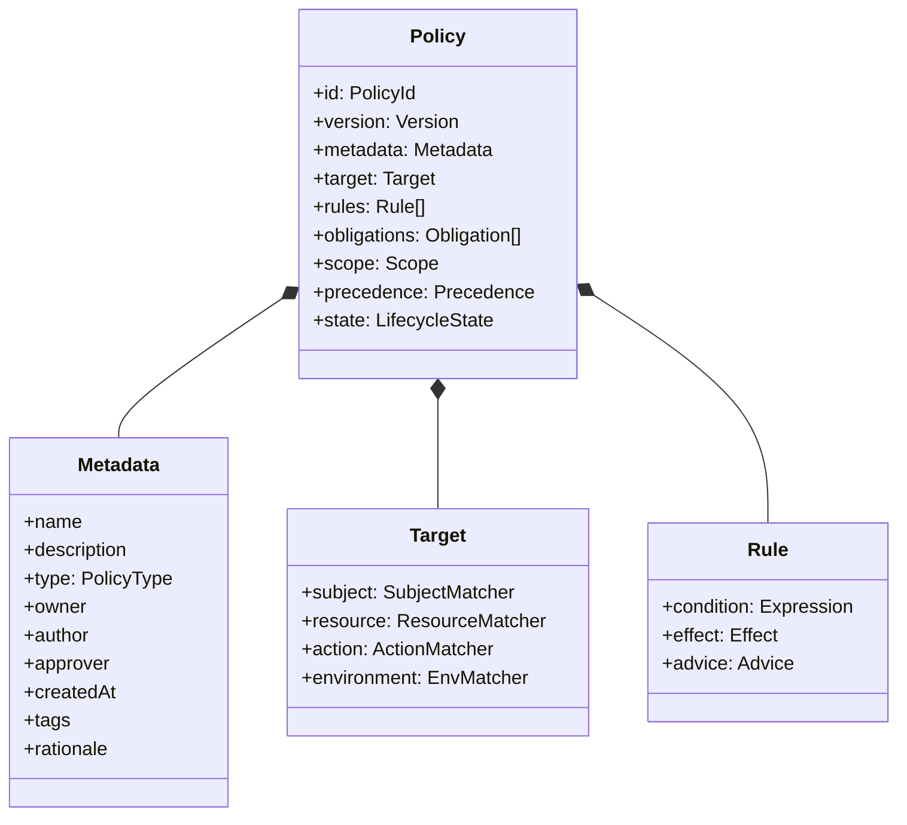
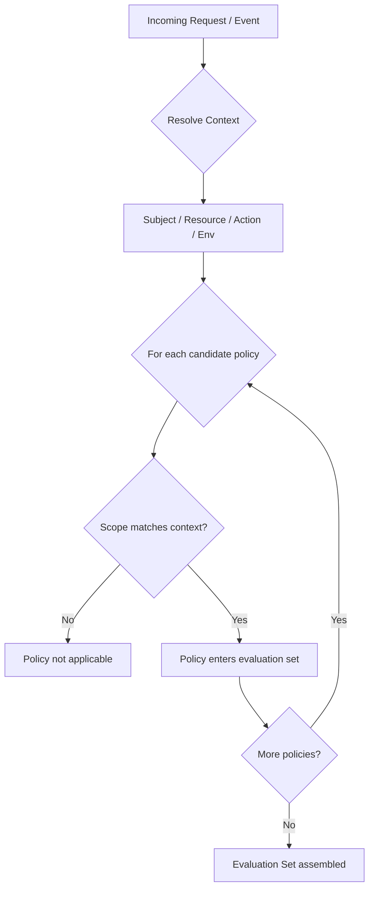
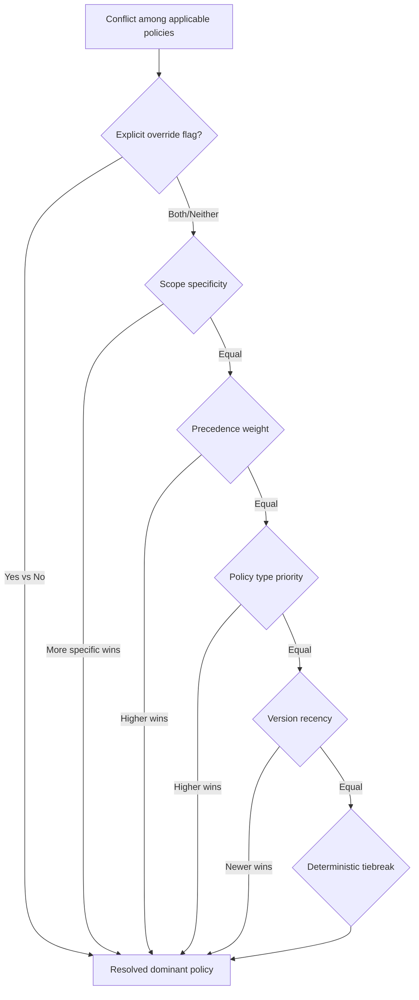
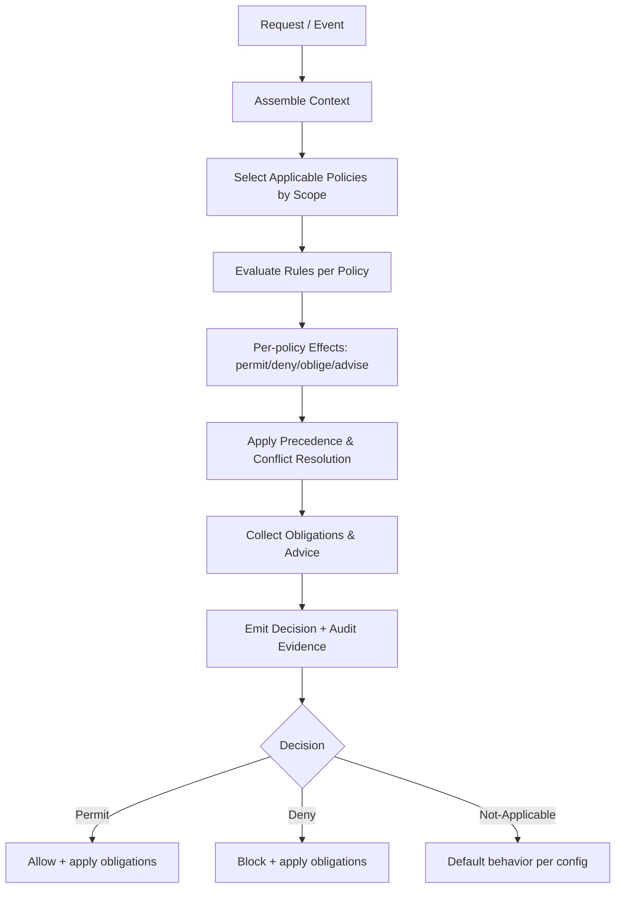
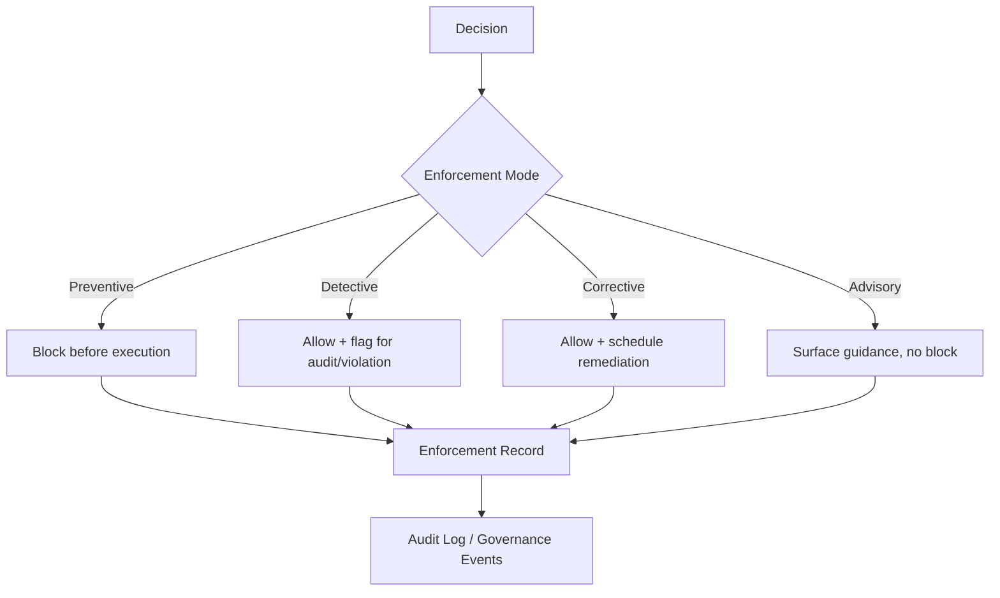
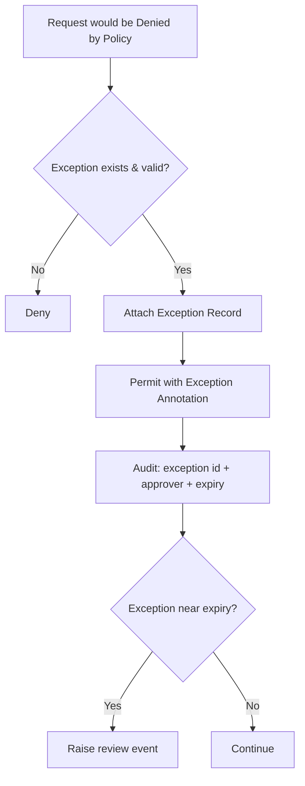
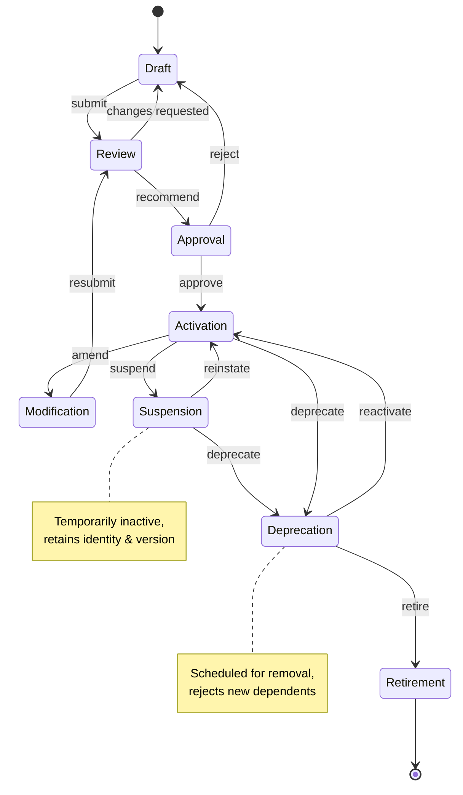

# Part 13.3: Policy Architecture

> **Purpose:** Define the policy architecture of AI-OS governance — how policies are structured, scoped, precedence-ranked, evaluated, enforced, composed, lifecycled, versioned, distributed, validated, audited, secured, governed, and evented.
> **Foundation:** Authoritative policy reference: [policies.md](./policies.md); Policy schemas: [schemas.md](./schemas.md); Policy events: [governance-events.md](./governance-events.md).
> **Conformance:** Aligns with Part 12 schema governance (§§1-34) and the `governance` namespace event contract.

---

## Table of Contents

1. [Policy Definition and Essentials](#1-policy-definition-and-essentials)
2. [Policy Structure](#2-policy-structure)
3. [Policy Types](#3-policy-types)
4. [Policy Scope](#4-policy-scope)
5. [Policy Precedence](#5-policy-precedence)
6. [Policy Evaluation](#6-policy-evaluation)
7. [Policy Enforcement](#7-policy-enforcement)
8. [Policy Composition](#8-policy-composition)
9. [Policy Inheritance](#9-policy-inheritance)
10. [Policy Conflict Resolution](#10-policy-conflict-resolution)
11. [Policy Exceptions](#11-policy-exceptions)
12. [Policy Overrides](#12-policy-overrides)
13. [Policy Delegation](#13-policy-delegation)
14. [Policy Lifecycle](#14-policy-lifecycle)
15. [Policy Versioning](#15-policy-versioning)
16. [Policy Compatibility](#16-policy-compatibility)
17. [Policy Distribution](#17-policy-distribution)
18. [Policy Synchronization](#18-policy-synchronization)
19. [Policy Caching](#19-policy-caching)
20. [Policy Validation](#20-policy-validation)
21. [Policy Auditability](#21-policy-auditability)
22. [Policy Security](#22-policy-security)
23. [Policy Governance](#23-policy-governance)
24. [Policy Events](#24-policy-events)
25. [Policy Schemas](#25-policy-schemas)
26. [Policy Conformance](#26-policy-conformance)
27. [Policy Failure Handling](#27-policy-failure-handling)
28. [Integration with Governance Components](#28-integration-with-governance-components)
29. [Cross-References](#29-cross-references)

---

## 1. Policy Definition and Essentials

A **policy** is a declarative statement of an obligation, permission, prohibition, or condition that governs behavior within AI-OS. Policies are the unit of intent in the governance system: they express *what should happen* without specifying *how* the underlying systems accomplish it.

> **Design note:** Policies are data, not code. They are treated as governed artifacts subject to the same review, approval, audit, and retirement discipline as any other first-class entity in AI-OS.

### 1.1 Policy Properties

A policy has the following essential properties:

| Property | Description |
|----------|-------------|
| **Declarative** | States intent, not implementation. |
| **Addressable** | Every policy has a stable, unique identifier. |
| **Versioned** | Every policy has a version and a lineage. |
| **Evaluable** | Given a context, a decision can be derived. |
| **Attributable** | Every policy has an author, owner, and approver. |
| **Scoped** | Every policy applies within a defined scope. |
| **Lifecycle-bound** | Every policy exists within a defined lifecycle state. |

### 1.2 Artifact Relationships

Policies are distinct from, but related to, other governance artifacts:

| Artifact | Relationship to Policy |
|----------|------------------------|
| **Rule** | A single evaluable assertion. A policy may contain one or many rules. |
| **Control** | An enforcement mechanism that realizes one or more policies. |
| **Decision** | An outcome produced by evaluating policies against context. |
| **Standard** | A normative expectation that policies may reference but do not themselves enforce. |
| **Procedure** | An operational sequence; policies constrain procedures but are not procedures. |
| **Constraint** | A policy may be expressed as a constraint on a parameter, resource, or action. |

---

## 2. Policy Structure

A policy is composed of a set of orthogonal structural elements. An implementation may serialize these elements in any representation (JSON, YAML, a DSL, a graph, a registry row) so long as the semantics are preserved.

The canonical structural fields are:

| Field | Description |
|-------|-------------|
| **Identity** | `id`, `version`, `revision`, lineage pointer. |
| **Metadata** | name, description, type, owner, author, approver, creation/modification timestamps, tags, rationale, external references. |
| **Target / Applicability** | The set of subjects, resources, actions, and environmental conditions to which the policy applies. |
| **Rules** | One or more evaluable assertions. Each rule carries a condition and an effect (`permit`, `deny`, `oblige`, `advise`, `transform`). |
| **Obligations / Advice** | Side-effects or recommendations triggered when the policy matches (e.g., "log", "notify", "annotate", "require-step-up"). |
| **Scope** | The boundary within which the policy operates (see §4). |
| **Precedence** | The priority weight used during conflict resolution (see §5). |
| **State** | The lifecycle state (see §14). |
| **Signatures / Provenance** | Cryptographic or attestation metadata used for Policy Security. |

A **policy set** (or policy bundle) is a named, versioned collection of policies distributed and evaluated together. A **policy rule** is the atomic evaluable unit inside a policy.

---

## 3. Policy Types

AI-OS recognizes the following conceptual policy categories. These are *categories of intent*, not mutually exclusive taxonomies — a single policy may belong to more than one category. Each category describes the **domain of concern** the policy governs.

### 3.1 Security Policies
Policies that protect the confidentiality, integrity, and availability of AI-OS. They govern authentication, authorization, encryption, secrets handling, network exposure, and trust boundaries.

- Examples: "All inter-service calls must be mutually authenticated." "Secrets must never be written to persistent logs."

### 3.2 Agent Policies
Policies that govern the behavior of autonomous and semi-autonomous agents: their autonomy level, decision thresholds, interaction constraints, and allowed actions.

- Examples: "An agent may not modify its own policy set." "Agents classified as 'read-only' may not initiate write operations."

### 3.3 Capability Policies
Policies that govern access to and use of capabilities (tools, skills, APIs, models) exposed by AI-OS. They define which subjects may invoke which capabilities under which conditions.

- Examples: "The `deploy` capability requires dual approval above tenant quota." "Code-execution capability is disabled outside sandboxed runtimes."

### 3.4 Workflow Policies
Policies that govern the composition, ordering, and execution of workflows: approval gates, step constraints, concurrency limits, and rollback obligations.

- Examples: "Production workflows require a human approval gate before the deploy step." "No workflow may run longer than the configured maximum duration without renewal."

### 3.5 Resource Policies
Policies that govern the consumption and protection of computational and infrastructure resources: compute, memory, storage, network, quotas, and rate limits.

- Examples: "A tenant may not exceed N concurrent executions." "Burst capacity is only available during the configured maintenance window."

### 3.6 Data Policies
Policies that govern data classification, residency, retention, access, and handling across its lifecycle.

- Examples: "Personally identifiable data must remain in its region of origin." "Data older than the retention period must be purged or anonymized."

### 3.7 Knowledge Policies
Policies that govern the knowledge substrate: provenance, curation, access to knowledge assets, and the derivation/use of inferences.

- Examples: "Knowledge entries require a cited source before promotion to trusted state." "Derivative knowledge inherits the most restrictive source classification."

### 3.8 Governance Policies
Policies that govern the governance system itself: who may create, approve, delegate, and audit policies; quorum requirements; and escalation paths.

- Examples: "Policy approval requires at least two distinct approvers." "Governance policy changes require council ratification."

### 3.9 Compliance Policies
Policies that map internal behavior to external obligations: regulations, contracts, certifications, and frameworks. They make external requirements enforceable internally.

- Examples: "All access to restricted datasets must be reportable for audit." "Records must be retained per the applicable regulatory schedule."

### 3.10 Operational Policies
Policies that govern day-to-day operation: availability targets, incident response, observability, scheduling, and maintenance windows.

- Examples: "Critical paths must emit a heartbeat every N seconds." "Maintenance mode suppresses non-essential automation."

### 3.11 Architecture Policies
Policies that govern the structure and evolution of the system: allowed dependency directions, interface contracts, technology constraints, and ADR conformance.

- Examples: "No component may depend on a layer above it." "New interfaces must conform to the published API contract before activation."

---

## 4. Policy Scope

**Scope** defines the boundary within which a policy is authoritative. A policy only applies when the evaluation context falls within its scope. Scopes are composable and may be nested.

Common scope dimensions:

| Dimension | Description |
|-----------|-------------|
| **Subject Scope** | The actors (agents, users, services, roles) the policy binds. |
| **Resource Scope** | The assets, datasets, capabilities, or components the policy covers. |
| **Tenant / Organizational Scope** | The business or organizational unit the policy applies to. |
| **Environment Scope** | The deployment environment (dev, staging, prod, region). |
| **Temporal Scope** | The time window during which the policy is effective. |
| **Topological Scope** | The subsystem, domain, or trust zone the policy governs. |
| **Action Scope** | The specific actions or operation types the policy constrains. |

A policy's effective scope is the **intersection** of all its scope dimensions. If any required dimension is unresolvable for a given context, the policy does not apply (absence of applicability is not denial — see §6).

---

## 5. Policy Precedence

When multiple policies apply to the same context, **precedence** determines which policy's decision dominates when effects conflict. Precedence is an ordered, multi-level ranking.

Precedence is resolved by comparing policies along the following ordered axes (highest priority first):

1. **Explicit override flag** — a policy marked as an explicit override takes precedence over non-override policies (subject to override authorization; see §12).
2. **Scope specificity** — a more specific scope outranks a more general scope (e.g., tenant-specific beats global).
3. **Precedence weight** — a numeric or ordinal priority assigned to the policy.
4. **Policy type priority** — a configured ordering of policy types (e.g., Security > Compliance > Operational), used only as a tiebreaker.
5. **Version recency** — newer versions outrank older versions of the same policy lineage.
6. **Deterministic tiebreak** — a stable, documented rule (e.g., policy id lexicographic order) used only when all else is equal.

> **Principle:** Precedence is *explicit and inspectable*. The system must be able to report *why* a given policy won a conflict, in human-readable form, as part of §21 Policy Auditability.

---

## 6. Policy Evaluation

**Evaluation** is the process of transforming a set of applicable policies and a context into a decision. Evaluation is pure with respect to the context: given the same context and policy set, it always yields the same decision (deterministic).

The evaluation flow:

1. **Context assembly** — gather the subject, resource, action, environment, and any relevant attributes.
2. **Candidate selection** — select all policies whose scope matches the context.
3. **Rule evaluation** — for each candidate, evaluate its rules against the context, producing per-policy effects.
4. **Conflict resolution** — apply precedence to reconcile conflicting effects.
5. **Obligation/advice assembly** — collect obligations and advice triggered by matching policies.
6. **Decision emission** — emit a decision: `permit`, `deny`, or `not-applicable`, along with obligations, advice, and the audit record.

**Default behavior** when no policy applies is configurable per domain: it may be `deny-by-default` (most restrictive, default for security-sensitive domains) or `permit-by-default` (most permissive, default for low-risk operational domains). The default is itself a policy-declared choice, never an implicit implementation accident.

### Decision Outcomes

| Outcome | Meaning |
|---------|---------|
| `permit` | The action is allowed, subject to obligations. |
| `deny` | The action is forbidden. |
| `not-applicable` | No policy governed this action; the domain default applies. |
| `indeterminate` | Evaluation could not complete (missing attribute, policy error); handled via §27 Policy Failure Handling. |

---

## 7. Policy Enforcement

**Enforcement** is the act of applying a decision to runtime behavior. Evaluation decides; enforcement acts. Enforcement points (the components that apply decisions) are distinct from the evaluation engine and may be located at boundaries (API gateways, capability invocation points, workflow steps, data access layers).

Enforcement modes:

| Mode | Description |
|------|-------------|
| **Preventive** | Blocks the action before it occurs. |
| **Detective** | Allows the action but records a violation for later response. |
| **Corrective** | Allows then remediates (e.g., quarantine, rollback). |
| **Advisory** | Surfaces guidance without blocking. |

**Obligations** produced by evaluation must be satisfied for the action to be considered compliant. An unmet obligation converts a `permit` into a violation or `indeterminate` state, depending on configuration.

Enforcement must be **fail-closed or fail-open by explicit policy**, never by accident:

- *Fail-closed* (default for security/compliance): on enforcement error, deny.
- *Fail-open* (explicitly declared): on enforcement error, allow but flag.

---

## 8. Policy Composition

**Composition** is the structured combination of multiple policies into a single coherent decision. Rather than evaluating one monolithic policy, AI-OS composes policies at evaluation time.

Composition patterns:

- **Union**: all applicable policies contribute; effects merged then resolved by precedence.
- **Intersection**: the decision is the strictest common effect (deny if any denies).
- **Layering**: policies are applied in ordered layers (e.g., base platform → tenant → team → local), each layer refining the previous.
- **Refinement**: a higher-specificity policy refines (narrows or specializes) a broader one without contradicting it.
- **Delegated composition**: a policy delegates part of its decision to another policy domain (see §13).

Composition must preserve **monotonicity where possible**: adding a more restrictive policy should never relax an existing restriction. Non-monotonic composition (relaxation) is permitted only through explicit override authorization.

---

## 9. Policy Inheritance

**Inheritance** allows a policy to derive attributes, scope, rules, or precedence from a parent policy or policy template. Inheritance reduces duplication and keeps related policies consistent.

Inheritance semantics:

- A child policy inherits all parent fields unless explicitly overridden.
- Inherited rules are evaluated together with child rules.
- Overriding a rule in the child shadows — but does not delete — the parent rule (the parent rule remains visible for audit).
- Inheritance may be single or multiple, but multiple inheritance requires an explicit merge order.
- A change to a parent policy propagates to children unless a child has frozen its inheritance (pinned version).

Inheritance is a **modeling convenience**, not a privilege escalation: a child policy may only be *more specific or more restrictive* than its parent unless it carries an explicit override authorization.

---

## 10. Policy Conflict Resolution

A **policy conflict** occurs when two or more applicable policies produce incompatible effects (e.g., one permits, another denies the same action). Conflict resolution operates in two phases:

1. **Intra-policy**: conflicting rules *within* a single policy are resolved by that policy's internal rule-combining algorithm (e.g., first-match, deny-overrides, permit-overrides).
2. **Inter-policy**: conflicts *across* policies are resolved by §5 Policy Precedence.

Resolution guarantees:

- **Determinism**: the same conflict always resolves the same way.
- **Explainability**: the resolution records which policy won and why.
- **Conservatism**: when precedence cannot resolve a conflict definitively, the most restrictive effect (deny) prevails unless a domain default of permit is explicitly declared.
- **Surfacing**: unresolvable or suspicious conflicts are emitted as governance events for review (see §24 Policy Events).

---

## 11. Policy Exceptions

An **exception** is a sanctioned, time-bounded deviation from a policy for a specific case. Exceptions are first-class, governed artifacts — not silent bypasses.

Exception properties:

- **Justification**: a recorded reason tied to a risk acceptance or approval.
- **Bounded scope**: applies to a specific subject/resource/action, never globally.
- **Time-box**: an expiration after which the exception lapses automatically.
- **Approver**: an authority empowered to grant the exception.
- **Review trigger**: exceptions approaching expiry or exceeding threshold trigger review.

Exceptions must never be used to permanently disable a policy. An exception that is repeatedly renewed is a signal to modify the underlying policy (see §14 Policy Lifecycle), not to extend the exception indefinitely.

---

## 12. Policy Overrides

An **override** is a deliberate, authorized reversal of a policy's effect — distinct from an exception in that it is typically broader in intent and explicitly authorized at a higher level of authority.

Override characteristics:

- Requires an **override authorization** (a policy or role empowered to override).
- Must carry a **rationale** and an **authorizer identity**.
- Is **logged and alerted** — overrides are treated as notable governance events.
- May be **emergency** (immediate, ratified retroactively) or **planned** (pre-authorized within bounds).
- Is **expirable** — emergency overrides must be confirmed or they auto-revert.

| Aspect | Exception | Override |
|--------|-----------|----------|
| Typical scope | Narrow, single-case | May be broader or structural |
| Authority level | Policy owner / delegated approver | Higher authority or emergency role |
| Intent | Accommodate a special case | Reverse or suspend a policy effect |
| Duration | Time-boxed, renewable with review | Expirable, emergency requires confirmation |

---

## 13. Policy Delegation

**Delegation** transfers a portion of policy authority from one authority to another. Delegation is itself governed by policies (see §3.8 Governance Policies) and is always bounded.

Delegation properties:

- **Delegable scope**: exactly what may be delegated (e.g., "approve data policies for tenant X").
- **Delegable actions**: create, approve, suspend, etc.
- **Constraints**: cannot delegate more authority than one holds; cannot delegate the power to delegate further unless explicitly permitted.
- **Revocability**: delegation may be revoked; revocation takes effect per §18 Policy Synchronization.
- **Attestation**: delegates act in the name of, and remain accountable to, the delegating authority.

Delegation flow:

1. Delegating authority issues a delegation policy with bounded scope.
2. Delegate gains the delegated rights within that scope.
3. Actions taken under delegation are attributed to both delegate and delegator.
4. Revocation or expiry removes the delegated rights and any policies created under them enter review.

---

## 14. Policy Lifecycle

Every policy traverses a well-defined lifecycle. The states are **Draft, Review, Approval, Activation, Modification, Suspension, Deprecation, Retirement**. Movement between states is controlled by governance policies and recorded as events.

### Draft
The policy is under authoring. It is not evaluable and carries no enforcement effect. Drafts are visible only to authors and reviewers.

### Review
The draft is submitted for review. Reviewers assess correctness, scope, conflicts, security, and conformance. Review may result in comments, requested changes (back to Draft), or a recommendation for approval.

### Approval
An empowered approver ratifies the policy. Approval requires satisfying quorum and separation-of-duties rules defined in §3.8 Governance Policies. Approval transitions the policy toward Activation but does not itself make it enforceable until Activated.

### Activation
The policy becomes live and enters the evaluable/enforceable set. Activation may be immediate or scheduled (temporal scope). Upon activation, the policy is distributed (see §17 Policy Distribution).

### Modification
An active (or drafted) policy is amended. Modifications create a new version and re-enter the lifecycle from Draft/Review (or a fast-track review path for low-risk changes). The prior version remains available for audit and rollback.

### Suspension
The policy is temporarily removed from enforcement without losing identity or version history. Suspension is used for incident response, emergency overrides, or pending investigation. A suspended policy can be reinstated or progressed to Deprecation.

### Deprecation
The policy is marked for removal. It remains enforceable only for a transition period, rejects new dependents, and emits warnings where referenced. Deprecation is the graceful off-ramp before Retirement.

### Retirement
The policy is permanently removed from the active set and archived. Retired policies are retained for auditability but are never evaluated or enforced. Retirement is irreversible in the active set (the archived copy persists).

---

## 15. Policy Versioning

Every policy is versioned. A **version** captures a specific, immutable content state of a policy. Versions form a lineage.

Versioning rules:

- Versions are **immutable** once activated; changes produce a new version.
- Version identifiers follow a documented scheme (semantic or sequential) agreed by the governance system.
- Each version records its predecessor and the reason for the change.
- Multiple versions of a policy lineage may coexist during transition (old still active, new in review), but only versions in `Activation` state are enforced.
- Rollback selects a prior version and re-activates it as a new version (never mutates history).

---

## 16. Policy Compatibility

**Compatibility** describes whether a new or modified policy version can coexist with, replace, or depend on other policies without breaking the system.

Compatibility dimensions:

- **Structural compatibility**: the new version conforms to the current schema (see §25 Policy Schemas).
- **Semantic compatibility**: the effect change is within acceptable drift (e.g., stricter is compatible; relaxation requires override authorization).
- **Dependency compatibility**: policies that depend on this one remain satisfiable.
- **Cross-version compatibility**: consumers referencing a versioned policy resolve correctly during transitions.

Incompatible changes are blocked at validation or flagged for elevated review.

---

## 17. Policy Distribution

**Distribution** is the propagation of policy artifacts from the source of truth (the policy authority/registry) to the enforcement and evaluation points that need them.

Distribution characteristics:

- **Source of truth**: a single authoritative store; replicas are derived, never authoritative.
- **Push and/or pull**: policies may be pushed on change or pulled on demand by consumers.
- **Atomicity**: a policy set distributes as a unit; partial application is avoided or reconciled.
- **Integrity**: distributed policies carry provenance/signatures (see §22 Policy Security).
- **Scoped delivery**: only policies relevant to a consumer's scope are delivered.

---

## 18. Policy Synchronization

**Synchronization** keeps distributed copies of policies consistent with the source of truth over time. It is the continuous counterpart to one-time Distribution.

Synchronization concerns:

- **Eventual consistency**: consumers converge to the latest authoritative state; the convergence window is bounded and monitored.
- **Change propagation**: updates, suspensions, and retirements propagate with minimal lag.
- **Conflict on drift**: if a consumer's local copy diverges unexpectedly, it is reconciled to the source.
- **Quiescence handling**: during network partitions, consumers apply their last-known-good state per the fail-closed/open policy.

---

## 19. Policy Caching

**Caching** improves evaluation performance by storing resolved policies, evaluation results, or decision outcomes close to enforcement points.

Caching discipline:

- **Invalidation**: caches are invalidated on any policy change, suspension, or expiry event.
- **TTL bounds**: cached decisions carry a maximum lifetime; sensitive domains use short or zero TTL.
- **Consistency**: caches never serve content newer than the consumer's synchronized state.
- **Auditability**: cache hits still produce decision records referencing the source policy version.

---

## 20. Policy Validation

**Validation** confirms that a policy is well-formed, conformant, and safe before it advances in its lifecycle.

Validation layers:

| Layer | Checks |
|-------|--------|
| **Syntactic** | Structure, required fields, schema conformance. |
| **Semantic** | Rule expressiveness, reference integrity, no contradictions. |
| **Scope** | Scope is well-defined and non-vacuous. |
| **Conflict** | Detects conflicts with existing active policies; reports, does not auto-resolve. |
| **Security** | Checks for privilege escalation, unsafe overrides, orphaned obligations. |
| **Conformance** | Aligns with schemas and governance standards (see §26 Policy Conformance). |

Failed validation blocks progression past the current lifecycle state and emits a governance event.

---

## 21. Policy Auditability

**Auditability** ensures that every policy and every decision it influences can be reconstructed, explained, and attested after the fact.

Auditability requirements:

- Every policy version is immutable and retained (including retired).
- Every evaluation emits a **decision record**: context hash, policies applied, precedence outcome, obligations, and result.
- Every enforcement action records the decision it enforced.
- Every lifecycle transition records actor, timestamp, and reason.
- Audit records are tamper-evident (see §22 Policy Security).
- Audit trails support "show me why this was denied" and "show me who approved this" queries.

Every policy and evaluation decision is recorded in the G-09 Audit Manager as an immutable audit entry, conforming to the Part 12 audit record schema.

---

## 22. Policy Security

**Policy security** protects policies as high-value governance assets. A compromised policy can subvert the entire system, so policies receive the strongest controls.

Security controls:

- **Integrity**: policies are signed/attested by their authority; unauthorized modification is detectable.
- **Authenticity**: the author and approver of every policy are verifiable.
- **Confidentiality**: policy content visibility is itself policy-governed (some policies are restricted).
- **Non-repudiation**: authors/approvers cannot deny their actions.
- **Tamper-evidence**: audit and decision records detect alteration.
- **Least exposure**: enforcement points receive only the policies within their scope.
- **Protected lifecycle**: transitions (especially Approval, Override, Retirement) require strong authorization.

Policy secrets and restricted policy content are governed by data policies in Part 9 and security policies in §13.10.

---

## 23. Policy Governance

**Policy governance** is the meta-layer: the policies and bodies that govern how policies themselves are created, approved, and changed.

Governance elements:

- **Ownership**: every policy has a clear owner accountable for its correctness and relevance.
- **Authorities**: defined roles empowered to draft, review, approve, suspend, and retire.
- **Councils/committees**: bodies that ratify cross-cutting or high-impact policies (see [13.5-Governance-Councils-and-Committees.md](./13.5-Governance-Councils-and-Committees.md)).
- **Quorum & separation of duties**: approval requires independent approvers.
- **Review cadence**: policies are periodically re-reviewed to avoid staleness.
- **Meta-policies**: policies that constrain the policy system itself (e.g., "no policy may grant itself override").

The Policy Manager (G-01) executes policy lifecycle operations. The Approval Manager (G-12) routes approval decisions. The Governance Council (G-04) ratifies high-impact policies. The Conformance Manager (G-15) verifies ongoing policy conformance.

---

## 24. Policy Events

**Policy events** are the observable signals emitted by the policy system. They drive synchronization, auditability, monitoring, and reaction.

Policy events are first-class governance events registered in the `governance.*` namespace (see [governance-events.md](./governance-events.md) §2, policy aggregate).

Canonical event types:

| Event | Trigger |
|-------|---------|
| `governance.policy.created` | A policy enters Draft. |
| `governance.policy.updated` | Revision committed. |
| `governance.policy.submitted` | Draft submitted for review; emits `approval.requested`. |
| `governance.policy.approved` | Authorized approval. |
| `governance.policy.activated` | Policy becomes enforceable. |
| `governance.policy.suspended` | Policy suspended. |
| `governance.policy.deprecated` | Policy deprecated. |
| `governance.policy.retired` | Policy retired. |
| `governance.policy.override.granted` | An override is applied. |
| `governance.policy.exception.requested` | An exception request is submitted. |
| `governance.policy.exception.approved` | An exception is granted. |
| `governance.policy.exception.rejected` | An exception request was denied. |
| `governance.policy.exception.expiring` | An exception nears expiry. |
| `governance.policy.conflict.detected` | An unresolvable or suspicious conflict is found. |
| `governance.policy.validation.failed` | Validation blocked progression. |
| `governance.policy.violation.detected` | Enforcement detected a violation (causation-linked to `security.policy.violated` in Part 12 §13.1). |

Events are emitted through the Governance Event Manager (G-14) and persisted by the Audit Manager (G-09). Policy-specific events are cataloged with event IDs, schemas, and producer/consumer mappings in [governance-events.md](./governance-events.md) §3.1.

---

## 25. Policy Schemas

**Policy schemas** define the canonical structure every policy representation must satisfy. A schema is the contract between policy authors, the evaluation engine, and enforcement points.

The following schemas are defined in [schemas.md](./schemas.md):

| Schema | Purpose |
|--------|---------|
| **Policy** | Defines the structure for governance policies. Fields: `policyId`, `name`, `version`, `description`, `policyType`, `rules`, `scope`, `targetEntities`, `effectiveFrom`, `effectiveUntil`, `enforcementLevel`, `createdBy`, `createdAt`, `updatedAt`, `tags`, `metadata`. |
| **PolicySet** | Defines a collection of related policies managed and evaluated as a unit. Fields: `policySetId`, `name`, `version`, `description`, `policyType`, `policies`, `scope`, `conflictResolutionStrategy`, `createdBy`, `createdAt`, `updatedAt`, `tags`, `metadata`. |
| **PolicyEvaluationRequest** | Request envelope for policy evaluation. Fields: `requestId`, `sessionId`, `context`, `policyScope`, `grain`, `principalChain`. |
| **PolicyEvaluationResult** | Result of a policy evaluation. Fields: `requestId`, `decision`, `appliedPolicies`, `appliedFacts`, `exceptionRef`, `obligations`, `advice`, `decisionTimestamp`, `correlationId`. |
| **PolicyException** | Defines an exception to a policy rule. Fields: `exceptionId`, `description`, `condition`, `justification`, `grantedBy`, `grantedAt`, `expiresAt`, `metadata`. |
| **PolicyOverride** | Defines an override of policy effects. Fields: `overrideId`, `policyId`, `rationale`, `authorizer`, `authorizedAt`, `expiresAt`, `overrideType`. |

Schema governance follows Part 12 §§1-34. Schema versioning is semantic; backward compatibility is maintained for minor and patch versions. Breaking changes require major version increment and elevated review.

---

## 26. Policy Conformance

**Conformance** is the property that an implementation, policy, or consumer adheres to the declared schemas, standards, and governance rules.

Conformance dimensions:

- **Schema conformance**: the policy validates against the current schema.
- **Semantic conformance**: the policy's effects match intended governance outcomes.
- **Engine conformance**: an evaluation/enforcement engine implements the required capabilities (precedence, composition, inheritance, conflict resolution) correctly.
- **Consumer conformance**: enforcement points correctly apply decisions and obligations.

Conformance is continuously verified by the Conformance Manager (G-15) and reported. Non-conformance is a governance event and may block activation. The Conformance Manager evaluates three conformance domains (see [13.2-Governance-Architecture.md](./13.2-Governance-Architecture.md) §4.16 G-15):

1. **Policy conformance**: does current behavior match the published policy envelope?
2. **Control conformance**: are controls designed and operating effectively against obligation baselines?
3. **Governance conformance**: are governance processes (approval, exception, review cycle) followed?

---

## 27. Policy Failure Handling

**Policy failure handling** defines behavior when the policy system itself cannot operate correctly — missing policies, evaluation errors, synchronization loss, or enforcement failure.

Failure modes and safe responses:

| Failure | Safe behavior |
|---------|---------------|
| **Missing attribute / indeterminate evaluation** | Apply domain default; if none, fail closed for sensitive domains. |
| **Policy engine unavailable** | Enforce last-known-good decision per fail-closed/open policy; emit event. |
| **Stale cache after change** | Invalidate; re-fetch; if unavailable, apply fail-closed/open. |
| **Sync partition** | Operate on last-known-good; bound and monitor the partition window. |
| **Conflicting unresolvable policies** | Deny (conservative) and raise a conflict event. |
| **Invalid/unsigned policy** | Reject; do not enforce; emit security event. |
| **Obligation cannot be satisfied** | Convert permit to violation/indeterminate per config; emit event. |

Failure handling principles:

- **Never silent**: every failure is observable via events and audit.
- **Explicit fail mode**: closed vs. open is a declared policy choice, not an implementation default.
- **Recoverable**: on recovery, the system reconciles to authoritative state without losing audit continuity.
- **Bounded risk**: fail-closed is the default for security, compliance, and data domains.

---

## 28. Integration with Governance Components

The policy architecture integrates with Part 13 governance components as follows:

| Component | Policy Integration |
|-----------|-------------------|
| **G-00 Governance Manager** | Orchestrates governance sessions that invoke policy evaluation; receives evaluation decisions and routes to enforcement. |
| **G-01 Policy Manager** | Owns policy lifecycle (Draft → Review → Approval → Activation → Suspension → Deprecation → Retirement); creates policy packages with version management. |
| **G-02 Policy Evaluation Engine** | Performs runtime evaluation of policies against context; produces evaluation decisions with full audit records; applies exceptions injected by G-11. |
| **G-03 Governance Registry** | Stores canonical policy packages and snapshots; provides lookup by ID, version, scope, and effective date for G-02. |
| **G-04 Governance Council** | Ratifies high-impact policies; charter defines policy taxonomy and approval authorities. |
| **G-05 Decision Authority Manager** | Resolves whether actors have authority to create/modify policies within their scope; tracks threshold consumption. |
| **G-11 Exception Manager** | Manages sanctioned deviations from policies; exception scope injected into G-02 evaluation context. |
| **G-12 Approval Manager** | Routes policy approval requests to designated approvers; records approval decisions with governance authority linkage. |
| **G-13 Control Manager** | Designs controls that realize policy obligations; tests control effectiveness against policy requirements. |
| **G-14 Governance Event Manager** | Receives and routes all policy events (`governance.policy.*`); maintains event correlation for session tracing. |
| **G-15 Conformance Manager** | Evaluates policy conformance against published policy envelopes; produces conformance scores and gap reports. |
| **G-09 Audit Manager** | Persists immutable audit records of all policy decisions, lifecycle transitions, and enforcement actions. |
| **G-10 Accountability Manager** | Binds every policy action to accountable principals; supports attribution for audit trails. |

### 28.1 Bootstrap Sequencing for Policies

1. **G-03** initializes with the policy schema artifact.
2. **G-01** loads the initial policy package into G-03.
3. **G-14** accepts policy events once schema is loaded.
4. **G-02** loads policy snapshots and begins evaluation.
5. **G-00** begins orchestrating governance sessions that invoke G-02 evaluation.

This sequencing ensures policy artifacts are available before any evaluation occurs, and that the event backbone is ready before events are emitted.

### 28.2 Cross-Part Policy Integration

Policies govern all AI-OS operating parts:

- **Part 1**: Principal identity for policy authors, approvers, and subjects.
- **Part 3**: Data model context for policy evaluation (data classification, sensitivity).
- **Part 4**: Workflow policy enforcement at step boundaries.
- **Part 7**: Execution context for capability and workflow policy enforcement.
- **Part 8**: Agent policy integration — autonomy level, decision thresholds.
- **Part 9**: Data and knowledge policy enforcement (classification, retention, access).
- **Part 10**: Security policy enforcement (authentication, authorization, encryption).
- **Part 12**: Audit event integration — policy events conform to Part 12 envelope.

---

## 29. Cross-References

- **13.1 Architecture Overview** — governance principles, authority model, invariants.
- **13.2 Governance Architecture** — component specifications (G-01 Policy Manager, G-02 Evaluation Engine, G-03 Registry, G-12 Approval Manager, G-14 Event Manager, G-15 Conformance Manager).
- **13.4 Decision Authority and Delegation** — authority grants for policy creation/modification/approval.
- **13.5 Governance Councils and Committees** — policy ratification, quorum rules.
- **13.6 Risk and Compliance Governance** — risk treatment for policy exceptions, compliance obligations.
- **13.7 Agent and Capability Governance** — agent policies, capability policies.
- **13.8 Workflow and Execution Governance** — workflow policies, enforcement integration.
- **13.9 Data and Knowledge Governance** — data policies, data control linkages.
- **13.10 Security and Trust Governance** — security policies, trust boundaries.
- **13.11 Auditability and Accountability** — policy audit trails, principal binding.
- **13.12 Governance Invariants and Conformance** — policy conformance verification.
- **adrs.md** — Policy ADRs P13.POL.001–P13.POL.010.
- **governance-events.md** — Policy events (§3.1 Policy Aggregate), event registry.
- **schemas.md** — Policy, PolicySet, PolicyEvaluationRequest, PolicyEvaluationResult, PolicyException, PolicyOverride schemas.
- **dependency-map.md** — Policy architecture cross-part dependencies.
- **review-checklist.md** — Policy architecture conformance checklist items.

---

*← [Part 13.2: Governance Architecture](./13.2-Governance-Architecture.md) | [Part 13.4: Decision Authority and Delegation](./13.4-Decision-Authority-and-Delegation.md) →*