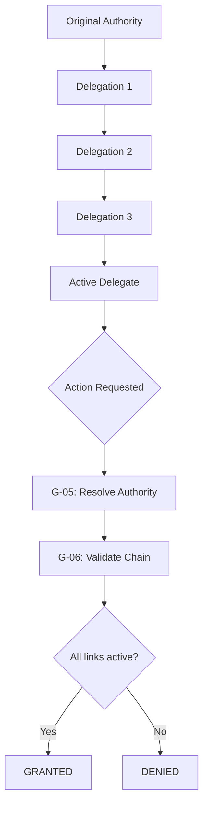

# Part 13.4: Decision Authority and Delegation

> **Purpose:** Define the decision authority model and delegation architecture that establishes who can decide what, at what scope, under what conditions, with full chain-of-custody and auditability.
> **Foundation:** Authority schema: [schemas.md](./schemas.md §Authority Schema); Delegation schema: [schemas.md](./schemas.md §Delegation Schema); Authority events: [governance-events.md](./governance-events.md §3.3).
> **Conformance:** Aligns with Part 12 event envelope and Part 5 principal allocation model.

---

## Table of Contents

1. [Authority Model](#1-authority-model)
2. [Decision Authority Principles](#2-decision-authority-principles)
3. [Authority Hierarchy](#3-authority-hierarchy)
4. [Authority Scope and Limitations](#4-authority-scope-and-limitations)
5. [Authority Types](#5-authority-types)
6. [Authority Resolution](#6-authority-resolution)
7. [Authority Lifecycle](#7-authority-lifecycle)
8. [Delegation Architecture](#8-delegation-architecture)
9. [Delegation Chains](#9-delegation-chains)
10. [Delegation Constraints](#10-delegation-constraints)
11. [Delegation Lifecycle](#11-delegation-lifecycle)
12. [Chain-of-Custody](#12-chain-of-custody)
13. [Threshold Management](#13-threshold-management)
14. [Authority Revocation](#14-authority-revocation)
15. [Delegation and Revocation Events](#15-delegation-and-revocation-events)
16. [Authority Schema](#16-authority-schema)
17. [Delegation Schema](#17-delegation-schema)
18. [Integration with Governance Components](#18-integration-with-governance-components)
19. [Cross-Part Integration](#19-cross-part-integration)
20. [Cross-References](#20-cross-references)

---

## 1. Authority Model

The **authority model** defines who may make decisions, at what scope, under what conditions, and how that authority may be exercised or transferred. Authority is the foundation of accountability: every governance decision must be attributable to an authority that was explicitly granted.

The model follows these core tenets:

- **Explicit Authority** (Principle 2): Authority must be explicitly granted, recorded, and validated at every decision point. Implicit authority is prohibited.
- **Minimum-Scope Delegation** (Principle 3): Authority is granted at the minimum scope and duration necessary. Delegation cannot exceed the delegator's authority.
- **Accountability** (Principle 6): Every governance action has a single accountable actor recorded in immutable audit logs.
- **Immutability** (Principle 7): Authority grants, delegations, and revocations are immutable records. Corrections are new events with explicit causation.

The authority model is expressed through two companion systems:

1. **Decision Authority Manager (G-05)**: Records authority grants and resolves whether a given actor has authority to perform an action within a scope.
2. **Delegation Authority Manager (G-06)**: Records delegation chains and validates that every delegation traces back to an active authority grant.

---

## 2. Decision Authority Principles

The following principles govern all authority and delegation decisions:

1. **Explicit Authority** (Principle 2): No implicit authority. Authority must be explicitly recorded as an artifact in G-03 with proof of grant.
2. **No self-grant** (Principle 4): An actor cannot grant authority to themselves. All grants require an artifact-backed authority source.
3. **Minimum-Scope Delegation** (Principle 3): No escalation beyond source. A delegated authority cannot exceed the scope, level, or constraints of its source.
4. **No silent revocation**: Revocation cascades to all downstream delegations and is recorded as an event.
5. **No circular delegation**: The delegation graph must be acyclic (enforced at grant creation).
6. **Bounded depth**: Maximum delegation chain depth is configurable in charter (default: 4 levels).
7. **Temporal bounds**: All authority grants have a defined lifetime; perpetual grants require explicit renewal.
8. **Scope fidelity**: Authority is always scoped — subject, resource, action, environment dimensions.

---

## 3. Authority Hierarchy

Governance authority flows through a five-level hierarchical model. Each level delegates downward while preserving accountability to its source. Authority cannot be aggregated upward — a lower level cannot override a higher level's explicit decision.

```text
Level 1: Supreme Authority
  └─> Level 2: System Authority
       └─> Level 3: Domain Authority
            └─> Level 4: Operational Authority
                 └─> Level 5: Emergency Authority
```

### Level 1: Supreme Authority
- **Scope**: Global, all-domain.
- **Holders**: Governance Council (G-04) and its designated successors.
- **Capabilities**: Define charter, approve architecture policies, ratify major exceptions, override any lower level.
- **Constraints**: Cannot be self-delegated. All actions must be recorded with full council quorum.

### Level 2: System Authority
- **Scope**: System-wide (all tenants, all agents within the operating domain).
- **Holders**: System architects, platform governance leads.
- **Capabilities**: Approve system-level policies, set system-wide standards, delegate to domain authorities.
- **Constraints**: Delegations must not exceed the authority granted by Level 1.

### Level 3: Domain Authority
- **Scope**: Specific governance domains (Agent, Data, Security, Workflow, Knowledge, etc.).
- **Holders**: Domain council members, domain-specific governance leads.
- **Capabilities**: Approve domain policies, define domain-specific controls, delegate operational authority.
- **Constraints**: Scope is bounded by the charter; cannot override higher-level policies.

### Level 4: Operational Authority
- **Scope**: Day-to-day operational decisions within a domain.
- **Holders**: Team leads, operational managers, designated agents.
- **Capabilities**: Approve operational exceptions, execute workflows within policy bounds, handle routine approvals.
- **Constraints**: Subject to continuous monitoring and threshold limits.

### Level 5: Emergency Authority
- **Scope**: Crisis response, time-boxed emergency overrides.
- **Holders**: Designated emergency responders, on-call operators.
- **Capabilities**: Bypass normal approval flows during declared emergencies, impose temporary restrictions.
- **Constraints**: Must be declared with justification; auto-expires after a configured window; ratified retroactively by G-12.

**Emergency Authority and the hierarchy:** Level 5 Emergency Authority supplements, not supplants, the upper hierarchy. It bypasses normal approval flows only within its own delegation scope during declared emergencies. It cannot override decisions made by Level 1–4 authorities acting from their own scope. Level 1–3 authority remains above Level 5 and may revoke an emergency authorization at any time.

---

## 4. Authority Scope and Limitations

Every authority grant specifies its scope through multiple dimensions:

| Dimension | Description | Validation |
|-----------|-------------|------------|
| **Subject Scope** | Which actors (agents, users, services) the authority covers. | Must match principal allocation in Part 5. |
| **Resource Scope** | Which resources, datasets, or capabilities the authority applies to. | Must reference entities registered in G-03. |
| **Action Scope** | Which operations the authority permits (create, approve, suspend, retire, etc.). | Action set must be a subset of source authority actions. |
| **Environment Scope** | Deployment environment, region, trust zone. | Must not exceed domain environment bounds. |
| **Temporal Scope** | Valid from / until timestamps. | `effectiveUntil` must be greater than `effectiveFrom`. |

Every authority also specifies **limitations** — constraints that narrow the grant:

- **Threshold limits**: Numeric caps (e.g., "approve up to $10,000").
- **Condition sets**: Contextual preconditions (e.g., "only during business hours").
- **Exclusion rules**: Actions or resources explicitly excluded.
- **Audit requirements**: Additional logging or attestation obligations.

---

## 5. Authority Types

Authorities are classified by their source and nature:

| Type | Description | Use Case |
|------|-------------|----------|
| `role_based` | Derived from a role assignment (Part 1/Part 5). | Standard operational authority. |
| `delegated` | Transferred from another authority via delegation. | Team lead authority delegated from domain head. |
| `expertise` | Based on domain expertise certification. | Security review authority for certified experts. |
| `organizational` | Derived from organizational position. | CTO authority for architecture decisions. |
| `derived` | Computed from a combination of other authorities. | Composite authority for multi-step approval. |

Every authority must be backed by a governance artifact in G-03. The Authority Schema (see §16) formalizes these types with fields for `authorityType`, `scope`, `domain`, `responsibilities`, `limitations`, `delegatedFrom`, `delegationDepth`, and `maxDelegationDepth`.

---

## 6. Authority Resolution

**Authority resolution** is the process of determining whether a given actor, performing a given action on a given target, holds valid authority at the time of the request.

The resolution process (executed by G-05):

```text
Actor requests action → Assemble context (actor, action, target, environment) → 
  Lookup authority grants for actor → 
  Filter by scope (subject, resource, action, environment) → 
  Check temporal validity (effectiveFrom/effectiveUntil) → 
  Check threshold consumption → 
  Check delegation chain validity (validate via G-06) → 
  Return: GRANTED | DENIED | BOUNDARY | UNAVAILABLE
```

### Resolution Outcomes

| Outcome | Meaning |
|---------|---------|
| `GRANTED` | Actor has valid authority; action is permitted. |
| `DENIED` | Actor has no authority for this action/scope. |
| `BOUNDARY` | Actor has authority but scope/threshold/approval constraints require escalation before the action may proceed. |
| `UNAVAILABLE` | Resolution could not complete (system error); triggers escalation. |

Resolution is cached by actor-scope-action tuple. Cache is invalidated on any grant lifecycle change or delegation revocation.

---

## 7. Authority Lifecycle

Authority grants follow a lifecycle managed by G-05:

```text
GRANT: PENDING_APPROVAL → ACTIVE → SUSPENDED → REVOKED → ARCHIVED
                 ↘ REJECTED (terminal)
```

| State | Description |
|-------|-------------|
| `PENDING_APPROVAL` | Grant created but not yet approved. Cannot be resolved. |
| `ACTIVE` | Grant is live and can be resolved. |
| `SUSPENDED` | Grant temporarily paused (e.g., during investigation). Cannot be resolved. |
| `REVOKED` | Grant permanently removed. Downstream delegations cascade-revoked. |
| `ARCHIVED` | Grant retained for audit only. |
| `REJECTED` | Grant application was denied. Terminal state. |

All state transitions are recorded as events via G-14 and persisted by G-09.

---

## 8. Delegation Architecture

**Delegation** transfers a portion of authority from one principal (the delegator) to another (the delegatee), preserving a chain of accountability back to the original authority source.

Key architectural properties:

- Delegation is **explicitly recorded** as a Delegation artifact in G-03.
- Every delegation **cites** the specific authority being delegated.
- Delegation has a **bounded scope** — subject, resource, action, and temporal dimensions.
- Delegation **cannot exceed** the delegator's own authority (Principle 3).
- Delegation is **revocable** — revoking a delegation revokes all downstream delegations (cascading revocation).
- Delegation depth is **bounded** — maximum chain depth is configurable (default: 4).
- The delegation graph is **acyclic** — circular delegations are rejected at creation.



---

## 9. Delegation Chains

A **delegation chain** is the full path from an action requester back to the original authority source. Every delegation creates a link in a chain.

### Chain Validation

When G-05 resolves authority, it delegates chain validation to G-06:

1. G-05 identifies all delegation links for the requesting actor.
2. G-06 validates each link in the chain:
   - Each grant is `ACTIVE`.
   - Each delegation traces to the correct authority.
   - No circular references.
   - Chain depth within configured maximum.
3. If all links are valid, the chain resolves; if any link is broken, resolution fails with `DENIED`.

**Chain integrity guarantee:** G-06 returns a `DelegationChain` record for every validation. If any link in the chain is invalid — revoked, expired, circular, or depth-exceeded — G-06 returns `DENIED` and G-05 does not grant authority. This guarantees that no downstream actor can exercise authority whose upstream chain has been broken.

### Chain Output

```
DelegationChain: {
  valid: bool,
  grant: Grant,
  previous: Grant | null,
  constraintsApplied: []
}
```

### Cascading Revocation

When any link in a delegation chain is revoked or expires:

- All downstream delegations are automatically invalidated.
- A `ChainInvalidated` event is emitted.
- A `ChainCascadedRevocation` event records the scope of the cascade.
- Affected actors receive authority resolution failures until they re-establish a valid chain.

---

## 10. Delegation Constraints

Delegation is subject to several constraints that must be validated at grant creation:

### 10.1 Authority Bound
The delegation must reference an authority (`authorityId`) that the delegator currently holds. The delegatee receives only the scope and actions within that authority.

### 10.2 Scope Constraint
The delegation's scope (subject, resource, action, environment, temporal) must be a subset of the delegator's authority scope. Narrowing is permitted; widening is prohibited.

### 10.3 Depth Constraint
```
maxDelegationDepth >= delegationDepth + 1
```
Each delegation can specify how much further it may be delegated. The default maximum depth is 4, configurable in the charter.

### 10.4 Temporal Constraint
```
delegation.effectiveFrom >= sourceGrant.effectiveFrom
delegation.effectiveUntil <= sourceGrant.effectiveUntil
```
Delegations cannot outlive their source authority.

### 10.5 No Self-Delegation
```
delegatorId ≠ delegateeId
```

### 10.6 No Circular Delegation
The delegation graph must remain acyclic. This is checked at creation time by G-06 against the existing graph.

### 10.7 Orphan Prevention
A delegation must trace to an active delegation grant and an upstream active grant. Orphaned delegations (whose upstream has been revoked) are automatically invalidated.

---

## 11. Delegation Lifecycle

Delegations follow a lifecycle managed by G-06:

```text
Grant: PENDING → ACTIVE → SUSPENDED → REVOKED → ARCHIVED
```

| State | Description |
|-------|-------------|
| `PENDING` | Delegation created but not yet active (e.g., scheduled for future). |
| `ACTIVE` | Delegation is live and part of an active chain. |
| `SUSPENDED` | Delegation temporarily paused (e.g., during investigation). |
| `REVOKED` | Delegation canceled; cascades to all downstream. |
| `ARCHIVED` | Retention-only state; no longer part of active chains. |

The delegation chain is `ACTIVE` only if all grants in the chain are `ACTIVE`.

---

## 12. Chain-of-Custody

Every authority grant and delegation creates an **audit trail** that records:

- **Who** granted the authority (principal + evidence reference).
- **When** it was granted (timestamp).
- **What** was granted (scope, actions, limitations).
- **To whom** it was granted (delegatee principal).
- **How long** it is valid (temporal bounds).
- **Why** it was granted (rationale, justification).

The G-10 Accountability Manager binds every authority action to its accountable principals. Every grant, delegation, and revocation is recorded as an immutable audit entry by G-09.

### Audit Evidence Fields

| Field | Description |
|-------|-------------|
| `authorityId` / `delegationId` | Artifact being recorded. |
| `actor` | Principal performing the action. |
| `principal` | Principal the action is taken on behalf of (if delegated). |
| `evidence` | Reference to backing artifact in G-03. |
| `boundAt` | Timestamp of binding. |
| `validUntil` | Expiration of binding. |

---

## 13. Threshold Management

Threshold management is governed by G-12 Approval Manager, which enforces configurable approval thresholds based on authority scope, delegation depth, and action classification. G-05 provides the authority context (delegator authority level, delegation depth, and remaining authority scope), and G-12 uses that context to determine whether an action requires additional approval.

**Threshold categories:**
- **Standard**: Actions within normal operational authority. No additional approval required.
- **Elevated**: Actions exceeding single-actor authority thresholds. Requires secondary approval.
- **Exceptional**: Actions exceeding delegation depth or scope boundaries. Requires council or higher-level approval.
- **Emergency**: Time-boxed emergency actions. Require post-hoc ratification.

**Threshold evaluation factors:**
- Authority scope and delegation depth
- Action classification and risk level
- Cumulative threshold consumption
- Temporal validity of the authority grant

- Tracks cumulative consumption of each threshold grant.
- Returns `BOUNDARY` when threshold is exceeded but authority exists.
- Emits `ThresholdConsumed` events for monitoring.
- Resets thresholds on a configured schedule or per-grant basis.
- Requires explicit renewal for high-value threshold consumption.

---

## 14. Authority Revocation

Authority and delegation revocation is a critical governance operation with cascading effects.

### Revocation Process

1. Authorizing principal (or automated system) requests revocation via G-06.
2. G-06 validates the revocation request against the authority grant.
3. If valid, G-06:
   - Marks the authority/delegation as `REVOKED`.
   - Identifies all downstream delegations that depend on this grant.
   - Cascades revocation to all downstream links.
   - Emits `DelegationRevoked` and `ChainCascadedRevocation` events.
4. G-09 records the revocation in the immutable audit trail.
5. G-10 updates principal bindings to reflect the revoked authority.

### Revocation Triggers

- **Explicit**: Principal or authority holder requests revocation.
- **Expiry**: Temporal bounds (`effectiveUntil`) reached.
- **Investigation**: Authority suspended pending investigation.
- **Structural change**: Organizational restructuring affects authority sources.
- **Compliance**: Authority revoked due to compliance violation.

---

## 15. Delegation and Revocation Events

Authority and delegation events are registered in the `governance.authority.*` event namespace (see [governance-events.md](./governance-events.md) §3.3).

### Authority Events

| Event | Trigger |
|-------|---------|
| `governance.authority.delegated` | A delegation grant is created. |
| `governance.authority.revoked` | An authority or delegation is revoked. |
| `governance.authority.granted` | An authority grant is approved and activated. |
| `governance.authority.resolved` | Authority resolution completed (GRANTED/DENIED/BOUNDARY/UNAVAILABLE). |
| `governance.authority.denied` | Authority resolution returned DENIED. |
| `governance.authority.boundary-hit` | Authority resolved but threshold/boundary exceeded. |
| `governance.authority.grant-suspended` | Authority grant suspended. |
| `governance.authority.grant-revoked` | Authority grant revoked. |
| `governance.authority.threshold-consumed` | Threshold usage recorded. |

### Delegation Events

| Event | Trigger |
|-------|---------|
| `governance.delegation.granted` | Delegation created. |
| `governance.delegation.validated` | Chain validation performed. |
| `governance.delegation.revoked` | Delegation revoked. |
| `governance.delegation.chain-invalidated` | A link in the chain broke. |
| `governance.delegation.chain-cascaded-revocation` | Cascading revocation across chain. |

All events use the Part 12 canonical envelope and are routed through G-14 for distribution to G-09 (persistence), G-10 (accountability), and consumers.

---

## 16. Authority Schema

The **Authority Schema** defines the canonical structure for authority grants. Full schema definition is in [schemas.md](./schemas.md) — Authority Schema section.

### Purpose
Establishes the rights, responsibilities, and accountabilities for making decisions, enforcing policies, and governing agent behavior.

### Fields

| Field | Type | Description |
|-------|------|-------------|
| `authorityId` | string (UUID v4) | Unique identifier for the authority. |
| `name` | string | Human-readable name. |
| `version` | string | Semantic version. |
| `description` | string (optional) | Detailed description of scope and responsibilities. |
| `authorityType` | string | Type: `role_based`, `delegated`, `expertise`, `organizational`, `derived`. |
| `scope` | string | Applicability: `global`, `system`, `workflow`, `agent_group`, `agent`. |
| `domain` | string | Governance domain this authority operates in. |
| `responsibilities` | array[string] | Specific responsibilities granted. |
| `limitations` | array[string] | Constraints on this authority. |
| `delegatedFrom` | string or null | Identifier of the authority from which this was delegated. |
| `delegationDepth` | integer | Depth in delegation chain (0 = original). |
| `maxDelegationDepth` | integer | Maximum allowed further delegation depth. |
| `effectiveFrom` | string (ISO 8601) | Start of validity. |
| `effectiveUntil` | string or null | End of validity. |
| `createdBy` | string | Principal that established the authority. |
| `createdAt` | string (ISO 8601) | Creation timestamp. |
| `updatedAt` | string (ISO 8601) | Last update timestamp. |

### Validation Rules
- `authorityType` must be a valid enum value.
- `scope` must be a valid scope enum value.
- `domain` must be a valid governance domain.
- `delegationDepth` ≥ 0; `maxDelegationDepth` ≥ `delegationDepth`.
- If `delegatedFrom` is provided, `delegationDepth` must be > 0; if null, `delegationDepth` must be 0.
- `effectiveUntil` must be greater than `effectiveFrom` if provided.
- All timestamps must be ISO 8601 formatted.

---

## 17. Delegation Schema

The **Delegation Schema** defines the canonical structure for delegation grants. Full schema definition is in [schemas.md](./schemas.md) — Delegation Schema section.

### Purpose
Records delegations of authority from one entity to another, including scope, limitations, and duration.

### Fields

| Field | Type | Description |
|-------|------|-------------|
| `delegationId` | string (UUID v4) | Unique identifier for the delegation. |
| `name` | string | Human-readable name. |
| `version` | string | Semantic version. |
| `description` | string (optional) | Description of the delegation's purpose and scope. |
| `delegatorId` | string | Entity delegating authority (agentId, authorityId, governanceBodyId). |
| `delegatorType` | string | Type: `agent`, `authority`, `governance_body`, `role`. |
| `delegateeId` | string | Entity receiving delegated authority. |
| `delegateeType` | string | Type: `agent`, `authority`, `governance_body`, `role`. |
| `authorityId` | string (UUID v4) | Specific authority being delegated. |
| `scope` | string | Applicability scope of the delegation. |
| `limitations` | array[string] | Specific limitations or constraints. |
| `effectiveFrom` | string (ISO 8601) | Start of delegation validity. |
| `effectiveUntil` | string or null | End of delegation validity. |
| `createdBy` | string | Principal that created the delegation record. |
| `createdAt` | string (ISO 8601) | Creation timestamp. |
| `updatedAt` | string (ISO 8601) | Last update timestamp. |

### Validation Rules
- `delegatorType` and `delegateeType` must be valid enum values.
- `scope` must be a valid scope enum value.
- `authorityId` must reference a valid, active authority.
- `effectiveUntil` must be greater than `effectiveFrom` if provided.
- All timestamps must be ISO 8601 formatted.
- `delegatorId` ≠ `delegateeId` (no self-delegation).

---

## 18. Integration with Governance Components

The authority and delegation architecture integrates with Part 13 governance components as follows:

| Component | Authority/Delegation Integration |
|-----------|----------------------------------|
| **G-05 Decision Authority Manager** | Central component for authority grant management and resolution. Records grants in G-03. Resolves actor authority on request from G-00. Emits resolution events to G-14. |
| **G-06 Delegation Authority Manager** | Central component for delegation chain management and validation. Records delegations in G-03. Validates chains on request from G-05. Handles cascading revocation. |
| **G-00 Governance Manager** | Invokes G-05 to resolve authority for every governance session. Receives resolution outcomes and escalates on `UNAVAILABLE`. |
| **G-01 Policy Manager** | Authority grants govern who can create/modify/approve policies. Approval workflows route through G-12 using G-05 authority. |
| **G-03 Governance Registry** | Stores authoritative copies of all Authority and Delegation artifacts. Provides lookup by ID, scope, principal. |
| **G-04 Governance Council** | Appoints members with authority grants. Charter defines authority hierarchy and delegation rules. |
| **G-09 Audit Manager** | Records all authority and delegation events as immutable audit entries. |
| **G-10 Accountability Manager** | Binds every authority action to its accountable principal. |
| **G-11 Exception Manager** | Authority grants govern who can request/grant exceptions. |
| **G-12 Approval Manager** | Routes authority grant and delegation requests to designated approvers. Records approval decisions. |
| **G-14 Governance Event Manager** | Routes all authority.* and delegation.* events. |
| **G-15 Conformance Manager** | Evaluates authority and delegation conformance (grant lifecycle, delegation depth, revocation completeness). |

### 18.1 Authority Resolution Flow

Authority resolution and delegation-chain validation are separate responsibilities performed by different components:

- **G-05 Decision Authority Manager** performs authority resolution. It assembles the actor/action/target/environment context, looks up authority grants for the actor in G-03, filters by scope, checks temporal validity and threshold consumption, and returns `GRANTED`, `DENIED`, `BOUNDARY`, or `UNAVAILABLE`.
- **G-06 Delegation Authority Manager** performs delegation-chain validation. When G-05 needs to validate a delegation chain, it delegates chain validation to G-06. G-06 validates each link in the chain — confirming each grant is `ACTIVE`, each delegation traces to the correct authority, no circular references exist, and chain depth is within the configured maximum. If all links are valid, the chain resolves; if any link is broken, resolution fails with `DENIED`.

```text
┌────────┐    resolveAuthority    ┌──────┐
│ G-00   │────────────────────────│ G-05 │
│Governance│   (actor, action,     │Dec.  │
│ Manager │   target, context)    │Auth. │
└────────┘                        └─┬────┘
                                    │
                    ┌───────────────┼───────────────┐
                    │ lookup      │ validate       │
                    ▼               ▼               ▼
              ┌──────────┐    ┌──────────┐    ┌──────────┐
              │  G-03    │    │  G-06    │    │  G-10    │
              │Registry  │    │Delegation│    │Account-  │
              │          │    │ Authority│    │ ability   │
              │(authority│    │ Manager  │    │ Manager  │
              │ artifacts)      │          │    │          │
              └──────────┘    └────┬──────┘    └──────────┘
                                    │ validateChain
                                    ▼
                              ┌──────────┐
                              │  G-03    │
                              │Registry  │
                              │(delegation│
                              │ artifacts) │
                              └──────────┘
```

### 18.2 Approval Threshold Flow

G-12 Approval Manager enforces configurable approval thresholds. When G-05 resolves authority and the action requires approval (based on threshold rules configured in G-12), the flow is:

```text
G-05 resolves authority → G-12 evaluates threshold → 
  If threshold exceeded: route to designated approver(s) → 
    Approval decision recorded → G-05 completes resolution
```

Threshold categories:
- **Standard**: No additional approval required.
- **Elevated**: Requires secondary approval from the delegator or higher authority.
- **Exceptional**: Requires council or higher-level approval.
- **Emergency**: Time-boxed; requires post-hoc ratification by G-12.

### 18.3 Authority Grant Creation Flow

```text
Council/Role → G-05 (grant authority) → G-03 (store artifact) → G-12 (approval route if required) → G-14 (emit events) → G-09 (audit record) → G-10 (principal binding)
```

---

## 19. Cross-Part Integration

The authority and delegation architecture integrates across AI-OS parts:

| Part | Integration |
|------|-------------|
| **Part 1** | Principal identity model — authority holders must be valid principals. |
| **Part 5** | Principal allocation model — role-based authorities derive from Part 5 allocations. |
| **Part 6** | Committee scope definitions — authorities scoped to governance committees. |
| **Part 12** | Audit event integration — authority and delegation events use the Part 12 envelope. Audit records stored via Part 12 audit model. |

### 19.1 Bootstrap Authority

During system bootstrap, authority is initialized through a declared root principal (platform authority) with artifact backing in G-03. This root authority provisions initial grants to G-04 for council membership, G-05 for system administrators, and G-06 for initial delegation chains. No delegation occurs during bootstrap — all initial grants are direct authority grants, not delegated.

### 19.2 Part 5 Principal Allocation

Part 5 defines the hierarchy of principals and groups. G-05 records the **runtime expression** of those allocations — it does not create them, it enforces them. Authority grants reference Part 5 principals (via G-10 principal binding) and must conform to the allocation hierarchy.

---

## 20. Cross-References

- **13.1 Architecture Overview** — authority model, governance principles, invariants.
- **13.2 Governance Architecture** — G-05 Decision Authority Manager, G-06 Delegation Authority Manager, G-04 Governance Council.
- **13.3 Policy Architecture** — authority for policy creation/modification, override authorization.
- **13.5 Governance Councils and Committees** — council appointments, member authority.
- **13.6 Risk and Compliance Governance** — authority for risk treatment and compliance decisions.
- **13.7 Agent and Capability Governance** — agent authority limits, capability delegation.
- **13.8 Workflow and Execution Governance** — workflow approval authority, execution delegation.
- **13.11 Auditability and Accountability** — authority audit trail, principal binding.
- **13.12 Governance Invariants and Conformance** — authority conformance checks.
- **adrs.md** — Authority model ADRs P13.AUT.001–P13.AUT.005.
- **governance-events.md** — Authority events (§3.3), delegation events.
- **schemas.md** — Authority Schema, Delegation Schema, GovernanceDecision Schema.
- **dependency-map.md** — Authority/delegation cross-part dependencies.
- **review-checklist.md** — Authority and delegation conformance items.

---

*← [Part 13.3: Policy Architecture](./13.3-Policy-Architecture.md) | [Part 13.5: Governance Councils and Committees](./13.5-Governance-Councils-and-Committees.md) →*