# Part 13: Governance Architecture

## Purpose
This document serves as the entry point and table of contents for Part 13 of the AI-OS architecture, defining the foundational elements, components, and patterns for governance within the AI-OS ecosystem. It provides essential context for understanding how policies, authority, decisions, risk, compliance, accountability, auditability, agents, capabilities, workflows, knowledge, security, and operational behavior are governed.

## Position Within AI-OS Architecture
Part 13 resides at the governance layer of the AI-OS architectural stack, building upon the foundational capabilities established in Parts 1–12 to enable coherent, compliant, and accountable behavior from the entire AI-OS system. It transforms AI-OS from a collection of intelligent components into a unified, governed system.

**AI‑OS Layering (conceptual):**
- Parts 1–5: Foundational runtime, agent core, security, and infrastructure
- Parts 6–9: Data management, observability, adaptive behavior, and extensibility
- Parts 10–11: Advanced reasoning, planning, and specialized agent capabilities
- Part 12: Multi-Agent Collaboration Architecture
- **Part 13: Governance Architecture** ← *Current Location*
- Parts 14–15: Domain‑specific applications, vertical stacks, and extensions

## Relationship to Parts 1–12
Part 13 governance architecture:
- **Builds upon**: All previous parts (1–12) by establishing governance mechanisms that apply universally across the AI-OS stack
- **Provides**: Governance frameworks, policies, and oversight mechanisms that regulate the behavior of components defined in Parts 1–12
- **Ensures**: That the capabilities, collaborations, and functionalities enabled by earlier parts operate within defined policy boundaries and compliance requirements
- **Defines**: The authority structures, decision-making processes, and accountability mechanisms that govern how Parts 1–12 components interact and evolve

## Relationship to Parts 14–15
Part 13 governance architecture:
- **Enables**: Parts 14–15 to implement domain-specific governance policies while adhering to overarching AI-OS governance principles
- **Provides**: Standardized governance interfaces and mechanisms that domain-specific applications in Parts 14–15 must integrate with
- **Ensures**: Consistency and compliance across domain-specific implementations through centralized governance frameworks
- **Defines**: How domain-specific governance requirements in Parts 14–15 map to and extend the core AI-OS governance architecture

## Governance Architecture Vision
To establish a comprehensive, adaptive, and transparent governance framework that ensures AI-OS operates with integrity, accountability, and compliance while enabling innovation and adaptability. The vision encompasses:
- **Principled Governance**: Clear ethical principles and values guiding all AI-OS behavior
- **Adaptive Policies**: Dynamic policy mechanisms that evolve with changing requirements and contexts
- **Transparent Accountability**: Comprehensive auditability and traceability of all governance decisions and actions
- **Risk-aware Operations**: Proactive risk identification, assessment, and mitigation integrated into all system operations
- **Stakeholder Inclusivity**: Governance processes that accommodate diverse stakeholder perspectives and requirements
- **Technology Neutrality**: Governance mechanisms independent of specific implementation technologies
- **Continuous Improvement**: Feedback loops enabling governance frameworks to learn and improve over time

## Scope
The Part 13 governance architecture covers:
- **Policy Architecture**: Creation, management, distribution, and enforcement of governance policies
- **Decision Authority and Delegation**: Structures for decision-making, authority delegation, and escalation paths
- **Governance Councils and Committees**: Formal bodies for oversight, advice, and governance decisions
- **Risk and Compliance Governance**: Identification, assessment, monitoring, and mitigation of risks; compliance with internal and external requirements
- **Agent and Capability Governance**: Regulation of agent behaviors, capabilities, and lifecycle management
- **Workflow and Execution Governance**: Oversight of workflow definitions, execution controls, and operational governance
- **Data and Knowledge Governance**: Management of data quality, knowledge integrity, and information governance
- **Security and Trust Governance**: Security policies, trust mechanisms, and threat governance
- **Auditability and Accountability**: Comprehensive logging, auditing, and responsibility tracking mechanisms
- **Governance Invariants and Conformance**: Foundational principles that must always hold and mechanisms for validating compliance
- **Cross-references and ADR Summary**: Relationships to other architectural parts and architectural decision records

## Non-Goals
The following are explicitly outside the scope of Part 13 governance architecture:
- **Specific Policy Content**: Defining actual governance policies (these are provided by stakeholders and domain experts)
- **Implementation Technologies**: Specifying particular technologies for implementing governance mechanisms
- **Domain-specific Regulations**: Encoding specific industry or jurisdictional regulations (these are inputs to the governance framework)
- **User Interface Design**: Designing specific user interfaces for governance interactions
- **Operational Procedures**: Defining day-to-day operational procedures (these are derived from governance policies)
- **Enforcement Mechanisms**: Specifying legal or punitive enforcement mechanisms (focus is on technical governance controls)
- **Real-time Guarantees**: Providing hard real-time guarantees for governance decision-making (focus is on correctness and completeness)

## Governance Principles
Part 13 governance architecture is founded on the following principles:
1. **Principle of Least Authority**: Agents and components operate with minimum necessary authority
2. **Separation of Concerns**: Governance mechanisms are distinct from functional implementations
3. **Transparency**: All governance decisions, policies, and actions are auditable and traceable
4. **Accountability**: Clear responsibility assignment for all governance-related actions
5. **Adaptability**: Governance frameworks evolve with changing requirements and contexts
6. **Consistency**: Uniform application of governance principles across all AI-OS components
7. **Proportionality**: Governance controls are proportionate to risks and impacts
8. **Inclusivity**: Diverse stakeholder perspectives are considered in governance processes
9. **Evidence-based**: Governance decisions are based on verifiable data and evidence
10. **Continuous Improvement**: Governance frameworks incorporate learning and improvement mechanisms

## Architecture Boundaries
**Boundaries with Parts 1–12:**
- Part 13 consumes: All functional capabilities provided by Parts 1–12
- Part 13 provides: Governance oversight, policy enforcement, and accountability mechanisms for Parts 1–12
- Interface: Governance policy interfaces, audit logging interfaces, and authority delegation contracts

**Boundaries with Parts 14–15:**
- Part 13 provides: Standardized governance frameworks, policy distribution mechanisms, and compliance validation
- Part 13 consumes: Domain-specific governance requirements and policy implementations
- Interface: Governance extension points, domain policy adapters, and compliance reporting contracts

**External Boundaries:**
- Part 13 interfaces with: External regulatory frameworks, industry standards, and organizational governance policies
- Part 13 provides: Mechanisms for mapping external requirements to internal governance controls
- Interface: Policy import/export interfaces, compliance reporting formats, and external audit hooks

## Folder Structure
```
architecture/
�└── Part13/
    ├── README.md                 # This document - entry point and table of contents
    ├── context.md                # Authoritative architectural context, boundaries, and principles
    ├── glossary.md               # Standardized definitions of governance terminology
    ├── components.md             # Logical components and their responsibilities
    ├── governance-events.md      # Event taxonomy governing governance interactions
    ├── policies.md               # Canonical policy definitions and templates
    ├── schemas.md                # JSON/YAML schemas for policies, decisions, and governance data
    ├── adrs.md                   # Architectural Decision Records capturing key design choices
    ├── dependency-map.md         # Part 13 dependencies on Parts 1–12 and external standards
    ├── review-checklist.md       # Validation checklist for conformity to Part 13 specifications
    ├── 13.1-Architecture-Overview.md          # High-level overview of the governance architecture
    ├── 13.2-Governance-Architecture.md        # Detailed governance architecture and component interactions
    ├── 13.3-Policy-Architecture.md            # Policy creation, management, distribution, and enforcement
    ├── 13.4-Decision-Authority-and-Delegation.md # Authority structures, decision-making, and delegation
    ├── 13.5-Governance-Councils-and-Committees.md # Governance bodies, oversight, and advisory functions
    ├── 13.6-Risk-and-Compliance-Governance.md # Risk identification, assessment, monitoring, and mitigation
    ├── 13.7-Agent-and-Capability-Governance.md # Regulation of agent behaviors and capabilities
    ├── 13.8-Workflow-and-Execution-Governance.md # Workflow governance and execution oversight
    ├── 13.9-Data-and-Knowledge-Governance.md  # Data quality, knowledge integrity, and information governance
    ├── 13.10-Security-and-Trust-Governance.md # Security policies, trust mechanisms, and threat governance
    ├── 13.11-Auditability-and-Accountability.md # Logging, auditing, responsibility tracking, and forensic capabilities
    ├── 13.12-Governance-Invariants-and-Conformance.md # Foundational principles and conformance validation
    └── 13.13-Cross-References-and-ADR-Summary.md # Cross-references to other parts and ADR status matrix
```

## Document Purposes

### Foundational Documents
- **context.md**: Establishes the architectural vision, scope, boundaries, reused components, new components, assumptions, principles, and constraints for Part 13 governance architecture. *Start here for architectural foundation.*
- **glossary.md**: Provides precise definitions for all governance-specific terminology used throughout Part 13 (e.g., Policy, Authority, Council, Risk, Compliance, Audit trail, Accountability, Invariant). *Reference for term definitions.*

### Supporting Reference Documents
- **components.md**: Enumerates logical governance components (Policy Manager, Authority Delegator, Council Secretariat, Risk Assessor, Compliance Monitor, etc.) with their responsibilities and interfaces.
- **governance-events.md**: Defines canonical event types (PolicyCreated, AuthorityDelegated, RiskIdentified, ComplianceViolation, AuditLogGenerated, etc.) that form the backbone of governance interactions.
- **policies.md**: Contains canonical policy definitions and templates that serve as starting points for governance policy creation.
- **schemas.md**: Contains formal, technology-neutral schema definitions for all structured data exchanged in governance contexts (policies, decisions, audit records, risk assessments, etc.).
- **adrs.md**: Chronicles Architectural Decision Records capturing rationale, alternatives, and consequences of key governance design choices.
- **dependency-map.md**: Illustrates Part 13's reliance on Parts 1–12 interfaces and introduces new contracts for external governance frameworks.
- **review-checklist.md**: Practical checklist for validating designs or implementations against Part 13 principles and requirements.

### Detailed Architecture Chapters (13.1–13.13)
Each chapter provides progressively detailed specifications for specific governance domains:

- **13.1 – Architecture Overview**: High-level diagram and narrative showing governance component interactions, data flows, and integration with AI-OS.
- **13.2 – Governance Architecture**: Fundamental patterns for governance mechanisms (policy distribution, authority delegation, oversight mechanisms).
- **13.3 – Policy Architecture**: Mechanisms for policy creation, versioning, distribution, enforcement, and retirement across the AI-OS stack.
- **13.4 – Decision Authority and Delegation**: Structures for defining decision rights, delegation chains, escalation paths, and authority scopes.
- **13.5 – Governance Councils and Committees**: Formal bodies for governance oversight (Ethics Council, Risk Committee, Compliance Board, etc.), their charters, voting mechanisms, and reconciliation processes.
- **13.6 – Risk and Compliance Governance**: Systematic approaches to risk identification, assessment, monitoring, and mitigation; compliance tracking with internal policies and external regulations.
- **13.7 – Agent and Capability Governance**: Regulation of agent lifecycle, capability certification, behavior constraints, and capability usage governance.
- **13.8 – Workflow and Execution Governance**: Oversight of workflow definitions, execution controls, change management, and operational governance boundaries.
- **13.9 – Data and Knowledge Governance**: Data quality standards, knowledge validation mechanisms, information lifecycle management, and intellectual property governance.
- **13.10 – Security and Trust Governance**: Security policy frameworks, trust establishment mechanisms, threat modeling integration, and security governance processes.
- **13.11 – Auditability and Accountability**: Comprehensive logging standards, audit trail generation, forensic analysis capabilities, and responsibility attribution mechanisms.
- **13.12 – Governance Invariants and Conformance**: Foundational principles that must always hold (non-negotiable governance constraints) and mechanisms for validating conformance to these invariants.
- **13.13 – Cross-references and ADR Summary**: Consolidated references to other AI-OS parts, external governance standards, and status matrix of all Architectural Decision Records.

## Recommended Reading Order

For optimal understanding of the Part 13 governance architecture:

1. **Begin with the foundation:**
   - `context.md` – Understand the architectural vision, scope, and boundaries
   - `glossary.md` – Learn the standardized terminology

2. **Establish the big picture:**
   - `13.1-Architecture-Overview.md` – High-level architectural perspective
   - `components.md` and `governance-events.md` – Building blocks and their interactions

3. **Understand the data contracts:**
   - `schemas.md` and `policies.md` – Formal definitions of exchanged governance data

4. **Progress through detailed specifications:**
   - Read chapters 13.2 through 13.13 in numerical order, as each builds on previous concepts
   - Refer to `context.md` for principles and constraints when needed

5. **Complete with integration and validation:**
   - `dependency-map.md` – See how Part 13 integrates with the broader AI-OS
   - `adrs.md` – Understand trade-offs behind key decisions
   - `review-checklist.md` – Validate conformity to specifications

## Using This Documentation

- **For architectural context and principles**: Refer to `context.md`
- **For term definitions**: Consult `glossary.md`
- **For component responsibilities**: See `components.md`
- **For interaction patterns**: Review `governance-events.md` and relevant chapter documents
- **For data contracts**: Examine `schemas.md` and `policies.md`
- **For implementation guidance**: Follow the numbered chapters (13.2–13.13) in sequence
- **For validation**: Use `review-checklist.md` and refer to `adrs.md` for design rationales

## Key Architectural Relationships

Part 13 governance architecture:
- **Builds upon**: Parts 1 (agent runtime), 4 (event-driven architecture), 5 (service discovery), 8 (security framework), 9 (workflow orchestration), 10 (configuration management), 11 (monitoring), and 12 (multi-agent collaboration)
- **Enables**: Parts 14–15 to implement domain-specific governance while maintaining overall AI-OS compliance
- **Defines**: Technology-neutral contracts and interfaces that allow independent evolution of governance components
- **Regulates**: All interactions and behaviors enabled by Parts 1–12 through policy enforcement and oversight mechanisms

## Governance Lifecycle

The governance lifecycle in AI-OS consists of interconnected phases:


**Phases:**
1. **Policy Creation**: Governance bodies define new policies or update existing ones
2. **Policy Distribution**: Policies are pushed to relevant components across the AI-OS stack
3. **Authority Configuration**: Decision rights and delegation chains are established based on policies
4. **Risk Assessment**: Potential risks are identified, analyzed, and prioritized
5. **Compliance Monitoring**: System behavior is continuously monitored against policy requirements
6. **Audit Logging**: All significant governance-related actions are logged with full context
7. **Violation Detection**: Non-compliant behaviors are detected and flagged for investigation
8. **Incident Response**: Governing bodies respond to violations according to established procedures
9. **Policy Review**: Policies are evaluated for effectiveness and updated based on learnings

## Governance Domains

Part 13 organizes governance into interconnected domains:

```mermaid
graph TD
    A[Governance Core] --> B[Policy Domain]
    A --> C[Authority Domain]
    A --> D[Risk Domain]
    A --> E[Compliance Domain]
    A --> F[Agent Domain]
    A --> G[Workflow Domain]
    A --> H[Data Domain]
    A --> I[Security Domain]
    A --> J[Audit Domain]
    
    B --> K[Policy Creation]
    B --> L[Policy Distribution]
    B --> M[Policy Enforcement]
    
    C --> N[Authority Definition]
    C --> O[Delegation Chains]
    C --> P[Escalation Paths]
    
    D --> Q[Risk Identification]
    D --> R[Risk Assessment]
    D --> S[Risk Mitigation]
    
    E --> T[Compliance Monitoring]
    E --> U[Regulatory Mapping]
    E --> V[Compliance Reporting]
    
    F --> W[Agent Lifecycle]
    F --> X[Capability Certification]
    F --> Y[Behavior Constraints]
    
    G --> Z[Workflow Definition]
    G --> AA[Execution Controls]
    G --> AB[Change Management]
    
    H --> AC[Data Quality]
    H --> AD[Knowledge Validation]
    H --> AE[Information Lifecycle]
    
    I --> AF[Threat Modeling]
    I --> AG[Trust Mechanisms]
    I --> AH[Security Controls]
    
    J --> AI[Audit Standards]
    J --> AJ[Forensic Analysis]
    J --> AK[Responsibility Tracking]
```


## Conformance and Validation

Implementations claiming conformance to Part 13 MUST:
- **Implement Core Governance Components**: Provide implementations of Policy Manager, Authority Delegator, Audit Logger, and Compliance Monitor
- **Support Required Interfaces**: Implement all interfaces defined in `components.md` and `governance-events.md`
- **Adhere to Schemas**: Validate all exchanged governance data against schemas in `schemas.md` and `policies.md`
- **Follow Principles**: Adhere to architectural principles in `context.md` (Governance Principles section)
- **Maintain Invariants**: Satisfy all invariants specified in `13.12-Governance-Invariants-and-Conformance.md`
- **Pass Conformance Tests**: Successfully execute the test suite defined in `review-checklist.md`
- **Version Interfaces**: Explicitly version all governance interfaces per conventions in this document

## Architecture Evolution

Part 13 governance architecture evolution:
**Near-term (v1.0-v1.2):**
- Finalize core governance interfaces and contracts
- Implement initial conformance test suite
- Establish baseline compliance benchmarks
- Document extension patterns for Parts 14–15

**Mid-term (v1.3-v2.0):**
- Introduce adaptive governance mechanisms (AI-assisted policy recommendations)
- Develop cross-organization governance standards
- Enhance real-time governance capabilities (<100ms policy propagation)
- Implement governance analytics and optimization recommendations

**Long-term (v2.1+):**
- Quantum-resistant security for governance channels
- Edge-optimized governance for resource-constrained environments
- Formal governance marketplace mechanisms
- Ethical governance framework standardization with measurable outcomes

## Version Compatibility Statement

Part 13 follows semantic versioning (MAJOR.MINOR.PATCH):
- **Backward Compatibility**: MINOR and PATCH versions maintain backward compatibility with prior MINOR versions within the same MAJOR version
- **Forward Compatibility**: MAJOR versions may introduce breaking changes; migration guides provided when breaking changes occur
- **Interface Versioning**: All governance interfaces are explicitly versioned to support gradual migration
- **Deprecation Policy**: Features deprecated in MINOR versions are removed no earlier than two MAJOR versions later
- **Current Baseline**: v1.0.0 establishes the foundational governance architecture documented here

## Change Management Guidance

Proposed changes to Part 13 governance architecture should:
1. **Begin with Problem Statement**: Clearly articulate the governance problem being solved
2. **Reference Foundations**: Cite relevant sections in `context.md` and principles from `glossary.md`
3. **Consider Impacts**: Analyze effects on Parts 1–12 (dependencies) and Parts 14–15 (enablement)
4. **Follow Process**: Submit changes via ADR process documented in `adrs.md`
5. **Maintain Compatibility**: Unless introducing MAJOR version, preserve backward compatibility
6. **Update Documentation**: Concurrently update all affected documents
7. **Validate Conformance**: Ensure changes satisfy conformance expectations in `13.12`

## Conformance Expectations

Specific conformance requirements for Part 13 implementations:
- **Policy Enforcement**: All governed components must enforce applicable policies within defined timeframes
- **Authority Validation**: All authority delegations must be validated against governance policies before activation
- **Audit Completeness**: All governance-significant actions must generate immutable audit records
- **Risk Coverage**: Identified risks must have associated mitigation strategies or acceptance decisions
- **Compliance Evidence**: Organizations must be able to demonstrate compliance through audit trails
- **Invariant Preservation**: Governance invariants must never be violated during system operation

## Quick Navigation

| If you need to... | Start with | Then refer to |
|-------------------|------------|---------------|
| Understand architectural vision | context.md | glossary.md |
| Find term definitions | glossary.md | context.md |
| See component responsibilities | components.md | governance-events.md |
| Understand data contracts | schemas.md | policies.md |
| Implement governance features | 13.1-Architecture-Overview.md | Chapters 13.2-13.13 in sequence |
| Validate compliance | review-checklist.md | adrs.md and dependency-map.md |
| Troubleshoot integration issues | dependency-map.md | chapters 13.10-13.12 |
| Propose architectural changes | adrs.md | context.md principles |

---
*Navigate to `context.md` for the authoritative architectural foundation or proceed through the numbered chapters for detailed governance specifications.*