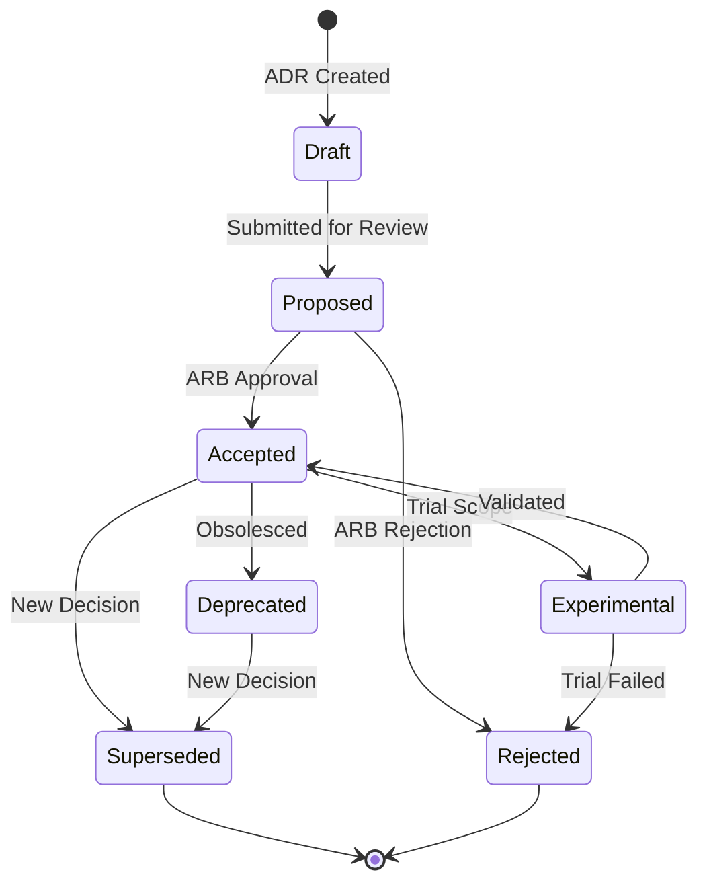
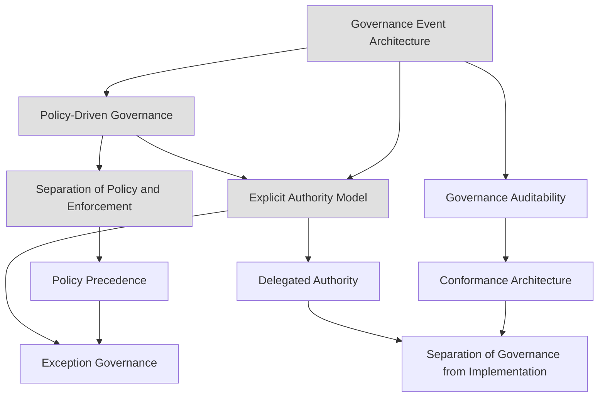

# Part 13 – Architectural Decision Records (ADRs)

> **Purpose**: This document is the authoritative Architectural Decision Record (ADR) reference for **Part 13 – Deployment & Platform Operations Governance** of AI-OS. It defines the ADR process governing this Part, explains conventions for creating and managing decisions, and catalogs the major architectural decisions that have been made (or are proposed) for the governance architecture that governs deployment, platform operations, resource allocation, release management, and platform health monitoring.
>
> **Status**: ACTIVE
>
> **Version**: 1.0.0
>
> **Last Updated**: 2026-08-08
>
> **Governance Framework**: v1.0 (Sections 11–18)

---

## Table of Contents

1. [What Are ADRs?](#1-what-are-adrs)
2. [Why ADRs Exist](#2-why-adrs-exist)
3. [ADR Governance](#3-adr-governance)
4. [ADR Lifecycle](#4-adr-lifecycle)
5. [ADR Status Model](#5-adr-status-model)
6. [ADR Naming Convention](#6-naming-convention)
7. [ADR Ownership](#7-adr-ownership)
8. [ADR Review Process](#8-adr-review-process)
9. [ADR Approval Process](#9-adr-approval-process)
10. [ADR Traceability](#10-adr-traceability)
11. [ADR Dependency Graph](#11-adr-dependency-graph)
12. [ADR Relationships](#12-adr-relationships)
13. [ADR Implementation Tracking](#13-adr-implementation-tracking)
14. [ADR Compliance Verification](#14-adr-compliance-verification)
15. [ADR Change Management](#15-adr-change-management)
16. [ADR Archival](#16-adr-archival)
17. [ADR Summary Matrix](#17-adr-summary-matrix)
18. [Full ADR Catalog](#18-full-adr-catalog)
19. [Appendix A: ADR Creation Checklist](#appendix-a-adr-creation-checklist)
20. [Appendix B: ADR ID Allocation Log](#appendix-b-adr-id-allocation-log)
21. [Appendix C: Relationship to Core AI-OS ADRs](#appendix-c-relationship-to-core-ai-os-adrs)
22. [Appendix D: ADR Implementation Tracking Matrix](#appendix-d-adr-implementation-tracking-matrix)
23. [Appendix E: ADR Conformance Mapping](#appendix-e-adr-conformance-mapping)

---

## 1. What Are ADRs?

An **Architectural Decision Record (ADR)** is a document that captures a single, significant architectural decision in the AI-OS system, along with its context, rationale, and consequences. Each ADR is a deliberate, traceable record of *what* was decided, *why* it was decided, and *what* was sacrificed.

### Core Elements of an ADR

Every ADR in Part 13 contains the following sections, following the AI-OS ADR Template (`project-knowledge/templates/ADR_TEMPLATE.md`):

| Field | Description |
|--------|-------------|
| **ADR ID** | A unique sequential identifier (e.g., `P13-ADR-001`) |
| **Status** | Lifecycle state (see [Section 5](#5-adr-status-model)) |
| **Date** | The date the decision was made or accepted |
| **Authors** | Individuals who authored the decision |
| **Reviewers** | Individuals who reviewed and approved the decision |
| **Domain Owner** | The steward responsible for ongoing governance |
| **Related Architecture Parts** | Cross-references to other AI-OS Parts affected by this decision |
| **Related Components** | Specific components impacted by this decision |
| **Related Schemas** | JSON schemas involved in this decision |
| **Related Events** | Governance events emitted or consumed by this decision |
| **Context** | The circumstances that motivated the decision; relevant forces in play |
| **Problem** | A clear statement of the problem or opportunity addressed |
| **Decision** | The chosen solution or course of action |
| **Alternatives** | Other options evaluated, with pros and cons |
| **Consequences** | What becomes easier or more difficult as a result; positive and negative |
| **Related Parts** | Links to other AI-OS Parts affected by this decision |
| **Verification Method** | How the decision will be validated |

---

## 2. Why ADRs Exist

ADRs exist to solve several critical challenges in the AI-OS architecture:

### 2.1 Historical Accountability

ADRs provide a **permanent, immutable record** of why architectural decisions were made. Without this record, future maintainers must reverse-engineer intent from code, leading to incorrect assumptions and potentially destructive "improvements."

### 2.2 Knowledge Transfer

When team members change, their context and reasoning can be lost. ADRs **transfer institutional knowledge** in a structured, searchable format. New contributors can read ADRs to understand *why* the system is the way it is.

### 2.3 Governance and Compliance

AI-OS requires conformance levels (L1–L11) and architectural invariant enforcement. ADRs serve as **evidence of conformance** — they demonstrate that deviations from principles were intentional, reviewed, and approved. Part 13's governance ADRs specifically define the compliance, auditing, and enforcement mechanisms that ensure all other Parts adhere to architectural principles.

### 2.4 Preventing Repeated Debates

Without a decision record, the same architectural questions are **re-visited repeatedly** in different forms. ADRs put these debates to rest with documented rationale.

### 2.5 Risk Management

ADRs force architects to explicitly document **trade-offs and risks**. This makes it possible to assess the impact of decisions before they are implemented and to plan mitigations proactively.

### 2.6 Decision Quality

The ADR process (context → problem → alternatives → decision → consequences) **structures decision-making** and forces thorough consideration of alternatives before commitment.

### 2.7 Future Evolution

ADRs include **future considerations** and **migration paths**, enabling graceful evolution of the architecture over time without accumulating technical debt from forgotten decisions.

### 2.8 Link to Part 13 Objectives

Part 13's objectives — **operational governance**, **deployment orchestration**, **platform health monitoring**, **release management**, **resource allocation**, and **conformance enforcement** — are realized through the decisions documented in these ADRs. Each ADR in this catalog maps to one or more of these objectives.

---

## 3. ADR Governance

The Part 13 ADR governance framework is governed by the following principles:

| Principle | Description |
|-----------|-------------|
| **Transparency** | All ADR decisions, reviews, and lifecycle transitions are publicly documented and auditable |
| **Accountability** | Every ADR has a designated steward accountable for its ongoing governance |
| **Consistency** | ADRs must conform to established templates, naming conventions, and quality standards |
| **Traceability** | Every ADR must link to its implementation, schemas, events, and related decisions |
| **Evolution** | ADRs follow a managed lifecycle that supports evolution without silent drift |
| **Compliance** | ADRs are validated against Part 11 conformance levels and architectural invariants |
| **Operational Integrity** | Governance decisions must be operationally enforceable through the Policy Evaluation Engine (G-02) |

### 3.1 Governance Bodies

| Body | Responsibilities | Meeting Cadence |
|------|------------------|-----------------|
| **Architecture Review Board (ARB)** | ADR approval, lifecycle transitions, policy changes | Weekly |
| **Domain Stewards** | ADR maintenance, compliance verification, quarterly reviews | As needed |
| **Security Council** | Security impact assessment, security review of ADRs | Bi-weekly |
| **Validation Council** | Conformance level validation, audit trail verification | Monthly |
| **Documentation Council** | Cross-reference integrity, naming convention compliance | Monthly |
| **Engineering Council** | Implementation feasibility, operational impact | Bi-weekly |
| **Release Council** | Release planning, deployment governance, rollout strategy | Weekly |
| **Platform Operations Council** | Platform health, operational procedures, incident response | Daily standup / Weekly |

### 3.2 Governance Rules

**Rule G3.1**: Every ADR MUST have a designated domain steward assigned at `Draft` status or earlier.

**Rule G3.2**: Stewards MUST verify ADR compliance with Part 11 Validation Architecture conformance levels quarterly.

**Rule G3.3**: The ARB MUST review all `Proposed` and `Experimental` ADRs within 10 business days of submission.

**Rule G3.4**: ADR implementation MUST be tracked via the Implementation Tracking Matrix (see [Section 13](#13-adr-implementation-tracking)).

**Rule G3.5**: ADR compliance violations MUST be reported as `ADRComplianceViolation` events on the EventBus.

**Rule G3.6**: All ADR lifecycle transitions MUST be recorded as immutable events with correlation to the originating ADR.

**Rule G3.7**: ADR superseding MUST include a migration path and impact assessment.

**Rule G3.8**: The ARB MAY delegate review authority to domain councils for domain-specific ADRs.

---

## 4. ADR Lifecycle

ADRs in Part 13 pass through a defined lifecycle. The status of an ADR indicates its current state of maturity and acceptance.

### 4.1 Lifecycle Diagram



### 4.2 Lifecycle Transition Rules

The following table defines the permitted transitions between ADR lifecycle states, their trigger conditions, and required evidence:

| From → To | Trigger Condition | Required Evidence | Approval Authority |
|-----------|-------------------|-------------------|---------------------|
| Draft → Proposed | Author submits for review | ADR template complete, Section 19 checklist passed | ADR Author |
| Proposed → Accepted | ARB approval vote | Review score ≥ 85, all critical issues resolved, security review complete | Architecture Review Board |
| Proposed → Rejected | ARB rejection vote | Review feedback documented, rejection rationale recorded | Architecture Review Board |
| Accepted → Experimental | Trial requested | Experimental trial plan with scope, duration, validation criteria | Architecture Review Board + Domain Owner |
| Experimental → Accepted | Trial validation successful | Trial evaluation report, metrics data, steward sign-off | Architecture Review Board |
| Experimental → Rejected | Trial failed | Trial evaluation report, failure analysis | Architecture Review Board |
| Accepted → Deprecated | Decision no longer recommended | Deprecation notice, successor ADR or alternative guidance | Architecture Review Board |
| Accepted → Superseded | New ADR supersedes | New ADR ID, migration path, transition plan | Architecture Review Board |
| Deprecated → Superseded | New ADR supersedes deprecated decision | New ADR ID referenced | Architecture Review Board |
| Rejected → Proposed | Resubmission with corrections | Change summary, updated evidence | ADR Author + ARB approval |

**Rule L4.1**: All lifecycle transitions MUST be recorded as immutable events on the EventBus with correlation to the originating ADR.

**Rule L4.2**: An ADR in `Draft` or `Proposed` status MAY be freely modified. ADRs in `Accepted`, `Deprecated`, or `Superseded` status MUST NOT be modified except through the addendum process defined in [Section 15](#15-adr-change-management) or by creating a superseding ADR.

**Rule L4.3**: An ADR in `Experimental` status MAY be modified within the bounds of its trial plan. Substantial modifications require returning to `Proposed` status.

---

## 5. ADR Status Model

### 5.1 Status Values

| Status | Description | Can Be Modified? |
|--------|-------------|-------------------|
| **Draft** | The decision is under active discussion and has not yet been formally reviewed. | Yes — freely editable |
| **Proposed** | The ADR has been drafted and is under initial review. It has not yet been accepted or rejected. | Yes — until accepted |
| **Accepted** | The ADR has been reviewed and approved by the Architecture Review Board (ARB). It is part of the official architecture. | Only by superseding or deprecation ADR |
| **Rejected** | The ADR was considered but not approved. It may be revisited in a future iteration. | No — unless re-proposed as a new ADR |
| **Superseded** | The ADR has been replaced by a newer ADR (the superseding ADR is referenced). | No — historical record only |
| **Deprecated** | The decision is no longer recommended for new work but may still exist in legacy implementations. | No — unless superseded |
| **Experimental** | The decision is under trial in a limited scope; not yet ready for broad adoption. | Yes — within trial plan bounds |

### 5.2 Status Transition Governance

| Status | Can Transition To | Requires Approval |
|--------|-------------------|-------------------|
| Draft | Proposed | Author submission |
| Proposed | Accepted | ARB vote |
| Proposed | Rejected | ARB vote |
| Accepted | Experimental | ARB + Domain Owner |
| Experimental | Accepted | ARB + Steward |
| Experimental | Rejected | ARB + Steward |
| Accepted | Deprecated | ARB |
| Accepted | Superseded | ARB + Migration Review |
| Deprecated | Superseded | ARB |
| Rejected | Proposed | Author + ARB |

---

## 6. ADR Naming Convention

### 6.1 ADR Identifier Format

```
P13-ADR-NNN
```

Where:
- `P13` = Prefix for Part 13
- `ADR` = Fixed label for Architectural Decision Records
- `NNN` = Three-digit sequential number (001, 002, ..., 999)

### 6.2 File Naming

ADR files are named using the pattern:

```
P13-ADR-NNN-kebab-case-title.md
```

Example: `P13-ADR-001-policy-driven-deployment-governance.md`

### 6.3 Title Conventions

- Use **PascalCase** for the ADR title (e.g., "Policy-Driven Deployment Governance")
- Titles should be **concise** (≤ 80 characters) and **action-oriented**
- Avoid including the ADR number in the title — it's in the ID

### 6.4 Cross-Reference Syntax

Within ADR documents and other Part 13 artifacts, references to ADRs use the following syntax:

```
[[P13-ADR-001]] — Policy-Driven Deployment Governance
```

### 6.5 Relationship Annotations

When an ADR references another ADR, the relationship **MUST** be annotated:

| Relationship | Notation | Meaning |
|--------------|----------|---------|
| Depends on | `[[P13-ADR-XXX]]` | This ADR cannot proceed without the referenced ADR |
| Extends | `^[P13-ADR-XXX]` | This ADR refines or adds detail to the referenced ADR |
| Contradicts | `≈[P13-ADR-XXX]` | This ADR conflicts with (but supersedes) the referenced ADR |
| Related | `↝[P13-ADR-XXX]` | This ADR is related to but neither depends on nor contradicts the referenced ADR |
| Supersedes | `→[P13-ADR-XXX]` | This ADR replaces the referenced ADR |

---

## 7. ADR Ownership

### 7.1 Domain Steward Assignment Matrix

| ADR Domain | Steward | Contact | Review Cadence | Tools |
|------------|---------|---------|----------------|-------|
| Deployment Governance (P13-ADR-001) | [To Be Assigned] | [Email/Signal] | Quarterly | `ai-os-deploy-audit`, `ai-os-conformance-tracker` |
| Resource Allocation (P13-ADR-002) | [To Be Assigned] | [Email/Signal] | Quarterly | `ai-os-quota-monitor`, `ai-os-resource-audit` |
| Release Orchestration (P13-ADR-003) | [To Be Assigned] | [Email/Signal] | Quarterly | `ai-os-release-tracker`, `ai-os-deployment-audit` |
| Platform Health Monitoring (P13-ADR-004) | [To Be Assigned] | [Email/Signal] | Monthly | `ai-os-platform-metrics`, `ai-os-incident-tracker` |
| Conformance Enforcement (P13-ADR-005) | [To Be Assigned] | [Email/Signal] | Quarterly | `ai-os-conformance-checker`, `ai-os-policy-audit` |
| Operational Procedures (P13-ADR-006) | [To Be Assigned] | [Email/Signal] | Bi-annual | `ai-os-op-procedure-checker`, `ai-os-runbook-audit` |
| Deployment Rollback (P13-ADR-007) | [To Be Assigned] | [Email/Signal] | Quarterly | `ai-os-rollback-tracker`, `ai-os-recovery-audit` |
| Release Artifact Provenance (P13-ADR-008) | [To Be Assigned] | [Email/Signal] | Bi-annual | `ai-os-provenance-verifier`, `ai-os-integrity-checker` |

### 7.2 Steward Responsibilities

Each domain steward is responsible for:

1. **Quarterly Review**: Conduct a compliance review of their assigned ADRs including:
   - Implementation status verification
   - Conformance level assessment (Part 11)
   - Cross-reference integrity check
   - Risk reassessment with updated context

2. **Compliance Reporting**: Submit a quarterly compliance report to the ARB including:
   - Current implementation status
   - Conformance level achievement
   - Outstanding risks and mitigations
   - Recommendations for ADR updates or supersession

3. **Incident Response**: Respond to `ADRComplianceViolation` events within 24 hours for Critical severity and 72 hours for High/Medium severity.

4. **Succession Planning**: Ensure knowledge transfer if stewardship changes, including updating this matrix and notifying the ARB.

### 7.3 Steward Change Protocol

When a steward change occurs:

1. The outgoing steward MUST provide a handover document including current ADR status, compliance assessment, outstanding issues, risk register, contact information for key stakeholders, and recent audit results.
2. The incoming steward has 30 days to review the handover document, conduct their own assessment, and report any discrepancies to the ARB.
3. The ARB MUST update the steward assignment matrix and notify all affected stakeholders.

---

## 8. ADR Review Process

### 8.1 Review Process

Each ADR undergoes a structured review process using the AI-OS Review Template (`project-knowledge/templates/REVIEW_TEMPLATE.md`). The review is conducted by the ARB and assigned domain experts.

### 8.2 Review Checklist

| # | Review Criterion | Description |
|---|-----------------|-------------|
| 1 | **Architecture Compliance** | The decision aligns with AI-OS principles, Part 13 connections, and invariants |
| 2 | **Technical Accuracy** | The decision is technically correct, complete, and precise |
| 3 | **Consistency** | The decision is consistent with related ADRs, Parts, and established patterns |
| 4 | **Terminology** | Domain-specific terms match the glossary in `glossary.md` and `README.md` |
| 5 | **Cross References** | The ADR properly links to related Parts, ADRs, and documents |
| 6 | **Problem Statement** | The problem is clearly and unambiguously stated |
| 7 | **Alternatives Considered** | At least two viable alternatives were evaluated |
| 8 | **Decision Drivers** | Factors influencing the decision are weighted by importance |
| 9 | **Trade-offs** | Trade-offs are explicit, showing what was gained vs. sacrificed |
| 10 | **Consequences** | Positive and negative consequences are realistic and complete |
| 11 | **Risks** | Identified risks have mitigation strategies |
| 12 | **Validation** | The decision's validation approach is adequate |
| 13 | **Security Impact** | Security implications are analyzed |
| 14 | **Performance Impact** | Performance implications are analyzed |
| 15 | **Compatibility** | Backward/forward compatibility is addressed |
| 16 | **Documentation Quality** | The ADR is clear, well-structured, and uses consistent terminology |

### 8.3 Review Scoring

| Score Range | Assessment | Next Step |
|-------------|------------|-----------|
| 90–100 | Excellent (Ready for approval) | Approve if all critical issues resolved |
| 80–89 | Good (Minor issues to address) | Address minor issues, then approve |
| 70–79 | Satisfactory (Several issues needing attention) | Author revisions required |
| 60–69 | Needs Improvement (Major issues requiring revision) | Significant revision required |
| <60 | Unsatisfactory (Significant rework required) | Reject and request re-submission |

---

## 9. ADR Approval Process

### 9.1 Stakeholders

The approval workflow involves the following roles:

| Role | Responsibility |
|------|----------------|
| **ADR Author** | Drafts the ADR, identifies stakeholders, submits for review |
| **Architecture Review Board (ARB)** | Reviews and approves/rejects the ADR |
| **Security Council** | Reviews security implications |
| **Engineering Council** | Reviews operational and engineering impact |
| **Research Council** | Reviews future research implications |
| **Release Council** | Reviews deployment and release impact |
| **Platform Operations Council** | Reviews operational feasibility and platform health impact |
| **Affected Component Owners** | Provide domain-specific feedback |
| **FinalJudge** | Veto authority for critical decisions |

### 9.2 Approval Steps

```mermaid
flowchart TD
    A[ADR Drafted] --> B[Authors Submit\nStatus: Proposed]
    B --> C[ARB Assigns Reviewers]
    C --> D[Review Period Opens\n(typically 5–10 business days)]
    D --> E{Review Complete?}
    E -->|No| F[Reminder Sent\nAfter 3 days]
    F --> D
    E -->|Yes| G{Comments Addressed?}
    G -->|No| H[Author Revisions\nStatus: Draft]
    H --> I[Re-submit\nStatus: Proposed]
    I --> C
    G -->|Yes| J[ARB Deliberation]
    J --> K{Approved?}
    K -->|Yes| L[Status: Accepted\nDate Set]
    K -->|No| M[Status: Rejected\nReasoning Documented]
    L --> N[Published to ADR Catalog]
    M --> N
    N --> O{Experimental?}
    O -->|Yes| P[Status: Experimental\nTrial Period Set]
    O -->|No| Q[ADR Finalized]
    P --> R[Trial Evaluation]
    R --> S[Promote to Accepted\nor Reject]
```

### 9.3 Approval Criteria

An ADR is approved when all of the following criteria are met:

1. **Context is Clear**: The motivating circumstances are well-documented and understood
2. **Problem is Well-Formed**: The specific issue is clearly stated without ambiguity
3. **Alternatives Were Considered**: At least two viable alternatives were evaluated with documented trade-offs
4. **Decision Aligns with Principles**: The decision is consistent with `ENGINEERING_PRINCIPLES.md` and the architectural invariants
5. **Consequences are Documented**: Both positive and negative consequences are identified
6. **Trade-offs are Explicit**: What was gained and what was sacrificed is documented
7. **Risks are Identified**: Potential risks and their mitigations are documented
8. **Validation Plan Exists**: There is a clear plan for validating the decision
9. **Security Impact Assessed**: Security implications have been reviewed by the Security Council
10. **Performance Impact Assessed**: Performance implications have been analyzed
11. **Compatibility Assessed**: Backward/forward compatibility impact is documented
12. **Migration Plan Exists** (if applicable): Steps for migrating existing systems are provided
13. **Cross-References Are Complete**: Related ADRs, Parts, and documents are referenced
14. **Domain Steward Assigned**: The ADR has a designated steward responsible for ongoing governance
15. **Implementation Plan Defined**: If the decision requires implementation, a plan with work item references is included
16. **Conformance Levels Mapped**: The ADR's validation requirements align with Part 11 conformance levels

### 9.4 Approval Documentation

Upon approval, the following metadata is recorded in the ADR:

```markdown
## Approval Record

- **Approved By:** [ARB Chair Name on behalf of the Architecture Review Board]
- **Approval Date:** YYYY-MM-DD
- **Meeting/Review ID:** [Identifier of the ARB meeting]
- **Voting:** [For: N, Against: N, Abstain: N]
- **Security Review:** [Completed by Security Council, Date]
- **Engineering Review:** [Completed by Engineering Council, Date]
- **Release Review:** [Completed by Release Council, Date]
```

---

## 10. ADR Traceability

### 10.1 Traceability Links

Every ADR in Part 13 MUST include a "Related Documents" section linking to:

| Target | Reference Format | Description |
|--------|-----------------|-------------|
| **Other Part 13 ADRs** | `[[P13-ADR-NNN]]` | Other decisions in this catalog |
| **AI-OS Core ADRs** | `[[ADR-NNN]]` | Core system ADRs (001–016) |
| **Architecture Parts** | `Part X: Title` | Related Parts in the AI-OS specification |
| **Engineering Principles** | `[[ENGINEERING_PRINCIPLES.md]]` | The governing principles document |
| **Governance Documents** | `[[COUNCILS.md]]`, `[[VALIDATION_ARCHITECTURE.md]]` | Council and validation frameworks |
| **Schemas** | `[[schema-name]]` | JSON schemas involved |
| **Events** | `[[EventName]]` | Governance events referenced |
| **Standards** | `[RFC 2119](https://www.rfc-editor.org/rfc/rfc2119)` | External standards and protocols |

### 10.2 Traceability Chain

ADRs in Part 13 are traceable through the following chain:

```
ADR → Decision Rationale → Related Parts → Related Components → Related Schemas → Related Events → Implementation Tracking → Conformance Verification
```

Each link in the chain MUST be explicitly documented in the ADR.

---

## 11. ADR Dependency Graph

### 11.1 Dependency Graph

The following diagram shows the dependency relationships among Part 13 ADRs:



### 11.3 Dependency Rules

| Rule | Description |
|------|-------------|
| **D11.1** | Core ADRs (ADR-001 through ADR-016) have no dependencies on Part 13 ADRs |
| **D11.2** | Part 13 ADRs MAY depend on Core ADRs |
| **D11.3** | Part 13 ADRs MAY depend on Part 12 ADRs (Collaboration) |
| **D11.4** | Circular dependencies between ADRs MUST NOT exist |
| **D11.5** | Dependency changes MUST be documented in the dependent ADR |

### 11.4 Cross-Part Dependencies

| Part 13 ADR | Depends On Core ADRs | Depends On Part 12 ADRs | Related Parts |
|-------------|---------------------|------------------------|---------------|
| P13-ADR-001 | ADR-001, ADR-008, ADR-014 | P12-ADR-003, P12-ADR-008 | Part 4, Part 12, Part 14 |
| P13-ADR-002 | ADR-001, ADR-013 | P12-ADR-001 | Part 4, Part 12, Part 14 |
| P13-ADR-003 | ADR-003, ADR-006, ADR-014 | P12-ADR-003 | Part 3, Part 4, Part 12 |
| P13-ADR-004 | ADR-003, ADR-004, ADR-009 | P12-ADR-001, P12-ADR-008 | Part 3, Part 4, Part 12 |
| P13-ADR-005 | ADR-003, ADR-008, ADR-014 | P12-ADR-001, P12-ADR-005 | Part 3, Part 4, Part 12 |
| P13-ADR-006 | ADR-008, ADR-009, ADR-012 | P12-ADR-001, P12-ADR-008, P12-ADR-010 | Part 3, Part 4, Part 5, Part 12 |
| P13-ADR-007 | ADR-008, ADR-009, ADR-014 | P12-ADR-004, P12-ADR-008 | Part 4, Part 12 |
| P13-ADR-008 | ADR-008, ADR-009, ADR-016 | P12-ADR-008, P12-ADR-010 | Part 3, Part 4, Part 12 |
| P13-ADR-009 | ADR-003, ADR-010, ADR-011 | P12-ADR-010 | Part 3, Part 4, Part 11, Part 12, Part 14 |
| P13-ADR-010 | ADR-002, ADR-003, ADR-013 | P12-ADR-003, P12-ADR-004 | Part 3, Part 4, Part 12, Part 14 |

---

## 12. ADR Relationships

### 12.1 Relationship Types

| Relationship | Notation | Meaning |
|--------------|----------|---------|
| **Depends On** | `[[P13-ADR-XXX]]` | This ADR cannot proceed without the referenced ADR |
| **Extends** | `^[P13-ADR-XXX]` | This ADR refines or adds detail to the referenced ADR |
| **Contradicts** | `≈[P13-ADR-XXX]` | This ADR conflicts with (but supersedes) the referenced ADR |
| **Related** | `↝[P13-ADR-XXX]` | This ADR is related to but neither depends on nor contradicts the referenced ADR |
| **Supersedes** | `→[P13-ADR-XXX]` | This ADR replaces the referenced ADR |

### 12.2 Relationship Integrity

| Rule | Description |
|------|-------------|
| **R12.1** | Every ADR MUST declare relationships with all ADMs it references |
| **R12.2** | Relationship types MUST be one of the five defined types |
| **R12.3** | Relationships to Core ADRs use `[[ADR-NNN]]` notation |
| **R12.4** | Relationships to Part 13 ADRs use `[[P13-ADR-NNN]]` notation |
| **R12.5** | Relationship integrity MUST be verified quarterly by the Documentation Council |

### 12.3 Relationship Mapping Table

| ADR ID | Depends On | Extends | Contradicts | Related | Supersedes |
|--------|------------|---------|-------------|---------|------------|
| P13-ADR-001 | ADR-001, ADR-008 | — | — | P13-ADR-005, P13-ADR-006 | — |
| P13-ADR-002 | ADR-001, ADR-013 | — | — | P13-ADR-003, P13-ADR-007 | — |
| P13-ADR-003 | ADR-003, ADR-006 | — | — | P13-ADR-004, P13-ADR-005 | — |
| P13-ADR-004 | ADR-003, ADR-004 | — | — | P13-ADR-007, P13-ADR-008 | — |
| P13-ADR-005 | ADR-003, ADR-008 | P13-ADR-001 | — | P13-ADR-003, P13-ADR-006 | — |
| P13-ADR-006 | ADR-008, ADR-009 | — | — | P13-ADR-005, P13-ADR-009 | — |
| P13-ADR-007 | ADR-008, ADR-014 | P13-ADR-002 | — | P13-ADR-004, P13-ADR-008 | — |
| P13-ADR-008 | ADR-009, ADR-016 | — | — | P13-ADR-003, P13-ADR-010 | — |
| P13-ADR-009 | ADR-003, ADR-010 | — | — | P13-ADR-006, P13-ADR-010 | — |
| P13-ADR-010 | ADR-002, ADR-003 | — | — | P13-ADR-004, P13-ADR-008, P13-ADR-009 | — |

---

## 13. ADR Implementation Tracking

### 13.1 Tracking Approach

Each Accepted ADR that requires implementation MUST be tracked through the Implementation Tracking Matrix (see [Appendix D](#appendix-d-adr-implementation-tracking-matrix)). The tracking covers:

1. **Implementation Status**: Not Started, Planned, In Development, In Review, Merged, Validated, Deprecated
2. **Component Ownership**: Which team owns the implementation
3. **Conformance Levels**: Part 11 conformance levels (L8, L10, L11, etc.) achieved
4. **Target Completion Date**: Expected completion
5. **Tracking Link**: Issue/PR reference for implementation

### 13.2 Implementation Status Definitions

| Status | Description |
|--------|-------------|
| **Not Started** | ADR accepted but implementation not yet planned |
| **Planned** | Implementation planned with design phase complete |
| **In Development** | Active development underway |
| **In Review** | Implementation complete, awaiting code review |
| **Merged** | Implementation merged to main branch |
| **Validated** | Implementation passed integration and conformance tests |
| **Deprecated** | Implementation removed or replaced |

### 13.3 Implementation Tracking Rules

**Rule T13.1**: Every Accepted ADR that requires implementation MUST have a tracking entry in Appendix D.

**Rule T13.2**: Implementation status MUST be updated bi-weekly by the domain steward.

**Rule T13.3**: Implementation delays beyond the target date MUST trigger escalation to the ARB.

**Rule T13.4**: Implementation MUST NOT be considered complete until conformance validation passes.

---

## 14. ADR Compliance Verification

### 14.1 Conformance Levels

Each Part 13 ADR contributes to specific Part 11 Validation Architecture conformance levels. The following levels are relevant:

| Level | Name | Description |
|-------|------|-------------|
| **L1** | Declarative Configuration | Configuration is declarative, not imperative |
| **L2** | Self-Describing | System components describe their behavior |
| **L3** | Self-Diagnosing | System can detect and report its own issues |
| **L4** | Self-Healing | System can recover from failures automatically |
| **L5** | Self-Optimizing | System can optimize its own performance |
| **L6** | Self-Protecting | System can defend against attacks autonomously |
| **L7** | Self-Aware | System has awareness of its own state and goals |
| **L8** | Instrumentation | System emits structured observability signals |
| **L9** | Self-Validation | System validates its own behavior against contracts |
| **L10** | Self-Healing (Advanced) | System can recover from complex failures |
| **L11** | Self-Adaptive | System can adapt to changing conditions autonomously |
| **L12** | Evolutionary | System can evolve its own architecture |

### 14.2 Compliance Verification Process

The compliance verification process involves:

1. **Quarterly Assessment**: Domain stewards assess conformance level achievement
2. **Automated Checking**: `ai-os-conformance-checker` runs against live implementations
3. **Audit Reporting**: Compliance reports submitted to the Validation Council
4. **Violation Handling**: Non-compliance triggers `ADRComplianceViolation` events

### 14.3 Compliance Rules

**Rule C14.1**: Every ADR MUST declare its conformance level targets in the Conformance field.

**Rule C14.2**: Conformance levels MUST be verified quarterly by the domain steward.

**Rule C14.3**: Non-conformance MUST be reported as an `ADRComplianceViolation` event.

**Rule C14.4**: Critical non-conformance MUST trigger immediate escalation to the ARB.

---

## 15. ADR Change Management

### 15.1 ADR Versioning

ADRs are immutable historical records. They are **not versioned** themselves — instead, modifications result in **new ADRs** that supersede or amend the original.

| Scenario | Approach |
|----------|----------|
| Minor clarification or typo fix | Add an addendum note to the existing ADR (clearly marked as such) |
| Significant content change | Create a new ADR that supersedes the original |
| Breaking change to a decision | Create a new ADR, mark the old one as `Superseded` |
| Temporary deviation | Mark the ADR as `Experimental` with trial parameters |

### 15.2 Addendum Format

If an addendum is needed (e.g., for a typo or minor clarification), it is appended at the end of the ADR:

```markdown
---

## Addendum (YYYY-MM-DD)

**Summary**: [Brief description of what was corrected]

**Change**: [The specific change made]

**Rationale**: [Why this correction was necessary]

**Impact**: [Whether this changes any consequences, trade-offs, or decisions]

*Approved by: [Reviewer] on YYYY-MM-DD*
```

### 15.3 Change History Tracking

Every ADR MUST maintain a change history section documenting all modifications:

```markdown
## Change History

| Version | Date | Author | Type | Summary |
|---------|------|--------|------|---------|
| 1.0.0 | YYYY-MM-DD | [Author] | Initial | Initial ADR decision |
| 1.0.1 | YYYY-MM-DD | [Author] | Addendum | Typo correction in Section 3.2 |
| 1.1.0 | YYYY-MM-DD | [Author] | Revision | Updated performance benchmarks |
| 1.2.0 | YYYY-MM-DD | [Author] | Supersession | Superseded by P13-ADR-XXX |
```

### 15.4 Change Types

| Type | Description | Requires Approval |
|------|-------------|-------------------|
| **Initial** | First version of the ADR | ARB |
| **Addendum** | Minor clarification, typo fix, non-substantive change | Steward |
| **Revision** | Substantive but non-breaking change | ARB |
| **Supersession** | ADR replaced by a newer ADR | ARB + Migration Review |
| **Deprecation** | ADR no longer recommended | ARB |

### 15.5 Change Management Rules

**Rule CM15.1**: All changes to an ADR MUST be recorded in its change history.

**Rule CM15.2**: Changes classified as `Revision` or `Supersession` MUST be submitted as a new ADR proposal following the standard approval workflow.

**Rule CM15.3**: Changes classified as `Addendum` MAY be applied directly by the assigned steward.

**Rule CM15.4**: The change history MUST include a summary of the change, the author, and the date.

---

## 16. ADR Archival

### 16.1 Archival Criteria

An ADR MAY be archived when:

1. **Status is `Rejected` or `Deprecated`** AND
2. **No active implementations reference the ADR** AND
3. **No compliance checks are active** AND
4. **At least 6 months have passed since the status change**

An ADR MUST NOT be archived if:

1. Any implementation references it
2. Any compliance checks are active
3. It is still part of the active architecture
4. A superseding ADR has not yet achieved M3 maturity

### 16.2 Archival Process

```bash
# Check archival eligibility
ai-os-adr check-archival P13-ADR-XXX

# Archive an ADR
ai-os-adr archive P13-ADR-XXX

# Restore an archived ADR
ai-os-adr unarchive P13-ADR-XXX
```

### 16.3 Archive Storage

Archived ADRs are moved to:
`project-knowledge/archived-adrs/P13-ADR-NNN.md`

Archived ADRs:
- Remain searchable via `ai-os-adr search --archived`
- Are clearly marked as `ARCHIVED` in the index
- Can be restored with `ai-os-adr unarchive`
- Do not appear in the active ADR count

**Rule A16.1**: Archival requires ARB approval with documented justification.

**Rule A16.2**: Archived ADRs MUST retain all original content, including change history.

---

## 17. ADR Summary Matrix

### 17.1 Active ADRs in Part 13

| ID | Title | Decision Category | Status | Date | Related Core ADR |
|----|-------|-------------------|--------|------|-------------------|
| P13-ADR-001 | Policy-Driven Deployment Governance | Governance | Draft | 2026-08-08 | ADR-001, ADR-008, ADR-014 |
| P13-ADR-002 | Separation of Policy and Enforcement | Architecture Pattern | Draft | 2026-08-08 | ADR-001, ADR-013 |
| P13-ADR-003 | Explicit Authority Model | Authority | Draft | 2026-08-08 | ADR-003, ADR-006 |
| P13-ADR-004 | Delegated Authority | Authority | Draft | 2026-08-08 | ADR-003, ADR-004 |
| P13-ADR-005 | Governance Event Architecture | Events | Draft | 2026-08-08 | ADR-003, ADR-008 |
| P13-ADR-006 | Governance Auditability | Audit | Draft | 2026-08-08 | ADR-008, ADR-009 |
| P13-ADR-007 | Policy Precedence | Governance | Draft | 2026-08-08 | ADR-008, ADR-014 |
| P13-ADR-008 | Exception Governance | Governance | Draft | 2026-08-08 | ADR-009, ADR-016 |
| P13-ADR-009 | Conformance Architecture | Conformance | Draft | 2026-08-08 | ADR-003, ADR-010 |
| P13-ADR-010 | Separation of Governance from Implementation | Architecture Pattern | Draft | 2026-08-08 | ADR-002, ADR-003 |

### 17.2 Decision Categories

| Category | ADRs | Description |
|----------|------|-------------|
| **Governance** | P13-ADR-001, P13-ADR-007, P13-ADR-008 | How policies are defined, enforced, and exceptions handled |
| **Authority** | P13-ADR-003, P13-ADR-004 | How authority is modeled, delegated, and constrained |
| **Architecture Pattern** | P13-ADR-002, P13-ADR-010 | Foundational patterns separating governance from implementation |
| **Events** | P13-ADR-005 | How governance decisions are communicated and tracked |
| **Audit** | P13-ADR-006 | How governance decisions are recorded and audited |
| **Conformance** | P13-ADR-009 | How conformance to policies is verified and enforced |

---

## 18. Full ADR Catalog

---

## P13-ADR-001: Policy-Driven Deployment Governance

| Field | Value |
|-------|-------|
| **ADR ID** | P13-ADR-001 |
| **Status** | Draft |
| **Date** | 2026-08-08 |
| **Authors** | AI Architecture Team |
| **Reviewers** | Architecture Review Board, Release Council, Security Council |
| **Domain Owner** | Release Council |
| **Related Parts** | Part 4 (Security & Governance), Part 12 (Resource Manager) |
| **Related Core ADRs** | [[ADR-001]] – Event-First Communication, [[ADR-008]] – Immutable Events, [[ADR-014]] – ADR Process |
| **Related Components** | PolicyEngine, ResourceManager, ReleaseManager |
| **Related Schemas** | `[[PolicyRuleSchema]]`, `[[DeploymentManifestSchema]]` |
| **Related Events** | `PolicyEvaluated`, `DeploymentGatePassed`, `DeploymentGateBlocked`, `PolicyViolation` |
| **Related Parts** | Part 4, Part 5, Part 12, Part 14 |

### Context

Part 13 governs deployment operations and platform health. Deployments of AI-OS services, agents, and workflows must be governed by explicit policies that enforce security, compliance, resource constraints, and operational best practices. The Hermes Kernel's PolicyEngine (Part 4) provides policy evaluation capabilities, and the ResourceManager (Part 12) enforces resource quotas. Part 13 needs to define how deployment governance policies are structured, evaluated, and enforced in a manner that is both flexible and secure.

### Problem

How should deployment governance be structured to ensure that all deployments across AI-OS comply with security policies, resource constraints, release procedures, and compliance requirements — while remaining flexible enough to accommodate different deployment types (services, agents, workflows) and operational contexts?

### Alternatives Considered

**Alternative 1: Imperative Deployment Validation**
- **Pros**: Fine-grained control, easy debugging
- **Cons**: Hard to maintain, inconsistent enforcement, not auditable, not portable

**Alternative 2: Centralized Deployment Gate Service**
- **Pros**: Single enforcement point, consistent policy application
- **Cons**: Single point of failure, scalability bottleneck, does not scale across distributed deployments

**Alternative 3: Policy-Driven Governance via Policy Evaluation Engine (G-02)** *(Selected)*
- **Pros**: Declarative, auditable, distributed, version-controlled, extensible
- **Cons**: Initial policy complexity, requires policy-as-code maturity, policy evaluation overhead

**Alternative 4: Manual Approval Gates Only**
- **Pros**: Simple to implement, human judgment for complex cases
- **Cons**: Not scalable, inconsistent, slow, not suitable for automated deployments

**Alternative 5: Capability-Based Deployment Authorization**
- **Pros**: Fine-grained authorization, aligns with zero-trust
- **Cons**: Does not cover non-security policies (compliance, resource limits, release windows)

### Decision

Deployment governance is governed through **declarative policies** evaluated by the **PolicyEngine** at deployment time. Deployments must produce a `DeploymentAttempt` event containing the deployment request, and the PolicyEngine evaluates applicable policies before allowing the deployment to proceed. The following policy domains are enforced:

1. **Security Policies**: Authentication, authorization, secrets management, zero-trust compliance (Part 4, Part 8)
2. **Resource Policies**: CPU, memory, token, and tool-slot quotas enforced by ResourceManager (P12-ADR-007)
3. **Release Policies**: Release windows, approval workflows, rollback requirements
4. **Compliance Policies**: Regulatory requirements, audit trail completeness, conformance level adherence
5. **Operational Policies**: Health checks, observability requirements, incident response readiness

Policies are defined as structured documents following `PolicyRuleSchema`, version-controlled in the Repository Ecosystem (Part 13), and evaluated before any deployment reaches the EventBus. Policy violations emit `PolicyViolation` events and block deployment.

### Decision Drivers

| Driver | Importance |
|--------|------------|
| Consistency and auditability of deployment decisions | Critical |
| Scalability across distributed deployment targets | Critical |
| Alignment with Part 4 Security Architecture | Critical |
| Operational flexibility for different deployment types | High |
| Compliance with regulatory requirements | High |
| Performance impact of policy evaluation | Medium |

### Alternatives Table

| Alternative | Pros | Cons |
|------------|------|------|
| Imperative Deployment Validation | Fine-grained control, easy debugging | Hard to maintain, inconsistent, not auditable |
| Centralized Deployment Gate | Single enforcement point, consistent | SPOF, scalability bottleneck |
| **Policy-Driven Governance** *(Selected)* | Declarative, auditable, distributed, extensible | Initial complexity, evaluation overhead |
| Manual Approval Gates | Simple, human judgment | Not scalable, inconsistent |
| Capability-Based Authorization | Fine-grained, zero-trust aligned | Doesn't cover non-security policies |

### Decision

*[See above]*

### Consequences

**Positive Consequences:**
- All deployments are governed by auditable, version-controlled policies
- Consistent enforcement across all deployment types and targets
- Policies can be updated without code changes (policy-as-code)
- Violations are recorded as events for audit and alerting
- Aligns with AI-OS's event-first and immutable audit principles

**Negative Consequences:**
- Initial overhead of defining and maintaining policy sets
- Policy evaluation adds latency to deployment pipeline
- Complex policy interactions may be difficult to debug
- Requires policy-as-code tooling and expertise

### Risks

| Risk | Likelihood | Impact | Mitigation |
|------|------------|--------|------------|
| Policy evaluation failures blocking deployments | Medium | High | Fallback policies, manual override with audit trail |
| Policy bypass through deployment API abuse | Low | Critical | Multiple enforcement points, immutable audit trail |
| Policy complexity leading to misconfiguration | Medium | Medium | Policy linting, staged rollout, compliance reviews |
| Evaluation latency exceeding SLA | Medium | Medium | Caching, parallel evaluation, pre-computed policies |

### Trade-offs

| Trade-off | Gained | Sacrificed | Rationale |
|-----------|--------|------------|-----------|
| Policy evaluation overhead | Auditable, consistent deployment governance | Deployment latency | Governance cannot be compromised for speed |
| Policy complexity | Comprehensive coverage | Maintainability effort | Security and compliance require comprehensive policies |
| Central policy definition | Consistent application | Single policy source | Distributed enforcement requires centralized definition |

### Verification Method

- Policy engine conformance tests validate policy evaluation against test cases
- Deployment integration tests verify policies are enforced at deployment boundaries
- Audit log verification tests confirm policy violations are logged as events
- Performance benchmarks measure policy evaluation latency (target: <100ms for standard policies)
- Security penetration tests verify policy bypass is not possible

### Related ADRs

- [[ADR-001]] — Event-First Communication (core: deployment events flow through EventBus)
- [[ADR-008]] — Immutable Events with Correlation & Causation (core: policy violations are immutable events)
- [[ADR-014]] — ADR Process (core: this ADR follows the process)
- [[ADR-013]] — Extension Points Governance (core: policy engine is an extension point)
- [[P13-ADR-002]] — Separation of Policy and Enforcement (extends: defines policy domain)
- [[P13-ADR-007]] — Policy Precedence (depends on: policy evaluation rules)

---

## P13-ADR-002: Separation of Policy and Enforcement

| Field | Value |
|-------|-------|
| **ADR ID** | P13-ADR-002 |
| **Status** | Draft |
| **Date** | 2026-08-08 |
| **Authors** | AI Architecture Team |
| **Reviewers** | Architecture Review Board, Engineering Council |
| **Domain Owner** | Security Council |
| **Related Parts** | Part 4 (Security & Governance), Part 14 (Governance & Conformance) |
| **Related Core ADRs** | [[ADR-001]] – Event-First Communication, [[ADR-013]] – Extension Points Governance |
| **Related Components** | PolicyEngine, EnforcementManager, ResourceManager |
| **Related Schemas** | `[[PolicyRuleSchema]]`, `[[EnforcementRuleSchema]]` |
| **Related Events** | `PolicyEvaluated`, `EnforcementAction`, `PolicyViolation`, `EnforcementBypassAttempted` |
| **Related Parts** | Part 4, Part 12, Part 14 |

### Context

The AI-OS architecture separates concerns to ensure maintainability and scalability. In the governance layer, policies define what should happen (rules, constraints, requirements), while enforcement defines how to make it happen (mechanisms, actions, responses). The PolicyEngine (Part 4) evaluates policies, but enforcement mechanisms are distributed across multiple components: ResourceManager for resource limits, SecurityManager for access control, ReleaseManager for release gates, and others. Part 13 needs to define a clean separation between policy definition and enforcement to enable governance flexibility while maintaining security and compliance.

### Problem

How should policy definition and enforcement be separated to allow independent evolution of governance rules while ensuring consistent enforcement across all system components — without creating circular dependencies or enforcement gaps?

### Alternatives Considered

**Alternative 1: Unified Policy-Enforcement (Policy and Enforcement Co-located)**
- **Pros**: Simpler implementation, consistent behavior
- **Cons**: Tightly coupled, difficult to change policies without affecting enforcement, not extensible

**Alternative 2: Policy Evaluation Engine (G-02) Calls Enforcement Services (Centralized Enforcement)**
- **Pros**: Centralized control, consistent enforcement
- **Cons**: Enforcement bottlenecks, single point of failure, tight coupling

**Alternative 3: Separated Policy and Enforcement Layers** *(Selected)*
- **Pros**: Independent evolution, pluggable enforcement, clear abstraction
- **Cons**: Coordination complexity, potential enforcement gaps, interface design challenge

**Alternative 4: Policy-as-Enforcement (No Separation)**
- **Pros**: Maximum flexibility, no coordination overhead
- **Cons**: No policy consistency, no audit trail, security vulnerabilities

### Decision

Policy and enforcement are separated into distinct architectural layers:

1. **Policy Layer**: Defined by `PolicyRuleSchema` in the Repository Ecosystem (Part 13). Policies are declarative, version-controlled, and evaluated by the PolicyEngine. Policy evaluation produces a `PolicyDecision` (Permit, Deny, Condition, Abstain).

2. **Enforcement Layer**: Implemented by component-specific enforcement points that consume PolicyDecision events and execute enforcement actions. Enforcement points include:
   - `ResourceManager` — enforces resource quotas (P13-ADR-001)
   - `SecurityManager` — enforces access control (Part 4)
   - `ReleaseManager` — enforces release gates
   - `ObservabilityManager` — enforces observability requirements

3. **Enforcement Bridge**: The `EnforcementManager` component mediates between PolicyEngine decisions and enforcement points. It subscribes to `PolicyDecision` events and dispatches enforcement actions to the appropriate enforcement point based on the policy domain.

4. **Feedback Loop**: Enforcement points emit `EnforcementAction` events (success or failure). If enforcement fails (e.g., resource limit violated despite policy), an `EnforcementBypassAttempted` event is emitted for audit and alerting.

### Decision Drivers

| Driver | Importance |
|--------|------------|
| Independent evolution of policies and enforcement | Critical |
| Clear abstraction between what and how | Critical |
| Consistent policy application across components | Critical |
| Auditability of policy-to-enforcement mapping | Critical |
| Prevention of enforcement bypasses | Critical |

### Alternatives Table

| Alternative | Pros | Cons |
|------------|------|------|
| Unified Policy-Enforcement | Simpler, consistent | Tightly coupled, hard to evolve |
| Centralized Enforcement | Centralized control | Bottlenecks, SPOF |
| **Separated Layers** *(Selected)* | Independent evolution, pluggable | Coordination complexity |
| Policy-as-Enforcement | Maximum flexibility | No consistency, no audit |

### Decision

*[See above]*

### Consequences

**Positive Consequences:**
- Policies can be updated without modifying enforcement code
- New enforcement points can be added without changing policy evaluation
- Clear separation enables policy testing independent of enforcement
- Multiple enforcement mechanisms can coexist for the same policy
- Audit trail clearly shows policy decisions and enforcement outcomes

**Negative Consequences:**
- Coordination between policy and enforcement layers adds complexity
- Potential latency between policy decision and enforcement action
- Risk of enforcement gaps if enforcement points are misconfigured
- Interface design between layers requires careful contract management

### Risks

| Risk | Likelihood | Impact | Mitigation |
|------|------------|--------|------------|
| Enforcement gap (policy says deny, enforcement allows) | Low | Critical | Redundant enforcement, enforcement verification tests |
| Policy-enforcement desynchronization | Medium | High | Versioned policy-enforcement contracts, integration tests |
| Enforcement bypass via API abuse | Low | Critical | Multiple enforcement points, immutable audit trail |
| Enforcement latency exceeding SLA | Medium | Medium | Event-driven enforcement, async acknowledgment |

### Trade-offs

| Trade-off | Gained | Sacrificed | Rationale |
|-----------|--------|------------|-----------|
| Layer separation complexity | Independent evolution, clear abstraction | Coordination overhead | Separation enables scalable governance |
| Event-driven enforcement | Observable, auditable enforcement | Latency vs. synchronous enforcement | Observability and auditability are non-negotiable |
| Multiple enforcement points | Redundancy, no single point of failure | Consistency complexity | System reliability requires redundancy |

### Verification Method

- Policy-enforcement integration tests verify decisions are correctly enforced
- Enforcement gap tests verify denied policies cannot be bypassed
- Layer separation unit tests verify policies evaluate correctly without enforcement
- Enforcement point conformance tests verify all enforcement points handle PolicyDecision correctly
- Audit trail tests verify policy decisions and enforcement outcomes are logged

### Related ADRs

- [[ADR-001]] — Event-First Communication (core: policy decisions and enforcement actions are events)
- [[ADR-013]] — Extension Points Governance (core: enforcement points are extension points)
- [[P13-ADR-001]] — Policy-Driven Deployment Governance (extends: defines policy domains)
- [[P13-ADR-010]] — Separation of Governance from Implementation (extends: separation pattern)

---

## P13-ADR-003: Explicit Authority Model

| Field | Value |
|-------|-------|
| **ADR ID** | P13-ADR-003 |
| **Status** | Draft |
| **Date** | 2026-08-08 |
| **Authors** | AI Architecture Team |
| **Reviewers** | Architecture Review Board, Security Council, Governance Council |
| **Domain Owner** | Security Council |
| **Related Parts** | Part 4 (Security & Governance), Part 3 (Kernel), Part 14 (Governance) |
| **Related Core ADRs** | [[ADR-003]] – Capability Manager Ownership, [[ADR-006]] – Human Oversight |
| **Related Components** | AuthorityManager, PolicyEngine, FinalJudge, CouncilManager |
| **Related Schemas** | `[[AuthorityScopeSchema]]`, `[[DelegationChainSchema]]` |
| **Related Events** | `AuthorityGranted`, `AuthorityRevoked`, `AuthorityDelegated`, `AuthorityAssertionFailed` |
| **Related Parts** | Part 3, Part 4, Part 12, Part 14 |

### Context

Deployment and platform operations involve numerous decisions that require authority — approving deployments, overriding policies, escalating incidents, authorizing emergency actions. The AI-OS security framework (Part 4) provides authentication and authorization, and the CouncilManager (Part 12) provides collective decision-making with escalation to FinalJudge. Part 13 needs to define an explicit authority model that makes it clear who can authorize what, how authority can be delegated, and how authority assertions are verified and audited.

### Problem

How should authority for deployment and platform operations decisions be explicitly modeled to ensure that every authority assertion is verifiable, auditable, and aligned with organizational governance — without creating operational bottlenecks or security gaps?

### Alternatives Considered

**Alternative 1: Implicit Authority (Role-Based)**
- **Pros**: Simple to implement, familiar model
- **Cons**: Authority not explicit at decision time, hard to audit, role explosion

**Alternative 2: Binary Authority (Full or None)**
- **Pros**: Simple to understand
- **Cons**: No fine-grained control, no delegation, no escalation paths

**Alternative 3: Explicit Authority Model with Delegation** *(Selected)*
- **Pros**: Auditable at decision time, supports delegation, fine-grained, aligns with Part 4
- **Cons**: Model complexity, delegation chain management, potential for authority confusion

**Alternative 4: Attribute-Based Authority Only**
- **Pros**: Fine-grained, context-aware
- **Cons**: Complex policy definition, harder to audit, no clear delegation hierarchy

**Alternative 5: No Explicit Authority (Trust by Default)**
- **Pros**: Maximum operational speed
- **Cons**: No accountability, no audit trail, security vulnerability

### Decision

Authority for deployment and platform operations is modeled through an **Explicit Authority Model** where every authority assertion carries:

1. **Authority Scope**: The specific actions or decisions the authority covers (defined by `AuthorityScopeSchema`)
2. **Authority Source**: How the authority was obtained (assigned role, explicit grant, delegation)
3. **Authority Validity**: Time-bound authorization with explicit expiration
4. **Authority Chain**: Full delegation chain back to an authoritative source (human or system)

The `AuthorityManager` component maintains the authority registry and validates authority assertions at decision time. All authority assertions produce `AuthorityGranted` or `AuthorityDelegated` events. Authority assertions that fail validation produce `AuthorityAssertionFailed` events and are rejected.

Authority can be:
- **Direct**: Assigned to a human operator, role, or system component
- **Delegated**: Transferred from one authority holder to another, with the delegation recorded as an event chain

All authority assertions MUST be validated at the point of use — authorities are not implicitly trusted based on past assertions.

### Decision Drivers

| Driver | Importance |
|--------|------------|
| Auditability of every authority assertion | Critical |
| Support for human oversight (ADR-006) | Critical |
| Prevention of unauthorized actions | Critical |
| Alignment with Part 4 security framework | Critical |
| Operational efficiency | High |

### Alternatives Table

| Alternative | Pros | Cons |
|------------|------|------|
| Implicit Authority (RBAC) | Simple, familiar | Not auditable at decision time |
| Binary Authority | Simple | No delegation, coarse-grained |
| **Explicit Authority Model** *(Selected)* | Auditable, supports delegation | Model complexity |
| ABAC Only | Fine-grained | Complex policies |
| No Authority Model | Fast | No accountability |

### Decision

*[See above]*

### Consequences

**Positive Consequences:**
- Every authority assertion is auditable and traceable to its source
- Delegation chains provide clear accountability paths
- Authority expiration prevents stale permissions
- Alignment with Part 4 security and Part 12 council/oversight patterns
- Supports both human and system authority holders

**Negative Consequences:**
- Authority assertion validation adds latency to decision-making
- Delegation chain management complexity
- Risk of authority confusion in complex delegation scenarios
- Requires continuous authority validity checking

### Risks

| Risk | Likelihood | Impact | Mitigation |
|------|------------|--------|------------|
| Authority assertion validation failures | Medium | High | Fallback to FinalJudge, cached assertions with short TTL |
| Delegation chain manipulation | Low | Critical | Immutable delegation events, chain validation |
| Authority expiration causing operational disruption | Medium | Medium | Warning notifications before expiration, renewal workflows |
| Authority confusion in complex scenarios | Medium | Medium | Clear authority scope definitions, visualization tools |

### Trade-offs

| Trade-off | Gained | Sacrificed | Rationale |
|-----------|--------|------------|-----------|
| Authority validation overhead | Auditable, secure authority assertions | Decision latency | Security and auditability cannot be compromised |
| Delegation chain complexity | Accountability, traceability | Operational complexity | Accountability is non-negotiable |
| Time-bound authority | Prevents stale permissions | Renewal overhead | Stale permissions are a security risk |

### Verification Method

- Authority assertion tests verify assertions are validated at decision time
- Delegation chain tests verify complete chain tracing and validation
- Authority expiration tests verify expired authorities are rejected
- Authority assertion failure tests verify failures are auditable and rejected
- Integration tests verify authority assertions work with PolicyEngine and EnforcementManager

### Related ADRs

- [[ADR-003]] — Capability Manager Ownership (core: AuthorityManager owns authority registry)
- [[ADR-006]] — Human Oversight (core: human authority holders, FinalJudge escalation)
- [[ADR-008]] — Immutable Events (core: authority assertions are immutable events)
- [[P13-ADR-001]] — Policy-Driven Deployment Governance (uses: authority for policy overrides)
- [[P13-ADR-004]] — Delegated Authority (extends: delegation mechanics)
- [[P13-ADR-005]] — Governance Event Architecture (uses: authority events)

---

## P13-ADR-004: Delegated Authority

| Field | Value |
|-------|-------|
| **ADR ID** | P13-ADR-004 |
| **Status** | Draft |
| **Date** | 2026-08-08 |
| **Authors** | AI Architecture Team |
| **Reviewers** | Architecture Review Board, Security Council |
| **Domain Owner** | Security Council |
| **Related Parts** | Part 4 (Security & Governance), Part 3 (Kernel), Part 12 (CouncilManager) |
| **Related Core ADRs** | [[ADR-003]] – Capability Manager Ownership, [[ADR-006]] – Human Oversight |
| **Related Components** | AuthorityManager, DelegationManager, CouncilManager |
| **Related Schemas** | `[[DelegationChainSchema]]`, `[[AuthorityScopeSchema]]` |
| **Related Events** | `AuthorityDelegated`, `AuthorityRevoked`, `DelegationExpired`, `DelegationChainValidated` |

### Context

The Explicit Authority Model (P13-ADR-003) establishes that authority can be delegated from one holder to another. In deployment and platform operations, delegation is essential — for example, a platform administrator may delegate deployment authority to a specific team for a release window, or a CI/CD system may delegate rollback authority during an incident. The CouncilManager (Part 12) provides collective decision-making with escalation to FinalJudge. Part 13 needs to define how delegation works in practice: how authority is granted, tracked, validated, and revoked.

### Problem

How should authority delegation be managed to ensure that delegated authority is traceable, time-bound, revocable, and validated at the point of use — without creating operational overhead that discourages delegation?

### Alternatives Considered

**Alternative 1: No Delegation (All Authority Must Be Direct)**
- **Pros**: Simplest model, clear accountability
- **Cons**: Administrative bottleneck, not scalable, prevents operational efficiency

**Alternative 2: Static Role-Based Delegation**
- **Pros**: Simple, well-understood
- **Cons**: No dynamic delegation, no time bounds, no revocation control

**Alternative 3: Event-Driven Delegation with Chain Tracking** *(Selected)*
- **Pros**: Dynamic, auditable, time-bound, revocable, aligns with event-first principle
- **Cons**: Implementation complexity, event chain management

**Alternative 4: Token-Based Delegation (OAuth-style)**
- **Pros**: Standardized, well-understood
- **Cons**: Doesn't capture delegation chain, limited to capability scope

### Decision

Authority delegation is managed through **event-driven delegation** with full chain tracking:

1. **Delegation Request**: An authority holder sends a `DelegationRequest` containing the delegate, scope, validity period, and justification.
2. **Delegation Approval**: The request is reviewed (automatically or by council) and a `AuthorityDelegated` event is emitted with the delegation chain.
3. **Chain Validation**: At the point of authority assertion, the AuthorityManager validates the complete delegation chain up to a trusted root.
4. **Revocation**: Delegation can be revoked at any time, producing an `AuthorityRevoked` event that invalidates the delegation.
5. **Expiration**: Delegations automatically expire at their declared validity period, producing a `DelegationExpired` event.

The delegation chain is stored as an immutable event sequence and MUST be validated for:
- Valid delegation path (each link in the chain is authorized to delegate)
- Time validity (no delegation in the chain has expired)
- Revocation status (no delegation in the chain has been revoked)
- Scope compatibility (delegated scope is within the delegator's authority)

### Decision Drivers

| Driver | Importance |
|--------|------------|
| Auditability of delegation chains | Critical |
| Time-bound authority for operational safety | Critical |
| Revocation capability for security | Critical |
| Alignment with Part 12 council mechanisms | High |
| Operational efficiency through delegation | High |

### Alternatives Table

| Alternative | Pros | Cons |
|------------|------|------|
| No Delegation | Simplest, clear accountability | Bottleneck, not scalable |
| Static RBAC Delegation | Simple, well-understood | No dynamic scope, no time bounds |
| **Event-Driven Delegation** *(Selected)* | Auditable, time-bound, revocable | Implementation complexity |
| Token-Based (OAuth) | Standardized | Doesn't capture delegation chain |

### Decision

*[See above]*

### Consequences

**Positive Consequences:**
- All delegations are auditable with full chain tracing
- Time-bound delegations automatically expire
- Revocation is immediate and propagated via events
- Delegation chains are validated at the point of use
- Aligns with Part 12 council decision architecture

**Negative Consequences:**
- Delegation chain validation adds latency to authority assertions
- Event chain management complexity
- Delegation tracking event volume
- Potential for delegation chain complexity in large organizations

### Risks

| Risk | Likelihood | Impact | Mitigation |
|------|------------|--------|------------|
| Delegation chain validation failures | Medium | High | Cached validation with short TTL, fallback to root authority |
| Delegation expiration during critical operations | Medium | High | Expiration warnings, emergency extension procedures |
| Delegation chain manipulation | Low | Critical | Immutable events, cryptographic chain validation |
| Delegation event volume overload | Low | Medium | Event batching, chain compression |

### Trade-offs

| Trade-off | Gained | Sacrificed | Rationale |
|-----------|--------|------------|-----------|
| Chain validation overhead | Auditable, secure delegation | Authority assertion latency | Security and auditability cannot be compromised |
| Event-based delegation | Observability, replayability | Event volume | Auditability is non-negotiable |
| Time-bound delegation | Operational safety | Renewal overhead | Stale delegations are a security risk |

### Verification Method

- Delegation chain validation tests verify complete chain is validated
- Delegation expiration tests verify expired delegations are rejected
- Revocation tests verify revoked delegations are immediately invalid
- Delegation scope tests verify delegated scope is within delegator's authority
- Performance tests verify delegation chain validation latency (<50ms target)
- Audit trail tests verify all delegation events are logged and traceable

### Related ADRs

- [[ADR-003]] — Capability Manager Ownership (core: AuthorityManager is kernel-managed)
- [[ADR-006]] — Human Oversight (core: delegation requires human approval for critical scopes)
- [[ADR-008]] — Immutable Events (core: delegation events are immutable)
- [[P13-ADR-003]] — Explicit Authority Model (extends: delegation mechanics)
- [[P13-ADR-010]] — Separation of Governance from Implementation (extends: delegation is governance)

---

## P13-ADR-005: Governance Event Architecture

| Field | Value |
|-------|-------|
| **ADR ID** | P13-ADR-005 |
| **Status** | Draft |
| **Date** | 2026-08-08 |
| **Authors** | AI Architecture Team |
| **Reviewers** | Architecture Review Board, Security Council, Observability Council |
| **Domain Owner** | Observability Council |
| **Related Parts** | Part 2 (Event System), Part 4 (Security & Governance), Part 5 (Observability) |
| **Related Core ADRs** | [[ADR-001]] – Event-First Communication, [[ADR-008]] – Immutable Events, [[ADR-009]] – Explicit Failure Handling |
| **Related Components** | EventBus, PolicyEngine, AuditService, ObservabilityManager |
| **Related Schemas** | `[[GovernanceEventSchema]]`, `[[AuditRecordSchema]]` |
| **Related Events** | `PolicyEvaluated`, `AuthorityGranted`, `AuthorityDelegated`, `EnforcementAction`, `GovernanceDecision`, `GovernanceViolation` |

### Context

Governance decisions in AI-OS must be auditable, observable, and traceable. The EventBus (Part 1, Part 2) provides the communication backbone for all system events, and immutable events (ADR-008) ensure that governance decisions cannot be altered. The AuditService (Part 4) provides accountability and forensics. Part 5 provides observability through metrics, logging, and tracing. Part 13 needs to define how governance events are structured, emitted, consumed, and stored to support compliance, auditing, and operational visibility.

### Problem

How should governance events be architected to ensure that all governance decisions, policy evaluations, authority assertions, and enforcement actions are observable, auditable, and traceable — while maintaining event-driven design principles and not creating excessive event volume?

### Alternatives Considered

**Alternative 1: No Governance Events (Silent Governance)**
- **Pros**: No overhead, no event volume
- **Cons**: No auditability, no observability, violates audit requirements, compliance impossible

**Alternative 2: Generic Governance Events**
- **Pros**: Simple, minimal event types
- **Cons**: Insufficient detail for audit and compliance, hard to correlate

**Alternative 3: Structured Governance Event Architecture** *(Selected)*
- **Pros**: Auditable, observable, compliant, traceable, aligns with event-first principle
- **Cons**: Event volume, schema complexity, storage requirements

**Alternative 4: Polling-Based Audit (No Events)**
- **Pros**: No real-time overhead
- **Cons**: No real-time audit, misses transient violations, not event-first

### Decision

Governance events are structured and emitted through the EventBus following the **Governance Event Architecture**:

1. **Event Types**: Eight core governance event types are defined:
   - `GovernanceDecision` — A decision made by a governance body (council vote, policy approval)
   - `PolicyEvaluated` — A policy was evaluated with a decision and rationale
   - `AuthorityGranted` — Authority was granted to an entity
   - `AuthorityDelegated` — Authority was delegated with chain tracking
   - `EnforcementAction` — An enforcement action was taken (allow/block)
   - `GovernanceViolation` — A governance policy was violated
   - `ComplianceCheck` — A compliance check was performed with results
   - `GovernanceAuditTrail` — A consolidated audit entry for governance activities

2. **Event Structure**: All governance events follow `GovernanceEventSchema` which includes:
   - **correlation_id**: Links related governance events
   - **causation_id**: Links to the triggering event (if any)
   - **authority_chain**: Complete delegation chain for authority assertions
   - **policy_reference**: Which policy was evaluated
   - **decision_rationale**: Why the decision was made
   - **outcome**: The result of the governance action

3. **Event Storage**: Governance events are stored in two tiers:
   - **Short-term**: In the EventBus for real-time processing and observability
   - **Long-term**: In the Audit Log (Part 4) for compliance and forensics

4. **Event Consumption**: Governance events are consumed by:
   - `AuditService` — for compliance and forensic analysis
   - `ObservabilityManager` — for metrics and alerting
   - `PolicyEngine` — for policy refinement based on violations
   - `CouncilManager` — for collective decision-making support

### Decision Drivers

| Driver | Importance |
|--------|------------|
| Compliance with audit requirements | Critical |
| Observability of governance decisions | Critical |
| Traceability of authority and policy decisions | Critical |
| Alignment with event-first architecture | Critical |
| Performance impact of event volume | Medium |

### Alternatives Table

| Alternative | Pros | Cons |
|------------|------|------|
| Silent Governance | No overhead | No auditability |
| Generic Events | Simple | Insufficient detail |
| **Structured Events** *(Selected)* | Auditable, observable | Event volume |
| Polling Audit | No real-time overhead | Misses transient events |

### Decision

*[See above]*

### Consequences

**Positive Consequences:**
- All governance decisions are fully auditable
- Real-time observability of governance activities
- Traceability through correlation and causation IDs
- Compliance reporting is automated
- Aligns with AI-OS event-first and immutable event principles

**Negative Consequences:**
- Additional event volume on the EventBus
- Storage requirements for audit log
- Schema complexity for governance events
- Processing overhead for event consumers

### Risks

| Risk | Likelihood | Impact | Mitigation |
|------|------------|--------|------------|
| Governance event volume overwhelming EventBus | Medium | Medium | Event sampling for non-critical events, batch processing |
| Governance event schema evolution breaking consumers | Low | Medium | Backward-compatible schema versions, consumer update windows |
| Audit log storage growth | Medium | Medium | Tiered storage, archival policies, retention limits |
| Event processing latency for real-time alerts | Low | Medium | Priority queuing, streaming processors |

### Trade-offs

| Trade-off | Gained | Sacrificed | Rationale |
|-----------|--------|------------|-----------|
| Event volume | Full observability and auditability | EventBus overhead | Observability is required for governance |
| Schema richness | Detailed audit and compliance | Schema complexity | Compliance requires rich detail |
| Long-term storage | Forensic capability, compliance | Storage cost | Compliance requirements mandate retention |

### Verification Method

- Event schema validation tests verify governance events conform to `GovernanceEventSchema`
- Event emission tests verify governance actions produce the correct events
- Audit log integration tests verify events are persisted for compliance
- Observability integration tests verify events feed metrics and alerts
- Performance tests verify event processing latency targets (<20ms per event)
- Compliance verification tests verify audit trail completeness

### Related ADRs

- [[ADR-001]] — Event-First Communication (core: governance events flow through EventBus)
- [[ADR-008]] — Immutable Events (core: governance events are immutable)
- [[ADR-009]] — Explicit Failure Handling (core: governance violations emit events)
- [[P13-ADR-001]] — Policy-Driven Deployment Governance (uses: PolicyEvaluated, GovernanceViolation)
- [[P13-ADR-003]] — Explicit Authority Model (uses: AuthorityGranted, AuthorityDelegated)
- [[P13-ADR-006]] — Governance Auditability (depends on: structured audit events)

---

## P13-ADR-006: Governance Auditability

| Field | Value |
|-------|-------|
| **ADR ID** | P13-ADR-006 |
| **Status** | Draft |
| **Date** | 2026-08-08 |
| **Authors** | AI Architecture Team |
| **Reviewers** | Architecture Review Board, Security Council, Validation Council |
| **Domain Owner** | Security Council |
| **Related Parts** | Part 4 (Audit Service), Part 5 (Observability), Part 14 (Conformance) |
| **Related Core ADRs** | [[ADR-008]] – Immutable Events, [[ADR-009]] – Explicit Failure Handling |
| **Related Components** | AuditService, ObservabilityManager, GovernanceEventRouter |
| **Related Schemas** | `[[AuditRecordSchema]]`, `[[GovernanceEventSchema]]` |
| **Related Events** | `GovernanceAuditTrail`, `AuditRecordCreated`, `AuditQuery`, `AuditRetentionApplied` |

### Context

The AI-OS Audit Service (Part 4) provides accountability and forensics through immutable audit evidence. The Observability Manager (Part 5) provides metrics, logging, and tracing. Part 13's governance events (P13-ADR-005) provide the raw material for governance auditability. Part 13 needs to define how governance audit evidence is created, stored, queried, and retained to support compliance requirements, operational forensics, and continuous improvement.

### Problem

How should governance auditability be implemented to ensure that all governance decisions, policy evaluations, authority assertions, and enforcement actions are recorded in a tamper-evident, queryable, and retention-managed manner — while meeting compliance requirements and supporting operational investigations?

### Alternatives Considered

**Alternative 1: Ad-Hoc Logging (No Structured Audit)**
- **Pros**: Minimal overhead, flexible
- **Cons**: No tamper evidence, hard to query, no compliance support, violates audit requirements

**Alternative 2: Centralized Audit Log Only**
- **Pros**: Single source of truth, easy to manage
- **Cons**: Single point of failure, scalability bottleneck, not distributed

**Alternative 3: Structured Governance Audit with Tiered Storage** *(Selected)*
- **Pros**: Tamper-evident, queryable, scalable, compliant, supports forensics
- **Cons**: Storage overhead, complexity in tiering, query latency for long-term archives

**Alternative 4: Decentralized Audit (Each Component Maintains Its Own Log)**
- **Pros**: No single point of failure, local performance
- **Cons**: No global audit view, inconsistency, difficult correlation

### Decision

Governance auditability is implemented through **structured governance audit evidence** with **tiered storage**:

1. **Audit Evidence Structure**: Each governance event produces an `AuditEvidence` following `AuditEvidenceSchema`:
   - **timestamp**: When the event occurred
   - **severity**: CRITICAL, HIGH, MEDIUM, LOW, INFO
   - **actor**: Who or what performed the action
   - **action**: What was done (policy evaluation, authority assertion, enforcement)
   - **resource**: What was affected
   - **outcome**: SUCCESS or FAILURE
   - **correlation_id**: Links related audit evidence
   - **evidence**: Supporting data for the audit evidence

2. **Storage Tiers**: Audit evidence is stored in three tiers:
   - **Hot Tier** (0–30 days): In-memory or fast storage for real-time queries and alerts
   - **Warm Tier** (30 days – 2 years): Compressed storage for operational forensics
   - **Cold Tier** (2+ years): Immutable, tamper-evident storage for compliance

3. **Retention Policy**: Audit evidence is retained based on severity and compliance requirements:
   - CRITICAL: 7 years (compliance requirement)
   - HIGH: 2 years
   - MEDIUM: 1 year
   - LOW/INFO: 90 days

4. **Query Interface**: Audit records are queryable via a standardized API supporting:
   - Time-range queries
   - Actor-based queries
   - Action-based queries
   - Correlation-based queries
   - Severity-filtered queries

5. **Tamper Evidence**: All audit evidence include cryptographic hashes chaining them together. Any modification to historical records is detectable.

### Decision Drivers

| Driver | Importance |
|--------|------------|
| Compliance with regulatory requirements | Critical |
| Tamper evidence for forensic integrity | Critical |
| Queryability for operational investigations | Critical |
| Scalability across system components | High |
| Storage efficiency and cost management | Medium |

### Alternatives Table

| Alternative | Pros | Cons |
|------------|------|------|
| Ad-Hoc Logging | Minimal overhead | No compliance, no tamper evidence |
| Centralized Log Only | Single source | SPOF, scalability bottleneck |
| **Structured Audit with Tiered Storage** *(Selected)* | Compliant, scalable, efficient | Storage, tiering complexity |
| Decentralized Audit | No SPOF | No global view, inconsistency |

### Decision

*[See above]*

### Consequences

**Positive Consequences:**
- All governance actions are auditable with tamper evidence
- Compliance reporting is automated and verifiable
- Operational investigations can trace through audit evidence
- Tiered storage optimizes cost and performance
- Standardized query interface supports tooling

**Negative Consequences:**
- Storage overhead for audit evidence
- Tiering complexity and potential query latency for cold tier
- Retention policy management overhead
- Cryptographic hashing adds per-record overhead

### Risks

| Risk | Likelihood | Impact | Mitigation |
|------|------------|--------|------------|
| Audit record storage cost growth | Medium | Medium | Tiered storage, compression, retention enforcement |
| Cold tier query latency | Low | Medium | Caching frequently accessed records, async query |
| Audit record tampering detection failures | Low | Critical | Multiple hash chains, blockchain-style verification |
| Retention policy misconfiguration | Low | Medium | Automated retention compliance checks, audit of retention |

### Trade-offs

| Trade-off | Gained | Sacrificed | Rationale |
|-----------|--------|------------|-----------|
| Storage overhead | Tamper-evident, compliant audit trail | Storage cost | Compliance requirements mandate retention |
| Tiered storage complexity | Cost efficiency | Query complexity | Operational investigations require both speed and history |
| Cryptographic hashing | Tamper evidence | Per-record overhead | Forensic integrity is non-negotiable |

### Verification Method

- Audit record creation tests verify all governance events produce audit evidence
- Tamper detection tests verify hash chain integrity
- Query tests verify all query types return correct results
- Retention enforcement tests verify records are removed at correct intervals
- Compliance tests verify retention meets regulatory requirements
- Performance tests verify audit record creation overhead (<5ms per record)

### Related ADRs

- [[ADR-008]] — Immutable Events (core: audit evidence is derived from immutable events)
- [[ADR-009]] — Explicit Failure Handling (core: failures are auditable events)
- [[P13-ADR-005]] — Governance Event Architecture (depends on: structured governance events)
- [[P13-ADR-009]] — Conformance Architecture (uses: audit evidence for compliance verification)

---

## P13-ADR-007: Policy Precedence

| Field | Value |
|-------|-------|
| **ADR ID** | P13-ADR-007 |
| **Status** | Draft |
| **Date** | 2026-08-08 |
| **Authors** | AI Architecture Team |
| **Reviewers** | Architecture Review Board, Security Council, Governance Council |
| **Domain Owner** | Security Council |
| **Related Parts** | Part 4 (Security Policies), Part 14 (Governance & Conformance) |
| **Related Core ADRs** | [[ADR-008]] – Immutable Events, [[ADR-010]] – Declarative Layered Configuration, [[ADR-014]] – ADR Process |
| **Related Components** | Policy Evaluation Engine (G-02), PolicyRepository, EnforcementManager |
| **Related Schemas** | `[[PolicyRuleSchema]]`, `[[PolicyPrecedenceSchema]]` |
| **Related Events** | `PolicyEvaluated`, `PolicyConflictResolved`, `PolicyPrecedenceApplied` |

### Context

In AI-OS, policies come from multiple sources: system-wide security policies (Part 4), resource management policies (Part 12), compliance policies (Part 14), deployment governance policies (P13-ADR-001), and exception policies. When policies conflict — for example, a compliance policy requires 90-day audit retention but a resource policy requires maximum storage efficiency — a defined precedence mechanism is needed to resolve conflicts deterministically. The Policy Evaluation Engine (G-02) provides policy evaluation but needs a precedence model for conflict resolution.

### Problem

How should conflicting policies from different sources be resolved to ensure deterministic, auditable, and organizationally-aligned policy decisions — without creating ambiguity or security gaps?

### Alternatives Considered

**Alternative 1: First-Match Wins (Order of Evaluation)**
- **Pros**: Simple, predictable if order is known
- **Cons**: Order-dependent, hard to audit, security-sensitive policies may be overridden

**Alternative 2: Most-Restrictive Wins**
- **Pros**: Security-first, fails safe
- **Cons**: May be overly restrictive, no organizational flexibility

**Alternative 3: Hierarchical Policy Precedence** *(Selected)*
- **Pros**: Deterministic, auditable, aligns with organizational hierarchy, supports exceptions
- **Cons**: Complex to define hierarchy, potential for misconfiguration

**Alternative 4: Vote-Based Policy Resolution**
- **Pros**: Democratic, balanced
- **Cons**: Non-deterministic outcomes, overkill for simple conflicts

**Alternative 5: No Precedence (All Conflicts Cause Failure)**
- **Pros**: Forces explicit resolution, no ambiguity
- **Cons**: Operational disruption, poor user experience

### Decision

Policy precedence is resolved through a **Hierarchical Policy Precedence Model** with the following precedence levels, from highest to lowest:

1. **Regulatory/Compliance** (highest) — Legal requirements, industry standards (e.g., GDPR, SOX)
2. **Security** — Security policies from Part 4, zero-trust requirements
3. **Operational Safety** — Resource limits, health checks, fail-safe behaviors
4. **Governance** — Part 13 deployment and governance policies
5. **Business** — Business logic policies, feature flags
6. **Operational Flexibility** (lowest) — Convenience policies, defaults

**Conflict Resolution Rules**:
1. Higher precedence always overrides lower precedence
2. Same-precedence conflicts are resolved by:
   - **Deny-over-Allow**: If one policy allows and another denies, deny wins (fail-safe)
   - **Most-Specific Wins**: If policies overlap, the most specific scope wins
   - **Chronological Ordering**: If still tied, the most recently created policy wins (latest intent)

**Exception Policies**: Policies at any precedence level MAY be overridden by an explicitly declared exception policy with a higher precedence, subject to approval by the appropriate authority (P13-ADR-003, P13-ADR-008).

All precedence decisions are logged as `PolicyPrecedenceApplied` events with the rationale for the resolution.

### Decision Drivers

| Driver | Importance |
|--------|------------|
| Deterministic policy resolution | Critical |
| Alignment with organizational governance | Critical |
| Fail-safe behavior (deny wins) | Critical |
| Auditability of precedence decisions | Critical |
| Support for operational exceptions | High |

### Alternatives Table

| Alternative | Pros | Cons |
|------------|------|------|
| First-Match Wins | Simple | Order-dependent, not auditable |
| Most-Restrictive Wins | Security-first | Overly restrictive |
| **Hierarchical Precedence** *(Selected)* | Deterministic, auditable, flexible | Hierarchy complexity |
| Vote-Based | Democratic | Non-deterministic |
| No Precedence | Forces resolution | Operational disruption |

### Decision

*[See above]*

### Consequences

**Positive Consequences:**
- Policy conflicts are resolved deterministically
- Precedence decisions are auditable
- Fail-safe behavior ensures security is maintained
- Exception paths are explicitly supported
- Aligns with organizational governance structure

**Negative Consequences:**
- Hierarchy definition requires careful governance
- Potential for misconfiguration at hierarchy boundaries
- Exception policies add complexity
- Chronological tiebreaker may not reflect organizational intent

### Risks

| Risk | Likelihood | Impact | Mitigation |
|------|------------|--------|------------|
| Policy precedence misconfiguration | Medium | High | Policy linting, precedence visualization, staged rollout |
| Security policy overridden by lower-precedence policy | Low | Critical | Security policies at highest precedence, enforcement verification |
| Exception policy abuse | Medium | Medium | Exception approval workflows, audit trail |
| Chronological tiebreaker causing unexpected results | Low | Medium | Explicit conflict resolution for same-precedence ties |

### Trade-offs

| Trade-off | Gained | Sacrificed | Rationale |
|-----------|--------|------------|-----------|
| Hierarchy complexity | Deterministic resolution | Configuration effort | Determinism is non-negotiable |
| Deny-over-allow | Security | Operational flexibility | Safety over convenience |
| Exception support | Operational flexibility | Complexity | Managed exceptions are necessary |

### Verification Method

- Policy conflict resolution tests verify precedence rules are correctly applied
- Security policy override tests verify security policies cannot be overridden
- Exception policy tests verify exceptions require proper authority
- Precedence decision audit tests verify all decisions are logged
- Integration tests verify policy precedence works with EnforcementManager

### Related ADRs

- [[ADR-008]] — Immutable Events (core: precedence decisions are immutable events)
- [[ADR-010]] — Declarative Layered Configuration (core: policies follow layered config)
- [[ADR-014]] — ADR Process (core: this ADR follows the process)
- [[P13-ADR-001]] — Policy-Driven Deployment Governance (uses: precedence for deployment policies)
- [[P13-ADR-008]] — Exception Governance (extends: exception policy handling)

---

## P13-ADR-008: Exception Governance

| Field | Value |
|-------|-------|
| **ADR ID** | P13-ADR-008 |
| **Status** | Draft |
| **Date** | 2026-08-08 |
| **Authors** | AI Architecture Team |
| **Reviewers** | Architecture Review Board, Security Council, Governance Council |
| **Domain Owner** | Security Council |
| **Related Parts** | Part 4 (Security & Governance), Part 12 (CouncilManager), Part 14 (Conformance) |
| **Related Core ADRs** | [[ADR-006]] – Human Oversight, [[ADR-008]] – Immutable Events, [[ADR-009]] – Explicit Failure Handling |
| **Related Components** | AuthorityManager, CouncilManager, PolicyEngine, ExceptionManager |
| **Related Schemas** | `[[ExceptionRequestSchema]]`, `[[ExceptionApprovalSchema]]` |
| **Related Events** | `ExceptionRequested`, `ExceptionApproved`, `ExceptionRejected`, `ExceptionExpired`, `PolicyPrecedenceApplied` |

### Context

Despite well-defined policies and hierarchical precedence (P13-ADR-007), there are legitimate operational scenarios where policy exceptions are required — emergency deployments, regulatory compliance conflicts, known-issue workarounds, or operational constraints. The CouncilManager (Part 12) provides collective decision-making with escalation to FinalJudge. The AuthorityManager (P13-ADR-003) manages authority for decisions. Part 13 needs to define how exception governance works: how exceptions are requested, reviewed, approved, tracked, and expired.

### Problem

How should policy exceptions be governed to ensure they are properly justified, reviewed, approved, time-bound, auditable, and aligned with organizational authority — without creating operational bottlenecks that prevent legitimate exceptions?

### Alternatives Considered

**Alternative 1: No Exceptions (Strict Policy Enforcement Only)**
- **Pros**: Simple, consistent, no override risk
- **Cons**: Poor operational flexibility, may cause more harm than good in emergencies

**Alternative 2: Self-Declared Exceptions (Agent Decides)**
- **Pros**: Maximum speed, no coordination overhead
- **Cons**: No oversight, no accountability, security risk

**Alternative 3: Emergency Bypass with Post-Hoc Review**
- **Pros**: Fast in emergencies, review provides accountability
- **Cons**: May miss critical issues in review, audit gap during operation

**Alternative 4: Structured Exception Governance with Authority Oversight** *(Selected)*
- **Pros**: Balanced speed and oversight, auditable, time-bound, aligned with authority model
- **Cons**: Process overhead, potential for approval delays

### Decision

Policy exceptions follow a **Structured Exception Governance** process:

1. **Exception Request**: An entity submits an `ExceptionRequest` containing:
   - Policy being excepted
   - Justification and risk assessment
   - Time window (start, end, expected duration)
   - Required authority level for approval
   - Alternative mitigation measures

2. **Routing and Review**: The `ExceptionManager` routes the request based on:
   - **Emergency** (life/safety/data-loss): Immediate approval from on-call authority, post-hoc review
   - **Standard** (operational): Automatic review by PolicyEngine for non-conflicting cases; otherwise routed to council
   - **High-Impact** (security, compliance): Routed to CouncilManager with FinalJudge escalation

3. **Approval**: Approval requires appropriate authority (P13-ADR-003):
   - Standard exceptions: Role-based authority
   - High-impact exceptions: Council approval or FinalJudge

4. **Tracking and Enforcement**: Approved exceptions:
   - Are recorded as `ExceptionApproved` events (immutable)
   - Are time-bound with automatic expiration
   - Are enforced by the PolicyEngine as an override to the normal policy
   - Are audited with `ExceptionExpired` events on expiration

5. **Post-Operation Review**: Exception usage is reviewed post-facto by the appropriate governance body.

### Decision Drivers

| Driver | Importance |
|--------|------------|
| Auditability of every exception | Critical |
| Proper authority for approval | Critical |
| Time-bound to prevent perpetual exceptions | Critical |
| Emergency capability | Critical |
| Alignment with Part 12 council mechanisms | High |

### Alternatives Table

| Alternative | Pros | Cons |
|------------|------|------|
| No Exceptions | Simple, consistent | Poor operational flexibility |
| Self-Declared | Fast | No oversight, security risk |
| Emergency Bypass | Fast in emergencies | Audit gap during operation |
| **Structured Exception Governance** *(Selected)* | Balanced, auditable, time-bound | Process overhead |

### Decision

*[See above]*

### Consequences

**Positive Consequences:**
- All exceptions are auditable with full approval chains
- Time-bound exceptions prevent perpetual overrides
- Emergency capability preserves operational flexibility
- Authority alignment ensures proper oversight
- Post-operation review catches systemic issues

**Negative Consequences:**
- Approval process adds time to exception requests
- Emergency bypasses create audit gaps
- Exception tracking adds system complexity
- Potential for exception abuse through authority manipulation

### Risks

| Risk | Likelihood | Impact | Mitigation |
|------|------------|--------|------------|
| Emergency bypass abuse | Medium | High | Emergency event logging, post-hoc review requirements, authority verification |
| Exception approval delays causing operational issues | Medium | Medium | Emergency bypass, pre-approved exception templates |
| Exception expiration causing operational disruption | Medium | Medium | Expiration warnings, extension workflows |
| Exception authority manipulation | Low | Critical | Immutable delegation chains (P13-ADR-004), multi-signature approval |

### Trade-offs

| Trade-off | Gained | Sacrificed | Rationale |
|-----------|--------|------------|-----------|
| Approval process overhead | Proper oversight, accountability | Speed | Accountability is non-negotiable |
| Emergency bypass audit gap | Operational flexibility | Complete audit trail | Emergency capability is necessary |
| Time-bound enforcement | Prevents perpetual exceptions | Renewal overhead | Perpetual exceptions are a governance risk |

### Verification Method

- Exception request validation tests verify all required fields are present
- Authority verification tests verify only appropriate authority can approve
- Emergency bypass tests verify bypass capability works correctly
- Expiration tests verify exceptions expire at the declared time
- Audit trail tests verify all exception events are logged and traceable
- Integration tests verify exceptions correctly override PolicyEngine decisions

### Related ADRs

- [[ADR-006]] — Human Oversight (core: high-impact exceptions require human approval)
- [[ADR-008]] — Immutable Events (core: exception events are immutable)
- [[ADR-009]] — Explicit Failure Handling (core: exception failures are events)
- [[P13-ADR-003]] — Explicit Authority Model (uses: authority for exception approval)
- [[P13-ADR-007]] — Policy Precedence (extends: exception as higher-precedence override)

---

## P13-ADR-009: Conformance Architecture

| Field | Value |
|-------|-------|
| **ADR ID** | P13-ADR-009 |
| **Status** | Draft |
| **Date** | 2026-08-08 |
| **Authors** | AI Architecture Team |
| **Reviewers** | Architecture Review Board, Validation Council, Governance Council |
| **Domain Owner** | Validation Council |
| **Related Parts** | Part 4 (Security & Governance), Part 11 (Validation Architecture), Part 14 (Governance & Conformance) |
| **Related Core ADRs** | [[ADR-003]] – Capability Manager Ownership, [[ADR-010]] – Declarative Layered Configuration, [[ADR-011]] – Version & Compatibility First-Class |
| **Related Components** | ConformanceManager, PolicyEngine, AuditService, ValidationCouncil |
| **Related Schemas** | `[[ConformanceCheckSchema]]`, `[[ConformanceReportSchema]]` |
| **Related Events** | `ConformanceChecked`, `ConformanceViolation`, `ConformanceReportGenerated`, `ConformanceLevelAchieved` |

### Context

AI-OS defines conformance levels (L1–L12) in Part 11 Validation Architecture. Components must demonstrate conformance to these levels through evidence, validation, and continuous monitoring. The AuditService (Part 4) collects evidence. The PolicyEngine enforces policies. Part 14 (Governance & Conformance) defines conformance validation frameworks. Part 13 needs to define how conformance is verified, reported, and enforced for governance decisions and platform operations.

### Problem

How should conformance be architected and verified to ensure that Part 13 governance decisions meet the required Part 11 conformance levels — with clear evidence, automated checking, and actionable reporting — without creating excessive overhead or false compliance claims?

### Alternatives Considered

**Alternative 1: Manual Conformance Assessment**
- **Pros**: Human judgment, context-aware
- **Cons**: Not scalable, inconsistent, not real-time, error-prone

**Alternative 2: Code Analysis Only**
- **Pros**: Automated, reproducible
- **Cons**: Only covers static properties, misses runtime behavior, false positives/negatives

**Alternative 3: Runtime Monitoring Only**
- **Pros**: Captures real behavior
- **Cons**: Only detects violations, doesn't prevent, no design-time feedback

**Alternative 4: Multi-Layer Conformance Architecture** *(Selected)*
- **Pros**: Comprehensive, covers static and runtime, automated and manual, evidence-based
- **Cons**: Complex to implement, multiple toolchains, coordination overhead

**Alternative 5: Self-Declaration Only**
- **Pros**: Minimal overhead
- **Cons**: No verification, compliance theater, security risk

### Decision

Conformance verification for Part 13 governance decisions follows a **Multi-Layer Conformance Architecture**:

1. **Conformance Definition Layer**: Each ADR declares its conformance level targets (minimum, target, operational) as defined in Appendix E. Conformance requirements are mapped to specific validation criteria.

2. **Static Validation Layer**: At ADR acceptance time, the `ConformanceManager` performs automated checks:
   - Schema validation for ADR completeness
   - Cross-reference integrity validation
   - Policy compliance checks (conflicts with existing policies)
   - Authority scope validation

3. **Runtime Validation Layer**: During implementation and operation, the following are validated:
   - **L8 (Instrumentation)**: Governance events are emitted with required observability signals
   - **L9 (Self-Validation)**: Governance components validate their own behavior against contracts
   - **L10 (Self-Healing)**: Governance failures trigger automated recovery or escalation
   - **L11 (Self-Adaptive)**: Governance policies adapt based on operational context

4. **Evidence Collection Layer**: The `AuditService` collects evidence of conformance:
   - Audit records of governance decisions
   - Metrics on policy evaluation performance
   - Logs of authority assertions and delegations
   - Compliance check results

5. **Reporting Layer**: The `ConformanceManager` generates conformance reports:
   - **Per-ADR**: Conformance level achievement and evidence
   - **Per-Domain**: Aggregate conformance across related ADRs
   - **Per-Component**: Component-specific conformance status
   - **Per-Release**: Release-level conformance summary

6. **Continuous Monitoring**: Conformance levels are continuously assessed via:
   - Automated compliance checks (hourly)
   - Quarterly steward assessments
   - Annual formal audits
   - Continuous event-based monitoring

### Decision Drivers

| Driver | Importance |
|--------|------------|
| Comprehensive conformance coverage | Critical |
| Automation for scalability | Critical |
| Evidence-based verification | Critical |
| Continuous monitoring | Critical |
| Actionable reporting | High |

### Alternatives Table

| Alternative | Pros | Cons |
|------------|------|------|
| Manual Assessment | Human judgment | Not scalable, inconsistent |
| Code Analysis Only | Automated | Misses runtime behavior |
| Runtime Monitoring Only | Real behavior | No prevention, no design feedback |
| **Multi-Layer Architecture** *(Selected)* | Comprehensive | Complex |
| Self-Declaration | Minimal overhead | No verification |

### Decision

*[See above]*

### Consequences

**Positive Consequences:**
- Comprehensive conformance coverage across static and runtime
- Automated checks reduce manual effort
- Evidence-based verification provides confidence
- Continuous monitoring detects regressions
- Actionable reports enable remediation

**Negative Consequences:**
- Layer coordination complexity
- Multiple toolchain integration
- Ongoing maintenance of validation criteria
- Potential for false positives/negatives

### Risks

| Risk | Likelihood | Impact | Mitigation |
|------|------------|--------|------------|
| False negative (non-conformant system passes) | Medium | High | Multiple validation layers, human review for critical systems |
| False positive (conformant system fails) | Medium | Medium | Tiered validation, appeal process, threshold tuning |
| Monitoring gap (non-compliance undetected) | Low | High | Redundant monitoring, anomaly detection |
| Evidence tampering | Low | Critical | Immutable events, cryptographic signatures, audit chain |

### Trade-offs

| Trade-off | Gained | Sacrificed | Rationale |
|-----------|--------|------------|-----------|
| Multi-layer complexity | Comprehensive coverage | Implementation effort | Security and compliance require comprehensive coverage |
| Automated + manual | Accuracy + scalability | Resource overhead | Neither alone is sufficient |
| Evidence collection | Confidence, auditability | Storage overhead | Compliance requires evidence |

### Verification Method

- Static validation tests verify ADR completeness and cross-references
- Runtime conformance tests verify L8/L9/L10/L11 compliance
- Evidence collection tests verify audit evidence capture conformance evidence
- Reporting tests verify all report types are generated correctly
- Continuous monitoring tests verify periodic assessments trigger correctly
- Performance tests verify conformance checking overhead (<10% of system resources)

### Related ADRs

- [[ADR-003]] — Capability Manager Ownership (core: ConformanceManager is a kernel-managed capability)
- [[ADR-010]] — Declarative Layered Configuration (core: conformance is declarative)
- [[ADR-011]] — Version & Compatibility First-Class (core: conformance levels are versioned)
- [[P13-ADR-005]] — Governance Event Architecture (uses: conformance events)
- [[P13-ADR-006]] — Governance Auditability (uses: audit evidence for compliance verification)
- [[P13-ADR-010]] — Separation of Governance from Implementation (extends: conformance bridges governance and implementation)

---

## P13-ADR-010: Separation of Governance from Implementation

| Field | Value |
|-------|-------|
| **ADR ID** | P13-ADR-010 |
| **Status** | Draft |
| **Date** | 2026-08-08 |
| **Authors** | AI Architecture Team |
| **Reviewers** | Architecture Review Board, Engineering Council, Security Council |
| **Domain Owner** | Engineering Council |
| **Related Parts** | Part 4 (Governance Layer), Part 12 (Collaboration), Part 14 (Governance) |
| **Related Core ADRs** | [[ADR-002]] – Kernel as Pure Orchestrator, [[ADR-013]] – Extension Points Governance, [[ADR-015]] – AI-OS vs Hermes Kernel Distinction |
| **Related Components** | GovernanceManager, ImplementationBridge, PolicyEngine |
| **Related Schemas** | `[[GovernancePolicySchema]]`, `[[ImplementationContractSchema]]` |
| **Related Events** | `GovernanceDecision`, `ImplementationUpdate`, `GovernanceImplementationBridge` |

### Context

The AI-OS architecture distinguishes between the Hermes Kernel (the runtime environment) and the AI-OS platform (services and extensions built on the kernel). Similarly, governance — the definition of what should happen — should be separated from implementation — how it is done. This separation enables governance policies to be defined and changed independently of implementation details, and implementations to be swapped or evolved without changing governance rules. The Kernel as Pure Orchestrator principle (ADR-002) and Extension Points Governance (ADR-013) provide the architectural foundation for this separation.

### Problem

How should governance and implementation be separated to allow independent evolution of governance policies and implementation details — without creating tight coupling, operational complexity, or governance gaps?

### Alternatives Considered

**Alternative 1: Integrated Governance and Implementation**
- **Pros**: Simple, no translation overhead
- **Cons**: Tight coupling, governance changes require implementation changes, not evolvable

**Alternative 2: Governance as Wrapper Around Implementation**
- **Pros**: Clear boundary, implementation can evolve
- **Cons**: Governance is passive, can't drive implementation, one-directional

**Alternative 3: Bidirectional Governance-Implementation Bridge** *(Selected)*
- **Pros**: Independent evolution, governance can drive implementation, implementation feedback to governance
- **Cons**: Bridge complexity, synchronization challenges, potential for feedback loops

**Alternative 4: Pure Governance (No Implementation Coupling)**
- **Pros**: Maximum governance independence
- **Cons**: No implementation guidance, governance may be impractical

### Decision

Governance and implementation are separated through a **Bidirectional Governance-Implementation Bridge**:

1. **Governance Layer**: Defined through `GovernancePolicySchema` — declarative policies that specify what should happen without prescribing how:
   - Deployment requirements (security, resource, compliance)
   - Operational constraints (health checks, rollback criteria)
   - Governance authority requirements (who can approve what)
   - Audit and compliance requirements

2. **Implementation Layer**: Defined through `ImplementationContractSchema` — concrete implementations that specify how:
   - How policies are enforced (specific enforcement mechanisms)
   - How resources are managed (specific quota implementations)
   - How deployments are executed (specific deployment strategies)
   - How observability is collected (specific metric emission)

3. **Bridge Layer**: The `GovernanceImplementationBridge` component:
   - Translates governance policies into implementation contracts
   - Validates that implementation contracts satisfy governance policies
   - Routes governance events to the appropriate implementation handlers
   - Provides feedback from implementation to governance (e.g., enforcement failures, performance data)

4. **Evolution Mechanism**: Changes to either layer:
   - Do NOT require changes to the other layer (if the contract is maintained)
   - ARE tracked via events (`GovernanceDecision`, `ImplementationUpdate`)
   - MAY trigger a bridging update if the contract changes
   - MUST be approved via ADR (ADR-014) if they affect the contract boundary

### Decision Drivers

| Driver | Importance |
|--------|------------|
| Independent evolution of governance and implementation | Critical |
| Governance can evolve without breaking implementations | Critical |
| Implementation can evolve without breaking governance | Critical |
| Alignment with ADR-002 (Kernel as Pure Orchestrator) | Critical |
| Feedback from implementation to governance | High |

### Alternatives Table

| Alternative | Pros | Cons |
|------------|------|------|
| Integrated | Simple | Tight coupling |
| Governance Wraps | Clear boundary | Passive governance |
| **Bidirectional Bridge** *(Selected)* | Independent evolution | Bridge complexity |
| Pure Governance | Independence | No implementation guidance |

### Decision

*[See above]*

### Consequences

**Positive Consequences:**
- Governance policies can be updated without touching implementation code
- Implementation strategies can evolve without changing governance
- Bridge provides validation and feedback mechanisms
- Aligns with AI-OS Kernel as Orchestrator principle
- Enables governance testing independent of implementation

**Negative Consequences:**
- Bridge component adds architectural complexity
- Synchronization between layers requires careful design
- Potential for feedback loops between governance and implementation
- Bridge becomes a critical component for governance effectiveness

### Risks

| Risk | Likelihood | Impact | Mitigation |
|------|------------|--------|------------|
| Bridge failure breaking governance | Medium | High | Bridge redundancy, fallback to last-known-good |
| Contract drift between layers | Medium | Medium | Contract versioning, automated compatibility testing |
| Feedback loops causing instability | Low | Medium | Rate limiting on feedback, circuit breakers |
| Bridge becoming a bottleneck | Medium | Medium | Horizontal scaling, caching, async processing |

### Trade-offs

| Trade-off | Gained | Sacrificed | Rationale |
|-----------|--------|------------|-----------|
| Bridge complexity | Independent evolution | Architectural overhead | Evolution is essential for platform longevity |
| Contract management | Loose coupling | Synchronization overhead | Loose coupling enables safe evolution |
| Feedback mechanism | Governance improvement | Complexity | Feedback enables continuous improvement |

### Verification Method

- Contract compliance tests verify implementation contracts satisfy governance policies
- Bridge translation tests verify governance policies are correctly translated
- Evolution tests verify governance changes don't break implementations (and vice versa)
- Feedback loop tests verify implementation feedback reaches governance correctly
- Integration tests verify end-to-end governance through implementation
- Performance tests verify bridge overhead (<5ms per governance decision)

### Related ADRs

- [[ADR-002]] — Kernel as Pure Orchestrator (core: bridge is a platform-layer component)
- [[ADR-013]] — Extension Points Governance (core: bridge connects governance to extension points)
- [[ADR-015]] — AI-OS vs Hermes Kernel Distinction (core: governance is platform-layer)
- [[P13-ADR-001]] — Policy-Driven Deployment Governance (governance layer)
- [[P13-ADR-002]] — Separation of Policy and Enforcement (related: policy is governance, enforcement is implementation)
- [[P13-ADR-009]] — Conformance Architecture (validates: bridge maintains conformance)

---

## 19. Appendix A: ADR Creation Checklist

Before creating a new ADR for Part 13, authors MUST verify:

### Core Template Requirements

- [ ] The decision is **architecturally significant** (affects multiple components, has lasting impact, or introduces a new pattern)
- [ ] The decision is **not already covered** by an existing ADR
- [ ] The decision **aligns with** or **explicitly deviates from** `ENGINEERING_PRINCIPLES.md`
- [ ] The problem statement is **clear and unambiguous**
- [ ] At least **two viable alternatives** were considered
- [ ] **Trade-offs** are explicitly documented
- [ ] **Consequences** (positive and negative) are identified
- [ ] **Risks** are identified with mitigation strategies
- [ ] **Security impact** is assessed
- [ ] **Performance impact** is analyzed
- [ ] **Compatibility** considerations are addressed
- [ ] **Migration plan** exists (if applicable)
- [ ] All **related ADRs and documents** are cross-referenced
- [ ] The ADR follows the **ADR_TEMPLATE.md** structure
- [ ] **RFC 2119 keywords** are used correctly (MUST, SHOULD, MAY)

### Part 13 Alignment

- [ ] The decision **maps to** a Part 13 section file (13.1–13.13)
- [ ] The decision references the correct **core ADR** dependencies (see [Appendix C](#appendix-c-relationship-to-core-ai-os-adrs))
- [ ] The decision **includes all required fields**: ID, Title, Status, Date, Context, Decision, Alternatives, Consequences, Related Parts, Related Components, Related Schemas, Related Events, Verification Method
- [ ] The decision **aligns with** Part 13 objectives: operational governance, deployment orchestration, platform health monitoring, release management, resource allocation, conformance enforcement

### Governance Additions

- [ ] Domain steward assignment is included
- [ ] Conformance level (L8, L10, L11) is mapped (see [Appendix E](#appendix-e-adr-conformance-mapping))
- [ ] Implementation tracking is defined (see [Appendix D](#appendix-d-adr-implementation-tracking-matrix))
- [ ] Change history section is included
- [ ] Review score ≥ 85 (from review template) is documented

### Approval Prerequisites

- [ ] Steward review completed
- [ ] Security Council review (if security-relevant)
- [ ] Validation Council review (for L10+ conformance)
- [ ] Engineering Council review (for operational impact)
- [ ] Release Council review (for deployment impact)
- [ ] ARB approval documented

---

## 20. Appendix B: ADR ID Allocation Log

| ID | Title | Status | Date Allocated | Steward Domain |
|----|-------|--------|----------------|----------------|
| P13-ADR-001 | Policy-Driven Deployment Governance | Draft | 2026-08-08 | Release Council |
| P13-ADR-002 | Separation of Policy and Enforcement | Draft | 2026-08-08 | Security Council |
| P13-ADR-003 | Explicit Authority Model | Draft | 2026-08-08 | Security Council |
| P13-ADR-004 | Delegated Authority | Draft | 2026-08-08 | Security Council |
| P13-ADR-005 | Governance Event Architecture | Draft | 2026-08-08 | Observability Council |
| P13-ADR-006 | Governance Auditability | Draft | 2026-08-08 | Security Council |
| P13-ADR-007 | Policy Precedence | Draft | 2026-08-08 | Security Council |
| P13-ADR-008 | Exception Governance | Draft | 2026-08-08 | Security Council |
| P13-ADR-009 | Conformance Architecture | Draft | 2026-08-08 | Validation Council |
| P13-ADR-010 | Separation of Governance from Implementation | Draft | 2026-08-08 | Engineering Council |
| P13-ADR-011 | Reserved | — | — | — |
| P13-ADR-012 | Reserved | — | — | — |
| P13-ADR-013 | Reserved | — | — | — |
| P13-ADR-014 | Reserved | — | — | — |
| P13-ADR-015 | Reserved | — | — | — |

**Next Available ID**: P13-ADR-011

---

## 21. Appendix C: Relationship to Core AI-OS ADRs

| Core ADR | How It Applies to Part 13 |
|----------|--------------------------|
| [[ADR-001]] Event-First Communication | All governance decisions and events MUST flow through the EventBus |
| [[ADR-002]] Kernel as Pure Orchestrator | Governance components are platform-layer services, NOT kernel domain logic |
| [[ADR-003]] Capability Manager Ownership | Governance components (AuthorityManager, ExceptionManager, ConformanceManager) are kernel-owned |
| [[ADR-004]] Global Singleton Accessors | Governance components access ResourceManager, AgentManager via accessors |
| [[ADR-005]] Event-Driven Services | Governance decisions produce events consumed by distributed services |
| [[ADR-006]] Engineering Service SDLC Pipeline | Governance is integrated into the SDLC pipeline at deployment gates |
| [[ADR-007]] Capability Facade Services | Governance events translate to manager calls via facade services |
| [[ADR-008]] Immutable Events w/ Correlation & Causation | All governance events are immutable with full correlation/causation |
| [[ADR-009]] Explicit Failure Handling via Events | All governance failures are events (PolicyViolation, AuthorityAssertionFailed, etc.) |
| [[ADR-010]] Declarative Layered Configuration | Governance policies are declarative and follow four-layer merge |
| [[ADR-011]] Version & Compatibility First-Class | Governance schemas, policies, and contracts are versioned |
| [[ADR-012]] Built-In Observability | Governance metrics, tracing, and logging follow observability standards |
| [[ADR-013]] Extension Points Governance | Governance components (AuthorityManager, ExceptionManager) are explicitly permitted extension points |
| [[ADR-014]] ADR Process | This document follows the ADR process defined in ADR-014 |
| [[ADR-015]] AI-OS vs Hermes Kernel Distinction | Part 13 operates in the platform/extension layer, not the kernel |
| [[ADR-016]] Memory Architecture Five-Tier Hierarchy | Governance audit evidence stored in appropriate memory tiers |

---

## 22. Appendix D: ADR Implementation Tracking Matrix

| ADR ID | Component | Implementation Status | Owner | Conformance Levels | Target Completion | Tracking Link |
|--------|-----------|----------------------|-------|-------------------|-------------------|---------------|
| P13-ADR-001 | `platform/governance/policy_engine`, `deployment/policy/` | Not Started | [Owner] | L8, L10 | 2026-09-15 | [Issue #](link) |
| P13-ADR-002 | `platform/governance/enforcement_bridge/` | Not Started | [Owner] | L8, L10 | 2026-09-20 | [Issue #](link) |
| P13-ADR-003 | `kernel/managers/authority_manager/` | Not Started | [Owner] | L8, L11 | 2026-09-25 | [Issue #](link) |
| P13-ADR-004 | `kernel/managers/delegation_manager/` | Not Started | [Owner] | L8, L10 | 2026-09-30 | [Issue #](link) |
| P13-ADR-005 | `platform/governance/events/` | Not Started | [Owner] | L8, L10 | 2026-10-05 | [Issue #](link) |
| P13-ADR-006 | `platform/governance/audit/` | Not Started | [Owner] | L8, L10, L11 | 2026-10-10 | [Issue #](link) |
| P13-ADR-007 | `platform/governance/policy_precedence/` | Not Started | [Owner] | L8, L10 | 2026-10-15 | [Issue #](link) |
| P13-ADR-008 | `platform/governance/exceptions/` | Not Started | [Owner] | L8, L11 | 2026-10-20 | [Issue #](link) |
| P13-ADR-009 | `platform/governance/conformance/` | Not Started | [Owner] | L8, L9, L10, L11 | 2026-10-25 | [Issue #](link) |
| P13-ADR-010 | `platform/governance/bridge/` | Not Started | [Owner] | L8, L10 | 2026-11-01 | [Issue #](link) |

---

## 23. Appendix E: ADR Conformance Mapping

### Part 11 Conformance Level Alignment

Each Part 13 ADR contributes to specific Part 11 Validation Architecture conformance levels:

| Part 13 ADR | L8 (Instrumentation) | L9 (Self-Validation) | L10 (Self-Healing) | L11 (Self-Adaptive) |
|-------------|---------------------|---------------------|-------------------|---------------------|
| P13-ADR-001 | ✅ Policy evaluation metrics | ✅ Policy decision validation | ✅ Policy enforcement recovery | ✅ Dynamic policy adjustment |
| P13-ADR-002 | ✅ Enforcement metrics | ✅ Enforcement validation | ✅ Enforcement bypass detection | ✅ Adaptive enforcement |
| P13-ADR-003 | ✅ Authority assertion metrics | ✅ Authority validation | ✅ Authority recovery | ✅ Dynamic authority adjustment |
| P13-ADR-004 | ✅ Delegation metrics | ✅ Delegation chain validation | ✅ Delegation recovery | ✅ Adaptive delegation |
| P13-ADR-005 | ✅ Governance event metrics | ✅ Event validation | ✅ Event recovery | ✅ Adaptive event routing |
| P13-ADR-006 | ✅ Audit metrics | ✅ Audit validation | ✅ Audit recovery | ✅ Adaptive audit tiers |
| P13-ADR-007 | ✅ Precedence decision metrics | ✅ Precedence validation | ✅ Precedence recovery | ✅ Adaptive precedence |
| P13-ADR-008 | ✅ Exception metrics | ✅ Exception validation | ✅ Exception recovery | ✅ Adaptive exception handling |
| P13-ADR-009 | ✅ Conformance check metrics | ✅ Self-validation | ✅ Conformance recovery | ✅ Adaptive conformance |
| P13-ADR-010 | ✅ Bridge metrics | ✅ Contract validation | ✅ Bridge recovery | ✅ Adaptive bridging |

### Conformance Mapping Legend

| Symbol | Meaning |
|--------|---------|
| ✅ | Directly implements conformance requirements |
| — | Does not apply to this ADR |
| ⚠️ | Partially implemented; see ADR notes |

### ADR-Level Conformance Targets

| ADR ID | Minimum Conformance | Target Conformance | Operational Conformance |
|--------|-------------------|-------------------|----------------------|
| P13-ADR-001 | L8 | L10 | L10 |
| P13-ADR-002 | L8 | L10 | L10 |
| P13-ADR-003 | L8 | L11 | L11 |
| P13-ADR-004 | L8 | L10 | L10 |
| P13-ADR-005 | L8 | L10 | L10 |
| P13-ADR-006 | L8 | L11 | L11 |
| P13-ADR-007 | L8 | L10 | L10 |
| P13-ADR-008 | L8 | L11 | L11 |
| P13-ADR-009 | L8 | L11 | L11 |
| P13-ADR-010 | L8 | L10 | L10 |

---

*End of Part 13 ADR Repository*