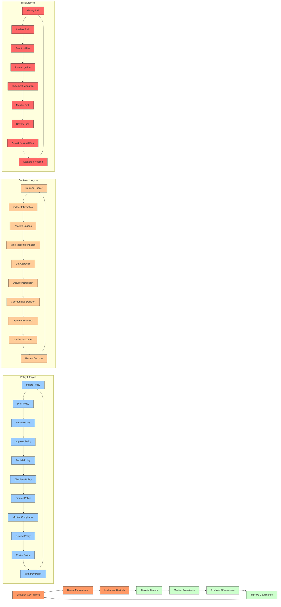

# Part 13: Governance Architecture - Context

## Purpose

This document establishes the architectural foundation for governance within the AI-OS system. It defines the structures, principles, and mechanisms that ensure the AI-OS operates within expected parameters, adheres to organizational policies, manages risk, and maintains accountability across all system components and interactions. This context guides the development of all subsequent chapters in Part 13, ensuring consistency and alignment with the overall AI-OS architectural vision.

## Governance Vision

To create a self-governing AI operating system where autonomous agents operate within clearly defined boundaries, make transparent decisions, and are held accountable for their actions through formalized policies, continuous monitoring, and adaptive enforcement mechanisms, thereby enabling trustworthy, compliant, and resilient AI operations at scale.

## Governance Objectives

1. **Ensure Policy Compliance**: All agents and workflows must adhere to established organizational and regulatory policies.
2. **Maintain Operational Integrity**: Prevent unauthorized actions and maintain system stability through controlled agent behavior.
3. **Enable Transparent Decision-Making**: Provide clear audit trails for all significant decisions and actions.
4. **Manage Risk Proactively**: Identify, assess, and mitigate risks associated with autonomous agent operations.
5. **Establish Clear Accountability**: Define responsibility and answerability for agent actions and system outcomes.
6. **Facilitate Adaptive Governance**: Allow governance policies to evolve based on operational experience and changing requirements.
7. **Protect System Assets**: Safeguard data, knowledge, and capabilities from misuse or unauthorized access.
8. **Enable Efficient Operations**: Streamline governance processes to avoid unnecessary bottlenecks while maintaining controls.

## Scope

The Governance Architecture encompasses all mechanisms, policies, and processes that:
- Define acceptable behavior for agents and workflows
- Establish decision-making authority and responsibility
- Monitor and enforce compliance with policies
- Manage risks associated with autonomous operations
- Handle exceptions and violations
- Conduct audits and generate compliance reports
- Govern the lifecycle of policies, decisions, and other governance artifacts
- Apply to all parts of the AI-OS system including agents, workflows, data, knowledge, and capabilities

## Non-Scope

The following are explicitly outside the scope of this governance architecture definition:
- Specific implementation details of individual governance tools or technologies
- Detailed procedural steps for specific compliance frameworks (e.g., GDPR, HIPAA specifics)
- Agent-specific behavioral guidelines (covered in Agent Design chapters)
- Workflow execution engines and scheduling mechanisms (covered in Workflow chapters)
- Low-level security implementations (covered in Security chapters)
- Specific knowledge representation formats (covered in Knowledge Management chapters)
- User interface designs for governance dashboards
- Specific audit tooling implementations

## Architectural Boundaries

The governance architecture operates across the following boundaries:
- **Horizontal Boundary**: Spans all functional domains of AI-OS (Parts 1-15), applying governance principles uniformly.
- **Vertical Boundary**: Operates from strategic policy definition down to operational enforcement and audit.
- **Temporal Boundary**: Covers the complete lifecycle of governance artifacts from creation to retirement.
- **Trust Boundary**: Defines the interface between trusted governance components and untrusted operational components.
- **Authority Boundary**: Clearly delineates where governance authority begins and ends, and where operational authority takes over.

## Governance Domains

The AI-OS governance architecture addresses twelve interconnected domains:

1. **Architecture Governance**: Ensures architectural decisions align with principles, standards, and future vision.
2. **Policy Governance**: Manages the creation, approval, distribution, and enforcement of policies.
3. **Agent Governance**: Controls agent behavior, capabilities, and lifecycle through policy and monitoring.
4. **Capability Governance**: Governs the discovery, approval, usage, and retirement of agent capabilities.
5. **Workflow Governance**: Manages workflow design, execution, monitoring, and exception handling.
6. **Data Governance**: Ensures data quality, security, privacy, and proper usage throughout its lifecycle.
7. **Knowledge Governance**: Manages knowledge creation, validation, sharing, and obsolescence.
8. **Security Governance**: Defines security policies, controls access, and manages threat response.
9. **Operational Governance**: Oversees system performance, reliability, and operational health.
10. **Risk Governance**: Identifies, assesses, mitigates, and monitors risks across all domains.
11. **Compliance Governance**: Ensures adherence to external regulations and internal standards.
12. **Audit Governance**: Plans, executes, and follows up on audits to verify governance effectiveness.

These domains are not siloed; they interact continuously through shared policies, events, and feedback loops.

# Governance Principles

The AI-OS governance architecture is founded on these core principles:

1. **Policy as Code**: Governance policies are expressed in machine-readable formats for automated enforcement.
2. **Least Privilege**: Agents and workflows operate with the minimum authority necessary to perform their functions.
3. **Separation of Concerns**: Governance functions (policy, decision, enforcement, audit) are distinct and separable.
4. **Transparency**: All governance decisions and actions are logged and available for review.
5. **Accountability**: Every significant action can be traced to a responsible entity (agent, human, or system).
6. **Adaptability**: Governance mechanisms evolve based on feedback and changing conditions.
7. **Defense in Depth**: Multiple layers of governance controls protect against single points of failure.
8. **Continuous Monitoring**: Governance is an ongoing process, not a periodic activity.
9. **Risk-Based Approach**: Governance efforts are prioritized based on risk assessment.
10. **Immutable Audit Trail**: Critical governance events cannot be altered or deleted.

# Policy-Driven Architecture

The AI-OS employs a policy-driven architecture where:
- Policies are the primary mechanism for governing behavior
- Policies are evaluated continuously at runtime
- Policy decisions are made close to the point of action (decentralized where appropriate)
- Policy conflicts are resolved through predefined hierarchy and conflict resolution mechanisms
- Policies can be static (long-term rules) or dynamic (context-dependent)
- Policy updates propagate through the system with minimal delay
- Policy evaluation is performed by dedicated governance services embedded in the runtime

# Authority Model

Authority in AI-OS is structured as a hierarchical yet distributed model:
- **Supreme Authority**: Resides with organizational leadership and regulatory bodies (external to AI-OS)
- **System Authority**: Vested in the AI-OS governance framework itself
- **Domain Authority**: Delegated to specific governance domains (e.g., Security Governance has authority over security policies)
- **Operational Authority**: Granted to agents and workflows based on their roles and current context
- **Emergency Authority**: Special provisions for overriding normal governance during critical situations

Authority flows downward from system to operational levels, but operational feedback can influence authority adjustments through governance processes.

# Responsibility Model

Responsibility in AI-OS is assigned based on:
- **Role-Based Responsibility**: Defined by an agent's or component's designated role
- **Contextual Responsibility**: Assigned based on the specific situation or workflow context
- **Shared Responsibility**: Multiple parties may share responsibility for complex outcomes
- **Delegated Responsibility**: Can be formally transferred through governance processes
- **Inherent Responsibility**: Some responsibilities (like safety) cannot be fully delegated

Key responsibility types:
- **Policy Responsibility**: Ensuring policies are followed
- **Outcome Responsibility**: Being answerable for the results of actions
- **Process Responsibility**: Ensuring proper procedures are followed
- **Compliance Responsibility**: Ensuring adherence to regulations

# Accountability Model

Accountability ensures that responsibility can be traced and enforced:
- **Auditability**: All significant actions are logged with sufficient detail for reconstruction
- **Attribution**: Actions can be definitively linked to specific entities (agents, humans, system components)
- **Non-repudiation**: Entities cannot plausibly deny performing actions they are attributed to
- **Answerability**: Responsible parties must be able to explain and justify their actions
- **Enforceability**: Consequences can be applied when accountability failures are identified

The accountability model depends on:
- Immutable audit trails
- Strong identity and access management
- Cryptographic signing of critical actions
- Regular reconciliation processes

# Decision Rights

Decision rights define who can make what types of decisions:
- **Strategic Decisions**: Long-term direction and policy (reserved for governance bodies)
- **Tactical Decisions**: Medium-term planning and resource allocation (shared between governance and operations)
- **Operational Decisions**: Day-to-day agent and workflow actions (delegated to operational components)
- **Emergency Decisions**: Immediate responses to crises (may bypass normal governance with subsequent review)

Decision rights are:
- **Context-Sensitive**: Vary based on situation, data sensitivity, and risk level
- **Time-Bounded**: May be granted for specific durations
- **Revocable**: Can be withdrawn based on performance or changing conditions
- **Delegable**: Can be further delegated with appropriate oversight

# Delegated Authority

Delegation follows these principles:
1. **Authority Can Be Delegated**: Operational authority flows from governance to agents
2. **Responsibility Cannot Be Fully Delegated**: The delegator retains ultimate responsibility
3. **Delegation Must Be Explicit**: Clear documentation of what authority is delegated, to whom, and under what conditions
4. **Delegation Includes Accountability**: Delegated authority comes with responsibility to report outcomes
5. **Delegation Is Revocable**: Authority can be taken back if misused or conditions change
6. **Subdelegation May Be Allowed**: With explicit permission, delegates can further delegate authority

Delegation mechanisms include:
- Role-based access control (RBAC)
- Attribute-based access control (ABAC)
- Temporary elevation of privileges
- Capability-based delegation
- Policy-based authorization

# Governance Lifecycle

The governance lifecycle describes how governance itself is managed:
1. **Establishment**: Defining governance needs, principles, and initial policies
2. **Design**: Creating governance mechanisms, policies, and procedures
3. **Implementation**: Deploying governance controls into the AI-OS runtime
4. **Operation**: Ongoing application of governance during system operation
5. **Monitoring**: Continuous observation of governance effectiveness and compliance
6. **Evaluation**: Periodic assessment of whether governance objectives are being met
7. **Improvement**: Updating governance based on monitoring and evaluation results
8. **Retirement**: Phasing out obsolete governance elements

This lifecycle is continuous and overlapping; multiple governance elements may be in different phases simultaneously.

# Policy Lifecycle

Policies follow a specific lifecycle within the AI-OS:
1. **Initiation**: Need for a new policy or policy change is identified
2. **Drafting**: Policy text is created, often based on templates or regulations
3. **Review**: Stakeholders review the policy for completeness, correctness, and impact
4. **Approval**: Authorized governance body formally approves the policy
5. **Publication**: Policy is made available to all relevant agents and systems
6. **Distribution**: Policy is propagated to enforcement points throughout the system
7. **Enforcement**: Policy is actively evaluated and enforced during operations
8. **Monitoring**: Compliance with the policy is continuously monitored
9. **Review**: Policy effectiveness and relevance are assessed periodically
10. **Revision**: Policy is updated based on review findings or changing requirements
11. **Withdrawal**: Policy is formally retired when no longer needed

Policy versioning is maintained throughout this lifecycle.

# Decision Lifecycle

Significant decisions in AI-OS follow this lifecycle:
1. **Initiation**: A decision trigger occurs (event, request, scheduled process)
2. **Information Gathering**: Relevant data, policies, and context are collected
3. **Analysis**: Options are evaluated against policies, risks, and objectives
4. **Recommendation**: A preferred course of action is proposed
5. **Approval**: Required approvers review and authorize the decision
6. **Documentation**: The decision, rationale, and approvals are recorded
7. **Communication**: The decision is communicated to responsible parties
8. **Implementation**: Actions are taken to carry out the decision
9. **Monitoring**: Outcomes are tracked to verify the decision's effectiveness
10. **Review**: The decision process and outcomes are evaluated for learning

Decisions may be automated (policy-driven) or require human involvement based on their nature and risk level.

# Exception Lifecycle

Exceptions (policy violations or unexpected events) are handled through:
1. **Detection**: An exception is identified through monitoring, alerts, or reports
2. **Initial Assessment**: Preliminary determination of exception type, severity, and impact
3. **Notification**: Appropriate parties are alerted based on exception characteristics
4. **Immediate Response**: Automated or manual actions to contain or mitigate the exception
5. **Investigation**: Root cause analysis and detailed impact assessment
6. **Resolution**: Actions taken to resolve the exception and restore normal operations
7. **Documentation**: Complete record of the exception, response, and resolution
8. **Review**: Analysis to prevent recurrence and improve exception handling
9. **Closure**: Formal sign-off that the exception has been adequately addressed

Exceptions may trigger policy reviews, responsibility assignments, or process improvements.

# Approval Lifecycle

Approvals for policies, decisions, and actions follow:
1. **Request Submission**: Formal request for approval is submitted with required information
2. **Routing**: Request is sent to appropriate approvers based on type, sensitivity, and rules
3. **Reviewer Preparation**: Approvers access necessary information to make informed decision
4. **Evaluation**: Approver assesses request against relevant criteria and policies
5. **Decision**: Approver grants, denies, or requests modifications to the request
6. **Notification**: Requester is informed of the approval decision
7. **Recording**: Approval decision and rationale are stored in the audit trail
8. **Implementation**: If approved, the requested action can proceed

Approval workflows may be sequential, parallel, or conditional based on risk and type.

# Risk Lifecycle

Risk management follows this continuous cycle:
1. **Identification**: Potential risks are discovered through analysis, monitoring, or reporting
2. **Analysis**: Risks are assessed for likelihood, impact, and interdependencies
3. **Prioritization**: Risks are ranked based on assessed severity and organizational tolerance
4. **Mitigation Planning**: Plans are developed to reduce likelihood or impact of high-priority risks
5. **Mitigation Implementation**: Risk reduction measures are put into place
6. **Monitoring**: Ongoing tracking of risk status and effectiveness of mitigations
7. **Review**: Periodic reassessment of risks to account for changes in environment or controls
8. **Acceptance**: Formal acknowledgment of residual risk that remains after mitigation
9. **Escalation**: Risks exceeding tolerance levels are escalated for higher-level attention

Risk lifecycle is ongoing; new risks constantly emerge as the system operates.

# Compliance Lifecycle

Compliance governance ensures adherence to requirements through:
1. **Requirement Identification**: External regulations and internal standards are identified
2. **Requirement Interpretation**: Requirements are translated into actionable controls
3. **Control Implementation**: Technical and procedural controls are put in place to meet requirements
4. **Testing**: Controls are verified to work as intended and meet requirements
5. **Monitoring**: Ongoing verification that controls remain effective and compliance is maintained
6. **Reporting**: Compliance status is reported to stakeholders and regulators as required
7. **Auditing**: Independent verification of compliance claims is conducted periodically
8. **Remediation**: Gaps identified through monitoring or auditing are corrected
9. **Certification**: Formal recognition of compliance may be sought and maintained
10. **Retirement**: Controls are updated or removed when requirements change

Compliance is treated as an ongoing state rather than a one-time achievement.

# Audit Lifecycle

Audit governance verifies the effectiveness of other governance mechanisms:
1. **Planning**: Audit scope, objectives, and methodology are defined based on risk assessment
2. **Notification**: Auditees are informed of upcoming audit and its focus
3. **Fieldwork**: Auditors collect evidence through interviews, documentation review, and testing
4. **Analysis**: Evidence is evaluated against criteria to identify findings and conclusions
5. **Reporting**: Audit results are documented in a formal report with recommendations
6. **Response**: Auditees provide responses to audit findings and action plans
7. **Follow-Up**: Verification that corrective actions have been implemented effectively
8. **Reporting**: Final audit closure report is issued
9. **Archival**: Audit records are retained for required periods
10. **Planning Input**: Audit results inform future audit planning and risk assessments

Audits may be internal, external, or combined, and may focus on specific domains or be comprehensive.

# Governance Enforcement Model

Enforcement ensures governance policies are followed through:
1. **Preventive Controls**: Stop violations before they occur (e.g., policy checks before action)
2. **Detective Controls**: Identify violations after they occur (e.g., monitoring and alerting)
3. **Corrective Controls**: Remediate violations and restore compliance (e.g., automated rollbacks)
4. **Deterrent Controls**: Discourage violations through visible consequences
5. **Compensating Controls**: Provide alternative protection when primary controls are insufficient

Enforcement mechanisms include:
- **Autonomous Enforcement**: Embedded policy checks in agent decision-making loops
- **Governance Services**: Dedicated services that monitor and enforce policies system-wide
- **Workflow Interceptors**: Points in workflow execution where policies are evaluated
- **Access Control Enforcement**: Prevention of unauthorized resource access
- **Data Usage Controls**: Restrictions on how data can be accessed, processed, and shared
- **Change Management Controls**: Governance over system and policy changes

Enforcement follows the principle of "fail-safe": when in doubt, the default is to deny or restrict action until proper authorization can be verified.

# Clear Distinctions

## Policy vs Authority vs Decision vs Enforcement vs Audit vs Accountability

- **Policy**: The "what" - rules, standards, and guidelines that define acceptable behavior and requirements. Policies are the input to governance processes.

- **Authority**: The "who can" - the right or power to make decisions, take actions, or allocate resources. Authority is derived from policies and organizational structure.

- **Decision**: The "whether to" - a specific choice made among alternatives based on policies, authority, and context. Decisions exercise authority to implement or interpret policy.

- **Enforcement**: The "how we ensure" - mechanisms that prevent, detect, and correct policy violations. Enforcement acts on behavior to ensure compliance with policy.

- **Audit**: The "did we follow" - independent examination and verification of whether policies were followed and controls worked effectively. Audit provides assurance about the state of governance.

- **Accountability**: The "who answers for" - the obligation to explain, justify, and take responsibility for actions and decisions. Accountability follows from authority and is verified through audit.

These concepts form a cycle: Policy informs Authority, Authority enables Decision, Decision results in Behavior, Enforcement checks Behavior against Policy, Audit verifies Enforcement effectiveness, and Accountability ensures answerability for all steps.

# Relationship With Part 12

Part 12 (Collaboration Architecture) defines how agents and workflows interact and cooperate. Governance Architecture (Part 13) controls and guides these collaborations by:
- Establishing policies that define acceptable collaboration patterns
- Monitoring collaborative interactions for policy compliance
- Defining authority structures for joint decision-making in multi-agent scenarios
- Managing risks that arise from complex agent interactions
- Ensuring accountability for outcomes of collaborative efforts
- Providing audit trails of all collaborative exchanges
- Handling exceptions that occur during multi-agent operations

Governance does not define the collaboration mechanisms themselves (that is Part 12's role) but rather governs how those mechanisms are used.

# Relationship With Parts 1–11

Governance Architecture provides overarching control and guidance to all foundational parts:
- **Parts 1-3 (Foundations)**: Governance ensures foundational principles align with organizational policies and risk tolerance.
- **Parts 4-6 (Core Systems)**: Governance controls access to core services, monitors system health, and enforces operational policies.
- **Parts 7-9 (Intelligence)**: Governance oversees the creation, validation, and use of AI models and knowledge, ensuring ethical and compliant intelligence operations.
- **Parts 10-11 (Interfaces)**: Governance manages how the system interacts with external worlds, enforcing security and usage policies at boundaries.

Governance sets the "rules of the game" that Parts 1-11 must follow in their respective domains.

# Relationship With Parts 14–15

Governance Architecture prepares the way for the concluding parts:
- **Part 14 (Evolution & Adaptation)**: Governance provides the feedback mechanisms (monitoring, audit, review) that drive system evolution. It defines how policies and controls can adapt over time.
- **Part 15 (Ultimate Architecture)**: Governance is a critical subsystem that must itself be designed for scalability, resilience, and long-term viability within the ultimate AI-OS architecture.

Parts 14-15 build upon the governance foundation, showing how the system learns from governance outputs and how governance fits into the ultimate vision.

# Architectural Assumptions

The governance architecture assumes that:
1. The AI-OS runtime provides reliable mechanisms for policy evaluation at decision points
2. Agents have identifiable identities and can be authenticated and authorized
3. Sufficient metadata accompanies actions to enable meaningful audit trails
4. Governance services can operate with minimal performance impact on core operations
5. Policy conflicts are rare and can be resolved through predefined hierarchies
6. Human oversight remains available for exceptional circumstances and appeals
7. The system can distinguish between policy violations and operational errors
8. Governance data (policies, logs, audit trails) itself requires protection and governance
9. External systems interacting with AI-OS will respect its governance boundaries
10. Sufficient logging and monitoring infrastructure exists to support governance needs

# Constraints

The governance architecture operates under these constraints:
1. **Performance**: Governance mechanisms must not introduce unacceptable latency in agent operations
2. **Scalability**: Governance must scale linearly or better with the number of agents and actions
3. **Complexity**: Governance policies and mechanisms should be as simple as possible while achieving objectives
4. **Flexibility**: The architecture must accommodate diverse policy types and enforcement needs
5. **Interoperability**: Governance must work with diverse agent technologies and external systems
6. **Deployability**: Governance mechanisms should be deployable without major system disruption
7. **Usability**: Human-facing governance interfaces should be understandable and usable
8. **Maintainability**: Governance configurations and policies should be maintainable over time
9. **Standards Compliance**: Where applicable, governance should align with relevant standards (e.g., for audit logging)
10. **Cost-Benefit**: Governance efforts should be justified by risk reduction and compliance value

# Governance Invariants

These conditions must always hold true in a properly governed AI-OS:
1. **No Action Without Authority**: Every significant agent action can be traced to a specific grant of authority
2. **Policy Supersedes Operation**: When policy and operational goals conflict, policy takes precedence
3. **Audit Trail Completeness**: All policy-relevant actions are recorded in the audit trail with sufficient detail
4. **Separation of Governance Concerns**: Policy, decision, enforcement, and audit functions remain distinct and non-conflicting
5. **Accountability Tracing**: For any outcome, there exists a traceable chain of responsibility and authority through accountability bindings
6. **Policy Accessibility**: All agents subject to a policy can access and understand that policy
7. **Enforcement Responsiveness**: Enforcement mechanisms respond to violations within defined time bounds
8. **Audit Independence**: Audit functions operate independently of the functions they are auditing
9. **Non-Retaliation**: Reporting governance concerns in good faith does not result in retaliation
10. **Continuous Improvement**: Governance outputs (audit findings, monitoring data) are used to improve the system

# Security Assumptions

Governance relies on these security assumptions:
1. **Trusted Computing Base**: The core governance services execute in a protected environment
2. **Secure Communications**: Communication between governance components is protected from eavesdropping and tampering
3. **Identity Integrity**: Agent and human identities cannot be forged or stolen without detection
4. **Policy Integrity**: Governance policies cannot be altered without detection and authorization
5. **Audit Trail Integrity**: Audit records cannot be modified or deleted without detection
6. **Least Privilege Enforcement**: Security controls effectively limit access to only what is necessary
7. **Vulnerability Management**: Known vulnerabilities in governance components are promptly addressed
8. **Security Monitoring**: Security-relevant events are monitored and analyzed for threats
9. **Incident Response**: Capability exists to respond to security incidents affecting governance
10. **Supply Chain Security**: Components used in governance are vetted for security risks

# Runtime Assumptions

The governance architecture assumes the runtime provides:
1. **Deterministic Policy Evaluation**: Identical inputs to policy engines produce identical outputs
2. **Low-Latency Access**: Policy decisions can be made with minimal delay during critical paths
3. **Concurrent Handling**: Multiple policy evaluations can occur simultaneously without bottlenecks
4. **Fault Tolerance**: Governance services continue operating despite individual component failures
5. **State Recovery**: Governance state can be recovered after failures without loss of critical information
6. **Resource Isolation**: Governance components do not starve core operations of necessary resources
7. **Observability**: Sufficient metrics and logs are available to monitor governance health
8. **Extensibility**: New policy types and enforcement mechanisms can be added without major redesign
9. **Time Synchronization**: Distributed components have sufficiently synchronized clocks for audit correlation
10. **Memory Safety**: Governance components are protected from common memory-related vulnerabilities

# Future Evolution

The governance architecture is designed to evolve through:
1. **Policy Expressiveness**: Advancements in policy languages for more nuanced and contextual rules
2. **Decentralized Governance**: Increased use of distributed ledger technologies or consensus mechanisms for governance decisions
3. **AI-Augmented Governance**: Using AI to assist in policy creation, risk prediction, and anomaly detection
4. **Real-Time Adaptation**: Policies that automatically adjust based on real-time system conditions and threat intelligence
5. **Cross-Domain Governance Integration**: Deeper integration between governance domains for holistic risk management
6. **Predictive Governance**: Using analytics to anticipate policy violations before they occur
7. **User-Centric Governance**: Greater involvement of end-users in governance processes through transparent interfaces
8. **Standardized Governance Interfaces**: Common interfaces for governance components to improve interoperability
9. **Zero-Trust Governance**: Applying zero-trust principles throughout the governance architecture itself
10. **Governance for Emerging AI Paradigms**: Adapting governance to handle new forms of AI autonomy and collaboration

# Mermaid Diagrams

## Governance Boundaries and Relationships

```mermaid
graph TD
    A[External Requirements<br/>(Regulations, Standards)] --> B[Policy Governance]
    B --> C[Architecture Governance]
    B --> D[Agent Governance]
    B --> E[Capability Governance]
    B --> F[Workflow Governance]
    B --> G[Data Governance]
    B --> H[Knowledge Governance]
    B --> I[Security Governance]
    B --> J[Operational Governance]
    B --> K[Risk Governance]
    B --> L[Compliance Governance]
    B --> M[Audit Governance]
    
    C --> N[System Architecture]
    D --> O[Agent Behaviors]
    E --> P[Agent Capabilities]
    F --> Q[Workflow Execution]
    G --> R[Data Lifecycle]
    H --> S[Knowledge Assets]
    I --> T[Security Controls]
    J --> U[System Operations]
    K --> V[Risk Assessment & Mitigation]
    L --> W[Compliance Reporting]
    M --> X[Audit Findings & Reports]
    
    style A fill:#f9f,stroke:#333
    style B fill:#bbf,stroke:#333
    style C fill:#bfb,stroke:#333
    style D fill:#bfb,stroke:#333
    style E fill:#bfb,stroke:#333
    style F fill:#bfb,stroke:#333
    style G fill:#bfb,stroke:#333
    style H fill:#bfb,stroke:#333
    style I fill:#bfb,stroke:#333
    style J fill:#bfb,stroke:#333
    style K fill:#bfb,stroke:#333
    style L fill:#bfb,stroke:#333
    style M fill:#bfb,stroke:#333
    style N fill:#dfd,stroke:#333
    style O fill:#dfd,stroke:#333
    style P fill:#dfd,stroke:#333
    style Q fill:#dfd,stroke:#333
    style R fill:#dfd,stroke:#333
    style S fill:#dfd,stroke:#333
    style T fill:#dfd,stroke:#333
    style U fill:#dfd,stroke:#333
    style V fill:#dfd,stroke:#333
    style W fill:#dfd,stroke:#333
    style X fill:#dfd,stroke:#333
```

## Governance Lifecycle Interaction



These diagrams illustrate the structural relationships and dynamic processes that define the AI-OS governance architecture. They show how governance domains interrelate, how policies flow through their lifecycle, and how governance interacts with system operations through continuous monitoring and improvement cycles.