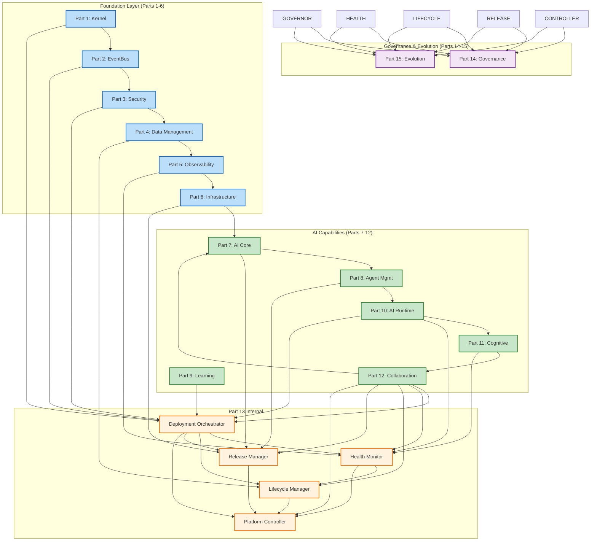

# Dependency Map for Part 13: Governance Architecture

## 1. Introduction

This document maps the dependencies of Part 13 (Governance Architecture) within the AI-OS ecosystem. It illustrates how Part 13 relies on and extends the foundational capabilities defined in Parts 1–12 to provide governance oversight, policy management, and compliance monitoring for the entire AI-OS system.

Part 13 sits at the Governance layer, building upon the runtime infrastructure (Parts 1–6), AI services (Parts 7–9), runtime foundations (Part 10), cognitive architecture (Part 11), and collaboration infrastructure (Part 12) to enable systematic policy creation, enforcement, monitoring, and governance decision-making across the AI-OS ecosystem.

### Purpose

This dependency map serves the following purposes:

- Document every dependency Part 13 consumes from Parts 1–12 with full classification
- Define the interfaces, events, schemas, policies, and contracts that Part 13 produces for Parts 14 and 15
- Establish initialization and runtime dependency ordering
- Identify circular dependency risks and mitigation strategies
- Provide risk assessment and evolution strategy for all architectural dependencies
- Enable conformance verification against Part 0 principles (RFC 2119 keywords: MUST, MUST NOT, SHOULD, MAY)

### Document Status & Conformance

- **Status:** Active (specifications defined)
- **Conformance Level:** All RFC 2119 keywords are normative per Part 0.3.1
- **Architecture Principles Reference:** All dependencies MUST conform to Part 0.4 Principles 1–12
- **Extension Points Reference:** Section 0.5.2 of Part 0 defines non-extension points — Part 13 MUST NOT vary these

---

## 2. Dependency Matrix

The matrix below uses RFC 2119 conformance keywords to express dependency strengths.

| Depends On | Dependency Type | Criticality | Direction |
|---|---|---|---|
| **Part 1** (Core Runtime) | Hard, Runtime | Critical | Consumes |
| **Part 2** (EventBus) | Hard, Runtime | Critical | Consumes |
| **Part 3** (Security) | Hard, Contract | Critical | Consumes |
| **Part 4** (Data Management) | Hard, Runtime | Critical | Consumes |
| **Part 5** (Operations Observability) | Hard, Contract | Critical | Consumes |
| **Part 6** (Infrastructure Abstraction) | Hard, Contract | Critical | Consumes |
| **Part 7** (AI Core Services) | Soft, Runtime | Important | Consumes |
| **Part 8** (Agent & Skill Management) | Soft, Runtime | Important | Consumes |
| **Part 9** (Learning Layer) | Optional, Runtime | Secondary | Consumes |
| **Part 10** (AI Runtime) | Soft, Runtime | Important | Consumes |
| **Part 11** (Cognitive Architecture) | Soft, Runtime | Secondary | Consumes |
| **Part 12** (Collaboration) | Hard, Runtime | Critical | Consumes |
| **Part 13 Internal** | Hard, Internal | Critical | Produces |

---

## 3. Complete Dependency Map — Part 13 Consumes Parts 1–12

### 3.1 Dependency on Part 1: Core Runtime Layer

| Attribute | Value |
|---|---|
| **Dependency Type** | Hard, Runtime |
| **Criticality** | Critical |
| **Consumed Interfaces** | Kernel lifecycle hooks, service registration API, global singleton accessors (`get_state_manager`, `get_resource_manager`, `get_workflow_manager`), checkpoint/restore APIs, BaseService contract |
| **Produced Interfaces** | Governance orchestration service interfaces (via event subscription only — no direct calls per Principle 1) |
| **Events Consumed** | `kernel.starting`, `kernel.started`, `kernel.stopping`, `kernel.stopped`, `service.registered`, `service.unregistered`, `workflow.checkpointed`, `workflow.restored`, `resource.allocated`, `resource.deallocated` |
| **Events Produced** | `governance.policy.created`, `governance.policy.updated`, `governance.policy.deprecated`, `governance.decision.made`, `governance.delegation.granted`, `governance.violation.detected`, `governance.control.activated` |
| **Schemas Consumed** | Service registration schema, checkpoint schema, resource allocation schema (shared with Part 13) |
| **Schemas Produced** | Policy schema, decision schema, governance event schema |
| **Policies Consumed** | Service lifecycle policies, resource allocation policies, checkpoint policies |
| **Policies Produced** | Policy lifecycle policies, governance decision policies, violation handling policies |
| **Shared Contracts** | Kernel lifecycle contract, service lifecycle contract, checkpoint/restore contract |
| **Version Requirements** | Part 1 v1.0.0 — MUST maintain compatibility within major version; breaking changes require 6-month notice per Part 12 events.md governance |
| **Failure Behavior** | If Kernel lifecycle events are not received, governance operations MUST NOT proceed. Failure propagates via `governance.operation.failed` with `failure_cause: kernel_unavailable`. Retry with exponential backoff (1s → 32s, 5 retries). DLQ after exhaustion. |
| **Change Impact** | Changes to Kernel lifecycle hooks or global singleton signatures require MAJOR version bump in Part 13 and MUST trigger revalidation of all governance orchestration logic. |
| **Ownership** | Part 1 (Core Runtime) owns Kernel lifecycle & singleton accessors; Part 13 owns consumption and governance orchestration. |

### 3.2 Dependency on Part 2: EventBus

| Attribute | Value |
|---|---|
| **Dependency Type** | Hard, Runtime |
| **Criticality** | Critical |
| **Consumed Interfaces** | EventBus pub/sub, subscription management, dead-letter queue (DLQ) APIs, transactional outbox pattern for governance state changes |
| **Produced Interfaces** | None — all inter-component communication via EventBus events (Principle 1) |
| **Events Consumed** | `system.upgrade.applied`, `system.config.changed`, `system.dlq.entry`, `system.error.persisted`, all lifecycle events from Parts 1–12, health check events from Part 5, policy.create.requested, policy.update.requested, decision.requested |
| **Events Produced** | `governance.policy.created`, `governance.policy.updated`, `governance.policy.deprecated`, `governance.decision.made`, `governance.delegation.granted`, `governance.violation.detected`, `governance.control.activated`, `governance.audit.completed`, `governance.platform.health.degraded`, `governance.platform.health.restored` |
| **Schemas Consumed** | Event envelope schema (Part 12 events.md §4), system event schemas |
| **Schemas Produced** | Governance event schemas (governance.policy.*, governance.decision.*, governance.delegation.*, governance.violation.*, governance.control.*, governance.audit.*) |
| **Policies Consumed** | Event retention policies (30 days hot + 1 year cold), retry policies, dead-letter queue configuration, priority lane policies (P0–P3) |
| **Policies Produced** | Governance event routing policies, policy event priority assignments, DLQ routing for violation events |
| **Shared Contracts** | Event envelope contract (Part 12 events.md §4), event persistence contract (WORM log, ordering per partition_key) |
| **Version Requirements** | EventBus v1.0.0 — MUST use canonical envelope schema v1; breaking changes to envelope require EVENT-001 governance review |
| **Failure Behavior** | EventBus unavailability blocks all governance orchestration. MUST implement local buffering for critical governance events with replay capability. Retry with backoff; if EventBus remains unavailable for >30s, trigger emergency shutdown procedure. |
| **Change Impact** | Changes to event envelope schema or persistence semantics require coordinated upgrade across all parts. Part 13 MUST validate against new schema before emitting events. |
| **Ownership** | Part 2 owns EventBus transport and persistence; Part 13 owns governance event production and consumption. |

### 3.3 Dependency on Part 3: Security

| Attribute | Value |
|---|---|
| **Dependency Type** | Hard, Contract |
| **Criticality** | Critical |
| **Consumed Interfaces** | Identity verification API, authorization API (`authorize(action, resource, principal)`), audit logging API (`audit_log(event)`), policy enforcement API, secret access API, attestation validation API |
| **Produced Interfaces** | Security event production via EventBus (Principle 1) |
| **Events Consumed** | `security.policy.violated` |
| **Events Produced** | `governance.policy.created`, `governance.policy.updated`, `governance.policy.deprecated`, `governance.exception.granted`, `governance.override.granted`, `governance.risk.identified`, `governance.control.activated`, `governance.control.failed`, `governance.audit.completed` |
| **Schemas Consumed** | IdentityTokenSchema, PolicyRuleSchema (Part 10 schemas.md), audit event schema, security classification schema |
| **Schemas Produced** | Policy schema, decision schema, governance event schema, violation record schema, accountability record schema |
| **Policies Consumed** | RBAC policies, ABAC policies, trust domain policies, cross-domain access policies, deployment authorization policies, secret handling policies |
| **Policies Produced** | Governance policy lifecycle policies, exception handling policies, override policies, risk management policies, control activation policies |
| **Shared Contracts** | Security policy enforcement contract, audit log contract (immutable, chained), trust domain boundary contract |
| **Version Requirements** | Part 3 v1.8.0 — MUST use v1 token format; policy schema v1.2.0+ required for governance authorization. Breaking changes to auth require 3-month notice per Part 12 events.md §24. |
| **Failure Behavior** | Unauthenticated governance operations MUST be rejected immediately. Authorization failures trigger `governance.operation.failed` with `failure_cause: unauthorized`. Audit failures MUST NOT block governance but MUST be logged locally and replayed when security subsystem recovers. |
| **Change Impact** | Changes to token format, policy schema, or authorization semantics require Part 13 reconfiguration and potential policy updates. Secret rotation events trigger automated key rotation procedures for governance components. |
| **Ownership** | Part 3 owns identity, authorization, and audit; Part 13 owns governance-time security enforcement and audit generation. |

### 3.4 Dependency on Part 4: Data Management

| Attribute | Value |
|---|---|
| **Dependency Type** | Hard, Runtime |
| **Criticality** | Critical |
| **Consumed Interfaces** | StateManager scoped APIs (`get_state(scope)`, `set_state(scope, key, value)`), transaction commit/rollback APIs, snapshot APIs, data persistence APIs |
| **Produced Interfaces** | Data consistency via EventBus events only |
| **Events Consumed** | `data.consistency.violation`, `data.snapshot.created`, `data.snapshot.restored`, `data.backup.completed`, `data.backup.failed` |
| **Events Produced** | `governance.data.policy.created`, `governance.data.policy.updated`, `governance.data.violation.detected`, `governance.data.retention.applied`, `governance.data.lineage.tracked` |
| **Schemas Consumed** | State scope schema (WORKFLOW, SERVICE, GLOBAL, SESSION), snapshot schema, backup manifest schema |
| **Schemas Produced** | Data policy schema, data violation record schema, data lineage schema, data retention schema |
| **Policies Consumed** | Data retention policies, consistency model policies, backup frequency policies, snapshot frequency policies |
| **Policies Produced** | Data governance retention policies, data quality policies, data access control policies, data lineage policies |
| **Shared Contracts** | State persistence contract (event-sourced state, scoped consistency), snapshot/restore contract, backup/restore contract |
| **Version Requirements** | Part 4 v1.5.0 — MUST use StateManager scope APIs as defined in Part 0.3.2; breaking changes to state scopes require architecture council approval. |
| **Failure Behavior** | State persistence failures MUST trigger governance rollback to last known-good checkpoint. Backup failures trigger alerts but MUST NOT block governance completion. Snapshot corruption triggers `governance.data.state.corrupted` event and initiates emergency restore procedure. |
| **Change Impact** | Changes to StateManager scopes or persistence semantics require Part 13 state management redesign. Database migration events trigger governance upgrade procedures. |
| **Ownership** | Part 4 owns data persistence and state management; Part 13 owns data state persistence and backup orchestration. |

### 3.5 Dependency on Part 5: Operations Observability

| Attribute | Value |
|---|---|
| **Dependency Type** | Hard, Contract |
| **Criticality** | Critical |
| **Consumed Interfaces** | Structured logger API (`StructuredLogger`), metric emission API (`emit_metric`), health check registration API (`register_health_check`), trace span API, alert submission API |
| **Produced Interfaces** | Observability data via EventBus events |
| **Events Consumed** | `monitoring.trace.span.opened`, `monitoring.trace.span.closed`, `monitoring.metric.scraped`, `monitoring.alert.raised`, `monitoring.alert.resolved`, `monitoring.incident.opened`, `monitoring.incident.closed`, `monitoring.cost.budget.threshold` |
| **Events Produced** | `governance.health.check.started`, `governance.health.check.passed`, `governance.health.check.failed`, `governance.metrics.collected`, `governance.alert.threshold_exceeded`, `governance.incident.created`, `governance.incident.resolved` |
| **Schemas Consumed** | MetricSchema (Part 10 schemas.md), health report schema, alert schema, trace span schema |
| **Schemas Produced** | Governance health report schema, governance metric schema, governance alert schema, governance incident schema |
| **Policies Consumed** | Alerting policies, health check policies, metric retention policies, trace sampling policies, SLI/SLO definitions |
| **Policies Produced** | Governance health check policies, metric collection policies, alert escalation policies, governance SLO definitions |
| **Shared Contracts** | Observability contract (structured logging, correlation IDs), health check contract, alert contract, metric emission contract |
| **Version Requirements** | Part 5 v2.0.0 — MUST conform to Part 11 observability principles (determinism preservation, isolation boundary integrity); metric schema v1 required. |
| **Failure Behavior** | Observability system failures MUST NOT block governance operations. MUST degrade gracefully with local buffering. Health check failures on critical components trigger governance rollback. Alert delivery failures trigger fallback notification channels. |
| **Change Impact** | Changes to health check contract or metric schema require Part 13 instrumentation updates. Alert policy changes may require governance procedure adjustments. |
| **Ownership** | Part 5 owns observability primitives and contracts; Part 13 owns governance-time observability and health monitoring. |

### 3.6 Dependency on Part 6: Infrastructure Abstraction

| Attribute | Value |
|---|---|
| **Dependency Type** | Hard, Contract |
| **Criticality** | Critical |
| **Consumed Interfaces** | Resource provisioning API, infrastructure state API, infrastructure health API, scaling API, infrastructure event subscription |
| **Produced Interfaces** | Infrastructure operations via EventBus only |
| **Events Consumed** | `infrastructure.provisioned`, `infrastructure.deprovisioned`, `infrastructure.scaled`, `infrastructure.health.changed`, `infrastructure.upgrade.available` |
| **Events Produced** | `governance.infrastructure.provisioned`, `governance.infrastructure.deprovisioned`, `governance.infrastructure.scaled`, `governance.infrastructure.upgraded` |
| **Schemas Consumed** | Infrastructure resource schema, provisioning request schema, scaling policy schema |
| **Schemas Produced** | Governance infrastructure manifest schema, infrastructure lifecycle schema |
| **Policies Consumed** | Infrastructure provisioning policies, resource allocation policies, scaling policies, infrastructure lifecycle policies |
| **Policies Produced** | Governance infrastructure provisioning policies, scaling trigger policies, infrastructure lifecycle management policies |
| **Shared Contracts** | Infrastructure provisioning contract, resource lifecycle contract, scaling contract |
| **Version Requirements** | Part 6 v1.0.0 — MUST use infrastructure abstraction layer interfaces; ResourceAllocationSchema v1 required. |
| **Failure Behavior** | Infrastructure provisioning failures trigger governance failure with detailed error context. Infrastructure unavailability during operations triggers rollback to last stable state. Scaling failures trigger alert escalation but MUST NOT corrupt governance state. |
| **Change Impact** | Changes to infrastructure provisioning APIs or resource schemas require Part 13 governance procedure updates. New infrastructure types require new governance manifest entries. |
| **Ownership** | Part 6 owns infrastructure abstraction; Part 13 owns governance-time infrastructure orchestration. |

### 3.7 Dependency on Part 7: AI Core Services

| Attribute | Value |
|---|---|
| **Dependency Type** | Soft, Runtime |
| **Criticality** | Important |
| **Consumed Interfaces** | Model routing API, inference request API, model lifecycle API, training pipeline API |
| **Produced Interfaces** | AI service operations via EventBus only |
| **Events Consumed** | `model.registered`, `model.deprecated`, `model.routed`, `inference.started`, `inference.completed`, `inference.failed`, `training.pipeline.started`, `training.pipeline.completed` |
| **Events Produced** | `governance.model.version_changed`, `governance.model.rollback_triggered`, `governance.inference_endpoint_health` |
| **Schemas Consumed** | Model descriptor schema, inference request/response schema, training pipeline schema |
| **Schemas Produced** | Model governance manifest schema, model version tracking schema |
| **Policies Consumed** | Model serving policies, inference routing policies, training scheduling policies |
| **Policies Produced** | Model upgrade policies, model rollback policies, inference endpoint health policies |
| **Shared Contracts** | Model serving contract, inference endpoint contract |
| **Version Requirements** | Part 7 v1.0.0 — ModelRouter API stability within major version; breaking changes require 3-month notice. |
| **Failure Behavior** | Model routing failures during governance operations trigger rollback to previous model version. Inference endpoint health degradation triggers alert but does not block governance unless critical threshold exceeded. |
| **Change Impact** | Model API changes may require governance script updates. New model providers require governance configuration updates. |
| **Ownership** | Part 7 owns AI core services; Part 13 owns model governance orchestration. |

### 3.8 Dependency on Part 8: Agent & Skill Management

| Attribute | Value |
|---|---|
| **Dependency Type** | Soft, Runtime |
| **Criticality** | Important |
| **Consumed Interfaces** | Agent lifecycle API, skill registry API, skill invocation API, agent registration/deregistration API |
| **Produced Interfaces** | Agent lifecycle operations via EventBus only |
| **Events Consumed** | `agent.lifecycle.registered`, `agent.lifecycle.deregistered`, `agent.lifecycle.heartbeat`, `agent.status.changed`, `skill.registered`, `skill.invoked`, `skill.executed`, `skill.failed` |
| **Events Produced** | `governance.agent.version_updated`, `governance.agent.delegation_modified`, `governance.skill.governance_policy_applied`, `governance.skill.access_reviewed` |
| **Schemas Consumed** | AgentTaskSchema (Part 10 schemas.md), skill invocation schema, agent lifecycle event schema |
| **Schemas Produced** | Governance agent manifest schema, skill governance policy schema |
| **Policies Consumed** | Agent lifecycle policies, skill deployment policies, agent health policies |
| **Policies Produced** | Agent governance policies, skill governance policies, agent health monitoring policies |
| **Shared Contracts** | Agent lifecycle contract, skill invocation contract |
| **Version Requirements** | Part 8 v1.0.0 — Agent lifecycle events v1; skill invocation schema v1 required. |
| **Failure Behavior** | Agent governance policy violations trigger agent version rollback. Agent health degradation during governance operations triggers health check escalation. Skill governance policy review failures prevent new skill activation but do not affect existing skills. |
| **Change Impact** | Agent lifecycle API changes require governance script updates. New skill types require governance configuration additions. |
| **Ownership** | Part 8 owns agent and skill management; Part 13 owns agent and skill governance orchestration. |

### 3.9 Dependency on Part 9: Learning Layer

| Attribute | Value |
|---|---|
| **Dependency Type** | Optional, Runtime |
| **Criticality** | Secondary |
| **Consumed Interfaces** | Learning observation hooks, model improvement API, experience replay API, adaptation feedback API |
| **Produced Interfaces** | Learning data via EventBus only |
| **Events Consumed** | `learning.adaptation.triggered`, `learning.model.updated`, `learning.experience.replayed`, `learning.performance.improved` |
| **Events Produced** | `governance.learning.model_updated`, `governance.rollback.triggered_learning` |
| **Schemas Consumed** | Experience replay schema, adaptation trigger schema |
| **Schemas Produced** | Governance learning data schema |
| **Policies Consumed** | Learning adaptation policies, model update policies, experience replay policies |
| **Policies Produced** | Governance learning integration policies |
| **Shared Contracts** | Learning observation contract, adaptation trigger contract |
| **Version Requirements** | Part 9 v1.0.0 — Learning hooks API v1, may evolve independently within semver constraints. |
| **Failure Behavior** | Learning system unavailability does NOT block governance operations. Learning data loss triggers local buffering and replay. |
| **Change Impact** | Learning API changes may affect governance-time learning data collection but do not block core governance operations. |
| **Ownership** | Part 9 owns learning subsystems; Part 13 owns governance-time learning integration. |

### 3.10 Dependency on Part 10: AI Runtime Architecture

| Attribute | Value |
|---|---|
| **Dependency Type** | Soft, Runtime |
| **Criticality** | Important |
| **Consumed Interfaces** | Workload scheduler API, execution context lifecycle API, resource quota API, isolation boundary API, checkpoint/restore API |
| **Produced Interfaces** | Runtime operations via EventBus only |
| **Events Consumed** | `runtime.workload.scheduled`, `runtime.workload.started`, `runtime.workload.completed`, `runtime.workload.failed`, `runtime.checkpoint.created`, `runtime.checkpoint.restored`, `runtime.scaling.event`, `runtime.isolation.violation` |
| **Events Produced** | `governance.runtime.scaled`, `governance.runtime.health_changed`, `governance.runtime.upgrade_required` |
| **Schemas Consumed** | Execution context schema, workload schema, resource quota schema, checkpoint schema |
| **Schemas Produced** | Governance runtime manifest schema |
| **Policies Consumed** | Workload scheduling policies, resource quota policies, isolation policies, checkpoint policies |
| **Policies Produced** | Governance runtime scaling policies, governance isolation verification policies |
| **Shared Contracts** | Workload execution contract, checkpoint/restore contract, isolation boundary contract |
| **Version Requirements** | Part 10 v1.0.0 — Runtime isolation guarantees are normative; breaking changes require 6-month notice per Part 10 design principles. |
| **Failure Behavior** | Runtime scheduling failures trigger governance rollback. Isolation violations trigger immediate governance halt and security escalation. Checkpoint corruption triggers emergency restore. |
| **Change Impact** | Runtime scheduling changes may require governance script updates. New isolation mechanisms require governance policy updates. |
| **Ownership** | Part 10 owns AI runtime execution; Part 13 owns governance-time runtime orchestration. |

### 3.11 Dependency on Part 11: Cognitive Architecture

| Attribute | Value |
|---|---|
| **Dependency Type** | Soft, Runtime |
| **Criticality** | Secondary |
| **Consumed Interfaces** | Cognitive state API, memory hierarchy API, reasoning trace API, cognitive health API |
| **Produced Interfaces** | Cognitive monitoring via EventBus only |
| **Events Consumed** | `cognitive.state.changed`, `cognitive.memory.accessed`, `cognitive.reasoning.completed`, `cognitive.health.degraded` |
| **Events Produced** | `governance.cognitive.state_updated`, `governance.cognitive.health_assessment`, `governance.reasoning.trace.approved` |
| **Schemas Consumed** | Cognitive state schema, memory object schema |
| **Schemas Produced** | Governance cognitive manifest schema, cognitive policy compliance schema |
| **Policies Consumed** | Cognitive health policies, memory state policies, reasoning trace retention policies |
| **Policies Produced** | Cognitive governance policies, cognitive assessment policies, reasoning governance policies |
| **Shared Contracts** | Cognitive state contract, memory lifecycle contract |
| **Version Requirements** | Part 11 v1.0.0 — Cognitive observability hooks v1; subject to Part 11 determinism invariants. |
| **Failure Behavior** | Cognitive state corruption triggers governance rollback to last checkpoint. Cognitive health degradation triggers alert escalation. |
| **Change Impact** | Cognitive API changes may require governance-time cognitive state handling updates. |
| **Ownership** | Part 11 owns cognitive observability; Part 13 owns governance-time cognitive state management. |

### 3.12 Dependency on Part 12: Multi-Agent Collaboration

| Attribute | Value |
|---|---|
| **Dependency Type** | Hard, Runtime |
| **Criticality** | Critical |
| **Consumed Interfaces** | Collaboration session API, agent directory API, capability registry API, shared context API, workflow orchestration API, council decision API, scheduler API, conflict resolution API |
| **Produced Interfaces** | Governance operations via EventBus only |
| **Events Consumed** | `agent.lifecycle.registered`, `agent.lifecycle.deregistered`, `agent.lifecycle.heartbeat`, `council.decision.published`, `workflow.lifecycle.started`, `workflow.lifecycle.completed`, `workflow.step.completed`, `workflow.step.failed`, `delegation.task_dispatched`, `delegation.task.completed`, `delegation.task.failed`, `session.started`, `session.ended`, `context.lifecycle.snapshot`, `resource.reserved`, `resource.released`, `resource.exhausted` |
| **Events Produced** | `governance.collaboration.session_started`, `governance.collaboration.session_ended`, `governance.workflow.orchestration_completed`, `governance.resource_pool.health_report`, `governance.conflict.resolved` |
| **Schemas Consumed** | `AgentSchema`, `CapabilitySchema`, `WorkflowDefinitionSchema`, `ExecutionPlanSchema`, `CheckpointSchema`, `HealthReportSchema`, `ConfigurationSchema`, ResourceAllocationSchema (shared) |
| **Schemas Produced** | Governance collaboration manifest schema, platform health report schema |
| **Policies Consumed** | Collaboration session policies, agent health policies, workflow execution policies, resource allocation policies, trust domain policies |
| **Policies Produced** | Governance collaboration health policies, workflow orchestration safety policies, resource pool management policies |
| **Shared Contracts** | Collaboration event bus contract, shared context service contract, task orchestration API contract, agent discovery contract (Part 12 components.md §§8–9, 11) |
| **Version Requirements** | Part 12 v1.0.0 — MUST use canonical event envelope v1; agent/council/event schemas v1 required. Coordination with Part 12 Runtime Coordinator for initialization ordering per Part 12 components.md §13. |
| **Failure Behavior** | Collaboration session failures trigger governance rollback with conflict resolution. Agent unavailability triggers task rerouting via Part 12 Delegation Manager. Resource contention triggers escalation through Part 12 Scheduler. |
| **Change Impact** | Changes to collaboration protocols require Part 13 governance procedure updates. New workflow types require governance configuration support. |
| **Ownership** | Part 12 owns collaboration infrastructure; Part 13 owns governance-time collaboration orchestration. |

### 3.13 Internal Part 13 Dependencies

| Component | Depends On | Interface |
|---|---|---|
| Governance Orchestrator | ResourceManager, Health Monitor, EventBus | Internal service interfaces via EventBus |
| Health Monitor | Observability (Part 5), Runtime (Part 10), Cognitive (Part 11) | Health check event consumption |
| Lifecycle Manager | Kernel (Part 1), Security (Part 3), Data Management (Part 4) | Lifecycle state and checkpoint APIs |
| Release Manager | Infrastructure (Part 6), AI Core (Part 7), Agent Mgmt (Part 8) | Release coordination via EventBus |
| Platform Controller | All Part 13 sub-components + Parts 1–12 | Central coordination via EventBus |

---

## 4. Dependency Graph

### 4.1 Mermaid Full Dependency Graph

```mermaid
graph TB
    subgraph PARTS["Parts 1–12 (Consumed by Part 13)"]
        P1[Part 1: Core Runtime]
        P2[Part 2: EventBus]
        P3[Part 3: Security]
        P4[Part 4: Data Management]
        P5[Part 5: Observability]
        P6[Part 6: Infrastructure]
        P7[Part 7: AI Core Services]
        P8[Part 8: Agent/Skill Mgmt]
        P9[Part 9: Learning]
        P10[Part 10: AI Runtime]
        P11[Part 11: Cognitive]
        P12[Part 12: Collaboration]
    end

    subgraph PART13["Part 13: Governance Architecture"]
        GOVERNOR[Governance Orchestrator]
        HEALTH[Health Monitor]
        LIFECYCLE[Lifecycle Manager]
        RELEASE[Release Manager]
        CONTROLLER[Platform Controller]
    end

    subgraph FUTURE["Parts 14–15 (Produced For)"]
        P14[Part 14: Governance & Conformance]
        P15[Part 15: Evolution & Extensibility]
    end

    %% Part 13 consumes from Parts 1-12
    P1 --> DEPLOY
    P1 --> LIFECYCLE
    P1 --> CONTROLLER

    P2 --> DEPLOY
    P2 --> HEALTH
    P2 --> LIFECYCLE
    P2 --> RELEASE
    P2 --> CONTROLLER

    P3 --> DEPLOY
    P3 --> LIFECYCLE
    P3 --> RELEASE
    P3 --> CONTROLLER

    P4 --> DEPLOY
    P4 --> LIFECYCLE
    P4 --> RELEASE
    P4 --> CONTROLLER

    P5 --> HEALTH
    P5 --> DEPLOY
    P5 --> CONTROLLER

    P6 --> DEPLOY
    P6 --> RELEASE
    P6 --> CONTROLLER

    P7 --> RELEASE

    P8 --> RELEASE

    P9 --> DEPLOY

    P10 --> HEALTH
    P10 --> DEPLOY

    P11 --> HEALTH
    P11 --> DEPLOY

    P12 --> DEPLOY
    P12 --> HEALTH
    P12 --> LIFECYCLE
    P12 --> RELEASE
    P12 --> CONTROLLER

    %% Part 13 internal dependencies
    GOVERNOR --> HEALTH
    GOVERNOR --> LIFECYCLE
    GOVERNOR --> RELEASE
    HEALTH --> LIFECYCLE
    RELEASE --> CONTROLLER
    LIFECYCLE --> CONTROLLER
    HEALTH --> CONTROLLER
    GOVERNOR --> CONTROLLER

    %% Part 13 produces for Parts 14-15
    DEPLOY --> P14
    HEALTH --> P14
    LIFECYCLE --> P14
    RELEASE --> P14
    CONTROLLER --> P14

    RELEASE --> P15
    DEPLOY --> P15
    HEALTH --> P15
    LIFECYCLE --> P15
    CONTROLLER --> P15

    %% Styling
    classDef part fill:#e3f2fd,stroke:#1565c0,stroke-width:2px;
    classDef part13 fill:#fff3e0,stroke:#ef6c00,stroke-width:2px;
    classDef future fill:#e8f5e8,stroke:#2e7d32,stroke-width:2px;

    class P1,P2,P3,P4,P5,P6,P7,P8,P9,P10,P11,P12 part;
    class DEPLOY,HEALTH,LIFECYCLE,RELEASE,CONTROLLER part13;
    class P14,P15 future;
```

### 4.2 Mermaid Critical Path Diagram

---

## 5. Dependency Direction Rules

### 5.1 Forward Dependencies (Consumed)

Part 13 **MUST** consume dependencies from Parts 1–12 as specified below. Part 13 **MUST NOT** consume dependencies from Parts 14–15 (Principle 1 and Part 0.5.2 non-extension points).

| Rule ID | Rule |
|---|---|
| **D1** | Part 13 **MUST** depend on Parts 1, 2, 3, 4, 5, 6, and 12 as hard runtime or contract dependencies. |
| **D2** | Part 13 **MUST** depend on Parts 7, 8, 10, and 11 as soft runtime dependencies. |
| **D3** | Part 13 **MAY** depend on Part 9 as an optional runtime dependency. |
| **D4** | All forward dependencies **MUST** be consumed via EventBus events or approved APIs — **no direct service-to-service calls** (Principle 1). |
| **D5** | Part 13 **MUST NOT** import or directly invoke code from Parts 14–15. |
| **D6** | Part 13 **MUST** use the canonical event envelope schema (Part 12 events.md §4) for all event production. |
| **D7** | Part 13 **MUST** use the shared `ResourceManager` component per Part 0.113. |
| **D8** | Part 13 **MUST** use the shared `ResourceAllocationSchema` per MASTER_ARCHITECTURE_ROADMAP §4.5. |

### 5.2 Reverse Dependencies (Produced For)

Part 13 **produces** contracts, schemas, and events that Parts 14 and 15 **MUST** depend on:

| Rule ID | Rule |
|---|---|
| **RD1** | Part 13 **MUST** publish deployment lifecycle events consumable by Part 14 (Governance). |
| **RD2** | Part 13 **MUST** publish platform health events consumable by Part 14 (Conformance). |
| **RD3** | Part 13 **MUST** publish release readiness events consumable by Part 15 (Evolution). |
| **RD4** | Part 13 **MUST** publish upgrade procedure events consumable by Part 15 (Extensibility). |
| **RD5** | Part 13 **MUST** publish deployment metrics consumable by Part 14 (Audit) and Part 15 (Evolution). |

### 5.3 Internal Dependencies

Part 13's internal components interact exclusively via EventBus (Principle 1):

| Component | Internal Dependencies | Interface |
|---|---|---|
| Deployment Orchestrator | Health Monitor, Lifecycle Manager, Release Manager | EventBus |
| Health Monitor | Observability (Part 5), AI Runtime (Part 10), Cognitive (Part 11) | EventBus |
| Lifecycle Manager | Kernel (Part 1), Security (Part 3), Data Management (Part 4) | EventBus |
| Release Manager | Infrastructure (Part 6), AI Core (Part 7), Agent Mgmt (Part 8), Collaboration (Part 12) | EventBus |
| Platform Controller | All Part 13 internal components + Parts 1–12 | EventBus |

---

## 6. Circular Dependency Rules

### 6.1 Circular Dependency Prevention

While Part 13 consumes from Parts 1–12 and produces for Parts 14–15, the dependency direction is **strictly unidirectional**:

1. **Part 13 → Parts 1–12** (consumes services, never provides back to them in v1.0)
2. **Part 13 → Parts 14–15** (produces platform operation contracts, never consumes)

This prevents circular dependencies.

### 6.2 Safe Bidirectional Interaction

If circular dependencies arise during evolution, they **MUST** be resolved through:

| Mechanism | Application |
|---|---|
| **Dependency Inversion** | Part 13 defines abstractions (e.g., `IDeploymentPlatform`); consuming parts depend on abstractions, not concrete implementations |
| **Initialization Order Enforcement** | Part 13 initializes before Parts 14–15; Parts 14–15 cannot call Part 13 during Part 13's own initialization |
| **Event-Based Decoupling** | Parts 14–15 consume Part 13 events without direct coupling; Part 13 does not consume Parts 14–15 events |
| **Interface Contracts** | Stable interface contracts prevent tight coupling; Part 13 publishes schemas that parts 14–15 pin to |

### 6.3 Validation Rules

| Rule ID | Rule |
|---|---|
| **C1** | Static analysis **MUST** verify Part 13 does not import or call Parts 14–15 code. |
| **C2** | Runtime validation **MUST** ensure Part 13 initialization completes before any Part 14–15 component attempts to use Part 13 contracts. |
| **C3** | Part 13 **MUST NOT** wait for Parts 14–15 during its own initialization (prevents circular boot). |
| **C4** | Any detected circular dependency **MUST** trigger Architecture Review Board (ARB) review per Part 0.5.3. |

---

## 7. Initialization Order

### 7.1 Boot Sequence

Part 13 **MUST** initialize in the following order, after Parts 1–12 are fully initialized:

### 7.2 Detailed Initialization Steps

| Step | Component | Dependencies Required | Validation |
|---|---|---|---|
| 1 | Lifecycle Manager | Part 1 (Kernel), Part 3 (Security), Part 4 (Data Management), Part 2 (EventBus) | Kernel lifecycle hooks available; Security token validation; StateManager scopes initialized |
| 2 | Health Monitor | Part 5 (Observability), Part 10 (AI Runtime), Part 11 (Cognitive) | StructuredLogger available; Runtime health endpoints; Cognitive state APIs |
| 3 | Release Manager | Part 6 (Infrastructure), Part 7 (AI Core), Part 8 (Agent Mgmt), Part 12 (Collaboration), Part 3 (Security) | Infrastructure provisioning APIs; ModelRouter; Agent Directory; Collaboration session APIs |
| 4 | Deployment Orchestrator | All above + Part 9 (Learning), Part 12 (Collaboration) | All upstream services available; ResourceAllocationSchema registered |
| 5 | Platform Controller | All above | Central coordination ready; all health checks passing |

### 7.3 Initialization Validation Requirements

- **R1**: Each Part 13 component **MUST** verify its dependencies are available before initialization completes.
- **R2**: If any dependency is unavailable, initialization **MUST** fail with `initialization_failed` event and trigger rollback.
- **R3**: Initialization timeout **MUST** be configurable per component, defaulting to 120s (per Part 12 Runtime Coordinator §13.4 config).
- **R4**: Health checks **MUST** be registered with Part 5 Observability during initialization.

---

## 8. Runtime Dependency Order

### 8.1 Operational Flow

During normal operation, Part 13 processes events and executes operations in the following dependency order:

```mermaid
graph LR
    A[Deployment Requested] --> B[Security Authorization Check]
    B --> C[Infrastructure Provisioning]
    C --> D[AI Core Services Deployment]
    D --> E[Agent/Skill Deployment]
    E --> F[Learning Integration Setup]
    F --> G[Runtime Environment Activation]
    G --> H[Cognitive State Initialization]
    H --> I[Collaboration Session Setup]
    I --> J[Health Monitoring Activation]
    J --> K[Lifecycle Monitoring]
    K --> L[Release Procedure Monitoring]
    L --> M[Deployment Operational]
    
    style A fill:#e3f2fd
    style M fill:#e8f5e8
```

### 8.2 Event Processing Priority

| Priority | Event Category | Source Part | Processing Requirement |
|---|---|---|---|
| P0 | Security violations, infrastructure failures | Part 3, Part 6 | Immediate handling; blocks deployment |
| P1 | Deployment lifecycle, critical health alerts | Part 13 internal | Must process within 100ms |
| P2 | Health status changes, workflow state | Part 5, Part 10, Part 12 | Must process within 500ms |
| P3 | Routine health metrics, routine events | Part 5, Part 12, Part 13 | Batch processing acceptable |

### 8.3 Runtime Dependency Validation

- **R5**: All event processing **MUST** follow EventBus delivery guarantees (at-least-once, idempotent handlers per Part 12 events.md §2.6).
- **R6**: Health monitoring **MUST** sample at frequencies defined by Part 12 Agent Directory configuration (heartbeat: 5000ms, health probe: 30000ms).
- **R7**: Resource allocation **MUST** use the shared `ResourceManager` and `ResourceAllocationSchema` without duplication.

---

## 9. Cross-Part Contract Matrix

### 9.1 Consumed Contracts Matrix

| Contract Name | Defined In Part | Consumed By Part 13 Component | Criticality | Version |
|---|---|---|---|---|
| Event envelope schema | Part 2/12 events.md §4 | All Part 13 events | Critical | v1 |
| Kernel lifecycle hooks | Part 1 §3.1 | Lifecycle Manager | Critical | v1.0.0 |
| Global singleton accessors | Part 1 §3.4 | All components | Critical | v1.0.0 |
| IdentityTokenSchema | Part 3/Part 12 schemas.md §3 | Release Manager, Lifecycle Manager | Critical | v1 |
| PolicyRuleSchema | Part 3/Part 12 schemas.md | Lifecycle Manager | Critical | v1.2.0 |
| StateManager scopes | Part 1 §3.4, Part 4 | Lifecycle Manager | Critical | v1 |
| CheckpointSchema | Part 1/Part 12 schemas.md §17 | Lifecycle Manager | Critical | v1 |
| StructuredLogger | Part 5 | Health Monitor | Critical | v2.0.0 |
| MetricSchema | Part 5/Part 12 schemas.md §15 | Health Monitor | Critical | v1 |
| HealthReportSchema | Part 12 schemas.md §19 | Health Monitor | Critical | v1 |
| ResourceAllocationSchema | Part 13 (shared) | Deployment Orchestrator, Release Manager | Critical | v1 |
| AgentSchema | Part 12 schemas.md §2 | Release Manager | Important | v1 |
| WorkflowDefinitionSchema | Part 12 schemas.md §4 | Deployment Orchestrator | Important | v1 |
| ExecutionPlanSchema | Part 12 schemas.md §16 | Deployment Orchestrator | Important | v1 |
| CapabilitySchema | Part 12 schemas.md §2 | Release Manager | Important | v1 |
| ConfigurationSchema | Part 12 schemas.md §18 | All components | Critical | v1 |

### 9.2 Produced Contracts Matrix

| Contract Name | Produced For Part | Producing Part 13 Component | Published In | Version |
|---|---|---|---|---|
| Deployment manifest schema | Part 14, Part 15 | Deployment Orchestrator | Part 13 schemas | v1 |
| Deployment lifecycle events | Part 14, Part 15 | Deployment Orchestrator | Part 13 events | v1 |
| Platform health report schema | Part 14 | Health Monitor | Part 13 schemas | v1 |
| Release readiness events | Part 15 | Release Manager | Part 13 events | v1 |
| Upgrade procedure schema | Part 15 | Release Manager | Part 13 schemas | v1 |
| Deployment state schema | Part 14 (audit) | Lifecycle Manager | Part 13 schemas | v1 |
| Rollback trigger events | Part 14 (governance) | Lifecycle Manager | Part 13 events | v1 |
| Platform health metrics | Part 14, Part 15 | Health Monitor | Part 13 metrics | v1 |

### 9.3 Shared Component Contracts

| Component | Owned By | Shared With Parts | Usage By Part 13 |
|---|---|---|---|
| **ResourceManager** | Part 13 (Kernel-owned per Part 0 §4.1) | Part 5, 6, 7, 11, 12 | Deployment Orchestrator, Release Manager |
| **ResourceAllocationSchema** | Part 13 | Part 13 only (shared definition) | Deployment Orchestrator, Release Manager |

### 9.4 Event Production/Consumption Matrix

| Event | Produced By Part 13 | Consumed By Parts 14-15 | Criticality |
|---|---|---|---|
| `deployment.lifecycle.started` | Lifecycle Manager | Part 14 (audit), Part 15 (evolution) | P1 |
| `deployment.lifecycle.completed` | Deployment Orchestrator | Part 14 (audit), Part 15 (evolution) | P1 |
| `deployment.lifecycle.failed` | Deployment Orchestrator | Part 14 (audit), Part 15 (evolution) | P0 |
| `platform.health.degraded` | Health Monitor | Part 14 (conformance), Part 15 (evolution) | P1 |
| `platform.health.restored` | Health Monitor | Part 14 (conformance), Part 15 (evolution) | P2 |
| `upgrade.procedure.started` | Release Manager | Part 14 (governance), Part 15 (evolution) | P1 |
| `upgrade.procedure.completed` | Release Manager | Part 14 (governance), Part 15 (evolution) | P1 |
| `deployment.rollback.initiated` | Lifecycle Manager | Part 14 (governance), Part 15 (evolution) | P0 |
| `deployment.backup.triggered` | Lifecycle Manager | Part 14 (audit) | P2 |
| `deployment.security_blocked` | Security integration | Part 14 (governance) | P0 |

---

## 10. Dependency Risk Assessment

### 10.1 Risk Matrix

| Risk Category | Probability | Impact | Mitigation Strategy |
|---|---|---|---|
| **Security failure** (Part 3) | Low | Critical | Defense in depth: Part 13 fails safe (deny deployment on auth failure); Security Gateway (Part 12.14) enforces at every boundary |
| **EventBus outage** (Part 2) | Low | Critical | Local buffering with replay; DLQ for deployment events; timeout-based failover |
| **Infrastructure provisioning failure** (Part 6) | Medium | High | Infrastructure abstraction layer provides fallback providers; rollback to last stable state |
| **Agent unavailability** (Part 8/Part 12) | Medium | Medium | Part 12 Delegation Manager reroutes tasks; health-based agent exclusion |
| **Runtime instability** (Part 10) | Low | High | Checkpoint/restore for deterministic recovery; isolation boundary enforcement |
| **Data corruption** (Part 4) | Low | Critical | WORM log with cryptographic chaining; snapshot-based recovery |
| **Observability blind spot** (Part 5) | Medium | Medium | Local health checks as fallback; structured logging with local persistence |
| **Resource starvation** (Part 6/Part 13) | Medium | High | ResourceAllocationSchema quotas; preemptive resource reservation |
| **Version incompatibility** | Medium | High | Semver pinning; compatibility matrix validation at init; contract testing |
| **Circular dependency emergence** | Low | Medium | Static analysis (ESLint rules); runtime init-order guards; ARB review |

### 10.2 Risk Mitigation by Dependency

| Dependency | Risk Level | Mitigation |
|---|---|---|
| Part 1 (Kernel) | **Critical** | Kernel lifecycle hooks are synchronous; Part 13 blocks on kernel readiness. Health checks verify kernel state. |
| Part 2 (EventBus) | **Critical** | Local event buffering during EventBus unavailability; replay-on-recovery pattern. |
| Part 3 (Security) | **Critical** | Security is fail-closed; all operations require authorization. Token refresh auto-recovery. |
| Part 4 (Data Management) | **Critical** | StateManager snapshots before and after each deployment phase; rollback on corruption. |
| Part 5 (Observability) | **High** | Dual logging (EventBus + local structured logs); health check fallback. |
| Part 6 (Infrastructure) | **High** | Infrastructure abstraction layer with multi-provider fallback; health verification before provisioning. |
| Part 7 (AI Core) | **Medium** | ModelRouter fallback chains; health-based model selection per Part 7 contracts. |
| Part 8 (Agent Mgmt) | **Medium** | Agent health checks per Part 12 Agent Directory §1.4 config; graceful degradation. |
| Part 9 (Learning) | **Low** | Optional integration; no impact on core deployment operations. |
| Part 10 (AI Runtime) | **High** | Checkpoint/restore via Part 10 contracts; isolation boundary verification. |
| Part 11 (Cognitive) | **Medium** | Cognitive state checkpointing; health-based cognitive agent exclusion. |
| Part 12 (Collaboration) | **Critical** | Collaboration session health per Part 12 Runtime Coordinator §13; conflict resolution integration. |

---

## 11. Dependency Evolution Strategy

### 11.1 Versioning Governance

Part 13 **MUST** follow semantic versioning (SemVer 2.0.0) per Part 0.4 Principle 11 and Part 12 schemas.md §17:

| Version Increment | Permitted Changes | Notification Period |
|---|---|---|
| **MAJOR** | Breaking changes to consumed interfaces or produced contracts | 6 months (Part 12 events.md §24 governance) |
| **MINOR** | Backward-compatible additions, new optional fields, new event types | 2 releases |
| **PATCH** | Bug fixes, non-breaking clarifications | None |

### 11.2 Deprecation Lifecycle

| Phase | Duration | Actions |
|---|---|---|
| **Announcement** | Immediate | Deprecation notice published in events/schema changelogs |
| **Mark Deprecated** | 6 months | `deprecated` flag in schema; warnings in validation tools |
| **Grace Period** | 6 months | Both old and new interfaces supported; migration guides published |
| **Removal** | After grace period | Interface removed in next MAJOR version |

### 11.3 Breaking Change Process

Breaking changes to Part 13 contracts **MUST** follow this process:

1. **Proposal**: Submit to Architecture Review Board (Part 0.5.3) with impact analysis
2. **Advanced Notice**: Minimum 3 months notice to all affected consumers (Part 14, Part 15)
3. **Migration Guide**: Comprehensive migration path documented per Part 12 schemas.md §24
4. **Grace Period**: Concurrent support for both versions for minimum 6 months
5. **Automated Tooling**: Migration scripts provided where possible

### 11.4 Schema Evolution

| Change Type | Allowed In | Requires | Notes |
|---|---|---|---|
| Add optional field | MINOR | Schema registry update | Backward compatible |
| Add new event type | MINOR | ESC ratification (Part 12 events.md §24) | Follow naming RFC |
| Add new schema | MINOR | Schema stewardship review | Must pass quality gates |
| Remove field | MAJOR | ARB approval | 6-month deprecation first |
| Change field type | MAJOR | ARB approval | 6-month deprecation first |
| Rename field | MAJOR | ARB approval | 6-month deprecation first |

### 11.5 Consumer-Driven Contract Testing

Part 13 **MUST** implement consumer-driven contract (CDC) testing per Part 12 schemas.md §25:

- Part 14 and Part 15 define expected schemas for events/contracts they consume
- Part 13 verifies all published events/contracts against consumer contracts in CI/CD
- Schema Registry (Part 12 events.md §3) stores and validates all Part 13 schemas

---

## 12. Compatibility Requirements

### 12.1 Backward Compatibility

Part 13 **MUST** maintain backward compatibility for:

| Interface Type | Compatibility Window | Validation Method |
|---|---|---|
| Event schemas | Within MAJOR version | Schema validation at publish; consumer contract tests |
| API contracts | Within MAJOR version | Integration tests; consumer-driven contracts |
| Configuration schemas | Within MAJOR version | Schema linting; validation tests |
| Policy schemas | Within MAJOR version | Policy engine validation; conformance tests |

### 12.2 Forward Compatibility

Part 13 **MUST** implement forward compatibility per Part 12 schemas.md §19:

- **Ignore Unknown Fields**: Part 13 **MUST** gracefully handle unknown fields in consumed events/schemas
- **Tolerate New Enum Values**: Part 13 **MUST** handle new enum values without failure
- **Graceful Degradation**: Missing optional fields **MUST** not cause failures

### 12.3 Cross-Part Compatibility Matrix

| Part 13 Depends On | Min Version | Max Version | Compatibility Notes |
|---|---|---|---|
| Part 1 (Kernel) | v1.0.0 | <v2.0.0 | Kernel lifecycle hooks; must maintain singleton accessor signatures |
| Part 2 (EventBus) | v1.0.0 | <v2.0.0 | Event envelope v1; WORM log semantics; ordered delivery per partition |
| Part 3 (Security) | v1.8.0 | <v2.0.0 | Token v1 format; policy schema v1.2.0+ |
| Part 4 (Data Mgmt) | v1.5.0 | <v2.0.0 | StateManager scopes; checkpoint schema v1 |
| Part 5 (Observability) | v2.0.0 | <v3.0.0 | StructuredLogger; MetricSchema v1; health check contract |
| Part 6 (Infrastructure) | v1.0.0 | <v2.0.0 | Resource provisioning; ResourceAllocationSchema v1 |
| Part 7 (AI Core) | v1.0.0 | <v2.0.0 | ModelRouter; inference endpoint contract |
| Part 8 (Agent Mgmt) | v1.0.0 | <v2.0.0 | Agent lifecycle; skill invocation |
| Part 9 (Learning) | v1.0.0 | <v2.0.0 | Learning hooks API v1 (optional) |
| Part 10 (AI Runtime) | v1.0.0 | <v2.0.0 | Workload scheduling; isolation boundary semantics |
| Part 11 (Cognitive) | v1.0.0 | <v2.0.0 | Cognitive state API v1; determinism invariants |
| Part 12 (Collaboration) | v1.0.0 | <v2.0.0 | Collaboration event bus; shared context; task orchestration API |

### 12.4 Compatibility Validation

Part 13 **MUST** implement these validation measures:

- **Static Analysis**: Build-time checks for version constraint violations (Part 12 dependency-map.md §9.11)
- **Integration Tests**: End-to-end validation of dependency chains (Part 12 dependency-map.md §9.9)
- **Contract Testing**: Consumer-driven contract tests for all produced interfaces (Part 12 schemas.md §25)
- **Schema Validation**: Runtime schema validation at publish boundary (Part 12 schemas.md §28)
- **Performance Regression**: Benchmarking against dependency baselines (Part 12 dependency-map.md §9.9)

---

## 13. Conformance Requirements

### 13.1 RFC 2119 Conformance

This document uses RFC 2119 keywords per Part 0.3.1:

| Keyword | Requirement |
|---|---|
| **MUST** | Absolute requirement; violation = architecture defect |
| **MUST NOT** | Absolute prohibition; violation = architecture defect |
| **SHOULD** | Strong recommendation; deviation requires documented justification |
| **MAY** | Optional; no conformance implication |

### 13.2 Part 0 Principle Conformance

Part 13 **MUST** conform to all 12 Architecture Principles from Part 0.4:

| Principle | Part 13 Compliance |
|---|---|
| P1: Event-First Communication | All inter-component communication via EventBus only |
| P2: Kernel as Pure Orchestrator | Part 13 does not contain kernel domain logic; operates above Kernel |
| P3: Capability Managers Are Kernel-Owned | Part 13 uses `ResourceManager` via global singleton accessor |
| P4: Global Singleton Accessors | Part 13 uses `get_resource_manager()` and other Part 1 accessors |
| P5: Services Are Event-Driven Actors | Part 13 components extend BaseService, subscribe via EventBus |
| P6: Engineering Services Implement SDLC | Deployment corresponds to the Operations phase of the SDLC pipeline |
| P7: Capability Facade Services | N/A — Part 13 is a service layer, not a facade |
| P8: Immutable Events with Correlation | All Part 13 events carry `correlation_id` and `causation_id` |
| P9: Explicit Failure Handling via Events | All failures emitted as `deployment.lifecycle.failed` or similar events |
| P10: Configuration Is Declarative & Layered | Part 13 uses four-layer config merge per Part 0.4 Principle 10 |
| P11: Version & Compatibility Are First-Class | All schemas and events carry version identifiers; SemVer enforced |
| P12: Observability Is Built-In | All operations emit structured logs and events per Part 5 contracts |

### 13.3 Dependency-Specific Conformance Rules

| Rule ID | Rule |
|---|---|
| **CONF-1** | Part 13 **MUST** use the canonical event envelope (Part 12 events.md §4) for all event production. |
| **CONF-2** | Part 13 **MUST** emit events with valid `correlation_id` and `causation_id` per Part 12 events.md §4.8. |
| **CONF-3** | Part 13 **MUST** sign all events with valid `security.signature` per Part 12 events.md §20. |
| **CONF-4** | Part 13 **MUST** validate all consumed events against the Schema Registry (Part 12 events.md §3) at the broker boundary. |
| **CONF-5** | Part 13 **MUST NOT** produce events with `priority: P0` except for security violations and critical system failures. |
| **CONF-6** | Part 13 **MUST** implement idempotent event handlers per Part 12 events.md §2.6 (at-least-once delivery). |
| **CONF-7** | Part 13 **MUST** use `ResourceAllocationSchema` for all resource allocation decisions, not invent alternative schemas. |
| **CONF-8** | Part 13 **MUST** use the shared `ResourceManager` component via `get_resource_manager()`, not instantiate its own. |
| **CONF-9** | Part 13 **MUST** emit health reports conforming to `HealthReportSchema` (Part 12 schemas.md §19). |
| **CONF-10** | Part 13 **MUST** register all deployment metrics with Part 5 Observability for collection and alerting. |
| **CONF-11** | Part 13 **MUST** log all security-relevant operations via Part 3 audit logging APIs. |
| **CONF-12** | Part 13 **MUST** implement health checks per Part 11 observability principles (determinism preservation, isolation boundary integrity). |

### 13.4 Validation Methods

Part 13 conformance **MUST** be validated through:

| Level | Verification Method | Tooling |
|---|---|---|
| **L1: Structural** | Code compiles; imports resolve; base classes implemented | `mypy --strict`, `pytest` collection |
| **L2: Contract** | Event schemas match spec; interfaces honor signatures | Schema validation tests; interface compliance tests |
| **L3: Behavioral** | Runtime invariants hold (event ordering, lifecycle, failure routing) | Integration tests (deployment scenarios) |
| **L4: Architectural** | No principle violations (direct calls, missing correlation IDs, kernel domain logic) | Static analysis rules (Part 0.4 Principles 1–12) |

### 13.5 Audit Trail Requirements

Per Part 0.4 Principle 12 and Part 12 Security Gateway §14.9:

- **All** deployment operations **MUST** produce audit log entries via Part 3 audit logging
- Audit entries **MUST** include: operation type, actor identity, timestamp, correlation_id, outcome
- Audit log entries **MUST** be immutable and tamper-evident (cryptographic chaining)
- Audit retention **MUST** be 365 days minimum (Part 12 Security Gateway §14.4 config)

---

## 14. Summary

Part 13 (Deployment & Platform Operations) serves as the **Operations layer** that enables systematic deployment, health management, and lifecycle maintenance of AI-OS services and agents. Its dependency architecture is characterized by:

### 14.1 Critical Dependencies (Hard)

1. **Part 1 (Kernel)** — Core runtime lifecycle and global singleton accessors — **Critical**
2. **Part 2 (EventBus)** — Event-driven communication substrate — **Critical**
3. **Part 3 (Security)** — Authentication, authorization, and audit — **Critical**
4. **Part 4 (Data Management)** — State persistence and checkpointing — **Critical**
5. **Part 5 (Observability)** — Monitoring, logging, and health checks — **Critical**
6. **Part 6 (Infrastructure)** — Resource provisioning and abstraction — **Critical**
7. **Part 12 (Collaboration)** — Agent discovery, workflow orchestration, shared context — **Critical**

### 14.2 Important Dependencies (Soft)

1. **Part 7 (AI Core Services)** — Model routing and inference — **Important**
2. **Part 8 (Agent & Skill Management)** — Agent lifecycle and skill registry — **Important**
3. **Part 10 (AI Runtime)** — Workload scheduling and isolation — **Important**
4. **Part 11 (Cognitive Architecture)** — Cognitive state and reasoning — **Important**

### 14.3 Optional Dependencies

1. **Part 9 (Learning Layer)** — Experience replay and adaptation — **Secondary**

### 14.4 Produced For Future Parts

1. **Part 14 (Governance & Conformance)** — Deployment lifecycle events, platform health reports for audit and conformance
2. **Part 15 (Evolution & Extensibility)** — Release readiness events, upgrade procedure contracts for architectural evolution

### 14.5 Key Architectural Guarantees

- **No circular dependencies**: Part 13 → Parts 1–12 (consume) and Parts 14–15 (produce) — unidirectional
- **Event-first communication**: All inter-component interaction via EventBus (Principle 1)
- **Shared component reuse**: Uses `ResourceManager` and `ResourceAllocationSchema` (no duplication)
- **RFC 2119 compliance**: All normative requirements use MUST/MUST NOT/SHOULD/MAY per Part 0.3.1
- **Semantic versioning**: All schemas and events versioned per SemVer 2.0.0 (Part 12 schemas.md §17)
- **Observability built-in**: Health monitoring, logging, and metrics per Part 11 principles

---

## 15. References

### Normative References

| Ref | Document | Section |
|---|---|---|
| [Part0] | AI-OS Architecture Specification Part 0 | §0.3.1 (RFC 2119), §0.4 (Principles), §0.5.2 (Extension Points) |
| [Part12-events] | Part 12 Event Architecture | §4 (Envelope Schema), §24 (Governance), §27 (Versioning) |
| [Part12-schemas] | Part 12 Schema Reference | §17 (SemVer), §19 (Health Report), §25 (Contract Testing) |
| [Part12-components] | Part 12 Component Specifications | §§8–13 (Agent Directory, Knowledge Exchange, Runtime Coordinator) |
| [Part12-12.1] | Part 12.1 Architecture Overview | §§2–15 (Lifecycle, Design Philosophy, Cross-References) |
| [MASTER] | MASTER_ARCHITECTURE_ROADMAP.md | §2 (Part Table), §4.4 (Shared Components), §4.5 (Shared Schemas) |
| [Part3] | Part 3: Security | Identity, authorization, audit, policy enforcement |
| [Part5] | Part 5: Observability | Structured logging, metrics, health checks, alerting |
| [Part6] | Part 6: Infrastructure Abstraction | Resource provisioning, abstraction layer contracts |
| [Part10] | Part 10 AI Runtime | Workload scheduling, isolation boundaries, checkpoint/restore |
| [Part11] | Part 11 Cognitive Architecture | Observability principles, determinism invariants, health monitoring |

### Cross-References

| Part 13 Component | Relevant Part 12 Components | Purpose |
|---|---|---|
| Deployment Orchestrator | Workflow Manager, Scheduler, Runtime Coordinator | Workflow-driven deployment orchestration |
| Health Monitor | Agent Directory, Scheduler, Runtime Coordinator | Health checks and metrics collection |
| Lifecycle Manager | Runtime Coordinator, Component Registry | Component lifecycle and state management |
| Release Manager | Negotiation Engine, Knowledge Exchange Layer | Release coordination and knowledge integration |
| Platform Controller | All Part 12 components | Central orchestration and failure coordination |

---

*This document is the authoritative dependency map for Part 13. All architectural decisions, implementation choices, and evolution proposals must reference the classifications, interfaces, and rules defined herein. Conformance to Part 0 principles (RFC 2119) is mandatory.*