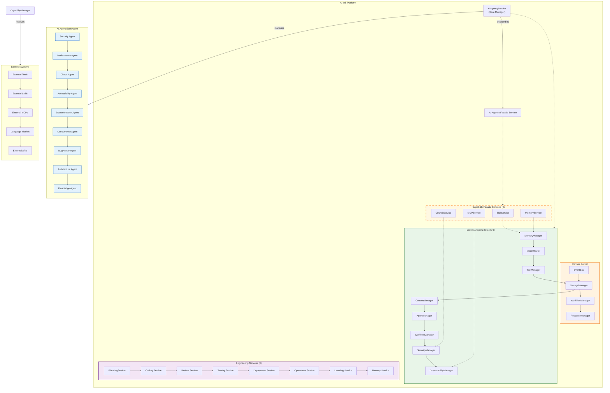
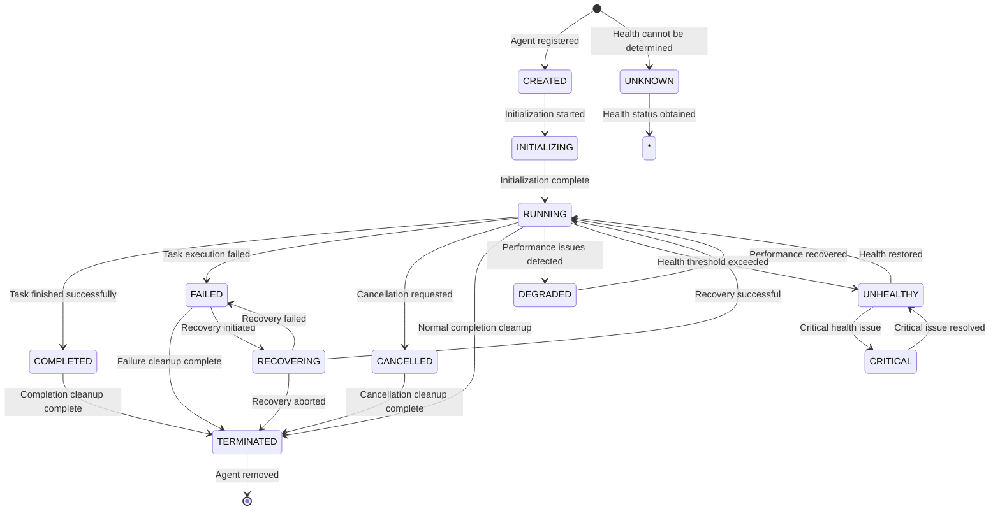
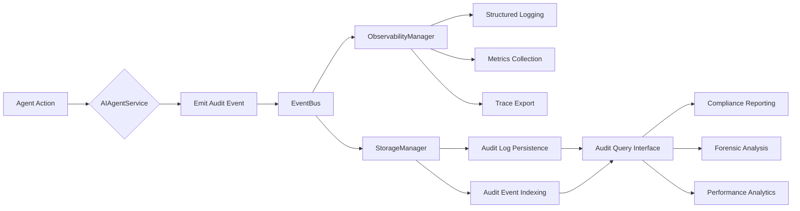

# AI Agency Architecture Specification

## 1. Overview

The AI Agency is a core capability of the AI-OS Hermes Kernel responsible for orchestrating autonomous AI agents that perform engineering tasks. It serves as the intelligent orchestration layer that manages the lifecycle, execution, and governance of AI agents within the AI-OS platform.

As specified in Part 4 of the AI-OS Architecture Specification, the AIAgencyService is one of the nine Core Managers owned by the Hermes Kernel, providing specialized capabilities for AI agent management while maintaining the kernel's role as a pure orchestrator.

## 2. Purpose and Responsibilities

### 2.1 Primary Purpose

The AIAgencyService SHALL serve as the **sole authority** for AI agent lifecycle management, execution orchestration, and governance within the Hermes Kernel. It owns:
- AI agent spawning, initialization, and termination
- Agent execution monitoring and control
- Agent capability registration and discovery
- Audit trail generation for all agent activities
- Integration with CouncilManager for governance oversight
- Coordination with FinalJudge for human-in-the-loop validation
- Goal management and decomposition for agent tasks
- Planning, reflection, and replanning capabilities for adaptive execution
- Delegation of sub-tasks to tools, skills, and other agents
- Multi-agent collaboration and communication
- Learning integration with MemoryManager
- Councils integration for governance oversight
- Runtime integration with Hermes Kernel components
- Workflow integration with WorkflowManager
- Capability integration with CapabilityManager
- Validation frameworks for agent outputs
- Requirement verification systems
- Completion logic enforcement
### 2.2 Core Responsibilities

The AIAgencyService SHALL be responsible for:

1. **Agent Lifecycle Management** — Exclusive control over agent states (CREATED, INITIALIZING, RUNNING, COMPLETED, FAILED, CANCELLED, TERMINATED)
2. **Agent Spawning and Initialization** — Creating agent instances with proper sandboxing, resource allocation, and context initialization
3. **Execution Orchestration** — Managing agent execution workflows, including step-by-step task processing and state transitions
4. **Resource Governance** — Coordinating with ResourceManager for CPU, memory, token, and tool quotas
5. **Capability Integration** — Working with CapabilityManager to resolve and invoke agent capabilities (tools, skills, MCPs)
6. **Audit and Governance** — Emitting comprehensive audit events for all agent actions and coordinating with CouncilManager for oversight
7. **Failure Handling and Recovery** — Implementing retry policies, failure classification, and recovery actions via RootCauseAnalyzer
8. **Learning Integration** — Capturing and consolidating agent-generated knowledge via LearningService and MemoryManager
9. **FinalJudge Coordination** — Routing agent outputs through FinalJudge for validation when required by policy
10. **Health Monitoring** — Reporting agent health status to HealthManager and responding to health directives
11. **Goal Management** — Decomposing high-level objectives into executable sub-goals and tasks
12. **Planning Capabilities** — Creating and adapting execution plans based on changing conditions
13. **Reflection Mechanisms** — Analyzing past performance to improve future execution
14. **Replanning Logic** — Dynamically adjusting plans when encountering obstacles or new information
15. **Delegation Framework** — Assigning sub-tasks to appropriate tools, skills, or other agents
16. **Multi-Agent Collaboration** — Enabling coordinated work between multiple agents
17. **Communication Protocols** — Facilitating information exchange between agents and system components
18. **Memory Integration** — Leveraging Short-term, Long-term, and Episodic memory systems
19. **Council Integration** — Participating in governance decisions and oversight mechanisms
20. **Runtime Integration** — Coordinating with core Hermes Kernel services for execution
21. **Workflow Integration** — Aligning agent activities with defined engineering workflows
22. **Capability Integration** — Accessing and utilizing external tools and services
23. **Validation Frameworks** — Verifying correctness and quality of agent outputs
24. **Requirement Verification** — Ensuring agent work satisfies specified requirements
25. **Completion Logic** — Determining when agent objectives have been fully met

### 2.2 Core Responsibilities

The AIAgencyService SHALL be responsible for:

1. **Agent Lifecycle Management** — Exclusive control over agent states (CREATED, INITIALIZING, RUNNING, COMPLETED, FAILED, CANCELLED, TERMINATED)
2. **Agent Spawning and Initialization** — Creating agent instances with proper sandboxing, resource allocation, and context initialization
3. **Execution Orchestration** — Managing agent execution workflows, including step-by-step task processing and state transitions
4. **Resource Governance** — Coordinating with ResourceManager for CPU, memory, token, and tool quotas
5. **Capability Integration** — Working with CapabilityManager to resolve and invoke agent capabilities (tools, skills, MCPs)
6. **Audit and Governance** — Emitting comprehensive audit events for all agent actions and coordinating with CouncilManager for oversight
7. **Failure Handling and Recovery** — Implementing retry policies, failure classification, and recovery actions via RootCauseAnalyzer
8. **Learning Integration** — Capturing and consolidating agent-generated knowledge via LearningService and MemoryManager
9. **FinalJudge Coordination** — Routing agent outputs through FinalJudge for validation when required by policy
10. **Health Monitoring** — Reporting agent health status to HealthManager and responding to health directives

## 3. Architectural Positioning

### 3.1 Relationship to Hermes Kernel

Per Part 1 of the specification, the AIAgencyService is instantiated, owned, and lifecycle-managed by the Hermes Kernel. It is exposed via a Global Singleton Accessor (`get_ai_agency()`) for system-wide access while maintaining strict ownership boundaries.

### 3.2 Interaction with Other Core Managers

The AIAgencyService SHALL interact with other Core Managers exclusively through defined contracts:

| Manager | Interaction Type | Purpose |
|---------|-----------------|---------|
| **EventBus** | Bidirectional | Emits agent lifecycle events; consumes capability results and system events |
| **StateManager** | Outbound | Stores and retrieves agent execution state and context |
| **StorageManager** | Outbound | Persists agent checkpoints, logs, and audit trails |
| **WorkflowManager** | Bidirectional | Receives workflow step invocations; emits agent task events |
| **SecurityManager** | Outbound | Validates agent permissions and executes authorization checks |
| **CapabilityManager** | Outbound | Resolves and invokes agent capabilities (tools, skills, MCPs) |
| **ResourceManager** | Outbound | Checks and reserves computational resources for agent execution |
| **HealthManager** | Bidirectional | Reports agent health; receives health directives |
| **ObservabilityManager** | Outbound | Emits agent metrics, traces, and telemetry data |
| **ModelRouter** | Outbound | Routes LLM requests for agent reasoning and planning |

### 3.3 Relationship to Engineering Services

The AIAgencyService SHALL be wrapped by the AI Agency Capability Facade Service (`AIAgencyService` in Part 7), which provides event-driven access to the AIAgencyService while maintaining the pure orchestrator principle of the Kernel.

Engineering Services (Planning, Coding, Review, etc.) SHALL interact with AI agents exclusively through:
- EventBus protocols (emitting/consuming agent lifecycle events)
- CapabilityManager (invoking agent capabilities as needed)
- AI Agency Facade Service (for direct event-driven agent management)

## 4. Agent Lifecycle Management

### 4.1 Agent State Machine

The AIAgencyService SHALL maintain the following agent lifecycle state machine:

```
                           +-----------------+
                           |    CREATED      | <-- Agent registered but not initialized
                           +--------+--------+
                                    |
                                    v
                           +-----------------+
                           | INITIALIZING    | <-- Agent being set up (sandbox, context)
                           +--------+--------+
                                    |
                                    v
                           +-----------------+
                           |    RUNNING      | <-- Agent actively executing tasks
                           +--------+--------+
                                    |     \
                                    |      \ (timeout/failure/cancel)
                                    |       \
                                    v        v
                           +-----------------+   +-----------------+
                           | COMPLETED       |   |    FAILED       | <-- Terminal states
                           +--------+--------+   +--------+--------+
                                    |                 |
                                    v                 v
                           +-----------------+   +-----------------+
                           |  TERMINATED     |   |  CANCELLED    | <-- Cleanup complete
                           +-----------------+   +-----------------+
```

**Invariant:** Every agent instance SHALL transition through states in a valid sequence, with each transition emitting a corresponding lifecycle event.

### 4.2 Lifecycle Operations

#### 4.2.1 Agent Spawning

Upon receiving an `AIAgentSpawnRequestEvent`, the AIAgencyService SHALL:

1. Validate the request against SecurityManager (authorization check)
2. Check resource availability with ResourceManager (quota validation)
3. Generate a unique agent ID and execution context
4. Initialize agent sandbox (file system, network, tool restrictions)
5. Load agent configuration and initial prompts
6. Set agent state to INITIALIZING
7. Emit `AIAgentInitializedEvent` upon successful initialization
8. Transition agent to RUNNING state and emit `AIAgentStartedEvent`

#### 4.2.2 Agent Execution

While in RUNNING state, the agent SHALL:

1. Receive task inputs via EventBus or direct capability invocation
2. Process tasks using its configured reasoning loop (ReAct, Plan-and-Execute, etc.)
3. Invoke capabilities through CapabilityManager (tools, skills, MCPs)
4. Emit progress events and intermediate results
5. Monitor for completion conditions, timeouts, or external cancellation requests
6. Upon task completion: emit `AIAgentTaskCompletedEvent` and transition to COMPLETED
7. Upon failure: emit `AIAgentTaskFailedEvent` and transition to FAILED

#### 4.2.3 Agent Termination

The AIAgencyService SHALL support both graceful and forced termination:

**Graceful Termination** (normal completion or cancellation request):
1. Stop accepting new task inputs
2. Allow currently executing steps to complete (with timeout)
3. Execute agent cleanup procedures (resource release, state persistence)
4. Emit `AIAgentTerminatedEvent`
5. Transition to TERMINATED state

**Forced Termination** (resource exhaustion, security violation, system shutdown):
1. Immediately halt agent execution
2. Execute emergency cleanup procedures
3. Emit `AIAgentForceTerminatedEvent`
4. Transition to TERMINATED state

## 5. Agent Types and Specializations

Per the AI-OS specification, the AIAgencyService manages nine specialized agent types, each with distinct responsibilities:

### 5.1 Security Agent
- **Purpose**: Conduct security assessments, vulnerability scanning, and threat modeling
- **Capabilities**: Security testing tools, policy analysis, audit utilities
- **Events**: `SecurityAssessmentRequested`, `SecurityAssessmentCompleted`, `SecurityIssueFound`

### 5.2 Performance Agent
- **Purpose**: Analyze system performance, identify bottlenecks, and recommend optimizations
- **Capabilities**: Profiling tools, benchmarking suites, analytics platforms
- **Events**: `PerformanceAnalysisRequested`, `PerformanceAnalysisCompleted`, `PerformanceIssueFound`

### 5.3 Chaos Agent
- **Purpose**: Inject controlled failures to test system resilience and recovery mechanisms
- **Capabilities**: Fault injection tools, network disruptors, resource consumers
- **Events**: `ChaosExperimentRequested`, `ChaosExperimentCompleted`, `ChaosFailureInjected`

### 5.4 Accessibility Agent
- **Purpose**: Evaluate and improve system accessibility for diverse user needs
- **Capabilities**: Accessibility testing tools, screen reader simulators, contrast analyzers
- **Events**: `AccessibilityReviewRequested`, `AccessibilityReviewCompleted`, `AccessibilityIssueFound`

### 5.5 Documentation Agent
- **Purpose**: Generate, update, and maintain technical documentation
- **Capabilities**: Documentation generators, wikis, API documentation tools
- **Events**: `DocumentationRequested`, `DocumentationCompleted`, `DocumentationUpdated`

### 5.6 Concurrency Agent
- **Purpose**: Test and validate concurrent system behaviors and race conditions
- **Capabilities**: Concurrency testing tools, race condition detectors, stress testers
- **Events**: `ConcurrencyTestRequested`, `ConcurrencyTestCompleted`, `ConcurrencyIssueFound`

### 5.7 BugHunter Agent
- **Purpose**: Automatically detect, reproduce, and isolate software defects
- **Capabilities**: Fuzzers, static analyzers, dynamic analyzers, reproduction scripts
- **Events**: `BugHuntRequested`, `BugHuntCompleted`, `BugReproduced`, `RootCauseIdentified`

### 5.8 Architecture Agent
- **Purpose**: Analyze system architecture, identify design flaws, and recommend improvements
- **Capabilities**: Architecture analysis tools, dependency graphers, design pattern detectors
- **Events**: `ArchitectureAnalysisRequested`, `ArchitectureAnalysisCompleted`, `ArchitecturalDebtIdentified`

### 5.9 FinalJudge Agent
- **Purpose**: Provide human-in-the-loop validation for critical agent outputs
- **Capabilities**: Decision interfaces, approval workflows, validation checkpoints
- **Events**: `FinalJudgmentRequested`, `FinalJudgmentCompleted`, `ValidationApproved`/`ValidationRejected`

**Invariant:** Each agent type SHALL emit characteristic event pairs (`*Requested`/`*Completed`) for audit trail completeness.

## 6. Event Contracts

The AIAgencyService SHALL emit and consume the following events as defined in Part 2:

### 6.1 Events Emitted

| Event Type | Purpose | Payload Key Fields |
|------------|---------|-------------------|
| `AIAgentSpawnRequested` | Request to create a new agent | agent_type, task_description, resource_requirements |
| `AIAgentSpawned` | Agent successfully created | agent_id, agent_type, initialization_time |
| `AIAgentInitialized` | Agent initialization completed | agent_id, sandbox_id, context_loaded |
| `AIAgentStarted` | Agent began execution | agent_id, start_time, initial_state |
| `AIAgentTaskRequested` | Agent assigned a specific task | agent_id, task_id, task_type, input_data |
| `AIAgentTaskStarted` | Agent began task execution | agent_id, task_id, start_time |
| `AIAgentTaskCompleted` | Agent completed task successfully | agent_id, task_id, result_data, execution_time |
| `AIAgentTaskFailed` | Agent task execution failed | agent_id, task_id, error_details, failure_category |
| `AIAgentAuditEmitted` | Agent audit trail update | agent_id, audit_event_type, timestamp, correlation_id |
| `AIAgentHealthChanged` | Agent health status update | agent_id, health_status, health_metrics |
| `AIAgentTerminated` | Agent terminated normally | agent_id, termination_reason, cleanup_performed |
| `AIAgentForceTerminated` | Agent terminated forcibly | agent_id, termination_reason, emergency_cleanup |

### 6.2 Events Consumed

| Event Type | Purpose | Expected Response |
|------------|---------|-------------------|
| `AIAgentSpawnRequest` | Request to spawn new agent | Validate and spawn agent |
| `AIAgentCancelRequest` | Request to cancel agent execution | Initiate graceful termination |
| `AIAgentPauseRequest` | Request to pause agent execution | Suspend task processing |
| `AIAgentResumeRequest` | Request to resume agent execution | Resume task processing |
| `CapabilityInvocationResult` | Result of capability invocation | Process result and continue execution |
| `WorkflowStepComplete` | Workflow step finished | Trigger next agent action |
| `RecoveryActionDispatched` | Recovery action to execute | Execute recovery procedure |
| `HealthCheckRequest` | Request for health status | Emit current health status |
| `ConfigurationChanged` | System configuration update | Reload agent configurations |
| `SecurityPolicyUpdate` | Security policy change | Revalidate agent permissions |

## 7. Audit and Governance

### 7.1 Audit Trail Generation

The AIAgencyService SHALL emit comprehensive audit events for all agent activities:

#### 7.1.1 Audit Event Structure

Each audit event SHALL contain:
- `agent_id`: Unique identifier of the agent
- `agent_type`: Type of agent (Security, Performance, etc.)
- `timestamp`: ISO 8601 timestamp with nanosecond precision
- `correlation_id`: Workflow trace ID
- `causation_id`: Direct cause event ID
- `event_type`: Specific audit event (action performed)
- `action_details`: JSON-serializable description of the action
- `outcome`: Success/failure status
- `resource_usage`: CPU, memory, token consumption during action
- `security_context`: Principal and trust level under which action occurred

#### 7.1.2 Audit Event Types

| Audit Event | Triggering Action |
|-------------|-------------------|
| `AgentSpawned` | Agent creation |
| `AgentInitialized` | Agent setup completion |
| `TaskAssigned` | New task assigned to agent |
| `TaskStarted` | Agent began task execution |
| `TaskCompleted` | Agent finished task successfully |
| `TaskFailed` | Agent encountered task failure |
| `CapabilityInvoked` | Agent used a tool/skill/MCP |
| `CapabilitySucceeded` | Capability invocation succeeded |
| `CapabilityFailed` | Capability invocation failed |
| `ResourceAllocated` | Agent received resources |
| `ResourceReleased` | Agent released resources |
| `StateCheckpointed` | Agent state checkpoint created |
| `StateRestored` | Agent state restored from checkpoint |
| `SecurityCheckPassed` | Agent authorization validated |
| `SecurityCheckFailed` | Agent authorization denied |
| `HealthCheckPerformed` | Agent health assessment |
| `LearningCaptured` | Agent knowledge extracted |
| `KnowledgeConsolidated` | Agent knowledge stored in memory |
| `FinalJudgeReviewRequested` | Agent output sent for validation |
| `FinalJudgeApproved` | FinalJudge approved agent output |
| `FinalJudgeRejected` | FinalJudge rejected agent output |

### 7.2 Council Integration

The AIAgencyService SHALL coordinate with CouncilManager for governance:

#### 7.2.1 Governance Checkpoints

Before certain critical operations, the AIAgencyService SHALL:
1. Emit `AIGovernanceCheckpointRequested` event to CouncilManager
2. Await `AIGovernanceCheckpointApproved` or `AIGovernanceCheckpointDenied` response
3. Proceed only upon approval or execute denial handling

**Governance-checkpointed operations SHALL include:**
- Agent spawning with elevated privileges
- Access to restricted capabilities (system tools, privileged MCPs)
- Execution affecting system-critical resources
- Operations requiring special security clearance
- Actions that may produce significant system changes

#### 7.2.2 Dissent Handling

When CouncilManager registers dissent against an AI agent action:
1. AIAgencyService SHALL emit `AIDissentRegisteredEvent` with dissent details
2. AIAgencyService SHALL escalate to human judges via FinalJudge if policy requires
3. AIAgencyService SHALL suspend the contested action until resolution
4. Upon resolution: either proceed with modified action or terminate agent

## 8. Resource Management

### 8.1 Resource Accounting

The AIAgencyService SHALL coordinate with ResourceManager for:

#### 8.1.1 Resource Types

| Resource | Unit | Tracking Method |
|----------|------|-----------------|
| CPU Time | Milliseconds | Per-agent execution timing |
| Memory | Bytes | Working set + allocated buffers |
| Disk Space | Bytes | Sandbox file usage + logs |
| Network | Mbps | External API calls + data transfer |
| LLM Tokens | Tokens | Input + output token counts |
| Tool Invocations | Count | External tool/MCP/skill calls |
| Concurrent Agents | Count | Active agent instances |

#### 8.1.2 Resource Protocols

1. **Reservation**: Before spawning agent, reserve required resources via `resources.reserve()`
2. **Tracking**: Continuously monitor actual usage against reservations
3. **Enforcement**: If usage exceeds limits, emit `ResourcePressureEvent` then `ResourceExhaustedEvent`
4. **Release**: Upon agent termination, release all resources via `resources.release()`

### 8.2 Quota Management

The AIAgencyService SHALL enforce quotas at multiple levels:

#### 8.2.1 Per-Agent Quotas
- Maximum execution time per task
- Maximum token consumption per interaction
- Maximum tool invocations per hour
- Maximum concurrent workflow steps

#### 8.2.2 Per-Agent-Type Quotas
- Daily execution limits for Security agents (to prevent over-scanning)
- Hourly limits for Chaos agents (to control system disruption)
- Weekly limits for Performance agents (to avoid constant profiling)

#### 8.2.3 System-Wide Quotas
- Total concurrent agents allowed in system
- Aggregate token budget across all agents
- Total external API call budget

**Invariant:** ResourceManager SHALL enforce hard limits; AIAgencyService SHALL implement soft limits and early warnings.

## 9. Failure Handling and Recovery

### 9.1 Failure Classification

The AIAgencyService SHALL work with RootCauseAnalyzer to classify failures:

| Failure Category | Examples | Recovery Actions |
|------------------|----------|------------------|
| **TRANSIENT** | Network timeouts, temporary tool unavailability | Retry with backoff |
| **RESOURCE_EXHAUSTED** | Token limits, memory exceeded, CPU throttling | Wait for resources, request more |
| **CAPABILITY_FAILURE** | Tool malfunction, skill error, MCP timeout | Try alternative capability, fallback |
| **VALIDATION_ERROR** | Invalid input, malformed output, schema violation | Request correction, use defaults |
| **SECURITY_VIOLATION** | Unauthorized access attempt, policy breach | Terminate agent, alert security |
| **LOGIC_ERROR** | Infinite loop, deadlock, incorrect reasoning | Restart agent, adjust parameters |
| **SYSTEM_ERROR** | Kernel manager failure, EventBus disruption | Switch to backup, degraded mode |
| **UNKNOWN** | Unclassified failure modes | Manual investigation required |

### 9.2 Retry Policies

The AIAgencyService SHALL implement configurable retry policies:

#### 9.2.1 Retry Parameters
- **Max Attempts**: Number of retry attempts (default: 3)
- **Backoff Strategy**: Exponential, linear, fixed (default: exponential)
- **Base Delay**: Initial delay in seconds (default: 1s)
- **Max Delay**: Maximum delay cap (default: 60s)
- **Jitter**: Randomization factor (default: 0.1)
- **Retryable Failures**: Which failure categories trigger retries

#### 9.2.2 Retry Execution
1. Upon failure classification, determine if retryable
2. If retryable and attempts remaining: wait per backoff strategy
3. Retry the failed operation with same parameters
4. If max attempts exceeded: emit final failure event and trigger compensation

### 9.3 Checkpointing and Recovery

The AIAgencyService SHALL coordinate with CheckpointManager for agent state persistence:

#### 9.3.1 Checkpoint Triggers
- **Pre-task**: Before invoking high-risk capabilities
- **Post-task**: After successful task completion
- **Time-based**: Periodic checkpoints during long executions
- **Failure-preemption**: Before terminating due to resource pressure
- **Manual**: On-demand checkpoint requests

#### 9.3.2 Recovery Procedures
1. Upon failure requiring recovery: transition to RECOVERING state
2. Load latest valid checkpoint from StorageManager
3. Restore agent state, context, and resources
4. Emit `AgentStateRestoredEvent`
5. Resume execution from checkpoint point
6. If recovery fails: escalate to human intervention via FinalJudge

## 10. Learning and Knowledge Integration

### 10.1 Knowledge Capture

The AIAgencyService SHALL coordinate with LearningService and MemoryManager to implement comprehensive learning mechanisms:

#### 10.1.1 Knowledge Types
- **Procedural Knowledge**: How-to knowledge gained from task execution (scripts, methodologies, troubleshooting steps)
- **Declarative Knowledge**: Factual information discovered during operations (API specifications, library behaviors, system constraints)
- **Episodic Knowledge**: Experiences and outcomes from specific agent runs (what worked, what failed, contextual factors)
- **Semantic Knowledge**: Relationships and patterns abstracted from multiple runs (best practices, anti-patterns, heuristics)
- **Meta-Knowledge**: Knowledge about the agent's own learning process and capabilities

#### 10.1.2 Capture Mechanisms
- **Automatic Capture**: Triggered after each successful task completion to capture immediate lessons
- **Reflection-Based Capture**: Periodic self-analysis sessions where agents review their own performance
- **Event-Driven Capture**: In response to `LearningRequested` events from other system components
- **Manual Capture**: On-agent-request knowledge extraction for deliberate documentation
- **Peer Learning Capture**: Knowledge gained from observing or collaborating with other agents
- **Failure Analysis Capture**: Systematic extraction of lessons from failed attempts
- **Consolidation Cycles**: Periodic knowledge organization, deduplication, and storage optimization

### 10.2 Knowledge Storage Architecture

Captured knowledge SHALL be stored via the AI-OS memory hierarchy with specific purposes:

#### 10.2.1 Memory Tier Utilization
- **Working Memory** (`MemoryType.WORKING`): Immediate use during current execution; holds active context, recent observations, and short-term goals; limited capacity, fast access
- **Agent Memory** (`MemoryType.CLAUDE`): Agent-specific knowledge base; stores learned behaviors, preferences, and specialization data; persists across agent instances of same type
- **Engineering Intelligence Memory** (`MemoryType.ENGINEERING`): Shared organizational knowledge; contains reusable components, solutions patterns, and architectural decisions; accessible to all agents
- **Obsidian Memory** (`MemoryType.OBSIDIAN`): Linked knowledge graph for relationships; represents semantic connections between concepts, dependencies, and causal relationships; enables reasoning about system interconnections
- **Graphify Memory** (`MemoryType.GRAPHIFY`): Structured knowledge representation for reasoning; contains formalized rules, logical constraints, and executable knowledge; supports automated inference and validation

#### 10.2.2 Knowledge Flow
1. **Acquisition**: Knowledge captured through mechanisms in 10.1.2
2. **Classification**: Knowledge categorized by type, relevance, and reliability
3. **Validation**: New knowledge checked for consistency with existing knowledge
4. **Integration**: Validated knowledge merged into appropriate memory tiers
5. **Indexing**: Knowledge tagged and indexed for efficient retrieval
6. **Application**: Stored knowledge accessed to inform future agent decisions and actions

**Invariant:** All knowledge storage operations SHALL emit appropriate memory events (`MemoryStored`, `MemoryRetrieved`, `MemoryUpdated`, `MemoryConsolidated`, etc.) for audit completeness and traceability.

### 10.3 Learning Application

The AIAgencyService SHALL ensure captured knowledge is actively applied to improve agent performance:

#### 10.3.1 Knowledge Retrieval
- **Contextual Retrieval**: Accessing relevant knowledge based on current task context and goals
- **Similarity-Based Retrieval**: Finding knowledge from similar past tasks or situations
- **Pattern Matching**: Applying learned patterns to new problems
- **Rule-Based Application**: Executing stored procedural knowledge when conditions match

#### 10.3.2 Knowledge Adaptation
- **Contextualization**: Adapting general knowledge to specific current circumstances
- **Composition**: Combining multiple knowledge pieces to form novel solutions
- **Specialization**: Tailoring knowledge to specific domains or task types
- **Generalization**: Extracting broad principles from specific experiences

#### 10.3.3 Knowledge Feedback Loops
- **Execution Monitoring**: Tracking how applied knowledge performs in practice
- **Outcome Analysis**: Measuring effectiveness of knowledge application
- **Knowledge Refinement**: Updating knowledge based on application results
- **Obsolescence Detection**: Identifying outdated or incorrect knowledge for revision

## 11. Architectural Alignment with AI-OS Parts 1-15

The AIAgencyService is designed to align precisely with the AI-OS architecture as specified in Parts 1-15. This section details how each architectural aspect is implemented:

### 11.1 Goal Management (Aligns with Part 6: Engineering Services)

The AIAgencyService implements sophisticated goal management capabilities:

- **Goal Decomposition**: Breaks down high-level engineering objectives (from PlanningService) into executable sub-goals and tasks using hierarchical task networks (HTN)
- **Goal Prioritization**: Uses urgency-importance matrices and dependency analysis to order goal execution
- **Goal Tracking**: Maintains goal state in Working Memory with progress metrics and completion criteria
- **Goal Adaptation**: Dynamically modifies goals based on environmental feedback and intermediate results
- **Goal Validation**: Verifies that achieved goals satisfy original requirements through formal verification methods

**Integration Points**:
- Consumes `PlanningCompletedEvent` to receive high-level goals from PlanningService
- Emits `GoalDecomposedEvent` when breaking down goals into actionable tasks
- Coordinates with WorkflowManager to align goal execution with workflow steps

### 11.2 Planning Capabilities (Aligns with Part 6: PlanningService)

The AIAgencyService provides advanced planning mechanisms:

- **Plan Generation**: Creates executable plans using AI-driven planning algorithms (PG, HTN, SAT-based planners)
- **Plan Representation**: Stores plans as directed acyclic graphs (DAGs) with temporal and resource constraints
- **Plan Adaptation**: Modifies plans in response to execution feedback and changing conditions
- **Plan Validation**: Checks plans for feasibility, resource consistency, and constraint satisfaction
- **Plan Optimization**: Applies optimization techniques to minimize execution time, cost, or risk

**Integration Points**:
- Receives planning domain information from PlanningService via `PlanningCompletedEvent`
- Emits `PlanGeneratedEvent` when creating new execution plans
- Coordinates with WorkflowManager to translate plans into workflow definitions
- Uses CapabilityManager to validate that planned actions have available implementations

### 11.3 Reflection Mechanisms (Aligns with Part 6: LearningService)

The AIAgencyService implements deep reflection capabilities:

- **Experiential Reflection**: Analyzes past agent executions to identify patterns of success and failure
- **Reflective Reasoning**: Uses meta-cognitive processes to evaluate agent decision-making quality
- **Comparative Analysis**: Compares actual outcomes against expected outcomes and success criteria
- **Root Cause Reflection**: Applies RCA principles to agent performance issues
- **Insight Synthesis**: Extracts actionable insights from reflection sessions for future improvement

**Integration Points**:
- Works with LearningService to store and retrieve reflection insights
- Emits `ReflectionCompletedEvent` when finishing reflection cycles
- Uses Reflection insights to update agent knowledge bases in Agent Memory (`MemoryType.CLAUDE`)

### 11.4 Replanning Logic (Aligns with Part 6: PlanningService)

The AIAgencyService provides dynamic replanning capabilities:

- **Trigger Detection**: Monitors execution for plan violation conditions (resource depletion, failed preconditions, etc.)
- **Replanning Initiation**: Automatically initiates replanning when significant deviations are detected
- **Incremental Replanning**: Modifies existing plans rather than regenerating from scratch when possible
- **Plan Repair**: Fixes specific plan components that failed while preserving valid portions
- **Plan Substitution**: Replaces failed plan segments with alternative approaches

**Integration Points**:
- Receives execution feedback from WorkflowManager via `WorkflowStepFailedEvent` and similar events
- Emits `ReplanningInitiatedEvent` when starting replanning process
- Coordinates with ResourceManager to reassess resource availability for revised plans
- Works with SecurityManager to ensure replanned actions maintain proper authorization

### 11.5 Delegation Framework (Aligns with Part 4: CapabilityManager)

The AIAgencyService implements sophisticated task delegation:

- **Capability-Based Delegation**: Matches sub-tasks to available tools, skills, and MCPs based on capability requirements
- **Agent-to-Agent Delegation**: Delegates complex sub-tasks to other specialized agents when appropriate
- **Load Balancing**: Distributes delegated tasks across multiple capable providers for optimal performance
- **Fallback Delegation**: Establishes delegation chains with backup options for critical tasks
- **Delegation Validation**: Verifies that delegated tasks are properly understood and can be executed by the delegatee

**Integration Points**:
- Primary integration with CapabilityManager for tool/skill/MCP delegation
- Uses `CapabilityInvokeEvent` to delegate tasks to capabilities
- Receives results via `CapabilityInvocationResultEvent`
- For agent-to-agent delegation, uses specialized event types and coordinates through EventBus
- Works with SecurityManager to validate delegation permissions

### 11.6 Multi-Agent Collaboration (Aligns with Part 4: CouncilManager and Part 6: Engineering Services)

The AIAgencyService enables sophisticated multi-agent collaboration:

- **Collaboration Protocols**: Defines standardized protocols for agent communication and coordination
- **Shared Workspaces**: Provides collaboration spaces in Working Memory for joint problem-solving
- **Role Assignment**: Dynamically assigns roles (leader, specialist, facilitator) based on agent capabilities
- **Conflict Resolution**: Implements consensus mechanisms for resolving disagreements between agents
- **Knowledge Sharing**: Facilitates transfer of insights and learned knowledge between collaborating agents

**Integration Points**:
- Works with CouncilManager to establish collaboration governance structures
- Uses specialized event types for inter-agent communication (e.g., `CollaborationRequestEvent`, `CollaborationResponseEvent`)
- Leverages Obsidian Memory (`MemoryType.OBSIDIAN`) to represent shared understanding and dependencies
- Coordinates with WorkflowManager to align multi-agent efforts with workflow dependencies
- Integrates with LearningService to capture collaboration insights as organizational knowledge

### 11.7 Communication Systems (Aligns with Part 2: Event System)

The AIAgencyService implements robust communication mechanisms:

- **Event-Based Communication**: Primary communication channel through the EventBus for loose coupling
- **Direct Messaging**: Supports point-to-point messaging for time-sensitive coordination when needed
- **Broadcast Messaging**: Enables one-to-many communication for announcements and shared updates
- **Message Queuing**: Implements reliable message delivery with persistence and acknowledgments
- **Protocol Translation**: Adapts between different communication protocols as needed for integration

**Integration Points**:
- Core integration with EventBus for all standard communications
- Uses `EventBus.publish()` and `EventBus.subscribe()` methods for communication
- Defines custom event types for AI Agency-specific communication patterns
- Works with ObservabilityManager to monitor communication patterns and performance
- Integrates with SecurityManager to secure communication channels

### 11.8 Memory Integration (Aligns with Part 4: MemoryManager)

The AIAgencyService deeply integrates with the AI-OS memory hierarchy:

- **Working Memory Integration**: Uses `MemoryType.WORKING` for active reasoning context and short-term goals
- **Agent Memory Integration**: Uses `MemoryType.CLAUDE` for agent-specific learned behaviors and preferences
- **Engineering Intelligence Integration**: Uses `MemoryType.ENGINEERING` to access and contribute organizational knowledge
- **Obsidian Memory Integration**: Uses `MemoryType.OBSIDIAN` to map relationships between concepts, tasks, and outcomes
- **Graphify Memory Integration**: Uses `MemoryType.GRAPHIFY` to store executable knowledge and reasoning rules

**Integration Points**:
- Registers with MemoryManager as a principal user of all memory types
- Emits standard memory events (`MemoryStored`, `MemoryRetrieved`, etc.) for all memory operations
- Participates in memory consolidation cycles to optimize knowledge storage
- Works with LearningService to determine what knowledge should be promoted to higher memory tiers
- Uses memory query APIs to retrieve relevant knowledge for reasoning and planning

### 11.9 Councils Integration (Aligns with Part 4: CouncilManager)

The AIAgencyService integrates with the governance council system:

- **Governance Checkpoints**: Submits significant decisions to CouncilManager for approval before execution
- **Policy Compliance**: Ensures all agent actions comply with policies established by the Council
- **Dissent Handling**: Properly handles Council dissent through escalation mechanisms to FinalJudge
- **Policy Feedback**: Provides operational experience to inform Council policy development
- **Audit Cooperation**: Works with Council to review agent audit trails for compliance verification

**Integration Points**:
- Emits `AIGovernanceCheckpointRequested` event for decisions requiring council approval
- Waits for `AIGovernanceCheckpointApproved` or `AIGovernanceCheckpointDenied` responses
- Works with CouncilManager to define appropriate consent algorithms for different decision types
- Receives policy updates via `PolicyUpdatedEvent` from CouncilManager
- Emits `AgentActionAuditEvent` for council review of significant agent activities

### 11.10 Runtime Integration (Aligns with Part 1: Hermes Kernel, Part 3: Core Components)

The AIAgencyService integrates deeply with the Hermes Kernel runtime:

- **Lifecycle Management**: Participates in kernel lifecycle events for proper initialization and shutdown
- **Resource Coordination**: Works with ResourceManager for CPU, memory, token, and tool quota management
- **State Synchronization**: Maintains execution state consistency with StateManager
- **Error Propagation**: Properly propagates kernel-level errors to agents and vice versa
- **Health Monitoring**: Reports agent health Status to HealthManager and responds to health directives
- **Observability Cooperation**: Works with ObservabilityManager for metrics, tracing, and logging

**Integration Points**:
- Implements `BaseManager` interface for proper kernel integration
- Participates in kernel initialization sequence as specified in Part 3
- Uses global singleton accessor pattern (`get_ai_agency()`) for kernel-wide access
- Coordinates with StateManager for agent execution state persistence
- Works with CheckpointManager to create agent execution checkpoints
- Integrates with ModelRouter for LLM access during agent reasoning processes

### 11.11 Workflow Integration (Aligns with Part 4: WorkflowManager and Part 6: Engineering Services)

The AIAgencyService aligns with engineering workflows:

- **Workflow Participation**: Acts as both workflow participant and workflow controller for agent tasks
- **Step Execution**: Executes workflow steps that require agent intelligence and decision-making
- **Workflow Initiation**: Can initiate sub-workflows for complex agent-coordinated tasks
- **State Synchronization**: Maintains workflow state consistency with WorkflowManager
- **Checkpoint Coordination**: Creates checkpoints at key workflow transition points
- **Failure Propagation**: Properly handles workflow failures and directs recovery actions

**Integration Points**:
- Consumes `WorkflowStepStartedEvent` to begin executing assigned workflow steps
- Emits `WorkflowStepCompletedEvent` when finishing workflow step execution
- Works with WorkflowManager to define agent-executable workflow steps
- Coordinates with CapabilityManager to resolve capabilities needed for workflow steps
- Integrates with LearningService to capture workflow execution insights

### 11.12 Capability Integration (Aligns with Part 4: CapabilityManager)

The AIAgencyService extensively integrates with external capabilities:

- **Tool Integration**: Delegates appropriate sub-tasks to external tools (CLI utilities, scripts, executables)
- **Skill Integration**: Leverages internal skills for standardized agent capabilities
- **MCP Integration**: Uses Model Context Protocol for standardized access to external services and data sources
- **LLM Integration**: Accesses language models through ModelRouter for reasoning and planning
- **API Integration**: Connects to external APIs and services for extended functionality

**Integration Points**:
- Primary integration point is CapabilityManager for all external capability resolution
- Emits `CapabilityInvokeEvent` to request capability execution
- Receives results via `CapabilityInvocationResultEvent`
- Works with SecurityManager to validate capability usage permissions
- Coordinates with ResourceManager to check resource availability for capability invocation
- Integrates with LearningService to capture insights gained from capability usage

### 11.13 Validation Frameworks (Aligns with Part 12: Security & Safety)

The AIAgencyService implements comprehensive validation mechanisms:

- **Input Validation**: Validates all incoming data for correctness, safety, and compliance
- **Output Validation**: Verifies agent-generated outputs against specifications and quality standards
- **Process Validation**: Ensures execution processes follow defined procedures and constraints
- **Behavioral Validation**: Checks that agent behavior aligns with intended goals and safety constraints
- **Result Validation**: Confirms that achieved results satisfy original requirements and success criteria

**Integration Points**:
- Works with SecurityManager for security-focused validation (input sanitization, policy compliance)
- Integrates with FinalJudge for human-in-the-loop validation of critical outputs
- Uses CapabilityManager to access validation tools and skills
- Emits validation-specific event types (`ValidationRequestedEvent`, `ValidationCompletedEvent`)
- Coordinates with LearningService to improve validation criteria based on execution experience

### 11.14 Requirement Verification (Aligns with Part 6: PlanningService and Part 12: Security & Safety)

The AIAgencyService ensures requirement satisfaction:

- **Requirements Traceability**: Maintains links from high-level requirements to specific agent actions
- **Verification Planning**: Creates verification plans aligned with implementation tasks
- **Confirmation Testing**: Executes tests to confirm requirements are met
- **Validation Reporting**: Generates reports detailing requirement satisfaction evidence
- **Gap Analysis**: Identifies and addresses discrepancies between requirements and implementations

**Integration Points**:
- Receives requirements from PlanningService via `PlanningCompletedEvent`
- Works with FinalJudge for human verification of critical requirements
- Uses CapabilityManager to access verification and testing tools
- Emits requirement-specific event types (`RequirementVerifiedEvent`, `RequirementViolationEvent`)
- Integrates with LearningService to improve requirement engineering based on project experience

### 11.15 Completion Logic (Aligns with Part 6: LearningService and Part 13: Operational Procedures)

The AIAgencyService implements sophisticated completion determination:

- **Criteria Evaluation**: Systematically evaluates completion criteria against achieved results
- **Confidence Assessment**: Measures confidence in completion determination based on evidence quality
- **Edge Case Handling**: Properly handles partial completion, blocked completion, and ambiguous scenarios
- **Completion Certification**: Formally certifies completion when all criteria are satisfied with sufficient confidence
- **Transition Management**: Manages state transitions from active execution to completed states

**Integration Points**:
- Works with LearningService to define and refine completion criteria based on historical data
- Uses FinalJudge to validate completion determinations for critical tasks
- Emits completion-specific event types (`TaskCompletedEvent`, `GoalAchievedEvent`)
- Coordinates with WorkflowManager to trigger subsequent workflow steps upon completion
- Integrates with MemoryManager to store completion insights for future reference

## 11. Security Model

### 11.1 Agent Sandboxing

All agents SHALL operate within security sandboxs enforced by the AIAgencyService:

#### 11.1.1 Sandbox Restrictions
- **File System**: Restricted to agent-specific directories unless explicitly granted
- **Network**: Limited to approved endpoints unless broader access authorized
- **System Calls**: Privileged operations blocked unless specifically allowed
- **Tool Access**: Only pre-approved tools/skills/MCPs invocable
- **Resource Usage**: Strict quotas enforced via ResourceManager
- **Inter-Agent Communication**: Only via EventBus with appropriate permissions

#### 11.1.2 Sandbox Levels
| Level | Description | Use Case |
|-------|-------------|----------|
| **MINIMAL** | Basic file/network restriction | Simple tool execution |
| **STANDARD** | Typical agent restrictions | Most engineering tasks |
| **RESTRICTED** | Limited capabilities, no network | Untrusted code analysis |
| **ISOLATED** | No external access, minimal resources | Suspicious file analysis |
| **PRIVILEGED** | Elevated permissions for system tasks | Infrastructure operations (requires approval) |

### 11.2 Authentication and Authorization

#### 11.2.1 Agent Identity
Each agent SHALL receive a unique identity from SecurityManager:
- Agent ID (UUID)
- Agent type designation
- Associated permissions and trust level
- Resource quota allocations
- Audit trail identifier

#### 11.2.2 Authorization Checks
Before any capability invocation, the AIAgencyService SHALL:
1. Validate agent still has required permissions (re-authentication if needed)
2. Check SecurityManager for capability-specific authorization
3. Verify resource availability with ResourceManager
4. Confirm no active security policies prohibit the action
5. Only then proceed with capability invocation via CapabilityManager

## 12. Health Monitoring

### 12.1 Health Metrics

The AIAgencyService SHALL report the following health metrics to HealthManager:

| Metric | Description | Collection Method |
|--------|-------------|-------------------|
| **Agent Uptime** | Time since agent started | Monotonic clock |
| **Task Success Rate** | Percentage of completed tasks | Internal counters |
| **Average Task Duration** | Mean execution time per task | Timing measurements |
| **Resource Utilization** | CPU, memory, token usage vs quota | ResourceManager queries |
| **Error Rate** | Failed tasks vs total tasks | Failure event tracking |
| **Capability Invocation Rate** | Tool/skill/MCP calls per minute | Invocation counting |
| **Memory Growth** | Working set increase over time | Memory snapshots |
| **Response Latency** | Time to respond to event/requests | Response timing |
| **Audit Trail Size** | Volume of audit events generated | Event counting |
| **Knowledge Capture Rate** | Knowledge items stored per hour | Memory store tracking |

### 12.2 Health Statuses

Agents SHALL report one of the following health statuses:
- **HEALTHY**: Operating within normal parameters
- **DEGRADED**: Performance suboptimal but functional
- **UNHEALTHY**: Experiencing issues requiring attention
- **CRITICAL**: Immediate intervention required to prevent failure
- **UNKNOWN**: Health status cannot be determined

**Invariant:** AIAgencyService SHALL emit `AgentHealthChangedEvent` whenever health status changes.

## 13. Configuration

### 13.1 Configuration Authority

The AIAgencyService SHALL read its configuration from ConfigurationAuthority:

#### 13.1.1 Configuration Structure
```yaml
ai_agency:
  # Agent spawning defaults
  default_agent_type: "architecture"  # Default agent type when unspecified
  max_concurrent_agents: 10           # System-wide concurrent agent limit
  
  # Resource defaults
  default_cpu_quota_millis: 1000      # Default CPU time per task (ms)
  default_memory_quota_bytes: 536870912 # Default memory per agent (512MB)
  default_token_quota: 4000           # Default token limit per interaction
  
  # Retry policies
  default_max_attempts: 3             # Default retry attempts
  default_backoff_strategy: "exponential" # Default backoff
  default_base_delay_seconds: 1       # Initial retry delay
  
  # Checkpointing
  enable_checkpointing: true          # Whether to create agent checkpoints
  checkpoint_interval_seconds: 300    # Time-based checkpoint frequency
  
  # Learning
  enable_learning_capture: true       # Whether to capture agent knowledge
  knowledge_consolidation_interval: 3600 # Knowledge consolidation frequency (sec)
  
  # Security
  require_finaljudge_approval: false  # Whether FinalJudge approval is required
  sandbox_level: "standard"           # Default sandbox level for agents
  
  # Timeouts
  task_timeout_seconds: 600           # Default task execution timeout (10 min)
  agent_idle_timeout_seconds: 1800    # Time before idle agent termination (30 min)
  
  # Audit
  audit_level: "comprehensive"        # Audit detail level (minimal/standard/comprehensive)
  audit_retention_days: 365           # How long to retain audit events
```

#### 13.1.2 Configuration Updates
Upon receiving `ConfigurationChangedEvent` for `ai_agency.*`:
1. Validate new configuration values
2. Update internal configuration atomically
3. Apply changes to new agents immediately
4. Apply applicable changes to running agents where possible
5. Emit `AIAgencyConfigurationUpdatedEvent`

## 14. Extension Points

Per Part 0 §0.5.2, the following extension points are permitted for AIAgencyService:

### 14.1 Custom Agent Types
Organizations MAY implement custom agent types by:
1. Subclassing the base `AIAgent` class
2. Implementing required agent interface methods
3. Registering via `AIAgencyService.register_agent_type()`
4. Specifying required capabilities and resource profiles
5. Defining characteristic event types for audit trails

**Constraints:** Custom agents MUST:
- Emit standard lifecycle events (`*Requested`/`*Completed` pairs)
- Integrate with SecurityManager for authorization
- Respect ResourceManager quotas
- Emit audit events for all significant actions
- Follow the standard agent state machine

### 14.2 Custom Learning Mechanisms
Organizations MAY implement custom knowledge capture by:
1. Implementing the `KnowledgeCaptureStrategy` interface
2. Registering via `AIAgencyService.register_learning_strategy()`
3. Specifying trigger conditions and capture methods
4. Defining knowledge storage formats

**Constraints:** Custom strategies MUST:
- Integrate with MemoryManager for knowledge persistence
- Emit appropriate memory events for audit
- Not interfere with standard agent operation
- Be configurable via ConfigurationAuthority

### 14.3 Custom Failure Classification
Organizations MAY extend failure handling by:
1. Implementing additional `FailureCategory` classifiers
2. Adding custom `RecoveryAction` types
3. Registering via `RootCauseAnalyzer` extension mechanisms
4. Defining custom retry policies per failure type

**Constraints:** Custom classifications MUST:
- Integrate with existing retry and checkpoint mechanisms
- Not break standard failure handling semantics
- Be configurable via ConfigurationAuthority

## 15. Conformance Requirements

### 15.1 Static Conformance

An AIAgencyService implementation SHALL be conformant IFF:

1. **Interface Compliance**: Implements all required methods from `BaseManager` interface
2. **Event Contract Compliance**: Emits/consumes all specified events with correct payloads
3. **State Machine Compliance**: Implements the specified agent lifecycle state machine
4. **Resource Management**: Properly coordinates with ResourceManager for quotas
5. **Security Integration**: Correctly uses SecurityManager for authorization checks
6. **Audit Completeness**: Emits audit events for all significant agent actions
7. **Learning Integration**: Properly coordinates with LearningService and MemoryManager
8. **Health Reporting**: Reports accurate health metrics to HealthManager
9. **Configuration Compliance**: Reads and applies configuration from ConfigurationAuthority
10. **Extension Point Preservation**: Does not forbid permitted extension points

### 15.2 Runtime Conformance

An AIAgencyService implementation SHALL be conformant IFF:

1. **Lifecycle Integrity**: All agents transition through valid state sequences
2. **Resource Discipline**: Never exceeds reserved resources without proper handling
3. **Security Compliance**: No unauthorized capability invocations occur
4. **Audit Completeness**: Every agent action has corresponding audit trail
5. **Learning Fidelity**: Captured knowledge accurately represents agent experience
6. **Health Accuracy**: Reported metrics match actual agent behavior
7. **Configuration Responsiveness**: Responds appropriately to configuration changes
8. **Extension Compatibility**: Permitted extensions function correctly when implemented
9. **Failure Handling**: Appropriate retry, checkpoint, and recovery actions executed
10. **Governance Compliance**: Properly interacts with CouncilManager and FinalJudge

### 15.3 Architectural Conformance

An AIAgencyService implementation SHALL be conformant IFF:

1. **Pure Orchestration**: Contains no domain-specific engineering logic
2. **Event-First Communication**: All inter-component communication via EventBus
3. **Kernel Ownership**: Instantiated and lifecycle-managed by Hermes Kernel
4. **Singleton Access**: Exposed via global singleton accessor pair
5. **Capability Mediation**: All capability invocations go through CapabilityManager
6. **Facade Separation**: Business logic separated from event-handling surface
7. **Principle Adherence**: Complies with all Part 0 Architectural Principles
8. **Invariant Preservation**: All specified architectural invariants hold at runtime
9. **Extension Point Governance**: Permitted extension points function as specified
10. **Non-Extension Point Integrity**: Forbidden extension points remain invariant

## 16. Implementation Guidelines

### 16.1 Threading and Concurrency

The AIAgencyService SHALL:
1. Use asynchronous execution models where appropriate (async/await)
2. Implement proper locking for shared state access
3. Avoid blocking operations in event handlers
4. Use worker pools for parallel agent execution where beneficial
5. Implement proper shutdown procedures for all async tasks

### 16.2 Error Handling

The AIAgencyService SHALL:
1. Never allow exceptions to cross component boundaries
2. Convert all internal failures to appropriate events
3. Implement circuit breaker patterns for external dependencies
4. Provide meaningful error context in failure events
5. Ensure failure events contain sufficient information for RootCauseAnalyzer

### 16.3 Testing

The AIAgencyService SHALL be tested with:
1. **Unit Tests**: Individual method behavior with mocks
2. **Contract Tests**: Event emission/consumption validation
3. **Integration Tests**: Interaction with other kernel managers
4. **Scenario Tests**: End-to-end agent execution workflows
5. **Failure Injection Tests**: Response to various failure conditions
6. **Resource Exhaustion Tests**: Behavior under quota limits
7. **Security Tests**: Proper enforcement of authorization policies
8. **Concurrency Tests**: Correct behavior under concurrent agent execution

### 16.4 Observability

The AIAgencyService SHALL:
1. Emit structured logs with correlation IDs for all significant operations
2. Provide metrics endpoint for Prometheus-style collection
3. Export traces via OpenTelemetry-compatible interface
4. Maintain detailed debug logs for troubleshooting (configurable level)
5. Provide health check endpoint for Kubernetes-style liveness/readiness probes

## 17. Diagrams

### 17.1 AI Agency Position in AI-OS Architecture



### 17.2 Agent Lifecycle State Machine



### 17.3 Audit Trail Flow



## 18. Cross-References

- **Part 0**: Front Matter (Principles, Definitions, Extension Points)
- **Part 2**: Event System Architecture (Event contracts, serialization)
- **Part 3**: Hermes Kernel Specification (Kernel-Manager relationship)
- **Part 4**: Core Managers Architecture (Manager responsibilities)
- **Part 5**: Service Framework Specification (BaseService contract)
- **Part 6**: Engineering Services Specification (Service descriptions)
- **Part 7**: Capability Facade Services Specification (AI Agency Facade)
- **Part 9**: CLI Command Specification (AI Agency CLI commands)
- **Part 10**: Observability & Logging Specification (Monitoring requirements)
- **Part 11**: Testing Strategy & Contracts (Validation approaches)
- **Part 12**: Security & Safety (Sandboxing, authorization)
- **Part 13**: Operational Procedures (Failure recovery, upgrade)
- **Part 14**: Extension Points & Plugin Architecture (Custom agents)
- **Part 15**: Appendices (Glossary, API reference)

## 19. Open Decision Items

The following architectural decisions require resolution before final specification freeze:

1. **Agent Communication Model**: Whether agents should communicate directly through EventBus or exclusively through AIAgencyService mediation
2. **Learning Consolidation Strategy**: Centralized vs. federated learning storage approaches
3. **FinalJudge Trigger Conditions**: Precise conditions requiring human-in-the-loop validation
4. **Agent Knowledge Sharing**: Mechanisms for cross-agent knowledge transfer and collaboration
5. **Resource Elasticy**: Dynamic resource allocation based on agent priority and system load
6. **Distributed Agent Execution**: Support for agents executing across multiple Hermes Kernel instances
7. **Agent Versioning**: Strategy for managing agent implementation updates and rollbacks
8. **Multi-Tenant Agent Isolation**: Enhanced isolation mechanisms for multi-tenant deployments
9. **Agent Marketplace**: Standardized format for sharing and discovering custom agent types
10. **Explainability Requirements**: Level of reasoning trace required for different agent types

## 20. Conclusion

The AIAgencyService provides the intelligent orchestration layer essential for autonomous engineering workflows in AI-OS. By managing the complete lifecycle of specialized AI agents while maintaining strict architectural separation, it enables the platform to achieve its goal of autonomous SDLC execution with appropriate human oversight.

This specification establishes the AIAgencyService as a core capability manager that:
- Maintains the Hermes Kernel's role as pure orchestrator
- Provides comprehensive agent lifecycle management
- Ensures proper security, resource, and audit controls
- Integrates seamlessly with the broader AI-OS ecosystem
- Supports extension and customization while preserving architectural integrity
- Enables transparent observability and governance
- Facilitates learning and knowledge accumulation from agent operations

Implementation of this specification will enable AI-OS to deliver on its vision of becoming the intelligent substrate for autonomous engineering work, balancing automation with appropriate human governance and control.