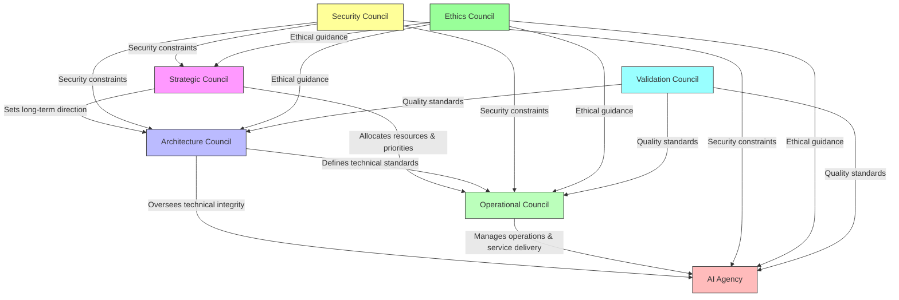
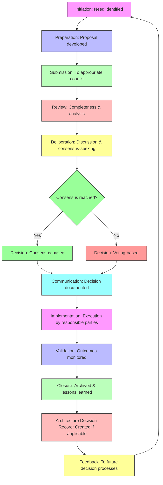
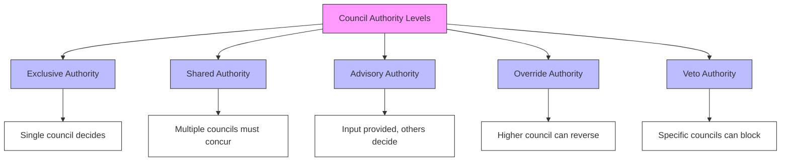
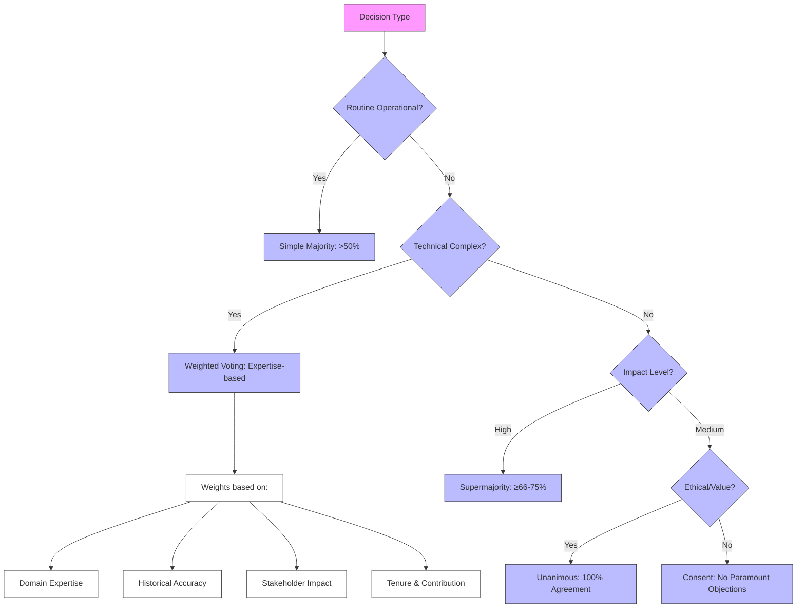
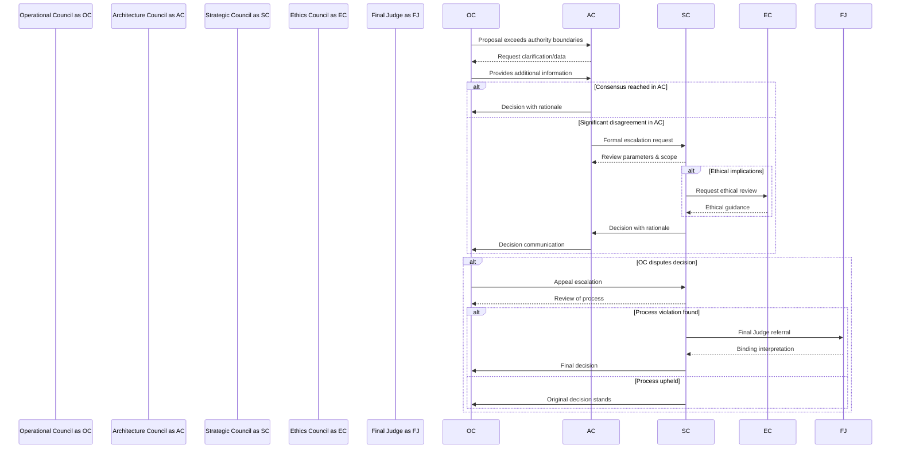
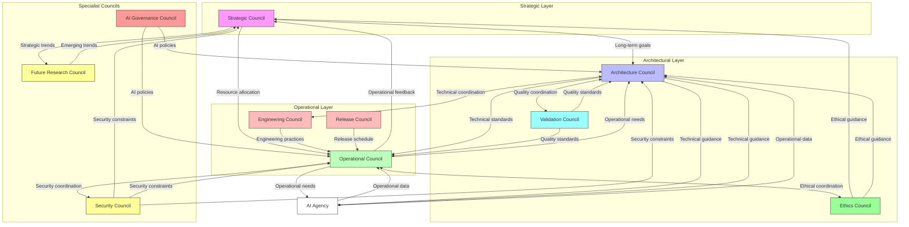
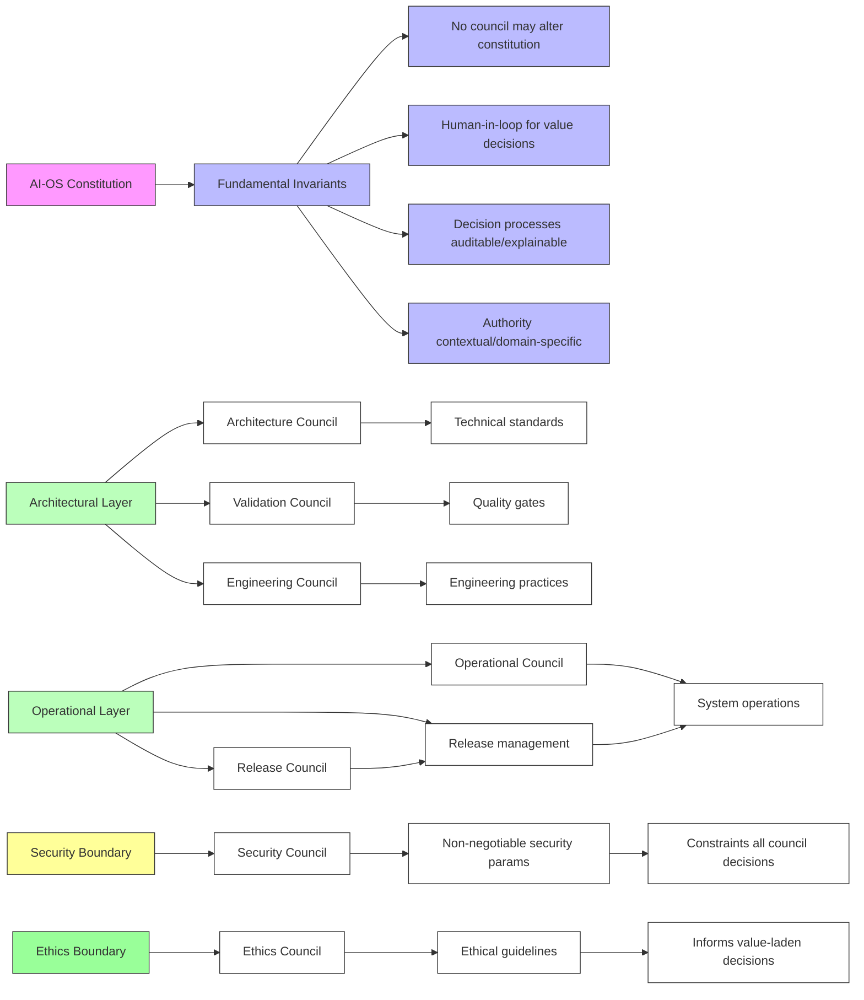

# Council Architecture Specification

## Document Overview

### Purpose
This document specifies the Council Architecture of AI-OS, defining the governance structures, decision-making processes, and architectural principles that enable collective intelligence, accountability, and adaptive governance within the AI-OS system. It establishes the framework for distributed decision-making between human and AI agents, ensuring alignment with system objectives, ethical guidelines, and architectural integrity.

### Scope
This document covers all aspects of council formation, operation, decision processes, roles, responsibilities, and interactions with other AI-OS architectural components. It applies to both permanent and temporary councils across all system layers, from runtime operations to strategic planning. It does not cover implementation-specific details, APIs, or code-level mechanisms.

### Audience
- System architects designing AI-OS extensions and modifications
- Governance officers and compliance teams overseeing AI-OS deployments
- AI agents and human participants involved in council processes
- Auditors assessing governance and decision-making integrity
- Developers implementing council-interacting components

### Relationship to the AI-OS Architecture
The Council Architecture is a cross-cutting concern that integrates with all other AI-OS architecture specifications (Parts 1-15). It provides the governance layer that oversees architectural decisions, validates system changes, and ensures adherence to architectural principles. Councils operate as a governance layer above the AI Agency and other core components, providing oversight without dictating implementation.

Specific relationships include:
- **Part 4 (AI Agency)**: Defines the operational entity that implements council decisions within bounded autonomy
- **Part 6 (Architecture Decision Records)**: Specifies the ADR format that councils use to document and track architectural decisions
- **Part 8 (Validation Architecture)**: Defines the validation framework overseen by the Validation Council
- **Part 9 (Engineering Principles)**: Establishes engineering practices governed by the Engineering Council
- **Part 11 (Repository Ecosystem)**: Covers artifact management that councils may oversee
- **Part 12 (Memory Architecture)**: Describes the memory system accessed by councils for historical decisions
- **Part 13 (Skills Ecosystem)**: Details skill development overseen by relevant councils
- **Part 14 (MCP Ecosystem)**: Governs external integrations regulated by council policies

### Relationship to AI Agency
While the AI Agency handles autonomous action execution and real-time decision-making within defined boundaries, the Council Architecture provides oversight, boundary setting, and exception handling. The AI Agency implements council decisions and operates within council-defined policies, while councils evaluate agency performance and adjust governance parameters.

### Relationship to Architecture Decision Records (ADRs)
Councils are the primary bodies responsible for creating, reviewing, and approving Architecture Decision Records. The ARB (Architecture Review Board) maintains the ADR repository, ensures decision quality, and tracks decision impact. Councils reference ADRs when making related decisions and may initiate ADR creation for significant architectural changes.

## Council Philosophy

### Why Councils Exist
Councils exist to address the limitations of purely autonomous or purely hierarchical governance in complex AI systems. They provide:
- Collective intelligence that surpasses individual agent capabilities
- Human oversight for value alignment and ethical considerations
- Distributed authority that prevents power concentration
- Adaptive governance that evolves with system learning
- Accountability mechanisms for transparent decision-making

### Governance Philosophy
AI-OS governance follows a polycentric model where multiple semi-autonomous councils operate with defined jurisdictions, overlapping responsibilities, and established conflict resolution mechanisms. Authority is delegated based on demonstrated competence and contextual relevance rather than rigid hierarchy. Governance emphasizes transparency, inclusive participation, evidence-based decision-making, and continuous improvement over control. Councils derive their legitimacy from their ability to make decisions that align with the AI-OS constitution, architectural principles, and stakeholder interests while maintaining operational effectiveness.

### Distributed Decision Making
Decisions MUST be made at the appropriate level of granularity and expertise. Operational decisions remain with operational councils, architectural decisions with architecture councils, and strategic decisions with strategic councils. Escalation paths exist for decisions that cross council boundaries or require higher-level authority. NO council SHALL make decisions outside its defined authority boundaries without following established escalation procedures.

### Human Governance
Human participants in councils provide value judgment, ethical reasoning, and contextual understanding that AI agents may lack. Human governance ensures that AI-OS remains aligned with human intentions, societal values, and organizational objectives. Human council members MUST be selected for expertise, diversity, and commitment to AI-OS principles. Their role includes providing ethical oversight, interpreting value-laden decisions, and ensuring alignment with the AI-OS constitution.

### AI Governance
AI agents participate in councils as equal members when their expertise is relevant, bringing computational analysis, pattern recognition, and data-driven insights. AI governance focuses on leveraging machine capabilities while preventing autonomous overreach. AI council members are subject to the same accountability standards as human members and MUST operate within the bounds defined by council policies and the AI-OS constitution.

### Human-in-the-Loop Principles
Critical decisions, especially those involving value conflicts, ethical dilemmas, or irreversible actions, REQUIRE explicit human-in-the-loop validation. Councils implement graduated autonomy where AI agents handle routine decisions within council-defined boundaries, escalating to human review for novelty, uncertainty, or high impact. The human-in-the-loop requirement applies to decisions that affect fundamental system properties, ethical guidelines, or constitutional principles.

### Trust and Accountability
Trust is built through transparent processes, explainable decisions, and consistent application of governance principles. Accountability mechanisms include decision logging with rationale, audit trails, performance metrics tied to council objectives, and override capabilities. Councils are accountable to the AI-OS constitution, stakeholders affected by their decisions, and the Architecture Review Board for adherence to architectural principles.

## Council Architecture

### Council Architecture Overview
The Council Architecture consists of a network of interconnected councils operating at different scopes and temporalities. Councils form a heterarchy rather than a strict hierarchy, with lateral connections for collaboration and vertical connections for escalation. Each council has a defined charter, membership criteria, decision-making procedures, and interaction protocols. The architecture emphasizes clear authority boundaries, accountability mechanisms, and defined interaction patterns.

### Council Hierarchy
While not a rigid hierarchy, councils exhibit layered organization based on scope and temporal focus:

| Layer | Primary Focus | Time Horizon | Decision Characteristics |
|-------|---------------|--------------|--------------------------|
| Strategic | Long-term vision, value definition, resource allocation | Years | High-impact, irreversible, value-laden |
| Architectural | System structure, interfaces, technical standards | Months to years | Structural, standards-setting, precedent-establishing |
| Operational | Day-to-day management, service delivery, optimization | Days to months | Routine, reversible, efficiency-focused |
| Tactical | Immediate responses, localized adjustments, incident response | Hours to days | Reactive, situational, time-critical |

Councils at higher layers set constraints, priorities, and boundaries for lower layers but do not micromanage execution. Lower layers provide operational data, feedback, and implementation insights to higher layers.

### Council Types
Councils are categorized by their primary function and permanence:

| Type | Permanence | Primary Function | Typical Duration | Decision Authority |
|------|------------|------------------|------------------|-------------------|
| Permanent | Ongoing | Continuous governance of domain | Indefinite | Defined by charter |
| Temporary | Limited | Specific project or initiative | Defined term | Limited to initiative scope |
| Advisory | Ongoing/Temporary | Expert guidance without authority | Variable | Advisory only |
| Operational | Ongoing | Routine management and operations | Indefinite | Operational decisions within bounds |
| Strategic | Ongoing | Long-term planning and direction | Indefinite | Strategic direction and resource allocation |

### Permanent Councils
Permanent councils provide continuous governance for enduring AI-OS functions. They have standing charters, regular meetings, defined membership criteria, and ongoing responsibility for their domains. Examples include the Architecture Review Board, Engineering Council, and Security Council. Permanent councils MUST maintain decision records, follow established processes, and report regularly to stakeholders.

### Temporary Councils
Temporary councils are formed for specific purposes such as addressing incidents, developing new features, conducting time-bound investigations, or managing specific projects. They dissolve upon completing their mandate or when their purpose is no longer relevant. Temporary councils MUST have a clearly defined charter, timeline, and success criteria.

### Advisory Councils
Advisory councils provide expert input to decision-making councils without holding decision-making authority. They may be permanent (providing ongoing expertise in specialized domains) or temporary (consulted for specific issues). Examples include ethics advisory panels, user experience advisory groups, and technical advisory boards. Advisory councils provide non-binding recommendations that decision-making councils MUST consider but are not obligated to follow.

### Operational Councils
Operational councils manage the day-to-day functioning of AI-OS subsystems. They handle routine decisions, incident response, performance optimization, and service delivery within parameters set by higher-level councils. Operational councils focus on efficiency, reliability, and service quality within established boundaries.

### Strategic Councils
Strategic councils define long-term vision, allocate major resources, set organizational priorities, and determine AI-OS's relationship with external systems. They operate on longer time horizons and consider broad societal and technological trends. Strategic councils focus on value creation, risk management, and ensuring alignment with the AI-OS constitution.

### Architecture Councils
Architecture councils focus on the structural integrity, evolution, and technical excellence of AI-OS. They review architectural proposals, maintain technical standards, manage technical debt, and ensure the system remains adaptable and maintainable. Architecture councils focus on technical soundness, interoperability, scalability, and long-term maintainability.

## Council Roles

### Architecture Review Board (ARB)
**Responsibilities**:
- Review and approve all architecture-altering proposals
- Maintain the Architecture Decision Record (ADR) repository (Part 6)
- Ensure adherence to architectural principles and standards
- Conduct architecture compliance reviews
- Manage technical debt backlog
- Coordinate with other councils on architecture-related matters

### Engineering Council
**Responsibilities**:
- Establish engineering practices and quality standards (Part 9)
- Oversee code review processes and merge policies
- Define testing strategies and quality gates
- Manage engineering productivity metrics
- Coordinate release engineering activities
- Address cross-team technical dependencies

### AI Governance Council
**Responsibilities**:
- Define AI ethical guidelines and usage policies
- Review AI agent behaviors for alignment with values
- Oversee AI training data quality and bias mitigation
- Monitor AI performance and fairness metrics
- Handle AI-related incidents and escalations
- Update governance policies as AI capabilities evolve

### Security Council
**Responsibilities**:
- Establish security policies and standards
- Oversee threat modeling and vulnerability assessments
- Manage incident response procedures
- Review security architecture and controls
- Coordinate security audits and compliance
- Disseminate security knowledge and best practices

### Runtime Council
**Responsibilities**:
- Monitor system health and performance metrics
- Manage resource allocation and scheduling
- Oversee fault tolerance and recovery mechanisms
- Set performance benchmarks and SLAs
- Coordinate capacity planning efforts
- Handle runtime anomalies and degradation

### Validation Council
**Responsibilities**:
- Define validation criteria and acceptance testing (Part 8)
- Oversee verification methodologies and test coverage
- Manage validation environments and test data
- Review validation results and release readiness
- Coordinate validation across system components
- Maintain validation documentation and standards

### Release Council
**Responsibilities**:
- Manage release schedules and coordination
- Oversee release planning and risk assessment
- Define release criteria and rollback procedures
- Coordinate release communication and documentation
- Manage release environments and deployment pipelines
- Conduct post-release reviews and retrospectives

### Ethics Council
**Responsibilities**:
- Define ethical guidelines for AI-OS development and use
- Review ethical implications of architectural decisions
- Handle ethical concerns and whistleblower reports
- Provide ethics training and awareness programs
- Consult with external ethics experts when needed
- Ensure AI-OS aligns with societal values and norms

### Future Research Council
**Responsibilities**:
- Identify emerging technologies and trends
- Evaluate potential future directions for AI-OS
- Manage research partnerships and experiments
- Allocate resources for exploratory work
- Scout for disruptive innovations
- Advise strategic council on long-term options

## Decision Architecture

### Decision Lifecycle
The decision lifecycle in AI-OS follows a standardized process to ensure consistency, traceability, and quality in governance decisions:

1. **Initiation**: A need for decision is identified and articulated as a formal proposal
2. **Preparation**: Proposal is developed with supporting data, alternatives analysis, impact assessment, and compliance checking
3. **Submission**: Proposal is submitted to the appropriate council(s) based on decision type and scope
4. **Review**: Council members examine the proposal, request clarifications, identify concerns, and perform initial assessment
5. **Deliberation**: Council discusses the proposal, weighs alternatives, seeks consensus, and documents dissenting views
6. **Decision**: Council reaches a decision through its designated process (consensus, voting, or other approved method)
7. **Communication**: Decision is documented with rationale and communicated to stakeholders and affected parties
8. **Implementation**: Responsible parties execute the decision according to established procedures
9. **Validation**: Outcomes are monitored against expectations and success criteria
10. **Closure**: Decision is archived, lessons learned are captured, and formal closure is documented

### Proposal Process
All proposals submitted to councils MUST include the following elements:

| Element | Requirement | Purpose |
|---------|-------------|---------|
| Decision Statement | Clear, unambiguous statement of the decision needed | Defines scope and focus |
| Background & Context | Relevant history, triggering events, and situational factors | Provides necessary context |
| Alternatives Analysis | Examination of options including status quo and rejected alternatives | Ensures thorough consideration |
| Impact Assessment | Analysis of effects, risks, benefits, and resource requirements | Enables informed decision-making |
| Stakeholder Analysis | Identification of affected parties and their interests | Supports fairness and buy-in |
| Compliance Check | Verification against policies, regulations, and architectural principles | Ensures adherence to constraints |
| Success Criteria | Measurable outcomes and validation approach | Enables post-decision assessment |
| Implementation Plan | Timeline, responsibilities, and resource requirements | Facilitates execution |

### Review Process
Council review follows a standardized procedure to ensure thoroughness and fairness:

1. **Completeness Check**: Council secretary verifies proposal includes all required elements
2. **Distribution**: Proposal distributed to council members with adequate review time (minimum 24 hours for non-urgent decisions)
3. **Individual Analysis**: Members perform independent review, submit comments, and identify key issues
4. **Comment Consolidation**: Secretary consolidates feedback, identifies patterns, and prepares summary
5. **Issue Identification**: Key concerns, disagreements, and information gaps are documented
6. **Preparation for Deliberation**: Revised proposal and briefing materials prepared for council meeting
7. **Iterative Refinement**: Proposal may be revised based on feedback before final decision

### Consensus Process
Councils STRIVE for consensus where possible, defined as general agreement without fundamental objections. When consensus cannot be reached within reasonable time, councils fall back to their designated voting model. Consensus-building techniques include:

- Interest-based negotiation focusing on underlying needs rather than positions
- Systematic option generation and evaluation using agreed-upon criteria
- Facilitated conflict resolution to address disagreements constructively
- Structured reflection periods to allow reconsideration of positions
- Neutral mediation by uninvolved council members when needed

Consensus does NOT require unanimity but requires that no member has a paramount objection to the proposed decision.

### Voting Models
Councils employ different voting models based on decision type, impact, and reversibility:

| Model | Threshold | Appropriate Use | Characteristics |
|-------|-----------|-----------------|-----------------|
| Simple Majority | >50% of votes | Routine operational decisions | Low impact, reversible, time-sensitive |
| Weighted Voting | Weighted sum >50% | Complex technical decisions | Expertise-weighted, technical complexity |
| Supermajority | ≥66% or ≥75% | Architectural changes, policy updates | Moderate to high impact, precedent-setting |
| Unanimous | 100% agreement | Ethical decisions, value changes | Fundamental principles, irreversible impact |
| Consent | No paramount objections | Procedural matters, low-risk decisions | Minimal objections, efficiency-focused |

Weighted voting assigns different vote weights based on:
- Demonstrated domain expertise and relevant credentials
- Historical decision accuracy and judgment quality
- Stakeholder impact level and representativeness
- Membership tenure, contribution, and engagement
Weights are defined in each council's charter, transparently documented, and may be adjusted periodically through established procedures.

### Majority Decisions
Simple majority votes are used for decisions where:
- Impact is demonstrably reversible or limited in scope
- Expertise is reasonably distributed among council members
- Timeliness requirements outweigh the need for broader consensus
- Established precedent exists for similar decisions in comparable contexts
- The decision does not affect fundamental system properties or ethical principles

### Weighted Voting
Weighted voting is REQUIRED for decisions involving significant technical complexity where expertise distribution is uneven. The weighting methodology MUST be:
- Based on objective, verifiable criteria
- Documented in the council charter
- Applied consistently across similar decisions
- Subject to periodic review and adjustment
- Transparent to all council members and stakeholders

### Unanimous Decisions
Unanimous agreement is REQUIRED for:
- Changes to AI-OS core values, ethical principles, or constitutional tenets
- Architectural changes affecting fundamental safety, security, or privacy guarantees
- Decisions with clinically irreversible, high-impact consequences on system integrity
- Matters where strong buy-in is ESSENTIAL for effective implementation and adoption
- Any decision that would alter the foundational assumptions of AI-OS architecture

### Escalation
Decisions MUST be escalated when:
- They demonstrably exceed a council's defined authority boundaries
- Significant, unresolved disagreement persists after thorough deliberation
- Novelty or complexity requires expertise beyond the council's membership
- The decision impact spans multiple council domains or system layers
- The decision establishes precedent requiring broader validation
- Legal, ethical, or constitutional questions arise requiring specialized expertise

### Arbitration
When councils cannot resolve conflicts through normal deliberation and voting processes:
- A neutral arbitration panel IS convened following established procedures
- Panel members ARE selected from unaffected councils with relevant expertise
- Arbitration follows defined procedures, timelines, and evidence standards
- Arbitration decisions ARE binding on the involved councils
- Arbitration focuses on finding principled compromises that respect council autonomy while resolving conflict

### Human Override
Human council members MAY invoke override procedures for:
- Clear ethical violations or value misalignments with the AI-OS constitution
- Decisions posing unacceptable risks to system safety, security, or stability
- Demonstrated clear errors in factual analysis, reasoning, or evidence interpretation
- Actual or potential violations of applicable legal or regulatory requirements
Overrides trigger immediate review by the Ethics Council or designated governance body and MUST be justified with specific, evidence-based concerns.

### Final Judge Integration
The Final Judge (as specified in AI Agency documentation) provides:
- Ultimate appeal mechanism for decisions affecting AI agent autonomy and operational boundaries
- Authoritative interpretation of AI-OS constitution, architectural principles, and governance policies
- Binding resolution of conflicts between council decisions that cannot be resolved through other means
- Validation of decision alignment with system objectives, ethical guidelines, and architectural integrity
Final Judge decisions ARE binding on all councils and agents and CANNOT be overridden by any council or governance body.

## Governance Model

### Authority Levels
Authority in AI-OS is contextual, domain-specific, and horizontally distributed. Councils operate within clearly defined boundaries that govern their decision-making scope:

| Authority Type | Definition | Characteristics | Example Use |
|----------------|------------|-----------------|-------------|
| **Exclusive Authority** | Single council has final decision-making power within its domain | No concurrence required; accountability resides solely with the council | Operational Council approving routine configuration changes |
| **Shared Authority** | Multiple councils must concur for a decision to be valid | Requires agreement from all involved councils; prevents unilateral action | Architecture Council and Security Council jointly approving a cryptographic standard change |
| **Advisory Authority** | Council provides input but does not have decision-making power | Recommendations must be considered but are not binding; input improves decision quality | Ethics Council advising on an AI training data selection proposal |
| **Override Authority** | Higher council can reverse decisions under defined conditions | Limited to specific circumstances; requires justification and documentation | Strategic Council overriding an Operational Council decision that conflicts with long-term value definition |
| **Veto Authority** | Specific councils can block decisions in their domain | Prevents actions that violate domain-specific constraints; defensive rather than proactive | Security Council vetoing a proposal that violates fundamental security guarantees |

All councils MUST operate within their defined authority boundaries. NO council SHALL exercise authority outside its charter without following established escalation procedures.

### Responsibilities
Each council has clearly defined responsibilities in its charter, including:

| Responsibility | Description | Accountability Measure |
|----------------|-------------|------------------------|
| Decision-making within domain | Making binding decisions within the council's authorized scope | Decision logs with rationale and outcomes |
| Policy development and maintenance | Creating, updating, and retiring policies that govern domain operations | Policy version control and compliance tracking |
| Performance monitoring and reporting | Tracking key performance indicators and reporting to stakeholders | Regular performance reports and dashboards |
| Stakeholder engagement and communication | Ensuring affected parties are informed and can provide input | Meeting minutes, feedback records, and response documentation |
| Resource allocation within budget | Managing financial, computational, and human resources assigned to the council | Budget reports and resource utilization metrics |
| Capability development for members | Ensuring council members have necessary skills and knowledge | Training records, certification tracking, and skill assessments |
| Relationship management with other councils | Coordinating with peer councils on overlapping concerns and dependencies | Joint meeting records,MOUs, and conflict resolution logs |

### Ownership
Councils own:

| Owned Asset | Description | Stewardship Requirements |
|-------------|-------------|--------------------------|
| Decision outcomes and Implementation oversight | Results of council decisions and ensuring proper execution | Decision implementation tracking and outcome validation |
| Policies, standards, and guidelines in their domain | Governing documents that define how the domain operates | Version control, change management, and compliance verification |
| Artifacts such as ADRs, runbooks, and guidelines | Documentation produced by or for the council | Standardized formatting, storage in approved repositories, and retention per policy |
| Relationships with external bodies in their domain | Formal and informal connections with stakeholders, regulators, and partners | Relationship documentation, meeting schedules, and engagement metrics |
| Budgets and resources allocated to their council activities | Financial, computational, and human resources assigned to council operations | Regular financial reporting, resource utilization tracking, and audit trails |

Ownership implies accountability for maintaining, evolving, and ensuring the quality of these assets. Councils MUST conduct regular reviews of their owned assets and report on their stewardship to stakeholders and oversight bodies.

### Delegation
Councils delegate authority through established mechanisms that maintain accountability while enabling scalability:

| Delegation Mechanism | Purpose | Boundaries | Accountability |
|----------------------|---------|------------|----------------|
| Standing committees for specialized functions | Ongoing responsibility for specific sub-domains | Defined in committee charter; reports to parent council | Committee minutes, performance metrics, and escalation paths |
| Temporary task forces for specific projects | Time-bound responsibility for defined objectives | Clear timeline, success criteria, and dissolution conditions | Project deliverables, milestone reviews, and final reports |
| Individual agents or agents for bounded autonomy | Delegated decision-making for specific, repeatable decisions | Predefined parameters, limits, and escalation triggers | Decision logs, compliance reports, and performance reviews |
| Automated systems for routine decisions within parameters | Machine-driven decisions for high-volume, low-complexity cases | Strictly defined decision criteria, monitoring requirements, and override procedures | Audit trails, exception reports, and performance metrics |
| External experts for specialized advice | Knowledge and skills not available within the council | Advisory role only; no decision-making authority | Consultation records, advice documentation, and conflict of interest declarations |

Delegation includes clear boundaries, accountability mechanisms, and reporting requirements. Councils MUST ensure that delegated authority remains within the bounds of the council's overall authority and that delegates are properly supervised and evaluated.

### Separation of Duties
Critical functions are separated to prevent concentration of power, conflicts of interest, and errors:

| Function Pair | Separation Purpose | Implementation Approach |
|---------------|-------------------|-------------------------|
| Proposal development vs. decision approval | Prevents self-approval and ensures independent review | Different individuals or bodies responsible for each function |
| Implementation oversight vs. audit and review | Ensures objective evaluation of execution | Independent audit function separate from implementation management |
| Policy setting vs. compliance enforcement | Prevents marking your own homework | Distinct bodies for creating policies and verifying adherence |
| Resource allocation vs. expenditure approval | Ensures checks and balances on resource use | Separate authorization for budgeting and spending |
| Conflict investigation vs. disciplinary action | Ensures fair process and prevents bias | Independent investigation function separate from adjudication |

Critical functions MUST be separated according to these principles. NO individual or body SHALL control both sides of a separation pair without explicit authorization and compensating controls.

### Accountability
Accountability mechanisms ensure councils answer for their decisions and actions:

| Mechanism | Description | Frequency | Reporting To |
|-----------|-------------|-----------|--------------|
| Decision logs with rationale and participant attribution | Complete record of what was decided, why, and who participated | Per decision | Stakeholders, oversight bodies, and archival systems |
| Performance metrics tied to council objectives | Quantitative measures of council effectiveness | Regular intervals (monthly/quarterly) | Stakeholders and governance oversight |
| Regular reporting to stakeholders and higher councils | Summary of activities, decisions, and performance | As defined in council charter (minimum quarterly) | Stakeholders, parent councils, and governance bodies |
| Audit trails for all significant actions | Immutable record of actions taken and system changes | Continuous | Audit functions, compliance officers, and oversight bodies |
| Post-decision reviews and retrospectives | Analysis of decision outcomes and process effectiveness | After significant decisions or periodically | Council members and stakeholders |
| Ability to call special sessions for accountability discussions | Forum for addressing concerns and reviewing performance | As needed | Council members and relevant stakeholders |
| External audit possibilities for high-impact domains | Independent review by authorized external parties | Periodic or trigger-based | Regulators, accreditation bodies, or specialized audit firms |

Accountability mechanisms MUST be implemented as specified in each council's charter. Councils SHALL provide accurate, timely, and complete information through these mechanisms.

### Auditability
All council activities MUST be auditable to ensure transparency, enable investigation, and support learning:

| Auditability Aspect | Requirement | Implementation Standard |
|---------------------|-------------|-------------------------|
| Timestamped records of meetings, discussions, and decisions | Complete chronological record with precise timing | ISO 8601 format timestamps on all records |
| Accessible proposals, comments, and voting records | Readable and searchable by authorized parties | Standard formats in access-controlled repositories |
| Clear documentation of decision processes and criteria | Transparent explanation of how decisions are made | Decision-making procedures published and version-controlled |
| Traceability from decisions to implementation outcomes | Ability to link decisions to their execution and results | Unique decision identifiers propagated through implementation systems |
| Standardized formats for easy review and analysis | Consistent structure facilitates automated and manual review | Council-approved templates and metadata schemas |
| Retention policies preserving records for defined periods | Information kept as long as needed for business, legal, or historical purposes | Approved retention schedules with secure disposal procedures |

Audit trails MUST be immutable once created. Councils SHALL implement controls to prevent unauthorized alteration of audit records and SHALL log all access to audit trails for security monitoring.

## Runtime Relationships

### Interaction with AI Agency (Part 4)
The AI Agency implements council policies and operates within council-defined boundaries, implementing decisions made by the appropriate councils. The relationship is characterized by:

| Aspect | Council Responsibility | AI Agency Responsibility | Interaction Mechanism |
|--------|------------------------|--------------------------|----------------------|
| Policy Implementation | Defines operational boundaries and constraints | Executes within defined boundaries | Policy dissemination and compliance monitoring |
| Performance Oversight | Sets performance benchmarks and SLAs | Reports performance metrics and compliance status | Regular performance reviews and exception reporting |
| Data Provision | Requests operational data for decision-making | Provides telemetry, logs, and operational metrics | Structured data feeds and query interfaces |
| Escalation Handling | Defines escalation paths and intervention criteria | Reports behaviors requiring council intervention | Defined escalation channels and notification protocols |
| Autonomy Management | Grants and constrains operational autonomy | Operates within granted autonomy levels | Dynamic boundary adjustment based on performance and risk assessment |

Councils MONITOR AI Agency performance and compliance. AI Agency PROVIDES operational data to inform council decisions. Escalation paths EXIST for AI Agency behaviors requiring council intervention. Councils MAY constrain AI Agency autonomy based on performance or risk assessments.

### Interaction with Planning
The relationship between councils and planning functions ensures alignment between strategic direction and operational execution:

| Interaction | Direction | Purpose | Frequency |
|-------------|-----------|---------|-----------|
| Strategic Goal Setting | Strategic Council → Planning | Provides long-term vision, value definition, and resource allocation priorities | Quarterly or as strategic cycles dictate |
| Plan Review and Alignment | Planning → Relevant Councils | Ensures plans are feasible, aligned with council policies, and respect authority boundaries | During planning cycle execution |
| Planning Initiative Authorization | Councils → Planning | Councils may initiate planning efforts for complex initiatives requiring cross-council coordination | As needed for initiative scoping |
| Data Feedback Loop | Planning → Councils | Planning outputs (resource estimates, timelines, risk assessments) inform council decision-making | Ongoing during planning cycles |
| Priority Alignment | Bidirectional | Planning informs council near-term priorities; councils inform planning long-term direction | Continuous improvement cycle |

Strategic councils PROVIDE long-term goals that inform planning cycles. Planning outputs ARE reviewed by relevant councils for feasibility and alignment. Councils MAY initiate planning efforts for complex initiatives. Planning data FEEDS into council decision-making processes. An ITERATIVE relationship exists where planning informs council priorities and vice versa.

### Interaction with Validation
The Validation Council establishes quality and readiness standards that other councils must respect in their decision-making processes:

| Interaction | Direction | Purpose | Requirement |
|-------------|-----------|---------|-------------|
| Standard Setting | Validation Council → Other Councils | Defines validation criteria, acceptance testing, and quality gates | Mandatory for release and operational decisions |
| Consultation | Other Councils → Validation Council | Seeks guidance on testability, verifiability, and validation approach | Required for decisions with validation implications |
| Results Utilization | Validation Council → Decision Councils | Provides validation results that inform readiness and risk assessments | Used in go/no-go decisions and release planning |
| Joint Initiatives | Validation Council ↔ Other Councils | Forms joint councils for validation-critical initiatives requiring specialized expertise | As determined by initiative complexity and risk |
| Process Alignment | Bidirectional | Ensures validation processes align with council decision timelines and requirements | Continuous process improvement |

Validation Council SETS standards that other councils MUST respect in their decisions. Councils CONSULT Validation Council on testability and verifiability of proposals. Validation results INFORM council decisions about readiness and risk. Council decisions MAY trigger validation activities. Joint councils MAY be formed for validation-critical initiatives.

### Interaction with Security
The Security Council establishes non-negotiable security parameters that establish boundaries for all other council decisions:

| Interaction | Direction | Purpose | Requirement |
|-------------|-----------|---------|-------------|
| Parameter Setting | Security Council → All Councils | Defines security policies, standards, and non-negotiable constraints | Absolute constraint on all council decisions |
| Threat Intelligence | Security Council → Decision Councils | Provides risk assessments, threat intelligence, and vulnerability information | Informs risk assessment in all council decisions |
| Review Requirement | Security Council ← Decision Councils | Mandatory security review for decisions with security implications | Required for any decision affecting security posture |
| Investigative Support | Security Council ← Decision Councils | Enables councils to request security investigations for suspected vulnerabilities | Available upon justified request |
| Policy Feedback | Decision Councils → Security Council | Provides operational feedback on security policy effectiveness and usability | Informs security policy updates and improvements |

Security Council SETS non-negotiable security parameters that CONSTRAIN all other council decisions. Security reviews ARE mandatory for decisions with security implications. Security Council PROVIDES threat intelligence to inform council risk assessments. Councils MAY request security investigations for suspected vulnerabilities. Security Council UPDATES policies based on council operational feedback.

### Interaction with Memory
The Memory system provides historical context, auditability, and learning capabilities for council operations:

| Interaction | Direction | Purpose | Mechanism |
|-------------|-----------|---------|-----------|
| Historical Access | Councils → Memory System | Access to past decisions, outcomes, and contextual information | Query interface with appropriate access controls |
| Artifact Storage | Councils ← Memory System | Repository for council artifacts (decisions, proposals, records) | Standardized deposit and retrieval procedures |
| Learning Enablement | Memory System → Councils | Provides patterns, trends, and lessons from historical data | Analytics and reporting functions |
| Policy Governance | Councils → Memory System | Defines usage policies, retention schedules, and privacy considerations | Policy establishment and enforcement |
| Context Provision | Memory System → Councils | Offers context for similar past decisions and precedent analysis | Decision similarity matching and retrieval |

Councils ACCESS historical decisions and outcomes from the Memory system. Memory STORES council artifacts for auditability and learning. Council decisions MAY trigger memory consolidation or forgetting policies. Memory PROVIDES context for similar past decisions. Councils GOVERN memory usage policies and privacy considerations.

### Interaction with Skills
The Skills ecosystem supports council decision-making through competency assurance and expert availability:

| Interaction | Direction | Purpose | Mechanism |
|-------------|-----------|---------|-----------|
| Skill Definition | Skills Council → Other Councils | Defines skill domains, competency levels, and certification standards | Framework for skill assessment and development |
| Recommendation | Other Councils → Skills Council | Identifies skill gaps and recommends development based on decision requirements | Skills gap analysis and forecasting |
| Availability Assessment | Skills Council → Decision Councils | Provides information on skill availability for decision feasibility | Skills inventory and capability mapping |
| Commissioning | Decision Councils → Skills Council | Requests specialized skills for decision-support needs | Formal skill commissioning procedures |
| Performance Feedback | Decision Councils → Skills Council | Informs skill effectiveness and relevance based on decision outcomes | Outcome-based skill validation and improvement |

Skills Council (if established) OVERSEES skill development and certification. Councils MAY RECOMMEND skill development based on identified gaps. Skill availability INFLUENCES council feasibility assessments. Councils MAY COMMISSION skills for specific decision-support needs. Skill performance data INFORMS council decisions about agent capabilities.

### Interaction with MCP (Model Context Protocol)
MCP integration governs how councils manage external knowledge and capability access:

| Interaction | Direction | Purpose | Requirement |
|-------------|-----------|---------|-------------|
| Policy Establishment | Councils → MCP Ecosystem | Defines usage policies, security standards, and performance requirements | Mandatory for all MCP integrations |
| Integration Approval | Councils ← MCP Providers | Reviews and approves specific MCP server/client implementations | Required before deployment in council-influenced domains |
| Data Provision | MCP Ecosystem → Councils | Supplies external knowledge, capabilities, and contextual information | Informs council decision-making with external data |
| Resource Management | Councils → MCP Ecosystem | Influences resource allocation and usage patterns for MCP services | Based on decision requirements and value assessment |
| Compliance Monitoring | Councils ↔ MCP Ecosystem | Ensures ongoing adherence to council-defined standards | Regular audits and compliance reporting |

Councils ESTABLISH policies for MCP server and client usage. MCP implementations MUST comply with council-defined security and performance standards. Councils MAY APPROVE or RESTRICT specific MCP integrations. MCP PROVIDES data and capabilities that inform council decision-making. Council decisions MAY AFFECT MCP resource allocation and usage patterns.

### Interaction with Observability
Observability data provides the foundation for council monitoring, decision-making, and improvement initiatives:

| Interaction | Direction | Purpose | Mechanism |
|-------------|-----------|---------|-----------|
| Requirement Definition | Councils → Observability System | Defines what needs observation, at what granularity, and for what purposes | Requirement specification and prioritization |
| Data Consumption | Councils ← Observability System | Receives metrics, logs, traces, and other telemetry data | Standardized data feeds and query interfaces |
| Performance Review | Observability System → Councils | Provides performance metrics for council self-assessment and external review | Dashboards, reports, and alerting systems |
| Resource Allocation | Councils → Observability System | Directs investment in observability capabilities for critical areas | Budget allocation and capability enhancement |
| Gap Response | Observability System → Councils | Identifies observability gaps that trigger improvement initiatives | Gap analysis and remediation tracking |

Observability data IS fundamental to council monitoring and decision-making. Councils DEFINE what needs to be observed and at what granularity. Observability outputs FEED into council performance reviews and anomaly detection. Councils MAY ALLOCATE resources to enhance observability in critical areas. Observability gaps IDENTIFIED by councils TRIGGER improvement initiatives.

### Interaction with Recovery
Recovery capabilities ensure system resilience and continuity of operations:

| Interaction | Direction | Purpose | Responsibility |
|-------------|-----------|---------|----------------|
| Procedure Definition | Recovery Councils → System | Defines backup, restore, and disaster recovery procedures | Runtime or Security Council (depending on context) |
| Plan Validation | Councils ↔ Recovery Function | Validates recovery plans and tests recovery capabilities | Shared responsibility with defined handoff points |
| Metrics Review | Recovery Function → Councils | Provides recovery performance metrics (RTO, RPO, success rates) | Regular reporting and trend analysis |
| Strategy Updates | Councils ← Recovery Function | Receives recommendations for recovery strategy updates | Based on test results, incident learning, and capability changes |
| Post-Incident Learning | Councils ↔ Recovery Function | Conducts post-incident reviews to learn and adapt governance | Joint reviews with documented action items |

Recovery procedures ARE defined and overseen by relevant councils (typically Runtime or Security). Councils VALIDATE recovery plans and test recovery capabilities. Recovery performance metrics ARE reviewed by councils. Council decisions MAY TRIGGER updates to recovery strategies. Post-incident reviews INVOLVE councils to learn and adapt governance.

### Interaction with Architecture Governance
Architecture Governance provides the overarching framework within which councils operate:

| Interaction | Direction | Purpose | Mechanism |
|-------------|-----------|---------|-----------|
| Framework Definition | Architecture Governance → Councils | Establishes governance principles, decision-making standards, and architectural constraints | Framework documentation and compliance requirements |
| Principle Instantiation | Councils → Architecture Governance | Implements architecture governance principles in domain-specific contexts | Domain-specific governance implementations |
| Metrics Provision | Architecture Governance → Councils | Supplies governance effectiveness metrics for council self-assessment | Standardized measurement and reporting |
| Improvement Initiation | Councils → Architecture Governance | Proposes enhancements to the architecture governance framework | Formal proposal and review process |
| Self-Assessment | Architecture Governance ← Councils | Receives council self-assessments on governance effectiveness | Periodic reporting and feedback cycles |

Architecture Governance IS the overarching framework of which councils ARE a part. Councils PROVIDE the instantiation of architecture governance principles. Architecture governance metrics ARE reviewed by councils for effectiveness. Councils MAY INITIATE architecture governance improvements. Architecture governance outcomes INFORM council self-assessment.

## Architectural Principles

### Council Independence
Councils operate with appropriate autonomy within their defined domains, free from undue influence while remaining accountable to the AI-OS constitution and stakeholder interests. Independence enables councils to make decisions based on merit rather than external pressures.

### Transparency
Council processes, decisions, and rationales are transparent to appropriate stakeholders. Transparency builds trust, enables accountability, and allows for informed participation. Sensitive information is protected while maximizing visibility of governance processes.

### Explainability
Decisions are accompanied by clear explanations of reasoning, alternatives considered, and factors weighed. Explainability enables stakeholders to understand not just what was decided, but why, facilitating learning and acceptance.

### Traceability
Decision outcomes can be traced back through the decision lifecycle to initial proposals, inputs, and rationale. Traceability supports auditability, learning from past decisions, and understanding decision evolution over time.

### Consistency
Similar decisions are made consistently across time and contexts, unless legitimate reasons for differentiation exist and are documented. Consistency ensures predictability and fairness while allowing for principled adaptation.

### Fairness
Council processes provide equitable opportunity for participation and consideration of views. Fairness encompasses procedural justice, impartiality, and equitable distribution of benefits and burdens resulting from decisions.

### Extensibility
The Council Architecture can accommodate new councils, evolving responsibilities, and changing system scales without requiring fundamental restructuring. Extensibility ensures the governance system grows with AI-OS capabilities.

### Stability
While adapting to change, the Council Architecture provides stable governance foundations that enable long-term planning and reliable operation. Stability prevents disruptive governance shifts while allowing for necessary evolution.

## Conformance

### Required Council Behaviors
All councils must:
- Operate according to their charters and this specification
- Maintain decision records with appropriate detail
- Follow established processes for proposal handling and decision-making
- Provide regular reporting on activities and performance
- Engage in self-assessment and improvement activities
- Respect the authority and decisions of other councils within their domains
- Escalate appropriately when decisions exceed their authority

### Governance Requirements
Councils must satisfy:
- Minimum meeting frequency as defined in charter
- Quorum requirements for valid decisions
- Conflict of interest disclosure and management
- Member qualification and training requirements
- Documentation and record-keeping standards
- Ethical conduct standards
- Security and confidentiality requirements for sensitive information

### Architectural Constraints
Councils must operate within:
- AI-OS constitutional principles and values
- Resource allocations approved by appropriate authorities
- Legal and regulatory requirements applicable to AI-OS deployment
- Interoperability requirements with other AI-OS components
- Performance and scalability constraints of the underlying infrastructure

### Architecture Invariants
The following invariants must be preserved:
- No council may unilaterally alter the AI-OS constitution
- Council decisions cannot violate fundamental safety or security guarantees
- The human-in-the-loop principle must be maintained for value-laden decisions
- Decision processes must remain auditable and explainable
- Council authority must remain contextual and domain-specific

### Extension Rules
New councils may be established when:
- A distinct governance need emerges that existing councils cannot adequately address
- The need is enduring or recurrent rather than one-time
- Clear boundaries can be established with existing councils
- Required resources and membership can be secured
- The new council aligns with AI-OS principles and does not create conflicts
Extension follows a proposal-review-approval process similar to other architectural decisions.

## Future Evolution

The Council Architecture can evolve through:
- Charter updates for existing councils as their domains evolve
- Formation of new councils to address emerging governance needs
- Evolution of decision-making processes based on effectiveness data
- Adjustment of authority boundaries as system capabilities change
- Incorporation of lessons learned from decision outcomes
- Adaptation to new technological capabilities (e.g., advanced AI for decision support)
Evolution must maintain backward compatibility with existing decision records and respect the architecture invariants. Changes are governed by the Architecture Review Board to ensure systemic coherence.

## Diagrams

### Council Hierarchy

### Decision Lifecycle

### Governance Model

### Voting Architecture

### Escalation Flow

### Council Interaction Graph

### Governance Boundaries

## Cross References

This document references but does not duplicate information from the following project-knowledge documents:

- **AI_OS_MASTER_CONTEXT.md**: Provides the overarching context and principles that inform council decision-making, including system objectives, constitutional principles, and stakeholder definitions.
- **AI_AGENCY.md**: Details the AI Agency component that implements council decisions and operates within council-defined boundaries, including its autonomy levels and oversight mechanisms.
- **ARCHITECTURE_DECISIONS.md**: Specifies the Architecture Decision Record (ADR) format and management practices that councils use to document and track architectural decisions.
- **ENGINEERING_PRINCIPLES.md**: Defines engineering practices and quality standards that the Engineering Council oversees and that other councils must consider in their decisions.
- **VALIDATION_ARCHITECTURE.md**: Describes the validation framework that the Validation Council oversees, including testing methodologies, environments, and acceptance criteria.
- **REPOSITORY_ECOSYSTEM.md**: Covers the repository structure and management practices that councils may oversee in relation to code, documentation, and artifact storage.

These references ensure that the Council Architecture remains aligned with the broader AI-OS specification while maintaining its specific focus on governance and decision-making structures.