# AI-OS Engineering Principles

## Document Overview

This document serves as the authoritative source for all engineering and architectural principles used throughout the AI-OS (Artificial Intelligence Operating System). It explains the principles that guided the architectural decisions captured in the frozen Architecture Specification (Parts 1-15), providing the rationale and philosophy behind the system's design.

While the Architecture Specification defines what AI-OS **MUST** be (the normative requirements), this document explains why those requirements were chosen and the principles that inform both the specification and its implementations.

## Table of Contents
1. [Purpose](#purpose)
2. [Scope](#scope)
3. [Audience](#audience)
4. [Relationship to the Architecture Specification](#relationship-to-the-architecture-specification)
5. [Architecture Philosophy](#architecture-philosophy)
6. [Engineering Philosophy](#engineering-philosophy)
7. [Design Principles](#design-principles)
8. [System Design Principles](#system-design-principles)
9. [AI-OS Software Engineering Principles](#ai-os-software-engineering-principles)
10. [AI Engineering Principles](#ai-engineering-principles)
11. [Event-Driven Principles](#event-driven-principles)
12. [Human Governance Principles](#human-governance-principles)
13. [Security Principles](#security-principles)
14. [Reliability Principles](#reliability-principles)
15. [Extensibility Principles](#extensibility-principles)
16. [Documentation Principles](#documentation-principles)
17. [Maintainability Principles](#maintainability-principles)
18. [Evolution Principles](#evolution-principles)
19. [Anti-Patterns](#anti-patterns)
20. [Architecture Constraints](#architecture-constraints)
21. [Architecture Invariants](#architecture-invariants)
22. [Decision Making Principles](#decision-making-principles)
23. [Architectural Tradeoffs](#architectural-tradeoffs)
24. [Conformance Expectations](#conformance-expectations)
25. [References to relevant Parts (1-15)](#references-to-relevant-parts-1-15)
26. [Cross References](#cross-references)

---

## Purpose

The purpose of this document is to:
- Capture the fundamental principles that guided the creation of the AI-OS Architecture Specification
- Provide the philosophical foundation for engineering decisions within the AI-OS ecosystem
- Explain the rationale behind architectural constraints and invariants
- Guide engineers, architects, and contributors in making principled decisions aligned with AI-OS values
- Serve as a reference for understanding why AI-OS is designed the way it is
- Enable consistent application of principles across different implementations and extensions

## Scope

This document covers:
- All engineering and architectural principles applicable to AI-OS
- Principles governing the design of the Hermes Kernel, Core Managers, Engineering Services, and Extension Points
- Guidelines for creating compliant implementations and extensions
- Philosophical foundations for decision-making in AI-OS development
- Relationships between principles and specific architectural decisions

This document does not cover:
- Specific implementation details (code, algorithms, etc.)
- Prescriptive technical requirements (these are in the Architecture Specification)
- Tutorials or how-to guides
- Project management or process guidelines

## Audience

This document is intended for:
- **Architects**: Making high-level design decisions about AI-OS systems
- **Engineers**: Developing AI-OS compliant implementations, extensions, or integrations
- **Contributors**: Contributing to the AI-OS specification, reference implementation, or ecosystems
- **Auditors**: Verifying compliance with AI-OS architectural principles
- **Students**: Learning about principled AI system design
- **Technical Leaders**: Guiding teams in AI-OS adoption and extension

## Relationship to the Architecture Specification

The AI-OS Architecture Specification (Parts 1-15) defines the **normative requirements**—what AI-OS MUST be to be considered compliant. This document defines the **philosophical foundation**—why those requirements exist and the principles that inform them.

- **Specification**: Prescriptive, frozen, versioned, compliance-focused
- **Engineering Principles**: Descriptive, explanatory, philosophy-focused, guidance-oriented

When there is any ambiguity in interpreting the Specification, this document provides the guiding principles for resolution. However, the Specification always takes precedence in matters of compliance.

## Architecture Philosophy

AI-OS is guided by a coherent architectural philosophy that views the system as an engineering operating system rather than merely a collection of AI-enhanced tools. This philosophy manifests in several core beliefs specific to AI-OS:

### 1. **AI-OS Orchestration Primacy**
AI-OS believes that true engineering autonomy requires more than intelligent components—it requires the Hermes Kernel as a pure orchestration core that provides reliable infrastructure (EventBus, StateManager, WorkflowManager, ResourceManager), clear contracts (global singleton accessors), and orchestration capabilities that allow AI agents (managed by AIAgencyService) to function as first-class citizens in the engineering process.

### 2. **Strict Kernel/Service Separation as Stability Enabler**
By strictly separating the stable orchestration kernel (Hermes) containing exactly 4 Core Components and 9 Core Managers from evolvable domain logic (Engineering Services and Ecosystems), AI-OS achieves architectural stability while permitting innovation. The kernel changes slowly through formal ADR processes; services and ecosystems can evolve rapidly through versioned extension points.

### 3. **Event-First Communication as Observability Foundation**
Making the EventBus the sole inter-component communication mechanism (post-initialization) isn't just about loose coupling—it's about creating an observable, traceable, and replayable system where every action leaves an immutable audit trail with correlation/causation IDs, enabling distributed tracing, replay debugging, and compliance verification.

### 4. **Specification/Implementation Separation for Technological Neutrality**
AI-OS **MUST** distinguish between what the system must be (the frozen Architecture Specification Parts 1-15) from how it is built (any implementation) to enable technological neutrality and ensure the architecture can outlive any particular technology stack while maintaining conformance guarantees.

### 5. **Human-Governed AI through Council Governance**
AI agents in AI-OS **MUST NOT** operate in isolation—they function within governance structures (CouncilManager, FinalJudge) that provide human oversight, accountability, and ethical boundaries, recognizing that ultimate responsibility for engineering outcomes remains with humans while enabling appropriate agent autonomy levels.

### 6. **Ecosystem-Centric Evolution through Versioned Extension Points**
Rather than attempting to build all capabilities centrally, AI-OS fosters ecosystems (Skills, MCP, Repository) through explicitly permitted, versioned extension points that enable distributed innovation while maintaining architectural integrity through governance models and compatibility guarantees.

### 7. **Validation-First Execution as Foundational Safety Principle**
All agentic operations **MUST** undergo rigorous validation (pre-execution, during-execution, post-execution) through the Validation Architecture to prevent harmful actions, ensure goal alignment, and maintain system integrity—recognizing that autonomous systems require stronger safety boundaries than human-directed ones.

### Architecture Philosophy Relationship Diagram

```mermaid
graph TD
    A[AI-OS Architecture Philosophy] --> B[AI-OS Orchestration Primacy]
    A --> C[Strict Kernel/Service Separation]
    A --> D[Event-First Communication]
    A --> E[Specification/Implementation Separation]
    A --> F[Human-Governed AI]
    A --> G[Ecosystem-Centric Evolution]
    A --> H[Validation-First Execution]
    
    B --> I[Hermes Kernel: 4 CC + 9 CM]
    B --> J[Global Singleton Accessors]
    B --> K[AIAgencyService Orchestration]
    
    C --> L[Kernel: Zero Domain Logic]
    C --> M[Services: Evolvable Domain Logic]
    C --> N[Ecosystems: Versioned Extension Points]
    
    D --> O[EventBus: Sole Communication]
    D --> P[Immutable Events w/ Correlation/Causation]
    D --> Q[Replay Debugging & Audit Trails]
    
    E --> R[Frozen Parts 1-15: What System Must Be]
    E --> S[Any Implementation: How System Is Built]
    E --> T[Technological Neutrality]
    
    F --> U[CouncilManager Governance]
    F --> V[FinalJudge Human Oversight]
    F --> W[Configurable Autonomy Levels]
    
    G --> X[Skills Ecosystem]
    G --> Y[MCP Ecosystem]
    G --> Z[Repository Ecosystem]
    G --> AA[Versioned Contracts & Governance]
    
    H --> AB[Pre/During/Post-Execution Validation]
    H --> AC[Validation Architecture Integration]
    H --> AD[Learning from Validation Outcomes]
    
    style A fill:#E3F2FD,stroke:#1565C0,stroke-width:2px
    style B,C,D,E,F,G,H fill:#FFF3E0,stroke:#EF6C00,stroke-width:1px
    style I,J,K,L,M,N,O,P,Q,R,S,T,U,V,W,X,Y,Z,AA,AB,AC,AD fill:#F3E5F5,stroke:#6A1B9A,stroke-width:1px
```



## Engineering Philosophy

The engineering philosophy of AI-OS extends the architectural philosophy into practical development principles specific to AI-OS implementation:

### 1. **AI-OS Principle of Least Power**
Use the least powerful abstraction capable of solving a problem within the AI-OS architecture. This promotes simplicity, testability, and reduces unintended consequences specific to autonomous systems. In AI-OS, this **MUST** favor event-driven communication over direct service calls (Part 2), declarative four-layer configuration over imperative setup (Part 8), and well-defined, versioned extension points over unrestricted access to internals (Part 9).

### 2. **AI-OS Explicit Over Implicit**
Make assumptions, dependencies, and behaviors explicit rather than relying on implicit conventions or hidden state. This is why AI-OS **requires** explicit event schemas with versioning (Part 2), declared service dependencies in `depends_on` (Part 4), and immutable events with both correlation_id (workflow trace) and causation_id (direct cause) (Parts 2, 12).

### 3. **AI-OS Fail Fast, Fail Safely**
Detect and handle failures as early as possible while ensuring failure states don't corrupt system integrity or create unsafe conditions. AI-OS **MUST** achieve this through event-based failure handling (not exceptions across boundaries) (Part 4: BaseService), configurable retry budgets per operation type (Part 3: RetryManager), workflow checkpointing for deterministic recovery (Part 3: CheckpointManager), and integration with RootCauseManager for intelligent failure classification (Part 3).

### 4. **AI-OS Optimize for Maintainability, Not Just Performance**
While performance matters, long-term maintainability is prioritized through clear BaseService contracts (Part 4), modular design with loose coupling (Parts 3-7), comprehensive documentation aligned with implementation, and strict adherence to architectural invariants (see Architecture Invariants section). Performance optimizations **MUST NOT** violate architectural principles or create tight coupling.

### 5. **AI-OS Design for Evolution, Not Just Current Needs**
Anticipate how the system will need to change and design extension points, semantic versioning mechanisms, and compatibility guarantees that allow evolution without breaking existing implementations. This is evident in AI-OS's semantic versioning for events/configurations/APIs (Parts 2, 8), formal deprecation periods with migration paths (Part 0: ADR Process), and governed extension points (Skills, MCP, Repository, etc.) (Part 9).

### 6. **AI-OS Measure What Matters**
Implement observability from the start, not as an afterthought. AI-OS **requires** structured logging with correlation IDs (Part 10), metrics export (Part 10), distributed tracing (Part 10), and health checks (Part 10) in every component to enable data-driven improvement rather than opinion-based changes, as specified in Part 10: Observability & Telemetry.

### 7. **AI-OS Secure by Default, Not by Exception**
Apply security principles consistently across the system rather than treating security as an add-on feature. AI-OS **MUST** implement least privilege access through CapabilityManager mediation (Part 3), input validation and sanitization at boundaries (Parts 2, 3, 8), protection of sensitive data through encryption and access controls (Parts 3, 12), and regular security assessments as foundational practices, aligned with Part 12: Security & Safety.

### Engineering Philosophy Relationship Diagram

```mermaid
graph TD
    A[AI-OS Engineering Philosophy] --> B[Principle of Least Power]
    A --> C[Explicit Over Implicit]
    A --> D[Fail Fast, Fail Safely]
    A --> E[Optimize for Maintainability]
    A --> F[Design for Evolution]
    A --> G[Measure What Matters]
    A --> H[Secure by Default]
    
    B --> I[Event-Driven Communication]
    B --> J[Declarative Configuration]
    B --> K[Versioned Extension Points]
    
    C --> L[Versioned Event Schemas]
    C --> M[Declared Service Dependencies]
    C --> N[Correlation/Causation IDs]
    
    D --> O[Event-Based Failure Handling]
    D --> P[Retry Budgets & Checkpointing]
    D --> Q[RootCauseManager Integration]
    
    E --> R[BaseService Contracts]
    E --> S[Modular Design]
    E --> T[Documentation Alignment]
    E --> U[Architectural Invariants]
    
    F --> V[Semantic Versioning]
    F --> W[Deprecation Paths]
    F --> X[Governed Extension Points]
    
    G --> Y[Structured Logging]
    G --> Z[Metrics & Tracing]
    G --> AA[Health Checks]
    
    H --> AB[Least Privilege Access]
    H --> AC[Input Validation]
    H --> AD[Sensitive Data Protection]
    H --> AE[Regular Security Assessments]
    
    style A fill:#E3F2FD,stroke:#1565C0,stroke-width:2px
    style B,C,D,E,F,G,H fill:#FFF3E0,stroke:#EF6C00,stroke-width:1px
    style I,J,K,L,M,N,O,P,Q,R,S,T,U,V,W,X,Y,Z,AA,AB,AC,AD,AE fill:#F3E5F5,stroke:#6A1B9A,stroke-width:1px
```



## Design Principles

These principles guide the detailed design of AI-OS components and interfaces, realized in specific Architecture Specification parts:

### 1. **AI-OS Consistency Over Flexibility**
Prefer consistent patterns and interfaces across the system over highly flexible but inconsistent designs. AI-OS **MUST** achieve this through BaseService contracts (Part 4), standardized event patterns with schema versioning (Part 2), and uniform four-layer configuration access (Part 8).

### 2. **AI-OS Clear Ownership and Responsibility**
Every piece of functionality **MUST** have a clear owner responsible for its lifecycle, behavior, and evolution. In AI-OS:
- Hermes Kernel owns Core Managers (Part 3)
- Engineering Services own specific SDLC concerns (Parts 5-6)
- Capability Facade Services translate events to manager calls (Part 7)
- Ecosystems (Skills, MCP, Repository) govern their respective domains (Part 13)

### 3. **AI-OS Simple Interfaces, Complex Internals**
Prefer simple, well-defined interfaces that hide complex internal implementations to enable independent evolution and substitution. AI-OS managers **MUST** provide clean accessor interfaces (global singleton getters/setters) while hiding complex internal state and algorithms, as specified in Part 3.4 (Global Singleton Accessors).

### 4. **AI-OS Composition Over Inheritance**
Favor composing behavior from smaller, focused components over deep inheritance hierarchies. AI-OS ecosystems **MUST** enable this through:
- Skill chaining and conditional workflows (Part 9)
- MCP capability composition (Part 10)
- Repository workflow templates and component libraries (Part 13)
- Rather than deep inheritance hierarchies that increase coupling

### 5. **AI-OS Visibility of State and Behavior**
Make system state and behavior visible through standardized interfaces rather than hiding them behind opaque abstractions. AI-OS **MUST** achieve this through:
- Structured logging with correlation IDs (Part 10)
- Metrics emission and tracing (Part 10)
- Event tracing and replay capabilities (Part 2)
- Queryable state managers (StateManager in Part 1, MemoryManager in Part 3)

### 6. **AI-OS Predictable Lifecycles**
Define clear, predictable lifecycles for all components that enable reliable initialization, operation, and shutdown. AI-OS **MUST** implement:
- BaseService lifecycle (INITIALIZING → RUNNING → SHUTTING_DOWN → TERMINATED) (Part 4)
- Topological initialization/shutdown based on `depends_on` declarations (Part 4)
- Kernel lifecycle management (Part 1)
- Agent lifecycle state machines (AIAgencyService in Part 4 of AI Agency doc)

### 7. **AI-OS Error Transparency**
Make errors visible, informative, and actionable rather than hiding or swallowing them. AI-OS **MUST** emit failure events with detailed information through the EventBus, preserve error context for root cause analysis, and never allow exceptions to cross service boundaries, as specified in:
- Explicit Failure Handling via Events (ADR 009)
- BaseService on_error() requirements (Part 4)
- Failure event types (Part 2)
- RootCauseManager integration (Part 3)

### Design Principles Relationship Diagram

```mermaid
graph TD
    A[AI-OS Design Principles] --> B[Consistency Over Flexibility]
    A --> C[Clear Ownership]
    A --> D[Simple Interfaces]
    A --> E[Composition Over Inheritance]
    A --> F[Visibility of State]
    A --> G[Predictable Lifecycles]
    A --> H[Error Transparency]
    
    B --> I[BaseService Contracts (Part 4)]
    B --> J[Standardized Events (Part 2)]
    B --> K[Four-Layer Config (Part 8)]
    
    C --> L[Kernel Owns Managers (Part 3)]
    C --> M[Services Own SDLC (Parts 5-6)]
    C --> N[Facade Services (Part 7)]
    C --> O[Ecosystems Govern (Part 13)]
    
    D --> P[Accessor Interfaces (Part 3.4)]
    D --> Q[Hidden Complexity]
    
    E --> R[Skill Chaining (Part 9)]
    E --> S[MCP Composition (Part 10)]
    E --> T[Repo Templates (Part 13)]
    E --> U[No Deep Inheritance]
    
    F --> V[Structured Logging (Part 10)]
    F --> W[Metrics & Tracing (Part 10)]
    F --> X[Event Tracing (Part 2)]
    F --> Y[Queryable State (Parts 1,3)]
    
    G --> Z[BaseService Lifecycle (Part 4)]
    G --> AA[Topological Init/Shutdown (Part 4)]
    G --> AB[Kernel Lifecycle (Part 1)]
    G --> AC[Agent State Machines (AI Agency)]
    
    H --> AD[Event-Based Failures (ADR 009)]
    H --> AE[BaseService on_error (Part 4)]
    H --> AF[Failure Event Types (Part 2)]
    H --> AG[RootCauseManager (Part 3)]
    
    style A fill:#E3F2FD,stroke:#1565C0,stroke-width:2px
    style B,C,D,E,F,G,H fill:#FFF3E0,stroke:#EF6C00,stroke-width:1px
    style I,J,K,L,M,N,O,P,Q,R,S,T,U,V,W,X,Y,Z,AA,AB,AC,AD,AE,AF,AG fill:#F3E5F5,stroke:#6A1B9A,stroke-width:1px
```

## System Design Principles

These principles govern the overall architecture and system-level design decisions, realized in specific Architecture Specification parts:

### 1. **AI-OS Layered Architecture with Clear Boundaries**
Organize the system into well-defined layers with explicit contracts governing interactions between layers. AI-OS **MUST** enforce this through architectural invariants:
- **Kernel Layer** (Hermes): EventBus, StateManager, WorkflowManager, ResourceManager (Part 1)
- **Platform Layer**: Engineering Services, Capability Managers, Service Framework (Parts 3-7)
- **Extension Points Layer**: Skills, MCP, Repository, Custom Events, Memory Backends (Parts 9-13)
AI-OS **MUST NOT** allow layers to violate their contracts (e.g., Kernel accessing service logic directly).

### 2. **AI-OS Orchestration-Centric Design**
Design the system around a central orchestration capability (the Hermes Kernel) that manages lifecycles, coordinates activities, and provides infrastructure services without containing domain logic. AI-OS **MUST**:
- Keep the Hermes Kernel as pure orchestrator (Part 1)
- Manage lifecycles through BaseService contracts (Part 4)
- Coordinate activities through EventBus communication (Part 2)
- Provide infrastructure services (resource management, state persistence) without domain logic
- Contain exactly 4 Core Components and 9 Core Managers (Fixed Component Counts constraint)

### 3. **AI-OS State Externalization**
Keep component state externalized in appropriate managers rather than embedding it in components to enable persistence, sharing, and centralized management. AI-OS **MUST**:
- Use StateManager for workflow/session state with scoping (Part 1)
- Use MemoryManager for five-tier memory system (Working, Claude, Engineering Intelligence, Obsidian, Graphify) (Part 3)
- Use StorageManager for structured data persistence with schema validation (Part 3)
- Use ContextManager for conversation context and relevance scoring (Part 3)
- Never embed persistent state in service components

### 4. **AI-OS Resource Awareness**
Design components to be aware of and respectful of system resources through formal quota mechanisms. AI-OS **MUST**:
- Coordinate with ResourceManager for CPU, memory, token, and tool quotas (Part 1)
- Implement resource reservation and release mechanisms
- Monitor usage and enforce limits through ResourceManager
- Respect agent and workflow resource quotas enforced by AIAgencyService
- Track LLM token consumption through ModelRouter (Part 3)

### 5. **AI-OS Deterministic Behavior Where Possible**
While accommodating necessary nondeterminism (especially in AI components), strive for deterministic behavior in orchestration, state management, and infrastructure components. AI-OS **MUST**:
- Implement deterministic initialization and shutdown sequences (Part 1)
- Ensure predictable state transitions through finite state machines
- Maintain deterministic recovery procedures through checkpointing
- Provide predictable event ordering through EventBus sequencing
- Keep core orchestration deterministic while allowing AI components appropriate nondeterminism

### 6. **AI-OS Scalability Through Distribution**
Design for horizontal scaling and distribution from the start, even if initial implementations are single-process. AI-OS **MUST**:
- Design loose coupling through EventBus communication (Part 2)
- Prepare for distributed EventBus through language-neutral event contracts
- Enable microservices deployment through well-defined service boundaries (Parts 5-7)
- Support horizontal scaling of stateless services
- Design for Kubernetes-style orchestration (Part 14)
- Maintain technology neutrality to allow different deployment targets

### 7. **AI-OS Recovery-Oriented Design**
Assume failures will happen and design recovery mechanisms into the system from the beginning. AI-OS **MUST**:
- Implement workflow execution snapshots through CheckpointManager (Part 3)
- Configurable retry budgets with exponential backoff through RetryManager (Part 3)
- Automatic failure classification and recovery routing through RootCauseManager (Part 3)
- Deterministic recovery mechanisms with minimal data loss
- Health checks and monitoring for early failure detection (Part 10)
- Failure handling through events, not exceptions crossing boundaries (ADR 009)

## AI-OS Software Engineering Principles

These principles apply to AI-OS specific software engineering practices that ensure architectural integrity while developing components, realized in specific Architecture Specification parts:

### 1. **AI-OS Test-Driven Development (TDD) with Validation-First**
Write tests before implementation to ensure testability, clarify requirements, and prevent implementation gaps specific to AI-OS autonomous systems. AI-OS **MUST** combine TDD with validation-first execution where:
- Unit tests validate individual Hermetic component behavior (aligning with Part 4 Service Framework contracts)
- Integration tests validate component interactions through EventBus semantics (Part 2)
- Validation tests ensure conformance to Architecture Specification requirements (Part 11: Validation Architecture)
- Infrastructure component tests are especially critical as failures can propagate system-wide Effects in autonomous operations
- Test evidence **MUST** be stored in appropriate MemoryManager tiers (Part 3) for audit traceability and agent learning preservation

### 2. **AI-OS Continuous Integration and Validation**
Integrate changes frequently and validate against the specification regularly to prevent architectural drift and ensure ongoing conformance. AI-OS **MUST**:
- Run validation pipeline on every commit (pre-commit validation) enforcing architectural principles
- Validate against Architecture Specification Parts 1-15 regularly with conformance levels (Part 11: Validation Architecture)
- Use conformance levels (L1-L4) to apply appropriate validation rigor based on component criticality (Part 11)
- Prevent architectural erosion through disciplined development and continuous conformance checking
- Feed validation results into LearningService for continuous improvement and principle adherence tracking (Part 6)
- Treat validation failures as blocking issues requiring immediate architectural review (Part 11)

### 3. **AI-OS Technical Debt Awareness with Architectural Integrity Focus**
Track and repay technical debt deliberately rather than allowing it to accumulate, with special focus on architectural debt that violates AI-OS principles and invariants. AI-OS **MUST**:
- Distinguish between regular technical debt and architectural debt (violations of principles/invariants documented in this specification)
- Prevent architectural erosion that undermines foundational Hermes Kernel stability and Hermes Core Manager contracts
- Use Architecture Decision Records (ADRs) to document and manage intentional deviations from principles (Part 0)
- Implement automated conformance checking against Architecture Specification Parts 1-15 to detect architectural drift early
- Prioritize repayment of architectural debt over convenience features that compromise systemic integrity
- Store technical debt assessments in Engineering Intelligence memory (Part 3: MemoryType.ENGINEERING) for organizational learning and team awareness
- Treat unresolved architectural debt as blocking conformance issues requiring ARB review (Part 0)

### 4. **AI-OS Code Clarity Over Cleverness with Self-Documenting Code**
Prioritize code that is easy to understand, maintain, and modify over clever implementations that save a few lines but increase cognitive load in AI-OS autonomous systems. AI-OS **MUST**:
- Write self-documenting code with clear intent and meaningful names that reflect AI-OS behavioral contracts and service interfaces
- Follow AI-OS coding standards and style guides that enforce Hermes Kernel interface contracts (defined in ecosystem documentation)
- Refactor regularly to prevent technical debt accumulation while preserving architectural principles and invariants
- Document complex algorithms and non-obvious behavior that violates the "obviousness" principle in AI-OS agent decision-making contexts
- Ensure documentation stays close to code to reduce drift (keeping architectural knowledge in Obsidian memory, Part 3: MemoryType.OBSIDIAN)
- Prioritize clarity that enables ecosystem contributors to understand and extend AI-OS components through versioned extension points (Part 9)
- Use language-agnostic pseudocode or diagrams when illustrating AI-OS behavioral contracts to maintain technology neutrality

### 5. **AI-OS Defensive Programming with Behavioral Contracts**
Use preconditions, postconditions, and invariants to define clear behavioral contracts and validate assumptions at runtime in AI-OS autonomous systems. AI-OS **MUST**:
- Define clear behavioral contracts for all Hermes Kernel interfaces (event schemas, service APIs, extension points, manager contracts)
- Validate assumptions through explicit validation mechanisms rather than assuming correctness of internal or external states
- Implement comprehensive error handling and edge case coverage that preserves system stability during autonomous operations
- Use BaseService contracts to enforce preconditions/postconditions for all services, ensuring Hermes Kernel orchestration integrity (Part 4)
- Validate event schemas and payloads at all consumption boundaries using Hermes EventBus validation mechanisms (Part 2)
- Never allow exceptions to cross service boundaries - convert all exceptions to typed failure events for uniform handling (ADR 009)
- Apply behavioral contracts to AI agent decision-making processes to ensure alignment with architectural principles and safety constraints

### 6. **AI-OS Dependency Management with Loose Coupling**
Explicitly manage AI-OS dependencies, prefer loose coupling through defined interfaces, and avoid hidden or implicit dependencies that create fragile autonomous systems. AI-OS **MUST**:
- Declare service dependencies explicitly through `depends_on` arrays in Hermes Kernel service definitions (Part 4: Service Framework)
- Ensure dependency graphs are acyclic for deterministic Hermes Kernel initialization and shutdown sequences
- Prefer EventBus communication over direct service calls for loose coupling, observability, and failure isolation (Part 2)
- Use CapabilityManager for tool/skill/MCP resolution rather than direct instantiation to enforce permission mediation (Part 3)
- Avoid hidden dependencies through global state or singleton patterns beyond defined Hermes Manager accessors
- Make all cross-component communication explicit through Hermes-defined interfaces (event schemas, service APIs, extension point contracts)
- Treat dependency violations as architectural defects requiring conformance remediation (Part 11)

### 7. **AI-OS Documentation as First-Class Citizen with Living Documents**
Treat documentation with the same importance as Hermes Kernel source code—keep it accurate, up-to-date, and aligned with implementation through disciplined practices. AI-OS **MUST**:
- Maintain documentation near the Hermes Component it describes in the architecture/ directory to reduce drift between specification and understanding
- Update documentation as part of the definition of done for changes, treating doc updates as non-optional engineering work
- Treat architectural documentation (like this ENGINEERING_PRINCIPLES.md) as legal documents defining what the AI-OS system must be, conforming to Parts 1-15
- Keep implementation documentation aligned with actual Hermes Service behavior through validation-gated updates
- Store documentation in appropriate MemoryManager tiers: architectural knowledge in Obsidian memory (Part 3: MemoryType.OBSIDIAN), learned patterns in Engineering Intelligence (Part 3: MemoryType.ENGINEERING)
- Use documentation to enable ecosystem contributors to understand and implement against AI-OS extension point contracts (Part 9) and Hermes Manager interfaces
- Validate documentation accuracy through conformance checking in the validation pipeline (Part 11)

## AI Engineering Principles

These principles are specific to engineering AI systems and AI-OS's approach to autonomous agentic behavior, realized in specific Architecture Specification parts:

### 1. **AI-OS Goal-Driven Execution Engine**
Focus on enabling AI-OS systems to pursue high-level engineering goals through autonomous agentic behavior rather than merely executing predefined tasks. AI-OS **MUST**:
- Accept high-level engineering goals expressed in natural language (e.g., "implement user authentication with OAuth 2.0") through PlanningService interfaces (Part 6)
- Decompose goals into actionable, validated work through AI-powered planning cycles involving PlanningService and AIAgencyService (Part 6)
- Dynamically adapt execution plans based on intermediate validation results, environmental feedback, and obstacle detection (Part 6: PlanningService)
- Continue autonomous execution until goal validation criteria are met through Validation Architecture or human intervention is requested via FinalJudge (Parts 11 & 12)
- Store goal state, progress traces, and intermediate reasoning in Working Memory for active agent reasoning and potential rollback (Part 3: MemoryManager)
- Treat goal misalignment or validation failure as architectural events requiring conformance review (Part 11)

### 2. **AI-OS Autonomous Agentic Behavior with Boundaries**
Provide configurable levels of agent autonomy while maintaining clear Hermes Kernel-enforced boundaries and oversight mechanisms. AI-OS **MUST**:
- Support autonomous agent operation with self-looping, reflection, and adaptive planning through Hermes AgentManager interfaces (Part 14: Goal-Driven Execution & Agentic Systems)
- Enable self-initiated task creation based on goal progress validation and obstacle detection through AIAgencyService (Part 14)
- Facilitate inter-agent collaboration and negotiation for complex objectives through CouncilManager consensus and Engineering Services coordination (Part 4 & Part 6)
- Enforce resource-aware operation with automatic quota management via Hermes ResourceManager, preventing resource exhaustion in autonomous systems (Part 1)
- Maintain environment awareness and context preservation across sessions through Hermes MemoryManager working memory tiers (Part 3)
- Provide human oversight capabilities through Hermes Council mechanisms and FinalJudge validation gates (Part 12)
- Ensure human judgment ultimately supersedes AI agent decisions in matters of safety, ethics, and strategic direction through FinalJudge veto authority (Part 12)
- Treat boundary violations as architectural events requiring conformance review and potential escalation to human oversight (Part 11 & Part 12)

### 3. **AI-OS Continuous Learning and Improvement through Learning Architecture**
Design AI-OS systems to learn from autonomous agent experience, extract generalizable principles, and improve over time through governed learning architectures. AI-OS **MUST**:
- Capture structured experience data from completed Hermes workflows through LearningService event ingestion (Part 6)
- Extract patterns through statistical analysis, sequence mining, association rule learning, and clustering applied to agent execution traces (Part 6)
- Consolidate generalizable AI-OS engineering principles into Engineering Intelligence memory for organizational learning (Part 3: MemoryType.ENGINEERING)
- Resolve contradictory knowledge through Hermes LearningService conflict resolution mechanisms prioritizing recent validation evidence (Part 6)
- Track knowledge confidence scores and implement automated decay mechanisms for outdated information based on validation outcomes (Part 6)
- Generate versioned Skill templates from recurring patterns for ecosystem sharing through Skills Ecosystem governance (Part 9)
- Trigger Hermes ModelRouter improvements based on accumulated validation-confirmed experience data (Part 6 & Part 3)
- Propose Architecture Specification evolution from validated systemic patterns through Architecture Review Board processes (Part 6 & Part 15)
- Treat learning system violations as architectural events requiring conformance review (Part 11)

### 4. **AI-OS Validation-First Execution as Foundational Practice**
Subject all Hermes agent actions and autonomous operations to rigorous validation before, during, and after execution to ensure safety, correctness, and goal alignment. AI-OS **MUST**:
- Perform pre-execution validation of agent plans, resource requests, and safety constraints through Hermes Validation Architecture (Part 11)
- Conduct continuous verification during execution of process fidelity, intermediate results, and resource utilization (Part 11)
- Execute post-execution validation against goal criteria, quality standards, and architectural principle adherence (Part 11)
- Implement automatic rollback to known-good states or corrective actions when validation fails, preserving system integrity (Part 11)
- Maintain cryptographically verifiable audit trail of all validation attempts, outcomes, and evidence for forensic analysis (Part 11)
- Use validation mechanisms including automated conformity scripts, human-in-the-loop review, adversarial challenge validation, property-based validation, and statistical validation of distributions (Part 11)
- Ensure validation produces tamper-evident evidence for compliance reporting, troubleshooting, and architectural learning (Part 11)
- Treat validation failures as architectural events requiring immediate review and potential escalation to FinalJudge for human oversight (Part 12)

### 5. **AI-OS Transparent Reasoning and Traceability**
Make Hermes agent reasoning processes visible and traceable through observable, immutable artifacts to enable audit, learning, and oversight. AI-OS **MUST**:
- Emit structured logs with correlation IDs for all significant Hermes operations enabling workflow traceability (Part 10: Observability & Telemetry)
- Export metrics for monitoring agent behavior, resource utilization, and performance trends through Hermes Observability systems (Part 10)
- Instrument Hermes code for distributed tracing to correlate logs with events across service boundaries (Part 10)
- Design Hermes services for monitorability and debuggability from architectural inception, not as afterthoughts (Part 10)
- Preserve reasoning traces, intermediate states, and decision logs in appropriate MemoryManager tiers for audit preservation and agent learning (Part 3)
- Enable forensic analysis of agent decisions through comprehensive, immutable audit trails secured by AIAgencyService (Part 12)
- Treat reasoning trace violations as architectural events requiring conformance review (Part 11)

### 6. **AI-OS Resource-Aware Agent Operation**
Design AI agents to be conscious of their resource consumption and operate within allocated quotas. AI-OS **MUST**:
- Track CPU, memory, and token utilization per agent via ResourceManager (Part 1)
- Enforce configurable resource quotas per agent and agent type (Part 1)
- Implement token budgeting and optimization through ModelRouter (Part 3)
- Provide resource usage metrics to HealthManager for monitoring (Part 1)
- Emit resource pressure events when approaching limits (Part 1)
- Coordinate checkpointing to preserve state during resource-constrained recovery (Part 3: CheckpointManager)

### 7. **AI-OS Collaborative Intelligence through Multi-Agent Systems**
Enable AI agents to collaborate, negotiate, and combine capabilities. AI-OS **MUST**:
- Support inter-agent communication through EventBus protocols (Part 2)
- Provide shared workspaces in Working Memory for joint problem-solving (Part 3: MemoryManager)
- Implement role assignment based on agent capabilities (specialist, facilitator, etc.) (Part 4: CouncilManager & Part 6: Engineering Services)
- Facilitate knowledge sharing between collaborating agents through memory systems (Part 3)
- Implement consensus mechanisms for resolving disagreements between agents (Part 4: CouncilManager)
- Capture collaboration insights as organizational knowledge for future reuse (Part 6: LearningService)
- Enable dynamic team formation based on task requirements and agent specializations (Part 14)

## Event-Driven Principles

These principles govern AI-OS's event-driven architecture and communication patterns, realized in specific Architecture Specification parts:

### 1. **AI-OS Eventual Consistency Model**
Prefer Hermes EventBus eventual consistency models that enable loose coupling and fault tolerance over strong consistency models that increase coupling and reduce availability in autonomous systems. AI-OS **MUST**:
- Design for eventual consistency through Hermes EventBus asynchronous message passing (Part 2)
- Accept temporary inconsistency between Hermes Components for improved availability and partition tolerance in distributed deployments
- Implement conflict resolution mechanisms through Hermes RetryManager and LearningService where strong consistency is required for agent coordination
- Use Hermes-generated correlation_id (for workflow trace) and causation_id (for direct cause) in every event to trace and resolve inconsistencies (Part 2)
- Enable retry mechanisms with exponential backoff through Hermes RetryManager for handling transient failures in agent-tool interactions (Part 3)
- Treat consistency violations as architectural events requiring conformance review (Part 11)

### 2. **AI-OS Immutability for Audit Trails and Replay**
Use Hermes-immutable events to create reliable audit trails that cannot be altered after emission, enabling compliance, deterministic replay debugging, and historical analysis of agent behaviors. AI-OS **MUST**:
- Implement Hermes events as structurally immutable data structures (frozen dataclasses with validation) preventing post-emission modification (Part 2)
- Preserve original event content, headers, and metadata for cryptographic audit integrity chains (Part 2)
- Enable deterministic event replay for testing, debugging, compliance verification, and agent learning through EventBus reconstruction (Part 2)
- Store immutable events in persistent StorageManager tiers with cryptographic sealing for long-term audit trails (Part 3)
- Never modify emitted Hermes events - create new correction events with causation links to originals for audit preservation (Part 2)
- Treat event mutability as an architectural violation requiring immediate conformance review (Part 11)

### 3. **AI-OS Correlation for End-to-End Traceability**
Require Hermes-generated correlation IDs on all events to enable tracing autonomous workflows across Hermes service and process boundaries for observability, debugging, and audit. AI-OS **MUST**:
- Include universally unique correlation_id (UUID v4) in every Hermes event for end-to-end workflow traceability (Part 2)
- Generate new correlation IDs at workflow initiation through Hermes WorkflowManager for clean workflow boundaries (Part 2)
- Propagate correlation IDs unchanged through all Hermes event handling chains, middleware, and agent interactions (Part 2)
- Enable distributed tracing through Hermes correlation ID propagation integrated with Observability systems (Part 10)
- Support forensic analysis of autonomous workflow execution through correlated event sequences secured by AIAgencyService (Part 12)
- Treat missing or corrupted correlation IDs as architectural events requiring immediate conformance review (Part 11)

### 4. **AI-OS Causation for Responsibility Tracking**
Require Hermes-generated causation IDs on all events to enable precise root cause analysis, responsibility attribution, and automated failure resolution in autonomous systems. AI-OS **MUST**:
- Include universally unique causation_id (UUID v4) in every Hermes event for direct cause tracking and blame assignment (Part 2)
- Set causation ID to the Hermes event ID that directly precipitated the current event through EventBus delivery (Part 2)
- Enable construction of immutable causality chains for root cause analysis through Hermes RootCauseManager (Part 3)
- Support automated failure analysis and recovery routing through Hermes Validation Architecture causation tracking (Part 11)
- Preserve causality information in cryptographically sealed audit trails for compliance and forensic investigation (Part 12)
- Treat missing, corrupted, or circular causation IDs as architectural events requiring immediate conformance review (Part 11)

### 5. **AI-OS Schema Evolution with Backward/Forward Compatibility**
Version event schemas explicitly and provide clear backward/forward compatibility paths to enable system evolution without breaking existing consumers. AI-OS **MUST**:
- Include schema version in every event definition (Part 2)
- Maintain backward compatibility within major versions (Part 2)
- Provide clear deprecation periods and migration paths for breaking changes (Part 2)
- Use schema registry for version management and validation (Part 2)
- Enable consumers to handle multiple schema versions gracefully (Part 2)
- Document schema evolution in Architecture Decision Records (Part 0)

### 6. **AI-OS Event-First Communication as Sole Mechanism**
Make events the primary communication mechanism rather than an optional feature—this ensures uniform observability, failure handling, and tracing capabilities. AI-OS **MUST**:
- Use EventBus as the ONLY inter-component communication mechanism post-initialization (Part 2)
- Prohibit direct service-to-service calls, shared mutable state, and RPC (ADR 001)
- Require all services to extend BaseService and use emit()/subscribe() (Part 4)
- Route all component interactions through EventBus for uniform handling (Part 2)
- Enable observability through event interception and monitoring (Part 10)

### 7. **AI-OS Dead Letter Queues for Failure Handling**
Provide mechanisms for handling repeatedly failing events to prevent system overload while preserving failure information for analysis. AI-OS **MUST**:
- Implement dead letter queues for events that exceed retry budgets (Part 3: RetryManager)
- Emit RetryBudgetExhausted events for permanently failed operations (Part 2)
- Route dead letter events to appropriate handling services (Operations/Learning) (Parts 6-7)
- Preserve failure information for root cause analysis and improvement (Part 3: RootCauseManager)
- Enable manual intervention for events in dead letter queues (Part 12: FinalJudge)

## Human Governance Principles

These principles govern how AI-OS ensures human oversight and accountability in AI agent operations, realized in specific Architecture Specification parts:

### 1. **AI-OS Human-in-the-Loop through FinalJudge**
Require human oversight and approval for decisions that have significant safety, security, or strategic implications. AI-OS **MUST**:
- Route critical agent outputs through FinalJudge for validation when required by policy (Part 12: Security & Safety)
- Implement FinalJudge service as the human-in-the-loop validation capability (AI Agency doc & Part 12)
- Define clear criteria for what requires human validation (AI Agency doc)
- Preserve audit trails of human judgments for compliance (Part 12)
- Enable human judgment to veto or override AI agent decisions (Part 12 & AI Agency doc)

### 2. **AI-OS Clear Escalation Paths through Council Mechanisms**
Define clear paths for AI systems to escalate to human judgment when encountering ambiguity, conflict, or situations outside their operational boundaries. AI-OS **MUST**:
- Implement governance checkpoints where AIAgencyService submits significant decisions to CouncilManager for approval (AI Agency doc)
- Use consensus algorithms (MAJORITY, UNANIMOUS, WEIGHTED) for council decisions (Part 12 & ADRs)
- Escalate council dissent to human judges via FinalJudge when consensus cannot be reached (AI Agency doc & Part 12)
- Maintain clear escalation paths from agents → AIAgencyService → CouncilManager → FinalJudge (AI Agency doc)
- Document escalation procedures in Architecture Decision Records (Part 0)

### 3. **AI-OS Auditability of All Actions through Immutable Events**
Maintain comprehensive audit trails of all AI agent actions, decisions, and resource usage to enable accountability and forensic analysis. AI-OS **MUST**:
- Emit immutable audit events for all significant agent actions with correlation/causation IDs (Part 2 & AI Agency doc)
- Store audit trails in persistent storage for long-term retention (Part 3: StorageManager)
- Enable forensic analysis through correlated event sequences (Part 10: Observability & Telemetry)
- Provide audit query interfaces for compliance and investigation (Part 3)
- Integrate audit trails with learning systems for improvement (Part 6: LearningService)

### 4. **AI-OS Transparent Governance Processes**
Make governance mechanisms (voting, consensus, escalation) transparent and understandable to human overseers. AI-OS **MUST**:
- Document council policies, voting algorithms, and escalation criteria (Part 12 & AI Agency doc)
- Emit governance events for monitoring and transparency (Part 2)
- Provide clear documentation of human oversight mechanisms (Part 12)
- Enable observability of governance processes through metrics and tracing (Part 10)
- Maintain transparency in AI agent decision-making processes (Part 6: LearningService & Part 10)

### 5. **AI-OS Configurable Autonomy Levels**
Allow different levels of agent autonomy based on trust, capability, and risk assessment rather than applying a uniform autonomy model. AI-OS **MUST**:
- Support supervised, guided, and autonomous agent operation modes (Part 14: Goal-Driven Execution & Agentic Systems)
- Configure autonomy levels through ConfigurationAuthority (AI Agency doc)
- Adjust autonomy based on agent type, task criticality, and historical performance (AI Agency doc)
- Maintain appropriate oversight mechanisms for each autonomy level (Part 12)
- Enable dynamic adjustment of autonomy based on system state and goals (Part 14)

### 6. **AI-OS Bias Detection and Mitigation**
Implement mechanisms to detect and mitigate biases in AI agent decision-making that could lead to unfair or harmful outcomes. AI-OS **MUST**:
- Validate AI outputs for bias, fairness, and ethical considerations (Part 11: Validation Architecture)
- Implement adversarial validation to challenge assumptions (Part 11)
- Use diverse training data and evaluation sets to reduce bias (Part 6: LearningService)
- Monitor agent decisions for disparate impact across demographics (Part 10: Observability & Telemetry)
- Provide mechanisms for human review of potentially biased decisions (Part 12: FinalJudge)
- Store bias assessment results in Engineering Intelligence memory for organizational learning (Part 3)

### 7. **AI-OS Human Authority Supremacy**
Ensure that human judgment ultimately supersedes AI agent decisions in matters of safety, ethics, and strategic direction. AI-OS **MUST**:
- Implement FinalJudge as the ultimate authority for critical validations (Part 12)
- Enable human override of AI agent decisions through governance mechanisms (AI Agency doc)
- Maintain clear chains of accountability from AI agents to human overseers (Part 12)
- Ensure human judgment determines what constitutes acceptable risk and ethical boundaries (Part 0: Principles)
- Preserve human authority in architectural invariants and decision-making processes (Part 0 & Part 12)

## Security Principles

These principles govern how AI-OS approaches security and protection of assets, realized in specific Architecture Specification parts:

### 1. **AI-OS Least Privilege Access through Capability Mediation**
Grant components, agents, and users only the minimum permissions necessary to perform their functions. AI-OS **MUST**:
- Mediate all access to capabilities through CapabilityManager (Part 3)
- Enforce agent permissions through SecurityManager authorization checks (AI Agency doc & Part 3)
- Implement resource quotas through ResourceManager (Part 1)
- Restrict agent capabilities through sandbox levels (MINIMAL, STANDARD, RESTRICTED, ISOLATED, PRIVILEGED) (AI Agency doc)
- Never grant direct access to system resources - all access must go through defined managers
- Use role-based access control where appropriate for system administration functions

### 2. **AI-OS Input Validation and Sanitization at Boundaries**
Validate and sanitize all inputs to prevent injection attacks, malformed data processing, and other input-based vulnerabilities. AI-OS **MUST**:
- Validate all event payloads against schemas at consumption points (Part 2: Event System)
- Sanitize inputs to external tools/skills/MCPs through CapabilityManager (Part 3)
- Validate configuration values against schemas before use (Part 8: Configuration System)
- Implement secure parsing for all data formats (JSON, YAML, etc.)
- Never trust input from any source without validation, including internal components
- Store validation schemas in appropriate memory tiers for reuse (Part 3: MemoryManager)

### 3. **AI-OS Protection of Sensitive Data through Isolation and Encryption**
Encrypt, isolate, and strictly control access to sensitive data including API keys, credentials, proprietary code, and user data. AI-OS **MUST**:
- Encrypt sensitive data at rest and in transit using industry-standard algorithms
- Isolate sensitive data in secure storage with access controls (Part 3: StorageManager)
- Strictly control access through authentication and authorization (SecurityManager & AIAgencyService)
- Never log sensitive data in plain text - use secure logging frameworks
- Protect API keys, credentials, and tokens through secure vault integration
- Implement secure credential rotation and management processes
- Store security policies in Engineering Intelligence memory for organizational awareness (Part 3)

### 4. **AI-OS Secure Defaults and Principle of Least Privilege**
Configure systems with secure defaults rather than requiring users to opt into security features. AI-OS **MUST**:
- Ship with secure configuration defaults (Part 8: Configuration System)
- Disable dangerous features by default
- Require explicit opt-in for reduced security postures
- Apply principle of least privilege to all configurations
- Provide clear documentation of security implications for configuration changes
- Enable security hardening through configuration profiles
- Audit default configurations against security benchmarks regularly

### 5. **AI-OS Regular Security Assessment and Continuous Improvement**
Conduct regular security reviews, penetration testing, and vulnerability assessments to identify and address security weaknesses. AI-OS **MUST**:
- Integrate security testing into validation pipeline (Part 11: Validation Architecture)
- Conduct regular penetration testing of exposed interfaces
- Perform dependency vulnerability scanning on all third-party components
- Validate compliance with security policies and standards (Part 12: Security & Safety)
- Track security metrics and trends over time (Part 10: Observability & Telemetry)
- Feed security assessment results into LearningService for improvement (Part 6)
- Maintain security incident response procedures and playbooks

### 6. **AI-OS Security Monitoring and Alerting with Observability**
Implement continuous security monitoring with alerting for suspicious activities, potential breaches, or policy violations. AI-OS **MUST**:
- Export security events to observability systems (Part 10: Observability & Telemetry)
- Monitor for anomalous behavior patterns using statistical and ML techniques
- Alert on security policy violations and potential threats
- Maintain audit trails of all security-relevant events (Part 2 & Part 12)
- Integrate with SIEM systems for enterprise security monitoring
- Enable real-time security dashboarding and visualization
- Store security monitoring data in appropriate memory tiers for analysis (Part 3)

### 7. **AI-OS Secure Communication Channels through Mediation**
Use encrypted, authenticated channels for all communication, especially when crossing trust boundaries or handling sensitive data. AI-OS **MUST**:
- Encrypt all inter-component communication where required (though EventBus is primary)
- Authenticate all service-to-service interactions through defined contracts
- Use capability-based authorization for external tool/skill/MCP access (Part 3: CapabilityManager)
- Implement secure MCP transports with authentication and encryption (Part 10: MCP Ecosystem)
- Protect communication channels containing sensitive data
- Never transmit sensitive data in plain text over any channel
- Use mutual TLS or equivalent for external service communications where appropriate

### 8. **AI-OS Permission Mediation through Defined Systems**
Mediate all access to capabilities and resources through formal permission systems rather than allowing direct, unrestricted access. AI-OS **MUST**:
- Route all capability access through CapabilityManager (Part 3)
- Mediate all resource access through ResourceManager (Part 1)
- Control all memory access through MemoryManager with proper scoping (Part 3)
- Enforce all security policies through SecurityManager (Part 12)
- Validate all agent actions through AIAgencyService before execution (AI Agency doc)
- Never bypass permission systems for convenience or performance
- Log all permission grants and denials for audit trails (Part 2)

## Reliability Principles

These principles govern how AI-OS ensures system reliability, availability, and fault tolerance, realized in specific Architecture Specification parts:

### 1. **AI-OS Assume Failure Will Happen**
Design AI-OS systems assuming that Hermes Components will fail, networks will partition, and errors will occur as expected conditions in autonomous operations—not as exceptional cases. AI-OS **MUST**:
- Design for partial Hermes Component failure rather than assuming perfect reliability, enabling continued operation during degradation (Part 11: Fault Tolerance & Recovery)
- Implement Hermes-enforced timeout mechanisms for all external Dependencies through ResourceManager quotas (Part 1)
- Assume network partitions and Hermes Component failures in distributed deployment modes, designing for continued operation (Part 11)
- Design Hermes graceful degradation paths for non-critical agent capabilities while preserving core orchestration (Part 1)
- Plan for Hermes failure scenarios in all architectural decisions, treating failure modes as first-class design considerations (Part 0: Principles)
- Treat unexpected failure absence as an architectural event requiring investigation (Part 11)

### 2. **AI-OS Failure Isolation through Loose Coupling**
Isolate Hermes failures to prevent cascading failures and limit blast radius of any single component failure in autonomous systems. AI-OS **MUST**:
- Use Hermes EventBus asynchronous messaging to decouple Hermes Component lifecycles and failure domains (Part 2)
- Implement Hermes-enforced bulkheads and circuit breakers for external Dependencies through ResourceManager quotas (Part 1)
- Isolate Hermes agent failures through AIAgencyService sandboxing and ResourceManager quotas (AI Agency doc)
- Contain Hermes memory corruption through MemoryManager scoping and access controls, preventing cross-agent contamination (Part 3)
- Prevent Hermes failure propagation through well-defined ServiceManager interfaces and BaseService contracts (Parts 4-7)
- Never allow Hermes exceptions to cross Service boundaries - convert all exceptions to typed failure events for uniform handling (ADR 009)
- Treat failure propagation between Hermes Components as an architectural event requiring immediate conformance review (Part 11)

### 3. **AI-OS Graceful Degradation through Priority-Based Design**
Where Hermes Components experience issues, continue providing reduced functionality rather than complete failure to preserve autonomous system stability. AI-OS **MUST**:
- Implement Hermes ResourceManager priority-based resource allocation for critical agent operations (Part 1)
- Provide Hermes-degraded modes for non-critical agent capabilities when system resources are constrained (Part 1)
- Maintain core Hermes Kernel orchestration functionality even when individual Hermes Services experience failures (Part 1)
- Enable fallback capabilities for Hermes extension points when specific implementations are unavailable or fail (Part 9)
- Design Hermes agent capabilities for graceful degradation when tools/skills/MCPs fail, preserving agent lifecycle (Part 14)
- Preserve Hermes system stability over feature completeness during partial failures, treating availability as paramount (Part 1)
- Treat degradation failures as architectural events requiring conformance review (Part 11)

### 4. **AI-OS Automatic Recovery through Checkpointing and Retries**
Implement automatic recovery mechanisms (checkpointing, retries, failover) rather than requiring manual intervention for common failure scenarios. AI-OS **MUST**:
- Implement workflow execution snapshots through CheckpointManager (Part 3)
- Use configurable retry budgets with exponential backoff through RetryManager (Part 3)
- Apply automatic failure classification and recovery routing through RootCauseManager (Part 3)
- Enable automatic agent restart through AIAgencyService when appropriate (AI Agency doc)
- Implement self-healing mechanisms for transient failures
- Never require manual intervention for recoverable failure scenarios

### 5. **AI-OS Mean Time to Recovery (MTTR) Focus through Instrumentation**
Optimize for quick recovery from failures as much as (or more than) preventing failures in the first place. AI-OS **MUST**:
- Implement comprehensive health checking and monitoring (Part 10: Observability & Telemetry)
- Export metrics for failure detection and recovery time measurement
- Instrument code for distributed tracing to accelerate root cause analysis
- Design for fast fault detection through anomaly detection and alerting
- Optimize recovery procedures for speed and reliability
- Store recovery procedures and runbooks in Engineering Intelligence memory (Part 3)
- Measure and continuously improve MTTR as a key reliability metric

### 6. **AI-OS Redundancy for Critical Components through Extension Points**
Provide redundancy for critical system functions where availability is paramount. AI-OS **MUST**:
- Design for multiple implementations of critical extension points (Skills, MCP, Repository)
- Enable hot standby configurations for critical services where appropriate
- Implement leader election and failover mechanisms for distributed deployments
- Provide fallback implementations for critical capabilities
- Design for multi-region deployment where applicable
- Never create single points of failure in critical system paths

### 7. **AI-OS Health Checks and Monitoring through Observability**
Implement comprehensive health checking and monitoring to detect issues early and trigger appropriate responses. AI-OS **MUST**:
- Implement liveness and readiness probes for all services (Part 10)
- Export health metrics to monitoring systems (Part 10)
- Monitor system behavior for anomalies using statistical and ML techniques
- Trigger automated responses based on health status changes
- Store health baselines and trends in Engineering Intelligence memory (Part 3)
- Integrate health monitoring with validation pipeline for preventive measures (Part 11)

### 8. **AI-OS Deterministic Recovery Procedures through State Management**
Ensure recovery procedures are deterministic and produce predictable outcomes rather than relying on chance or manual intervention. AI-OS **MUST**:
- Implement deterministic state restoration through StateManager and MemoryManager (Parts 1 & 3)
- Ensure consistent recovery state across distributed components
- Validate recovery completeness and correctness through validation mechanisms (Part 11)
- Implement recovery testing and validation mechanisms as part of CI/CD (Part 11)
- Never rely on chance or manual intervention for recovery procedures
- Document recovery procedures and test them regularly

## Extensibility Principles

These principles govern how AI-OS enables and manages extension and customization, realized in specific Architecture Specification parts:

### 1. **AI-OS Well-Defined, Versioned Extension Points**
Provide explicit, documented, and versioned extension points rather than allowing arbitrary modification of core components. AI-OS **MUST**:
- Define explicit extension points in Architecture Specification Part 9
- Version extension point contracts with semantic versioning
- Maintain backward compatibility within major versions
- Provide clear deprecation periods and migration paths
- Document extension points in Architecture Decision Records when modified
- Never allow extensions to modify core architecture (EventBus interface, Kernel lifecycle, BaseService contract, etc.)

### 2. **AI-OS Extension Point Stability with Governance**
Maintain extension point contracts across versions with clear deprecation and migration paths to enable ecosystem evolution. AI-OS **MUST**:
- Govern extension points through Architecture Review Board (ARB) approval process
- Require ARB approval for changes to extension point contracts
- Maintain extension point contracts through formal deprecation procedures
- Provide migration paths for breaking changes to extension points
- Enable ecosystem components to evolve within version constraints
- Document extension point governance in Part 0 §0.5.2 and Part 9

### 3. **AI-OS Isolation of Extensions through Sandboxing and Mediation**
Isolate extensions from core system functions to prevent extensions from compromising system stability or security. AI-OS **MUST**:
- Execute Skills in sandboxed environments with configurable permission profiles (Part 9)
- Route MCP access through standardized transports with capability negotiation (Part 10)
- Isolate Repository components through well-defined interfaces and dependency management (Part 13)
- Mediate all extension access through defined managers (CapabilityManager, MemoryManager, etc.)
- Never allow extensions direct access to kernel internals or service logic
- Implement process isolation, resource limits, and security boundaries for all extensions

### 4. **AI-OS Discovery Mechanisms through Registrics and Recommendations**
Provide ways to discover available extensions through registries, search capabilities, and recommendation systems. AI-OS **MUST**:
- Maintain central registries for Skills, MCPs, and Repository components (Part 13)
- Implement search, filtering, and recommendation capabilities in registries
- Provide compatibility checking against kernel and platform versions
- Offer discovery mechanisms through CLI, API, and UI interfaces
- Enable automated discovery and installation through package managers
- Store discovery metadata in Engineering Intelligence memory for organizational learning (Part 3)

### 5. **AI-OS Version Compatibility through Semantic Versioning**
Ensure extensions can declare their compatibility with specific system versions and that the system can validate extension compatibility. AI-OS **MUST**:
- Use semantic versioning (MAJOR.MINOR.PATCH) for all extension points
- Enable backward compatibility within major versions
- Provide clear deprecation and migration paths for breaking changes
- Validate extension compatibility at runtime through version checking
- Maintain version registries for all extension point types
- Document version compatibility requirements in extension registries

### 6. **AI-OS Security Boundaries for Extensions through Mediation**
Apply the same security principles to extensions as to core components, including permission models, sandboxing, and validation. AI-OS **MUST**:
- Apply least privilege access to all extensions through capability-based permissions
- Execute extensions in sandboxed environments with resource limits
- Validate extension inputs and outputs for security and correctness
- Mediate all extension access through defined security managers (SecurityManager, AIAgencyService)
- Never allow extensions to bypass security checks or authentication
- Store security policies for extensions in Engineering Intelligence memory (Part 3)

### 7. **AI-OS Governance Models through Ecosystem Councils**
Establish governance processes for extension curation, quality assurance, and lifecycle management. AI-OS **MUST**:
- Implement community curation and contribution processes for all ecosystems
- Conduct security scanning and vulnerability assessment for all extensions
- Establish quality gates and certification programs for ecosystem components
- Maintain deprecation and retirement policies for outdated extensions
- Govern ecosystems through Architecture Review Board and community processes
- Store governance policies and decisions in Engineering Intelligence memory (Part 3)

### 8. **AI-OS Fallback Capabilities through Graceful Degradation**
Ensure the system can operate meaningfully even when specific extensions are unavailable or fail. AI-OS **MUST**:
- Design core functionality to work without specific extensions enabled
- Provide meaningful error messages when extensions fail to load
- Implement fallback mechanisms for critical extension point failures
- Enable graceful degradation when optional extensions are unavailable
- Never create hard dependencies on specific ecosystem components
- Design for partial functionality when extensions fail or are unavailable

## Documentation Principles

These principles govern how AI-OS approaches documentation and knowledge sharing, realized in specific Architecture Specification parts:

### 1. **AI-OS Documentation as Legal Contract**
Treat architectural documentation with the same seriousness as legal contracts—it defines what the system must be and why. AI-OS **MUST**:
- Consider the Architecture Specification Parts 1-15 as the definitive, frozen contract
- Treat this Engineering Principles document as the philosophical foundation for interpretation
- Maintain alignment between documentation and implementation
- Never treat documentation as secondary or optional
- Store architectural documentation in Obsidian memory for knowledge preservation (Part 3: MemoryType.OBSIDIAN)

### 2. **AI-OS Document Rationale, Not Just Mechanics with Decision Records**
Explain why decisions were made and the principles behind them, not just how things work. AI-OS **MUST**:
- Document all significant architectural decisions in Architecture Decision Records (ADRs) (Part 0)
- Include context, problem, alternatives, decision, rationale, trade-offs, and consequences in ADRs
- Preserve ADRs as historical record of principled decision-making (Part 0)
- Reference ADRs when explaining principles in this document and other documentation
- Store ADRs in Engineering Intelligence memory for organizational learning (Part 3)

### 3. **AI-OS Keep Documentation Close to Code with Living Documents**
Maintain documentation near the code it describes to reduce drift and facilitate updates during development. AI-OS **MUST**:
- Keep documentation in the same repository as implementation (architecture/ directory)
- Update documentation as part of the definition of done for changes
- Use documentation to enable ecosystem contributors to understand extension points
- Never allow documentation to drift significantly from implementation
- Use documentation versioning to track alignment with implementation versions

### 4. **AI-OS Multiple Documentation Levels for Different Audiences**
Provide documentation at different levels (overview, detailed specification, implementation guides) to serve different audiences. AI-OS **MUST**:
- Provide this Engineering Principles document as the philosophical foundation (why)
- Provide Architecture Decision Records as the historical record of decisions (what)
- Provide Architecture Evolution Document as the historical progression (how we got here)
- Provide AI_OS_MASTER_CONTEXT.md as the integrated view of current state
- Provide Parts 1-15 as the frozen, normative specification (what the system must be)
- Provide implementation guides and references for developers (how to build it)
- Tailor documentation depth to audience: architects, engineers, contributors, auditors, students

### 5. **AI-OS Document Deprecations Clearly with Migration Paths**
Clearly mark deprecated features, explain why they're deprecated, and provide migration paths. AI-OS **MUST**:
- Use semantic versioning to indicate deprecation timelines
- Provide clear deprecation periods in documentation
- Explain why features are deprecated (usually to maintain architectural integrity)
- Provide concrete migration paths with examples
- Store deprecation policies in Engineering Intelligence memory (Part 3)
- Never remove deprecated features without ARB approval and proper notification

### 6. **AI-OS Examples and Use Cases for Principle Illustration**
Include concrete examples and use cases to illustrate principles and help understanding. AI-OS **MUST**:
- Use examples that demonstrate principles in action
- Show both correct applications and common violations (anti-patterns)
- Reference real architectural decisions from ADRs as examples
- Use use cases that reflect actual AI-OS engineering scenarios
- Keep examples technology-neutral to maintain implementation independence
- Store valuable use cases in Engineering Intelligence memory for team reference (Part 3)

### 7. **AI-OS Language and Technology Neutrality in Documentation**
Avoid language-specific examples or references in architectural documentation to maintain technology neutrality. AI-OS **MUST**:
- Focus on behavioral contracts rather than implementation specifics
- Use pseudocode or language-agnostic diagrams when needed
- Reference Architecture Specification parts rather than implementation details
- Enable different implementations to conform to the same documentation
- Store language-neutral documentation in appropriate memory tiers (Part 3)

### 8. **AI-OS Accessibility and Discoverability through Organization**
Organize documentation logically and make it easy to find relevant information through clear structure and navigation. AI-OS **MUST**:
- Use clear hierarchical organization in all documentation
- Provide tables of contents and cross-references
- Maintain consistent navigation patterns across documents
- Enable searchability through indexing and tagging
- Store discovery metadata in Engineering Intelligence memory (Part 3)
- Provide multiple entry points for different learning styles and roles

## Maintainability Principles

These principles govern how AI-OS ensures long-term maintainability of the system and its implementations, realized in specific Architecture Specification parts:

### 1. **AI-OS Architectural Integrity Preservation through Conformance**
Protect the system's architectural principles and invariants from erosion through disciplined development and conformance checking. AI-OS **MUST**:
- Implement automated conformance testing against Architecture Specification Parts 1-15 (Part 11: Validation Architecture)
- Use conformance levels (L1-L4) to apply appropriate rigor for different components
- Monitor for architectural drift through regular validation pipeline execution
- Preserve architectural invariants through strict enforcement in CI/CD
- Treat architectural debt as highest priority Technical Debt (see Technical Debt Awareness principle)
- Store architectural conformance results in Engineering Intelligence memory for team awareness (Part 3)

### 2. **AI-OS Technical Debt Visibility through Tracking Systems**
Make technical debt visible and trackable rather than allowing it to accumulate hidden in the codebase. AI-OS **MUST**:
- Distinguish between regular technical debt and architectural debt (violations of principles/invariants)
- Implement technical debt tracking in project management systems
- Make technical debt visible through dashboards and reporting
- Track debt accumulation over time to identify trends
- Prioritize debt repayment based on impact and interest (cost of delay)
- Store technical debt assessments in Engineering Intelligence memory for organizational learning (Part 3)
- Never allow architectural debt to accumulate without explicit ARB approval and mitigation plan

### 3. **AI-OS Modularity and Loose Coupling through Well-Defined Interfaces**
Design for high modularity and loose coupling to enable independent development, testing, and replacement of components. AI-OS **MUST**:
- Define clear interfaces for all components (event schemas, service APIs, extension points)
- Use BaseService contracts to enforce modularity and loose coupling (Part 4)
- Prefer EventBus communication over direct service calls for loose coupling (Part 2)
- Mediate all cross-component access through defined managers (CapabilityManager, MemoryManager, etc.)
- Avoid hidden dependencies and implicit coupling through global state
- Enable independent versioning and deployment of modules through clear contracts
- Store module interface contracts in Engineerning Intelligence memory for team reference (Part 3)

### 4. **AI-OS Predictable Build and Deployment through Automation**
Ensure build and deployment processes are predictable, repeatable, and well-documented. AI-OS **MUST**:
- Implement automated build pipelines with consistent outputs
- Use infrastructure-as-code for reproducible deployments
- Maintain clear documentation for build and deployment procedures
- Enable one-click rollbacks for failed deployments
- Store build and deployment procedures in Engineering Intelligence memory (Part 3)
- Integrate build and deployment with validation pipeline for quality gates (Part 11)
- Never rely on manual, undocumented build or deployment processes

### 5. **AI-OS Clear Deprecation Policies with Migration Paths**
Establish and follow clear policies for deprecating features with adequate notice and migration paths. AI-OS **MUST**:
- Use semantic versioning to indicate deprecation timelines
- Provide clear deprecation periods (typically one minor version)
- Explain why features are deprecated (usually to maintain architectural integrity)
- Provide concrete migration paths with examples and automation where possible
- Never remove deprecated features without ARB approval and proper notification
- Store deprecation policies and migration guides in Engineering Intelligence memory (Part 3)
- Enable automated migration tools where feasible for complex changes

### 6. **AI-OS Knowledge Retention through Living Archives**
Implement systems to retain organizational knowledge about the architecture, decisions, and rationale beyond individual team members. AI-OS **MUST**:
- Store architectural decisions in Architecture Decision Records (ADRs) as immutable historical record (Part 0)
- Preserve Architecture Evolution Document as complete historical record of system progression
- Maintain AI_OS_MASTER_CONTEXT.md as integrated view of current state and principles
- Keep Engineering Principles document as philosophical foundation for decision-making
- Store organizational knowledge in appropriate memory tiers:
  - Architectural decisions and principles: Obsidian memory (Part 3: MemoryType.OBSIDIAN)
  - Learned patterns and best practices: Engineering Intelligence memory (Part 3: MemoryType.ENGINEERING)
  - Agent-specific knowledge: Claude memory (Part 3: MemoryType.CLAUDE)
  - Working context and session state: Working memory (Part 3: MemoryType.WORKING)
  - Relationships and dependencies: Graphify memory (Part 3: MemoryType.GRAPHIFY)
- Enable knowledge transfer through documentation, training, and mentoring programs
- Never rely solely on individual team members for critical architectural knowledge

### 7. **AI-OS Conformance Testing through Validation Pipeline**
Implement automated testing to verify ongoing conformance to architectural principles and specification requirements. AI-OS **MUST**:
- Run validation pipeline on every commit (pre-commit validation)
- Validate against Architecture Specification Parts 1-15 regularly
- Test for principle adherence, not just specification requirements
- Check invariant maintenance under normal operating conditions
- Validate extension point contracts and compatibility
- Store conformance test results in appropriate memory tiers for audit and learning (Part 3)
- Treat conformance failures as blocking issues requiring immediate attention
- Continuously improve conformance testing based on feedback and metrics (Part 11: Validation Architecture)

### 8. **AI-OS Refactoring as Ongoing Practice with Architectural Awareness**
Treat refactoring not as a special activity but as an ongoing practice to prevent deterioration of code quality and architectural integrity. AI-OS **MUST**:
- Refactor regularly to prevent technical debt accumulation
- Ensure refactoring preserves architectural principles and invariants
- Use refactoring to improve modularity and loose coupling
- Never refactor for convenience if it violates architectural principles
- Store refactoring decisions and rationale in Engineering Intelligence memory (Part 3)
- Integrate refactoring with validation pipeline to ensure conformance is maintained (Part 11)
- Enable autonomous refactoring through agentic systems when appropriate (Part 14)

## Evolution Principles

These principles govern how AI-OS evolves over time while preserving its core identity, realized in specific Architecture Specification parts:

### 1. **AI-OS Evolution Through Extension Points, Not Core Modification**
Prefer evolving the system through extension points and ecosystems rather than modifying core architectural principles or invariants. AI-OS **MUST**:
- Evolve through explicitly permitted extension points (Skills, MCP, Repository, Custom Events, Memory Backends) (Part 9)
- Never modify core architecture (EventBus interface, Kernel lifecycle, BaseService contract, etc.) without ARB approval
- Use extension points for variability while keeping kernel stable (Fixed Component Counts constraint)
- Store extension point contracts and versioning in Engineering Intelligence memory (Part 3)

### 2. **AI-OS Explicit Semantic Versioning with Compatibility Guarantees**
Use explicit, semantic versioning for the specification, interfaces, and contracts to enable clear communication about changes and compatibility. AI-OS **MUST**:
- Use semantic versioning (MAJOR.MINOR.PATCH) for Architecture Specification (Part 0)
- Version event schemas, configuration schemas, and APIs explicitly (Parts 2, 8)
- Maintain backward compatibility within major versions (L1-L4 conformance levels)
- Provide clear deprecation periods and migration paths for breaking changes (Part 0: ADR Process)
- Never break compatibility without major version bump and documented migration (ADR 011)
- Store version compatibility matrices in Engineering Intelligence memory (Part 3)

### 3. **AI-OS Deprecation with Migration Paths and Sunset Dates**
When deprecating features or interfaces, provide clear timelines, explanations, and migration paths to enable smooth transitions. AI-OS **MUST**:
- Announce deprecations with clear sunset dates (typically one minor version)
- Explain why features are deprecated (usually to maintain architectural integrity)
- Provide concrete migration paths with examples and automation where possible
- Never remove deprecated features without ARB approval and proper notification
- Store deprecation policies and migration guides in Engineering Intelligence memory (Part 3)
- Enable automated migration tools where feasible for complex changes (Part 13: Repository Ecosystem)

### 4. **AI-OS Backward Compatibility within Major Versions through Conformance Levels**
Maintain backward compatibility within major versions to enable gradual adoption and reduce upgrade friction. AI-OS **MUST**:
- Define conformance levels (L1-L4) allowing appropriate rigor for different use cases (Part 11: Validation Architecture)
- Allow implementations to claim conformance at appropriate levels
- Never break L3 conformance within a major version without ARB approval
- Provide clear upgrade paths between conformance levels
- Store conformance level requirements in Engineering Intelligence memory (Part 3)

### 5. **AI-OS Evolution Driven by Feedback, Metrics, and Real-World Usage**
Let evolution be guided by real-world usage patterns, feedback, and measurable outcomes rather than purely theoretical considerations. AI-OS **MUST**:
- Monitor system usage through observability systems (Part 10: Observability & Telemetry)
- Collect feedback from ecosystem participants through contribution processes
- Measure outcomes through validation and learning systems (Parts 6 & 11)
- Drive evolution through Architecture Review Board (ARB) processes based on evidence (Part 0)
- Store evolution proposals and rationales in Engineering Intelligence memory (Part 3)
- Never evolve based solely on theoretical considerations without validation

### 6. **AI-OS Preserve Investment in Existing Code through Compatibility Guarantees**
Minimize breaking changes that would require significant rework of existing implementations, extensions, or integrations. AI-OS **MUST**:
- Maintain extension point contracts across versions with clear deprecation paths
- Provide migration tools for common breaking changes where feasible
- Never break L3 conformance without major version bump and migration path
- Enable side-by-side version running during transitions where appropriate
- Store migration guides and compatibility matrices in Engineering Intelligence memory (Part 3)
- Prioritize preserving user investment over architectural purity when reasonable

### 7. **AI-OS Clear Evolution Roadmap through Public Documentation**
Maintain and communicate a clear roadmap for how the architecture is expected to evolve over time. AI-OS **MUST**:
- Publish evolution roadmap in Architecture Evolution Document and Part 15: Future Directions
- Maintain public changelog of specification changes
- Communicate planned deprecations and removals well in advance
- Store evolution roadmaps and release plans in Engineering Intelligence memory (Part 3)
- Enable ecosystem planning through predictable evolution cycles
- Never make breaking changes without proper notice and documentation

### 8. **AI-OS Community Involvement in Evolution through Governance**
Involve the ecosystem community in evolutionary decisions through feedback mechanisms, contribution processes, and governance participation. AI-OS **MUST**:
- Govern evolution through Architecture Review Board (ARB) with community representation (Part 0)
- Accept ecosystem contributions through formal contribution processes (Part 13)
- Implement feedback mechanisms for ecosystem participants (Part 13: Community Hub)
- Review and respond to evolution proposals through ARB process (Part 0: ADR Process)
- Store community feedback and evolution proposals in Engineering Intelligence memory (Part 3)
- Enable community-driven evolution while maintaining architectural integrity

## Anti-Patterns

These are common approaches that violate AI-OS principles and SHOULD be avoided:

### 1. **Direct Service-to-Service Communication**
Bypassing the EventBus for direct calls between services creates tight coupling, hinders observability, and violates the Event-First Communication Principle.

### 2. **Kernel Containing Domain Logic**
Putting planning, coding, review, or other domain logic in the Hermes Kernel violates the Kernel as Pure Orchestrator principle and creates unstable kernel boundaries.

### 3. **Mutable Events**
Using mutable events that can be changed after emission breaks audit trails, prevents reliable replay debugging, and undermines event integrity.

### 4. **Hardcoded Configuration**
Embedding configuration values in code rather than using the four-layer merge system creates deployment rigidity and prevents environment-specific customization.

### 5. **Exception Propagation Across Boundaries**
Allowing exceptions to cross service boundaries breaks encapsulation, prevents uniform error handling, and complicates failure analysis in event-driven systems.

### 6. **Unrestricted Extension Access**
Allowing extensions to access internal kernel or service APIs creates fragile systems where extensions can break with internal changes.

### 7. **Implicit Dependencies**
Relying on implicit initialization ordering or hidden service locations rather than explicit dependency declaration creates fragile and unpredictable systems.

### 8. **After-the-Fact Observability**
Adding logging, metrics, or tracing as an afterthought rather than designing them in from the start creates coverage gaps and inconsistent instrumentation.

### 9. **Monolithic Service Design**
Creating services that handle multiple unrelated concerns rather than following the Single Responsibility Principle makes services harder to test, maintain, and replace.

### 10. **Security as Optional Feature**
Treating security as an add-on rather than a foundational principle creates inconsistent protection and vulnerable systems.

## Architecture Constraints

These are hard constraints that define the boundaries of what AI-OS can be:

### 1. **Exactly Four Core Components**
The Hermes Kernel MUST contain exactly and only four Core Components: EventBus, StateManager, WorkflowManager, and ResourceManager.

### 2. **Exactly Nine Core Managers**
The Hermes Kernel MUST own exactly nine Core Managers: MemoryManager, ModelRouter, ToolManager, StorageManager, ContextManager, AgentManager, RetryManager, CheckpointManager, RootCauseManager, CouncilManager, and AIAgencyService.

### 3. **EventBus as Sole Communication Mechanism**
Post-initialization, all inter-component communication MUST occur exclusively through the EventBus—no direct service-to-service calls, no shared mutable state outside StateManager, and no RPC mechanisms.

### 4. **Immutable Events with Correlation/Causation**
Every event MUST be immutable and carry both correlation_id (for workflow tracing) and causation_id (for direct cause tracking).

### 5. **Four-Layer Configuration Merge**
Configuration MUST use the four-layer merge (defaults → app.yaml → env.yaml → env vars) with later layers overriding earlier ones—no hardcoded defaults in Kernel or Manager code.

### 6. **Services Must Extend BaseService**
Every service must extend the BaseService contract, declare depends_on for dependencies, subscribe to events in on_start(), emit typed events for outputs, and MUST NOT call other services directly.

### 7. **Capability Facade Services Translation**
The four Capability Facade Services (SkillService, CouncilService, MCPService, MemoryService) must translate incoming events into manager calls and emit result events—MUST NOT contain business logic.

### 8. **Five-State FSM**
The system must implement an explicit five-state finite state machine: UNINITIALIZED → INITIALIZED → RUNNING → SHUTTING_DOWN → TERMINATED.

### 9. **Specification/Implementation Separation**
AI-OS MUST distinguish between the architecture specification (what the system must be) and any particular implementation (how it is built).

### 10. **Extension Point Governance**
Specific extension points are explicitly permitted for variability while core architecture (EventBus interface, Kernel lifecycle, BaseService contract, etc.) MUST NOT vary.

## Architecture Invariants

These are properties that must always hold true in a compliant AI-OS system:

### 1. **AI-OS Kernel Stability and Purity**
The Hermes Kernel MUST provide stable orchestration primitives that change infrequently and predictably, containing exactly and only four Core Components (EventBus, StateManager, WorkflowManager, ResourceManager) and nine Core Managers, with zero domain logic (Parts 1, 3, ADRs 001-003).

### 2. **AI-OS Observability Through Immutable Events**
All significant system actions, state transitions, agent activities, and failures MUST be visible through immutable events with both correlation_id (workflow trace) and causation_id (direct cause), enabling end-to-end tracing, replay debugging, and forensic analysis (Parts 2, 10, 12, ADRs 008, 009).

### 3. **AI-OS Deterministic Lifecycle Management**
Kernel and service initialization and shutdown MUST follow predictable, deterministic orders based on dependency declarations (depends_on) and phase sequencing (0→3 sequential, 4→8 parallel-within-phase), enabling reliable system start/stop and recovery (Parts 1, 3, 4, ADR 004).

### 4. **AI-OS Strict Resource Quota Enforcement**
All agents and workflows MUST operate within declared resource quotas (CPU, memory, tokens, tools) enforced by ResourceManager and capability managers, with hard limits preventing system exhaustion and soft limits providing early warnings (Parts 1, 3, AI Agency doc).

### 5. **AI-OS Failure Handling Through Events Only**
All failures MUST be communicated as events (TaskFailed, RetryBudgetExhausted, RootCauseAnalyzed, etc.) rather than exceptions crossing service boundaries, enabling uniform failure handling, retry budgets, and deterministic recovery (Parts 2, 3, 11, ADR 009).

### 6. **AI-OS Human Oversight Through Council Governance**
Human oversight and intervention capabilities MUST be available for critical AI agent decisions through Council mechanisms (Claude Council, LLM Council, etc.) with voting algorithms (MAJORITY, UNANIMOUS, WEIGHTED) and FinalJudge for veto/override capabilities (Parts 4, 12, AI Agency doc, ADRs 010, 012).

### 7. **AI-OS Ecosystem Compatibility Through Versioned Contracts**
Extensions developed against published, versioned extension point contracts (Skills, MCP, Repository, Custom Events, Memory Backends) MUST remain compatible with system updates within version constraints, governed by Architecture Review Board (ARB) approval processes (Parts 9, 10, 13, ADR 013).

### 8. **AI-OS Validation-First Execution as Foundational Practice**
All agentic operations MUST undergo rigorous pre-execution, during-execution, and post-execution validation to ensure safety, correctness, and goal alignment, with validation results fed into learning systems for continuous improvement (Parts 6, 11, ADR 010).

### 9. **AI-OS Immutable Event Integrity for Audit Trails**
Once emitted, events MUST NOT be altered, ensuring reliable audit trails for compliance, forensic analysis, and replay capabilities, with events stored in persistent storage for long-term retention (Parts 2, 3, 10, ADR 008).

### 10. **AI-OS Technology-Neutral Specification Compliance**
Implementations MUST be able to vary in technology stack (language, framework, infrastructure) while maintaining specification compliance through adherence to behavioral contracts (event schemas, service APIs, extension point interfaces) and passing conformance tests (Parts 0, 15).

### 11. **AI-OS Extension Point Integrity and Isolation**
Specific extension points MUST be explicitly permitted for variability while core architecture (EventBus interface, Kernel lifecycle, BaseService contract, manager APIs, etc.) MUST NOT vary without ARB approval, and extensions MUST be isolated through sandboxing, mediation, and defined interfaces (Parts 0, 9, 10, 13, ADR 013).

### 12. **AI-OS Principle Adherence as Conformance Requirement**
Conformant implementations MUST adhere to the principles documented in this document, not just the bare specification requirements, with principle violations treated as architectural defects requiring ADR documentation and mitigation planning (Parts 0, 11-15).

## Decision Making Principles

These principles guide how architectural and engineering decisions should be made in AI-OS development:

### 1. **Principle-Based Decision Making**
Decisions SHOULD be traced back to fundamental architectural and engineering principles rather than made on expedience or personal preference.

### 2. **Rationale Documentation**
Significant decisions SHOULD document the context, problem, alternatives considered, decision made, rationale, trade-offs, and consequences (following the ADR format).

### 3. **Impact Analysis**
Decisions SHOULD include analysis of impact on system stability, performance, security, extensibility, and conformance requirements.

### 4. **Trade-off Awareness**
Decisions SHOULD explicitly acknowledge and document the trade-offs being made rather than pretending there are no downsides.

### 5. **Reversibility Preference**
When possible, prefer decisions that are easily reversible or have clear migration paths over those that create permanent architectural changes.

### 6. **Stakeholder Consideration**
Decisions SHOULD consider impact on different stakeholders: kernel developers, service developers, ecosystem contributors, implementers, and end users.

### 7. **Data-Informed When Possible**
Decisions SHOULD be informed by measurable data, metrics, and empirical evidence when available rather than purely opinion-based.

### 8. **Principle Consistency**
Decisions SHOULD be consistent with established principles unless there is compelling reason to evolve those principles through formal process.

### 9. **Long-Term View**
Decisions SHOULD consider long-term implications for architectural integrity, maintainability, and evolution potential rather than just short-term gains.

### 10. **Consensus-Seeking for Major Changes**
Significant architectural changes SHOULD seek broad consensus among stakeholders rather than being imposed unilaterally.

## Architectural Tradeoffs

These are common trade-offs that AI-OS acknowledges and documents in its architectural decisions:

### 1. **Loose Coupling vs. Latency**
The Event-First Communication Principle increases latency compared to direct calls but provides loose coupling, observability, and failure isolation.

### 2. **Explicit Globals vs. Hidden Dependencies**
Global singleton accessors provide explicit, testable access but create global state considerations that must be managed through explicit architecture.

### 3. **Stable Kernel vs. Feature Flexibility**
Fixing the Kernel at exactly 4 Core Components and 9 Core Managers provides stability but requires extension points for variability.

### 4. **Specification Rigidity vs. Implementation Freedom**
Freezing Parts 1-15 as normative specifications prevents architectural entropy but requires careful evolution mechanisms.

### 5. **Human Oversight vs. Agent Autonomy**
Providing human oversight capabilities ensures safety and accountability but may reduce agent autonomy in certain scenarios.

### 6. **Immutable Events vs. Payload Size**
Immutable events with correlation/causation IDs increase payload size but provide audit trails, replay debugging, and causal analysis.

### 7. **Four-Layer Configuration vs. Lookup Complexity**
The layered merge strategy provides environment parity and secret management but requires configuration merge implementation and lookup complexity.

### 8. **Validation Overhead vs. Safety**
Validation-First Execution adds computational overhead but prevents harmful actions, ensures goal alignment, and maintains system integrity.

### 9. **Ecosystem Governance vs. Innovation Freedom**
Formal ecosystem governance models provide quality and compatibility guarantees but may reduce immediate innovation freedom.

### 10. **Deterministic Recovery vs. Performance**
Checkpointing and recovery mechanisms add performance overhead but ensure system reliability and predictable failure handling.

## Conformance Expectations

These define what it means for an implementation to be conformant with AI-OS:

### 1. **Specification Conformance Levels**
AI-OS defines multiple conformance levels (L1-L4) allowing appropriate rigor for different use cases:
   - **L1**: Core lifecycle and basic EventBus functionality
   - **L2**: Full Kernel and Core Manager compliance
   - **L3**: Engineering Services and Service Framework compliance
   - **L4**: Full specification compliance including all principles and invariants

### 2. **Principle Adherence**
Conformant implementations must adhere to the principles documented in this document, not just theSpecification requirements.

### 3. **Invariant Maintenance**
Conformant implementations must maintain all architectural invariants under normal operating conditions.

### 4. **Constraint Compliance**
Conformant implementations MUST NOT violate any of the hard constraints documented in the Architecture Constraints section.

### 5. **Extension Point Respect**
Conformant implementations and extensions must respect extension point contracts and not attempt to access non-extension points.

### 6. **Documentation Alignment**
Conformant implementations should maintain documentation that aligns with both theSpecification and these engineering principles.

### 7. **Ecosystem Compliance**
Extensions developed for conformant implementations must follow published extension point contracts, versioning, and discovery mechanisms.

### 8. **Validation Evidence**
Conformant implementations should provide evidence (tests, audits, etc.) of conformance to specification requirements and principles.

## References to relevant Parts (1-15)

This document's principles are realized in the frozen Architecture Specification Parts 1-15:

### Part 1: Hermes Kernel
Realizes:
- Kernel as Pure Orchestrator Principle
- Fixed Component Counts Constraint
- Global Singleton Accessors Pattern
- Kernel Lifecycle Invariants

### Part 2: Event System
Realizes:
- Event-First Communication Principle
- Immutable Events with Correlation & Causation Principle
- Event Schema Versioning
- Explicit Failure Handling via Events Principle

### Part 3: Capability Managers
Realizes:
- Capability Manager Ownership Principle
- Manager-Specific Design Principles
- Global Access Pattern Implementation
- Manager Lifecycle and Quota Enforcement

### Part 4: Service Framework
Realizes:
- BaseService Contract
- Service Lifecycle Management
- Dependency Declaration and Topological Initialization
- Service Communication Patterns

### Part 5: Engineering Services
Realizes:
- SDLC Pipeline Principles
- Service-Specific Responsibility Boundaries
- Event-Driven Service Implementation
- Phase Transition Event Patterns

### Part 6: Operations Services
Realizes:
- Learning Loop Principles
- Operations and Monitoring Responsibilities
- Memory Service Persistence Guarantees
- Service Interaction Patterns

### Part 7: Capability Facade Services
Realizes:
- Facade Service Translation Pattern
- Thin Service/Manager Boundary
- Manager Purity for Testing
- Event-to-Manager Mapping Principles

### Part 8: Configuration System
Realizes:
- Four-Layer Merge Configuration Principle
- Configuration Immutability After INITIALIZING
- Schema Versioning and Migration
- Environment Variable Override Patterns

### Part 9: Extension Points
Realizes:
- Explicitly Permitted Extension Points
- Extension Point Contracts and Interfaces
- Registration Mechanisms for Extensions
- Governance Requirements for Extensions

### Part 10: Observability & Telemetry
Realizes:
- Built-In Observability Principle
- Structured Logging with Correlation IDs
- Metrics, Tracing, and Health Check Standards
- Observability as Foundational Concern

### Part 11: Fault Tolerance & Recovery
Realizes:
- Reliability Principles Implementation
- Retry Mechanisms with Budgets
- Checkpointing for Deterministic Recovery
- Failure Classification and Recovery Routing

### Part 12: Governance & Agency
Realizes:
- Human Governance Principles Implementation
- Council Mechanisms and Voting Algorithms
- AI Agency Lifecycle Management
- FinalJudge Human Oversight Capabilities

### Part 13: Ecosystem & Marketplace
Realizes:
- Extensibility Principles Implementation
- Skills Ecosystem Discovery and Versioning
- MCP Ecosystem Transport and Capability Standards
- Repository Ecosystem Sharing Mechanisms

### Part 14: Deployment & Operations
Realizes:
- Deployment Model Flexibility
- Containerization and Orchestration Support
- Monitoring and Health Check Standards
- Technology-Neutral Deployment Guidelines

### Part 15: Future Directions
Realizes:
- Evolution Principles Guidance
- Compatibility and Migration Mechanisms
- Architecture Evolution Pathways
- Long-Term Vision Alignment

## Cross References

This document relates to other key documents in the AI-OS architecture documentation set:

### AI_OS_MASTER_CONTEXT.md
- Provides the definitive source of truth for AI-OS architecture
- Contains the Core Architectural Philosophy and Engineering Principles sections that inform this document
- Defines system overview, components, and current status
- Serves as the primary reference for understanding AI-OS as a complete system

### ARCHITECTURE_DECISIONS.md
- Contains the 16 Architecture Decision Records (ADRs) that capture major irreversible architectural decisions
- Each ADR documents the context, problem, alternatives, decision, rationale, trade-offs, and consequences
- Serves as the historical record of principled decision-making in AI-OS evolution
- Provides concrete examples of how principles were applied to specific decisions

### ARCHITECTURE_EVOLUTION.md
- Documents the complete historical record of AI-OS architecture evolution
- Preserves all architectural phases from conception to current state
- Explains how each phase addressed limitations of the previous one
- Shows the genuine motivations behind architectural decisions without retrospective judgment
- Ensures understanding of present architecture through its evolutionary journey

These five documents form a comprehensive architectural documentation set:
- **ENGINEERING_PRINCIPLES.md**: The "why" - principles and philosophy
- **ARCHITECTURE_DECISIONS.md**: The "what" - specific decisions and their rationale
- **ARCHITECTURE_EVOLUTION.md**: The "how" - historical progression and preservation of decisions
- **VALIDATION_ARCHITECTURE.md**: The validation framework - how conformance and correctness are ensured
- **AI_AGENCY.md**: The agency architecture - how AI agents operate within governance structures
- **AI_OS_MASTER_CONTEXT.md**: The integrated view - current state and system overview

Together, they provide a comprehensive understanding of AI-OS from foundational principles through specific decisions, validation frameworks, agency architecture, historical evolution, and current state.