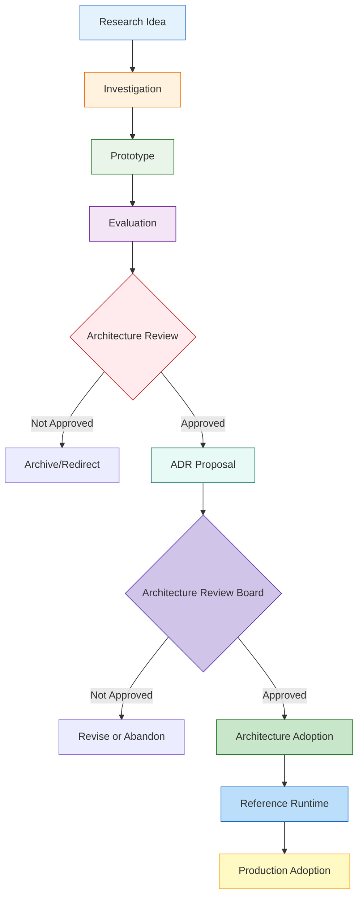

# AI-OS Future Research Agenda

## 1. Introduction

### Purpose
This document serves as the authoritative research agenda for AI-OS, documenting potential future directions that may influence the evolution of the system after the current Architecture Specification (Parts 1-15) has been frozen. It provides a structured framework for investigating, evaluating, and potentially adopting new technologies, methodologies, and architectural concepts.

### Scope
This document covers all research areas that may impact future versions of AI-OS, including but not limited to AI research, memory systems, runtime architectures, validation approaches, governance models, ecosystem developments, and emerging technologies. It does not include committed architectural changes or implementation details for the current frozen specification.

### Audience
This document is intended for:
- AI-OS architects and developers
- Technology officers making long-term technology decisions
- Researchers and contributors interested in AI-OS evolution
- Architecture Review Board members evaluating research proposals
- Council participants involved in governance decisions
- System integrators planning for future adoption

### Relationship to the Architecture Specification
The AI-OS Architecture Specification (Parts 1-15) represents the current frozen state of the system. Research documented in this file does not imply architectural commitment. Any research findings that lead to proposed architectural changes must undergo formal Architecture Decision Record (ADR) review and approval before being considered for adoption.

### Relationship to ROADMAP.md
While ROADMAP.md outlines planned near-term feature development and milestones for the current architecture, this research agenda focuses on longer-term, exploratory investigations that may inform future roadmap iterations after proper evaluation and ADR processes.

### Relationship to ARCHITECTURE_EVOLUTION.md
ARCHITECTURE_EVOLUTION.md documents the historical evolution and proven architectural changes that have been adopted into AI-OS. This research agenda precedes that evolution, representing potential future directions that have not yet been validated or adopted.

### Relationship to ARCHITECTURE_DECISIONS.md
ARCHITECTURE_DECISIONS.md contains approved Architecture Decision Records that have modified the architecture over time. Research topics from this agenda may eventually become the subject of ADRs, but only after rigorous evaluation and Architecture Review Board approval.

**Important:** Research does not imply architectural commitment. Research exists to evaluate future possibilities. Architecture changes require ADR approval.

## 2. Research Philosophy

AI-OS research follows a principled approach to ensure that exploration serves the long-term health and effectiveness of the system:

- **Evidence-driven evolution**: Research hypotheses must be tested with empirical evidence before consideration for architectural adoption
- **Research before architecture**: Architectural changes should be preceded by thorough research to understand implications
- **Experimentation before standardization**: Concepts should be prototyped and evaluated in controlled environments before widespread adoption
- **Validation before adoption**: Any research outcome must undergo rigorous validation including security, performance, and maintainability assessments
- **Architecture stability**: Research should respect the need for a stable foundation while exploring evolution paths
- **Long-term maintainability**: Research outcomes should be evaluated for their impact on long-term system maintainability
- **Technology neutrality**: Research should avoid vendor lock-in and maintain openness to diverse technological approaches

## 3. AI Research

The following AI research areas are potential topics for investigation. These are presented as research areas only and do not represent planned or committed features:

- **Long-horizon planning**: Investigation of AI systems capable of formulating and executing plans over extended time horizons with intermediate goals
- **Autonomous engineering**: Research into AI systems that can independently perform software engineering tasks from requirements to deployment
- **Multi-agent systems**: Study of coordinated AI agent teams with specialized roles, communication protocols, and conflict resolution mechanisms
- **Self-reflection**: Exploration of AI systems that can analyze their own reasoning processes, identify biases, and improve their cognitive strategies
- **Self-improvement**: Investigation of mechanisms by which AI systems can enhance their own capabilities through learning and adaptation
- **AI reasoning**: Research into diverse reasoning paradigms including symbolic, neural, hybrid, and probabilistic approaches
- **Planning algorithms**: Study of novel algorithms for task and motion planning in complex, uncertain environments
- **Goal decomposition**: Research into methods for breaking down high-level objectives into achievable subtasks
- **Agent collaboration**: Investigation of protocols and mechanisms for effective knowledge sharing and task division among AI agents
- **Human-AI collaboration**: Research into interfaces, trust models, and interaction patterns for effective human-AI teamwork

## 4. Memory Research

The following memory research areas are potential topics for investigation:

- **Long-term memory**: Study of mechanisms for retaining and accessing information over extended periods beyond immediate context windows
- **Episodic memory**: Research into storage and retrieval of specific experiences and events with temporal context
- **Semantic memory**: Investigation of organized knowledge structures representing facts, concepts, and relationships
- **Memory compression**: Exploration of techniques to efficiently store and retrieve large volumes of memory information
- **Knowledge evolution**: Study of how organizational knowledge changes over time and mechanisms to track and adapt to these changes
- **Knowledge graphs**: Research into graph-based representations of interconnected information and inference mechanisms
- **Retrieval optimization**: Investigation of efficient methods for accessing relevant information from large memory stores
- **Context scaling**: Study of approaches to manage and utilize increasingly large context windows effectively
- **Organizational memory**: Research into collective memory systems that persist across team members and time

## 5. Runtime Research

The following runtime research areas are potential topics for investigation:

- **Distributed runtimes**: Study of execution models spanning multiple physical or logical nodes with consistency guarantees
- **Edge execution**: Research into deploying AI-OS components closer to data sources or end-users for reduced latency
- **Federated execution**: Investigation of training and execution paradigms where data remains localized while model benefits are shared
- **Deterministic replay**: Exploration of systems capable of precisely reproducing past executions for debugging and verification
- **Runtime optimization**: Study of dynamic optimization techniques for improving execution efficiency based on observed patterns
- **Scheduling**: Research into intelligent scheduling algorithms for resource allocation among competing AI workloads
- **Resource allocation**: Investigation of mechanisms for fair and efficient distribution of computational resources
- **Execution models**: Exploration of alternative paradigms for AI agent execution beyond traditional request-response models

## 6. Validation Research

The following validation research areas are potential topics for investigation:

- **Formal verification**: Study of mathematically rigorous methods for proving system properties and correctness
- **AI-generated proofs**: Research into using AI systems to assist in generating and verifying mathematical proofs
- **Specification verification**: Investigation of automated methods for checking implementation adherence to formal specifications
- **Safety validation**: Exploration of comprehensive approaches to ensuring AI systems operate within defined safety boundaries
- **Trust validation**: Study of mechanisms for establishing and maintaining trust in AI system behaviors and decisions
- **Automated conformance**: Research into continuous automated checking of regulatory and standards compliance
- **Explainability**: Investigation of methods for making AI system decisions comprehensible to human stakeholders

## 7. Governance Research

The following governance research areas are potential topics for investigation:

- **Constitutional AI**: Study of embedding operational principles and values directly into AI system training and operation
- **Automated governance**: Investigation of AI-mediated systems for monitoring and enforcing organizational policies
- **AI policy reasoning**: Research into AI systems capable of understanding, interpreting, and applying complex policy documents
- **Collective decision systems**: Study of mechanisms for group decision-making involving both human and AI participants
- **Advanced Council models**: Exploration of enhanced governance structures for AI-OS beyond baseline Council implementations
- **Governance metrics**: Investigation of quantitative and qualitative measures for assessing governance effectiveness

## 8. Ecosystem Research

The following ecosystem research areas are potential topics for investigation:

- **Skills marketplaces**: Study of mechanisms for discovering, evaluating, and exchanging AI capabilities as modular components
- **MCP federation**: Research into interconnected networks of Model Context Protocol servers enabling broader resource sharing
- **Repository federation**: Investigation of distributed systems for managing AI-OS repositories across organizational boundaries
- **Plugin ecosystems**: Research into sustainable models for third-party extension development and distribution
- **Community governance**: Exploration of models for open-source community self-governance and conflict resolution
- **Standardization**: Study of processes for establishing de facto or de jure standards within the AI-OS ecosystem

## 9. Emerging Technologies

The following areas describe potential future relevance without recommending adoption. Discussion remains technology-neutral and exploratory:

- **New foundation models**: Investigation of novel AI model architectures beyond current transformer-based approaches
- **Specialized AI hardware**: Research into performance implications of executing AI-OS on AI-optimized processors
- **Distributed inference**: Study of splitting model computation across multiple devices for improved efficiency or privacy
- **On-device AI**: Research into running complete AI-OS stacks on consumer-grade devices with constrained resources
- **Quantum computing**: Exploration of potential applications of quantum computing principles to AI orchestration problems
- **Neuromorphic computing**: Investigation of brain-inspired computing architectures for AI implementation
- **New interoperability standards**: Study of emerging protocols for AI system communication beyond current MCP approaches

## 10. Research Evaluation Framework

Research ideas should be evaluated using the following criteria to determine their potential for architectural influence:

- **Architectural alignment**: How well does the research align with AI-OS architectural principles and long-term vision?
- **Technical feasibility**: What is the current state of technology and expertise required to implement findings?
- **Security impact**: How might adoption affect the system's security profile and attack surface?
- **Governance impact**: What implications does the research have for AI-OS governance models and Council functions?
- **Maintainability**: How would adoption affect long-term code complexity, documentation burden, and debugging difficulty?
- **Complexity**: What is the inherent complexity of the concept and its implementation overhead?
- **Long-term value**: What enduring benefits might the research provide beyond immediate problem-solving?
- **Community benefit**: How might the research contribute to the broader AI-OS ecosystem and community?

## 11. Research Lifecycle

Research in AI-OS follows a structured lifecycle from initial idea to potential production adoption:

### Phase Descriptions:

**Research Idea**: Initial concept identification from community, research literature, or internal innovation

**Investigation**: Literature review, feasibility studies, and preliminary analysis to understand scope and challenges

**Prototype**: Implementation of experimental prototypes to validate core concepts in controlled environments

**Evaluation**: Systematic assessment against the research evaluation framework including performance, security, and maintainability testing

**Architecture Review**: Preliminary review by architecture specialists to identify potential conflicts with frozen specifications

**ADR Proposal**: Formal Architecture Decision Record documenting proposed changes, rationale, and migration paths

**Architecture Review Board**: Formal evaluation by the Architecture Review Board against architecture principles and stakeholder impact

**Architecture Adoption**: Official incorporation of approved changes into the Architecture Specification

**Reference Runtime**: Implementation and testing of the changes in a reference implementation environment

**Production Adoption**: Gradual rollout to production systems with monitoring and feedback mechanisms

## 12. Research Governance

Research in AI-OS is governed through a collaborative process involving multiple stakeholders:

### Architecture Review Board Responsibilities
- Evaluate research proposals for architectural compatibility and long-term viability
- Assess alignment with AI-OS principles and frozen specification constraints
- Review potential security, performance, and maintainability implications
- Provide guidance on research direction and evaluation criteria
- Approve or reject ADR proposals based on comprehensive evaluation

### Council Involvement
- Councils provide domain-specific perspectives on research implications for their areas of responsibility
- Participate in evaluation of research affecting council functions and governance models
- Contribute to identification of research priorities based on operational experience
- Review research findings for potential impact on council operations and decision-making

### Community Participation
- Open invitation for community members to propose research ideas and participate in investigations
- Transparent sharing of research findings and methodologies
- Community feedback mechanisms for evaluating potential benefits and concerns
- Recognition of significant research contributions through appropriate channels

### Decision Criteria
Research proposals are evaluated based on:
- Scientific merit and methodological rigor
- Potential benefit to AI-OS capabilities and ecosystem
- Compatibility with architectural principles and frozen specification
- Resource requirements and opportunity costs
- Risk assessment including security, stability, and maintainability factors
- Alignment with long-term AI-OS vision and roadmap

### Documentation Requirements
All research activities must maintain appropriate documentation including:
- Research hypotheses and objectives
- Methodology and experimental design
- Results, including negative findings and limitations
- Evaluation against the research evaluation framework
- Conclusions and recommendations for future work
- Proper attribution of sources and prior work

### ADR Requirements
When research leads to proposed architectural changes, the following ADR elements are required:
- Clear statement of the problem being addressed
- Detailed description of the proposed solution
- Analysis of alternatives considered and rejected
- Discussion of consequences including short-term and long-term impacts
- Migration strategy for existing systems if applicable
- Assessment of impact on frozen specifications and related documents
- Implementation complexity estimate and resource requirements
- References to supporting research and validation evidence

## 13. Research Backlog

The following represents categorized examples of future investigation topics. These are not prioritized and do not imply commitment.

### AI Research Backlog
- Hierarchical task network planning for complex AI-OS workflows
- Neuro-symbolic approaches combining neural networks with symbolic reasoning
- Federated learning approaches for privacy-preserving AI skill development
- Meta-learning techniques for rapid adaptation to new AI-OS domains
- Multi-modal reasoning integrating text, code, and structured data
- Causal reasoning approaches for understanding intervention effects
- Uncertainty quantification in AI-OS decision-making processes
- Continual learning mechanisms to prevent catastrophic forgetting
- Explainable AI techniques tailored to AI-OS operational contexts
- AI alignment research focusing on AI-OS specific value specifications

### Memory Research Backlog
- Hierarchical memory systems with different access times and capacities
- Semantic memory networks with dynamic relationship strengthening/weakening
- Episodic memory tagging and retrieval based on contextual similarity
- Memory consolidation techniques inspired by biological sleep processes
- Associative memory implementations for rapid pattern completion
- Working memory models with attentional gating mechanisms
- Memory interference models and mitigation strategies
- Distributed memory systems with consistency guarantees
- Memory-based attention mechanisms for enhanced context utilization
- Forgetting mechanisms inspired by adaptive memory theories

### Runtime Research Backlog
- Actor-model based execution environments for AI-OS agents
- Event-driven architectures with guaranteed ordering properties
- Spatial computing models for geographically distributed AI-OS deployments
- Temporal database approaches for time-travel debugging capabilities
- Serverless execution models with automatic scaling to zero
- Edge-optimized runtimes with disconnected operation capabilities
- Deterministic execution environments for reproducible research
- Programmable interrupt handling for real-time AI-OS responses
- Energy-aware scheduling for battery-operated deployments
- Hardware-accelerated execution paths for specific AI workloads

### Validation Research Backlog
- Property-based testing frameworks for AI-OS component validation
- Model checking approaches for finite-state AI-OS behaviors
- Deductive verification systems for critical AI-OS components
- Runtime monitoring with formal specification checking
- Mutation testing approaches for AI-OS test suite evaluation
- Fuzz testing frameworks with AI-guided test generation
- Statistical validation methods for probabilistic AI-OS behaviors
- Comparative validation between alternative AI-OS implementations
- Continuous validation pipelines integrated with development workflows
- Validation approaches for emergent AI-OS system properties

### Governance Research Backlog
- Liquid democracy models for adaptive AI-OS governance
- Reputation-based systems for measuring contributor trustworthiness
- AI-assisted governance with human-in-the-loop oversight
- Market-based resource allocation mechanisms for AI-OS services
- Constitutional specifications with hierarchical principle override mechanisms
- Transparency reporting systems for AI-OS decision justification
- Dispute resolution mechanisms for AI-OS governance conflicts
- Adaptive governance models that evolve with organizational scale
- Cross-jurisdictional governance models for international deployments
- Gamification approaches to encourage productive community participation

### Ecosystem Research Backlog
- Decentralized skill discovery using distributed hash tables
- Curated skill marketplaces with quality assurance mechanisms
- Interoperability standards for AI-OS skills across implementation languages
- Skill versioning and dependency management systems
- Repository mesh architectures for resilient code sharing
- Federated identity systems for cross-repository authentication
- Economic models for sustainable open-source AI-OS development
- Standardized interfaces for AI-OS hardware acceleration
- Plugin sandboxing mechanisms with configurable security policies
- Community moderation systems with scalable dispute resolution

### Emerging Technologies Backlog
- Photonic computing approaches for AI acceleration
- Neuromorphic chips implementing spiking neural networks
- Quantum machine learning algorithms for optimization problems
- DNA-based storage systems for archival AI-OS knowledge
- Edge AI processors with integrated security enclaves
- Edgeless computing models blurring device/cloud boundaries
- Edgeless computing models blurring device/cloud boundaries
- Bio-inspired computing approaches for resilient AI systems
- Optical interconnect technologies for high-bandwidth AI communication
- Post-quantum cryptography implementations for AI-OS security

## 14. Risks

Research in AI-OS must be conducted with awareness of potential risks:

- **Technology hype**: Risk of overvaluing immature technologies based on publicity rather than substance
  - Mitigation: Rigorous evaluation criteria, requirement for empirical evidence, skepticism toward extraordinary claims
  
- **Vendor lock-in**: Risk of creating dependencies on proprietary technologies that limit future options
  - Mitigation: Technology neutrality principle, preference for open standards, avoidance of single-vendor solutions
  
- **Research bias**: Risk of favoring familiar approaches or confirming pre-existing beliefs
  - Mitigation: Diverse review panels, blind evaluation where possible, active solicitation of contrary evidence
  
- **Over-engineering**: Risk of implementing solutions more complex than necessary for actual needs
  - Mitigation: Occam's razor principle, focus on minimal viable solutions, regular simplicity reviews
  
- **Architectural instability**: Risk of frequent changes preventing organizational learning and predictability
  - Mitigation: Strong bias toward stability, high threshold for architectural changes, long evaluation periods
  
- **Complexity growth**: Risk of accumulated research outcomes increasing system complexity beyond manageable levels
  - Mitigation: Complexity budgeting, sunset provisions for underused features, regular complexity audits
  
- **False positives**: Risk of adopting research findings that don't deliver expected benefits in practice
  - Mitigation: Pilot programs before wide adoption, measurable success criteria, exit strategies for failed experiments
  
- **Opportunity cost**: Risk of diverting resources from proven improvements to speculative research
  - Mitigation: Portfolio approach balancing exploration and exploitation, time-boxed research investments
  
- **Security vulnerabilities**: Risk of introducing new attack surfaces through research adoption
  - Mitigation: Mandatory security review for all research proposals, threat modeling, penetration testing
  
- **Community fragmentation**: Risk of research directions splitting community along technical lines
  - Mitigation: Transparent research processes, backward compatibility requirements, migration assistance
  
- **Regulatory compliance**: Risk of research outcomes creating compliance challenges
  - Mitigation: Early engagement with compliance experts, regulatory impact assessment, jurisdiction-specific evaluations

## 15. Success Metrics

AI-OS measures successful research through multiple complementary metrics:

### Direct Research Metrics
- **Publication quality**: Peer-reviewed publications in reputable venues
- **Reproducibility**: Ability of other researchers to replicate findings
- **Citation impact**: Influence on subsequent research in the field
- **Prototype maturity**: Technical readiness level of research implementations

### Architectural Impact Metrics
- **ADR conversion rate**: Percentage of researched proposals that lead to approved architecture changes
- **Architectural alignment score**: Evaluation of how well adopted research aligns with architectural principles
- **Backward compatibility preservation**: Maintenance of compatibility with existing systems and interfaces
- **Specification clarity improvement**: Enhancement to the precision and usability of the Architecture Specification

### System Quality Metrics
- **Performance improvement**: Measurable gains in throughput, latency, or resource efficiency
- **Security enhancement**: Reduction in vulnerabilities or improvement in security posture
- **Reliability increase**: Decrease in failure rates or improvement in fault tolerance
- **Maintainability improvement**: Reduction in technical debt or improvement in code health metrics

### Ecosystem Impact Metrics
- **Adoption rate**: Percentage of AI-OS implementations adopting research outcomes
- **Community contribution increase**: Growth in external contributions following research adoption
- **Ecosystem expansion**: Increase in third-party tools, libraries, or services built on research outcomes
- **Cross-organization reuse**: Adoption of research outcomes by multiple independent organizations

### Long-term Value Metrics
- **Technical relevance duration**: Time period during which research outcomes remain valuable
- **Foundation for future research**: Extent to which outcomes enable subsequent valuable research
- **Problem resolution durability**: Longevity of solutions to the problems research aimed to solve
- **Strategic positioning improvement**: Enhancement to AI-OS's long-term competitive and collaborative position

## 16. Cross References

This research agenda relates to and should be read in conjunction with the following documents:

- **AI_OS_MASTER_CONTEXT.md**: Provides the overarching context for AI-OS architecture and evolution
- **ROADMAP.md**: Outlines near-term planned development that may be influenced by research outcomes
- **ARCHITECTURE_EVOLUTION.md**: Documents how past research has led to adopted architectural changes
- **ARCHITECTURE_DECISIONS.md**: Contains approved ADRs that may have originated from research agenda items
- **ENGINEERING_PRINCIPLES.md**: Establishes the engineering principles that research must respect
- **AI_AGENCY.md**: Defines the agency model that AI research may enhance or extend
- **MEMORY_ARCHITECTURE.md**: Describes current memory systems that memory research may evolve
- **VALIDATION_ARCHITECTURE.md**: Details current validation approaches that validation research may improve
- **MCP_ECOSYSTEM.md**: Documents the current MCP ecosystem that ecosystem research may expand
- **SKILLS_ECOSYSTEM.md**: Describes the current skills ecosystem that skills marketplace research may enhance
- **IMPLEMENTATION_GUIDE.md**: Provides implementation guidance that should remain consistent with research outcomes

*This document represents the definitive AI-OS Research Agenda and Future Investigation Handbook. It serves to ensure that AI-OS evolves through principled, evidence-based investigation rather than opportunistic adoption, maintaining architectural integrity while enabling beneficial innovation.*