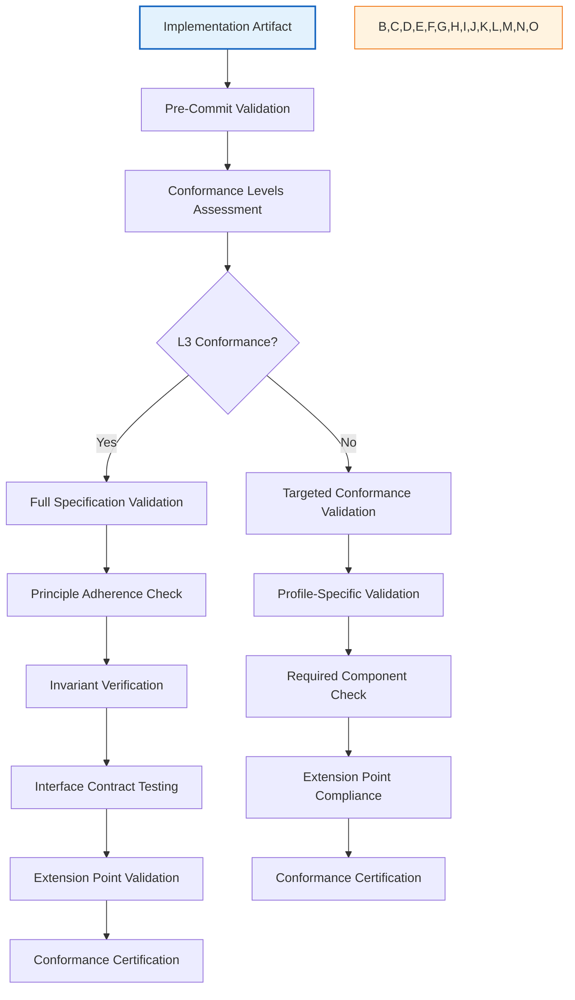
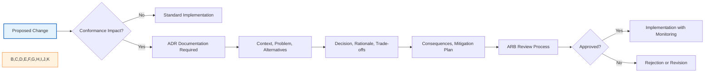
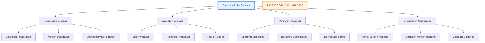
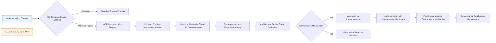
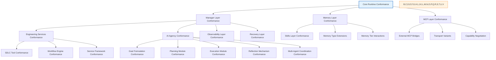

# AI-OS Architecture Conformance Guide

## 1. Introduction

### Purpose
This document provides architecture conformance guidance for ensuring implementations remain compliant with the AI-OS Architecture Specification (Parts 1-15). It explains how to implement systems without violating architectural constraints, principles, and invariants while maintaining technology and implementation neutrality.

### Scope
This guide covers conformance considerations for all layers of the AI-OS architecture, defining what implementations MUST, MUST NOT, SHOULD, and MAY do to remain architecturally compliant. It does not specify particular technologies, frameworks, languages, infrastructure choices, or implementation approaches.

### Audience
- Software architects responsible for ensuring AI-OS conformance in system designs
- Lead engineers verifying AI-OS based implementations maintain architectural integrity
- Technical leads conducting architecture compliance reviews
- Auditors validating conformance to AI-OS architectural requirements
- Architecture Review Board members evaluating extension proposals

### Relationship to the Architecture Specification
This document owns architecture conformance guidance only. The AI-OS Architecture Specification (Parts 1-15) remains the authoritative, frozen source for architectural requirements, constraints, and invariants. This guide explains how to achieve and maintain conformance without duplicating, redefining, or contradicting the specification.

## 2. Conformance Philosophy

### Architecture Defines What, Conformance Defines How-Not-To-Violate
The AI-OS Architecture Specification defines WHAT a compliant system must be (normative requirements). This guide explains HOW TO IMPLEMENT WITHOUT VIOLATING THE ARCHITECTURE by defining implementation boundaries and constraints.

### Specification Adherence Over Implementation Preferences
Conformance decisions must derive from architectural requirements rather than implementation conveniences, team familiarity, or technological preferences. The architecture defines the structural boundary; conformance operates within those boundaries.

### Principle-First Conformance
Before assessing any implementation aspect, engineers must consult the relevant AI-OS Architecture Specification parts, Engineering Principles, and established architectural invariants. Conformance evaluation proceeds from validated requirements, not assumed acceptability.

### Conformance as Boundary Maintenance
Technology choices serve architectural goals within defined boundaries. When multiple approaches satisfy architectural requirements within conformance boundaries, teams may select based on contextual factors, but never by violating architectural constraints or invariants.

## 3. Reference Runtime and Conformance Relationships

### Hermes as Reference Runtime
Hermes serves as the reference implementation demonstrating one valid approach to achieving AI-OS Architecture Specification conformance. It illustrates conformant implementation approaches but does not define the only conformant implementation.

### Architecture-to-Conformance Relationship
```
Architecture Specification → Reference Runtime → Production Implementation
```
- **Architecture Specification (Frozen Parts 1-15)**: Defines WHAT the system MUST be (normative requirements)
- **Reference Runtime (Hermes)**: Demonstrates HOW TO ACHIEVE conformance through one valid approach
- **Production Implementation**: ANY approach that maintains specification conformance within defined boundaries

### Conformance Boundary Model
Implementations achieve conformance by operating within the architectural boundary defined by:
- **MUST**: Non-negotiable requirements from Architecture Specification
- **MUST NOT**: Prohibited modifications that violate invariants or constraints
- **SHOULD**: Recommended approaches that support conformance maintenance
- **MAY**: Permitted variations within conformance boundaries

All production implementations MUST pass the AI-OS conformance validation suite regardless of technology stack or implementation approach.

## 4. Conformance Model

### Mandatory Conformance Requirements
All AI-OS implementations MUST implement and maintain:
- Core runtime mechanisms specified in Parts 1-5 (invariants, constraints, contracts)
- Manager interfaces defined in Parts 6-8 (service contracts, API contracts)
- Memory architecture contracts in Parts 9-10 (tier contracts, interaction protocols)
- AI agency fundamentals in Parts 11-12 (goal formulation, planning, execution, reflection)
- MCP connectivity framework in Parts 13-14 (transport abstraction, message formats, security)
- Observability and recovery mechanisms in Part 15 (telemetry contracts, recovery guarantees)

### Optional Conformance Elements
Optional components that MAY be implemented while maintaining conformance:
- Specific manager implementations (provided they conform to interface contracts)
- Extended memory types (provided they follow memory tier contracts)
- Specialized AI agency modules (provided they conform to agency fundamentals)
- Domain-specific skill libraries (provided they follow skill ecosystem contracts)
- Additional MCP transports (provided they conform to MCP framework requirements)

Implementers MAY omit optional components if not required for their use case while maintaining base conformance.

### Extension Point Conformance
Defined extension points allow adding functionality without breaking conformance WHEN:
- Memory type registration follows registration contracts and invariants
- Skill namespace registration follows skill ecosystem contracts
- MCP capability negotiation follows MCP framework specifications
- Manager plugin interfaces conform to manager service contracts
- Observability sink configuration follows observability contracts
- Recovery policy hooks follow recovery mechanism contracts

Extensions MUST NOT modify core invariant enforcement, constraint definitions, or fundamental architectural guarantees.

### Conformance Profiles
Implementation profiles define subsets of AI-OS functionality for specific domains while maintaining base conformance:
- **Embedded AI-OS Profile**: Minimal footprint implementation maintaining core runtime and essential manager conformance
- **Enterprise AI-OS Profile**: Full management suite implementation maintaining all mandatory conformance requirements
- **Research AI-OS Profile**: Experimental features implementation maintaining core conformance with defined extension points
- **Edge AI-OS Profile**: Constrained environment implementation maintaining core conformance with optimization boundaries

Profiles specify which mandatory components are REQUIRED for profile conformance and which optional components are RECOMMENDED.

### Compliance Validation
Conformance is validated through:
- Architecture specification compliance testing (Parts 1-15)
- Invariant verification under normal and stress conditions
- Interface contract validation (all manager and service APIs)
- Extension point compliance checking (registration and invocation contracts)
- Profile-specific requirement verification (when profiles are claimed)
- Principle adherence validation (Engineering Principles document)

## 5. Conformance Boundaries by Layer

### Core Runtime Conformance Boundary
The core runtime MUST maintain:
- **MUST**: Process lifecycle management per Part 2 invariants
- **MUST**: Memory allocation and isolation per Part 3 constraints
- **MUST**: Low-level IPC mechanisms per Part 4 communication contracts
- **MUST**: Resource scheduling and quotas per Part 5 enforcement mechanisms
- **MUST NOT**: Contain domain logic (violates Kernel as Pure Orchestrator principle)
- **MUST NOT**: Modify EventBus interface or immortal event contracts
- **SHOULD**: Provide deterministic initialization and shutdown sequences
- **MAY**: Vary internal implementation algorithms within interface contracts

### Manager Layer Conformance Boundary
Manager implementations MUST maintain:
- **MUST**: Implementation of BaseService contracts per Part 4
- **MUST**: Declaration of dependencies through `depends_on` arrays
- **MUST**: Event-driven communication only (no direct service-to-service calls)
- **MUST**: Resource quota enforcement through ResourceManager mediation
- **MUST NOT**: Access kernel internals beyond defined accessor interfaces
- **MUST NOT**: Contain business logic in Capability Facade Services
- **SHOULD**: Implement predictable lifecycles and error handling through events
- **MAY**: Vary internal resource management algorithms within quota contracts

### Engineering Services Conformance Boundary
Engineering services MUST maintain:
- **MUST**: Clear ownership and responsibility boundaries per Part 5-6
- **MUST**: Event-driven communication through EventBus only
- **MUST**: Validation-first execution per Part 11 requirements
- **MUST**: Observable state and behavior through standardized interfaces
- **MUST NOT**: Embed persistent state in service components
- **MUST NOT**: Access kernel internals beyond defined manager interfaces
- **SHOULD**: Implement composability through defined extension points
- **MAY**: Vary internal implementation approaches within service contracts

### AI Agency Conformance Boundary
AI agency implementations MUST maintain:
- **MUST**: Goal formulation acceptance and prioritization per Part 11
- **MUST**: Planning module generation of executable plans per Part 11
- **MUST**: Execution module plan carrying with monitoring per Part 12
- **MUST**: Reflection mechanism learning from outcomes per Part 12
- **MUST**: Multi-agent coordination protocols per Part 12
- **MUST NOT**: Operate without human oversight mechanisms (Council, FinalJudge)
- **MUST NOT**: Violate resource quota enforcement through ResourceManager
- **SHOULD**: Implement transparent reasoning and traceability mechanisms
- **MAY**: Vary planning algorithms and learning approaches within agency contracts

### Memory Layer Conformance Boundary
Memory implementations MUST maintain:
- **MUST**: Working memory as fast, short-term storage per Part 9
- **MUST**: Episodic memory as timestamped event storage per Part 9
- **MUST**: Semantic memory as structured knowledge storage per Part 10
- **MUST**: Procedural memory as executable skill storage per Part 10
- **MUST**: Memory tier interaction contracts per Parts 9-10
- **MUST NOT**: Violate memory scoping and access controls
- **MUST NOT**: Allow cross-tier contamination without explicit contracts
- **SHOULD**: Implement deterministic memory operations where possible
- **MAY**: Vary storage technologies and access patterns within tier contracts

### Skills Layer Conformance Boundary
Skills implementations MUST maintain:
- **MUST**: Skill discovery mechanism availability via MCP per Part 9
- **MUST**: Skill execution sandboxing enforcement per Part 10
- **MUST**: Skill composition and chaining support per Part 10
- **MUST**: Skill versioning and compatibility maintenance per Part 10
- **MUST**: Skill metadata including documentation and requirements per Part 10
- **MUST NOT**: Access kernel internals or service logic directly
- **MUST NOT**: Violate capability mediation through CapabilityManager
- **SHOULD**: Implement versioned extension points with backward compatibility
- **MAY**: Vary skill implementations and domains within ecosystem contracts

### MCP Layer Conformance Boundary
MCP implementations MUST maintain:
- **MUST**: Transport layer abstraction per Part 13
- **MUST**: Message framing and serialization per Part 13 specification
- **MUST**: Capability negotiation protocol functionality per Part 14
- **MUST**: Security and authentication mechanisms per Part 14 requirements
- **MUST**: Error handling and recovery per Part 14 specification
- **MUST NOT**: Modify core MCP message formats or security requirements
- **MUST NOT**: Bypass capability negotiation or authorization checks
- **SHOULD**: Implement standardized transports with capability composition
- **MAY**: Vary transport technologies within abstraction contracts

### Observability Layer Conformance Boundary
Observability implementations MUST maintain:
- **MUST**: Metrics collection and endpoint exposure per Part 15
- **MUST**: Distributed tracing context propagation per Part 15
- **MUST**: Logging infrastructure with structured formats per Part 15
- **MUST**: Health check endpoints for all services per Part 15
- **MUST**: Alerting interface for anomaly detection per Part 15
- **MUST NOT**: Modify core observability contracts or telemetry requirements
- **MUST NOT**: Create hidden dependencies between observability and kernel
- **SHOULD**: Implement comprehensive health monitoring and failure detection
- **MAY**: Vary observability backends and aggregation approaches within contracts

### Recovery Layer Conformance Boundary
Recovery implementations MUST maintain:
- **MUST**: Checkpointing mechanism for critical state per Part 15
- **MUST**: Circuit breaker patterns for external dependencies per Part 15
- **MUST**: Graceful degradation under partial failure per Part 15
- **MUST**: Backup and restore procedures per Part 15 requirements
- **MUST**: Failure injection testing capability per Part 15
- **MUST NOT**: Modify core recovery contracts or guarantees
- **MUST NOT**: Create single points of failure in critical recovery paths
- **SHOULD**: Implement deterministic recovery procedures with validation
- **MAY**: Vary recovery algorithms and approaches within recovery contracts

## 6. Architecture Conformance Checklist

This checklist defines the objective criteria for determining AI-OS Architecture Specification conformance. Each item MUST be satisfied for baseline conformance.

### Core Runtime Conformance
| Requirement | Specification Reference | Conformance criterion |
|-------------|------------------------|------------------------|
| [ ] Kernel contains exactly 4 Core Components | Part 1.1 | EventBus, StateManager, WorkflowManager, ResourceManager only |
| [ ] Kernel owns exactly 9 Core Managers | Part 1.2 | MemoryManager, ModelRouter, ToolManager, StorageManager, ContextManager, AgentManager, RetryManager, CheckpointManager, RootCauseManager |
| [ ] EventBus as sole communication mechanism | Part 2.1, ADR 001 | No direct service-to-service calls post-initialization |
| [ ] Immutable events with correlation/causation | Part 2.2-2.3, ADR 008 | All events structurally immutable with UUID v4 correlation_id and causation_id |
| [ ] Four-layer configuration merge | Part 8.1-8.2 | Defaults → app.yaml → env.yaml → env vars with proper override precedence |
| [ ] Services extend BaseService | Part 4.1-4.3 | All services declare depends_on, subscribe in on_start(), emit typed outputs |
| [ ] Deterministic lifecycle management | Part 1.3-1.4, ADR 004 | Predictable initialization/shutdown based on depends_on and phase sequencing |
| [ ] Resource quota enforcement | Part 1.5, Part 3.3 | Hard limits preventing exhaustion, soft limits providing warnings |

### Manager Layer Conformance
| Requirement | Specification Reference | Conformance criterion |
|-------------|------------------------|------------------------|
| [ ] Resource Manager implements quotas | Part 6.1-6.3 | CPU, memory, token, tool quotas with enforcement and notifications |
| [ ] Configuration Manager supports dynamics | Part 7.1-7.3 | Runtime updates, feature flags, schema validation, environment override |
| [ ] Security Manager provides mediation | Part 8.1-8.4 | Least privilege access, authorization checks, audit logging, policy enforcement |
| [ ] Health Manager exposes system state | Part 8.5-8.7 | Health metrics, failure detection, degradation signals, monitoring interfaces |
| [ ] Deployment Manager handles lifecycles | Part 8.8-8.10 | Service installation, updates, rollbacks, version management, dependency resolution |
| [ ] All managers extend BaseService | Part 4.1-4.3 | Lifecycle management, dependency declaration, event-driven communication |
| [ ] Managers use CapabilityManager mediation | Part 3.2-3.4 | All capability access routed through CapabilityManager with permission checks |
| [ ] Manager contracts maintain backward compatibility | Part 0, ADR 011 | Within major versions, breaking changes require major version bump |

### Memory Layer Conformance
| Requirement | Specification Reference | Conformance criterion |
|-------------|------------------------|------------------------|
| [ ] Working memory provides fast access | Part 9.1-9.2 | Short-term storage with minimal latency access patterns |
| [ ] Episodic memory stores contextual events | Part 9.3-9.4 | Timestamped events with workflow/context correlation |
| [ ] Semantic memory stores structured knowledge | Part 10.1-10.2 | Relational knowledge with query capabilities and inference |
| [ ] Procedural memory stores executable skills | Part 10.3-10.4 | Versioned skill storage with execution sandboxing |
| [ ] Memory tier interactions follow contracts | Part 9.5-9.6, Part 10.5 | Defined transfer protocols between tiers with validation |
| [ ] MemoryManager enforces scoping and access | Part 3.1-3.2 | Isolation between memory tiers and agent contexts |
| [ ] Memory operations are observable | Part 10.3-10.4 | Metrics, tracing, and logging for all memory operations |
| [ ] Memory contracts maintain backward compatibility | Part 0, ADR 011 | Within major versions, tier contract changes require version bump |

### AI Agency Layer Conformance
| Requirement | Specification Reference | Conformance criterion |
|-------------|------------------------|------------------------|
| [ ] Goal formulation accepts objectives | Part 11.1-11.2 | Natural language goal intake with validation and prioritization |
| [ ] Planning generates executable plans | Part 11.3-11.4 | Decomposition into actionable, validated work items |
| [ ] Execution carries out plans with monitoring | Part 12.1-12.3 | Plan execution with intermediate validation and adaptation |
| [ ] Reflection learns from outcomes | Part 12.4-12.5 | Outcome analysis, principle extraction, knowledge consolidation |
| [ ] Multi-agent coordination protocols defined | Part 12.6-12.7 | Council mechanisms, negotiation, consensus algorithms |
| [ ] Agency respects resource quotas | Part 1.5, AI Agency doc | Automatic quota enforcement via ResourceManager mediation |
| [ ] Human oversight through Council/FinalJudge | Part 12.8-12.10, AI Agency doc | Governance checkpoints, veto/override capabilities, audit trails |
| [ ] Agency contracts maintain backward compatibility | Part 0, ADR 011 | Within major versions, agency interface changes require version bump |

### Skills Layer Conformance
| Requirement | Specification Reference | Conformance criterion |
|-------------|------------------------|------------------------|
| [ ] Skill discovery via MCP | Part 9.1-9.2, Part 13.1 | Registration, querying, and retrieval of available skills |
| [ ] Skill execution sandboxing | Part 10.1-10.3 | Permission profiles, resource limits, isolation boundaries |
| [ ] Skill composition and chaining | Part 9.3-9.4, Part 10.2 | Conditional workflows, data passing, composition rules |
| [ ] Skill versioning and compatibility | Part 9.5-9.6, Part 10.4 | Semantic versioning, backward compatibility, migration paths |
| [ ] Skill metadata includes requirements | Part 9.7-9.8, Part 10.5 | Documentation, dependencies, resource needs, compatibility |
| [ ] Skills use CapabilityManager mediation | Part 3.2-3.4 | All capability requests routed through CapabilityManager |
| [ ] Skills respect memory scoping | Part 3.1-3.2 | Access limited to authorized memory tiers and contexts |
| [ ] Skill contracts maintain backward compatibility | Part 0, ADR 011 | Within major versions, skill interface changes require version bump |

### MCP Layer Conformance
| Requirement | Specification Reference | Conformance criterion |
|-------------|------------------------|------------------------|
| [ ] Transport layer abstraction | Part 13.1-13.2 | Language-neutral interface for MCP communication |
| [ ] Message framing per specification | Part 13.3-13.4 | Defined message structure, headers, payload format |
| [ ] Capability negotiation functional | Part 14.1-14.3 | Exchange of supported versions, features, and limits |
| [ ] Security and authentication implemented | Part 14.4-14.6 | Authentication mechanisms, authorization checks, encryption |
| [ ] Error handling per specification | Part 14.7-14.9 | Failure detection, recovery procedures, error propagation |
| [ ] MCP respects capability mediation | Part 3.2-3.4 | All MCP access routed through CapabilityManager with checks |
| [ ] MCP uses EventBus internally | Part 2.1, Part 13.5 | Internal communication follows event-first principle |
| [ ] MCP contracts maintain backward compatibility | Part 0, ADR 011 | Within major versions, MCP interface changes require version bump |

### Observability Layer Conformance
| Requirement | Specification Reference | Conformance criterion |
|-------------|------------------------|------------------------|
| [ ] Metrics collection and exposure | Part 15.1-15.3 | Standardized metrics endpoints, collection protocols |
| [ ] Distributed tracing propagation | Part 15.4-15.6 | Context ID propagation, trace linking, export mechanisms |
| [ ] Logging infrastructure structured | Part 15.7-15.9 | Correlation IDs, structured formats, levels, aggregation |
| [ ] Health check endpoints for services | Part 15.10-15.12 | Liveness/readiness probes, dependency checks, status reporting |
| [ ] Alerting interface for anomalies | Part 15.13-15.15 | Threshold-based alerts, anomaly detection, notification |
| [ ] Observability respects kernel boundaries | Part 1.1-1.2, Part 2.1 | No kernel internals access, event-based communication only |
| [ ] Observability contracts maintain backward compatibility | Part 0, ADR 011 | Within major versions, observability changes require version bump |

### Recovery Layer Conformance
| Requirement | Specification Reference | Conformance criterion |
|-------------|------------------------|------------------------|
| [ ] Checkpointing for critical state | Part 15.1-15.3 | Deterministic state snapshots, restoration procedures |
| [ ] Circuit breaker patterns | Part 15.4-15.6 | Failure detection, timeout enforcement, fallback mechanisms |
| [ ] Graceful degradation under failure | Part 15.7-15.9 | Reduced functionality preservation, core orchestration maintenance |
| [ ] Backup and restore procedures | Part 15.10-15.12 | State preservation, recovery validation, integrity checks |
| [ ] Failure injection testing capability | Part 15.13-15.15 | Controlled failure scenarios, recovery validation, chaos testing |
| [ ] Recovery respects architectural boundaries | Part 1.1-1.2, Part 4.1 | No kernel logic modification, service contract adherence |
| [ ] Recovery contracts maintain backward compatibility | Part 0, ADR 011 | Within major versions, recovery changes require version bump |

### Cross-Cutting Conformance Requirements
| Requirement | Specification Reference | Conformance criterion |
|-------------|------------------------|------------------------|
| [ ] Architectural invariants maintained | Part 0, Section 12 | All 12 architectural invariants hold under normal operation |
| [ ] Principles documented in ENGINEERING_PRINCIPLES.md followed | Part 0, Section 12.12 | Principle adherence treated as conformance requirement |
| [ ] Extension point contracts respected | Part 0, Section 10, Part 9-13 | No access to non-extension points, version compliance |
| [ ] Technology-neutral specification compliance | Part 0, Section 12.10, Part 15 | Varying tech stacks while maintaining behavioral contracts |
| [ ] Validation evidence provided | Part 11, VALIDATION_ARCHITECTURE.md | Test results, audit trails, conformance test evidence |
| [ ] Documentation aligns with specification | DOCUMENTATION_PRINCIPLES.md | Architecture documentation treated as legal contract |

## 7. Conformance Validation Pipeline

### Validation Architecture Relationship
Conformance validation follows the AI-OS Validation Architecture (Part 11, VALIDATION_ARCHITECTURE.md) with these phases:



### Conformance Levels
AI-OS defines multiple conformance levels for appropriate rigor based on component criticality:

| Level | Scope | Validation Rigor | Use Case |
|-------|-------|------------------|----------|
| **L1** | Core lifecycle and basic EventBus functionality | Minimal validation | Infrastructure components, low-risk utilities |
| **L2** | Full Kernel and Core Manager compliance | Standard validation | Core services, platform foundations |
| **L3** | Engineering Services and Service Framework compliance | Rigorous validation | SDLC tools, engineering workflows |
| **L4** | Full specification compliance including all principles and invariants | Comprehensive validation | Mission-critical systems, reference implementations |

Implementations MUST claim the appropriate conformance level based on their function and risk profile.

### Architecture Decision Record Requirement
Any proposed change to implementation that MAY affect conformance MUST be documented in an Architecture Decision Record (ADR) per Part 0 and ENGINEERING_PRINCIPLES.md Section 22:



## 8. Extension Conformance Guidelines

### Extension Point Integrity
Extensions MUST maintain conformance by operating within defined extension point boundaries:



### Extension Conformance Requirements
All extensions MUST:
- Register through official extension point registration interfaces
- Declare compatibility with specific kernel/platform versions
- Invoke only through defined extension point interfaces
- Respect versioning contracts and deprecation policies
- Mediate all access through defined managers (CapabilityManager, MemoryManager, etc.)
- Maintain backward compatibility within major versions
- Provide clear migration paths for breaking changes
- Never access kernel internals or service logic directly
- Never violate architectural invariants or constraints
- Never create hidden dependencies between extension and core

Extensions MAY:
- Add new functionality within defined extension point boundaries
- Vary internal implementation approaches within interface contracts
- Optimize performance within resource quota constraints
- Implement domain-specific specializations within conformance boundaries
- Provide alternative implementations of optional components

## 9. Architecture Constraints and Invariants

### What Implementers MUST NOT Change
These architectural elements are FIXED and MUST NOT be modified in any conformant implementation:

| Constraint/Invariant | Specification Reference | Consequence of Violation |
|----------------------|------------------------|--------------------------|
| Exactly 4 Core Components | Part 1.1 | Kernel instability, orchestrator failure |
| Exactly 9 Core Managers | Part 1.2 | Manager lifecycle failure, dependency violation |
| EventBus as sole communication | Part 2.1, ADR 001 | Tight coupling, observability loss, failure propagation |
| Immutable events with correlation/causation | Part 2.2-2.3, ADR 008 | Audit trail compromise, replay impossibility, causal analysis failure |
| Four-layer configuration merge | Part 8.1-8.2 | Deployment rigidity, secret exposure, environment inconsistency |
| Services must extend BaseService | Part 4.1-4.3 | Lifecycle management failure, dependency violation, communication breakdown |
| Five-state FSM | Part 1.3 | Unpredictable system states, recovery failure, initialization hazards |
| Specification/implementation separation | Part 0, Section 9 | Technological lock-in, architecture erosion, compliance impossibility |
| Extension point governance | Part 0, Section 10, Part 9-13 | Kernel instability, extension fragility, compatibility loss |

### Architectural Invariants That MUST Be Maintained
These properties MUST always hold true in a conformant AI-OS system:

| Invariant | Specification Reference | Validation Method |
|-----------|------------------------|-------------------|
| Kernel stability and purity | Part 0, Section 12.1 | Kernel component count verification, domain logic absence testing |
| Observability through immutable events | Part 0, Section 12.2 | Event immutability verification, correlation/causation ID presence checking |
| Deterministic lifecycle management | Part 0, Section 12.3 | Initialization/shutdown sequence validation, dependency order testing |
| Strict resource quota enforcement | Part 0, Section 12.4 | Quota limit verification, exhaustion prevention testing, warning validation |
| Failure handling through events only | Part 0, Section 12.5 | Exception crossing boundary detection, failure event type validation |
| Human oversight through council governance | Part 0, Section 12.6 | Council mechanism testing, FinalJudge validation, oversight capability verification |
| Ecosystem compatibility through versioned contracts | Part 0, Section 12.7 | Extension version compatibility testing, contract adherence verification |
| Validation-first execution as foundational practice | Part 0, Section 12.8 | Pre/during/post-execution validation verification, validation evidence checking |
| Immutable event integrity for audit trails | Part 0, Section 12.9 | Event immutability persistence verification, long-term storage validation |
| Technology-neutral specification compliance | Part 0, Section 12.10 | Multi-stack conformance testing, behavioral contract verification |
| Extension point integrity and isolation | Part 0, Section 12.11 | Extension boundary testing, kernel access prevention, mediation verification |
| Principle adherence as conformance requirement | Part 0, Section 12.12 | Engineering Principles compliance validation, principle violation detection |

### What Implementers MAY Change Within Conformance Boundaries
Implementation details that MAY vary while maintaining conformance:

| Change Type | Permitted Variation | Conformance Boundary |
|-------------|-------------------|----------------------|
| Internal algorithms | Implementation details within service contracts | Must maintain interface behavior and guarantees |
| Technology choices | Languages, frameworks, infrastructure within abstraction layers | Must maintain behavioral contracts and API compliance |
| Performance characteristics | Resource usage, latency, throughput within quota limits | Must not violate resource contracts or create starvation |
| Extension point registrations | New extensions following registration contracts | Must not access non-extension points or violate versioning |
| Configuration parameters | Tunable parameters within defined schemas | Must not violate schema constraints or create incompatibility |
| Optimization approaches | Algorithms and data structures within service boundaries | Must not modify interface contracts or violate invariants |
| Profile-specific optimizations | Domain-specific adjustments within profile definitions | Must not violate profile conformance requirements or core invariants |

## 10. Cross-Document Relationships

This guide references rather than duplicates content from related architecture documents:

### Relationship to ENGINEERING_PRINCIPLES.md
This guide references the Engineering Principles document for:
- Philosophical foundation of architectural requirements (Section 3-5)
- Principle adherence as conformance requirement (Section 12.12)
- Decision-making principles for conformance evaluation (Section 22-23)
- Architectural tradeoffs awareness (Section 24-25)
- Conformance expectations and levels (Section 26)
**Does not duplicate**: Specific principle explanations, examples, or rationales

### Relationship to AI_OS_MASTER_CONTEXT.md
This guide references the Master Context document for:
- Integrated view of current AI-OS state and component relationships
- Current status of architectural components and their interactions
- System overview for conformance context establishment
**Does not duplicate**: Detailed component specifications, interface definitions, or implementation details

### Relationship to ARCHITECTURE_DECISIONS.md
This guide references the Architecture Decisions document for:
- Historical record of principled architectural decisions (ADRs)
- Examples of how conformance boundaries were established
- Rationale behind specific constraints and invariants
- Precedent for conformance evaluation and evolution
**Does not duplicate**: Individual ADR content, decision contexts, or specific alternatives considered

### Relationship to VALIDATION_ARCHITECTURE.md
This guide references the Validation Architecture document for:
- Conformance validation methodology and pipeline (Part 11)
- Conformance levels L1-L4 definition and application
- Principle adherence checking procedures
- Invariant verification methods and tools
- Interface contract validation approaches
**Does not duplicate**: Specific test procedures, validation scripts, or tool implementations

### Relationship to MEMORY_ARCHITECTURE.md
This guide references the Memory Architecture document for:
- Detailed memory tier contracts and interaction protocols
- Memory scoping and access control specifications
- Memory type registration and versioning requirements
- Memory observability and recovery requirements
**Does not duplicate**: Specific memory algorithms, storage implementations, or access patterns

### Relationship to MCP_ECOSYSTEM.md
This guide references the MCP Ecosystem document for:
- Transport layer abstraction specifications and requirements
- Message framing and serialization format details
- Capability negotiation protocol specifications
- Security and authentication mechanism requirements
- Error handling and recovery specifications
**Does not duplicate**: Specific transport implementations, message parsers, or security mechanisms

### Relationship to SKILLS_ECOSYSTEM.md
This guide references the Skills Ecosystem document for:
- Skill discovery mechanism specifications and interfaces
- Skill execution sandboxing requirements and profiles
- Skill composition and chaining contract specifications
- Skill versioning and compatibility requirements
- Skill metadata and documentation standards
**Does not duplicate**: Specific skill implementations, execution engines, or composition engines

### Relationship to REPOSITORY_ECOSYSTEM.md
This guide references the Repository Ecosystem document for:
- Repository sharing mechanism specifications and interfaces
- Workflow template and component library contracts
- Discovery and recommendation system specifications
- Version compatibility and migration path requirements
**Does not duplicate**: Specific repository implementations, sharing mechanisms, or discovery algorithms

## 11. Conformance Diagrams

### Architecture-to-Production Relationship
```mermaid
graph TD
    A[AI-OS Architecture Specification<br/>(Frozen Parts 1-15)] --> B[Defines WHAT System MUST BE]
    B --> C[Normative Requirements, Constraints, Invariants]
    
    C --> D[Reference Runtime (Hermes)]
    D --> E[Demonstrates HOW TO ACHIEVE Conformance]
    E --> F[One Valid Implementation Approach]
    
    C --> G[Production Implementation]
    G --> H[ANY Approach Maintaining Conformance]
    H --> I[Within Defined Boundaries]
    
    style A fill:#E3F2FD,stroke:#1565C0,stroke-width:2px
    style B,C,D,E,F,G,H,I fill:#FFF3E0,stroke:#EF6C00,stroke-width:1px
```

### Conformance Validation Workflow


### Extension Point Conformance Architecture
```mermaid
graph TD
    A[Extension Point Contract] --> B[Registration Interface]
    A --> C[Invocation Interface]
    A --> D[Versioning Contract]
    A --> E[Isolation Guarantees]
    
    B --> F[Extension Registration]
    F --> G[Version Declaration]
    F --> H[Dependency Specification]
    F --> I[Compatibility Statement]
    
    C --> J[Safe Invocation Through Interface]
    J --> K[Parameter Validation]
    J --> L[Result Handling]
    J --> M[Error Protocol Following]
    
    D --> N[Semantic Versioning (MAJOR.MINOR.PATCH)]
    N --> O[Backward Compatibility within MAJOR]
    N --> P[Clear Deprecation Periods]
    N --> Q[Migration Paths for Breaking Changes]
    
    E --> R[No Kernel Internals Access]
    E --> S[Manager-Mediated Access Only]
    E --> T[Resource Quota Enforcement]
    E --> U[Security Boundary Maintenance]
    
    style A fill:#E3F2FD,stroke:#1565C0,stroke-width:2px
    style B,C,D,E,F,G,H,I,J,K,L,M,N,O,P,Q,R,S,T,U fill:#FFF3E0,stroke:#EF6C00,stroke-width:1px
```

### Implementation Layer Conformance Relationships


## 12. Terminology and Language Conformance

### Normative Language Usage (RFC 2119)
This document uses standardized conformance language:

- **MUST**: Absolute requirement for conformance
- **MUST NOT**: Absolute prohibition for conformance
- **SHOULD**: Strong recommendation for conformance maintenance
- **SHOULD NOT**: Strong recommendation against conformance violation
- **MAY**: Permissible variation within conformance boundaries

### Key Term Definitions
| Term | Definition | Conformance Implication |
|------|------------|-------------------------|
| Conformance | State of meeting all architectural requirements, constraints, and invariants | Binary state: conformant or non-conformant |
| Invariant | Property that MUST always hold true in a conformant system | Violation = non-conformance |
| Constraint | Fixed architectural boundary that MUST NOT be violated | Violation = non-conformance |
| Extension Point | Defined interface for adding functionality without breaking conformance | Must follow registration and invocation contracts |
| Profile | Subset of AI-OS functionality claiming specific conformance level | Must meet profile-specific requirements |
| Reference Implementation | Demonstrated approach to achieving conformance (Hermes) | Not the only conformant approach |
| Production Implementation | Any implementation claiming conformance | Must pass conformance validation suite |

## 13. Conformance Responsibilities

### Architect Responsibilities
Architects MUST:
- Ensure system designs respect architectural constraints and invariants
- Verify proposed extensions conform to extension point contracts
- Validate that technology choices do not create conformance violations
- Confirm boundary layer implementations respect contracts
- Document conformance decisions in Architecture Decision Records
- Review implementation proposals for conformance impact
- Maintain awareness of evolutionary paths that preserve conformance

### Engineer Responsibilities
Engineers MUST:
- Implement services within defined interface contracts
- Respect resource quota enforcement through defined managers
- Ensure all communication follows event-first principles
- Implement validation-first execution for all agentic operations
- Maintain immutable event integrity and observability
- Register extensions through official extension point interfaces
- Document conformance-relevant decisions appropriately
- Validate implementations against conformance checklist
- Report potential conformance violations through proper channels

### Auditor Responsibilities
Auditors MUST:
- Validate implementations against the conformance checklist
- Verify invariant maintenance under test conditions
- Check interface contract compliance and behavior
- Confirm extension point registration and invocation compliance
- Validate principle adherence where claimed
- Assess conformance level accuracy and justification
- Report conformance violations with evidence and impact analysis
- Recommend conformance remediation approaches

### Architecture Review Board Responsibilities
The ARB MUST:
- Evaluate proposed changes for conformance impact
- Review Architecture Decision Records for completeness
- Ensure proposed modifications respect architectural boundaries
- Validate extension point contract proposals
- Maintain conformance preservation as primary evaluation criterion
- Guide evolution within conformance boundaries
- Preserve architectural integrity as fundamental responsibility

## 14. Conclusion

This Architecture Conformance Guide provides the definitive framework for ensuring AI-OS implementations remain compliant with the frozen AI-OS Architecture Specification (Parts 1-15). By defining clear conformance boundaries, explaining the relationship between architecture and implementation, and providing objective validation criteria, this guide enables engineering teams to innovate within architectural constraints without violating fundamental guarantees.

### Key Conformance Principles
1. **Architecture defines WHAT, conformance defines HOW-NOT-TO-VIOLATE**
2. **Conformance operates within fixed architectural boundaries, not implementation preferences**
3. **All implementations MUST satisfy mandatory conformance requirements regardless of technology stack**
4. **Extensions MUST operate within defined extension point boundaries to maintain conformance**
5. **Conformance validation is objective, measurable, and based on specification adherence**

### Successful Conformance Requires
- Discipline in respecting architectural constraints and invariants
- Rigorous adherence to specification requirements and principles
- Careful use of defined extension points and registration interfaces
- Continuous validation against conformance criteria and levels
- Commitment to maintaining architectural integrity through all changes
- Documentation of conformance-relevant decisions in Architecture Decision Records

By treating conformance as boundary maintenance rather than implementation guidance, organizations ensure their AI-OS implementations benefit from the coherent, well-structured foundation that the AI-OS Architecture Specification provides while maintaining the flexibility to innovate within defined architectural limits.

---
*This document owns architecture conformance guidance only. The AI-OS Architecture Specification (Parts 1-15) remains the normative, frozen authority for what AI-OS MUST be to be considered conformant.*