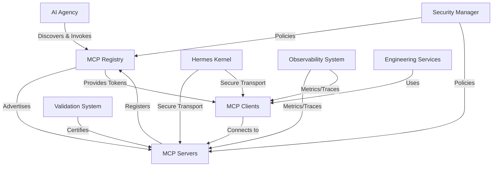
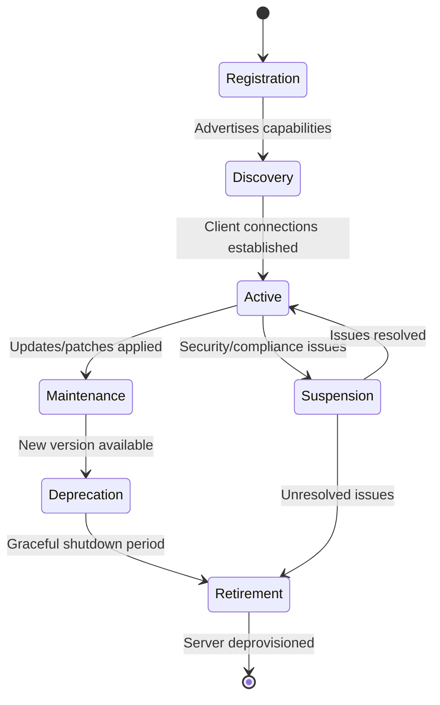

# MCP_ECOSYSTEM.md

## 1. Introduction

### Purpose
This document specifies the Model Context Protocol (MCP) ecosystem architecture for AI-OS, defining how MCP servers are discovered, governed, integrated, secured, and managed within the AI-OS platform. It establishes the foundational principles for extending AI-OS capabilities through standardized, secure, and observable MCP integrations.

### Scope
This document covers the complete MCP ecosystem within AI-OS, including:
- MCP server registration and discovery mechanisms
- Capability advertisement and negotiation protocols
- Security and trust boundaries for MCP interactions
- Runtime integration with AI Agency, Skills, Memory, and Validation systems
- Lifecycle management from registration to retirement
- Observability and governance frameworks

It applies to all MCP servers, clients, and facilitating components operating within the AI-OS platform, including Engineering Services, AI Agency Service, and ecosystem integrations.

### Audience
This document is intended for:
- AI-OS architects designing MCP-based extensions
- Platform engineers implementing MCP infrastructure
- Security professionals defining MCP trust and isolation policies
- Developers creating MCP servers for AI-OS integration
- System administrators managing MCP server lifecycle
- Auditors verifying MCP conformance and governance

### Relationship to AI-OS
The MCP ecosystem is a core extensibility mechanism within AI-OS, enabling the platform to dynamically incorporate external capabilities without modifying core components. It implements Part 8 (Memory Architecture) and Part 14 (AI Agency) extensions by providing a standardized interface for external tools and knowledge sources.

### Relationship to Hermes
As a Core Manager owned by the Hermes Kernel, the MCP ecosystem leverages Hermes' messaging and security infrastructure for reliable, authenticated communication between AI-OS components and MCP servers. Hermes provides the underlying transport and identity foundations upon which MCP trust is built.

### Relationship to AI Agency
The AI Agency Service consumes MCP servers as primary sources of external capabilities. MCP servers extend the AI Agency's toolkit, enabling agents to access specialized functions, data sources, and computational resources beyond native AI-OS capabilities. The MCP Registry serves as the capability catalog for AI Agency discovery and composition.

## 2. MCP Philosophy

### Extensibility
MCP exists within AI-OS to provide a uniform, pluggable mechanism for extending platform capabilities without requiring core modifications. By standardizing how external capabilities are advertised, discovered, and invoked, AI-OS can integrate diverse tools and services through a single, well-defined interface.

### Capability Discovery
MCP enables runtime discovery of available capabilities through a centralized registry. Agents and services can query what functions, data sources, and computational resources are available at any moment, enabling dynamic capability composition based on context and task requirements.

### Runtime Integration
MCP capabilities integrate seamlessly with AI-OS runtime systems, appearing as native tools to the AI Agency and Engineering Services. The MCP abstraction layer handles protocol translation, security enforcement, and reliability concerns, allowing capabilities to be invoked as if they were internal platform functions.

### Tool Abstraction
MCP abstracts the underlying implementation details of external tools, presenting a consistent interface regardless of technology stack, language, or deployment model. This abstraction enables AI-OS to treat a Python script, a Dockerized service, or a remote API as equivalent capability sources.

### Technology Neutrality
The MCP ecosystem places no restrictions on the implementation technology of MCP servers. Servers may be implemented in any language, framework, or runtime, and may be deployed locally, in containers, or as remote services, as long as they adhere to the MCP behavioral contract.

### Decoupling
MCP promotes loose coupling between AI-OS core components and extended capabilities. Core systems depend only on the MCP interface contract, not on specific server implementations. This enables independent evolution, versioning, and replacement of capabilities without impacting platform stability.

## 3. MCP Architecture

### MCP Ecosystem
The MCP ecosystem comprises interacting components that enable capability discovery, secure invocation, and lifecycle management within AI-OS.

### MCP Components
- **MCP Registry**: Central directory for capability advertisement and discovery
- **MCP Servers**: External entities providing capabilities through the MCP interface
- **MCP Clients**: AI-OS components (AI Agency, Engineering Services) that consume MCP capabilities
- **MCP Broker**: Optional intermediary for load balancing, caching, and policy enforcement
- **MCP Gateway**: Security envelope for authentication, authorization, and audit logging

### MCP Clients
MCP Clients are AI-OS system components that discover and invoke MCP capabilities. They utilize the MCP Registry to find available capabilities and establish secure connections to MCP Servers. Clients implement capability invocation semantics and handle results according to MCP contracts.

### MCP Servers
MCP Servers are external entities that advertise capabilities through the MCP Registry. They implement the MCP interface to expose functions, data sources, and computational resources. Servers are responsible for capability implementation, security compliance, and lifecycle notifications.

### MCP Registry
The MCP Registry is the authoritative source for capability discovery within AI-OS. It maintains:
- Advertised capabilities with metadata
- Server endpoint information and health status
- Version information and compatibility constraints
- Security policies and trust annotations
- Usage statistics and performance metrics

### MCP Discovery
MCP Discovery enables clients to find suitable capabilities through:
- Keyword-based search in the Registry
- Filtering by capability categories and tags
- Version and compatibility matching
- Trust level and security policy evaluation
- Geographic and latency-based routing (when applicable)

### MCP Lifecycle
The MCP Lifecycle defines the stages a capability server progresses through from introduction to removal from the ecosystem.

## 4. MCP Lifecycle

### Registration
Registration is the process by which an MCP Server makes its capabilities known to the MCP Registry. During registration, the server provides:
- Unique server identifier and version
- Advertised capabilities with detailed metadata
- Network endpoint and connection parameters
- Security credentials and trust assertions
- Initial health status and resource requirements

### Discovery
Discovery is the process by which MCP Clients locate suitable capabilities in the Registry. Clients query the Registry using:
- Capability names, categories, or tags
- Version ranges and compatibility constraints
- Security and trust requirements
- Performance and availability SLAs
- Geographic or topological preferences

### Capability Advertisement
Capability Advertisement defines how servers describe their offerings to the Registry. Each capability includes:
- Unique capability identifier within the server
- Human-readable description and documentation
- Input/output schema definitions (technology-neutral)
- Execution characteristics (sync/async, duration, resource usage)
- Error conditions and failure modes
- Version and deprecation information

### Connection
Connection establishes a secure communication channel between an MCP Client and MCP Server. The process involves:
- Mutual authentication using Hermes-issued credentials
- Authorization verification against server policies
- Establishment of encrypted transport channel
- Negotiation of protocol version and extensions
- Initial health check and capability confirmation

### Invocation
Invocation is the act of requesting and executing a capability through an established MCP connection. It includes:
- Parameter validation against capability schema
- Execution of the capability implementation
- Result collection and formatting according to schema
- Error handling and exception propagation
- Performance monitoring and metric collection

### Monitoring
Monitoring tracks the health, performance, and usage of MCP Servers and connections. It encompasses:
- Connection liveness and responsiveness
- Capability invocation success rates and latency
- Resource consumption (CPU, memory, network, storage)
- Security event logging and anomaly detection
- Usage analytics for capacity planning and optimization

### Versioning
Versioning manages the evolution of MCP Servers and capabilities over time. It includes:
- Semantic versioning for servers and individual capabilities
- Backward compatibility guarantees within major versions
- Deprecation notices with migration timelines
- Version negotiation during connection establishment
- Side-by-side deployment of multiple versions

### Retirement
Retirement is the safe removal of an MCP Server from the ecosystem. It involves:
- Graceful shutdown period allowing in-flight invocations to complete
- Client notification of impending retirement
- Traffic shifting to replacement servers (when available)
- Final health checks and resource cleanup
- Registry entry archival for audit purposes

## 5. Capability Model

### Capability Discovery
Capability Discovery enables clients to understand what functions and data sources are available through MCP Servers. It relies on standardized metadata expressed in the Registry that describes:
- Capability purpose and intended use cases
- Technical interface specifications
- Quality of service characteristics
- Security and compliance attributes
- Dependencies and prerequisites

### Capability Metadata
Capability Metadata provides structured information about each advertised capability. Required metadata elements include:
- **identifier**: Unique capability ID within the server namespace
- **name**: Human-readable capability name
- **description**: Detailed explanation of capability function
- **inputSchema**: JSON Schema defining acceptable parameters
- **outputSchema**: JSON Schema defining return value structure
- **version**: Capability version following semantic versioning
- **tags**: Keywords for categorization and search
- **deprecated**: Boolean indicating deprecation status
- **expires**: Optional timestamp for automatic deprecation

Optional metadata elements may include:
- **executionType**: Synchronous, asynchronous, or streaming
- **estimatedDuration**: Typical execution time range
- **resourceRequirements**: CPU, memory, disk, network estimates
- **errorCodes**: Defined error conditions with descriptions
- **documentationUrl**: Link to detailed capability documentation
- **license**: Usage licensing information
- **maintainer**: Contact information for capability support

### Capability Categories
Capabilities are organized into thematic categories to facilitate discovery and governance. Standard categories include:
- **data-access**: Databases, APIs, file systems, knowledge bases
- **computation**: Mathematical processing, ML inference, rendering
- **communication**: Messaging, email, collaboration platforms
- **file-operations**: File creation, modification, conversion, analysis
- **system-information**: Hardware metrics, OS details, environment vars
- **security-tools**: Scanning, encryption, authentication helpers
- **domain-specific**: Finance, healthcare, legal, scientific domains
- **utility**: Text processing, date/time, formatting, conversion

Organizations may define custom categories while maintaining alignment with the core taxonomy.

### Capability Contracts
Capability Contracts define the formal agreement between MCP Servers and Clients regarding capability behavior. Contracts specify:
- **Interface Contract**: Input/output schemas and parameter constraints
- **Behavioral Contract**: Expected side effects, idempotency, ordering guarantees
- **Performance Contract**: Latency thresholds, throughput capabilities, availability SLAs
- **Security Contract**: Authentication requirements, authorization scopes, data handling constraints
- **Reliability Contract**: Retry policies, timeout behaviors, failure recovery procedures
- **Version Contract**: Compatibility guarantees and deprecation policies

### Capability Negotiation
Capability Negotiation occurs during connection establishment to determine mutually acceptable interaction parameters. Negotiable aspects include:
- **Protocol Version**: MCP protocol version and extensions
- **Security Mechanism**: Authentication method and encryption parameters
- **Data Format**: Preferred serialization format (JSON, CBOR, etc.)
- **Compression**: Acceptable compression algorithms for payloads
- **Keepalive**: Connection heartbeat intervals and timeouts
- **Batch Size**: Maximum parameters/results per invocation (for batch-capable capabilities)
- **Streaming**: Support for incremental result delivery

## 6. Governance

### Registration Policies
Registration Policies define the criteria and procedures for MCP Server admission to the Registry. Policies address:
- **Eligibility**: Required metadata completeness and format validity
- **Security**: Mandatory authentication mechanisms and minimum trust levels
- **Compliance**: Adherence to organizational security and privacy standards
- **Quality**: Basic health checks and responsiveness thresholds
- **Uniqueness**: Prevention of duplicate capability identifiers
- **Scope**: Allowed capability categories and prohibited functionalities

### Approval
Approval processes validate MCP Servers against Registration Policies before Registry admission. Approval types include:
- **Automatic Approval**: For servers meeting predefined trust and compliance criteria
- **Manual Review**: Requiring human validation for novel capability categories or elevated trust levels
- **Delegated Approval**: Authorized teams approving servers within specific domains
- **Conditional Approval**: Admission subject to post-deployment validation windows
- **Emergency Approval**: Expedited process for critical security or operational capabilities

### Trust
Trust establishes confidence in MCP Server integrity and reliability. Trust mechanisms include:
- **Identity Verification**: Cryptographic validation of server identity via Hermes
- **Code Provenance**: Verification of server build chain and artifact signatures
- **Behavioral Attestation**: Runtime monitoring confirming expected behavior
- **Third-party Validation**: Independent security assessments and certifications
- **Historical Performance**: Track record of stability and compliance
- **Governance Endorsement**: Formal approval by designated authority bodies

### Validation
Validation ensures MCP Servers meet functional, performance, and security requirements. Validation activities encompass:
- **Schema Validation**: Conformance of input/output schemas to JSON Schema specification
- **Contract Testing**: Verification of capability behavior against advertised contracts
- **Security Scanning**: Automated vulnerability detection and compliance checking
- **Load Testing**: Performance evaluation under expected usage patterns
- **Chaos Engineering**: Resilience testing under failure conditions
- **Interoperability Testing**: Validation with diverse MCP Client implementations

### Certification
Certification provides formal recognition that an MCP Server meets specific standards. Certification levels include:
- **Base Certification**: Passes automated validation and basic security checks
- **Enhanced Certification**: Includes manual review and extended testing
- **Domain Certification**: Meets industry-specific requirements (HIPAA, PCI-DSS, etc.)
- **Emergency Certification**: Granted for time-limited critical response capabilities
- **Recertification**: Periodic revalidation to maintain certified status

### Version Governance
Version Governance manages the evolution and coexistence of multiple MCP Server versions. Governance practices include:
- **Version Advertising**: Clear communication of version numbers and compatibility
- **Deprecation Policy**: Standardized timelines and migration paths for retiring versions
- **Compatibility Matrix**: Published compatibility between client and server versions
- **Can Versioning**: Recommendations for semantic versioning adherence
- **Version Isolation**: Technical mechanisms to run multiple versions concurrently
- **Rollback Procedures**: Processes for reverting to previous versions when issues arise

## 7. Security Architecture

### Authentication
Authentication verifies the identity of MCP Clients and Servers. Authentication mechanisms include:
- **Mutual TLS**: Certificate-based identity verification using Hermes PKI
- **OAuth 2.0**: Delegated authentication with token verification
- **JWT Bearer Tokens**: Signed tokens validated against Hermes issuer
- **API Keys**: Shared secrets for low-risk integrations (with rotation requirements)
- **Kerberos**: Enterprise directory-based authentication (when available)
- **Anonymous Access**: Permitted only for explicitly public capabilities with limited scope

### Authorization
Authorization determines what actions authenticated entities are permitted to perform. Authorization models include:
- **Role-Based Access Control (RBAC)**: Predefined roles with capability permissions
- **Attribute-Based Access Control (ABAC)**: Policies evaluating client/server attributes
- **Capability-Based Security**: Unforgeable tokens granting specific capability access
- **Scope-Based Authorization**: OAuth-style scopes limiting capability invocation
- **Context-Aware Policies**: Decisions based on invocation context (time, location, payload)
- **Least Privilege Enforcement**: Automatic privilege reduction to minimum required

### Trust Boundaries
Trust Boundaries define zones of differing security requirements within the MCP ecosystem. Boundary types include:
- **Platform Boundary**: Between AI-OS core and MCP ecosystem (Hermes-enforced)
- **Server Boundary**: Between MCP Server trust domains (implementation responsibility)
- **Data Boundary**: Between sensitivity levels of processed information
- **Network Boundary**: Between network zones with differing trust levels
- **Process Boundary**: Between MCP Server processes and host operating system
- **Boundary Enforcement**: Firewalls, sandboxes, and mediation points maintaining separation

### Isolation
Isolation prevents unintended interactions between MCP ecosystem components. Isolation techniques include:
- **Process Isolation**: Separate operating system processes for each MCP Server
- **Container Isolation**: Linux containers or equivalent lightweight virtualization
- **Virtual Machine Isolation**: Full hardware virtualization for high-risk servers
- **Sandboxed Execution**: Restricted runtime environments limiting system access
- **Network Isolation**: Separate network segments or VLANs for different trust levels
- **Memory Isolation**: Hardware-enforced memory protection (where available)
- **File System Isolation**: Chroot, namespaces, or equivalent filesystem restrictions

### Sandboxing
Sandboxing provides controlled execution environments for MCP Servers. Sandbox characteristics include:
- **System Call Filtering**: Restricting allowed operating system interactions
- **Network Access Control**: Whitelisting or blacklisting network destinations
- **File System Restrictions**: Limiting accessible paths and operations
- **Resource Quotas**: Enforcing CPU, memory, disk, and network usage limits
- **Deterministic Execution**: Ensuring reproducible behavior for validation
- **Escape Prevention**: Countermeasures against sandbox breakout techniques
- **Audit Logging**: Recording all sandbox boundary crossings for forensics

### Least Privilege
Least Privilege ensures MCP ecosystem components operate with minimal necessary authority. Implementation includes:
- **Privilege Dropping**: Reducing process privileges immediately after startup
- **Just-in-Time Authorization**: Granting permissions only during active capability invocation
- **Permission Minimization**: Requesting only strictly required capabilities and accesses
- **Privilege Separation**: Dividing server functionality into minimally privileged components
- **Default Deny**: Starting with no privileges and explicitly granting required ones
- **Privilege Auditing**: Regular review of actually used versus granted privileges

## 8. Runtime Integration

### AI Agency
The AI Agency Service integrates with the MCP ecosystem as a primary capability consumer. Integration aspects include:
- **Capability Discovery**: AI Agents query the MCP Registry for relevant capabilities
- **Dynamic Tool Registration**: Discovered capabilities appear as native tools to agents
- **Contextual Invocation**: Capabilities invoked based on agent reasoning and task state
- **Result Integration**: Capability outputs incorporated into agent knowledge and memory
- **Failure Handling**: Graceful degradation when capabilities are unavailable or failing
- **Permission Mapping**: Agent roles mapped to MCP capability authorization scopes

### Skills
The Skills ecosystem complements MCP by providing internal capability implementations. Integration points include:
- **Functional Equivalence**: Similar capabilities may exist as Skills or MCP Servers
- **Delegation Framework**: Skills can delegate to MCP Servers for external functions
- **Capability Wrapping**: MCP Servers can be exposed as Skills for uniform consumption
- **Performance Optimization**: Frequently used MCP capabilities may be internalized as Skills
- **Development Continuity**: Skills provide migration path from prototyping to production MCP Servers
- **Unified Discovery**: AI Agents search both Skills and MCP Registries for capabilities

### Memory
The Memory Architecture integrates with MCP to persist capability-related knowledge. Integration includes:
- **Capability Usage History**: Recording invocation patterns for optimization and auditing
- **Performance Baselines**: Establishing normal behavior for anomaly detection
- **Failure Patterns**: Tracking recurring issues for preventive maintenance
- **User Preferences**: Remembering preferred capability variants or configurations
- **Contextual Relevance**: Associating capabilities with specific task contexts for better recommendations
- **Knowledge Distillation**: Extracting reusable patterns from MCP capability implementations

### Validation
The Validation Architecture ensures MCP ecosystem quality and compliance. Integration involves:
- **Pre-registration Validation**: Automated checks before Registry admission
- **Post-deployment Monitoring**: Continuous validation during active server operation
- **Schema Evolution Checking**: Detecting breaking changes in capability interfaces
- **Security Regression Testing**: Verifying that updates don't introduce vulnerabilities
- **Performance Trend Analysis**: Identifying degradations requiring intervention
- **Compliance Reporting**: Generating evidence for regulatory and internal audits

### Engineering Services
Engineering Services utilize MCP capabilities for platform operations and extensibility. Integration includes:
- **Platform Extension**: Adding new platform capabilities via MCP Servers
- **Operational Tooling**: Access to monitoring, debugging, and administrative functions
- **Integration Adapters**: Bridging legacy systems to AI-OS through MCP wrappers
- **Custom Workflows**: Composing MCP capabilities into automated processes
- **Dependency Management**: Tracking MCP Server dependencies for platform releases
- **Fault Isolation**: Containing failures in MCP Servers from impacting core services

### Core Managers
Core Managers depend on the MCP ecosystem for extended platform functionality. Integration patterns include:
- **Hermes Kernel**: Leveraging MCP for secure inter-component communication extensions
- **Memory Manager**: Utilizing MCP Servers for external knowledge storage and retrieval
- **Validation Manager**: Employing MCP-based compliance checking and audit tools
- **Security Manager**: Accessing threat intelligence and response capabilities via MCP
- **Configuration Manager**: Using MCP Servers for dynamic configuration sources
- **Service Manager**: Orchestrating MCP Servers as platform microservices

## 9. Repository Integration

### Relationship with REPOSITORY_ECOSYSTEM.md
The MCP Ecosystem and Repository Ecosystem are complementary extensibility mechanisms within AI-OS. The MCP Ecosystem owns:
- Runtime capability discovery and invocation
- Secure external service integration
- Dynamic tool provisioning for AI Agents
- Protocol-standardized external interfaces

The Repository Ecosystem owns:
- Static code and knowledge asset management
- Version-controlled capability implementations
- Develop-time dependency resolution
- Build-time integration and compilation

Integration points include:
- **Capability Source**: Repository Ecosystem provides source code and build artifacts for MCP Servers
- **Deployment Pipeline**: Repository changes trigger MCP Server build and deployment workflows
- **Version Alignment**: MCP Server versions tracked alongside source repository tags
- **Knowledge Exchange**: MCP Servers can expose repository search and retrieval capabilities
- **Unified Governance**: Combined review processes for capability source and runtime behavior
- **Performance Feedback**: Repository engineers receive MCP Server usage and performance data

The ecosystems maintain clear separation of concerns while enabling complementary workflows for capability development and deployment.

## 10. Observability

### Metrics
MCP ecosystem metrics provide quantitative visibility into capability health and usage. Key metrics include:
- **Invocation Rate**: Number of capability invocations per time period
- **Success Rate**: Percentage of invocations completing without error
- **Latency Distribution**: Response time percentiles (p50, p95, p99)
- **Error Rates**: Frequency of different error types (timeout, validation, execution)
- **Resource Utilization**: CPU, memory, disk, and network consumption per server
- **Connection Count**: Active client connections per server
- **Registry Query Volume**: Discovery requests processed by the MCP Registry
- **Version Distribution**: Adoption rates of different MCP Server versions

### Events
MCP ecosystem events capture significant occurrences for audit and debugging. Event types include:
- **Registration Events**: Server admission, updates, and removal from Registry
- **Connection Events**: Establishment, renewal, and termination of MCP connections
- **Invocation Events**: Start and completion of capability executions
- **Error Events**: Failures during connection, invocation, or data transfer
- **Security Events**: Authentication failures, authorization violations, anomaly detections
- **Lifecycle Events**: Version updates, deprecation notices, retirement announcements
- **Health Events**: Heartbeat signals, health check results, maintenance notifications

### Logs
MCP ecosystem logs provide detailed diagnostic information for troubleshooting. Log categories include:
- **Access Logs**: Client-server interaction records with timestamps and payload summaries
- **Error Logs**: Detailed exception information and stack traces
- **Security Logs**: Authentication attempts, access control decisions, audit trails
- **Debug Logs**: Verbose tracing for development and problem resolution
- **Audit Logs**: Immutable records for compliance and forensic analysis
- **Performance Logs**: Resource usage profiling and bottleneck identification

### Traces
MCP ecosystem traces enable end-to-end visibility of capability invocations. Trace elements include:
- **Invocation Path**: Client → Registry → Server → External Services (if applicable)
- **Span Timing**: Duration of each phase (discovery, connection, invocation, result)
- **Context Propagation**: Task and user context flowing through the invocation chain
- **Dependency Links**: Calls to downstream services or databases
- **Error Propagation**: Failure points and retry attempts within the call chain
- **Resource Attribution**: CPU, memory, and network usage per trace segment

### Health
MCP ecosystem health indicators signal overall ecosystem vitality. Health checks include:
- **Registry Availability**: Responsiveness and correctness of capability discovery
- **Server Responsiveness**: Ability to accept connections and process invocations
- **Capability Availability**: Percentage of registered capabilities currently usable
- **Security Posture**: Compliance with authentication and authorization requirements
- **Resource Saturation**: Utilization levels approaching capacity limits
- **Dependency Health**: Status of external services relied upon by MCP Servers
- **Cascading Failure Resistance**: Ability to isolate issues without ecosystem-wide impact

## 11. Architecture Invariants

The following invariants must hold for all MCP ecosystem implementations within AI-OS:

1. **Capability Discovery Invariant**: All registered capabilities must be discoverable through the MCP Registry using standardized query mechanisms.

2. **Security Boundary Invariant**: All MCP Client-to-Server communication must occur across mutually authenticated and encrypted channels enforced by Hermes security infrastructure.

3. **Capability Contract Invariant**: All capability invocations must adhere to the advertised input/output schemas and behavioral contracts.

4. **Least Privilege Invariant**: MCP Servers and Clients must operate with the minimum privileges necessary to perform their specified functions.

5. **Lifecycle Invariant**: All MCP Servers must follow the defined lifecycle stages with documented transitions and retirement procedures.

6. **Observability Invariant**: All MCP ecosystem components must emit standardized metrics, events, logs, and traces sufficient for monitoring and debugging.

7. **Technology Neutrality Invariant**: The MCP ecosystem must place no restrictions on the implementation language, framework, or deployment architecture of MCP Servers.

8. **Backward Compatibility Invariant**: Within a major version series, MCP Servers must maintain backward compatibility for all advertised capabilities.

9. **Governance Compliance Invariant**: All MCP Servers must comply with applicable registration policies, approval requirements, and governance standards.

10. **Interoperability Invariant**: MCP Clients implementing the standard specification must be able to invoke capabilities from any compliant MCP Server.

## 12. Conformance Requirements

The following requirements use RFC 2119 terminology to specify mandatory, recommended, and optional behaviors for MCP ecosystem implementations.

### Mandatory Requirements (MUST)
- An MCP Registry **MUST** provide a standardized interface for capability advertisement and discovery.
- All MCP Client-to-Server communication **MUST** be mutually authenticated and encrypted.
- MCP Servers **MUST** advertise capabilities with complete input and output schemas using JSON Schema notation.
- MCP Invocations **MUST** validate parameters against advertised input schemas before execution.
- MCP Servers **MUST** return results conforming to advertised output schemas or defined error conditions.
- The MCP ecosystem **MUST** enforce least privilege access for all components.
- All MCP Servers **MUST** follow the defined lifecycle stages with documented state transitions.
- The MCP ecosystem **MUST** emit observable metrics, events, logs, and traces sufficient for operational monitoring.
- MCP Servers **MUST** adhere to registered capability contracts without unauthorized behavioral changes.
- All MCP ecosystem components **MUST** integrate with Hermes security infrastructure for identity and trust establishment.

### Recommended Requirements (SHOULD)
- MCP Servers **SHOULD** implement health check endpoints for liveness and readiness probing.
- The MCP Registry **SHOULD** support semantic versioning and deprecation timelines for capabilities.
- MCP ecosystem components **SHOULD** implement exponential backoff and jitter for connection retries.
- MCP Servers **SHOULD** provide detailed error information including context and remediation guidance.
- The MCP ecosystem **SHOULD** support capability invocation tracing with context propagation.
- MCP Servers **SHOULD** implement resource quotas and usage monitoring for self-protection.
- The MCP Registry **SHOULD** provide capability usage analytics for optimization and planning.
- MCP ecosystem components **SHOULD** support graceful degradation when individual capabilities fail.
- MCP Servers **SHOULD** document security and compliance attributes for governance assessment.
- The MCP ecosystem **SHOULD** facilitate capability version negotiation during connection establishment.

### Optional Requirements (MAY)
- MCP Servers **MAY** implement streaming responses for large or incremental result sets.
- The MCP Registry **MAY** support geographic or topology-based capability routing.
- MCP ecosystem components **MAY** implement caching of capability metadata and schemas.
- MCP Servers **MAY** offer batch invocation modes for efficiency with homogeneous parameters.
- The MCP ecosystem **MAY** support capability composition and chaining mechanisms.
- MCP Servers **MAY** provide WebSocket or HTTP/2 endpoints for efficient bidirectional communication.
- The MCP ecosystem **MAY** integrate with AI Agency memory systems for capability usage learning.
- MCP Servers **MAY** support custom authentication mechanisms beyond the baseline requirements.
- The MCP Registry **MAY** allow organizational capabilities to override or extend standard taxonomy.

## 13. Cross References

### AI_OS_MASTER_CONTEXT.md
The MCP Ecosystem implements the extensibility mechanisms defined in Part 8 (Memory Architecture) and Part 14 (AI Agency) of the AI-OS Master Context. It provides the concrete realization of dynamic capability integration referenced in those sections.

### REPOSITORY_ECOSYSTEM.md
As specified in Section 9, the MCP Ecosystem maintains a complementary relationship with the Repository Ecosystem. The MCP Ecosystem relies on the Repository Ecosystem for capability source management while providing runtime invocation mechanisms for repository-stored implementations.

### AI_AGENCY.md
The MCP Ecosystem serves as the primary external capability source for the AI Agency Service, enabling agents to access specialized tools, data sources, and computational resources beyond native AI-OS functionality as described in the AI Agency specification.

### VALIDATION_ARCHITECTURE.md
The MCP Ecosystem integrates with the Validation Architecture through pre-registration validation, post-deployment monitoring, and compliance checking mechanisms to ensure capability quality, security, and reliability as outlined in the Validation Architecture specification.

### IMPLEMENTATION_GUIDE.md
Implementers of MCP Servers and Clients should consult the Implementation Guide for detailed patterns, best practices, and recommended approaches to building compliant MCP ecosystem components while adhering to the architectural specifications defined herein.