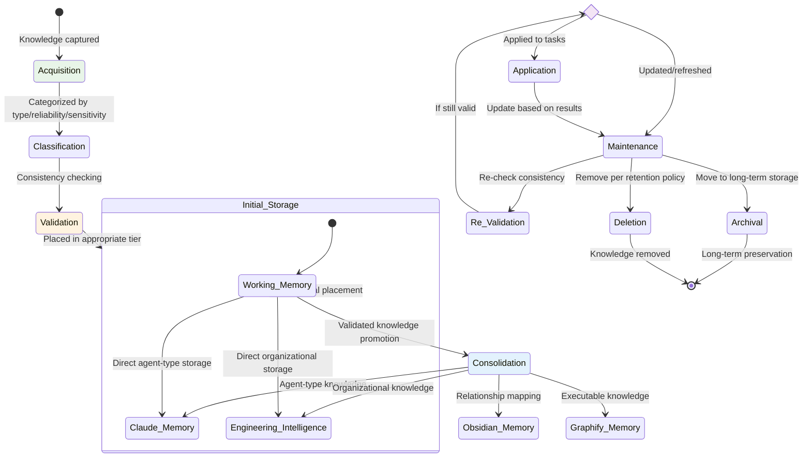
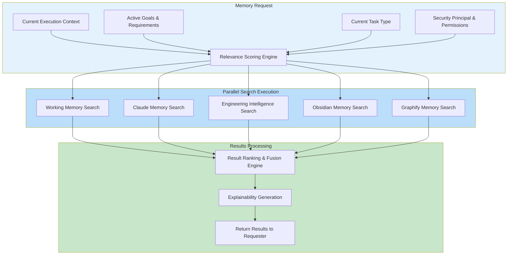

# MEMORY_ARCHITECTURE.md

## 1. Introduction

This document specifies the Memory Architecture for AI-OS as defined in Part 8 of the AI-OS Architecture Specification. It establishes the hierarchical memory system that enables learning, knowledge retention, contextual awareness, and inter-component knowledge sharing within the AI-OS platform.

As a Core Manager owned by the Hermes Kernel, the Memory Architecture provides foundational capabilities for all Engineering Services, the AI Agency Service, and ecosystem integrations.

## 2. Terminology

Key terms used in this document adhere to RFC 2119:

- **MUST**: Indicates an absolute requirement
- **MUST NOT**: Indicates an absolute prohibition
- **SHOULD**: Indicates a recommendation
- **SHOULD NOT**: Indicates a recommendation against
- **MAY**: Indicates permission or optionality

## 3. Purpose

The Memory Architecture defines the foundational principles, structure, and behavior of AI-OS's hierarchical memory systems that enable learning, knowledge retention, and contextual awareness across AI agent operations. It establishes how the system captures, organizes, retrieves, and applies knowledge to support autonomous engineering workflows while maintaining appropriate isolation, security, and privacy boundaries.

## 4. Scope

This document specifies the complete memory architecture for AI-OS, covering:

All five memory tiers and their defined purposes
Memory tier interactions, persistence mechanisms, and lifecycle management
Integration principles with AI Agency, Validation, Skills, and MCP ecosystems
Conformance requirements for implementations
Applies to all AI agents, engineering services, and system components within the AI-OS platform
Technology-neutral conceptual design without prescribing specific databases, APIs, or implementation technologies

## 5. Memory Philosophy

AI-OS treats memory as a strategic asset governed by these architectural principles:

**Hierarchical Organization**: Memory is structured into five functionally distinct tiers with specialized purposes, volatility characteristics, and access patterns that enable controlled knowledge progression from immediate processing to long-term organizational intelligence while preventing uncontrolled knowledge proliferation.

**Progressive Consolidation**: Knowledge flows from volatile working memory to persistent long-term storage through validated, governed processes that ensure quality, relevance, and reliability before promotion, enabling the transformation of episodic experiences into structured organizational knowledge.

**Contextual Primacy**: Memory retrieval and storage operations MUST prioritize relevance to current execution context, active goals, and task requirements to support effective agent decision-making, ensuring that agents access the most pertinent knowledge for their immediate objectives.

**Isolation Boundaries**: Strict separation between memory tiers and agent contexts MUST be maintained through mediated access controls to prevent unauthorized access, data leakage, and privilege escalation, ensuring the integrity and security of each memory tier's specialized function.

**Learning Integration**: Memory systems actively participate in and support the AI-OS Learning Architecture (Part 19) by providing storage for experiential knowledge and supplying learned patterns for future agent behavior, creating a closed-loop learning system that continuously improves agent capabilities.

**Audit Completeness**: All memory operations MUST generate corresponding audit events for governance, compliance, traceability, and forensic analysis capabilities, enabling comprehensive monitoring and accountability for all knowledge-related activities.

**Implementation Independence**: Specifications avoid prescribing specific technologies, databases, or APIs to ensure technology neutrality and allow diverse implementations to conform to the same architectural contract, facilitating interoperability and vendor choice while maintaining architectural integrity.

## 6. Memory Goals

Implementations of this architecture SHOULD achieve:

Persistent Learning: Retain valuable insights across system restarts and sessions
Contextual Awareness: Provide agents with relevant historical context for decision-making
Knowledge Discovery: Enable identification of patterns, relationships, and anti-patterns
Efficient Retrieval: Optimize access to relevant knowledge with minimal latency
Scalable Storage: Accommodate growing knowledge bases without performance degradation
Security Assurance: Protect sensitive information through isolation and access controls
Auditability: Maintain complete traceability of knowledge creation and usage
Interoperability: Allow seamless knowledge exchange between system components

## 7. Rationale for Memory Existence

Memory exists in AI-OS to address fundamental limitations of stateless AI systems:

Overcoming Context Limits: Extends beyond LLM context windows with persistent knowledge stores
Enabling Learning: Transforms episodic experiences into generalizable knowledge
Supporting Autonomy: Allows agents to operate effectively without constant external guidance
Improving Efficiency: Reduces redundant computation by reusing proven solutions
Ensuring Consistency: Maintains alignment with organizational knowledge and standards
Facilitating Collaboration: Shares insights between agents and system components
Meeting Compliance: Provides audit trails for knowledge creation and usage

## 8. Memory Architecture Overview

AI-OS implements a five-tier hierarchical memory system designed to balance volatility, persistence, accessibility, and specialization while enforcing strict isolation boundaries between tiers. Each tier serves a distinct, non-overlapping purpose in the knowledge lifecycle as illustrated in Figure 1, with clearly defined data flow patterns governed by validation and consolidation processes.

```
+---------------------+
|   Working Memory    | � ◄�╴ Volatile, session-scoped, immediate context
+---------------------+
|     Claude Memory   | � ◄�╴ Session persistence, agent-specific learning
+---------------------+
| Engineering Intelligence | � ◄�╴ Organizational knowledge, patterns, decisions
+---------------------+
|     Obsidian Memory | � ◄�╴ Linked knowledge graph, documentation vault
+---------------------+
|    Graphify Memory  | � ◄�╴ Structured reasoning, executable knowledge
+---------------------+
```

Figure 1: AI-OS Five-Tier Memory Hierarchy (Volatility Gradient)

Data flows through this hierarchy via consolidation processes that validate, transform, and promote knowledge based on utility, reliability, and relevance, ensuring that only validated knowledge progresses to more persistent tiers.

## 9. Memory Hierarchy Characteristics

The memory hierarchy organizes storage by four orthogonal dimensions:

| Dimension | Working Memory | Claude Memory | Engineering Intelligence | Obsidian Memory | Graphify Memory |
|-----------|----------------|---------------|--------------------------|-----------------|-----------------|
| Volatility | Volatile | Semi-persistent | Persistent | Persistent | Persistent |
| Access Speed | Fastest | Fast | Medium | Specialized | Specialized |
| Scope | Session | Agent-type | System-wide | System-wide | System-wide |
| Purpose Specialization | Active reasoning context | Agent-specific behaviors | Organizational knowledge | Semantic relationships | Executable reasoning |

## 10. Memory Tier Specifications

### 10.1 Working Memory

**Purpose**: Provide volatile, high-bandwidth storage for the immediate execution context of active agent reasoning, including current task state, recent observations, and short-term computational workspace.

**Characteristics**:
- Volatile storage cleared on session end (MUST)
- Optimized for low-latency read/write access during active agent execution (SHOULD)
- Session-scoped isolation preventing cross-agent context leakage (MUST)
- Contains active reasoning state, recent sensory/perceptual inputs, and short-term computational workspace (MUST)
- Implements capacity constraints to focus agent attention on pertinent information (SHOULD)

**Storage Characteristics**:
- In-memory data structures (MUST)
- LRU eviction when capacity exceeded (SHOULD)
- Transactional updates for consistency (SHOULD)
- No persistence across system restarts (MUST)

### 10.2 Claude Memory

**Purpose**: Provide session-persistent storage for agent-type specific learned behaviors, preferences, and specialization data that enables contextual continuity across agent instantiations and system restarts.

**Characteristics**:
- Session persistence across restarts and interruptions (MUST)
- Agent-type scoped knowledge base (shared among same agent types) (MUST)
- Stores conversation history, working state, and learned preferences (MUST)
- Enables seamless session resumption with contextual continuity (SHOULD)
- Second-fastest access tier after Working Memory (SHOULD)

**Storage Characteristics**:
- Persistent storage with session boundaries (MUST)
- Agent-type identification and scoping (MUST)
- Configurable retention policies (MAY)
- Backup and recovery capabilities (SHOULD)
- Encryption for sensitive agent-specific data (SHOULD)

### 10.3 Engineering Intelligence Memory

**Purpose**: Provide system-wide, long-term storage for organizational knowledge including validated solution patterns, architectural decisions, reusable components, and best practices that are accessible to all agents and engineering services.

**Characteristics**:
- Long-term storage of learned patterns, decisions, and best practices (MUST)
- Consolidated from workflow experiences and reflections (MUST)
- System-wide accessibility for knowledge sharing (MUST)
- Used to inform future planning, decision-making, and solution generation (MUST)
- Represents the organizational "intelligence" of AI-OS deployments (MUST)

**Storage Characteristics**:
- Persistent, shared storage across all agents (MUST)
- Knowledge categorization by domain, type, and relevance (SHOULD)
- Versioning for knowledge evolution (SHOULD)
- Access controls based on agent roles and permissions (MUST)
- Deduplication and conflict resolution mechanisms (SHOULD)

### 10.4 Obsidian Memory

**Purpose**: Provide a linked knowledge graph storage system for representing semantic connections between concepts, dependencies, causal relationships, and integrated documentation vaults that enable reasoning about system interconnections.

**Characteristics**:
- Knowledge vault integration for documentation and knowledge artifacts (MUST)
- Structured storage of architectural decisions, design documents, and wikis (MUST)
- Versioned knowledge artifacts with change tracking (MUST)
- Enables reasoning about system interconnections and dependencies (SHOULD)
- Supports semantic navigation and relationship discovery (SHOULD)

**Storage Characteristics**:
- Graph-based storage with nodes and relationships (MUST)
- Property graphs for rich metadata (SHOULD)
- ACID transactions for consistency (SHOULD)
- Referential integrity constraints (SHOULD)
- Full-text search capabilities (SHOULD)
- Versioned knowledge artifacts (MUST)

### 10.5 Graphify Memory

**Purpose**: Provide structured knowledge storage for formalized rules, logical constraints, executable knowledge, and validation schemas that enable automated inference, constraint satisfaction, and reasoning about system behavior.

**Characteristics**:
- Structured knowledge representation for reasoning (MUST)
- Contains executable knowledge and validation rules (MUST)
- Supports automated inference and logical deduction (SHOULD)
- Enables validation of agent outputs against known constraints (MUST)
- Stores machine-executable procedures and decision trees (MUST)

**Storage Characteristics**:
- Rule-based and logic-oriented storage (MUST)
- Executable knowledge formats (SHOULD)
- Inference engine compatibility (SHOULD)
- Constraint satisfaction capabilities (SHOULD)
- Temporal and spatial reasoning support (MAY)
- Uncertainty and probability handling (MAY)

## 11. Memory Lifecycle

Knowledge progresses through a defined lifecycle from creation to archival or deletion as illustrated in Figure 2.



Figure 2: Knowledge Lifecycle State Diagram

Each transition emits appropriate memory events for audit completeness (MUST).

### 11.1 Acquisition
Knowledge captured through experience, learning, external input, or ecosystem contributions (Skills, MCP).

### 11.2 Classification
Knowledge categorized by:
- Type (procedural, declarative, episodic, semantic)
- Reliability (source credibility, validation evidence)
- Relevance (applicability to current/future contexts)
- Sensitivity (security/privacy classification)

### 11.3 Validation
New knowledge checked for consistency with existing knowledge through:
- Logical consistency verification
- Empirical validation against observed outcomes
- Cross-referencing with trusted knowledge sources
- Conflict detection with established knowledge

### 11.4 Initial Storage
Knowledge placed in appropriate initial tier based on classification:
- Working Memory: Default for most acquisitions
- Claude Memory: Direct storage for agent-type specific knowledge
- Engineering Intelligence: Direct storage for validated organizational knowledge

### 11.5 Consolidation
Validated knowledge promoted to higher tiers through governed learning processes:
- Knowledge MUST pass validation before consolidation
- Consolidation frequency governed by Learning Service policies
- Promotion criteria include utility, reliability, and relevance thresholds
- Executable knowledge flows to Graphify Memory
- Relationship knowledge flows to Obsidian Memory
- Generalized patterns flow to Engineering Intelligence

### 11.6 Application
Stored knowledge accessed to inform decisions and actions through:
- Context-sensitive retrieval mechanisms
- Goal-oriented knowledge selection
- Task-specific knowledge application
- Reasoning engine integration

### 11.7 Maintenance
Knowledge updated, deprecated, or refreshed based on:
- Usage frequency and success metrics
- Accuracy validation against outcomes
- Relevance decay over time
- Conflict resolution with newer knowledge

### 11.8 Archival/Deletion
Knowledge moved to long-term archive or removed based on:
- Retention policies (see Section 16)
- Knowledge obsolescence
- Storage optimization requirements
- Legal and regulatory requirements

## 12. Memory Persistence

Persistence strategies vary by memory tier as specified in Table 2:

| Memory Tier | Persistence Mechanism | Backup Requirements | Data Integrity | Encryption |
|-------------|----------------------|---------------------|----------------|------------|
| Working Memory | Volatile (none) | NOT REQUIRED | Transactional | OPTIONAL |
| Claude Memory | Persistent with session boundaries | RECOMMENDED | Verification | RECOMMENDED for sensitive data |
| Engineering Intelligence | Long-term persistent | REQUIRED | Verification + validation | BASED ON SENSITIVITY |
| Obsidian Memory | Persistent graph storage | REQUIRED | ACID compliance | BASED ON SENSITIVITY |
| Graphify Memory | Persistent rule storage | REQUIRED | Validation + integrity checks | BASED ON SENSITIVITY |

All persistent tiers SHOULD implement:
- Backup and recovery mechanisms
- Data integrity verification
- Access logging and monitoring
- Schema evolution and migration capabilities

## 13. Context Management Integration

Memory systems integrate with AI-OS context management through these mechanisms:

**Working Memory Primacy**: Active context primarily resides in Working Memory during execution (MUST)

**Contextual Retrieval**: Memory queries incorporate current context for relevance scoring (SHOULD)

**Context Propagation**: Changes in task context trigger relevant memory prefetching (MAY)

**Context Isolation**: Session boundaries prevent context leakage between unrelated operations (MUST)

**Context Summarization**: Long contexts distilled into Working Memory compatible formats (SHOULD)

**Relevance Scoring**: Memory retrieval weighted by similarity to current execution context (SHOULD)

## 14. Knowledge Flow Patterns

Knowledge moves through the system following these patterns:

### 14.1 Bottom-Up Flow (Experience to Wisdom)
Experience → Working Memory → Claude Memory → Engineering Intelligence → Obsidian/Graphify Memory
Represents consolidation of specific experiences into generalizable knowledge.

### 14.2 Top-Down Flow (Guidance to Application)
Engineering Intelligence/Obsidian/Graphify → Claude Memory → Working Memory → Application
Represents application of organizational knowledge to specific tasks.

### 14.3 Lateral Flow (Collaboration and Sharing)
Agent A Memory ↔ Agent B Memory (via shared tiers)
Represents knowledge exchange between collaborating agents through shared memory tiers.

## 15. Learning Architecture Integration

Memory systems integrate with the AI-OS Learning Architecture (Part 19) as follows:

**Experience Collection**: Learning Service captures execution data and deposits in Working Memory (MUST)

**Pattern Extraction**: Learning algorithms analyze Working Memory content for patterns (SHOULD)

**Knowledge Consolidation**: Validated patterns promoted to Engineering Intelligence through governed processes (MUST)

**Skill Generation**: Recurring patterns formatted as reusable Skills in the Skills Ecosystem (Part 9) (MAY)

**Meta-Learning**: Learning about learning stored in appropriate memory tiers (SHOULD)

**Feedback Loops**: Application results update knowledge accuracy and relevance scores (SHOULD)

## 16. AI Agency Service Integration

The AI Agency Service (Part 7) interacts with memory systems as specified in Table 3:

| Memory Tier | AI Agency Usage | Data Flow Direction | Audit Requirements |
|-------------|-----------------|---------------------|-------------------|
| Working Memory | Active reasoning context, short-term goals | Bidirectional | ALL operations |
| Claude Memory | Agent-specific learned behaviors, preferences | Bidirectional | ALL operations |
| Engineering Intelligence | Organizational knowledge for decision-making; destination for validated knowledge | Bidirectional | ALL operations |
| Obsidian Memory | Conceptual relationship mapping, architectural decisions | Bidirectional | ALL operations |
| Graphify Memory | Executable knowledge, reasoning rules, validation constraints | Bidirectional | ALL operations |

All interactions MUST generate appropriate memory and audit events for governance and compliance.

## 17. Validation Architecture Integration

Memory systems support the Validation Architecture (Part 15) through:

**Constraint Storage**: Graphify Memory stores validation rules and logical constraints (MUST)

**Output Validation**: Agent outputs validated against Graphify Memory constraints (SHOULD)

**Knowledge Verification**: Engineering Intelligence provides baseline knowledge for verification (SHOULD)

**Relationship Validation**: Obsidian Memory validates conceptual relationships and dependencies (SHOULD)

**Context Validation**: Working Memory provides current context for validation decisions (SHOULD)

## 18. Skills Ecosystem Integration

Memory systems integrate with the Skills Ecosystem (Part 9) as follows:

**Skill Storage**: Validated skills stored in Engineering Intelligence for discovery and reuse (MAY)

**Skill Execution Context**: Working Memory provides execution context for skill invocations (SHOULD)

**Skill Learning**: Skills contribute learned patterns back to memory through consolidation (MAY)

**Skill Metadata**: Skill descriptions, tags, and usage examples stored with appropriate context (MAY)

## 19. MCP Ecosystem Integration

Memory systems integrate with the MCP Ecosystem (Part 10) as follows:

**Context Provision**: Working and Claude Memory provide context for MCP server interactions (SHOULD)

**Knowledge Exchange**: MCP capabilities contribute knowledge to appropriate memory tiers (MAY)

**State Synchronization**: MCP state synchronized with memory systems for consistency (MAY)

**Capability Learning**: Successful MCP interactions contribute to learned patterns (MAY)

## 20. Memory Search Architecture

Memory search capabilities incorporate relevance scoring, temporal weighting, and security controls:

| Memory Tier | Search Mechanism | Relevance Factors | Performance Optimization |
|-------------|------------------|-------------------|--------------------------|
| Working Memory | Direct access with temporal/relevance filtering | Recency, task context, usage frequency | LRU caching, temporal locality |
| Claude Memory | Agent-type scoped search with history matching | Conversation relevance, temporal proximity | Indexed conversation history |
| Engineering Intelligence | Faceted search by domain/type/relevance/popularity | Knowledge utility, success metrics, recency | Inverted indexes, popularity ranking |
| Obsidian Memory | Graph traversal, property-based, full-text search | Relationship strength, path relevance, semantic similarity | Graph indexes, property indexes |
| Graphify Memory | Rule-based, constraint-based, inference-enabled search | Rule applicability, constraint satisfaction, inference confidence | Rule indexes, constraint solvers |

Search mechanisms MUST incorporate:
- Relevance scoring based on current context (SHOULD)
- Temporal weighting (recency bias) (SHOULD)
- Usage frequency and success metrics (SHOULD)
- Security and access controls (MUST)
- Result ranking with explainability (SHOULD)

## 21. Memory Retrieval Pipeline

Memory retrieval follows this pipeline as illustrated in Figure 3:



Figure 21: Memory Retrieval Pipeline

Retrieval principles:
- Context-First: Retrieval prioritizes relevance to current execution context (SHOULD)
- Multi-Tier: Queries may span multiple memory tiers simultaneously (MAY)
- Progressive Refinement: Initial broad retrieval followed by relevance filtering (SHOULD)
- Explainability: Retrieval results include rationale for relevance scoring (SHOULD)
- Performance: Caching and indexing optimize frequent access patterns (SHOULD)
- Fallback: Failed retrieval in one tier MAY trigger search in adjacent tiers (MAY)

## 22. Knowledge Consolidation Flow

Knowledge consolidation follows this flow as illustrated in Figure 4:

```mermaid
flowchart LR
    subgraph Acquisition["Knowledge Acquisition"]
        direction TB
        Exp[Experience Execution] --> Class[Knowledge Classification]
        Learn[Learning Service Output] --> Class
        Ext[External/MCP Input] --> Class
    end
    
    subgraph Validation["Validation Processing"]
        direction TB
        Class --> Cons[Consistency Checking]
        Class --> Emp[Empirical Validation]
        Class --> Cross[Cross-Reference Validation]
        Cons --> IsValid[Is Knowledge Valid?]
        Emp --> IsValid
        Cross --> IsValid
        IsValid -- Yes --> Storage[Appropriate Initial Storage]
        IsValid -- No --> Reject[Rejection & Logging]
    end
    
    subgraph Storage["Initial Storage"]
        direction TB
        Storage --> WM[Working Memory Storage]
        Storage --> CM[Claude Memory Storage]
        Storage --> EI[Engineering Intelligence Storage]
    end
    
    subgraph Consolidation["Consolidation Processing"]
        direction TB
        WM --> Consol[Consolidation Engine]
        CM --> Consol
        EI --> Consol
        Consol --> Utils[Utility Assessment]
        Consol --> Relia[Reliability Assessment]
        Consol --> Relev[Relevance Assessment]
        Utils --> Promote[Promotion Decision]
        Relia --> Promote
        Relev --> Promote
        Promote -- Yes --> TierSelect[Tier Selection Logic]
        Promote -- No --> Decay[Knowledge Decay/Archival]
    end
    
    subgraph TierSelection["Tier Selection"]
        direction TB
        TierSelect --> Exec[Executable Knowledge → Graphify Memory]
        TierSelect --> Relat[Relationship Knowledge → Obsidian Memory]
        TierSelect --> Genl[Generalized Patterns → Engineering Intelligence]
        TierSelect --> Agnt[Agent-Specific → Claude Memory]
    end
    
    subgraph Application["Knowledge Application"]
        direction TB
        Exec --> App[Applied in Reasoning/Validation]
        Relat --> App
        Genl --> App
        Agnt --> App
        App --> Feedback[Application Results → Learning Service]
    end
    
    style Acquisition fill:#e3f2fd
    style Validation fill:#bbdefb
    style Storage fill:#c8e6c9
    style Consolidation fill:#d1c4e9
    style TierSelection fill:#ffccbc
    style Application fill:#fff3e0
```



Figure 22: Knowledge Consolidation Flow

Consolidation processes include:
- Validation Checking: New knowledge verified against existing knowledge for consistency (MUST)
- Conflict Resolution: Contradictory knowledge resolved through evidence weighting and source reliability (SHOULD)
- Generalization: Specific experiences abstracted into reusable patterns (SHOULD)
- Specialization: General knowledge adapted to specific contexts when beneficial (MAY)
- Summarization: Voluminous knowledge condensed while preserving essential information (MAY)
- Linking: Related knowledge connected through associative relationships (SHOULD)
- Versioning: Knowledge evolution tracked with ability to access historical versions (SHOULD)

## 23. Knowledge Evolution Tracking

Knowledge evolution is tracked through versioning mechanisms:

**Sequential Versioning**: Knowledge versions tracked with sequential numbering or timestamps (SHOULD)

**Change Documentation**: Each version includes documentation with rationale for changes (SHOULD)

**Branching and Merging**: Experimental knowledge MAY use branching and merging strategies

**Historical Access**: Ability to retrieve past versions of knowledge for audit and rollback (SHOULD)

**Rollback Capability**: Reverting to previous known-good states when validation fails (MAY)

**Audit Trail**: Complete history of knowledge modifications for governance and compliance (MUST)

**Compatibility Verification**: Ensuring new knowledge works with dependent systems before promotion (SHOULD)

**Deprecation Handling**: Marking knowledge as obsolete while maintaining access for rollback period (MAY)

## 24. Memory Governance

Memory governance encompasses these controlled areas:

**Access Control**: Role-based permissions for memory tiers and operations (MUST)
- Working Memory: Session-scoped access control
- Claude Memory: Agent-type scoped access control  
- Engineering Intelligence: Organization-wide role-based access control
- Obsidian Memory: Organization-wide role-based access control
- Graphify Memory: Organization-wide role-based access control

**Data Quality**: Standards for knowledge accuracy, relevance, and reliability (SHOULD)
- Accuracy thresholds for knowledge acceptance
- Relevance decay monitoring and refresh cycles
- Reliability scoring based on source and validation evidence

**Retention Policies**: Rules for knowledge archival, deletion, and preservation (MUST)
See Section 16 for detailed retention policies

**Audit Requirements**: Mandatory event generation for all memory operations (MUST)
- MemoryStored, MemoryRetrieved, MemoryUpdated events
- MemoryConsolidated, MemoryVersioned events
- MemoryAccessDenied, MemorySecurityViolation events

**Compliance Monitoring**: Verification of adherence to memory policies (SHOULD)
- Automated compliance checking
- Periodic governance reviews
- Audit trail analysis

**Ethical Guidelines**: Principles for responsible knowledge creation and usage (SHOULD)
- Prevention of harmful knowledge propagation
- Respect for privacy and confidentiality
- Transparency in knowledge usage

**Change Control**: Processes for modifying memory architecture and policies (MUST)
- Architecture Review Board approval for specification changes
- Versioned policy management
- Backward compatibility maintenance

**Council Integration**: Memory governance policies are established and overseen by the CouncilManager ecosystem components (Claude Council, LLM Council, etc.) as specified in AI-OS Architecture Specification Part 4, ensuring alignment with system-wide governance objectives.

## 25. Memory Retention Policies

Memory retention policies define:

| Memory Tier | Retention Policy | Review Frequency | Archival Criteria |
|-------------|------------------|------------------|-------------------|
| Working Memory | Session duration (volatile) | Per session | Automatic expiration |
| Claude Memory | Configurable session-based | Per session | Session end + grace period |
| Engineering Intelligence | Long-term with relevance review | Periodic (configurable) | Low utility + obsolescence |
| Obsidian Memory | Indefinite with versioning | Continuous | Legal hold + versioning |
| Graphify Memory | Long-term with validation | Periodic | Validation failure + obsolescence |

Retention considerations include:
- Knowledge utility and usage frequency (SHOULD)
- Legal and regulatory requirements (MUST)
- Storage cost-benefit analysis (SHOULD)
- Knowledge accuracy decay over time (SHOULD)
- Technological obsolescence risks (SHOULD)

## 26. Security Considerations

Memory security addresses these critical areas:

**Isolation Boundaries**: Strict separation between memory tiers and agent contexts (MUST)
- No direct cross-tier access without governed mediation
- Agent context isolation prevents data leakage
- Session boundaries enforce working memory isolation

**Encryption**: Protection of sensitive data at rest and in transit (SHOULD)
- Claude Memory: Encryption for agent-specific sensitive data
- Persistent tiers: Encryption based on data sensitivity classification
- In-transit: TLS or equivalent for memory system communications

**Access Logging**: Complete audit trails of all memory accesses (MUST)
- Who accessed what knowledge and when
- Purpose and context of access
- Success or failure of access attempts

**Injection Prevention**: Safeguards against malicious knowledge injection (SHOULD)
- Input validation for externally sourced knowledge
- Sandboxing for untrusted knowledge sources
- Content sanitization before storage

**Privilege Escalation**: Prevention of unauthorized access to higher privilege memory (MUST)
- Principle of least privilege enforcement
- Regular permission audits
- Secure credential management

**Side Channel Protection**: Mitigation of timing and access pattern attacks (MAY)
- Constant-time access patterns where feasible
- Access pattern obfuscation techniques
- Monitoring for anomalous access patterns

**Secure Deletion**: Cryptographic erasure of knowledge when required (SHOULD)
- Secure deletion for sensitive knowledge removal
- Overwriting patterns for persistent storage
- Verification of deletion completeness

## 27. Privacy Considerations

Memory privacy protects these key areas:

**Personal Information**: PII handling in accordance with applicable regulations (MUST)
- Minimization of PII collection in memory systems
- Purpose limitation for PII usage
- Consent-based processing where required
- Secure handling and storage of PII

**Proprietary Knowledge**: Protection of trade secrets and confidential information (MUST)
- Access controls for proprietary knowledge
- Segregation of sensitive knowledge domains
- Monitoring for unauthorized access attempts

**Behavioral Data**: Agent interaction data used for improvement without surveillance (SHOULD)
- Anonymization where feasible
- Aggregation for trend analysis
- Clear usage limitations and disclosure

**Inference Protection**: Prevention of sensitive information derivation from seemingly innocuous data (SHOULD)
- Differential privacy techniques where applicable
- Correlation analysis to prevent inference attacks
- Knowledge sanitization for high-risk combinations

**Data Minimization**: Collection and retention of only necessary knowledge (SHOULD)
- Regular knowledge pruning based on utility
- Avoidance of excessive knowledge accumulation
- Focus on high-value, reusable knowledge

**Purpose Limitation**: Use of knowledge only for specified, legitimate purposes (MUST)
- Clear definition of acceptable knowledge usages
- Prohibition of unauthorized knowledge exploitation
- Monitoring for purpose drift

**Transparency**: Clear disclosure of memory practices to stakeholders (SHOULD)
- Documentation of memory system capabilities
- Disclosure of data handling practices
- Availability of knowledge usage policies

## 28. Architecture Invariants

The following invariants MUST hold in all conforming implementations:

**Invariant 1**: Exactly five memory tiers exist with the specified purposes and characteristics.

**Invariant 2**: Knowledge flows through the hierarchy via governed consolidation processes that validate before promotion.

**Invariant 3**: All memory operations generate corresponding audit events for traceability and compliance.

**Invariant 4**: Strict isolation boundaries exist between memory tiers and agent contexts to prevent unauthorized access.

**Invariant 5**: Working Memory is volatile and cleared on session end.

**Invariant 6**: Claude Memory provides session persistence across restarts for agent-type specific knowledge.

**Invariant 7**: Engineering Intelligence stores organizational knowledge accessible to all agents.

**Invariant 8**: Obsidian Memory provides linked knowledge graph capabilities for semantic reasoning.

**Invariant 9**: Graphify Memory contains executable knowledge and validation rules for reasoning and constraint satisfaction.

**Invariant 10**: Memory systems integrate with AI Agency, Validation, Skills, and MCP ecosystems as specified.

## 29. Conformance Requirements

Implementations conform to this specification by satisfying:

### 29.1 Structural Conformance
1. Exactly five memory tiers with specified purposes (MUST)
2. Defined volatility and persistence characteristics per tier (MUST)
3. Specified accessibility and scope gradients (MUST)
4. Appropriate knowledge flow directions and mechanisms (MUST)

### 29.2 Behavioral Conformance
1. Knowledge lifecycle progression from acquisition to archival/deletion (MUST)
2. Proper validation and consolidation processes (MUST)
3. Context-sensitive retrieval with explainability (SHOULD)
4. Audit event generation for all memory operations (MUST)
5. Security and privacy control enforcement (MUST)

### 29.3 Quality Conformance
1. Knowledge accuracy and consistency maintenance (SHOULD)
2. Retrieval relevance and performance targets (SHOULD)
3. Storage efficiency and scalability characteristics (SHOULD)
4. Fault tolerance and recovery capabilities (SHOULD)

## 30. Cross References

### 30.1 AI Agency Service (Part 7)
The AI Agency Service integrates with memory systems as specified in Section 16. Key integration points:
- Uses Working Memory for active reasoning context during agent execution (MUST)
- Stores agent-specific learned behaviors in Claude Memory (MUST)
- Retrieves organizational knowledge from Engineering Intelligence for decision-making (SHOULD)
- Maps conceptual relationships using Obsidian Memory (SHOULD)
- Stores and accesses executable reasoning rules in Graphify Memory (MUST)
- All memory interactions generate appropriate audit events for governance (MUST)
- Learning integration captures agent experiences for knowledge consolidation (SHOULD)

See AI_AGENCY.md sections:
- 10.1 Knowledge Capture
- 10.2 Knowledge Storage Architecture
- 10.3 Learning Application
- 11.8 Memory Integration

### 30.2 Validation Architecture (Part 15)
Memory systems support validation as specified in Section 17:
- Graphify Memory stores validation rules and logical constraints for agent output validation (MUST)
- Engineering Intelligence provides baseline knowledge for verification processes (SHOULD)
- Obsidian Memory validates conceptual relationships and dependencies (SHOULD)
- Working Memory provides current context for validation decisions (SHOULD)

See VALIDATION_ARCHITECTURE.md sections:
- Knowledge-Based Constraint Validation
- Output Verification Mechanisms
- Contextual Validation Processes

### 30.3 Skills Ecosystem (Part 9)
Memory systems integrate with the Skills Ecosystem as specified in Sections 18 and 20:
- Validated skills stored in Engineering Intelligence for discovery and reuse (MAY)
- Skills contribute learned patterns back to memory through consolidation processes (MAY)
- Working Memory provides execution context for skill invocations (SHOULD)
- Skill metadata and usage examples stored with appropriate context (MAY)

See SKILLS_ECOSYSTEM.md sections:
- Skill Storage and Discovery
- Skill Learning and Feedback
- Skill Metadata Management

### 30.4 MCP Ecosystem (Part 10)
Memory systems integrate with the MCP Ecosystem as specified in Section 19:
- Working and Claude Memory provide context for MCP server interactions (SHOULD)
- MCP capabilities contribute knowledge to appropriate memory tiers (MAY)
- MCP state synchronized with memory systems for consistency (MAY)
- Successful MCP interactions contribute to learned patterns (MAY)

See MCP_ECOSYSTEM.md sections:
- MCP Context Provision
- MCP Knowledge Exchange
- MCP State Synchronization

### 30.5 AI-OS Master Context (AI_OS_MASTER_CONTEXT.md)
Memory architecture position in AI-OS:
- One of the nine Core Managers owned by the Hermes Kernel (Section 6)
- Integrates with all Engineering Services for knowledge sharing (Section 6)
- Provides foundational learning capability for autonomous agentic systems (Section 17)
- Works with Learning Service for experience collection and pattern extraction (Section 26)
- Supports Validation Architecture through knowledge-based constraint checking (Section 25)
- Enables Goal-Driven Execution through contextual knowledge retrieval (Section 17)
- Implements Fault Tolerance through knowledge persistence and recovery (Section 22)

See AI_OS_MASTER_CONTEXT.md sections:
- 6. Core Managers (MemoryManager description)
- 11. Memory Architecture (detailed tier descriptions)
- 17. Goal-Driven Execution & Agentic Systems
- 18. Validation Architecture
- 19. Learning Architecture
- 22. Fault Tolerance & Recovery

### 30.6 Architectural Decisions (ARCHITECTURE_DECISIONS.md)
Key architectural decisions regarding memory include:
- Selection of five-tier hierarchy over alternative models (ADR-008)
- Specification of volatility gradients for each tier (ADR-009)
- Definition of knowledge flow patterns between tiers (ADR-010)
- Establishment of validation and consolidation requirements (ADR-011)
- Design of security isolation boundaries between tiers (ADR-012)
- Specification of audit requirements for memory operations (ADR-013)

See ARCHITECTURE_DECISIONS.md for detailed rationales and alternatives considered.

## 31. Diagrams Index

This document includes the following architecture diagrams:
- Figure 1: AI-OS Five-Tier Memory Hierarchy (Volatility Gradient)
- Figure 2: Knowledge Lifecycle State Diagram
- Figure 3: Memory Retrieval Pipeline
- Figure 4: Knowledge Consolidation Flow

Additional diagrams referenced in cross documents:
- AI Agency Memory Integration Diagram (AI_AGENCY.md)
- Validation-Memory Interaction Diagram (VALIDATION_ARCHITECTURE.md)
- Skills-Memory Integration Diagram (SKILLS_ECOSYSTEM.md)
- MCP-Memory Integration Diagram (MCP_ECOSYSTEM.md)

## 32. Conclusion

This Memory Architecture specification establishes the foundational principles for AI-OS's hierarchical memory system as defined in Part 8 of the AI-OS Architecture Specification. By implementing a five-tier, governed memory architecture with clearly defined purposes, strict isolation boundaries, and well-specified integration points, the system enables autonomous engineering workflows while ensuring security, privacy, and compliance.

The architecture directly supports the AI-OS vision of becoming the intelligent substrate for autonomous engineering work through its provision of persistent learning capabilities, contextual awareness mechanisms, and knowledge discovery facilities essential for long-term system intelligence and adaptive behavior.

Conformant implementations will deliver a memory system that optimally balances performance characteristics, scalability requirements, security assurances, and usability considerations while fully enabling the potential of AI-OS's autonomous agentic capabilities as specified throughout the AI-OS Architecture Specification Parts 1-15.