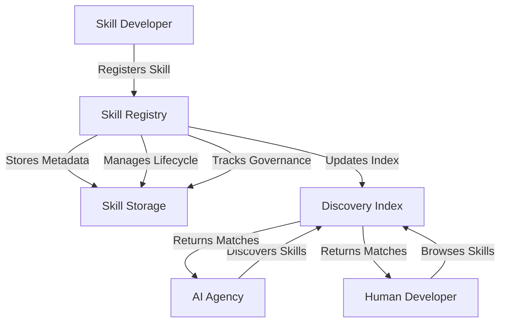
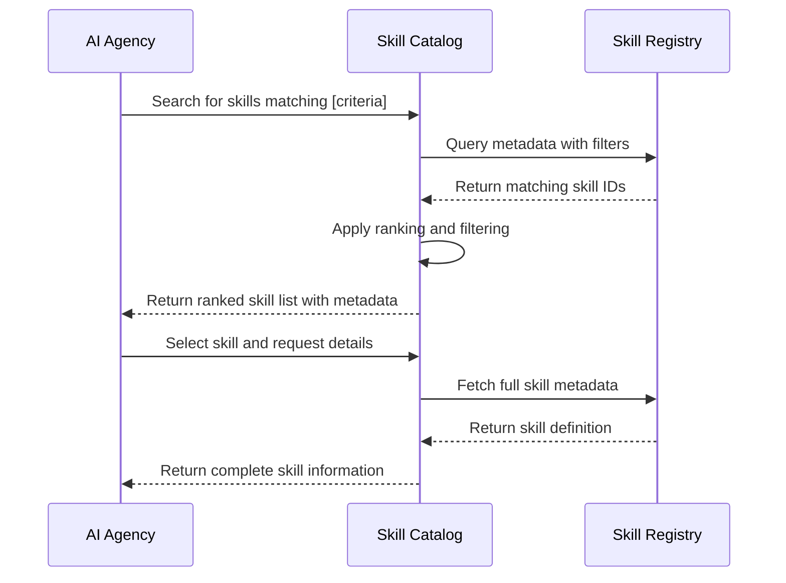
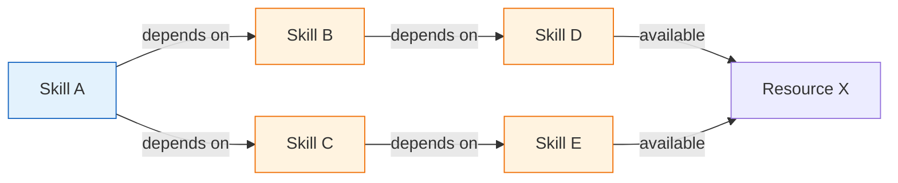

# Skills Ecosystem

## 1. Introduction

### Purpose
The Skills Ecosystem defines the architectural framework for reusable, composable engineering capabilities within AI-OS. It establishes how skills are defined, discovered, composed, and governed to enable modular extension of AI-OS functionality.

### Scope
This document covers the conceptual model, lifecycle, classification, composition, governance, validation, and integration aspects of the Skills Ecosystem. It does not prescribe specific implementations, runtime technologies, or programming languages.

### Audience
- AI-OS architects and designers
- Skill developers and contributors
- System integrators extending AI-OS capabilities
- Quality and governance officers
- AI Agency designers and maintainers

### Relationship to AI-OS
The Skills Ecosystem is a core architectural pillar of AI-OS, providing the mechanism for extending and customizing AI-OS behavior without modifying core components. Skills are the primary units of reusable capability that AI Agency leverages for autonomous operation.

### Relationship to AI Agency
Skills are the fundamental building blocks that AI Agency consumes to achieve its goals. AI Agency discovers, selects, composes, and executes skills to perform tasks, reason about the system, and adapt to changing requirements. The Skills Ecosystem provides the standardized interface through which AI Agency interacts with extensible capabilities.

## 2. Skills Philosophy

Skills exist to address the fundamental challenges of building extensible, maintainable, and intelligent systems. The philosophy is grounded in several key principles:

### Reusability
Skills encapsulate discrete units of functionality that can be reused across different contexts, tasks, and AI Agency instances. By standardizing skill interfaces, AI-OS promotes the creation of capabilities that serve multiple purposes without duplication.

### Modularity
Skills decompose complex system functionality into independent, loosely coupled modules. Each skill has a single, well-defined responsibility, reducing cognitive load and enabling independent development, testing, and evolution.

### Capability Abstraction
Skills abstract the "how" of implementation from the "what" of capability. AI Agency interacts with skills through standardized contracts, remaining agnostic to underlying implementation details, programming languages, or execution environments.

### Composability
Skills are designed to be combined in flexible ways to create more complex behaviors. Through skill chaining, orchestration, and dependency management, AI Agency can assemble sophisticated workflows from primitive capabilities.

### Discoverability
Skills must be easily discoverable by both human developers and AI Agency. Standardized metadata, cataloging mechanisms, and discovery protocols enable automated skill selection based on capability descriptions, quality attributes, and contextual relevance.

## 3. Skills Architecture

### Skill Definition
A skill is an atomic unit of executable capability that performs a specific function. Skills are defined by:
- **Interface Contract**: Standardized input/output schemas and execution protocol
- **Metadata**: Descriptive information for discovery, governance, and usage
- **Implementation**: The actual logic (kept abstract in this architecture)
- **Dependencies**: Declarative relationships to other skills or system resources

### Skill Metadata
Every skill includes standardized metadata enabling discovery, validation, and governance:
- **Identifier**: Unique, versioned skill ID (e.g., `engineering:code-review:v1.2.0`)
- **Name**: Human-readable skill name
- **Description**: Concise explanation of skill purpose and functionality
- **Category**: Primary classification (see Section 5)
- **Tags**: Keywords for enhanced discoverability
- **Author**: Skill creator or owning organization
- **Version**: Semantic version following scheme defined in Section 4
- **Requirements**: Declarative resource and capability dependencies
- **Quality Attributes**: Performance, security, reliability characteristics
- **Documentation**: Links to usage guides, examples, and references
- **Governance**: Approval status, certification level, ownership information

### Skill Registry
The Skill Registry is the central repository storing skill metadata and managing skill lifecycle. It provides:
- Registration of new skills and versions
- Storage and retrieval of skill metadata
- Indexing for discovery queries
- Lifecycle state management (Section 4)
- Governance tracking (Section 8)
- Dependency resolution assistance

### Skill Catalog
The Skill Catalog is a curated, searchable view of the Registry optimized for discovery. It provides:
- Faceted browsing by category, tags, quality attributes
- Search functionality based on metadata and content
- Skill recommendations based on context and usage patterns
- Version visibility and compatibility information
- Trust indicators and certification badges

### Skill Discovery
Discovery mechanisms enable both human and AI Agency consumers to find relevant skills:
- **Metadata Search**: Query skill metadata fields (name, description, tags, category)
- **Capability Matching**: Match skill interfaces to required input/output signatures
- **Contextual Discovery**: Consider current task, goals, and environmental state
- **Recommendation Engine**: Suggest skills based on historical usage and similarity
- **Federated Discovery**: Query multiple registries or skill sources

### Skill Dependencies
Skills may declare dependencies on:
- **Other Skills**: Prerequisite capabilities that must be available
- **System Resources**: Access to files, databases, APIs, or hardware
- **Environmental Conditions**: Specific runtime configurations or states
- **Data Artifacts**: Required input datasets or knowledge bases

Dependencies are declared declaratively in skill metadata and resolved during skill composition and execution planning.

### Mermaid Diagrams

#### Skill Registry Interaction

#### Skill Discovery Flow

#### Skill Dependency Resolution

## 4. Skill Lifecycle

Skills progress through a standardized lifecycle ensuring quality, traceability, and controlled evolution.

### Creation
Skills are created by developers following established templates and guidelines. Creation involves:
- Defining the skill interface and contract
- Implementing the core functionality
- Authoring comprehensive metadata
- Declaring dependencies and requirements
- Creating documentation and examples
- Initial version assignment (typically 0.1.0 for early access)

### Registration
New skills are submitted to the Skill Registry for inclusion:
- Validation of metadata completeness and correctness
- Basic interface contract verification
- Initial security and quality screening
- Assignment of registry-handled unique identifier
- Storage in pending approval state

### Discovery
Registered skills become available through discovery mechanisms:
- Skills appear in catalog searches and browsing
- Metadata is indexed for query performance
- Skills are accessible to AI Agency and human consumers
- Discovery respects visibility settings and access controls

### Validation
Before promotion to trusted states, skills undergo rigorous validation:
- Functional testing against specified requirements
- Performance benchmarking and characterization
- Security scanning and vulnerability assessment
- Dependency verification and compatibility checking
- Documentation completeness review
- Conformance check against Skills Ecosystem standards

### Versioning
Skills follow semantic versioning (MAJOR.MINOR.PATCH) with these guidelines:
- **PATCH**: Backward-compatible bug fixes
- **MINOR**: Backward-compatible new features or enhancements
- **MAJOR**: Breaking changes to interface or behavior
- Version increments communicate impact to consumers
- Multiple versions may coexist in registry for migration periods
- Deprecated versions are maintained for defined sunset periods

### Execution
Skills are instantiated and run by consumers:
- Dependency resolution and resource provisioning
- Secure execution environment provisioning
- Input validation and contract checking
- Execution monitoring and resource tracking
- Output collection and validation
- Error handling and failure reporting
- Telemetry and metrics collection

### Deprecation
Skills may be deprecated when superseded or no longer maintained:
- Deprecation notice published in metadata
- Continued support for defined maintenance period
- Migration guidance provided to consumers
- No new features added to deprecated versions
- Critical security patches may still be applied

### Retirement
Skills are removed from active use after deprecation period:
- Archived in registry with access restrictions
- Removal from discovery indexes and catalog
- Notification to known consumers
- Final validation of no active dependencies
- Permanent deletion after retention period expires

## 5. Skill Classification

Skills are organized into categories to aid discovery and organization. Classification is conceptual and not prescriptive of implementation.

### Engineering
Skills for software development, code manipulation, and technical tasks:
- Code generation, refactoring, and transformation
- Build system interaction and compilation
- Debugging and profiling assistance
- API design and documentation generation
- Database schema manipulation and querying

### Infrastructure
Skills for system administration, deployment, and operations:
- Cloud resource provisioning and management
- Container orchestration and configuration
- Network configuration and security group management
- Monitoring setup and alert configuration
- Backup and disaster recovery procedures

### Security
Skills for protecting systems and data:
- Vulnerability scanning and assessment
- Penetration testing and exploit simulation
- Security policy compliance checking
- Encryption key management and rotation
- Incident response and forensic analysis
- Identity and access administration

### Testing
Skills for verifying system correctness and quality:
- Test case generation and execution
- Test data creation and management
- Performance and load testing
- Fuzzing and chaos engineering
- Test result analysis and reporting
- Test environment provisioning

### Documentation
Skills for creating, maintaining, and organizing documentation:
- Technical writing and content generation
- API documentation generation from code
- Diagram and visualization creation
- Knowledge base article generation
- Translation and localization assistance
- Documentation validation and link checking

### Planning
Skills for strategic and tactical planning:
- Roadmap and release planning assistance
- Resource estimation and capacity planning
- Risk assessment and mitigation planning
- Goal decomposition and milestone definition
- Dependency analysis and critical path identification
- Sprint planning and backlog grooming

### Reasoning
Skills for cognitive processing and inference:
- Logical deduction and theorem proving
- Causal analysis and root cause investigation
- Analogical reasoning and metaphor mapping
- Decision analysis and trade-off evaluation
- Forecasting and predictive modeling
- Belief revision and uncertainty quantification

### Validation
Skills for checking correctness, compliance, and quality:
- Specification conformance checking
- Regulatory compliance validation
- Data integrity and consistency verification
- Code quality and standards adherence
- Performance benchmark validation
- Usability and accessibility assessment

### Memory
Skills for knowledge management and information retention:
- Knowledge graph construction and querying
- Experience replay and lesson learning
- Vector embedding generation and search
- Fact extraction and information synthesis
- Contextual memory maintenance and pruning
- Long-term knowledge consolidation

### MCP
Skills for Model Context Protocol integration and extension:
- MCP server creation and configuration
- Custom tool and resource development
- MCP client enhancement and optimization
- Protocol extension and negotiation
- Security policy enforcement for MCP interactions
- Performance tuning and scalability optimization

## 6. Skill Composition

Skills combine to create more complex capabilities through various composition patterns.

### Composition
Skills are composed by connecting outputs of one skill to inputs of another, creating data flow pipelines. Composition requires:
- Compatible data types and formats between connected skills
- Explicit mapping of output fields to input parameters
- Error propagation handling between composed skills
- Resource isolation and sandboxing between components
- Transactional semantics for stateful compositions when needed

### Chaining
Linear sequencing of skills where each skill processes the output of the previous:
- Simple pipeline: Skill A → Skill B → Skill C
- Conditional chaining based on intermediate results
- Looping constructs for iterative processing
- Branching and merging patterns for parallel processing
- State passage between chained skills for context preservation

### Orchestration
Advanced coordination of multiple skills with complex control flow:
- Conditional execution based on skill outcomes
- Parallel execution of independent skills
- Dynamic skill selection based on runtime conditions
- Retry policies and fallback mechanisms
- Timeout enforcement and cancellation handling
- Compensation transactions for error recovery

### Reuse
Skills are designed for multiple contexts of use:
- Parameterization to adapt to different inputs
- Configuration options for behavioral variation
- Extension points for customization without modification
- Version-specific interfaces for backward compatibility
- Skill libraries for domain-specific capability sets

### Dependency Management
Explicit declaration and resolution of skill relationships:
- Declarative dependency specification in skill metadata
- Version constraint specification (exact, range, compatible)
- Conflict detection and resolution strategies
- Transitive dependency resolution and duplication elimination
- Circular dependency detection and prevention
- Dependency scoping (public vs. private dependencies)

## 7. AI Agency Integration

Skills are the primary mechanism through which AI Agency achieves its objectives.

### Planning
AI Agency uses skills to:
- Decompose high-level goals into executable sub-tasks
- Estimate effort and resource requirements for planned actions
- Identify skill gaps requiring acquisition or development
- Create skill-based execution plans with dependencies
- Simulate plan outcomes using predictive skills
- Adjust plans based on changing circumstances and feedback

### Execution
AI Agency executes skills to:
- Perform atomic actions toward goal achievement
- Gather information and modify system state
- Respond to external events and stimuli
- Execute contingency plans when primary approaches fail
- Coordinate multiple skills in complex workflows
- Monitor execution progress and adjust in real-time

### Reflection
AI Agency applies skills to:
- Analyze execution results and outcomes
- Identify root causes of successes and failures
- Extract lessons learned for future improvement
- Evaluate skill effectiveness and efficiency
- Detect patterns and anomalies in behavior
- Generate insights for strategic adjustment

### Learning
AI Agency leverages skills to:
- Acquire new capabilities through skill acquisition
- Adapt existing skills through parameter tuning
- Combine known skills in novel configurations
- Generate synthetic training data for skill improvement
- Transfer learning between related skill domains
- Continuously improve skill selection and composition

### Goal Management
Skills support AI Agency's goal lifecycle:
- Goal formulation and refinement using analytical skills
- Goal decomposition into skill-executable sub-goals
- Progress tracking through measurement and validation skills
- Dynamic re-planning based on skill execution feedback
- Goal prioritization using value and risk assessment skills
- Goal retirement upon completion or obsolescence

### Task Delegation
AI Agency utilizes skills for:
- Delegating subtasks to other AI agents or human operators
- Providing skill-based instructions and context for delegates
- Monitoring delegated task execution through observation skills
- Evaluating delegation outcomes and providing feedback
- Managing skill loans and temporary capability transfers
- Coordinating collaborative skill execution between entities

## 8. Governance

Governance ensures skills meet quality, security, and organizational standards.

### Approval
Skills progress through approval gates:
- **Contributor**: Initial submission by developer
- **Reviewer**: Peer review of code, metadata, and tests
- **Validator**: Successful completion of validation suite
- **Approver**: Organizational approval for general use
- **Certifier**: Specialized certification for regulated domains
Each gate may have specific criteria and responsible roles.

### Certification
Skills may obtain certifications indicating special qualifications:
- **Security**: Passing security audits and penetration tests
- **Compliance**: Meeting regulatory requirements (HIPAA, SOC2, etc.)
- **Performance**: Achieving specified benchmarks under load
- **Accessibility**: Conforming to accessibility standards (WCAG)
- **Interoperability**: Validated integration with specific systems
Certifications require periodic renewal and re-validation.

### Trust
Trust mechanisms establish confidence in skill reliability:
- **Provenance**: Verifiable origin and chain of custody
- **Integrity**: Cryptographic signing to prevent tampering
- **Reputation**: Historical performance and user feedback
- **Transparency**: Available source code and build reproducibility
- **Warranty**: Formal guarantees for specific use cases
Trust levels influence skill selection and usage restrictions.

### Ownership
Clear ownership defines responsibility and accountability:
- **Creator**: Original developer or development team
- **Maintainer**: Responsible for ongoing updates and support
- **Owner**: Organization or team with ultimate authority
- **Steward**: Responsible for governance and compliance oversight
Ownership metadata includes contact information and escalation paths.

### Quality
Quality governance ensures skills meet excellence standards:
- **Testing**: Minimum test coverage and quality gates
- **Documentation**: Completeness and accuracy requirements
- **Performance**: Benchmarking and regression prevention
- **Reliability**: Error rates and availability targets
- **Maintainability**: Code complexity and technical debt limits
Quality standards evolve based on feedback and industry practices.

### Versioning
Version governance manages skill evolution:
- **Backward Compatibility**: Rules for breaking changes
- **Deprecation Policy**: Notice periods and migration support
- **Version Visibility**: Which versions are discoverable and recommended
- **Security Patching**: Handling of critical vulnerabilities in old versions
- **End-of-Life**: Formal retirement process for obsolete versions

### Compatibility
Compatibility governance ensures skills work together:
- **Interface Stability**: Guarantees for specific version ranges
- **Data Format Contracts**: Schemas for inputs and outputs
- **Runtime Compatibility**: Supported execution environments
- **Dependency Conflict Resolution**: Strategies for version conflicts
- **Cross-Skill Standards**: Shared conventions and protocols

## 9. Validation

Relationship with VALIDATION_ARCHITECTURE.md:
- The Skills Ecosystem defines what skills are and how they are governed
- The Validation Architecture defines how skills are tested, verified, and confirmed to meet requirements
- Skills must conform to validation standards specified in VALIDATION_ARCHITECTURE.md
- Validation Architecture provides the methodologies, tools, and criteria for skill validation
- Skills Ecosystem references Validation Architecture for:
  - Validation phases and gates in skill lifecycle
  - Required test types and coverage levels
  - Performance and security testing methodologies
  - Compliance checking procedures
  - Quality gate definitions and thresholds
- Skills must be validated according to Validation Architecture before promotion to trusted states
- Validation Architecture depends on Skills Ecosystem for:
  - Standardized skill interfaces for testability
  - Metadata for test case generation and oracle derivation
  - Dependency information for test environment setup
  - Versioning information for compatibility testing
  - Governance records for trust and certification validation

## 10. Repository Integration

Relationship with REPOSITORY_ECOSYSTEM.md:
- Skills Ecosystem defines capabilities that operate on and with repositories
- Repository Ecosystem defines how code is stored, managed, and evolved
- Skills for repository operations (cloning, committing, branching, etc.) are defined in Skills Ecosystem
- Repository Ecosystem provides the context and constraints within which repository skills operate
- Skills Ecosystem references Repository Ecosystem for:
  - Repository structures and conventions that skills must respect
  - Branch management policies that versioning skills must follow
  - Merge request workflows that collaboration skills must implement
  - Access control models that security skills must enforce
  - Artifact storage and retrieval patterns that data skills must use
- Repository Ecosystem depends on Skills Ecosystem for:
  - Programmable interface to repository operations
  - Standardized operations for automation and scripting
  - Composable capabilities for complex workflows
  - Governance framework for quality and security assurance
  - Discovery mechanism for finding appropriate repository skills
- Integration ensures skills can safely and effectively interact with repository systems while respecting established conventions and policies

## 11. Security

Conceptual security considerations for the Skills Ecosystem:
- Skills operate in least-privilege execution environments
- Skill inputs and outputs are validated to prevent injection attacks
- Skill metadata is signed to prevent tampering and spoofing
- Skill execution is monitored for anomalous behavior
- Dependency chains are analyzed for transitive security risks
- Skills handling sensitive data implement appropriate protections
- Communication between skills uses secure channels when required
- Skill registries implement access controls and audit logging
- Skills follow secure coding practices and vulnerability disclosure processes
- Security skills are subject to the same governance as other skills
- The ecosystem supports security skill composition for defense in depth

## 12. Architecture Invariants

These statements must always hold true for a compliant Skills Ecosystem:

1. **Skill Immutability**: Once released, a specific skill version's interface and behavior never change
2. **Metadata Completeness**: Every skill has all required metadata fields populated
3. **Discoverability Guarantee**: All registered, non-deprecated skills are discoverable through standard mechanisms
4. **Interface Standardization**: All skills expose a standardized execution contract regardless of implementation
5. **Dependency Declarativity**: All skill dependencies are declared explicitly in metadata
6. **Governance Traceability**: Every skill has complete provenance and approval history
7. **Version Clarity**: Version numbers accurately reflect backward compatibility guarantees
8. **Composition Safety**: Composed skills maintain individual security and reliability boundaries
9. **AI Agency Neutrality**: The ecosystem does not favor any particular AI Agency architecture or implementation
10. **Evolution Compatibility**: New versions maintain backward compatibility unless explicitly marked as breaking

## 13. Conformance

Key words "MUST", "MUST NOT", "REQUIRED", "SHALL", "SHALL NOT", "SHOULD", "SHOULD NOT", "RECOMMENDED", "MAY", and "OPTIONAL" in this document are to be interpreted as described in RFC 2119.

Conformance requirements for a Skills Ecosystem implementation:

- **Skill Definition** MUST include interface contract, metadata, and dependency declarations
- **Skill Registry** MUST provide storage, indexing, and lifecycle management for skills
- **Skill Discovery** MUST support metadata-based and capability-based queries
- **Skill Lifecycle** MUST include all phases from creation to retirement with defined transitions
- **Skill Classification** MUST provide the categories defined in Section 5 or equivalent organization
- **Skill Composition** MUST support chaining, orchestration, and reuse patterns
- **AI Agency Integration** MUST define how skills interact with planning, execution, reflection, learning, goal management, and task delegation
- **Governance** MUST include approval, certification, trust, ownership, quality, versioning, and compatibility mechanisms
- **Validation** MUST reference and conform to the Validation Architecture
- **Repository Integration** MUST define relationships with the Repository Ecosystem
- **Security** MUST address the conceptual considerations in Section 11
- **Architecture Invariants** MUST be maintained in all implementations
- Documentation SHOULD include examples and usage guidelines
- Extensions MAY add additional categories or governance mechanisms
- Implementations MAY choose specific technologies for registry, discovery, and execution

## 14. Cross References

- **AI_AGENCY.md**: Defines how AI Agency interacts with skills for autonomous operation
- **MCP_ECOSYSTEM.md**: Details Model Context Protocol integration points for skills
- **REPOSITORY_ECOSYSTEM.md**: Specifies how skills operate on and with code repositories
- **VALIDATION_ARCHITECTURE.md**: Provides validation methodologies and standards for skills
- **IMPLEMENTATION_GUIDE.md**: Offers practical guidance for skill development and deployment

---
*This document represents the frozen architecture for the AI-OS Skills Ecosystem. As the authoritative specification, it governs all skill-related design and implementation within AI-OS.*