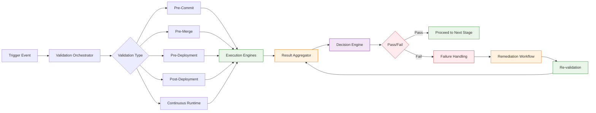

# Validation Architecture

## Purpose
The Validation Architecture in AI-OS ensures system correctness, safety, and reliability by providing a comprehensive framework for validating all aspects of the system at multiple layers and stages. It establishes technology-neutral contracts for validation operations, enabling consistent verification across diverse execution environments while maintaining strict separation from core operational concerns.

## Scope
The validation architecture applies to all validation activities within AI-OS, including but not limited to:
- Architectural component validation
- Goal and objective validation
- Workflow and process validation
- Capability and skill validation
- MCP (Model Context Protocol) validation
- Memory system validation
- Security and compliance validation
- AI model and output validation
- Human-in-the-loop validation
- Runtime and deployment validation
- Artifact and output validation

This specification does not cover:
- Specific validation implementation techniques or tools
- Validation tooling frameworks or libraries
- Deployment-specific validation procedures
- Business logic validation within user applications

## Audience
This document is intended for:
- System architects designing AI-OS compliant systems
- Engineers implementing validation mechanisms
- Auditors and compliance officers verifying system correctness
- Developers extending AI-OS through validation extensions
- Technical stakeholders requiring understanding of validation guarantees

## Validation Philosophy
AI-OS adopts a **validation-first** approach where validation is integrated throughout the system lifecycle rather than treated as a separate phase. The philosophy is grounded in these principles:

### 1. **Shift-Left Validation**
Validation occurs as early as possible in the lifecycle to detect and correct issues before they propagate, reducing remediation cost and increasing system reliability.

### 2. **Continuous Validation**
Validation is not a one-time event but a continuous process that operates during system design, development, deployment, and runtime.

### 3. **Layered Defense**
Multiple validation layers provide defense-in-depth, ensuring that if one layer misses an issue, subsequent layers are likely to catch it.

### 4. **Technology Neutrality**
Validation contracts are defined independently of specific tools, frameworks, or implementation technologies, allowing flexibility in how validation is achieved.

### 5. **Evidence-Based Assurance**
Validation produces auditable evidence that can be used for compliance reporting, troubleshooting, and continuous improvement.

## Why Validation Exists
Validation exists in AI-OS to address fundamental challenges in autonomous AI systems:

### 1. **Correctness Assurance**
Ensure that AI agents, workflows, and system components behave as intended and produce correct outputs.

### 2. **Safety and Risk Mitigation**
Prevent harmful actions, unauthorized operations, and system failures that could result from incorrect AI behavior.

### 3. **Trust and Transparency**
Provide verifiable evidence of system behavior to stakeholders, enabling trust in autonomous operations.

### 4. **Regulatory Compliance**
Meet organizational, industry, and regulatory requirements for system verification and validation.

### 5. **Quality Gates**
Establish checkpoints that must be passed before allowing progression to subsequent lifecycle stages.

### 6. **Continuous Improvement**
Generate validation data that feeds back into learning systems for ongoing system enhancement.

## Validation Layers
AI-OS implements validation through multiple interconnected layers that operate at different levels of abstraction:

### 1. **Architectural Validation**
Validates the structural integrity, component interactions, and compliance with architectural principles.

### 2. **Goal Validation**
Ensures that objectives are well-defined, feasible, and aligned with system capabilities and constraints.

### 3. **Workflow Validation**
Verifies that processes, procedures, and execution flows are correct, complete, and adhere to defined standards.

### 4. **Capability Validation**
Confirms that system capabilities (tools, skills, MCPs) are correctly implemented, registered, and functional.

### 5. **Memory Validation**
Ensures the integrity, consistency, and correctness of stored knowledge and learning data.

### 6. **Security Validation**
Checks for vulnerabilities, compliance with security policies, and resistance to threats.

### 7. **AI Validation**
Verifies AI model behavior, output quality, and alignment with intended purposes.

### 8. **Human Validation**
Incorporates human judgment for complex validations that cannot be fully automated.

### 9. **Runtime Validation**
Monitors system behavior during execution to detect anomalies and ensure operational correctness.

### 10. **Artifact Validation**
Examines outputs, configurations, and deployments for correctness and compliance.

### 11. **Output Validation**
Specifically validates the results produced by AI agents and workflows against acceptance criteria.

## Architecture Validation
Architecture validation ensures that the AI-OS system structure adheres to defined architectural principles and contracts.

### Responsibilities:
- Validate component interfaces and communication patterns
- Ensure compliance with architectural decision records (ADRs)
- Verify separation of concerns and boundary integrity
- Check for architectural drift or violations
- Confirm proper layering and dependency management

### Mechanisms:
- Static analysis of architectural diagrams and specifications
- Runtime monitoring of component interactions
- Compliance checks against ADR requirements
- Dependency analysis and coupling measurements

### References:
- See [ARCHITECTURE_DECISIONS.md](../ARCHITECTURE_DECISIONS.md) for validated architectural decisions
- See [AI_OS_MASTER_CONTEXT.md](../AI_OS_MASTER_CONTEXT.md) Section 2 for core architectural philosophy

## Goal Validation
Goal validation ensures that objectives provided to the AI-OS system are well-formed, achievable, and aligned with system capabilities.

### Responsibilities:
- Validate goal syntax and semantic completeness
- Check feasibility against available resources and capabilities
- Ensure goals are measurable and testable
- Verify alignment with organizational policies and constraints
- Detect conflicting or contradictory goals

### Mechanisms:
- Natural language processing for goal analysis
- Resource requirement estimation and validation
- Constraint satisfaction checking
- Policy compliance verification
- Stakeholder review and approval workflows

## Workflow Validation
Workflow validation verifies that processes, procedures, and execution flows within AI-OS are correct and complete.

### Responsibilities:
- Validate workflow definitions for correctness and completeness
- Ensure proper sequencing of steps and decision points
- Verify error handling and exception paths
- Check for deadlock possibilities and livelock conditions
- Validate workflow transitions and state management

### Mechanisms:
- Workflow syntax and schema validation
- Simulation and model checking of workflow execution
- Path coverage analysis
- Timing and performance constraint validation
- Human review of complex workflow logic

## Capability Validation
Capability validation confirms that system capabilities (tools, skills, MCPs) are correctly implemented and functional.

### Responsibilities:
- Validate capability registration and discovery mechanisms
- Check interface compliance and contract adherence
- Verify functional correctness of capability implementations
- Ensure proper resource utilization and cleanup
- Validate security and access controls for capabilities

### Mechanisms:
- Interface contract testing
- Functional test execution in isolated environments
- Resource monitoring and leak detection
- Security scanning and penetration testing
- Version compatibility validation

## Skill Validation
Skill validation ensures that AI-OS skills (reusable agent behaviors) are correctly defined, parameterized, and applicable.

### Responsibilities:
- Validate skill definition syntax and structure
- Check parameter definitions and validation rules
- Verify skill applicability conditions and preconditions
- Ensure skill outputs conform to expected formats
- Validate skill composition and chaining capabilities

### Mechanisms:
- Skill definition schema validation
- Parameter boundary and type checking
- Applicability condition testing
- Output format validation
- Composition safety analysis

## MCP Validation
MCP validation confirms that Model Context Protocol implementations are correct, secure, and interoperable.

### Responsibilities:
- Validate MCP transport layer implementations
- Check message formatting and protocol adherence
- Verify security capabilities (authentication, encryption)
- Ensure proper context management and session handling
- Validate error handling and recovery mechanisms

### Mechanisms:
- Protocol conformance testing
- Interoperability testing with reference implementations
- Security validation (penetration testing, vulnerability scanning)
- Performance and scalability testing
- Fault tolerance and resilience testing

## Memory Validation
Memory validation ensures the integrity, consistency, and correctness of AI-OS memory systems.

### Responsibilities:
- Validate memory storage integrity and consistency
- Check for data corruption or loss
- Verify retrieval accuracy and relevance
- Ensure proper memory lifecycle management
- Validate memory security and access controls

### Mechanisms:
- Checksum and hash verification for stored data
- Consistency checks across distributed memory systems
- Accuracy testing of retrieval algorithms
- Leak detection and resource utilization monitoring
- Access control validation and audit trail verification

## Security Validation
Security validation checks for vulnerabilities, compliance with security policies, and resistance to threats.

### Responsibilities:
- Identify security vulnerabilities in system components
- Validate compliance with security policies and standards
- Verify effectiveness of security controls and mechanisms
- Check for unauthorized access paths or privilege escalations
- Validate secure configuration and hardening

### Mechanisms:
- Static application security testing (SAST)
- Dynamic application security testing (DAST)
- Dependency vulnerability scanning
- Configuration compliance checking
- Penetration testing and red team exercises
- Security policy validation and enforcement checks

## AI Validation
AI validation verifies AI model behavior, output quality, and alignment with intended purposes.

### Responsibilities:
- Validate model outputs for correctness and relevance
- Check for bias, fairness, and ethical considerations
- Verify robustness against adversarial inputs
- Ensure model stability and consistency
- Validate alignment with specified goals and constraints

### Mechanisms:
- Output quality metrics and scoring
- Bias and fairness testing
- Adversarial robustness testing
- Consistency and repeatability validation
- Goal alignment verification through outcome measurement
- Human evaluation studies for subjective qualities

## Human Validation
Human validation incorporates human judgment for complex validations that cannot be fully automated.

### Responsibilities:
- Provide expert review for complex system behaviors
- Validate outputs requiring subjective judgment
- Verify usability and user experience aspects
- Check for ethical and societal implications
- Validate training data labeling and annotation quality

### Mechanisms:
- Expert review panels and committees
- User acceptance testing (UAT) sessions
- Usability studies and heuristic evaluations
- Ethical review board evaluations
- Inter-rater reliability measurements for labeling tasks

## Runtime Validation
Runtime validation monitors system behavior during execution to detect anomalies and ensure operational correctness.

### Responsibilities:
- Monitor system metrics for anomalous patterns
- Detect runtime errors and exceptions
- Verify resource utilization stays within bounds
- Check for performance degradation or bottlenecks
- Validate security posture during operation

### Mechanisms:
- Real-time monitoring and alerting
- Anomaly detection using statistical and ML techniques
- Log analysis and error pattern detection
- Resource utilization tracking and forecasting
- Security information and event management (SIEM)
- Distributed tracing and latency analysis

## Artifact Validation
Artifact validation examines outputs, configurations, and deployments for correctness and compliance.

### Responsibilities:
- Validate configuration files for correctness and completeness
- Check deployment manifests for validity
- Ensure generated code compiles and passes basic tests
- Validate documentation accuracy and completeness
- Verify release notes and changelog correctness

### Mechanisms:
- Configuration schema validation
- Deployment manifest parsing and validation
- Static code analysis and basic compilation
- Documentation link checking and completeness verification
- Semantic versioning compliance checking

## Output Validation
Output validation specifically validates the results produced by AI agents and workflows against acceptance criteria.

### Responsibilities:
- Compare actual outputs against expected results
- Validate output formatting and structure
- Check for completeness and correctness of results
- Verify output meets specified quality thresholds
- Validate output against business rules and constraints

### Mechanisms:
- Result comparison and difference analysis
- Schema validation for structured outputs
- Completeness checks for expected output elements
- Quality metric computation and threshold validation
- Business rule engine evaluation
- Statistical validation for probabilistic outputs

## Conformance Levels
AI-OS defines conformance levels to specify the rigor and scope of validation applied:

### Level 1: Basic Validation
- Syntax and format checking
- Basic completeness verification
- Essential security checks
- Minimal runtime monitoring

### Level 2: Standard Validation
- All Level 1 checks plus:
- Functional correctness validation
- Performance benchmark verification
- Standard security scanning
- Basic compliance checking
- Essential human review points

### Level 3: Rigorous Validation
- All Level 2 checks plus:
- Comprehensive security penetration testing
- Advanced performance and load testing
- Formal methods verification where applicable
- Extensive compliance validation
- Comprehensive human expert review
- Chaos engineering and resilience testing
- Formal validation of critical properties

## Validation Pipeline
The validation pipeline orchestrates validation activities across the system lifecycle:

### 1. **Pre-Commit Validation**
- Runs on developer workspaces before code commitment
- Includes syntax checking, linting, unit tests, basic security scans
- Provides immediate feedback to developers

### 2. **Pre-Merge Validation**
- Runs in CI/CD environment before merging to main branches
- Includes integration tests, security scans, performance tests
- Validates compatibility with mainline code

### 3. **Pre-Deployment Validation**
- Runs before deploying to staging or production environments
- Includes compliance validation, security hardening checks
- Validates deployment configuration and infrastructure

### 4. **Post-Deployment Validation**
- Runs after deployment to validate operational correctness
- Includes smoke tests, health checks, monitoring validation
- Verifies system is functioning as expected in target environment

### 5. **Continuous Runtime Validation**
- Ongoing validation during system operation
- Includes monitoring, anomaly detection, security event analysis
- Provides real-time feedback on system health and correctness

### Pipeline Components:
- **Validation Triggers**: Events that initiate validation (code commit, deployment request, time-based)
- **Validation Orchestrators**: Coordinate execution of validation activities
- **Validation Execution Engines**: Perform specific validation checks
- **Result Aggregators**: Collect and normalize validation results
- **Decision Engines**: Determine pass/fail based on validation policies
- **Feedback Mechanisms**: Communicate results to stakeholders and trigger remediation

## Failure Handling
When validation fails, AI-OS employs structured failure handling mechanisms:

### Failure Classification
- **Blocking Failures**: Prevent progression to next lifecycle stage
- **Warning Failures**: Allow progression with documented risks
- **Informational Failures**: Provide insights but do not block progression

### Remediation Workflows
- **Automatic Remediation**: For predictable failures with known fixes
- **Guided Remediation**: Provides step-by-step instructions for resolution
- **Escalation Paths**: Routes complex failures to human experts
- **Deviation Approval**: Formal process for accepting known issues with mitigation

### Reporting and Tracking
- Failure reporting with detailed diagnostics
- Issue tracking integration for remediation workflow
- Trend analysis to identify recurring failure patterns
- Root cause analysis integration for systemic issues

## Validation Reports
Validation reports provide auditable evidence of validation activities:

### Report Types
- **Execution Reports**: Detailed logs of validation activities performed
- **Result Summaries**: High-level pass/fail metrics and trends
- **Detail Reports**: Specific findings, evidence, and remediation guidance
- **Trend Reports**: Historical analysis of validation outcomes
- **Compliance Reports**: Specific to regulatory or organizational requirements

### Report Contents
- Validation scope and criteria applied
- Timestamp and execution context
- Pass/fail status for each validation check
- Evidence supporting validation outcomes
- Remediation recommendations for failed validations
- References to relevant standards and policies

### Distribution
- Automated delivery to stakeholder distribution lists
- Publication to validation dashboards and portals
- Archival for audit and compliance purposes
- Integration with issue tracking and change management systems

## Quality Gates
Quality gates are validation checkpoints that must be passed before allowing progression:

### Gate Definition
- Clearly defined validation criteria and thresholds
- Automated or manual evaluation mechanisms
- Explicit pass/fail determination logic
- Documented escalation paths for failures

### Gate Types
- **Architecture Gate**: Validates architectural compliance before implementation
- **Development Gate**: Validates code quality before integration
- **Release Gate**: Validates release readiness before deployment
- **Operational Gate**: Validates operational readiness before activation
- **Compliance Gate**: Validates regulatory compliance before go-live

### Gate Enforcement
- Automated blocking of progression on failure
- Manual override with proper authorization and justification
- Automatic triggering of remediation workflows
- Metrics collection for gate effectiveness measurement

## Governance
Validation governance ensures consistent application and continuous improvement of validation practices:

### Governance Structure
- **Validation Architecture Board**: Defines validation standards and policies
- **Domain Validation Leads**: Oversee validation in specific areas (AI, security, etc.)
- **Validation Practitioners Community**: Shares best practices and lessons learned
- **Audit and Compliance Function**: Ensures adherence to validation requirements

### Responsibilities
- Establish and maintain validation standards and policies
- Define validation conformance levels and requirements
- Approve validation tools, techniques, and methodologies
- Monitor validation effectiveness and outcomes
- Drive continuous improvement of validation practices
- Ensure validation independence and objectivity
- Manage validation resource allocation and investment

### Processes
- Regular validation standards review and updates
- Validation effectiveness measurement and reporting
- Validation training and certification programs
- Validation tool and technique evaluation
- Lessons learned capture and dissemination
- Validation audit and assessment programs

## Relationship to Architecture Parts
The validation architecture relates to other AI-OS architecture specification parts as follows:

### Part 1: Hermes Kernel
- Validation mechanisms integrate with kernel event system
- Kernel provides execution context for validation activities
- Validation results inform kernel scheduling and resource decisions

### Part 2: Core Managers
- Validation validates the correct operation of all nine Core Managers
- CapabilityManager provides validation of capability registrations
- MemoryManager enables storage and retrieval of validation evidence
- AIAgencyService coordinates validation of agent activities

### Part 3: Engineering Services
- Validation architecture itself is an engineering service
- Other engineering services (logging, monitoring) support validation activities
- Validation results feed into engineering service improvement cycles

### Part 4: Service Framework
- Validation services follow the standard service framework contracts
- Service discovery enables dynamic validation service composition
- Service lifecycle management applies to validation services

### Part 5: Configuration System
- Validation criteria and thresholds are managed through configuration
- Validation results inform configuration adaptation decisions
- Configuration validation ensures validation system is properly configured

### Part 6: Event System
- Validation activities publish events for monitoring and correlation
- Validation results are distributed via the event system
- Event system enables real-time validation feedback loops

### Part 7: AI Agency and Governance
- Validation governs AI agent activities and behaviors
- FinalJudge provides human-in-the-loop validation capabilities
- CouncilManager oversees validation policy compliance

### Part 8: Memory Architecture
- Validation ensures integrity of memory storage and retrieval
- Validation evidence is stored and retrieved via memory systems
- Learning from validation outcomes is stored in memory systems

### Part 9: Skills Ecosystem
- Validation ensures skill correctness and applicability
- Skill validation is a core validation activity
- Validation results inform skill recommendation and selection

### Part 10: MCP Ecosystem
- Validation ensures MCP implementation correctness and security
- MCP validation is a core validation activity
- Validation results inform MCP selection and composition

### Part 11: Repository Ecosystem
- Validation ensures repository integrity and correctness
- Repository validation is a core validation activity
- Validation results inform repository trust and usage decisions

### Part 12: Observability & Telemetry
- Validation enhances observability through structured validation events
- Telemetry data supports validation anomaly detection
- Validation results contribute to system health indicators

### Part 13: Fault Tolerance & Recovery
- Validation detects conditions that could lead to faults
- Validation results inform fault tolerance mechanisms
- Recovery validation ensures restored systems are correct

### Part 14: Goal-Driven Execution & Agentic Systems
- Validation ensures goals are valid and achievable
- Agent execution is continuously validated for correctness
- Validation results inform goal adaptation and replanning

### Part 15: Validation Architecture
- This document defines the validation architecture
- Specifies validation principles, layers, mechanisms, and governance
- Establishes contracts for validation service implementation

## Mermaid Diagrams

### Validation Layers Overview

```mermaid
graph TD
    A[Validation Layers] --> B[Architectural Validation]
    A --> C[Goal Validation]
    A --> D[Workflow Validation]
    A --> E[Capability Validation]
    A --> F[Skill Validation]
    A --> G[MCP Validation]
    A --> H[Memory Validation]
    A --> I[Security Validation]
    A --> J[AI Validation]
    A --> K[Human Validation]
    A --> L[Runtime Validation]
    A --> M[Artifact Validation]
    A --> N[Output Validation]
    
    style B fill:#E3F2FD,stroke:#1565C0,stroke-width:1px
    style C fill:#E3F2FD,stroke:#1565C0,stroke-width:1px
    style D fill:#E3F2FD,stroke:#1565C0,stroke-width:1px
    style E fill:#E3F2FD,stroke:#1565C0,stroke-width:1px
    style F fill:#E3F2FD,stroke:#1565C0,stroke-width:1px
    style G fill:#E3F2FD,stroke:#1565C0,stroke-width:1px
    style H fill:#E3F2FD,stroke:#1565C0,stroke-width:1px
    style I fill:#E3F2FD,stroke:#1565C0,stroke-width:1px
    style J fill:#E3F2FD,stroke:#1565C0,stroke-width:1px
    style K fill:#E3F2FD,stroke:#1565C0,stroke-width:1px
    style L fill:#E3F2FD,stroke:#1565C0,stroke-width:1px
    style M fill:#E3F2FD,stroke:#1565C0,stroke-width:1px
    style N fill:#E3F2FD,stroke:#1565C0,stroke-width:1px
```

### Validation Pipeline Flow

## Cross References
- [ARCHITECTURE_DECISIONS.md](../ARCHITECTURE_DECISIONS.md) - Architectural decisions that validation ensures compliance with
- [AI_AGENCY.md](../AI_AGENCY.md) - AI Agency architecture including FinalJudge for human validation
- [AI_OS_MASTER_CONTEXT.md](../AI_OS_MASTER_CONTEXT.md) - Master context document containing validation architecture overview (Section 18)

---
*This document defines the validation architecture for AI-OS. It is technology-neutral and implementation-independent, focusing on the what and why of validation rather than specific how-to instructions.*