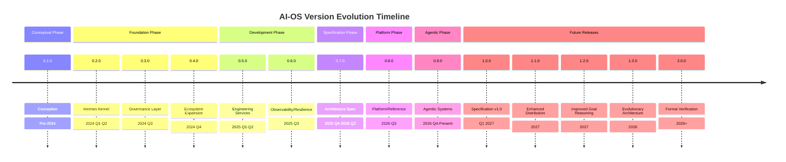

# AI-OS Version History

## Introduction

### Purpose
This document serves as the authoritative version history for AI-OS, documenting the evolution of the system from inception through the current Architecture Specification. It provides a chronological record of major releases, architectural changes, and compatibility guarantees.

### Scope
This document covers all major and minor versions of AI-OS from the initial conception (Phase 0) through the current Agentic Systems & Ecosystem Maturity phase. It includes version numbers, release dates, key features, architectural changes, breaking changes, and compatibility information.

### Audience
This document is intended for:
- AI-OS architects and developers
- System integrators and implementers
- Technology officers making adoption decisions
- Auditors and compliance officers
- Researchers studying the evolution of AI agent orchestration systems

## Version Philosophy

AI-OS follows a time-based versioning philosophy aligned with its architectural evolution phases rather than strict semantic versioning. Each major version corresponds to a fundamental shift in architectural paradigm:

**Versioning Principles:**
1. **Architecture-Driven**: Version increments reflect significant architectural evolutions, not just feature additions
2. **Backward Compatibility**: Major versions maintain compatibility through defined migration paths
3. **Transparency**: Each version documents what was preserved, refined, and superseded
4. **Governance**: Version changes require Architecture Review Board (ARB) approval when affecting frozen specifications
5. **Clarity**: Version numbers clearly indicate architectural maturity and stability guarantees

**Version Format:** `MAJOR.MINOR.PATCH`
- **MAJOR**: Increments with fundamental architectural paradigm shifts (e.g., kernel-centric → platform-centric)
- **MINOR**: Increments with significant feature additions within the same architectural paradigm
- **PATCH**: Increments with bug fixes, security patches, and minor enhancements

## Version Timeline

### Version 0.1.0 - Conception (Pre-2024)
**Vision**: Replace shell scripts with AI-driven workflows for simple automation tasks
**Milestones**: Initial concept formulation as "Hermes OS"
**Major Architectural Changes**: 
- Conceptual foundation for AI agent orchestration
- Initial vision for event-driven autonomous workflows
**Breaking Changes**: N/A (initial version)
**Compatibility**: N/A
**Architecture Maturity**: Conceptual/prototype

### Version 0.2.0 - Hermes Kernel Formation (2024 Q1-Q2)
**Vision**: Orchestrate engineering workflows through event-driven AI agents with reliable execution
**Milestones**: 
- Formalization of the four-core-component kernel (EventBus, StateManager, WorkflowManager, ResourceManager)
- Introduction of initial capability managers (Memory, LLM, Tool, Storage)
- Basic workflow orchestration capabilities
**Major Architectural Changes**:
- Establishment of Hermes as the kernel/orchestration core
- Event-first communication principle
- Kernel as pure orchestrator with zero domain logic
- Capability manager ownership pattern
**Breaking Changes**: N/A (foundational version)
**Compatibility**: N/A
**Architecture Maturity**: Foundational kernel established

### Version 0.3.0 - Governance Layer Addition (2024 Q3)
**Vision**: AI agent orchestration with human-governed AI and structured decision-making
**Milestones**:
- Introduction of CouncilManager for AI governance
- Claude Council with voting mechanisms (MAJORITY/UNANIMOUS/WEIGHTED)
- LLM Council for model decisions
- RootCauseManager for failure analysis
- AI Agency service for agent lifecycle management
**Major Architectural Changes**:
- Governance layer added to kernel
- Consensus mechanisms for AI-driven decisions
- Failure analysis and classification systems
- Agent lifecycle management with audit trails
**Breaking Changes**: None (additive to kernel)
**Compatibility**: Backward compatible with v0.2.0
**Architecture Maturity**: Governance capabilities added

### Version 0.4.0 - Ecosystem Expansion (2024 Q4)
**Vision**: Extensible AI-OS with external tool connectivity and reusable AI capabilities
**Milestones**:
- MCP integration for external tool connectivity
- Skills framework for reusable AI capabilities
- Enhanced MemoryManager with five-tier architecture
- Introduction of ContextManager and AgentManager
**Major Architectural Changes**:
- Ecosystem extension points formalized
- Standardized skill interfaces and contracts
- Memory architecture expansion to five tiers
- Context and agent lifecycle management
**Breaking Changes**: None (additive extensions)
**Compatibility**: Backward compatible with v0.3.0
**Architecture Maturity**: Ecosystem capabilities established

### Version 0.5.0 - Engineering Services Completion (2025 Q1-Q2)
**Vision**: Complete SDLC automation through event-driven engineering services
**Milestones**:
- Completion of all eight Engineering Services (Planning through Memory)
- ServiceFramework formalization with BaseService
- Topological service initialization/shutdown patterns
- Event-driven service communication patterns established
**Major Architectural Changes**:
- Engineering services completion
- Service framework standardization
- Dependency management and lifecycle patterns
- Validation of event-driven model for full SDLC
**Breaking Changes**: None (additive services)
**Compatibility**: Backward compatible with v0.4.0
**Architecture Maturity**: Complete engineering workflow orchestration

### Version 0.6.0 - Observability and Resilience (2025 Q3)
**Vision**: Observable, resilient AI-OS with continuous improvement mechanisms
**Milestones**:
- ObservabilityManager implementation
- Enhanced failure handling and classification
- Health check systems deployment
- Improved checkpointing mechanisms
- Learning Loop implementation for continuous improvement
**Major Architectural Changes**:
- Observability and telemetry infrastructure
- Fault tolerance and recovery enhancements
- Health monitoring and diagnostics
- Continuous learning from execution patterns
**Breaking Changes**: None (additive capabilities)
**Compatibility**: Backward compatible with v0.5.0
**Architecture Maturity**: Production-ready with observability

### Version 0.7.0 - Architecture Specification Formation (2025 Q4-2026 Q2)
**Vision**: AI-OS as specification-governed platform with formalized architecture
**Milestones**:
- Recognition of AI-OS as more than an implementation
- Formal separation between Hermes Kernel and AI-OS Platform
- Architecture Specification initiative begins
- Creation of Parts 0-12+ as frozen specifications
- Conformance testing framework established
**Major Architectural Changes**:
- Kernel/Platform separation enforced
- Architecture Specification as primary artifact
- Fixed component counts (4 Core Components, 9 Core Managers)
- Event-First Communication Enforcement
- Specification/Implementation separation
**Breaking Changes**: 
- Kernel instantiation now enforces singleton pattern
- Component counts fixed at exactly 4 CC and 9 CM
- Communication restricted to EventBus only (post-initialization)
**Compatibility**: 
- Major version requiring migration from pre-specification versions
- Clear migration guidance provided in ARCHITECTURE_EVOLUTION.md
- Conformance levels (L1-L4) allow gradual adoption
**Architecture Maturity**: Specification-defined with conformance testing

### Version 0.8.0 - Platform/Reference Architecture (2026 Q3)
**Vision**: AI-OS as platform/runtime rather than monolithic product with ecosystem focus
**Milestones**:
- Recognition of AI-OS as platform/runtime rather than monolithic product
- Shift to specification as primary artifact
- Ecosystem-focused evolution emphasized
- Implementation independence established
- Hermes positioned as reference runtime
**Major Architectural Changes**:
- Platform mindset adoption (enabling vs. prescribing)
- Ecosystem-centric evolution (Skills, MCP, Repository)
- Reference runtime concept for Hermes
- Technology neutrality and implementation independence
**Breaking Changes**:
- Extension points formalized and governed
- Ecosystem components must target specification contracts
- Reference runtime provides baseline but is not prescriptive
**Compatibility**:
- Backward compatible with specification-defined versions
- Ecosystem components versioned for compatibility
- Reference runtime maintains specification compliance
**Architecture Maturity**: Platform architecture with specification governance

### Version 0.9.0 - Agentic Systems & Ecosystem Maturity (2026 Q4-Present)
**Vision**: Goal-driven, self-improving engineering through specification-guided agentic ecosystems
**Milestones**:
- Goal-driven execution engine implementation
- Autonomous agentic behavior with self-looping/reflection
- Validation-first execution patterns
- Ecosystem maturity (Skills, MCP, Repository ecosystems)
- Reference runtimes and implementations
**Major Architectural Changes**:
- Evolution from predefined workflows to goal-driven execution
- Autonomous agents with configurable autonomy levels
- Continuous observation and retrospective capabilities
- Pre/post-execution validation with automatic correction
- Ecosystem governance and discovery mechanisms
**Breaking Changes**:
- Workflow execution model changed from static to adaptive
- Agent communication patterns enhanced for collaboration
- Validation mechanisms integrated at all execution stages
**Compatibility**:
- Backward compatible with platform/reference architecture
- Goal-driven execution builds upon existing service framework
- Ecosystem components remain compatible through specification contracts
**Architecture Maturity**: Mature agentic platform with ecosystem governance

## Relationship to ADRs

This version history complements the Architecture Decision Records (ADRs) by providing:
- Chronological context for when architectural decisions were made
- Version-specific impact analysis of ADRs
- Migration guidance between versions affected by ADRs
- Historical record of decision rationale and outcomes

Specific ADRs referenced in this document include:
- ADR-001: Kernel/Platform Separation (Late 2025)
- ADR-002: Event-First Communication Enforcement (Early 2025)
- ADR-003: Architecture Specification as Primary Artifact (Mid 2025)
- ADR-004: Fixed Component Counts (Early 2025)
- ADR-005: Specification/Implementation Separation (Late 2025)
- ADR-006: Ecosystem-Centric Evolution (2026 Q3)
- ADR-007: Goal-Driven & Agentic Evolution (2026 Q4-Present)

## Relationship to Architecture Evolution

This document serves as a summarized, version-focused complement to ARCHITECTURE_EVOLUTION.md:
- **ARCHITECTURE_EVOLUTION.md**: Detailed, mechanism-level historical record with deep architectural analysis
- **VERSION_HISTORY.md**: Version-focused timeline with release summaries, compatibility information, and migration guidance

While ARCHITECTURE_EVOLUTION.md preserves the complete historical record with technical details, this document focuses on:
- Version releases and their significance
- Compatibility guarantees and migration paths
- Architectural maturity assessments
- Clear summaries suitable for release planning and adoption decisions

## Compatibility Strategy

AI-OS maintains compatibility through these strategies:

### Specification Versioning
- Clear semantic versioning of the Architecture Specification
- Each specification version defines stable contracts
- Minor specification versions add features without breaking changes
- Major specification versions may introduce breaking changes with migration paths

### Conformance Levels
- **Level 1 (L1)**: Core kernel and event system compliance
- **Level 2 (L2)**: L1 + core managers and service framework
- **Level 3 (L3)**: L2 + engineering services and observability
- **Level 4 (L4)**: Full specification compliance including ecosystems
- Allows gradual adoption and implementation flexibility

### Interface Stability
- Defined evolution paths for interfaces with deprecation periods
- Extension points preserved across versions for controlled variability
- Behavioral contracts specified without overspecifying implementation
- Versioned contracts enable clear evolution paths

### Reference Runtime
- Hermes Reference Runtime maintains compliance with each specification version
- Provides stable target for ecosystem component development
- Enables "comparison shopping" for alternative implementations
- Reduces adoption risk through proven reference point

### Migration Documentation
- Explicit guidance for moving between specification versions
- Breaking changes clearly identified with workarounds
- Deprecation warnings included in advance of removals
- Tooling assists with automated migration where possible

## Deprecation Strategy

AI-OS follows a careful deprecation strategy to maintain stability:

### Deprecation Policy
1. **Advance Notice**: Deprecations announced at least one minor version in advance
2. **Clear Messaging**: Deprecation warnings include migration guidance and removal timeline
3. **Grace Period**: Deprecated features remain functional but emit warnings
4. **Removal Schedule**: Features removed only after two consecutive minor versions post-deprecation
5. **Migration Tools**: Where possible, automated migration scripts provided

### Deprecation Communication
- Deprecations documented in version release notes
- Compiler/runtime warnings for deprecated API usage
- Migration guides published with each release
- Community forums and support channels for assistance

### Examples of Deprecation Handling
- Event schema changes: Versioned schemas with automatic translation
- API modifications: Adapter layers maintained for backward compatibility
- Configuration changes: Default value preservation with opt-in for new behavior
- Component replacements: Facade patterns maintained during transitions

## Future Versioning

### Near-Term (v1.0.0 Target)
**Target**: Formal Architecture Specification v1.0 release
**Goals**:
- Finalize Parts 0-15+ as frozen specifications
- Establish conformance testing program
- Publish implementation guidelines
- Release Hermes Reference Runtime v1.0.0
**Timeline**: Q1 2027

### Mid-Term (v1.1-v1.3)
**Focus**: Enhanced distribution and goal reasoning
**Features**:
- First-class distributed EventBus and microservices support
- Improved goal reasoning with sophisticated planning and risk assessment
- Standardized agent interfaces for multi-agent collaboration
- Evolutionary architecture mechanisms for specification self-evolution
**Timeline**: 2027

### Long-Term (v2.0 Exploration)
**Focus**: Formal verification and adaptive systems
**Features**:
- Formal verification mechanisms for architectural properties
- Adaptive specification parts that evolve based on usage patterns
- Pluggable kernel implementations for different domains
- Formal marketplace with discovery, trust, and transaction mechanisms
- Cognitive architecture with deeper cognitive science integration
**Timeline**: 2028+

## Semantic Versioning Philosophy

While AI-OS uses time-based versioning aligned with architectural phases, it incorporates semantic versioning principles:

### MAJOR Version Changes
Indicate fundamental architectural paradigm shifts that may require migration efforts:
- Changes to frozen specification parts requiring ARB approval
- Fundamental changes to kernel/platform contracts
- Major changes to execution model or communication patterns
- Removal of major deprecated features after grace period

### MINOR Version Changes
Indicate significant feature additions within the same architectural paradigm:
- New specification parts or major extensions to existing parts
- Significant enhancements to platform capabilities
- New ecosystem features or governance mechanisms
- Major performance or scalability improvements

### PATCH Version Changes
Indicate bug fixes, security patches, and minor enhancements:
- Bug fixes in reference implementation or specifications
- Security vulnerability patches
- Minor usability improvements
- Documentation corrections
- Conformance test suite updates

### Pre-release Identifiers
- `-alpha`: Early access for testing new features
- `-beta`: Feature-complete release for wider testing
- `-rc`: Release candidate for final validation before GA

### Build Metadata
- `+commit.sha`: Git commit reference for traceability
- `+date`: Build date for reproducibility
- `+platform`: Target platform information (when applicable)

## Mermaid Timeline

## Cross References

### ARCHITECTURE_EVOLUTION.md
This document provides the detailed, mechanism-level historical record that underpins the version summaries presented here. See ARCHITECTURE_EVOLUTION.md for:
- Complete architectural descriptions of each phase
- Detailed mechanism explanations
- Comprehensive diagrams and visualizations
- In-depth trade-off analyses
- Preservation of historical design discussions

### ARCHITECTURE_DECISIONS.md
Contains the formal Architecture Decision Records (ADRs) that document specific pivotal decisions referenced in this version history. Each ADR provides:
- Detailed rationale for specific architectural changes
- Alternative considerations evaluated
- Consequences and trade-offs documented
- Status and implementation details

### AI_OS_MASTER_CONTEXT.md
Provides the overarching context and vision that frames all version evolution. This document should be consulted for:
- Foundational goals and principles that remain constant
- High-level architectural vision evolution
- Relationship to broader AI and systems engineering trends
- Governance models and stakeholder considerations