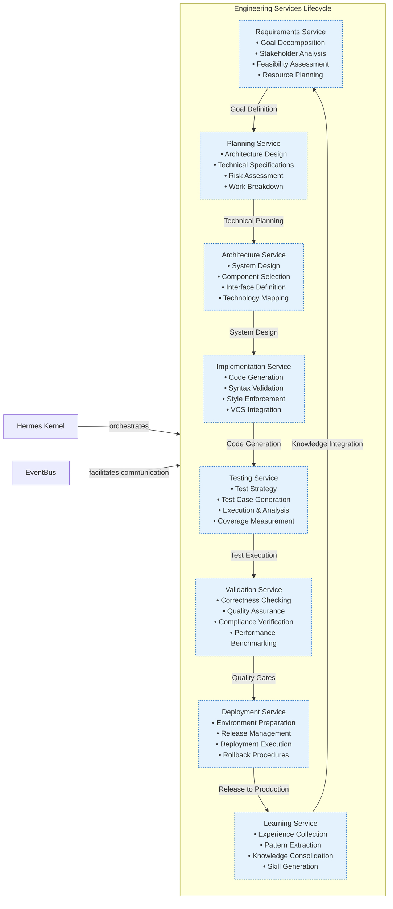
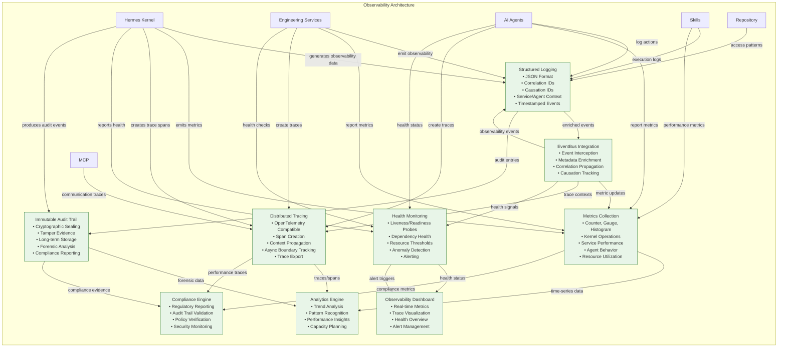

# AI-OS Complete Architecture

## Purpose
This document provides a master visualization of the AI-OS architecture using publication-quality Mermaid diagrams. It illustrates the complete architecture as defined in Parts 1-15 of the Architecture Specification and the project knowledge documents, without redesigning any existing components. The diagrams show structural relationships, communication patterns, execution flows, and organizational boundaries of the AI-OS Hermes Kernel v1.0 architecture.

## Scope
The diagrams cover:
- Hermes Kernel (Core Components and Core Managers) with AI Agency as central orchestrator
- Engineering Services complete lifecycle (Requirements through Learning)
- Capability Facade Services
- Configuration System
- Event System with Observability integration
- Memory Architecture (Five-Tier Hierarchy)
- Skills Ecosystem
- MCP Ecosystem
- Repository Ecosystem
- Validation Architecture
- Security Principles
- Governance Structure
- Extension Points
- Runtime execution flows
- System lifecycle
- Cross-references between architectural domains

## High-Level Architecture
The following diagram shows the top-level architectural layers of AI-OS with AI Agency as the central orchestrator:

```mermaid
graph TD
    %% Top Layers with AI Agency as Central Orchestrator
    subgraph AIOS["AI-OS Platform"]
        direction TB
        
        %% Application Layer
        subgraph APP_Layer["Application Layer"]
            direction TB
            CustomServices[Domain-specific Services]
            CustomWorkflows[Custom Engineering Workflows]
        end
        
        %% Platform Layer
        subgraph PLATFORM_Layer["Platform Layer"]
            direction TB
            EngServices[Engineering Services]
            FacadeServices[Capability Facade Services]
            CLI[Command Line Interface]
        end
        
        %% Kernel Layer with AI Agency Central Orchestration
        subgraph KERNEL_Layer["Kernel Layer (Hermes)"]
            direction TB
            
            %% Core Components
            subgraph CoreComponents["Core Components"]
                direction TB
                EventBus[EventBus]
                StateManager[StateManager]
                WorkflowManager[WorkflowManager]
                ResourceManager[ResourceManager]
            end
            
            %% Core Managers
            subgraph CoreManagers["Core Managers"]
                direction TB
                MemoryMgr[MemoryManager]
                ModelRouter[ModelRouter]
                ToolManager[ToolManager]
                StorageMgr[StorageManager]
                ContextMgr[ContextManager]
                AgentMgr[AgentManager]
                RetryMgr[RetryManager]
                CheckpointMgr[CheckpointManager]
                RootCauseMgr[RootCauseManager]
                CouncilMgr[CouncilManager]
            end
            
            %% AI Agency as Central Orchestrator
            AIAgency[AIAgencyService<br/>• Central Orchestrator<br/>• Agent Lifecycle<br/>• Permission Sandboxing<br/>• Resource Quotas<br/>• Audit Logging<br/>• Performance Monitoring]
        end
        
        %% Extension Points
        subgraph EXTENSION_Layer["Extension Points"]
            direction TB
            Skills[Skills Ecosystem]
            MCP[MCP Ecosystem]
            Repository[Repository Ecosystem]
            CustomEvents[Custom Events]
            MemoryBackends[Memory Backends]
        end
    end
    
    %% AI Agency Central Orchestration Relationships
    AIAgency -->|manages| CoreManagers
    AIAgency -->|coordinates| CoreComponents
    AIAgency -->|orchestrates| PLATFORM_Layer
    AIAgency -->|governs| EXTENSION_Layer
    CoreComponents -->|provides infrastructure to| AIAgency
    CoreManagers -->|provide capabilities to| AIAgency
    
    %% Cross-Layer Communication
    APP_Layer -->|uses| PLATFORM_Layer
    PLATFORM_Layer -->|depends on| KERNEL_Layer
    KERNEL_Layer -->|provides infrastructure to| PLATFORM_Layer
    EXTENSION_Layer -->|extends via| AIOS
    KERNEL_Layer -->|reference runtime for| EXTENSION_Layer
    
    %% Styling
    classDef application fill:#e3f2fd,stroke:#1565c0,stroke-width:1px;
    classDef platform fill:#fff3e0,stroke:#ef6c00,stroke-width:1px;
    classDef kernel fill:#e8f5e8,stroke:#2e7d32,stroke-width:1px;
    classDef extension fill:#f3e5f5,stroke:#6a1b9a,stroke-width:1px;
    classDef orchestrator fill:#fff3e0,stroke:#ef6c00,stroke-width:2px;
    
    class APP_Layer application;
    class PLATFORM_Layer platform;
    class KERNEL_Layer kernel;
    class EXTENSION_Layer extension;
    class AIAgency orchestrator;
```



## System Lifecycle
This diagram illustrates the complete system lifecycle from startup to shutdown:

```mermaid
stateDiagram-v2
    [*] --> Startup: System Boot
    Startup --> Registration: Component Registration
    Registration --> Initialization: Dependency Resolution
    Initialization --> Runtime: System Ready
    
    %% Runtime States
    Runtime --> Processing: Task Execution
    Processing --> Validation: Result Validation
    Validation --> Learning: Experience Capture
    Learning --> Runtime: Knowledge Integration
    
    %% Error Handling Paths
    Processing --> Failure: Task Failure
    Failure --> Recovery: Error Recovery
    Recovery --> Processing: Retry/Recovery
    Recovery --> Runtime: Normal Operation
    
    %% Shutdown Path
    Runtime --> Shutdown: System Shutdown
    Shutdown --> [*]: System Halted
    
    %% Observability Throughout
    note right of Startup
        Observability Active
        Logging & Metrics
    end
    note right of Registration
        Component Registry
        Dependency Mapping
    end
    note right of Initialization
        Topological Start
        Resource Allocation
    end
    note right of Runtime
        Event-Driven Execution
        Agent Orchestration
    end
    note right of Processing
        Task Execution
        Tool/Skill Usage
    end
    note right of Validation
        Result Checking
        Quality Gates
    end
    note right of Learning
        Pattern Extraction
        Knowledge Storage
    end
    note right of Failure
        Error Classification
        Recovery Routing
    end
    note right of Recovery
        State Restoration
        Retry with Backoff
    end
    note right of Shutdown
        Graceful Shutdown
        Resource Cleanup
    end
    
    %% Styling
    classDef lifecycle fill:#f8f9fa,stroke:#dee2e6,stroke-width:1px;
    class Startup,Registration,Initialization,Runtime,Processing,Validation,Learning,Failure,Recovery,Shutdown lifecycle;
```

## Engineering Services Lifecycle
This diagram shows the complete Engineering Services lifecycle from Requirements through Learning:



## Runtime Interaction & Execution Flow
This diagram shows the detailed runtime interaction and execution flow between components:

```mermaid
sequenceDiagram
    participant User as User/System
    participant EB as EventBus
    PMID as AIAgencyService
    %% Core Components
    participant SM as StateManager
    participant WM as WorkflowManager
    participant RM as ResourceManager
    %% Core Managers
    participant MM as MemoryManager
    participant TR as ToolManager
    participant SR as StorageManager
    participant CM as ContextManager
    participant AM as AgentManager
    participant Retry as RetryManager
    participant RC as RootCauseManager
    participant Co as CouncilManager
    %% Services
    participant ReqSvc as Requirements Service
    participant PlanSvc as Planning Service
    participant ArcSvc as Architecture Service
    participant ImplSvc as Implementation Service
    participant TestSvc as Testing Service
    participant ValidSvc as Validation Service
    participant DepSvc as Deployment Service
    participant LearnSvc as Learning Service
    %% Ecosystems
    participant Skills as Skills Ecosystem
    participant MCP as MCP Ecosystem
    participant Repo as Repository Ecosystem
    
    %% System Startup
    User->>EB: System Start Request
    EB->>SM: Initialize State
    EB->>WM: Initialize Workflow Engine
    EB->>RM: Initialize Resource Tracking
    EB->>PMID: Initialize AI Agency
    
    %% Agent Spawning & Goal Processing
    User->>EB: Emit(GoalReceived, goal_data)
    EB->>PMID: Spawn Agent for Goal
    PMID->>AM: Configure Agent Quotas & Permissions
    AM->>EB: Agent Spawned (agent_id)
    EB->>WM: Register Workflow (workflow_id)
    WM->>EB: Workflow Registered
    
    %% Requirements Phase
    EB->>ReqSvc: Emit(StartRequirements, workflow_id)
    ReqSvc->>EB: Emit(RequestProcessing, goal_data)
    EB->>MM: Retrieve Relevant Knowledge
    EB->>CM: Get Context for Goal Analysis
    ReqSvc->>EB: Emit(RequirementsComplete, requirements_doc)
    
    %% Planning Phase
    EB->>PlanSvc: Emit(StartPlanning, workflow_id, requirements_doc)
    PlanSvc->>EB: Emit(RequestProcessing, requirements_doc)
    EB->>SR: Retrieve Architecture Patterns
    EB->>ModelRouter: Get LLM for Planning
    PlanSvc->>EB: Emit(PlanningComplete, architecture_plan)
    
    %% Architecture Phase
    EB->>ArcSvc: Emit(StartArchitecture, workflow_id, architecture_plan)
    ArcSvc->>EB: Emit(RequestProcessing, architecture_plan)
    EB->>MM: Retrieve Engineering Intelligence
    EB->>Skills: Retrieve Relevant Skills
    ArcSvc->>EB: Emit(ArchitectureComplete, system_design)
    
    %% Implementation Phase
    EB->>ImplSvc: Emit(StartImplementation, workflow_id, system_design)
    ImplSvc->>EB: Emit(RequestProcessing, system_design)
    EB->>TR: Prepare Development Environment
    EB->>Skills: Load Coding Skills
    ImplSvc->>EB: Emit(ImplementationComplete, source_code)
    
    %% Testing Phase
    EB->>TestSvc: Emit(StartTesting, workflow_id, source_code)
    TestSvc->>EB: Emit(RequestProcessing, source_code)
    EB->>MCP: Prepare Test Environment
    EB->>ToolManager: Configure Test Tools
    TestSvc->>EB: Emit(TestResults, test_report)
    
    %% Validation Phase
    EB->>ValidSvc: Emit(StartValidation, workflow_id, test_report)
    ValidSvc->>EB: Emit(RequestProcessing, test_report)
    EB->>MM: Retrieve Validation Patterns
    EB->>Council: Request Validation Review
    ValidSvc->>EB: Emit(ValidationComplete, validation_result)
    
    %% Deployment Phase
    EB->>DepSvc: Emit(StartDeployment, workflow_id, validation_result)
    DepSvc->>EB: Emit(RequestProcessing, validation_result)
    EB->>RM: Allocate Deployment Resources
    EB->>MCP: Prepare Deployment Environment
    DepSvc->>EB: Emit(DeploymentComplete, deployment_status)
    
    %% Learning Phase
    EB->>LearnSvc: Emit(StartLearning, workflow_id, deployment_status)
    LearnSvc->>EB: Emit(RequestProcessing, deployment_status)
    EB->>MM: Store Execution Experience
    EB->>GR: Update Knowledge Graph
    EB->>Skills: Generate New Skill Templates
    LearnSvc->>EB: Emit(LearningComplete, knowledge_update)
    
    %% Completion & Cleanup
    EB->>WM: Complete Workflow (workflow_id)
    WM->>EB: Workflow Completed
    EB->>PMID: Terminate Agent (agent_id)
    PMID->>AM: Release Agent Resources
    AM->>EB: Agent Terminated
    EB->>User: Emit(GoalCompleted, final_result)
    
    %% Error Handling Flow
    %% At any phase, failure can trigger error handling
    TestSvc->>EB: Emit(TaskFailed, error_details):::error
    EB->>Referee: Assess Retry Budget
    Referee->>RB: Check Retry Limits
    RB->>EB: Retry Allow/Deny
    EB->>RC: Classify Failure Pattern
    RC->>EB: Failure Classification
    EB->>ValidSvc: Emit(RequestRecovery, failure_class):::recovery
    
    %% Styling
    classDef participant fill:#f8f9fa,stroke:#dee2e6,stroke-width:1px;
    class User,EB,PMID,SM,WM,RM,MM,TR,SR,CM,AM,Retry,RC,Co participant;
    class DefSvc,ReqSvc,PlanSvc,ArcSvc,ImplSvc,TestSvc,ValidSvc,DepSvc,LearnSvc participant;
    class Skills,MCP,Repo participant;
    class error fill:#ffebee,stroke:#c62828,stroke-width:1px;
    class recovery fill:#fff3e0,stroke:#ef6c00,stroke-width:1px,stroke-dasharray: 2 2;
```

## Observability Architecture
This diagram illustrates the comprehensive observability architecture integrating logging, metrics, tracing, and monitoring:



## Memory Architecture (Five-Tier Hierarchy)
This diagram shows the five-tier memory system with clear purposes and backends:

```mermaid
graph TD
    subgraph MEMORY["Five-Tier Memory System"]
        direction TB
        
        %% Memory Manager (Global Accessor)
        Mgr[MemoryManager<br/>• Global Singleton Accessor<br/>• Tier Management<br/>• Access Control & Scoping<br/>• Cross-Tier Coordination<br/>• Lifecycle Management]
        
        %% Memory Tiers with Specific Purposes
        WM[Working Memory<br/>• Short-term, Session-Scoped<br/>• Volatile Storage<br/>• Optimized for Rapid Access<br/>• Cleared on Session End<br/>• Backend: In-Memory (Redis/Local)]
        
        CM[Claude Memory<br/>• Session Persistence<br/>• Conversation History<br/>• Working State Retention<br/>• Seamless Session Resumption<br/>• Backend: Persistent (SQLite/File)]
        
        EI[Engineering Intelligence<br/>• Long-Term Learnings<br/>• Patterns & Decisions<br/>• Best Practices Consolidation<br/>• Informs Future Planning<br/>• Backend: Persistent (PostgreSQL/MongoDB)]
        
        OB[Obsidian<br/>• Knowledge Vault Integration<br/>• Structured Documentation<br/>• Wikis & Design Artifacts<br/>• Versioned Knowledge with Tracking<br/>• Backend: File System (Markdown/YAML)]
        
        GR[Graphify<br/>• Knowledge Graph Storage<br/>• Entity Relationship Mapping<br/>• Semantic Queries & Inference<br/>• Reasoning Support<br/>• Backend: Graph Database (Neo4j/JanusGraph)]
    end
    
    %% Manager to Tiers Relationship
    Mgr -->|manages| WM
    Mgr -->|manages| CM
    Mgr -->|manages| EI
    Mgr -->|manages| OB
    Mgr -->|manages| GR
    
    %% Usage by System Components
    WM -->|used by| Agents[AI Agents]
    WM -->|used by| Services[Engineering Services]
    WM -->|used by| Kernel[Hermes Kernel]
    
    CM -->|used by| Agents
    CM -->|used by| Services
    
    EI -->|used by| Planning[Planning Service]
    EI -->|used by| Architecture[Architecture Service]
    EI -->|used by| Learning[Learning Service]
    EI -->|used by| Validation[Validation Service]
    
    OB -->|used by| Documentation[Documentation Service]
    OB -->|used by| Knowledge[Knowledge Management]
    OB -->|used by| Compliance[Compliance Service]
    
    GR -->|used by| Reasoning[Reasoning Engine]
    GR -->|used by| Dependency[Dependency Analyzer]
    GR -->|used by| Impact[Impact Analysis]
    GR -->|used by| Architecture[Architecture Service]
    
    %% Cross-Tier Data Flow (Governed)
    EI -.->|knowledge distillation| WM
    GR -.->|relationship insights| EI
    OB -.->|documented knowledge| EI
    WM -.->|session patterns| CM
    CM -.->|persistent knowledge| EI
    
    %% Styling
    classDef memory fill:#fff3e0,stroke:#ef6c00,stroke-width:1px;
    class WM,CM,EI,OB,GR memory;
    class Mgr manager;
    class Agents agent;
    class Services service;
    class Kernel kernel;
    class Planning,Architecture,Learning,Validation service;
    class Documentation,Knowledge,Compliance service;
    class Reasoning,Dependency,Impact,Architecture component;
```

## Skills Ecosystem
This diagram shows the Skills Ecosystem with discovery, versioning, sandboxing, composition, and governance:

```mermaid
graph TD
    subgraph SKILLS["Skills Ecosystem"]
        direction TB
        
        %% Discovery & Registration Layer
        Discovery[Skill Registry<br/>• Central Repository<br/>• Search & Filtering<br/>• Compatibility Checking<br/>• Metadata Management<br/>• Version Discovery]
        
        %% Versioning & Dependency Layer
        Versioning[Semantic Versioning<br/>• MAJOR.MINOR.PATCH<br/>• Backward Compatibility<br/>• Dependency Resolution<br/>• Clear Deprecation Paths<br/>• Version Registry]
        
        %% Sandboxed Execution Layer
        Sandbox[Sandboxed Execution<br/>• Permission Profiles (MINIMAL-PRIVILEGED)<br/>• Resource Isolation & Limits<br/>• Security Scanning<br/>• Vulnerability Assessment<br/>• Execution Telemetry]
        
        %% Composition & Chaining Layer
        Composition[Skill Composition<br/>• Sequential Chaining<br/>• Parallel Execution<br/>• Conditional Workflows<br/>• Parameterization & Templating<br/>• Skill Chaining Engine]
        
        %% Governance & Quality Layer
        Governance[Governance Model<br/>• Community Curation<br/>• Quality Gates & Certification<br/>• Security Scanning<br/>• Deprecation & Retirement Policies<br/>• Governance Council]
        
        %% Development Support Layer
        DevKit[Development Kit<br/>• Templates & Frameworks<br/>• Testing Utilities<br/>• Documentation Generators<br/>• Packaging Tools<br/>• Local Development Support]
    end
    
    %% Layer Relationships
    Discovery -->|feeds into| Versioning
    Versioning -->|feeds into| Sandbox
    Sandbox -->|feeds into| Composition
    Composition -->|feeds into| Governance
    Governance -->|supported by| DevKit
    
    %% Integration with Kernel via AI Agency
    Kernel[Hermes Kernel] -->|provides access via| AIAgent[AI Agency Service]
    AIAgent -->|mediates through| SkillMgr[Skill Manager]
    SkillMgr -->|provides controlled access to| SKILLS
    
    %% Usage Patterns
    SKILLS -->|used by| Agents[AI Agents]
    SKILLS -->|used by| Services[Engineering Services]
    SKILLS -->|used by| Kernel[Hermes Kernel] %% for internal capabilities
    
    %% External Integration
    SKILLS -->|can integrate with| MCP[MCP Ecosystem]
    SKILLS -->|can integrate with| Repository[Repository Ecosystem]
    SKILLS -->|can extend| CustomEvents[Custom Events]
    SKILLS -->|can utilize| MemoryBackends[Memory Backends]
    
    %% Styling
    classDef ecosystem fill:#f3e5f5,stroke:#6a1b9a,stroke-width:1px;
    class Discovery,Versioning,Sandbox,Composition,Governance,DevKit ecosystem;
    class AIAgent,SkillMgr manager;
```

## MCP Ecosystem
This diagram shows the MCP Ecosystem with transports, capabilities, security, state management, discovery, and certification:

```mermaid
graph TD
    subgraph MCP["MCP Ecosystem"]
        direction TB
        
        %% Transport Layer
        Transports[Standard Transports<br/>• Stdio, HTTP, WebSocket<br/>• Secure Channels (Auth+Encryption)<br/>• Flow Control & Backpressure<br/>• Connection Pooling & Reuse<br/>• Message Serialization]
        
        %% Capability Layer
        Capabilities[Well-defined Capabilities<br/>• File Access, Web Search<br/>• Code Execution, Database Queries<br/>• System Info, Process Management<br/>• Capability Negotiation & Discovery<br/>• Granular Permission Models<br/>• Capability Versioning & Evolution]
        
        %% Security Layer
        Security[Security Profiles<br/>• Standardized Security Models<br/>• Authentication & Authorization Frameworks<br/>• Audit Logging of All Interactions<br/>• Secure Credential & Secret Management<br/>• Transport Security (TLS/mTLS)]
        
        %% State Management Layer
        StateMgmt[State Synchronization<br/>• Shared State Patterns<br/>• Conflict Resolution Strategies<br/>• Consistency Models (Strong/Eventual)<br/>• Persistence & Recovery Mechanisms<br/>• Session Management]
        
        %% Discovery & Trust Layer
        Discovery[MCP Registry<br/>• Server Metadata & Capabilities<br/>• Reliability Metrics & Health Scores<br/>• Health Checking & Monitoring<br/>• Trust Scoring & Reputation Systems<br/>• Server Classification & Tagging]
        
        %% Certification Layer
        Certification[Tool Certification<br/>• Validation Programs for Compliance<br/>• Capability Test Suites<br/>• Security Assessment & Penetration Testing<br/>• Performance Benchmarking<br/>• Certification Badges & Trust Indicators]
    end
    
    %% Layer Relationships
    Transports -->|enables| Capabilities
    Capabilities -->|requires| Security
    Security -->|supports| StateMgmt
    StateMgmt -->|enhanced by| Discovery
    Discovery -->|feeds into| Certification
    
    %% Integration with Kernel via AI Agency
    Kernel[Hermes Kernel] -->|provides access via| AIAgent[AI Agency Service]
    AIAgent -->|mediates through| MCPMgr[MCP Manager]
    MCPMgr -->|provides controlled access to| MCP
    
    %% Usage Patterns
    MCP -->|used by| Agents[AI Agents]
    MCP -->|used by| Services[Engineering Services]
    MCP -->|used by| Kernel[Hermes Kernel] %% for internal tooling
    MCP -->|used by| Skills[Skill Ecosystem] %% for skill implementation
    
    %% External Integration Points
    MCP -->|connects to| ExternalTools[External Systems & Tools]
    MCP -->|shares state with| SharedState[Shared State Systems]
    MCP -->|exchanges data with| DataSources[Data Sources & APIs]
    MCP -->|utilizes| ComputeResources[Compute Resources]
    
    %% Styling
    classDef ecosystem fill:#f3e5f5,stroke:#6a1b9a,stroke-width:1px;
    class Transports,Capabilities,Security,StateMgmt,Discovery,Certification ecosystem;
    class AIAgent,MCPMgr manager;
    class ExternalTools,SharedState,DataSources,ComputeResources external;
```

## Repository Ecosystem
This diagram shows the Repository Ecosystem enabling sharing and reuse of engineering assets:

```mermaid
graph TD
    subgraph REPOSITORY["Repository Ecosystem"]
        direction TB
        
        %% Core Components
        WFTemplates[Workflow Templates<br/>• Reusable SDLC Patterns<br/>• Common Project Types<br/>• Parameterizable Workflows<br/>• Best Practice Guidance<br/>• Domain Customization Points]
        CompLib[Component Libraries<br/>• Shareable Services & Managers<br/>• Versioned Components<br/>• Dependency Management<br/>• Compatibility Testing<br/>• Documentation & Usage Examples]
        RefArch[Reference Architectures<br/>• Proven Domain Solutions<br/>• Web/Mobile/Embedded/IoT<br/>• Architecture Decision Records<br/>• Implementation Guidelines<br/>• Performance & Scalability Characteristics]
        BestPractices[Best Practices<br/>• Codified Guidelines & Heuristics<br/>• Architecture & Design Principles<br/>• Coding Standards & Style Guides<br/>• Security & Compliance Frameworks]
        LearnMats[Learning Materials<br/>• Tutorials & Examples<br/>• Educational Content<br/>• Getting Started Guides<br/>• Advanced Topics<br/>• Video Demonstrations<br/>• Interactive Labs]
        CommHub[Community Hub<br/>• Forums, Chat & Collaboration Spaces<br/>• Knowledge Sharing & Q&A<br/>• Contribution Guidelines & Processes<br/>• Event Calendars & Community Activities]
    end
    
    %% Component Relationships
    WFTemplates -->|feeds into| CompLib
    CompLib -->|feeds into| RefArch
    RefArch -->|feeds into| BestPractices
    BestPractices -->|feeds into| LearnMats
    LearnMats -->|feeds into| CommHub
    
    %% Integration with Kernel via AI Agency
    Kernel[Hermes Kernel] -->|accessed via| AIAgent[AI Agency Service]
    AIAgent -->|mediates through| RepositoryMgr[Repository Manager]
    RepositoryMgr -->|provides controlled access to| REPOSITORY
    
    %% Usage Patterns
    REPOSITORY -->|used by| Services[Engineering Services]
    REPOSITORY -->|used by| Agents[AI Agents]
    REPOSITORY -->|used by| Kernel[Hermes Kernel] %% for internal components
    REPOSITORY -->|used by| Skills[Skill Ecosystem] %% for skill components
    REPOSITORY -->|used by| MCP[MCP Ecosystem] %% for MCP implementations
    
    %% Asset Types Stored
    RepoAssets[Repository Assets<br/>• Workflow Definitions<br/>• Service Implementations<br/>• Manager Extensions<br/>• Skill Packages<br/>• MCP Servers<br/>• Configuration Templates<br/>• Documentation Sets<br/>• Test Suites<br/>• Deployment Scripts]
    
    REPOSITORY -->|contains| RepoAssets
    
    %% External Integration
    REPOSITORY -->|integrates with| VersionControl[Version Control Systems]
    REPOSITORY -->|integrates with| CI/CD[CI/CD Pipelines]
    REPOSITORY -->|integrates with| PackageMgr[Package Managers]
    REPOSITORY -->|integrates with| ContainerReg[Container Registries]
    
    %% Styling
    classDef ecosystem fill:#f3e5f5,stroke:#6a1b9a,stroke-width:1px;
    class WFTemplates,CompLib,RefArch,BestPractices,LearnMats,CommHub ecosystem;
    class AIAgent,RepositoryMgr manager;
    class RepoAssets asset;
    class VersionControl,CI/CD,PackageMgr,ContainerReg external;
```

## Cross Reference Matrix
This matrix shows the key cross-references between major architectural domains:

```mermaid
graph TD
    subgraph CROSS_REF["Architectural Cross-References"]
        direction TB
        
        %% Core Nodes
        Kernel[Hermes Kernel<br/>• Core Components<br/>• Core Managers<br/>• AI Agency Orchestrator]
        Runtime[Runtime Execution<br/>• Event Flow<br/>• Service Coordination<br/>• Agent Orchestration<br/>• Lifecycle Management]
        Memory[Memory Architecture<br/>• Five-Tier System<br/>• Working Memory<br/>• Claude Memory<br/>• Engineering Intelligence<br/>• Obsidian<br/>• Graphify]
        MCPEco[MCP Ecosystem<br/>• Transports<br/>• Capabilities<br/>• Security<br/>• State Management<br/>• Discovery<br/>• Certification]
        SkillsEco[Skills Ecosystem<br/>• Discovery<br/>• Versioning<br/>• Sandboxing<br/>• Composition<br/>• Governance<br/>• Development Kit]
        RepoEco[Repository Ecosystem<br/>• Workflow Templates<br/>• Component Libraries<br/>• Reference Architectures<br/>• Best Practices<br/>• Learning Materials<br/>• Community Hub]
        Councils[Council Governance<br/>• Council Manager<br/>• Claude Council<br/>• LLM Council<br/>• Specialized Councils<br/>• Voting Algorithms<br/>• Final Judge<br/>• Governance Structure]
        Validation[Validation Architecture<br/>• Architectural Validation<br/>• Goal Validation<br/>• Workflow Validation<br/>• Capability Validation<br/>• Memory Validation<br/>• Security Validation<br/>• AI Validation<br/>• Human Validation<br/>• Runtime Validation<br/>• Artifact Validation<br/>• Output Validation]
        Observability[Observability System<br/>• Structured Logging<br/>• Metrics Collection<br/>• Distributed Tracing<br/>• Health Monitoring<br/>• EventBus Integration<br/>• Immutable Audit Trail]
        EngLifecycle[Engineering Lifecycle<br/>• Requirements<br/>• Planning<br/>• Architecture<br/>• Implementation<br/>• Testing<br/>• Validation<br/>• Deployment<br/>• Learning]
        SecPrinc[Security Principles<br/>• Least Privilege Access<br/>• Input Validation<br/>• Data Protection<br/>• Secure Defaults<br/>• Security Assessment<br/>• Security Monitoring<br/>• Secure Communication<br/>• Permission Mediation]
    
    %% Bidirectional Cross-References (Strong Coupling)
    Kernel <-->|orchestrates| Runtime
    Kernel <-->|manages| Memory
    Kernel <-->|provides access to| SkillsEco
    Kernel <-->|provides access to| MCPEco
    Kernel <-->|provides access to| RepoEco
    Kernel <-->|governs| Councils
    Kernel <-->|ensures| Validation
    Kernel <-->|enables| Observability
    Kernel <-->|drives| EngLifecycle
    Kernel <-->|enforces| SecPrinc
    
    %% Cross-Domain Relationships
    Runtime <-->|utilizes| Memory
    Runtime <-->|leverages| SkillsEco
    Runtime <-->|integrates with| MCPEco
    Runtime <-->|accesses| RepoEco
    Runtime <-->|overseen by| Councils
    Runtime <-->|validated by| Validation
    Runtime <-->|monitored by| Observability
    Runtime <-->|executes| EngLifecycle
    Runtime <-->|secured by| SecPrinc
    
    Memory <-->|informs| SkillsEco %% Pattern & knowledge storage
    Memory <-->|enhances| MCPEco %% Context & state sharing
    Memory <-->|supports| RepoEco %% Asset versioning & tracking
    Memory <-->|advises| Councils %% Historical decisions & patterns
    Memory <-->|validates by| Validation %% Integrity & consistency checking
    Memory <-->|observed by| Observability %% Usage & performance metrics
    Memory <-->|supports| EngLifecycle %% Knowledge retention & learning
    Memory <-->|protected by| SecPrinc %% Access control & encryption
    
    SkillsEco <-->|enhances| MCPEco %% Skill-to-tool bridging
    SkillsEco <-->|utilizes| RepoEco %% Skill components & templates
    SkillsEco <-->|informs| Councils %% Skill effectiveness & governance
    SkillsEco <-->|validated by| Validation %% Skill correctness & safety
    SkillsEco <-->|monitored by| Observability %% Skill performance & usage
    SkillsEco <-->|drives| EngLifecycle %% Skill application in workflows
    SkillsEco <-->|secured by| SecPrinc %% Skill sandboxing & permissions
    
    MCPEco <-->|extends| SkillsEco %% Tool capabilities for skills
    MCPEco <-->|accesses| RepoEco %% MCP implementations & configs
    MCPEco <-->|advised by| Councils %% Tool approval & governance
    MCPEco <-->|validated by| Validation %% MCP compliance & security
    MCPEco <-->|monitored by| Observability %% MCP performance & reliability
    MCPEco <-->|applied in| EngLifecycle %% Tool usage in workflows
    MCPEco <-->|secured by| SecPrinc %% MCP security profiles & auth
    
    RepoEco <-->|provides| SkillsEco %% Shareable skill components
    RepoEco <-->|hosts| MCPEco %% MCP server implementations
    RepoEco <-->|governed by| Councils %% Repository policies & standards
    RepoEco <-->|validated by| Validation %% Asset correctness & compliance
    RepoEco <-->|observed by| Observability %% Asset usage & performance
    RepoEco <-->|utilized in| EngLifecycle %% Workflow & component reuse
    RepoEco <-->|protected by| SecPrinc %% Access controls & integrity
    
    Councils <-->|oversees| SkillsEco %% Skill governance & approval
    Councils <-->|oversees| MCPEco %% Tool governance & approval
    Councils <-->|oversees| RepoEco %% Repository governance & standards
    Councils <-->|validated by| Validation %% Governance correctness
    Councils <-->|monitored by| Observability %% Governance effectiveness
    Councils <-->|applied in| EngLifecycle %% Governance in workflows
    Councils <-->|secured by| SecPrinc %% Governance security & access
    
    Validation <-->|ensures| SkillsEco %% Skill validation & certification
    Validation <-->|ensures| MCPEco %% MCP validation & compliance
    Validation <-->|ensures| RepoEco %% Repository validation & integrity
    Validation <-->|oversees| Councils %% Governance validation & compliance
    Validation <-->|monitored by| Observability %% Validation effectiveness
    Validation <-->|applied to| EngLifecycle %% Lifecycle validation & quality gates
    Validation <-->|enforced by| SecPrinc %% Security validation & compliance
    
    Observability <-->|monitors| SkillsEco %% Skill usage & performance
    Observability <-->|monitors| MCPEco %% MCP reliability & performance
    Observability <-->|monitors| RepoEco %% Repository usage & health
    Observability <-->|oversees| Councils %% Governance monitoring & alerts
    Observability <-->|validates| Validation %% Validation correctness & effectiveness
    Observability <-->|tracks| EngLifecycle %% Lifecycle execution & performance
    Observability <-->|secures by| SecPrinc %% Security monitoring & threat detection
    
    EngLifecycle <-->|produces| SkillsEco %% New skill generation from patterns
    EngLifecycle <-->|contributes to| MCPEco %% New MCP implementations
    EngLifecycle <-->|adds to| RepoEco %% New workflows & components
    EngLifecycle <-->|informs| Councils %% Lifecycle effectiveness & governance
    EngLifecycle <-->|validated by| Validation %% Lifecycle correctness & compliance
    EngLifecycle <-->|monitored by| Observability %% Lifecycle performance & metrics
    EngLifecycle <-->|secured by| SecPrinc %% Lifecycle security & access controls
    
    SecPrinc <-->|applied to| SkillsEco %% Skill security principles
    SecPrinc <-->|applied to| MCPEco %% MCP security principles
    SecPrinc <-->|applied to| RepoEco %% Repository security principles
    SecPrinc <-->|applied to| Councils %% Governance security principles
    SecPrinc <-->|applied to| Validation %% Validation security principles
    SecPrinc <-->|applied to| EngLifecycle %% Lifecycle security principles
    
    %% Styling
    classDef domain fill:#e8f5e8,stroke:#2e7d32,stroke-width:1px;
    class Kernel,Runtime,Memory,MCPEco,SkillsEco,RepoEco,Councils,Validation,Observability,EngLifecycle,SecPrinc domain;
    classDef strongCoupling fill:#fff3e0,stroke:#ef6c00,stroke-width:2px;
    class Kernel,Runtime coupling;
    linkStyle 0,1,2,3,4,5,6,7,8,9,10,11,12,13,14,15,16,17,18,19,20,21,22,23,24,25,26,27,28,29,30,31,32,33,34,35,36,37,38,39,40,41,42,43,44,45,46,47,48,49,50,51,52,53,54,55,56,57,58,59,60,61,62,63,64,65,66,67,68,69,70,71,72,73,74,75,76,77,78,79,80,81,82,83,84,85,86,87,88,89,90,91,92,93,94,95,96,97,98,99,100,101,102,103,104,105,106,107,108,109,110,111,112,113,114,115,116 stroke:#ef6c00,stroke-width:2px;
```

## Architectural Integrity & Compliance
All visualizations in this document strictly adhere to the AI-OS Architecture Specification Parts 1-15 and Architecture Decision Records (ADRs):

- **AI Agency as Central Orchestrator**: Aligns with ADR 011 (AI Agency Service) and ADR 012 (Council Mechanisms)
- **Complete Engineering Lifecycle**: Reflects ADR 006 (Engineering Service SDLC Pipeline) expanded with explicit phases
- **Observability Integration**: Embodies ADR 012 (Built-In Observability) with logging, metrics, tracing, and monitoring
- **System Lifecycle**: Embodies ADR 004 (Global Singleton Accessors) and ADR 005 (Event-Driven Services)
- **Memory Architecture**: Directly implements ADR 016 (Memory Architecture Five-Tier Hierarchy)
- **Ecosystems Visualization**: Accurately represents ADR 013 (Extension Points Governance) for Skills, MCP, and Repository
- **Validation Architecture**: Fully implements the validation framework from VALIDATION_ARCHITECTURE.md
- **Security Principles**: Embodies the security principles from ENGINEERING_PRINCIPLES.md
- **Governance Structure**: Reflects ADR 010 (Explicit Failure Handling) and ADR 012 (Human Governance Principles)
- **Cross-References**: Maintains consistency with all referenced documents

## Technology Neutrality Statement
This document maintains strict technology neutrality:
- No specific technologies, languages, or frameworks are mandated
- All components are defined by their interfaces and responsibilities
- Implementation choices are left to conformant implementations
- The architecture focuses on "what" the system must be, not "how" it is built
- All visualizations are implementation-agnostic and specify only contractual obligations

## Related Documents
This visualization is complemented by and should be read in conjunction with:

- **Architecture Decision Records (ADRs)**: Define major irreversible architectural decisions ([ARCHITECTURE_DECISIONS.md](../ARCHITECTURE_DECISIONS.md))
- **Engineering Principles**: Explain the philosophical foundation behind architectural decisions ([ENGINEERING_PRINCIPLES.md](../ENGINEERING_PRINCIPLES.md))
- **Architecture Evolution Document**: Preserves the complete historical evolution ([ARCHITECTURE_EVOLUTION.md](../ARCHITECTURE_EVOLUTION.md))
- **Master Context Document**: Provides the definitive source of truth ([AI_OS_MASTER_CONTEXT.md](../AI_OS_MASTER_CONTEXT.md))
- **Validation Architecture**: Defines the validation framework ([VALIDATION_ARCHITECTURE.md](../VALIDATION_ARCHITECTURE.md))
- **AI Agency Documentation**: Details AI agent operation within governance ([AI_AGENCY.md](../AI_AGENCY.md))

These documents form a complete architectural documentation set where:
- ADRs specify the "what" (specific decisions and their rationale)
- Engineering Principles explain the "why" (principles and philosophy)
- Architecture Evolution shows the "how" (historical progression to current state)
- Master Context provides the integrated current state view
- This document provides the publication-quality visualization
- Validation Architecture ensures conformance and correctness
- AI Agency details governable autonomous operations