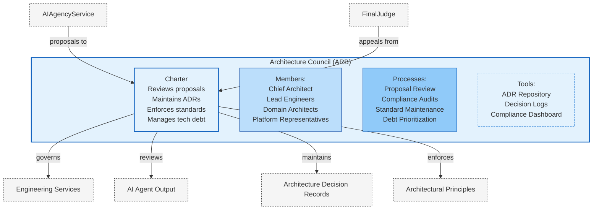
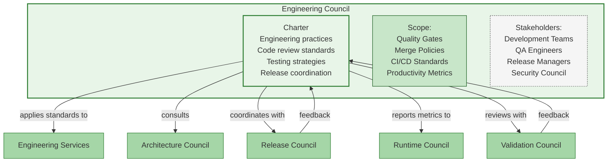
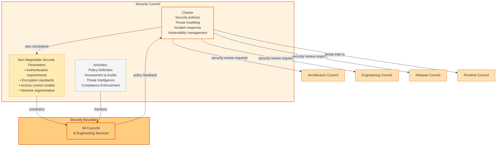
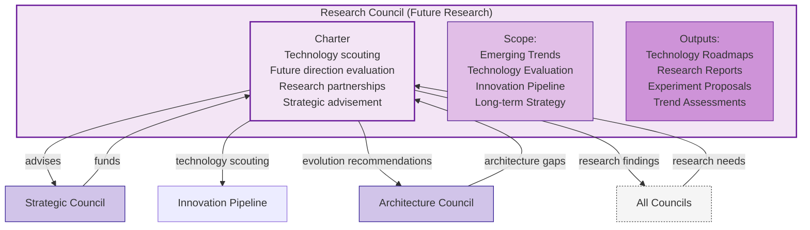
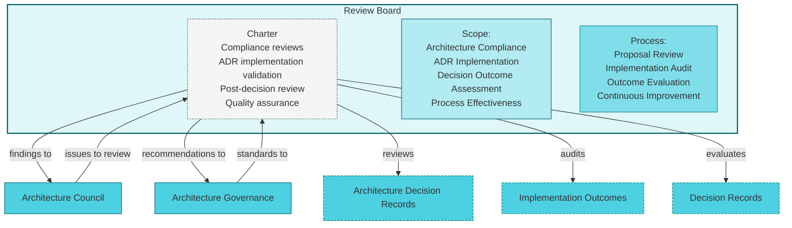
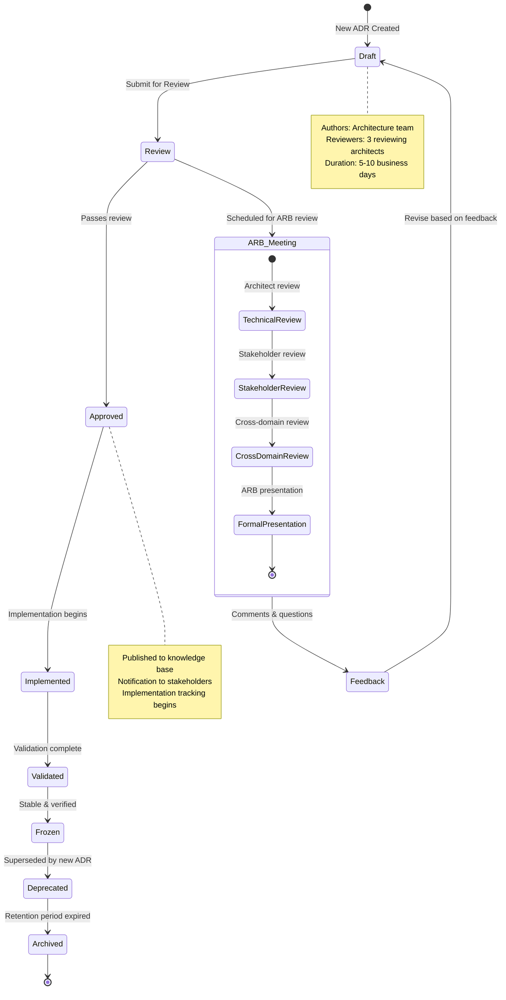
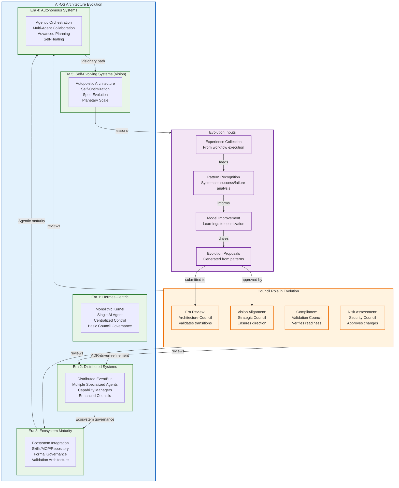

# Council Flow — AI-OS Governance Visualization

> Publication-quality diagrams illustrating the AI-OS Council Architecture governance model. All diagrams depict existing architecture as defined in `COUNCILS.md`, `AI_OS_MASTER_CONTEXT.md`, and `ARCHITECTURE_EVOLUTION.md`. No new components are introduced.

## Table of Contents

1. [Architecture Council](#architecture-council)
2. [Engineering Council](#engineering-council)
3. [Security Council](#security-council)
4. [Research Council](#research-council)
5. [Review Board](#review-board)
6. [ADR Approval Process](#adr-approval-process)
7. [Architecture Changes](#architecture-changes)
8. [Validation](#validation)
9. [Decision Flow](#decision-flow)
10. [Freeze Process](#freeze-process)
11. [Architecture Evolution](#architecture-evolution)

---

## Architecture Council

The Architecture Review Board (ARB) — also referred to as the Architecture Council — is the central governance body for architectural integrity. It reviews proposals, maintains the ADR repository, enforces standards, and manages technical debt.



---

## Engineering Council

The Engineering Council establishes engineering practices, oversees code review, defines testing strategies, and coordinates release engineering. It provides technical guidance that the Architecture Council validates against architectural standards.



---

## Security Council

The Security Council establishes security policies, oversees threat modeling, manages incident response, and sets non-negotiable security parameters that constrain all other council decisions. Its authority operates as a transversal boundary across all governance layers.



---

## Research Council

The Future Research Council identifies emerging technologies, evaluates potential future directions, manages research partnerships, and advises the Strategic Council on long-term options. It serves as the forward-looking lens for architectural evolution.



---

## Review Board

The Review Board conducts architecture compliance reviews, validates ADR implementations, performs post-decision reviews, and serves as an independent quality assurance function. It reports findings to the Architecture Review Board and ensures architectural integrity is maintained.



---

## ADR Approval Process

The ADR Approval process follows a standardized lifecycle from Draft through Review to Approval, Implementation, Validation, and eventual Frozen status. Each stage involves specific council interactions and validation checkpoints.



---

## Architecture Changes

Architecture changes follow a structured process involving proposal submission, impact analysis, council review, security validation, and implementation planning. The Architecture Council leads review, with input from Security, Engineering, and Validation councils.

```mermaid
flowchart LR
    subgraph ARCH_CHANGE["Architecture Change Process"]
        direction TB

        subgraph PROPOSAL["1. Proposal"]
            direction LR
            A1[Initiation:<br/>Need identified] --> A2[Drafting:<br/>ADR template, impact analysis]
            A2 --> A3[Submission:<br/>To Architecture Council]
        end

        subgraph REVIEW["2. Council Review"]
            direction LR
            B1[Completeness Check:<br/>All required elements present] --> B2[Distribution:<br/>Council members, 24h minimum]
            B2 --> B3[Individual Analysis:<br/>Independent review, comments]
            B3 --> B4[Comment Consolidation:<br/>Feedback summary]
        end

        subgraph CROSS_COUNCIL["3. Cross-Council Consultation"]
            direction LR
            C1[Security Review:<br/>Threat assessment] --> C2[Engineering Review:<br/>Practice alignment]
            C2 --> C3[Validation Review:<br/>Testability check]
            C3 --> C4[Ethics Review:<br/>Value implications]
            C4 --> C5[Escalation:<br/>If authority exceeded]
        end

        subgraph DECISION["4. Decision"]
            direction LR
            D1[Deliberation:<br/>Discussion, consensus-seeking] --> D2{Vote Required?}
            D2 -->|Consensus| D3[Decision:<br/>Approved with rationale]
            D2 -->|No consensus| D4[Decision:<br/>Voting process]
            D4 --> D5[Voting Model:<br/>Simple/Weighted/Supermajority]
            D5 --> D3
        end

        subgraph IMPLEMENTATION["5. Implementation & Validation"]
            direction LR
            E1[Implementation:<br/>Assigned responsibilities] --> E2[Validation:<br/>Criteria verification]
            E2 --> E3[Post-Implementation:<br/>Retrospective]
            E3 --> E4[Lessons Learned:<br/>Feed to future decisions]
        end
    end

    %% Flow Connections
    A3 --> B1
    B4 --> C1
    C5 --> D1
    D3 --> E1
    E4 --> A1

    %% Styling
    classDef stage fill:#e8f5e8,stroke:#2e7d32,stroke-width:2px;
    classDef step fill:#c8e6c9,stroke:#1b5e20,stroke-width:1px;
    classDef decision fill:#a5d6a7,stroke:#2e7d32,stroke-width:1px;
    classDef cycle fill:#bbdefb,stroke:#1565c0,stroke-width:1px;

    class PROPOSAL,REVIEW,CROSS_COUNCIL,DECISION,IMPLEMENTATION stage;
    class A1,A2,A3,B1,B2,B3,B4,C1,C2,C3,C4,C5,E1,E2,E3,E4 step;
    class D2,D3,D4,D5 decision;
    class E4,A1 cycle;
```



---

## Validation

Validation is integrated throughout the architecture change lifecycle. The Validation Council sets quality standards, conducts technical validation, oversees implementation compliance, and monitors operational effectiveness of architectural decisions.

```mermaid
graph TD
    subgraph VALIDATION["Validation Framework"]
        direction TB

        subgraph V1["Pre-Change Validation"]
            direction LR
            PC1[Proposal Review:<br/>Feasibility assessment] --> PC2[Risk Analysis:<br/>Impact & mitigation]
            PC2 --> PC3[Stakeholder Readiness:<br/>Resource availability]
        end

        subgraph V2["Implementation Validation"]
            direction LR
            IC1[Design Review:<br/>Specification compliance] --> IC2[Code Review:<br/>ADR adherence]
            IC2 --> IC3[Integration Testing:<br/>System impact]
        end

        subgraph V3["Post-Change Validation"]
            direction LR
            PC4[Production Monitoring:<br/>Operational metrics] --> PC5[Performance Review:<br/>SLA compliance]
            PC5 --> PC6[Architecture Review:<br/>Outcome assessment]
        end

        subgraph V4["Continuous Validation"]
            direction LR
            CC1[Compliance Audits:<br/>Regular assessments] --> CC2[Audit Trails:<br/>Integrity verification]
            CC2 --> CC3[Learning Loop:<br/>Pattern extraction]
        end
    end

    %% Cross-Cutting Validation
    CrossVal[Cross-Cutting Validation<br/>Security • Quality • Performance<br/>Safety • Ethics]

    %% Integration Points
    V1 -->|standards from| ValCouncil[Validation Council]
    V2 -->|quality gates| ValCouncil
    V3 -->|feedback to| ValCouncil
    V4 -->|audit data| ValCouncil
    CrossVal -->|oversees| V1
    CrossVal -->|oversees| V2
    CrossVal -->|oversees| V3
    CrossVal -->|oversees| V4

    %% External Feedback
    ValCouncil -->|findings to| ArchCouncil[Architecture Council]
    ArchCouncil -->|standards to| ValCouncil
    ValCouncil -->|metrics to| Governance[Architecture Governance]

    %% Styling
    classDef framework fill:#fff3e0,stroke:#ef6c00,stroke-width:2px;
    classDef stage fill:#ffe0b2,stroke:#e65100,stroke-width:1px;
    classDef subfill fill:#ffcc80,stroke:#ef6c00,stroke-width:1px;
    classDef council fill:#f57c00,stroke:#e65100,stroke-width:1px;
    classDef external fill:#f5f5f5,stroke:#424242,stroke-width:1px,stroke-dasharray: 2 2;

    class VALIDATION,ValCouncil,CrossVal framework;
    class V1,V2,V3,V4 stage;
    class PC1,PC2,PC3,IC1,IC2,IC3,PC4,PC5,PC6,CC1,CC2,CC3 subfill;
    class ArchCouncil,Governance external;
```



---

## Decision Flow

The decision flow traces a proposal from initiation through the full decision lifecycle, including council review, voting models, escalation paths, FinalJudge appeals, and implementation feedback loops.

```mermaid
flowchart TD
    subgraph DECISION["Decision Lifecycle Flow"]
        direction TB

        %% Phase 1: Initiation
        Init[Initiation:<br/>Need identified<br/>Stakeholder engagement] --> Prep[Preparation:<br/>Context gathering<br/>Alternatives analysis<br/>Impact assessment]

        %% Phase 2: Submission & Review
        Prep --> Submit[Submission:<br/>To appropriate council<br/>Proposal documentation] --> Review[Review:<br/>Completeness check<br/>Distribution<br/>Independent analysis]

        %% Phase 3: Deliberation
        Review --> Delib[Deliberation:<br/>Discussion<br/>Consensus-seeking<br/>Dissenting views documented] --> Vote{Consensus<br/>Achieved?}

        %% Phase 4: Decision
        Vote -->|Yes| ConsDecision[Decision:<br/>Consensus-based<br/>Rationale documented]
        Vote -->|No| Voting[Voting:<br/>Designated model<br/>Record votes] --> VoteDecision[Decision:<br/>Based on vote<br/>Rationale documented]

        %% Phase 5: Communication
        ConsDecision --> Comm[Communication:<br/>Decision published<br/>Rationale shared<br/>Stakeholders notified]
        VoteDecision --> Comm

        %% Phase 6: Implementation
        Comm --> Impl[Implementation:<br/>Assigned responsibilities<br/>Timeline established<br/>Execution begins]

        %% Phase 7: Validation & Closure
        Impl --> Validate[Validation:<br/>Outcomes monitored<br/>Success criteria checked] --> Closure[Closure:<br/>Archived<br/>Lessons learned<br/>Feedback captured]

        %% Feedback Loop
        Closure --> Feedback[Feedback:<br/>To decision process<br/>Continuous improvement] --> Init
    end

    %% Escalation Path
    subgraph ESCALATE["Escalation & Appeal Path"]
        direction TB
        Escalate[Exceeds Authority?<br/>Significant disagreement?<br/>Novel complexity?] -->|Yes| EscalateTo[Escalation:<br/>To higher council<br/>Arbitration if needed]
        EscalateTo -->|Unresolved| FinalJudgeReview[Final Judge Review:<br/>Constitutional interpretation<br/>Value alignment check]
        FinalJudgeReview -->|Binding| FinalDecision[Final Decision:<br/>Binding on all councils<br/>Cannot be overridden]
    end

    %% Escalation Integration
    Delib -->|escalation| Escalate
    FinalDecision -->|feeds| Comm

    %% Styling
    classDef lifecycle fill:#e3f2fd,stroke:#1565c0,stroke-width:2px;
    classDef phase fill:#bbdefb,stroke:#0d47a1,stroke-width:1px;
    classDef step fill:#90caf9,stroke:#1565c0,stroke-width:1px;
    classDef decision fill:#64b5f6,stroke:#0d47a1,stroke-width:1px;
    classDef escalation fill:#ffcc80,stroke:#e65100,stroke-width:2px;
    classDef final fill:#ff9800,stroke:#e65100,stroke-width:2px;

    class DECISION,Escalate,FinalJudgeReview lifecycle;
    class Init,Prep,Submit,Review,Delib,Vote,Comm,Impl,Validate,Closure,Feedback phase;
    class ConsDecision,VoteDecision,EscalateTo,FinalDecision decision;
    class Voting step;
    class Escalation path escalation;
```

---

## Freeze Process

The architecture freeze process ensures stability at critical milestones. When a freeze is declared by the Architecture Council or Strategic Council, all non-critical changes are suspended, validation gates are enforced, and only approved exception changes may proceed.

```mermaid
flowchart TD
    subgraph FREEZE["Architecture Freeze Process"]
        direction TB

        %% Trigger
        Trigger[Freeze Trigger:<br/>Release milestone<br/>Critical deadline<br/>Stability requirement] --> Declare[Declare Freeze:<br/>By Architecture Council<br/>Or Strategic Council<br/>Effective immediately]

        %% Freeze Scope
        Declare --> Scope[Freeze Scope:<br/>All non-critical changes<br/>Documentation updates<br/>Minor features<br/>Non-security refactors]

        %% Exception Process
        Declare --> Exception[Exception Process:<br/>Critical change request<br/>Justification required<br/>High council approval<br/>Security/Security impact assessment] --> ExceptionReview[Exception Review:<br/>Architecture Council<br/>Security Council<br/>Risk assessment] --> ExceptionApproval{Approved?}

        %% Validation Gates
        Declare --> ValidationGates[Validation Gates:<br/>Pre-freeze compliance<br/>Final testing<br/>Security scan<br/>Performance benchmark] --> GateCheck{Gate Passed?}

        GateCheck -->|Pass| Proceed[Proceed:<br/>Change included in freeze]
        GateCheck -->|Fail| Block[Blocked:<br/>Change deferred<br/>Remediation required]

        ExceptionApproval -->|Yes| Proceed2[Proceed:<br/>Exception granted<br/>Change tracked separately]
        ExceptionApproval -->|No| Blocked[Blocked:<br/>Change not approved<br/>Remains frozen]

        %% Exit
        Proceed --> Monitor[Monitor:<br/>Ongoing compliance<br/>Violation tracking<br/>Daily status] --> Exit[Exit Freeze:<br/>Milestone achieved<br/>Validation complete<br/>Post-freeze review]

        %% Styling
        classDef process fill:#f3e5f5,stroke:#6a1b9a,stroke-width:2px;
        classDef step fill:#e1bee7,stroke:#4a148c,stroke-width:1px;
        classDef gate fill:#ce93d8,stroke:#6a1b9a,stroke-width:1px;
        classDef decision fill:#b39ddb,stroke:#4527a0,stroke-width:1px;
        classDef outcome fill:#d1c4e9,stroke:#311b92,stroke-width:1px;
        classDef exception fill:#ffcc80,stroke:#e65100,stroke-width:1px,stroke-dasharray: 4 2;

        class FREEZE,ValidationGates process;
        class Trigger,Declare,Scope,Monitor,Exit step;
        class GateCheck,ExceptionApproval,ExceptionReview decision;
        class Proceed,Proceed2,Block,Blocked,Exception,ExceptionReview exception;
```

---

## Architecture Evolution

The architecture evolution process shows how AI-OS progresses through distinct eras, from the Hermes-Centric Era through Distributed Systems, Ecosystem Maturity, Autonomous Systems, and Self-Evolving Systems. Each phase involves council participation and formal transition criteria.



---

## Governance Relationship Summary

All councils operate within a unified governance framework with defined authority boundaries, cross-council interactions, and escalation paths to the FinalJudge. The diagrams above illustrate how council decisions flow through the ADR approval lifecycle, trigger architecture changes with embedded validation, and evolve through structured freeze and evolution processes.

| Council | Primary Domain | Key Interactions |
|---------|---------------|-----------------|
| **Architecture Council** | Technical standards, ADRs, tech debt | All councils |
| **Engineering Council** | Practices, code review, testing | Architecture, Release, Validation |
| **Security Council** | Security policies, threat modeling | All councils (boundary) |
| **Research Council** | Emerging tech, future directions | Strategic, Architecture |
| **Review Board** | Compliance reviews, post-decision assessment | Architecture, Governance |
| **Validation Council** | Quality gates, validation standards | Architecture, Engineering |
| **FinalJudge** | Ultimate appeal, constitutional interpretation | All councils |

### Key Invariants

- No council may unilaterally alter the AI-OS constitution
- Decision processes remain auditable and explainable
- Human-in-the-loop is maintained for value-laden decisions
- Council authority remains contextual and domain-specific
- Security parameters are non-negotiable constraints on all decisions

---

*Diagrams follow Mermaid syntax for consistent rendering. Architecture focused on governance visualization only.*