# Complete AI-OS Memory Architecture

This document illustrates the complete memory interactions within the AI-OS Architecture 3, showing all memory systems, management components, and data flows as specified in the architecture.

## Memory Systems Overview

### Core Memory Stores
1. **Working Memory**: Temporary storage for current task context and immediate processing (RAM-equivalent)
2. **Context Memory**: Session-specific information that persists during the conversation (short-term session state)
3. **Long-Term Memory**: Persistent storage across sessions, divided into:
   - **User Memory**: User preferences, history, and personalization data
   - **Project Memory**: Project-specific knowledge, decisions, and architectural context
   - **Capability Memory**: System capabilities, tool proficiencies, and skill representations
   - **Engineering Intelligence**: Domain-specific engineering knowledge, best practices, and technical insights
   - **Obsidian Memory**: Structured note-like knowledge with bidirectional linking (markdown-style knowledge)
   - **Graphify Memory**: Relationship-based knowledge storage optimized for graph traversal
   - **Reflection Memory**: Post-action analyses, lessons learned, and meta-cognitive insights
   - **Planning Memory**: Task decompositions, implementation strategies, and architectural plans
   - **Execution Memory**: Action histories, tool usage patterns, and performance metrics
   - **Pattern Learning**: Extracted patterns, heuristics, and learned behaviors from experience

### Memory Management Components
4. **Memory Manager**: Central coordination unit overseeing all memory operations
5. **Memory Router**: Directs memory operations to appropriate stores based on context and policies
6. **Memory Retrieval Pipeline**: Standardized process for querying and retrieving memories
7. **Memory Consolidation**: Process for transferring short-term memories to long-term storage
8. **Semantic Search**: Meaning-based retrieval mechanism using vector embeddings
9. **Knowledge Graph**: Interconnected representation of facts, concepts, and relationships
10. **Memory Validation**: Consistency checking and accuracy verification mechanisms
11. **Memory Policies**: Rules governing memory usage, retention, and access controls
12. **Memory Lifecycle**: Complete journey of a memory from creation to archival/deletion
13. **Memory Indexing**: Structural organization for efficient retrieval
14. **Memory Optimization**: Performance enhancement techniques for memory operations
15. **Memory Eviction**: Selective removal of low-value or obsolete memories
16. **Memory Synchronization**: Consistency maintenance across distributed memory stores
17. **Memory Persistence**: Long-term storage mechanisms ensuring durability
18. **Memory Query Flow**: Standardized process for formulating and executing memory queries
19. **Memory Update Flow**: Process for modifying existing memories with validation
20. **Learning Feedback Loop**: Continuous improvement cycle from experience to knowledge

## Mermaid Diagram: Complete AI-OS Memory Architecture

```mermaid
flowchart TD
    %% Core Memory Stores
    subgraph MemoryStores["Memory Stores"]
        direction TB
        
        %% Working & Context Memory
        subgraph ShortTerm["Short-Term Memory"]
            WM[Working Memory]:::memory-store
            CM[Context Memory]:::memory-store
        end
        
        %% Long-Term Memory Categories
        subgraph LongTerm["Long-Term Memory"]
            direction TB
            UM[User Memory]:::memory-store
            PrM[Project Memory]:::memory-store
            CMem[Capability Memory]:::memory-store
            EI[Engineering Intelligence]:::memory-store
            OM[Obsidian Memory]:::memory-store
            GM[Graphify Memory]:::memory-store
            RM[Reflection Memory]:::memory-store
            PlM[Planning Memory]:::memory-store
            ExM[Execution Memory]:::memory-store
            PL[Pattern Learning]:::memory-store
        end
        
        %% Knowledge Representation
        subgraph Knowledge["Knowledge Systems"]
            direction TB
            KS[Knowledge Graph]:::knowledge-system
            SS[Semantic Search]:::knowledge-system
        end
    end
    
    %% Memory Management
    subgraph Management["Memory Management"]
        direction TB
        MM[Memory Manager]:::management
        MR[Memory Router]:::management
        MVP[Memory Validation Policies]:::management
        ML[Memory Lifecycle]:::management
        MI[Memory Indexing]:::management
        MO[Memory Optimization]:::management
        ME[Memory Eviction]:::management
        MS[Memory Synchronization]:::management
        MP[Memory Persistence]:::management
    end
    
    %% Processing Pipelines
    subgraph Pipelines["Processing Pipelines"]
        direction TB
        MRP[Memory Retrieval Pipeline]:::pipeline
        MCP[Memory Consolidation Pipeline]:::pipeline
        MUP[Memory Update Pipeline]:::pipeline
        MQF[Memory Query Flow]:::pipeline
        LFL[Learning Feedback Loop]:::pipeline
    end
    
    %% Core Processing
    subgraph CoreProcessing["Core Processing"]
        direction TB
        R[Reflection]:::process
        P[Planning]:::process
        E[Execution]:::process
        KE[Knowledge Extraction]:::process
        RE[Reasoning]:::process
    end
    
    %% Data Flows
    %% Retrieval Flow
    WM -->|Contextual query| MR
    CM -->|Session context| MR
    MR -->|Route to store| MemoryStores
    MemoryStores -->|Raw results| MRP
    MRP -->|Apply indexing/semantic search| MI
    MRP -->|Apply semantic search| SS
    MI -->|Optimized results| WM
    SS -->|Conceptually similar results| WM
    
    %% Storage Flow
    E -->|Raw experiences| WM
    WM -->|Important facts| CM
    CM -->|Significant patterns| MCP
    MCP -->|Consolidate to LTM| LongTerm
    MCP -->|Extract patterns| PL
    MCP -->|Update knowledge graph| KS
    
    %% Validation Flow
    LongTerm <-->|Consistency checks| MVP
    WM <-->|Real-time validation| MVP
    KnowledgeGraph <-->|Fact verification| MVP
    PlanningMemory <-->|Feasibility assessment| MVP
    
    %% Knowledge Extraction Flow
    E -->|Action observations| KE
    R -->|Insight extraction| KE
    KE -->|Structured knowledge| KS
    KE -->|Pattern discovery| PL
    KE -->|Graph relationships| GM
    KE -->|Note structures| OM
    
    %% Reasoning Flow
    WM -->|Current context| RE
    LongTerm -->|Relevant knowledge| RE
    KS -->|Graph traversal| RE
    SS -->|Similar cases| RE
    RE -->|Planning decisions| P
    RE -->|Execution adjustments| E
    RE -->|Memory updates| MUP
    
    %% Reflection Flow
    E -->|Action results| R
    R -->|Meta-analysis| RM
    R -->|Lesson extraction| PL
    R -->|Pattern validation| MVP
    R -->|Knowledge gaps| KE
    
    %% Planning Flow
    P -->|Task decomposition| PlM
    P -->|Resource allocation| CMem
    P -->|Approach selection| EI
    PlM -->|Execution guidance| E
    PlM -->|Capability requirements| CMem
    
    %% Execution Flow
    E -->|Action logs| ExM
    E -->|Performance metrics| CMem
    E -->|Tool usage patterns| CMem
    E -->|State changes| WM
    
    %% Learning Feedback Loop
    R -->|Experience data| LFL
    E -->|Outcome data| LFL
    LFL -->|Pattern reinforcement| PL
    LFL -->|Knowledge updates| KS
    LFL -->|Skill refinement| CMem
    LFL -->|Policy adjustments| MVP
    LFL -->|Optimization triggers| MO
    
    %% Cross-Memory Synchronization
    LongTerm <-->|Sync protocol| MS
    WM <-->|Session sync| MS
    CM <-->|Context sync| MS
    KS <-->|Graph sync| MS
    OM <-->|Note sync| MS
    GM <-->|Relationship sync| MS
    
    %% Memory Lifecycle
    %% Creation
    E & R & KE -->|New memories| WM
    %% Retention
    WM -->|Short-term| CM
    CM -->|Mid-term| MCP
    %% Consolidation
    MCP -->|Long-term| LongTerm
    %% Archival
    LongTerm -->|Infrequent access| ME
    ME -->|Archive| MP
    %% Eviction
    LongTerm -->|Low value/obsolete| ME
    ME -->|Deletion| MP
    %% Persistence
    LongTerm -->|Durable storage| MP
    MP -->|Backup/recovery| MS
    
    %% Memory Update Flow
    WM -->|Proposed changes| MUP
    CM -->|Context updates| MUP
    MUP -->|Validation check| MVP
    MUP -->|Atomic update| LongTerm
    MUP -->|Propagation signal| MS
    MUP -->|Version tracking| MI
    
    %% Memory Query Flow
    WM -->|Query formulation| MQF
    CM -->|Context constraints| MQF
    P -->|Planning requirements| MQF
    E -->|Execution needs| MQF
    MQF -->|Query optimization| MI
    MQF -->|Semantic expansion| SS
    MQF -->|Graph traversal| GM
    MQF -->|Note linking| OM
    MQF -->|Execute search| MemoryStores
    MemoryStores -->|Results| MQF
    MQF -->|Ranked results| WM
    
    %% Memory Optimization
    LongTerm -->|Access patterns| MO
    WM -->|Usage metrics| MO
    MI -->|Index efficiency| MO
    SS -->|Search performance| MO
    MO -->|Index rebuild| MI
    MO -->|Cache adjustment| WM
    MO -->|Storage reorganization| LongTerm
    
    %% Styling
    classDef memory-store fill:#E3F2FD,stroke:#1565C0,stroke-width:2px;
    classDef knowledge-system fill:#FFF3E0,stroke:#EF6C00,stroke-width:2px;
    classDef management fill:#F3E5F5,stroke:#6A1B9A,stroke-width:2px;
    classDef pipeline fill:#E8F5E8,stroke:#2E7D32,stroke-width:2px;
    classDef process fill:#FCE4EC,stroke:#C2185B,stroke-width:2px;
```

## Detailed Flow Descriptions

### Retrieval Flow
1. **Working Memory → Memory Router**: Current contextual queries are sent to the router
2. **Context Memory → Memory Router**: Session-specific constraints guide routing decisions
3. **Memory Router → Memory Stores**: Routes queries to appropriate stores based on context and policies
4. **Memory Stores → Memory Retrieval Pipeline**: Raw results flow to the processing pipeline
5. **Memory Retrieval Pipeline → Memory Indexing**: Applies structural indexing for efficient retrieval
6. **Memory Retrieval Pipeline → Semantic Search**: Applies meaning-based search using vector embeddings
7. **Memory Indexing/Semantic Search → Working Memory**: Returns optimized results to working memory

### Storage Flow
1. **Execution → Working Memory**: Raw experiences, tool outputs, and immediate results
2. **Working Memory → Context Memory**: Important facts, decisions, and session-relevant information
3. **Context Memory → Memory Consolidation Pipeline**: Significant patterns prepared for long-term storage
4. **Memory Consolidation Pipeline → Long-Term Memory Stores**: Consolidated experiences distributed to appropriate LTM categories
5. **Memory Consolidation Pipeline → Pattern Learning**: Extracts reusable patterns from experiences
6. **Memory Consolidation Pipeline → Knowledge Graph**: Updates interconnected knowledge representation
7. **Pattern Learning → Capability Memory**: Reinforces learned skills and proficiencies

### Validation Flow (Bidirectional)
1. **Long-Term Memory ↔ Memory Validation Policies**: Consistency checks against established rules
2. **Working Memory ↔ Memory Validation Policies**: Real-time validation of current assumptions
3. **Knowledge Graph ↔ Memory Validation Policies**: Fact verification against interconnected knowledge
4. **Planning Memory ↔ Memory Validation Policies**: Feasibility assessment based on historical data
5. **Execution Memory ↔ Memory Validation Policies**: Performance benchmarking against baselines

### Knowledge Extraction Flow
1. **Execution → Knowledge Extraction**: Action observations and tool usage patterns
2. **Reflection → Knowledge Extraction**: Meta-analytical insights and lessons learned
3. **Knowledge Extraction → Knowledge Graph**: Structures information as interconnected facts
4. **Knowledge Extraction → Pattern Learning**: Discovers recurring behaviors and heuristics
5. **Knowledge Extraction → Graphify Memory**: Builds relationship-optimized representations
6. **Knowledge Extraction → Obsidian Memory**: Creates note-like structures with bidirectional links

### Reasoning Flow
1. **Working Memory → Reasoning**: Current task context and immediate goals
2. **Long-Term Memory → Reasoning**: Relevant knowledge from all memory stores
3. **Knowledge Graph → Reasoning**: Graph traversal for complex relationship analysis
4. **Semantic Search → Reasoning**: Retrieval of conceptually similar cases and solutions
5. **Reasoning → Planning**: Informs planning decisions and strategy selection
6. **Reasoning → Execution**: Adjusts execution parameters in real-time
7. **Reasoning → Memory Update Pipeline**: Triggers updates to memory stores based on conclusions

### Reflection Flow
1. **Execution → Reflection**: Raw action results and performance metrics
2. **Reflection → Reflection Memory**: Stores meta-cognitive analyses and self-assessments
3. **Reflection → Pattern Learning**: Extracts generalizable lessons from specific experiences
4. **Reflection → Memory Validation Policies**: Validates lessons against existing knowledge
5. **Reflection → Knowledge Extraction**: Identifies gaps triggering new knowledge acquisition
6. **Reflection → Learning Feedback Loop**: Feeds experience data into continuous improvement

### Planning Flow
1. **Planning → Planning Memory**: Stores decomposed tasks and implementation strategies
2. **Planning → Capability Memory**: Determines required skills and tool proficiencies
3. **Planning → Engineering Intelligence**: Applies domain-specific best practices
4. **Planning Memory → Execution**: Provides step-by-step guidance for execution
5. **Planning Memory → Capability Memory**: Identifies skill development needs

### Execution Flow
1. **Execution → Execution Memory**: Logs actions, performance metrics, and tool usage
2. **Execution → Working Memory**: Updates current state in real-time
3. **Execution → Capability Memory**: Records skill application and proficiency changes
4. **Execution → Reflection Memory**: Provides data for post-action analysis

### Learning Feedback Loop
1. **Reflection → Learning Feedback Loop**: Supplies experiential data and outcomes
2. **Execution → Learning Feedback Loop**: Provides real-time performance data
3. **Learning Feedback Loop → Pattern Learning**: Reinforces successful patterns and behaviors
4. **Learning Feedback Loop → Knowledge Graph**: Updates knowledge with validated insights
5. **Learning Feedback Loop → Capability Memory**: Refines skill representations and proficiencies
6. **Learning Feedback Loop → Memory Validation Policies**: Adjusts rules based on learned effectiveness
7. **Learning Feedback Loop → Memory Optimization**: Triggers performance improvements based on usage patterns

### Cross-Memory Synchronization
1. **All Memory Stores ↔ Memory Synchronization**: Maintains consistency across distributed stores
2. **Working Memory ↔ Memory Synchronization**: Syncs session state with long-term stores
3. **Context Memory ↔ Memory Synchronization**: Preserves session context across interactions
4. **Knowledge Graph ↔ Memory Synchronization**: Ensures graph consistency across nodes
5. **Obsidian Memory ↔ Memory Synchronization**: Maintains note link integrity
6. **Graphify Memory ↔ Memory Synchronization**: Preserves relationship consistency

### Memory Lifecycle
1. **Creation**: Execution, Reflection, and Knowledge Extraction generate new memories in Working Memory
2. **Retention**: Working Memory holds short-term; Context Memory holds session-level
3. **Consolidation**: Memory Consolidation Pipeline moves significant patterns to Long-Term Memory
4. **Archival**: Infrequently accessed memories moved to persistent storage via Memory Eviction to Memory Persistence
5. **Eviction**: Low-value or obsolete memories removed by Memory Eviction to Memory Persistence (for secure deletion)
6. **Persistence**: Long-Term Memory stored durably with backup/recovery mechanisms
7. **Versioning**: Memory Indexing tracks versions for audit and rollback capabilities

### Memory Update Flow
1. **Working Memory → Memory Update Pipeline**: Proposed changes from current processing
2. **Context Memory → Memory Update Pipeline**: Session-based updates and corrections
3. **Memory Update Pipeline → Memory Validation Policies**: Pre-update consistency and validity checks
4. **Memory Update Pipeline → Long-Term Memory**: Atomic updates to appropriate stores
5. **Memory Update Pipeline → Memory Synchronization**: Propagation signals to maintain consistency
6. **Memory Update Pipeline → Memory Indexing**: Version tracking and index updates

### Memory Query Flow
1. **Working Memory → Memory Query Flow**: Formulates queries based on current needs
2. **Context Memory → Memory Query Flow**: Adds session constraints and context
3. **Planning → Memory Query Flow**: Contributes planning-specific requirements
4. **Execution → Memory Query Flow**: Adds execution-time information needs
5. **Memory Query Flow → Memory Indexing**: Applies query optimization techniques
6. **Memory Query Flow → Semantic Search**: Expands queries with conceptually similar terms
7. **Memory Query Flow → Graphify Memory**: Traverses relationship networks for connected information
8. **Memory Query Flow → Obsidian Memory**: Follows note links for contextual knowledge
9. **Memory Query Flow → Memory Stores**: Executes optimized queries against physical stores
10. **Memory Stores → Memory Query Flow**: Returns raw results for processing
11. **Memory Query Flow → Working Memory**: Delivers ranked, relevant results to active processing

### Memory Optimization
1. **Long-Term Memory → Memory Optimization**: Monitors access patterns for hot/cold data
2. **Working Memory → Memory Optimization**: Tracks usage metrics for prefetching
3. **Memory Indexing → Memory Optimization**: Evaluates index efficiency and selectivity
4. **Semantic Search → Memory Optimization**: Measures search relevance and performance
5. **Memory Optimization → Memory Indexing**: Triggers index rebuilds and adjustments
6. **Memory Optimization → Working Memory**: Adjusts caching strategies and buffer sizes
7. **Memory Optimization → Long-Term Memory**: Reorganizes storage based on access frequency

## Key Principles

1. **Hierarchical Organization**: Memory systems organized from immediate (Working) → session (Context) → persistent (Long-Term) with specialized subtypes
2. **Specialized Stores**: Different memory types optimized for specific data structures (notes, graphs, capabilities, etc.)
3. **Pipeline-Based Processing**: Standardized flows for retrieval, consolidation, updating, and querying
4. **Continuous Validation**: Real-time and periodic consistency checks across all memory operations
5. **Feedback-Driven Learning**: Experiences continuously refine knowledge, skills, and system policies
6. **Cross-Memory Consistency**: Synchronization mechanisms maintain coherence across distributed stores
7. **Lifecycle Management**: Complete governance from creation through archival/deletion
8. **Adaptive Optimization**: System self-optimizes based on usage patterns and performance metrics
9. **Knowledge Integration**: Extraction mechanisms fuse experiences into interconnected knowledge representations
10. **Policy Governance**: Centralized policies govern all memory operations with adaptive updates

## Memory Update Process

The memory update process involves:
1. **Initiation**: Updates triggered by execution results, reflection insights, or external inputs
2. **Formulation**: Changes prepared in Working Memory with contextual justification
3. **Routing**: Memory Router determines target stores based on memory type and policies
4. **Validation**: Memory Validation Policies check consistency, accuracy, and policy compliance
5. **Execution**: Memory Update Pipeline performs atomic updates to target stores
6. **Synchronization**: Changes propagated across related stores via Memory Synchronization
7. **Indexing**: Memory Indexing updated to reflect new/changed information
8. **Notification**: Affected processes notified of relevant changes via system events

## Learning Mechanisms

Learning occurs through:
1. **Experience Integration**: Converting execution results and reflective insights into structured knowledge
2. **Pattern Extraction**: Identifying recurring successful patterns across diverse experiences
3. **Knowledge Synthesis**: Combining new information with existing knowledge in the Knowledge Graph
4. **Skill Refinement**: Updating Capability Memory with demonstrated proficiencies and tool usage
5. **Policy Adaptation**: Adjusting Memory Validation Policies based on learned effectiveness
6. **Optimization Tuning**: Refining Memory Optimization strategies based on access patterns
7. **Relationship Learning**: Enhancing Graphify Memory with new associations and connection strengths
8. **Note Evolution**: Developing Obsidian Memory with linked insights and contextual understanding
9. **Engineering Insight Accumulation**: Building Engineering Intelligence with domain-specific learnings
10. **Meta-Learning**: Reflection Memory improving the learning process itself through meta-cognitive analysis

This complete memory architecture ensures that AI-OS maintains persistent knowledge, learns continuously from experience, adapts to user and project contexts, and leverages both immediate working memory and extensive long-term storage for optimal reasoning and problem-solving capabilities.