# AI-OS Complete Architecture — Executive Overview

> **Purpose**: This document serves as the executive visual overview of the complete AI-OS architecture. It is designed to be understood by software architects within five minutes.
>
> **Scope**: Illustrates the complete AI-OS Architecture Specification (Parts 1–15), covering the Hermes Kernel, Core Managers, Engineering Services, Capability Facade Services, Configuration System, Event System, Memory Architecture, Skills Ecosystem, MCP Ecosystem, Repository Ecosystem, Governance, Observability, Fault Tolerance, Goal-Driven Execution, and Validation Architecture.
>
> **Status**: ACTIVE. This document visualizes the frozen architecture as defined in `AI_OS_MASTER_CONTEXT.md`, `ENGINEERING_PRINCIPLES.md`, `ARCHITECTURE_DECISIONS.md`, `MEMORY_ARCHITECTURE.md`, `MCP_ECOSYSTEM.md`, `SKILLS_ECOSYSTEM.md`, `VALIDATION_ARCHITECTURE.md`, `AI_AGENCY.md`, `REPOSITORY_ECOSYSTEM.md`, and related documents. No new architectural concepts are introduced.
>
> **Technology Neutrality**: This document names interfaces and responsibilities only. No specific technologies, languages, or frameworks are mandated. Implementation choices are left to conformant implementations per `IMPLEMENTATION_GUIDE.md`.

---

## Table of Contents

1. [Architecture at a Glance](#1-architecture-at-a-glance)
2. [Layered Architecture](#2-layered-architecture)
3. [Hermes Kernel — Core Components](#3-hermes-kernel--core-components)
4. [Core Managers](#4-core-managers)
5. [Engineering Services — SDLC Pipeline](#5-engineering-services--sdlc-pipeline)
6. [Capability Facade Services](#6-capability-facade-services)
7. [Configuration System](#7-configuration-system)
8. [Event System & Observability](#8-event-system--observability)
9. [Five-Tier Memory Architecture](#9-five-tier-memory-architecture)
10. [Skills Ecosystem](#10-skills-ecosystem)
11. [MCP Ecosystem](#11-mcp-ecosystem)
12. [Repository Ecosystem](#12-repository-ecosystem)
13. [Governance & Council Architecture](#13-governance--council-architecture)
14. [Goal-Driven Execution & AI Agency](#14-goal-driven-execution--ai-agency)
15. [Validation Architecture](#15-validation-architecture)
16. [Fault Tolerance & Recovery](#16-fault-tolerance--recovery)
17. [System Lifecycle](#17-system-lifecycle)
18. [Runtime Execution Flow](#18-runtime-execution-flow)
19. [Cross-Domain Relationships](#19-cross-domain-relationships)
20. [Architectural Invariants & Constraints](#20-architectural-invariant--constraints)
21. [Architecture Decision Records (ADRs)](#21-architecture-decision-records-adrs)
22. [Conformance Levels](#22-conformance-levels)
23. [Related Documents](#23-related-documents)

---

## 1. Architecture at a Glance

```mermaid
flowchart TB
    subgraph AI_OS["AI-OS Engineering Operating System"]
        direction TB

        subgraph APP["Application Layer"]
            A1[Domain Services]
            A2[Custom Workflows]
        end

        subgraph PLAT["Platform Layer"]
            P1[Engineering Services (8)<br/>Planning→Coding→Review→Testing→Deployment→Operations→Learning→Memory]
            P2[Capability Facade Services (4)<br/>SkillService • CouncilService • MCPService • MemoryService]
            P3[Command Line Interface]
        end

        subgraph KERN["Kernel Layer (Hermes)"]
            subgraph CC["Core Components"]
                K1[EventBus]
                K2[StateManager]
                K3[WorkflowManager]
                K4[ResourceManager]
            end

            subgraph CM["Core Managers"]
                M1[MemoryManager]
                M2[ModelRouter]
                M3[ToolManager]
                M4[StorageManager]
                M5[ContextManager]
                M6[AgentManager]
                M7[RetryManager]
                M8[CheckpointManager]
                M9[RootCauseManager]
                M10[CouncilManager]
                M11[AIAgencyService]
            end
        end

        subgraph EXT["Extension Points"]
            E1[Skills Ecosystem]
            E2[MCP Ecosystem]
            E3[Repository Ecosystem]
            E4[Custom Events]
            E5[Memory Backends]
        end
    end

    APP --> PLAT
    PLAT --> KERN
    KERN --> EXT

    classDef layer fill:#e3f2fd,stroke:#1565C0,stroke-width:2px;
    classDef component fill:#bbdefb,stroke:#0d47a1,stroke-width:1px;
    class APP,PLAT,KERN,EXT layer;
    class K1,K2,K3,K4 component;
    class M1,M2,M3,M4,M5,M6,M7,M8,M9,M10,M11 component;
```

**Key Facts at a Glance**:

| Concept | Value |
|---------|-------|
| Kernel | Hermes — pure orchestrator, zero domain logic |
| Core Components | 4: EventBus, StateManager, WorkflowManager, ResourceManager |
| Core Managers | 9 (+ CouncilManager, AIAgencyService) — kernel-owned |
| Engineering Services | 8: SDLC pipeline (Planning → Memory) |
| Capability Facades | 4: SkillService, CouncilService, MCPService, MemoryService |
| Memory Tiers | 5: Working, Claude, Engineering Intelligence, Obsidian, Graphify |
| Governance Councils | Architecture (ARB), Engineering, Security, Research |
| Conformance Levels | L1–L4: increasing rigor of validation |
| ADRs | 16 active Architecture Decision Records |

---

## 2. Layered Architecture

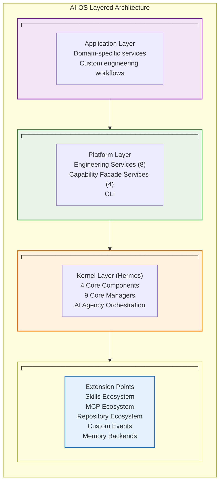

**Communication Model** (ADR 001 — Event-First):
All inter-component communication occurs **exclusively** through the EventBus post-initialization. No direct service-to-service calls, no synchronous RPC, no shared mutable state outside the StateManager.

---

## 3. Hermes Kernel — Core Components

The Hermes Kernel (ADR 002 — Kernel as Pure Orchestrator) provides orchestration primitives only. It contains **zero domain logic**. All domain logic resides in Engineering Services and Extension Points.

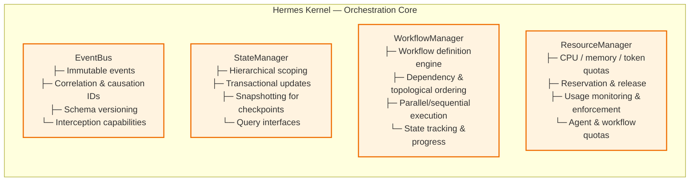

**Core Component Responsibilities**:

| Component | Responsibility |
|-----------|---------------|
| **EventBus** | Sole communication substrate; immutable events with correlation/causation IDs (ADR 008); no direct calls post-init (ADR 001) |
| **StateManager** | Centralized state persistence; hierarchical scopes (global, workflow, session, agent); transactional updates; snapshots for recovery |
| **WorkflowManager** | Orchestration of engineering processes; dependency management; topological ordering; parallel/sequential patterns; state tracking |
| **ResourceManager** | Resource allocation and quotas for CPU, memory, tokens; reservation/release; usage monitoring and enforcement |

---

## 4. Core Managers

The Kernel instantiates, owns, and lifecycle-manages exactly **9 Core Managers** (ADR 003 — Capability Manager Ownership), exposed via **13 Global Singleton Accessors** (ADR 004). `CouncilManager` and `AIAgencyService` are also kernel-managed services that sit at the kernel-platform boundary and provide cross-cutting governance and agency capabilities.

```mermaid
flowchart TB
    subgraph MANAGERS["Core Managers (Kernel-Owned)"]
        direction TB
        MM[MemoryManager<br/>Five-tier memory system<br/>Cross-tier coordination<br/>Access control & scoping]
        MR[ModelRouter<br/>Provider-agnostic LLM routing<br/>Dynamic provider selection<br/>Fallback chains & health monitoring]
        TM[ToolManager<br/>Tool registry & execution<br/>Sandboxed execution<br/>Permission mediation & telemetry]
        SMgr[StorageManager<br/>Persistence abstraction<br/>Schema management & migrations<br/>Query & backup/recovery]
        CM[ContextManager<br/>Conversation context management<br/>Window management & truncation<br/>Relevance scoring & summarization]

        direction LR

        AM[AgentManager<br/>Agent lifecycle (spawn/monitor/terminate)<br/>Inter-agent communication<br/>Per-agent resource quotas & tracking]

        direction TB

        RMgr[RetryManager<br/>Configurable retry budgets<br/>Exponential backoff w/ jitter<br/>Dead letter queue & RootCause integration]
        CMgr[CheckpointManager<br/>Workflow state snapshots<br/>Selective checkpointing<br/>Recovery & pruning]
        RCM[RootCauseManager<br/>Failure pattern recognition<br/>Recovery procedure selection<br/>Escalation protocols]
    end

    subgraph ADDITIONAL["Additional Kernel-Managed Services"]
        direction TB
        CoM[CouncilManager<br/>Voting algorithms (MAJORITY/UNANIMOUS/WEIGHTED)<br/>Dissent escalation to FinalJudge<br/>Audit trail generation]
        AIS[AIAgencyService<br/>AI agent lifecycle & audit<br/>Permission sandboxing<br/>Goal decomposition & reflection<br/>Multi-agent coordination]
    end

    classDef mgr fill:#bbdefb,stroke:#1565C0,stroke-width:1px;
    classDef addl fill:#e3f2fd,stroke:#0d47a1,stroke-width:1px,stroke-dasharray: 2 2;

    class MM,MR,TM,SMgr,CM,AM,RMgr,CMgr,RCM mgr;
    class CoM,AIS addl;
```

| # | Core Manager | Key Responsibility |
|---|-------------|-------------------|
| 1 | **MemoryManager** | Five-tier memory (Working, Claude, Engineering Intelligence, Obsidian, Graphify) |
| 2 | **ModelRouter** | Provider-agnostic LLM capability routing with fallback chains |
| 3 | **ToolManager** | Tool registry, sandboxed execution, permission mediation |
| 4 | **StorageManager** | Persistence abstraction, schema validation, migrations |
| 5 | **ContextManager** | Conversation context, window management, relevance scoring |
| 6 | **AgentManager** | Agent spawning, lifecycle, communication, quotas |
| 7 | **RetryManager** | Retry budgets, exponential backoff, dead letter queue |
| 8 | **CheckpointManager** | Workflow snapshots, selective checkpointing, recovery |
| 9 | **RootCauseManager** | Failure classification, recovery routing, escalation |

Additional kernel-managed services: **CouncilManager** (governance voting), **AIAgencyService** (goal-driven AI agent orchestration).

---

## 5. Engineering Services — SDLC Pipeline

Eight event-driven Engineering Services form a strict linear pipeline (ADR 006). Each phase emits exactly one "Completed" event that triggers the next phase, enabling checkpointing and phase-boundary recovery.

```mermaid
flowchart LR
    subgraph SDLC["Engineering Services SDLC Pipeline"]
        direction LR

        Planning[Planning Service<br/>Goal decomposition<br/>Resource estimation<br/>Risk assessment]
        Coding[Coding Service<br/>Code generation<br/>Syntax validation<br/>Style enforcement]
        Review[Review Service<br/>Code quality analysis<br/>Security scanning<br/>Performance checks]
        Testing[Testing Service<br/>Test strategy<br/>Test case generation<br/>Coverage measurement]
        Deployment[Deployment Service<br/>Environment prep<br/>Release management<br/>Rollback procedures]
        Operations[Operations Service<br/>Monitoring<br/>Incident response<br/>Performance tuning]
        Learning[Learning Service<br/>Experience collection<br/>Pattern extraction<br/>Skill generation]
        Memory[Memory Service<br/>Long-term persistence<br/>Consolidation<br/>Access control]

        Planning -->|PlanningComplete| Coding
        Coding -->|CodingComplete| Review
        Review -->|ReviewComplete| Testing
        Testing -->|TestingComplete| Deployment
        Deployment -->|DeploymentComplete| Operations
        Operations -->|OperationsComplete| Learning
        Learning -->|LearningComplete| Memory
        Memory -->|MemoryComplete| Planning

        subgraph EVENT["All communication via EventBus"]
            EB[(EventBus)]
        end

        Planning -.->|Event: PlanningComplete| EB
        Coding -.->|Event: CodingComplete| EB
        Review -.->|Event: ReviewComplete| EB
        Testing -.->|Event: TestingComplete| EB
        Deployment -.->|Event: DeploymentComplete| EB
        Operations -.->|Event: OperationsComplete| EB
        Learning -.->|Event: LearningComplete| EB
        Memory -.->|Event: MemoryComplete| EB

        classDef svc fill:#e3f2fd,stroke:#1565C0,stroke-width:2px;
        classDef eventConn fill:#f3e5f5,stroke:#6a1b9a,stroke-width:1px,stroke-dasharray: 4 2;

        class Planning,Coding,Review,Testing,Deployment,Operations,Learning,Memory svc;
        class EB eventConn;
    end
```

Each Engineering Service extends `BaseService` (ADR 005), declares `depends_on`, subscribes in `on_start()`, emits typed Events, and MUST NOT call other services directly.

---

## 6. Capability Facade Services

The four Capability Facade Services translate incoming Events into Core Manager calls and emit result Events (ADR 007). They MUST NOT contain business logic, keeping managers pure and testable.

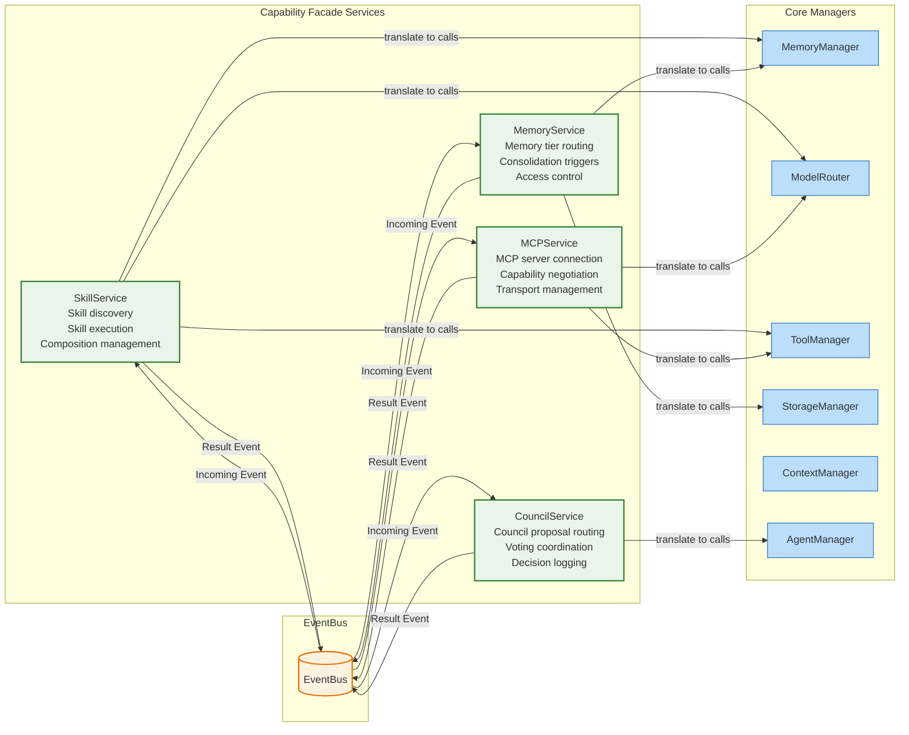

---

## 7. Configuration System

Config MUST use a four-layer merge strategy (ADR 010): `defaults → app.yaml → env.yaml → environment variables`. No hardcoded defaults in Kernel or Manager code. Configuration becomes immutable after the `INITIALIZING` phase.

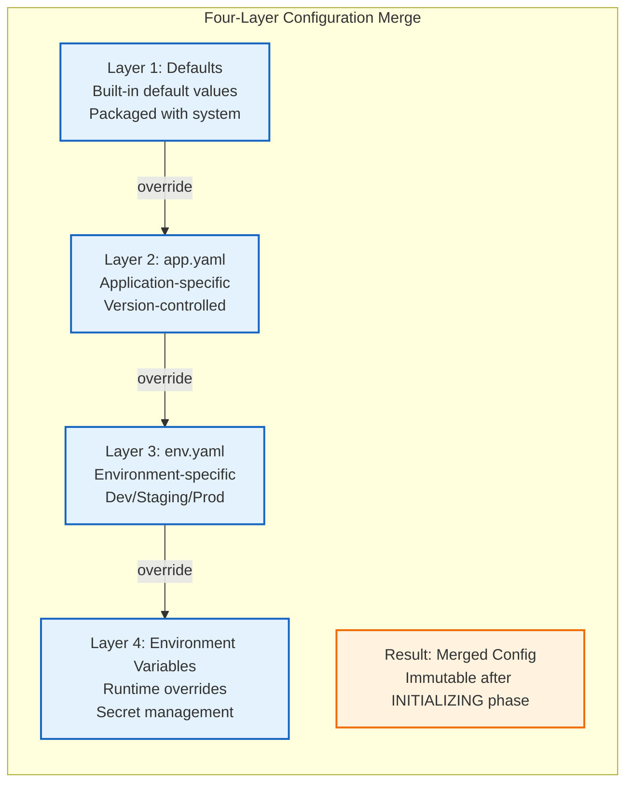

---

## 8. Event System & Observability

Every component emits structured logs (JSON with correlation IDs) and Events for state transitions (ADR 012). The `StructuredLogger` is the single logging abstraction throughout the system.

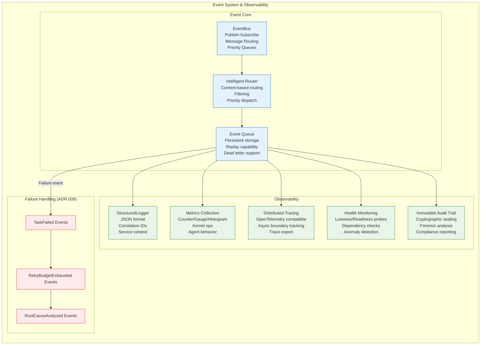

---

## 9. Five-Tier Memory Architecture

The five-tier memory system (ADR 016) provides optimal storage characteristics for different information types, progressing from volatile working memory to persistent organizational intelligence.

```mermaid
flowchart TB
    subgraph MEMORY["Five-Tier Memory Architecture"]
        direction TB

        MMgr[MemoryManager<br/>├─ Tier management<br/>├─ Access control<br/>├─ Cross-tier coordination<br/>└─ Lifecycle management]

        WM[Working Memory<br/>Volatile · Session-scoped<br/>Rapid access<br/>Backend: In-memory]
        CMem[Claude Memory<br/>Semi-persistent · Agent-scoped<br/>Session resumption<br/>Backend: SQLite/File]
        EI[Engineering Intelligence<br/>Persistent · System-wide<br/>Best practices & patterns<br/>Backend: PostgreSQL/MongoDB]
        OM[Obsidian Memory<br/>Persistent · System-wide<br/>Knowledge vault<br/>Backend: File system (Markdown/YAML)]
        GM[Graphify Memory<br/>Persistent · System-wide<br/>Knowledge graph<br/>Backend: Graph DB (Neo4j/Janus)]
    end

    MMgr -->|manages| WM
    MMgr -->|manages| CMem
    MMgr -->|manages| EI
    MMgr -->|manages| OM
    MMgr -->|manages| GM

    WM -.->|patterns| CMem
    CMem -.->|consolidation| EI
    OM -.->|documents| EI
    GM -.->|relationships| EI

    WM <-.->|used by| Agents[AI Agents]
    WM <-.->|used by| Services[Engineering Services]
    WM <-.->|used by| Kernel[Hermes Kernel]

    EI <-.->|informs| Planning[Planning Service]
    EI <-.->|informs| Architecture[Architecture Service]
    EI <-.->|informs| Learning[Learning Service]
    EI <-.->|informs| Validation[Validation Service]

    OM <-.->|documents| Documentation[Documentation Service]
    OM <-.->|docs| KnowledgeMgmt[Knowledge Management]

    GM <-.->|reasoning| Reasoning[Reasoning Engine]
    GM <-.->|analysis| DepAnalysis[Dependency Analyzer]

    classDef mgr fill:#bbdefb,stroke:#1565C0,stroke-width:2px;
    classDef mem fill:#fff3e0,stroke:#ef6c00,stroke-width:2px;

    class MMgr mgr;
    class WM,CMem,EI,OM,GM mem;
```

| Tier | Volatility | Scope | Backend | Purpose |
|------|-----------|-------|---------|---------|
| **Working Memory** | Volatile | Session | RAM/Redis | Active agent reasoning context |
| **Claude Memory** | Semi-persistent | Agent-type | SQLite/File | Conversation history, session state |
| **Engineering Intelligence** | Persistent | System-wide | PostgreSQL | Lessons learned, best practices |
| **Obsidian** | Persistent | System-wide | File system | Documentation, wikis, ADRs |
| **Graphify** | Persistent | System-wide | Graph DB | Entity relationships, reasoning |

---

## 10. Skills Ecosystem

The Skills Ecosystem provides reusable, composable engineering capabilities through discovery, versioning, sandboxing, composition, and governance.

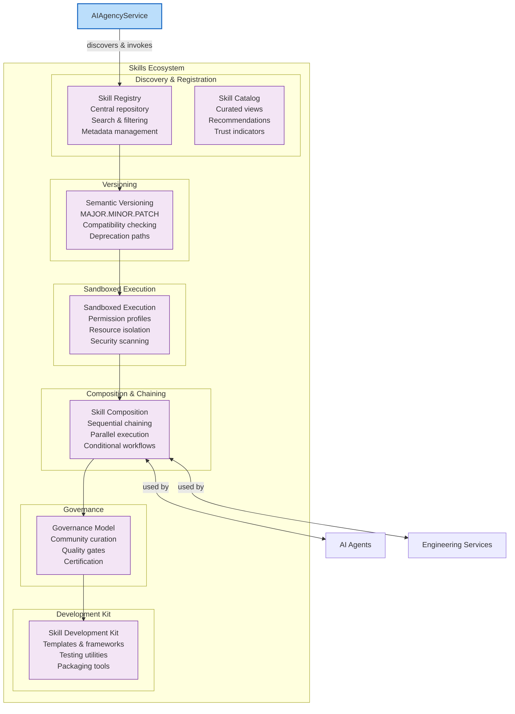

---

## 11. MCP Ecosystem

The Model Context Protocol (MCP) Ecosystem enables external tool integration through standardized transports, capabilities, security, state management, discovery, and certification.

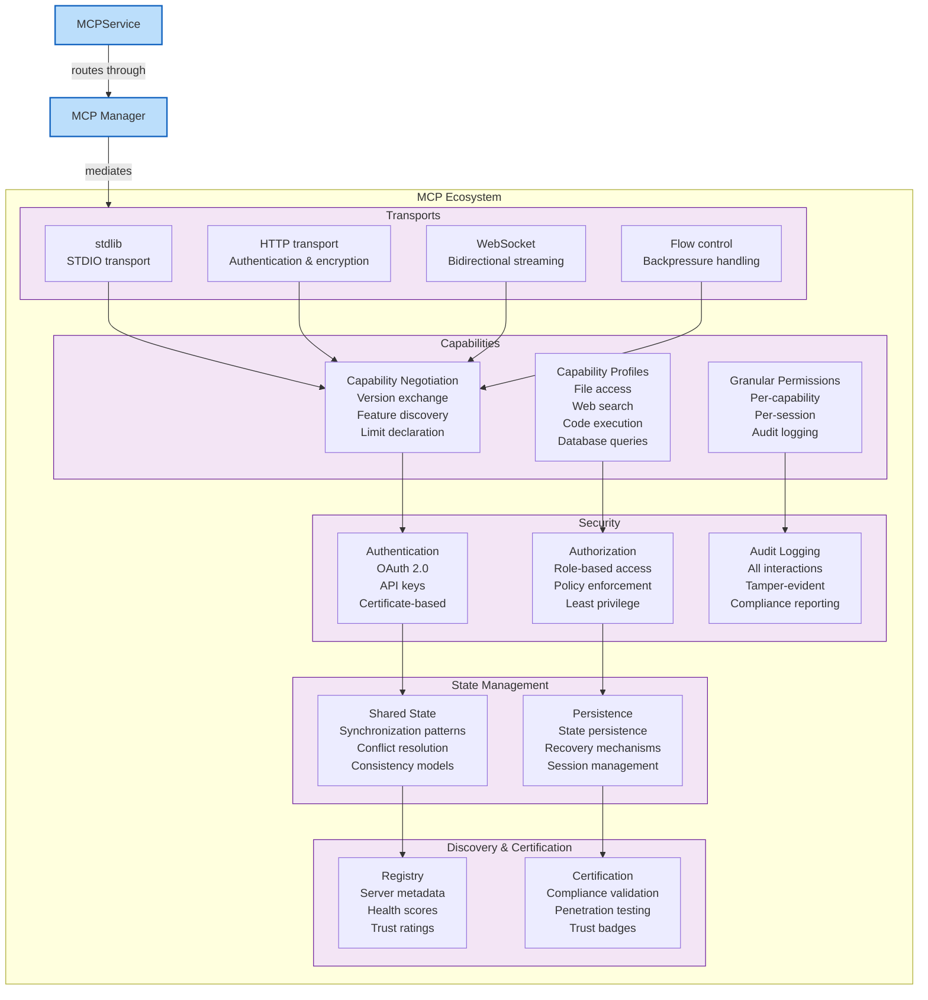

---

## 12. Repository Ecosystem

The Repository Ecosystem enables sharing and reuse of engineering assets through workflow templates, component libraries, reference architectures, best practices, learning materials, and a community hub.

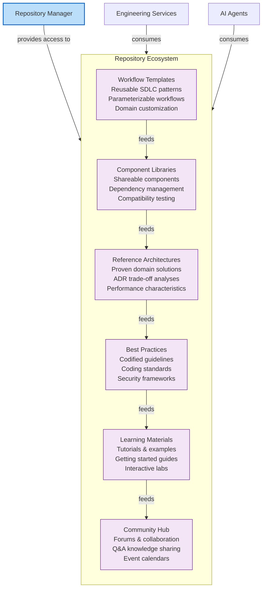

---

## 13. Governance & Council Architecture

AI-OS implements structured AI governance through multiple councils operating in a polycentric model with clear authority boundaries and escalation paths to the FinalJudge for human oversight.

```mermaid
flowchart TB
    subgraph GOV["Governance & Council Architecture"]
        direction TB

        subgraph PERM["Permanent Councils"]
            ARB_C[Architecture Council (ARB)<br/>Reviews proposals<br/>Maintains ADRs<br/>Enforces standards<br/>Manages tech debt]
            EngC[Engineering Council<br/>Practices & standards<br/>Code review<br/>Testing strategies<br/>Release coordination]
            SecC[Security Council<br/>Security policies<br/>Threat modeling<br/>Incident response<br/>Vulnerability management]
            ResC[Research Council<br/>Technology scouting<br/>Future evaluation<br/>Research partnerships<br/>Strategic advisement]
        end

        subgraph TEMP["Temporary & Advisory Councils"]
            RB[Review Board<br/>Compliance reviews<br/>ADR validation<br/>Post-decision assessment<br/>Quality assurance]
            ValC[Validation Council<br/>Quality gates<br/>Validation standards<br/>Testability check<br/>Compliance verification]
        end

        FinalJudge[FinalJudge<br/>Human oversight<br/>Veto & override<br/>Constitutional interpretation<br/>Value alignment]
    end

    SecC -->|non-negotiable<br/>constraints| ARB_C
    SecC -->|non-negotiable<br/>constraints| EngC
    SecC -->|non-negotiable<br/>constraints| ResC

    AIAgencyService[AIAgencyService] -->|proposals to| ARB_C
    AIAgencyService -->|appeals to| FinalJudge

    ARB_C -->|standards to| ValC
    ValC -->|findings to| RB
    RB -->|recommendations to| ARB_C

    ResC -->|evolution<br/>recommendations| ARB_C
    ARB_C -->|constraints to| ResC

    classDef perm fill:#e8f5e8,stroke:#2e7d32,stroke-width:2px;
    classDef temp fill:#e3f2fd,stroke:#1565C0,stroke-width:2px;
    classDef judge fill:#fff3e0,stroke:#ef6c00,stroke-width:2px;
    classDef agency fill:#f3e5f5,stroke:#6a1b9a,stroke-width:2px;

    class ARB_C,EngC,SecC,ResC perm;
    class RB,ValC temp;
    class FinalJudge judge;
    class AIAgencyService agency;
```

**Voting Algorithms**: MAJORITY, UNANIMOUS, WEIGHTED

**Council Hierarchy** (by scope and time horizon):

| Layer | Focus | Time Horizon | Authority |
|-------|-------|--------------|-----------|
| Strategic | Vision, values, resources | Years | High-impact, irreversible |
| Architectural | Structure, interfaces, standards | Months–years | Precedent-setting |
| Operational | Day-to-day management | Days–months | Routine decisions |
| Tactical | Immediate responses | Hours–days | Situational |

---

## 14. Goal-Driven Execution & AI Agency

AI-OS transcends predefined workflows through goal-driven execution with autonomous, adaptive agentic behavior under human governance.

```mermaid
flowchart TB
    subgraph GOAL_EXEC["Goal-Driven Execution Engine"]
        direction TB

        subgraph INPUT["1. Goal Formulation"]
            UserInput[User Goal<br/>Natural language objective<br/>e.g., "implement OAuth 2.0 auth"]
            GoalAnalysis[Goal Analysis<br/>Intent understanding<br/>Constraint extraction<br/>Success criteria]
        end

        subgraph PLAN["2. AI-Powered Planning"]
            Planning[Planning Module<br/>Goal decomposition<br/>Resource estimation<br/>Risk assessment<br/>Dependency mapping]
            PlanApproval{Plan Approval<br/>Council Review?}
            HumanApproval[Human Approval<br/>FinalJudge<br/>or<br/>Council]
        end

        subgraph EXEC["3. Execution"]
            ExecModule[Execution Module<br/>Plan carrying with monitoring<br/>Intervention points<br/>Progress tracking]
            ToolUse[Tool/Skill Usage<br/>Capability resolution<br/>Agent spawning<br/>Resource allocation]
        end

        subgraph VAL["4. Validation"]
            PreVal[Pre-execution<br/>Safety & feasibility]
            DuringVal[During-execution<br/>Process compliance<br/>Anomaly detection]
            PostVal[Post-execution<br/>Outcome verification<br/>Quality standards]
        end

        subgraph REFLECT["5. Self-Looping & Reflection"]
            Reflection[Reflection<br/>Outcome analysis<br/>Principle extraction<br/>Confidence tracking]
            PatternExtract[Pattern Extraction<br/>Success/failure patterns<br/>Sequence mining<br/>Association learning]
            Hypothesis[Hypothesis Generation<br/>Improved approaches<br/>Alternative strategies]
        end

        subgraph MEMORY["6. Knowledge Consolidation"]
            Consolidate[Consolidation<br/>Generalize principles<br/>Integrate with EI<br/>Update memory tiers]
            SkillGen[Skill Generation<br/>Recurring patterns → skills<br/>Template generation<br/>Documentation]
        end

        subgraph LOOP["7. Adaptive Adaptation"]
            Adapt[Adaptive Planning<br/>Refined objectives<br/>Improved routing<br/>Updated constraints]
            Replan[Replanning<br/>Plan modification<br/>Resource reallocation<br/>New task creation]
        end
    end

    UserInput --> GoalAnalysis
    GoalAnalysis --> Planning
    Planning --> PlanApproval
    PlanApproval -->|Approved| ExecModule
    PlanApproval -->|Rejected| Replan
    ExecModule --> ToolUse
    ToolUse --> PreVal
    PreVal --> DuringVal
    DuringVal --> PostVal
    PostVal --> Reflection
    Reflection --> PatternExtract
    PatternExtract --> Hypothesis
    Hypothesis --> Consolidate
    Consolidate --> SkillGen
    SkillGen --> Adapt
    Adapt --> Replan
    Replan --> Planning

    classDef phase fill:#e3f2fd,stroke:#1565c0,stroke-width:2px;
    classDef loop fill:#f3e5f5,stroke:#6a1b9a,stroke-width:2px;

    class INPUT,PLAN,EXEC,VAL,REFLECT,MEMORY,LOOP phase;
```

**Agent Lifecycle States**: `CREATED → INITIALIZING → RUNNING → {COMPLETED, FAILED, CANCELLED, TERMINATED}`

**Agent Types** (9 specialized): Security, Performance, Chaos, Accessibility, Documentation, Concurrency, BugHunter, Architecture, FinalJudge

---

## 15. Validation Architecture

The Validation Architecture ensures system correctness and safety through layered defense across validation domains.

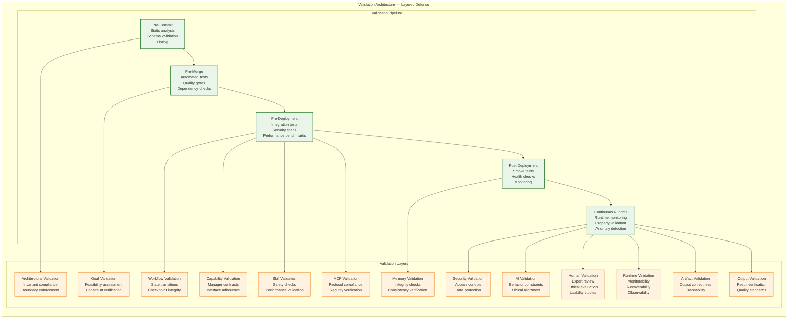

**Conformance Levels** (L1–L4):

| Level | Scope | Validation Rigor |
|-------|-------|------------------|
| **L1** | Core lifecycle & EventBus | Minimal validation |
| **L2** | Full Kernel & Core Managers | Standard validation |
| **L3** | Engineering Services & Framework | Rigorous validation |
| **L4** | Full specification compliance | Comprehensive validation |

---

## 16. Fault Tolerance & Recovery

AI-OS implements comprehensive fault tolerance through retry mechanisms, checkpointing, failure classification, recovery routing, and deterministic recovery.

```mermaid
stateDiagram-v2
    [*] --> Operating: System Start
    Operating --> Healthy: Normal Operation
    Healthy --> Monitoring: Continuous Observation
    Monitoring --> Healthy: All checks pass
    Monitoring --> Degraded: Transient failure detected

    Degraded --> SelfHealing: Attempt self-healing
    SelfHealing --> Healthy: Recovery successful
    SelfHealing --> Degraded: Recovery failed

    Degraded --> Retry: Activate retry mechanism
    Retry -->|Retry budget available| Healthy: Recovery successful
    Retry -->|Retry budget exhausted| Failed: Exhausted budget

    Healthy --> Checkpoint: Periodic checkpoint
    Checkpoint --> Operating: Resume

    Failed --> CheckpointRecovery: Load latest checkpoint
    CheckpointRecovery --> Operating: Recovery from checkpoint

    Failed --> Escalation: Critical failure
    Escalation --> HumanIntervention: Human approval required
    HumanIntervention -->|Approved| EnhancedRecovery: Execute enhanced recovery
    HumanIntervention -->|Rejected| Compensation: Initiate compensation logic
    HumanIntervention -->|Timeout| TimeoutHandling: Handle timeout

    Compensation --> Rollback: Execute rollback
    Compensation --> ResourceCleanup: Cleanup resources
    Rollback --> Operating: Retry with fixes
    ResourceCleanup --> [*]: Terminate

    TimeoutHandling --> Operating: Retry with adjustments

    note right of Operating
        EventBus operational
        All services running
        Resources allocated
    end

    note right of Degraded
        Reduced functionality
        Some services affected
        Monitoring intensified
    end

    note right of Failed
        Retry budget exhausted
        Checkpoint recovery initiated
        Escalation protocol activated
    end

    classDef normal fill:#e8f5e8,stroke:#2e7d32,stroke-width:1px;
    classDef warning fill:#fff3e0,stroke:#ef6c00,stroke-width:1px;
    classDef critical fill:#ffebee,stroke:#c62828,stroke-width:1px;
    classDef recovery fill:#e3f2fd,stroke:#1565c0,stroke-width:1px;

    class Operating,Healthy,Monitoring,Checkpoint normal;
    class Degraded,Retry,SelfHealing warning;
    class Failed,Escalation,HumanIntervention,EnhancedRecovery compensation;
    Compensation,ResourceCleanup,Rollback,TimeoutHandling,CheckpointRecovery recovery;
```

**Failure Classification**:

| Type | Description | Response |
|------|-------------|----------|
| **TRANSIENT** | Temporary, retry-safe | Automatic retry with backoff |
| **DEGRADED** | Reduced functionality | Degraded mode, alert |
| **CRITICAL** | Requires attention | Escalation, recovery |
| **FATAL** | System-terminating | Restart, checkpoint recovery |

---

## 17. System Lifecycle

```mermaid
stateDiagram-v2
    [*] --> Startup: System Boot
    Startup --> Registration: Component Registration
    Registration --> Initialization: Dependency Resolution
    Initialization --> Running: System Ready

    Running --> GoalReceived: Goal Received
    GoalReceived --> Planning: Planning Phase
    Planning --> Execution: Execute Plan
    Execution --> Validation: Validate Results
    Validation --> Reflection: Reflect
    Reflection --> Learning: Learn
    Learning --> Running: Resume
    Validation --> Completion: Goal Complete
    Completion --> Running: Resume / New Goal

    Execution --> Failure: Task Failure
    Failure --> Recovery: Error Recovery
    Recovery -->|Self-Heal| Execution
    Recovery -->|Retry| Execution
    Recovery -->|Checkpoint| Execution
    Recovery -->|Escalate| HumanIntervention: Human Approval

    Running --> Shutdown: System Shutdown
    Shutdown --> [*]: System Halted

    note right of Startup
        Load configuration
        Initialize EventBus
        Set up StateManager
    end

    note right of Registration
        Register services
        Register managers
        Register capabilities
    end

    note right of Initialization
        Topological start
        Resource allocation
        Dependency activation
    end

    note right of Running
        Event-driven execution
        Agent orchestration
        Service coordination
    end

    note right of GoalReceived
        Goal accepted
        Priority assigned
        Audit logging
    end

    note right of Planning
        Decompose goal
        Plan execution
        Resource estimation
    end

    note right of Execution
        Agent spawning
        Skill invocation
        MCP tool usage
    end

    note right of Validation
        Correctness check
        Quality gates
        Security validation
    end

    note right of Reflection
        Outcome analysis
        Pattern extraction
        Knowledge consolidation
    end

    note right of Failure
        Error detection
        Classification
        Recovery routing
    end

    note right of Shutdown
        Graceful shutdown
        Event queue flush
        State persistence
        Resource cleanup
    end
```

**Five-State FSM** (ADR 004): `UNINITIALIZED → INITIALIZED → RUNNING → SHUTTING_DOWN → TERMINATED`

---

## 18. Runtime Execution Flow

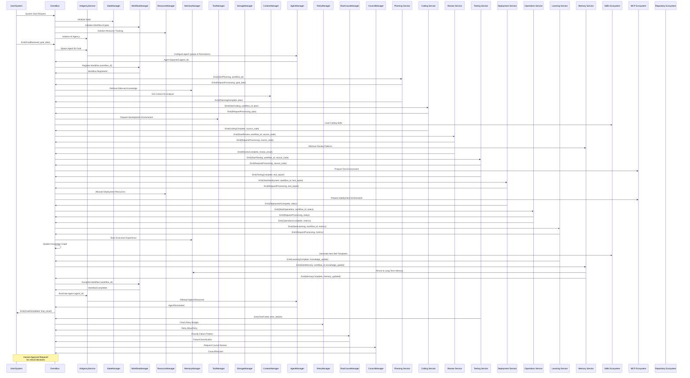

---

## 19. Cross-Domain Relationships

```mermaid
flowchart TD
    subgraph DOMAINS["Architectural Cross-Domain Relationships"]
        direction TB

        Kernel[Hermes Kernel<br/>4 Core Components<br/>9 Core Managers<br/>AIAgencyService<br/>CouncilManager]
        Runtime[Runtime Execution<br/>Goal-Driven<br/>Event Flow<br/>Agent Orchestration<br/>Service Coordination]
        Memory[Memory Architecture<br/>5-Tier System<br/>Working→Claude→EI<br/>Obsidian→Graphify<br/>Lifecycle Management]
        MCPEco[MCP Ecosystem<br/>Transports<br/>Capabilities<br/>Security<br/>State Mgmt<br/>Discovery<br/>Certification]
        SkillsEco[Skills Ecosystem<br/>Registry<br/>Versioning<br/>Sandboxing<br/>Composition<br/>Governance]
        RepoEco[Repository Ecosystem<br/>Workflow Templates<br/>Component Libraries<br/>Reference Architectures<br/>Best Practices<br/>Learning Materials]
        Councils[Council Governance<br/>ARB, Engineering,<br/>Security, Research<br/>Voting Algorithms<br/>FinalJudge]
        Validation[Validation Architecture<br/>11 Layers<br/>Pre/Post-Deploy<br/>Conformance L1-L4<br/>Quality Gates]
        Observability[Observability<br/>Metrics<br/>Tracing<br/>Logging<br/>Health Checks<br/>Audit Trail]
        EngLifecycle[Engineering Services<br/>Planning→Coding→Review<br/>Testing→Deployment<br/>Operations→Learning<br/>Memory]
        Security[Security Principles<br/>Least Privilege<br/>Input Validation<br/>Data Protection<br/>Secure Defaults]
        Config[Configuration<br/>4-Layer Merge<br/>Defaults→app.yaml<br/>→env.yaml→env vars<br/>Immutable after init]
        Events[Event System<br/>Immutable Events<br/>Correlation/Causation<br/>Schema Versioning<br/>Event Types]
    end

    %% Strong coupling relationships (Kernel ↔ Domain)
    Kernel <-->|orchestrates| Runtime
    Kernel <-->|manages| Memory
    Kernel <-->|provides access to| SkillsEco
    Kernel <-->|provides access to| MCPEco
    Kernel <-->|provides access to| RepoEco
    Kernel <-->|governs| Councils
    Kernel <-->|ensures| Validation
    Kernel <-->|enables| Observability
    Kernel <-->|drives| EngLifecycle
    Kernel <-->|enforces| Security
    Kernel <-->|defines| Config
    Kernel <-->|provides| Events

    %% Cross-domain relationships
    Runtime <-->|utilizes| Memory
    Runtime <-->|leverages| SkillsEco
    Runtime <-->|integrates with| MCPEco
    Runtime <-->|accesses| RepoEco
    Runtime <-->|overseen by| Councils
    Runtime <-->|validated by| Validation
    Runtime <-->|monitored by| Observability
    Runtime <-->|executes| EngLifecycle
    Runtime <-->|secured by| Security

    Memory <-->|patterns inform| SkillsEco
    Memory <-->|context enhances| MCPEco
    Memory <-->|assets versioned in| RepoEco
    Memory <-->|decisions advise| Councils
    Memory <-->|validated by| Validation
    Memory <-->|observed by| Observability
    Memory <-->|supports| EngLifecycle
    Memory <-->|protected by| Security

    Events <-->|enables| Observability
    Events <-->|carries| Validation
    Events <-->|orchestrates| EngLifecycle
    Events <-->|governs| Councils

    Config <-->|configures| Kernel
    Config <-->|configures| EngLifecycle
    Config <-->|constraints| Security
    Config <-->|parameters| Validation

    classDef domain fill:#e8f5e8,stroke:#2e7d32,stroke-width:2px;
    classDef coupling fill:#fff3e0,stroke:#ef6c00,stroke-width:2px;
    classDef cross fill:#e3f2fd,stroke:#1565c0,stroke-width:1px;

    class Kernel,Runtime,Memory,MCPEco,SkillsEco,RepoEco,Councils,Validation,Observability,EngLifecycle,Security,Config,Events domain;
```

---

## 20. Architectural Invariants & Constraints

The following invariants are **fixed** and MUST NOT be modified (Section 12 of ENGINEERING_PRINCIPLES.md):

```mermaid
flowchart TB
    subgraph INVARIANTS["Architectural Invariants"]
        direction TB

        I1[Invariant 1<br/>Kernel Stability & Purity<br/>Exactly 4 Core Components<br/>Zero domain logic]
        I2[Invariant 2<br/>Observability through<br/>Immutable Events<br/>Correlation/Causation IDs]
        I3[Invariant 3<br/>Deterministic Lifecycle<br/>5-State FSM<br/>Topological order]
        I4[Invariant 4<br/>Strict Resource Quota<br/>Enforcement<br/>No exhaustion possible]
        I5[Invariant 5<br/>Failure Handling via Events<br/>No exceptions crossing<br/>Service boundaries]
        I6[Invariant 6<br/>Human Oversight<br/>Council governance<br/>FinalJudge override]
        I7[Invariant 7<br/>Ecosystem Compatibility<br/>Versioned contracts<br/>Migration paths]
        I8[Invariant 8<br/>Validation-First Execution<br/>Pre/during/post validation<br/>Evidence-based]
        I9[Invariant 9<br/>Immutable Event Integrity<br/>Audit trails preserved<br/>Long-term storage]
        I10[Invariant 10<br/>Technology-Neutral<br/>Specification compliance<br/>Behavioral contracts]
        I11[Invariant 11<br/>Extension Point Integrity<br/>No kernel internals access<br/>Manager mediation]
        I12[Invariant 12<br/>Principle Adherence<br/>Engineering Principles<br/>Conformance requirement]
    end

    classDef invariant fill:#ffebee,stroke:#c62828,stroke-width:2px;
    class I1,I2,I3,I4,I5,I6,I7,I8,I9,I10,I11,I12 invariant;
```

| # | Constraint/Invariant | Specification Reference | MUST NOT Violates |
|---|---------------------|------------------------|-------------------|
| 1 | Exactly 4 Core Components | Part 1.1 | Kernel instability |
| 2 | Exactly 9 Core Managers | Part 1.2 | Manager lifecycle failure |
| 3 | EventBus as sole communication | Part 2.1, ADR 001 | Tight coupling, observability loss |
| 4 | Immutable events w/ correlation/causation | Part 2.2-2.3, ADR 008 | Audit trail compromise |
| 5 | Four-layer configuration merge | Part 8.1-8.2, ADR 010 | Deployment rigidity |
| 6 | Services extend BaseService | Part 4.1-4.3, ADR 005 | Lifecycle failure |
| 7 | Five-state FSM | Part 1.3 | Unpredictable states |
| 8 | Specification/implementation separation | Part 0 | Technological lock-in |
| 9 | Extension point governance | Part 0.5.2, ADR 013 | Kernel instability |
| 10 | Failure handling via events only | Part 2.2, ADR 009 | Exception crossing boundaries |
| 11 | Immutable configuration after INITIALIZING | Part 8.2, ADR 010 | Runtime instability |
| 12 | Versioning with migration paths | ADR 011 | Unsafe evolution |

---

## 21. Architecture Decision Records (ADRs)

All 16 ADRs are **Active** and define the foundational architectural decisions for AI-OS Hermes Kernel v1.0:

```mermaid
flowchart LR
    subgraph ADRS["Active ADRs"]
        ADR001[ADR 001<br/>Event-First Communication]
        ADR002[ADR 002<br/>Kernel as Pure Orchestrator]
        ADR003[ADR 003<br/>Capability Manager Ownership]
        ADR004[ADR 004<br/>Global Singleton Accessors]
        ADR005[ADR 005<br/>Event-Driven Services]
        ADR006[ADR 006<br/>Engineering Service SDLC Pipeline]
        ADR007[ADR 007<br/>Capability Facade Services]
        ADR008[ADR 008<br/>Immutable Events w/ Correlation & Causation]
        ADR009[ADR 009<br/>Explicit Failure Handling via Events]
        ADR010[ADR 010<br/>Declarative Layered Configuration]
        ADR011[ADR 011<br/>Version & Compatibility First-Class]
        ADR012[ADR 012<br/>Built-In Observability]
        ADR013[ADR 013<br/>Extension Points Governance]
        ADR014[ADR 014<br/>Architecture Decision Record Process]
        ADR015[ADR 015<br/>AI-OS vs Hermes Kernel Distinction]
        ADR016[ADR 016<br/>Memory Architecture Five-Tier Hierarchy]
    end

    subgraph CATEGORIES["Decision Categories"]
        COMM[Communication]
        KERNEL[Kernel Design]
        MANAGERS[Manager Ownership]
        SERVICES[Services]
        SDLC[SDLC Pipeline]
        FACADES[FACADES]
        EVENTS[Events]
        MEMORY[Memory]
        CONFIG[Configuration]
        VERSION[Version]
        OBSERV[Observability]
        EXTENSIONS[Extensions]
        PROCESS[Process]
    end

    ADR001 --> COMM
    ADR002 --> KERNEL
    ADR003 --> MANAGERS
    ADR004 --> KERNEL
    ADR005 --> SERVICES
    ADR006 --> SDLC
    ADR007 --> FACADES
    ADR008 --> EVENTS
    ADR009 --> EVENTS
    ADR010 --> CONFIG
    ADR011 --> VERSION
    ADR012 --> OBSERV
    ADR013 --> EXTENSIONS
    ADR014 --> PROCESS
    ADR015 --> KERNEL
    ADR016 --> MEMORY

    classDef adr fill:#e3f2fd,stroke:#1565C0,stroke-width:2px;
    classDef cat fill:#fff3e0,stroke:#ef6c00,stroke-width:1px;

    class ADR001,ADR002,ADR003,ADR004,ADR005,ADR006,ADR007,ADR008,ADR009,ADR010,ADR011,ADR012,ADR013,ADR014,ADR015,ADR016 adr;
    class COMM,KERNEL,MANAGERS,SERVICES,SDLC,FACADES,EVENTS,MEMORY,CONFIG,VERSION,OBSERV,EXTENSIONS,PROCESS cat;
```

| ADR | Title | Core Principle |
|-----|-------|---------------|
| 001 | Event-First Communication | ADR 001 — Event-First |
| 002 | Kernel as Pure Orchestrator | ADR 002 — Pure Orchestrator |
| 003 | Capability Manager Ownership | ADR 003 — Manager Ownership |
| 004 | Global Singleton Accessors | ADR 004 — Accessor Pairs |
| 005 | Event-Driven Services | ADR 005 — BaseService |
| 006 | Engineering Service SDLC Pipeline | ADR 006 — SDLC Pipeline |
| 007 | Capability Facade Services | ADR 007 — Facades |
| 008 | Immutable Events w/ Correlation & Causation | ADR 008 — Immutable Events |
| 009 | Explicit Failure Handling via Events | ADR 009 — Failure Events |
| 010 | Declarative Layered Configuration | ADR 010 — Config Layers |
| 011 | Version & Compatibility First-Class | ADR 011 — Versioning |
| 012 | Built-In Observability | ADR 012 — Observability |
| 013 | Extension Points Governance | ADR 013 — Extensions |
| 014 | Architecture Decision Record Process | ADR 014 — ADR Process |
| 015 | AI-OS vs Hermes Kernel Distinction | ADR 015 — Distinction |
| 016 | Memory Architecture Five-Tier Hierarchy | ADR 016 — Memory Tiers |

---

## 22. Conformance Levels

```mermaid
flowchart TB
    subgraph CONFORMANCE["AI-OS Conformance Model"]
        direction TB

        subgraph BASE["Base Requirements"]
            L0[Core Runtime<br/>4 Core Components<br/>9 Core Managers<br/>5-State FSM<br/>EventBus-only communication]
        end

        subgraph LEVELS["Conformance Levels"]
            L1[L1 — Basic<br/>Core lifecycle & EventBus<br/>Minimal validation]
            L2[L2 — Standard<br/>Full Kernel & Core Managers<br/>Standard validation]
            L3[L3 — Rigorous<br/>Engineering Services & Framework<br/>Rigorous validation]
            L4[L4 — Comprehensive<br/>Full specification compliance<br/>Formal methods & chaos engineering]
        end

        L0 --> L1
        L1 --> L2
        L2 --> L3
        L3 --> L4

        classDef base fill:#e3f2fd,stroke:#1565c0,stroke-width:2px;
        classDef level fill:#e8f5e8,stroke:#2e7d32,stroke-width:2px;

        class L0 base;
        class L1,L2,L3,L4 level;
    end
```

| Level | Scope | Validation Rigor | Use Case |
|-------|-------|------------------|----------|
| **L1** | Core lifecycle and basic EventBus | Minimal | Infrastructure, low-risk utilities |
| **L2** | Full Kernel and Core Managers | Standard | Core services, platform foundations |
| **L3** | Engineering Services and Service Framework | Rigorous | SDLC tools, engineering workflows |
| **L4** | Full specification compliance | Comprehensive | Mission-critical, reference implementations |

---

## 23. Related Documents

This executive overview is complemented by and should be read in conjunction with the following documents:

| Document | Relationship |
|----------|-------------|
| [[AI_OS_MASTER_CONTEXT.md]] | Master context — definitive source for system state and component relationships |
| [[ENGINEERING_PRINCIPLES.md]] | Engineering Principles — philosophical foundation and design constraints |
| [[ARCHITECTURE_DECISIONS.md]] | ADRs — permanent record of architectural decisions (16 ADRs) |
| [[MEMORY_ARCHITECTURE.md]] | Memory Architecture — five-tier hierarchy and lifecycle details |
| [[MCP_ECOSYSTEM.md]] | MCP Ecosystem — external tool integration framework |
| [[SKILLS_ECOSYSTEM.md]] | Skills Ecosystem — reusable AI capability ecosystem |
| [[VALIDATION_ARCHITECTURE.md]] | Validation Architecture — layered validation and conformance framework |
| [[AI_AGENCY.md]] | AI Agency — agent lifecycle, types, and governance |
| [[REPOSITORY_ECOSYSTEM.md]] | Repository Ecosystem — asset sharing and reuse |
| [[GLOSSARY.md]] | Reference Dictionary — canonical architectural terminology |
| [[IMPLEMENTATION_GUIDE.md]] | Implementation Guide — conformance guidance and checklist |
| [[VERSION_HISTORY.md]] | Version History — chronological evolution of AI-OS |
| [[AI_OS_COMPLETE_ARCHITECTURE.md]] | Complete Architecture — master visualization document |
| [[RUNTIME_EXECUTION_FLOW.md]] | Runtime Flow — execution lifecycle with error handling |
| [[AGENT_FLOW.md]] | Agent Flow — single/multi-agent orchestration flow |
| [[MCP_FLOW.md]] | MCP Flow — MCP ecosystem integration diagram |
| [[MEMORY_FLOW.md]] | Memory Flow — memory systems and interaction flows |
| [[COUNCIL_FLOW.md]] | Council Flow — governance and decision-making flow |
| [[PART_FLOW.md]] | Part Flow — architecture part lifecycle and publication flow |
| [[REPOSITORY_MAP.md]] | Repository Map — repository structure and ownership |

---

*Document Version: 1.0.0*
*Last Updated: 2026-08-07*
*Status: ACTIVE — Executive Visual Overview*
*AI-OS Architecture Specification v1.0*
