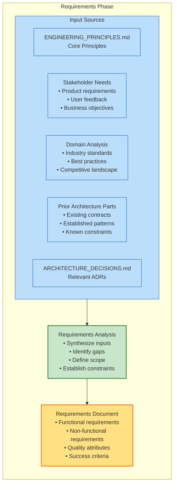
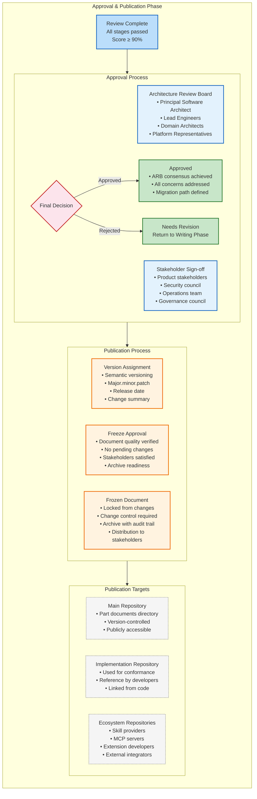
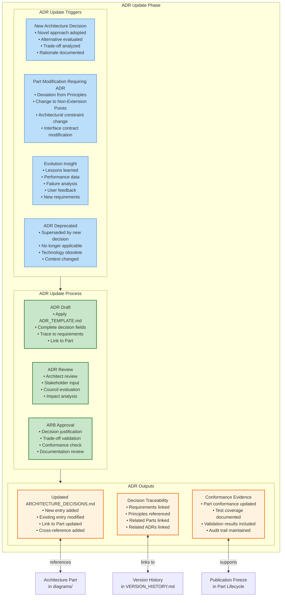
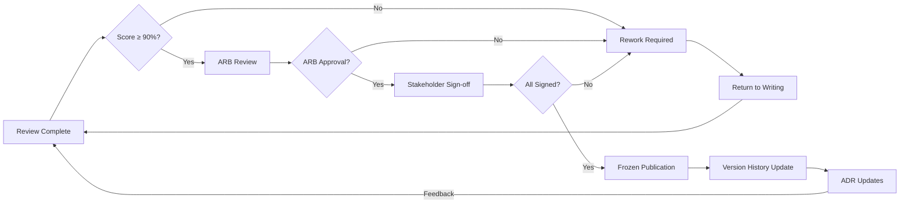

# Architecture Part Lifecycle Flow

> Publication-quality diagrams illustrating how an AI-OS Architecture Part evolves from requirements through to frozen publication. All diagrams depict existing architecture processes as defined in `ARCHITECTURE_DECISIONS.md`, `ENGINEERING_PRINCIPLES.md`, `templates/PART_TEMPLATE.md`, and `templates/REVIEW_TEMPLATE.md`. No new components or processes are introduced.

## Table of Contents

1. [Architecture Part Lifecycle](#architecture-part-lifecycle)
2. [Requirements Gathering](#requirements-gathering)
3. [Architecture Design](#architecture-design)
4. [Writing Phase](#writing-phase)
5. [Review Process](#review-process)
6. [Consistency Review](#consistency-review)
7. [Approval & Publication](#approval--publication)
8. [Freeze Process](#freeze-process)
9. [Version History Integration](#version-history-integration)
10. [ADR Updates](#adr-updates)
11. [Relationships with External Systems](#relationships-with-external-systems)
12. [Complete Lifecycle Diagram](#complete-lifecycle-diagram)

---

## Architecture Part Lifecycle

This diagram illustrates the complete lifecycle of an AI-OS Architecture Part, from initial requirements through to frozen publication and ongoing evolution. The lifecycle follows the governance model defined in the `REVIEW_TEMPLATE.md` and `PART_TEMPLATE.md`:

```mermaid
flowchart TD
    %% Lifecycle Stages
    subgraph LIFECYCLE["Architecture Part Lifecycle"]
        direction TB

        %% Phase 1: Requirements
        subgraph PHASE1["Phase 1: Requirements"]
            direction TB
            REQ[Requirements Gathering]:::phase1
            REQ_INPUTS[Inputs:<br/>• Engineering Principles<br/>• Stakeholder Needs<br/>• Domain Analysis<br/>• Prior Parts Review<br/>• ADR Context]:::subitem
        end

        %% Phase 2: Architecture Design
        subgraph PHASE2["Phase 2: Architecture Design"]
            direction TB
            ARCH_DESIGN[Architecture Design]:::phase2
            ARCH_DELIVERABLES[Deliverables:<br/>• Component Model<br/>• Interface Definitions<br/>• Data Flows<br/>• Constraints & Invariants<br/>• Extension Points]:::subitem
        end

        %% Phase 3: Writing
        subgraph PHASE3["Phase 3: Writing"]
            direction TB
            WRITING[Writing & Documentation]:::phase3
            WRITING_DELIVERABLES[Using Template:<br/>• Part Template Structure<br/>• Mermaid Diagrams<br/>• RFC 2119 Language<br/>• Cross References<br/>• Conformance Criteria]:::subitem
        end

        %% Phase 4: Review
        subgraph PHASE4["Phase 4: Review"]
            direction TB
            ARCH_REVIEW[Architecture Review]:::phase4
            CONSISTENCY_REVIEW[Consistency Review]:::phase5
            PUBLICATION_REVIEW[Publication Review]:::phase6
        end

        %% Phase 5: Approval
        subgraph PHASE5["Phase 5: Approval"]
            direction TB
            APPROVAL[Approval]:::phase7
            ARB_APPROVAL[ARB Approval<br/>• Technical Soundness<br/>• Principle Alignment<br/>• Stakeholder Sign-off]:::subitem
        end

        %% Phase 6: Publication
        subgraph PHASE6["Phase 6: Publication"]
            direction TB
            PUBLISH[Frozen Publication]:::phase8
            FROZEN[Frozen Document<br/>• Locked from changes<br/>• Formal change control required<br/>• Archive with versioning]:::subitem
        end

        %% Phase 7: Version History
        subgraph PHASE7["Phase 7: Version History"]
            direction TB
            VERSION_HISTORY[Version History Update]:::phase9
            VERSION_ENTRY[Entry in VERSION_HISTORY.md<br/>• Version number<br/>• Changes documented<br/>• Compatibility info<br/>• Migration guidance]:::subitem
        end

        %% Phase 8: ADR Updates
        subgraph PHASE8["Phase 8: ADR Updates"]
            direction TB
            ADR_UPDATES[ADR Updates]:::phase10
            ADR_CHANGES[Changes in ARCHITECTURE_DECISIONS.md<br/>• New decisions<br/>• Updated rationales<br/>• Modified trade-offs<br/>• Revised consequences]:::subitem
        end
    end

    %% Flow Connections
    PHASE1 --> PHASE2
    PHASE2 --> PHASE3
    PHASE3 --> PHASE4
    ARCH_REVIEW --> CONSISTENCY_REVIEW
    CONSISTENCY_REVIEW --> PUBLICATION_REVIEW
    PUBLICATION_REVIEW --> PHASE5
    PHASE5 --> PHASE6
    PHASE6 --> PHASE7
    PHASE7 --> PHASE8

    %% Feedback Loop
    PHASE8 -->|Feedback| PHASE1

    %% Styling
    classDef phase1 fill:#e3f2fd,stroke:#1565C0,stroke-width:2px;
    classDef phase2 fill:#e8f5e8,stroke:#2E7D32,stroke-width:2px;
    classDef phase3 fill:#fff3e0,stroke:#EF6C00,stroke-width:2px;
    classDef phase4 fill:#f3e5f5,stroke:#6A1B9A,stroke-width:2px;
    classDef phase5 fill:#fce4ec,stroke:#C62828,stroke-width:2px;
    classDef phase6 fill:#e0f2f1,stroke:#00796B,stroke-width:2px;
    classDef phase7 fill:#fafafa,stroke:#616161,stroke-width:2px;
    classDef phase8 fill:#ede7f6,stroke:#5E35B1,stroke-width:2px;
    classDef phase9 fill:#f1f8e9,stroke:#9E9D24,stroke-width:2px;
    classDef phase10 fill:#fff8e1,stroke:#FF8F00,stroke-width:2px;

    class REQ,PHASE1 phase1;
    class ARCH_DESIGN,PHASE2 phase2;
    class WRITING,PHASE3 phase3;
    class ARCH_REVIEW,PHASE4 phase4;
    class APPROVAL,PHASE5 phase5;
    class PUBLISH,PHASE6 phase6;
    class VERSION_HISTORY,PHASE7 phase7;
    class ADR_UPDATES,PHASE8 phase8;

    classDef subitem fill:#f5f5f5,stroke:#9e9e9e,stroke-width:1px,stroke-dasharray: 2 2;
    class REQ_INPUTS,ARCH_DELIVERABLES,WRITING_DELIVERABLES,ARB_APPROVAL,FROZEN,VERSION_ENTRY,ADR_CHANGES subitem;
```



---

## Requirements Gathering

The lifecycle of an Architecture Part begins with **Requirements Gathering**, informed by the Engineering Principles and stakeholder needs:



**Requirements Phase Description:**

This phase establishes the foundation for the Architecture Part. It MUST be grounded in:

- **Engineering Principles** (`ENGINEERING_PRINCIPLES.md`): The philosophical foundation guiding all architectural decisions
- **Stakeholder Needs**: Business objectives and user requirements that drive the architecture
- **Domain Analysis**: Industry standards, best practices, and competitive landscape review
- **Prior Architecture Parts**: Existing contracts, patterns, and constraints that inform the new part
- **Architecture Decisions** (`ARCHITECTURE_DECISIONS.md`): Relevant ADRs that provide decision context

The output is a **Requirements Document** that clearly defines functional requirements, non-functional requirements, quality attributes, and success criteria — all aligned with AI-OS naming conventions and the Part Template structure.

---

## Architecture Design

After requirements are established, the team enters the **Architecture Design** phase, where the structural and behavioral design is developed:

```mermaid
flowchart LR
    subgraph DESIGN_PHASE["Architecture Design Phase"]
        direction TB

        %% Design Inputs
        subgraph DESIGN_INPUTS["Design Inputs"]
            REQ_DOC[Requirements Document]:::input
            GLOSSARY[GLOSSARY.md<br/>Terminology Definitions]:::input
            MASTER_CTX[AI_OS_MASTER_CONTEXT.md<br/>Overall System Context]:::input
            PART_TEMPLATE[PART_TEMPLATE.md<br/>Documentation Structure<br/>Author Checklist]:::input
        end

        %% Design Activities
        subgraph DESIGN_ACTIVITIES["Design Activities"]
            COMPONENT_MODEL[Component Model<br/>• Identify components<br/>• Define responsibilities<br/>• Map relationships<br/>• Establish boundaries]:::activity
            INTERFACE_DEFS[Interface Definitions<br/>• Specify contracts<br/>• Define protocols<br/>• Document data formats<br/>• Version interfaces]:::activity
            DATA_FLOWS[Data Flows<br/>• Map information movement<br/>• Define transformation<br/>• Identify bottlenecks<br/>• Plan optimization]:::activity
            CONSTRAINTS[Constraints & Invariants<br/>• Identify limitations<br/>• Define invariants<br/>• Document assumptions<br/>• Establish boundaries]:::activity
            EXTENSION_POINTS[Extension Points<br/>• Identify variability<br/>• Define contracts<br/>• Ensure stability<br/>• Plan governance]:::activity
        end

        %% Design Outputs
        subgraph DESIGN_OUTPUTS["Design Outputs"]
            ARCH_DOC[Architecture Description<br/>• Component diagram<br/>• Interface specifications<br/>• Data flow diagram<br/>• Constraint definitions]:::output
            CONFORMANCE[Conformance Criteria<br/>• Verifiable standards<br/>• Testability requirements<br/>• Compliance checks<br/>• Acceptance criteria]:::output
        end
    end

    DESIGN_INPUTS --> DESIGN_ACTIVITIES
    DESIGN_ACTIVITIES --> DESIGN_OUTPUTS

    %% Styling
    classDef input fill:#bbdefb,stroke:#1565C0,stroke-width:1px;
    classDef activity fill:#c8e6c9,stroke:#2E7D32,stroke-width:2px;
    classDef output fill:#ffe082,stroke:#EF6C00,stroke-width:2px;

    class REQ_DOC,GLOSSARY,MASTER_CTX,PART_TEMPLATE input;
    class COMPONENT_MODEL,INTERFACE_DEFS,DATA_FLOWS,CONSTRAINTS,EXTENSION_POINTS activity;
    class ARCH_DOC,CONFORMANCE output;
```



**Design Phase Description:**

This phase produces the architectural structure for the Part. The design MUST be:

- **Grounded in Requirements**: All design decisions trace back to documented requirements
- **Consistent with Terminology**: Uses definitions from `GLOSSARY.md` to ensure consistency
- **Aligned with Master Context**: Fits within the overall `AI_OS_MASTER_CONTEXT.md` framework
- **Structured by Template**: Follows the `PART_TEMPLATE.md` structure for consistency

Key design activities include component modeling, interface definition, data flow specification, constraint identification, and extension point design. The output is an Architecture Description ready for documentation.

---

## Writing Phase

The **Writing & Documentation** phase transforms the architectural design into a complete Architecture Part document:

```mermaid
flowchart LR
    subgraph WRITING_PHASE["Writing & Documentation Phase"]
        direction TB

        %% Writing Inputs
        subgraph WRITING_INPUTS["Writing Inputs"]
            ARCH_DOC[Architecture Description]:::input
            TEMPLATE[PART_TEMPLATE.md<br/>Required Sections:<br/>• Purpose<br/>• Scope<br/>• Components<br/>• Responsibilities<br/>• Interfaces<br/>• Constraints<br/>• Invariants<br/>• Runtime Behaviour<br/>• Extension Points<br/>• Conformance<br/>• Security<br/>• Governance<br/>• Architecture Decisions<br/>• Cross References<br/>• Mermaid Diagrams]:::input
            DIAGRAMS_NEEDED[Mermaid Diagram Requirements<br/>• Component diagrams<br/>• Sequence diagrams<br/>• State diagrams<br/>• Data flow diagrams<br/>• Relationship diagrams]:::input
            REF_DOCS[Reference Documents<br/>• ENGINEERING_PRINCIPLES.md<br/>• ARCHITECTURE_DECISIONS.md<br/>• GLOSSARY.md<br/>• REPOSITORY_ECOSYSTEM.md<br/>• AI_OS_MASTER_CONTEXT.md<br/>• VERSION_HISTORY.md]:::input
        end

        %% Writing Process
        subgraph WRITING_PROCESS["Writing Process"]
            SECTION_FILL[Section Authoring<br/>• Fill template sections<br/>• Apply RFC 2119 language<br/>• Create Mermaid diagrams<br/>• Link cross-references<br/>• Ensure clarity & precision]:::process
            CHECKLIST[Author Checklist<br/>• Purpose clarity<br/>• Scope boundaries<br/>• Component responsibilities<br/>• Interface contracts<br/>• Invariant validity<br/>• Conformance objectivity<br/>• Security considerations<br/>• Governance processes]:::process
            VALIDATION[Validation During Writing<br/>• Diagram accuracy<br/>• Term consistency<br/>• Reference currency<br/>• Format compliance<br/>• Completeness check]:::process
        end

        %% Writing Outputs
        subgraph WRITING_OUTPUTS["Writing Outputs"]
            DRAFT_PART[Draft Architecture Part<br/>• Complete template structure<br/>• All diagrams included<br/>• Cross-references verified<br/>• Author checklist complete]:::output
            REVIEW_READY[Ready for Review<br/>• Architecture Author Checklist passed<br/>• All placeholders resolved<br/>• Internal links functional<br/>• Mermaid syntax valid]:::output
        end
    end

    WRITING_INPUTS --> WRITING_PROCESS
    WRITING_PROCESS --> WRITING_OUTPUTS

    %% Styling
    classDef input fill:#bbdefb,stroke:#1565C0,stroke-width:1px;
    classDef process fill:#c8e6c9,stroke:#2E7D32,stroke-width:2px;
    classDef output fill:#ffe082,stroke:#EF6C00,stroke-width:2px;

    class ARCH_DOC,TEMPLATE,DIAGRAMS_NEEDED,REF_DOCS input;
    class SECTION_FILL,CHECKLIST,VALIDATION process;
    class DRAFT_PART,REVIEW_READY output;
```



**Writing Phase Description:**

This phase transforms the architectural design into a complete document following the `PART_TEMPLATE.md` structure. Key considerations include:

- **Template Compliance**: Every section from the Part Template MUST be included or explicitly excluded with justification
- **RFC 2119 Language**: Proper use of MUST, SHOULD, MAY, MUST NOT, SHOULD NOT per RFC 2119
- **Mermaid Diagrams**: Diagrams MUST complement text, use consistent notation, and render correctly
- **Cross References**: Use `[[link syntax]]` to reference other AI-OS master documents instead of duplicating content
- **Author Checklist**: The Architecture Author Checklist MUST be completed before moving to review

The output is a complete Draft Architecture Part ready for formal review.

---

## Review Process

The **Review Process** ensures the Architecture Part meets all quality and conformance standards:

```mermaid
flowchart LR
    subgraph REVIEW_PHASE["Review Process"]
        direction TB

        %% Review Input
        subgraph REVIEW_INPUT["Review Input"]
            DRAFT_PART[Draft Architecture Part]:::input
            REVIEW_TEMPLATE[REVIEW_TEMPLATE.md<br/>• Review Metadata<br/>• Review Criteria<br/>• Scoring Matrix<br/>• Approval Workflow]:::input
            GLOSSARY[GLOSSARY.md<br/>Terminology Consistency]:::input
            ENGINEERING_PRINCIPLES[ENGINEERING_PRINCIPLES.md<br/>Principle Alignment]:::input
            OTHER_PARTS[Other Architecture Parts<br/>Cross-Part Consistency]:::input
            REPOSITORIES[REPOSITORY_ECOSYSTEM.md<br/>Repository Alignment]:::input
            ADRs[ARCHITECTURE_DECISIONS.md<br/>ADR Consistency]:::input
        end

        %% Review Stages
        subgraph REVIEW_STAGES["Review Stages"]
            ARCH_REVIEW[Architecture Review<br/>Criteria:<br/>• Architecture Accuracy (25%)<br/>• Technical Accuracy<br/>• Boundary Clarity<br/>• Trade-off Analysis<br/>• Principle Alignment]:::stage
            CONSISTENCY_REVIEW[Consistency Review<br/>• Cross-part consistency<br/>• Terminology consistency<br/>• Formatting consistency<br/>• Cross-reference accuracy<br/>• Reference currency]:::stage
            PUB_REVIEW[Publication Review<br/>• Completeness<br/>• Readability<br/>• Maintainability<br/>• Grammar & spelling<br/>• Link validity<br/>• Placeholder resolution]:::stage
        end

        %% Review Outputs
        subgraph REVIEW_OUTPUTS["Review Outputs"]
            REVIEW_SCORE[Review Score<br/>• Architecture Accuracy: 25%<br/>• Consistency: 20%<br/>• Conformance: 20%<br/>• Documentation Quality: 15%<br/>• Diagrams: 10%<br/>• Terminology: 10%]:::output
            CRITICAL_ISSUES[Critical Issues<br/>Must be resolved before approval]:::output
            MAJOR_ISSUES[Major Issues<br/>Should be resolved before publication]:::output
            MODERATE_ISSUES[Moderate Issues<br/>Warrant attention]:::output
            MINOR_ISSUES[Minor Issues<br/>Nice-to-have improvements]:::output
            OBSERVATIONS[Observations<br/>Informative, non-actionable]:::output
        end
    end

    REVIEW_INPUT --> REVIEW_STAGES
    REVIEW_STAGES --> REVIEW_OUTPUTS

    %% Styling
    classDef input fill:#bbdefb,stroke:#1565C0,stroke-width:1px;
    classDef stage fill:#c8e6c9,stroke:#2E7D32,stroke-width:2px;
    classDef output fill:#ffe082,stroke:#EF6C00,stroke-width:2px;

    class DRAFT_PART,REVIEW_TEMPLATE,GLOSSARY,ENGINEERING_PRINCIPLES,OTHER_PARTS,REPOSITORIES,ADRs input;
    class ARCH_REVIEW,CONSISTENCY_REVIEW,PUB_REVIEW stage;
    class REVIEW_SCORE,CRITICAL_ISSUES,MAJOR_ISSUES,MODERATE_ISSUES,MINOR_ISSUES,OBSERVATIONS output;
```

**Review Process Description:**

The review process consists of three sequential stages, each with specific focus areas and weighted scoring criteria. The review MUST use the `REVIEW_TEMPLATE.md` structure and evaluate against:

1. **Architecture Accuracy (25%)**: Correctness of architectural decisions, boundary definitions, and trade-off analysis
2. **Consistency (20%)**: Consistency with other Architecture Parts, terminology, formatting, and cross-references
3. **Conformance (20%)**: Alignment with AI-OS Engineering Principles, architectural patterns, and reference implementations
4. **Documentation Quality (15%)**: Completeness, readability, structure, and accessibility for intended audience
5. **Diagrams (10%)**: Quality, clarity, correctness, and adherence to Mermaid standards
6. **Terminology (10%)**: Precision, consistency, and appropriate use of domain-specific language

Reviews draw on `GLOSSARY.md` for terminology consistency, `ENGINEERING_PRINCIPLES.md` for principle alignment, other Architecture Parts for cross-part consistency, `REPOSITORY_ECOSYSTEM.md` for repository alignment, and `ARCHITECTURE_DECISIONS.md` for ADR consistency.

---

## Consistency Review

The **Consistency Review** ensures the Architecture Part maintains coherence with the broader AI-OS architectural ecosystem:

```mermaid
flowchart TB
    subgraph CONSISTENCY_PHASE["Consistency Review Phase"]
        direction TB

        %% Consistency Checks
        subgraph CHECKS["Consistency Verification"]
            TERMINOLOGY_CHK[Terminology Consistency<br/>• Terms match GLOSSARY.md<br/>• Same terms = same meaning<br/>• No ambiguous phrasing<br/>• Acronyms expanded on first use]:::check
            REFERENCE_CHK[Reference Consistency<br/>• Links to AI-OS docs are valid<br/>• [[link syntax]] used correctly<br/>• No duplicate content with core docs<br/>• References are current versions]:::check
            ARCH_ALIGN[Architectural Alignment<br/>• Aligns with ENGINEERING_PRINCIPLES.md<br/>• Compatible with ARCHITECTURE_DECISIONS.md<br/>• Consistent with AI_OS_MASTER_CONTEXT.md<br/>• Matches REPOSITORY_ECOSYSTEM.md structure]:::check
            CROSS_PART[Cross-Part Consistency<br/>• Interfaces aligned with related parts<br/>• Shared concepts used consistently<br/>• Dependencies accurately represented<br/>• No conflicting specifications]:::check
            FORMAT_CHK[Format & Style Consistency<br/>• Follows PART_TEMPLATE.md structure<br/>• RFC 2119 language applied correctly<br/>• Mermaid diagrams follow project standards<br/>• Formatting consistent with other parts]:::check
        end

        %% Consistency Gate
        CONSISTENCY_GATE{Consistency Gate<br/>All checks passed?}
        CONSISTENCY_GATE -->|Yes| PASSED[Consistency Review Passed]:::success
        CONSISTENCY_GATE -->|No| ISSUES[Issues Identified<br/>Return to Architecture Review]:::failure
    end

    %% Styling
    classDef check fill:#f3e5f5,stroke:#6A1B9A,stroke-width:2px;
    classDef success fill:#c8e6c9,stroke:#2E7D32,stroke-width:2px;
    classDef failure fill:#ffcdd2,stroke:#C62828,stroke-width:2px;

    class TERMINOLOGY_CHK,REFERENCE_CHK,ARCH_ALIGN,CROSS_PART,FORMAT_CHK check;
    class PASSED success;
    class ISSUES failure;
```

**Consistency Review Description:**

The consistency review is a critical gate that ensures the Architecture Part does not introduce drift from established conventions. All checks MUST pass before proceeding to approval.

Key consistency checks include:

- **Terminology Consistency**: All terms must match definitions in `GLOSSARY.md`, ensuring the same term always means the same thing
- **Reference Consistency**: All cross-references to AI-OS master documents MUST be valid and use proper `[[link syntax]]`
- **Architectural Alignment**: The Part MUST align with core documents including Engineering Principles, Architecture Decisions, Master Context, and Repository Ecosystem
- **Cross-Part Consistency**: Interfaces and shared concepts MUST be consistent across all related Architecture Parts
- **Format & Style Consistency**: The Part MUST follow the `PART_TEMPLATE.md` structure, use RFC 2119 language, and maintain formatting standards

---

## Approval & Publication

After passing all review stages, the Architecture Part enters the **Approval** and **Publication** phases:



**Approval & Publication Description:**

After the review process confirms the document meets all quality standards with a score of 90% or higher, the Architecture Part enters formal approval:

1. **Architecture Review Board**: Reviews for technical soundness and principle alignment
2. **Stakeholder Sign-off**: Gathers approval from relevant stakeholders (product, security, operations, governance)
3. **Final Decision**: Formal approval or rejection with detailed rationale
4. **Version Assignment**: Semantic versioning is applied (major.minor.patch)
5. **Freeze Approval**: Final verification before document is locked from changes
6. **Frozen Document**: Published as a frozen specification requiring formal change control for any modifications

The frozen document is published to the main repository, used as a reference in implementation repositories, and provided to ecosystem partners for conformance validation.

---

## Freeze Process

The **Freeze Process** permanently locks an Architecture Part until a formal change process is initiated:

```mermaid
flowchart TB
    subgraph FREEZE_PHASE["Freeze Process"]
        direction TB

        %% Pre-Freeze Checks
        subgraph PRE_FREEZE["Pre-Freeze Verification"]
            QUALITY_CHK[Documentation Quality<br/>• No spelling errors<br/>• Grammar checked<br/>• Formatting consistent<br/>• Placeholders resolved]:::check
            LINK_CHK[Link Verification<br/>• All internal links work<br/>• External references current<br/>• [[link syntax]] correct<br/>• No broken links]:::check
            DIAGRAM_VAL[Diagram Validation<br/>• Mermaid syntax valid<br/>• Diagrams render correctly<br/>• No contradictions with text<br/>• Consistent styling]:::check
            CONFORMANCE_CHK[Conformance Verification<br/>• RFC 2119 applied correctly<br/>• Technology neutrality verified<br/>• Implementation independence confirmed<br/>• No implementation details included]:::check
            CROSS_REF_VAL[Cross-Reference Validation<br/>• References to AI-OS docs accurate<br/>• No duplication of core content<br/>• Links to related parts functional<br/>• Dependencies documented]:::check
            ARCH_OWNER[Architecture Ownership<br/>• Document owner identified<br/>• Maintenance responsibilities defined<br/>• Review cycle specified<br/>• Contact info provided]:::check
        end

        %% Freeze Decision
        FREEZE_DECISION{Should Document<br/>Be Frozen?}
        FREEZE_DECISION -->|Yes| FREEZE_APPROVAL[Formal Freeze Approval<br/>• ARB approval obtained<br/>• Change control process defined<br/>• Archive procedure established<br/>• Stakeholder notification prepared]:::approval
        FREEZE_DECISION -->|No| NO_FREEZE[Document Remains Active<br/>• Can be updated without formal process<br/>• No change control required<br/>• Continue as living document]:::info

        %% Post-Freeze Actions
        subgraph POST_FREEZE["Post-Freeze Actions"]
            CHANGE_CTRL[Change Control Process<br/>• RFC for changes<br/>• Impact analysis<br/>• Review by relevant council<br/>• ARB approval required<br/>• Version increment<br/>• Migration guide]:::post
            ARCHIVE[Archive Procedure<br/>• Store in version control<br/>• Create frozen branch/tag<br/>• Document access procedures<br/>• Maintain audit trail]:::post
            NOTIFICATION[Stakeholder Notification<br/>• Announce frozen status<br/>• Distribute to ecosystem<br/>• Update documentation index<br/>• Notify dependent teams]:::post
        end

        FREEZE_APPROVAL --> POST_FREEZE
    end

    %% Styling
    classDef check fill:#f3e5f5,stroke:#6A1B9A,stroke-width:2px;
    classDef approval fill:#e8f5e8,stroke:#2E7D32,stroke-width:2px;
    classDef info fill:#fff3e0,stroke:#EF6C00,stroke-width:2px;
    classDef post fill:#e3f2fd,stroke:#1565C0,stroke-width:2px;

    class QUALITY_CHK,LINK_CHK,DIAGRAM_VAL,CONFORMANCE_CHK,CROSS_REF_VAL,ARCH_OWNER check;
    class FREEZE_APPROVAL approval;
    class NO_FREEZE info;
    class CHANGE_CTRL,ARCHIVE,NOTIFICATION post;
```

**Freeze Process Description:**

Freezing an Architecture Part is a significant milestone. Before a document can be frozen, it MUST pass rigorous verification across all quality dimensions. The freeze decision involves:

- **Formal Approval**: Architecture Review Board must approve the freeze
- **Change Control**: A formal RFC process is established for any future changes
- **Archive Procedure**: The frozen document is stored in version control with proper tagging
- **Stakeholder Notification**: All relevant parties are informed of the frozen status

Once frozen, any changes MUST go through the formal change control process, which includes impact analysis, review by relevant councils, and ARB approval — ensuring architectural stability and preventing unplanned drift.

---

## Version History Integration

Each Architecture Part, when published or updated, creates an entry in the **Version History**:

```mermaid
flowchart LR
    subgraph VERSION_HISTORY_PHASE["Version History Integration"]
        direction TB

        %% Version History Inputs
        subgraph VERSION_INPUTS["Version History Inputs"]
            PUBLISHED_PART[Published Architecture Part<br/>• Version number<br/>• Change summary<br/>• Review outcome<br/>• Approval status]:::input
            ADR_CHANGES[ADR Updates<br/>From ARCHITECTURE_DECISIONS.md<br/>• New decisions<br/>• Modified decisions<br/>• Superseded decisions]:::input
            COMPAT_INFO[Compatibility Matrix<br/>• Backward compatibility<br/>• Forward compatibility<br/>• Migration notes<br/>• Breaking changes]:::input
            RELATED_PARTS[Related Parts<br/>• Affected components<br/>• Changed interfaces<br/>• Updated dependencies<br/>• Impact assessment]:::input
        end

        %% Version History Entry Creation
        subgraph VERSION_ENTRY["Version History Entry"]
            ENTRY_META[Entry Metadata<br/>• Version identifier<br/>• Release date<br/>• Author(s)<br/>• Reviewer(s)<br/>• Approval date]:::entry
            ENTRY_CONTENT[Entry Content<br/>• Summary of changes<br/>• Purpose/rationale<br/>• Technical details<br/>• Migration guidance<br/>• Known issues]:::entry
            ENTRY_IMPACT[Impact Assessment<br/>• Affected repositories<br/>• Implementation impact<br/>• Testing requirements<br/>• Deployment considerations]:::entry
            ENTRY_LINKS[Cross References<br/>• Link to Part document<br/>• Link to ADRs<br/>• Link to related Parts<br/>• Link to implementation repos]:::entry
        end

        %% Version History Output
        VERSION_HISTORY[VERSION_HISTORY.md<br/>Updated with new entry<br/>• Chronological record<br/>• Searchable format<br/>• Linked to documents<br/>• Version navigation]:::output

        %% Relationships
        ENTRY_META --> VERSION_HISTORY
        ENTRY_CONTENT --> VERSION_HISTORY
        ENTRY_IMPACT --> VERSION_HISTORY
        ENTRY_LINKS --> VERSION_HISTORY
    end

    VERSION_INPUTS --> VERSION_ENTRY
    VERSION_ENTRY --> VERSION_HISTORY

    %% Styling
    classDef input fill:#bbdefb,stroke:#1565C0,stroke-width:1px;
    classDef entry fill:#e8f5e8,stroke:#2E7D32,stroke-width:2px;
    classDef output fill:#fff3e0,stroke:#EF6C00,stroke-width:2px;

    class PUBLISHED_PART,ADR_CHANGES,COMPAT_INFO,RELATED_PARTS input;
    class ENTRY_META,ENTRY_CONTENT,ENTRY_IMPACT,ENTRY_LINKS entry;
    class VERSION_HISTORY output;
```

**Version History Description:**

Every published or updated Architecture Part MUST result in a corresponding entry in `VERSION_HISTORY.md`. The version history maintains a chronological record of all changes, ensuring that stakeholders can track evolution over time. Each entry includes metadata, change summaries, impact assessments, and cross-references for navigation.

The version history is updated immediately after publication and serves as the authoritative record for:

- **Version Tracking**: Clear progression of each Part through time
- **Compatibility Documentation**: Backward and forward compatibility information
- **Migration Guidance**: Steps for moving between versions
- **Impact Assessment**: What changes affect which components

---

## ADR Updates

Architecture Parts and ADRs have a **bidirectional relationship** — new Parts may trigger new ADRs, and existing ADRs may require updates when Parts evolve:



**ADR Update Description:**

Architecture Decision Records and Architecture Parts maintain a **co-evolutionary relationship**:

- **New Decisions**: When an Architecture Part introduces a novel approach, a new ADR MUST be created using `ADR_TEMPLATE.md`
- **Part Modifications**: Changes requiring deviation from established principles MUST trigger ADR review and documentation
- **Evolution Insights**: Lessons learned from implementation, testing, or user feedback MAY result in ADR updates
- **Deprecation**: ADRs that no longer apply MUST be marked as deprecated with clear supersession paths

Each ADR maintains full traceability to:
- **Requirements**: Linked back to source requirements
- **Principles**: References to relevant Engineering Principles
- **Related Parts**: Links to affected Architecture Parts
- **Related ADRs**: Connections to other decisions
- **Version History**: Connection to version evolution records

---

## Relationships with External Systems

Architecture Parts maintain structured relationships with four key external systems within the AI-OS ecosystem:

```mermaid
flowchart LR
    subgraph RELATIONSHIPS["Relationships with External Systems"]
        direction TB

        %% Center: Architecture Part
        PART[Architecture Part<br/>(in diagrams/)<br/>• Frozen specification<br/>• Version-controlled<br/>• Published document]:::center

        %% Related Systems
        subgraph PROJECT_KNOWLEDGE["Project Knowledge"]
            PK1[AI_OS_MASTER_CONTEXT.md<br/>Master context & vision]:::pk
            PK2[ENGINEERING_PRINCIPLES.md<br/>Foundational principles]:::pk
            PK3[ARCHITECTURE_DECISIONS.md<br/>Architecture decisions (ADRs)]:::pk
            PK4[IMPLEMENTATION_GUIDE.md<br/>Implementation guidance]:::pk
            PK5[VALIDATION_ARCHITECTURE.md<br/>Validation framework]:::pk
            PK6[GLOSSARY.md<br/>Terminology definitions]:::pk
            PK7[REPOSITORY_ECOSYSTEM.md<br/>Repository structure]:::pk
            PK8[VERSION_HISTORY.md<br/>Version history]:::pk
            PK9[FUTURE_RESEARCH.md<br/>Research directions]:::pk
        end

        subgraph REPOSITORY["Repository"]
            REPO1[Core Architecture Repo<br/>• Parts 0-15+ (frozen)<br/>• Project knowledge<br/>• Templates<br/>• Diagrams]:::repo
            REPO2[Core Implementation Repo<br/>• Hermes kernel<br/>• Reference runtime<br/>• Conformance tests]:::repo
            REPO3[Ecosystem Repositories<br/>• Skills<br/>• MCP servers<br/>• Extensions<br/>• Integrations]:::repo
        end

        subgraph TEMPLATES["Templates"]
            T1[PART_TEMPLATE.md<br/>• Section structure<br/>• Author checklist<br/>• Formatting guide<br/>• RFC 2119 guidance]:::template
            T2[REVIEW_TEMPLATE.md<br/>• Review criteria<br/>• Scoring matrix<br/>• Approval workflow<br/>• Checklists]:::template
            T3[ADR_TEMPLATE.md<br/>• Decision lifecycle<br/>• Traceability matrix<br/>• Impact assessment<br/>• Validation plan]:::template
        end

        subgraph REVIEWS["Reviews"]
            REV1[Architecture Review<br/>• Technical soundness<br/>• Principle alignment<br/>• Boundary clarity<br/>• Trade-off analysis]:::review
            REV2[Consistency Review<br/>• Cross-part consistency<br/>• Terminology check<br/>• Reference validation<br/>• Format compliance]:::review
            REV3[Publication Review<br/>• Completeness<br/>• Readability<br/>• Grammar & spelling<br/>• Link validity]:::review
            REV4[Council Reviews<br/>• Technical Standards Council<br/>• Security Council<br/>• Performance Council<br/>• Operations Council]:::review
            REV5[Final Approval<br/>• ARB approval<br/>• Stakeholder sign-off<br/>• Freeze decision<br/>• Distribution]:::review
        end

        %% Relationships from Part to External Systems
        PART -->|references & draws from| PROJECT_KNOWLEDGE
        PART -->|lives in| REPOSITORY
        PART -->|authored using| TEMPLATES
        PART -->|must pass| REVIEWS

        %% Bidirectional Relationships
        REVIEWS <-->|informed by| PROJECT_KNOWLEDGE
        REVIEWS <-->|validated against| TEMPLATES
        TEMPLATES <-->|maintained by| PROJECT_KNOWLEDGE
        REPOSITORY <-->|version controlled| PROJECT_KNOWLEDGE

        %% Styling
        classDef center fill:#e0f2f1,stroke:#00796B,stroke-width:3px;
        classDef pk fill:#e3f2fd,stroke:#1565C0,stroke-width:2px;
        classDef repo fill:#e8f5e8,stroke:#2E7D32,stroke-width:2px;
        classDef template fill:#fff3e0,stroke:#EF6C00,stroke-width:2px;
        classDef review fill:#f3e5f5,stroke:#6A1B9A,stroke-width:2px;

        class PART center;
        class PK1,PK2,PK3,PK4,PK5,PK6,PK7,PK8,PK9 pk;
        class REPO1,REPO2,REPO3 repo;
        class T1,T2,T3 template;
        class REV1,REV2,REV3,REV4,REV5 review;
    end
```

**External System Relationships Description:**

Architecture Parts exist at the center of a web of relationships with four major external systems:

1. **Project Knowledge**: Parts draw from and reference all project knowledge documents (Master Context, Engineering Principles, ADRs, Implementation Guide, Validation Architecture, Glossary, Repository Ecosystem, Version History, Future Research)

2. **Repository**: Parts live in the Core Architecture Repository, relate to the Core Implementation Repository, and define contracts for Ecosystem Repositories

3. **Templates**: Parts are authored using Part Templates, reviewed using Review Templates, and generate ADRs using ADR Templates

4. **Reviews**: Parts must pass through multiple review stages (Architecture Review, Consistency Review, Publication Review, Council Reviews, Final Approval), each drawing on Project Knowledge and Templates

These relationships are **bidirectional** — reviews inform project knowledge, templates are maintained by project knowledge, and repositories version-control both project knowledge and parts.

---

## Complete Lifecycle Diagram

This comprehensive diagram shows the complete Architecture Part lifecycle, including all phases, gates, feedback loops, and external relationships:

```mermaid
flowchart TB
    %% External Inputs
    subgraph EXTERNAL_INPUTS["External Inputs & References"]
        direction TB
        ENG_PRINC[ENGINEERING_PRINCIPLES.md]:::external
        GLOSSARY[GLOSSARY.md]:::external
        MASTER_CTX[AI_OS_MASTER_CONTEXT.md]:::external
        REPO_ECOSYSTEM[REPOSITORY_ECOSYSTEM.md]:::external
        ADRs[ARCHITECTURE_DECISIONS.md]:::external
        PART_TEMPLATE[PART_TEMPLATE.md]:::template
        REVIEW_TEMPLATE[REVIEW_TEMPLATE.md]:::template
        ADR_TEMPLATE[ADR_TEMPLATE.md]:::template
    end

    %% Lifecycle Flow
    subgraph LIFECYCLE_FLOW["Architecture Part Lifecycle"]
        direction TB

        %% Phase 1: Requirements
        subgraph PHASE1["1. Requirements"]
            direction TB
            REQ[Requirements Gathering<br/>• Stakeholder needs<br/>• Domain analysis<br/>• Prior part review<br/>• Principle alignment]:::phase
        end

        %% Phase 2: Architecture Design
        subgraph PHASE2["2. Architecture Design"]
            direction TB
            ARCH[Architecture Design<br/>• Component model<br/>• Interface definitions<br/>• Data flows<br/>• Constraints & invariants<br/>• Extension points]:::phase
        end

        %% Phase 3: Writing
        subgraph PHASE3["3. Writing"]
            direction TB
            WRITE[Writing & Documentation<br/>• Template compliance<br/>• RFC 2119 language<br/>• Mermaid diagrams<br/>• Cross references<br/>• Author checklist complete]:::phase
        end

        %% Phase 4: Review (3 stages)
        subgraph PHASE4["4. Review Process"]
            direction TB
            ARCH_REV[Architecture Review<br/>Accuracy: 25%]:::review_stage
            CONS_REV[Consistency Review<br/>Consistency: 20%]:::review_stage
            PUB_REV[Publication Review<br/>Quality: 15%]:::review_stage
        end

        %% Review Decision
        REVIEW_DECISION{Review Passed<br/>(Score ≥ 90%)}:::decision

        %% Phase 5: Approval
        subgraph PHASE5["5. Approval"]
            direction TB
            ARB[ARB Approval<br/>• Technical review<br/>• Principle alignment<br/>• Stakeholder sign-off]:::approval
            FREEZE_APPROVAL[Freeze Approval<br/>• Quality verified<br/>• No pending changes<br/>• Stakeholders satisfied]:::approval
        end

        %% Phase 6: Publication
        subgraph PHASE6["6. Publication"]
            direction TB
            FROZEN[Frozen Document<br/>• Locked from changes<br/>• Change control required<br/>• Archive with audit trail]:::publication
        end

        %% Phase 7: Version History
        subgraph PHASE7["7. Version History"]
            direction TB
            VER_HISTORY[Version History Update<br/>• Entry in VERSION_HISTORY.md<br/>• Compatibility info<br/>• Migration guidance<br/>• Cross references]:::post
        end

        %% Phase 8: ADR Updates
        subgraph PHASE8["8. ADR Updates"]
            direction TB
            ADR_UPD[ADR Updates<br/>• New decisions recorded<br/>• Existing updated<br/>• Traceability maintained<br/>• Conformance evidence]:::post
        end
    end

    %% Flow Connections
    EXTERNAL_INPUTS --> PHASE1
    PHASE1 --> PHASE2
    PHASE2 --> PHASE3
    PHASE3 --> PHASE4
    ARCH_REV --> CONS_REV
    CONS_REV --> PUB_REV
    PUB_REV --> REVIEW_DECISION
    REVIEW_DECISION -->|Pass| PHASE5
    REVIEW_DECISION -->|Fail| WRITE
    PHASE5 --> PHASE6
    PHASE6 --> PHASE7
    PHASE7 --> PHASE8
    PHASE8 -->|Feedback| PHASE1

    %% Post-Publication Relationships
    FROZEN -->|lives in| REPOSITORY["Repository"]
    FROZEN -->|references| PROJECT_KNOW["Project Knowledge"]
    FROZEN -->|draws from| TEMPLATES_AGAIN["Templates"]

    %% Styling
    classDef external fill:#bbdefb,stroke:#1565C0,stroke-width:1px;
    classDef template fill:#fff3e0,stroke:#EF6C00,stroke-width:1px;
    classDef phase fill:#e3f2fd,stroke:#1565C0,stroke-width:2px;
    classDef review_stage fill:#f3e5f5,stroke:#6A1B9A,stroke-width:2px;
    classDef decision fill:#fff9c4,stroke:#F9A825,stroke-width:2px,dashed;
    classDef approval fill:#e8f5e8,stroke:#2E7D32,stroke-width:2px;
    classDef publication fill:#e0f2f1,stroke:#00796B,stroke-width:2px;
    classDef post fill:#ede7f6,stroke:#5E35B1,stroke-width:2px;

    class ENG_PRINC,GLOSSARY,MASTER_CTX,REPO_ECOSYSTEM,ADRs external;
    class PART_TEMPLATE,REVIEW_TEMPLATE,ADR_TEMPLATE template;
    class REQ,ARCH,WRITE phase;
    class ARCH_REV,CONS_REV,PUB_REV review_stage;
    class REVIEW_DECISION decision;
    class ARB,FREEZE_APPROVAL approval;
    class FROZEN publication;
    class VER_HISTORY,ADR_UPD post;
```

---

## Appendix: Lifecycle Stage Details

### Requirements Phase Inputs

| Source | Document | Purpose |
|--------|----------|---------|
| Engineering Principles | `ENGINEERING_PRINCIPLES.md` | Philosophical foundation, design constraints |
| Stakeholder Needs | Meetings, Feedback | Business objectives, user requirements |
| Domain Analysis | Industry Standards | Best practices, compliance requirements |
| Prior Parts | Existing Parts in `diagrams/` | Contract alignment, pattern consistency |
| ADR Context | `ARCHITECTURE_DECISIONS.md` | Decision history, constraints |

### Review Stage Weighting

| Stage | Weight | Criteria |
|-------|--------|----------|
| Architecture Review | 25% | Technical accuracy, boundary clarity, principle alignment |
| Consistency Review | 20% | Cross-part consistency, terminology, formatting |
| Conformance | 20% | Principle adherence, implementation independence |
| Documentation Quality | 15% | Completeness, readability, structure |
| Diagrams | 10% | Quality, clarity, Mermaid standards |
| Terminology | 10% | Precision, consistency, RFC 2119 usage |

### Approval Workflow



### Version History Entry Format

Each entry in `VERSION_HISTORY.md` follows this structure:

- **Version**: Semantic version (e.g., 1.0.0)
- **Date**: Publication date (YYYY-MM-DD)
- **Summary**: Concise description of changes
- **Changes**: Detailed list of modifications
- **Affected Parts**: Which parts are impacted
- **Compatibility**: Backward/forward compatibility status
- **Migration**: Steps required for upgrade
- **References**: Links to related documents and ADRs

---

## Related Documentation

This lifecycle is governed by and interconnected with the following AI-OS documents:

- **[[PART_TEMPLATE.md]]** — Template structure for authoring Architecture Parts
- **[[REVIEW_TEMPLATE.md]]** — Review process, criteria, and scoring matrix
- **[[ADR_TEMPLATE.md]]** — Template for Architecture Decision Records
- **[[ARCHITECTURE_DECISIONS.md]]** — Permanent ADR index for AI-OS
- **[[ENGINEERING_PRINCIPLES.md]]** — Foundational engineering principles and guidelines
- **[[AI_OS_MASTER_CONTEXT.md]]** — Master context for AI-OS architecture
- **[[GLOSSARY.md]]** — Shared terminology definitions
- **[[REPOSITORY_ECOSYSTEM.md]]** — Repository structure and organization
- **[[VERSION_HISTORY.md]]** — Version evolution timeline for AI-OS

---

*This document is maintained as part of the AI-OS project knowledge. It visualizes the existing Architecture Part lifecycle as defined in `PART_TEMPLATE.md`, `REVIEW_TEMPLATE.md`, `ADR_TEMPLATE.md`, and related project knowledge documents. No new processes or components are introduced.*

*Last Updated: 2026-08-07*
*AI-OS Architecture Specification v1.0*