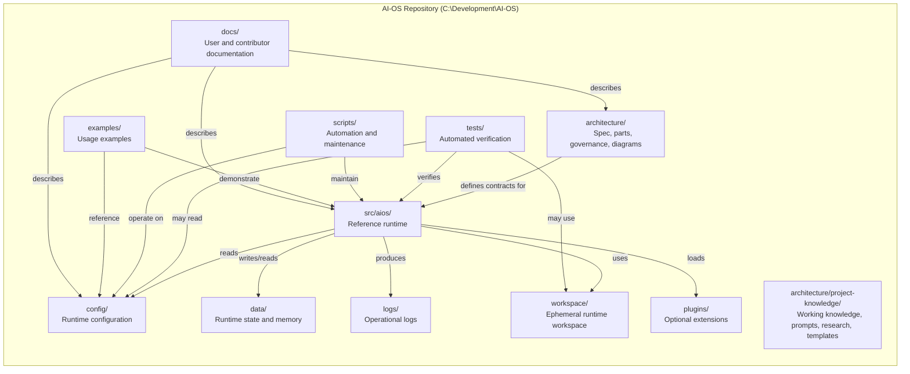
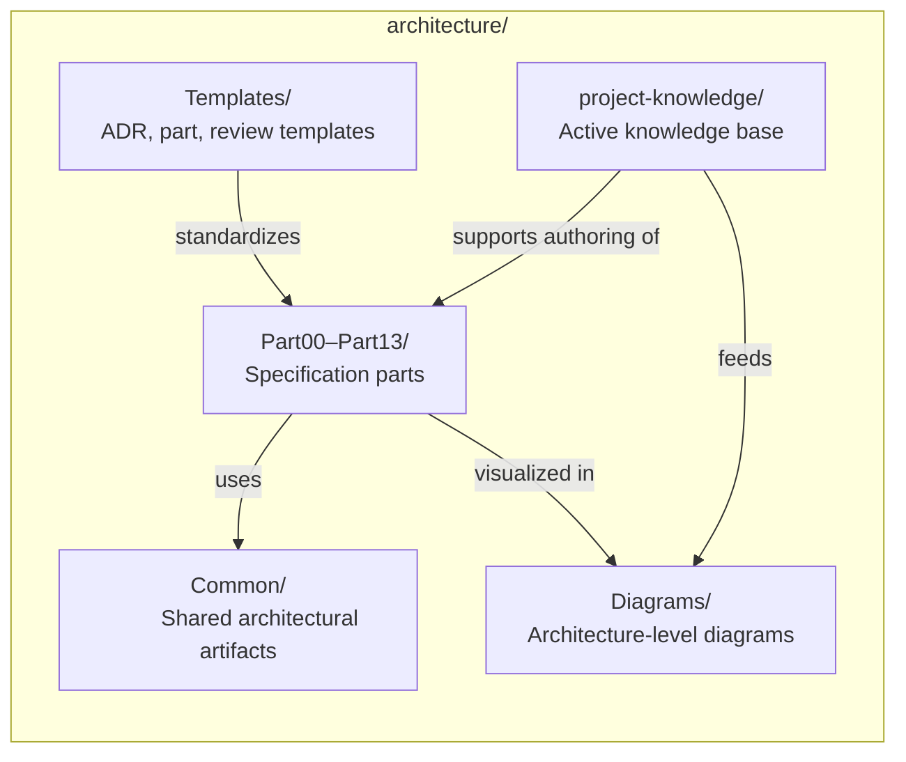
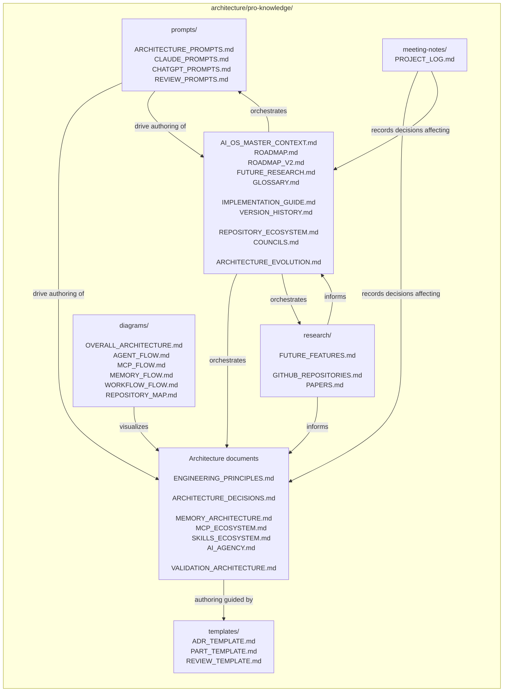
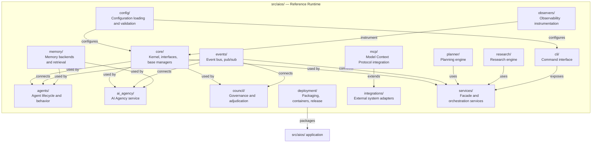
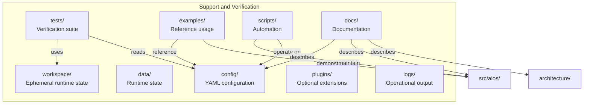
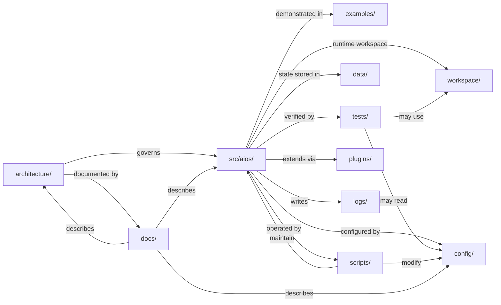

# Repository Map — AI-OS

## Purpose

This document is the canonical map of the `AI-OS` repository. It explains who owns each area, how the areas relate, and which areas depend on which others. It is technology-neutral by design: it names directories, documents, and responsibilities, not frameworks or versions.

---

## Top-Level Ownership

| Area | Owner / Role | Nature |
|------|--------------|--------|
| `architecture/` | Architecture team / specification authors | Frozen specification and evolving architectural artifacts |
| `config/` | Platform / configuration owners | Runtime configuration and integration definitions |
| `data/` | Runtime / operators | Generated state, memory, logs, checkpoints |
| `docs/` | Documentation / product | User-facing and contributor-facing documentation |
| `examples/` | Developers / contributors | Usage examples and reference scenarios |
| `logs/` | Runtime / operators | Operational log output |
| `plugins/` | Contributors / integrators | Optional extension point directory |
| `scripts/` | Developers / CI | Automation, bootstrap, maintenance scripts |
| `src/aios/` | Core engineering team | Reference runtime implementation |
| `tests/` | QA / core engineering | Automated verification |
| `workspace/` | Runtime / operators | Ephemeral working state for the runtime |

---

## Repository Structure

---

## Architecture Area

**Ownership:** Architecture authors and reviewers.  
**Lifecycle:** `Part00–Part13` are frozen specification; `project-knowledge/` is active working material.  
**Audience:** Architects, reviewers, auditors, contributors.  
**Technology neutrality:** Specification and diagrams are written in Markdown; visualization targets Mermaid and rendered documentation.

---

## Project Knowledge Area

**Ownership:** Architecture team and working authors.  
**Lifecycle:** Active; evolves continuously until specification parts are finalized.  
**Technology neutrality:** Plain Markdown documents; no execution environment required.

---

## Runtime Area

**Ownership:** Core engineering team.  
**Lifecycle:** Active development; implementation tracks the frozen architecture specification.  
**Technology neutrality:** Described by package/module responsibilities; actual implementation language and frameworks are not imposed by this map.

---

## Support and Verification Areas

**Ownership:**  
- `config/`: Platform owners and operators.  
- `data/`, `workspace/`, `logs/`: Runtime and operators.  
- `tests/`: QA and core engineering.  
- `examples/`: Contributors and developer advocates.  
- `scripts/`: Developers and CI maintainers.  
- `plugins/`: Contributors and integrators.  
- `docs/`: Documentation and product.  

**Lifecycle:**  
- `config/` and `tests/` are versioned with the runtime.  
- `data/`, `workspace/`, `logs/` are generated artifacts; excluded from source control.  
- `examples/`, `scripts/`, `plugins/` are versioned and evolve with the platform.  
- `docs/` is versioned and shipped with releases.

---

## Dependency Summary

---

## Ownership and Governance Rules

1. **`architecture/`** is owned by the Architecture Review Board (ARB). Changes require formal review. `project-knowledge/` is working material and may be edited by contributors under normal review processes.
2. **`src/aios/`** is owned by the core engineering team. All changes require code review and passing tests.
3. **`config/`** is owned by the platform team. Changes require review of backward compatibility.
4. **`tests/`** is owned by QA and core engineering. Test coverage requirements are enforced for all changes to `src/aios/`.
5. **`docs/`** is owned by the documentation team. Accuracy is enforced by review and, where possible, by automated checks.
6. **`data/`, `workspace/`, `logs/`** are owned by operators and runtime. They are not source-controlled and may be regenerated or cleared.
7. **`examples/`, `scripts/`, `plugins/`** are community-contributable under the same contribution workflow as `src/aios/`.

---

## Publication Notes

- This map is versioned with the repository.
- Updates to ownership or dependency structure should be reflected here and cross-referenced in `architecture/project-knowledge/REPOSITORY_ECOSYSTEM.md`.
- Diagram rendering requires Mermaid support. Where Mermaid is unavailable, export to SVG/PNG via the repository’s diagram tooling.
