# Runtime Execution Flow

This document visualizes the complete runtime lifecycle of the AI-OS system, from initial user request through completion, including error handling, recovery, and learning phases. The diagrams follow Mermaid syntax and are designed for publication quality.

## Main Execution Lifecycle

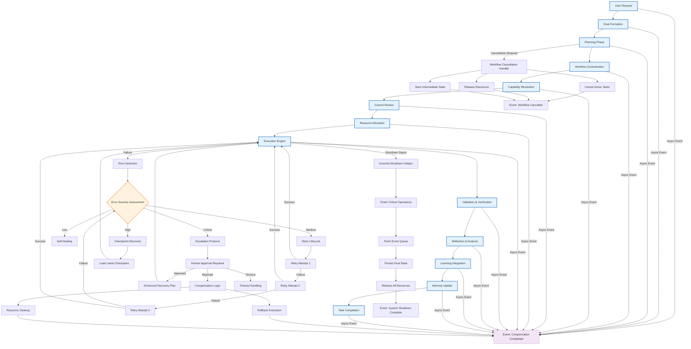

## Detailed Planning Phase

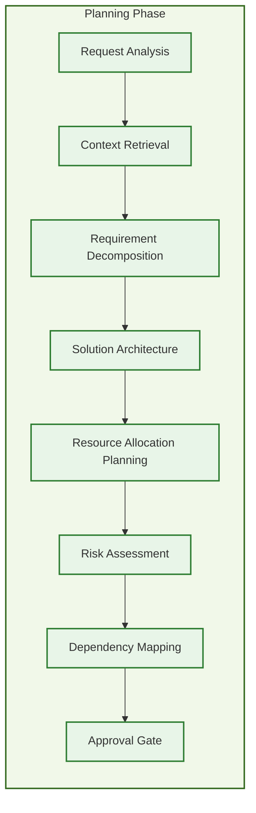

## Workflow Orchestration Details

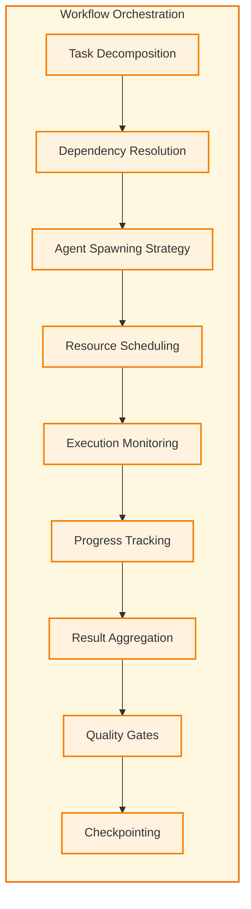

## Capability Resolution Process

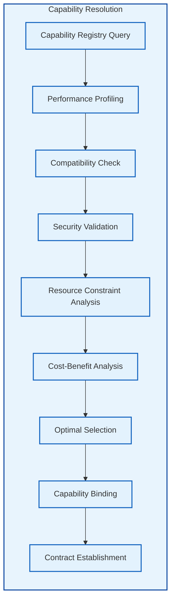

## Council Review Process

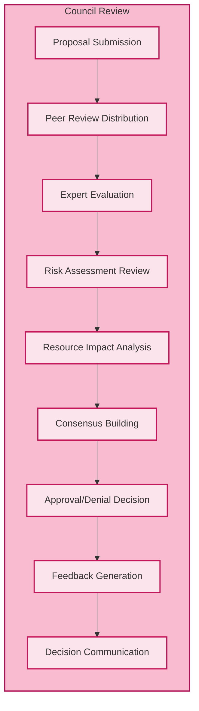

## Execution Engine with State Transitions

```mermaid
stateDiagram-v2
    [*] --> Idle
    Idle --> ResourceAllocated: Resources Allocated
    ResourceAllocated --> Initializing: Initialization Started
    Initializing --> Ready: Initialization Complete
    Ready --> Executing: Execution Started
    
    %% Main Execution Flow
    Executing --> Validating: Validation Triggered
    Validating --> Processing: Validation Passed
    Validating --> Correction: Validation Failed
    Processing --> Completing: Processing Complete
    Correction --> Processing: Apply Correction
    Completing --> Completed: Task Completed Successfully
    
    %% Error Handling Paths
    Executing --> ErrorDetected: Error Detected
    ErrorDetected --> ErrorClassification: Classify Error
    ErrorClassification --> MinorError: Minor Severity
    ErrorClassification --> ModerateError: Moderate Severity
    ErrorClassification --> MajorError: Major Severity
    ErrorClassification --> CriticalError: Critical Severity
    
    MinorError --> SelfHealing: Apply Self-Healing
    ModerateError --> RetryInit: Initialize Retry
    MajorError --> CheckpointRecovery: Initiate Checkpoint Recovery
    CriticalError --> Escalation: Trigger Escalation
    
    %% Recovery Paths
    SelfHealing --> Executing: Recovery Successful
    SelfHealing --> ErrorDetected: Recovery Failed
    
    RetryInit --> RetryAttempt1: Attempt 1
    RetryAttempt1 -->|Failure| RetryAttempt2: Attempt 2
    RetryAttempt1 -->|Success| Executing: Retry Successful
    RetryAttempt2 -->|Failure| RetryAttempt3: Attempt 3
    RetryAttempt2 -->|Success| Executing: Retry Successful
    RetryAttempt3 -->|Failure| ErrorDetected: Max Retries Exceeded
    RetryAttempt3 -->|Success| Executing: Retry Successful
    
    CheckpointRecovery --> LoadCheckpoint: Load Latest Checkpoint
    LoadCheckpoint --> Executing: Resume from Checkpoint
    
    Escalation --> HumanApproval: Request Human Intervention
    HumanApproval -->|Approved| EnhancedRecovery: Execute Enhanced Recovery
    HumanApproval -->|Rejected| Compensation: Initiate Compensation
    HumanApproval -->|Timeout| TimeoutHandling: Handle Timeout
    
    EnhancedRecovery --> Executing: Recovery Successful
    EnhancedRecovery --> ErrorDetected: Recovery Failed
    
    Compensation --> RollbackExecution: Execute Rollback
    Compensation --> ResourceCleanup: Cleanup Resources
    RollbackExecution --> Executing: Retry with Fixes
    ResourceCleanup --> [*]: Task Terminated
    
    TimeoutHandling --> Executing: Retry with Adjustments
    TimeoutHandling --> ErrorDetected: Timeout Unrecoverable
    
    %% Completion Paths
    Completed --> [*]: Normal Completion
    
    %% State Styling
    classDef state fill:#f5f5f5,stroke:#424242,stroke-width:1px;
    class Idle,ResourceAllocated,Initializing,Ready,Executing,Validating,Processing,Correction,Completing,Completed state;
    classDef errorState fill:#ffebee,stroke:#c62828,stroke-width:1px;
    class ErrorDetected,ErrorClassification,MinorError,ModerateError,MajorError,CriticalError errorState;
    classDef recoveryState fill:#e8f5e8,stroke:#2e7d32,stroke-width:1px;
    class SelfHealing,RetryInit,RetryAttempt1,RetryAttempt2,RetryAttempt3,LoadCheckpoint,EnhancedRecovery,Compensation,RollbackExecution,ResourceCleanup,TimeoutHandling recoveryState;
```

## Learning and Memory Integration

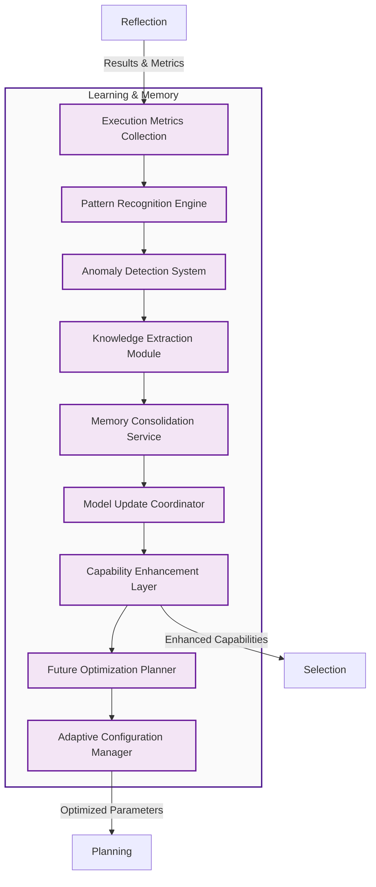

## Event-Driven Architecture (Asynchronous)

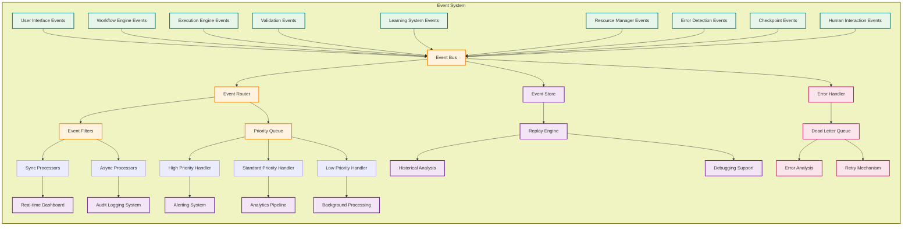

## Failure Handling and Recovery Matrix

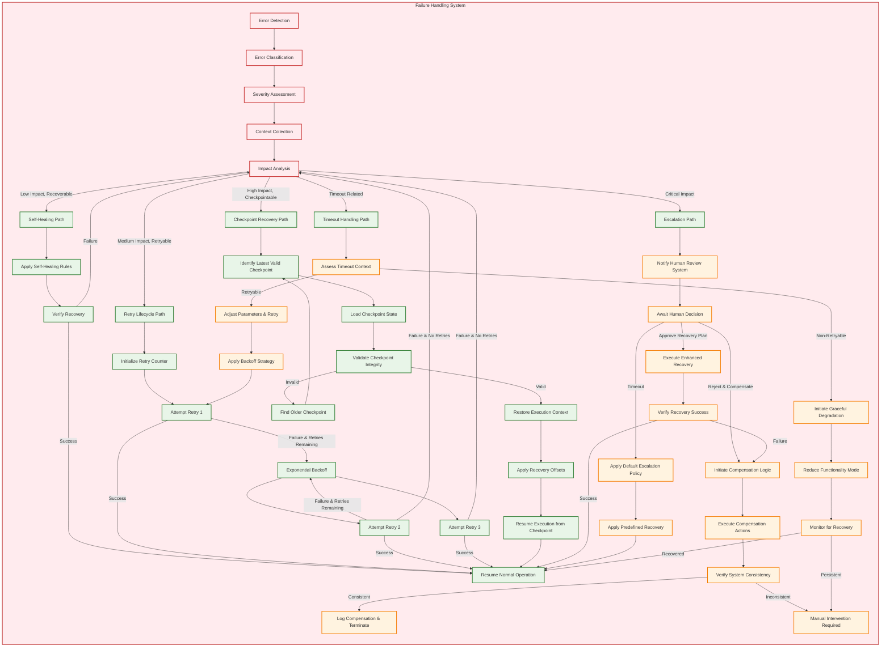

## Workflow Lifecycle Management

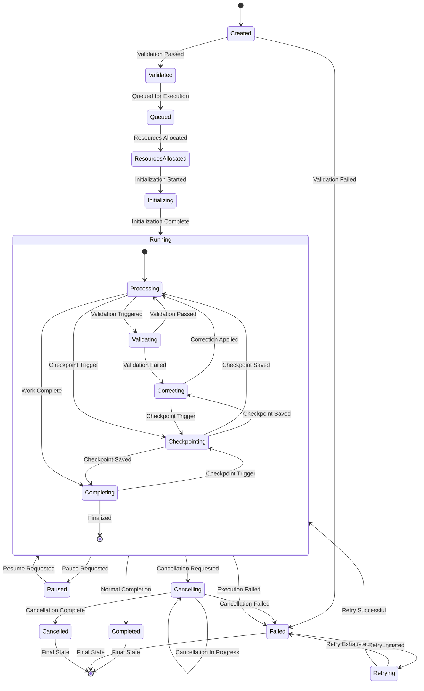

## Resource Allocation and Management

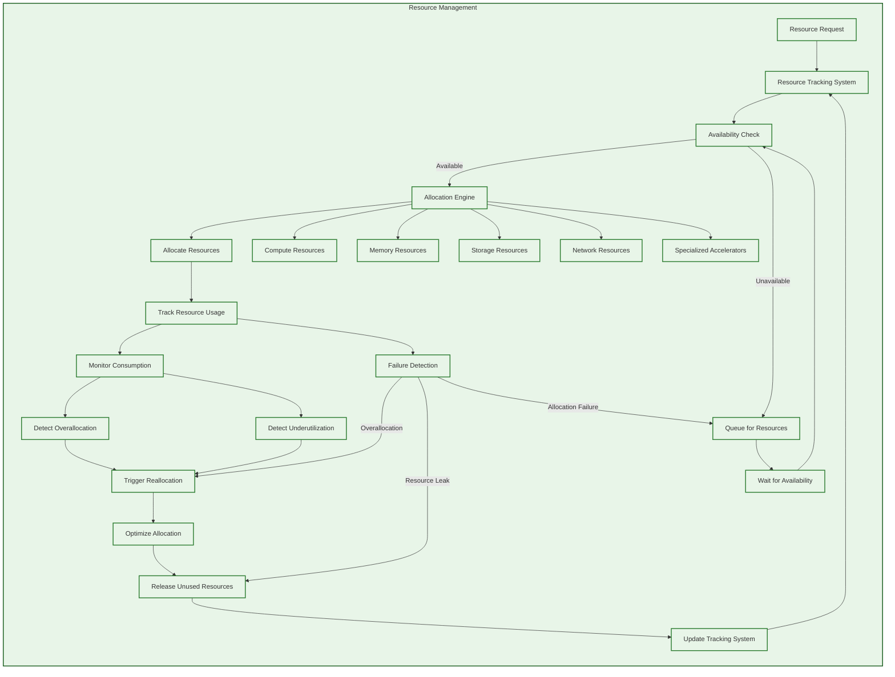

## Compensation Logic and Rollback Mechanisms

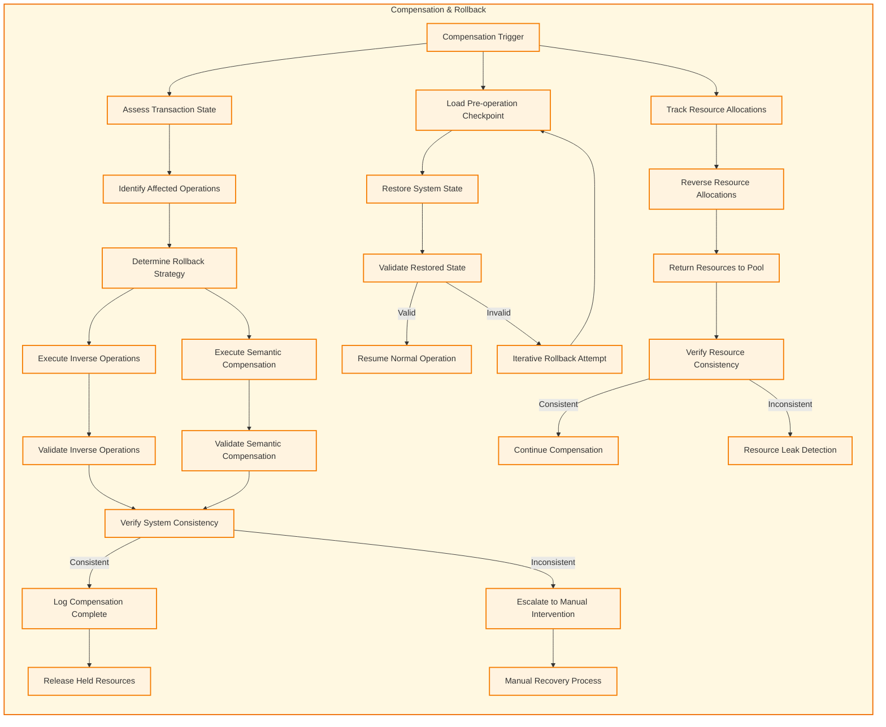

## Graceful Shutdown Sequence

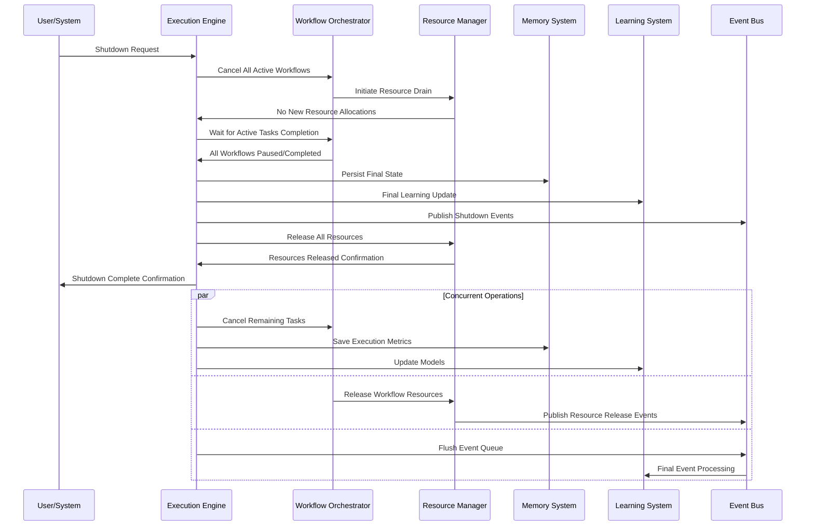

## Key Components Summary

| Component | Responsibility | Key Functions |
|-----------|----------------|---------------|
| **Goal Formation** | Translates user requests into actionable objectives | Intent parsing, objective setting, success criteria definition |
| **Planning Phase** | Develops execution strategies | Context analysis, decomposition, solution architecture, risk assessment |
| **Workflow Orchestration** | Manages complex multi-step processes | Task scheduling, dependency resolution, agent coordination, progress tracking |
| **Capability Resolution** | Chooses optimal tools and methods | Performance profiling, compatibility checking, security validation, cost analysis |
| **Council Review** | Provides oversight for significant decisions | Peer review, expert evaluation, consensus building, impact analysis |
| **Resource Allocation** | Manages system resources | Availability tracking, allocation optimization, usage monitoring, reallocation |
| **Execution Engine** | Performs the actual work | Task execution, capability invocation, state management, progress tracking |
| **Validation & Verification** | Ensures correctness and quality | Result checking, compliance verification, quality gates, consistency validation |
| **Reflection & Analysis** | Learns from execution outcomes | Performance analysis, error analysis, insight generation, pattern recognition |
| **Learning Integration** | Improves future performance | Model updates, capability enhancement, optimization strategies, adaptive configuration |
| **Memory Update** | Persists learning and context | Knowledge storage, experience recording, pattern retention, state persistence |
| **Event Publishing** | Enables observability and integration | Real-time notifications, audit trails, analytics feed, debugging support |
| **Failure Handling** | Manages errors and exceptions | Error detection, classification, recovery strategies, escalation procedures |
| **Retry Lifecycle** | Handles transient failures | Attempt counting, backoff strategies, retry limits, success verification |
| **Checkpoint Recovery** | Enables recovery from failures | State snapshotting, validation, restoration, recovery offset application |
| **Compensation Logic** | Handles irrecoverable errors | Inverse operations, semantic compensation, consistency verification, resource cleanup |
| **Workflow Cancellation** | Manages workflow termination | Graceful cancellation, resource release, state preservation, cleanup procedures |
| **Timeout Handling** | Manages execution timeouts | Timeout detection, context assessment, retry decisions, graceful degradation |
| **Graceful Shutdown** | Manages system termination | Operation completion, state persistence, resource release, event processing |

---

*Diagrams follow Mermaid syntax for consistent rendering. Architecture focused on runtime execution lifecycle only. All concepts from original maintained with enhanced visualization and completeness.*