# Workflow Execution Flow — AI-OS

> Publication-quality diagrams illustrating workflow execution within the AI-OS Hermes Kernel architecture. This document visualizes how engineering workflows are orchestrated, executed, governed, and monitored as defined in `AI_OS_MASTER_CONTEXT.md`, `AI_AGENCY.md`, `MEMORY_ARCHITECTURE.md`, `VALIDATION_ARCHITECTURE.md`, `ENGINEERING_PRINCIPLES.md`, and `ARCHITECTURE_DECISIONS.md`. No new components, concepts, or terminology are introduced.

---

## Table of Contents

1. [Overview](#overview)
2. [Workflow Execution Lifecycle](#workflow-execution-lifecycle)
3. [Simple Workflow (Single-Agent)](#simple-workflow-single-agent)
4. [Complex Multi-Agent Workflow](#complex-multi-agent-workflow)
5. [Goal Creation & Planning](#goal-creation--planning)
6. [Workflow Generation](#workflow-generation)
7. [Task Decomposition](#task-decomposition)
8. [Dependency Resolution](#dependency-resolution)
9. [Capability Resolution](#capability-resolution)
10. [Resource Allocation](#resource-allocation)
11. [Execution Scheduling](#execution-scheduling)
12. [Parallel Execution](#parallel-execution)
13. [Conditional Branching](#conditional-branching)
14. [Event Publishing](#event-publishing)
15. [Validation](#validation)
16. [Reflection](#reflection)
17. [Learning](#learning)
18. [Completion](#completion)
19. [Advanced Workflow Mechanisms](#advanced-workflow-mechanisms)
20. [Workflow Resilience Patterns](#workflow-resilience-patterns)
21. [Observability & Monitoring](#observability--monitoring)
22. [Workflow Persistence & Versioning](#workflow-persistence--versioning)
23. [Workflow Optimization & Replanning](#workflow-optimization--replanned-adaptive-execution)
24. [Human Approval & Governance](#human-approval--governance)
25. [State Transitions](#state-transitions)
26. [Memory Interaction](#memory-interaction)
27. [Cross References](#cross-references)

---

## Overview

This document visualizes the workflow execution patterns within AI-OS, grounded in the existing architectural specification. Workflows in AI-OS are orchestrated by the **WorkflowManager** (one of the four Core Components of the Hermes Kernel) with assistance from **Core Managers** (MemoryManager, RetryManager, CheckpointManager, RootCauseManager, CouncilManager, AIAgencyService) and **Engineering Services** (Planning Service, Learning Service, Memory Service, etc.).

The terminology and component boundaries used throughout this document are consistent with:

- **AI_OS_MASTER_CONTEXT.md** — Master context defining Hermes Kernel, Core Components, and Core Managers
- **AI_AGENCY.md** — AIAgencyService responsible for agent lifecycle and goal management
- **MEMORY_ARCHITECTURE.md** — Five-tier memory system (Working, Claude, Engineering Intelligence, Obsidian, Graphify)
- **VALIDATION_ARCHITECTURE.md** — Multi-layer validation (pre-execution, during-execution, post-execution)
- **ENGINEERING_PRINCIPLES.md** — Event-First, Kernel-as-Pure-Orchestrator, Validation-First principles
- **ARCHITECTURE_DECISIONS.md** — ADRs governing events, validation, observability

---

## Workflow Execution Lifecycle

The complete lifecycle of a workflow execution in AI-OS, from goal formation through completion, including all feedback loops, governance checkpoints, and learning cycles:

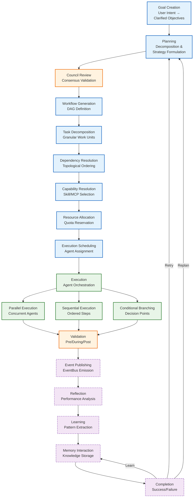
```mermaid
flowchart TD
    %% Goal Creation & Planning Phase
    GR[Goal Creation<br/>User Intent →<br/>Clarified Objectives] --> GP[Planning<br/>Decomposition &<br/>Strategy Formulation]
    
    %% Council Review
    GP --> CR[Council Review<br/>Consensus Validation]
    
    %% Workflow Generation
    CR --> WG[Workflow Generation<br/>DAG Definition]
    
    %% Task Decomposition
    WG --> TD[Task Decomposition<br/>Granular Work Units]
    
    %% Dependency Resolution
    TD --> DRES[Dependency Resolution<br/>Topological Ordering]
    
    %% Capability Resolution
    DRES --> CAPR[Capability Resolution<br/>Skill/MCP Selection]
    
    %% Resource Allocation
    CAPR --> RA[Resource Allocation<br/>Quota Reservation]
    
    %% Execution Scheduling
    RA --> ES[Execution Scheduling<br/>Agent Assignment]
    
    %% Execution Branch Point
    ES --> EX[Execution<br/>Agent Orchestration]
    
    %% Parallel Execution
    EX --> PE[Parallel Execution<br/>Concurrent Agents]
    
    %% Sequential Execution
    EX --> SE[Sequential Execution<br/>Ordered Steps]
    
    %% Conditional Branching
    EX --> CB[Conditional Branching<br/>Decision Points]
    
    %% Validation
    PE --> VAL[Validation<br/>Pre/During/Post]
    SE --> VAL
    CB --> VAL
    
    %% Event Publishing
    VAL --> EV[Event Publishing<br/>EventBus Emission]
    
    %% Reflection
    EV --> REF[Reflection<br/>Performance Analysis]
    
    %% Learning
    REF --> LRN[Learning<br/>Pattern Extraction]
    
    %% Memory Interaction
    LRN --> MEM[Memory Interaction<br/>Knowledge Storage]
    
    %% Completion
    MEM --> COMP[Completion<br/>Success/Failure]
    
    %% Feedback Loops
    COMP -->|Retry| GP
    COMP -->|Replan| GP
    COMP -->|Learn| MEM
    
    %% Styling
    classDef phase fill:#e3f2fd,stroke:#1565c0,stroke-width:2px;
    classDef exec fill:#e8f5e8,stroke:#2e7d32,stroke-width:2px;
    classDef decision fill:#fff3e0,stroke:#ef6c00,stroke-width:2px;
    classDef feedback fill:#f3e5f5,stroke:#6a1b9a,stroke-width:1px,stroke-dasharray: 5 3;
    
    class GR,GP,WG,TD,DRES,CAPR,RA,ES phase;
    class PE,SE,CB,EX exec;
    class VAL,CR decision;
    class EV,REF,LRN,MEM,COMP feedback;
```

**Figure 1: Complete Workflow Execution Lifecycle**

---

## Workflow Execution Lifecycle

This state diagram illustrates the lifecycle states a workflow passes through during execution, from creation through completion, including recovery paths:

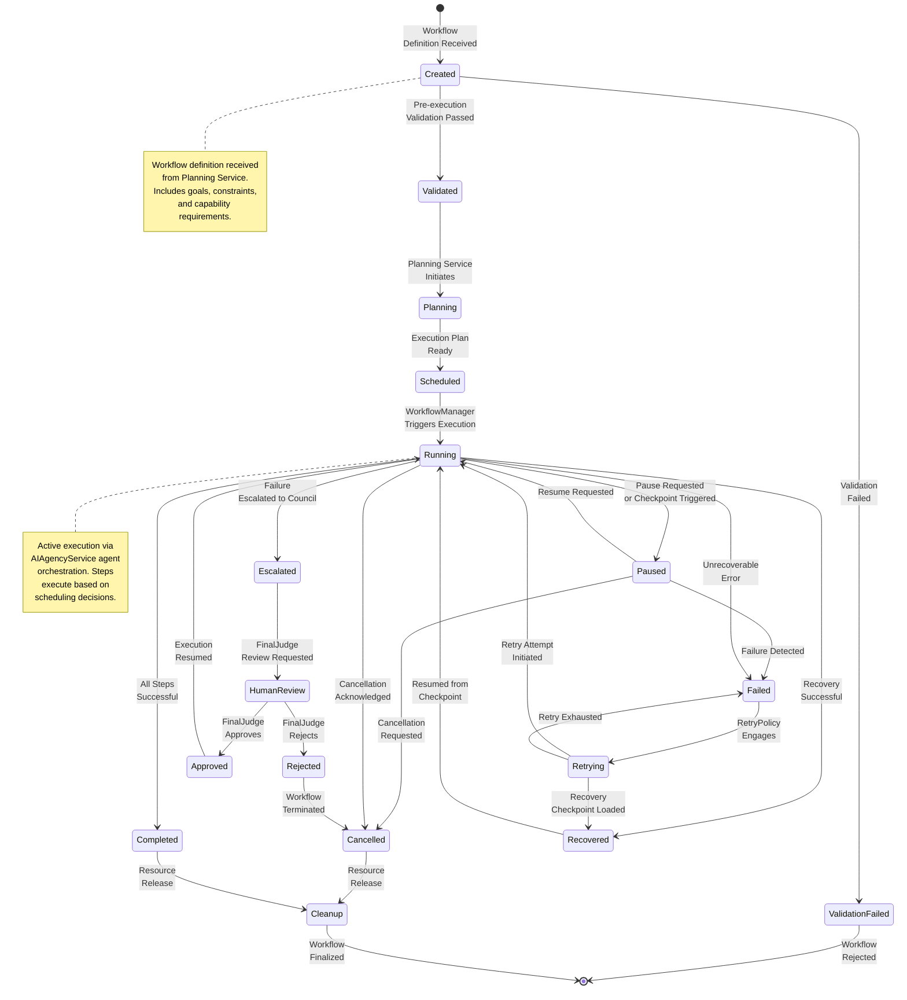
```mermaid
stateDiagram-v2
    [*] --> Created: Workflow<br/>Definition Received
    
    Created --> Validated: Pre-execution<br/>Validation Passed
    Created --> ValidationFailed: Validation<br/>Failed
    ValidationFailed --> [*]: Workflow<br/>Rejected
    
    Validated --> Planning: Planning Service<br/>Initiates
    Planning --> Scheduled: Execution Plan<br/>Ready
    Scheduled --> Running: WorkflowManager<br/>Triggers Execution
    
    Running --> Paused: Pause Requested<br/>or Checkpoint Triggered
    Paused --> Running: Resume Requested
    Paused --> Failed: Failure Detected
    Paused --> Cancelled: Cancellation<br/>Requested
    
    Running --> Completed: All Steps<br/>Successful
    Running --> Failed: Unrecoverable<br/>Error
    Running --> Cancelled: Cancellation<br/>Acknowledged
    Running --> Recovered: Recovery<br/>Successful
    Running --> Escalated: Failure<br/>Escalated to Council
    
    Failed --> Retrying: RetryPolicy<br/>Engages
    Retrying --> Running: Retry Attempt<br/>Initiated
    Retrying --> Failed: Retry Exhausted
    Retrying --> Recovered: Recovery<br/>Checkpoint Loaded
    
    Recovered --> Running: Resumed from<br/>Checkpoint
    
    Escalated --> HumanReview: FinalJudge<br/>Review Requested
    HumanReview --> Approved: FinalJudge<br/>Approves
    HumanReview --> Rejected: FinalJudge<br/>Rejects
    Approved --> Running: Execution<br/>Resumed
    Rejected --> Cancelled: Workflow<br/>Terminated
    
    Cancelled --> Cleanup: Resource<br/>Release
    Completed --> Cleanup: Resource<br/>Release
    Cleanup --> [*]: Workflow<br/>Finalized
    
    note right of Created
        Workflow definition received
        from Planning Service.
        Includes goals, constraints,
        and capability requirements.
    end note
    
    note right of Running
        Active execution via
        AIAgencyService agent
        orchestration. Steps
        execute based on
        scheduling decisions.
    end note
```

**Figure 2: Workflow Lifecycle State Machine**

---

## Simple Workflow (Single-Agent)

A simple workflow involves a single AI agent executing a sequential set of tasks, with validation and reflection at each step:

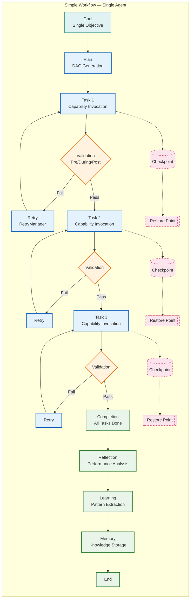
```mermaid
flowchart LR
    subgraph SimpleWorkflow["Simple Workflow — Single Agent"]
        direction TB
        
        %% Goal & Planning
        SW_Goal[Goal</br>Single Objective] --> SW_Plan[Plan</br>DAG Generation]
        
        %% Task Execution Loop
        SW_Plan --> SW_Task1[Task 1</br>Capability Invocation]
        
        %% Validation Feedback Loop
        SW_Task1 --> SW_Val1{Validation</br>Pre/During/Post}
        SW_Val1 -->|Fail| SW_Retry1[Retry</br>RetryManager]
        SW_Retry1 --> SW_Task1
        SW_Val1 -->|Pass| SW_Task2[Task 2</br>Capability Invocation]
        
        SW_Task2 --> SW_Val2{Validation}
        SW_Val2 -->|Fail| SW_Retry2[Retry]
        SW_Retry2 --> SW_Task2
        SW_Val2 -->|Pass| SW_Task3[Task 3</br>Capability Invocation]
        
        SW_Task3 --> SW_Val3{Validation}
        SW_Val3 -->|Fail| SW_Retry3[Retry]
        SW_Retry3 --> SW_Task3
        SW_Val3 -->|Pass| SW_Complete[Completion</br>All Tasks Done]
        
        %% Reflection & Learning
        SW_Complete --> SW_Reflect[Reflection</br>Performance Analysis]
        SW_Reflect --> SW_Learn[Learning</br>Pattern Extraction]
        SW_Learn --> SW_Memory[Memory</br>Knowledge Storage]
        SW_Memory --> SW_End[End]
        
        %% Checkpoint
        SW_Task1 -.-> SW_Ckpt1[(Checkpoint)]
        SW_Task2 -.-> SW_Ckpt2[(Checkpoint)]
        SW_Task3 -.-> SW_Ckpt3[(Checkpoint)]
        SW_Ckpt1 -.-> SW_Restore1[[Restore Point]]
        SW_Ckpt2 -.-> SW_Restore2[[Restore Point]]
        SW_Ckpt3 -.-> SW_Restore3[[Restore Point]]
    end
    
    %% Styling
    classDef goal fill:#e0f2f1,stroke:#00796b,stroke-width:2px;
    classDef task fill:#e3f2fd,stroke:#1565c0,stroke-width:2px;
    classDef validate fill:#fff3e0,stroke:#ef6c00,stroke-width:2px;
    classDef complete fill:#e8f5e8,stroke:#2e7d32,stroke-width:2px;
    classDef checkpoint fill:#fce4ec,stroke:#c2185b,stroke-width:1px,stroke-dasharray: 3 3;
    
    class SW_Goal goal;
    class SW_Plan,SW_Task1,SW_Task2,SW_Task3 task;
    class SW_Val1,SW_Val2,SW_Val3 validate;
    class SW_Retry1,SW_Retry2,SW_Retry3 task;
    class SW_Complete,SW_Reflect,SW_Learn,SW_Memory,SW_End complete;
    class SW_Ckpt1,SW_Ckpt2,SW_Ckpt3,SW_Restore1,SW_Restore2,SW_Restore3 checkpoint;
```

**Figure 3: Simple Single-Agent Workflow Pattern**

---

## Complex Multi-Agent Workflow

A complex workflow involving multiple coordinated agents, parallel execution, dependency management, and inter-agent communication:

```mermaid
flowchart TD
    subgraph ComplexWorkflow["Complex Multi-Agent Workflow"]
        direction TB
        
        %% Initiation
        CW_Init[Workflow Initiation<br/>Planning Service Event] --> CW_WFMgr[WorkflowManager<br/>Orchestrates Execution]
        
        %% Agent Spawning
        CW_WFMgr --> CW_Agency[AIAgencyService<br/>Agent Lifecycle Mgmt]
        CW_Agency --> CW_Spawn1[Spawn Agent: Planning<br/>(Architecture Agent)]
        CW_Agency --> CW_Spawn2[Spawn Agent: Coding<br/>(BugHunter Agent)]
        CW_Agency --> CW_Spawn3[Spawn Agent: Review<br/>(Documentation Agent)]
        
        %% Parallel Execution
        subgraph ParallelArea["Parallel Agent Execution"]
            direction TB
            
            subgraph Agent1["Agent 1: Planning"]
                direction TB
                A1_Task1[Task 1.1: Analyze Requirements] --> A1_Task2[Task 1.2: Decompose Sub-goals]
                A1_Task3[Task 1.3: Generate Plan] --> A1_Output[Planning Output]
            end
            
            subgraph Agent2["Agent 2: Coding"]
                direction TB
                A2_Task1[Task 2.1: Implement Feature] --> A2_Task2[Task 2.2: Write Tests]
                A2_Task3[Task 2.3: Refactor] --> A2_Output[Coding Output]
            end
            
            subgraph Agent3["Agent 3: Review"]
                direction TB
                A3_Task1[Task 3.1: Code Review] --> A3_Task2[Task 3.2: Quality Check]
                A3_Task3[Task 3.3: Documentation] --> A3_Output[Review Output]
            end
        end
        
        CW_Spawn1 --> Agent1
        CW_Spawn2 --> Agent2
        CW_Spawn3 --> Agent3
        
        %% Inter-Agent Communication
        A1_Output -->|Shared Knowledge| CW_Comm[(EventBus<br/>Inter-Agent Messaging)]
        A2_Output --> CW_Comm
        A3_Output --> CW_Comm
        CW_Comm -->|Updates| A1_Task1
        CW_Comm -->|Updates| A2_Task1
        CW_Comm -->|Updates| A3_Task1
        
        %% Dependency Graph
        CW_DepGraph[Dependency Graph<br/>Topological Ordering<br/>via WorkflowManager] --> CW_ResourceMgr[ResourceManager<br/>Quota Enforcement]
        
        %% Results Aggregation
        A1_Output --> CW_Aggregate[Results Aggregation<br/>via WorkflowManager]
        A2_Output --> CW_Aggregate
        A3_Output --> CW_Aggregate
        
        %% Council Review
        CW_Aggregate --> CW_Council[Council Review<br/>CouncilManager Oversight]
        
        %% Final Validation
        CW_Council --> CW_Validate[Final Validation<br/>Validation Architecture]
        
        %% Completion
        CW_Validate --> CW_Reflect[Reflection<br/>Learning Service]
        CW_Reflect --> CW_Memory[Memory Storage<br/>Five-Tier Hierarchy]
        CW_Memory --> CW_Complete[Workflow Complete]
        
        %% Failure Handling
        A1_Output -->|Failure| CW_Fail[Failure Detected<br/>RootCauseManager]
        CW_Fail --> CW_Retry[Retry with Backoff<br/>RetryManager]
        CW_Fail --> CW_Checkpoint[Checkpoint Recovery<br/>CheckpointManager]
        CW_Fail --> CW_Compensate[Compensation Logic<br/>Rollback Planning]
        
    end
    
    %% Styling
    classDef init fill:#e0f2f1,stroke:#00796b,stroke-width:2px;
    classDef manager fill:#e3f2fd,stroke:#1565c0,stroke-width:2px;
    classDef agent fill:#f3e5f5,stroke:#6a1b9a,stroke-width:2px;
    classDef task fill:#e8f5e8,stroke:#2e7d32,stroke-width:2px;
    classDef result fill:#fff3e0,stroke:#ef6c00,stroke-width:2px;
    classDef failure fill:#ffebee,stroke:#c62828,stroke-width:2px;
    classDef shared fill:#fce4ec,stroke:#c2185b,stroke-width:1px,stroke-dasharray: 3 3;
    
    class CW_Init init;
    class CW_WFMgr,CW_Agency,CW_DepGraph,CW_ResourceMgr,CW_Aggregate,CW_Council,CW_Validate,CW_Reflect,CW_Memory manager;
    class Agent1,Agent2,Agent3 agent;
    class A1_Task1,A1_Task2,A1_Task3,A1_Output,A2_Task1,A2_Task2,A2_Task3,A2_Output,A3_Task1,A3_Task2,A3_Task3,A3_Output task;
    class CW_Comm,CW_Complete shared;
    class CW_Fail,CW_Retry,CW_Checkpoint,CW_Compensate failure;
```

**Figure 4: Complex Multi-Agent Workflow Pattern**

---

## Goal Creation

Goal creation is the entry point for all workflow execution. Goals are formed from user intent and clarified through Planning Service and Council review:

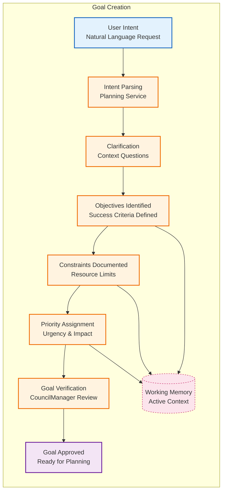
```mermaid
flowchart LR
    subgraph GoalCreation["Goal Creation"]
        direction TB
        
        GC_Input[User Intent<br/>Natural Language Request] --> GC_Parser[Intent Parsing<br/>Planning Service]
        GC_Parser --> GC_Clarify[Clarification<br/>Context Questions]
        GC_Clarify --> GC_Obj[Objectives Identified<br/>Success Criteria Defined]
        GC_Obj --> GC_Constraints[Constraints Documented<br/>Resource Limits]
        GC_Constraints --> GC_Priority[Priority Assignment<br/>Urgency & Impact]
        GC_Priority --> GC_Verify[Goal Verification<br/>CouncilManager Review]
        GC_Verify --> GC_Approved[Goal Approved<br/>Ready for Planning]
        
        %% Memory Integration
        GC_Obj --> GC_Memory[(Working Memory<br/>Active Context)]
        GC_Constraints --> GC_Memory
        GC_Priority --> GC_Memory
    end
    
    %% Styling
    classDef input fill:#e3f2fd,stroke:#1565c0,stroke-width:2px;
    classDef process fill:#fff3e0,stroke:#ef6c00,stroke-width:2px;
    classDef decision fill:#f3e5f5,stroke:#6a1b9a,stroke-width:2px;
    classDef memory fill:#fce4ec,stroke:#c2185b,stroke-width:1px,stroke-dasharray: 3 3;
    
    class GC_Input input;
    class GC_Parser,GC_Clarify,GC_Obj,GC_Constraints,GC_Priority,GC_Verify process;
    class GC_Approved decision;
    class GC_Memory memory;
```

**Figure 5: Goal Creation Process**

---

## Planning

Planning decomposes high-level goals into executable workflows. This phase spans the Planning Service and AI Agency Service:

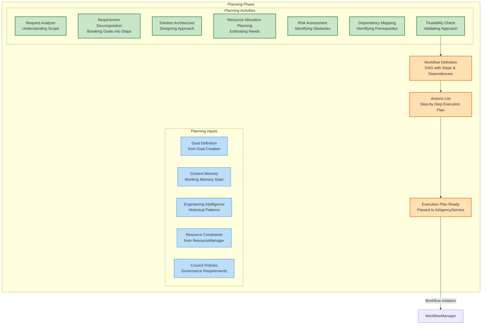
```mermaid
flowchart TB
    subgraph PlanningPhase["Planning Phase"]
        direction TB
        
        %% Input Sources
        subgraph PlanInputs["Planning Inputs"]
            PI_Goal[Goal Definition<br/>from Goal Creation]:::input
            PI_Context[Context Memory<br/>Working Memory State]:::input
            PI_Knowledge[Engineering Intelligence<br/>Historical Patterns]:::input
            PI_Constraints[Resource Constraints<br/>from ResourceManager]:::input
            PI_Policies[Council Policies<br/>Governance Requirements]:::input
        end
        
        %% Planning Activities
        subgraph PlanActivities["Planning Activities"]
            PA_Analyze[Request Analysis<br/>Understanding Scope]:::activity
            PA_Decompose[Requirement Decomposition<br/>Breaking Goals into Steps]:::activity
            PA_Design[Solution Architecture<br/>Designing Approach]:::activity
            PA_Allocate[Resource Allocation Planning<br/>Estimating Needs]:::activity
            PA_Risk[Risk Assessment<br/>Identifying Obstacles]:::activity
            PA_Map[Dependency Mapping<br/>Identifying Prerequisites]:::activity
            PA_Feasibility[Feasibility Check<br/>Validating Approach]:::activity
        end
        
        %% Output
        PA_Feasibility --> PO_Workflow[Workflow Definition<br/>DAG with Steps & Dependencies]:::output
        PO_Workflow --> PO_Actions[Actions List<br/>Step-by-Step Execution Plan]:::output
        PO_Actions --> PO_Plan[Execution Plan Ready<br/>Passed to AIAgencyService]:::output
    end
    
    %% Integration
    PO_Plan -->|Workflow Initiation| WMgr[WorkflowManager]
    
    %% Styling
    classDef input fill:#bbdefb,stroke:#1565c0,stroke-width:1px;
    classDef activity fill:#c8e6c9,stroke:#2e7d32,stroke-width:2px;
    classDef output fill:#ffe0b2,stroke:#ef6c00,stroke-width:2px;
    
    class PI_Goal,PI_Context,PI_Knowledge,PI_Constraints,PI_Policies input;
    class PA_Analyze,PA_Decompose,PA_Design,PA_Allocate,PA_Risk,PA_Map,PA_Feasibility activity;
    class PO_Workflow,PO_Actions,PO_Plan output;
```

**Figure 6: Planning Phase — Inputs and Activities**

---

## Workflow Generation

Workflow generation creates the directed acyclic graph (DAG) of steps, managed by the WorkflowManager:

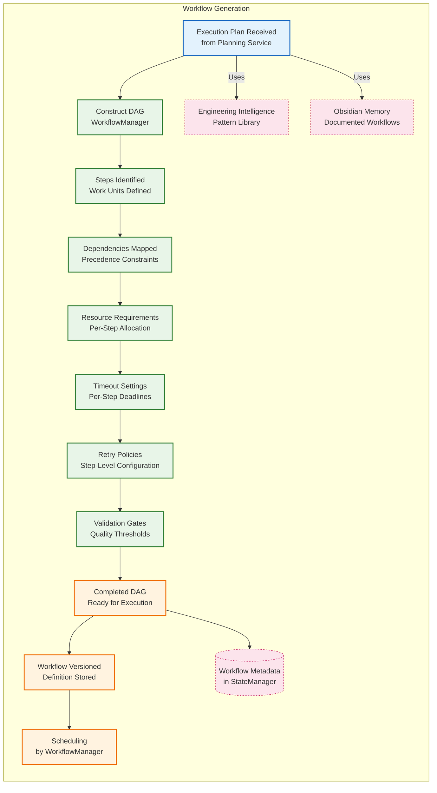
```mermaid
flowchart TB
    subgraph WorkflowGen["Workflow Generation"]
        direction TB
        
        WG_PlanReceived[Execution Plan Received<br/>from Planning Service] --> WG_DAGConstruct[Construct DAG<br/>WorkflowManager]
        
        %% DAG Construction Details
        WG_DAGConstruct --> WG_Steps[Steps Identified<br/>Work Units Defined]
        WG_Steps --> WG_Dependencies[Dependencies Mapped<br/>Precedence Constraints]
        WG_Dependencies --> WG_Resources[Resource Requirements<br/>Per-Step Allocation]
        WG_Resources --> WG_Timeouts[Timeout Settings<br/>Per-Step Deadlines]
        WG_Timeouts --> WG_Retries[Retry Policies<br/>Step-Level Configuration]
        WG_Retries --> WG_Valid[Validation Gates<br/>Quality Thresholds]
        
        %% DAG Finalization
        WG_Valid --> WG_DAG[Completed DAG<br/>Ready for Execution]
        WG_DAG --> WG_Version[Workflow Versioned<br/>Definition Stored]
        WG_Version --> WG_Schedule[Scheduling<br/>by WorkflowManager]
        
        %% Metadata Storage
        WG_DAG --> WG_Meta[(Workflow Metadata<br/>in StateManager)]
        
        %% Cross-Reference
        WG_PlanReceived -->|Uses| EI_Mem[Engineering Intelligence<br/>Pattern Library]
        WG_PlanReceived -->|Uses| Obsidian_Mem[Obsidian Memory<br/>Documented Workflows]
    end
    
    %% Styling
    classDef receive fill:#e3f2fd,stroke:#1565c0,stroke-width:2px;
    classDef construct fill:#e8f5e8,stroke:#2e7d32,stroke-width:2px;
    classDef finalize fill:#fff3e0,stroke:#ef6c00,stroke-width:2px;
    classDef memory fill:#fce4ec,stroke:#c2185b,stroke-width:1px,stroke-dasharray: 3 3;
    
    class WG_PlanReceived receive;
    class WG_DAGConstruct,WG_Steps,WG_Dependencies,WG_Resources,WG_Timeouts,WG_Retries,WG_Valid construct;
    class WG_DAG,WG_Version,WG_Schedule finalize;
    class WG_Meta,EI_Mem,Obsidian_Mem memory;
```

**Figure 7: Workflow Generation — DAG Construction by WorkflowManager**

---

## Task Decomposition

Task decomposition breaks workflow steps into agent-executable units, coordinated by AIAgencyService and AgentManager:

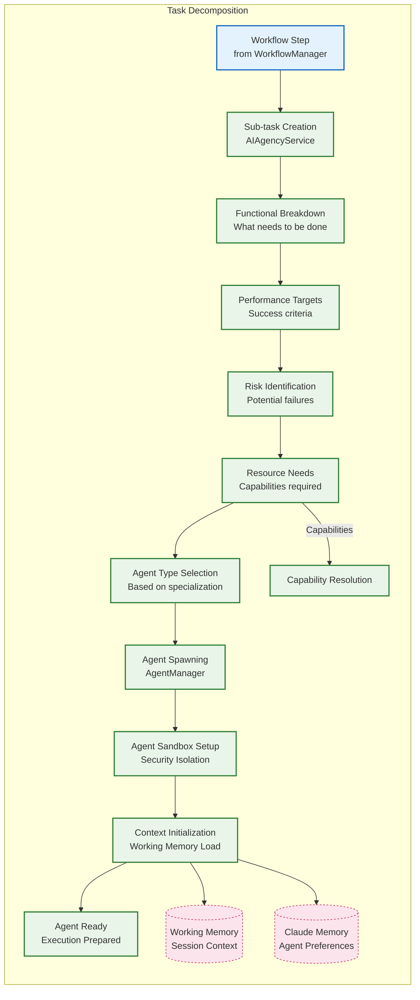
```mermaid
flowchart TB
    subgraph TaskDecomp["Task Decomposition"]
        direction TB
        
        TD_Input[Workflow Step<br/>from WorkflowManager] --> TD_Decompose[Sub-task Creation<br/>AIAgencyService]
        
        %% Decomposition Details
        TD_Decompose --> TD_Functional[Functional Breakdown<br/>What needs to be done]
        TD_Functional --> TD_Performance[Performance Targets<br/>Success criteria]
        TD_Performance --> TD_Risks[Risk Identification<br/>Potential failures]
        TD_Risks --> TD_Resources[Resource Needs<br/>Capabilities required]
        TD_Resources --> TD_AgentType[Agent Type Selection<br/>Based on specialization]
        
        %% Agent Assignment
        TD_AgentType --> TD_Spawn[Agent Spawning<br/>AgentManager]
        TD_Spawn --> TD_Sandbox[Agent Sandbox Setup<br/>Security Isolation]
        TD_Sandbox --> TD_Context[Context Initialization<br/>Working Memory Load]
        TD_Context --> TD_Ready[Agent Ready<br/>Execution Prepared]
        
        %% Memory Integration
        TD_Context --> TD_WM[(Working Memory<br/>Session Context)]
        TD_Context --> TD_ClMD[(Claude Memory<br/>Agent Preferences)]
        
        %% Capability Resolution Link
        TD_Resources -->|Capabilities| TD_CapResolve[Capability Resolution]
    end
    
    %% Styling
    classDef input fill:#e3f2fd,stroke:#1565c0,stroke-width:2px;
    classDef process fill:#e8f5e8,stroke:#2e7d32,stroke-width:2px;
    classDef integration fill:#fff3e0,stroke:#ef6c00,stroke-width:2px;
    classDef memory fill:#fce4ec,stroke:#c2185b,stroke-width:1px,stroke-dasharray: 3 3;
    
    class TD_Input input;
    class TD_Decompose,TD_Functional,TD_Performance,TD_Risks,TD_Resources,TD_AgentType,TD_Spawn,TD_Sandbox,TD_Context,TD_Ready,TD_CapResolve process;
    class TD_WM,TD_ClMD memory;
```

**Figure 8: Task Decomposition — Agent Assignment by AIAgencyService**

---

## Dependency Resolution

Dependency resolution ensures correct execution ordering via topological sorting by the WorkflowManager:

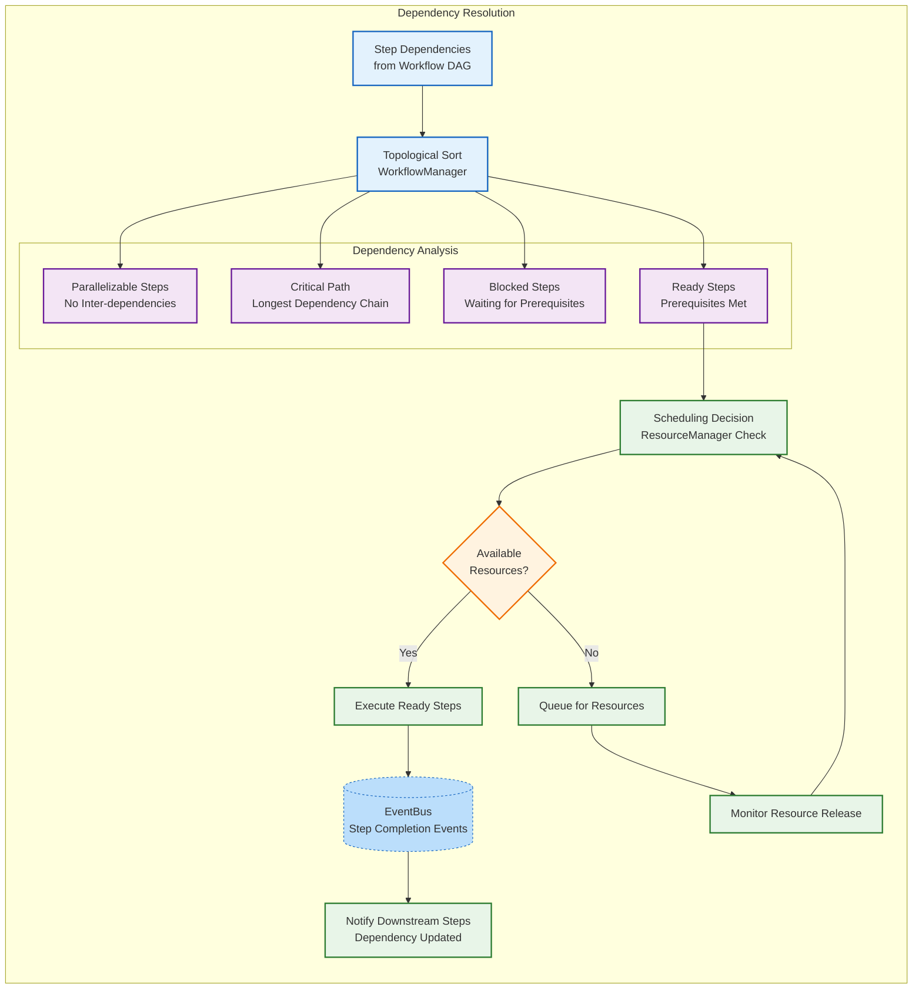
```mermaid
flowchart LR
    subgraph DepResolution["Dependency Resolution"]
        direction TB
        
        DR_Input[Step Dependencies<br/>from Workflow DAG] --> DR_Topo[Topological Sort<br/>WorkflowManager]
        
        subgraph DR_Details["Dependency Analysis"]
            DR_Paras[Parallelizable Steps<br/>No Inter-dependencies]:::detail
            DR_Critical[Critical Path<br/>Longest Dependency Chain]:::detail
            DR_Blocked[Blocked Steps<br/>Waiting for Prerequisites]:::detail
            DR_Ready[Ready Steps<br/>Prerequisites Met]:::detail
        end
        
        DR_Topo --> DR_Paras
        DR_Topo --> DR_Critical
        DR_Topo --> DR_Blocked
        DR_Topo --> DR_Ready
        
        DR_Ready --> DR_Schedule[Scheduling Decision<br/>ResourceManager Check]
        DR_Schedule --> DR_Capacity{Available<br/>Resources?}
        DR_Capacity -->|Yes| DR_Execute[Execute Ready Steps]
        DR_Capacity -->|No| DR_Wait[Queue for Resources]
        DR_Wait --> DR_Monitor[Monitor Resource Release]
        DR_Monitor --> DR_Schedule
        
        DR_Execute --> DR_EventBus[(EventBus<br/>Step Completion Events)]
        DR_EventBus --> DR_Notify[Notify Downstream Steps<br/>Dependency Updated]
    end
    
    %% Styling
    classDef input fill:#e3f2fd,stroke:#1565c0,stroke-width:2px;
    classDef detail fill:#f3e5f5,stroke:#6a1b9a,stroke-width:2px;
    classDef decision fill:#fff3e0,stroke:#ef6c00,stroke-width:2px;
    classDef action fill:#e8f5e8,stroke:#2e7d32,stroke-width:2px;
    classDef eventbus fill:#bbdefb,stroke:#1565c0,stroke-width:1px,stroke-dasharray: 3 3;
    
    class DR_Input,DR_Topo input;
    class DR_Paras,DR_Critical,DR_Blocked,DR_Ready detail;
    class DR_Schedule,DR_Execute,DR_Wait,DR_Monitor,DR_Notify action;
    class DR_Capacity decision;
    class DR_EventBus eventbus;
```

**Figure 9: Dependency Resolution — Topological Ordering & Scheduling**

---

## Capability Resolution

Capability resolution determines which tools, skills, or MCPs to invoke for each task, managed by CapabilityManager and ToolManager:

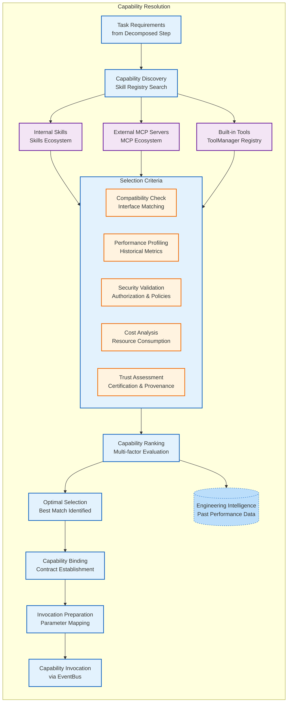
```mermaid
flowchart LR
    subgraph CapResolution["Capability Resolution"]
        direction TB
        
        CR_Input[Task Requirements<br/>from Decomposed Step] --> CR_Discover[Capability Discovery<br/>Skill Registry Search]
        
        %% Discovery Sources
        CR_Discover --> CR_Skills[Internal Skills<br/>Skills Ecosystem]
        CR_Discover --> CR_MCPs[External MCP Servers<br/>MCP Ecosystem]
        CR_Discover --> CR_Tools[Built-in Tools<br/>ToolManager Registry]
        
        %% Selection Criteria
        subgraph CR_Criteria["Selection Criteria"]
            CR_Comp[Compatibility Check<br/>Interface Matching]:::criteria
            CR_Perf[Performance Profiling<br/>Historical Metrics]:::criteria
            CR_Sec[Security Validation<br/>Authorization & Policies]:::criteria
            CR_Cost[Cost Analysis<br/>Resource Consumption]:::criteria
            CR_Trust[Trust Assessment<br/>Certification & Provenance]:::criteria
        end
        
        CR_Skills --> CR_Criteria
        CR_MCPs --> CR_Criteria
        CR_Tools --> CR_Criteria
        
        CR_Criteria --> CR_Rank[Capability Ranking<br/>Multi-factor Evaluation]
        CR_Rank --> CR_Select[Optimal Selection<br/>Best Match Identified]
        
        %% Binding
        CR_Select --> CR_Bind[Capability Binding<br/>Contract Establishment]
        CR_Bind --> CR_Prepare[Invocation Preparation<br/>Parameter Mapping]
        CR_Prepare --> CR_Invoke[Capability Invocation<br/>via EventBus]
        
        %% Memory Integration
        CR_Rank --> CR_History[(Engineering Intelligence<br/>Past Performance Data)]
    end
    
    %% Styling
    classDef input fill:#e3f2fd,stroke:#1565c0,stroke-width:2px;
    classDef source fill:#f3e5f5,stroke:#6a1b9a,stroke-width:2px;
    classDef criteria fill:#fff3e0,stroke:#ef6c00,stroke-width:2px;
    classDef decision fill:#e8f5e8,stroke:#2e7d32,stroke-width:2px;
    classDef memory fill:#bbdefb,stroke:#1565c0,stroke-width:1px,stroke-dasharray: 3 3;
    
    class CR_Input,CR_Discover,CR_Criteria,CR_Rank,CR_Select,CR_Bind,CR_Prepare,CR_Invoke input;
    class CR_Skills,CR_MCPs,CR_Tools source;
    class CR_Comp,CR_Perf,CR_Sec,CR_Cost,CR_Trust criteria;
    class CR_History memory;
```

**Figure 10: Capability Resolution — Skill/MCP/Tool Selection**

---

## Resource Allocation

Resource allocation is managed by ResourceManager, ensuring fair distribution and quota enforcement:

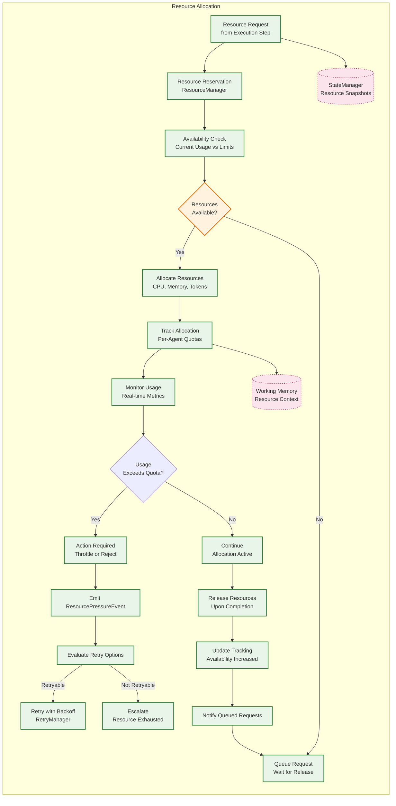
```mermaid
flowchart TB
    subgraph ResourceAlloc["Resource Allocation"]
        direction TB
        
        RA_Request[Resource Request<br/>from Execution Step] --> RA_Reserve[Resource Reservation<br/>ResourceManager]
        
        %% Reservation Process
        RA_Reserve --> RA_Check[Availability Check<br/>Current Usage vs Limits]
        RA_Check --> RA_Available{Resources<br/>Available?}
        RA_Available -->|Yes| RA_Allocate[Allocate Resources<br/>CPU, Memory, Tokens]
        RA_Available -->|No| RA_Queue[Queue Request<br/>Wait for Release]
        
        %% Resource Tracking
        RA_Allocate --> RA_Track[Track Allocation<br/>Per-Agent Quotas]
        RA_Track --> RA_Usage[Monitor Usage<br/>Real-time Metrics]
        RA_Usage --> RA_Exceed{Usage<br/>Exceeds Quota?}
        RA_Exceed -->|Yes| RA_Action[Action Required<br/>Throttle or Reject]
        RA_Exceed -->|No| RA_Continue[Continue<br/>Allocation Active]
        RA_Action --> RA_Alert[Emit ResourcePressureEvent]
        RA_Alert --> RA_Eval[Evaluate Retry Options]
        RA_Eval -->|Retryable| RA_Retry[Retry with Backoff</br>RetryManager]
        RA_Eval -->|Not Retryable| RA_Escalate[Escalate<br/>Resource Exhausted]
        
        %% Release
        RA_Continue --> RA_Release[Release Resources<br/>Upon Completion]
        RA_Release --> RA_Update[Update Tracking<br/>Availability Increased]
        RA_Update --> RA_Notify[Notify Queued Requests]
        RA_Notify --> RA_Queue
        
        %% State Integration
        RA_Request --> RA_State[(StateManager<br/>Resource Snapshots)]
        
        %% Memory Integration
        RA_Track --> RA_Memory[(Working Memory<br/>Resource Context)]
    end
    
    %% Styling
    classDef request fill:#e3f2fd,stroke:#1565c0,stroke-width:2px;
    classDef process fill:#e8f5e8,stroke:#2e7d32,stroke-width:2px;
    classDef decision fill:#fff3e0,stroke:#ef6c00,stroke-width:2px;
    classDef alert fill:#ffebee,stroke:#c62828,stroke-width:2px;
    classDef state fill:#fce4ec,stroke:#c2185b,stroke-width:1px,stroke-dasharray: 3 3;
    
    class RA_Request,RA_Reserve,RA_Check,RA_Allocate,RA_Track,RA_Usage,RA_Release,RA_Update,RA_Notify,RA_Retry,RA_Escalate,RA_Eval,RA_Action,RA_Alert,RA_Continue,RA_Queue process;
    class RA_Available,RA_Exceeds decision;
    class RA_Memory,RA_State state;
```

**Figure 11: Resource Allocation — Quota Management & Enforcement**

---

## Execution Scheduling

Execution scheduling determines when and where steps execute, managed by WorkflowManager with AIAgencyService:

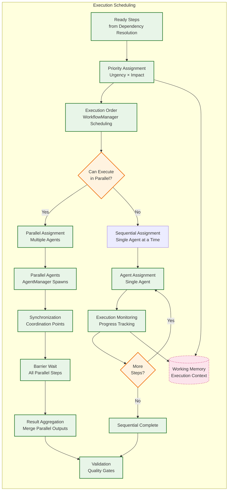
```mermaid
flowchart TB
    subgraph ExecSched["Execution Scheduling"]
        direction TB
        
        ES_Ready[Ready Steps<br/>from Dependency Resolution] --> ES_Priority[Priority Assignment<br/>Urgency × Impact]
        
        ES_Priority --> ES_Order[Execution Order<br/>WorkflowManager Scheduling]
        
        %% Scheduling Decisions
        ES_Order --> ES_Parallel{Can Execute<br/>in Parallel?}
        ES_Parallel -->|Yes| ES_ParallelExec[Parallel Assignment<br/>Multiple Agents]
        ES_Parallel -->|No| ES_SequentialExec[Sequential Assignment<br/>Single Agent at a Time]
        
        %% Parallel Execution Path
        ES_ParallelExec --> ES_ParallelAgents[Parallel Agents<br/>AgentManager Spawns]
        ES_ParallelAgents --> ES_SyncCoord[Synchronization<br/>Coordination Points]
        ES_SyncCoord --> ES_Barrier[Barrier Wait<br/>All Parallel Steps]
        ES_Barrier --> ES_Aggregate[Result Aggregation<br/>Merge Parallel Outputs]
        
        %% Sequential Execution Path
        ES_SequentialExec --> ES_Agent[Agent Assignment<br/>Single Agent]
        ES_Agent --> ES_Monitor[Execution Monitoring<br/>Progress Tracking]
        ES_Monitor --> ES_Next{More<br/>Steps?}
        ES_Next -->|Yes| ES_Agent
        ES_Next -->|No| ES_Done[Sequential Complete]
        
        %% Integration
        ES_Aggregate --> ES_Validate[Validation<br/>Quality Gates]
        ES_Done --> ES_Validate
        
        %% Memory Integration
        ES_Priority --> ES_Memory[(Working Memory<br/>Execution Context)]
        ES_Monitor --> ES_Memory
    end
    
    %% Styling
    classDef input fill:#e3f2fd,stroke:#1565c0,stroke-width:2px;
    classDef process fill:#e8f5e8,stroke:#2e7d32,stroke-width:2px;
    classDef decision fill:#fff3e0,stroke:#ef6c00,stroke-width:2px;
    classDef memory fill:#fce4ec,stroke:#c2185b,stroke-width:1px,stroke-dasharray: 3 3;
    
    class ES_Ready,ES_Priority,ES_Order,ES_ParallelExec,ES_ParallelAgents,ES_SyncCoord,ES_Barrier,ES_Aggregate,ES_Agent,ES_Monitor,ES_Next,ES_Done,ES_Validate process;
    class ES_Parallel,ES_Next decision;
    class ES_Memory memory;
```

**Figure 12: Execution Scheduling — Parallel vs Sequential**

---

## Parallel Execution

Parallel execution manages concurrent agents and work units, coordinated through the EventBus:

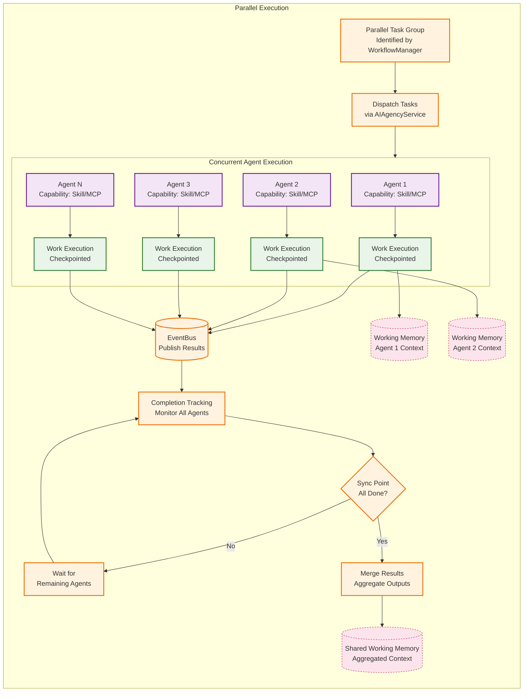
```mermaid
flowchart LR
    subgraph ParallelExec["Parallel Execution"]
        direction TB
        
        PE_Init[Parallel Task Group<br/>Identified by WorkflowManager] --> PE_Dispatch[Dispatch Tasks<br/>via AIAgencyService]
        
        %% Concurrent Agent Execution
        subgraph PE_Agents["Concurrent Agent Execution"]
            direction TB
            PE_Agent1[Agent 1<br/>Capability: Skill/MCP] --> PE_Work1[Work Execution<br/>Checkpointed]
            PE_Agent2[Agent 2<br/>Capability: Skill/MCP] --> PE_Work2[Work Execution<br/>Checkpointed]
            PE_Agent3[Agent 3<br/>Capability: Skill/MCP] --> PE_Work3[Work Execution<br/>Checkpointed]
            PE_AgentN[Agent N<br/>Capability: Skill/MCP] --> PE_WorkN[Work Execution<br/>Checkpointed]
        end
        
        PE_Dispatch --> PE_Agents
        
        %% EventBus Coordination
        PE_Work1 --> PE_EventBus[(EventBus<br/>Publish Results)]
        PE_Work2 --> PE_EventBus
        PE_Work3 --> PE_EventBus
        PE_WorkN --> PE_EventBus
        
        %% Event Processing
        PE_EventBus --> PE_Complete[Completion Tracking<br/>Monitor All Agents]
        PE_Complete --> PE_Sync{Sync Point<br/>All Done?}
        PE_Sync -->|No| PE_Wait[Wait for<br/>Remaining Agents]
        PE_Wait --> PE_Complete
        PE_Sync -->|Yes| PE_Merge[Merge Results<br/>Aggregate Outputs]
        
        %% Memory Integration
        PE_Work1 --> PE_WM1[(Working Memory<br/>Agent 1 Context)]
        PE_Work2 --> PE_WM2[(Working Memory<br/>Agent 2 Context)]
        PE_Merge --> PE_SharedWM[(Shared Working Memory<br/>Aggregated Context)]
    end
    
    %% Styling
    classDef input fill:#e3f2fd,stroke:#1565c0,stroke-width:2px;
    classDef agent fill:#f3e5f5,stroke:#6a1b9a,stroke-width:2px;
    classDef work fill:#e8f5e8,stroke:#2e7d32,stroke-width:2px;
    classDef event fill:#fff3e0,stroke:#ef6c00,stroke-width:2px;
    classDef memory fill:#fce4ec,stroke:#c2185b,stroke-width:1px,stroke-dasharray: 3 3;
    
    class PE_Init,PE_Dispatch,PE_Complete,PE_Sync,PE_Wait,PE_Merge event;
    class PE_Agent1,PE_Agent2,PE_Agent3,PE_AgentN agent;
    class PE_Work1,PE_Work2,PE_Work3,PE_WorkN work;
    class PE_EventBus event;
    class PE_WM1,PE_WM2,PE_SharedWM memory;
```

**Figure 13: Parallel Execution — Concurrent Agent Coordination via EventBus**

---

## Sequential Execution

Sequential execution handles steps that must execute in a specific order, maintaining state between steps:

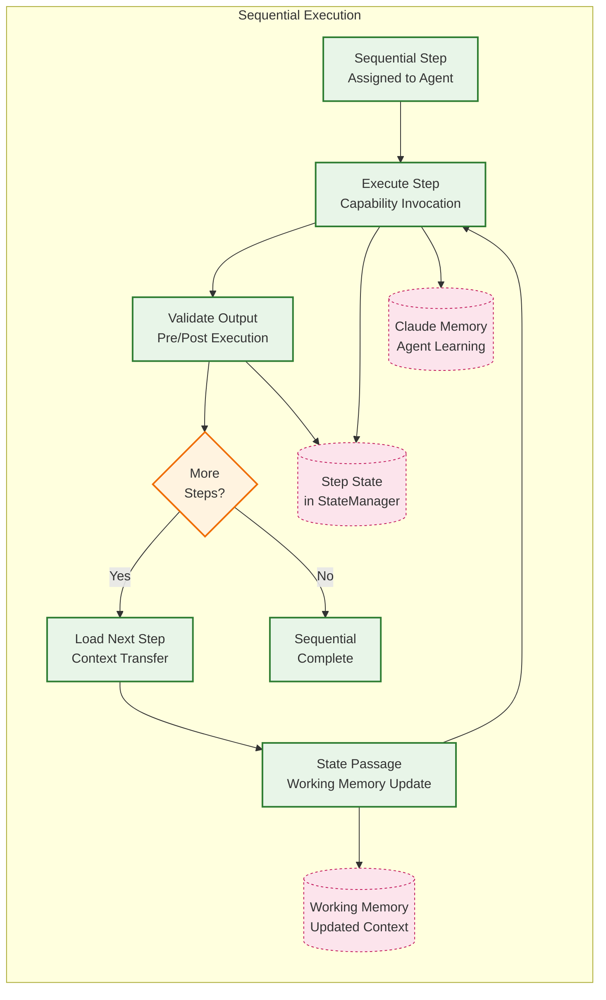
```mermaid
flowchart LR
    subgraph SequentialExec["Sequential Execution"]
        direction TB
        
        SE_Start[Sequential Step<br/>Assigned to Agent] --> SE_Exec[Execute Step<br/>Capability Invocation]
        SE_Exec --> SE_Validate[Validate Output<br/>Pre/Post Execution]
        SE_Validate --> SE_Next{More<br/>Steps?}
        SE_Next -->|Yes| SE_LoadNext[Load Next Step<br/>Context Transfer]
        SE_LoadNext --> SE_StatePass[State Passage<br/>Working Memory Update]
        SE_StatePass --> SE_Exec
        SE_Next -->|No| SE_Complete[Sequential<br/>Complete]
        
        %% State Transfer
        SE_Exec --> SE_StepState[(Step State<br/>in StateManager)]
        SE_Validate --> SE_StepState
        SE_StatePass --> SE_WM[(Working Memory<br/>Updated Context)]
        
        %% Memory Integration
        SE_Exec --> SE_ClMD[(Claude Memory<br/>Agent Learning)]
    end
    
    %% Styling
    classDef input fill:#e3f2fd,stroke:#1565c0,stroke-width:2px;
    classDef process fill:#e8f5e8,stroke:#2e7d32,stroke-width:2px;
    classDef decision fill:#fff3e0,stroke:#ef6c00,stroke-width:2px;
    classDef memory fill:#fce4ec,stroke:#c2185b,stroke-width:1px,stroke-dasharray: 3 3;
    
    class SE_Start,SE_Exec,SE_Validate,SE_Next,SE_LoadNext,SE_StatePass,SE_Complete process;
    class SE_Next decision;
    class SE_StepState,SE_WM,SE_ClMD memory;
```

**Figure 14: Sequential Execution — Ordered Step Processing**

---

## Conditional Branching

Conditional branching handles decision points in workflows where execution path depends on runtime conditions:

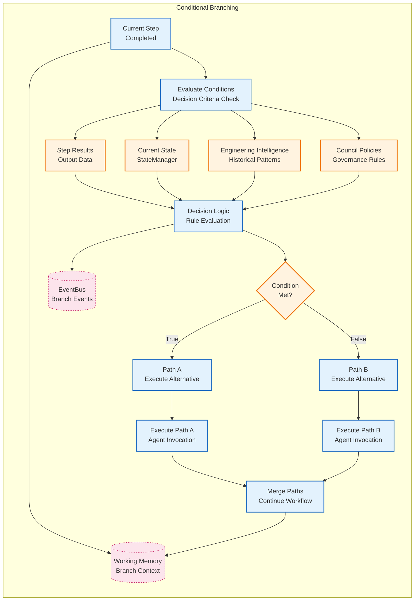
```mermaid
flowchart TB
    subgraph CondBranch["Conditional Branching"]
        direction TB
        
        CB_Step[Current Step<br/>Completed] --> CB_Evaluate[Evaluate Conditions<br/>Decision Criteria Check]
        
        %% Condition Sources
        CB_Evaluate --> CB_Results[Step Results<br/>Output Data]
        CB_Evaluate --> CB_State[Current State<br/>StateManager]
        CB_Evaluate --> CB_Knowledge[Engineering Intelligence<br/>Historical Patterns]
        CB_Evaluate --> CB_Policies[Council Policies<br/>Governance Rules]
        
        %% Decision Logic
        CB_Results --> CB_Decision[Decision Logic<br/>Rule Evaluation]
        CB_State --> CB_Decision
        CB_Knowledge --> CB_Decision
        CB_Policies --> CB_Decision
        
        %% Branching Paths
        CB_Decision --> CB_Yes{Condition<br/>Met?}
        CB_Yes -->|True| CB_PathA[Path A<br/>Execute Alternative]
        CB_Yes -->|False| CB_PathB[Path B<br/>Execute Alternative]
        
        %% Path Execution
        CB_PathA --> CB_AExec[Execute Path A<br/>Agent Invocation]
        CB_PathB --> CB_BExec[Execute Path B<br/>Agent Invocation]
        
        %% Convergence
        CB_AExec --> CB_Merge[Merge Paths<br/>Continue Workflow]
        CB_BExec --> CB_Merge
        
        %% Memory Integration
        CB_Step --> CB_WM[(Working Memory<br/>Branch Context)]
        CB_Merge --> CB_WM
        
        %% Event Publishing
        CB_Decision --> CB_Events[(EventBus<br/>Branch Events)]
    end
    
    %% Styling
    classDef step fill:#e3f2fd,stroke:#1565c0,stroke-width:2px;
    classDef condition fill:#fff3e0,stroke:#ef6c00,stroke-width:2px;
    classDef action fill:#e8f5e8,stroke:#2e7d32,stroke-width:2px;
    classDef memory fill:#fce4ec,stroke:#c2185b,stroke-width:1px,stroke-dasharray: 3 3;
    classDef event fill:#f3e5f5,stroke:#6a1b9a,stroke-width:1px,stroke-dasharray: 5 3;
    
    class CB_Step,CB_Evaluate,CB_Decision,CB_Merge,CB_AExec,CB_BExec,CB_PathA,CB_PathB step;
    class CB_Results,CB_State,CB_Knowledge,CB_Policies,CB_Yes condition;
    class CB_WM,CB_Events memory;
```

**Figure 15: Conditional Branching — Decision Logic and Path Selection**

---

## Event Publishing

Event publishing enables observability, audit trails, and cross-component communication via the EventBus:

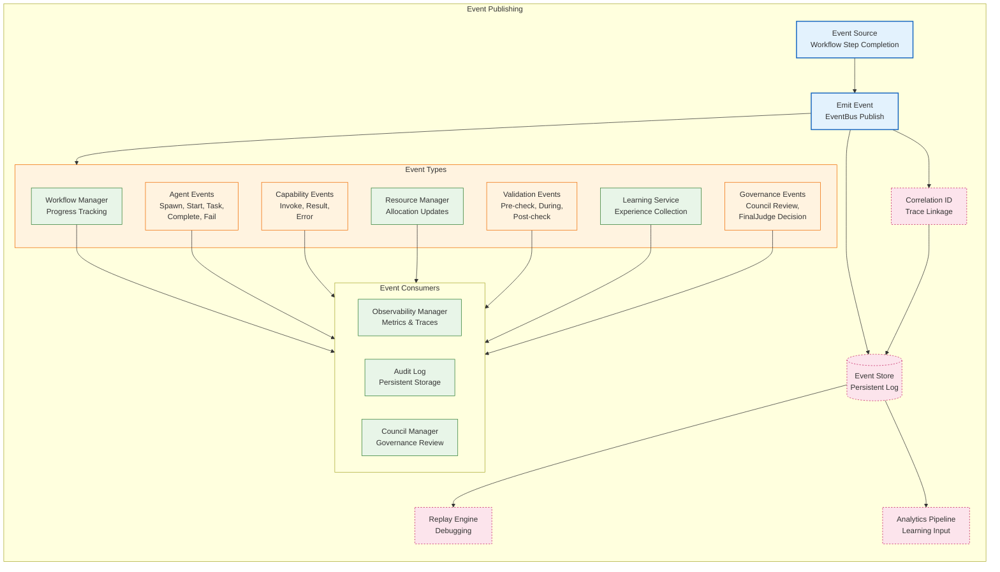
```mermaid
flowchart LR
    subgraph EventPub["Event Publishing"]
        direction TB
        
        EP_Source[Event Source<br/>Workflow Step Completion] --> EP_Emit[Emit Event<br/>EventBus Publish]
        
        %% Event Types
        subgraph EP_Types["Event Types"]
            EP_Workflow[Workflow Events<br/>Start, Step, Complete,<br/>Fail, Cancel]:::etype
            EP_Agent[Agent Events<br/>Spawn, Start, Task,<br/>Complete, Fail]:::etype
            EP_Capability[Capability Events<br/>Invoke, Result,<br/>Error]:::etype
            EP_Resource[Resource Events<br/>Allocate, Release,<br/>Pressure, Exhausted]:::etype
            EP_Validation[Validation Events<br/>Pre-check, During,<br/>Post-check]:::etype
            EP_Learning[Learning Events<br/>Capture, Consolidate,<br/>Pattern Extract]:::etype
            EP_Governance[Governance Events<br/>Council Review,<br/>FinalJudge Decision]:::etype
        end
        
        EP_Emit --> EP_Types
        
        %% Event Consumers
        subgraph EP_Consumers["Event Consumers"]
            EP_Obs[Observability Manager<br/>Metrics & Traces]:::consumer
            EP_Audit[Audit Log<br/>Persistent Storage]:::consumer
            EP_Learning[Learning Service<br/>Experience Collection]:::consumer
            EP_Council[Council Manager<br/>Governance Review]:::consumer
            EP_Resource[Resource Manager<br/>Allocation Updates]:::consumer
            EP_Workflow[Workflow Manager<br/>Progress Tracking]:::consumer
        end
        
        EP_Workflow --> EP_Consumers
        EP_Agent --> EP_Consumers
        EP_Capability --> EP_Consumers
        EP_Resource --> EP_Consumers
        EP_Validation --> EP_Consumers
        EP_Learning --> EP_Consumers
        EP_Governance --> EP_Consumers
        
        %% Event Store
        EP_Emit --> EP_Store[(Event Store<br/>Persistent Log)]
        EP_Store --> EP_Replay[Replay Engine<br/>Debugging]
        EP_Store --> EP_Analytics[Analytics Pipeline<br/>Learning Input]
        
        %% Correlation & Causation
        EP_Emit --> EP_Corr[Correlation ID<br/>Trace Linkage]
        EP_Corr --> EP_Store
    end
    
    %% Styling
    classDef source fill:#e3f2fd,stroke:#1565c0,stroke-width:2px;
    classDef etype fill:#fff3e0,stroke:#ef6c00,stroke-width:1px;
    classDef consumer fill:#e8f5e8,stroke:#2e7d32,stroke-width:1px;
    classDef store fill:#fce4ec,stroke:#c2185b,stroke-width:1px,stroke-dasharray: 3 3;
    
    class EP_Source,EP_Emit source;
    class EP_Types,EP_Workflow,EP_Agent,EP_Capability,EP_Resource,EP_Validation,EP_Learning,EP_Governance etype;
    class EP_Obs,EP_Audit,EP_Learning,EP_Council,EP_Resource,EP_Workflow consumer;
    class EP_Store,EP_Replay,EP_Analytics,EP_Corr store;
```

**Figure 16: Event Publishing — EventBus Integration**

---

## Validation

Validation ensures correctness at all workflow stages through pre-execution, during-execution, and post-execution checks:

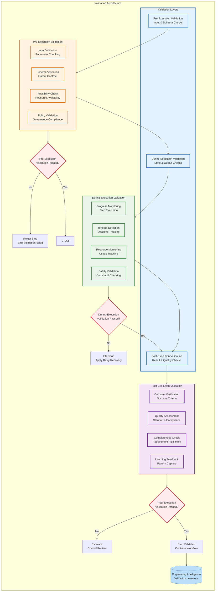
```mermaid
flowchart TB
    subgraph ValidationFlow["Validation Architecture"]
        direction TB
        
        %% Validation Layers
        subgraph V_Layers["Validation Layers"]
            V_Pre[Pre-Execution Validation<br/>Input & Schema Checks]:::layer
            V_During[During-Execution Validation<br/>State & Output Checks]:::layer
            V_Post[Post-Execution Validation<br/>Result & Quality Checks]:::layer
        end
        
        %% Pre-Execution Validation Details
        subgraph V_Pre_Details["Pre-Execution Validation"]
            V_Pre_Input[Input Validation<br/>Parameter Checking]:::pre
            V_Pre_Schema[Schema Validation<br/>Output Contract]:::pre
            V_Pre_Feasibility[Feasibility Check<br/>Resource Availability]:::pre
            V_Pre_Policy[Policy Validation<br/>Governance Compliance]:::pre
        end
        
        %% During-Execution Validation Details
        subgraph V_During_Details["During-Execution Validation"]
            V_Dur_Progress[Progress Monitoring<br/>Step Execution]:::during
            V_Dur_Timeout[Timeout Detection<br/>Deadline Tracking]:::during
            V_Dur_Resource[Resource Monitoring<br/>Usage Tracking]:::during
            V_Dur_Safety[Safety Validation<br/>Constraint Checking]:::during
        end
        
        %% Post-Execution Validation Details
        subgraph V_Post_Details["Post-Execution Validation"]
            V_Post_Outcome[Outcome Verification<br/>Success Criteria]:::post
            V_Post_Quality[Quality Assessment<br/>Standards Compliance]:::post
            V_Post_Completeness[Completeness Check<br/>Requirement Fulfillment]:::post
            V_Post_Learning[Learning Feedback<br/>Pattern Capture]:::post
        end
        
        %% Validation Flow
        V_Pre --> V_Pre_Details
        V_Pre_Details --> V_During
        V_During --> V_During_Details
        V_During_Details --> V_Post
        V_Post --> V_Post_Details
        
        %% Validation Decision Points
        V_Pre_Details --> V_Pre_Pass{Pre-Execution<br/>Validation Passed?}
        V_Pre_Pass -->|No| V_Pre_Fail[Reject Step<br/>Emit ValidationFailed]
        V_Pre_Pass -->|Yes| V_Dur
        
        V_During_Details --> V_Dur_Pass{During-Execution<br/>Validation Passed?}
        V_Dur_Pass -->|No| V_Dur_Fail[Intervene<br/>Apply Retry/Recovery]
        V_Dur_Pass -->|Yes| V_Post
        
        V_Post_Details --> V_Post_Pass{Post-Execution<br/>Validation Passed?}
        V_Post_Pass -->|No| V_Post_Fail[Escalate<br/>Council Review]
        V_Post_Pass -->|Yes| V_Complete[Step Validated<br/>Continue Workflow]
        
        %% Validation Memory
        V_Complete --> V_EI[(Engineering Intelligence<br/>Validation Learnings)]
    end
    
    %% Styling
    classDef layer fill:#e3f2fd,stroke:#1565c0,stroke-width:2px;
    classDef pre fill:#fff3e0,stroke:#ef6c00,stroke-width:2px;
    classDef during fill:#e8f5e8,stroke:#2e7d32,stroke-width:2px;
    classDef post fill:#f3e5f5,stroke:#6a1b9a,stroke-width:2px;
    classDef decision fill:#ffebee,stroke:#c62828,stroke-width:2px;
    classDef memory fill:#bbdefb,stroke:#1565c0,stroke-width:1px,stroke-dasharray: 3 3;
    
    class V_Layers,V_Pre,V_During,V_Post layer;
    class V_Pre_Details,V_Pre_Input,V_Pre_Schema,V_Pre_Feasibility,V_Pre_Policy pre;
    class V_During_Details,V_Dur_Progress,V_Dur_Timeout,V_Dur_Resource,V_Dur_Safety during;
    class V_Post_Details,V_Post_Outcome,V_Post_Quality,V_Post_Completeness,V_Post_Learning post;
    class V_Pre_Pass,V_Dur_Pass,V_Post_Pass decision;
    class V_EI memory;
```

**Figure 17: Validation Architecture — Pre/During/Post Execution**

---

## Reflection

Reflection analyzes execution outcomes to extract insights for improvement, coordinated by the Learning Service:

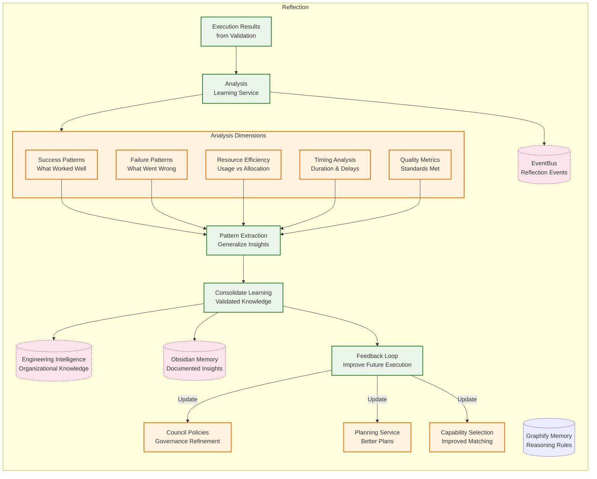
```mermaid
flowchart LR
    subgraph ReflectionFlow["Reflection"]
        direction TB
        
        R_Input[Execution Results<br/>from Validation] --> R_Analyze[Analysis<br/>Learning Service]
        
        %% Analysis Dimensions
        subgraph R_Dimensions["Analysis Dimensions"]
            R_Success[Success Patterns<br/>What Worked Well]:::dim
            R_Failure[Failure Patterns<br/>What Went Wrong]:::dim
            R_Resource[Resource Efficiency<br/>Usage vs Allocation]:::dim
            R_Timing[Timing Analysis<br/>Duration & Delays]:::dim
            R_Quality[Quality Metrics<br/>Standards Met]:::dim
        end
        
        R_Analyze --> R_Dimensions
        
        %% Pattern Extraction
        R_Success --> R_Extract[Pattern Extraction<br/>Generalize Insights]
        R_Failure --> R_Extract
        R_Resource --> R_Extract
        R_Timing --> R_Extract
        R_Quality --> R_Extract
        
        R_Extract --> R_Consolidate[Consolidate Learning<br/>Validated Knowledge]
        
        %% Storage Destinations
        R_Consolidate --> R_EI[(Engineering Intelligence<br/>Organizational Knowledge)]
        R_Consolidate --> R_Obsidian[(Obsidian Memory<br/>Documented Insights)]
        R_Consoldiate2[(Graphify Memory<br/>Reasoning Rules)]
        
        %% Feedback to Execution
        R_Consolidate --> R_Feedback[Feedback Loop<br/>Improve Future Execution]
        R_Feedback -->|Update| R_Policies[Council Policies<br/>Governance Refinement]
        R_Feedback -->|Update| R_Plans[Planning Service<br/>Better Plans]
        R_Feedback -->|Update| R_CapSel[Capability Selection<br/>Improved Matching]
        
        %% Reflection Events
        R_Analyze --> R_Events[(EventBus<br/>Reflection Events)]
    end
    
    %% Styling
    classDef input fill:#e3f2fd,stroke:#1565c0,stroke-width:2px;
    classDef process fill:#e8f5e8,stroke:#2e7d32,stroke-width:2px;
    classDef analysis fill:#fff3e0,stroke:#ef6c00,stroke-width:2px;
    classDef memory fill:#fce4ec,stroke:#c2185b,stroke-width:1px,stroke-dasharray: 3 3;
    classDef feedback fill:#f3e5f5,stroke:#6a1b9a,stroke-width:1px,stroke-dasharray: 5 3;
    
    class R_Input,R_Analyze,R_Extract,R_Consolidate,R_Feedback process;
    class R_Dimensions,R_Success,R_Failure,R_Resource,R_Timing,R_Quality,R_Policies,R_Plans,R_CapSel analysis;
    class R_EI,R_Obsidian,R_Consldiate2,R_Events memory;
```

**Figure 18: Reflection — Performance Analysis & Pattern Extraction**

---

## Learning

Learning extracts reusable patterns from experience, storing them across the five-tier memory hierarchy:

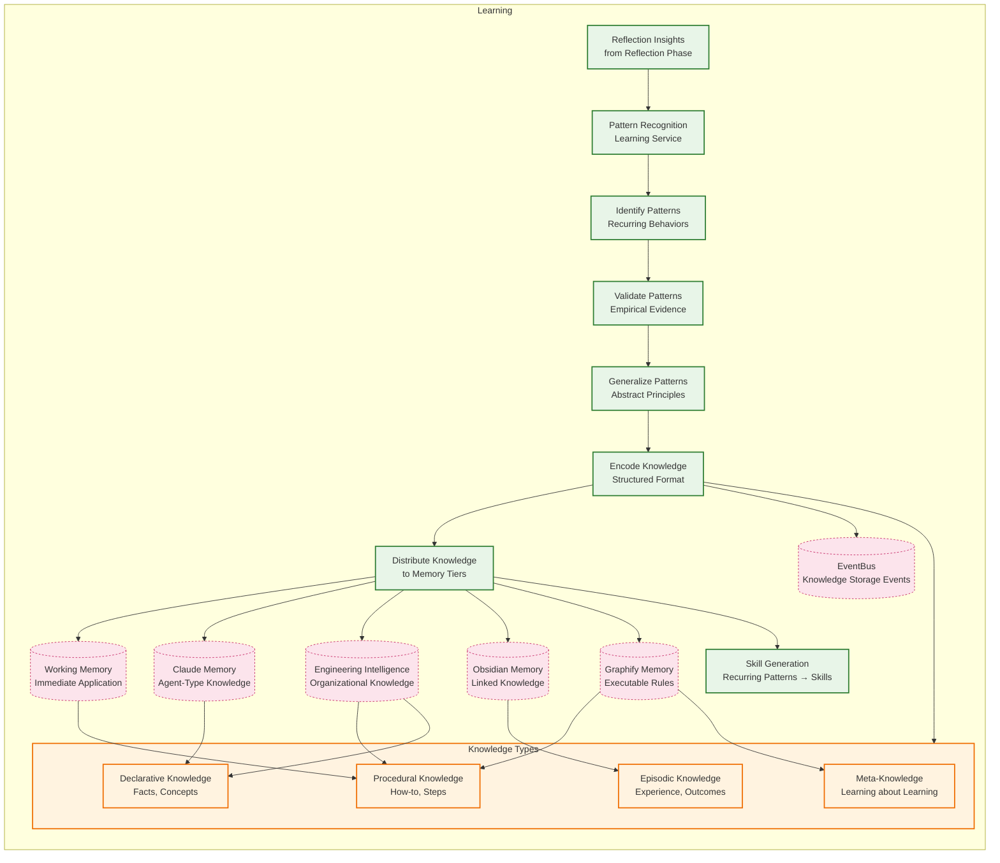
```mermaid
flowchart TB
    subgraph LearningFlow["Learning"]
        direction TB
        
        L_Input[Reflection Insights<br/>from Reflection Phase] --> L_Pattern[Pattern Recognition<br/>Learning Service]
        
        %% Pattern Extraction Process
        L_Pattern --> L_Identify[Identify Patterns<br/>Recurring Behaviors]
        L_Identify --> L_Validate[Validate Patterns<br/>Empirical Evidence]
        L_Validate --> L_Generalize[Generalize Patterns<br/>Abstract Principles]
        L_Generalize --> L_Encode[Encode Knowledge<br/>Structured Format]
        
        %% Knowledge Distribution
        L_Encode --> L_Distribute[Distribute Knowledge<br/>to Memory Tiers]
        
        %% Memory Tier Storage
        L_Distribute --> L_WM[(Working Memory<br/>Immediate Application)]
        L_Distribute --> L_ClMD[(Claude Memory<br/>Agent-Type Knowledge)]
        L_Distribute --> L_EI[(Engineering Intelligence<br/>Organizational Knowledge)]
        L_Distribute --> L_Obsidian[(Obsidian Memory<br/>Linked Knowledge)]
        L_Distribute --> L_Graphify[(Graphify Memory<br/>Executable Rules)]
        
        %% Knowledge Types by Tier
        subgraph L_Types["Knowledge Types"]
            L_Proc[Procedural Knowledge<br/>How-to, Steps]:::type
            L_Decl[Declarative Knowledge<br/>Facts, Concepts]:::type
            L_Epis[Episodic Knowledge<br/>Experience, Outcomes]:::type
            L_Meta[Meta-Knowledge<br/>Learning about Learning]:::type
        end
        
        L_Encode --> L_Types
        L_WM --> L_Proc
        L_ClMD --> L_Decl
        L_EI --> L_Proc
        L_EI --> L_Decl
        L_Obsidian --> L_Epis
        L_Graphify --> L_Proc
        L_Graphify --> L_Meta
        
        %% Learning Events
        L_Encode --> L_Events[(EventBus<br/>Knowledge Storage Events)]
        
        %% Skill Generation Link
        L_Distribute --> L_Skills[Skill Generation<br/>Recurring Patterns → Skills]
    end
    
    %% Styling
    classDef input fill:#e3f2fd,stroke:#1565c0,stroke-width:2px;
    classDef process fill:#e8f5e8,stroke:#2e7d32,stroke-width:2px;
    classDef type fill:#fff3e0,stroke:#ef6c00,stroke-width:2px;
    classDef memory fill:#fce4ec,stroke:#c2185b,stroke-width:1px,stroke-dasharray: 3 3;
    classDef event fill:#f3e5f5,stroke:#6a1b9a,stroke-width:1px,stroke-dasharray: 5 3;
    
    class L_Input,L_Pattern,L_Identify,L_Validate,L_Generalize,L_Encode,L_Distribute,L_Skills process;
    class L_Types,L_Proc,L_Decl,L_Epis,L_Meta type;
    class L_WM,L_ClMD,L_EI,L_Obsidian,L_Graphify,L_Events memory;
```

**Figure 19: Learning — Knowledge Distribution Across Memory Tiers**

---

## Completion

Completion marks workflow finalization, including state persistence, resource cleanup, and audit finalization:

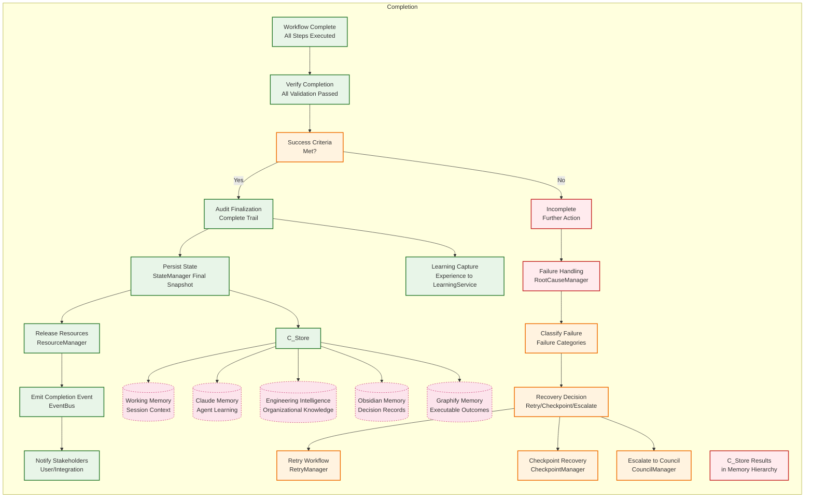
```mermaid
flowchart TB
    subgraph CompletionFlow["Completion"]
        direction TB
        
        C_Trigger[Workflow Complete<br/>All Steps Executed] --> C_Verify[Verify Completion<br/>All Validation Passed]
        
        %% Completion Verification
        C_Verify --> C_Success[Success Criteria<br/>Met?]
        C_Success -->|Yes| C_Audit[Audit Finalization<br/>Complete Trail]
        C_Success -->|No| C_Incomplete[Incomplete<br/>Further Action]
        
        %% Success Path
        C_Audit --> C_Persist[Persist State<br/>StateManager Final Snapshot]
        C_Persist --> C_Release[Release Resources<br/>ResourceManager]
        C_Release --> C_Emit[Emit Completion Event<br/>EventBus]
        C_Emit --> C_Notify[Notify Stakeholders<br/>User/Integration]
        
        %% Memory Storage
        C_Complete[C_Store Results<br/>in Memory Hierarchy]
        C_Persist --> C_Store
        C_Store --> C_WM[(Working Memory<br/>Session Context)]
        C_Store --> C_ClMD[(Claude Memory<br/>Agent Learning)]
        C_Store --> C_EI[(Engineering Intelligence<br/>Organizational Knowledge)]
        C_Store --> C_Obsidian[(Obsidian Memory<br/>Decision Records)]
        C_Store --> C_Graphify[(Graphify Memory<br/>Executable Outcomes)]
        
        %% Failure Path
        C_Incomplete --> C_Failure[Failure Handling<br/>RootCauseManager]
        C_Failure --> C_Classify[Classify Failure<br/>Failure Categories]
        C_Classify --> C_Recovery[Recovery Decision<br/>Retry/Checkpoint/Escalate]
        C_Recovery --> C_Retry[Retry Workflow<br/>RetryManager]
        C_Recovery --> C_Checkpoint[Checkpoint Recovery<br/>CheckpointManager]
        C_Recovery --> C_Escalate[Escalate to Council<br/>CouncilManager]
        
        %% Learning from Completion
        C_Audit --> C_Learn[Learning Capture<br/>Experience to LearningService]
    end
    
    %% Styling
    classDef trigger fill:#e3f2fd,stroke:#1565c0,stroke-width:2px;
    classDef process fill:#e8f5e8,stroke:#2e7d32,stroke-width:2px;
    classDef decision fill:#fff3e0,stroke:#ef6c00,stroke-width:2px;
    classDef failure fill:#ffebee,stroke:#c62828,stroke-width:2px;
    classDef memory fill:#fce4ec,stroke:#c2185b,stroke-width:1px,stroke-dasharray: 3 3;
    
    class C_Trigger,C_Verify,C_Audit,C_Persist,C_Release,C_Emit,C_Notify,C_Store,C_Learn process;
    class C_Success,C_Recovery,C_Retry,C_Checkpoint,C_Escalate,C_Classify decision;
    class C_Incomplete,C_Failure,C_Complete failure;
    class C_WM,C_ClMD,C_EI,C_Obsidian,C_Graphify memory;
```

**Figure 20: Completion — Finalization & Failure Handling**

---

## Advanced Workflow Mechanisms

This section details the advanced mechanisms that ensure workflow reliability, fault tolerance, and governance:

```mermaid
flowchart TD
    subgraph AdvancedMechanisms["Advanced Workflow Mechanisms"]
        direction TB
        
        %% Retry Loop
        subgraph RetryLoop["Retry Loop"]
            direction TB
            RL_Attempt[Retry Attempt<br/>RetryManager] --> RL_Wait[Backoff Wait<br/>Exponential Delay]
            RL_Wait --> RL_Retry[Retry Execution<br/>Same or Adapted]
            RL_Retry --> RL_Result{Retry<br/>Successful?}
            RL_Result -->|Yes| RL_Success[Success<br/>Continue]
            RL_Result -->|No| RL_CheckAttempts{Attempts<br/>Remaining?}
            RL_CheckAttempts -->|Yes| RL_Attempt
            RL_CheckAttempts -->|No| RL_Fail[Retry Exhausted<br/>Escalate]
        end
        
        %% Checkpointing
        subgraph Checkpointing["Checkpointing"]
            direction TB
            CP_Trigger[Checkpoint Trigger<br/>Time/Task/Step] --> CP_Snapshot[Create Snapshot<br/>StateManager]
            CP_Snapshot --> CP_Validate[Validate Integrity<br/>Consistency Check]
            CP_Validate --> CP_Store[Store Checkpoint<br/>StorageManager]
            CP_Store --> CP_Meta[(Checkpoint Metadata<br/>Workflow State)]
            CP_Validate -->|Invalid| CP_Discard[Discard Invalid<br/>Checkpoint]
        end
        
        %% Rollback
        subgraph Rollback["Rollback"]
            direction TB
            RB_Detect[Rollback Trigger<br/>Failure Detected] --> RB_Load[Load Checkpoint<br/>Last Known Good]
            RB_Load --> RB_Restore[Restore State<br/>StateManager Restore]
            RB_Restore --> RB_Verify[Verify Restoration<br/>State Consistency]
            RB_Verify -->|Valid| RB_Resume[Resume Execution<br/>From Checkpoint]
            RB_Verify -->|Invalid| RB_Next[Find Older<br/>Checkpoint]
            RB_Next --> RB_Load
        end
        
        %% Compensation
        subgraph Compensation["Compensation"]
            direction TB
            CP_Trigger_Comp[Compensation Trigger<br/>Irreversible Action] --> CP_Identify[Identify Inverse<br/>Operations]
            CP_Identify --> CP_Execute[Execute Compensation<br/>Reverse Effects]
            CP_Execute --> CP_Validate_Comp[Validate<br/>System Consistency]
            CP_Validate_Comp -->|Consistent| CP_Complete[Compensation<br/>Complete]
            CP_Validate_Comp -->|Inconsistent| CP_Manual[Manual<br/>Intervention]
        end
        
        %% Cancellation
        subgraph Cancellation["Cancellation"]
            direction TB
            CNL_Request[Cancellation Request<br/>User/System] --> CNL_Graceful[Graceful Cancel<br/>Stop New Tasks]
            CNL_Graceful --> CNL_Wait[Wait for In-flight<br/>Completion (Timeout)]
            CNL_Wait --> CNL_Resource[Release Resources<br/>ResourceManager]
            CNL_Resource --> CNL_Persist[Persist Interim State<br/>StateManager]
            CNL_Persist --> CNL_Emit[Emit Cancelled Event<br/>EventBus]
        end
        
        %% Timeout Handling
        subgraph Timeout["Timeout Handling"]
            direction TB
            TO_Detect[Timeout Detected<br/>Step Deadline Exceeded] --> TO_Context[Assess Context<br/>Remaining Time]
            TO_Context --> TO_Decision{Timeout<br/>Type?}
            TO_Decision -->|Retryable| TO_Retry[Retry with<br/>Adjusted Parameters]
            TO_Decision -->|Non-retryable| TO_Degrade[Graceful Degradation<br/>Reduced Scope]
            TO_Context --> TO_RB[Rollback<br/>Checkpoint Recovery]
            TO_RB --> TO_Resume[Resume with<br/>Extended Timeout]
        end
        
        %% Recovery
        subgraph Recovery["Recovery"]
            direction TB
            RC_Failure[Failure Detected<br/>RootCauseManager] --> RC_Classify[Classify Failure<br/>Failure Categories]
            RC_Classify --> RC_Select[Select Recovery<br/>Strategy]
            RC_Select --> RC_Execute[Execute Recovery<br/>Action]
            RC_Execute --> RC_Verify[Verify Recovery<br/>Success]
            RC_Verify -->|Success| RC_Resume[Resume Execution]
            RC_Verify -->|Failure| RC_Cascade[Re-classify<br/>Escalation]
        end
        
        %% Human Approval
        subgraph HumanApproval["Human Approval"]
            direction TB
            HA_Request[Approval Required<br/>Policy Trigger] --> HA_Notify[Notify FinalJudge<br/>Human Oversight]
            HA_Notify --> HA_Wait[Await Human<br/>Decision]
            HA_Wait --> HA_Decision[HDDecision<br/>Approved/Rejected]
            HA_Decision -->|Approved| HA_Resume[Resume Execution<br/>With Modifications]
            HA_Decision -->|Rejected| HA_Abort[Abort Workflow<br/>Cleanup]
        end
        
        %% Council Review
        subgraph CouncilReview["Council Review"]
            direction TB
            CR_Trigger[Review Trigger<br/>Significant Decision] --> CR_Submit[Submit Proposal<br/>to CouncilManager]
            CR_Submit --> CR_Vote[Voting Process<br/>Consensus Algorithm]
            CR_Vote --> CR_Decision{Council<br/>Decision?}
            CR_Decision -->|Approved| CR_Execute[Execute<br/>With Council Approval]
            CR_Decision -->|Rejected| CR_Revise[Revise Approach<br/>Re-plan]
            CR_Decision -->|No Consensus| CR_Final[FinalJudge<br/>Override]
        end
        
        %% Failure Escalation
        subgraph Escalation["Failure Escalation"]
            direction TB
            FE_Trigger[Escalation Trigger<br/>Critical Failure] --> FE_Classify[Classify Failure<br/>Severity Assessment]
            FE_Classify --> FE_Route[Route to Council<br/>CouncilManager]
            FE_Route --> FE_Review[Review Failure<br/>Human Judgment]
            FE_Review --> FE_Decide[Decision<br/>Continue/Abort/Modify]
        end
        
        %% Memory Interaction
        subgraph MemoryInteraction["Memory Interaction"]
            direction TB
            MI_Request[Read Request<br/>from Execution] --> MI_Retrieve[Retrieve Knowledge<br/>MemoryManager]
            MI_Retrieve --> MI_WM[Working Memory<br/>Active Context]
            MI_Retrieve --> MI_ClMD[Claude Memory<br/>Agent Knowledge]
            MI_Retrieve --> MI_EI[Engineering Intelligence<br/>Org Knowledge]
            MI_Request --> MI_Store[Store Results<br/>MemoryManager]
            MI_Store --> MI_Obsidian[Obsidian Memory<br/>Documentation]
            MI_Store --> MI_Graphify[Graphify Memory<br/>Relationships]
        end
        
        %% Observability
        subgraph Observability["Observability"]
            direction TB
            OBS_Events[Event Collection<br/>EventBus Streams] --> OBS_Metrics[Metrics Aggregation<br/>Observability Manager]
            OBS_Metrics --> OBS_Dashboard[Dashboard<br/>Real-time View]
            OBS_Metrics --> OBS_Alerts[Alerts<br/>Anomaly Detection]
            OBS_Metrics --> OBS_Analytics[Analytics<br/>Long-term Trends]
        end
        
        %% State Transitions
        subgraph StateTransition["State Transitions"]
            direction TB
            ST_Current[Current State<br/>Execution Context] --> ST_Event[State Change<br/>Trigger Event]
            ST_Event --> ST_Update[Update State<br/>StateManager]
            ST_Update --> ST_Persist[Persist State<br/>StorageManager]
            ST_Persist --> ST_Validate[Validate State<br/>Consistency Check]
            ST_Validate --> ST_Next[Next State<br/>Execution Continues]
        end
        
        %% Workflow Persistence
        subgraph Persistence["Workflow Persistence"]
            direction TB
            WP_Definition[Workflow Definition<br/>Versioned] --> WP_Store[Store in<br/>StorageManager]
            WP_Store --> WP_Version[Version Tracking<br/>Change History]
            WP_Version --> WP_Restore[Restore from<br/>Any Version]
            WP_Definition --> WP_Snapshot[Periodic<br/>Snapshots]
        end
        
        %% Workflow Versioning
        subgraph Versioning["Workflow Versioning"]
            direction TB
            WV_Track[Track Changes<br/>Definition Evolves] --> WV_Compare[Compare Versions<br/>Diff Analysis]
            WV_Compare --> WV_Rollback[Rollback Capability<br/>Previous Versions]
            WV_Rollback --> WV_Test[Test Before<br/>Deployment]
        end
        
        %% Workflow Metrics
        subgraph Metrics["Workflow Metrics"]
            direction TB
            WM_Collect[Collect Metrics<br/>From Execution] --> WM_Category[By Category<br/>Performance/Business/Operational]
            WM_Category --> WM_Report[Generate Reports<br/>Periodic & On-demand]
            WM_Category --> WM_Thresholds[Threshold Alerts<br/>SLA Monitoring]
            WM_Category --> WM_Trend[Trend Analysis<br/>Historical Patterns]
        end
        
        %% Workflow Optimization
        subgraph Optimization["Workflow Optimization"]
            direction TB
            WO_Analyze[Analyze Patterns<br/>Historical Data] --> WO_Identify[Identify<br/>Opportunities]
            WO_Identify --> WO_Schedule[Optimize Scheduling<br/>Parallel/Ordering]
            WO_Identify --> WO_Resource[Optimize Resource<br/>Allocation]
            WO_Identify --> WO_Capability[Optimize Capability<br/>Selection]
            WO_Schedule --> WO_Execute[Execute Optimized<br/>Workflow]
        end
        
        %% Adaptive Execution
        subgraph AdaptiveExec["Adaptive Execution"]
            direction TB
            AE_Monitor[Monitor Execution<br/>Real-time] --> AE_Compare[Compare to Plan<br/>Expected vs Actual]
            AE_Compare --> AE_Decision{Plan<br/>Valid?}
            AE_Decision -->|Drift| AE_Replan[Adaptive Replanning<br/>WorkflowManager]
            AE_Decision -->|Valid| AE_Continue[Continue<br/>As Planned]
            AE_Replan --> AE_Adjust[Adjust Workflow<br/>New Steps/Paths]
            AE_Adjust --> AE_Replan
        end
        
        %% Styling
        classDef mechanism fill:#e8f5e8,stroke:#2e7d32,stroke-width:2px;
        classDef process fill:#f5f5f5,stroke:#424242,stroke-width:1px;
        classDef decision fill:#fff3e0,stroke:#ef6c00,stroke-width:2px;
        classDef special fill:#f3e5f5,stroke:#6a1b9a,stroke-width:1px,stroke-dasharray: 5 3;
        
        class RetryLoop,Checkpointing,Rollback,Compensation,Cancellation,Timeout,Recovery,HumanApproval,CouncilReview,Escalation,MemoryInteraction,Observability,StateTransition,Persistence,Versioning,Metrics,Optimization,AdaptiveExec mechanism;
        class RL_Attempt,RL_Wait,RL_Retry,RL_Success,RL_Fail,CP_Trigger,CP_Snapshot,CP_Validate,CP_Store,CP_Meta,CP_Discard process;
        class RB_Detect,RB_Load,RB_Restore,RB_Verify,RB_Resume,RB_Next,CP_Trigger_Comp,CP_Identify,CP_Execute,CP_Validate_Comp,CP_Complete,CP_Manual process;
        class CNL_Request,CNL_Graceful,CNL_Wait,CNL_Resource,CNL_Persist,CNL_Emit,TO_Detect,TO_Context,TO_Decision,TO_Retry,TO_Degrade,TO_RB,TO_Resume process;
        class RC_Failure,RC_Classify,RC_Select,RC_Execute,RC_Verify,RC_Resume,RC_Cascade,HA_Request,HA_Notify,HA_Wait,HA_Decision,HA_Resume,HA_Abort process;
        class CR_Trigger,CR_Submit,CR_Vote,CR_Execute,CR_Revise,CR_Final,FE_Trigger,FE_Classify,FE_Route,FE_Review,FE_Decide process;
        class MI_Request,MI_Retrieve,MI_WM,MI_ClMD,MI_EI,MI_Store,MI_Obsidian,MI_Graphify,OBs_Events,OBs_Metrics,OBs_Dashboard,OBs_Alerts,OBs_Analytics process;
        class ST_Current,ST_Event,ST_Update,ST_Persist,ST_Validate,ST_Next,WP_Definition,WP_Store,WP_Version,WP_Restore,WP_Snapshot,WV_Track,WV_Compare,WV_Rollback,WV_Test process;
        class WM_Collect,WM_Category,WM_Report,WM_Thresholds,WM_Trend,WO_Analyze,WO_Identify,WO_Schedule,WO_Resource,WO_Capability,WO_Execute process;
        class AE_Monitor,AE_Compare,AE_Decision,AE_Replan,AE_Continue,AE_Adjust process;
        
        class RL_Result,RL_CheckAttempts,TO_Decision,CR_Decision,AE_Decision decision;
    end
```

**Figure 21: Advanced Workflow Mechanisms Overview**

---

## Workflow Resilience Patterns

This section details the resilience patterns that ensure workflow robustness under failure conditions:

```mermaid
flowchart TD
    subgraph ResiliencePatterns["Workflow Resilience Patterns"]
        direction TB
        
        %% Pattern 1: Retry Loop
        subgraph RetryPattern["Retry Loop Pattern"]
            direction TB
            RP_Fail[Task Failed<br/>EventBus Failure Event] --> RP_Classify[Classify Failure<br/>RootCauseManager]
            RP_Classify --> RP_Retryable{Transient<br/>Failure?}
            RP_Retryable -->|Yes| RP_Backoff[Exponential Backoff<br/>RetryManager]
            RP_Retryable -->|No| RP_Escalate[Escalate<br/>Recovery Path]
            RP_Backoff --> RP_Attempt[Retry Attempt<br/>Increment Counter]
            RP_Attempt --> RP_Max{Max<br/>Attempts?}
            RP_Max -->|No| RP_Execute[Re-execute<br/>Failed Task]
            RP_Max -->|Yes| RP_BudgetExhausted[Budget Exhausted<br/>Escalate]
            RP_Execute --> RP_Result{Task<br/>Result?}
            RP_Result -->|Success| RP_Recovered[Recovered<br/>Continue]
            RP_Result -->|Failure| RP_Attempt
        end
        
        %% Pattern 2: Checkpointing
        subgraph CheckpointPattern["Checkpoint Pattern"]
            direction TB
            CP_Trigger_P[Checkpoint Trigger<br/>Periodic/Time/Task] --> CP_Create[Create Checkpoint<br/>StateManager Snapshot]
            CP_Create --> CP_Validate_P[Validate Data<br/>Integrity Check]
            CP_Validate_P --> CP_Persist_P[Persist to Storage<br/>StorageManager]
            CP_Persist_P --> CP_Index[Index Checkpoint<br/>Lookup Metadata]
            CP_Validate_P -->|Failed| CP_Discard_P[Discard<br/>Invalid Checkpoint]
            CP_Index --> CP_Available[Checkpoint<br/>Available for Recovery]
        end
        
        %% Pattern 3: Rollback
        subgraph RollbackPattern["Rollback Pattern"]
            direction TB
            RB_Init[Rollback Initiated<br/>Irreversible Error] --> RB_Find[Find Appropriate<br/>Checkpoint]
            RB_Find --> RB_Load_P[Load Checkpoint<br/>StorageManager]
            RB_Load_P --> RB_Restore_P[Restore State<br/>StateManager Restore]
            RB_Restore_P --> RB_Validate_P[Validate Restored<br/>State Consistency]
            RB_Validate_P -->|Valid| RB_Resume_P[Resume from<br/>Checkpoint]
            RB_Validate_P -->|Invalid| RB_Older[Find Older<br/>Checkpoint]
            RB_Older --> RB_Load_P
        end
        
        %% Pattern 4: Compensation
        subgraph CompPattern["Compensation Pattern"]
            direction TB
            COMP_Init[Compensation Initiated<br/>Partial Failure] --> COMP_Identify_P[Identify<br/>Affected Operations]
            COMP_Identify_P --> COMP_Inverse[Execute Inverse<br/>Operations]
            COMP_Inverse --> COMP_Validate_P[Validate<br/>System State]
            COMP_Validate_P -->|Consistent| COMP_Cleanup[Cleanup<br/>Complete]
            COMP_Validate_P -->|Inconsistent| COMP_Escalate[Escalate<br/>Manual Intervention]
        end
        
        %% Pattern 5: Cancellation
        subgraph CancelPattern["Cancellation Pattern"]
            direction TB
            CNL_Init[Cancellation Requested<br/>User/System Signal] --> CNL_Graceful_P[Graceful Shutdown<br/>Stop New Work]
            CNL_Graceful_P --> CNL_Drain[Drain In-flight<br/>Operations (Timeout)]
            CNL_Drain --> CNL_Release_P[Release Resources<br/>ResourceManager]
            CNL_Release_P --> CNL_Persist_P[Persist Interim State<br/>StateManager]
            CNL_Persist_P --> CNL_Notify_P[Emit Cancelled Event<br/>EventBus]
        end
        
        %% Pattern 6: Timeout
        subgraph TimeoutPattern["Timeout Pattern"]
            direction TB
            TO_Init[Timeout Detected<br/>Deadline Exceeded] --> TO_Assess[Assess Context<br/>Remaining Budget]
            TO_Assess --> TO_Strategy{Recovery<br/>Strategy?}
            TO_Strategy -->|Retry| TO_RB_Strategy[Rollback & Retry<br/>Adjusted Parameters]
            TO_Strategy -->|Degrade| TO_Degrade_P[Graceful Degradation<br/>Reduced Scope]
            TO_Strategy -->|Abort| TO_Abort[Abort Task<br/>Release Resources]
        end
        
        %% Pattern 7: Recovery
        subgraph RecoveryPattern["Recovery Pattern"]
            direction TB
            RC_Init[Failure Detected<br/>EventBus Error Event] --> RC_Analyze[Analyze Failure<br/>RootCauseManager]
            RC_Analyze --> RC_Categorize[Categorize Failure<br/>TRANSIENT/RESOURCE/CAPABILITY/etc.]
            RC_Categorize --> RC_RecoveryPlan[Recovery Plan<br/>Policy-Based Selection]
            RC_RecoveryPlan --> RC_Execute_R[Execute Recovery<br/>Action]
            RC_Execute_R --> RC_Verify_R[Verify Recovery<br/>Success]
            RC_Verify_R -->|Success| RC_Resume_R[Resume Workflow<br/>WorkflowManager]
            RC_Verify_R -->|Failure| RC_Escalate_R[Escalate<br/>Council/FinalJudge]
        end
        
        %% Cross-Cutting: Retry Integration
        RP_Escalate --> RB_Find
        RP_BudgetExhausted --> RB_Find
        
        %% Styling
        classDef pattern fill:#e3f2fd,stroke:#1565c0,stroke-width:2px;
        classDef process fill:#f5f5f5,stroke:#424242,stroke-width:1px;
        classDef decision fill:#fff3e0,stroke:#ef6c00,stroke-width:2px;
        
        class RetryPattern,CheckpointPattern,RollbackPattern,CompPattern,CancelPattern,TimeoutPattern,RecoveryPattern pattern;
        class RP_Fail,RP_Classify,RP_Retryable,RP_Backoff,RP_Attempt,RP_Max,RP_Execute,RP_Result,RP_Recovered process;
        class CP_Trigger_P,CP_Create,CP_Validate_P,CP_Persist_P,CP_Index,CP_Discard_P,CP_Available process;
        class RB_Init,RB_Find,RB_Load_P,RB_Restore_P,RB_Validate_P,RB_Resume_P,RB_Older process;
        class COMP_Init,COMP_Identify_P,COMP_Inverse,COMP_Validate_P,COMP_Cleanup,COMP_Escalate process;
        class CNL_Init,CNL_Graceful_P,CNL_Drain,CNL_Release_P,CNL_Persist_P,CNL_Notify_P process;
        class TO_Init,TO_Assess,TO_Strategy,TO_RB_Strategy,TO_Degrade_P,TO_Abort process;
        class RC_Init,RC_Analyze,RC_Categorize,RC_RecoveryPlan,RC_Execute_R,RC_Verify_R,RC_Resume_R,RC_Escalate_R process;
        class RP_Retryable,RP_Max,RP_Result,TO_Strategy,RC_Resume_R,RC_Verify_R decision;
    end
```

**Figure 22: Workflow Resilience Patterns — Retry, Checkpoint, Rollback, Compensation, Cancellation, Timeout, Recovery**

---

## Human Approval & Council Review

This section details the governance integration points where human oversight and council decision-making intersect with workflow execution:

```mermaid
flowchart TD
    subgraph GovernanceIntegration["Human Approval & Council Review"]
        direction TB
        
        %% Human Approval Path
        subgraph HumanApprovalFlow["Human Approval"]
            direction TB
            HA_Trigger[Approval Required<br/>Policy Condition Met] --> HA_Evaluate[Evaluate Need<br/>CouncilManager Check]
            HA_Evaluate --> HA_Route[Route to FinalJudge<br/>Human Oversight]
            HA_Route --> HA_Present[Present for Review<br/>Decision Interface]
            HA_Present --> HA_Decide[Human Decision<br/>Approve/Reject/Modify]
            HA_Decide -->|Approved| HA_Execute[Execute Approved<br/>Action]
            HA_Decide -->|Rejected| HA_Reject[Action Rejected<br/>Workflow Halted]
            HA_Decide -->|Modify| HA_Modified[Modified Execution<br/>Adjusted Parameters]
        end
        
        %% Council Review Path
        subgraph CouncilReviewFlow["Council Review"]
            direction TB
            CR_Trigger[Review Required<br/>Significant Decision] --> CR_Submit_C[Submit to Council<br/>CouncilManager]
            CR_Submit_C --> CR_Distribute[Distribute for Review<br/>Council Members]
            CR_Distribute --> CR_Deliberate[Deliberation<br/>Discussion & Debate]
            CR_Deliberate --> CR_Vote[Council Vote<br/>Consensus Algorithm]
            CR_Vote --> CR_Outcome{Council<br/>Decision?}
            CR_Outcome -->|Approved| CR_Implement[Implement<br/>Council Directive]
            CR_Outcome -->|Rejected| CR_Revise_C[Revise Approach<br/>Return to Planning]
            CR_Outcome -->|No Consensus| CR_Escalate_C[Escalate to<br/>FinalJudge]
            CR_Escalate_C --> CR_FinalJudge[FinalJudge<br/>Binding Decision]
        end
        
        %% Governance Integration Points
        subgraph GovIntegration["Governance Integration Points"]
            direction TB
            GI_Workflow[Workflow Execution<br/>Monitored by Council] --> GI_Approval[Approval Gates<br/>Policy-Based]
            GI_Approval --> GI_Resource[Resource Requests<br/>Governance Checked]
            GI_Resource --> GI_Capability[Capability Selection<br/>Governance Checked]
            GI_Capability --> GI_Completion[Completion<br/>Governance Signed-off]
        end
        
        %% Feedback Loops
        HA_Execute -->|Learning| GovIntegration
        CR_Implement -->|Policy Updates| CouncilReviewFlow
        CR_Revise_C -->|Updated Plan| HumanApprovalFlow
        
        %% Event Integration
        HA_Trigger --> GovEvents[(EventBus<br/>Governance Events)]
        CR_Trigger --> GovEvents
        
        %% Memory Integration
        HA_Decide --> GovMemory[(Engineering Intelligence<br/>Governance Learnings)]
        CR_Outcome --> GovMemory
    end
    
    %% Styling
    classDef governance fill:#e8f5e8,stroke:#2e7d32,stroke-width:2px;
    classDef human fill:#fff3e0,stroke:#ef6c00,stroke-width:2px;
    classDef council fill:#f3e5f5,stroke:#6a1b9a,stroke-width:2px;
    classDef integration fill:#e3f2fd,stroke:#1565c0,stroke-width:2px;
    classDef memory fill:#fce4ec,stroke:#c2185b,stroke-width:1px,stroke-dasharray: 3 3;
    classDef event fill:#bbdefb,stroke:#1565c0,stroke-width:1px,stroke-dasharray: 5 3;
    
    class HumanApprovalFlow,CouncilReviewFlow,GovIntegration,GovernanceIntegration governance;
    class HA_Trigger,HA_Evaluate,HA_Route,HA_Present,HA_Decide,HA_Execute,HA_Reject,HA_Modified human;
    class CR_Trigger,CR_Submit_C,CR_Distribute,CR_Deliberate,CR_Vote,CR_Outcome,CR_Implement,CR_Revise_C,CR_Escalate_C,CR_FinalJudge council;
    class GI_Workflow,GI_Approval,GI_Resource,GI_Capability,GI_Completion integration;
    class GovMemory memory;
    class GovEvents event;
```

**Figure 23: Human Approval & Council Review Integration**

---

## State Transitions

State transitions are managed by StateManager and tracked throughout workflow execution:

```mermaid
stateDiagram-v2
    [*] --> UNINITIALIZED: System Starts
    
    UNINITIALIZED --> INITIALIZED: Kernel Complete<br/>Managers Initialized
    INITIALIZED --> RUNNING: First Workflow<br/>Started
    
    RUNNING --> SHUTTING_DOWN: Shutdown Signal<br/>Graceful Initiated
    SHUTTING_DOWN --> TERMINATED: All<br/>Cleaned Up
    
    %% Workflow States
    state RUNNING {
        [*] --> WorkflowCreated: Workflow<br/>Initiated
        WorkflowCreated --> WorkflowScheduled: Scheduled<br/>by WorkflowManager
        WorkflowScheduled --> Executing: Execution<br/>Started
        Executing --> Paused: Pause Trigger<br/>Checkpoint/Interruption
        Paused --> Executing: Resume<br/>Signal
        Executing --> Completed: All<br/>Steps Done
        Executing --> Failed: Irrecoverable<br/>Error
        Executing --> Cancelled: Cancellation<br/>Requested
        WorkflowCreated --> [*]
        WorkflowScheduled --> [*]
        Executing --> [*]
        Paused --> [*]
        Completed --> [*]
        Failed --> [*]
        Cancelled --> [*]
    }
    
    %% Workflow State Details
    state Executing {
        [*] --> StepPending: Next Step<br/>Ready
        StepPending --> StepRunning: Step<br/>Executing
        StepRunning --> StepValidating: Validation<br/>Triggered
        StepValidating --> StepCompleted: Output<br/>Validated
        StepValidating --> StepFailed: Validation<br/>Failed
        StepRunning --> StepRetrying: Retry<br/>Initiated
        StepRetrying --> StepRunning: Retry<br/>Attempt
        StepRetrying --> StepFailed: Retry<br/>Exhausted
        StepCompleted --> [*]: Step<br/>Finished
        StepFailed --> [*]: Step<br/>Failed
        StepPending --> [*]
        StepRunning --> [*]
        StepValidating --> [*]
        StepRetrying --> [*]
    }
    
    %% Recovery Paths
    SHUTTING_DOWN --> RUNNING: Abort Shutdown<br/>(Emergency)
    Failed --> RUNNING: Recovery<br/>Restart
    
    %% Terminal States
    TERMINATED --> [*]
    
    note right of UNINITIALIZED
        System starting up.
        EventBus initializing.
        Core Components loading.
    end note
    
    note right of INITIALIZED
        All 4 Core Components
        and 9 Core Managers ready.
        EventBus active.
        Services available.
    end note
    
    note right of RUNNING
        System operational.
        Workflows executing.
        Agents active.
        Learning in progress.
    end note
```

**Figure 24: System & Workflow State Transitions**

---

## Memory Interaction

Memory interaction spans the five-tier memory hierarchy, enabling context-aware execution and knowledge retention:

```mermaid
flowchart TD
    subgraph MemoryInteraction["Memory Interaction in Workflows"]
        direction TB
        
        %% Execution Context
        MI_Execution[Workflow Execution<br/>Active Context] --> MI_Working[(Working Memory<br/>Session-Scoped, Volatile)]
        
        %% Memory Read Operations
        MI_Working --> MI_Read_WM[Read from Working Memory<br/>Active Context]
        MI_Read_WM --> MI_Read_ClMD[Read from Claude Memory<br/>Agent-Specific Knowledge]
        MI_Read_WM --> MI_Read_EI[Read from Engineering Intelligence<br/>Org-Wide Patterns]
        MI_Read_WM --> MI_Read_Obsidian[Read from Obsidian Memory<br/>Documented Knowledge]
        MI_Read_WM --> MI_Read_Graphify[Read from Graphify Memory<br/>Executable Rules]
        
        %% Memory Write Operations
        MI_Write_WM[Write to Working Memory<br/>Current State] --> MI_Working
        MI_Write_ClMD[Write to Claude Memory<br/>Agent Learning] --> MI_ClMD[(Claude Memory<br/>Session Persistence)]
        MI_Write_EI[Write to Engineering Intelligence<br/>Org Knowledge] --> MI_EI[(Engineering Intelligence<br/>Long-Term Learning)]
        MI_Write_Obsidian[Write to Obsidian Memory<br/>Documents] --> MI_Obsidian[(Obsidian Memory<br/>Knowledge Vault)]
        MI_Write_Graphify[Write to Graphify Memory<br/>Rules & Relationships] --> MI_Graphify[(Graphify Memory<br/>Reasoning Engine)]
        
        %% Memory Consolidation Flow
        MI_Consolidate[Consolidation Pipeline<br/>MemoryManager] --> MI_Working
        MI_Consolidate --> MI_ClMD
        MI_Consolidate --> MI_EI
        MI_Consolidate --> MI_Obsidian
        MI_Consolidate --> MI_Graphify
        
        %% Retrieval Pipeline
        MI_Query[Memory Query Flow<br/>Query Formulation] --> MI_Retrieval[Retrieval Pipeline<br/>MemoryManager]
        MI_Retrieval --> MI_Search_WM[Working Memory Search<br/>Immediate Context]
        MI_Retrieval --> MI_Search_ClMD[Claude Memory Search<br/>Agent History]
        MI_Retrieval --> MI_Search_EI[Engineering Intelligence Search<br/>Org Knowledge]
        MI_Retrieval --> MI_Search_Obsidian[Obsidian Memory Search<br/>Linked Documents]
        MI_Retrieval --> MI_Search_Graphify[Graphify Memory Search<br/>Executable Rules]
        
        %% Validation Integration
        MI_Write_Graphify --> MI_Validation[(Validation<br/>Constraint Checking)]
        MI_Read_Graphify --> MI_Validation
        
        %% Learning Integration
        MI_Consolidate --> MI_Learning[(Learning Service<br/>Pattern Extraction)]
        MI_Learning --> MI_Consolidate
        
        %% Memory Event Emission
        MI_Working --> MI_Events[(EventBus<br/>Memory Events)]
        MI_ClMD --> MI_Events
        MI_EI --> MI_Events
        MI_Obsidian --> MI_Events
        MI_Graphify --> MI_Events
    end
    
    %% Styling
    classDef execution fill:#e3f2fd,stroke:#1565c0,stroke-width:2px;
    classDef memory fill:#f3e5f5,stroke:#6a1b9a,stroke-width:2px;
    classDef process fill:#e8f5e8,stroke:#2e7d32,stroke-width:2px;
    classDef event fill:#fff3e0,stroke:#ef6c00,stroke-width:1px,stroke-dasharray: 5 3;
    classDef integration fill:#fce4ec,stroke:#c2185b,stroke-width:1px,stroke-dasharray: 3 3;
    
    class MI_Execution,MI_Read_WM,MI_Read_ClMD,MI_Read_EI,MI_Read_Obsidian,MI_Read_Graphify,MI_Write_WM,MI_Write_ClMD,MI_Write_EI,MI_Write_Obsidian,MI_Write_Graphify process;
    class MI_Working,MI_ClMD,MI_EI,MI_Obsidian,MI_Graphify memory;
    class MI_Consolidate,MI_Query,MI_Retrieval,MI_Search_WM,MI_Search_ClMD,MI_Search_EI,MI_Search_Obsidian,MI_Search_Graphify process;
    class MI_Events event;
    class MI_Validation,MI_Learning integration;
```

**Figure 25: Memory Interaction — Five-Tier Memory Hierarchy in Workflows**

---

## Observability & Monitoring

Observability ensures full visibility into workflow execution through structured logging, metrics, tracing, and health checks:

```mermaid
flowchart LR
    subgraph ObservabilityStack["Observability & Monitoring"]
        direction TB
        
        %% Event Collection
        subgraph EventCollection["Event Collection"]
            direction TB
            EC_Component[Component Events<br/>From All Managers]:::collection
            EC_Workflow[Workflow Events<br/>From WorkflowManager]:::collection
            EC_Agent[Agent Events<br/>From AIAgencyService]:::collection
            EC_Capability[Capability Events<br/>From ToolManager]:::collection
            EC_Resource[Resource Events<br/>From ResourceManager]:::collection
            EC_Validation[Validation Events<br/>From Validation]:::collection
        end
        
        %% Structured Logging
        subgraph Logging["Structured Logging"]
            direction TB
            LG_Logger[Observability Manager<br/>Structured Logger]:::logging
            LG_Format[Structured Format<br/>JSON with Context]:::logging
            LG_Audit[Audit Trail<br/>Immutable Records]:::logging
            LG_Correlation[Correlation IDs<br/>Trace Linkage]:::logging
        end
        
        %% Metrics Collection
        subgraph Metrics["Metrics Collection"]
            direction TB
            MT_Counter[Counter Metrics<br/>Counts & Rates]:::metric
            MT_Histogram[Histogram Metrics<br/>Distributions]:::metric
            MT_Gauge[Gauge Metrics<br/>Point-in-Time Values]:::metric
            MT_Summary[Summary Metrics<br/>Aggregated Stats]:::metric
        end
        
        %% Tracing
        subgraph Tracing["Distributed Tracing"]
            direction TB
            TR_Span[Span Generation<br/>Per Operation]:::tracing
            TR_Trace[Trace Aggregation<br/>End-to-End]:::tracing
            TR_Causation[Causation Tracking<br/>Event Lineage]:::tracing
        end
        
        %% Health Monitoring
        subgraph Health["Health Monitoring"]
            direction TB
            HL_Component[Component Health<br/>Individual Checks]:::health
            HL_System[System Health<br/>Aggregate Status]:::health
            HL_Probes[Liveness/Readiness<br/>Probe Endpoints]:::health
        end
        
        %% Dashboard & Alerting
        subgraph Dashboard["Dashboard & Alerting"]
            direction TB
            DB_Realtime[Real-time Dashboard<br/>Current State]:::dashboard
            DB_History[Historical Dashboard<br/>Trend Analysis]:::dashboard
            ALERT_Alert[Alert Engine<br/>Threshold-based]:::dashboard
            ALERT_Notify[Notification<br/>Alert Routing]:::dashboard
        end
        
        %% Data Flow
        EventCollection --> Logging
        Logging --> Metrics
        Metrics --> Tracing
        Tracing --> Health
        Health --> Dashboard
        
        %% Storage
        Logging --> Storage[(Event Store<br/>Persistent Logs)]
        Metrics --> Storage
        Tracing --> Storage
        Storage --> Analytics[Analytics Pipeline<br/>Deep Analysis]
        
        %% EventBus Integration
        EventCollection --> EventBus[(EventBus<br/>All Events)]
        
        %% Styling
        classDef collection fill:#e3f2fd,stroke:#1565c0,stroke-width:2px;
        classDef logging fill:#e8f5e8,stroke:#2e7d32,stroke-width:2px;
        classDef metric fill:#fff3e0,stroke:#ef6c00,stroke-width:2px;
        classDef tracing fill:#f3e5f5,stroke:#6a1b9a,stroke-width:2px;
        classDef health fill:#fce4ec,stroke:#c2185b,stroke-width:2px;
        classDef dashboard fill:#e0f2f1,stroke:#00796b,stroke-width:2px;
        classDef storage fill:#bbdefb,stroke:#1565c0,stroke-width:1px,stroke-dasharray: 3 3;
        
        class EC_Component,EC_Workflow,EC_Agent,EC_Capability,EC_Resource,EC_Validation collection;
        class LG_Logger,LG_Format,LG_Audit,LG_Correlation logging;
        class MT_Counter,MT_Histogram,MT_Gauge,MT_Summary metric;
        class TR_Span,TR_Trace,TR_Causation tracing;
        class HL_Component,HL_System,HL_Probes health;
        class DB_Realtime,DB_History,ALERT_Alert,ALERT_Notify dashboard;
        class Storage storage;
        class EventBus event;
        
        class EventCollection,Logging,Metrics,Tracing,Health,Dashboard collection;
    end
```

**Figure 26: Observability & Monitoring Stack**

---

## Workflow Persistence & Versioning

Workflow persistence and versioning ensure reproducibility and auditability of workflow definitions and executions:

```mermaid
stateDiagram-v2
    [*] --> DefinitionCreated: Workflow<br/>Definition Created
    
    DefinitionCreated --> Versioned: Semantic<br/>Versioning Applied
    Versioned --> Stored: Persist<br/>StorageManager
    Stored --> Active: Deploy<br/>WorkflowManager
    
    Active --> Executing: Execute<br/>Workflow Steps
    Executing --> Checkpointed: Periodic<br/>Checkpointing
    Checkpointed --> Executing: Resume<br/>After Recovery
    Executing --> Paused: Manual<br/>Pause
    Paused --> Executing: Manual<br/>Resume
    Executing --> Completed: All Steps<br/>Successful
    Executing --> Failed: Irrecoverable<br/>Error
    
    Completed --> Archived: Archive<br/>Final State
    Failed --> Archived: Archive<br/>Error State
    
    %% Versioning Flow
    subgraph Versioning
        direction TB
        [*] --> VersionCreated: New Version<br/>Detected
        VersionCreated --> Diff[Compare with<br/>Previous Version]
        Diff --> ValidateChanges[Validate<br/>Changes]
        ValidateChanges --> Previous[Update<br/>References]
        Previous --> [*]
        
        state VersionCreated {
            [*] --> CreateVersion
            CreateVersion --> StoreVersion
            StoreVersion --> [*]
        }
    end
    
    %% Archive Details
    state Archived {
        [*] --> MetadataStored: Store<br/>Metadata
        MetadataStored --> AuditTrail: Append<br/>Audit Records
        AuditTrail --> LookupIndex: Update<br/>Lookup Index
        LookupIndex --> [*]
    }
    
    %% Rollback Capability
    Archived --> RestorePoint[Restore Point<br/>Available]
    RestorePoint --> RestoreWorkflow[Restore Previous<br/>Workflow Version]
    RestoreWorkflow --> Active
    
    %% Cross-References
    Stored --> StorageMgr[StorageManager<br/>Persistent Storage]
    Active --> WorkMgr[WorkflowManager<br/>Execution Engine]
    Checkpointed --> CheckpointMgr[CheckpointManager<br/>Snapshot Management]
    
    note right of DefinitionCreated
        Workflow definition created
        by Planning Service.
        Includes steps, dependencies,
        resources, constraints.
    end note
    
    note right of Executing
        Active execution via
        AIAgencyService agent
        orchestration.
    end note
```

**Figure 27: Workflow Persistence & Versioning Lifecycle**

---

## Cross References

This document is grounded in and references the following authoritative sources:

### Primary Architecture Sources
- **[[AI_OS_MASTER_CONTEXT.md]]** — Master context defining Hermes Kernel (4 Core Components), Core Managers (9), Engineering Services (8), Capability Facade Services (4), layered architecture, and all architectural principles
- **[[AI_AGENCY.md]]** — AIAgencyService specification defining agent lifecycle management, goal decomposition, planning capabilities, reflection mechanisms, failure handling, retry policies, checkpointing and recovery, learning integration, security model, and health monitoring
- **[[MEMORY_ARCHITECTURE.md]]** — Five-tier memory hierarchy specification defining Working Memory, Claude Memory, Engineering Intelligence, Obsidian Memory, and Graphify Memory with their characteristics, lifecycle, persistence strategies, and integration patterns
- **[[VALIDATION_ARCHITECTURE.md]]** — Multi-layer validation architecture defining pre-execution, during-execution, and post-execution validation for architectural, goal, workflow, capability, memory, security, AI, human, runtime, artifact, and output validation
- **[[ENGINEERING_PRINCIPLES.md]]** — Foundational engineering principles including Event-First Communication, Kernel as Pure Orchestrator, Fixed Component Counts, Specification/Implementation Separation, Validation-First Execution, Ecosystem-Centric Evolution, Human-Governed AI, and Deterministic Recovery
- **[[ARCHITECTURE_DECISIONS.md]]** — Architecture Decision Records (ADRs) including:
  - ADR 001: Event-First Communication Principle
  - ADR 002: Kernel as Pure Orchestrator
  - ADR 003: Capability Manager Ownership
  - ADR 004: Global Singleton Accessors
  - ADR 005: Event-Driven Services (BaseService contract)
  - ADR 006: Engineering Service SDLC Pipeline
  - ADR 007: Capability Facade Services
  - ADR 008: Immutable Events with Correlation & Causation
  - ADR 009: Explicit Failure Handling via Events
  - ADR 012: Built-In Observability
  - ADR 015: AI-OS vs Hermes Kernel Distinction
  - ADR 016: Memory Architecture Five-Tier Hierarchy

### Supporting Architecture Documents
- **[[SKILLS_ECOSYSTEM.md]]** — Skills ecosystem defining capability discovery, registration, lifecycle, classification, composition, governance, and integration with AI Agency
- **[[MCP_ECOSYSTEM.md]]** — MCP ecosystem defining capability discovery, registration, negotiation, security, lifecycle, and observability for external tool integration
- **[[AI_OS_COMPLETE_ARCHITECTURE.md]]** — Master visualization of the complete AI-OS architecture with layered architecture, Core Components, Core Managers, Engineering Services, Facade Services, Governance, Memory, Skills, MCP, Repository, and Validation diagrams
- **[[RUNTIME_EXECUTION_FLOW.md]]** — Runtime execution lifecycle visualization showing goal formation through completion with error handling, recovery, and learning phases
- **[[AGENT_FLOW.md]]** — Agent orchestration flow showing single-agent and multi-agent execution patterns with validation, council review, reflection, and learning
- **[[MEMORY_FLOW.md]]** — Complete memory architecture flow showing all memory systems, management components, data flows, retrieval pipeline, consolidation flow, and lifecycle management
- **[[MCP_FLOW.md]]** — MCP ecosystem flow showing AI-OS integration layer, external MCP ecosystem, client application flow, and all integration patterns
- **[[COUNCIL_FLOW.md]]** — Council governance flow showing Architecture Council, Engineering Council, Security Council, Research Council, Review Board, ADR approval, architecture change, validation, decision flow, freeze process, and architecture evolution
- **[[PART_FLOW.md]]** — Architecture Part lifecycle flow showing requirements gathering through publication, review process, consistency review, approval & publication, freeze process, version history integration, ADR updates, and relationships with external systems
- **[[REPOSITORY_MAP.md]]** — Repository structure map defining ownership, dependencies, and governance for all AI-OS areas and sub-systems

### Governing Documents
- **[[COUNCILS.md]]** — Defines the council structure (Architecture Council, Engineering Council, Security Council, Research Council, Review Board, Validation Council) and their roles in governance, policy creation, and decision-making
- **[[IMPLEMENTATION_GUIDE.md]]** — Implementation guidance for conformance to AI-OS architectural patterns and principles

---

## Key Terms and Definitions

| Term | Definition | Source |
|------|-----------|--------|
| **WorkflowManager** | One of the 4 Core Components of the Hermes Kernel; orchestrates engineering processes through workflow definition and execution engine, dependency management, and topological ordering | [[AI_OS_MASTER_CONTEXT.md]] |
| **ResourceManager** | One of the 4 Core Components of the Hermes Kernel; manages resource allocation, CPU/memory/token budget tracking, quotas, and reservation/release mechanisms | [[AI_OS_MASTER_CONTEXT.md]] |
| **StateManager** | One of the 4 Core Components of the Hermes Kernel; provides centralized state persistence with hierarchical scoping, transactional updates, and snapshotting for checkpointing | [[AI_OS_MASTER_CONTEXT.md]] |
| **EventBus** | One of the 4 Core Components of the Hermes Kernel; sole communication substrate for all inter-component communication with immutable events, correlation/causation IDs, and schema versioning | [[AI_OS_MASTER_CONTEXT.md]] |
| **Core Managers** | Nine managers owned by the Hermes Kernel: MemoryManager, ModelRouter, ToolManager, StorageManager, ContextManager, AgentManager, RetryManager, CheckpointManager, RootCauseManager, CouncilManager, AIAgencyService | [[AI_OS_MASTER_CONTEXT.md]] |
| **Engineering Services** | Eight event-driven services following the SDLC: Planning, Coding, Review, Testing, Deployment, Operations, Learning, Memory | [[AI_OS_MASTER_CONTEXT.md]] |
| **AIAgencyService** | Core Manager responsible for AI agent lifecycle management, execution orchestration, goal management, planning capabilities, reflection mechanisms, replanning logic, learning integration, and validation frameworks | [[AI_AGENCY.md]] |
| **AgentManager** | Core Manager responsible for agent spawning, lifecycle, communication, and quotas | [[AI_OS_MASTER_CONTEXT.md]] |
| **MemoryManager** | Core Manager managing the five-tier memory system (Working, Claude, Engineering Intelligence, Obsidian, Graphify) with contextual retrieval and consolidation | [[MEMORY_ARCHITECTURE.md]] |
| **RetryManager** | Core Manager providing automatic retry with exponential backoff and budgets, dead letter queue for permanently failed tasks, and RootCauseManager integration | [[AI_OS_MASTER_CONTEXT.md]] |
| **CheckpointManager** | Core Manager providing workflow execution snapshots for recovery, selective checkpointing based on workflow criticality, and fast recovery mechanisms | [[AI_OS_MASTER_CONTEXT.md]] |
| **RootCauseManager** | Core Manager providing automated failure classification, recovery procedure selection, and escalation protocols with RetryManager integration | [[AI_OS_MASTER_CONTEXT.md]] |
| **CouncilManager** | Core Manager providing consensus mechanisms for AI governance with multiple council types, voting algorithms, dissent escalation to FinalJudge, and audit trail generation | [[AI_OS_MASTER_CONTEXT.md]] |
| **CapabilityManager** | Core Manager responsible for resolving and invoking capabilities (tools, skills, MCPs) through Capability Facade Services | [[AI_AGENCY.md]] |
| **Workflow DAG** | Directed Acyclic Graph representing the workflow definition with steps, dependencies, and execution ordering determined by topological sort | [[RUNTIME_EXECUTION_FLOW.md]] |
| **Validation Layers** | Three-tier validation: pre-execution (input/schema/policy), during-execution (progress/timeout/resource/safety), post-execution (outcome/quality/completeness/learning) | [[VALIDATION_ARCHITECTURE.md]] |
| **Reflection** | Post-action analysis that identifies successes, failures, learning opportunities, and knowledge gaps, storing insights in Reflection Memory | [[AI_AGENCY.md]] |
| **Learning Service** | Engineering Service responsible for experience collection, pattern extraction, knowledge consolidation into Engineering Intelligence, and skill generation | [[AI_OS_MASTER_CONTEXT.md]] |

---

## Key Principles Applied

This document adheres to the following AI-OS architectural principles:

1. **Event-First Communication (ADR 001)**: All workflow interactions occur through the EventBus post-initialization, with correlation and causation IDs for traceability
2. **Kernel as Pure Orchestrator (ADR 002)**: The Hermes Kernel (including WorkflowManager) contains no domain-specific engineering logic, serving only orchestration
3. **Fixed Component Counts (ADR 003)**: Exactly 4 Core Components and 9 Core Managers as defined in the specification
4. **Specification/Implementation Separation (ADR 004)**: Technology-neutral visualization describing what workflows do, not how they are built
5. **Validation-First Execution (ADR 005)**: Pre/during/post execution validation gates at every workflow stage
6. **Immutable Events (ADR 008)**: Events published by workflow execution carry correlation IDs and are immutable
7. **Explicit Failure Handling (ADR 009)**: All failures emit events and follow classified recovery paths
8. **Built-In Observability (ADR 012)**: All workflow operations generate metrics, traces, logs, and health signals
9. **Five-Tier Memory (ADR 016)**: Workflows interact with Working, Claude, Engineering Intelligence, Obsidian, and Graphify memory tiers

---

*This document is maintained as part of the AI-OS Architecture visualization suite. It depicts existing workflow execution architecture as defined in `AI_OS_MASTER_CONTEXT.md`, `AI_AGENCY.md`, `MEMORY_ARCHITECTURE.md`, `VALIDATION_ARCHITECTURE.md`, `ENGINEERING_PRINCIPLES.md`, and `ARCHITECTURE_DECISIONS.md`. No new components, concepts, or terminology are introduced.*

*Last Updated: 2026-08-07*
*AI-OS Architecture Specification v1.0*
