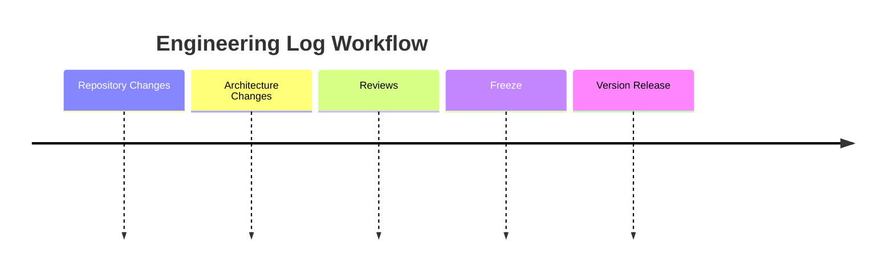

# AI-OS Project Engineering Log

> **Permanent engineering journal for the AI-OS project. Records architectural evolution, engineering activities, reviews, milestones, and documentation progress throughout the lifetime of AI-OS.**

---

## Table of Contents

1. [Purpose](#1-purpose)
2. [Engineering Log Principles](#2-engineering-log-principles)
3. [Entry Identification](#3-entry-identification)
4. [Engineering Timeline](#4-engineering-timeline)
5. [Session Templates](#5-session-templates)
6. [Architecture Progress](#6-architecture-progress)
7. [Repository Evolution](#7-repository-evolution)
8. [Milestone Tracking](#8-milestone-tracking)
9. [Review History](#9-review-history)
10. [Freeze History](#10-freeze-history)
11. [Freeze Readiness Gates](#11-freeze-readiness-gates)
12. [Engineering Dashboard](#12-engineering-dashboard)
13. [Engineering Metrics](#13-engineering-metrics)
14. [Future Sessions](#14-future-sessions)
15. [Cross References](#15-cross-references)

---

## 1. Purpose

### What PROJECT_LOG.md Is

This document is the **permanent engineering journal** for the AI-OS project. It serves as the authoritative chronological record of:

- Engineering session outcomes (architecture sessions, design meetings, research sessions)
- Architectural evolution and significant developments
- Review processes and their outcomes
- Milestone achievements and phase transitions
- Documentation and repository changes
- Freeze events and approval processes
- Engineering metrics and dashboard summaries

Each entry captures the *context, decisions, and outcomes* of engineering work as it happens, providing a narrative thread through the project's lifecycle.

### What Belongs in This Document

| Category | Content |
|----------|---------|
| **Engineering Sessions** | Summaries of architecture sessions, design meetings, research sessions, and review meetings — what was discussed, decided, and what action items resulted |
| **Architectural Evolution** | Major architectural developments, refinements, and directional changes (not individual decisions — those go in ADRs) |
| **Milestones** | Significant project achievements, phase transitions, and completion criteria |
| **Repository Changes** | Structural changes to the repository, documentation refactoring, folder reorganization |
| **Reviews** | Review sessions, findings, and corrective actions taken |
| **Freezes** | Document and code freeze events, their approval, scope, and outcomes |
| **Metrics** | Dashboard tables and engineering metrics tracking progress |

### What Does NOT Belong Here

| Content | Where It Belongs |
|---------|-----------------|
| Individual architectural decisions with context, trade-offs, and alternatives | [ARCHITECTURE_DECISIONS.md](/ARCHITECTURE_DECISIONS.md) |
| Version-specific changelog entries, release notes | [VERSION_HISTORY.md](/VERSION_HISTORY.md) |
| Future feature plans, release timelines, strategic goals | [ROADMAP.md](/ROADMAP.md) |
| Engineering principles, coding standards, practices | [ENGINEERING_PRINCIPLES.md](/ENGINEERING_PRINCIPLES.md) |
| Detailed technical specifications or implementation code | Appropriate architecture parts and codebase |

### Relationship with Other Documents

| Document | Relationship |
|----------|-------------|
| [ARCHITECTURE_DECISIONS.md](/ARCHITECTURE_DECISIONS.md) | Contains individual ADRs for specific architectural decisions. This log references ADRs for context but does not duplicate their content. |
| [VERSION_HISTORY.md](/VERSION_HISTORY.md) | Maintains version-specific changelogs. This log may reference versions for context but does not duplicate release notes. |
| [ROADMAP.md](/ROADMAP.md) | Contains future plans and strategic direction. This log references roadmap items when they become milestones but does not predict future work. |
| [AI_OS_MASTER_CONTEXT.md](/AI_OS_MASTER_CONTEXT.md) | Serves as the project overview. This log provides chronological detail that feeds into and references the master context. |

---

## 2. Engineering Log Principles

The engineering log must uphold these principles:

| Principle | Definition | Enforcement |
|-----------|------------|-------------|
| **Chronological** | Entries are recorded in the order they occur, maintaining a verifiable timeline of engineering activity | New entries appended at the end with dates |
| **Traceable** | Every decision, change, and action references its originating session, related ADRs, and affected documents | Cross-references required in every entry |
| **Immutable** | Once recorded, entries are never deleted or substantially rewritten — corrections are noted as amendments | Historical entries preserved with strikethrough or amendment notes |
| **Auditable** | All entries include participants, decisions made, action items, and related documents for full auditability | Standard entry format enforced |
| **Cross-referenced** | Entries link to ADRs, Version History, Roadmap, and Master Context as appropriate | Reference fields required in templates |
| **Evidence-based** | Decisions and findings are supported by data, artifacts, or documented evidence | Evidence required for decisions and findings |
| **Non-duplicative** | Content is referenced, not duplicated — this log points to canonical sources | Clear separation of concerns defined |

---

## 3. Entry Identification

All engineering log entries are assigned unique identifiers following the **LOG-YYYY-NNN** format:

- **LOG**: Prefix indicating an engineering log entry
- **YYYY**: Four-digit year of entry creation
- **NNN**: Sequential three-digit number within the year (001, 002, ...)

### Entry Numbering Scheme

| Entry Type | ID Prefix | Number Assignment |
|------------|-----------|-------------------|
| Daily Engineering Log | LOG-[YYYY]-[NNN] | Sequential |
| Architecture Session | LOG-[YYYY]-[NNN] | Sequential |
| Research Session | LOG-[YYYY]-[NNN] | Sequential |
| Design Meeting | LOG-[YYYY]-[NNN] | Sequential |
| Review Session | LOG-[YYYY]-[NNN] | Sequential |
| Freeze Event | LOG-[YYYY]-[NNN] | Sequential |
| Architecture Milestone | LOG-[YYYY]-[NNN] | Sequential |
| Retrospective | LOG-[YYYY]-[NNN] | Sequential |
| Repository Change | LOG-[YYYY]-[NNN] | Sequential |
| Release Preparation | LOG-[YYYY]-[NNN] | Sequential |

> **Example**: LOG-2026-001 would be the first entry created in 2026.

### ADR Integration

Engineering log entries can reference ADRs in four distinct ways:

| ADR Relationship | Description | Log Reference |
|------------------|-------------|---------------|
| **Created** | Entry resulted in a new ADR being created | "ADR Created: ADR-[NNN]" |
| **Updated** | Entry resulted in an existing ADR being modified | "ADR Updated: ADR-[NNN]" |
| **Referenced** | Entry references an existing ADR for context | "References: [ARCHITECTURE_DECISIONS.md](/ARCHITECTURE_DECISIONS.md#adr-[NNN]" |
| **Affected** | Entry describes impact on an existing ADR's applicability or validity | "ADR Affected: ADR-[NNN]" |

---

## 4. Engineering Timeline

The engineering timeline records session entries in chronological order. Each entry follows the standard entry format defined in [Section 5](#5-session-templates).

### Timeline Entry Types

| Type | Description | When Used |
|------|-------------|-----------|
| **Daily Engineering Log** | Daily summary of individual engineering activity | End of each engineering day |
| **Architecture Session** | Collaborative exploration of architectural options and decisions | When architectural direction is set or refined |
| **Research Session** | Investigation of technologies, approaches, or problems | When exploring alternatives or solving technical challenges |
| **Design Meeting** | Collaborative design work on components or systems | When designing user experiences, interfaces, or system designs |
| **Review Session** | Formal review of artifacts (code, architecture, documentation) | When artifacts require validation or quality assurance |
| **Freeze Event** | Document or code freeze approval and execution | When stability periods are established |
| **Architecture Milestone** | Achievement of significant architectural objectives | When major architectural targets are met |
| **Retrospective** | Post-phase or post-release lessons learned | When completing phases or releases |
| **Repository Change** | Structural or organizational repository changes | When repository organization changes |
| **Release Preparation** | Pre-release quality gates and approval | Before version releases |

### Timeline Structure

> **Note**: Timeline entries are appended below as engineering work progresses. Each entry must include a unique LOG-ID and follow the templates in Section 5.

```
## [YYYY-MM-DD] - [Entry Title]

**LOG-ID**: LOG-[YYYY]-[NNN]

**Type**: [Session Type]

**Participants**: [List of participants]

**Summary**: [2-3 sentence summary]

[Session-specific content — see templates in Section 5]
```

---

## 5. Session Templates

All session entries follow a consistent format with type-specific extensions. Each entry must include a **LOG-ID** in the header.

### Entry Header (All Sessions)

Every session entry begins with this header block:

```markdown
## [YYYY-MM-DD] - [Session Title]

**LOG-ID**: LOG-[YYYY]-[NNN]

**Type**: [Session Type]

**Participants**: [Name 1, Name 2, ...] or "Solo"

**Summary**: [2-3 sentence summary of what happened in this session]

**Tags**: [#tag1 #tag2]
```

#### Controlled Tags

| Category | Tags |
|----------|------|
| **Session Tags** | `#architecture-session`, `#research-session`, `#design-meeting`, `#review-session`, `#daily-log` |
| **Area Tags** | `#api`, `#agents`, `#council`, `#mcp`, `#memory`, `#parts`, `#workflow`, `#security`, `#observability` |
| **Status Tags** | `#completed`, `#in-progress`, `#blocked`, `#deferred`, `#approved`, `#rejected` |

### 5.1 Daily Engineering Log

```markdown
## [YYYY-MM-DD] - Daily Log

**LOG-ID**: LOG-[YYYY]-[NNN]

**Type**: Daily Engineering Log

**Participants**: [Name]

**Summary**: [Brief summary of today's work]

### Daily Log

**Date**: [YYYY-MM-DD]

**Worked On**:
- [Task or focus area 1]
- [Task or focus area 2]

**Progress Made**:
- [What was accomplished]
- [What was completed]

**Blockers / Issues**:
- [Any blockers encountered]
- [Unresolved issues]

**Decisions Made**:
- [Decision or choice made today, with rationale]

**Action Items**:
- [ ] [Follow-up action]

**Related Documents**:
- [Links to relevant ADRs, documents, or previous log entries]

**ADR Integration**:
- [Created/Updated/Referenced/Affected]: [ADR-[NNN] if applicable]
```

### 5.2 Architecture Session

```markdown
## [YYYY-MM-DD] - Architecture Session: [Topic]

**LOG-ID**: LOG-[YYYY]-[NNN]

**Type**: Architecture Session

**Participants**: [List of participants]

**Summary**: [Brief summary of the session outcome]

### Architecture Session

**Objective**: [What architectural question or decision this session addresses]

**Context**:
- [Background context for the discussion]
- [Constraints and requirements considered]

**Options Evaluated**:
1. **[Option Name]**: [Description]
   - Pros: [List]
   - Cons: [List]
2. **[Option Name]**: [Description]
   - Pros: [List]
   - Cons: [List]

**Decision**:
- [Decision made]: [Rationale]

**ADR Integration**:
- [Created/Updated/Referenced/Affected]: [ADR-[NNN] — [ARCHITECTURE_DECISIONS.md](/ARCHITECTURE_DECISIONS.md#adr-[NNN])]

**Action Items**:
- [ ] [Action 1] (Owner: [Name], Due: [YYYY-MM-DD])
- [ ] [Action 2] (Owner: [Name], Due: [YYYY-MM-DD])
```

### 5.3 Research Session

```markdown
## [YYYY-MM-DD] - Research Session: [Topic]

**LOG-ID**: LOG-[YYYY]-[NNN]

**Type**: Research Session

**Participants**: [List of participants]

**Summary**: [Brief summary of research outcome]

### Research Session

**Research Question**: [The question being investigated]

**Methodology**:
- [How the research was conducted]
- [Tools, benchmarks, or experiments used]

**Findings**:
- [Key findings from research]
- [Data, metrics, or evidence gathered]

**Evidence**:
- [Artifacts, benchmark results, or supporting data]

**Conclusion**:
- [Recommendation or next steps]
- [Link to related ADR if applicable]

**ADR Integration**:
- [Created/Updated/Referenced/Affected]: [ADR-[NNN] if applicable]
```

### 5.4 Design Meeting

```markdown
## [YYYY-MM-DD] - Design Meeting: [Topic]

**LOG-ID**: LOG-[YYYY]-[NNN]

**Type**: Design Meeting

**Participants**: [List of participants]

**Summary**: [Brief summary of design decisions]

### Design Meeting

**Scope**: [What is being designed]

**Attendees**: [Designers, engineers, product managers present]

**Design Discussed**:
- [Summary of design direction or proposal]
- [Key design decisions made]

**Design Rationale**:
- [Why certain choices were made]
- [Alternatives considered]

**Artifacts Produced**:
- [Diagrams, mockups, or specifications created]

**Action Items**:
- [ ] [Follow-up action] (Owner: [Name], Due: [YYYY-MM-DD])
```

### 5.5 Review Session

```markdown
## [YYYY-MM-DD] - Review Session: [Artifact]

**LOG-ID**: LOG-[YYYY]-[NNN]

**Type**: Review Session

**Participants**: [Reviewers and reviewees]

**Summary**: [Brief summary of review outcome]

### Review Session

**Review Type**: [Architecture Review | Code Review | Security Review | Documentation Review | Other]

**Artifact Under Review**: [Document name, code repository, or component]

**Reviewer(s)**: [Names of reviewers]

**Score**: [If scored — e.g., 8/10, Pass/Fail, or N/A]

**Review Criteria**:
- [Criteria or checklist used]

**Major Findings**:
| Priority | Finding | Location | Recommendation |
|----------|---------|----------|----------------|
| [Critical] | [Finding description] | [Location] | [Recommendation] |
| [High] | [Finding description] | [Location] | [Recommendation] |
| [Medium] | [Finding description] | [Location] | [Recommendation] |
| [Low] | [Finding description] | [Location] | [Recommendation] |

**Actions Taken**:
- [Actions taken in response to findings]

**Approval Status**: [Approved | Approved with conditions | Changes requested | Rejected]

**ADR Integration**:
- [Created/Updated/Referenced/Affected]: [ADR-[NNN] if applicable]

**Follow-up Reviews**:
- [ ] [Next review scheduled or needed]
```

### 5.6 Freeze Event

```markdown
## [YYYY-MM-DD] - Freeze Event: [Scope]

**LOG-ID**: LOG-[YYYY]-[NNN]

**Type**: Freeze Event

**Participants**: [Decision makers and stakeholders]

**Summary**: [Brief summary of freeze approval]

### Freeze Event

**Freeze Type**: [Code Freeze | Feature Freeze | Documentation Freeze | Security Freeze | Performance Freeze | Other]

**Scope**: [Documents, components, or repositories covered by this freeze]

**Justification**:
- [Why the freeze is being implemented]
- [Risks being mitigated]

**Approval**:
- **Requested By**: [Name and role]
- **Approved By**: [Name and role]
- **Date**: [YYYY-MM-DD]
- **Exceptions**: [Approved exceptions, if any]

**Duration**:
- **Start**: [YYYY-MM-DD HH:MM]
- **End**: [YYYY-MM-DD HH:MM]

**Documents**:
- [List of documents or components under freeze]

**Monitoring Plan**:
- [How compliance was tracked during the freeze]

**Lift Criteria**:
- [What conditions were met to lift the freeze]

**Outcome**:
- [Summary of what was accomplished during the freeze period]
```

### 5.7 Architecture Milestone

```markdown
## [YYYY-MM-DD] - Architecture Milestone: [Name]

**LOG-ID**: LOG-[YYYY]-[NNN]

**Type**: Architecture Milestone

**Participants**: [Team members achieving the milestone]

**Summary**: [Brief summary of milestone achievement]

### Architecture Milestone

**Milestone Name**: [Descriptive name]

**Objective**: [What the milestone achieves]

**Description**: [Detailed description of the milestone]

**Related Architecture Parts**:
- [Part name and reference]

**Completion Criteria**:
- [ ] [Criterion 1]
- [ ] [Criterion 2]
- [ ] [Criterion 3]

**Evidence of Completion**:
- [Evidence, links, or test results confirming completion]

**ADR Integration**:
- [Created/Updated/Referenced/Affected]: [List of ADRs related to this milestone]

**Status**: [Completed]

**Completion Date**: [YYYY-MM-DD]

**Lessons Learned**:
- [What went well]
- [What could be improved]

**Next Milestone**: [Brief description of what comes next]
```

### 5.8 Retrospective

```markdown
## [YYYY-MM-DD] - Retrospective: [Scope]

**LOG-ID**: LOG-[YYYY]-[NNN]

**Type**: Retrospective

**Participants**: [Team members participating]

**Summary**: [Brief summary of retrospective outcomes]

### Retrospective

**Scope**: [Phase, release, or period being reviewed]

**What Went Well**:
- [Positive outcomes or practices to continue]

**What Didn't Go Well**:
- [Issues, problems, or practices to improve]

**Root Causes**:
- [Analysis of underlying causes]

**Action Items**:
- [ ] [Improvement action] (Owner: [Name], Due: [YYYY-MM-DD])

**Insights**:
- [Key takeaways that should inform future work]
```

### 5.9 Repository Change

```markdown
## [YYYY-MM-DD] - Repository Change: [Change Type]

**LOG-ID**: LOG-[YYYY]-[NNN]

**Type**: Repository Change

**Participants**: [Team members involved]

**Summary**: [Brief summary of repository change]

### Repository Change

**Change Type**: [Restructuring | Addition | Removal | Renaming | Refactoring]

**Summary**: [Brief description of the change]

**Before**:
```
[Directory structure before change]
```

**After**:
```
[Directory structure after change]
```

**Rationale**: [Why this change was made]

**Impact**:
- [Who or what is affected]
- [Migration steps or commands needed]

**Related Issues/Tickets**: [Links to relevant tickets]
```

### 5.10 Release Preparation

```markdown
## [YYYY-MM-DD] - Release Preparation: [Version]

**LOG-ID**: LOG-[YYYY]-[NNN]

**Type**: Release Preparation

**Participants**: [Release team members]

**Summary**: [Brief summary of release readiness]

### Release Preparation

**Target Version**: [Version number]

**Release Manager**: [Name]

**Feature Completeness**:
| Feature | Status | Notes |
|---------|--------|-------|
| [Feature 1] | [Complete/In Progress/Not Started] | [Notes] |

**Known Issues**:
| Issue | Severity | Workaround | Targeted Fix |
|-------|----------|------------|--------------|
| [Issue 1] | [Severity] | [Workaround] | [Fix timeline] |

**Quality Gates**:
| Gate | Status | Evidence |
|------|--------|----------|
| [Test suite passes] | [Pass/Fail] | [Link to results] |
| [Security scan clean] | [Pass/Fail] | [Link to scan] |
| [Documentation complete] | [Pass/Fail] | [Link to docs] |

**Deployment Plan**:
1. [Step 1]
2. [Step 2]
3. [Rollback procedure]

**Approval**:
- **Go/No-Go**: [Decision]
- **Approver**: [Name]
- **Date**: [YYYY-MM-DD]
```

---

## 6. Architecture Progress

### 6.1 Architecture Parts Tracking

| Part | Title | Status | Progress | Last Updated | Related ADRs |
|------|-------|--------|----------|--------------|--------------|
| *Populated from Architecture Specification* | | | | | |

### 6.2 Project Knowledge Tracking

| Document | Category | Status | Last Updated | Maintainer |
|----------|----------|--------|--------------|------------|
| ARCHITECTURE_DECISIONS.md | ADRs | Maintained | [YYYY-MM-DD] | Architecture Team |
| VERSION_HISTORY.md | Release Notes | Maintained | [YYYY-MM-DD] | Release Team |
| ROADMAP.md | Planning | Maintained | [YYYY-MM-DD] | Product Team |
| AI_OS_MASTER_CONTEXT.md | Overview | Maintained | [YYYY-MM-DD] | Documentation Lead |
| ENGINEERING_PRINCIPLES.md | Standards | Maintained | [YYYY-MM-DD] | Engineering Team |
| This Document (PROJECT_LOG.md) | Engineering Journal | Active | [YYYY-MM-DD] | Documentation Lead |
| *Additional rows as documents are added* | | | | |

### 6.3 Templates Inventory

| Template | Purpose | Status | Last Updated |
|----------|---------|--------|--------------|
| Daily Log | Daily engineering activity recording | Active | [YYYY-MM-DD] |
| Architecture Session | Architecture decision sessions | Active | [YYYY-MM-DD] |
| Research Session | Technology investigation sessions | Active | [YYYY-MM-DD] |
| Design Meeting | Collaborative design work | Active | [YYYY-MM-DD] |
| Review Session | Artifact review processes | Active | [YYYY-MM-DD] |
| Freeze Event | Document/code freeze tracking | Active | [YYYY-MM-DD] |
| Architecture Milestone | Milestone achievement tracking | Active | [YYYY-MM-DD] |
| Retrospective | Post-phase/post-release reflection | Active | [YYYY-MM-DD] |
| Repository Change | Repository structure changes | Active | [YYYY-MM-DD] |
| Release Preparation | Release readiness tracking | Active | [YYYY-MM-DD] |

### 6.4 Diagram Status

| Diagram | Description | Status | Completeness | Last Updated |
|---------|-------------|--------|--------------|--------------|
| *Populated from Architecture Specification* | | | | |

### 6.5 Research Documents

| Document | Area | Status | Date Initiated | Lead Researcher |
|----------|------|--------|-----------------|-----------------|
| *Populated as research documents are created* | | | | |

### 6.6 Review Status

| Review ID | Artifact | Reviewer | Type | Status | Date | Findings Count |
|-----------|----------|----------|------|--------|------|----------------|
| *Populated as reviews are conducted* | | | | | | |

### 6.7 Freeze Status

| Freeze ID | Scope | Freeze Type | Status | Start Date | End Date | Approved By |
|-----------|-------|-------------|--------|------------|----------|-------------|
| *Populated as freezes are enacted* | | | | | | |

---

## 7. Repository Evolution

### 7.1 Repository Restructuring Log

| Date | Change Type | Description | Before → After | Impact |
|------|-------------|-------------|----------------|--------|
| *Populated as repository changes occur* | | | | |

### 7.2 Folder Addition Log

| Date | Folder | Purpose | Parent Directory |
|------|--------|---------|------------------|
| *Populated as folders are added* | | | |

### 7.3 File Addition Log

| Date | File | Purpose | Part of |
|------|------|---------|---------|
| *Populated as files are added* | | | |

### 7.4 File Removal Log

| Date | File Removed | Reason | Replacement |
|------|--------------|--------|-------------|
| *Populated as files are removed* | | | |

### 7.5 Naming Change Log

| Date | Before | After | Reason |
|------|--------|-------|--------|
| *Populated as renames occur* | | | |

### 7.6 Documentation Refactoring Log

| Date | Documents Affected | Change Description | Impact |
|------|---------------------|-------------------|--------|
| *Populated as documentation is refactored* | | | |

---

## 8. Milestone Tracking

### 8.1 Milestone Registry

| Milestone Name | Objective | Status | Target Date | Completion Date | Related Parts | Related ADRs |
|----------------|-----------|--------|-------------|------------------|---------------|--------------|
| *Populated as milestones are defined* | | | | | | |

### 8.2 Milestone Template

When defining a new milestone, use this structure:

```markdown
#### [Milestone Name]

**Milestone ID**: MILESTONE-[YYYY]-[NNN]

**Objective**: [What this milestone achieves]

**Description**: [Detailed description of the milestone]

**Related Architecture Parts**:
- [Part name and reference]

**Related ADRs**:
- [ADR number and link]

**Completion Criteria**:
- [ ] [Criterion 1]
- [ ] [Criterion 2]
- [ ] [Criterion 3]

**Status**: [Planned | In Progress | Completed | Blocked]

**Target Completion Date**: [YYYY-MM-DD]

**Actual Completion Date**: [YYYY-MM-DD when completed]
```

---

## 9. Review History

### 9.1 Review Registry

| Review ID | Artifact | Reviewer | Review Type | Score | Date | Status |
|-----------|----------|----------|-------------|-------|------|--------|
| *Populated as reviews are conducted* | | | | | | |

### 9.2 Review Record Template

When recording a review, use this structure:

```markdown
#### [YYYY-MM-DD] Review #[NNN]

**Review ID**: REV-[YYYY]-[NNN]

**Artifact Under Review**: [Document name, code repository, or component]

**Review Type**: [Architecture Review | Code Review | Security Review | Documentation Review | Other]

**Reviewer(s)**: [Names and roles]

**Score**: [If scored — e.g., 8/10, Pass/Fail, or N/A]

**Review Date**: [YYYY-MM-DD]

**Review Criteria**:
[List of criteria or checklist items used]

**Major Findings**:
| Priority | Finding | Location | Recommendation |
|----------|---------|----------|----------------|
| [Critical] | [Finding description] | [Location] | [Recommendation] |
| [High] | [Finding description] | [Location] | [Recommendation] |
| [Medium] | [Finding description] | [Location] | [Recommendation] |
| [Low] | [Finding description] | [Location] | [Recommendation] |

**Actions Taken**:
- [Actions taken in response to findings]

**Approval Status**: [Approved | Approved with conditions | Changes requested | Rejected]

**ADR Integration**:
- [Created/Updated/Referenced/Affected]: [ADR-[NNN] if applicable]

**Related Documents**:
- [Links to related artifacts]
```

---

## 10. Freeze History

### 10.1 Freeze Registry

| Freeze ID | Scope | Freeze Type | Status | Start Date | End Date | Approved By |
|-----------|-------|-------------|--------|------------|----------|-------------|
| *Populated as freezes are enacted* | | | | | | |

### 10.2 Freeze Record Template

When recording a freeze, use this structure:

```markdown
#### [YYYY-MM-DD] Freeze #[NNN]

**Freeze ID**: FREEZE-[YYYY]-[NNN]

**Freeze Type**: [Code Freeze | Feature Freeze | Documentation Freeze | Security Freeze | Performance Freeze | Other]

**Scope**: [Documents, components, or repositories covered by this freeze]

**Justification**: [Reason for the freeze]

**Approval**:
- **Requested By**: [Name and role]
- **Approved By**: [Name and role]
- **Date**: [YYYY-MM-DD]
- **Approval Reference**: [Meeting minutes, ticket reference, etc.]

**Documents**:
[List of documents or components under freeze]

**Duration**:
- **Start**: [YYYY-MM-DD HH:MM]
- **End**: [YYYY-MM-DD HH:MM]
- **Notes**: [Any extensions or early lifts]

**Monitoring**:
[How compliance was tracked during the freeze]

**Lift Criteria**:
[What conditions were met to lift the freeze]

**Outcome**:
[Summary of what was accomplished during the freeze period]
```

---

## 11. Freeze Readiness Gates

Before a freeze can be approved, the following gates must pass:

### 11.1 Documentation Gate

| Requirement | Status | Evidence |
|-------------|--------|----------|
| All relevant architecture parts are documented | [Pass/Fail] | |
| Cross-references to ADRs are complete | [Pass/Fail] | |
| Master Context is updated | [Pass/Fail] | |
| Roadmap reflects current status | [Pass/Fail] | |

### 11.2 Review Gate

| Requirement | Status | Evidence |
|-------------|--------|----------|
| All required reviews are completed | [Pass/Fail] | |
| All findings are addressed or documented | [Pass/Fail] | |
| No critical or high-priority findings remain open | [Pass/Fail] | |

### 11.3 Consistency Gate

| Requirement | Status | Evidence |
|-------------|--------|----------|
| Terminology is consistent across documents | [Pass/Fail] | |
| Cross-references are valid and non-broken | [Pass/Fail] | |
| No conflicting decisions exist | [Pass/Fail] | |

### 11.4 Cross References Gate

| Requirement | Status | Evidence |
|-------------|--------|----------|
| Project Log references all relevant ADRs | [Pass/Fail] | |
| ADRs reference this log where applicable | [Pass/Fail] | |
| Version History references completed milestones | [Pass/Fail] | |

### 11.5 Mermaid Validation Gate

| Requirement | Status | Evidence |
|-------------|--------|----------|
| All Mermaid diagrams render correctly | [Pass/Fail] | |
| Diagram content matches specification | [Pass/Fail] | |
| No syntax errors in diagrams | [Pass/Fail] | |

### 11.6 RFC 2119 Compliance Gate

| Requirement | Status | Evidence |
|-------------|--------|----------|
| Requirement keywords (MUST, MUST NOT, SHOULD, SHOULD NOT, MAY) are used correctly | [Pass/Fail] | |
| No ambiguous requirements in frozen areas | [Pass/Fail] | |

### 11.7 Publication Gate

| Requirement | Status | Evidence |
|-------------|--------|----------|
| All documents are publish-ready | [Pass/Fail] | |
| No placeholder content remains | [Pass/Fail] | |
| Document structure is complete | [Pass/Fail] | |

### 11.8 Versioning Gate

| Requirement | Status | Evidence |
|-------------|--------|----------|
| Version numbers are consistent across documents | [Pass/Fail] | |
| Freeze target version is identified | [Pass/Fail] | |

---

## 12. Engineering Dashboard

### 12.1 Summary Overview

> **Dashboard Status**: Last Updated [YYYY-MM-DD]

| Metric | Count | Target | Status |
|--------|-------|--------|--------|
| Total Architecture Parts | *TBD* | *TBD* | *—* |
| Completed Parts | *TBD* | *TBD* | *—* |
| Frozen Parts | *TBD* | *TBD* | *—* |
| Project Knowledge Documents | *TBD* | *TBD* | *—* |
| Templates | *TBD* | *TBD* | *—* |
| Research Documents | *TBD* | *TBD* | *—* |
| Diagrams | *TBD* | *TBD* | *—* |
| ADRs (Total) | *TBD* | *TBD* | *—* |
| ADRs (Created via this Log) | *TBD* | *TBD* | *—* |
| Reviews Conducted | *TBD* | *TBD* | *—* |
| Pending Action Items | *TBD* | *TBD* | *—* |

### 12.2 Documentation Status

| Document | Status | Health |
|----------|--------|--------|
| AI_OS_MASTER_CONTEXT.md | Maintained | [Status indicator] |
| ARCHITECTURE_DECISIONS.md | Maintained | [Status indicator] |
| VERSION_HISTORY.md | Maintained | [Status indicator] |
| ROADMAP.md | Maintained | [Status indicator] |
| ENGINEERING_PRINCIPLES.md | Maintained | [Status indicator] |
| PROJECT_LOG.md | Active | [Status indicator] |
| *Additional documents* | | |

---

## 13. Engineering Metrics

### 13.1 Documentation Completion

| Category | Total | Complete | In Progress | Not Started | Completion % |
|----------|-------|----------|-------------|-------------|--------------|
| Project Knowledge Docs | *TBD* | *TBD* | *TBD* | *TBD* | *TBD*% |
| Templates | *TBD* | *TBD* | *TBD* | *TBD* | *TBD*% |
| Diagrams | *TBD* | *TBD* | *TBD* | *TBD* | *TBD*% |
| Research Docs | *TBD* | *TBD* | *TBD* | *TBD* | *TBD*% |

### 13.2 Architecture Coverage

| Metric | Current | Target | Gap |
|--------|---------|--------|-----|
| Parts with ADRs | *TBD* | *TBD* | *TBD* |
| Parts with Diagrams | *TBD* | *TBD* | *TBD* |
| Parts with Tests | *TBD* | *TBD* | *TBD* |
| Cross-referenced Parts | *TBD* | *TBD* | *TBD* |

### 13.3 Review Completion

| Period | Reviews Scheduled | Reviews Completed | Completion Rate |
|--------|-------------------|-------------------|-----------------|
| Current Quarter | *TBD* | *TBD* | *TBD*% |

### 13.4 Cross-Reference Coverage

| Source Document | References To | Coverage |
|-----------------|---------------|----------|
| This Log → ADRs | *TBD* | *TBD*% |
| This Log → Version History | *TBD* | *TBD*% |
| This Log → Roadmap | *TBD* | *TBD*% |
| ADRs → This Log | *TBD* | *TBD*% |
| Version History → This Log | *TBD* | *TBD*% |
| Roadmap → This Log | *TBD* | *TBD*% |

### 13.5 Freeze Readiness

| Metric | Current | Target |
|--------|---------|--------|
| Open Action Items | *TBD* | 0 |
| Open Reviews | *TBD* | 0 |
| Pending ADRs | *TBD* | *TBD* |
| Ready for Freeze | TBD | *TBD* |

---

## 14. Future Sessions

This section contains placeholders for upcoming engineering sessions. As sessions are scheduled, they should be logged here and then moved to the [Engineering Timeline](#4-engineering-timeline) section upon completion.

### Scheduled Sessions

| Date | Session Type | Topic | Owner | Status |
|------|-------------|-------|-------|--------|
| *Populated as sessions are scheduled* | | | | |

### Session Pipeline

| Priority | Proposed Topic | Estimated Date | Lead |
|----------|----------------|----------------|------|
| *Populated as topics are proposed* | | | |

---

## 15. Cross References

### Core Documentation

| Document | Purpose | Reference |
|----------|---------|-----------|
| AI_OS_MASTER_CONTEXT.md | Master index and overview of all AI-OS documentation | Cross-reference point for all documentation |
| ARCHITECTURE_DECISIONS.md | All Architecture Decision Records (ADRs) | Canonical source for architectural decisions |
| VERSION_HISTORY.md | Changelog and release notes by version | Canonical source for release history |
| ROADMAP.md | Future plans and strategic direction | Canonical source for project direction |
| ENGINEERING_PRINCIPLES.md | Engineering standards and best practices | Governing principles for all engineering work |

### Architecture Parts 1–15

The AI-OS Architecture Specification is organized into Parts 1 through 15. The engineering log references these parts as architectural elements evolve:

| Part | Category | Log Integration |
|------|----------|-----------------|
| Part 1 | Overview & Introduction | Referenced for project context |
| Part 2 | Engineering Principles | Referenced for standards compliance |
| Part 3 | Repository Structure | Referenced for repository changes |
| Part 4 | Architecture Decisions | Cross-referenced via ADRs |
| Part 5 | Version History | Referenced for version context |
| Part 6 | Roadmap | Referenced for milestone context |
| Parts 7–15 | System Architecture (Overall, Agent, Council, MCP, Memory, Parts, Workflow) | Tracked in Architecture Progress tables |

> **Note**: Refer to the Architecture Specification for detailed mapping of Parts to documentation files.

---

## Engineering Workflow

The diagram below illustrates the relationship between repository changes, architecture changes, reviews, freezes, and version releases within the engineering log:



---

## Maintenance

This document is maintained per the **Engineering Log Principles** defined in Section 2.

| Role | Responsibility |
|------|----------------|
| **Documentation Lead** | Overall document maintenance, quality, and principle enforcement |
| **Engineering Lead** | Ensuring technical accuracy of entries |
| **Architecture Lead** | Ensuring architectural decisions are captured and linked to ADRs |
| **Project Manager** | Ensuring milestones and freezes are recorded |

---

*This document is maintained as part of the AI-OS project documentation. Last updated: [YYYY-MM-DD].*
