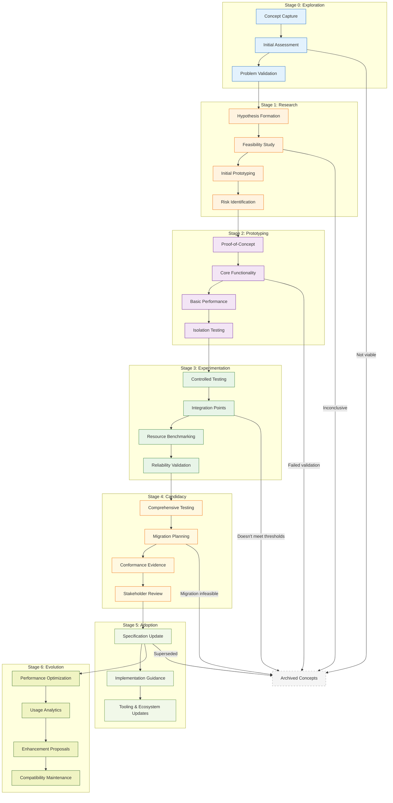
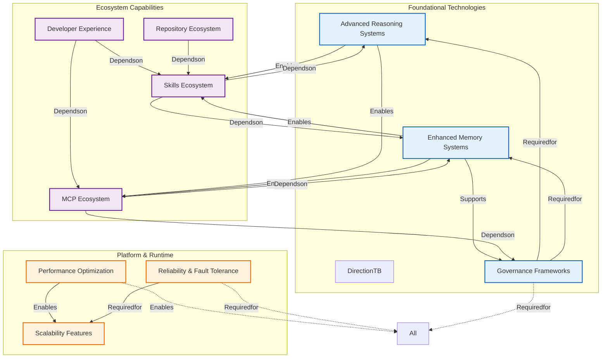
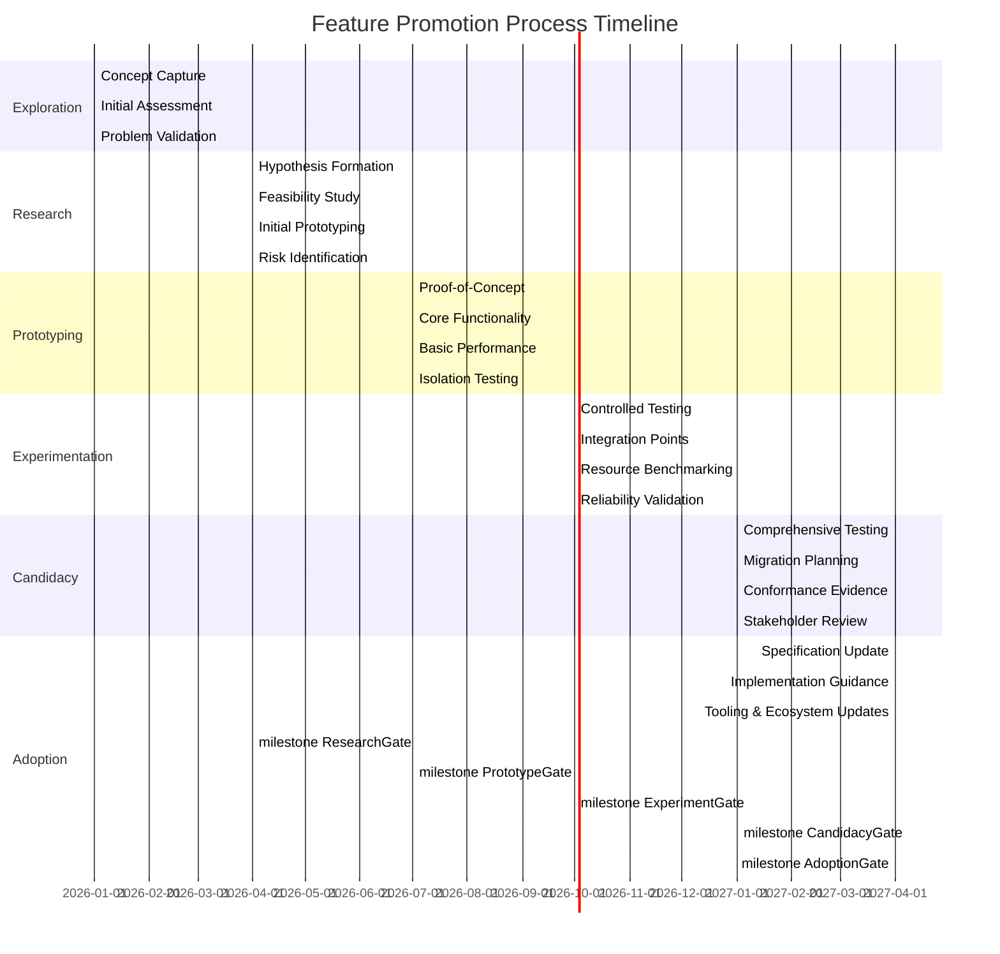

# Future Features Research

## Document Metadata

- **Owner**: AI-OS Architecture Research Team
- **Status**: ACTIVE - Research Backlog
- **Version**: 1.2.0
- **Last Review**: 2026-08-07
- **Next Review**: 2026-11-07
- **Review Cadence**: Quarterly
- **Dependencies**: 
  - [[ENGINEERING_PRINCIPLES.md]]
  - [[AI_OS_MASTER_CONTEXT.md]]
  - [[ARCHITECTURE_DECISIONS.md]]
  - [[VALIDATION_ARCHITECTURE.md]]
- **Referenced By**: 
  - [[ROADMAP.md]]
  - [[GOVERNANCE.md]]
  - [[SKILLS_FRAMEWORK.md]]
  - [[MCP_SPECIFICATION.md]]

## Purpose

Document possible future capabilities for AI-OS. This document serves as a research backlog for potential enhancements and does not define current architecture. Nothing in this document is approved for implementation. It follows the specification/implementation separation principle from [[ENGINEERING_PRINCIPLES.md#specificationimplementation-separation-for-technological-neutrality|Specification/Implementation Separation]].

## Research Maturity Model

AI-OS employs a rigorous, evidence-based maturity model for evaluating future capabilities. This model ensures that only well-vetted, architecturally sound innovations progress toward adoption while maintaining technological neutrality and architectural integrity.

### Seven-Stage Maturity Framework

| Stage | Definition | Evidence Requirements | Gate Criteria | Exit Conditions |
|-------|------------|----------------------|---------------|-----------------|
| **0: Exploration** | Initial concept identification with minimal validation | Idea description, motivation, potential value, preliminary literature scan | Clear problem statement, initial value hypothesis, basic feasibility indication | Concept fails to address validated problem space or lacks minimal viability |
| **1: Research** | Active investigation with defined hypotheses | Literature review, feasibility studies, initial prototypes, hypothesis formulation | Reproducible results, preliminary risk assessment, success criteria definition | Hypotheses disproven, infeasible within constraints, or insufficient preliminary evidence |
| **2: Prototyping** | Working proof-of-concept in isolated environments | Functional demonstration, basic performance metrics, architecture sketch | Defined success criteria met, initial architecture impact assessed, resource estimates | Failure to demonstrate core functionality, prohibitive resource requirements, or architectural incompatibility |
| **3: Experimentation** | Controlled testing in realistic scenarios | Success/failure metrics, resource utilization data, integration points identified, reliability indicators | Meets predefined thresholds, architectural compatibility shown, preliminary migration path | Failure to meet performance/reliability thresholds, unacceptable architectural impact, or integration infeasibility |
| **4: Candidacy** | Comprehensive validation with migration planning | Conformance evidence, detailed migration path, resource benchmarks, security assessment | ARB promotion review passed, stakeholder feedback incorporated, resource commitment | Migration infeasible, non-conformance with principles, prohibitive costs, or unresolved security concerns |
| **5: Adoption** | Approved for architectural specification | Formal specification update, implementation guidelines, conformance test suite | Included in next specification version, tooling updated, training materials ready | Superseded by better approach, architectural obsolescence, or community rejection |
| **6: Evolution** | Continuous improvement and optimization | Performance benchmarks, usage metrics, enhancement proposals, compatibility maintenance | Regular specification updates, backward compatibility maintained, community adoption | Technology obsolescence, principle evolution requiring replacement, or superior alternative emergence |

*Note: This model extends the previous six-level system with explicit evolution stage and enhanced exit criteria for continuous architecture governance.*

## Feature Lifecycle & Progression

Features progress through a gated lifecycle that maintains architectural integrity while enabling innovation. Each stage includes specific evaluation criteria, formal review processes, and defined time horizons for different research categories.

### Lifecycle Visualization



## Architecture Impact Assessment

Each feature undergoes systematic evaluation of its potential impact on AI-OS architectural components, principles, and invariants. Impact levels inform resource allocation and review depth requirements.

### Impact Levels & Criteria

| Impact Level | Definition | Architectural Scope | Review Requirements |
|--------------|------------|-------------------|---------------------|
| **None** | No architectural changes required | Extension point usage only | Team-level review |
| **Low** | Extension point enhancements, principle refinements | Specific extension points, localized principle clarifications | Working group review |
| **Medium** | Platform layer modifications, principle evolutions | Multiple extension points, principle interpretations | Architecture Working Group + ARB consultation |
| **High** | Kernel or specification changes, principle evolution | Core components, fundamental principles | Full ARB review, specification update required |
| **Transformative** | Architectural paradigm shift | Multiple core components, principle redefinition | Special ARB committee, community referendum |

### Impact Assessment Framework

Architectural impact is evaluated across five dimensions:

1. **Kernel Impact**: Changes to Hermes Kernel components or invariants
2. **Principle Alignment**: Consistency with or evolution of engineering principles
3. **Interface Stability**: Effect on extension point contracts and backward compatibility
4. **Resource Model**: Changes to resource allocation, quotas, or management
5. **Governance Effects**: Influence on oversight mechanisms or decision processes

## Research Priority Indicators

Priority levels are determined through a multi-factor analysis and reviewed quarterly by the Architecture Research Team. The framework ensures balanced consideration of strategic, technical, and operational factors.

### Priority Determination Matrix

| Factor | Weight | High (3) | Medium (2) | Low (1) | Scoring Guidelines |
|--------|--------|----------|------------|---------|-------------------|
| Strategic Alignment | 30% | Directly advances [[AI_OS_MASTER_CONTEXT.md#long-term-vision|Long-Term Vision]] | Partially aligned with vision | Exploratory, uncertain alignment | Based on explicit vision mapping and principle evolution potential |
| Potential Impact | 25% | High architectural/user value | Moderate value demonstration | Limited or uncertain value | Quantified through user studies, performance projections, or architectural benefit analysis |
| Resource Feasibility | 20% | Achievable with current resources | Requires modest resource adjustment | Significant resource investment needed | Based on current team capacity, budget availability, and skill set assessment |
| Risk Mitigation | 15% | Clear mitigation paths | Manageable risks with plans | High uncertainty, unclear mitigation | Evaluated through risk assessment completeness and mitigation strategy viability |
| Ecosystem Readiness | 10% | Compatible with current ecosystems | Requires ecosystem evolution | Necessitates ecosystem transformation | Assessed through compatibility testing, migration complexity, and community readiness |

**Priority Score Calculation**: (Σ(Factor Score × Weight)) → Priority Level
- **High (H)**: 2.5-3.0
- **Medium (M)**: 1.5-2.4  
- **Low (L)**: 1.0-1.4

### Current Priority Distribution

| Priority Level | Research Areas | Characteristics | Typical Horizon |
|----------------|----------------|-----------------|-----------------|
| **High Priority** | Advanced Reasoning Systems, Memory Security & Privacy, Ethical AI Frameworks, Secure Distribution Channels | Critical to core vision, high architectural impact, well-defined benefits | Long-Term to Moonshot |
| **Medium Priority** | Most Runtime Features, Skills Ecosystem enhancements, MCP protocol improvements | Important capabilities, moderate architectural impact, clear implementation paths | Near-Term to Medium-Term |
| **Low Priority** | Exploratory concepts, high-risk/high-reward ideas, resource-intensive proposals | Speculative or resource-intensive, uncertain alignment, requires validation | Variable (often Long-Term+) |

### Priority Refinement Process

Priorities undergo continuous refinement through:
1. **Quantitative Scoring**: Quarterly application of the Priority Determination Matrix
2. **Qualitative Review**: Expert assessment of emerging trends and unexpected developments
3. **Dependency Analysis**: Adjustment based on blocking/enabling relationships
4. **Resource Reconciliation**: Alignment with available capacity and budget constraints
5. **Horizon Balancing**: Ensuring appropriate distribution across research timeframes

## Feature Dependencies & Relationships

Understanding interdependencies helps sequence research efforts and identify enabling capabilities.

### Dependency Visualization



## Risks & Mitigation Strategies

Each research area includes systematic risk assessment with corresponding mitigation approaches.

### Risk Categories & Frameworks

| Risk Type | Definition | Assessment Approach | Mitigation Strategies |
|-----------|------------|-------------------|----------------------|
| **Technical Feasibility** | Uncertainty in achieving desired capabilities | Proof-of-concept requirements, feasibility studies | Incremental prototyping, fallback approaches |
| **Architectural Integrity** | Potential violation of core principles/invariants | Impact analysis against [[ENGINEERING_PRINCIPLES.md#architectural-invariants|Architectural Invariants]] | Architectural spike solutions, principle evolution paths |
| **Resource Exhaustion** | Unexpected consumption of system resources | Resource benchmarking, quota analysis | Adaptive resource management, circuit breakers |
| **Ecosystem Fragmentation** | Incompatible extensions causing community divergence | Compatibility testing, standardization efforts | Clear versioning, migration paths, governance models |
| **Security Vulnerability** | Introduction of exploitable weaknesses | Threat modeling, penetration testing | Defense-in-depth, secure by design principles |
| **Operational Complexity** | Increased difficulty in system management | Complexity analysis, operational testing | Progressive disclosure, automation investment |
| **Strategic Misalignment** | Drift from long-term vision and goals | Quarterly vision alignment review | Vision checkpoint metrics, course correction mechanisms |

### Group-Specific Risk Profiles

#### AI Features
- **Primary Risk**: Unpredictable behavior in advanced reasoning systems
- **Mitigation**: Sandboxed evaluation with gradual capability escalation
- **Unknown**: Long-term stability of continuous learning in autonomous contexts
- **Mitigation**: Knowledge validation checkpoints, rollback mechanisms

#### Runtime Features
- **Primary Risk**: Performance optimizations compromising determinism
- **Mitigation**: Deterministic mode toggles, benchmark-driven development
- **Unknown**: Optimal resource allocation for heterogeneous AI workloads
- **Mitigation**: Adaptive quotas with predictive scaling

#### Memory Features
- **Primary Risk**: Memory consolidation interfering with real-time operations
- **Mitigation**: Hierarchical access with priority-based preemption
- **Unknown**: Optimal decay functions for different knowledge types
- **Mitigation**: Configurable decay policies with A/B testing

#### Governance Features
- **Primary Risk**: Over-governance reducing agent effectiveness
- **Mitigation**: Configurable governance levels with measurable outcomes
- **Unknown**: Balance between automated oversight and human judgment
- **Mitigation**: Escalation frameworks with measurable trigger points

## Decision Criteria for Promotion to Architecture

Before advancing from Candidacy to Adoption, features must satisfy comprehensive criteria across multiple dimensions.

### Technical Criteria Checklist

- [ ] Demonstrated conformance with [[ENGINEERING_PRINCIPLES.md#architectural-invariants|Architectural Invariants]]
- [ ] Clear, validated migration path from current implementations
- [ ] Resource consumption within established quotas and limits
- [ ] Compatibility with existing extension point contracts (or explicit evolution plan)
- [ ] Performance benchmarks meet or exceed defined baselines
- [ ] Reliability metrics (MTBF, MTTR) satisfy operational requirements
- [ ] Security assessment completed with identified vulnerabilities mitigated

### Process Criteria Checklist

- [ ] Architecture Review Board (ARB) formal review completion with approval
- [ ] Documentation of decision rationale following [[ENGINEERING_PRINCIPLES.md#decision-making-principles|Decision Making Principles]]
- [ ] Update to [[ROADMAP.md]] with estimated implementation timeline
- [ ] Community feedback incorporation (for ecosystem-affecting features)
- [ ] Validation evidence package submitted and reviewed
- [ ] Implementation guidance draft completed for ecosystem consumers

### Strategic Criteria Checklist

- [ ] Alignment with [[AI_OS_MASTER_CONTEXT.md#long-term-vision|Long-Term Vision]]
- [ ] Resource investment justification with expected return analysis
- [ ] Risk mitigation plan completion for all identified high/medium risks
- [ ] Compliance with [[ENGINEERING_PRINCIPLES.md#evolution-principles|Evolution Principles]]
- [ ] Competitive analysis (where applicable) completed
- [ ] Ecosystem impact assessment finished with community communication plan

## Promotion Process & Timeline

The journey from research to architectural adoption follows a structured, time-boxed process.

### Stage Transition Timeline



### Gate Review Process

Each transition between stages requires successful completion of a formal gate review:

1. **Exploration → Research**: Concept ValidationGate (Team-level)
   - Problem statement clarity
   - Initial value proposition
   - Basic feasibility indication

2. **Research → Prototyping**: FeasibilityGate (Working Group)
   - Reproducible research results
   - Risk assessment completion
   - Initial prototyping success

3. **Prototype → Experimentation**: PrototypeGate (Architecture Working Group)
   - Core functionality demonstration
   - Basic performance metrics
   - Architecture impact assessment

4. **Experimentation → Candidacy**: ExperimentGate (Architecture Review Board)
   - Controlled testing success
   - Resource utilization validation
   - Integration point identification
   - Preliminary migration path

5. **Candidacy → Adoption**: PromotionGate (Full ARB + Community Review)
   - Comprehensive validation evidence
   - Detailed migration planning
   - Conformance with architectural principles
   - Stakeholder feedback incorporation
   - Resource investment approval

## Feature Roadmap

Research activities are organized across temporal horizons to balance immediate needs with long-term vision. Each horizon has distinct characteristics, governance approaches, and success metrics.

### Research Horizon Framework

AI-OS research spans four temporal horizons, each with different risk profiles, resource commitments, and architectural implications:

| Horizon | Timeframe | Characteristics | Resource Commitment | Risk Profile | Success Metrics |
|---------|-----------|-----------------|-------------------|--------------|-----------------|
| **Near-Term** | 0-6 months | Immediate opportunities, low-risk enhancements, quick wins | Existing team capacity, minimal new resources | Low technical risk, high confidence | Feature completion, measurable improvements |
| **Medium-Term** | 6-18 months | Strategic investments, capability building, architectural evolution | Dedicated resources, potential new hires | Medium technical uncertainty, manageable risks | Architecture impact validation, prototype demonstration |
| **Long-Term** | 18-36 months | Transformative research, paradigm exploration, foundational work | Significant investment, cross-functional teams | High uncertainty, exploratory nature | Proof-of-concept validation, feasibility establishment |
| **Moonshot** | 3+ years | Revolutionary concepts, high-risk/high-reward, speculative exploration | Protected innovation budget, external partnerships | Very high risk, speculative | Concept validation, technological breakthrough evidence |

### Quarterly Research Focus (Near-Term Horizon)

| Quarter | Primary Focus Areas | Secondary Exploration | Dependencies Addressed |
|---------|-------------------|----------------------|------------------------|
| **Q3 2026** | Advanced Reasoning Systems, Memory Security & Privacy | Quantum-inspired algorithms, Neutromorphic computing | Foundational memory systems, Governance frameworks |
| **Q4 2026** | Ethical AI Frameworks, Secure Distribution Channels | Formal verification mechanisms, Adaptive specification | Governance frameworks, Principles evolution |
| **Q1 2027** | Performance Optimization, Scalability Features | GPU acceleration, Resource pooling | Resource management enhancement, Monitoring systems |
| **Q2 2027** | Skills Ecosystem Enhancement, MCP Protocol Improvements | Skill marketplace mechanisms, Bi-directional streaming | Discovery systems, Security frameworks |
| **Q3 2027** | Developer Experience Tools, Repository Ecosystem | Visual debugging, Knowledge graph navigation | Integration frameworks, Documentation systems |
| **Q4 2027** | Annual Review & Reprioritization | Long-term vision alignment, Emerging technology assessment | All domains, Strategic planning cycle |

### Medium-Term Research Initiatives (6-18 months)

| Initiative | Description | Architectural Impact | Required Dependencies | Success Criteria |
|------------|-------------|----------------------|----------------------|------------------|
| **Adaptive Runtime Specialization** | Dynamic runtime optimization based on workload characteristics | Medium-High | Performance monitoring, Resource management | 20% performance improvement on target workloads |
| **Federated Learning Framework** | Privacy-preserving collaborative learning across agent networks | Medium | Security frameworks, Communication protocols | Demonstrated privacy guarantees with <5% accuracy loss |
| **Advanced Skill Composition** | Dynamic skill chaining and adaptation based on context | Medium | Skills framework, MCP extensions | Complex task completion with 90% success rate |
| **Real-Time Governance Feedback Loops** | Continuous compliance monitoring with automated remediation | Medium | Governance frameworks, Monitoring systems | Zero policy violations in production environments |

### Long-Term Research Directions (18-36 months)

| Direction | Description | Architectural Impact | Required Foundations | Validation Approach |
|-----------|-------------|----------------------|---------------------|---------------------|
| **Neurosymbolic AI Integration** | Hybrid architectures combining neural and symbolic reasoning | Transformative | Advanced reasoning, Knowledge representation | Benchmark performance on hybrid reasoning tasks |
| **Self-Optimizing System Architecture** | Runtime architecture that evolves based on usage patterns | Transformative | Adaptive systems, Telemetry infrastructure | Measurable self-improvement over 6-month periods |
| **Quantum-Resistant Security Framework** | Post-quantum cryptography for agent communications | High | Cryptography research, Protocol evolution | NIST-standard algorithm integration |
| **Emergent Knowledge Ecosystem** | Self-organizing knowledge markets between agents | Medium-High | Marketplace mechanisms, Reputation systems | Sustainable knowledge exchange with economic incentives |

### Moonshot Research Explorations (3+ years)

| Exploration | Description | Potential Impact | Prerequisite Breakthroughs | Validation Evidence |
|-------------|-------------|------------------|----------------------------|---------------------|
| **Artificial General Intelligence Foundations** | Research toward broad cognitive capabilities in agent systems | Revolutionary | Neurosymbolic integration, Continual learning | Demonstrated transfer learning across domains |
| **Reality-Anchored Agent Perception** | Agents with grounded understanding of physical and digital worlds | Transformative | Advanced sensor fusion, Spatial reasoning | Successful navigation in mixed-reality environments |
| **Consciousness-Inspired Architectures** | Computational models based on theories of consciousness | Speculative | Neuroscience collaboration, Phenomenological modeling | Subjective experience correlates with architectural markers |
| **Reality Simulation Fabric** | Planet-scale simulation environment for agent training and testing | Infrastructure-level | Quantum computing, Photorealistic rendering | Scalable environment supporting millions of concurrent agents |

## Research Ownership & Responsibility

Clear ownership ensures accountability and progress tracking across research domains.

### Ownership Model

| Research Domain | Primary Owner | Secondary Owner | Responsibility Scope |
|-----------------|---------------|-----------------|----------------------|
| **AI Features** | AI Reasoning Lead | ML Systems Architect | Advanced reasoning, specialized models, multimodal |
| **Runtime Features** | Performance Lead | Systems Architect | Optimization, reliability, scalability |
| **Memory Features** | Memory Systems Lead | Knowledge Architect | Memory hierarchies, retention, security/privacy |
| **Governance Features** | Governance Lead | Ethics Architect | Ethical frameworks, safety/control, compliance/audit |
| **Skills Features** | Ecosystem Lead | Platform Architect | Discovery, lifecycle, execution enhancement |
| **MCP Features** | Protocol Lead | Security Architect | Extensions, security/auth, reliability/performance |
| **Developer Experience** | DevEx Lead | Documentation Architect | Tooling, IDE integration, learning systems |
| **Ecosystem Features** | Community Lead | Ecosystem Architect | Interoperability, collaboration, marketplace/distribution |

### Ownership Responsibilities
- Drive research agenda within domain
- Maintain domain-specific research backlog
- Conduct regular progress assessments
- Coordinate cross-domain dependencies
- Prepare domain-specific review materials
- Ensure technology neutrality in research approaches
- Document findings according to research standards

## Review Process & Schedule

Systematic reviews ensure the research backlog remains relevant, actionable, and aligned with AI-OS evolution.

### Review Cadence & Types

| Review Type | Frequency | Participants | Focus Areas | Output |
|-------------|-----------|--------------|-------------|--------|
| **Weekly Sync** | Weekly | Domain Researchers | Progress tracking, blockers, coordination | Status updates, issue identification |
| **Monthly Deep Dive** | Monthly | Domain Owners + ARB Liaisons | Technical validation, risk assessment | Progress reports, risk register updates |
| **Quarterly Review** | Quarterly | Full Architecture Research Team | Priority reassessment, dependency analysis | Updated priority levels, roadmap adjustments |
| **Bi-Annual Strategy** | Twice yearly | Architecture Research Team + ARB | Strategic alignment, vision compliance | Strategic direction confirmation, major theme identification |
| **Annual Comprehensive** | Yearly | Full Architecture Community | Complete backlog health, evolution principles | Backlog renewal, major theme sunsetting/new introduction |
| **Trigger-Based** | As needed | Relevant Stakeholders | Major spec changes, tech breakthroughs, community requests | Immediate reassessment, emergency reprioritization |

### Review Artefacts

Each review produces specific, tracked outputs:

1. **Progress Dashboard**: Current status of all active research areas
2. **Risk Register**: Updated risk assessments and mitigation status
3. **Dependency Map**: Current dependency relationships and blocking factors
4. **Priority Matrix**: Updated priority scores with justification
5. **Decision Log**: Record of all go/no-go decisions with rationale
6. **Roadmap Update**: Revised near-term focus areas and timelines

## Enhanced Metadata & Tracking

Improved tracking mechanisms for better research governance.

### Research Item Metadata Template

Each research initiative should include:

- **Research ID**: Unique identifier (RF-{YYYY}-{NNN})
- **Title**: Concise descriptive name
- **Owner**: Primary research owner
- **Status**: Current maturity stage
- **Priority**: H/M/L with score justification
- **Impact**: Architectural impact level (None/Low/Medium/High/Transformative)
- **Dependencies**: List of required/enabling research areas
- **Risks**: Top 3 risks with mitigation strategies
- **Start Date**: Research initiation date
- **Target Completion**: Expected date for stage transition
- **Actual Completion**: Actual date of stage transition (when applicable)
- **Evidence Links**: References to prototypes, test results, documentation
- **Review History**: Dates and outcomes of formal reviews

### Example Research Entry Format

```
- **RF-2026-001**: Advanced Reasoning Chains
  - Owner: AI Reasoning Lead
  - Status: Research (Stage 1)
  - Priority: H (2.8/3.0)
  - Impact: Medium
  - Dependencies: Memory Systems, Governance Frameworks
  - Top Risks: 1) Unpredictable behavior (mitigation: sandboxed evaluation), 2) Resource exhaustion (mitigation: adaptive quotas)
  - Started: 02-2026
  - Target: 07-2026 (Prototyping gate)
  - Evidence: [Link to feasibility study], [Link to initial prototype]
  - Last Review: 06-2026 (Monthly Deep Dive)
```

## Cross References

See also:
- [[ENGINEERING_PRINCIPLES.md]] - Core development principles, evolution guidelines, and architectural invariants
- [[AI_OS_MASTER_CONTEXT.md]] - Integrated view of current AI-OS architecture, long-term vision, and system overview
- [[ARCHITECTURE_DECISIONS.md]] - Historical record of principled architectural decisions and their rationale
- [[ROADMAP.md]] - Planned development timeline, feature promotion criteria, and release planning
- [[GOVERNANCE.md]] - Current governance mechanisms for AI-OS evolution and decision-making processes
- [[SKILLS_FRAMEWORK.md]] - Skills system specification, extension point contracts, and ecosystem guidelines
- [[MCP_SPECIFICATION.md]] - Model Context Protocol details, extension points, and security frameworks
- [[VALIDATION_ARCHITECTURE.md]] - Validation framework for conformance checking and quality assurance
- [[ARCHITECTURE_EVOLUTION.md]] - Historical progression of AI-OS architecture through versioned releases
- [[DEVELOPER_GUIDE.md]] - Guidelines for contributing to AI-OS research and ecosystem development
- [[RESEARCH_PROCESS.md]] - Detailed procedures for conducting research within the AI-OS framework

---

*This document is maintained as a research backlog and does not constitute approval or commitment to implement any featured capabilities. All decisions regarding architectural evolution follow the formal Architecture Review Board process defined in [[GOVERNANCE.md]] and comply with the evolution principles in [[ENGINEERING_PRINCIPLES.md#evolution-principles|Evolution Principles]].* 