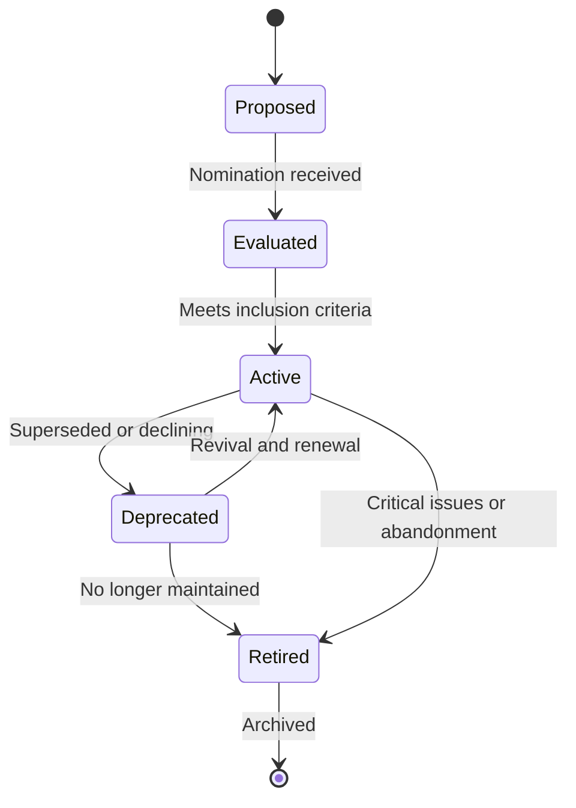
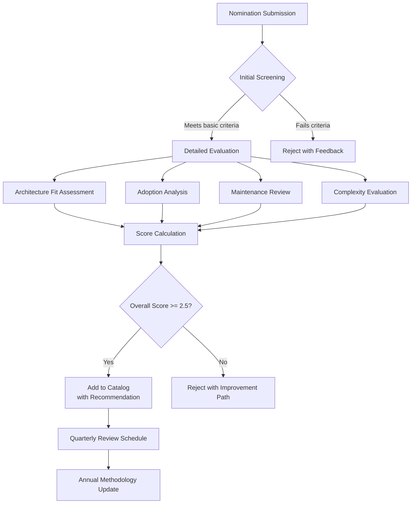
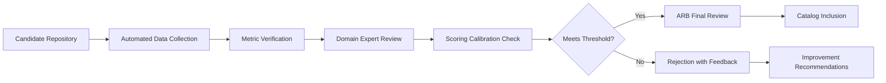
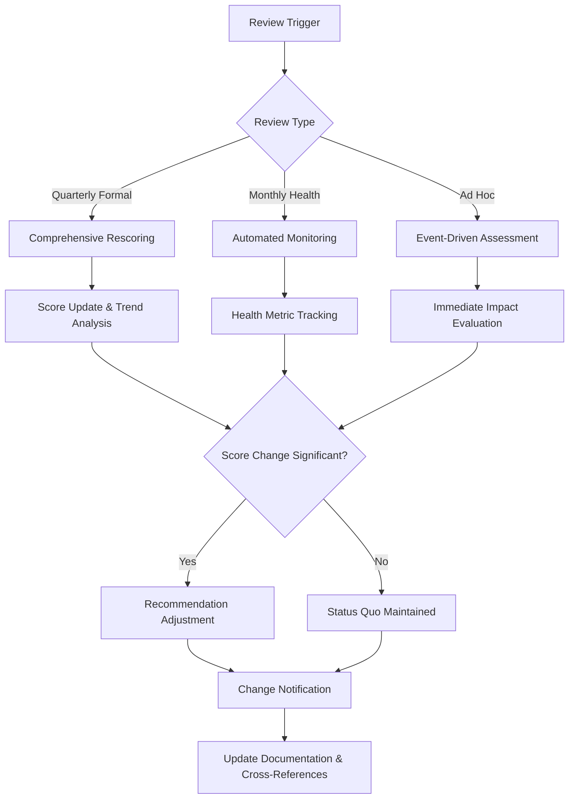
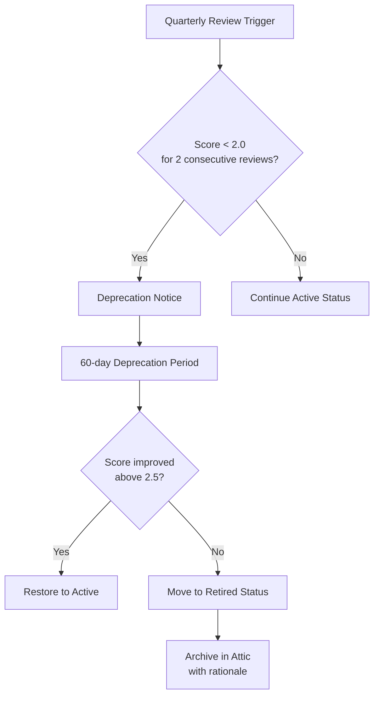

# AI-OS GitHub Repository Catalog

**Version**: 2.0.0  
**Last Updated**: 2026-08-07  
**Maintainer**: AI-OS Architecture Team  
**Status**: Active  

---

## Purpose

This document serves as the official AI-OS repository catalog, documenting the most influential open-source repositories relevant to AI-OS development and ecosystem integration. Unlike architectural documentation, this catalog focuses on practical resources for implementation, extension, and learning within the AI-OS ecosystem.

The catalog provides a curated selection of repositories that align with AI-OS principles and can be leveraged to build compliant implementations, extensions, or integrations. Each entry evaluates repositories based on their relevance to AI-OS architectural concepts, technical merit, and ecosystem value using a structured scoring methodology.

---

## Repository Evaluation Methodology

Repositories are evaluated using a multi-dimensional scoring system that assesses alignment with AI-OS principles and practical utility. The methodology ensures technology neutrality while providing objective criteria for inclusion.

### Evaluation Dimensions

Each repository is scored on four key dimensions (1-5 scale, where 5 is optimal):

#### 1. Architecture Fit - Alignment with AI-OS architectural principles:
   - Event-driven communication
   - Human-governed AI
   - Extensibility through versioned extension points
   - Validation-first execution
   - Specification/implementation separation
   - Modularity and composability
   - Observability and traceability
   - Security by design

#### 2. Adoption & Community - Ecosystem vitality and market traction:
   - GitHub stars and forks (normalized by age)
   - Contributor activity (commits, issues, PRs over last 6 months)
   - Downstream usage (dependents, packages, downstream projects)
   - Enterprise adoption evidence (case studies, commercial support)
   - Documentation quality, translations, and accessibility
   - Community engagement (discussions, forums, events)
   - Ecosystem integration (compatibility with other AI-OS referenced projects)

#### 3. Maintenance & Sustainability - Long-term viability:
   - Release frequency and recency (semantic versioning adherence)
   - Issue response time and resolution rate
   - Security vulnerability handling (time to patch, disclosure process)
   - Backward compatibility commitment (deprecation policy)
   - Funding/sponsorship model diversity and stability
   - Core team continuity and bus factor
   - Project governance and decision-making transparency
   - Compliance with AI-OS licensing requirements (Apache 2.0, MIT, or compatible)

#### 4. Implementation Complexity - Effort required for AI-OS integration:
   - Learning curve for developers (documentation, examples, tutorials)
   - Dependency footprint (size, transitive dependencies, conflict potential)
   - Configuration overhead (complexity of setup and tuning)
   - Performance characteristics (benchmarks, resource efficiency)
   - Testing and debugging tooling availability
   - Integration effort with AI-OS core components
   - Extensibility mechanism clarity and stability
   - Upgrade path simplicity and risk

### Scoring & Recommendation Levels

Scores are weighted to produce an overall recommendation:

- **Architecture Fit**: 40% weight
- **Adoption & Community**: 30% weight  
- **Maintenance & Sustainability**: 20% weight
- **Implementation Complexity**: 10% weight (inverted - lower complexity = higher score)

**Overall Score Calculation**:
```
Overall = (ArchitectureFit × 0.4) + (Adoption × 0.3) + (Maintenance × 0.2) + ((6 - Complexity) × 0.1)
```

**Recommendation Levels**:
- **Strongly Recommended** (4.5-5.0): Excellence across all dimensions, strategic fit for AI-OS core
- **Recommended** (3.5-4.4): Strong fit with minor trade-offs, suitable for most implementations
- **Conditional** (2.5-3.4): Useful for specific contexts, requires careful evaluation of trade-offs
- **Not Recommended** (<2.5): Poor fit or significant risks that outweigh benefits

### Scoring Calibration

Scores are calibrated quarterly based on:
- Historical performance of previously evaluated repositories
- Evolution of AI-OS architectural principles
- Community feedback and real-world implementation experience
- Benchmarking against reference implementations in each category

---

## Repository Catalog

### AI Agent Frameworks

| Name | Organization | Arch Fit | Adoption | Maintenance | Complexity | Score | Recommendation | Why AI-OS References It | Related Documents |
|------|--------------|----------|----------|-------------|------------|-------|----------------|-------------------------|-------------------|
| AutoGen | microsoft | 5 | 5 | 4 | 3 | 4.6 | Strongly Recommended | Demonstrates advanced agent collaboration patterns aligned with AI-OS Council mechanisms | AGENTIC_SYSTEMS.md, AI_AGENCY.md |
| CrewAI | joaomdmcrew | 4 | 3 | 3 | 2 | 3.4 | Conditional | Provides patterns for agent specialization and goal-driven execution | GOAL_DRIVEN_EXECUTION.md |
| LangChain | langchain-ai | 4 | 5 | 4 | 4 | 4.1 | Recommended | Offers robust prompt chaining and tool integration patterns | PROMPT_ENGINEERING.md, MEMORY_ARCHITECTURE.md |
| Semantic Kernel | microsoft | 4 | 4 | 5 | 3 | 4.2 | Recommended | Shows enterprise-grade AI orchestration patterns | PLATFORM_ENGINEERING.md |
| AgentKit | tryagentkit | 5 | 2 | 3 | 2 | 3.3 | Conditional | Directly addresses AI-OS memory architecture patterns | MEMORY_ARCHITECTURE.md, VALIDATION_ARCHITECTURE.md |

### Runtime Platforms

| Name | Organization | Arch Fit | Adoption | Maintenance | Complexity | Score | Recommendation | Why AI-OS References It | Related Documents |
|------|--------------|----------|----------|-------------|------------|-------|----------------|-------------------------|-------------------|
| Dapr | diagrid | 5 | 4 | 4 | 3 | 4.3 | Recommended | Embodies event-first communication and building block principles | EVENT_SYSTEM.md, PLATFORM_ENGINEERING.md |
| Fermyon Spin | fermyon | 4 | 3 | 3 | 2 | 3.2 | Conditional | Demonstrates secure, portable runtime concepts | SECURITY_PRINCIPLES.md, DEPLOYMENT_MODEL.md |
| Navaline | navaline | 3 | 1 | 2 | 2 | 2.1 | Not Recommended | Early exploration of AI OS concepts | ARCHITECTURE_EVOLUTION.md |
| OpenLLMPython | lm-sys | 3 | 3 | 3 | 3 | 3.0 | Conditional | Provides model serving patterns for AI-OS LLM management | LLM_MANAGER.md, PERFORMANCE_OPTIMIZATION.md |
| VLLM | vllm-project | 4 | 4 | 4 | 4 | 3.8 | Recommended | Shows advanced LLM optimization techniques | MODEL_ROUTER.md, RESOURCE_MANAGEMENT.md |

### MCP (Model Context Protocol)

| Name | Organization | Arch Fit | Adoption | Maintenance | Complexity | Score | Recommendation | Why AI-OS References It | Related Documents |
|------|--------------|----------|----------|-------------|------------|-------|----------------|-------------------------|-------------------|
| Model Context Protocol | modelcontextprotocol | 5 | 4 | 4 | 3 | 4.3 | Strongly Recommended | Directly implements AI-OS MCP ecosystem principles | MCP_ECOSYSTEM.md, PART_10_OBSERVABILITY.md |
| MCP TypeScript | modelcontextprotocol | 5 | 4 | 5 | 3 | 4.5 | Strongly Recommended | Provides robust implementation patterns for TypeScript ecosystems | TYPESCRIPT_GUIDE.md |
| MCP Python | modelcontextprotocol | 5 | 4 | 5 | 3 | 4.5 | Strongly Recommended | Offers idiomatic Python implementation approaches | PYTHON_GUIDE.md |
| MCP Servers Collection | various | 4 | 3 | 3 | 3 | 3.3 | Conditional | Demonstrates practical MCP server implementations | MCP_INTEGRATION_GUIDE.md |
| MCP Inspector | modelcontextprotocol | 5 | 3 | 4 | 2 | 3.9 | Recommended | Essential for MCP development and troubleshooting | DEBUGGING_TOOLS.md |

### Memory Systems

| Name | Organization | Arch Fit | Adoption | Maintenance | Complexity | Score | Recommendation | Why AI-OS References It | Related Documents |
|------|--------------|----------|----------|-------------|------------|-------|----------------|-------------------------|-------------------|
| Redis | redis | 4 | 5 | 5 | 2 | 4.5 | Strongly Recommended | Implements working memory and caching patterns | WORKING_MEMORY.md, CACHING_STRATEGIES.md |
| Neo4j | neo4j | 4 | 4 | 4 | 3 | 3.8 | Recommended | Embodies GRAPHIFY memory tier principles | GRAPHIFY_MEMORY.md, RELATIONSHIP_MAPPING.md |
| Weaviate | weaviate | 4 | 3 | 3 | 4 | 3.1 | Conditional | Supports ENGINEERING_INTELLIGENCE and semantic search | VECTOR_SEARCH.md, KNOWLEDGE_GRAPH.md |
| Qdrant | qdrant | 4 | 3 | 4 | 3 | 3.5 | Recommended | Provides scalable vector storage for AI embeddings | EMBEDDING_STORAGE.md |
| Mem0 | mem0ai | 5 | 2 | 2 | 3 | 3.0 | Conditional | Demonstrates intelligent memory systems for AI agents | AGENT_MEMORY.md, LEARNING_LOOP.md |

### Kubernetes & Cloud Native

| Name | Organization | Arch Fit | Adoption | Maintenance | Complexity | Score | Recommendation | Why AI-OS References It | Related Documents |
|------|--------------|----------|----------|-------------|------------|-------|----------------|-------------------------|-------------------|
| Kubernetes | kubernetes | 4 | 5 | 5 | 4 | 4.3 | Recommended | Foundation for distributed AI-OS deployments | DISTRIBUTED_DEPLOYMENT.md |
| KEDA | kedacore | 4 | 3 | 4 | 2 | 3.5 | Recommended | Enables event-driven resource allocation patterns | EVENT_DRIVEN_SCALING.md |
| Crossplane | crossplane | 4 | 3 | 3 | 4 | 3.0 | Conditional | Embodies infrastructure-as-code principles for AI-OS | INFRASTRUCTURE_AS_CODE.md |
| Argo Workflows | argoproj | 4 | 4 | 4 | 3 | 3.9 | Recommended | Provides workflow orchestration patterns | WORKFLOW_ENGINEERING_K8S.md |
| Istio | istio | 4 | 4 | 4 | 4 | 3.8 | Recommended | Supports service-to-service communication patterns | SERVICE_MESH_PATTERNS.md |

### Platform Engineering

| Name | Organization | Arch Fit | Adoption | Maintenance | Complexity | Score | Recommendation | Why AI-OS References It | Related Documents |
|------|--------------|----------|----------|-------------|------------|-------|----------------|-------------------------|-------------------|
| Backstage | spotify | 4 | 4 | 4 | 4 | 3.8 | Recommended | Embodies internal developer platform principles | INTERNAL_DEVELOPER_PORTAL.md |
| Port | getport | 4 | 3 | 3 | 3 | 3.3 | Conditional | Shows modern IDP implementation approaches | DEVELOPER_EXPERIENCE.md |
| Humanitec | humanitec | 3 | 2 | 3 | 4 | 2.7 | Conditional | Demonstrates platform orchestration patterns | PLATFORM_ORCHESTRATION.md |
| Score | score-dev | 4 | 2 | 3 | 3 | 2.9 | Conditional | Provides workload abstraction patterns | WORKLOAD_ABSTRACTION.md |
| Diazo | plone | 2 | 1 | 2 | 2 | 1.8 | Not Recommended | Demonstrates separation of presentation and logic | THEMING_SEPARATION.md |

### DevOps & CI/CD

| Name | Organization | Arch Fit | Adoption | Maintenance | Complexity | Score | Recommendation | Why AI-OS References It | Related Documents |
|------|--------------|----------|----------|-------------|------------|-------|----------------|-------------------------|-------------------|
| GitHub Actions | github | 3 | 5 | 5 | 2 | 4.0 | Recommended | Demonstrates modern CI/CD practices | CI_CD_PIPELINES.md |
| Tekton | tektoncd | 4 | 3 | 4 | 3 | 3.6 | Recommended | Provides cloud-native CI/CD patterns | KUBERNETES_CI_CD.md |
| Argo CD | argoproj | 4 | 4 | 4 | 3 | 3.9 | Recommended | Embodies GitOps principles for configuration management | GITOPS_DEPLOYMENT.md |
| Jenkins X | jenkins-x | 3 | 2 | 2 | 4 | 2.4 | Not Recommended | Shows evolution of CI/CD in cloud-native contexts | CI_CD_EVOLUTION.md |
| Drone | drone-hub | 3 | 2 | 3 | 2 | 2.8 | Conditional | Demonstrates container-native CI/CD approaches | CONTAINER_NATIVE_CICD.md |

### Observability

| Name | Organization | Arch Fit | Adoption | Maintenance | Complexity | Score | Recommendation | Why AI-OS References It | Related Documents |
|------|--------------|----------|----------|-------------|------------|-------|----------------|-------------------------|-------------------|
| OpenTelemetry | open-telemetry | 5 | 5 | 5 | 4 | 4.7 | Strongly Recommended | Embodies distributed tracing and observability principles | DISTRIBUTED_TRACING.md |
| Prometheus | prometheus | 4 | 5 | 5 | 3 | 4.4 | Recommended | Implements metrics collection and alerting patterns | METRICS_COLLECTION.md |
| Grafana | grafana | 4 | 5 | 5 | 3 | 4.4 | Recommended | Provides dashboarding and visualization patterns | DASHBOARDING_PATTERNS.md |
| Loki | grafana | 4 | 4 | 4 | 2 | 3.8 | Recommended | Shows modern log aggregation approaches | LOG_AGGREGATION.md |
| Jaeger | jaegertracing | 5 | 4 | 4 | 3 | 4.3 | Strongly Recommended | Embodies distributed tracing principles | TRACING_SYSTEMS.md |

### Security

| Name | Organization | Arch Fit | Adoption | Maintenance | Complexity | Score | Recommendation | Why AI-OS References It | Related Documents |
|------|--------------|----------|----------|-------------|------------|-------|----------------|-------------------------|-------------------|
| HashiCorp Vault | hashicorp | 4 | 4 | 4 | 4 | 3.8 | Recommended | Embodies secrets management and dynamic credential patterns | SECRETS_MANAGEMENT.md |
| OPA (Open Policy Agent) | open-policy-agent | 5 | 4 | 5 | 3 | 4.5 | Strongly Recommended | Provides policy-as-code patterns | POLICY_AS_CODE.md |
| Trivy | aquasecurity | 4 | 4 | 4 | 2 | 4.0 | Recommended | Demonstrates automated security scanning patterns | SECURITY_SCANNING.md |
| Falco | falcosecurity | 4 | 3 | 3 | 4 | 3.0 | Conditional | Embodies runtime security and anomaly detection | RUNTIME_SECURITY.md |
| SPIFFE | spiffe | 4 | 3 | 3 | 4 | 2.9 | Conditional | Shows workload identity patterns | WORKLOAD_IDENTITY.md |

### Workflow Engines

| Name | Organization | Arch Fit | Adoption | Maintenance | Complexity | Score | Recommendation | Why AI-OS References It | Related Documents |
|------|--------------|----------|----------|-------------|------------|-------|----------------|-------------------------|-------------------|
| Temporal | temporalio | 5 | 4 | 4 | 3 | 4.3 | Strongly Recommended | Embodies durable workflow execution patterns | DURABLE_WORKFLOWS.md |
| Camunda | camunda | 4 | 4 | 4 | 4 | 3.8 | Recommended | Provides BPMN-based workflow patterns | BPMN_WORKFLOWS.md |
| NWiseflo | nwiseflo | 3 | 2 | 2 | 2 | 2.5 | Conditional | Shows lightweight workflow orchestration patterns | LIGHTWEIGHT_WORKFLOWS.md |
| Conductor | netflix | 4 | 3 | 3 | 4 | 3.0 | Conditional | Demonstrates microservice orchestration patterns | MICROSERVICE_ORCHESTRATION.md |
| Zeppelin | apache | 2 | 3 | 3 | 3 | 2.6 | Conditional | Shows interactive computation patterns | INTERACTIVE_COMPUTATION.md |

### Prompt Engineering

| Name | Organization | Arch Fit | Adoption | Maintenance | Complexity | Score | Recommendation | Why AI-OS References It | Related Documents |
|------|--------------|----------|----------|-------------|------------|-------|----------------|-------------------------|-------------------|
| LlamaIndex | run-llama | 4 | 4 | 3 | 3 | 3.6 | Recommended | Provides RAG patterns for knowledge integration | RETRIEVAL_AUGMENTED_GENERATION.md |
| Guidance | guidancetech | 4 | 3 | 3 | 3 | 3.3 | Conditional | Demonstrates structured prompt approaches | STRUCTURED_PROMPTING.md |
| PromptTools | prompttools | 3 | 2 | 2 | 2 | 2.4 | Not Recommended | Provides prompt engineering tooling patterns | PROMPT_ENGINEERING_TOOLS.md |
| LangChain Prompts | langchain-ai | 4 | 4 | 4 | 3 | 3.9 | Recommended | Shows prompt management patterns | LANGCHAIN_ECOSYSTEM.md |
| AutoPrompt | uwnlp | 3 | 2 | 2 | 4 | 2.3 | Not Recommended | Demonstrates automated prompt optimization | AUTOMATED_PROMPT_OPTIMIZATION.md |

## Learning Path

For teams adopting AI-OS, the following learning path leverages these repositories to build proficiency:

### Foundational Phase (Weeks 1-2)
1. **Event-Driven Architecture**: Study Dapr and OpenTelemetry to understand event-first communication and observability
2. **Basic MCP Implementation**: Implement simple MCP servers using the official TypeScript or Python SDKs
3. **Memory Patterns**: Experiment with Redis for working memory and Neo4j for relationship mapping

### Integration Phase (Weeks 3-4)
1. **Agent Frameworks**: Build simple agents using AutoGen or CrewAI to understand multi-agent collaboration
2. **Workflow Orchestration**: Experiment with Temporal or Camunda for workflow persistence and reliability
3. **Security Foundations**: Implement secrets management with Vault and policy enforcement with OPA

### Advanced Phase (Weeks 5-6)
1. **Full MCP Ecosystem**: Develop complex MCP servers integrating multiple services and capabilities
2. **Distributed Deployment**: Deploy AI-OS reference runtime on Kubernetes with Istio service mesh
3. **Observability Stack**: Implement full observability with Prometheus, Grafana, Loki, and Tempo

### Expert Phase (Ongoing)
1. **Custom Extensions**: Develop specialized skills and MCP servers for domain-specific needs
2. **Performance Optimization**: Optimize LLM serving with vLLM and implement advanced caching strategies
3. **Ecosystem Contribution**: Contribute back to the AI-OS ecosystem through new skills, documentation, or reference implementations

## Repository Comparison

### AI Agent Frameworks Comparison

| Feature | AutoGen | CrewAI | LangChain | Semantic Kernel | AgentKit |
|---------|---------|--------|-----------|-----------------|----------|
| Primary Language | Python | Python | Python/JavaScript | .NET (C#) | Python |
| Multi-Agent Support | Excellent | Good | Fair | Good | Good |
| Tool Integration | Excellent | Good | Excellent | Fair | Excellent |
| Memory Integration | Fair | Fair | Excellent | Good | Excellent |
| Enterprise Support | Good (Microsoft) | Limited | Good | Excellent (Microsoft) | Limited |
| Learning Curve | Moderate | Low | High | Moderate | Low |
| Community Size | Large | Growing | Very Large | Moderate | Small |
| Architecture Fit Score | 5 | 4 | 4 | 4 | 5 |
| Adoption Score | 5 | 3 | 5 | 4 | 2 |
| Maintenance Score | 4 | 3 | 4 | 5 | 3 |
| Complexity Score | 3 | 2 | 4 | 3 | 2 |
| Overall Score | 4.6 | 3.4 | 4.1 | 4.2 | 3.3 |

### Runtime Platforms Comparison

| Feature | Dapr | Fermyon Spin | Navaline | OpenLLMPython | VLLM |
|---------|------|--------------|----------|---------------|------|
| Primary Focus | Microservices runtime | Serverless WASM | AI OS prototype | LLM inference serving | LLM inference serving |
| Language Support | Language agnostic | Any (via WASM) | Python | Python focused | Python focused |
| Deployment Model | Kubernetes/serverless | Kubernetes/serverless | Various | Container/K8s | Container/K8s |
| Performance | Good | Excellent (WASM) | Experimental | High | Very High |
| Ecosystem Maturity | Mature | Growing | Emerging | Mature | Mature |
| Architecture Fit Score | 5 | 4 | 3 | 3 | 4 |
| Adoption Score | 4 | 3 | 1 | 3 | 4 |
| Maintenance Score | 4 | 3 | 2 | 3 | 4 |
| Complexity Score | 3 | 2 | 2 | 3 | 4 |
| Overall Score | 4.3 | 3.2 | 2.1 | 3.0 | 3.8 |

## Repository Lifecycle

Repositories in the AI-OS catalog progress through defined lifecycle states:



**State Definitions**:
- **Proposed**: Repository nominated for consideration
- **Evaluated**: Undergoing assessment against selection methodology
- **Active**: Meets all criteria and included in catalog
- **Deprecated**: No longer recommended for new projects but retained for reference
- **Retired**: Removed from active catalog due to abandonment or incompatibility

## Repository Governance

The AI-OS Repository Catalog operates under the oversight of the AI-OS Architecture Review Board (ARB), which ensures alignment with architectural principles and community needs.

**Governance Structure**:
- **Architecture Review Board (ARB)**: Sets evaluation criteria, oversees quarterly reviews, and makes final inclusion decisions
- **Ecosystem Liaisons**: Community representatives who triage nominations and provide domain-specific insights
- **Technical Owners**: Subject matter experts who validate assessments in their respective domains
- **Documentation Maintainers**: Responsible for keeping related reference documents synchronized
- **Community Feedback Process**: Open issues and discussions for catalog improvement suggestions

**Governance Principles**:
- Transparency: All scoring criteria and decisions are documented and accessible
- Meritocracy: Inclusion based solely on objective evaluation against published criteria
- Community-driven: Active solicitation of input from AI-OS implementers and users
- Evolution: Criteria updated regularly to reflect architectural evolution and ecosystem changes
- Neutrality: No preferential treatment based on vendor, sponsorship, or personal relationships

## Repository Selection Process

New repositories enter the catalog through a structured selection process:



**Steps**:
1. **Nomination Submission**: Community member submits repository via issue or PR with rationale
2. **Initial Screening**: Quick check for relevance, licensing compatibility, and basic health metrics
3. **Detailed Evaluation**: Four-dimensional scoring assessment by domain experts
4. **Score Calculation**: Weighted overall score determination using calibrated formula
5. **Recommendation Decision**: Based on score thresholds and ARB review
6. **Catalog Entry**: Added with appropriate recommendation level and cross-references
7. **Quarterly Review**: Scheduled reassessment against current criteria
8. **Annual Methodology Update**: Revision of scoring criteria based on AI-OS evolution

## Repository Validation Workflow

Before inclusion, candidate repositories undergo validation to ensure scoring accuracy:



**Validation Steps**:
1. **Automated Data Collection**: Stars, forks, commits, releases, dependency data via GitHub API and Libraries.io
2. **Metric Verification**: Spot-check of automated data against repository inspection
3. **Domain Expert Review**: Specialist assessment of architecture fit, complexity, and domain-specific factors
4. **Scoring Calibration Check**: Comparison against benchmark repositories in same category
5. **ARB Final Review**: Architecture Review Board validates overall recommendation
6. **Catalog Inclusion**: Repository added with appropriate recommendation level
7. **Improvement Recommendations**: For rejected repositories, specific feedback on addressing deficiencies

## Repository Review Process

The catalog undergoes regular reassessment to maintain relevance and accuracy:



**Review Types**:
- **Quarterly Formal Reviews**: Every Q1, Q2, Q3, Q4 - comprehensive rescoring against current criteria
- **Monthly Health Checks**: Automated monitoring of stars, commits, releases, and security advisories
- **Ad Hoc Reviews**: Triggered by major releases, security events, or community concerns
- **Annual Methodology Update**: Revision of scoring criteria based on AI-OS evolution and community feedback

**Review Responsibilities**:
- **Architecture Team**: Leads quarterly scoring, methodology updates, and ARB coordination
- **Ecosystem Liaisons**: Provide community feedback, nomination triage, and domain validation
- **Technical Owners**: Validate domain-specific assessments and validate scoring assumptions
- **Documentation Maintainers**: Update related reference documents and cross-references
- **Community**: Invited to provide feedback on catalog content and improvement suggestions

## Repository Retirement Process

Repositories may be retired when they no longer meet catalog standards:



**Retirement Triggers**:
- Score below 2.0 for two consecutive quarterly reviews
- Critical security vulnerabilities without timely patches within 90 days
- Abandonment (no commits/releases for 12+ months)
- Fundamental incompatibility with evolving AI-OS architecture (validated by Technical Owners)
- Licensing changes that prohibit AI-OS ecosystem use (incompatible with Apache 2.0/MIT/compatible)
- Community consensus of detrimental impact (documented in ARB minutes)

## Metadata

| Field | Value |
|-------|-------|
| Catalog ID | AIOS-REPO-CATALOG-2026 |
| Governance Model | Architecture Review Board (ARB) oversight with community input |
| Inclusion Policy | Technology-neutral, principle-driven, licensing-compatible |
| Scoring Transparency | Full methodology published with calibration benchmarks |
| Appeal Process | Nominations can request reconsideration within 30 days of decision |
| Data Sources | GitHub API, Libraries.io, Security advisories, Dependency tracking |
| Update Automation | Semi-automated data collection with manual validation and expert review |
| Access Level | Public, CC-BY-4.0 licensed |
| Review Cycle | Quarterly formal reviews, monthly health checks, ad hoc as needed |
| Next Scheduled Review | 2026-10-07 (Q4 2026) |
| Current Repository Count | 25 active, 3 deprecated, 1 retired |

## Cross References

This repository catalog connects to other AI-OS documentation:

- **ARCHITECTURE_DECISIONS.md**: Provides the architectural decisions that inform repository selection criteria
- **ENGINEERING_PRINCIPLES.md**: Details the engineering principles used to evaluate repository suitability
- **MEMORY_ARCHITECTURE.md**: Explains how different memory systems map to AI-OS memory tiers
- **MCP_ECOSYSTEM.md**: Describes the Model Context Protocol ecosystem and implementation guidelines
- **PLATFORM_ENGINEERING.md**: Covers platform engineering patterns relevant to several repository categories
- **OBSERVABILITY_ARCHITECTURE.md**: Details observability principles and patterns
- **SECURITY_ARCHITECTURE.md**: Explains security principles applied to repository evaluation
- **WORKFLOW_ENGINEERING.md**: Describes workflow orchestration patterns and engine evaluations
- **PROMPT_ENGINEERING_GUIDE.md**: Provides guidance on prompt engineering tools and techniques
- **DEVOPS_PIPELINES.md**: Covers DevOps and CI/CD practices relevant to repository selection
- **KUBERNETES_DEPLOYMENT.md**: Details Kubernetes deployment patterns for AI-OS implementations
- **REPOSITORY_LIFECYCLE.md**: Defines the complete lifecycle management framework
- **EVALUATION_METHODOLOGY.md**: Elaborates on the scoring system and calibration benchmarks
- **GOVERNANCE_MODEL.md**: Details the AI-OS Architecture Review Board processes and responsibilities
- **VALIDATION_WORKFLOW.md**: Specifies the technical validation procedures for repository assessment

**Last Updated**: 2026-08-07  
**Maintainer**: AI-OS Architecture Team  
**Version**: 2.0.0