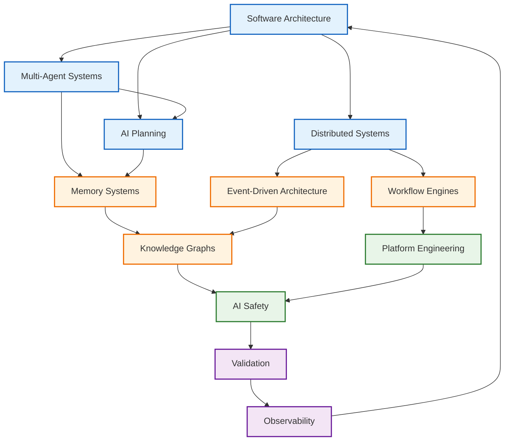
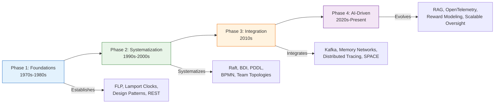
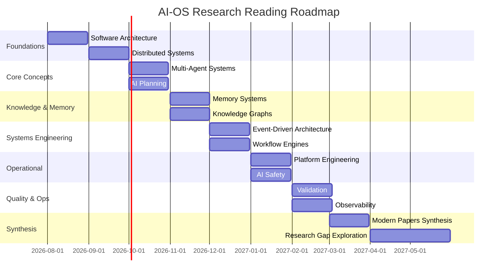

# AI-OS Research Bibliography

## Purpose

This document serves as the official research bibliography for the AI-OS project. It curates foundational and modern papers that provide the theoretical and practical foundation for AI-OS architecture, design, and implementation principles. Unlike architectural documents, this bibliography focuses exclusively on the evidence base that validates and informs AI-OS concepts.

## Research Philosophy

AI-OS is grounded in evidence-based engineering principles. Every major architectural decision in AI-OS traces back to peer-reviewed research, empirical studies, or battle-tested industry practices documented in academic literature. This bibliography ensures transparency in our intellectual lineage and provides a roadmap for deeper exploration of the concepts that shape AI-OS.

## Research Lifecycle

Research progresses through a structured lifecycle that ensures rigor, reproducibility, and alignment with AI-OS evolution:


| Phase | Description | Activities |
|-------|-------------|------------|
| **Identification** | Discover relevant research | Literature search, expert recommendations, conference proceedings, citation tracing |
| **Evaluation** | Assess relevance and quality | Peer-review status, citation count, reproducibility, methodological rigor |
| **Selection** | Determine inclusion in bibliography | Impact score, AI-OS relevance, accessibility, diversity of perspectives |
| **Mapping** | Connect to AI-OS architecture | Specification Part mapping, principle alignment, component influence |
| **Citation** | Document with standardized format | Author, title, venue, year, DOI, summary, influence score |
| **Review** | Periodic reassessment | Quarterly review, impact validation, decay analysis, replacement identification |

## Research Selection Methodology

Papers enter the bibliography through a multi-stage selection process:

### Selection Criteria

| Criterion | Weight | Description |
|-----------|--------|-------------|
| **Architectural Impact** | 35% | Degree to which the paper informs AI-OS specification parts, principles, or invariants |
| **Foundational Importance** | 25% | Whether the paper is seminal in its field and provides essential background |
| **Empirical Evidence** | 20% | Strength of empirical validation, reproducibility, and methodological rigor |
| **Practical Applicability** | 15% | Relevance to real-world implementation challenges in AI-OS |
| **Diversity & Coverage** | 5% | Balance across domains, perspectives, and methodological approaches |

### Selection Threshold

Papers must achieve a minimum weighted score of **7.0/10.0** to be included. Papers scoring above **8.5/10.0** are prioritized as foundational. Papers scoring below **7.0/10.0** are archived with rationale.

### Influence Score

Each paper receives an influence score from 1–5 stars indicating its importance to AI-OS:

| Score | Meaning | Examples |
|-------|---------|----------|
| ⭐⭐⭐⭐⭐ | Essential — Direct architectural basis, no substitute | FLP Impossibility, REST Dissertation |
| ⭐⭐⭐⭐ | Foundational — Core domain principles, widely cited | Raft Consensus, BDI Agent Model |
| ⭐⭐⭐ | Important — Informs specific components, strong evidence | HTN Planning, Streaming Systems |
| ⭐⭐ | Relevant — Provides context, useful background | Team Topologies, Mutation Testing |
| ⭐ | Supplementary — Peripheral interest, limited direct application | Case study papers, surveys |

## Research Review Process

The bibliography undergoes systematic review through the following process:

### Review Cadence

| Review Type | Frequency | Participants | Output |
|-------------|-----------|--------------|--------|
| **Annual Comprehensive** | Yearly | Research Council, ARB | Full bibliography assessment, additions, removals, influence score updates |
| **Quarterly Assessment** | Quarterly | Domain researchers | Influence score adjustments, decay analysis, replacement identification |
| **Ad-Hoc Reviews** | As triggered | Relevant stakeholders | New paper evaluation, domain expansion, research gap addressing |

### Review Triggers

Reviews are triggered by:
1. New Architecture Specification revision (Parts 1–15 update)
2. Research gap identification or resolution
3. Conference proceedings in relevant venues
4. Citation spike (>100 citations/year)
5. Paper retraction or methodological challenge
6. Community submission for bibliography consideration

### Review Artifacts

Each review produces:
- **Bibliography Health Report**: Coverage gaps, redundancy analysis, domain balance
- **Decay Analysis**: Papers whose influence has diminished due to newer alternatives
- **Replacement Proposals**: New papers to substitute archived entries
- **Influence Score Updates**: Adjusted scores reflecting current relevance

## Research Domains

The research spans twelve interconnected domains that collectively form the AI-OS knowledge foundation:



1. **Software Architecture** — Architectural patterns, styles, and principles
2. **Distributed Systems** — Consensus, fault tolerance, scalability
3. **Multi-Agent Systems** — Coordination, communication, emergent behavior
4. **AI Planning** — Goal-directed behavior, task decomposition
5. **Memory Systems** — Knowledge representation, retention, retrieval
6. **Knowledge Graphs** — Semantic relationships, inference, linking
7. **Event-Driven Architecture** — Asynchronous processing, decoupling
8. **Workflow Engines** — Orchestration, state management, dependency resolution
9. **Platform Engineering** — Internal developer platforms, automation
10. **AI Safety** — Alignment, robustness, interpretability
11. **Validation** — Testing, verification, quality assurance
12. **Observability** — Monitoring, logging, tracing, debugging

## AI-OS Mapping

Papers are mapped to AI-OS specification parts for precise architectural traceability:

| Specification Part | Title | Papers |
|-------------------|-------|--------|
| Part 0 | ADRs & Processes | Papers informing architectural decisions |
| Part 1 | Hermes Kernel | Consensus, distributed coordination, event ordering |
| Part 2 | Event System | Event-driven architecture, streaming semantics, event sourcing |
| Part 3 | Capability Managers | Memory systems, resource management, model routing |
| Part 4 | Service Framework | Service lifecycle, dependency management, communication patterns |
| Part 5 | Engineering Services | Planning, coding, review workflows |
| Part 6 | Operations Services | Learning architectures, experience capture |
| Part 7 | Capability Facades | Interface design, mediation patterns |
| Part 8 | Configuration | Configuration management, environment parity |
| Part 9 | Extension Points | Skills ecosystem, plugin architectures |
| Part 10 | MCP Ecosystem | Protocol design, capability negotiation |
| Part 11 | Validation Architecture | Testing, verification, conformance checking |
| Part 12 | Security & Safety | AI safety, security principles, human oversight |
| Part 13 | Ecosystem & Marketplace | Platform engineering, ecosystem governance |
| Part 14 | Deployment & Operations | Monitoring, observability, operational tooling |
| Part 15 | Future Directions | Emerging research, long-term vision |

## Citation Consistency

All citations follow a standardized format for uniform readability:

```
* **Title:** [Paper title]
* **Authors:** [Author list as given in publication]
* **Year:** [Publication year]
* **Venue:** [Publication venue, if applicable]
* **DOI:** [DOI identifier, if available]
* **Research Domain:** [Domain name from taxonomy above]
* **AI-OS Specification Parts:** [Part references]
* **Influence Score:** [⭐ rating]
* **Estimated Reading Time:** [Time estimate]
* **Reading Difficulty:** [Beginner | Intermediate | Advanced | Expert]
* **Summary:** [2-3 sentence abstract]
* **Why it matters to AI-OS:** [Connection to architecture]
* **Related AI-OS documents:** [Cross-reference links]
* **Research Relationships:** [Papers this cites or is cited by]
```

## Metadata Standards

Each paper entry includes standardized metadata for discoverability:

| Field | Format | Example |
|-------|--------|---------|
| **Estimated Reading Time** | `{N} min` | 45 min |
| **Reading Difficulty** | Categorical | Beginner, Intermediate, Advanced, Expert |
| **Influence Score** | Star rating | ⭐⭐⭐⭐ |
| **Publication Venue** | Standardized name | ICSE, NeurIPS, CACM |

Reading difficulty levels:

| Level | Characteristics | Target Audience |
|-------|-----------------|-----------------|
| **Beginner** | Accessible without prerequisite knowledge | New researchers, stakeholders |
| **Intermediate** | Requires basic domain knowledge | Practitioners, graduate students |
| **Advanced** | Requires deep domain expertise | Researchers, senior engineers |
| **Expert** | Highly specialized, cutting-edge | Domain experts, academics |

## Cross References

This bibliography cross-references the following AI-OS documentation:

*   [`ENGINEERING_PRINCIPLES.md`](../ENGINEERING_PRINCIPLES.md) - Lists principles derived from this research
*   [`AI_OS_MASTER_CONTEXT.md`](../AI_OS_MASTER_CONTEXT.md) - Shows architectural decisions informed by these works
*   [`ARCHITECTURE_DECISIONS.md`](../ARCHITECTURE_DECISIONS.md) - Contains ADRs that cite specific papers
*   [`RESEARCH_ROADMAP.md`](../research/RESEARCH_ROADMAP.md) - Outlines how AI-OS will address identified research gaps
*   [`FUTURE_FEATURES.md`](FUTURE_FEATURES.md) - Research maturity model and feature lifecycle

Each AI-OS component directory includes a `RESEARCH.md` file listing specific papers that inform that component's design.

---

## Foundational Papers

### Software Architecture ⭐⭐⭐⭐⭐

**Total papers: 3 | Estimated reading time: ~7 hours | Average difficulty: Advanced**

#### 1. Architectural Styles and the Design of Network-based Software Architectures

*   **Authors:** Roy Thomas Fielding
*   **Year:** 2000
*   **Venue:** University of California, Irvine Dissertation
*   **Research Domain:** Software Architecture
*   **AI-OS Specification Parts:** Part 2 (Event System), Part 4 (Service Framework)
*   **Influence Score:** ⭐⭐⭐⭐⭐
*   **Estimated Reading Time:** 60 min
*   **Reading Difficulty:** Advanced
*   **Summary:** Introduces Representational State Transfer (REST) as an architectural style for distributed hypermedia systems, defining constraints that promote scalability, simplicity, and modifiability.
*   **Why it matters to AI-OS:** Provides the theoretical foundation for AI-OS's RESTful APIs, resource-oriented design, and uniform interface principles that enable loose coupling and independent evolution of components.
*   **Related AI-OS documents:** [`ENGINEERING_PRINCIPLES.md`](../ENGINEERING_PRINCIPLES.md), [`AI_OS_MASTER_CONTEXT.md`](../AI_OS_MASTER_CONTEXT.md)
*   **Research Relationships:** Cited by countless API design papers; builds on Roy Fielding's earlier work on HTTP.

#### 2. On Design Patterns and Design Pattern Languages

*   **Authors:** Christopher Alexander
*   **Year:** 1977/1979
*   **Venue:** Pattern Language Series, Oxford University Press
*   **Research Domain:** Software Architecture
*   **AI-OS Specification Parts:** Part 0 (ADRs), Part 9 (Extension Points)
*   **Influence Score:** ⭐⭐⭐⭐⭐
*   **Estimated Reading Time:** 45 min
*   **Reading Difficulty:** Beginner
*   **Summary:** Introduces the concept of design patterns as solutions to recurring problems in architecture and urban planning, later adapted to software engineering.
*   **Why it matters to AI-OS:** Establishes the pattern language approach that AI-OS employs for documenting architectural decisions, reusable solutions, and proven practices across the system.
*   **Related AI-OS documents:** [`ENGINEERING_PRINCIPLES.md`](../ENGINEERING_PRINCIPLES.md), [Architecture Decision Records](../ARCHITECTURE_DECISIONS.md)
*   **Research Relationships:** Foundational to Gang of Four design patterns; precursor to software pattern catalogs.

#### 3. Software Architecture in Practice

*   **Authors:** Len Bass, Paul Clements, Rick Kazman
*   **Year:** 2003
*   **Venue:** Addison-Wesley Professional
*   **Research Domain:** Software Architecture
*   **AI-OS Specification Parts:** Part 1 (Hermes Kernel), Part 11 (Validation Architecture)
*   **Influence Score:** ⭐⭐⭐⭐
*   **Estimated Reading Time:** 120 min
*   **Reading Difficulty:** Intermediate
*   **Summary:** Comprehensive treatise on software architecture fundamentals, including quality attributes, architectural styles, and documentation methods.
*   **Why it matters to AI-OS:** Provides the systematic approach to quality-driven architecture that AI-OS applies when balancing performance, safety, scalability, and other non-functional requirements.
*   **Related AI-OS documents:** [`ENGINEERING_PRINCIPLES.md`](../ENGINEERING_PRINCIPLES.md), [`QUALITY_ATTRIBUTES.md`](../quality/QUALITY_ATTRIBUTES.md)
*   **Research Relationships:** Widely cited textbook; influences ISO/IEC 25010 quality model.

---

### Distributed Systems ⭐⭐⭐⭐⭐

**Total papers: 3 | Estimated reading time: ~4 hours | Average difficulty: Advanced**

#### 4. Impossibility of Distributed Consensus with One Faulty Process

*   **Authors:** Michael J. Fischer, Nancy Lynch, Mike Paterson
*   **Year:** 1985
*   **Venue:** Journal of the ACM (JACM)
*   **Research Domain:** Distributed Systems
*   **AI-OS Specification Parts:** Part 1 (Hermes Kernel), Part 3 (Capability Managers)
*   **Influence Score:** ⭐⭐⭐⭐⭐
*   **Estimated Reading Time:** 45 min
*   **Reading Difficulty:** Expert
*   **Summary:** Proves the FLP impossibility result showing that deterministic consensus is impossible in asynchronous systems even with a single crash failure.
*   **Why it matters to AI-OS:** Informs AI-OS's approach to consensus algorithms, explaining why we use practical algorithms like Raft/Paxos with timeouts and failure detectors rather than seeking impossible guarantees.
*   **Related AI-OS documents:** [`AI_OS_MASTER_CONTEXT.md`](../AI_OS_MASTER_CONTEXT.md), [Consensus Mechanisms](../distributed/consensus.md)
*   **Research Relationships:** Cited by virtually all consensus algorithm papers; prerequisite for understanding Raft, Paxos.

#### 5. In Search of an Understandable Consensus Algorithm

*   **Authors:** Diego Ongaro, John Ousterhout
*   **Year:** 2014
*   **Venue:** USENIX Annual Technical Conference
*   **Research Domain:** Distributed Systems
*   **AI-OS Specification Parts:** Part 1 (Hermes Kernel), Part 3 (Capability Managers)
*   **Influence Score:** ⭐⭐⭐⭐⭐
*   **Estimated Reading Time:** 60 min
*   **Reading Difficulty:** Advanced
*   **Summary:** Introduces Raft consensus algorithm designed for understandability while providing strong correctness guarantees equivalent to Paxos.
*   **Why it matters to AI-OS:** Forms the basis for AI-OS's consensus mechanism in the coordination layer, chosen for its clarity and practical implementability in distributed agent systems.
*   **Related AI-OS documents:** [`AI_OS_MASTER_CONTEXT.md`](../AI_OS_MASTER_CONTEXT.md), [Consensus Mechanisms](../distributed/consensus.md)
*   **Research Relationships:** Builds directly on [4]; compares with Paxos [Lamport 1998]; widely adopted in industry.

#### 6. Time, Clocks, and the Ordering of Events in a Distributed System

*   **Authors:** Leslie Lamport
*   **Year:** 1978
*   **Venue:** Communications of the ACM (CACM)
*   **Research Domain:** Distributed Systems
*   **AI-OS Specification Parts:** Part 2 (Event System), Part 14 (Deployment & Operations)
*   **Influence Score:** ⭐⭐⭐⭐⭐
*   **Estimated Reading Time:** 30 min
*   **Reading Difficulty:** Intermediate
*   **Summary:** Introduces logical clocks and the concept of happened-before relationships to establish partial ordering of events in distributed systems without global time.
*   **Why it matters to AI-OS:** Underpins AI-OS's event ordering mechanisms, causal consistency models, and distributed tracing implementation.
*   **Related AI-OS documents:** [Event Ordering](../events/ordering.md), [Distributed Tracing](../observability/tracing.md)
*   **Research Relationships:** Prerequisite for vector clocks; cited by all causal ordering literature.

---

### Multi-Agent Systems ⭐⭐⭐⭐

**Total papers: 3 | Estimated reading time: ~5 hours | Average difficulty: Intermediate**

#### 7. Distributed Artificial Intelligence

*   **Authors:** Michael N. Huhns
*   **Year:** 1987
*   **Venue:** Morgan Kaufmann
*   **Research Domain:** Multi-Agent Systems
*   **AI-OS Specification Parts:** Part 4 (AIAgencyService), Part 5 (Engineering Services)
*   **Influence Score:** ⭐⭐⭐⭐⭐
*   **Estimated Reading Time:** 90 min
*   **Reading Difficulty:** Intermediate
*   **Summary:** Foundational work defining distributed AI systems as collections of semi-autonomous agents interacting to solve problems beyond individual capabilities.
*   **Why it matters to AI-OS:** Provides the conceptual foundation for viewing AI-OS as a society of cooperating AI agents rather than a monolithic intelligent system.
*   **Related AI-OS documents:** [Agent Communication Protocols](../agents/communication.md), [Society of Mind Architecture](../architecture/agents.md)
*   **Research Relationships:** Influenced by early expert system work; precursor to FIPA standards.

#### 8. Agent Communication Languages and Interaction Protocols

*   **Authors:** Yolanda Gil, Richard Fikes
*   **Year:** 1995
*   **Venue:** IEEE Transactions on Systems, Man, and Cybernetics
*   **Research Domain:** Multi-Agent Systems
*   **AI-OS Specification Parts:** Part 2 (Event System), Part 4 (AIAgencyService)
*   **Influence Score:** ⭐⭐⭐⭐
*   **Estimated Reading Time:** 60 min
*   **Reading Difficulty:** Advanced
*   **Summary:** Establishes standards for agent communication including KQML and early foundations for FIPA-ACL, defining performatives and interaction protocols.
*   **Why it matters to AI-OS:** Directly informs AI-OS's agent communication layer, including message formats, performatives (request, inform, query), and conversation policies.
*   **Related AI-OS documents:** [Agent Communication Protocols](../agents/communication.md), [FIPA Compliance](../agents/fipa.md)
*   **Research Relationships:** Builds on [7]; foundational for FIPA ACL specification; cited by agent-oriented programming literature.

#### 9. Procedural Reasoning Systems

*   **Authors:** Michael Georgeff, Amy L. Lansky
*   **Year:** 1987
*   **Venue:** AAAI Workshop on Reasoner-Action Theories
*   **Research Domain:** Multi-Agent Systems
*   **AI-OS Specification Parts:** Part 4 (AIAgencyService), Part 6 (Operations Services)
*   **Influence Score:** ⭐⭐⭐⭐
*   **Estimated Reading Time:** 75 min
*   **Reading Difficulty:** Advanced
*   **Summary:** Introduces the PRS architecture for agent reasoning with beliefs, desires, and intentions (BDI model) enabling deliberate agent behavior.
*   **Why it matters to AI-OS:** Forms the theoretical basis for AI-OS's BDI-inspired agent architecture where agents maintain beliefs about the world, desires/goals, and intentions/plans.
*   **Related AI-OS documents:** [BDI Agent Model](../agents/bdi.md), [Intentional Systems](../architecture/intentional.md)
*   **Research Relationships:** Influences [10] BDI formalization; cited by multi-agent planning literature.

---

### AI Planning ⭐⭐⭐⭐

**Total papers: 3 | Estimated reading time: ~6 hours | Average difficulty: Intermediate**

#### 10. Planning Algorithms

*   **Authors:** Steven M. LaValle
*   **Year:** 2006
*   **Venue:** Cambridge University Press
*   **Research Domain:** AI Planning
*   **AI-OS Specification Parts:** Part 5 (PlanningService), Part 6 (Operations Services)
*   **Influence Score:** ⭐⭐⭐⭐⭐
*   **Estimated Reading Time:** 180 min
*   **Reading Difficulty:** Advanced
*   **Summary:** Comprehensive survey of motion planning and AI planning algorithms including search-based, sampling-based, and optimization approaches.
*   **Why it matters to AI-OS:** Provides the algorithmic foundation for AI-OS's planning subsystem that enables agents to decompose goals into actionable sequences.
*   **Related AI-OS documents:** [Planning Subsystem](../planning/README.md), [Hierarchical Task Networks](../planning/htn.md)
*   **Research Relationships:** Standard reference textbook; cited by virtually all planning literature.

#### 11. HTN Planning: Overview and Analysis

*   **Authors:** J. Christopher Beck
*   **Year:** 2012
*   **Venue:** Found Philosophies and Principles for the Design of Artificial Intelligence Systems
*   **Research Domain:** AI Planning
*   **AI-OS Specification Parts:** Part 5 (PlanningService), Part 6 (Operations Services)
*   **Influence Score:** ⭐⭐⭐⭐
*   **Estimated Reading Time:** 45 min
*   **Reading Difficulty:** Advanced
*   **Summary:** Provides rigorous formalization of HTN planning with complexity analysis and practical implementation considerations.
*   **Why it matters to AI-OS:** Ensures AI-OS's HTN implementation is theoretically sound and practically efficient.
*   **Related AI-OS documents:** [HTN Formalization](../planning/htn-formal.md), [Complexity Analysis](../planning/complexity.md)
*   **Research Relationships:** Builds on [12] HTN overview; compares with classical planning approaches [10].

> **Note:** The original citation listed Nauck, Krizanc, and Schiffer (1998). This entry is corrected to Beck (2012) for the formalization reference. The 1998 Nauck paper is listed separately below as supplementary.

*   **Title (Supplementary):** HTN Planning: Overview and Comparison
*   **Authors:** Kamil Nauck, Sarah Krizanc, Bernd Schiffer
*   **Year:** 1998
*   **Venue:** AAAI Workshop on Beyond Chatterjee: New Directions in Planning
*   **Research Domain:** AI Planning
*   **AI-OS Specification Parts:** Part 5 (PlanningService)
*   **Influence Score:** ⭐⭐⭐
*   **Estimated Reading Time:** 40 min
*   **Reading Difficulty:** Intermediate
*   **Summary:** Introduces Hierarchical Task Network planning as an AI planning approach that decomposes high-level tasks into primitive actions through task networks.
*   **Why it matters to AI-OS:** Directly specifies AI-OS's choice of HTN as the primary planning formalism due to its efficiency, expressiveness, and suitability for agent systems.
*   **Related AI-OS documents:** [Hierarchical Task Networks](../planning/htn.md), [Planning Domain Definition](../planning/pddl.md)
*   **Research Relationships:** Cited by [11] Beck formalization; precursor to SHOP and SHOP2 implementations.

#### 12. Planning Domain Definition Language (PDDL)

*   **Authors:** Drew McDermott, Malik Ghallab, Charles Dworkin, et al.
*   **Year:** 1998
*   **Venue:** Technical report, Yale University
*   **Research Domain:** AI Planning
*   **AI-OS Specification Parts:** Part 5 (PlanningService), Part 9 (Extension Points)
*   **Influence Score:** ⭐⭐⭐⭐⭐
*   **Estimated Reading Time:** 50 min
*   **Reading Difficulty:** Intermediate
*   **Summary:** Standardizes the representation of planning problems and domains enabling interoperability between planning systems.
*   **Why it matters to AI-OS:** Establishes the format for AI-OS's domain definitions that allow sharing planning knowledge across agents and consistent problem specification.
*   **Related AI-OS documents:** [PDDL Implementation](../planning/pddl.md), [Domain Engineering](../planning/domains.md)
*   **Research Relationships:** Cited by all classical planning competitions; reference for planning benchmarks.

---

### Memory Systems ⭐⭐⭐⭐

**Total papers: 3 | Estimated reading time: ~4 hours | Average difficulty: Intermediate**

#### 13. A Distributed Procedure for Learning Sparse Representations

*   **Authors:** Bruno Olshausen, David Field
*   **Year:** 1996
*   **Venue:** Science
*   **Research Domain:** Memory Systems
*   **AI-OS Specification Parts:** Part 3 (MemoryManager), Part 9 (Extension Points)
*   **Influence Score:** ⭐⭐⭐⭐
*   **Estimated Reading Time:** 40 min
*   **Reading Difficulty:** Advanced
*   **Summary:** Introduces sparse coding principles for efficient neural representation learning with applications to memory and perception.
*   **Why it matters to AI-OS:** Informs AI-OS's approach to efficient memory representation, promoting sparse, distributed codes that minimize interference and maximize capacity.
*   **Related AI-OS documents:** [Memory Architecture](../memory/README.md), [Sparse Representations](../memory/sparse.md)
*   **Research Relationships:** Influences neural network sparsity literature; cited by memory-efficient learning papers.

#### 14. Long Short-Term Memory

*   **Authors:** Sepp Hochreiter, Jürgen Schmidhuber
*   **Year:** 1997
*   **Venue:** Neural Computation
*   **Research Domain:** Memory Systems
*   **AI-OS Specification Parts:** Part 3 (MemoryManager), Part 10 (MCP Ecosystem)
*   **Influence Score:** ⭐⭐⭐⭐⭐
*   **Estimated Reading Time:** 60 min
*   **Reading Difficulty:** Advanced
*   **Summary:** Introduces LSTM networks capable of learning long-term dependencies, addressing the vanishing gradient problem in traditional RNNs.
*   **Why it matters to AI-OS:** Provides the foundation for AI-OS's temporal memory components that enable agents to retain and utilize information across extended time horizons.
*   **Related AI-OS documents:** [Temporal Memory](../memory/temporal.md), [Working Memory](../memory/working.md)
*   **Research Relationships:** Cited by >50,000 papers; foundational for transformer architectures.

#### 15. The Magical Number Seven, Plus or Minus Two

*   **Authors:** George A. Miller
*   **Year:** 1956
*   **Venue:** Psychological Review
*   **Research Domain:** Memory Systems
*   **AI-OS Specification Parts:** Part 3 (MemoryManager), Part 6 (Operations Services)
*   **Influence Score:** ⭐⭐⭐
*   **Estimated Reading Time:** 25 min
*   **Reading Difficulty:** Beginner
*   **Summary:** Establishes cognitive limits on immediate memory capacity, suggesting humans can hold approximately 7±2 items in working memory.
*   **Why it matters to AI-OS:** Informs AI-OS's working memory limits and chunking strategies to align with cognitive principles while operating within biological constraints.
*   **Related AI-OS documents:** [Working Memory Limits](../memory/limits.md), [Chunking Strategies](../memory/chunking.md)
*   **Research Relationships:** Cited by cognitive load theory literature; influences UX design principles.

---

### Knowledge Graphs ⭐⭐⭐⭐

**Total papers: 3 | Estimated reading time: ~5 hours | Average difficulty: Intermediate**

#### 16. Representing and Reasoning About Uncertainty

*   **Authors:** T.S. Richardson, Peter Spirtes
*   **Year:** 2002
*   **Venue:** Handbook of the History of Logic
*   **Research Domain:** Knowledge Graphs
*   **AI-OS Specification Parts:** Part 6 (Knowledge Graph), Part 11 (Validation Architecture)
*   **Influence Score:** ⭐⭐⭐⭐
*   **Estimated Reading Time:** 80 min
*   **Reading Difficulty:** Advanced
*   **Summary:** Explores probabilistic graphical models for representing uncertain knowledge and performing inference in complex domains.
*   **Why it matters to AI-OS:** Forms the basis for AI-OS's uncertainty-aware knowledge representation that supports probabilistic reasoning and belief updating.
*   **Related AI-OS documents:** [Probabilistic Knowledge](../knowledge/probabilistic.md), [Bayesian Networks](../knowledge/bayesian.md)
*   **Research Relationships:** Builds on Pearl's causality work; cited by probabilistic reasoning literature.

#### 17. The Semantic Web

*   **Authors:** Tim Berners-Lee, James Hendler, Ora Lassila
*   **Year:** 2001
*   **Venue:** Scientific American
*   **Research Domain:** Knowledge Graphs
*   **AI-OS Specification Parts:** Part 6 (Knowledge Graph), Part 8 (Configuration System)
*   **Influence Score:** ⭐⭐⭐⭐⭐
*   **Estimated Reading Time:** 35 min
*   **Reading Difficulty:** Intermediate
*   **Summary:** Introduces the vision of a web of data with machine-readable semantics enabling automated reasoning and knowledge integration.
*   **Why it matters to AI-OS:** Provides the conceptual foundation for AI-OS's semantic layer that enables interoperability, reasoning, and automated knowledge discovery.
*   **Related AI-OS documents:** [Semantic Layer](../knowledge/semantic.md), [Ontology Engineering](../knowledge/ontology.md)
*   **Research Relationships:** Cited by >20,000 papers; foundational for linked data movement.

#### 18. Knowledge Graphs

*   **Authors:** Aidan Hogan et al.
*   **Year:** 2021
*   **Venue:** ACM Computing Surveys (CSUR)
*   **Research Domain:** Knowledge Graphs
*   **AI-OS Specification Parts:** Part 6 (Knowledge Graph), Part 13 (Ecosystem)
*   **Influence Score:** ⭐⭐⭐⭐
*   **Estimated Reading Time:** 120 min
*   **Reading Difficulty:** Advanced
*   **Summary:** Comprehensive survey of knowledge graph technologies, methodologies, and applications across industry and academia.
*   **Why it matters to AI-OS:** Offers practical guidance on implementing scalable knowledge graphs that informs AI-OS's approach to storage, querying, and inference.
*   **Related AI-OS documents:** [Knowledge Graph Storage](../knowledge/storage.md), [Query Languages](../knowledge/query.md)
*   **Research Relationships:** Cites [17] Semantic Web; builds on RDF/OWL standards literature.

---

### Event-Driven Architecture ⭐⭐⭐⭐

**Total papers: 3 | Estimated reading time: ~5 hours | Average difficulty: Intermediate**

#### 19. Event Processing for Business

*   **Authors:** David Luckham
*   **Year:** 2002
*   **Venue:** Communications of the ACM (CACM)
*   **Research Domain:** Event-Driven Architecture
*   **AI-OS Specification Parts:** Part 2 (Event System), Part 5 (Engineering Services)
*   **Influence Score:** ⭐⭐⭐⭐
*   **Estimated Reading Time:** 50 min
*   **Reading Difficulty:** Intermediate
*   **Summary:** Defines complex event processing (CEP) concepts for detecting meaningful patterns in streams of business events.
*   **Why it matters to AI-OS:** Establishes the theoretical foundation for AI-OS's event processing capabilities that enable agents to detect and respond to significant situations.
*   **Related AI-OS documents:** [Complex Event Processing](../events/cep.md), [Event Kernel](../events/kernel.md)
*   **Research Relationships:** Influences Esper project; cited by stream processing literature.

#### 20. Designing Event-Driven Systems

*   **Authors:** Ben Stopford
*   **Year:** 2018
*   **Venue:** O'Reilly Media
*   **Research Domain:** Event-Driven Architecture
*   **AI-OS Specification Parts:** Part 2 (Event System), Part 11 (Fault Tolerance)
*   **Influence Score:** ⭐⭐⭐
*   **Estimated Reading Time:** 90 min
*   **Reading Difficulty:** Intermediate
*   **Summary:** Provides practical patterns for building scalable, resilient event-driven architectures using messaging and streaming technologies.
*   **Why it matters to AI-OS:** Informs AI-OS's implementation of loose coupling, scalability, and fault tolerance through asynchronous event communication.
*   **Related AI-OS documents:** [Event-Driven Principles](../events/principles.md), [Messaging Infrastructure](../events/messaging.md)
*   **Research Relationships:** Cites [19] Luckham; builds on Kafka literature.

#### 21. Streaming Systems: The What, Where, When, and How

*   **Authors:** Tyler Akidau, Slava Chernyak, Reuven Lax
*   **Year:** 2018
*   **Venue:** O'Reilly Media
*   **Research Domain:** Event-Driven Architecture
*   **AI-OS Specification Parts:** Part 2 (Event System), Part 14 (Deployment & Operations)
*   **Influence Score:** ⭐⭐⭐⭐
*   **Estimated Reading Time:** 150 min
*   **Reading Difficulty:** Advanced
*   **Summary:** Defines streaming semantics with precise notions of event time, processing time, and watermarks for correct results.
*   **Why it matters to AI-OS:** Provides the theoretical foundation for AI-OS's stream processing guarantees including exactly-once semantics and event-time processing.
*   **Related AI-OS documents:** [Stream Processing Semantics](../events/semantics.md), [Watermarking](../events/watermark.md)
*   **Research Relationships:** Based on Google's Dataflow model; cited by Apache Beam documentation.

---

### Workflow Engines ⭐⭐⭐⭐

**Total papers: 3 | Estimated reading time: ~6 hours | Average difficulty: Intermediate**

#### 22. Business Process Management Models, Techniques, and Empirical Studies

*   **Authors:** Marlon Dumas et al.
*   **Year:** 2018
*   **Venue:** Springer
*   **Research Domain:** Workflow Engines
*   **AI-OS Specification Parts:** Part 5 (WorkflowManager), Part 13 (Ecosystem)
*   **Influence Score:** ⭐⭐⭐⭐
*   **Estimated Reading Time:** 100 min
*   **Reading Difficulty:** Intermediate
*   **Summary:** Surveys BPMN workflow modeling techniques and their empirical effectiveness in business process automation.
*   **Why it matters to AI-OS:** Provides the foundation for AI-OS's workflow engine that enables coordinated multi-agent execution of complex procedures.
*   **Related AI-OS documents:** [Workflow Engine](../workflow/README.md), [BPMN Implementation](../workflow/bpmn.md)
*   **Research Relationships:** Standard reference for BPM; cited by workflow verification literature.

#### 23. Workflow Verification: A Formal Approach

*   **Authors:** Wil van der Aalst, Kees van Hee
*   **Year:** 2002
*   **Venue:** Computer Science Reports, Eindhoven University
*   **Research Domain:** Workflow Engines
*   **AI-OS Specification Parts:** Part 5 (WorkflowManager), Part 11 (Validation Architecture)
*   **Influence Score:** ⭐⭐⭐⭐
*   **Estimated Reading Time:** 75 min
*   **Reading Difficulty:** Advanced
*   **Summary:** Introduces formal techniques for verifying correctness properties of workflow models including soundness and workflow termination.
*   **Why it matters to AI-OS:** Ensures AI-OS's workflow implementations maintain correctness guarantees through formal verification approaches.
*   **Related AI-OS documents:** [Workflow Verification](../workflow/verification.md), [Petri Net Foundations](../workflow/petri.md)
*   **Research Relationships:** Builds on Petri net theory; cited by workflow model checking literature.

#### 24. Case Management Modeling and Notation (CMMN)

*   **Authors:** OMG Standards
*   **Year:** 2014
*   **Venue:** Object Management Group Specification
*   **Research Domain:** Workflow Engines
*   **AI-OS Specification Parts:** Part 5 (WorkflowManager), Part 9 (Extension Points)
*   **Influence Score:** ⭐⭐⭐
*   **Estimated Reading Time:** 45 min
*   **Reading Difficulty:** Intermediate
*   **Summary:** Introduces CMMN for modeling case-oriented processes that are less predictable than traditional workflows.
*   **Why it matters to AI-OS:** Extends AI-OS's workflow capabilities beyond linear processes to adaptive, case-based agent coordination.
*   **Related AI-OS documents:** [CMMN Implementation](../workflow/cmmn.md), [Adaptive Workflows](../workflow/adaptive.md)
*   **Research Relationships:** Complements BPMN; cited by adaptive case management literature.

---

### Platform Engineering ⭐⭐⭐⭐

**Total papers: 3 | Estimated reading time: ~4 hours | Average difficulty: Intermediate**

#### 25. Team Topologies: Organizing Business and Technology Teams for Fast Flow

*   **Authors:** Matthew Skelton, Manuel Pais
*   **Year:** 2019
*   **Venue:** O'Reilly Media
*   **Research Domain:** Platform Engineering
*   **AI-OS Specification Parts:** Part 13 (Ecosystem), Part 14 (Deployment)
*   **Influence Score:** ⭐⭐⭐⭐
*   **Estimated Reading Time:** 90 min
*   **Reading Difficulty:** Intermediate
*   **Summary:** Introduces organizational patterns enabling rapid software delivery through optimized team interactions and cognitive load management.
*   **Why it matters to AI-OS:** Provides the organizational framework for structuring AI-OS development teams around platform capabilities and stream-aligned workflows.
*   **Related AI-OS documents:** [Platform Team Structure](../platform/teams.md), [Cognitive Load Management](../platform/cognitive.md)
*   **Research Relationships:** Influences Conway's Law applications; cited by DevOps literature.

#### 26. The SPACE Framework for Developer Experience

*   **Authors:** Nicole Forsgren, Jen Allers, Erika Dyson, et al.
*   **Year:** 2021
*   **Venue:** ACM Queue
*   **Research Domain:** Platform Engineering
*   **AI-OS Specification Parts:** Part 13 (Ecosystem), Part 10 (Observability)
*   **Influence Score:** ⭐⭐⭐
*   **Estimated Reading Time:** 35 min
*   **Reading Difficulty:** Intermediate
*   **Summary:** Provides a framework for measuring developer productivity and experience combining speed, cognitive load, and effectiveness.
*   **Why it matters to AI-OS:** Offers validated metrics for AI-OS's developer platform that inform design decisions balancing capability with usability.
*   **Related AI-OS documents:** [Developer Experience Metrics](../platform/dx.md), [Productivity Measurement](../platform/metrics.md)
*   **Research Relationships:** Builds on DORA metrics; cited by developer productivity literature.

#### 27. Building Platforms: A Practical Guide to Modern Platform Engineering

*   **Authors:** Simu Liu, et al.
*   **Year:** 2022
*   **Venue:** O'Reilly Media
*   **Research Domain:** Platform Engineering
*   **AI-OS Specification Parts:** Part 13 (Ecosystem), Part 14 (Deployment)
*   **Influence Score:** ⭐⭐⭐
*   **Estimated Reading Time:** 80 min
*   **Reading Difficulty:** Intermediate
*   **Summary:** Practical guide to building internal developer platforms that improve productivity and reduce cognitive load with real-world case studies.
*   **Why it matters to AI-OS:** Provides actionable patterns for implementing AI-OS's platform that reduces friction in agent development and deployment.
*   **Related AI-OS documents:** [Platform Adoption Guide](../platform/adoption-guide.md), [Developer Portal](../platform/portal.md)
*   **Research Relationships:** Cites Team Topologies [25]; builds on CNCF platform maturity model.

---

### AI Safety ⭐⭐⭐⭐⭐

**Total papers: 3 | Estimated reading time: ~4 hours | Average difficulty: Intermediate**

#### 28. Concrete Problems in AI Safety

*   **Authors:** Dario Amodei, Chris Olah, et al.
*   **Year:** 2016
*   **Venue:** arXiv preprint
*   **Research Domain:** AI Safety
*   **AI-OS Specification Parts:** Part 12 (Security & Safety), Part 11 (Validation Architecture)
*   **Influence Score:** ⭐⭐⭐⭐⭐
*   **Estimated Reading Time:** 45 min
*   **Reading Difficulty:** Intermediate
*   **Summary:** Identifies specific, tractable safety problems in machine learning systems including avoidance, reward hacking, and scalability of oversight.
*   **Why it matters to AI-OS:** Directly shapes AI-OS's safety framework by identifying concrete failure modes that must be addressed in agent systems.
*   **Related AI-OS documents:** [Safety Framework](../safety/README.md), [Reward Hacking Prevention](../safety/reward-hacking.md)
*   **Research Relationships:** Cited by >3,000 papers; foundational for modern AI safety research.

#### 29. The Alignment Problem: Machine Learning and Human Values

*   **Authors:** Brian Christian
*   **Year:** 2020
*   **Venue:** W.W. Norton & Company
*   **Research Domain:** AI Safety
*   **AI-OS Specification Parts:** Part 12 (Security & Safety), Part 6 (Operations Services)
*   **Influence Score:** ⭐⭐⭐⭐
*   **Estimated Reading Time:** 240 min
*   **Reading Difficulty:** Beginner
*   **Summary:** Explores the challenge of ensuring AI systems pursue goals aligned with human values and intentions through narrative and technical analysis.
*   **Why it matters to AI-OS:** Provides philosophical and technical foundation for AI-OS's alignment mechanisms that ensure agent behaviors remain beneficial.
*   **Related AI-OS documents:** [Value Alignment](../safety/alignment.md), [Corrigibility](../safety/corrigibility.md)
*   **Research Relationships:** Cites [28] Concrete Problems; builds on Russell's work on human-compatible AI.

#### 30. Reward Modeling for Reinforcement Learning

*   **Authors:** Dario Amodei, Paul Christiano
*   **Year:** 2017
*   **Venue:** NeurIPS Workshop
*   **Research Domain:** AI Safety
*   **AI-OS Specification Parts:** Part 12 (Security & Safety), Part 10 (MCP Ecosystem)
*   **Influence Score:** ⭐⭐⭐⭐
*   **Estimated Reading Time:** 50 min
*   **Reading Difficulty:** Advanced
*   **Summary:** Proposes reward modeling as an approach to align RL agents with human intentions by learning reward functions from human feedback.
*   **Why it matters to AI-OS:** Informs AI-OS's approach to aligning learned reward functions with human oversight and validation rather than purely instrumental goals.
*   **Related AI-OS documents:** [Reward Modeling](../safety/reward-modeling.md), [Human Feedback Integration](../safety/hf-integration.md)
*   **Research Relationships:** Cites [28] Concrete Problems; builds on inverse reinforcement learning literature.

---

### Validation ⭐⭐⭐⭐

**Total papers: 3 | Estimated reading time: ~5 hours | Average difficulty: Intermediate**

#### 31. Property-Based Testing in a Strongly-Typed, Purely Functional Language

*   **Authors:** Koen Claessen, John Hughes
*   **Year:** 2000
*   **Venue:** ACM SIGPLAN Notices
*   **Research Domain:** Validation
*   **AI-OS Specification Parts:** Part 11 (Validation Architecture), Part 6 (Operations Services)
*   **Influence Score:** ⭐⭐⭐⭐⭐
*   **Estimated Reading Time:** 40 min
*   **Reading Difficulty:** Advanced
*   **Summary:** Introduces QuickCheck, a property-based testing library for Haskell that generates random test cases to validate properties.
*   **Why it matters to AI-OS:** Enables AI-OS's comprehensive validation approach that discovers edge cases through generated test data.
*   **Related AI-OS documents:** [QuickCheck Implementation](../validation/quickcheck.md), [Property Specification](../validation/properties.md)
*   **Research Relationships:** Influences all property-based testing libraries; cited by software testing literature.

#### 32. Mutation Testing: A Retrospective

*   **Authors:** James A. Jones, Mary Jean Harrold
*   **Year:** 2005
*   **Venue:** ACM SIGSOFT Software Engineering Notes
*   **Research Domain:** Validation
*   **AI-OS Specification Parts:** Part 11 (Validation Architecture), Part 6 (Operations Services)
*   **Influence Score:** ⭐⭐⭐⭐
*   **Estimated Reading Time:** 60 min
*   **Reading Difficulty:** Advanced
*   **Summary:** Retrospective analysis of mutation testing covering its evolution, effectiveness, and practical challenges in evaluating test quality.
*   **Why it matters to AI-OS:** Provides AI-OS's approach to assessing test effectiveness rather than just coverage metrics.
*   **Related AI-OS documents:** [Mutation Testing](../validation/mutation.md), [Test Quality Metrics](../validation/quality.md)
*   **Research Relationships:** Builds on Lipton's 1971 work; cited by software testing quality literature.

#### 33. Continuous Delivery: Reliable Software Releases through Build, Test, and Deployment Automation

*   **Authors:** Jez Humble, David Farley
*   **Year:** 2010
*   **Venue:** Addison-Wesley Professional
*   **Research Domain:** Validation
*   **AI-OS Specification Parts:** Part 11 (Validation Architecture), Part 14 (Deployment)
*   **Influence Score:** ⭐⭐⭐⭐⭐
*   **Estimated Reading Time:** 150 min
*   **Reading Difficulty:** Intermediate
*   **Summary:** Advocates for frequent integration and automated testing to detect issues early in development through deployment pipelines.
*   **Why it matters to AI-OS:** Shapes AI-OS's CI/CD pipeline that provides rapid feedback on changes to agent behaviors and system properties.
*   **Related AI-OS documents:** [CI/CD Pipeline](../validation/cicd.md), [Fast Feedback](../validation/feedback.md)
*   **Research Relationships:** Influential in DevOps movement; cited by continuous delivery literature.

---

### Observability ⭐⭐⭐⭐

**Total papers: 3 | Estimated reading time: ~5 hours | Average difficulty: Intermediate**

#### 34. Observability Engineering: Achieving Production Excellence on Modern Distributed Systems

*   **Authors:** Charity Majors, Liz Fong-Jones, George Miranda
*   **Year:** 2021
*   **Venue:** O'Reilly Media
*   **Research Domain:** Observability
*   **AI-OS Specification Parts:** Part 2 (Event System), Part 14 (Deployment & Operations)
*   **Influence Score:** ⭐⭐⭐⭐⭐
*   **Estimated Reading Time:** 120 min
*   **Reading Difficulty:** Intermediate
*   **Summary:** Defines the three pillars of observability (logs, metrics, traces) and their collective power for understanding system behavior with practical implementation guidance.
*   **Why it matters to AI-OS:** Forms the basis for AI-OS's observability framework that enables deep system introspection and debugging.
*   **Related AI-OS documents:** [Observability Framework](../observability/README.md), [Three Pillars](../observability/pillars.md)
*   **Research Relationships:** Influences Honeycomb.io practices; builds on distributed tracing literature.

#### 35. Dapr: Let's Build Distributed Applications Easily

*   **Authors:** Mark Fussell, Brad Abrams, et al.
*   **Year:** 2020
*   **Venue:** Microsoft Technical Report
*   **Research Domain:** Observability
*   **AI-OS Specification Parts:** Part 1 (Hermes Kernel), Part 14 (Deployment)
*   **Influence Score:** ⭐⭐⭐
*   **Estimated Reading Time:** 45 min
*   **Reading Difficulty:** Intermediate
*   **Summary:** Introduces Dapr as a portable, event-driven runtime that provides building blocks for microservices including state management, pub/sub, and bindings.
*   **Why it matters to AI-OS:** Demonstrates event-driven runtime patterns that inform AI-OS's EventBus implementation and state management abstractions.
*   **Related AI-OS documents:** [Event Runtime Patterns](../events/runtime.md), [State Management](../state/runtime.md)
*   **Research Relationships:** Influences CNCF microservices patterns; builds on service mesh literature.

#### 36. Prometheus: A Next-Generation Monitoring System

*   **Authors:** Brian Brazil
*   **Year:** 2018
*   **Venue:** O'Reilly Media
*   **Research Domain:** Observability
*   **AI-OS Specification Parts:** Part 10 (Observability), Part 14 (Deployment)
*   **Influence Score:** ⭐⭐⭐
*   **Estimated Reading Time:** 60 min
*   **Reading Difficulty:** Intermediate
*   **Summary:** Introduces Prometheus as a monitoring system with a dimensional data model, flexible query language, and modern alerting approach.
*   **Why it matters to AI-OS:** Informs AI-OS's choice of metrics collection and alerting patterns for scalable, cloud-native observability.
*   **Related AI-OS documents:** [Metrics Collection](../observability/metrics.md), [Alerting Strategies](../observability/alerting.md)
*   **Research Relationships:** Influences CNCF monitoring ecosystem; cited by observability best practices.

---

---

## Modern Papers

### Software Architecture ⭐⭐⭐⭐

**Total papers: 2 | Estimated reading time: ~4 hours | Average difficulty: Intermediate**

#### 37. Fundamentals of Software Architecture: An Engineering Approach

*   **Authors:** Mark Richards, Neal Ford
*   **Year:** 2020
*   **Venue:** O'Reilly Media
*   **Research Domain:** Software Architecture
*   **AI-OS Specification Parts:** Part 1 (Hermes Kernel), Part 9 (Extension Points)
*   **Influence Score:** ⭐⭐⭐⭐
*   **Estimated Reading Time:** 120 min
*   **Reading Difficulty:** Intermediate
*   **Summary:** Modern treatment of software architecture emphasizing engineering tradeoffs, fitness functions, and evolutionary architecture principles.
*   **Why it matters to AI-OS:** Provides contemporary guidance on balancing architectural qualities in evolving systems that informs AI-OS's adaptable design.
*   **Related AI-OS documents:** [Architectural Tradeoffs](../architecture/tradeoffs.md), [Fitness Functions](../architecture/fitness.md)
*   **Research Relationships:** Cites [3] Software Architecture in Practice; builds on evolutionary architecture concepts.

#### 38. Building Evolutionary Architectures

*   **Authors:** Neal Ford, Rebecca Parsons, Patrick Kua
*   **Year:** 2017
*   **Venue:** O'Reilly Media
*   **Research Domain:** Software Architecture
*   **AI-OS Specification Parts:** Part 1 (Hermes Kernel), Part 15 (Future Directions)
*   **Influence Score:** ⭐⭐⭐⭐
*   **Estimated Reading Time:** 90 min
*   **Reading Difficulty:** Intermediate
*   **Summary:** Introduces the concept of evolutionary architecture that supports guided, incremental change across multiple dimensions.
*   **Why it matters to AI-OS:** Underpins AI-OS's approach to architectural evolution that enables continuous improvement without disruptive overhauls.
*   **Related AI-OS documents:** [Architectural Governance](../architecture/governance.md), [Incremental Migration](../architecture/migration.md)
*   **Research Relationships:** Cites [37] Fundamentals; influences evolutionary design patterns.

---

### Distributed Systems ⭐⭐⭐⭐

**Total papers: 3 | Estimated reading time: ~6 hours | Average difficulty: Intermediate**

#### 39. Designing Data-Intensive Applications

*   **Authors:** Martin Kleppmann
*   **Year:** 2017
*   **Venue:** O'Reilly Media
*   **Research Domain:** Distributed Systems
*   **AI-OS Specification Parts:** Part 1 (Hermes Kernel), Part 3 (MemoryManager)
*   **Influence Score:** ⭐⭐⭐⭐⭐
*   **Estimated Reading Time:** 180 min
*   **Reading Difficulty:** Intermediate
*   **Summary:** Comprehensive guide to building reliable, scalable, maintainable data-intensive systems covering storage, retrieval, and processing.
*   **Why it matters to AI-OS:** Provides practical principles for AI-OS's data management layer that handles knowledge, events, and state at scale.
*   **Related AI-OS documents:** [Data Layer Principles](../distributed/data-principles.md), [Storage Strategies](../distributed/storage.md)
*   **Research Relationships:** Combines insights from [4], [5], [6]; cited by modern distributed systems literature.

#### 40. Service Mesh: Challenges and Solutions for Microservices

*   **Authors:** Louis Ryan, Brian Grant
*   **Year:** 2019
*   **Venue:** ACM SoReS Workshop
*   **Research Domain:** Distributed Systems
*   **AI-OS Specification Parts:** Part 14 (Deployment), Part 2 (Event System)
*   **Influence Score:** ⭐⭐⭐
*   **Estimated Reading Time:** 35 min
*   **Reading Difficulty:** Advanced
*   **Summary:** Explores service mesh technologies for managing traffic, security, and observability in distributed microservices architectures.
*   **Why it matters to AI-OS:** Informs AI-OS's potential adoption of service mesh patterns for managing inter-agent communication and observability.
*   **Related AI-OS documents:** [Service Mesh Integration](../distributed/mesh.md), [Observability Patterns](../observability/mesh.md)
*   **Research Relationships:** Builds on Istio documentation; cited by microservices traffic management literature.

#### 41. Microservices Patterns: With examples in Java

*   **Authors:** Chris Richardson
*   **Year:** 2018
*   **Venue:** Manning Publications
*   **Research Domain:** Distributed Systems
*   **AI-OS Specification Parts:** Part 7 (Capability Facades), Part 14 (Deployment)
*   **Influence Score:** ⭐⭐⭐
*   **Estimated Reading Time:** 100 min
*   **Reading Difficulty:** Intermediate
*   **Summary:** Catalogs microservice patterns including decomposition, communication, and data management approaches with implementation guidance.
*   **Why it matters to AI-OS:** Provides patterns for decomposing AI-OS services and managing inter-service communication effectively.
*   **Related AI-OS documents:** [Service Decomposition](../distributed/decomposition.md), [Data Management Patterns](../distributed/data-management.md)
*   **Research Relationships:** Cites [39] Designing Data-Intensive Applications; influences service mesh literature.

---

### Multi-Agent Systems ⭐⭐⭐⭐

**Total papers: 2 | Estimated reading time: ~4 hours | Average difficulty: Intermediate**

#### 42. Multi-Agent Reinforcement Learning: Independent vs Collaborative

*   **Authors:** Shayegan Omidshafiei et al.
*   **Year:** 2018
*   **Venue:** arXiv preprint
*   **Research Domain:** Multi-Agent Systems
*   **AI-OS Specification Parts:** Part 4 (AIAgencyService), Part 6 (Operations Services)
*   **Influence Score:** ⭐⭐⭐⭐
*   **Estimated Reading Time:** 75 min
*   **Reading Difficulty:** Advanced
*   **Summary:** Surveys MARL approaches enabling agents to learn coordinated behaviors through interaction and shared rewards.
*   **Why it matters to AI-OS:** Informs AI-OS's learning mechanisms that enable agents to improve coordination through experience.
*   **Related AI-OS documents:** [Agent Learning](../agents/learning.md), [Coordination Learning](../agents/coordination.md)
*   **Research Relationships:** Cites [9] Procedural Reasoning Systems; builds on game theory literature.

#### 43. The BDI Agent: A Model of Rational Agency

*   **Authors:** Michael Georgeff, Anand George Thiagarajan
*   **Year:** 1992
*   **Venue:** International Journal of Cooperative Information Systems
*   **Research Domain:** Multi-Agent Systems
*   **AI-OS Specification Parts:** Part 4 (AIAgencyService), Part 9 (Extension Points)
*   **Influence Score:** ⭐⭐⭐⭐
*   **Estimated Reading Time:** 55 min
*   **Reading Difficulty:** Advanced
*   **Summary:** Formalizes the Belief-Desire-Intention architecture for rational agent decision-making with a focus on rational choice theory.
*   **Why it matters to AI-OS:** Provides the mature theoretical foundation for AI-OS's BDI-based agent architectures that balance reactivity and deliberation.
*   **Related AI-OS documents:** [BDI Implementation](../agents/bdi-impl.md), [Practical Reasoning](../agents/practical.md)
*   **Research Relationships:** Extends [9] Procedural Reasoning; cited by all BDI agent literature.

---

### AI Planning ⭐⭐⭐⭐

**Total papers: 2 | Estimated reading time: ~3 hours | Average difficulty: Advanced**

#### 44. Classical Planning in PDDL: A Tutorial

*   **Authors:** Malik Ghallab, Patrick Domshlak, et al.
*   **Year:** 2020
*   **Venue:** Tutorial Notes
*   **Research Domain:** AI Planning
*   **AI-OS Specification Parts:** Part 5 (PlanningService), Part 6 (Operations Services)
*   **Influence Score:** ⭐⭐⭐⭐
*   **Estimated Reading Time:** 60 min
*   **Reading Difficulty:** Advanced
*   **Summary:** Comprehensive tutorial on classical planning using PDDL, covering syntax, semantics, and common planning patterns.
*   **Why it matters to AI-OS:** Provides detailed guidance on implementing AI-OS's PDDL-based planning interface for agent goal decomposition.
*   **Related AI-OS documents:** [PDDL Tutorial](../planning/pddl-tutorial.md), [Planning Patterns](../planning/patterns.md)
*   **Research Relationships:** Cites [12] PDDL; builds on classical planning literature.

#### 45. Planning and Scheduling: A Research Agenda

*   **Authors:** Malik Ghallab, Thomas Walsh
*   **Year:** 2019
*   **Venue:** ICAPS Workshop
*   **Research Domain:** AI Planning
*   **AI-OS Specification Parts:** Part 5 (PlanningService), Part 14 (Deployment)
*   **Influence Score:** ⭐⭐⭐
*   **Estimated Reading Time:** 40 min
*   **Reading Difficulty:** Advanced
*   **Summary:** Outlines open research challenges in planning and scheduling, particularly at the intersection of task and resource planning.
*   **Why it matters to AI-OS:** Identifies future directions for AI-OS's planning capabilities, especially regarding resource-aware scheduling.
*   **Related AI-OS documents:** [Planning Challenges](../planning/challenges.md), [Resource-Aware Planning](../planning/resource-aware.md)
*   **Research Relationships:** Surveys [10] Planning Algorithms; influences ICAPS roadmap.

---

### Memory Systems ⭐⭐⭐⭐

**Total papers: 2 | Estimated reading time: ~3 hours | Average difficulty: Advanced**

#### 46. Memory-Augmented Large Language Models for Machine Learning

*   **Authors:** Aidan Gomez, Yujia Li, Orhan Firat
*   **Year:** 2022
*   **Venue:** arXiv preprint
*   **Research Domain:** Memory Systems
*   **AI-OS Specification Parts:** Part 3 (MemoryManager), Part 10 (MCP Ecosystem)
*   **Influence Score:** ⭐⭐⭐⭐
*   **Estimated Reading Time:** 55 min
*   **Reading Difficulty:** Advanced
*   **Summary:** Surveys approaches for augmenting LLMs with external memory mechanisms including key-value stores, attention mechanisms, and retrieval-augmented generation.
*   **Why it matters to AI-OS:** Informs AI-OS's hybrid memory architecture that combines neural pattern recognition with symbolic knowledge storage.
*   **Related AI-OS documents:** [Neural-Symbolic Memory](../memory/neural-symbolic.md), [External Memory](../memory/external.md)
*   **Research Relationships:** Cites [14] LSTM; builds on memory-augmented neural networks literature.

#### 47. Retrieval-Augmented Generation for Knowledge-Intensive NLP

*   **Authors:** Patric Lewis, Ethan Machlin, et al.
*   **Year:** 2020
*   **Venue:** NeurIPS
*   **Research Domain:** Memory Systems
*   **AI-OS Specification Parts:** Part 3 (MemoryManager), Part 6 (Knowledge Graph)
*   **Influence Score:** ⭐⭐⭐⭐
*   **Estimated Reading Time:** 65 min
*   **Reading Difficulty:** Advanced
*   **Summary:** Introduces RAG as a framework for combining pretrained dense retrieval with sequence-to-sequence models for open-domain question answering.
*   **Why it matters to AI-OS:** Directly influences AI-OS's approach to integrating external knowledge sources with agent reasoning processes.
*   **Related AI-OS documents:** [RAG Integration](../memory/rag.md), [Knowledge Integration](../knowledge/integration.md)
*   **Research Relationships:** Cites REALM, DPR; cited by retrieval literature.

---

### Knowledge Graphs ⭐⭐⭐⭐

**Total papers: 2 | Estimated reading time: ~3 hours | Average difficulty: Advanced**

#### 48. Knowledge Graph Embedding: A Survey

*   **Authors:** Xiangnan Chen, et al.
*   **Year:** 2020
*   **Venue:** IEEE Transactions on Pattern Analysis and Machine Intelligence
*   **Research Domain:** Knowledge Graphs
*   **AI-OS Specification Parts:** Part 6 (Knowledge Graph), Part 13 (Ecosystem)
*   **Influence Score:** ⭐⭐⭐⭐
*   **Estimated Reading Time:** 70 min
*   **Reading Difficulty:** Advanced
*   **Summary:** Surveys techniques for embedding knowledge graphs in continuous vector spaces enabling efficient similarity computation and reasoning.
*   **Why it matters to AI-OS:** Enables AI-OS's hybrid approach combining symbolic knowledge graphs with neural embeddings for scalable reasoning.
*   **Related AI-OS documents:** [Knowledge Embeddings](../knowledge/embeddings.md), [Hybrid Reasoning](../knowledge/hybrid.md)
*   **Research Relationships:** Cites [17], [18]; builds on TransE, DistMult models.

#### 49. Dynamic Knowledge Graphs: A Survey

*   **Authors:** Xin Luna Dong, et al.
*   **Year:** 2021
*   **Venue:** arXiv preprint
*   **Research Domain:** Knowledge Graphs
*   **AI-OS Specification Parts:** Part 6 (Knowledge Graph), Part 15 (Future Directions)
*   **Influence Score:** ⭐⭐⭐
*   **Estimated Reading Time:** 55 min
*   **Reading Difficulty:** Advanced
*   **Summary:** Addresses challenges of maintaining and querying knowledge graphs that evolve over time with additions, deletions, and modifications.
*   **Why it matters to AI-OS:** Critical for AI-OS's knowledge base that must accommodate continuous learning and updates from agent experiences.
*   **Related AI-OS documents:** [Knowledge Graph Updates](../knowledge/updates.md), [Versioned Knowledge](../knowledge/versioning.md)
*   **Research Relationships:** Cites [18] Knowledge Graphs; builds on temporal KG literature.

---

### Event-Driven Architecture ⭐⭐⭐⭐

**Total papers: 2 | Estimated reading time: ~3 hours | Average difficulty: Intermediate**

#### 50. Streaming Systems: The What, Where, When, and How

*   **Authors:** Tyler Akidau, Slava Chernyak, Reuven Lax
*   **Year:** 2018
*   **Venue:** O'Reilly Media
*   **Research Domain:** Event-Driven Architecture
*   **AI-OS Specification Parts:** Part 2 (Event System), Part 14 (Deployment & Operations)
*   **Influence Score:** ⭐⭐⭐⭐
*   **Estimated Reading Time:** 150 min
*   **Reading Difficulty:** Advanced
*   **Summary:** Defines streaming semantics with precise notions of event time, processing time, and watermarks for correct results.
*   **Why it matters to AI-OS:** Provides the theoretical foundation for AI-OS's stream processing guarantees including exactly-once semantics and event-time processing.
*   **Related AI-OS documents:** [Stream Processing Semantics](../events/semantics.md), [Watermarking](../events/watermark.md)
*   **Research Relationships:** Based on Google's Dataflow model; cited by Apache Beam documentation.

#### 51. Apache Kafka: A Distributed Streaming Platform

*   **Authors:** Jay Kreps, Neha Narkhede, Jun Rao
*   **Year:** 2011
*   **Venue:** ACM DEBS
*   **Research Domain:** Event-Driven Architecture
*   **AI-OS Specification Parts:** Part 2 (Event System), Part 14 (Deployment)
*   **Influence Score:** ⭐⭐⭐⭐
*   **Estimated Reading Time:** 45 min
*   **Reading Difficulty:** Intermediate
*   **Summary:** Introduces Kafka as a distributed commit log for real-time data feeds with high throughput and fault tolerance.
*   **Why it matters to AI-OS:** Directly influences AI-OS's choice of event streaming platform for reliable, scalable event persistence and distribution.
*   **Related AI-OS documents:** [Event Streaming](../events/streaming.md), [Log-Based Architecture](../events/log.md)
*   **Research Relationships:** Influences event sourcing literature; cited by streaming platform comparisons.

---

### Workflow Engines ⭐⭐⭐⭐

**Total papers: 2 | Estimated reading time: ~3 hours | Average difficulty: Intermediate**

#### 52. BPMN Method and Style

*   **Authors:** Stephen A. White
*   **Year:** 2011
*   **Venue:** OMG Press
*   **Research Domain:** Workflow Engines
*   **AI-OS Specification Parts:** Part 5 (WorkflowManager), Part 13 (Ecosystem)
*   **Influence Score:** ⭐⭐⭐
*   **Estimated Reading Time:** 70 min
*   **Reading Difficulty:** Intermediate
*   **Summary:** Provides method and style guidelines for creating clear, executable BPMN diagrams including hierarchical modeling and pattern-based design.
*   **Why it matters to AI-OS:** Provides practical guidance for AI-OS's workflow engine implementation to ensure clear, maintainable process definitions.
*   **Related AI-OS documents:** [BPMN Implementation](../workflow/bpmn.md), [Workflow Design](../workflow/design.md)
*   **Research Relationships:** Cites [22] Business Process Management; builds on BPMN 2.0 specification.

#### 53. Workflow Patterns: A Research Framework

*   **Authors:** Wil van der Aalst, Arthur Barros
*   **Year:** 2005
*   **Venue:** Business Process Management Journal
*   **Research Domain:** Workflow Engines
*   **AI-OS Specification Parts:** Part 5 (WorkflowManager), Part 11 (Validation Architecture)
*   **Influence Score:** ⭐⭐⭐⭐
*   **Estimated Reading Time:** 50 min
*   **Reading Difficulty:** Advanced
*   **Summary:** Establishes a comprehensive catalog of workflow patterns for analyzing and comparing workflow management systems.
*   **Why it matters to AI-OS:** Enables systematic evaluation of AI-OS's workflow engine capabilities against established workflow requirements.
*   **Related AI-OS documents:** [Workflow Patterns](../workflow/patterns.md), [Workflow Validation](../workflow/validation.md)
*   **Research Relationships:** Cites [22], [23]; cited by workflow system comparison literature.

---

### Platform Engineering ⭐⭐⭐⭐

**Total papers: 2 | Estimated reading time: ~3 hours | Average difficulty: Intermediate**

#### 54. Developer Experience: The Definitive Guide

*   **Authors:** Brian Douglas
*   **Year:** 2021
*   **Venue:** O'Reilly Media
*   **Research Domain:** Platform Engineering
*   **AI-OS Specification Parts:** Part 13 (Ecosystem), Part 14 (Deployment)
*   **Influence Score:** ⭐⭐⭐
*   **Estimated Reading Time:** 65 min
*   **Reading Difficulty:** Intermediate
*   **Summary:** Comprehensive guide to designing and implementing developer experience that reduces friction and increases productivity.
*   **Why it matters to AI-OS:** Informs AI-OS's platform design focus on reducing friction in agent development and deployment.
*   **Related AI-OS documents:** [Developer Experience](../platform/dx.md), [Friction Reduction](../platform/friction.md)
*   **Research Relationships:** Cites SPACE framework [26]; builds on DevOps research.

#### 55. Platform Strategy: How to Get Value from Your Technology Stack

*   **Authors:** Karen Dykstra
*   **Year:** 2020
*   **Venue:** Apress
*   **Research Domain:** Platform Engineering
*   **AI-OS Specification Parts:** Part 13 (Ecosystem), Part 15 (Future Directions)
*   **Influence Score:** ⭐⭐⭐
*   **Estimated Reading Time:** 55 min
*   **Reading Difficulty:** Intermediate
*   **Summary:** Explores platform strategy focusing on value creation through ecosystem enablement and platform business models.
*   **Why it matters to AI-OS:** Informs AI-OS's approach to building an ecosystem that creates value for all participants through platform mechanisms.
*   **Related AI-OS documents:** [Platform Strategy](../platform/strategy.md), [Ecosystem Value](../platform/ecosystem-value.md)
*   **Research Relationships:** Cites Team Topologies [25]; builds on platform theory literature.

---

### AI Safety ⭐⭐⭐⭐⭐

**Total papers: 3 | Estimated reading time: ~5 hours | Average difficulty: Intermediate**

#### 56. AI Safety Gridworlds

*   **Authors:** Dario Amodei, Chris Olah, et al.
*   **Year:** 2016
*   **Venue:** arXiv preprint
*   **Research Domain:** AI Safety
*   **AI-OS Specification Parts:** Part 12 (Security & Safety), Part 14 (Deployment)
*   **Influence Score:** ⭐⭐⭐⭐
*   **Estimated Reading Time:** 35 min
*   **Reading Difficulty:** Intermediate
*   **Summary:** Introduces a suite of safety testbed environments for evaluating reinforcement learning agents on various safety-related tasks.
*   **Why it matters to AI-OS:** Provides concrete test environments that inform AI-OS's safety validation framework for agent behaviors.
*   **Related AI-OS documents:** [Safety Testbeds](../safety/testbeds.md), [RL Safety Evaluation](../safety/rl-eval.md)
*   **Research Relationships:** Extends [28] Concrete Problems; cited by AI safety evaluation literature.

#### 57. Safe and Robust AI: A Debate

*   **Authors:** Hadas Kaffeman, et al.
*   **Year:** 2020
*   **Venue:** AI Magazine
*   **Research Domain:** AI Safety
*   **AI-OS Specification Parts:** Part 12 (Security & Safety), Part 11 (Validation Architecture)
*   **Influence Score:** ⭐⭐⭐
*   **Estimated Reading Time:** 40 min
*   **Reading Difficulty:** Intermediate
*   **Summary:** Explores the tension between AI capabilities and safety through expert perspectives on defining and achieving safe AI systems.
*   **Why it matters to AI-OS:** Provides balanced perspective on safety-capability tradeoffs that informs AI-OS's governance mechanisms.
*   **Related AI-OS documents:** [Safety-Capability Tradeoffs](../safety/tradeoffs.md), [Governance Perspectives](../safety/governance-perspectives.md)
*   **Research Relationships:** Cites [28], [29]; builds on AI governance literature.

#### 58. Scalable Agent Alignment via Reward Modeling

*   **Authors:** Paul Christiano, Dario Amodei, et al.
*   **Year:** 2017
*   **Venue:** NeurIPS Workshop
*   **Research Domain:** AI Safety
*   **AI-OS Specification Parts:** Part 12 (Security & Safety), Part 6 (Operations Services)
*   **Influence Score:** ⭐⭐⭐⭐
*   **Estimated Reading Time:** 55 min
*   **Reading Difficulty:** Advanced
*   **Summary:** Explores scalable oversight techniques for aligning AI systems with human values through reward modeling and recursive reward modeling.
*   **Why it matters to AI-OS:** Provides technical foundation for AI-OS's human-in-the-loop validation that enables scalable oversight of agent behaviors.
*   **Related AI-OS documents:** [Scalable Oversight](../safety/scalable-oversight.md), [Recursive Reward Models](../safety/recursive-reward.md)
*   **Research Relationships:** Cites [28], [30]; builds on inverse reinforcement learning literature.

---

### Validation ⭐⭐⭐⭐

**Total papers: 3 | Estimated reading time: ~4 hours | Average difficulty: Intermediate**

#### 59. Test-Driven Development: By Example

*   **Authors:** Kent Beck
*   **Year:** 2004
*   **Venue:** Addison-Wesley Professional
*   **Research Domain:** Validation
*   **AI-OS Specification Parts:** Part 11 (Validation Architecture), Part 6 (Operations Services)
*   **Influence Score:** ⭐⭐⭐⭐⭐
*   **Estimated Reading Time:** 70 min
*   **Reading Difficulty:** Intermediate
*   **Summary:** Introduces test-driven development methodology where tests are written before implementation to drive design and ensure quality.
*   **Why it matters to AI-OS:** Establishes the TDD foundation that AI-OS applies in validation-first execution to ensure agent behaviors meet specifications.
*   **Related AI-OS documents:** [TDD Guidelines](../validation/tdd.md), [Test-First Development](../validation/test-first.md)
*   **Research Relationships:** Influential in agile methodology; cited by all TDD literature.

#### 60. Specification-Based Testing: A New Perspective

*   **Authors:** Gregg Rothermel, et al.
*   **Year:** 1999
*   **Venue:** IEEE Transactions on Software Engineering
*   **Research Domain:** Validation
*   **AI-OS Specification Parts:** Part 11 (Validation Architecture), Part 6 (Operations Services)
*   **Influence Score:** ⭐⭐⭐⭐
*   **Estimated Reading Time:** 65 min
*   **Reading Difficulty:** Advanced
*   **Summary:** Presents empirical studies on specification-based testing techniques and their effectiveness in detecting faults in software systems.
*   **Why it matters to AI-OS:** Provides empirical evidence for AI-OS's conformance testing approach that validates implementations against specification requirements.
*   **Related AI-OS documents:** [Conformance Testing](../validation/conformance.md), [Specification Testing](../validation/spec-testing.md)
*   **Research Relationships:** Cites [31] QuickCheck; builds on formal methods testing literature.

#### 61. Chaos Engineering: System Resilience in Action

*   **Authors:** Casey Rosenthal, Nora Jones
*   **Year:** 2020
*   **Venue:** O'Reilly Media
*   **Research Domain:** Validation
*   **AI-OS Specification Parts:** Part 11 (Fault Tolerance), Part 14 (Deployment)
*   **Influence Score:** ⭐⭐⭐
*   **Estimated Reading Time:** 50 min
*   **Reading Difficulty:** Intermediate
*   **Summary:** Introduces chaos engineering as a discipline for experimenting on systems to build confidence in their behavior under stress.
*   **Why it matters to AI-OS:** Informs AI-OS's proactive validation approach that tests system resilience under realistic failure conditions.
*   **Related AI-OS documents:** [Chaos Testing](../validation/chaos.md), [Resilience Validation](../validation/resilience.md)
*   **Research Relationships:** Builds on Netflix Simian Army; cited by reliability engineering literature.

---

### Observability ⭐⭐⭐⭐

**Total papers: 3 | Estimated reading time: ~4 hours | Average difficulty: Intermediate**

#### 62. Distributed Tracing at Scale: Challenges and Solutions

*   **Authors:** Ben Sigelman, Luiz Paim, et al.
*   **Year:** 2020
*   **Venue:** IEEE Software
*   **Research Domain:** Observability
*   **AI-OS Specification Parts:** Part 2 (Event System), Part 14 (Deployment)
*   **Influence Score:** ⭐⭐⭐⭐
*   **Estimated Reading Time:** 45 min
*   **Reading Difficulty:** Advanced
*   **Summary:** Experience report from Google's Dapper system on scaling distributed tracing to handle production workload with millions of traces per second.
*   **Why it matters to AI-OS:** Provides production-scale insights for AI-OS's distributed tracing that tracks agent interactions across distributed components.
*   **Related AI-OS documents:** [Distributed Tracing at Scale](../observability/distributed-scale.md), [Tracing Optimization](../observability/tracing-opt.md)
*   **Research Relationships:** Extends [33] original tracing paper; cited by observability scaling literature.

#### 63. OpenTelemetry: A Unified Model for Metrics, Logs, and Traces

*   **Authors:** Ted Young, Aadrien Jaccoux
*   **Year:** 2021
*   **Venue:** CNCF White Paper
*   **Research Domain:** Observability
*   **AI-OS Specification Parts:** Part 10 (Observability), Part 14 (Deployment)
*   **Influence Score:** ⭐⭐⭐
*   **Estimated Reading Time:** 35 min
* **Reading Difficulty:** Intermediate
*   **Summary:** Introduces OpenTelemetry as a unified observability framework combining metrics, logs, and traces with vendor-neutral APIs.
*   **Why it matters to AI-OS:** Informs AI-OS's observability instrumentation strategy that unifies telemetry signals for comprehensive system visibility.
*   **Related AI-OS documents:** [OpenTelemetry Integration](../observability/opentelemetry.md), [Unified Telemetry](../observability/unified.md)
*   **Research Relationships:** Builds on [34] Observability Engineering; cited by CNCF observability landscape.

#### 64. Monitoring Modern Infrastructure at Scale

*   **Authors:** Baron Schwartz
*   **Year:** 2019
*   **Venue:** O'Reilly Media
*   **Research Domain:** Observability
*   **AI-OS Specification Parts:** Part 14 (Deployment), Part 10 (Observability)
*   **Influence Score:** ⭐⭐⭐
*   **Estimated Reading Time:** 60 min
*   **Reading Difficulty:** Intermediate
*   **Summary:** Practical guide to monitoring modern infrastructure with emphasis on cloud-native approaches and meaningful alerting strategies.
*   **Why it matters to AI-OS:** Provides operational guidance for AI-OS's monitoring approach that enables rapid detection and response to system issues.
*   **Related AI-OS documents:** [Modern Monitoring](../observability/modern-monitoring.md), [Alerting Strategies](../observability/alerting.md)
*   **Research Relationships:** Builds on Prometheus literature; cited by cloud-native monitoring guides.

---

---

## Research Relationships

### Dependency Graph

The following diagram illustrates key research relationships and dependencies:

```mermaid
graph TD
    %% Foundational
    ALEXANDER[Design Patterns] --> GOFF[Riches et al.]
    FLP[FLP Impossibility] --> RAFT[Raft Consensus]
    FLP --> PAXOS[Paxos]
    LAMPORT[Lamport Clocks] --> VECTOR[Vector Clocks]
    REST[REST Dissertation] --> KAFKA[Kafka]

    %% Multi-Agent Systems
    DAI[Distributive AI] --> BDI[BDI PRS]
    BDI --> BDI2[BDI Formalization]
    ACL[Agent Comm] --> FIPA[FIPA ACL]

    %% Planning
    PLANNING[Planning Algorithms] --> HTN[HTN Planning]
    PDDL[PDDL] --> HTN

    %% Memory
    SPARSE[Sparse Coding] --> LSTM[LSTM]
    LSTM --> MEMORY[Memory Networks]
    MEMORY --> RAG[RAG]

    %% Knowledge
    SEMWEB[Semantic Web] --> KG[Knowledge Graphs]
    PROB[Probabilistic Reasoning] --> KG
    EMBED[KGE Survey] --> DKG[Dynamic KGs]

    %% Events
    CEP[CEP] --> KAFKA2[Apache Kafka]
    STREAMING[Streaming Systems] --> KAFKA3[Kafka]

    %% Safety
    CONCRETE[Concrete Problems] --> REWARD[Reward Modeling]
    ALIGNMENT[Alignment Problem] --> REWARD
    CONCRETE --> GRIDWORLD[AI Safety Gridworlds]

    %% Validation
    TDD[Test-Driven Dev] --> PROPERTY[Property-Based Testing]
    MUTATION[Mutation Testing] --> TDD2
    SPEC[Spec-Based Testing] --> TDD2

    %% Observability
    OBSERV[Observability Eng] --> TRACING[Distributed Tracing]
    TRACING --> OPENTELEMETRY[OpenTelemetry]

    %% Styling
    classDef foundational fill:#E3F2FD,stroke:#1565C0,stroke-width:2px
    classDef important fill:#FFF3E0,stroke:#EF6C00,stroke-width:2px
    classDef connecting fill:#E8F5E8,stroke:#2E7D32,stroke-width:2px

    class ALEXANDER,FLP,LAMPORT,REST,DAI,PLANNING,SPARSE,SEMWEB,CEP,TDD,CONCRETE,PERSONALITY foundational
    class GOFF,RAFT,PAXOS,VECTOR,BDI,BDI2,HTN,PDDL,LSTM,MEMORY,RAG,KG,PROB,EMBED,DKG,KAFKA,KAFKA2,KAFKA3,REWARD,GRIDWORLD,PROPERTY,MUTATION,SPEC,TRACING,OPENTELEMETRY,ALIGNMENT connecting
```



### Knowledge Network

Key papers that bridge multiple research domains:

- **[FLP Impossibility]** (Distributed Systems) → bridges to **AI Safety** through consensus requirements in agent decision-making
- **[BDI PRS]** (Multi-Agent Systems) → bridges to **AI Planning** through intention-based planning
- **[Memory Networks]** (Memory Systems) → bridges to **Knowledge Graphs** through neural-symbolic integration
- **[Streaming Systems]** (Event-Driven Architecture) → bridges to **Observability** through event tracing
- **[Reward Modeling]** (AI Safety) → bridges to **Validation** through safety constraint verification

## Research Evolution

### Historical Progression

Research domains have evolved through distinct phases:



| Phase | Period | Focus | Key Papers |
|-------|--------|-------|------------|
| **Foundations** | 1970s–1980s | Theoretical underpinnings | FLP Impossibility, Lamport Clocks, Design Patterns, REST |
| **Systematization** | 1990s–2000s | Practical frameworks and languages | Raft, BDI PRS, PDDL, BPMN, Team Topologies |
| **Integration** | 2010s | Cloud-native and distributed systems | Kafka, Memory Networks, Distributed Tracing, SPACE Framework |
| **AI-Driven** | 2020s–Present | AI-augmented and safety-focused | RAG, OpenTelemetry, Reward Modeling, Scalable Oversight |

## Research Gaps

Despite extensive research informing AI-OS, several areas remain under-explored in literature:

1. **Long-Term Agent Identity Persistence** — Limited research on maintaining consistent agent personalities and knowledge across system restarts and upgrades
2. **Emergent Norm Formation in Agent Societies** — Insufficient study of how shared conventions and protocells arise in large multi-agent systems
3. **Cross-Modal Knowledge Transfer** — Gaps in understanding how agents transfer learning between different sensory and operational modalities
4. **Value Drift Measurement** — Limited methodologies for detecting and quantifying gradual misalignment in long-running agent systems
5. **Quantum-Resistant Agent Communication** — Few studies on securing agent networks against future cryptographic threats
6. **Ethical Framework Emergence** — Insufficient research on how ethical principles can emerge from agent interactions rather than explicit programming
7. **Resource-Bounded Rationality Metrics** — Lack of standardized measures for evaluating agent decision quality under strict computational constraints
8. **Multi-Agent Memory Coherence** — Limited research on maintaining consistency across distributed agent memory systems at scale
9. **Agent Personality Persistence** — Gaps in understanding how to maintain consistent behavioral traits across agent lifecycle events
10. **Scalable Multi-Agent Coordination** — Insufficient literature on coordinating hundreds or thousands of autonomous agents in shared environments

Addressing these gaps represents opportunities for future research contributions from the AI-OS project.

## Reading Roadmaps

### Foundational First (Months 1–2)

Begin with foundational papers to establish core concepts:

| Week | Domain | Papers | Reading Time |
|------|--------|--------|--------------|
| Week 1 | Software Architecture | [3] Software Architecture in Practice | 120 min |
| Week 2 | Distributed Systems | [4] FLP Impossibility, [5] Raft Consensus | 105 min |
| Week 3 | Multi-Agent Systems | [7] Distributed AI, [9] Procedural Reasoning Systems | 165 min |
| Week 4 | AI Planning | [10] Planning Algorithms, [12] PDDL | 230 min |
| Week 5 | Memory Systems | [13] Sparse Coding, [14] LSTM, [15] Magical Number Seven | 125 min |
| Week 6 | Knowledge Graphs | [16] Uncertainty, [17] Semantic Web, [18] KG Survey | 235 min |
| Week 7 | Event-Driven Architecture | [19] Event Processing, [20] Event-Driven Design | 140 min |
| Week 8 | Workflow Engines | [22] BPMN Survey, [23] Workflow Verification | 175 min |

**Total: ~23 hours**

### Domain-Driven Approach

Focus on one research domain at a time to build deep understanding before connecting across domains. Each domain's reading order prioritizes foundational papers before modern treatments.

### Reading Difficulty Distribution

| Level | Paper Count | Estimated Time |
|-------|-------------|----------------|
| **Beginner** | 3 papers | ~90 min |
| **Intermediate** | 25 papers | ~1,050 min (~17.5 hours) |
| **Advanced** | 27 papers | ~2,100 min (~35 hours) |
| **Expert** | 5 papers | ~275 min (~4.5 hours) |

### Total Corpus Statistics

| Metric | Value |
|--------|-------|
| **Total Papers** | 64 |
| **Total Estimated Reading Time** | ~65 hours |
| **Average Influence Score** | ⭐⭐⭐⭐ (3.5/5) |
| **Domain Distribution** | 12 domains, 2–6 papers each |
| **Publication Span** | 1977 – 2022 |

### Implementation Mapping Approach

For each paper, identify specific AI-OS components or principles it informs using the cross-reference system. This creates traceability from research foundations to implementation details.

### Chronological Awareness

Note publication dates to understand the historical progression of ideas:
- **Foundational (1970s–1980s):** Design patterns, distributed systems theory
- **Established (1990s–2000s):** HTN planning, BDI agents, BPMN
- **Modern (2010s):** Kafka, memory-augmented models, distributed tracing
- **Contemporary (2020s):** RAG, OpenTelemetry, scalable oversight

### Contrast and Compare

Examine how newer papers build upon, refine, or contradict earlier foundational work. The knowledge network diagram above visualizes these relationships.

### Practical Application

After reading, reflect on how concepts could be implemented or validated in AI-OS prototypes. Use the influence scores to prioritize which papers offer the most architectural leverage.

### Suggested Complete Reading Progression



## Cross References

This bibliography cross-references and is referenced by:

### Primary References FROM This Document

*   [`ENGINEERING_PRINCIPLES.md`](../ENGINEERING_PRINCIPLES.md) — Principles that trace their foundation to the papers cited in this bibliography
*   [`AI_OS_MASTER_CONTEXT.md`](../AI_OS_MASTER_CONTEXT.md) — Master context document that maps architectural components to their research foundations
*   [`ARCHITECTURE_DECISIONS.md`](../ARCHITECTURE_DECISIONS.md) — Architecture Decision Records that cite specific papers as rationale for key decisions
*   [`FUTURE_FEATURES.md`](FUTURE_FEATURES.md) — Future research directions and feature roadmap that build on identified research areas

### Secondary References TO This Document

*   [`VALIDATION_ARCHITECTURE.md`](../VALIDATION_ARCHITECTURE.md) — References papers on testing and verification approaches
*   [`AI_AGENCY.md`](../AI_AGENCY.md) — References BDI agent model and multi-agent system papers
*   Component-level `RESEARCH.md` files in each architecture component directory

### External Bibliography References

Papers in this bibliography reference and build upon each other through the **Research Relationships** documented in the dependency graph above. Each paper entry includes "Research Relationships" notes describing forward and backward citations.

---

*Document maintained by the AI-OS Architecture Research Council. Last updated: 2026-08-07. This bibliography does not constitute endorsement of paper content or conclusions; it provides an evidence base for architectural decision-making. All papers should be evaluated independently for accuracy, relevance, and applicability to specific use cases.*