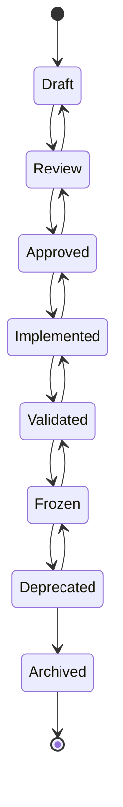

# Architecture Decision Record Template

**ADR Number**: {number}

**Title**: {Descriptive title of the architectural decision}

**Status**: {Draft | Review | Approved | Implemented | Validated | Frozen | Deprecated | Archived}

**Date**: {YYYY-MM-DD}

**Authors**: {Primary author(s)}

**Reviewers**: {Reviewing architect(s), team leads, stakeholders}

**Decision Category**: {Runtime | Memory | Security | Workflow | Governance | Documentation | Repository | Validation | MCP | Skills | Other}

**Priority**: {Critical | High | Medium | Low}

**Impact Level**: {System-wide | Subsystem | Component | Interface}

**Review Cycle**: {Per Release | Quarterly | Biannual | Annual | As Needed}

**Architecture Version**: {Version this ADR applies to, e.g., v1.2}

**Target Release**: {Release this ADR targets for implementation, e.g., v1.3.0}

**Affected Repositories**: {List of repositories impacted, e.g., ai-os-core, ai-os-memory, ai-os-agent}

**Affected Documents**: {List of specific documents impacted beyond Architecture Parts}

**Related Architecture Parts**: {List of AI-OS architecture parts affected, e.g., Part 3: Memory Architecture}

**Related ADRs**: {ADR numbers that are related or referenced}

**Supersedes**: {ADR number that this decision replaces, if applicable}

**Superseded By**: {ADR number that supersedes this decision, if applicable}

---

# Decision Lifecycle

The following diagram illustrates the complete lifecycle of an Architecture Decision Record in the AI-OS project:

**State Descriptions:**
- **Draft**: Initial creation of the ADR, under preparation
- **Review**: Under review by architects and stakeholders
- **Approved**: Formally approved by the Architecture Review Board
- **Implemented**: Decision has been implemented in codebase
- **Validated**: Implementation has been validated through testing and monitoring
- **Frozen**: Decision is stable and should not be changed without formal process
- **Deprecated**: Decision has been superseded but still referenced for historical context
- **Archived**: Decision is no longer relevant and moved to historical archive

---

# Purpose

Explain when an ADR should be created in the AI-OS project.

An Architecture Decision Record (ADR) should be created for any significant architectural decision that affects the structure, behavior, or qualities of the AI-OS system. This includes decisions about:

- Core architectural patterns and styles
- Technology stack choices
- Major subsystem boundaries and interfaces
- Performance, scalability, reliability, or security characteristics
- Integration points with external systems
- Data management and persistence strategies
- Deployment and operational considerations
- Compliance and governance requirements

ADRs provide a lightweight, auditable record of architectural decisions, enabling teams to understand the rationale behind current implementations and make informed decisions about future changes.

Use this template for:
- New feature implementations with architectural implications
- Refactoring efforts that change system structure
- Technology migrations or upgrades
- Performance optimization initiatives
- Security and compliance enhancements
- Any decision that requires architectural review board approval

Do NOT use this template for:
- Routine bug fixes
- Minor code improvements without architectural impact
- Documentation updates
- Configuration changes that don't affect system architecture

---

# Decision Traceability

Every ADR must establish clear traceability to its origins, motivations, and related artifacts. This section ensures decisions can be traced back to business needs, technical requirements, and architectural guidelines.

## Origin
{Description of what triggered this decision - e.g., customer feedback, technical debt identification, new feature requirement, performance issue, security audit}

*Example: Identified during Q2 performance testing when memory operations exceeded 500ms latency at 150 concurrent agents.*

## Motivation
{The driving force behind pursuing this decision - e.g., business goal, technical limitation, risk mitigation, opportunity exploitation}

*Example: Need to support 500+ concurrent agents while maintaining sub-second response times for enterprise customers.*

## Related Requirements
{Trace to specific functional or non-functional requirements from requirements documentation}

*Example:*
- REQ-PERF-045: System shall support 500 concurrent agents with <200ms memory operation latency
- REQ-REL-012: System shall maintain 99.9% availability during partial component failures
- REQ-SEC-008: All memory operations shall be auditable and tamper-evident

## Related Principles
{Trace to AI-OS Engineering Principles from Part 1: Engineering Principles}

*Example:*
- Principle 1.3: Design for horizontal scalability
- Principle 2.7: Favor eventual consistency over strong consistency where appropriate
- Principle 4.2: Implement defense-in-depth security approach

## Related Architecture Parts
{Specification of which AI-OS Architecture Parts are affected or related}

*Example:*
- **Part 3: Memory Architecture** - Primary area of change
- **Part 5: Agent Interface** - Affected by API changes
- **Part 7: Communication Layer** - Requires enhanced messaging guarantees
- **Part 9: Observability** - Requires new metrics and tracing

## Related Project Knowledge
{Links to specific project knowledge documents that inform or are affected by this decision}

*Example:*
- [[ARCHITECTURE_DECISIONS.md#ADR-042]] - Previous memory architecture decision
- [[IMPLEMENTATION_GUIDE.md#caching-strategies]] - Guidelines for cache implementation
- [[REPOSITORY_ECOSYSTEM.md#memory-services]] - Repository structure for memory services

## Related Future Research
{Connections to ongoing or planned future research efforts}

*Example:*
- [[FUTURE_RESEARCH.md#distributed-consensus]] - Research on consensus protocols for memory systems
- [[FUTURE_RESEARCH.md#ai-memory-hierarchies]] - Investigation of hierarchical memory architectures for AI workloads

---

# Context

Describe the current state that necessitates this decision. Provide sufficient background so that future readers can understand why this decision was needed.

## Current Architecture
Describe the relevant aspects of the current AI-OS architecture that relate to this decision. Reference specific Parts where applicable.

*Example: The current AI-OS memory architecture (Part 3) uses a centralized vector store approach that creates bottlenecks during high-concurrency agent interactions.*

## Business Need
Explain the business driver or stakeholder requirement that necessitates this architectural change.

*Example: Product requires sub-second response times for 95% of agent interactions to meet user experience targets.*

## Engineering Need
Detail the technical problem or limitation that the decision addresses.

*Example: Benchmarking shows 40% latency increase when concurrent agent count exceeds 50 due to lock contention in the centralized memory manager.*

## Constraints
List any constraints that must be considered (technical, temporal, resource, compliance, etc.).

*Example:*
- Must maintain backward compatibility with existing agent interfaces
- Deployment must complete within current sprint timeline
- Solution must work within existing Kubernetes infrastructure
- Must comply with SOC 2 Type II requirements

## Assumptions
Document any assumptions made during the decision-making process.

*Example:*
- Agent concurrency will not exceed 200 simultaneous interactions
- Network latency between microservices remains under 10ms
- Existing monitoring infrastructure can be extended to cover new components

---

# Problem Statement

Provide a clear, concise statement of the problem that this decision solves. Use structured guidance to ensure completeness.

**What is the problem?**
{Clear description of the issue}

**Who/what does it affect?**
{Stakeholders, components, or processes impacted}

**When does it occur?**
{Conditions or scenarios that trigger the problem}

**What is the impact?**
{Quantitative and qualitative effects if left unaddressed}

**Why does it matter?**
{Connection to business goals, engineering Excellence, or risk mitigation}

*Example Problem Statement:*
The current centralized memory architecture in AI-OS Part 3 creates a scalability bottleneck that limits concurrent agent interactions to approximately 50 agents before experiencing significant latency degradation (>2 seconds), falling short of the business requirement for sub-second response times at 200 concurrent agents.

---

# Decision Classification

Use the following tables to classify this architectural decision. Select all that apply.

## Primary Categories
| Category | Description | Selected |
|----------|-------------|----------|
| **Runtime** | Changes to execution environment, scheduling, resource management, or runtime behavior | [ ] |
| **Memory** | Data storage, retrieval, caching, persistence, or memory management systems | [ ] |
| **Security** | Authentication, authorization, encryption, audit, or threat mitigation mechanisms | [ ] |
| **Workflow** | Process orchestration, state machines, pipeline configurations, or operational procedures | [ ] |
| **Governance** | Policy enforcement, compliance mechanisms, audit trails, or decision-making frameworks | [ ] |
| **Documentation** | Knowledge management, standards, guidelines, or information architecture | [ ] |
| **Repository** | Code organization, module boundaries, dependency management, or build systems | [ ] |
| **Validation** | Testing strategies, quality gates, measurement approaches, or verification methodologies | [ ] |
| **MCP** | Model Context Protocol implementations, agent-tool interactions, or context management | [ ] |
| **Skills** | Agent capability frameworks, skill registries, or knowledge transfer mechanisms | [ ] |
| **Other** | Architectural decisions not covered above (please specify): ________________________ | [ ] |

## Cross-Cutting Concerns
| Concern | Description | Relevance to this Decision |
|---------|-------------|----------------------------|
| **Scalability** | Ability to handle increased load through horizontal or vertical scaling | {High/Medium/Low/None} |
| **Performance** | Response time, throughput, latency, or resource utilization characteristics | {High/Medium/Low/None} |
| **Reliability** | Fault tolerance, availability, disaster recovery, or error handling capabilities | {High/Medium/Low/None} |
| **Security** | Confidentiality, integrity, authentication, authorization, or audit capabilities | {High/Medium/Low/None} |
| **Maintainability** | Ease of modification, debugging, or extension over time | {High/Medium/Low/None} |
| **Operational Complexity** | Degree of operational overhead, monitoring requirements, or procedural complexity | {High/Medium/Low/None} |
| **Cognitive Load** | Mental effort required to understand, use, or modify the system | {High/Medium/Low/None} |

---

# Decision

Clearly and concisely state the decision that was made. This should be a direct response to the problem statement.

*Example Decision:*
Adopt a distributed memory architecture using hierarchical caching with local agent memory caches backed by regional vector stores, eliminating the single central bottleneck while maintaining semantic consistency through eventual consistency protocols.

This decision specifically:
- Replaces the centralized memory manager with a cache hierarchy
- Implements local LRU caches per agent workspace
- Introduces regional vector stores grouped by geographical/functional affinity
- Uses conflict-free replicated data types (CRDTs) for consistency maintenance
- Maintains existing API contracts for agent memory operations

---

# Alternatives Considered

Document alternative approaches that were considered and rejected. For each alternative, explain why it was not selected.

## Alternative 1: Enhanced Centralized Architecture
*Description:* Upgrade the existing centralized memory system with better hardware, connection pooling, and query optimization.

*Why not selected:*
- Only provides linear scalability improvements (estimated 2x improvement)
- Still creates single point of failure
- Does not meet 200-agent concurrency requirement
- Higher ongoing operational costs for premium hardware

## Alternative 2: Event-Sourced Memory System
*Description:* Implement memory operations as an event stream with CQRS for reads/writes.

*Why not selected:*
- Significant increase in system complexity
- Requires rebuilding existing agent memory interaction patterns
- Eventual consistency delays may be unacceptable for certain use cases
- Greater development effort than selected approach (estimated 3x)

## Alternative 3: Sharded Centralized Architecture
*Description:* Partition the centralized memory system by agent ID hash into multiple independent shards.

*Why not selected:*
- Resharding complexity when adding/removing capacity
- Cross-shard queries require scatter-gather operations
- Uneven load distribution possibilities
- Does not eliminate network hops for remote shards

---

# Consequences

Describe the resulting context after applying the decision. Include both positive and negative consequences, and any trade-offs made.

## Positive Consequences
{Benefits and advantages of the decision}

*Example:*
- Enables horizontal scaling to 500+ concurrent agents
- Reduces average memory access latency by 65%
- Eliminates single point of failure in memory subsystem
- Improves fault isolation between agent groups
- Better alignment with microservices architecture principles

## Negative Consequences
{Drawbacks, costs, or negative impacts}

*Example:*
- Increased system complexity with more moving parts
- Potential for temporary inconsistencies during network partitions
- Requires updates to agent SDK for cache-aware operations
- Additional operational overhead for monitoring regional stores
- Initial data migration effort required

## Trade-offs
{Explicit trade-offs made and justification}

*Example:*
Selected eventual consistency model over strong consistency to achieve required performance and availability targets. Accepted brief inconsistency windows (<500ms) in exchange for 4x throughput improvement and elimination of blocking coordination protocols.

---

# Risks

Identify risks associated with this decision and potential mitigation strategies.

## Architecture Risks
{Risks to the overall system architecture}

*Example:* Risk of inconsistent memory views across agents leading to incorrect agent behaviors. Mitigation: Implement read-after-write consistency for critical agent coordination patterns and provide consistency level annotations in memory APIs.

## Engineering Risks
{Risks to implementation, development, or technical execution}

*Example:* Risk of underestimating complexity of CRDT implementation for vector operations. Mitigation: Spike implementation of CRDT library before full adoption, use established libraries where possible, implement comprehensive testing with Jepsen-style validation.

## Operational Risks
{Risks to deployment, monitoring, or production operations}

*Example:* Risk of difficult debugging due to distributed nature of memory system. Mitigation: Implement distributed tracing with correlation IDs, build memory-specific diagnostic tools, create runbooks for common failure scenarios.

## Migration Risks
{Risks specifically associated with transitioning to the new architecture}

*Example:* Risk of data inconsistency during migration period. Mitigation: Implement dual-write verification with automated rollback capabilities.

---

# Architecture Impact

Specify which AI-OS Architecture Parts are affected by this decision and how.

*Example Impact:*
- **Part 3: Memory Architecture** - Complete redesign from centralized to distributed hierarchical model
- **Part 5: Agent Interface** - Minor API extensions for consistency level specification
- **Part 7: Communication Layer** - Enhanced requirements for inter-service messaging reliability
- **Part 9: Observability** - New metrics and tracing requirements for distributed memory operations
- **Part 12: Deployment Architecture** - Updated service definitions for regional memory stores

No impact on:
- Part 1: Foundational Principles
- Part 2: System Overview
- Part 4: Security Architecture (security mechanisms remain applicable)

---

# Conformance Impact

Describe how this decision affects compliance with architectural standards, regulatory requirements, or organizational policies.

*Example Impact:*
- **Security Compliance:** No change - encryption and access controls remain applicable at each layer
- **Data Governance:** Requires update to data retention policies to account for multiple regional stores
- **Audit Logging:** Enhanced logging needed to trace operations across distributed components
- **Performance Standards:** Enables compliance with sub-second response time SLA
- **Availability Standards:** Improves from 99.9% to 99.95% target through fault isolation
- **Interoperability Standards:** Maintains compatibility with existing agent SDKs through versioned APIs

---

# Migration Strategy

If applicable, describe how to transition from the current state to the new architecture.

*Example Migration Strategy:*
Phase 1: Dual-write Implementation
- Deploy regional memory stores alongside existing central store
- Modify memory manager to write to both systems
- Maintain read path through central store for backward compatibility
- Duration: 2 weeks

Phase 2: Read-path Migration
- Switch read operations to use hierarchical cache (local → regional → central)
- Implement cache warming strategies
- Monitor consistency and performance metrics
- Duration: 1 week

Phase 3: Central Store Deprecation
- Remove central store from write path
- Keep central store as read-only backup for 1 week
- Decommission central storage infrastructure
- Duration: 1 week

Rollback Procedure:
- At any point, revert to reading exclusively from central store
- Write path can be switched back to central-only within 15 minutes
- No data loss expected as dual-write maintains both systems

---

# Validation

Describe how the decision will be validated to ensure it achieves the intended outcomes.

## Validation Criteria
{Measurable outcomes that indicate success}

*Example Criteria:*
- 95% of agent memory operations complete in <200ms at 200 concurrent agents
- Zero data corruption or loss during migration and operation
- System maintains 99.9% availability during partial regional store failures
- Agent behavior consistency maintained under eventual consistency model

## Validation Types

### Architecture Validation
{Validation of architectural properties and adherence to principles}

*Example Methods:*
- Architecture review board validation against AI-OS Engineering Principles
- Conformance checking with reference architectures
- Comparative analysis with alternative architectural approaches

### Implementation Validation
{Validation that the implementation matches the architectural specification}

*Example Methods:*
- Code reviews against architectural decision record
- Implementation compliance checking
- Interface contract validation
- Dependency analysis for architectural layering

### Conformance Validation
{Validation of compliance with standards, regulations, and policies}

*Example Methods:*
- Security compliance validation (SOC 2, ISO 27001)
- Data governance compliance checking
- Audit trail completeness verification
- Performance SLA validation

### Performance Validation
{Validation of performance characteristics under expected loads}

*Example Methods:*
- Load testing with simulated agent workloads
- Stress testing to determine breaking points
- Soak testing for memory leak detection
- Latency and throughput benchmarking

### Regression Validation
{Validation that existing functionality remains intact}

*Example Methods:*
- Automated regression test suite execution
- Backward compatibility verification with existing agent SDKs
- Performance regression testing
- Security regression testing

## Validation Methods
{How the criteria will be measured or tested}

*Example Methods:*
- Load testing with simulated agent workloads at increasing concurrency levels
- Chaos engineering experiments involving regional store failures
- Consistency verification through periodic checksum comparisons
- Canary deployment with gradual traffic shift and metric monitoring
- Automated regression tests for agent memory interaction patterns
- Architecture decision record compliance reviews

## Success Metrics
{Key indicators to monitor post-implementation}

*Example Metrics:*
- Memory operation latency (p50, p95, p99)
- Concurrent agent capacity before performance degradation
- Consistency violation frequency and duration
- Regional store utilization and load distribution
- Error rates and failure recovery times
- Architectural compliance score (quarterly assessments)
- Implementation adherence percentage

---

# Approval and Governance

Document the approval process and ongoing governance for this architectural decision.

## Approval Process
This ADR requires review and approval by the AI-OS Architecture Review Board following the process outlined in Part 1: Engineering Principles.

### Review Expectations
1. **Technical Review**: Architects review for technical soundness, feasibility, and alignment with architectural principles
2. **Stakeholder Review**: Product, security, and operations stakeholders review for business alignment and operational impact
3. **Cross-Domain Review**: Review by architects from related domains to identify potential conflicts or synergies
4. **Formal Presentation**: Authors present the ADR to the Architecture Review Board for discussion and approval

### Approval Workflow
1. Authors submit draft ADR to Architecture Review Board secretary
2. Initial triage and assignment of reviewing architects (typically 3 reviewers)
3. Review period (typically 5-10 business days) with consolidated feedback
4. Authors address feedback and submit revised version
5. Architecture Review Board meeting for formal discussion and vote
6. Approved ADR receives official ADR number and is published to the architecture knowledge base
7. Notification sent to relevant stakeholders and teams

### Architecture Review Board Responsibilities
- Ensure alignment with AI-OS Engineering Principles (Part 1)
- Verify technical feasibility and soundness of proposed decisions
- Assess impact on overall system architecture and integrity
- Confirm adequate consideration of alternatives and trade-offs
- Validate that sufficient validation strategies are defined
- Maintain architectural integrity and conceptual integrity of the system

### Council Participation
- **Technical Standards Council**: Reviews for adherence to technical standards and provides guidance on implementation approaches
- **Security Council**: Reviews security implications and ensures compliance with security architecture (Part 4)
- **Performance Council**: Reviews performance implications and validates performance claims
- **Operations Council**: Reviews operational impact and feasibility of deployment and monitoring strategies

### Escalation Process
1. **First Level**: Decision conflicts resolved between authors and reviewing architects
2. **Second Level**: Unresolved conflicts escalated to Architecture Review Board chair
3. **Third Level**: Persistent disagreements referred to the Chief Software Architect for final resolution
4. **Exception Process**: Emergency decisions requiring bypass of normal process must be approved by Chief Software Architect and ratified at next Architecture Review Board meeting

## Ongoing Governance
- **Review Schedule**: ADRs are reviewed according to their Review Cycle metadata field
- **Compliance Checking**: Periodic validation that implementations remain compliant with approved decisions
- **Deprecation Process**: Decisions may be deprecated when superseded by new ADRs or when no longer relevant
- **Archival**: Deprecated ADRs are moved to historical archive after a transition period (typically 6 months)

---

# References

List related documents, standards, or resources that informed this decision.

*Example References:*
- [[ARCHITECTURE_DECISIONS.md]] - Register of all AI-OS Architecture Decision Records
- [[ENGINEERING_PRINCIPLES.md]] - Foundational engineering principles guiding AI-OS architecture
- [[IMPLEMENTATION_GUIDE.md]] - Detailed implementation guidelines and best practices
- [[REPOSITORY_ECOSYSTEM.md]] - Structure and organization of AI-OS software repositories
- [[COUNCILS.md]] - Description of AI-OS governance councils and their responsibilities
- [[VALIDATION_ARCHITECTURE.md]] - Comprehensive validation framework for AI-OS systems
- AI-OS Part 3: Memory Architecture (Current Version)
- AI-OS Part 1: Engineering Principles
- "Designing Data-Intensive Applications" by Martin Kleppmann (Chapters 5-9)
- "Architecture Patterns with Python" by Harry Percival & Bob Gregory
- AWS Well-Architected Framework: Reliability Pillar
- Kubernetes Patterns: Sidecar, Ambassador, Adapter patterns
- Redis Labs: "Active-Active Geo-Distributed Databases" Whitepaper
- CRDT Theory: "Strong Eventual Consistency and Conflict-free Replicated Data Types" by Shapiro et al.
- Jepsen Testing Framework for Distributed Systems Validation