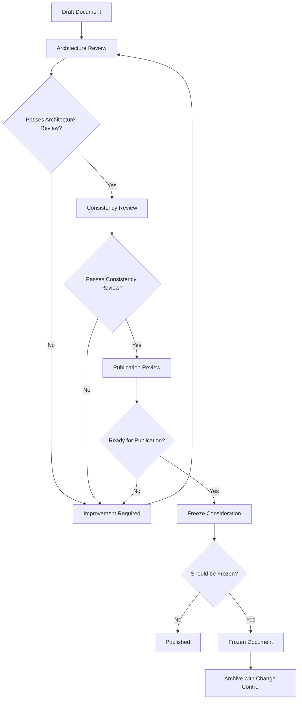

# Review Template

## Review Metadata

- **Document**: [Document Name or Path]
- **Reviewer**: [Reviewer Name]
- **Date**: [Review Date (YYYY-MM-DD)]
- **Version**: [Document Version]
- **Review Type**: [Architecture Part / Project Knowledge / Template / Diagram / Research / ADR]

## Review Summary

[Provide a brief executive summary of the review, including overall assessment and key findings.]

---
# Review Workflow

The following diagram illustrates the standard review workflow for AI-OS architecture documents:

**Workflow Stages:**
- **Draft Document**: Initial version ready for review
- **Architecture Review**: Focus on architectural correctness, decisions, and principles
- **Consistency Review**: Focus on cross-part consistency, terminology, and references
- **Publication Review**: Focus on readability, completeness, and readiness for distribution
- **Freeze Consideration**: Decision on whether to freeze the document for stability
- **Published**: Document released for consumption
- **Frozen Document**: Document locked from changes without formal process
- **Archive with Change Control**: Long-term storage with formal change procedures

---
## Review Criteria

### Architecture Accuracy
- [ ] Does the document accurately reflect the intended architecture?
- [ ] Are architectural decisions clearly explained and justified?
- [ ] Are boundary conditions and assumptions documented?
- [ ] Are trade-offs analyzed and documented?

### Technical Accuracy
- [ ] Are technical details correct and up-to-date?
- [ ] Are code snippets, configurations, and examples accurate?
- [ ] Are dependencies and versions correctly specified?
- [ ] Are performance characteristics and limitations described correctly?

### Consistency
- [ ] Is the document consistent with other Architecture Parts?
- [ ] Is terminology used consistently throughout the document?
- [ ] Are formatting, numbering, and styling consistent?
- [ ] Are cross-references to other documents accurate and functional?

### Terminology
- [ ] Are terms defined clearly and consistently?
- [ ] Is domain-specific terminology used appropriately?
- [ ] Are acronyms expanded on first use?
- [ ] Is language unambiguous and precise?

### Ownership
- [ ] Is the document owner clearly identified?
- [ ] Are responsibilities for maintenance and updates defined?
- [ ] Are review cycles and update frequencies specified?
- [ ] Is contact information for the owner provided?

### Cross References
- [ ] Are references to other Architecture Parts, Project Knowledge, or external documents accurate?
- [ ] Are links functional and point to the correct versions?
- [ ] Are backward and forward references clear?
- [ ] Are dependencies between documents documented?

### Architecture Ownership
- [ ] Are architecture boundaries clearly defined and owned?
- [ ] Is there clear ownership of architectural decisions and responsibilities?
- [ ] Are there no instances of duplicate ownership or conflicting responsibilities?
- [ ] Are RACI matrices or ownership models clearly documented where applicable?

### Boundary Definition
- [ ] Are architectural boundaries clearly defined and documented?
- [ ] Are subsystem interfaces and contracts well-defined?
- [ ] Are boundary conditions and assumptions explicitly stated?
- [ ] Are there clear demarcations between different architectural concerns?

### Cross-Part Consistency
- [ ] Is the document consistent with related Architecture Parts?
- [ ] Are interfaces and contracts between parts aligned?
- [ ] Are shared concepts and terminology used consistently across parts?
- [ ] Are dependencies and relationships between parts accurately represented?

### Architecture Conformance
- [ ] Does the document conform to AI-OS Engineering Principles?
- [ ] Are architectural patterns and styles used appropriately?
- [ ] Are decisions aligned with established architectural guidelines?
- [ ] Are exceptions to standards properly justified and documented?

### Reference Runtime Alignment
- [ ] Are references to runtime behaviors accurate and appropriate?
- [ ] Are performance characteristics described in relation to runtime expectations?
- [ ] Are scaling characteristics aligned with runtime capabilities?
- [ ] Are failure modes and recovery mechanisms runtime-appropriate?

### Reference Implementation Alignment
- [ ] Are references to implementation details accurate and feasible?
- [ ] Are architectural abstractions implementable within constraints?
- [ ] Are interface definitions practical for implementation teams?
- [ ] Are performance targets achievable with proposed technologies?

### Architecture Evolution Compatibility
- [ ] Does the architecture support planned evolution and extensions?
- [ ] Are extension points and versioning strategies documented?
- [ ] Are deprecated elements clearly marked with migration paths?
- [ ] Is the design flexible enough to accommodate future requirements?

### Diagram Quality
- [ ] Are diagrams clear, legible, and appropriately detailed?
- [ ] Do diagrams use consistent notation and symbols?
- [ ] Are diagrams labeled and captioned effectively?
- [ ] Do diagrams add value beyond the text description?

### Mermaid Standards
- [ ] Do Mermaid diagrams follow project-specific syntax guidelines?
- [ ] Are diagram directions (left-to-right, top-to-bottom) consistent?
- [ ] Are node shapes and edge styles used semantically?
- [ ] Are diagrams free of syntax errors and render correctly?

### RFC 2119 Usage
- [ ] Are keywords like "MUST", "SHOULD", "MAY" used correctly per RFC 2119?
- [ ] Are requirements clearly distinguished from recommendations?
- [ ] Is the use of these keywords consistent throughout the document?
- [ ] Are exceptions and conditions clearly specified?

### Technology Neutrality
- [ ] Does the document avoid prescribing specific technologies unless necessary?
- [ ] Are architectural decisions based on principles rather than specific products?
- [ ] Are alternatives considered and documented?
- [ ] Is the document adaptable to different technology stacks?

### Runtime Independence
- [ ] Is the document independent of specific runtime environments?
- [ ] Are environment-specific considerations clearly separated?
- [ ] Are deployment and operational concerns addressed appropriately?
- [ ] Can the architecture be implemented in different runtime environments?

### Implementation Independence
- [ ] Does the document avoid implementation-specific details unless necessary?
- [ ] Are interfaces and contracts clearly separated from implementations?
- [ ] Are abstraction layers and boundaries well-defined?
- [ ] Can multiple implementations conform to the same architectural description?

### Completeness
- [ ] Are all required sections present and adequately filled?
- [ ] Are edge cases and error conditions considered?
- [ ] Are open questions and future work clearly identified?
- [ ] Is the document self-sufficient for its intended audience?

### Readability
- [ ] Is the document well-organized and logically structured?
- [ ] Is the writing clear, concise, and free of jargon?
- [ ] Are complex concepts explained with examples or analogies?
- [ ] Is the document accessible to the intended audience?

### Maintainability
- [ ] Is the document structured to facilitate updates?
- [ ] Are version control and change history practices followed?
- [ ] Are obsolete sections clearly marked or removed?
- [ ] Is the document length appropriate for its scope?

### Publication Readiness
- [ ] Is the document free of spelling, grammar, and formatting errors?
- [ ] Are all placeholders (e.g., [TODO], [TBD]) resolved?
- [ ] Are headers, footers, and page numbers correct (if applicable)?
- [ ] Is the document ready for distribution to stakeholders?

## Review Score

[Provide an overall weighted score based on the review criteria below. Each criterion contributes to the final score as indicated.]

### Weighted Scoring Categories

| Criterion | Weight | Description |
|----------|--------|-------------|
| Architecture Accuracy | 25% | Correctness of architectural decisions, boundary definitions, and trade-off analysis |
| Consistency | 20% | Consistency with other Architecture Parts, terminology, formatting, and cross-references |
| Conformance | 20% | Alignment with AI-OS Engineering Principles, architectural patterns, and reference implementations |
| Documentation Quality | 15% | Completeness, readability, structure, and accessibility for intended audience |
| Diagrams | 10% | Quality, clarity, correctness, and adherence to Mermaid standards |
| Terminology | 10% | Precision, consistency, and appropriate use of domain-specific language |

### Scoring Calculation
1. Score each criterion on a scale of 1-5 (1=Poor, 2=Fair, 3=Good, 4=Very Good, 5=Excellent)
2. Multiply each score by its weight percentage
3. Sum the weighted scores to get the final architecture review score (1-5 scale)
4. Convert to percentage: (Final Score / 5) × 100

### Score Interpretation
- **4.5-5.0 (90-100%)**: Excellent - Publication ready with minor observations only
- **3.5-4.4 (70-89%)**: Good - Address recommendations before publication
- **2.5-3.4 (50-69%)**: Adequate - Significant revision required
- **1.5-2.4 (30-49%)**: Poor - Major rework needed
- **Below 1.5 (<30%)**: Unacceptable - Fundamental redesign required

[Provide the final calculated score and interpretation here.]

## Findings

### Critical Issues
[Issues that must be resolved before the document can be considered approved. Examples: factual inaccuracies, missing critical sections, logical inconsistencies, violations of core architectural principles.]

1. 
2. 

### Major Issues
[Important issues that should be resolved but do not block approval if mitigations are in place. Examples: unclear sections, inconsistent terminology, minor inaccuracies, deviations from established patterns that don't compromise core functionality.]

1. 
2. 

### Moderate Issues
[Issues that warrant attention but don't significantly impact correctness or usability. Examples: opportunities for improvement, minor inconsistencies, areas where documentation could be enhanced.]

1. 
2. 

### Minor Issues
[Small issues that improve quality but do not affect correctness. Examples: typos, formatting inconsistencies, minor wording improvements, style guide violations.]

1. 
2. 

### Observations
[Neutral observations about the document that don't require action but may be informative for future work or context.]

1. 
2. 

## Recommendations
[Specific, actionable recommendations for improving the document, prioritized by impact.]

### Critical Recommendations
[Must be implemented before approval]

1. 
2. 

### Major Recommendations
[Should be implemented before publication]

1. 
2. 

### Moderate Recommendations
[Worth implementing for quality improvement]

1. 
2. 

### Minor Recommendations
[Nice-to-have improvements]

1. 
2. 

## Future Improvements
[Ideas for enhancement that could be considered in future versions or related work.]

1. 
2. 
3. 
4. 

## Approval Workflow

Document approval responsibilities for AI-OS architecture documents:

### Principal Software Architect
- Provides final architectural review and approval
- Ensures alignment with overall AI-OS vision and principles
- Has veto power on architectural decisions that conflict with core tenets
- Responsible for maintaining architectural integrity across the system

### Architecture Review Board (ARB)
- Conducts formal review of architectural decisions
- Evaluates conformance to AI-OS Engineering Principles
- Assesses impact on related Architecture Parts and Project Knowledge
- Requires quorum of senior architects for binding decisions
- Documents review outcomes and conditions for approval

### Relevant Council
- Technical Standards Council: Reviews for technical standards compliance
- Security Council: Reviews for security implications and compliance
- Performance Council: Reviews for performance characteristics and benchmarks
- Provides specialized review based on council domain expertise
- Recommendations must be addressed before final approval

### Documentation Review
- Ensures clarity, completeness, and accessibility of the document
- Verifies adherence to documentation standards and style guides
- Checks for proper formatting, terminology consistency, and readability
- Provs feedback on structure and presentation

### Final Approval
- Consolidates feedback from all review entities
- Documents any conditions or required improvements
- Issues formal approval status with version number
- Maintains approval audit trail for compliance purposes

---
## Approval Status
- [ ] Approved as-is
- [ ] Approved with minor revisions
- [ ] Requires major revisions and re-review
- [ ] Not approved - requires complete rewrite

## Re-review Required
- [ ] Yes - Specify date or version for re-review: ___________________
- [ ] No

## Freeze Approved
- [ ] Yes - Document is frozen and should not be changed without formal change control process
- [ ] No

## Publication Checklist
[ ] Document version updated
[ ] Change history recorded
[ ] All review comments addressed
[ ] Document spell-checked and grammar-checked
[ ] Links and references verified
[ ] Diagrams validated and rendered correctly
[ ] Mermaid syntax validated
[ ] RFC 2119 keywords used correctly
[ ] Technology neutrality verified
[ ] Runtime independence validated
[ ] Implementation independence validated
[ ] Architecture ownership validated
[ ] Cross-reference validation completed
[ ] Boundary definitions verified
[ ] Terminology consistency checked
[ ] Conformance to AI-OS Engineering Principles verified
[ ] Document formatted according to project standards
[ ] Ready for distribution to stakeholders
[ ] Publication approval obtained

## Freeze Checklist
[ ] Formal change control process established
[ ] Change request procedure documented
[ ] Versioning strategy defined
[ ] Review schedule for frozen document established
[ ] Stakeholders notified of freeze status
[ ] Archive location specified
[ ] Backup procedure established
[ ] Freeze date recorded: ___________________
[ ] Freeze approved by: ___________________
[ ] Architecture Review Board approval obtained
[ ] Relevant Council notifications sent
[ ] Impact analysis completed for dependent documents
[ ] Migration plan created for any breaking changes
[ ] Deprecation timeline established if applicable

---
*This review template is licensed under the project's documentation license.*